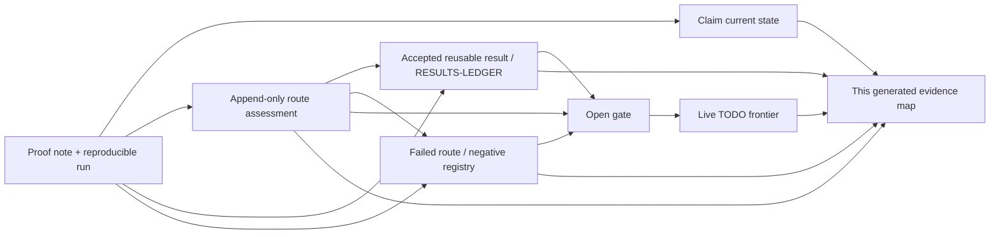
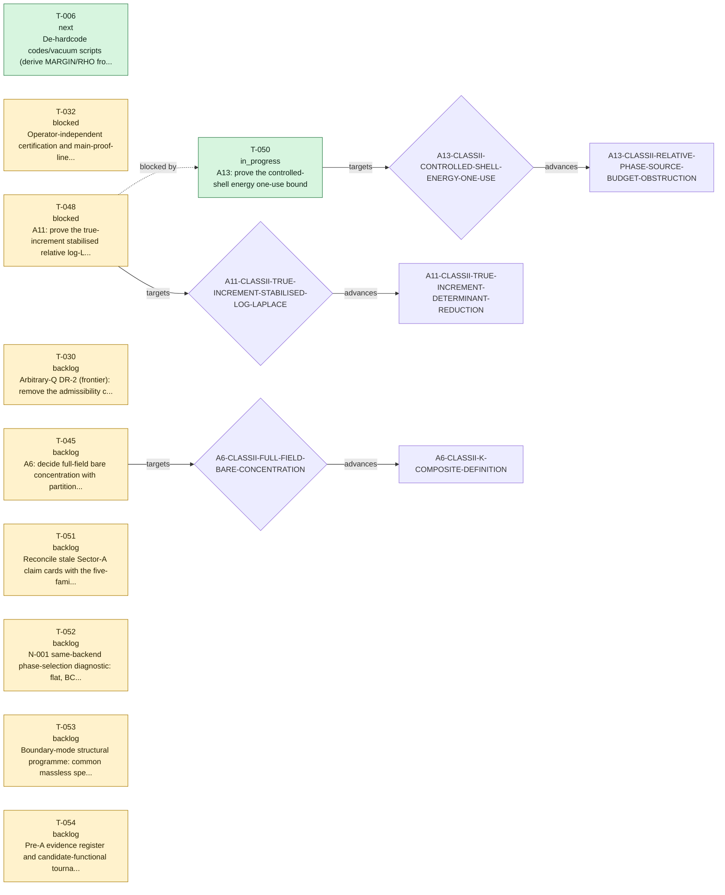

# TECT proof evidence map

> GENERATED by `verification/scripts/build_proof_evidence_map.py` - do not hand-edit. 
> This is a complete-by-reference navigation and audit surface, not a new proof or tier authority.

Use this page to see what succeeded, what failed and why, what remains open,
and where each assertion can be reproduced. The linked claim card, proof note/run,
result ledger, exploration record, negative-result entry, gate definition, task ledger, or changelog entry
always remains authoritative.

## One-glance record flow



## Repository proof snapshot

| Record class | Count | Meaning |
|---|---:|---|
| Status cards | 49 | 48 active; 1 refuted |
| Reusable result records | 147 | Curated theorems, reductions, partial advances, and no-go lemmas with proof anchors |
| Negative/audit records | 219 indexed + 3 legacy process lessons | No-go, falsifier, retraction, and process-audit trust assets with evidence and consequence |
| Proof explorations | 624 | Route decisions: advanced 351, failed 199, inconclusive 56, parked 18; non-tier-bearing |
| Accepted chronological events | 469 | Complete history is preserved in the JSON map and `CHANGELOG.md` |
| Tasks | 54 | 10 live; 44 completed |
| Current route gates | 18 | 18 claim-card gates plus live-task child targets, deduplicated |
| Proof evidence inventory | 376 lineage notes / 357 sibling PDFs / 9 legacy unordered root notes / 9 paired root PDFs / 473 run JSON files / 105 claim-level manifests / 40 bundle manifests / 45 frozen embedded manifests | Complete paths and disjoint manifest classes are stored per claim in the machine map; 19 historical/superseded lineage-note paths lack a sibling PDF and 118 grandfathered evidence notes have incomplete standard footers, all kept visible |

## Coverage diagnostics

These are visible migration or metadata debts, not silently dropped records.

| Diagnostic | Count | Management rule |
|---|---:|---|
| Claims without generated `INDEX.md` | 24 | Evidence-map and sector-dossier links fall back to `claim.md`; `LINEAGE.md` remains available |
| Historical/superseded notes without sibling PDF | 19 | Paths remain in machine inventory; current-note PDF enforcement is unchanged |
| Grandfathered notes with incomplete standard footer | 118 | Kept visible; notes first issued on/after 2026-07-24 fail the map gate if any mandatory footer label is absent |
| Claim cards listing a gate whose registered status begins `CLOSED` | 2 | Exposed as reconciliation debt; the map does not silently flip claim cards |
| Claim-unbound reusable results / negative records | 33 / 1 | Ambiguous family references stay unbound; no claim edge is invented |
| Completed-task references to retired gate identifiers | 5 | Preserved as `historical_gate_reference` nodes anchored to `todo/todo.json`, never mislinked to the current gate registry |
| Changelog tokens that are not current claim-card IDs | 111 | Preserved in event metadata but never promoted to claim edges; many are historical proof-unit IDs from the legacy extractor |
| Changelog negative tags absent from the indexed registry | 3 | Preserved as historical event text, rendered without a false registry anchor, and excluded from negative graph edges |
| Historical exploration backfill | 13 | Directly recovered from cited tracked evidence; pre-2026-07-24 chat-only deliberation is explicitly not claimed complete |

## Current proof-route roadmap



| Task | State | Claim | Target gate | Core next action / reason |
|---|---|---|---|---|
| **T-050** A13: prove the controlled-shell energy one-use bound | in_progress | [A13-CLASSII-RELATIVE-PHASE-SOURCE-BUDGET-OBSTRUCTION](../claims/A13-CLASSII-RELATIVE-PHASE-SOURCE-BUDGET-OBSTRUCTION/claim.md) | [A13-CLASSII-CONTROLLED-SHELL-ENERGY-ONE-USE](../claims/GATES.md#a13-classii-controlled-shell-energy-one-use) | R-147 gives the actual fixed-cutoff signed terminal feature an exact canonical common-terminal Doob telescope, conditional recursion, continuous bracket representation, and reveal-grid compression. It does not transfer the registered owners automatically: the production route still needs the one-step tower, full incidence, and predictable trace-bracket match. The retained A1/R-075 P+L pair is uniformly favourable on affine-collinear Gaussian lines with curvature at least 2223/(25000P), but global pair convexity fails in the exact active-spectator direction. Next evaluate that direction in one legal owner-complete two-root chart, retaining shared-probe trace, Doob bracket, adapted R-063 forest, future variance, balanced rows, returned low, and terminal sextic exactly once; test the aggregate against eta<5/11 and zeta<13/50. If it remains adverse, reassess the scalar Class-II action without privileging BCC, uniform, or any phase. T-050, A13, Nelson, phase selection, and Sector A remain open. |
| **T-006** De-hardcode codes/vacuum scripts (derive MARGIN/RHO from source) + add check_code_discipline.py to release_check | next | [B1-RH-ENUM](../claims/B1-RH-ENUM/claim.md) | - | MARGIN de-hardcoded 2026-06-07 (codes/vacuum/sectorb_common.py single source; scscope+robustness import margin_of). REMAINING: RHO consolidation + automated check_code_discipline.py wired into release_check (no-hardcoding + self-test + JSON-artefact scan). |
| **T-032** Operator-independent certification and main-proof-line decision for the canonical N-001 scalar-slice manifest before any T5 package | blocked | [A1-PRODUCTION-KERNEL-MANIFEST](../claims/A1-PRODUCTION-KERNEL-MANIFEST/claim.md) | - | Promotion package reconciled 2026-07-16: v1.6 verifier 14/14 PASS; historical bundles are pre-certification evidence with verified manifests. Required: independent run, ratify eps_Z/eps_m/eps_r plus config and three source hashes, then decide main-line status. No tier action until those decisions. |
| **T-048** A11: prove the true-increment stabilised relative log-Laplace bound | blocked | [A11-CLASSII-TRUE-INCREMENT-DETERMINANT-REDUCTION](../claims/A11-CLASSII-TRUE-INCREMENT-DETERMINANT-REDUCTION/claim.md) | [A11-CLASSII-TRUE-INCREMENT-STABILISED-LOG-LAPLACE](../claims/GATES.md#a11-classii-true-increment-stabilised-log-laplace) | Blocked by T-050. Blocked by T-050 at A13-CLASSII-CONTROLLED-SHELL-ENERGY-ONE-USE. A13 v1.1 proves exact equivalence to the q=10/9 Nelson moment and retires local Bellman, endpoint-only timewise Young, repeated past-energy, and direct one-shot Ramer repairs. Only after a signed global cancellation closes the one-use theorem may the A11 stabilised relative log-Laplace statement be reformulated; no unique successor method is assumed. |
| **T-030** Arbitrary-Q DR-2 (frontier): remove the admissibility cap from Lemma 1's backing; currently T6-conditional on Bourgain-Demeter decoupling. NOT load-bearing for the C_full main theorem (Lemma 2 caps T'<=10 in... | backlog | [B5-BEYOND-LAYER-BOUND](../claims/B5-BEYOND-LAYER-BOUND/claim.md) | - | OPEN FRONTIER (arbitrary-Q DR-2). D2-A 2026-06-12: DR2-SHARE gate formally rescoped here as NON-LOAD-BEARING for the published C_full head (Lemma 2 caps T'<=10 in-class). Content: BD-conditional T6 (separated Q); PSM conjecture T2; elementary route open. |
| **T-045** A6: decide full-field bare concentration with partition-function tube bounds and tightness | backlog | [A6-CLASSII-K-COMPOSITE-DEFINITION](../claims/A6-CLASSII-K-COMPOSITE-DEFINITION/claim.md) | [A6-CLASSII-FULL-FIELD-BARE-CONCENTRATION](../claims/GATES.md#a6-classii-full-field-bare-concentration) |  |
| **T-051** Reconcile stale Sector-A claim cards with the five-family theorem map | backlog | - | - | One substantive claim card per turn. Correct stale next_action/open-gate text in A10, A9, A11, A12, A6, A5, and A4 without changing valid tiers or immutable IDs; regenerate all ledgers after each card. |
| **T-052** N-001 same-backend phase-selection diagnostic: flat, BCC, and unconstrained finite-shell competitors | backlog | - | - | Truth-seeking pre-claim diagnostic, separate from A13/T-050 and retired B3; BCC is one falsifiable candidate, not a required outcome. Use standalone n001_variational_backend.py to reauthenticate the homogeneous stationary point; compare same-backend Delta F for normalized exact-commensurate BCC and other symmetry-distinct finite-shell stars allowed by the kernel; run a shell-seeded finite-grid full-field search; record phases, polarizations, residuals, two-dimensional restricted Hessians, multistart and grid transfer; and assemble the simultaneous BCC 72-real Hessian with every cross block as a benchmark against symmetry-projected and finite-grid full-field Lanczos spectra. EXP-000590--EXP-000592 already record why positive shell softness, the missing energy surface, and six pairwise blocks do not decide the phase. Report flat, BCC, another modulation, or metastability only within the tested cutoff/box/grid scope; if the intended finite-q mechanism fails across preregistered coverage, record evidence for reassessing the PDE, not proof of PDE inadequacy. No candidate is privileged and no single loss proves global nonexistence. |
| **T-053** Boundary-mode structural programme: common massless speed and critical property activation | backlog | [E2-HBAR-ORIGIN](../claims/E2-HBAR-ORIGIN/claim.md) | - | T0 cross-sector research seed. Use strategy/boundary-massless-mode-criticality-seed-260802.md to test whether a preregistered TECT boundary simultaneously yields the correct zero-mode count, a symmetry- or fixed-point-protected common limiting speed, compact phase winding, and critical scaling. Derive the full kinetic tensor and spectra on both sides; determine nu and z; require winding and charge/action scales before identifying hbar or e; freeze inputs before any alpha or mass-ratio comparison. Stop or narrow if equal speeds require separate tuning, regulator removal splits them, z=1 is unstable, topology is absent, or constants are inserted. Bears also on C2, C6, D2, and F1; no theorem or tier action. |
| **T-054** Pre-A evidence register and candidate-functional tournament | backlog | - | - | Implement strategy/pre-a-evidence-first-model-selection-charter-260802.md. Build a primary-source evidence register that separates observables, uncertainties, weak constraints, and candidate interpretations; freeze discovery and holdout sets; register M0/M1 plus at least two structurally distinct candidate manifests; construct the common discriminator matrix; then run T-053 across candidates and treat T-052 only as the M1 phase-selection branch. No equation is privileged, no fitted output is counted as a prediction, and a justified shortlist or non-selection is a valid result. This task is logically prior to physical interpretation of Sector A but does not revoke conditional Sector-A mathematics or automatically replace active T-050. |

## Sector state map

| Sector | Status cards | Lifecycle | Tier profile | Current route gates | Live tasks |
|---|---:|---|---|---:|---|
| [A](sectors/A.md) | 21 | 21 active / 0 refuted | T6x9 T5x7 T4x5 | 10 | T-050, T-032, T-048, T-045 |
| [B](sectors/B.md) | 7 | 6 active / 1 refuted | T7x3 T5x1 T4x1 T1x1 T0x1 | 1 | T-006, T-030 |
| [C](sectors/C.md) | 6 | 6 active / 0 refuted | T6x4 T5x1 T1x1 | 5 | - |
| [D](sectors/D.md) | 6 | 6 active / 0 refuted | T6x2 T5x1 T3x1 T1x2 | 1 | - |
| [E](sectors/E.md) | 6 | 6 active / 0 refuted | T4x1 T2x1 T1x4 | 1 | T-053 |
| [F](sectors/F.md) | 3 | 3 active / 0 refuted | T4x1 T1x2 | 1 | - |

## Current route-gate ownership

This union keeps claim-card umbrella gates and live-task child gates visible together.
Ownership source remains explicit; the map does not rewrite a claim card.

| Gate | Claim owners | Source | Live tasks | Current registered status |
|---|---|---|---|---|
| [A10-CLASSII-MULTISCALE-ACTION-DECOMPOSITION](../claims/GATES.md#a10-classii-multiscale-action-decomposition) | [A10-CLASSII-RELATIVE-COMMUTATOR-REDUCTION](../claims/A10-CLASSII-RELATIVE-COMMUTATOR-REDUCTION/claim.md), [A9-CLASSII-SMART-PATH-CANCELLATION](../claims/A9-CLASSII-SMART-PATH-CANCELLATION/claim.md) | claim card | - | CLOSED@A11-TRUE-INCREMENT-DETERMINANT (2026-07-21). A10 proves exactly `Q_j^fr+C_j=V_j-V_(j-1)+q_(B(phi_(j-1)))(D phi_(j-1))`, hence `sum_j(Q_j^fr+C_j)=V_J+E_J` when `V_0=0`. Since `E_J>=0`, the actual action is the shell expression minus `E_J`; positivity has the wrong direction for a lower bound. `A11-CLASSII-TRUE-INCREMENT-DETERMINANT-REDUCTION` proves that the quantitative upper-form branch is impossible already under the base Gaussian: `E E_J/(L^3 2^J)->kappa_II>0` while entropy vanishes and terminal `L4/L6` moments remain bounded. It then defines `I_j=Q_j^fr-q_(B(phi_(j-1)))(D phi_(j-1))` and proves exactly `I_j+C_j=V_j-V_(j-1)` together with its noncentral conditional determinant. Thus action reconstruction is closed by the true-increment branch, not by past-energy absorption. The determinant's positive source-square is the separate successor gate below. |
| [A10-CLASSII-STABILISED-RELATIVE-LOG-LAPLACE](../claims/GATES.md#a10-classii-stabilised-relative-log-laplace) | [A10-CLASSII-RELATIVE-COMMUTATOR-REDUCTION](../claims/A10-CLASSII-RELATIVE-COMMUTATOR-REDUCTION/claim.md), [A9-CLASSII-SMART-PATH-CANCELLATION](../claims/A9-CLASSII-SMART-PATH-CANCELLATION/claim.md) | claim card | - | OPEN AS A HISTORICAL Q-RELATIVE BRANCH; SUPERSEDED ON THE ACTIVE TRUE-INCREMENT COMPOSITION (2026-07-21). A10 proves the exact finite-cutoff Gibbs-variational equivalence, the necessity of `alpha_c>0`, and the two-antecedent conditional composition theorem. In that theorem `C_fr=C_sh(L)M_R^4 c_sym^-2 beta_B^2 C_LP,4^4 S_dy`, `K_f=(1-theta)^2 C_fr/(4 alpha_f)`, `B_6=gamma/6-epsilon_6-epsilon_d`, and `A_4=[K_theta+K_f+K_d-lambda/4]_+`. If some `p>1` satisfies `p(alpha_f+alpha_c+alpha_d)<1`, closure of both open gates would imply `log E exp(-pS_J)<=p(C_theta+C_d)+4pL^3A_4^3/(27B_6^2)`. The proof-friendly target is `theta=0.90`, `alpha_f=0.05`, `alpha_c=0.80`, `alpha_d=0.04`, `epsilon_6=0.25`, `epsilon_d=0.01`, and `p=1.10`. It gives `p*alpha=0.979` and `B_6=0.01`, but `K_d,C_d` remain symbolic and neither open estimate is proved. No A7 Nelson closure or interacting Gibbs measure is claimed. |
| [A11-CLASSII-ADAPTED-SOURCE-SQUARE-BOUND](../claims/GATES.md#a11-classii-adapted-source-square-bound) | [A11-CLASSII-TRUE-INCREMENT-DETERMINANT-REDUCTION](../claims/A11-CLASSII-TRUE-INCREMENT-DETERMINANT-REDUCTION/claim.md) | claim card | - | OPEN (2026-07-21), ANALYTICALLY REDUCED BUT THE FIRST BUDGET ROUTE REFUTED BY A12. The true-increment determinant is `-0.5 log det_2(I+pT_j)+0.5 p^2<ell_j,(I+pT_j)^(-1)ell_j>` with `ell_j=G_j^*B(phi_(j-1))D phi_(j-1)`. A scalar source family proves that no Hilbert--Schmidt-only estimate can delete this positive term. A9 already controls the summed Hilbert--Schmidt part by a terminal quartic. The present source-square is therefore the first surviving load-bearing analytic gate. A12 proves a cutoff-uniform coarse form with `C_src=(beta_op^2/c_sym) M_R^2 M_6^4 Q_6^2`, where `beta_op=0.0423749999999894` is the sharp production Pauli/Fierz operator constant and `beta_op^2/c_sym=0.016570372383568618`. Exact dyadic boundary modulation now gives `M_6>=8`, `Q_6>=8sqrt(3)`, and `M_6^4 Q_6^2>=786432`, so the separated norm route cannot meet the isolated production target. The same witness refutes the coefficient-blind scalar six-linear envelope. The surviving gate must retain the exact null identity `B(X)JX=0`, the output shell, and preferably the determinant resolvent. |
| [A11-CLASSII-TRUE-INCREMENT-STABILISED-LOG-LAPLACE](../claims/GATES.md#a11-classii-true-increment-stabilised-log-laplace) | [A11-CLASSII-TRUE-INCREMENT-DETERMINANT-REDUCTION](../claims/A11-CLASSII-TRUE-INCREMENT-DETERMINANT-REDUCTION/claim.md) | claim card + live task | T-048 | OPEN, BLOCKED IN PROOF ORDER BY `A11-CLASSII-ADAPTED-SOURCE-SQUARE-BOUND` (2026-07-21). The historical A10 bound for `theta Q_j^fr+C_j` is not the required statement: the two variables differ by the positive past energy whose direct upper form is refuted. After the source theorem, the determinant contribution has conditional budget `-alpha_f H-s^2 C_fr/(4 alpha_f) E\|\|phi\|\|_4^4` `-s^2 C_src/(2 alpha_f) E\|\|phi\|\|_6^6`, `s=1-theta`. All constants and the remaining sextic reserve must be recomputed before any A7 Nelson conclusion. |
| [A13-CLASSII-CONTROLLED-SHELL-ENERGY-ONE-USE](../claims/GATES.md#a13-classii-controlled-shell-energy-one-use) | [A13-CLASSII-RELATIVE-PHASE-SOURCE-BUDGET-OBSTRUCTION](../claims/A13-CLASSII-RELATIVE-PHASE-SOURCE-BUDGET-OBSTRUCTION/claim.md) | claim card + live task | T-050 | OPEN (reviewed 2026-07-28), SOLE CANONICAL OBJECTIVE AFTER THE ARCHITECTURE NOGOS. The translation-model reduction proves the exact finite-cutoff translation and Cartan identities and deterministic-shift expectation positivity. It admits the explicit candidate `epsilon_6=0.15`, `delta=0.06`, `epsilon_v=0.45`, leaving sextic margin `0.06`; the theorem is exactly equivalent to `sup_J E exp[-(10/9)(V_J^ren+0.15\|\|phi\|\|_6^6)]<infinity`. Restating Boue--Dupuis, entropy, Follmer, or HJB is therefore circular. The production nonfrozen derivative has a genuine coefficient curl. With the correct Ramer coefficient `t=(10/9)/2=5/9`, two independent finite-mode routes find a determinant sign change near amplitude `3.49230586`, registered as `NG-2026-07-22-A13-NONFROZEN-RAMER-ONE-SHOT`. This refutes one-shot `xi+t b_J(xi)`, not the objective. No unique proof antecedent is claimed. Any continuation must retain a signed global cancellation, for example by a genuinely triangular/flow transport or direct constructive estimate. Coefficient-one conditioning, the finite-bank Bellman class, repeated past energy, endpoint-only timewise Young, resolvent-only repair, and separate payment of the Ramer square plus inverse determinant are excluded. The backward-heat continuation cancels the uncontrolled heat drift exactly and puts the finite-low and covariance-trace channels below arbitrary budgets for regular mutually orthogonal one-shot controls. The subsequent `A13-CLASSII-NPC-CONE-MARTINGALE-INJECTION-REDUCTION` diagonalises the current at the Nelson exponent, proves the aggregate CAT(0) cone and strong Jacobi remainder, and exposes the exact raw-energy/injection telescope. It also refutes shellwise raw-secant positivity at a positive floor and refutes a geometry-only abstract proof without producing a production counterexample. R-070 adds the exact Wick--Doob terminalization: all CC/GG/mixed current increments reduce to the terminal translated-current with the finite-low boundary retained, the raw/Wick covariance trace and transported tail are paid, and terminal Schur completion leaves one adapted centered-resolvent object. The adapted terminal coefficient is not automatically centered. The exact full weighted linear frame then splits into symmetric and Cartan channels: its Cartan and `q11` pure-`pp` pieces are paid. R-071 corrects the false raw linear regularity attribution and closes the complete fixed-floor symmetric--Cartan frame through the R-050 enhancement. R-072 classifies the exact phase-gauge kernel, proves an inverse-free completion, and pays the matched strict-past same-shell nonlinear leakage with one accumulated integrable random constant and an `O(N_j0^-3)` sixth-moment tail. R-073 then reassembles all three load-bearing off-diagonal families and the R-071 linear term into the R-069 raw current telescope exactly. Restoring both separated first variations gives a projector-free terminal square and cancels every terminal-kernel component on the kernel-projector rank-2/3/6 strata. R-074 then proves the exact nondecaying resonance of the bare mismatched nonlinear coefficient and refutes automatic adapted Wick centering. It closes genuine regular local phase orbits by exact raw-current invariance and a cutoff-uniform `O(Lambda^-3)` relative-phase Wick anomaly, and proves the deterministic Besov sixth-moment payment. R-075 closes the projector-free invariant-current chart, the principal unshifted one-form and its sixth moment, and fixed-cutoff predictable graph recovery. R-076 adds the exact nonduplicating endpoint ledger and an input-maximum Besov proof with energy powers `X^(2/5)Y^(8/15)`, Young slack `1/15`, and a fifteenth moment. R-077 then replaces the proposed raw three-class taxonomy: complete fresh-Gaussian Doob packets cancel in signed expectation, and the entire payload-comparable `m<=r+L` shifted-resonance form closes with the same fifteenth moment. R-078 reassembles the exact transport through a bounded Hessian difference with `A^2 DA` payload, improves the comparable payment to moment `30/7`, defines the safe packet by canonical subtraction and one causal projection, and identifies the future-control innovation-bracket mechanism for each factorised bilinear component. R-079 closes the exact full-current and canonical safe- packet Doob reconstruction with every low, square, trace, forest, cross, and paid term retained. It also proves one weighted Cameron--Martin control square- function use and the predictable base-current heat projection. R-080 closes both distinct low objects for the declared mutually orthogonal one-shot no-revisit class. It reduces the far feedback block by orthogonal square completion to one localized predictable base-current tail and narrows the near residual to a predictable explicit payload plus a hidden future-adapted coefficient. At the R-080 stage the regular-class child was `A13-CLASSII-FUTURE-CONTROL-WEIGHTED-INNOVATION-BRACKET`; R-103 has since closed that gate in the regular complete-owner coordinate and moved the live child to `A13-CLASSII-FULL-PROGRESSIVE-REVISIT-EXTENSION`. R-081 then proves the exact polynomial/Cartan current split, eliminates the polynomial far channel, proves a deterministic relative-gap current theorem, and isolates the missing martingale-root-resolved sum at the half-derivative endpoint. It also proves the vector-valued input budget and exact gain ledger for an explicitly factorised first-order NEAR response. The complete nonlinear coefficient additionally contains an upper-triangular Jensen defect invisible to `D_jA`; the remaining NEAR pieces are that defect inside the lower-chaos- complete adapted operator and a signed control--control balanced-root lemma. R-082 rewrites the complete FAR wedge as one deterministic stopped-current square retaining its moving endpoint and both predictable drifts, corrects raw-value centering by pairing it with the heat compensator, and closes the uncontrolled production FAR subbranch with cutoff-uniform `2^(-2 beta C)` decay for every `beta<3 alpha-1`. Its orthogonal causal Carleson lemma has the sharp sufficient threshold `s>1/2`, but the balanced production decomposition required for controlled CFAR is not proved. R-082 also gives a global four-row Pauli--Fierz coordinate for the complete current; state-dependent compression is not rootwise, heat acts on the Gram matrix, and the complete signed NEAR covariance defect remains open. R-083 then returns to the fixed root-preserving six-current coordinate. Sharp-cube support kills all three controlled polynomial stopped-FAR rows exactly for `C>=3`, including the moving endpoint, low endpoint, value drift, and derivative drift. The remaining controlled object is precisely the three- channel Cartan input-scale telescope with prefactor `3/(80P)`. The canonical `K_k` estimate spends each control input once, but nonlinear composition does not imply output orthogonality; a correlated or signed Cartan estimate is still required. For NEAR, the three linear Pauli--Fierz rows now have exact Gram, heat, secant, conditional-covariance, and nine-block forest algebra, but an adapted fixture has negative linear-row zero chaos. Thus only a recombined linear-plus-rational complete signed NEAR estimate can close the branch. R-084 passes the Cartan square to a complete probability-root diagonal and an exact conditional far-projected OU-gradient identity retaining all three derivative channels. A cumulative-tree no-go shows that root orthogonality or unweighted Poincare alone is not one-use. In the regular orthogonal strict- past one-shot class, R-084 does form-absorb all three linear Pauli--Fierz rows; the nonlinear rational row and complete signed recombination remain open. R-085 replaces the false output-orthogonality step by a nonorthogonal weighted causal Schur theorem conditional on a complete mixed production atom estimate with `s>1/2`. It also form-absorbs the five unshifted rational families and isolates the signed shifted-Hessian pair plus its retained positive square. R-086 rewrites that pair as one exact translated-Wick normal form and form-absorbs its base-frozen, nonresonant, and payload-comparable branches. The rational remainder is only the coefficient-dominant high--high-to-low packet coupled to the endpoint square, Wick trace, and lower-chaos forest. R-087 proves the spatial Cartan atom inequality (4.10) for 1/3<alpha<1/2 and every 1/2<s<3alpha-1/2, with s=7/12 and margins 7/30 and 13/30 at alpha=2/5. Its directly averaged Cartan one-use ledger (4.11) remains open; pathwise translated-model extraction is a registered method no-go. R-087 also gives an exact rational eta-completion, but its trace debt and coefficient-dominant packet remain open. R-088 audits the exact R-084 normalization: the target has no outer `2^j`, so a direct nonorthogonal Schur theorem needs only `s>0` and `sum_k q_k`; at `s=eta=7/12` its constant is `16.30295538482827...`. Sequential physical-shell secants give an exact three-channel Cartan atom without later control shells in the kth coefficient path, and a quartic Besov lemma pays the pure-control critical payload for `0<s<1`. The missing Cartan theorem is now the expectation-inside production secant-to-quartic bridge, or a direct integrated CFAR substitute. On the rational branch, the eta debt is exactly paired with the retained square on centered covariance-matched predictable blocks, but mean/covariance and same-root defects survive. Standalone debt and separate nonlinear heat transport are registered method no-gos. Neither complete controlled Cartan CFAR nor the final rational packet is proved. R-080--R-088 correct the synthesis scope: R-075 graph recovery does not extend a restricted lower bound to every progressive/revisit control. R-087 instead proves equality of the fixed-cutoff Boue--Dupuis infimum on bounded smooth cylindrical-simple controls. The remaining successor is uniform OVERLAP on that core, followed by invocation of the R-087 variational CORE. The umbrella one-use theorem remains open. |
| [A13-CLASSII-FULL-PROGRESSIVE-REVISIT-EXTENSION](../claims/GATES.md#a13-classii-full-progressive-revisit-extension) | [A13-CLASSII-RELATIVE-PHASE-SOURCE-BUDGET-OBSTRUCTION](../claims/A13-CLASSII-RELATIVE-PHASE-SOURCE-BUDGET-OBSTRUCTION/claim.md) | claim card | - | CURRENT CHILD; REDUCED-NOT-CLOSED; R-104 FIXED-CHART ASSEMBLY, R-105 COMMON-ROOT REPRESENTATION AUDIT, R-106 GIBBS-ENDPOINT/PRODUCTION-MERGE BOUNDARY, R-107 JOINTLY-FROZEN/ONE-STEP COHERENT-OUTPUT BOUNDARY, AND R-108 COMPLETE-CLUSTER QUOTIENT/COVARIANCE-ORDER AUDIT COMPLETE; ADAPTED SAME-ROOT COMPLETE-CLUSTER/`OVERLAP_src`/NELSON INEQUALITY OPEN (reviewed 2026-07-28 after R-108). The gate was exposed by R-080 and sharpened by R-081--R-108 `A13-CLASSII-CARTAN-TAIL-ADAPTED-NEAR-TEMPORAL-REDUCTION` (after R-080 `A13-CLASSII-LOW-OBJECT-FAR-SQUARE-PROGRESSIVE-BOUNDARY`). R-075 proves fixed-cutoff recovery only in its declared Cameron--Martin/terminal-`L6` graph closure of regular whole-shell controls. Variational inclusion has the wrong direction for promoting a lower bound on that restricted class to all progressive controls. A same-range revisit can make the separate R-079 conditional-low loss quartic while final charge is fixed and control cost is quadratic; cancellation, if present, must occur in the complete later packet. This is a method and scope obstruction, not a counterexample to the full action. R-090 names this complete recombination obligation `H_A`; R-091 proves terminal nonduplication, and R-092 closes only the regular one-shot `H_C` branch. R-093 shows that the algebraic endpoint assembly must not be counted as a new analytic source-union inequality: the uniform directed-union bound is already the open Nelson objective. R-103 supplies the exact complete regular `H_N` and REG base case. R-104 then proves zero endpoint-owner defect on each declared temporally faithful fixed chart by reapplying the exact R-083 and R-100--R-102 algebra to the reconstructed R-079/R-091 endpoint. R-103 supplies owner nomenclature and incidence only; no regular visitwise estimate is promoted. Representation-preserving subdivisions preserve the recombined endpoint, not individual owner terms. Moreover, `A_phys,J(u)=A_J(h)+D_CM(u,h)` with `D_CM=(9/20)E[int\|\|u_t\|\|^2-sum\|\|h_k\|\|^2]>=0`; a pure-kernel fixture makes the slack strict. Therefore the sole remaining analytic burden is the cutoff- uniform lower bound for `A_J` over the entire R-093 directed source union, namely `OVERLAP_src`. Once it is proved, R-087/R-093 gives `q=10/9` Nelson directly. |
| [A6-CLASSII-COUNTERTERM-CLOSURE](../claims/GATES.md#a6-classii-counterterm-closure) | [A6-CLASSII-K-COMPOSITE-DEFINITION](../claims/A6-CLASSII-K-COMPOSITE-DEFINITION/claim.md), [A6-CLASSII-UV-POWER-COUNTING](../claims/A6-CLASSII-UV-POWER-COUNTING/claim.md) | claim card | - | OPEN, COMPOSITE SUBGATE CLOSED (2026-07-20). The bare Gaussian-reference growth and the current `K_A` are classified. The literal subtraction `-delta_cube*N*W_eps(Psi)` with fixed lower-order coefficients is eliminated as a uniform-coercivity route: a homogeneous first-two-component trial has `\|Psi_N\|=Theta(N^(1/4))` and energy `-Theta(N^(3/2))`. A vacuum shift does not repair the escaping amplitude. Adding a running family mass can restore nonnegativity but also drives the same components toward zero, so it is a new renormalisation condition rather than closure. `A7-CLASSII-RENORMALISED-ENERGY-COMPOSITE` now closes at scoped T5 the exact covariance-normal-ordered joint definition of `J^2`, `J*K`, and `K^2`, the exact finite Gaussian-IBP two-point connection classification, and convergence in `L2(Omega;H^(-1-kappa))` for every `kappa>0`. This does not close the present gate: the self-coupled weight still needs a uniform negative-exponential bound, partition-density convergence, and tightness. Those requirements are tracked by `A7-CLASSII-NELSON-EXPONENTIAL-BOUND`; bare concentration remains separate. |
| [A6-CLASSII-FULL-FIELD-BARE-CONCENTRATION](../claims/GATES.md#a6-classii-full-field-bare-concentration) | [A6-CLASSII-K-COMPOSITE-DEFINITION](../claims/A6-CLASSII-K-COMPOSITE-DEFINITION/claim.md), [A6-CLASSII-UV-POWER-COUNTING](../claims/A6-CLASSII-UV-POWER-COUNTING/claim.md), [A7-CLASSII-RENORMALISED-ENERGY-COMPOSITE](../claims/A7-CLASSII-RENORMALISED-ENERGY-COMPOSITE/claim.md) | claim card + live task | T-045 | OPEN (2026-07-20). The exact bound `9*lambda_min(Q_II)*s <= W_eps <= 9*(a+2b+c)*s` fixes the zero set of the conditional contraction only. Two local proxies are solved at T5: the mean-contraction proxy gives `t*s -> Gamma(2,rate=9*(a+2b+c))`, while exact one-point Gaussian derivative integration gives density `35*g^2*r*(1+2*g*r)^(-9/2)`. Their distinct means show that proxy choice is load-bearing. Neither result is a full-field concentration theorem, and no pathwise inequality identifies the complete Class-II energy with `delta_cube*N*W_eps`. In fact, `Psi(x)=exp(i*k.x)u` with an active first doublet has `J_A=K_A=F_II=0` while `W_eps(u)>0`. Pure-third concentration therefore cannot be inferred from the conditional contraction; all null branches must be compared. |
| [A7-CLASSII-NELSON-EXPONENTIAL-BOUND](../claims/GATES.md#a7-classii-nelson-exponential-bound) | [A7-CLASSII-RENORMALISED-ENERGY-COMPOSITE](../claims/A7-CLASSII-RENORMALISED-ENERGY-COMPOSITE/claim.md) | claim card | - | OPEN, DECOUPLED SPATIAL-BACKGROUND SUBGATE CLOSED (2026-07-20). The A7 composite action converges in `L2`, has mean zero, and its finite-cutoff partition functions have a uniform positive Jensen lower bound. `A8-CLASSII-DECOUPLED-NELSON-BOUND` upgrades the old constant-background audit to every deterministic spatial PSD `L2` matrix field, including the exact `det_2` identity, the cutoff-uniform Schatten bound with its required `M_R^4` regulator factor, sextic absorption, and full-sequence convergence of the independent coefficient/derivative product-Gaussian model. It also records the exact finite-cutoff Gaussian-divergence identity for A7. None of these results makes `B(X)` independent of the derivative carrier. Closure therefore still requires a genuine self-coupled estimate, now tracked by `A7-CLASSII-SELF-COUPLING-INTERPOLATION`. `L2` action convergence, finite-cutoff sextic normalisability, and the decoupled determinant are insufficient. Density-floor removal and infinite volume are not part of this gate. |
| [A7-CLASSII-SELF-COUPLING-INTERPOLATION](../claims/GATES.md#a7-classii-self-coupling-interpolation) | [A8-CLASSII-DECOUPLED-NELSON-BOUND](../claims/A8-CLASSII-DECOUPLED-NELSON-BOUND/claim.md) | claim card | - | OPEN, EXACT SMART-PATH/FROZEN-SHELL SUBGATE CLOSED (2026-07-20); FORMER COMMUTATOR-ALONE SUBGATE FALSIFIED (2026-07-21). `A9-CLASSII-SMART-PATH-CANCELLATION` reaches both finite-cutoff interpolation endpoints, proves the exact Gaussian-IBP cancellation of the apparent trace-class terms, and closes the arbitrary-source noncentral frozen-shell determinant with a summable `2^(-j)` cost. It also shows that deterministic or independent Cameron--Martin shifts have nonnegative expected renormalised energy. A resonant covariance-contracted Gaussian tilt with a Cameron--Martin mean now falsifies the former commutator-alone infinitesimal form bound without touching those positive results. The corrected designated route must retain a fixed fraction of the complete covariance-normal frozen energy and is registered as `A7-CLASSII-FROZEN-ENERGY-RELATIVE-COMMUTATOR-BOUND` below. The adapted-drift and smart-path criteria remain separate sufficient routes; no equivalence is asserted. The self-coupled Nelson estimate and Gibbs measure remain open. |
| [C6-BCC-PREMISE-BLOCKED](../claims/GATES.md#c6-bcc-premise-blocked) | [C6-SPACETIME-SIGNATURE](../claims/C6-SPACETIME-SIGNATURE/claim.md) | claim card | - | See gate definition. |
| [CP-UNITARITY](../claims/GATES.md#cp-unitarity) | [D4-QUANTUM-CONSISTENCY](../claims/D4-QUANTUM-CONSISTENCY/claim.md) | claim card | - | OPEN |
| [ESTIMATOR-UPGRADE](../claims/GATES.md#estimator-upgrade) | [B3-RH-TESTED-STRUCTURE-RANKING](../claims/B3-RH-TESTED-STRUCTURE-RANKING/claim.md) | claim card | - | CLOSED@CONTROLLED-ERROR (operator-authorized 2026-06-07) |
| [GAP-3](../claims/GATES.md#gap-3) | [C5-NEWTON-G](../claims/C5-NEWTON-G/claim.md), [E1-HIGGS-EW](../claims/E1-HIGGS-EW/claim.md), [E3-GAUGE-COUPLINGS](../claims/E3-GAUGE-COUPLINGS/claim.md), [E4-FERMION-MASSES](../claims/E4-FERMION-MASSES/claim.md), [E5-CKM-MIXING](../claims/E5-CKM-MIXING/claim.md), [E6-PMNS-NEUTRINO](../claims/E6-PMNS-NEUTRINO/claim.md) | claim card | - | OPEN (ledger seeded) |
| [GAP-4](../claims/GATES.md#gap-4) | [F1-COSMO-DARK-SECTOR](../claims/F1-COSMO-DARK-SECTOR/claim.md), [F2-BARYOGENESIS](../claims/F2-BARYOGENESIS/claim.md), [F3-INFLATION-CMB](../claims/F3-INFLATION-CMB/claim.md) | claim card | - | OPEN |
| [H-SUPPRESSION-DISCHARGE](../claims/GATES.md#h-suppression-discharge) | [C1-LORENTZ-KIN](../claims/C1-LORENTZ-KIN/claim.md) | claim card | - | OPEN |
| [PRED-G-FREEZE](../claims/GATES.md#pred-g-freeze) | [C5-NEWTON-G](../claims/C5-NEWTON-G/claim.md) | claim card | - | OPEN |
| [SCHEME-2LOOP](../claims/GATES.md#scheme-2loop) | [C4-GRAVITY-1LOOP](../claims/C4-GRAVITY-1LOOP/claim.md) | claim card | - | OPEN (recommended) |

## Proof-exploration decision record

This is the complete projection of `explorations/log.jsonl`. It records
researcher-reusable route decisions, not private token-by-token reasoning.
`advanced` is not proof; `failed` is not a formal global no-go unless an
explicit negative-registry reference is present. Prospective mandatory
coverage begins 2026-07-24; older backfill is evidence-limited.

### Recorded inconclusive or parked route assessments

This table is a review aid, not a substitute for the live TODO order.

| Exploration | Reviewed | Verdict | Claim / gate | Finding | Next or resume condition |
|---|---|---|---|---|---|
| [EXP-000012](#exp-000012) Joint-source v1.0 run provenance is not reconstructible from current same-named files | 2026-07-22 | parked | [A13-CLASSII-RELATIVE-PHASE-SOURCE-BUDGET-OBSTRUCTION](../claims/A13-CLASSII-RELATIVE-PHASE-SOURCE-BUDGET-OBSTRUCTION/claim.md)<br/>[A13-CLASSII-CONTROLLED-SHELL-ENERGY-ONE-USE](../claims/GATES.md#a13-classii-controlled-shell-energy-one-use) | The current source is a supersession pointer and the PDF hash differs, so the old runs are development provenance only; v1.1 is the sole current package. | Reopen only if the original hash-matching v1.0 artifacts are recovered; otherwise cite v1.1 for current evidence. |
| [EXP-000001](#exp-000001) Deterministic and Gaussian-base estimates do not transfer to adapted control | 2026-07-23 | inconclusive | [A13-CLASSII-RELATIVE-PHASE-SOURCE-BUDGET-OBSTRUCTION](../claims/A13-CLASSII-RELATIVE-PHASE-SOURCE-BUDGET-OBSTRUCTION/claim.md)<br/>[A13-CLASSII-CONTROLLED-SHELL-ENERGY-ONE-USE](../claims/GATES.md#a13-classii-controlled-shell-energy-one-use) | The deterministic statements and uncontrolled-base tails do not control the adapted tilted law; direct Malliavin integration by parts introduces an unpaid derivative of the control. | Isolate Gaussian-rooted terms and prove a signed global relative-form or backward log-Laplace estimate without differentiating the control. |
| [EXP-000004](#exp-000004) Heat-current identity depends on pinned covariance and is not a global estimate | 2026-07-23 | inconclusive | [A13-CLASSII-RELATIVE-PHASE-SOURCE-BUDGET-OBSTRUCTION](../claims/A13-CLASSII-RELATIVE-PHASE-SOURCE-BUDGET-OBSTRUCTION/claim.md)<br/>[A13-CLASSII-STRICT-PAST-JOINT-REMAINDER-CARTAN-FORM-BOUND](../claims/GATES.md#a13-classii-strict-past-joint-remainder-cartan-form-bound) | The correlated synthetic control produces a nonzero failure, and the heat-semigroup formula identifies curvature without estimating its global sum. | Retain the covariance restriction or prove a replacement decorrelation identity, then establish the cutoff-uniform Cartan/form bound. |
| [EXP-000005](#exp-000005) Sequential normalizers do not close the Nelson estimate | 2026-07-23 | inconclusive | [A13-CLASSII-RELATIVE-PHASE-SOURCE-BUDGET-OBSTRUCTION](../claims/A13-CLASSII-RELATIVE-PHASE-SOURCE-BUDGET-OBSTRUCTION/claim.md)<br/>[A13-CLASSII-AVERAGED-RAW-CURRENT-CARTAN-JACOBI-FORM-BOUND](../claims/GATES.md#a13-classii-averaged-raw-current-cartan-jacobi-form-bound) | The normalizers remain past-dependent, and the reformulations rename the same unresolved averaged raw-current form without supplying an estimate. | Independently lower-bound the averaged raw-current/Cartan-Jacobi form before invoking any equivalent entropy or drift representation. |
| [EXP-000007](#exp-000007) Ordered one-shot shell proof does not cover progressive range revisits | 2026-07-23 | parked | [A13-CLASSII-RELATIVE-PHASE-SOURCE-BUDGET-OBSTRUCTION](../claims/A13-CLASSII-RELATIVE-PHASE-SOURCE-BUDGET-OBSTRUCTION/claim.md)<br/>[A13-CLASSII-AVERAGED-RAW-CURRENT-CARTAN-JACOBI-FORM-BOUND](../claims/GATES.md#a13-classii-averaged-raw-current-cartan-jacobi-form-bound) | The identity Z_(j0-1)=P_<j0 Z_J fails and the low-block estimate needs an additional control term. | Resume only with a separate progressive-flow reduction that pays the revisit term. |
| [EXP-000008](#exp-000008) NPC logarithmic path and affine physical path leave opposite gaps | 2026-07-23 | inconclusive | [A13-CLASSII-RELATIVE-PHASE-SOURCE-BUDGET-OBSTRUCTION](../claims/A13-CLASSII-RELATIVE-PHASE-SOURCE-BUDGET-OBSTRUCTION/claim.md)<br/>[A13-CLASSII-NPC-CONE-MARTINGALE-INJECTION-BALANCE](../claims/GATES.md#a13-classii-npc-cone-martingale-injection-balance) | The cone logarithm contains all Fourier frequencies, so the one-shot Bessel estimate does not apply directly; the affine path preserves shell support but loses the Jacobi sign. | Combine localization and sign through the finite-cutoff production good/bad Schur-Jacobi lemma. |
| [EXP-000010](#exp-000010) Linear score Carleson control is not a grouped finite-secant estimate | 2026-07-23 | inconclusive | [A13-CLASSII-RELATIVE-PHASE-SOURCE-BUDGET-OBSTRUCTION](../claims/A13-CLASSII-RELATIVE-PHASE-SOURCE-BUDGET-OBSTRUCTION/claim.md)<br/>[A13-CLASSII-NPC-CONE-MARTINGALE-INJECTION-BALANCE](../claims/GATES.md#a13-classii-npc-cone-martingale-injection-balance) | Finite path integration creates an unresolved nonlinear coefficient-curvature term, and the linear estimate has a fixed coefficient rather than the arbitrary allocation needed for closure. | Prove a grouped good/bad finite-secant estimate and apply Gaussian tails only after causal Gaussian-root isolation. |
| [EXP-000074](#exp-000074) A positive-gain near-root route is subcritical but unproved | 2026-07-24 | parked | [A13-CLASSII-RELATIVE-PHASE-SOURCE-BUDGET-OBSTRUCTION](../claims/A13-CLASSII-RELATIVE-PHASE-SOURCE-BUDGET-OBSTRUCTION/claim.md)<br/>[A13-CLASSII-FUTURE-CONTROL-WEIGHTED-INNOVATION-BRACKET](../claims/GATES.md#a13-classii-future-control-weighted-innovation-bracket) | Any genuine gamma>0 gives powers X^(1/2-gamma/4)Y^(1/2+gamma/12), slack gamma/6, and random moment 6/gamma. At gamma=3/10 these are 17/40, 21/40, 1/20, and moment 20, but the adapted estimate itself is not proved. | Resume only after proving the production adapted gain for some gamma>0; otherwise pursue the direct signed near-root Schur alternative. |
| [EXP-000081](#exp-000081) Exact conditional chain from three inputs to q=10/9 Nelson | 2026-07-24 | parked | [A13-CLASSII-RELATIVE-PHASE-SOURCE-BUDGET-OBSTRUCTION](../claims/A13-CLASSII-RELATIVE-PHASE-SOURCE-BUDGET-OBSTRUCTION/claim.md)<br/>[A13-CLASSII-FUTURE-CONTROL-WEIGHTED-INNOVATION-BRACKET](../claims/GATES.md#a13-classii-future-control-weighted-innovation-bracket), [A13-CLASSII-FULL-PROGRESSIVE-REVISIT-EXTENSION](../claims/GATES.md#a13-classii-full-progressive-revisit-extension), [A13-CLASSII-CONTROLLED-SHELL-ENERGY-ONE-USE](../claims/GATES.md#a13-classii-controlled-shell-energy-one-use) | FAR, NEAR, and PROG are the three missing inputs. Conditional on them, the margins are 0.06 and 1/220, q=10/9, and q-p=1/90. | Prove FAR and NEAR first, then PROG; only afterward execute the already verified Nelson/A7 synthesis. |
| [EXP-000089](#exp-000089) Exact three-input frontier after Cartan and temporal reductions | 2026-07-24 | parked | [A13-CLASSII-RELATIVE-PHASE-SOURCE-BUDGET-OBSTRUCTION](../claims/A13-CLASSII-RELATIVE-PHASE-SOURCE-BUDGET-OBSTRUCTION/claim.md)<br/>[A13-CLASSII-FUTURE-CONTROL-WEIGHTED-INNOVATION-BRACKET](../claims/GATES.md#a13-classii-future-control-weighted-innovation-bracket), [A13-CLASSII-FULL-PROGRESSIVE-REVISIT-EXTENSION](../claims/GATES.md#a13-classii-full-progressive-revisit-extension), [A13-CLASSII-CONTROLLED-SHELL-ENERGY-ONE-USE](../claims/GATES.md#a13-classii-controlled-shell-energy-one-use) | The frontier is exactly a root-resolved complete-current FAR estimate, one adapted/signed complete NEAR estimate, and an overlap-stable bounded-simple progressive packet lower bound; after these close, the previously verified margins give q=10/9 and q-p=1/90. | Attack FAR and NEAR at the recombined signed packet level, then prove PROG and execute the already audited downstream synthesis. |
| [EXP-000061](#exp-000061) The pair-high harvest is valid but dominated by the full payload theorem | 2026-07-25 | parked | [A13-CLASSII-RELATIVE-PHASE-SOURCE-BUDGET-OBSTRUCTION](../claims/A13-CLASSII-RELATIVE-PHASE-SOURCE-BUDGET-OBSTRUCTION/claim.md)<br/>[A13-CLASSII-COEFFICIENT-DOMINANT-HIGH-HIGH-SIGNED-PACKET](../claims/GATES.md#a13-classii-coefficient-dominant-high-high-signed-packet) | No. It is a valid refinement with X^(9/20)Y^(31/60), slack 1/30, moment 30, and N_j0^-3 decay, but the broader T_<= theorem closes every payload-comparable orientation with moment 15. | Park the pair-high route unless the coefficient-dominant packet exposes a subblock where its N_j0^-3 gain is load-bearing. |
| [EXP-000095](#exp-000095) Orthogonal causal Carleson route has a sharp half-derivative threshold | 2026-07-25 | parked | [A13-CLASSII-RELATIVE-PHASE-SOURCE-BUDGET-OBSTRUCTION](../claims/A13-CLASSII-RELATIVE-PHASE-SOURCE-BUDGET-OBSTRUCTION/claim.md)<br/>[A13-CLASSII-FUTURE-CONTROL-WEIGHTED-INNOVATION-BRACKET](../claims/GATES.md#a13-classii-future-control-weighted-innovation-bracket) | For s>1/2 the triangular sum is at most C_s 2^(-2sC) sum_k 2^k q_k. At s=1/2 the truncated sum grows linearly. With q_k bounded by 2^(-4k)\|\|h_k\|\|^2 the sufficient route spends Cameron--Martin energy once. | Construct the production input-scale atoms for the joint secant, value, derivative, heat, and Jensen channels without factorising through D_jA alone. |
| [EXP-000098](#exp-000098) Conditional covariance preservation closes only the fresh NEAR subbranch | 2026-07-25 | parked | [A13-CLASSII-RELATIVE-PHASE-SOURCE-BUDGET-OBSTRUCTION](../claims/A13-CLASSII-RELATIVE-PHASE-SOURCE-BUDGET-OBSTRUCTION/claim.md)<br/>[A13-CLASSII-FUTURE-CONTROL-WEIGHTED-INNOVATION-BRACKET](../claims/GATES.md#a13-classii-future-control-weighted-innovation-bracket) | The exact expression is one square plus one trace of B times the conditional covariance defect. It is nonnegative under conditional mean zero and covariance preservation, but later feedback can make the defect either sign. | Prove a production-specific conditional covariance/forest cancellation or retain the defect inside the complete signed NEAR packet. |
| [EXP-000100](#exp-000100) R-082 narrows but does not close the Sector-A synthesis frontier | 2026-07-25 | parked | [A13-CLASSII-RELATIVE-PHASE-SOURCE-BUDGET-OBSTRUCTION](../claims/A13-CLASSII-RELATIVE-PHASE-SOURCE-BUDGET-OBSTRUCTION/claim.md)<br/>[A13-CLASSII-FUTURE-CONTROL-WEIGHTED-INNOVATION-BRACKET](../claims/GATES.md#a13-classii-future-control-weighted-innovation-bracket) | The remaining order is controlled CFAR, complete heat-lifted signed NEAR square--trace--forest, overlap-stable progression, controlled-shell one-use, conditional q=10/9 Nelson, and a final Sector-A closure audit. | Prove the balanced causal controlled CFAR decomposition with s>1/2, then attack the one rational Pauli--Fierz NEAR row in the complete heat-lifted signed packet. |
| [EXP-000106](#exp-000106) R-083 isolates the correlated CFAR and recombined signed NEAR frontier | 2026-07-25 | parked | [A13-CLASSII-RELATIVE-PHASE-SOURCE-BUDGET-OBSTRUCTION](../claims/A13-CLASSII-RELATIVE-PHASE-SOURCE-BUDGET-OBSTRUCTION/claim.md)<br/>[A13-CLASSII-FUTURE-CONTROL-WEIGHTED-INNOVATION-BRACKET](../claims/GATES.md#a13-classii-future-control-weighted-innovation-bracket) | The remaining order is correlated or signed Cartan CFAR, recombined linear-plus-rational heat-lifted signed NEAR, overlap-stable progression, controlled-shell one-use, conditional q=10/9 Nelson, and a final Sector-A audit. | Attack the correlated Cartan telescope and recombined signed NEAR packet before attempting progression. |
| [EXP-000112](#exp-000112) R-084 isolates the production Cartan OU and rational NEAR frontier | 2026-07-25 | parked | [A13-CLASSII-RELATIVE-PHASE-SOURCE-BUDGET-OBSTRUCTION](../claims/A13-CLASSII-RELATIVE-PHASE-SOURCE-BUDGET-OBSTRUCTION/claim.md)<br/>[A13-CLASSII-FUTURE-CONTROL-WEIGHTED-INNOVATION-BRACKET](../claims/GATES.md#a13-classii-future-control-weighted-innovation-bracket) | The next two load-bearing theorems are the summed production far-projected Cartan OU-gradient bound and the nonlinear rational Pauli--Fierz endpoint with complete signed recombination. | Attack the Cartan OU-gradient estimate and rational endpoint before overlap-stable progression, one-use, and q=10/9 Nelson synthesis. |
| [EXP-000120](#exp-000120) R-085 fixes the remaining synthesis order as REG, OVERLAP, CORE, then BD | 2026-07-25 | parked | [A13-CLASSII-RELATIVE-PHASE-SOURCE-BUDGET-OBSTRUCTION](../claims/A13-CLASSII-RELATIVE-PHASE-SOURCE-BUDGET-OBSTRUCTION/claim.md)<br/>[A13-CLASSII-FUTURE-CONTROL-WEIGHTED-INNOVATION-BRACKET](../claims/GATES.md#a13-classii-future-control-weighted-innovation-bracket), [A13-CLASSII-FULL-PROGRESSIVE-REVISIT-EXTENSION](../claims/GATES.md#a13-classii-full-progressive-revisit-extension), [A13-CLASSII-CONTROLLED-SHELL-ENERGY-ONE-USE](../claims/GATES.md#a13-classii-controlled-shell-energy-one-use) | REG requires the production mixed-Cartan atom estimate (4.10)--(4.11) and the coupled rational bound (6.5). Only after REG may OVERLAP prove a partition/revisit-uniform simple-control inequality, CORE extend it to all finite-energy progressive controls, and BD yield q=10/9. | Start with the complete mixed Cartan atom cancellation and the coupled shifted-Hessian rational form bound; do not rerun orthogonality, five-term deletion, or fixed-square Schur routes. |
| [EXP-000125](#exp-000125) R-086 leaves one rational packet plus the independent Cartan atom | 2026-07-25 | parked | [A13-CLASSII-RELATIVE-PHASE-SOURCE-BUDGET-OBSTRUCTION](../claims/A13-CLASSII-RELATIVE-PHASE-SOURCE-BUDGET-OBSTRUCTION/claim.md)<br/>[A13-CLASSII-FUTURE-CONTROL-WEIGHTED-INNOVATION-BRACKET](../claims/GATES.md#a13-classii-future-control-weighted-innovation-bracket), [A13-CLASSII-FULL-PROGRESSIVE-REVISIT-EXTENSION](../claims/GATES.md#a13-classii-full-progressive-revisit-extension), [A13-CLASSII-CONTROLLED-SHELL-ENERGY-ONE-USE](../claims/GATES.md#a13-classii-controlled-shell-energy-one-use) | The viable rational successor is a largest-root/Doob or backward-heat/trace theorem for the single coefficient-dominant high--high-to-low packet. The independent R-085 Cartan atom must still be proved before REG. | Attack the coefficient-dominant rational packet and the mixed Cartan atom independently; reassemble REG only after both close. |
| [EXP-000137](#exp-000137) R-088 narrows Sector-A to two production estimates before REG | 2026-07-25 | parked | [A13-CLASSII-RELATIVE-PHASE-SOURCE-BUDGET-OBSTRUCTION](../claims/A13-CLASSII-RELATIVE-PHASE-SOURCE-BUDGET-OBSTRUCTION/claim.md)<br/>[A13-CLASSII-FUTURE-CONTROL-WEIGHTED-INNOVATION-BRACKET](../claims/GATES.md#a13-classii-future-control-weighted-innovation-bracket), [A13-CLASSII-FULL-PROGRESSIVE-REVISIT-EXTENSION](../claims/GATES.md#a13-classii-full-progressive-revisit-extension), [A13-CLASSII-CONTROLLED-SHELL-ENERGY-ONE-USE](../claims/GATES.md#a13-classii-controlled-shell-energy-one-use) | The two immediate analytic targets are a sequential Cartan two-point bridge or direct integrated CFAR, and a complete same-root rational causal square/trace/forest bound. They feed REG, uniform OVERLAP, R-087 CORE, R-066 one-use, and q=10/9 Nelson in that order. | Attack the two production estimates in parallel before another documentation batch. |
| [EXP-000138](#exp-000138) Pre-release audit demotes the rare secant scale to an unproved toy ansatz | 2026-07-25 | inconclusive | [A13-CLASSII-RELATIVE-PHASE-SOURCE-BUDGET-OBSTRUCTION](../claims/A13-CLASSII-RELATIVE-PHASE-SOURCE-BUDGET-OBSTRUCTION/claim.md)<br/>[A13-CLASSII-FUTURE-CONTROL-WEIGHTED-INNOVATION-BRACKET](../claims/GATES.md#a13-classii-future-control-weighted-innovation-bracket) | The N^(-5/6) value follows only after assuming the unproved toy ansatz p N^2 A^(2+2s); the exponent s is exactly the missing far-frequency input. The old q_k^mod route still grows as N^5, but no positive or negative conclusion about the exact production atom follows from the toy arithmetic. | Derive the far-frequency factor from the exact two-point sequential coefficient inside expectation, or replace the atomwise route by a direct integrated CFAR estimate. |
| [EXP-000153](#exp-000153) Relative FAR projection survives the global-ledger no-go | 2026-07-25 | inconclusive | [A13-CLASSII-RELATIVE-PHASE-SOURCE-BUDGET-OBSTRUCTION](../claims/A13-CLASSII-RELATIVE-PHASE-SOURCE-BUDGET-OBSTRUCTION/claim.md)<br/>[A13-CLASSII-FUTURE-CONTROL-WEIGHTED-INNOVATION-BRACKET](../claims/GATES.md#a13-classii-future-control-weighted-innovation-bracket) | The selected bad component is root-diagonal and is annihilated by the relative FAR projector; the exact projected single-coefficient target remains viable and open. | Prove H_C with expectation inside and the projector retained through the root sum. |
| [EXP-000166](#exp-000166) REG is sufficient architecture while full OVERLAP is the Nelson-equivalent target | 2026-07-25 | inconclusive | [A13-CLASSII-RELATIVE-PHASE-SOURCE-BUDGET-OBSTRUCTION](../claims/A13-CLASSII-RELATIVE-PHASE-SOURCE-BUDGET-OBSTRUCTION/claim.md)<br/>[A13-CLASSII-FULL-PROGRESSIVE-REVISIT-EXTENSION](../claims/GATES.md#a13-classii-full-progressive-revisit-extension), [A13-CLASSII-CONTROLLED-SHELL-ENERGY-ONE-USE](../claims/GATES.md#a13-classii-controlled-shell-energy-one-use) | They do not: nonlinear temporal cross covariances remain unestimated under overlap and revisit, while R-087 CORE makes full OVERLAP itself equivalent to the q=10/9 Nelson estimate. | Prove temporal H_C+H_N uniformly over cutoff, partition, range overlap, and revisit multiplicity before invoking CORE. |
| [EXP-000188](#exp-000188) Polynomial enhanced-model BG budgets fit but reconstruction remains open | 2026-07-27 | inconclusive | [A13-CLASSII-RELATIVE-PHASE-SOURCE-BUDGET-OBSTRUCTION](../claims/A13-CLASSII-RELATIVE-PHASE-SOURCE-BUDGET-OBSTRUCTION/claim.md)<br/>[A13-CLASSII-CONTROLLED-SHELL-ENERGY-ONE-USE](../claims/GATES.md#a13-classii-controlled-shell-energy-one-use) | All noncritical accepted rows have positive slack and require moments at most 30; two coarse rows are exactly critical. The missing statement is the complete expectation-inside shifted signed reconstruction, not model moments. | Pursue root-local expectation-inside cancellation or the equivalent direct Nelson smart-path bound. |
| [EXP-000191](#exp-000191) Stable evidence locator and repaired scope for the BG criterion | 2026-07-27 | inconclusive | [A13-CLASSII-RELATIVE-PHASE-SOURCE-BUDGET-OBSTRUCTION](../claims/A13-CLASSII-RELATIVE-PHASE-SOURCE-BUDGET-OBSTRUCTION/claim.md)<br/>[A13-CLASSII-CONTROLLED-SHELL-ENERGY-ONE-USE](../claims/GATES.md#a13-classii-controlled-shell-energy-one-use) | Section 9 gives only a conditional arithmetic criterion: nonnegative coefficients, positive slack, a uniform base lower bound, a cutoff/shift-uniform additive constant, and countable weighted remainder summability are all required. The exponent table is not a shifted-packet transfer theorem. | Prove the exact expectation-inside shifted reconstruction with uniform constants and summed remainders, or pursue the equivalent direct Nelson bound. |
| [EXP-000198](#exp-000198) Reduced-square coefficient-dominant packet is the next exact target | 2026-07-27 | inconclusive | [A13-CLASSII-RELATIVE-PHASE-SOURCE-BUDGET-OBSTRUCTION](../claims/A13-CLASSII-RELATIVE-PHASE-SOURCE-BUDGET-OBSTRUCTION/claim.md)<br/>[A13-CLASSII-FUTURE-CONTROL-WEIGHTED-INNOVATION-BRACKET](../claims/GATES.md#a13-classii-future-control-weighted-innovation-bracket), [A13-CLASSII-CONTROLLED-SHELL-ENERGY-ONE-USE](../claims/GATES.md#a13-classii-controlled-shell-energy-one-use) | The next target is a cutoff-uniform expectation-inside lower bound for T_Q^>+T_G^>+(1-theta)c^T Bbar c/2 plus the complete trace/forest packet and conditional mean debts, together with its once-only R-079 embedding. | Attack the adapted same-root T_G^> multiplier/Jensen atom within the complete reduced-square packet. |
| [EXP-000206](#exp-000206) The full rootwise H_N packet remains the minimal honest successor | 2026-07-27 | inconclusive | [A13-CLASSII-RELATIVE-PHASE-SOURCE-BUDGET-OBSTRUCTION](../claims/A13-CLASSII-RELATIVE-PHASE-SOURCE-BUDGET-OBSTRUCTION/claim.md)<br/>[A13-CLASSII-FUTURE-CONTROL-WEIGHTED-INNOVATION-BRACKET](../claims/GATES.md#a13-classii-future-control-weighted-innovation-bracket), [A13-CLASSII-CONTROLLED-SHELL-ENERGY-ONE-USE](../claims/GATES.md#a13-classii-controlled-shell-energy-one-use), [A13-CLASSII-FULL-PROGRESSIVE-REVISIT-EXTENSION](../claims/GATES.md#a13-classii-full-progressive-revisit-extension) | No current theorem bounds the complete expectation-inside signed packet. The exact successor retains the full rootwise square together with moving-prefix, near T_Q+T_G, Wick trace, heat, low, paid, forest, and conditional means. | Prove one cutoff-uniform expectation-inside lower form bound for the complete remaining signed packet before attempting REG or OVERLAP assembly. |
| [EXP-000220](#exp-000220) Full-frame posterior covariance is the integrated successor | 2026-07-27 | inconclusive | [A13-CLASSII-RELATIVE-PHASE-SOURCE-BUDGET-OBSTRUCTION](../claims/A13-CLASSII-RELATIVE-PHASE-SOURCE-BUDGET-OBSTRUCTION/claim.md)<br/>[A13-CLASSII-FUTURE-CONTROL-WEIGHTED-INNOVATION-BRACKET](../claims/GATES.md#a13-classii-future-control-weighted-innovation-bracket), [A13-CLASSII-CONTROLLED-SHELL-ENERGY-ONE-USE](../claims/GATES.md#a13-classii-controlled-shell-energy-one-use) | A single full-frame lower bound for C_post, together with the existing unique owners, is sufficient for the complete signed current packet and can jointly contain the rational and nonlinear Cartan mechanisms. The bracket is nonlinear in the row decomposition, so this route preserves cancellations lost by separate estimates. | Prove the production full-frame posterior-covariance lower form while retaining J_B and every once-only owner. |
| [EXP-000225](#exp-000225) Independent-root resampling has a summable bare kernel but not a closed posterior form | 2026-07-27 | inconclusive | [A13-CLASSII-RELATIVE-PHASE-SOURCE-BUDGET-OBSTRUCTION](../claims/A13-CLASSII-RELATIVE-PHASE-SOURCE-BUDGET-OBSTRUCTION/claim.md)<br/>[A13-CLASSII-FULL-FRAME-POSTERIOR-COVARIANCE-BRACKET](../claims/GATES.md#a13-classii-full-frame-posterior-covariance-bracket), [A13-CLASSII-FULL-PROGRESSIVE-REVISIT-EXTENSION](../claims/GATES.md#a13-classii-full-progressive-revisit-extension), [A13-CLASSII-CONTROLLED-SHELL-ENERGY-ONE-USE](../claims/GATES.md#a13-classii-controlled-shell-energy-one-use) | The derivative-free bare kernel satisfies sum_{j=j0}^{k-1}2^j2^(-4k)=(2^k-2^j0)2^(-4k)<2^(-3k), with the prefactor 2kappa_K^2 retained. However raw root influences count a Hoeffding component once for every root in its support. | Prove a signed grouped causal-resampling estimate in spatial mixed norms, with the Schur mean, sextic multiplier, trace, heat, low endpoint, Cameron-Martin payment, and R-063 forest retained exactly once. |
| [EXP-000233](#exp-000233) Complete signed posterior and source-action form remains the unique integrated frontier | 2026-07-27 | inconclusive | [A13-CLASSII-RELATIVE-PHASE-SOURCE-BUDGET-OBSTRUCTION](../claims/A13-CLASSII-RELATIVE-PHASE-SOURCE-BUDGET-OBSTRUCTION/claim.md)<br/>[A13-CLASSII-FULL-FRAME-POSTERIOR-COVARIANCE-BRACKET](../claims/GATES.md#a13-classii-full-frame-posterior-covariance-bracket), [A13-CLASSII-CONTROLLED-SHELL-ENERGY-ONE-USE](../claims/GATES.md#a13-classii-controlled-shell-energy-one-use), [A13-CLASSII-FULL-PROGRESSIVE-REVISIT-EXTENSION](../claims/GATES.md#a13-classii-full-progressive-revisit-extension) | The new results eliminate invalid standalone progressive and absolute-frame routes and close the rational unshifted upper form, but no coefficient-unconditioned estimate yet couples the linear frame/Jensen packet with the global Schur and all once-only production owners. | Prove the complete coefficient-unconditioned signed posterior/source-action lower form with a once-only pure-X allowance and the frame secant/Jensen residual kept linearly coupled to the Wick/Schur packet. |
| [EXP-000241](#exp-000241) Reduced production ray points to scale-weighted rational Wick absorption | 2026-07-27 | inconclusive | [A13-CLASSII-RELATIVE-PHASE-SOURCE-BUDGET-OBSTRUCTION](../claims/A13-CLASSII-RELATIVE-PHASE-SOURCE-BUDGET-OBSTRUCTION/claim.md)<br/>[A13-CLASSII-FULL-FRAME-POSTERIOR-COVARIANCE-BRACKET](../claims/GATES.md#a13-classii-full-frame-posterior-covariance-bracket) | At m=2 and P=4 the three linear rows vanish quadratically, the rational row contributes -9/400, and the H2 coefficient is 867/2, giving reserve ratio 3/57800. The negative atom is real but spatially subcritical in this reduced chart. | Prove a rowwise production rational Wick-current estimate with the actual root variance and K-preimage normalization pinned. |
| [EXP-000242](#exp-000242) Moving heat-baseline covariance debt is the unique regular H_N frontier | 2026-07-27 | inconclusive | [A13-CLASSII-RELATIVE-PHASE-SOURCE-BUDGET-OBSTRUCTION](../claims/A13-CLASSII-RELATIVE-PHASE-SOURCE-BUDGET-OBSTRUCTION/claim.md)<br/>[A13-CLASSII-FULL-FRAME-POSTERIOR-COVARIANCE-BRACKET](../claims/GATES.md#a13-classii-full-frame-posterior-covariance-bracket), [A13-CLASSII-CONTROLLED-SHELL-ENERGY-ONE-USE](../claims/GATES.md#a13-classii-controlled-shell-energy-one-use) | No existing theorem controls the complete moving heat-baseline debt. The regular successor is precisely D_H<=M_H+2 eta X+2 zeta Y+C with the complete L_j row and production scale weights retained. | Attack the rowwise scale-weighted moving heat-baseline covariance-debt theorem before any REG or progressive assembly claim. |
| [EXP-000247](#exp-000247) The unique regular rational frontier is a balanced current-square form | 2026-07-27 | inconclusive | [A13-CLASSII-RELATIVE-PHASE-SOURCE-BUDGET-OBSTRUCTION](../claims/A13-CLASSII-RELATIVE-PHASE-SOURCE-BUDGET-OBSTRUCTION/claim.md)<br/>[A13-CLASSII-FULL-FRAME-POSTERIOR-COVARIANCE-BRACKET](../claims/GATES.md#a13-classii-full-frame-posterior-covariance-bracket), [A13-CLASSII-CONTROLLED-SHELL-ENERGY-ONE-USE](../claims/GATES.md#a13-classii-controlled-shell-energy-one-use) | The remaining packet is K_R=G^T L c+c^T B_1 c/2. Equivalently it suffices to prove the coefficient-balanced shifted-current Carleson form while retaining a fixed positive square fraction. Absolute balanced summation is supercritical, endpoint-square Schur has kernel leakage, and the exact future-heat mode formula has a one-dimensional Laplace-Wick reduction but no all-mode sign proof. | Prove the coefficient-balanced rational-current Carleson inequality, using interval plus asymptotic heat analysis or an exact signed shell identity, before reassembling regular H_N and REG. |
| [EXP-000283](#exp-000283) Convexified Gaussian divergence is exact but the naive inward-flow sign is unfavorable | 2026-07-28 | inconclusive | [A13-CLASSII-RELATIVE-PHASE-SOURCE-BUDGET-OBSTRUCTION](../claims/A13-CLASSII-RELATIVE-PHASE-SOURCE-BUDGET-OBSTRUCTION/claim.md)<br/>[A13-CLASSII-CONTROLLED-SHELL-ENERGY-ONE-USE](../claims/GATES.md#a13-classii-controlled-shell-energy-one-use) | The convexified divergence identity is exact. For the linear inward flow the remainder is c_t X^2 with c_t=[1-(1+2t)e^(-2t)]/2>0, so simply discarding it has the wrong orientation for the desired partition-function upper bound. | Revisit only if a production-specific inequality controls the inward-flow remainder by the transported sextic Laplacian without duplicating the terminal payment. |
| [EXP-000297](#exp-000297) The remaining owner is the raw adapted Cameron--Martin, covariance, and forest coupling | 2026-07-28 | inconclusive | [A13-CLASSII-RELATIVE-PHASE-SOURCE-BUDGET-OBSTRUCTION](../claims/A13-CLASSII-RELATIVE-PHASE-SOURCE-BUDGET-OBSTRUCTION/claim.md)<br/>[A13-CLASSII-CONTROLLED-SHELL-ENERGY-ONE-USE](../claims/GATES.md#a13-classii-controlled-shell-energy-one-use) | PSD and heat alone leave a Cameron--Martin coefficient asymptotic to -(5/9)lambda, the covariance term remains signed, and Poincare has the wrong lower-bound orientation. No theorem yet identifies the full adapted random-W forest and couples it to the mean, covariance, trace, baseline, rational recovery, all visits, source energy, and one terminal sextic without multiplicity. | Prove one raw complete same-root diagonal-to-decoupled or direct signed cluster estimate with predictable covariance cost, cross-mode baseline/current, rational recovery, all visits, and the random-W forest paid once. |
| [EXP-000304](#exp-000304) The live R-110 successor is the bare all-q signed cross cluster plus owner-compatible production coupling | 2026-07-28 | inconclusive | [A13-CLASSII-RELATIVE-PHASE-SOURCE-BUDGET-OBSTRUCTION](../claims/A13-CLASSII-RELATIVE-PHASE-SOURCE-BUDGET-OBSTRUCTION/claim.md)<br/>[A13-CLASSII-CONTROLLED-SHELL-ENERGY-ONE-USE](../claims/GATES.md#a13-classii-controlled-shell-energy-one-use) | The next local theorem is the bare all-q square-first inequality for the complete signed k:2k cluster, or a decisive counterexample. Any production lift must additionally prove owner-preserving trace/mean centering, control the tilted cross score or random-W double divergence, retain rational recovery and all visits, and pay source energy plus one terminal sextic only once. | Analyze the exact k:2k Laplace integral for all q and parameters, then embed only a proved signed result into the complete production owner ledger. |
| [EXP-000312](#exp-000312) R-111 narrows the scalar core but leaves the production OVERLAP owner theorem unchanged | 2026-07-28 | inconclusive | [A13-CLASSII-RELATIVE-PHASE-SOURCE-BUDGET-OBSTRUCTION](../claims/A13-CLASSII-RELATIVE-PHASE-SOURCE-BUDGET-OBSTRUCTION/claim.md)<br/>[A13-CLASSII-CONTROLLED-SHELL-ENERGY-ONE-USE](../claims/GATES.md#a13-classii-controlled-shell-energy-one-use) | REG and fixed-cutoff CORE are already closed in their stated scopes and are not consequences of R-111. Even a future mixed scalar theorem would close only a local cross-resonance normalizer. The live production theorem is a subdivision-invariant full-A1 one-fresh-root conditional cluster retaining complete heat, mean, trace, mixed baseline, rational recovery, visits, random-W double divergence, and the R-063 forest once, followed by a separate one-use source/sextic aggregation. | Finish the uniform mixed scalar compact-core certificate, then attempt the owner-preserving full-A1 conditional cluster and the separate one-use source/sextic Carleson ledger. |
| [EXP-000317](#exp-000317) R-112 leaves a finite scalar interval gate and the production owner theorem open | 2026-07-28 | inconclusive | [A13-CLASSII-RELATIVE-PHASE-SOURCE-BUDGET-OBSTRUCTION](../claims/A13-CLASSII-RELATIVE-PHASE-SOURCE-BUDGET-OBSTRUCTION/claim.md)<br/>[A13-CLASSII-CONTROLLED-SHELL-ENERGY-ONE-USE](../claims/GATES.md#a13-classii-controlled-shell-energy-one-use) | R-112 makes the remaining scalar problem finite and compact but does not provide the strict-interior interval certificate. Even scalar closure would still leave a full A1 one-fresh-root owner-preserving cluster and a separate one-use source/sextic aggregation before OVERLAP_src and Nelson. | First certify the strict compact scalar core by directed rounding; only after success lift the proved scalar normalizer into the owner-preserving full-A1 cluster and one-use ledger. |
| [EXP-000323](#exp-000323) Tilted-curvature cap remains a promising unproved scalar closure route | 2026-07-28 | inconclusive | [A13-CLASSII-RELATIVE-PHASE-SOURCE-BUDGET-OBSTRUCTION](../claims/A13-CLASSII-RELATIVE-PHASE-SOURCE-BUDGET-OBSTRUCTION/claim.md)<br/>[A13-CLASSII-CONTROLLED-SHELL-ENERGY-ONE-USE](../claims/GATES.md#a13-classii-controlled-shell-energy-one-use) | The endpoint identities favor the cap and exploratory scans found no violation, but no finite-b analytic proof or directed-rounding curvature cover was obtained. | Revisit only if a structural finite-b curvature identity appears; otherwise prioritize the finite Arb cover already reduced to explicit boundaries. |
| [EXP-000329](#exp-000329) Residual scalar routes are ranked after the two-moment boundary | 2026-07-28 | inconclusive | [A13-CLASSII-RELATIVE-PHASE-SOURCE-BUDGET-OBSTRUCTION](../claims/A13-CLASSII-RELATIVE-PHASE-SOURCE-BUDGET-OBSTRUCTION/claim.md)<br/>[A13-CLASSII-CONTROLLED-SHELL-ENERGY-ONE-USE](../claims/GATES.md#a13-classii-controlled-shell-energy-one-use) | Additional subdivision of the cubic proxy yields only a small endpoint gain before a local tangency and is therefore parked. The corrected symmetric Bessel route preserves low-order cancellation but still needs outer splitting. A four-moment Gauss--Radau Hermite majorant repairs tested post-boundary points and is the strongest next analytic route, but its all-tilt variance-monotonicity step is not proved. Weighted exact-Bessel interval integration remains the fail-closed fallback. | Prove or refute the four-moment all-tilt variance monotonicity on the compact residual; otherwise implement a restartable r=x+tau, p=x/(x+tau) classifier with corrected Bessel and exact-Bessel fallbacks. |
| [EXP-000349](#exp-000349) Canonical trace control does not yet identify the complete adapted owner packet | 2026-07-28 | inconclusive | [A13-CLASSII-RELATIVE-PHASE-SOURCE-BUDGET-OBSTRUCTION](../claims/A13-CLASSII-RELATIVE-PHASE-SOURCE-BUDGET-OBSTRUCTION/claim.md)<br/>[A13-CLASSII-FULL-PROGRESSIVE-REVISIT-EXTENSION](../claims/GATES.md#a13-classii-full-progressive-revisit-extension) | The complete coherent residual and owner multiplicities remain exact, but no theorem identifies the entire adapted packet recession with a safe canonical contraction. A valid tower additionally needs adapted increments, predeclared costs, and pathwise global owner domination; coefficient sums alone are insufficient. | Prove the legal complete adapted conditional packet, including filtration and pathwise owner domination, before attempting global iteration. |
| [EXP-000355](#exp-000355) Conditional triangular Ramer--Schur transport requires a fold-first production test | 2026-07-28 | inconclusive | [A13-CLASSII-RELATIVE-PHASE-SOURCE-BUDGET-OBSTRUCTION](../claims/A13-CLASSII-RELATIVE-PHASE-SOURCE-BUDGET-OBSTRUCTION/claim.md)<br/>[A13-CLASSII-FULL-PROGRESSIVE-REVISIT-EXTENSION](../claims/GATES.md#a13-classii-full-progressive-revisit-extension), [A13-CLASSII-CONTROLLED-SHELL-ENERGY-ONE-USE](../claims/GATES.md#a13-classii-controlled-shell-energy-one-use) | The triangular architecture genuinely avoids inserting random future rows into one frozen global determinant: strict-past derivatives do not contribute to the block determinant, and actual current-root conditional normalizers can be multiplied. It remains high risk because a quadratic residual can make the current-root map fold and a small-amplitude same-root oscillation can retain a positive diagonal det2 defect. No source/sextic-only bound or cutoff summability follows without a production-specific trace/forest cancellation. | Derive the actual smallest legal A1 current-root vector field and run exact or interval fold, orientation, trace-owner, and diagonal-det2 tests before further transport work. |
| [EXP-000361](#exp-000361) The R-102 curl kills an isolated primitive but does not decide the complete cluster | 2026-07-28 | inconclusive | [A13-CLASSII-RELATIVE-PHASE-SOURCE-BUDGET-OBSTRUCTION](../claims/A13-CLASSII-RELATIVE-PHASE-SOURCE-BUDGET-OBSTRUCTION/claim.md)<br/>[A13-CLASSII-FULL-PROGRESSIVE-REVISIT-EXTENSION](../claims/GATES.md#a13-classii-full-progressive-revisit-extension) | The isolated R-102 current has curl -40/729 and therefore is not a scalar primitive or a selfadjoint quotient Hessian by itself. The fixture omits companion owners, so it does not rule out cancellation of the total curvature in the complete adapted cluster. | Assemble the smallest complete cluster, sum all current, trace, endpoint, and forest derivatives, and test whether the total vertical curvature vanishes. |
| [EXP-000368](#exp-000368) Stationary scalar canonical positivity closes only on the covariance faces | 2026-07-29 | inconclusive | [A13-CLASSII-RELATIVE-PHASE-SOURCE-BUDGET-OBSTRUCTION](../claims/A13-CLASSII-RELATIVE-PHASE-SOURCE-BUDGET-OBSTRUCTION/claim.md)<br/>[A13-CLASSII-CONTROLLED-SHELL-ENERGY-ONE-USE](../claims/GATES.md#a13-classii-controlled-shell-energy-one-use) | At c=0 the active eigenvalues are (48b+s+8)/96 and (48b+3s+8)/96; at c=1 they are (12b+s+8)/24 and (12b+3s+8)/24. Both faces are strictly positive. The mixed interior contains the cubic cross block and no exact global Gram or Schur proof was found. | Park the full scalar PSD upgrade unless a factorized mixed-block Gram identity emerges; prioritize the global terminal Hessian route. |
| [EXP-000375](#exp-000375) The rational Cartan companion and adapted D0/D1 are the compressed R-120 frontier | 2026-07-29 | inconclusive | [A13-CLASSII-RELATIVE-PHASE-SOURCE-BUDGET-OBSTRUCTION](../claims/A13-CLASSII-RELATIVE-PHASE-SOURCE-BUDGET-OBSTRUCTION/claim.md)<br/>[A13-CLASSII-FULL-PROGRESSIVE-REVISIT-EXTENSION](../claims/GATES.md#a13-classii-full-progressive-revisit-extension), [A13-CLASSII-CONTROLLED-SHELL-ENERGY-ONE-USE](../claims/GATES.md#a13-classii-controlled-shell-energy-one-use) | The rational first-order Cartan block survives generically. Both implementations reproduce the isolated curl -40/729, so the owner-complete complement must contribute +40/729. No such companion was observed. Together with the adapted chain families, the minimal unresolved data are the complete companion and the aggregate low-chaos coefficients D0,D1. | On the exact R-102 slice, sum the rational terminal square, covariance trace, heat, low-output, and R-063 forest exactly once; compute D0,D1 and the companion curl, then either cancel or directly bound the surviving Cartan block before one global R-118 step. |
| [EXP-000394](#exp-000394) Correlation-first assembly is exponentially sharper but still needs spatial gain | 2026-07-30 | inconclusive | [A13-CLASSII-RELATIVE-PHASE-SOURCE-BUDGET-OBSTRUCTION](../claims/A13-CLASSII-RELATIVE-PHASE-SOURCE-BUDGET-OBSTRUCTION/claim.md)<br/>[A13-CLASSII-FULL-PROGRESSIVE-REVISIT-EXTENSION](../claims/GATES.md#a13-classii-full-progressive-revisit-extension), [A13-CLASSII-CONTROLLED-SHELL-ENERGY-ONE-USE](../claims/GATES.md#a13-classii-controlled-shell-energy-one-use) | The correlated product uses E A_t^4=e^-4t^2 while separated Holder asks for E A_t^10=e^20t^2, an exact e^24t^2 loss. However cA^4N^2<=eta A^2N^4+zeta A^6+C uniformly forces eta zeta>=c^2/4. | State the smallest correct production target as one stationary-subtracted aggregate trace-excess estimate. |
| [EXP-000402](#exp-000402) Four acceptance tests define the signed root-shell target | 2026-07-30 | inconclusive | [A13-CLASSII-RELATIVE-PHASE-SOURCE-BUDGET-OBSTRUCTION](../claims/A13-CLASSII-RELATIVE-PHASE-SOURCE-BUDGET-OBSTRUCTION/claim.md)<br/>[A13-CLASSII-FULL-PROGRESSIVE-REVISIT-EXTENSION](../claims/GATES.md#a13-classii-full-progressive-revisit-extension), [A13-CLASSII-CONTROLLED-SHELL-ENERGY-ONE-USE](../claims/GATES.md#a13-classii-controlled-shell-energy-one-use) | A valid successor must pass all four tests, prove the uniform signed estimate with source allocation below 9/20 and sextic allocation below 3/20, and separately bound the global owner-complete stationary baseline. Calling the target a Carleson estimate without the coefficient identity, internal gain, and baseline gate is circular. | Build the finite-cutoff total symbol, verify the four acceptance tests, and isolate the stationary-baseline sum before attempting analytic root-shell summation. |
| [EXP-000404](#exp-000404) Covariant and OU rewritings expose debt rather than cancel it | 2026-07-30 | parked | [A13-CLASSII-RELATIVE-PHASE-SOURCE-BUDGET-OBSTRUCTION](../claims/A13-CLASSII-RELATIVE-PHASE-SOURCE-BUDGET-OBSTRUCTION/claim.md)<br/>[A13-CLASSII-FULL-PROGRESSIVE-REVISIT-EXTENSION](../claims/GATES.md#a13-classii-full-progressive-revisit-extension), [A13-CLASSII-CONTROLLED-SHELL-ENERGY-ONE-USE](../claims/GATES.md#a13-classii-controlled-shell-energy-one-use) | The covariant identity is exact, but on the production ray the positive connection square is 2CH^2 and the acceleration owner is -15CH^2, leaving -13CH^2. The OU integral exactly represents the existing negative higher-chaos debt. Generic Follmer rewrites are circular or force a nonintegrable 3/t coefficient; only a genuinely Gibbs-specific root-local time-integrated signed fallback remains conceivable. | Prioritize the direct coefficient identity and correlated secant; revisit only a Gibbs-specific root-local integrated estimate if that construction yields a concrete mismatch. |
| [EXP-000409](#exp-000409) A correlated Hilbert operator gives a sharp conditional root-shell budget test | 2026-07-30 | inconclusive | [A13-CLASSII-RELATIVE-PHASE-SOURCE-BUDGET-OBSTRUCTION](../claims/A13-CLASSII-RELATIVE-PHASE-SOURCE-BUDGET-OBSTRUCTION/claim.md)<br/>[A13-CLASSII-FULL-PROGRESSIVE-REVISIT-EXTENSION](../claims/GATES.md#a13-classii-full-progressive-revisit-extension), [A13-CLASSII-CONTROLLED-SHELL-ENERGY-ONE-USE](../claims/GATES.md#a13-classii-controlled-shell-energy-one-use) | If the fully recombined blocks satisfy \|\|A_kj\|\|<=C_*2^(j-4k), then \|\|A\|\|<=8C_*2^(-3j0)/sqrt(16065) and the exact mixed threshold is \|\|A\|\|<=4sqrt(eta zeta). The residual R-103 plus legal-row trace threshold is 0.9209323339.... | Prove the quotient-safe block factorisation for the complete signed far symbol and derive the 2^(j-4k) decay from production coefficients rather than importing it. |
| [EXP-000410](#exp-000410) The stationary baseline reduces to an exact residual but not yet a sign | 2026-07-30 | inconclusive | [A13-CLASSII-RELATIVE-PHASE-SOURCE-BUDGET-OBSTRUCTION](../claims/A13-CLASSII-RELATIVE-PHASE-SOURCE-BUDGET-OBSTRUCTION/claim.md)<br/>[A13-CLASSII-FULL-PROGRESSIVE-REVISIT-EXTENSION](../claims/GATES.md#a13-classii-full-progressive-revisit-extension), [A13-CLASSII-CONTROLLED-SHELL-ENERGY-ONE-USE](../claims/GATES.md#a13-classii-controlled-shell-energy-one-use) | The exact production residual is B_(J,pi)=sum E V_0-sum E F063_ad,0 plus complement leakage. A common-terminal matching Doob/trace partition gives B_(J,pi)=-sum E\|\|b\|\|^2<=0, but the actual root/heat/owner-dependent currents have not been identified with one such terminal decomposition. | Either identify a true common-terminal production current with matching once-owned trace partition or directly bound the exact variance-minus-forest stationary residual. |
| [EXP-000418](#exp-000418) Forward mixed sums and the block-Loewner budget have exact acceptance constants | 2026-07-30 | inconclusive | [A13-CLASSII-RELATIVE-PHASE-SOURCE-BUDGET-OBSTRUCTION](../claims/A13-CLASSII-RELATIVE-PHASE-SOURCE-BUDGET-OBSTRUCTION/claim.md)<br/>[A13-CLASSII-FULL-PROGRESSIVE-REVISIT-EXTENSION](../claims/GATES.md#a13-classii-full-progressive-revisit-extension), [A13-CLASSII-CONTROLLED-SHELL-ENERGY-ONE-USE](../claims/GATES.md#a13-classii-controlled-shell-energy-one-use) | If \|\|A_mix(r,m)\|\|<=C_mix2^(r-2m) for m>=r+C, the square sum is (64/45)2^(-4C)2^(-2j0) and K_mix<=(8C_mix/sqrt45)2^(-2C)2^(-j0). The exact payment is the PSD block [[2eta I-R,-A/2],[-A*/2,2zeta I-S]]; R=S=0 gives \|\|A\|\|<=4sqrt(eta zeta). | Build the complete projected block and certify the Loewner matrix directly against the remaining R-103/R-124 budget. |
| [EXP-000426](#exp-000426) Changing the common-terminal middle does not create a reserve | 2026-07-30 | inconclusive | [A13-CLASSII-RELATIVE-PHASE-SOURCE-BUDGET-OBSTRUCTION](../claims/A13-CLASSII-RELATIVE-PHASE-SOURCE-BUDGET-OBSTRUCTION/claim.md)<br/>[A13-CLASSII-FULL-PROGRESSIVE-REVISIT-EXTENSION](../claims/GATES.md#a13-classii-full-progressive-revisit-extension), [A13-CLASSII-CONTROLLED-SHELL-ENERGY-ONE-USE](../claims/GATES.md#a13-classii-controlled-shell-energy-one-use) | F_j+I_j depends only on the two endpoints through m_j=d_j(J_*-J_0) and the matching trace. A middle that makes one reverse coordinate zero merely moves the full endpoint difference into the low block. | Use the common-terminal identity only after the production endpoint/source-Hessian equality is established, with the low anchor retained. |
| [EXP-000443](#exp-000443) Legal reverse adjoint needs a two-sided common source block | 2026-07-30 | inconclusive | [A13-CLASSII-RELATIVE-PHASE-SOURCE-BUDGET-OBSTRUCTION](../claims/A13-CLASSII-RELATIVE-PHASE-SOURCE-BUDGET-OBSTRUCTION/claim.md)<br/>[A13-CLASSII-CONTROLLED-SHELL-ENERGY-ONE-USE](../claims/GATES.md#a13-classii-controlled-shell-energy-one-use) | Two-sided source blocks satisfy H_bc^*=H_cb. A one-sided projection P H is generally not selfadjoint, so the geometric r/m reverse requires an owner-complete intertwiner into one common source-shell resolution. | Prove A_mr=Q_m H Q_r, or an explicit equivalent intertwiner, before charging only one oriented block norm. |
| [EXP-000446](#exp-000446) Corrected unified Schur gap remains the production successor | 2026-07-30 | inconclusive | [A13-CLASSII-RELATIVE-PHASE-SOURCE-BUDGET-OBSTRUCTION](../claims/A13-CLASSII-RELATIVE-PHASE-SOURCE-BUDGET-OBSTRUCTION/claim.md)<br/>[A13-CLASSII-CONTROLLED-SHELL-ENERGY-ONE-USE](../claims/GATES.md#a13-classii-controlled-shell-energy-one-use) | The exact target is a strict augmented Schur gap for the corrected common Hessian. Uniform H_V, the source-shell/spatial-shell intertwiner, balanced aggregate, adapted rational multiplier and Cartan/forest moments, low range/norm, and absolute anchor are not registered. Existing shell constants are acceptance tests only. | Prove A13-PRODUCTION-AUGMENTED-SOURCE-HESSIAN-UNIFORM-SCHUR-GAP for the corrected owner-complete form with a positive reduced-solution margin and absolute anchor. |
| [EXP-000449](#exp-000449) Strict-margin arithmetic is a zero-diagonal full-cross-form specialization | 2026-07-30 | inconclusive | [A13-CLASSII-RELATIVE-PHASE-SOURCE-BUDGET-OBSTRUCTION](../claims/A13-CLASSII-RELATIVE-PHASE-SOURCE-BUDGET-OBSTRUCTION/claim.md)<br/>[A13-CLASSII-CONTROLLED-SHELL-ENERGY-ONE-USE](../claims/GATES.md#a13-classii-controlled-shell-energy-one-use) | The value mu_h=0.0239601163... is exact only when R=S=0 or after their adverse debts have already been absorbed into eta_h and zeta_h. In the general matrix an A_eff norm bound alone gives no margin. Comparisons with K_0 must use the full cross-form operator A_eff=2T; the half-sum bound for covariance-normal blocks assumes K_V and K_T are already norms in that convention. | Prove a positive lower bound for the complete M_2 after every production diagonal owner is inserted, then pay the low reduced solution from that full margin. |
| [EXP-000456](#exp-000456) Second Gaussian score removes feedback jets but demands an unavailable endpoint moment | 2026-07-30 | inconclusive | [A13-CLASSII-RELATIVE-PHASE-SOURCE-BUDGET-OBSTRUCTION](../claims/A13-CLASSII-RELATIVE-PHASE-SOURCE-BUDGET-OBSTRUCTION/claim.md)<br/>[A13-CLASSII-CONTROLLED-SHELL-ENERGY-ONE-USE](../claims/GATES.md#a13-classii-controlled-shell-energy-one-use) | The score identity is exact and has sharp constant sqrt(2), but applying Cauchy-Schwarz to the complete current-square endpoint reaches the unregistered eighth moment E A_t^8=e^(8t^2). | Revisit only if a complete endpoint L2 or signed score cancellation is registered. |
| [EXP-000462](#exp-000462) Shell coanalysis needs frame and quotient aggregation firewalls | 2026-07-30 | inconclusive | [A13-CLASSII-RELATIVE-PHASE-SOURCE-BUDGET-OBSTRUCTION](../claims/A13-CLASSII-RELATIVE-PHASE-SOURCE-BUDGET-OBSTRUCTION/claim.md)<br/>[A13-CLASSII-CONTROLLED-SHELL-ENERGY-ONE-USE](../claims/GATES.md#a13-classii-controlled-shell-energy-one-use) | A partition of unity need not be Parseval, and individual temporal cells need not annihilate ker L even when their sum does. Orthogonal shells or explicit dual-frame bounds and child aggregation are load-bearing. | Use sharp orthogonal shells for the current theorem and aggregate children before quotient/refinement claims. |
| [EXP-000464](#exp-000464) Fixed total debt optimization drives the sextic reserve to an inadmissible boundary | 2026-07-30 | inconclusive | [A13-CLASSII-RELATIVE-PHASE-SOURCE-BUDGET-OBSTRUCTION](../claims/A13-CLASSII-RELATIVE-PHASE-SOURCE-BUDGET-OBSTRUCTION/claim.md)<br/>[A13-CLASSII-CONTROLLED-SHELL-ENERGY-ONE-USE](../claims/GATES.md#a13-classii-controlled-shell-energy-one-use) | For the half-debt data, the formal product optimum lies at the boundary that spends essentially all flexible debt in the source channel and sends the sextic debt to zero. The resulting supremum improves the scalar threshold but supplies no registered sextic blow-up rate or uniform constant. | Keep a strictly positive sextic allocation until a quantitative boundary-rate theorem is available. |
| [EXP-000465](#exp-000465) Positive geometric Schur reweighting is exhausted at the R-127 constants | 2026-07-30 | parked | [A13-CLASSII-RELATIVE-PHASE-SOURCE-BUDGET-OBSTRUCTION](../claims/A13-CLASSII-RELATIVE-PHASE-SOURCE-BUDGET-OBSTRUCTION/claim.md)<br/>[A13-CLASSII-CONTROLLED-SHELL-ENERGY-ONE-USE](../claims/GATES.md#a13-classii-controlled-shell-energy-one-use) | The R-127 weight is the optimizer within the positive geometric class used by that proof. A further improvement requires signed cancellation, orthogonal support, or a stronger production decay estimate rather than another positive weight choice. | Seek owner-complete signed or orthogonal physical-shell structure, not another scalar positive reweighting. |
| [EXP-000471](#exp-000471) Matching trace partition does not imply nonnegative matching energy | 2026-07-30 | inconclusive | [A13-CLASSII-RELATIVE-PHASE-SOURCE-BUDGET-OBSTRUCTION](../claims/A13-CLASSII-RELATIVE-PHASE-SOURCE-BUDGET-OBSTRUCTION/claim.md)<br/>[A13-CLASSII-CONTROLLED-SHELL-ENERGY-ONE-USE](../claims/GATES.md#a13-classii-controlled-shell-energy-one-use) | The exact conditional packet is \|C(c+mu)\|^2/2+Tr[B(Sigma_c-Gamma)]/2. Matching energy is nonnegative in the intended fresh specialization mu=0 and Sigma_c=Gamma, while later feedback leaves a signed covariance defect. | Prove production conditional freshness/covariance matching or retain the signed defect inside the global owner estimate. |
| [EXP-000478](#exp-000478) The local Cartan coefficient passes the old-budget balanced diagnostic only | 2026-07-30 | inconclusive | [A13-CLASSII-RELATIVE-PHASE-SOURCE-BUDGET-OBSTRUCTION](../claims/A13-CLASSII-RELATIVE-PHASE-SOURCE-BUDGET-OBSTRUCTION/claim.md)<br/>[A13-CLASSII-CONTROLLED-SHELL-ENERGY-ONE-USE](../claims/GATES.md#a13-classii-controlled-shell-energy-one-use) | The ceiling is 0.0267957744..., the oriented local diagnostic is 0.0139583333..., and their ratio is 0.5209154659.... The ratio is invariant under the full-cross factor convention. | Use the number only as a viability filter and recompute the ceiling after the complete production ledger is known. |
| [EXP-000490](#exp-000490) The convention-complete local Cartan budget remains viable but nonclosing | 2026-07-30 | inconclusive | [A13-CLASSII-RELATIVE-PHASE-SOURCE-BUDGET-OBSTRUCTION](../claims/A13-CLASSII-RELATIVE-PHASE-SOURCE-BUDGET-OBSTRUCTION/claim.md)<br/>[A13-CLASSII-CONTROLLED-SHELL-ENERGY-ONE-USE](../claims/GATES.md#a13-classii-controlled-shell-energy-one-use) | The local Cartan cross occupies 0.5209154659... of the old diagnostic ceiling and leaves 0.4412044381..., so the checksum is viable after the full convention audit. | Promote the local coefficient only after a global owner-complete spatial operator theorem and full budget ledger are available. |
| [EXP-000494](#exp-000494) The once-owned sextic is a promising but unassembled transverse complement | 2026-07-30 | inconclusive | [A13-CLASSII-RELATIVE-PHASE-SOURCE-BUDGET-OBSTRUCTION](../claims/A13-CLASSII-RELATIVE-PHASE-SOURCE-BUDGET-OBSTRUCTION/claim.md)<br/>[A13-CLASSII-CONTROLLED-SHELL-ENERGY-ONE-USE](../claims/GATES.md#a13-classii-controlled-shell-energy-one-use) | The sextic supplies strong large-singlet radial curvature, but R-131 has no theorem combining it with the complete mixed response, low block, matching energy, and affine anchor uniformly across all strata. | Prove a two-region or state-adapted source-Xi-sextic transversality lemma, retain the full mixed-replica response, then evaluate the exact acceptance and shifted-Douglas anchor once. |
| [EXP-000502](#exp-000502) Existing stopped and Cartan tails are structurally useful but too slow for the R-131 shell targets | 2026-07-30 | inconclusive | [A13-CLASSII-RELATIVE-PHASE-SOURCE-BUDGET-OBSTRUCTION](../claims/A13-CLASSII-RELATIVE-PHASE-SOURCE-BUDGET-OBSTRUCTION/claim.md)<br/>[A13-CLASSII-CONTROLLED-SHELL-ENERGY-ONE-USE](../claims/GATES.md#a13-classii-controlled-shell-energy-one-use) | Not yet. R-083 gives exact stopped-FAR vanishing only for its narrow polynomial module; R-091 gives amplitude exponent 7/12, too slow for both targets. A complete one-use gamma=4 square estimate would be far-compatible and costs offset 2^20. | Prove the common-heat mixed-replica stopped polynomial intertwiner, then estimate all tau terms jointly at gamma=4 or exhibit a stronger signed cancellation. |
| [EXP-000503](#exp-000503) R-132 changes the route to production-law mixed replicas plus a complete gamma-four shell estimate | 2026-07-30 | inconclusive | [A13-CLASSII-RELATIVE-PHASE-SOURCE-BUDGET-OBSTRUCTION](../claims/A13-CLASSII-RELATIVE-PHASE-SOURCE-BUDGET-OBSTRUCTION/claim.md)<br/>[A13-CLASSII-CONTROLLED-SHELL-ENERGY-ONE-USE](../claims/GATES.md#a13-classii-controlled-shell-energy-one-use), [A13-CLASSII-FULL-PROGRESSIVE-REVISIT-EXTENSION](../claims/GATES.md#a13-classii-full-progressive-revisit-extension) | The next theorem must be production-law specific: a common-heat Gaussian mixed-replica score/small-ball estimate for the complete signed six-row owner, plus a stopped polynomial intertwiner and complete rational gamma=4 far estimate or stronger cancellation. C_mix, C_far, c_bal, D, K, R0, S0, matching energy, and the anchor remain open. | Prove A13-CLASSII-PRODUCTION-GAUSSIAN-MIXED-REPLICA-SCORE-SHELL-BOUND with all owners retained once, then run the R-129 three-channel acceptance and anchor test. |
| [EXP-000521](#exp-000521) R-134 redirects the production proof to one combined signed forest-current and terminal-innovation theorem | 2026-07-30 | inconclusive | [A13-CLASSII-RELATIVE-PHASE-SOURCE-BUDGET-OBSTRUCTION](../claims/A13-CLASSII-RELATIVE-PHASE-SOURCE-BUDGET-OBSTRUCTION/claim.md)<br/>[A13-CLASSII-CONTROLLED-SHELL-ENERGY-ONE-USE](../claims/GATES.md#a13-classii-controlled-shell-energy-one-use), [A13-CLASSII-FULL-PROGRESSIVE-REVISIT-EXTENSION](../claims/GATES.md#a13-classii-full-progressive-revisit-extension) | The next theorem must jointly lower-bound Forest_063-(sqrt(beta_op)A+alpha sqrt(c1)B_e)^2 by subcritical source and sextic budgets, reserve a refinement-uniform full-rank terminal innovation compatible with every owner, prove the expectation-inside root atom and once-owned q_k ledger, and certify one finite collar's near/balanced headroom before applying R-129. | Attack the combined signed forest-current form and terminal-innovation reservation in the same owner ledger; only afterward instantiate the conditional gamma=7/12 shell theorem and R-129 collar test. |
| [EXP-000532](#exp-000532) R-135 redirects T-050 to a variance-retained shell-weighted owner theorem | 2026-07-30 | inconclusive | [A13-CLASSII-RELATIVE-PHASE-SOURCE-BUDGET-OBSTRUCTION](../claims/A13-CLASSII-RELATIVE-PHASE-SOURCE-BUDGET-OBSTRUCTION/claim.md)<br/>[A13-CLASSII-CONTROLLED-SHELL-ENERGY-ONE-USE](../claims/GATES.md#a13-classii-controlled-shell-energy-one-use), [A13-CLASSII-FULL-PROGRESSIVE-REVISIT-EXTENSION](../claims/GATES.md#a13-classii-full-progressive-revisit-extension) | The successor must either prove the legally centred R-088 expectation-inside atom and once-owned shell-weighted q_k^seq sum, or estimate the complete variance-retained output ledger directly. It must use fixed-chart aggregate or shell-dependent covariance, value-gradient, increment, regression, Fubini, and Jensen data and then certify one finite collar's positive near/balanced headroom. | Prove A13-CLASSII-VARIANCE-RETAINED-SEQUENTIAL-ATOM-ONE-USE-HEADROOM-BOUND, then compute the low and matching data and apply the R-129 shifted-Douglas criterion exactly once. |
| [EXP-000512](#exp-000512) R-133 redirects T-050 to a direct score--forest aggregate collar theorem | 2026-07-31 | inconclusive | [A13-CLASSII-RELATIVE-PHASE-SOURCE-BUDGET-OBSTRUCTION](../claims/A13-CLASSII-RELATIVE-PHASE-SOURCE-BUDGET-OBSTRUCTION/claim.md)<br/>[A13-CLASSII-CONTROLLED-SHELL-ENERGY-ONE-USE](../claims/GATES.md#a13-classii-controlled-shell-energy-one-use), [A13-CLASSII-FULL-PROGRESSIVE-REVISIT-EXTENSION](../claims/GATES.md#a13-classii-full-progressive-revisit-extension) | The next theorem is a blockwise or direct fixed-law complete signed score--forest estimate that controls replica-relative and covariance/forest residuals with source and sextic used once, plus an aggregate one-use B_(7/12)^out bound and collar-uniform near/balanced headroom. | Prove A13-CLASSII-BLOCKWISE-SIGNED-SCORE-FOREST-AGGREGATE-COLLAR-BOUND with all visits, roots, output clusters, heat, trace, rational, Cartan, low, source, and sextic owners retained once; then run the R-129 shifted-Douglas anchor test. |
| [EXP-000538](#exp-000538) R-136 selects the complete raw reveal one-use theorem as the next A13 child | 2026-07-31 | inconclusive | [A13-CLASSII-RELATIVE-PHASE-SOURCE-BUDGET-OBSTRUCTION](../claims/A13-CLASSII-RELATIVE-PHASE-SOURCE-BUDGET-OBSTRUCTION/claim.md)<br/>[A13-CLASSII-CONTROLLED-SHELL-ENERGY-ONE-USE](../claims/GATES.md#a13-classii-controlled-shell-energy-one-use), [A13-CLASSII-FULL-PROGRESSIVE-REVISIT-EXTENSION](../claims/GATES.md#a13-classii-full-progressive-revisit-extension) | The next child is A13-CLASSII-COMMON-HEAT-REPLICA-RAW-CURRENT-SEQUENTIAL-ONE-USE-BOUND. It must prove 2 int e^(-2t) E\|\|Pi_m P_t^(r) T_hat_(r,k)\|\|_HS^2 dt <= 2^(-2s(m-k))q_k at s=2/3 with deterministic q_k>=0 and sum_k q_k<=Q, after complete owner and cluster recombination and with feedback recomputed in each replica. Only then may the R-135 constant 0.658881625872614... and a finite-collar headroom comparison be used. | Construct the complete raw reveal derivative and prove its projected root-OU one-use estimate; then certify finite-collar headroom and complete low/matching/gap/anchor data before applying R-129 once. |
| [EXP-000561](#exp-000561) R-102 whole-product covariance remains the production mixed-Gram boundary | 2026-07-31 | inconclusive | [A13-CLASSII-RELATIVE-PHASE-SOURCE-BUDGET-OBSTRUCTION](../claims/A13-CLASSII-RELATIVE-PHASE-SOURCE-BUDGET-OBSTRUCTION/claim.md)<br/>[A13-CLASSII-CONTROLLED-SHELL-ENERGY-ONE-USE](../claims/GATES.md#a13-classii-controlled-shell-energy-one-use) | The first two paraproducts can enter a predictable triangular response, but m(d_r H,d_r c) plus the product-covariance difference must remain in one signed mixed Gram with trace, future variance, forest, and mean-low owners. A separate payment would duplicate ownership. | Prove a conditional owner-complete mixed-Gram envelope for the entire R-102 product residual and every once-owned companion. |
| [EXP-000562](#exp-000562) Predictable stopping preserves cancellation but supplies no bad-set packing | 2026-07-31 | parked | [A13-CLASSII-RELATIVE-PHASE-SOURCE-BUDGET-OBSTRUCTION](../claims/A13-CLASSII-RELATIVE-PHASE-SOURCE-BUDGET-OBSTRUCTION/claim.md)<br/>[A13-CLASSII-CONTROLLED-SHELL-ENERGY-ONE-USE](../claims/GATES.md#a13-classii-controlled-shell-energy-one-use) | A common predictable multiplier, including a stopped indicator, commutes with the endpoint telescope exactly. It avoids the wedge variation term but creates no favorable payment on the stopped bad set. | Revisit predictable stopping only with a proved source/sextic Carleson or BMO packing theorem. |
| [EXP-000575](#exp-000575) Layerwise absolute collar payment is too coarse and adaptive moving masks are illegal | 2026-07-31 | inconclusive | [A13-CLASSII-RELATIVE-PHASE-SOURCE-BUDGET-OBSTRUCTION](../claims/A13-CLASSII-RELATIVE-PHASE-SOURCE-BUDGET-OBSTRUCTION/claim.md)<br/>[A13-CLASSII-CONTROLLED-SHELL-ENERGY-ONE-USE](../claims/GATES.md#a13-classii-controlled-shell-energy-one-use) | Coherent layers attain the sum b_5+b_6+b_7, not their quadrature. The crude three-layer R-130 triangle is about 1.43918, above the old 0.92093 diagnostic. A moving insertion mask changes the exact zero telescope to one. | Evaluate one owner-complete signed finite-band Gram with a predictable endpoint-fixed collar. |
| [EXP-000591](#exp-000591) No registered same-backend restricted BCC energy surface currently decides PDE Gate 2 | 2026-08-02 | inconclusive | [A1-PRODUCTION-FUNCTIONAL-REALISATION](../claims/A1-PRODUCTION-FUNCTIONAL-REALISATION/claim.md), [B3-BCC-STRUCT](../claims/B3-BCC-STRUCT/claim.md) | No registered same-backend F(phi_DC,A_BCC) surface exists. N32 has R_mod=5.958922829358e-05, dc_fraction=0.9999999964491, q0_shell_fraction=2.250867e-21, and bcc_total_fraction=1.109152e-21; N64/N128 are Fourier prolongations. | Use n001_variational_backend.py on exact BCC-commensurate boxes and register Delta F(phi,A), star normalization, polarization/phase coverage, residual, restricted Hessian, multistart coverage, and resolution transfer. |
| [EXP-000592](#exp-000592) Pairwise positive curvature does not decide the full coupled BCC-star Hessian in PDE Gate 3 | 2026-08-02 | inconclusive | [B3-BCC-STRUCT](../claims/B3-BCC-STRUCT/claim.md), [B4-MASS-GAP](../claims/B4-MASS-GAP/claim.md) | T-033 tested six separate 12-real-dimensional pair subspaces, with minimum curvature +52.12042392718455. Relative shell mismatch is 0.05015029612448401 and maximum pre-symmetrization antisymmetry norm is 0.019108095018642156. No simultaneous 72-real-dimensional union-star matrix was assembled. | Certify a homogeneous stationary point, assemble the full 72-real-dimensional BCC-star matrix with cross blocks, project exact symmetries, compare with full-space Lanczos, and repeat on commensurate boxes and increasing grids. |
| [EXP-000623](#exp-000623) Protected common speed and critical activation form a reusable boundary programme | 2026-08-02 | parked | [C2-LORENTZ-EMERGENT](../claims/C2-LORENTZ-EMERGENT/claim.md), [C6-SPACETIME-SIGNATURE](../claims/C6-SPACETIME-SIGNATURE/claim.md), [D2-GAUGE-FORCING](../claims/D2-GAUGE-FORCING/claim.md), [E2-HBAR-ORIGIN](../claims/E2-HBAR-ORIGIN/claim.md), [F1-COSMO-DARK-SECTOR](../claims/F1-COSMO-DARK-SECTOR/claim.md) | The reusable route is not numerical comparison of c with a material transition point. It is a joint boundary calculation of the complete low-energy kinetic tensor, physical zero-mode count, compact winding sectors, and dynamic critical exponent. Exact speed equality is explanatory only if protected by one effective metric, symmetry, or infrared fixed point; z=1 is a discriminator for common space-time scaling, while flux-like quantisation can identify charge/action structure only after compactness and winding are derived. | Resume as T-053 by preregistering one TECT control parameter and computing the full quadratic spectra on both sides and at the boundary; classify physical zero modes, extract every limiting speed, determine nu and z, and derive compact winding data before freezing inputs for any dimensionless prediction. |

### Complete reviewed chronology

<a id="exp-000002"></a>
#### EXP-000002 — Termwise absolute-value decoupling destroys the translated cancellation

- **Review metadata:** reviewed 2026-07-22; recorded 2026-07-24T03:19:54Z; `historical-backfill`; verdict **failed**.
- **Structured scope:** claim [A13-CLASSII-RELATIVE-PHASE-SOURCE-BUDGET-OBSTRUCTION](../claims/A13-CLASSII-RELATIVE-PHASE-SOURCE-BUDGET-OBSTRUCTION/claim.md); gate [A13-CLASSII-CAMERON-MARTIN-TRANSLATED-CURRENT-MODEL-LIFT](../claims/GATES.md#a13-classii-cameron-martin-translated-current-model-lift); task `T-050`.
- **Question:** Can the first translation terms be estimated separately by absolute values and ordinary paraproduct Young inequalities?
- **Finite checks:** (1) Separate the translated identity into termwise absolute-value estimates. (2) Track the centered Gaussian cancellation and the endpoint random-moment budget.
- **Finding:** Separate absolute values lose the centered Gaussian cancellation, while endpoint paraproduct Young estimates consume the available moment and leave no absorption slot.
- **Decision reason:** The decoupled architecture manufactures false coercivity and exhausts the moment budget before the signed reconstruction is used.
- **Boundary:** This is distinct from the formal endpoint-timewise Young no-go and does not refute a coupled signed reconstruction.
- **Next / revisit condition:** Do not retry termwise decoupling unless a new identity preserves the centered signed cancellation and supplies an independent moment reserve.
- **Related explorations:** -
- **Formal authorities:** [R-060](../RESULTS-LEDGER.md#r-060)
- **Located evidence:** [`claims/A13-CLASSII-RELATIVE-PHASE-SOURCE-BUDGET-OBSTRUCTION/notes/classii-translation-model-reduction-260722-v1.0.tex.txt`](../claims/A13-CLASSII-RELATIVE-PHASE-SOURCE-BUDGET-OBSTRUCTION/notes/classii-translation-model-reduction-260722-v1.0.tex.txt) (L408-L412); [`claims/A13-CLASSII-RELATIVE-PHASE-SOURCE-BUDGET-OBSTRUCTION/notes/classii-translation-model-reduction-260722-v1.0.tex.txt`](../claims/A13-CLASSII-RELATIVE-PHASE-SOURCE-BUDGET-OBSTRUCTION/notes/classii-translation-model-reduction-260722-v1.0.tex.txt) (L430-L433)

<a id="exp-000011"></a>
#### EXP-000011 — Cone-contraction sign and total-tree noncancellation overclaim were corrected

- **Review metadata:** reviewed 2026-07-22; recorded 2026-07-24T03:19:54Z; `historical-backfill`; verdict **failed**.
- **Structured scope:** claim [A13-CLASSII-RELATIVE-PHASE-SOURCE-BUDGET-OBSTRUCTION](../claims/A13-CLASSII-RELATIVE-PHASE-SOURCE-BUDGET-OBSTRUCTION/claim.md); gate [A13-CLASSII-COEFFICIENT-JET-RENORMALISATION-CLASSIFICATION](../claims/GATES.md#a13-classii-coefficient-jet-renormalisation-classification); task `T-050`.
- **Question:** Did the localized cone calculation have the recorded sign, and did its logarithmic component prove noncancellation of the full symmetric Littlewood-Paley tree?
- **Finite checks:** (1) Recompute the derivative-convention sign of the two-matching cone coefficient. (2) Separate one localized contraction class from the complete symmetric tree.
- **Finding:** The coefficient is negative and equals minus twice the previously recorded positive magnitude; one c log Lambda component does not establish noncancellation of the total tree.
- **Decision reason:** The earlier sign and total-tree inference exceeded what the localized calculation proved.
- **Boundary:** The universal-Q theorem survives, and later complete-tree classification and balanced reconstruction supply the valid replacement.
- **Next / revisit condition:** Use the complete forest and balanced reconstruction; never infer a total-tree result from one localized component.
- **Related explorations:** -
- **Formal authorities:** [R-061](../RESULTS-LEDGER.md#r-061), [R-062](../RESULTS-LEDGER.md#r-062), [R-063](../RESULTS-LEDGER.md#r-063), [NG-2026-07-22-A13-RAW-DIAMOND-JET](../negative-results/registry.md#ng-2026-07-22-a13-raw-diamond-jet), `event:20260722-correct-a13-cone-contraction-sign-and-total-tre`
- **Located evidence:** [`changelog/log.jsonl`](../changelog/log.jsonl) (event-20260722-correct-a13-cone-contraction-sign-and-total-tre); [`claims/A13-CLASSII-RELATIVE-PHASE-SOURCE-BUDGET-OBSTRUCTION/notes/classii-universal-q-cm-translation-260722-v1.0.tex.txt`](../claims/A13-CLASSII-RELATIVE-PHASE-SOURCE-BUDGET-OBSTRUCTION/notes/classii-universal-q-cm-translation-260722-v1.0.tex.txt) (cone-localized-certificate)

<a id="exp-000012"></a>
#### EXP-000012 — Joint-source v1.0 run provenance is not reconstructible from current same-named files

- **Review metadata:** reviewed 2026-07-22; recorded 2026-07-24T03:19:54Z; `historical-backfill`; verdict **parked**.
- **Structured scope:** claim [A13-CLASSII-RELATIVE-PHASE-SOURCE-BUDGET-OBSTRUCTION](../claims/A13-CLASSII-RELATIVE-PHASE-SOURCE-BUDGET-OBSTRUCTION/claim.md); gate [A13-CLASSII-CONTROLLED-SHELL-ENERGY-ONE-USE](../claims/GATES.md#a13-classii-controlled-shell-energy-one-use); task `T-050`.
- **Question:** Can the three original v1.0 run JSONs be reproduced from the files currently bearing the v1.0 source and PDF names?
- **Finite checks:** (1) Compare the source and PDF hashes pinned by the 2026-07-21 runs with the current same-named artifacts. (2) Inspect the current source for supersession-pointer content.
- **Finding:** The current source is a supersession pointer and the PDF hash differs, so the old runs are development provenance only; v1.1 is the sole current package.
- **Decision reason:** The original hash-matching source and PDF are absent, making exact v1.0 reconstruction impossible from the current tree.
- **Boundary:** This is an evidence-lineage limitation, not a defect in the hash-pinned v1.1 mathematical package.
- **Next / revisit condition:** Reopen only if the original hash-matching v1.0 artifacts are recovered; otherwise cite v1.1 for current evidence.
- **Related explorations:** -
- **Formal authorities:** `event:20260722-classify-unreconstructible-a13-v1-0-joint-sourc`
- **Located evidence:** [`changelog/log.jsonl`](../changelog/log.jsonl) (event-20260722-classify-unreconstructible-a13-v1-0-joint-sourc); [`claims/A13-CLASSII-RELATIVE-PHASE-SOURCE-BUDGET-OBSTRUCTION/notes/classii-joint-source-potential-reduction-260721-v1.0.tex.txt`](../claims/A13-CLASSII-RELATIVE-PHASE-SOURCE-BUDGET-OBSTRUCTION/notes/classii-joint-source-potential-reduction-260721-v1.0.tex.txt) (supersession-pointer); [`claims/A13-CLASSII-RELATIVE-PHASE-SOURCE-BUDGET-OBSTRUCTION/runs/2026-07-21-primary-joint-source-potential-reduction/result.json`](../claims/A13-CLASSII-RELATIVE-PHASE-SOURCE-BUDGET-OBSTRUCTION/runs/2026-07-21-primary-joint-source-potential-reduction/result.json) (source-and-pdf-hashes)

<a id="exp-000001"></a>
#### EXP-000001 — Deterministic and Gaussian-base estimates do not transfer to adapted control

- **Review metadata:** reviewed 2026-07-23; recorded 2026-07-24T03:19:54Z; `historical-backfill`; verdict **inconclusive**.
- **Structured scope:** claim [A13-CLASSII-RELATIVE-PHASE-SOURCE-BUDGET-OBSTRUCTION](../claims/A13-CLASSII-RELATIVE-PHASE-SOURCE-BUDGET-OBSTRUCTION/claim.md); gate [A13-CLASSII-CONTROLLED-SHELL-ENERGY-ONE-USE](../claims/GATES.md#a13-classii-controlled-shell-energy-one-use); task `T-050`.
- **Question:** Can deterministic translation positivity, deterministic Cameron-Martin continuity, or uncontrolled Gaussian score tails be reused after the control becomes adapted?
- **Finite checks:** (1) Compare the deterministic translation and universal-Q hypotheses with the adapted-shift target. (2) Test whether Gaussian integration by parts differentiates the control and whether the Boue-Dupuis cost pays that derivative. (3) Check the probability-law scope of the score-tail estimate.
- **Finding:** The deterministic statements and uncontrolled-base tails do not control the adapted tilted law; direct Malliavin integration by parts introduces an unpaid derivative of the control.
- **Decision reason:** The available estimates have the wrong law or regularity scope for the adapted one-use theorem.
- **Boundary:** This does not refute an adapted signed global estimate or the one-use theorem.
- **Next / revisit condition:** Isolate Gaussian-rooted terms and prove a signed global relative-form or backward log-Laplace estimate without differentiating the control.
- **Related explorations:** -
- **Formal authorities:** [R-060](../RESULTS-LEDGER.md#r-060), [R-061](../RESULTS-LEDGER.md#r-061), [R-066](../RESULTS-LEDGER.md#r-066), [R-068](../RESULTS-LEDGER.md#r-068)
- **Located evidence:** [`claims/A13-CLASSII-RELATIVE-PHASE-SOURCE-BUDGET-OBSTRUCTION/notes/classii-translation-model-reduction-260722-v1.0.tex.txt`](../claims/A13-CLASSII-RELATIVE-PHASE-SOURCE-BUDGET-OBSTRUCTION/notes/classii-translation-model-reduction-260722-v1.0.tex.txt) (L414-L417); [`claims/A13-CLASSII-RELATIVE-PHASE-SOURCE-BUDGET-OBSTRUCTION/notes/classii-universal-q-cm-translation-260722-v1.0.tex.txt`](../claims/A13-CLASSII-RELATIVE-PHASE-SOURCE-BUDGET-OBSTRUCTION/notes/classii-universal-q-cm-translation-260722-v1.0.tex.txt) (L394-L397); [`claims/A13-CLASSII-RELATIVE-PHASE-SOURCE-BUDGET-OBSTRUCTION/notes/classii-backward-heat-martingale-square-coupled-cartan-reduction-260723-v1.0.tex.txt`](../claims/A13-CLASSII-RELATIVE-PHASE-SOURCE-BUDGET-OBSTRUCTION/notes/classii-backward-heat-martingale-square-coupled-cartan-reduction-260723-v1.0.tex.txt) (L585-L605); [`claims/A13-CLASSII-RELATIVE-PHASE-SOURCE-BUDGET-OBSTRUCTION/notes/classii-tip-safe-grouped-harvest-carleson-reduction-260723-v1.0.tex.txt`](../claims/A13-CLASSII-RELATIVE-PHASE-SOURCE-BUDGET-OBSTRUCTION/notes/classii-tip-safe-grouped-harvest-carleson-reduction-260723-v1.0.tex.txt) (L518-L521)

<a id="exp-000003"></a>
#### EXP-000003 — Strict-past causal completion is expectation-only

- **Review metadata:** reviewed 2026-07-23; recorded 2026-07-24T03:19:54Z; `historical-backfill`; verdict **failed**.
- **Structured scope:** claim [A13-CLASSII-RELATIVE-PHASE-SOURCE-BUDGET-OBSTRUCTION](../claims/A13-CLASSII-RELATIVE-PHASE-SOURCE-BUDGET-OBSTRUCTION/claim.md); gate [A13-CLASSII-STRICT-PAST-JOINT-REMAINDER-CARTAN-FORM-BOUND](../claims/GATES.md#a13-classii-strict-past-joint-remainder-cartan-form-bound); task `T-050`.
- **Question:** Can the strict-past causal completion be promoted to a pointwise square identity or extended to present-shell and future-dependent predictors?
- **Finite checks:** (1) Compare conditional expectation cancellation with the pointwise integrand. (2) Run the registered pointwise-gap and noncausal negative controls.
- **Finding:** The identity holds after conditional expectation only; the pointwise gap is negative in the executable witness, and present-shell or future dependence destroys centering.
- **Decision reason:** The required conditional independence is absent pointwise and under noncausal predictors.
- **Boundary:** The valid strict-past expectation identity and its signed-charge reduction remain intact.
- **Next / revisit condition:** Do not extend the lemma beyond strict past without a separate noncausal or anticipating identity.
- **Related explorations:** -
- **Formal authorities:** [R-064](../RESULTS-LEDGER.md#r-064)
- **Located evidence:** [`claims/A13-CLASSII-RELATIVE-PHASE-SOURCE-BUDGET-OBSTRUCTION/notes/classii-strict-past-signed-causal-reduction-260723-v1.0.tex.txt`](../claims/A13-CLASSII-RELATIVE-PHASE-SOURCE-BUDGET-OBSTRUCTION/notes/classii-strict-past-signed-causal-reduction-260723-v1.0.tex.txt) (L247-L255); [`claims/A13-CLASSII-RELATIVE-PHASE-SOURCE-BUDGET-OBSTRUCTION/runs/2026-07-23-primary-strict-past-signed-causal-reduction/result.json`](../claims/A13-CLASSII-RELATIVE-PHASE-SOURCE-BUDGET-OBSTRUCTION/runs/2026-07-23-primary-strict-past-signed-causal-reduction/result.json) (completion_is_expectation_only_not_pointwise); [`claims/A13-CLASSII-RELATIVE-PHASE-SOURCE-BUDGET-OBSTRUCTION/runs/2026-07-23-independent-strict-past-signed-causal-reduction/result.json`](../claims/A13-CLASSII-RELATIVE-PHASE-SOURCE-BUDGET-OBSTRUCTION/runs/2026-07-23-independent-strict-past-signed-causal-reduction/result.json) (negative-controls)

<a id="exp-000004"></a>
#### EXP-000004 — Heat-current identity depends on pinned covariance and is not a global estimate

- **Review metadata:** reviewed 2026-07-23; recorded 2026-07-24T03:19:54Z; `historical-backfill`; verdict **inconclusive**.
- **Structured scope:** claim [A13-CLASSII-RELATIVE-PHASE-SOURCE-BUDGET-OBSTRUCTION](../claims/A13-CLASSII-RELATIVE-PHASE-SOURCE-BUDGET-OBSTRUCTION/claim.md); gate [A13-CLASSII-STRICT-PAST-JOINT-REMAINDER-CARTAN-FORM-BOUND](../claims/GATES.md#a13-classii-strict-past-joint-remainder-cartan-form-bound); task `T-050`.
- **Question:** Does the conditional heat-current identity survive correlated value-derivative covariance and already bound the global shell sum?
- **Finite checks:** (1) Replace the pinned entrywise-real-even covariance by a correlated synthetic covariance. (2) Separate exact curvature identification from cutoff-uniform summation.
- **Finding:** The correlated synthetic control produces a nonzero failure, and the heat-semigroup formula identifies curvature without estimating its global sum.
- **Decision reason:** The identity is exact only under the pinned covariance, and an additional global Cartan/form inequality is still missing.
- **Boundary:** This does not invalidate the heat-current identity in its declared covariance scope.
- **Next / revisit condition:** Retain the covariance restriction or prove a replacement decorrelation identity, then establish the cutoff-uniform Cartan/form bound.
- **Related explorations:** -
- **Formal authorities:** [R-065](../RESULTS-LEDGER.md#r-065)
- **Located evidence:** [`claims/A13-CLASSII-RELATIVE-PHASE-SOURCE-BUDGET-OBSTRUCTION/notes/classii-strict-past-joint-score-heat-current-reduction-260723-v1.0.tex.txt`](../claims/A13-CLASSII-RELATIVE-PHASE-SOURCE-BUDGET-OBSTRUCTION/notes/classii-strict-past-joint-score-heat-current-reduction-260723-v1.0.tex.txt) (L74-L81); [`claims/A13-CLASSII-RELATIVE-PHASE-SOURCE-BUDGET-OBSTRUCTION/runs/2026-07-23-independent-strict-past-joint-score-heat-current-reduction/result.json`](../claims/A13-CLASSII-RELATIVE-PHASE-SOURCE-BUDGET-OBSTRUCTION/runs/2026-07-23-independent-strict-past-joint-score-heat-current-reduction/result.json) (correlated_failure)

<a id="exp-000005"></a>
#### EXP-000005 — Sequential normalizers do not close the Nelson estimate

- **Review metadata:** reviewed 2026-07-23; recorded 2026-07-24T03:19:54Z; `historical-backfill`; verdict **inconclusive**.
- **Structured scope:** claim [A13-CLASSII-RELATIVE-PHASE-SOURCE-BUDGET-OBSTRUCTION](../claims/A13-CLASSII-RELATIVE-PHASE-SOURCE-BUDGET-OBSTRUCTION/claim.md); gate [A13-CLASSII-AVERAGED-RAW-CURRENT-CARTAN-JACOBI-FORM-BOUND](../claims/GATES.md#a13-classii-averaged-raw-current-cartan-jacobi-form-bound); task `T-050`.
- **Question:** Can Gibbs-Pythagoras and its past-dependent sequential normalizers close Nelson by entropy, HJB, or Foellmer-drift reformulation alone?
- **Finite checks:** (1) Track the filtration dependence of each normalizer. (2) Rewrite the unresolved form in entropy, HJB, and drift language and check whether any new lower bound appears.
- **Finding:** The normalizers remain past-dependent, and the reformulations rename the same unresolved averaged raw-current form without supplying an estimate.
- **Decision reason:** Every proposed reformulation is circular at the missing lower-bound step.
- **Boundary:** The Gibbs-Pythagoras identity itself remains exact and useful.
- **Next / revisit condition:** Independently lower-bound the averaged raw-current/Cartan-Jacobi form before invoking any equivalent entropy or drift representation.
- **Related explorations:** -
- **Formal authorities:** [R-066](../RESULTS-LEDGER.md#r-066)
- **Located evidence:** [`claims/A13-CLASSII-RELATIVE-PHASE-SOURCE-BUDGET-OBSTRUCTION/notes/classii-backward-heat-martingale-square-coupled-cartan-reduction-260723-v1.0.tex.txt`](../claims/A13-CLASSII-RELATIVE-PHASE-SOURCE-BUDGET-OBSTRUCTION/notes/classii-backward-heat-martingale-square-coupled-cartan-reduction-260723-v1.0.tex.txt) (L599-L605); [`claims/A13-CLASSII-RELATIVE-PHASE-SOURCE-BUDGET-OBSTRUCTION/notes/classii-backward-heat-martingale-square-coupled-cartan-reduction-260723-v1.0.tex.txt`](../claims/A13-CLASSII-RELATIVE-PHASE-SOURCE-BUDGET-OBSTRUCTION/notes/classii-backward-heat-martingale-square-coupled-cartan-reduction-260723-v1.0.tex.txt) (L627-L630)

<a id="exp-000006"></a>
#### EXP-000006 — Heat dummy cannot be identified with the future Gaussian field

- **Review metadata:** reviewed 2026-07-23; recorded 2026-07-24T03:19:54Z; `historical-backfill`; verdict **failed**.
- **Structured scope:** claim [A13-CLASSII-RELATIVE-PHASE-SOURCE-BUDGET-OBSTRUCTION](../claims/A13-CLASSII-RELATIVE-PHASE-SOURCE-BUDGET-OBSTRUCTION/claim.md); gate [A13-CLASSII-AVERAGED-RAW-CURRENT-CARTAN-JACOBI-FORM-BOUND](../claims/GATES.md#a13-classii-averaged-raw-current-cartan-jacobi-form-bound); task `T-050`.
- **Question:** Can the spatially constant heat dummy be replaced pathwise by the actual future Gaussian field in the Cartan calculation?
- **Finite checks:** (1) Differentiate both substitutions spatially and compare the Cartan terms. (2) Audit the omitted future-field derivative.
- **Finding:** The actual future field has a spatial derivative that the heat dummy does not; identifying them deletes a term and corrupts the Cartan formula.
- **Decision reason:** The substitution changes the differentiated object and is not an identity.
- **Boundary:** The terminal-backward heat-martingale construction with a genuinely constant dummy is unaffected.
- **Next / revisit condition:** Do not reuse this substitution; any actual-field derivation must retain and control the omitted derivative.
- **Related explorations:** -
- **Formal authorities:** [R-066](../RESULTS-LEDGER.md#r-066)
- **Located evidence:** [`claims/A13-CLASSII-RELATIVE-PHASE-SOURCE-BUDGET-OBSTRUCTION/notes/classii-backward-heat-martingale-square-coupled-cartan-reduction-260723-v1.0.tex.txt`](../claims/A13-CLASSII-RELATIVE-PHASE-SOURCE-BUDGET-OBSTRUCTION/notes/classii-backward-heat-martingale-square-coupled-cartan-reduction-260723-v1.0.tex.txt) (L372-L373); [`claims/A13-CLASSII-RELATIVE-PHASE-SOURCE-BUDGET-OBSTRUCTION/notes/classii-backward-heat-martingale-square-coupled-cartan-reduction-260723-v1.0.tex.txt`](../claims/A13-CLASSII-RELATIVE-PHASE-SOURCE-BUDGET-OBSTRUCTION/notes/classii-backward-heat-martingale-square-coupled-cartan-reduction-260723-v1.0.tex.txt) (L632-L636)

<a id="exp-000007"></a>
#### EXP-000007 — Ordered one-shot shell proof does not cover progressive range revisits

- **Review metadata:** reviewed 2026-07-23; recorded 2026-07-24T03:19:54Z; `historical-backfill`; verdict **parked**.
- **Structured scope:** claim [A13-CLASSII-RELATIVE-PHASE-SOURCE-BUDGET-OBSTRUCTION](../claims/A13-CLASSII-RELATIVE-PHASE-SOURCE-BUDGET-OBSTRUCTION/claim.md); gate [A13-CLASSII-AVERAGED-RAW-CURRENT-CARTAN-JACOBI-FORM-BOUND](../claims/GATES.md#a13-classii-averaged-raw-current-cartan-jacobi-form-bound); task `T-050`.
- **Question:** Does the finite-low-block identity remain valid when a progressive control later revisits an already used low Fourier range?
- **Finite checks:** (1) Recompute the terminal low projection after a later control revisits the range. (2) Check whether the one-shot orthogonal-shell hypothesis can be removed without a new term.
- **Finding:** The identity Z_(j0-1)=P_<j0 Z_J fails and the low-block estimate needs an additional control term.
- **Decision reason:** The current reduction is proved only for mutually orthogonal one-shot shell controls.
- **Boundary:** This is a scope boundary, not a counterexample to the ordered one-shot theorem.
- **Next / revisit condition:** Resume only with a separate progressive-flow reduction that pays the revisit term.
- **Related explorations:** -
- **Formal authorities:** [R-066](../RESULTS-LEDGER.md#r-066)
- **Located evidence:** [`claims/A13-CLASSII-RELATIVE-PHASE-SOURCE-BUDGET-OBSTRUCTION/notes/classii-backward-heat-martingale-square-coupled-cartan-reduction-260723-v1.0.tex.txt`](../claims/A13-CLASSII-RELATIVE-PHASE-SOURCE-BUDGET-OBSTRUCTION/notes/classii-backward-heat-martingale-square-coupled-cartan-reduction-260723-v1.0.tex.txt) (L543-L551); [`claims/A13-CLASSII-RELATIVE-PHASE-SOURCE-BUDGET-OBSTRUCTION/notes/classii-backward-heat-martingale-square-coupled-cartan-reduction-260723-v1.0.tex.txt`](../claims/A13-CLASSII-RELATIVE-PHASE-SOURCE-BUDGET-OBSTRUCTION/notes/classii-backward-heat-martingale-square-coupled-cartan-reduction-260723-v1.0.tex.txt) (L642-L646)

<a id="exp-000008"></a>
#### EXP-000008 — NPC logarithmic path and affine physical path leave opposite gaps

- **Review metadata:** reviewed 2026-07-23; recorded 2026-07-24T03:19:54Z; `historical-backfill`; verdict **inconclusive**.
- **Structured scope:** claim [A13-CLASSII-RELATIVE-PHASE-SOURCE-BUDGET-OBSTRUCTION](../claims/A13-CLASSII-RELATIVE-PHASE-SOURCE-BUDGET-OBSTRUCTION/claim.md); gate [A13-CLASSII-NPC-CONE-MARTINGALE-INJECTION-BALANCE](../claims/GATES.md#a13-classii-npc-cone-martingale-injection-balance); task `T-050`.
- **Question:** Can either the cone logarithm or the affine physical path alone localize the shell increment while retaining the Jacobi sign?
- **Finite checks:** (1) Inspect Fourier support of the nonlinear cone logarithm. (2) Compare Jacobi convexity along the affine physical path.
- **Finding:** The cone logarithm contains all Fourier frequencies, so the one-shot Bessel estimate does not apply directly; the affine path preserves shell support but loses the Jacobi sign.
- **Decision reason:** Each natural path preserves only one of the two load-bearing properties.
- **Boundary:** Neither failure refutes a grouped nonlinear NPC-Carleson or paradifferential bridge.
- **Next / revisit condition:** Combine localization and sign through the finite-cutoff production good/bad Schur-Jacobi lemma.
- **Related explorations:** -
- **Formal authorities:** [R-067](../RESULTS-LEDGER.md#r-067)
- **Located evidence:** [`claims/A13-CLASSII-RELATIVE-PHASE-SOURCE-BUDGET-OBSTRUCTION/notes/classii-npc-cone-martingale-injection-reduction-260723-v1.0.tex.txt`](../claims/A13-CLASSII-RELATIVE-PHASE-SOURCE-BUDGET-OBSTRUCTION/notes/classii-npc-cone-martingale-injection-reduction-260723-v1.0.tex.txt) (L490-L523)

<a id="exp-000009"></a>
#### EXP-000009 — Cone-tip whole secant is closed but separate first variation remains open

- **Review metadata:** reviewed 2026-07-23; recorded 2026-07-24T03:19:54Z; `historical-backfill`; verdict **advanced**.
- **Structured scope:** claim [A13-CLASSII-RELATIVE-PHASE-SOURCE-BUDGET-OBSTRUCTION](../claims/A13-CLASSII-RELATIVE-PHASE-SOURCE-BUDGET-OBSTRUCTION/claim.md); gate [A13-CLASSII-NPC-CONE-MARTINGALE-INJECTION-BALANCE](../claims/GATES.md#a13-classii-npc-cone-martingale-injection-balance); task `T-050`.
- **Question:** Can smooth nonpositive curvature be used directly at the cone tip, and does ambient cone comparison control physical displacement?
- **Finite checks:** (1) Audit the r=0 completion by approximation and lower semicontinuity. (2) Compare cone-log displacement with the production physical endpoint distance. (3) Recheck the issue after the tip-safe grouped-harvest result.
- **Finding:** The later whole-secant and physical endpoint-distance estimates resolve tip crossing without a tangent, but they do not identify a finite separate first variation at every tip contact.
- **Decision reason:** The proof route was repaired by changing from a tangent formula to a strong whole-secant inequality.
- **Boundary:** No finite first-variation theorem at every cone-tip contact is claimed.
- **Next / revisit condition:** Use the whole secant in the good/bad Schur-Jacobi lemma; revisit a separate tangent only if a later argument genuinely requires it.
- **Related explorations:** continues [EXP-000008](#exp-000008)
- **Formal authorities:** [R-067](../RESULTS-LEDGER.md#r-067), [R-068](../RESULTS-LEDGER.md#r-068)
- **Located evidence:** [`claims/A13-CLASSII-RELATIVE-PHASE-SOURCE-BUDGET-OBSTRUCTION/notes/classii-npc-cone-martingale-injection-reduction-260723-v1.0.tex.txt`](../claims/A13-CLASSII-RELATIVE-PHASE-SOURCE-BUDGET-OBSTRUCTION/notes/classii-npc-cone-martingale-injection-reduction-260723-v1.0.tex.txt) (L533-L543); [`claims/A13-CLASSII-RELATIVE-PHASE-SOURCE-BUDGET-OBSTRUCTION/status.json`](../claims/A13-CLASSII-RELATIVE-PHASE-SOURCE-BUDGET-OBSTRUCTION/status.json) (scope); [`claims/A13-CLASSII-RELATIVE-PHASE-SOURCE-BUDGET-OBSTRUCTION/classii_tip_safe_grouped_harvest_carleson_reduction_manifest.json`](../claims/A13-CLASSII-RELATIVE-PHASE-SOURCE-BUDGET-OBSTRUCTION/classii_tip_safe_grouped_harvest_carleson_reduction_manifest.json) (scope)

<a id="exp-000010"></a>
#### EXP-000010 — Linear score Carleson control is not a grouped finite-secant estimate

- **Review metadata:** reviewed 2026-07-23; recorded 2026-07-24T03:19:54Z; `historical-backfill`; verdict **inconclusive**.
- **Structured scope:** claim [A13-CLASSII-RELATIVE-PHASE-SOURCE-BUDGET-OBSTRUCTION](../claims/A13-CLASSII-RELATIVE-PHASE-SOURCE-BUDGET-OBSTRUCTION/claim.md); gate [A13-CLASSII-NPC-CONE-MARTINGALE-INJECTION-BALANCE](../claims/GATES.md#a13-classii-npc-cone-martingale-injection-balance); task `T-050`.
- **Question:** Does the complete linearized conservative-score Carleson bound already control the finite inserted-shell path?
- **Finite checks:** (1) Integrate the linear score along a finite path and retain the coefficient-curvature remainder. (2) Check whether the fixed Carleson coefficient can be made into an arbitrary absorption allocation.
- **Finding:** Finite path integration creates an unresolved nonlinear coefficient-curvature term, and the linear estimate has a fixed coefficient rather than the arbitrary allocation needed for closure.
- **Decision reason:** The estimate controls the complete linearized score, not the grouped finite secant under adapted control.
- **Boundary:** The linear Carleson theorem and uncontrolled-base covariance-tail rates remain valid in their stated scope.
- **Next / revisit condition:** Prove a grouped good/bad finite-secant estimate and apply Gaussian tails only after causal Gaussian-root isolation.
- **Related explorations:** continues [EXP-000009](#exp-000009)
- **Formal authorities:** [R-068](../RESULTS-LEDGER.md#r-068)
- **Located evidence:** [`claims/A13-CLASSII-RELATIVE-PHASE-SOURCE-BUDGET-OBSTRUCTION/notes/classii-tip-safe-grouped-harvest-carleson-reduction-260723-v1.0.tex.txt`](../claims/A13-CLASSII-RELATIVE-PHASE-SOURCE-BUDGET-OBSTRUCTION/notes/classii-tip-safe-grouped-harvest-carleson-reduction-260723-v1.0.tex.txt) (L175-L184); [`claims/A13-CLASSII-RELATIVE-PHASE-SOURCE-BUDGET-OBSTRUCTION/notes/classii-tip-safe-grouped-harvest-carleson-reduction-260723-v1.0.tex.txt`](../claims/A13-CLASSII-RELATIVE-PHASE-SOURCE-BUDGET-OBSTRUCTION/notes/classii-tip-safe-grouped-harvest-carleson-reduction-260723-v1.0.tex.txt) (L513-L521)

<a id="exp-000013"></a>
#### EXP-000013 — Paying the centered form shell by shell repeats the Young constant

- **Review metadata:** reviewed 2026-07-23; recorded 2026-07-24T03:19:54Z; `historical-backfill`; verdict **failed**.
- **Structured scope:** claim [A13-CLASSII-RELATIVE-PHASE-SOURCE-BUDGET-OBSTRUCTION](../claims/A13-CLASSII-RELATIVE-PHASE-SOURCE-BUDGET-OBSTRUCTION/claim.md); gate [A13-CLASSII-NPC-CONE-MARTINGALE-INJECTION-BALANCE](../claims/GATES.md#a13-classii-npc-cone-martingale-injection-balance); task `T-050`.
- **Question:** Can the global centered-form one-use estimate be applied independently on every shell?
- **Finite checks:** (1) Apply the interpolation and Young inequality shellwise. (2) Count the constant remainder across the number of shells.
- **Finding:** Shellwise payment creates one Young constant per shell and therefore a cutoff-dependent loss; the centered forms must be summed before the model norm is paid once.
- **Decision reason:** The shell count turns an otherwise valid local inequality into a divergent global constant.
- **Boundary:** The globally summed centered-form one-use lemma remains valid.
- **Next / revisit condition:** Group the centered form causally across shells, sum first, and apply the model-norm Young bound once.
- **Related explorations:** continues [EXP-000010](#exp-000010)
- **Formal authorities:** [R-068](../RESULTS-LEDGER.md#r-068)
- **Located evidence:** [`claims/A13-CLASSII-RELATIVE-PHASE-SOURCE-BUDGET-OBSTRUCTION/notes/classii-tip-safe-grouped-harvest-carleson-reduction-260723-v1.0.tex.txt`](../claims/A13-CLASSII-RELATIVE-PHASE-SOURCE-BUDGET-OBSTRUCTION/notes/classii-tip-safe-grouped-harvest-carleson-reduction-260723-v1.0.tex.txt) (L529-L531)

<a id="exp-000014"></a>
#### EXP-000014 — Old-endpoint affine Schur tangent fails on rotating phase kernels

- **Review metadata:** reviewed 2026-07-24; recorded 2026-07-24T05:16:22Z; `contemporaneous`; verdict **failed**.
- **Structured scope:** claim [A13-CLASSII-RELATIVE-PHASE-SOURCE-BUDGET-OBSTRUCTION](../claims/A13-CLASSII-RELATIVE-PHASE-SOURCE-BUDGET-OBSTRUCTION/claim.md); gate [A13-CLASSII-NPC-CONE-MARTINGALE-INJECTION-BALANCE](../claims/GATES.md#a13-classii-npc-cone-martingale-injection-balance); task `T-050`.
- **Question:** Can the literal full-score affine tangent be bounded below uniformly in the derivative displacement and can its pure-control defect be paid separately?
- **Finite checks:** (1) Derive the necessary Schur range condition for the derivative-displacement quadratic. (2) Test the exact active-doublet rotating-kernel fixture at positive floor. (3) Compare a two-shell pure-control defect with its H2 and terminal L6 budgets at leading cutoff order.
- **Finding:** The range condition fails: the raw secant is zero while the old affine remainder is negative and unbounded along the endpoint kernel. Separately, the defect and both proposed budgets all scale as N^6 and leave a positive coefficient for small prescribed budgets.
- **Decision reason:** Both candidate estimates fail on exact reproducible fixtures, so neither can support the cutoff-uniform one-use bound.
- **Boundary:** These fixtures retire only the literal old-endpoint affine tangent and separate pure-control-defect payment; they do not refute the raw secant, endpoint-lifted repair, or grouped NPC balance.
- **Next / revisit condition:** Evaluate the derivative-displacement column at the new endpoint and telescope pure-control current creation before estimating any Gaussian defect.
- **Related explorations:** -
- **Formal authorities:** [R-069](../RESULTS-LEDGER.md#r-069), [NG-2026-07-24-A13-AFFINE-SCHUR-AND-PURE-CONTROL-PAYMENT](../negative-results/registry.md#ng-2026-07-24-a13-affine-schur-and-pure-control-payment)
- **Located evidence:** [`claims/A13-CLASSII-RELATIVE-PHASE-SOURCE-BUDGET-OBSTRUCTION/notes/classii-endpoint-lifted-schur-causal-grouping-reduction-260724-v1.0.tex.txt`](../claims/A13-CLASSII-RELATIVE-PHASE-SOURCE-BUDGET-OBSTRUCTION/notes/classii-endpoint-lifted-schur-causal-grouping-reduction-260724-v1.0.tex.txt) (L127-L169); [`claims/A13-CLASSII-RELATIVE-PHASE-SOURCE-BUDGET-OBSTRUCTION/notes/classii-endpoint-lifted-schur-causal-grouping-reduction-260724-v1.0.tex.txt`](../claims/A13-CLASSII-RELATIVE-PHASE-SOURCE-BUDGET-OBSTRUCTION/notes/classii-endpoint-lifted-schur-causal-grouping-reduction-260724-v1.0.tex.txt) (L467-L500); [`negative-results/registry.md`](../negative-results/registry.md) (ng-2026-07-24-a13-affine-schur-and-pure-control-payment)

<a id="exp-000015"></a>
#### EXP-000015 — Endpoint lift and coherent causal grouping close the local Schur and pure-control steps

- **Review metadata:** reviewed 2026-07-24; recorded 2026-07-24T05:16:22Z; `contemporaneous`; verdict **advanced**.
- **Structured scope:** claim [A13-CLASSII-RELATIVE-PHASE-SOURCE-BUDGET-OBSTRUCTION](../claims/A13-CLASSII-RELATIVE-PHASE-SOURCE-BUDGET-OBSTRUCTION/claim.md); gate [A13-CLASSII-NPC-CONE-MARTINGALE-INJECTION-BALANCE](../claims/GATES.md#a13-classii-npc-cone-martingale-injection-balance); task `T-050`.
- **Question:** Does an endpoint-evaluated derivative column remove the kernel defect and organize the controlled current without accumulating control derivatives?
- **Finite checks:** (1) Prove the exact endpoint-lifted increment identity and uniform frame-jet bounds. (2) Optimize the safe good/bad and global envelopes independently. (3) Polarize the frozen-value current into control, Gaussian, and mixed pieces and audit their telescopes. (4) Transfer only the centered scalar Gaussian defect by strict-past conditional expectation to the R-068 terminal form.
- **Finding:** The endpoint lift makes the curvature remainder independent of the derivative displacement and yields floor-uniform optimized bounds. Coherent value coupling telescopes the pure-control current pathwise and the fresh derivative-noise correction in expectation, leaving no accumulated control derivative.
- **Decision reason:** Exact algebra, independent executions, and adversarial boundary checks agree, while the terminal current square and adapted transported coefficient are retained rather than discarded.
- **Boundary:** The adapted Gaussian-rooted transported-current/GG lower bound, finite-energy extension, controlled-shell one-use, and Nelson theorem remain open; only the centered scalar defect has been transferred to R-068.
- **Next / revisit condition:** Prove the finite-cutoff adapted transported-current/GG bound with the terminal control-current square and mixed secant intact, then extend to the finite-energy class.
- **Related explorations:** continues [EXP-000014](#exp-000014)
- **Formal authorities:** [R-069](../RESULTS-LEDGER.md#r-069), [NG-2026-07-24-A13-AFFINE-SCHUR-AND-PURE-CONTROL-PAYMENT](../negative-results/registry.md#ng-2026-07-24-a13-affine-schur-and-pure-control-payment)
- **Located evidence:** [`claims/A13-CLASSII-RELATIVE-PHASE-SOURCE-BUDGET-OBSTRUCTION/notes/classii-endpoint-lifted-schur-causal-grouping-reduction-260724-v1.0.tex.txt`](../claims/A13-CLASSII-RELATIVE-PHASE-SOURCE-BUDGET-OBSTRUCTION/notes/classii-endpoint-lifted-schur-causal-grouping-reduction-260724-v1.0.tex.txt) (L172-L465); [`RESULTS-LEDGER.md`](../RESULTS-LEDGER.md) (r-069)

<a id="exp-000016"></a>
#### EXP-000016 — Wick--Doob terminalization isolates the exact terminal current

- **Review metadata:** reviewed 2026-07-24; recorded 2026-07-24T06:14:46Z; `contemporaneous`; verdict **advanced**.
- **Structured scope:** claim [A13-CLASSII-RELATIVE-PHASE-SOURCE-BUDGET-OBSTRUCTION](../claims/A13-CLASSII-RELATIVE-PHASE-SOURCE-BUDGET-OBSTRUCTION/claim.md); gate [A13-CLASSII-NPC-CONE-MARTINGALE-INJECTION-BALANCE](../claims/GATES.md#a13-classii-npc-cone-martingale-injection-balance); task `T-050`.
- **Question:** Can the full adapted coefficient current be summed without differentiating the future heat dummy or losing the finite-low boundary?
- **Finite checks:** (1) Condition on the full past shell sigma-field enlarged by future same-point target values and verify the fresh derivative-noise moments. (2) Polarize the control, Gaussian, and mixed currents and sum the exact Wick--Doob increments. (3) Apply discrete Abel summation and the dyadic Hardy inequality to the transported covariance tail.
- **Finding:** At each spatial point, adjoining future target-space values preserves centered fresh derivative noise. The full-coefficient Wick product telescopes, the CC/GG/mixed channels combine into one terminal covariance-normal current, and raw-to-Wick conversion restores exactly the R-066 trace. Abel summation plus the dyadic Hardy inequality pays the transported covariance tail.
- **Decision reason:** The conditional moment calculation, pathwise polarization, trace identity, and Hardy summation agree in the primary and non-importing independent implementations and preserve every declared boundary term.
- **Boundary:** This is an exact terminal equivalence, not a lower bound for the terminal adapted coefficient. It uses same-point conditional centering, not global field value--derivative independence.
- **Next / revisit condition:** Subtract the exact first variation of the terminal translated current and estimate the remaining shifted rational-frame Cartan paraproduct together with its coefficient remainder and positive square.
- **Related explorations:** continues [EXP-000015](#exp-000015)
- **Formal authorities:** [R-070](../RESULTS-LEDGER.md#r-070)
- **Located evidence:** [`claims/A13-CLASSII-RELATIVE-PHASE-SOURCE-BUDGET-OBSTRUCTION/notes/classii-wick-doob-terminal-resolvent-reduction-260724-v1.0.tex.txt`](../claims/A13-CLASSII-RELATIVE-PHASE-SOURCE-BUDGET-OBSTRUCTION/notes/classii-wick-doob-terminal-resolvent-reduction-260724-v1.0.tex.txt) (L86-L273); [`claims/A13-CLASSII-RELATIVE-PHASE-SOURCE-BUDGET-OBSTRUCTION/runs/2026-07-24-primary-wick-doob-terminal-resolvent-reduction/result.json`](../claims/A13-CLASSII-RELATIVE-PHASE-SOURCE-BUDGET-OBSTRUCTION/runs/2026-07-24-primary-wick-doob-terminal-resolvent-reduction/result.json) (assertions)

<a id="exp-000017"></a>
#### EXP-000017 — Automatic terminal resolvent centering and derivative-free Stein closure fail

- **Review metadata:** reviewed 2026-07-24; recorded 2026-07-24T06:14:46Z; `contemporaneous`; verdict **failed**.
- **Structured scope:** claim [A13-CLASSII-RELATIVE-PHASE-SOURCE-BUDGET-OBSTRUCTION](../claims/A13-CLASSII-RELATIVE-PHASE-SOURCE-BUDGET-OBSTRUCTION/claim.md); gate [A13-CLASSII-NPC-CONE-MARTINGALE-INJECTION-BALANCE](../claims/GATES.md#a13-classii-npc-cone-martingale-injection-balance); task `T-050`.
- **Question:** Does terminal Schur completion automatically center the remaining quadratic chaos, or can Gaussian integration by parts close it within the declared energy class?
- **Finite checks:** (1) Evaluate the centered Gaussian quadratic for a bounded indicator-valued adapted coefficient before and after the exact resolver. (2) Differentiate the composite adapted coefficient under Gaussian Stein integration and audit the required control derivatives. (3) Test derivative control on a bounded-energy oscillatory control family.
- **Finding:** A bounded adapted scalar terminal coefficient gives a strictly negative centered-resolvent expectation even after the exact resolver is inserted. Direct Stein differentiation exposes first and second Malliavin derivatives of the control, and bounded Cameron--Martin energy does not control them.
- **Decision reason:** The scalar Gaussian integral has the exact negative value -a phi(a) A^2/(1+pA^2), while the bounded-energy family sin(n omega_1) has derivative norm growing like n. Both mechanisms therefore fail before any production-specific estimate is invoked.
- **Boundary:** These diagnostics retire automatic centering and derivative-free Stein closure only. They are not production counterexamples and do not refute the coupled shifted rational-frame estimate.
- **Next / revisit condition:** Keep the adapted chaos coupled to the terminal positive square, use the exact linear production-frame integration by parts into R-068, and prove the remaining nonlinear rational-frame paraproduct directly.
- **Related explorations:** continues [EXP-000016](#exp-000016)
- **Formal authorities:** [R-070](../RESULTS-LEDGER.md#r-070), [NG-2026-07-24-A13-DOOB-RESOLVENT-CLOSURE](../negative-results/registry.md#ng-2026-07-24-a13-doob-resolvent-closure)
- **Located evidence:** [`claims/A13-CLASSII-RELATIVE-PHASE-SOURCE-BUDGET-OBSTRUCTION/notes/classii-wick-doob-terminal-resolvent-reduction-260724-v1.0.tex.txt`](../claims/A13-CLASSII-RELATIVE-PHASE-SOURCE-BUDGET-OBSTRUCTION/notes/classii-wick-doob-terminal-resolvent-reduction-260724-v1.0.tex.txt) (L274-L374); [`negative-results/registry.md`](../negative-results/registry.md) (ng-2026-07-24-a13-doob-resolvent-closure)

<a id="exp-000018"></a>
#### EXP-000018 — Adversarial audit repairs the R-070 weighted linear-frame decomposition

- **Review metadata:** reviewed 2026-07-24; recorded 2026-07-24T06:52:23Z; `contemporaneous`; verdict **advanced**.
- **Structured scope:** claim [A13-CLASSII-RELATIVE-PHASE-SOURCE-BUDGET-OBSTRUCTION](../claims/A13-CLASSII-RELATIVE-PHASE-SOURCE-BUDGET-OBSTRUCTION/claim.md); gate [A13-CLASSII-NPC-CONE-MARTINGALE-INJECTION-BALANCE](../claims/GATES.md#a13-classii-npc-cone-martingale-injection-balance); task `T-050`.
- **Question:** Did the first R-070 reduction retain every Q_II-weighted linear production-frame term with the correct generator sum and production coefficients?
- **Finite checks:** (1) Expand the terminal translated-current increment before applying the fundamental theorem of calculus. (2) Differentiate the production p_r and v_r columns and split Dv_r into its symmetric and Cartan parts. (3) Test the full local identity on randomized production fixtures and the pure-pp integration by parts on a nonzero resonant Fourier anchor.
- **Finding:** The first draft omitted q11 and the three-generator sum in the pure-pp formula and replaced Delta M by only its nonlinear FTC remainder. The corrected exact identity is Delta V^ren-S_0=L_sym+L_Cartan+R_shift. Existing estimates pay L_Cartan and the q11 pure-pp term, while the non-pp symmetric model attribution and nonlinear coupled residual remain separate open subgates.
- **Decision reason:** The exact derivative algebra and nonzero regressions expose the deleted linear term, repair its factors and sign, and reduce the continuation to two sharply stated lemmas without claiming either lemma proved.
- **Boundary:** This correction validates the decomposition only. It does not establish the balanced H^{-1-kappa} attribution of the non-pp symmetric model, the nonlinear rational-frame/cross-square lower bound, finite-energy extension, one-use, or Nelson.
- **Next / revisit condition:** Prove the non-pp balanced linear-frame model attribution first, then retain the full Q_II-weighted nonlinear coefficient remainder and terminal square in the coupled cross-square estimate.
- **Related explorations:** corrects [EXP-000016](#exp-000016)
- **Formal authorities:** [R-070](../RESULTS-LEDGER.md#r-070), [AUDIT-2026-07-24-A13-R070-LINEAR-FRAME-OMISSION](../negative-results/registry.md#audit-2026-07-24-a13-r070-linear-frame-omission)
- **Located evidence:** [`claims/A13-CLASSII-RELATIVE-PHASE-SOURCE-BUDGET-OBSTRUCTION/notes/classii-wick-doob-terminal-resolvent-reduction-260724-v1.0.tex.txt`](../claims/A13-CLASSII-RELATIVE-PHASE-SOURCE-BUDGET-OBSTRUCTION/notes/classii-wick-doob-terminal-resolvent-reduction-260724-v1.0.tex.txt) (The-exact-non-circular-successor); [`negative-results/registry.md`](../negative-results/registry.md) (audit-2026-07-24-a13-r070-linear-frame-omission); [`claims/A13-CLASSII-RELATIVE-PHASE-SOURCE-BUDGET-OBSTRUCTION/runs/2026-07-24-primary-wick-doob-terminal-resolvent-reduction/result.json`](../claims/A13-CLASSII-RELATIVE-PHASE-SOURCE-BUDGET-OBSTRUCTION/runs/2026-07-24-primary-wick-doob-terminal-resolvent-reduction/result.json) (assertions)

<a id="exp-000019"></a>
#### EXP-000019 — R-070 verifier moves the transitive runtime closure before child execution

- **Review metadata:** reviewed 2026-07-24; recorded 2026-07-24T07:07:04Z; `contemporaneous`; verdict **advanced**.
- **Structured scope:** claim [A13-CLASSII-RELATIVE-PHASE-SOURCE-BUDGET-OBSTRUCTION](../claims/A13-CLASSII-RELATIVE-PHASE-SOURCE-BUDGET-OBSTRUCTION/claim.md); gate [A13-CLASSII-NPC-CONE-MARTINGALE-INJECTION-BALANCE](../claims/GATES.md#a13-classii-npc-cone-martingale-injection-balance); task `T-050`.
- **Question:** Does the integrated verifier reject every changed imported runtime dependency before any R-070 child can execute?
- **Finite checks:** (1) Trace local imports from the R-070 primary through the R-069 endpoint helper into the NPC, translation, and UV helpers. (2) Trace manifests read at runtime by the NPC helper and locate their transitive source and authority pins. (3) Move prior-result and dependency-closure validation ahead of child execution and preserve the existing success-count contract.
- **Finding:** The first integrated wrapper checked the imported R-069 helper after child execution and did not preflight its NPC/translation/UV closure. The repaired wrapper traverses the pinned R-069 and NPC manifests, validates all runtime source and authority hashes plus the prior manifest-bound result, and fails before execution on any mismatch.
- **Decision reason:** The import graph and pinned manifests provide a complete finite dependency closure, so moving those checks to preflight removes the execute-before-detect window without changing the mathematical evidence or assertion totals.
- **Boundary:** This is a verifier reproducibility repair. It does not add mathematical evidence for the non-pp model attribution, the nonlinear rational-frame/cross-square inequality, finite-energy extension, one-use, or Nelson.
- **Next / revisit condition:** Run the corrected fail-closed wrapper, rebuild the PDF and generated evidence surfaces, pass release_check, and publish the corrective commit before resuming the non-pp model lemma.
- **Related explorations:** continues [EXP-000018](#exp-000018)
- **Formal authorities:** [R-070](../RESULTS-LEDGER.md#r-070), [AUDIT-2026-07-24-A13-R070-DEPENDENCY-PREFLIGHT-GAP](../negative-results/registry.md#audit-2026-07-24-a13-r070-dependency-preflight-gap)
- **Located evidence:** [`codes/foundations/a13_classii_wick_doob_terminal_resolvent_reduction_verify.py`](../codes/foundations/a13_classii_wick_doob_terminal_resolvent_reduction_verify.py) (runtime-dependency-preflight); [`negative-results/registry.md`](../negative-results/registry.md) (audit-2026-07-24-a13-r070-dependency-preflight-gap); [`claims/A13-CLASSII-RELATIVE-PHASE-SOURCE-BUDGET-OBSTRUCTION/notes/classii-wick-doob-terminal-resolvent-reduction-260724-v1.0.tex.txt`](../claims/A13-CLASSII-RELATIVE-PHASE-SOURCE-BUDGET-OBSTRUCTION/notes/classii-wick-doob-terminal-resolvent-reduction-260724-v1.0.tex.txt) (Reproduction)

<a id="exp-000020"></a>
#### EXP-000020 — Strict low--high blocks retire the R-070 raw linear regularity target

- **Review metadata:** reviewed 2026-07-24; recorded 2026-07-24T11:08:00Z; `contemporaneous`; verdict **failed**.
- **Structured scope:** claim [A13-CLASSII-RELATIVE-PHASE-SOURCE-BUDGET-OBSTRUCTION](../claims/A13-CLASSII-RELATIVE-PHASE-SOURCE-BUDGET-OBSTRUCTION/claim.md); gate [A13-CLASSII-NPC-CONE-MARTINGALE-INJECTION-BALANCE](../claims/GATES.md#a13-classii-npc-cone-martingale-injection-balance); task `T-050`.
- **Question:** Does the full Q_II-weighted pure-pp, non-pp, and Cartan linear frame belong to H^{-1-1/10} as proposed in R-070?
- **Finite checks:** (1) Extract the exact low--high principal symbols of the pure-pp, non-pp, and Cartan channels. (2) Compute the dyadic Fourier variance at the proposed Sobolev order. (3) Check that neither pp/non-pp recombination nor the production coefficients cancel the surviving axis symbol.
- **Finding:** Each linear channel retains a strict low--high block. In particular the non-pp axis symbol is 4L[q12+(q12+q22)epsilon/(L^2+epsilon)], and the H^{-1-kappa} variance grows like Lambda^(1-2kappa). The kappa=1/10 raw attribution is therefore false.
- **Decision reason:** The symbolic production coefficient is nonzero, the primary and independent constructions agree, and the divergence rate contradicts the claimed uniform Sobolev bound.
- **Boundary:** This retires the raw attribution only. It does not rule out reconstruction through the already admitted enhanced Gaussian second level at a weaker current order.
- **Next / revisit condition:** Lift the complete coefficient as a smooth finite matrix one-form over the R-050 enhancement and derive the correct one-use payment at its honest Sobolev order.
- **Related explorations:** continues [EXP-000019](#exp-000019)
- **Formal authorities:** [R-071](../RESULTS-LEDGER.md#r-071), [NG-2026-07-24-A13-RAW-LINEAR-REGULARITY-AND-KERNEL-SCHUR](../negative-results/registry.md#ng-2026-07-24-a13-raw-linear-regularity-and-kernel-schur)
- **Located evidence:** [`claims/A13-CLASSII-RELATIVE-PHASE-SOURCE-BUDGET-OBSTRUCTION/notes/classii-one-form-sobolev-linear-closure-and-kernel-leakage-260724-v1.0.tex.txt`](../claims/A13-CLASSII-RELATIVE-PHASE-SOURCE-BUDGET-OBSTRUCTION/notes/classii-one-form-sobolev-linear-closure-and-kernel-leakage-260724-v1.0.tex.txt) (L1-L400); [`negative-results/registry.md`](../negative-results/registry.md) (ng-2026-07-24-a13-raw-linear-regularity-and-kernel-schur)

<a id="exp-000021"></a>
#### EXP-000021 — Enhanced matrix one-form reconstruction closes the complete linear frame

- **Review metadata:** reviewed 2026-07-24; recorded 2026-07-24T11:08:00Z; `contemporaneous`; verdict **advanced**.
- **Structured scope:** claim [A13-CLASSII-RELATIVE-PHASE-SOURCE-BUDGET-OBSTRUCTION](../claims/A13-CLASSII-RELATIVE-PHASE-SOURCE-BUDGET-OBSTRUCTION/claim.md); gate [A13-CLASSII-NPC-CONE-MARTINGALE-INJECTION-BALANCE](../claims/GATES.md#a13-classii-npc-cone-martingale-injection-balance); task `T-050`.
- **Question:** Can the full symmetric--Cartan linear frame be reconstructed and paid once at the weaker order without adding a new stochastic model?
- **Finite checks:** (1) Apply the R-050 enhanced Gaussian lift to a general smooth finite matrix one-form at fixed positive floor. (2) Use real-even parity to exclude a current-level counterterm and take one divergence. (3) Extend the R-068 interpolation to 1<s<2 and derive a separate A wedge DA Cartan interpolation.
- **Finding:** The matrix one-form current converges in every finite Lp(Omega;H^{-1/2-delta}), its divergence lies in H^{-3/2-delta}, and the generalized symmetric and Cartan payments close the full fixed-floor linear frame. At delta=1/10 the required current moments are 15/2 and 45/4.
- **Decision reason:** The construction reuses the admitted R-050 second level, the exponents follow from exact interpolation algebra, and primary plus non-importing independent verifiers reproduce every derived exponent and production coefficient.
- **Boundary:** No bare product at the rejected R-070 order and no floor-uniform derivative estimate are claimed. The nonlinear rational-frame residual is not included.
- **Next / revisit condition:** Analyze the nonlinear residual together with the terminal current/cross/square and identify whether a pointwise or only integrated strict-past estimate can hold.
- **Related explorations:** corrects [EXP-000020](#exp-000020)
- **Formal authorities:** [R-071](../RESULTS-LEDGER.md#r-071)
- **Located evidence:** [`claims/A13-CLASSII-RELATIVE-PHASE-SOURCE-BUDGET-OBSTRUCTION/notes/classii-one-form-sobolev-linear-closure-and-kernel-leakage-260724-v1.0.tex.txt`](../claims/A13-CLASSII-RELATIVE-PHASE-SOURCE-BUDGET-OBSTRUCTION/notes/classii-one-form-sobolev-linear-closure-and-kernel-leakage-260724-v1.0.tex.txt) (L1-L400); [`claims/A13-CLASSII-RELATIVE-PHASE-SOURCE-BUDGET-OBSTRUCTION/runs/2026-07-24-integrated-one-form-sobolev-linear-closure/result.json`](../claims/A13-CLASSII-RELATIVE-PHASE-SOURCE-BUDGET-OBSTRUCTION/runs/2026-07-24-integrated-one-form-sobolev-linear-closure/result.json) (assertions); [`RESULTS-LEDGER.md`](../RESULTS-LEDGER.md) (r-071)

<a id="exp-000022"></a>
#### EXP-000022 — A common terminal-frame kernel exposes nonlinear leakage invisible to pointwise squares

- **Review metadata:** reviewed 2026-07-24; recorded 2026-07-24T11:08:00Z; `contemporaneous`; verdict **failed**.
- **Structured scope:** claim [A13-CLASSII-RELATIVE-PHASE-SOURCE-BUDGET-OBSTRUCTION](../claims/A13-CLASSII-RELATIVE-PHASE-SOURCE-BUDGET-OBSTRUCTION/claim.md); gate [A13-CLASSII-NPC-CONE-MARTINGALE-INJECTION-BALANCE](../claims/GATES.md#a13-classii-npc-cone-martingale-injection-balance); task `T-050`.
- **Question:** Can the coupled nonlinear rational-frame remainder be bounded pointwise by the terminal current, cross term, and positive square alone?
- **Finite checks:** (1) Solve for a nonzero common kernel direction of all three terminal production frames at an exact rational fixture. (2) Move the derivative displacement along that kernel so every terminal current/cross/square observable remains unchanged. (3) Differentiate the nonlinear translated remainder and simplify its exact floor-dependent slope.
- **Finding:** At the exact recorded fixture, n=(-1,0,0,1,-1,0) lies in all three terminal-frame kernels, but the nonlinear remainder along b=t n has positive slope 27(6 epsilon^2+22 epsilon+27)/(400(epsilon+3)^3). Pointwise terminal-square closure is impossible.
- **Decision reason:** The kernel identities and positive rational slope are exact for every positive floor, and an independent implementation reconstructs them without importing the primary helper.
- **Boundary:** The fixture is local and does not impose the strict-past stochastic coupling, Cameron--Martin energy, or spatial frequency structure. It is not a counterexample to the integrated production theorem.
- **Next / revisit condition:** Prove an integrated strict-past Cameron--Martin/frequency estimate for this leakage while retaining the full covariance-normal remainder and terminal square as one object.
- **Related explorations:** continues [EXP-000021](#exp-000021)
- **Formal authorities:** [R-071](../RESULTS-LEDGER.md#r-071), [NG-2026-07-24-A13-RAW-LINEAR-REGULARITY-AND-KERNEL-SCHUR](../negative-results/registry.md#ng-2026-07-24-a13-raw-linear-regularity-and-kernel-schur)
- **Located evidence:** [`claims/A13-CLASSII-RELATIVE-PHASE-SOURCE-BUDGET-OBSTRUCTION/notes/classii-one-form-sobolev-linear-closure-and-kernel-leakage-260724-v1.0.tex.txt`](../claims/A13-CLASSII-RELATIVE-PHASE-SOURCE-BUDGET-OBSTRUCTION/notes/classii-one-form-sobolev-linear-closure-and-kernel-leakage-260724-v1.0.tex.txt) (L1-L400); [`negative-results/registry.md`](../negative-results/registry.md) (ng-2026-07-24-a13-raw-linear-regularity-and-kernel-schur); [`claims/A13-CLASSII-RELATIVE-PHASE-SOURCE-BUDGET-OBSTRUCTION/runs/2026-07-24-independent-one-form-sobolev-linear-closure/result.json`](../claims/A13-CLASSII-RELATIVE-PHASE-SOURCE-BUDGET-OBSTRUCTION/runs/2026-07-24-independent-one-form-sobolev-linear-closure/result.json) (assertions)

<a id="exp-000023"></a>
#### EXP-000023 — R-071 verification decouples predecessor evidence from mutable successor status

- **Review metadata:** reviewed 2026-07-24; recorded 2026-07-24T11:13:50Z; `contemporaneous`; verdict **advanced**.
- **Structured scope:** claim [A13-CLASSII-RELATIVE-PHASE-SOURCE-BUDGET-OBSTRUCTION](../claims/A13-CLASSII-RELATIVE-PHASE-SOURCE-BUDGET-OBSTRUCTION/claim.md); gate [A13-CLASSII-NPC-CONE-MARTINGALE-INJECTION-BALANCE](../claims/GATES.md#a13-classii-npc-cone-martingale-injection-balance); task `T-050`.
- **Question:** Can the integrated verifier reproduce R-071 from a clean external venv after the successor claim card changes?
- **Finite checks:** (1) Run the integrated wrapper after writing the R-071 successor status and inspect the predecessor failure. (2) Run both R-071 children directly with the documented external-venv command and inspect import resolution. (3) Replace predecessor re-execution by a manifest-bound immutable result contract and bootstrap the repository root in each child.
- **Finding:** The original wrapper incorrectly asked R-070 to validate R-071-mutated live status, and the children depended on an ambient PYTHONPATH. The repaired wrapper validates the immutable R-070 PASS artefact and all assertion counts, while both children resolve repository imports explicitly.
- **Decision reason:** The original failures were reproduced independently, the repair removes both hidden environment dependencies, and clean direct runs now return primary 21/21, independent 21/21, integrated 35/35, aggregate 77/77.
- **Boundary:** This is a reproducibility and fail-closed dependency-boundary repair. It changes no proof equation, theorem scope, tier, or remaining A13 gate.
- **Next / revisit condition:** Keep predecessor verification artefact-bound in all later successor packages and continue with the integrated strict-past nonlinear kernel-leakage theorem.
- **Related explorations:** continues [EXP-000022](#exp-000022)
- **Formal authorities:** [R-071](../RESULTS-LEDGER.md#r-071), [AUDIT-2026-07-24-A13-R071-SUCCESSOR-STATE-AND-IMPORT-BOOTSTRAP](../negative-results/registry.md#audit-2026-07-24-a13-r071-successor-state-and-import-bootstrap)
- **Located evidence:** [`codes/foundations/a13_classii_one_form_sobolev_linear_closure_verify.py`](../codes/foundations/a13_classii_one_form_sobolev_linear_closure_verify.py) (L160-L220); [`negative-results/registry.md`](../negative-results/registry.md) (audit-2026-07-24-a13-r071-successor-state-and-import-bootstrap); [`claims/A13-CLASSII-RELATIVE-PHASE-SOURCE-BUDGET-OBSTRUCTION/runs/2026-07-24-integrated-one-form-sobolev-linear-closure/result.json`](../claims/A13-CLASSII-RELATIVE-PHASE-SOURCE-BUDGET-OBSTRUCTION/runs/2026-07-24-integrated-one-form-sobolev-linear-closure/result.json) (assertions)

<a id="exp-000024"></a>
#### EXP-000024 — Exact phase-gauge kernel and differentiated gauge identity

- **Review metadata:** reviewed 2026-07-24; recorded 2026-07-24T13:20:00Z; `contemporaneous`; verdict **advanced**.
- **Structured scope:** claim [A13-CLASSII-RELATIVE-PHASE-SOURCE-BUDGET-OBSTRUCTION](../claims/A13-CLASSII-RELATIVE-PHASE-SOURCE-BUDGET-OBSTRUCTION/claim.md); gate [A13-CLASSII-NPC-CONE-MARTINGALE-INJECTION-BALANCE](../claims/GATES.md#a13-classii-npc-cone-martingale-injection-balance); task `T-050`.
- **Question:** What is the exact kernel of the stacked production frame, and can its nonlinear leakage be rewritten without a singular frame inverse?
- **Finite checks:** (1) Reduce the stacked frame to the Hopf differential on the active doublet and solve the singlet equation on every rank stratum. (2) Differentiate the two local phase invariances along an arbitrary control displacement. (3) Complete the terminal square after adding tau times the Cameron--Martin norm, inverting only theta T^*Q T+tau I.
- **Finding:** The generic real kernel is span{(iu,0),(0,is)}, with the whole singlet plane joining at s=0 and total rank collapse at u=0. The R-071 invisible direction is exactly the endpoint doublet phase. Gauge differentiation gives E_r^T J_alpha(z+a)=-DM_r(z)[a]^T J_alpha a, and a tau-regularized completion retains a 1-theta fraction of the terminal square without inverting the singular frame.
- **Decision reason:** The primary symbolic derivation and the non-importing finite-difference reconstruction agree on every kernel stratum, phase identity, and regularized completion oracle.
- **Boundary:** This is a local exact identity and inverse-free completion. The tau cost must be supplied by Cameron--Martin energy, and no full terminal off-diagonal bound follows.
- **Next / revisit condition:** Use the differentiated gauge identity to estimate the matched strict-past same-shell leakage with one control and one terminal sextic allocation.
- **Related explorations:** continues [EXP-000023](#exp-000023)
- **Formal authorities:** [R-072](../RESULTS-LEDGER.md#r-072)
- **Located evidence:** [`claims/A13-CLASSII-RELATIVE-PHASE-SOURCE-BUDGET-OBSTRUCTION/notes/classii-phase-kernel-causal-diagonal-and-off-diagonal-reduction-260724-v1.0.tex.txt`](../claims/A13-CLASSII-RELATIVE-PHASE-SOURCE-BUDGET-OBSTRUCTION/notes/classii-phase-kernel-causal-diagonal-and-off-diagonal-reduction-260724-v1.0.tex.txt) (L1-L210); [`claims/A13-CLASSII-RELATIVE-PHASE-SOURCE-BUDGET-OBSTRUCTION/runs/2026-07-24-independent-phase-kernel-causal-diagonal-reduction/result.json`](../claims/A13-CLASSII-RELATIVE-PHASE-SOURCE-BUDGET-OBSTRUCTION/runs/2026-07-24-independent-phase-kernel-causal-diagonal-reduction/result.json) (assertions)

<a id="exp-000025"></a>
#### EXP-000025 — One accumulated sixth-moment constant closes the matched diagonal

- **Review metadata:** reviewed 2026-07-24; recorded 2026-07-24T13:20:01Z; `contemporaneous`; verdict **advanced**.
- **Structured scope:** claim [A13-CLASSII-RELATIVE-PHASE-SOURCE-BUDGET-OBSTRUCTION](../claims/A13-CLASSII-RELATIVE-PHASE-SOURCE-BUDGET-OBSTRUCTION/claim.md); gate [A13-CLASSII-NPC-CONE-MARTINGALE-INJECTION-BALANCE](../claims/GATES.md#a13-classii-npc-cone-martingale-injection-balance); task `T-050`.
- **Question:** Can the phase-kernel leakage be paid once across strict-past shells without a random constant or energy payment per shell?
- **Finite checks:** (1) Apply the floor-uniform good/bad bound |k_j|<=C_*|a_j|^2|G_j| with full-gradient smoothing. (2) Use sequence Holder with exponents 2, 3, and 6 before a single weighted AM--GM step. (3) Sum the complete 18-component Gaussian sixth moments and retune the dyadic sextic through the actual sharp-cube Littlewood--Paley constant and a Doob maximal norm.
- **Finding:** The matched diagonal obeys eta X+zeta_d Y_d+R_infty/(432 eta^3 zeta_d^2), where R_infty is one accumulated cutoff-independent random constant. Its expectation is at most 15 L^3(C_*C_nabla)^6 C_D^3(8/7)N_j0^-3. Terminal G may be replaced by strict-past G_j in expectation after same-point conditioning for this diagonal only.
- **Decision reason:** The sequence exponents, sharp 1/432 coefficient, 15-times-trace-cubed Gaussian moment, geometric 8/7 tail, LP retuning, and Doob integrability agree in the primary and independent implementations and in adversarial audit.
- **Boundary:** The covariance trace is for the whole 18-real-component gradient vector, the LP constant is not set to one, and the causalization is expectation-only. This result does not identify the diagonal with the full terminal form.
- **Next / revisit condition:** Expand the terminal nonlinear remainder exactly before deciding whether the diagonal completes the integrated theorem.
- **Related explorations:** continues [EXP-000024](#exp-000024)
- **Formal authorities:** [R-072](../RESULTS-LEDGER.md#r-072)
- **Located evidence:** [`claims/A13-CLASSII-RELATIVE-PHASE-SOURCE-BUDGET-OBSTRUCTION/notes/classii-phase-kernel-causal-diagonal-and-off-diagonal-reduction-260724-v1.0.tex.txt`](../claims/A13-CLASSII-RELATIVE-PHASE-SOURCE-BUDGET-OBSTRUCTION/notes/classii-phase-kernel-causal-diagonal-and-off-diagonal-reduction-260724-v1.0.tex.txt) (L211-L390); [`claims/A13-CLASSII-RELATIVE-PHASE-SOURCE-BUDGET-OBSTRUCTION/runs/2026-07-24-integrated-phase-kernel-causal-diagonal-reduction/result.json`](../claims/A13-CLASSII-RELATIVE-PHASE-SOURCE-BUDGET-OBSTRUCTION/runs/2026-07-24-integrated-phase-kernel-causal-diagonal-reduction/result.json) (assertions)

<a id="exp-000026"></a>
#### EXP-000026 — Diagonal-to-terminal collapse fails by a load-bearing off-diagonal remainder

- **Review metadata:** reviewed 2026-07-24; recorded 2026-07-24T13:20:02Z; `contemporaneous`; verdict **failed**.
- **Structured scope:** claim [A13-CLASSII-RELATIVE-PHASE-SOURCE-BUDGET-OBSTRUCTION](../claims/A13-CLASSII-RELATIVE-PHASE-SOURCE-BUDGET-OBSTRUCTION/claim.md); gate [A13-CLASSII-NPC-CONE-MARTINGALE-INJECTION-BALANCE](../claims/GATES.md#a13-classii-npc-cone-martingale-injection-balance); task `T-050`.
- **Question:** Does the causally closed matched same-shell diagonal equal the complete terminal nonlinear leakage?
- **Finite checks:** (1) Retain the finite-low base z_0=U+A_<j0 and telescope the nonlinear coefficient through every inserted shell. (2) Pair the exact coefficient expansion against every derivative shell and separate the matched diagonal from three off-diagonal families. (3) Evaluate a non-importing production-frame fixture and compare the exact full form, diagonal, and remainder.
- **Finding:** The full terminal leakage is the matched diagonal plus a base-current difference family, all E_j--D a_l pairs with l not equal to j, and all F_kj--D a_l pairs. The independent fixture gives full 0.0583409867702, diagonal 1.42693028427e-5, and remainder 0.0583267174674, so the remainder-to-diagonal magnitude ratio exceeds 4087.
- **Decision reason:** The exact algebra reconstructs the full left side and the independent fixture shows that the omitted families are quantitatively dominant, not a perturbative bookkeeping error.
- **Boundary:** This falsifies only diagonal-to-terminal collapse. It does not falsify a largest-shell triangular cancellation or Carleson estimate for the exact off-diagonal families.
- **Next / revisit condition:** Group every off-diagonal family by its largest shell while retaining the terminal range square, then seek a two-parameter Carleson estimate or an exact return to the R-069 control/mixed telescope.
- **Related explorations:** continues [EXP-000025](#exp-000025)
- **Formal authorities:** [R-072](../RESULTS-LEDGER.md#r-072), [NG-2026-07-24-A13-DIAGONAL-TO-TERMINAL-COLLAPSE](../negative-results/registry.md#ng-2026-07-24-a13-diagonal-to-terminal-collapse)
- **Located evidence:** [`claims/A13-CLASSII-RELATIVE-PHASE-SOURCE-BUDGET-OBSTRUCTION/notes/classii-phase-kernel-causal-diagonal-and-off-diagonal-reduction-260724-v1.0.tex.txt`](../claims/A13-CLASSII-RELATIVE-PHASE-SOURCE-BUDGET-OBSTRUCTION/notes/classii-phase-kernel-causal-diagonal-and-off-diagonal-reduction-260724-v1.0.tex.txt) (L391-L520); [`negative-results/registry.md`](../negative-results/registry.md) (ng-2026-07-24-a13-diagonal-to-terminal-collapse)

<a id="exp-000027"></a>
#### EXP-000027 — Periodic lifting of the pointwise kernel fixture is not an integrated counterexample

- **Review metadata:** reviewed 2026-07-24; recorded 2026-07-24T13:20:03Z; `contemporaneous`; verdict **failed**.
- **Structured scope:** claim [A13-CLASSII-RELATIVE-PHASE-SOURCE-BUDGET-OBSTRUCTION](../claims/A13-CLASSII-RELATIVE-PHASE-SOURCE-BUDGET-OBSTRUCTION/claim.md); gate [A13-CLASSII-NPC-CONE-MARTINGALE-INJECTION-BALANCE](../claims/GATES.md#a13-classii-npc-cone-martingale-injection-balance); task `T-050`.
- **Question:** Can the R-071 pointwise kernel fixture be promoted directly to a bounded-energy high-frequency counterexample to the integrated one-use estimate?
- **Finite checks:** (1) Embed the affine kernel displacement into a periodic trigonometric mode at frequency N. (2) Compute its exact inhomogeneous H2 control cost as a function of amplitude, frequency, and inverse frequency. (3) Compare the resulting cost scaling with the local leakage rather than discarding the Cameron--Martin term.
- **Finding:** The periodic lift has exact H2 cost 6+(3t^2/2)(N^2+1+N^-2). The frequency gain needed to imitate the pointwise fixture is therefore accompanied by a growing Cameron--Martin cost, so this route does not produce an integrated production counterexample.
- **Decision reason:** The exact cost formula defeats the proposed counterexample scaling before any stochastic cancellation is used; retaining it prevents the local no-go from being overstated.
- **Boundary:** This failed counterexample attempt neither proves the integrated estimate nor controls the terminal off-diagonal remainder. It only records why the pointwise fixture cannot be lifted naively.
- **Next / revisit condition:** Abandon direct periodic lifting and analyze the exact off-diagonal shell geometry through largest-index grouping.
- **Related explorations:** continues [EXP-000026](#exp-000026)
- **Formal authorities:** [R-072](../RESULTS-LEDGER.md#r-072)
- **Located evidence:** [`claims/A13-CLASSII-RELATIVE-PHASE-SOURCE-BUDGET-OBSTRUCTION/notes/classii-phase-kernel-causal-diagonal-and-off-diagonal-reduction-260724-v1.0.tex.txt`](../claims/A13-CLASSII-RELATIVE-PHASE-SOURCE-BUDGET-OBSTRUCTION/notes/classii-phase-kernel-causal-diagonal-and-off-diagonal-reduction-260724-v1.0.tex.txt) (L521-L620); [`claims/A13-CLASSII-RELATIVE-PHASE-SOURCE-BUDGET-OBSTRUCTION/runs/2026-07-24-primary-phase-kernel-causal-diagonal-reduction/result.json`](../claims/A13-CLASSII-RELATIVE-PHASE-SOURCE-BUDGET-OBSTRUCTION/runs/2026-07-24-primary-phase-kernel-causal-diagonal-reduction/result.json) (assertions)

<a id="exp-000028"></a>
#### EXP-000028 — R-072 exploration evidence fragments corrected before release

- **Review metadata:** reviewed 2026-07-24; recorded 2026-07-24T13:28:00Z; `contemporaneous`; verdict **advanced**.
- **Structured scope:** claim [A13-CLASSII-RELATIVE-PHASE-SOURCE-BUDGET-OBSTRUCTION](../claims/A13-CLASSII-RELATIVE-PHASE-SOURCE-BUDGET-OBSTRUCTION/claim.md); gate [A13-CLASSII-NPC-CONE-MARTINGALE-INJECTION-BALANCE](../claims/GATES.md#a13-classii-npc-cone-martingale-injection-balance); task `T-050`.
- **Question:** Do the line fragments in EXP-000024 through EXP-000027 resolve to the actual proof-note sections?
- **Finite checks:** (1) Count the final proof-note lines after the last PDF rebuild. (2) Locate every section boundary in the immutable R-072 text source. (3) Publish corrected fragment ranges without rewriting the append-only exploration history.
- **Finding:** The first three records used coarse ranges, while EXP-000027 cited lines beyond the 486-line note. The exact section ranges are kernel and inverse-free completion L40-L147, diagonal one-use and causalization L148-L272, off-diagonal reduction L273-L331, and periodic-lift discriminator L364-L380.
- **Decision reason:** The repository proof-exploration ledger is append-only, so an explicit correction record preserves the original entries and supplies accurate navigation before release.
- **Boundary:** This is a reference-integrity correction only. It changes no equation, assertion count, theorem scope, negative result, or tier.
- **Next / revisit condition:** Use the corrected off-diagonal section as the starting point for largest-shell triangular grouping.
- **Related explorations:** corrects [EXP-000024](#exp-000024), corrects [EXP-000025](#exp-000025), corrects [EXP-000026](#exp-000026), corrects [EXP-000027](#exp-000027)
- **Formal authorities:** [R-072](../RESULTS-LEDGER.md#r-072), [NG-2026-07-24-A13-DIAGONAL-TO-TERMINAL-COLLAPSE](../negative-results/registry.md#ng-2026-07-24-a13-diagonal-to-terminal-collapse)
- **Located evidence:** [`claims/A13-CLASSII-RELATIVE-PHASE-SOURCE-BUDGET-OBSTRUCTION/notes/classii-phase-kernel-causal-diagonal-and-off-diagonal-reduction-260724-v1.0.tex.txt`](../claims/A13-CLASSII-RELATIVE-PHASE-SOURCE-BUDGET-OBSTRUCTION/notes/classii-phase-kernel-causal-diagonal-and-off-diagonal-reduction-260724-v1.0.tex.txt) (L40-L147); [`claims/A13-CLASSII-RELATIVE-PHASE-SOURCE-BUDGET-OBSTRUCTION/notes/classii-phase-kernel-causal-diagonal-and-off-diagonal-reduction-260724-v1.0.tex.txt`](../claims/A13-CLASSII-RELATIVE-PHASE-SOURCE-BUDGET-OBSTRUCTION/notes/classii-phase-kernel-causal-diagonal-and-off-diagonal-reduction-260724-v1.0.tex.txt) (L148-L272); [`claims/A13-CLASSII-RELATIVE-PHASE-SOURCE-BUDGET-OBSTRUCTION/notes/classii-phase-kernel-causal-diagonal-and-off-diagonal-reduction-260724-v1.0.tex.txt`](../claims/A13-CLASSII-RELATIVE-PHASE-SOURCE-BUDGET-OBSTRUCTION/notes/classii-phase-kernel-causal-diagonal-and-off-diagonal-reduction-260724-v1.0.tex.txt) (L273-L331); [`claims/A13-CLASSII-RELATIVE-PHASE-SOURCE-BUDGET-OBSTRUCTION/notes/classii-phase-kernel-causal-diagonal-and-off-diagonal-reduction-260724-v1.0.tex.txt`](../claims/A13-CLASSII-RELATIVE-PHASE-SOURCE-BUDGET-OBSTRUCTION/notes/classii-phase-kernel-causal-diagonal-and-off-diagonal-reduction-260724-v1.0.tex.txt) (L364-L380)

<a id="exp-000029"></a>
#### EXP-000029 — All off-diagonal families reassemble the R-069 raw current telescope

- **Review metadata:** reviewed 2026-07-24; recorded 2026-07-24T13:30:00Z; `contemporaneous`; verdict **advanced**.
- **Structured scope:** claim [A13-CLASSII-RELATIVE-PHASE-SOURCE-BUDGET-OBSTRUCTION](../claims/A13-CLASSII-RELATIVE-PHASE-SOURCE-BUDGET-OBSTRUCTION/claim.md); gate [A13-CLASSII-ADAPTED-TERMINAL-PHASE-ROOT-COERCIVITY](../claims/GATES.md#a13-classii-adapted-terminal-phase-root-coercivity); task `T-050`.
- **Question:** Do the three R-072 off-diagonal families admit an exact structural cancellation before a two-parameter Carleson estimate is attempted?
- **Finite checks:** (1) Retain the finite-low base and define every first- and second-order frame increment before pairing. (2) Sum the k<j derivative increments first to telescope DM_j-DM_0. (3) Polarize mixed, control, and raw-Gaussian terminal currents and compare with the R-069 identity.
- **Finding:** The F_(k,j) family telescopes DM_j-DM_0. O1 transports w_j to w_0, O2 supplies every mismatched E_j--b_l pair, and O3 transports DM_0 to DM_j without cancelling L. Exactly L+D+O=<w_0,Q(M_T-M_0)^T C>, which restores the full R-069 raw current telescope with its finite-low boundary.
- **Decision reason:** Summing the three families before applying inequalities identifies their precise transport roles and eliminates the apparent standalone kernel obstruction without spending the R-071 linear term twice.
- **Boundary:** This is an exact finite-cutoff algebraic reassembly. After Wick subtraction it returns to the open adapted terminal coercivity and supplies no new lower bound, finite-energy extension, one-use theorem, or Nelson theorem.
- **Next / revisit condition:** Retain the complete signed telescope after Wick subtraction and seek adapted phase-root coercivity rather than estimating its off-diagonal pieces absolutely.
- **Related explorations:** continues [EXP-000026](#exp-000026)
- **Formal authorities:** [R-073](../RESULTS-LEDGER.md#r-073)
- **Located evidence:** [`claims/A13-CLASSII-RELATIVE-PHASE-SOURCE-BUDGET-OBSTRUCTION/notes/classii-off-diagonal-telescope-and-critical-phase-root-260724-v1.0.tex.txt`](../claims/A13-CLASSII-RELATIVE-PHASE-SOURCE-BUDGET-OBSTRUCTION/notes/classii-off-diagonal-telescope-and-critical-phase-root-260724-v1.0.tex.txt) (L45-L190); [`claims/A13-CLASSII-RELATIVE-PHASE-SOURCE-BUDGET-OBSTRUCTION/runs/2026-07-24-primary-off-diagonal-telescope-critical-phase-root-reduction/result.json`](../claims/A13-CLASSII-RELATIVE-PHASE-SOURCE-BUDGET-OBSTRUCTION/runs/2026-07-24-primary-off-diagonal-telescope-critical-phase-root-reduction/result.json) (assertions)

<a id="exp-000030"></a>
#### EXP-000030 — Raw absolute off-diagonal Carleson interpolation is endpoint-critical

- **Review metadata:** reviewed 2026-07-24; recorded 2026-07-24T13:30:01Z; `contemporaneous`; verdict **failed**.
- **Structured scope:** claim [A13-CLASSII-RELATIVE-PHASE-SOURCE-BUDGET-OBSTRUCTION](../claims/A13-CLASSII-RELATIVE-PHASE-SOURCE-BUDGET-OBSTRUCTION/claim.md); gate [A13-CLASSII-ADAPTED-TERMINAL-PHASE-ROOT-COERCIVITY](../claims/GATES.md#a13-classii-adapted-terminal-phase-root-coercivity); task `T-050`.
- **Question:** Can the exact off-diagonal families be closed term by term at the raw R-050 regularity with arbitrary deterministic and random budget slack?
- **Finite checks:** (1) Interpolate each value-high factor between the raw enhanced one-form order, Cameron--Martin smoothing, and terminal sextic control. (2) Compute the largest-shell decay exponent and the deterministic/random budget exponent from the same theta. (3) Require both inequalities strictly and test both endpoints.
- **Finding:** For O2, decay requires theta>1/4 while random-budget slack requires theta<1/4. For O3 the corresponding requirements are theta>1/2 and theta<1/2. The endpoints theta=1/4 and theta=1/2 have zero shell decay and deterministic exponent one.
- **Decision reason:** Both candidate endpoints consume the full deterministic budget while providing zero dyadic separation decay, so logarithmic shell multiplicity cannot be summed with arbitrary one-use slack.
- **Boundary:** The contradiction applies only to the declared raw R-050-order, termwise absolute, two-budget value-high interpolation. It does not exclude signed cancellation or a genuine adapted derivative gain.
- **Next / revisit condition:** Abandon the raw termwise absolute architecture; exploit signed phase-root cancellation or prove a positive adapted gain rho>0 with moments above 3/rho.
- **Related explorations:** alternative_to [EXP-000029](#exp-000029)
- **Formal authorities:** [R-073](../RESULTS-LEDGER.md#r-073), [NG-2026-07-24-A13-RAW-ABSOLUTE-OFFDIAGONAL-CARLESON](../negative-results/registry.md#ng-2026-07-24-a13-raw-absolute-offdiagonal-carleson)
- **Located evidence:** [`claims/A13-CLASSII-RELATIVE-PHASE-SOURCE-BUDGET-OBSTRUCTION/notes/classii-off-diagonal-telescope-and-critical-phase-root-260724-v1.0.tex.txt`](../claims/A13-CLASSII-RELATIVE-PHASE-SOURCE-BUDGET-OBSTRUCTION/notes/classii-off-diagonal-telescope-and-critical-phase-root-260724-v1.0.tex.txt) (L302-L367); [`negative-results/registry.md`](../negative-results/registry.md) (ng-2026-07-24-a13-raw-absolute-offdiagonal-carleson)

<a id="exp-000031"></a>
#### EXP-000031 — Restored first variations cancel the phase kernel without a projector

- **Review metadata:** reviewed 2026-07-24; recorded 2026-07-24T13:30:02Z; `contemporaneous`; verdict **advanced**.
- **Structured scope:** claim [A13-CLASSII-RELATIVE-PHASE-SOURCE-BUDGET-OBSTRUCTION](../claims/A13-CLASSII-RELATIVE-PHASE-SOURCE-BUDGET-OBSTRUCTION/claim.md); gate [A13-CLASSII-ADAPTED-TERMINAL-PHASE-ROOT-COERCIVITY](../claims/GATES.md#a13-classii-adapted-terminal-phase-root-coercivity); task `T-050`.
- **Question:** Is the terminal-kernel leakage an intrinsic obstruction to the full current telescope, or an artefact of splitting away the first variations?
- **Finite checks:** (1) Compute the exact kernel strata only as a diagnostic, including s=0 and u=0 rank jumps. (2) Restore the control first variation S_C and the R-071 linear first variation L before completing the terminal polarization. (3) Verify the resulting square directly without a pseudoinverse and recompute the R-071 fixture slopes.
- **Finding:** The terminal kernel has ranks 2, 3, and 6 on the generic, s=0, and u=0 strata. Nevertheless S_C+L+P_mix=<w_T,Qc_T>+|c_T|_Q^2/2, and adding |w_T|_Q^2/2 gives |w_T+c_T|_Q^2/2 without a projector. For every terminal-kernel C, S_C+L+<w_0,QE_tot^T C>=0 exactly.
- **Decision reason:** Working with the whole polarization avoids the discontinuous rank-2/3/6 pseudoinverse and shows exactly which earlier split created the apparent square-invisible component.
- **Boundary:** The projector-free identity removes an algebraic kernel obstruction only after the two first variations are restored. It does not control the Wick-subtracted signed expectation or justify conditioning an adapted terminal coefficient.
- **Next / revisit condition:** Prove a signed adapted terminal phase-root lower bound after Wick subtraction, retaining the terminal square and finite-low boundary on all rank strata.
- **Related explorations:** continues [EXP-000029](#exp-000029), alternative_to [EXP-000030](#exp-000030)
- **Formal authorities:** [R-073](../RESULTS-LEDGER.md#r-073)
- **Located evidence:** [`claims/A13-CLASSII-RELATIVE-PHASE-SOURCE-BUDGET-OBSTRUCTION/notes/classii-off-diagonal-telescope-and-critical-phase-root-260724-v1.0.tex.txt`](../claims/A13-CLASSII-RELATIVE-PHASE-SOURCE-BUDGET-OBSTRUCTION/notes/classii-off-diagonal-telescope-and-critical-phase-root-260724-v1.0.tex.txt) (L191-L301); [`claims/A13-CLASSII-RELATIVE-PHASE-SOURCE-BUDGET-OBSTRUCTION/runs/2026-07-24-independent-off-diagonal-telescope-critical-phase-root-reduction/result.json`](../claims/A13-CLASSII-RELATIVE-PHASE-SOURCE-BUDGET-OBSTRUCTION/runs/2026-07-24-independent-off-diagonal-telescope-critical-phase-root-reduction/result.json) (assertions)

<a id="exp-000032"></a>
#### EXP-000032 — Exact mismatched resonance blocks a bare positive-gain root

- **Review metadata:** reviewed 2026-07-24; recorded 2026-07-24T14:30:00Z; `contemporaneous`; verdict **failed**.
- **Structured scope:** claim [A13-CLASSII-RELATIVE-PHASE-SOURCE-BUDGET-OBSTRUCTION](../claims/A13-CLASSII-RELATIVE-PHASE-SOURCE-BUDGET-OBSTRUCTION/claim.md); gate [A13-CLASSII-ADAPTED-GAUGE-QUOTIENT-TAYLOR-ONE-FORM](../claims/GATES.md#a13-classii-adapted-gauge-quotient-taylor-one-form); task `T-050`.
- **Question:** Can the R-073 mismatched nonlinear coefficient be assigned a coefficient-blind positive separation gain by importing the R-063 balanced-jet regularity?
- **Finite checks:** (1) Differentiate all three production frames at the frozen point and project generator by generator. (2) Evaluate the finite high--high-to-low secant by direct periodic quadrature at two resolutions. (3) Cross the small-amplitude secant limit against one quarter of the independently derived principal coefficient.
- **Finding:** At z=e1 and a=G=e2 the frozen coefficient is -27/[200P(1+e)]. The exact E_x--b_l finite secant equals -4(q12+q22)gb[1-sqrt((1+e)/(1+e+t^2))] and is independent of k/n, with a nonzero retained low mode.
- **Decision reason:** A nondecaying exact Fourier coefficient rules out the proposed bare H^(-1/2+rho) improvement before any stochastic or Cameron--Martin payment is used.
- **Boundary:** This evaluates the mismatched nonlinear coefficient branch, not the complete signed R-073 telescope. It is not a Cameron--Martin-weighted coercivity counterexample.
- **Next / revisit condition:** Retain the resonance explicitly in a lower-chaos-complete adapted gauge-quotient one-form or prove its subtraction inside the same signed endpoint identity.
- **Related explorations:** continues [EXP-000030](#exp-000030)
- **Formal authorities:** [R-074](../RESULTS-LEDGER.md#r-074), [NG-2026-07-24-A13-RAW-BARE-POSITIVE-GAIN-ROOT](../negative-results/registry.md#ng-2026-07-24-a13-raw-bare-positive-gain-root)
- **Located evidence:** [`claims/A13-CLASSII-RELATIVE-PHASE-SOURCE-BUDGET-OBSTRUCTION/notes/classii-resonant-phase-root-besov-reduction-260724-v1.0.tex.txt`](../claims/A13-CLASSII-RELATIVE-PHASE-SOURCE-BUDGET-OBSTRUCTION/notes/classii-resonant-phase-root-besov-reduction-260724-v1.0.tex.txt) (L90-L148); [`claims/A13-CLASSII-RELATIVE-PHASE-SOURCE-BUDGET-OBSTRUCTION/runs/2026-07-24-primary-resonant-phase-root-besov-reduction/result.json`](../claims/A13-CLASSII-RELATIVE-PHASE-SOURCE-BUDGET-OBSTRUCTION/runs/2026-07-24-primary-resonant-phase-root-besov-reduction/result.json) (assertions)

<a id="exp-000033"></a>
#### EXP-000033 — Smooth strict-past phase feedback refutes automatic Wick centering

- **Review metadata:** reviewed 2026-07-24; recorded 2026-07-24T14:30:01Z; `contemporaneous`; verdict **failed**.
- **Structured scope:** claim [A13-CLASSII-RELATIVE-PHASE-SOURCE-BUDGET-OBSTRUCTION](../claims/A13-CLASSII-RELATIVE-PHASE-SOURCE-BUDGET-OBSTRUCTION/claim.md); gate [A13-CLASSII-ADAPTED-GAUGE-QUOTIENT-TAYLOR-ONE-FORM](../claims/GATES.md#a13-classii-adapted-gauge-quotient-taylor-one-form); task `T-050`.
- **Question:** Does strict-past measurability plus covariance-normal Wick ordering force the adapted terminal coefficient to center without a martingale identity or Malliavin control?
- **Finite checks:** (1) Evaluate the production coefficient along the doublet phase orbit. (2) Choose a bounded smooth earlier-innovation feedback angle. (3) Compute the Wick expectation analytically and by independent Gauss--Hermite quadrature at two resolutions.
- **Finding:** For z=e1, y=e4, and theta_t(xi)=arcsin(t exp(-xi^2/2)), the exact one-coordinate Wick diagnostic has mean -lambda_e t^2/(3 sqrt(3))<0.
- **Decision reason:** The feedback is smooth and bounded, and two-resolution direct Gaussian quadrature reproduces the exact negative mean, so measurability and Wick ordering alone cannot supply centering.
- **Boundary:** The diagnostic rotates the value while freezing the derivative. It is neither a genuine spatial phase orbit nor a production coercivity counterexample.
- **Next / revisit condition:** Seek signed endpoint reconstruction of the horizontal adapted one-form rather than an automatic centering shortcut.
- **Related explorations:** continues [EXP-000031](#exp-000031)
- **Formal authorities:** [R-074](../RESULTS-LEDGER.md#r-074), [NG-2026-07-24-A13-AUTOMATIC-ADAPTED-WICK-CENTERING](../negative-results/registry.md#ng-2026-07-24-a13-automatic-adapted-wick-centering)
- **Located evidence:** [`claims/A13-CLASSII-RELATIVE-PHASE-SOURCE-BUDGET-OBSTRUCTION/notes/classii-resonant-phase-root-besov-reduction-260724-v1.0.tex.txt`](../claims/A13-CLASSII-RELATIVE-PHASE-SOURCE-BUDGET-OBSTRUCTION/notes/classii-resonant-phase-root-besov-reduction-260724-v1.0.tex.txt) (L149-L185); [`claims/A13-CLASSII-RELATIVE-PHASE-SOURCE-BUDGET-OBSTRUCTION/runs/2026-07-24-independent-resonant-phase-root-besov-reduction/result.json`](../claims/A13-CLASSII-RELATIVE-PHASE-SOURCE-BUDGET-OBSTRUCTION/runs/2026-07-24-independent-resonant-phase-root-besov-reduction/result.json) (assertions)

<a id="exp-000034"></a>
#### EXP-000034 — Genuine local phase orbits close with only a finite Wick anomaly

- **Review metadata:** reviewed 2026-07-24; recorded 2026-07-24T14:30:02Z; `contemporaneous`; verdict **advanced**.
- **Structured scope:** claim [A13-CLASSII-RELATIVE-PHASE-SOURCE-BUDGET-OBSTRUCTION](../claims/A13-CLASSII-RELATIVE-PHASE-SOURCE-BUDGET-OBSTRUCTION/claim.md); gate [A13-CLASSII-ADAPTED-GAUGE-QUOTIENT-TAYLOR-ONE-FORM](../claims/GATES.md#a13-classii-adapted-gauge-quotient-taylor-one-form); task `T-050`.
- **Question:** Does differentiating an actual local doublet/singlet phase orbit remove the raw phase-root obstruction, and is its covariance anomaly cutoff-uniform?
- **Finite checks:** (1) Differentiate the actual rotated spatial field, including both phase derivatives. (2) Use frame equivariance and the exact phase-kernel identity before Wick subtraction. (3) Project the A1 derivative covariance onto its phase-noncommuting block and apply the resolvent identity.
- **Finding:** Frame covariance and the exact phase-kernel identity give M_r(Rz)^T D_i(Rz)=M_r(z)^T D_i z pathwise. The common-phase covariance anomaly vanishes exactly; the relative-phase block has derivative-weighted summand O(|k|^-6) and tail O(Lambda^-3).
- **Decision reason:** The complete raw current, rather than a split coefficient, is gauge invariant. The only surviving Wick defect is the noncommuting covariance block, and the A1 fourth-order resolvent supplies three powers of tail summability.
- **Boundary:** This is a geometric field-orbit theorem. The additive displacement Rz-z need not itself be an admissible strict-past control, so the horizontal quotient remains open.
- **Next / revisit condition:** Quotient the two phase directions and construct the remaining adapted horizontal Taylor one-form without a singular projector.
- **Related explorations:** continues [EXP-000031](#exp-000031), alternative_to [EXP-000033](#exp-000033)
- **Formal authorities:** [R-074](../RESULTS-LEDGER.md#r-074)
- **Located evidence:** [`claims/A13-CLASSII-RELATIVE-PHASE-SOURCE-BUDGET-OBSTRUCTION/notes/classii-resonant-phase-root-besov-reduction-260724-v1.0.tex.txt`](../claims/A13-CLASSII-RELATIVE-PHASE-SOURCE-BUDGET-OBSTRUCTION/notes/classii-resonant-phase-root-besov-reduction-260724-v1.0.tex.txt) (L186-L276); [`claims/A13-CLASSII-RELATIVE-PHASE-SOURCE-BUDGET-OBSTRUCTION/runs/2026-07-24-primary-resonant-phase-root-besov-reduction/result.json`](../claims/A13-CLASSII-RELATIVE-PHASE-SOURCE-BUDGET-OBSTRUCTION/runs/2026-07-24-primary-resonant-phase-root-besov-reduction/result.json) (derived)

<a id="exp-000035"></a>
#### EXP-000035 — Besov sixth-moment payment replaces the unavailable positive gain

- **Review metadata:** reviewed 2026-07-24; recorded 2026-07-24T14:30:03Z; `contemporaneous`; verdict **advanced**.
- **Structured scope:** claim [A13-CLASSII-RELATIVE-PHASE-SOURCE-BUDGET-OBSTRUCTION](../claims/A13-CLASSII-RELATIVE-PHASE-SOURCE-BUDGET-OBSTRUCTION/claim.md); gate [A13-CLASSII-ADAPTED-GAUGE-QUOTIENT-TAYLOR-ONE-FORM](../claims/GATES.md#a13-classii-adapted-gauge-quotient-taylor-one-form); task `T-050`.
- **Question:** Once bare positive gain is unavailable, can the horizontal cubic control payload still be paid at the honest R-050 current order?
- **Finite checks:** (1) Decompose the cubic payload by its largest Littlewood--Paley frequency. (2) Place the differentiated largest factor in L2 or the undifferentiated largest factor in L2 and sum against H2. (3) Apply Besov duality and weighted Young with conjugate exponents 2, 3, and 6. (4) Audit the direction of every semicontinuity step required for finite-energy recovery.
- **Finding:** For 0<kappa<1/2, ||A tensor A tensor DA||_(B^(1/2+kappa)_(1,1))<=C||A||_(H2)||A||_6^2. Pairing a C^(-1/2-kappa) adapted one-form gives eta X+zeta Y+C eta^-3 zeta^-2||J||^6. Known kernel witnesses optimize against Cameron--Martin cost to O_eta(N^-2).
- **Decision reason:** Largest-frequency decomposition and Cauchy--Schwarz spend one full H2 factor, while Holder exponents 2, 3, and 6 leave exactly one-sixth probability slack. No fictitious positive regularity is needed.
- **Boundary:** The deterministic payment is proved, but the complete adapted lower-chaos one-form and its sixth moment are not. Ordinary lower semicontinuity also does not provide finite-energy recovery because excess positive energy has the wrong direction.
- **Next / revisit condition:** Construct the signed lower-chaos-complete horizontal one-form, prove its uniform sixth moment, and then establish predictable graph-norm recovery before one-use and Nelson synthesis.
- **Related explorations:** alternative_to [EXP-000032](#exp-000032), continues [EXP-000034](#exp-000034)
- **Formal authorities:** [R-074](../RESULTS-LEDGER.md#r-074), [NG-2026-07-24-A13-RAW-BARE-POSITIVE-GAIN-ROOT](../negative-results/registry.md#ng-2026-07-24-a13-raw-bare-positive-gain-root)
- **Located evidence:** [`claims/A13-CLASSII-RELATIVE-PHASE-SOURCE-BUDGET-OBSTRUCTION/notes/classii-resonant-phase-root-besov-reduction-260724-v1.0.tex.txt`](../claims/A13-CLASSII-RELATIVE-PHASE-SOURCE-BUDGET-OBSTRUCTION/notes/classii-resonant-phase-root-besov-reduction-260724-v1.0.tex.txt) (L277-L421); [`claims/A13-CLASSII-RELATIVE-PHASE-SOURCE-BUDGET-OBSTRUCTION/runs/2026-07-24-primary-resonant-phase-root-besov-reduction/result.json`](../claims/A13-CLASSII-RELATIVE-PHASE-SOURCE-BUDGET-OBSTRUCTION/runs/2026-07-24-primary-resonant-phase-root-besov-reduction/result.json) (assertions)

<a id="exp-000036"></a>
#### EXP-000036 — R-074 pre-release evidence checks were initially correlated

- **Review metadata:** reviewed 2026-07-24; recorded 2026-07-24T14:30:04Z; `contemporaneous`; verdict **failed**.
- **Structured scope:** claim [A13-CLASSII-RELATIVE-PHASE-SOURCE-BUDGET-OBSTRUCTION](../claims/A13-CLASSII-RELATIVE-PHASE-SOURCE-BUDGET-OBSTRUCTION/claim.md); gate [A13-CLASSII-ADAPTED-GAUGE-QUOTIENT-TAYLOR-ONE-FORM](../claims/GATES.md#a13-classii-adapted-gauge-quotient-taylor-one-form); task `T-050`.
- **Question:** Could the first primary and independent executables detect a missing Pauli cancellation, a shared Wick sign error, an incorrect Cameron--Martin slope, or a changed runtime dependency?
- **Finite checks:** (1) Trace every asserted derived number back to its executable upstream source. (2) Ask whether each test can fail under the sign, factor, cancellation, or dependency drift it claims to detect. (3) Replace correlated or tautological checks with frame-derived, two-resolution, and direct-hash tests.
- **Finding:** No. The first draft checked zero-initialized inactive generators, copied the closed Wick and Cameron--Martin formulas, used one quadrature resolution, measured separation from the closed expression, and pinned direct imports only transitively.
- **Decision reason:** Those checks could pass under the exact failure they claimed to exclude, so they were not acceptable verification-first evidence.
- **Boundary:** This was a pre-release evidence defect, not a mathematical counterexample or tier change. The corrected v1.0.1 implementations independently derive and cross-check every affected quantity.
- **Next / revisit condition:** Keep direct dependency hashes and two-resolution or independently derived checks mandatory in every successor executable.
- **Related explorations:** corrects [EXP-000032](#exp-000032), corrects [EXP-000033](#exp-000033)
- **Formal authorities:** [R-074](../RESULTS-LEDGER.md#r-074), [AUDIT-2026-07-24-A13-R074-EXECUTABLE-INDEPENDENCE](../negative-results/registry.md#audit-2026-07-24-a13-r074-executable-independence)
- **Located evidence:** [`negative-results/registry.md`](../negative-results/registry.md) (audit-2026-07-24-a13-r074-executable-independence); [`claims/A13-CLASSII-RELATIVE-PHASE-SOURCE-BUDGET-OBSTRUCTION/runs/2026-07-24-primary-resonant-phase-root-besov-reduction/result.json`](../claims/A13-CLASSII-RELATIVE-PHASE-SOURCE-BUDGET-OBSTRUCTION/runs/2026-07-24-primary-resonant-phase-root-besov-reduction/result.json) (assertions)

<a id="exp-000037"></a>
#### EXP-000037 — R-074 predecessor validation repeated a known schema assumption

- **Review metadata:** reviewed 2026-07-24; recorded 2026-07-24T14:30:05Z; `contemporaneous`; verdict **failed**.
- **Structured scope:** claim [A13-CLASSII-RELATIVE-PHASE-SOURCE-BUDGET-OBSTRUCTION](../claims/A13-CLASSII-RELATIVE-PHASE-SOURCE-BUDGET-OBSTRUCTION/claim.md); gate [A13-CLASSII-ADAPTED-GAUGE-QUOTIENT-TAYLOR-ONE-FORM](../claims/GATES.md#a13-classii-adapted-gauge-quotient-taylor-one-form); task `T-050`.
- **Question:** Can all pinned predecessor results be validated through the newest verification/pass/count field names?
- **Finite checks:** (1) Inspect each pinned predecessor manifest before reading its result. (2) Map the declared integrated output, row list, PASS signal, manifest digest, integrated count, and aggregate count for that schema. (3) Require every normalized row to pass and preserve one integrated contract assertion per predecessor.
- **Finding:** No. R-050 reports 64 aggregate assertions through assertion_summary and source_reports without a manifest run contract; R-063 uses run_contract plus verdict, summary, and cross_assertions; R-073 uses the modern verification/pass schema.
- **Decision reason:** Applying the newest schema to immutable older evidence fails closed and repeats the R-073 predecessor-contract mistake, so the verifier must dispatch by each issued schema.
- **Boundary:** This is a verification-contract correction only. It changes no proof equation, theorem scope, mathematical negative result, PDF, tier, or assertion total.
- **Next / revisit condition:** Start every successor verifier from the schema-aware predecessor normalizer and add an explicit fixture whenever a new historical schema appears.
- **Related explorations:** continues [EXP-000036](#exp-000036)
- **Formal authorities:** [R-074](../RESULTS-LEDGER.md#r-074), [AUDIT-2026-07-24-A13-R074-PREDECESSOR-CONTRACT-SCHEMAS](../negative-results/registry.md#audit-2026-07-24-a13-r074-predecessor-contract-schemas)
- **Located evidence:** [`negative-results/registry.md`](../negative-results/registry.md) (audit-2026-07-24-a13-r074-predecessor-contract-schemas); [`claims/A13-CLASSII-RELATIVE-PHASE-SOURCE-BUDGET-OBSTRUCTION/runs/2026-07-24-integrated-resonant-phase-root-besov-reduction/result.json`](../claims/A13-CLASSII-RELATIVE-PHASE-SOURCE-BUDGET-OBSTRUCTION/runs/2026-07-24-integrated-resonant-phase-root-besov-reduction/result.json) (assertions)

<a id="exp-000038"></a>
#### EXP-000038 — Projector-free invariant currents replace the singular phase projector

- **Review metadata:** reviewed 2026-07-24; recorded 2026-07-24T15:00:00Z; `contemporaneous`; verdict **advanced**.
- **Structured scope:** claim [A13-CLASSII-RELATIVE-PHASE-SOURCE-BUDGET-OBSTRUCTION](../claims/A13-CLASSII-RELATIVE-PHASE-SOURCE-BUDGET-OBSTRUCTION/claim.md); gate [A13-CLASSII-SIGNED-COEFFICIENT-TRANSPORT-ENDPOINT-REMAINDER](../claims/GATES.md#a13-classii-signed-coefficient-transport-endpoint-remainder); task `T-050`.
- **Question:** Can the production current be represented globally across its rank-jumping phase-kernel strata without choosing a pseudoinverse?
- **Finite checks:** (1) Introduce rho=z^Tz, m_r=z^TS_rz, and s=log(rho+e). (2) Rewrite both production-frame columns as invariant differentials. (3) Complete the fixed Q_II quadratic form and audit generic, singlet-zero, and pure-singlet ranks.
- **Finding:** Yes algebraically. M_r(z)^Ty=(D_i m_r,D_i m_r-m_rD_i s), and the quadratic form diagonalises with c0=3/(250P), c1=243/(8000P), alpha=5/9, and 2alpha=10/9.
- **Decision reason:** The identity divides only by the positive floor rho+e and therefore survives phase-frame rank jumps while retaining every radial and cone-tip channel.
- **Boundary:** The invariants are a global algebraic current representation, not a nondegenerate or bi-Lipschitz quotient coordinate at a pure-singlet tip.
- **Next / revisit condition:** Use the invariant Taylor chart to keep every restored endpoint term in the signed coefficient-transport proof.
- **Related explorations:** -
- **Formal authorities:** [R-075](../RESULTS-LEDGER.md#r-075)
- **Located evidence:** [`claims/A13-CLASSII-RELATIVE-PHASE-SOURCE-BUDGET-OBSTRUCTION/notes/classii-invariant-current-principal-oneform-graph-recovery-260724-v1.0.tex.txt`](../claims/A13-CLASSII-RELATIVE-PHASE-SOURCE-BUDGET-OBSTRUCTION/notes/classii-invariant-current-principal-oneform-graph-recovery-260724-v1.0.tex.txt) (L54-L119); [`claims/A13-CLASSII-RELATIVE-PHASE-SOURCE-BUDGET-OBSTRUCTION/runs/2026-07-24-primary-principal-taylor-oneform-graph-recovery/result.json`](../claims/A13-CLASSII-RELATIVE-PHASE-SOURCE-BUDGET-OBSTRUCTION/runs/2026-07-24-primary-principal-taylor-oneform-graph-recovery/result.json) (assertions)

<a id="exp-000039"></a>
#### EXP-000039 — The principal unshifted Taylor tensor is an R-050 one-form

- **Review metadata:** reviewed 2026-07-24; recorded 2026-07-24T15:00:01Z; `contemporaneous`; verdict **advanced**.
- **Structured scope:** claim [A13-CLASSII-RELATIVE-PHASE-SOURCE-BUDGET-OBSTRUCTION](../claims/A13-CLASSII-RELATIVE-PHASE-SOURCE-BUDGET-OBSTRUCTION/claim.md); gate [A13-CLASSII-SIGNED-COEFFICIENT-TRANSPORT-ENDPOINT-REMAINDER](../claims/GATES.md#a13-classii-signed-coefficient-transport-endpoint-remainder); task `T-050`.
- **Question:** Does the frozen second-order coefficient already have the regularity and probability moment required by the R-074 cubic payment?
- **Finite checks:** (1) Freeze only the Hessian in Taylor's integral formula and retain its exact factor one half. (2) Write the coefficient as a smooth polynomial-growth function of U multiplying DU. (3) Apply the R-050 enhancement and first-order paralinearisation in C^(-1/2-kappa).
- **Finding:** For every 0<kappa<1/2 in the R-074 range, the principal tensor converges in every finite probability moment in C^(-1/2-kappa) and has a cutoff-uniform sixth moment.
- **Decision reason:** The only nonclassical resonance is already part of the R-050 enhanced U circle DU object; the remaining paraproduct and paralinearisation terms are smoother.
- **Boundary:** This closes the unshifted principal A^2DA pairing only. The tensor is not individually Ward-complete and the transported path tail remains.
- **Next / revisit condition:** Keep the principal term as a closed component while proving the coupled transported endpoint remainder.
- **Related explorations:** continues [EXP-000035](#exp-000035)
- **Formal authorities:** [R-075](../RESULTS-LEDGER.md#r-075)
- **Located evidence:** [`claims/A13-CLASSII-RELATIVE-PHASE-SOURCE-BUDGET-OBSTRUCTION/notes/classii-invariant-current-principal-oneform-graph-recovery-260724-v1.0.tex.txt`](../claims/A13-CLASSII-RELATIVE-PHASE-SOURCE-BUDGET-OBSTRUCTION/notes/classii-invariant-current-principal-oneform-graph-recovery-260724-v1.0.tex.txt) (L199-L270); [`claims/A13-CLASSII-RELATIVE-PHASE-SOURCE-BUDGET-OBSTRUCTION/runs/2026-07-24-primary-principal-taylor-oneform-graph-recovery/result.json`](../claims/A13-CLASSII-RELATIVE-PHASE-SOURCE-BUDGET-OBSTRUCTION/runs/2026-07-24-primary-principal-taylor-oneform-graph-recovery/result.json) (assertions)

<a id="exp-000040"></a>
#### EXP-000040 — The isolated negative resonance changes attribution after full reassembly

- **Review metadata:** reviewed 2026-07-24; recorded 2026-07-24T15:00:02Z; `contemporaneous`; verdict **advanced**.
- **Structured scope:** claim [A13-CLASSII-RELATIVE-PHASE-SOURCE-BUDGET-OBSTRUCTION](../claims/A13-CLASSII-RELATIVE-PHASE-SOURCE-BUDGET-OBSTRUCTION/claim.md); gate [A13-CLASSII-SIGNED-COEFFICIENT-TRANSPORT-ENDPOINT-REMAINDER](../claims/GATES.md#a13-classii-signed-coefficient-transport-endpoint-remainder); task `T-050`.
- **Question:** Does the negative R-074 principal branch retain its sign after all Pauli generators and restored linear terms are included?
- **Finite checks:** (1) Evaluate the isolated one-half D2M coefficient on the canonical e1/e2 fixture. (2) Extract the complete t^2 ell coefficient from the full raw energy with two independent finite-difference stencils. (3) Separate the sigma-x, sigma-y, and sigma-z contributions.
- **Finding:** No. The isolated coefficient is -27/[200P(1+e)], whereas the complete coefficient is 3(113e^2+136e+48)/[2000P(1+e)^2]>0 on this fixture.
- **Decision reason:** The restored sigma-z transported-linear term is load-bearing and larger than the negative sigma-x contribution.
- **Boundary:** This is an exact attribution oracle on one fixture, not a global raw-current or Wick positivity theorem.
- **Next / revisit condition:** Require successor verifiers to test both isolated and fully reassembled coefficients.
- **Related explorations:** continues [EXP-000032](#exp-000032)
- **Formal authorities:** [R-075](../RESULTS-LEDGER.md#r-075)
- **Located evidence:** [`claims/A13-CLASSII-RELATIVE-PHASE-SOURCE-BUDGET-OBSTRUCTION/runs/2026-07-24-primary-principal-taylor-oneform-graph-recovery/result.json`](../claims/A13-CLASSII-RELATIVE-PHASE-SOURCE-BUDGET-OBSTRUCTION/runs/2026-07-24-primary-principal-taylor-oneform-graph-recovery/result.json) (assertions); [`claims/A13-CLASSII-RELATIVE-PHASE-SOURCE-BUDGET-OBSTRUCTION/runs/2026-07-24-independent-principal-taylor-oneform-graph-recovery/result.json`](../claims/A13-CLASSII-RELATIVE-PHASE-SOURCE-BUDGET-OBSTRUCTION/runs/2026-07-24-independent-principal-taylor-oneform-graph-recovery/result.json) (assertions)

<a id="exp-000041"></a>
#### EXP-000041 — Absolute third-order coefficient transport is Young-critical

- **Review metadata:** reviewed 2026-07-24; recorded 2026-07-24T15:00:03Z; `contemporaneous`; verdict **failed**.
- **Structured scope:** claim [A13-CLASSII-RELATIVE-PHASE-SOURCE-BUDGET-OBSTRUCTION](../claims/A13-CLASSII-RELATIVE-PHASE-SOURCE-BUDGET-OBSTRUCTION/claim.md); gate [A13-CLASSII-SIGNED-COEFFICIENT-TRANSPORT-ENDPOINT-REMAINDER](../claims/GATES.md#a13-classii-signed-coefficient-transport-endpoint-remainder); task `T-050`.
- **Question:** Can the transported A^3DA Taylor tail be paid termwise by absolute Besov duality and arbitrary finite current moments?
- **Finite checks:** (1) Subtract the frozen Hessian from Taylor's exact path coefficient. (2) Apply the largest-frequency endpoint product estimate to A^3DA. (3) Test whether phase Ward cancellation removes the tail on a horizontal radial line.
- **Finding:** No. The product is R X^(1/2)Y^(1/2), leaving zero Young slack, and the exact horizontal radial fixture has N_(>=3)=0.001828125 e>0.
- **Decision reason:** The deterministic powers already exhaust the entire absorption budget, so an additive constant cannot control an unbounded random multiplier.
- **Boundary:** This retires only termwise absolute transport payment, not a coupled signed Ward/martingale or shifted-enhancement argument.
- **Next / revisit condition:** Search for a signed causal cancellation involving the transported tail and every restored endpoint channel.
- **Related explorations:** alternative_to [EXP-000039](#exp-000039)
- **Formal authorities:** [R-075](../RESULTS-LEDGER.md#r-075), [NG-2026-07-24-A13-ABSOLUTE-THIRD-ORDER-TRANSPORT](../negative-results/registry.md#ng-2026-07-24-a13-absolute-third-order-transport)
- **Located evidence:** [`negative-results/registry.md`](../negative-results/registry.md) (ng-2026-07-24-a13-absolute-third-order-transport); [`claims/A13-CLASSII-RELATIVE-PHASE-SOURCE-BUDGET-OBSTRUCTION/runs/2026-07-24-independent-principal-taylor-oneform-graph-recovery/result.json`](../claims/A13-CLASSII-RELATIVE-PHASE-SOURCE-BUDGET-OBSTRUCTION/runs/2026-07-24-independent-principal-taylor-oneform-graph-recovery/result.json) (assertions)

<a id="exp-000042"></a>
#### EXP-000042 — A one-form-only endpoint omits the constant-control Wick channel

- **Review metadata:** reviewed 2026-07-24; recorded 2026-07-24T15:00:04Z; `contemporaneous`; verdict **failed**.
- **Structured scope:** claim [A13-CLASSII-RELATIVE-PHASE-SOURCE-BUDGET-OBSTRUCTION](../claims/A13-CLASSII-RELATIVE-PHASE-SOURCE-BUDGET-OBSTRUCTION/claim.md); gate [A13-CLASSII-SIGNED-COEFFICIENT-TRANSPORT-ENDPOINT-REMAINDER](../claims/GATES.md#a13-classii-signed-coefficient-transport-endpoint-remainder); task `T-050`.
- **Question:** Does the positive terminal square control every remaining endpoint term when DA=0?
- **Finite checks:** (1) Set DA=0 in the exact raw-energy Taylor remainder. (2) Compute the retained square independently from the frame secant. (3) Compute the coefficient-curvature pair and reassemble the raw remainder.
- **Finding:** No. The raw remainder is -0.0197705236015, the square is +0.0179063225696, and the independently computed curvature pair is -0.0376768461711.
- **Decision reason:** The A^2G^2 coefficient-curvature/Wick channel survives when every A^2DA one-form vanishes and dominates the square on the fixture.
- **Boundary:** The fixture identifies an omitted channel; it is not a global negativity theorem.
- **Next / revisit condition:** Retain the complete R-063 lower-chaos, Wick, trace-transport, and DA=0 channels in the successor identity.
- **Related explorations:** continues [EXP-000041](#exp-000041)
- **Formal authorities:** [R-075](../RESULTS-LEDGER.md#r-075), [NG-2026-07-24-A13-ONEFORM-ONLY-ENDPOINT-OMISSION](../negative-results/registry.md#ng-2026-07-24-a13-oneform-only-endpoint-omission)
- **Located evidence:** [`negative-results/registry.md`](../negative-results/registry.md) (ng-2026-07-24-a13-oneform-only-endpoint-omission); [`claims/A13-CLASSII-RELATIVE-PHASE-SOURCE-BUDGET-OBSTRUCTION/runs/2026-07-24-primary-principal-taylor-oneform-graph-recovery/result.json`](../claims/A13-CLASSII-RELATIVE-PHASE-SOURCE-BUDGET-OBSTRUCTION/runs/2026-07-24-primary-principal-taylor-oneform-graph-recovery/result.json) (assertions)

<a id="exp-000043"></a>
#### EXP-000043 — Arbitrary adapted substitution is not automatically a finite chaos forest

- **Review metadata:** reviewed 2026-07-24; recorded 2026-07-24T15:00:05Z; `contemporaneous`; verdict **failed**.
- **Structured scope:** claim [A13-CLASSII-RELATIVE-PHASE-SOURCE-BUDGET-OBSTRUCTION](../claims/A13-CLASSII-RELATIVE-PHASE-SOURCE-BUDGET-OBSTRUCTION/claim.md); gate [A13-CLASSII-SIGNED-COEFFICIENT-TRANSPORT-ENDPOINT-REMAINDER](../claims/GATES.md#a13-classii-signed-coefficient-transport-endpoint-remainder); task `T-050`.
- **Question:** Can R-063's deterministic finite-chaos decomposition be transferred unchanged after arbitrary correlated adapted substitution?
- **Finite checks:** (1) Choose the smooth Gaussian factor exp(-X^2)(X^2-1). (2) Derive its exact probabilists-Hermite generating function. (3) Verify the even coefficients by independent 64- and 128-node Gauss--Hermite quadrature.
- **Finding:** No automatic theorem is possible: this factor has a nonzero coefficient at every even Hermite order.
- **Decision reason:** A correlated adapted multiplier can carry infinite Wiener content even though the unshifted R-063 root forest is finite.
- **Boundary:** The example proves that an arbitrary adapted coefficient may have infinite chaos, not that every adapted coefficient does.
- **Next / revisit condition:** Causally freeze controls relative to fresh roots or prove an arbitrary-multiplier shifted-enhancement theorem.
- **Related explorations:** continues [EXP-000042](#exp-000042)
- **Formal authorities:** [R-075](../RESULTS-LEDGER.md#r-075), [NG-2026-07-24-A13-ADAPTED-FINITE-CHAOS-TRANSFER](../negative-results/registry.md#ng-2026-07-24-a13-adapted-finite-chaos-transfer)
- **Located evidence:** [`negative-results/registry.md`](../negative-results/registry.md) (ng-2026-07-24-a13-adapted-finite-chaos-transfer); [`claims/A13-CLASSII-RELATIVE-PHASE-SOURCE-BUDGET-OBSTRUCTION/runs/2026-07-24-independent-principal-taylor-oneform-graph-recovery/result.json`](../claims/A13-CLASSII-RELATIVE-PHASE-SOURCE-BUDGET-OBSTRUCTION/runs/2026-07-24-independent-principal-taylor-oneform-graph-recovery/result.json) (assertions)

<a id="exp-000044"></a>
#### EXP-000044 — Fixed-cutoff predictable graph recovery closes the density step

- **Review metadata:** reviewed 2026-07-24; recorded 2026-07-24T15:00:06Z; `contemporaneous`; verdict **advanced**.
- **Structured scope:** claim [A13-CLASSII-RELATIVE-PHASE-SOURCE-BUDGET-OBSTRUCTION](../claims/A13-CLASSII-RELATIVE-PHASE-SOURCE-BUDGET-OBSTRUCTION/claim.md); gate [A13-CLASSII-SIGNED-COEFFICIENT-TRANSPORT-ENDPOINT-REMAINDER](../claims/GATES.md#a13-classii-signed-coefficient-transport-endpoint-remainder); task `T-050`.
- **Question:** Once a regular-control signed endpoint inequality is proved, can it be extended to the declared finite-energy class without losing positive raw-current or sextic terms?
- **Finite checks:** (1) Use the graph norm combining Cameron--Martin energy and terminal L6 on mutually orthogonal strict-past shells. (2) Truncate each predictable shell control and approximate the canonical finite-dimensional Gaussian past by smooth cylinders. (3) Prove continuity of the production raw current, Wick trace, finite-low term, and A^2DA payload.
- **Finding:** Yes at every fixed cutoff on the specified graph domain. The recovery sequence converges strongly in L2(Omega;H2) and L6(Omega;L6), the current converges in L2(Omega;L2), and a uniformly L6-bounded one-form identified in probability passes the cubic pairing.
- **Decision reason:** The production frame is globally Lipschitz with linear growth, and the interpolation ||grad u||_3<=C||u||_6^(1/2)||u||_H2^(1/2) gives the needed current continuity.
- **Boundary:** The canonical past is finite-dimensional at fixed cutoff and carries no extra unapproximated randomness. Recovery proves no regular-control endpoint inequality and no cutoff removal.
- **Next / revisit condition:** Prove the signed regular-control coefficient-transport endpoint, then invoke this recovery theorem.
- **Related explorations:** continues [EXP-000035](#exp-000035)
- **Formal authorities:** [R-075](../RESULTS-LEDGER.md#r-075)
- **Located evidence:** [`claims/A13-CLASSII-RELATIVE-PHASE-SOURCE-BUDGET-OBSTRUCTION/notes/classii-invariant-current-principal-oneform-graph-recovery-260724-v1.0.tex.txt`](../claims/A13-CLASSII-RELATIVE-PHASE-SOURCE-BUDGET-OBSTRUCTION/notes/classii-invariant-current-principal-oneform-graph-recovery-260724-v1.0.tex.txt) (L432-L552); [`claims/A13-CLASSII-RELATIVE-PHASE-SOURCE-BUDGET-OBSTRUCTION/runs/2026-07-24-independent-principal-taylor-oneform-graph-recovery/result.json`](../claims/A13-CLASSII-RELATIVE-PHASE-SOURCE-BUDGET-OBSTRUCTION/runs/2026-07-24-independent-principal-taylor-oneform-graph-recovery/result.json) (assertions)

<a id="exp-000045"></a>
#### EXP-000045 — Predictable L2 density alone loses the terminal sextic coordinate

- **Review metadata:** reviewed 2026-07-24; recorded 2026-07-24T15:00:07Z; `contemporaneous`; verdict **failed**.
- **Structured scope:** claim [A13-CLASSII-RELATIVE-PHASE-SOURCE-BUDGET-OBSTRUCTION](../claims/A13-CLASSII-RELATIVE-PHASE-SOURCE-BUDGET-OBSTRUCTION/claim.md); gate [A13-CLASSII-SIGNED-COEFFICIENT-TRANSPORT-ENDPOINT-REMAINDER](../claims/GATES.md#a13-classii-signed-coefficient-transport-endpoint-remainder); task `T-050`.
- **Question:** Is ordinary predictable Cameron--Martin L2 convergence sufficient for fixed-cutoff finite-energy recovery?
- **Finite checks:** (1) Choose strict-past events E_n with probability 1/n. (2) Scale one shell control by n^(1/6) and compute its L2 and terminal-L6 moments. (3) Compare with two independent graph-recovery sequences.
- **Finding:** No. The L2 energy tends to zero as n^(-2/3), but the physical shell control has constant terminal L6 sixth moment.
- **Decision reason:** Cameron--Martin convergence alone cannot control the positive production sextic or current topology required by the endpoint inequality.
- **Boundary:** This rules out only L2-only density. The Cameron--Martin/terminal-L6 graph norm repairs the example at fixed cutoff.
- **Next / revisit condition:** Use R-075 graph recovery after proving the signed regular-control endpoint identity.
- **Related explorations:** alternative_to [EXP-000044](#exp-000044)
- **Formal authorities:** [R-075](../RESULTS-LEDGER.md#r-075), [NG-2026-07-24-A13-L2-ONLY-PREDICTABLE-RECOVERY](../negative-results/registry.md#ng-2026-07-24-a13-l2-only-predictable-recovery)
- **Located evidence:** [`negative-results/registry.md`](../negative-results/registry.md) (ng-2026-07-24-a13-l2-only-predictable-recovery); [`claims/A13-CLASSII-RELATIVE-PHASE-SOURCE-BUDGET-OBSTRUCTION/runs/2026-07-24-primary-principal-taylor-oneform-graph-recovery/result.json`](../claims/A13-CLASSII-RELATIVE-PHASE-SOURCE-BUDGET-OBSTRUCTION/runs/2026-07-24-primary-principal-taylor-oneform-graph-recovery/result.json) (assertions)

<a id="exp-000046"></a>
#### EXP-000046 — The complete transported endpoint admits one nonduplicating signed ledger

- **Review metadata:** reviewed 2026-07-24; recorded 2026-07-24T17:14:56Z; `contemporaneous`; verdict **advanced**.
- **Structured scope:** claim [A13-CLASSII-RELATIVE-PHASE-SOURCE-BUDGET-OBSTRUCTION](../claims/A13-CLASSII-RELATIVE-PHASE-SOURCE-BUDGET-OBSTRUCTION/claim.md); gate [A13-CLASSII-SIGNED-COEFFICIENT-TRANSPORT-ENDPOINT-REMAINDER](../claims/GATES.md#a13-classii-signed-coefficient-transport-endpoint-remainder); task `T-050`.
- **Question:** Can the R-071 linear term, principal second jet, transported third tail, restored first variations, terminal square, coefficient Wick curvature, and R-063 lower chaoses be assigned without duplication before estimating signs?
- **Finite checks:** (1) Write D=DM(U)[A] and split the exact frame secant into E2 plus E3. (2) Expand the covariance-normal endpoint once, retaining the restored control current and Wick trace. (3) Compare the direct raw-Wick expansion with the compact square-curvature formula on independent production fixtures.
- **Finding:** Yes. After the R-071 linear D-C term and principal E2-C one-form are separated, the remainder is exactly <w,Q E2^T G>+<w,Q E3^T(G+C)>+(1/2)|delta_w+c|^2-(1/2)F_A:Gamma, with every R-063 P3/P1 and P4/P2/Sigma-Q/P0 contribution present exactly once.
- **Decision reason:** The algebraic reassembly residual is below 1.6e-16 in the primary implementation and below 1.1e-11 in a non-importing finite-difference implementation, and the formula preserves every previously load-bearing channel.
- **Boundary:** This is an exact bookkeeping identity, not a positivity theorem or cutoff-uniform lower bound.
- **Next / revisit condition:** Estimate the complete ledger by largest-root causal classes without separating its shifted resonant block.
- **Related explorations:** continues [EXP-000040](#exp-000040), continues [EXP-000042](#exp-000042)
- **Formal authorities:** [R-076](../RESULTS-LEDGER.md#r-076), `event:20260725-r-076-signed-transport-besov-correction-and-shi`
- **Located evidence:** [`claims/A13-CLASSII-RELATIVE-PHASE-SOURCE-BUDGET-OBSTRUCTION/notes/classii-signed-transport-besov-bregman-resonance-reduction-260724-v1.0.tex.txt`](../claims/A13-CLASSII-RELATIVE-PHASE-SOURCE-BUDGET-OBSTRUCTION/notes/classii-signed-transport-besov-bregman-resonance-reduction-260724-v1.0.tex.txt) (L60-L129); [`claims/A13-CLASSII-RELATIVE-PHASE-SOURCE-BUDGET-OBSTRUCTION/runs/2026-07-24-integrated-signed-transport-besov-bregman-resonance/result.json`](../claims/A13-CLASSII-RELATIVE-PHASE-SOURCE-BUDGET-OBSTRUCTION/runs/2026-07-24-integrated-signed-transport-besov-bregman-resonance/result.json) (assertions)

<a id="exp-000047"></a>
#### EXP-000047 — A largest-input Besov split corrects the R-075 coarse criticality verdict

- **Review metadata:** reviewed 2026-07-24; recorded 2026-07-24T17:14:56Z; `contemporaneous`; verdict **advanced**.
- **Structured scope:** claim [A13-CLASSII-RELATIVE-PHASE-SOURCE-BUDGET-OBSTRUCTION](../claims/A13-CLASSII-RELATIVE-PHASE-SOURCE-BUDGET-OBSTRUCTION/claim.md); gate [A13-CLASSII-SIGNED-COEFFICIENT-TRANSPORT-ENDPOINT-REMAINDER](../claims/GATES.md#a13-classii-signed-coefficient-transport-endpoint-remainder); task `T-050`.
- **Question:** Does every absolute payment of the control-independent cubic payload A^3 DA exhaust the Cameron--Martin and sextic Young budget?
- **Finite checks:** (1) Split the Littlewood--Paley sum below and above a balancing frequency K. (2) Use four L6 factors at low frequency and one H2/L2 largest factor with three L6 factors at high frequency. (3) Balance 2^(2K) against ||A||_H2/||A||_6 and derive all Young powers symbolically.
- **Finding:** No. For 0<s<1, ||A^3 DA||_(B^s_(1,1))<=C||A||_H2^((1+s)/2)||A||_6^((7-s)/2). At s=3/5 the energy powers are 2/5 and 8/15, leaving slack 1/15 and requiring the fifteenth moment with losses eta^-6 zeta^-8.
- **Decision reason:** The low/high split exposes unused interpolation that the valid but coarse H2*L6^3 estimate discarded; both independent executables derive the same rational powers and R-050/R-063 supply every finite moment.
- **Boundary:** This correction pays an already reconstructed control-independent random current. It does not provide an A-uniform norm for the adapted shifted resonance.
- **Next / revisit condition:** Use the fifteenth-moment allocation on the base-frozen cubic and nonresonant paraproduct branches only.
- **Related explorations:** corrects [EXP-000041](#exp-000041)
- **Formal authorities:** [R-076](../RESULTS-LEDGER.md#r-076), [AUDIT-2026-07-25-A13-R075-COARSE-TRANSPORT-CRITICALITY](../negative-results/registry.md#audit-2026-07-25-a13-r075-coarse-transport-criticality), `event:20260725-r-076-signed-transport-besov-correction-and-shi`
- **Located evidence:** [`claims/A13-CLASSII-RELATIVE-PHASE-SOURCE-BUDGET-OBSTRUCTION/notes/classii-signed-transport-besov-bregman-resonance-reduction-260724-v1.0.tex.txt`](../claims/A13-CLASSII-RELATIVE-PHASE-SOURCE-BUDGET-OBSTRUCTION/notes/classii-signed-transport-besov-bregman-resonance-reduction-260724-v1.0.tex.txt) (L130-L202); [`negative-results/registry.md`](../negative-results/registry.md) (audit-2026-07-25-a13-r075-coarse-transport-criticality)

<a id="exp-000048"></a>
#### EXP-000048 — Bony decomposition isolates one genuinely new shifted resonance

- **Review metadata:** reviewed 2026-07-24; recorded 2026-07-24T17:14:56Z; `contemporaneous`; verdict **advanced**.
- **Structured scope:** claim [A13-CLASSII-RELATIVE-PHASE-SOURCE-BUDGET-OBSTRUCTION](../claims/A13-CLASSII-RELATIVE-PHASE-SOURCE-BUDGET-OBSTRUCTION/claim.md); gate [A13-CLASSII-SIGNED-COEFFICIENT-TRANSPORT-ENDPOINT-REMAINDER](../claims/GATES.md#a13-classii-signed-coefficient-transport-endpoint-remainder); task `T-050`.
- **Question:** After the Besov correction, which parts of D3M(U+tA) multiplied by the R-050 current still require a new enhancement?
- **Finite checks:** (1) Split D3M(U+tA) into its base-frozen coefficient and shifted increment K_t. (2) Apply bounded-coefficient paraproduct estimates to both nonresonant Bony branches. (3) Identify the unshifted high--high term with the existing R-050/R-071 enhancement.
- **Finding:** The base-frozen cubic, both nonresonant paraproducts, and the unshifted high--high resonance close with the fifteenth moment. The sole new multiplier object is the paired adapted high--high resonance K_t circle J.
- **Decision reason:** Bounded derivatives of the production frame control both paraproducts uniformly, while only the shifted coefficient shares high frequencies with the rough current in a way not already encoded by R-050.
- **Boundary:** This decomposition narrows the obstruction but does not construct or estimate K_t circle J separately or inside the full endpoint.
- **Next / revisit condition:** Keep K_t circle J paired with the signed terminal-square, coefficient-curvature, lower-chaos, trace, and finite-low block.
- **Related explorations:** continues [EXP-000047](#exp-000047)
- **Formal authorities:** [R-076](../RESULTS-LEDGER.md#r-076), `event:20260725-r-076-signed-transport-besov-correction-and-shi`
- **Located evidence:** [`claims/A13-CLASSII-RELATIVE-PHASE-SOURCE-BUDGET-OBSTRUCTION/notes/classii-signed-transport-besov-bregman-resonance-reduction-260724-v1.0.tex.txt`](../claims/A13-CLASSII-RELATIVE-PHASE-SOURCE-BUDGET-OBSTRUCTION/notes/classii-signed-transport-besov-bregman-resonance-reduction-260724-v1.0.tex.txt) (L203-L257); [`claims/A13-CLASSII-RELATIVE-PHASE-SOURCE-BUDGET-OBSTRUCTION/runs/2026-07-24-primary-signed-transport-besov-bregman-resonance/result.json`](../claims/A13-CLASSII-RELATIVE-PHASE-SOURCE-BUDGET-OBSTRUCTION/runs/2026-07-24-primary-signed-transport-besov-bregman-resonance/result.json) (closed-branches)

<a id="exp-000049"></a>
#### EXP-000049 — Affine-current Bregman and path-square positivity do not close the endpoint

- **Review metadata:** reviewed 2026-07-24; recorded 2026-07-24T17:14:56Z; `contemporaneous`; verdict **failed**.
- **Structured scope:** claim [A13-CLASSII-RELATIVE-PHASE-SOURCE-BUDGET-OBSTRUCTION](../claims/A13-CLASSII-RELATIVE-PHASE-SOURCE-BUDGET-OBSTRUCTION/claim.md); gate [A13-CLASSII-SIGNED-COEFFICIENT-TRANSPORT-ENDPOINT-REMAINDER](../claims/GATES.md#a13-classii-signed-coefficient-transport-endpoint-remainder); task `T-050`.
- **Question:** Is the physical production endpoint convex along affine field-current paths, so that the terminal square dominates coefficient curvature before causal analysis?
- **Finite checks:** (1) Evaluate the exact production frame on U=e1+e3, A=e1-e3, G=e3, and C=0. (2) Separate the terminal square and coefficient curvature in exact q22 units. (3) Integrate the corresponding zero-floor affine path square and curvature exactly and test a centered Gaussian tail selector.
- **Finding:** No. Coefficient curvature is negative four times the retained square and the full fixture remainder is -9/[160P(2+e)^2]. The exact path contributions sum to -3/2, and a centered adapted tail selector remains negative.
- **Decision reason:** The signed coefficient curvature overwhelms the positive path square in exact arithmetic, so neither deterministic affine convexity nor automatic Wick-centering supplies the required lower bound.
- **Boundary:** These are finite-dimensional sign diagnostics and method no-gos, not counterexamples to a Cameron--Martin-cost one-use estimate.
- **Next / revisit condition:** Retain square, curvature, lower chaos, trace, and control cost in one causal signed block.
- **Related explorations:** alternative_to [EXP-000046](#exp-000046)
- **Formal authorities:** [R-076](../RESULTS-LEDGER.md#r-076), [NG-2026-07-25-A13-BREGMAN-AND-SEPARATED-SHIFTED-MULTIPLIER](../negative-results/registry.md#ng-2026-07-25-a13-bregman-and-separated-shifted-multiplier), `event:20260725-r-076-signed-transport-besov-correction-and-shi`
- **Located evidence:** [`claims/A13-CLASSII-RELATIVE-PHASE-SOURCE-BUDGET-OBSTRUCTION/notes/classii-signed-transport-besov-bregman-resonance-reduction-260724-v1.0.tex.txt`](../claims/A13-CLASSII-RELATIVE-PHASE-SOURCE-BUDGET-OBSTRUCTION/notes/classii-signed-transport-besov-bregman-resonance-reduction-260724-v1.0.tex.txt) (L331-L430); [`negative-results/registry.md`](../negative-results/registry.md) (ng-2026-07-25-a13-bregman-and-separated-shifted-multiplier)

<a id="exp-000050"></a>
#### EXP-000050 — A separated shifted-current multiplier estimate is supercritical

- **Review metadata:** reviewed 2026-07-24; recorded 2026-07-24T17:14:56Z; `contemporaneous`; verdict **failed**.
- **Structured scope:** claim [A13-CLASSII-RELATIVE-PHASE-SOURCE-BUDGET-OBSTRUCTION](../claims/A13-CLASSII-RELATIVE-PHASE-SOURCE-BUDGET-OBSTRUCTION/claim.md); gate [A13-CLASSII-SIGNED-COEFFICIENT-TRANSPORT-ENDPOINT-REMAINDER](../claims/GATES.md#a13-classii-signed-coefficient-transport-endpoint-remainder); task `T-050`.
- **Question:** Can one first bound the adapted shifted coefficient as an A-uniform C^(-s) multiplier and then apply the corrected absolute Young payment?
- **Finite checks:** (1) Differentiate the active radial production column v(r)=2er/(r^2+e) through fourth order. (2) Pair equal-frequency modes A_N=delta cos(Nx) and J_N=N^s cos(Nx) and track the leaked zero mode. (3) Convert the required multiplier loss to its H2 energy exponent.
- **Finding:** No. Since v''''(sqrt(e))=-6e^(-3/2), the shifted product leaks a zero mode of order delta N^s while ||J_N||_(C^-s) stays bounded. Paying H2^(s/2) raises the exponent to (10+5s)/12=13/12 at s=3/5.
- **Decision reason:** The equal-frequency low-mode leakage is an exact obstruction to an A-uniform separated norm, and the added deterministic exponent exceeds one even after the sharp Besov correction.
- **Boundary:** This retires only the separated-multiplier architecture. It does not refute the exact paired E3 remainder inside the complete signed endpoint.
- **Next / revisit condition:** Prove a signed paired estimate by largest-root causal cancellation rather than constructing a standalone shifted multiplier.
- **Related explorations:** alternative_to [EXP-000048](#exp-000048)
- **Formal authorities:** [R-076](../RESULTS-LEDGER.md#r-076), [NG-2026-07-25-A13-BREGMAN-AND-SEPARATED-SHIFTED-MULTIPLIER](../negative-results/registry.md#ng-2026-07-25-a13-bregman-and-separated-shifted-multiplier), `event:20260725-r-076-signed-transport-besov-correction-and-shi`
- **Located evidence:** [`claims/A13-CLASSII-RELATIVE-PHASE-SOURCE-BUDGET-OBSTRUCTION/notes/classii-signed-transport-besov-bregman-resonance-reduction-260724-v1.0.tex.txt`](../claims/A13-CLASSII-RELATIVE-PHASE-SOURCE-BUDGET-OBSTRUCTION/notes/classii-signed-transport-besov-bregman-resonance-reduction-260724-v1.0.tex.txt) (L258-L330); [`claims/A13-CLASSII-RELATIVE-PHASE-SOURCE-BUDGET-OBSTRUCTION/runs/2026-07-24-independent-signed-transport-besov-bregman-resonance/result.json`](../claims/A13-CLASSII-RELATIVE-PHASE-SOURCE-BUDGET-OBSTRUCTION/runs/2026-07-24-independent-signed-transport-besov-bregman-resonance/result.json) (multiplier)

<a id="exp-000051"></a>
#### EXP-000051 — Higher Taylor freezing worsens the spatial payload budget

- **Review metadata:** reviewed 2026-07-24; recorded 2026-07-24T17:14:56Z; `contemporaneous`; verdict **failed**.
- **Structured scope:** claim [A13-CLASSII-RELATIVE-PHASE-SOURCE-BUDGET-OBSTRUCTION](../claims/A13-CLASSII-RELATIVE-PHASE-SOURCE-BUDGET-OBSTRUCTION/claim.md); gate [A13-CLASSII-SIGNED-COEFFICIENT-TRANSPORT-ENDPOINT-REMAINDER](../claims/GATES.md#a13-classii-signed-coefficient-transport-endpoint-remainder); task `T-050`.
- **Question:** Can repeated Taylor expansion move the shifted coefficient entirely back to U while preserving a subcritical deterministic payload?
- **Finite checks:** (1) Expand the shifted third derivative one order further around U. (2) Count the resulting explicit control factors in the E4 pairing. (3) Test the basic Holder sum using one H2/L2 factor and four L6 factors.
- **Finding:** No. The next remainder contains A^4 DA, whose natural spatial Holder count is 1/2+4/6=7/6>1 before any random-current moment is paid.
- **Decision reason:** Each further coefficient freezing adds an explicit control factor, so iterating Taylor expansion trades the shifted multiplier problem for a strictly worse deterministic integrability problem.
- **Boundary:** This rules out naive finite Taylor iteration, not a signed resummation or exact paired secant estimate.
- **Next / revisit condition:** Keep the exact E3 secant with its tame value and derivative bounds rather than expanding to E4.
- **Related explorations:** continues [EXP-000049](#exp-000049)
- **Formal authorities:** [R-076](../RESULTS-LEDGER.md#r-076), `event:20260725-r-076-signed-transport-besov-correction-and-shi`
- **Located evidence:** [`claims/A13-CLASSII-RELATIVE-PHASE-SOURCE-BUDGET-OBSTRUCTION/notes/classii-signed-transport-besov-bregman-resonance-reduction-260724-v1.0.tex.txt`](../claims/A13-CLASSII-RELATIVE-PHASE-SOURCE-BUDGET-OBSTRUCTION/notes/classii-signed-transport-besov-bregman-resonance-reduction-260724-v1.0.tex.txt) (L307-L330)

<a id="exp-000052"></a>
#### EXP-000052 — Largest-root classification isolates the coefficient-only balanced signed lemma

- **Review metadata:** reviewed 2026-07-24; recorded 2026-07-24T17:14:56Z; `contemporaneous`; verdict **advanced**.
- **Structured scope:** claim [A13-CLASSII-RELATIVE-PHASE-SOURCE-BUDGET-OBSTRUCTION](../claims/A13-CLASSII-RELATIVE-PHASE-SOURCE-BUDGET-OBSTRUCTION/claim.md); gate [A13-CLASSII-SIGNED-COEFFICIENT-TRANSPORT-ENDPOINT-REMAINDER](../claims/GATES.md#a13-classii-signed-coefficient-transport-endpoint-remainder), [A13-CLASSII-CONTROLLED-SHELL-ENERGY-ONE-USE](../claims/GATES.md#a13-classii-controlled-shell-energy-one-use); task `T-050`.
- **Question:** After the analytic branch closures, what is the smallest causally honest statement still needed for the complete endpoint?
- **Finite checks:** (1) Classify each forest contribution by its largest Gaussian or control root. (2) Freeze only controls that are genuinely strict-past relative to a fresh largest Gaussian root. (3) Harvest an explicit largest control pair when it occurs in A^3 DA and retain the complete signed block otherwise.
- **Finding:** Fresh-Gaussian-root classes retain the full R-063 forest, and explicit-payload-high classes admit a Cameron--Martin shell harvest. The only hard class has its largest control roots inside the shifted coefficient while the explicit payload is low; it requires a coefficient-only balanced-root signed Carleson estimate for the complete endpoint block.
- **Decision reason:** The classification respects causality and explains exactly why rootwise freezing works in two classes but fails when future controls can depend on earlier Gaussian roots in the coefficient-only class.
- **Boundary:** The classification and target lemma are precise, but the signed Carleson lower bound itself remains unproved.
- **Next / revisit condition:** Prove E B_J >= -eta E X-zeta E Y-C uniformly for the coefficient-only balanced-root block, retaining terminal square, coefficient curvature, all R-063 lower chaoses, R-066 trace, and finite-low terms.
- **Related explorations:** continues [EXP-000048](#exp-000048), alternative_to [EXP-000050](#exp-000050)
- **Formal authorities:** [R-076](../RESULTS-LEDGER.md#r-076), `event:20260725-r-076-signed-transport-besov-correction-and-shi`
- **Located evidence:** [`claims/A13-CLASSII-RELATIVE-PHASE-SOURCE-BUDGET-OBSTRUCTION/notes/classii-signed-transport-besov-bregman-resonance-reduction-260724-v1.0.tex.txt`](../claims/A13-CLASSII-RELATIVE-PHASE-SOURCE-BUDGET-OBSTRUCTION/notes/classii-signed-transport-besov-bregman-resonance-reduction-260724-v1.0.tex.txt) (L431-L477); [`ROADMAP.md`](../ROADMAP.md) (current-priority-view-refreshed-2026-07-24)

<a id="exp-000053"></a>
#### EXP-000053 — R-076 predecessor validation again exposed mixed historical PASS schemas

- **Review metadata:** reviewed 2026-07-24; recorded 2026-07-24T17:14:56Z; `contemporaneous`; verdict **failed**.
- **Structured scope:** claim [A13-CLASSII-RELATIVE-PHASE-SOURCE-BUDGET-OBSTRUCTION](../claims/A13-CLASSII-RELATIVE-PHASE-SOURCE-BUDGET-OBSTRUCTION/claim.md); gate [A13-CLASSII-SIGNED-COEFFICIENT-TRANSPORT-ENDPOINT-REMAINDER](../claims/GATES.md#a13-classii-signed-coefficient-transport-endpoint-remainder); task `T-050`.
- **Question:** Can the six hash-pinned predecessor results be accepted by one modern summary.verdict PASS parser?
- **Finite checks:** (1) Run the integrated verifier against all pinned predecessor hashes. (2) Inspect the issued R-050, R-063/R-066, and R-071/R-073/R-075 result schemas. (3) Normalize only explicit suffixed verdict, zero-failure count, boolean pass, or nonempty all-PASS assertion contracts.
- **Finding:** No. The first wrapper reported 81/87 solely because the predecessors use three historical PASS encodings. Verifier v1.0.1 recognizes the issued forms while preserving every result hash and reruns at 87/87 integrated and 126/126 aggregate PASS.
- **Decision reason:** Reusing a single-generation parser repeated the already recorded R-074 schema mistake and falsely rejected valid immutable evidence.
- **Boundary:** This is a verification-contract correction. It changes no proof equation, scope, PDF, assertion count, or tier.
- **Next / revisit condition:** Start every successor wrapper with a schema inventory of all pinned predecessors and retain regression fixtures for every issued PASS form.
- **Related explorations:** continues [EXP-000037](#exp-000037)
- **Formal authorities:** [R-076](../RESULTS-LEDGER.md#r-076), [AUDIT-2026-07-25-A13-R076-PREDECESSOR-PASS-SCHEMAS](../negative-results/registry.md#audit-2026-07-25-a13-r076-predecessor-pass-schemas), `event:20260725-r-076-predecessor-pass-schema-compatibility-aud`
- **Located evidence:** [`negative-results/registry.md`](../negative-results/registry.md) (audit-2026-07-25-a13-r076-predecessor-pass-schemas); [`claims/A13-CLASSII-RELATIVE-PHASE-SOURCE-BUDGET-OBSTRUCTION/runs/2026-07-24-integrated-signed-transport-besov-bregman-resonance/result.json`](../claims/A13-CLASSII-RELATIVE-PHASE-SOURCE-BUDGET-OBSTRUCTION/runs/2026-07-24-integrated-signed-transport-besov-bregman-resonance/result.json) (assertions)

<a id="exp-000054"></a>
#### EXP-000054 — An output-frequency split cannot justify the sharp cubic Besov theorem

- **Review metadata:** reviewed 2026-07-24; recorded 2026-07-24T17:32:25Z; `contemporaneous`; verdict **failed**.
- **Structured scope:** claim [A13-CLASSII-RELATIVE-PHASE-SOURCE-BUDGET-OBSTRUCTION](../claims/A13-CLASSII-RELATIVE-PHASE-SOURCE-BUDGET-OBSTRUCTION/claim.md); gate [A13-CLASSII-SIGNED-COEFFICIENT-TRANSPORT-ENDPOINT-REMAINDER](../claims/GATES.md#a13-classii-signed-coefficient-transport-endpoint-remainder); task `T-050`.
- **Question:** Can the low part of A^3 DA be estimated by projecting the product output below K while the proof selects a largest input block?
- **Finite checks:** (1) Compare the displayed output projection with the largest-input argument actually used. (2) Test high--high-to-low leakage using nearby oscillatory frequencies and constant companion factors. (3) Rebuild the proof by assigning every monomial to its maximal input dyadic index.
- **Finding:** No. High inputs can produce a low output whose derivative size grows with frequency, so the literal low-output estimate is false. The theorem is repaired by input-maximal pieces G_j with ball support, followed by a separate interpolation split of the single-input B^(1+s)_(2,1) norm.
- **Decision reason:** The original display conflated output and input frequency; the corrected G_j argument retains high--high-to-low interactions and proves the same final exponents without that false step.
- **Boundary:** This audit rejects the first displayed proof, not the sharp Besov theorem or its 2/5, 8/15, and 1/15 allocations after repair.
- **Next / revisit condition:** Require every future largest-block proof to state whether its split is over inputs or outputs and include a high--high-to-low adversarial check.
- **Related explorations:** corrects [EXP-000047](#exp-000047)
- **Formal authorities:** [R-076](../RESULTS-LEDGER.md#r-076), [AUDIT-2026-07-25-A13-R076-PRE-RELEASE-PROOF-AND-EVIDENCE-REPAIR](../negative-results/registry.md#audit-2026-07-25-a13-r076-pre-release-proof-and-evidence-repair), `event:20260725-r-076-pre-release-proof-and-evidence-repair-202`
- **Located evidence:** [`negative-results/registry.md`](../negative-results/registry.md) (audit-2026-07-25-a13-r076-pre-release-proof-and-evidence-repair); [`claims/A13-CLASSII-RELATIVE-PHASE-SOURCE-BUDGET-OBSTRUCTION/notes/classii-signed-transport-besov-bregman-resonance-reduction-260724-v1.0.tex.txt`](../claims/A13-CLASSII-RELATIVE-PHASE-SOURCE-BUDGET-OBSTRUCTION/notes/classii-signed-transport-besov-bregman-resonance-reduction-260724-v1.0.tex.txt) (L134-L185)

<a id="exp-000055"></a>
#### EXP-000055 — The three largest-root classes are a proposal, not proved branch closures

- **Review metadata:** reviewed 2026-07-24; recorded 2026-07-24T17:32:25Z; `contemporaneous`; verdict **failed**.
- **Structured scope:** claim [A13-CLASSII-RELATIVE-PHASE-SOURCE-BUDGET-OBSTRUCTION](../claims/A13-CLASSII-RELATIVE-PHASE-SOURCE-BUDGET-OBSTRUCTION/claim.md); gate [A13-CLASSII-SIGNED-COEFFICIENT-TRANSPORT-ENDPOINT-REMAINDER](../claims/GATES.md#a13-classii-signed-coefficient-transport-endpoint-remainder), [A13-CLASSII-CONTROLLED-SHELL-ENERGY-ONE-USE](../claims/GATES.md#a13-classii-controlled-shell-energy-one-use); task `T-050`.
- **Question:** Did R-076 prove that fresh-root and explicit-payload-high classes close, leaving only the coefficient-only balanced-root estimate?
- **Finite checks:** (1) Search the note for an explicit root expansion in the fresh-Gaussian class. (2) Search for a no-reuse Cameron--Martin charge and residual uniform dyadic sum in the explicit-payload-high class. (3) Compare those missing estimates with the scope language in the manifest and live summaries.
- **Finding:** No. Conditional freezing and shell harvest are plausible candidate moves, but no complete root expansion, conditional moment, no-reuse charge, or cutoff-uniform summability lemma was proved. All three causal branch estimates remain open.
- **Decision reason:** A causal classification can identify the likely hard branch without certifying the other classes; the first wording crossed that authority boundary.
- **Boundary:** The analytic base-frozen, nonresonant, and unshifted closures remain proved. Only the causal largest-root claims are downgraded.
- **Next / revisit condition:** Prove fresh-root and explicit-payload-high lemmas before treating the coefficient-only balanced signed component as the sole remaining gate.
- **Related explorations:** corrects [EXP-000052](#exp-000052)
- **Formal authorities:** [R-076](../RESULTS-LEDGER.md#r-076), [AUDIT-2026-07-25-A13-R076-PRE-RELEASE-PROOF-AND-EVIDENCE-REPAIR](../negative-results/registry.md#audit-2026-07-25-a13-r076-pre-release-proof-and-evidence-repair), `event:20260725-r-076-pre-release-proof-and-evidence-repair-202`
- **Located evidence:** [`negative-results/registry.md`](../negative-results/registry.md) (audit-2026-07-25-a13-r076-pre-release-proof-and-evidence-repair); [`claims/A13-CLASSII-RELATIVE-PHASE-SOURCE-BUDGET-OBSTRUCTION/notes/classii-signed-transport-besov-bregman-resonance-reduction-260724-v1.0.tex.txt`](../claims/A13-CLASSII-RELATIVE-PHASE-SOURCE-BUDGET-OBSTRUCTION/notes/classii-signed-transport-besov-bregman-resonance-reduction-260724-v1.0.tex.txt) (L447-L499)

<a id="exp-000056"></a>
#### EXP-000056 — Declarative visual QA and permissive PASS normalization were insufficient

- **Review metadata:** reviewed 2026-07-24; recorded 2026-07-24T17:32:25Z; `contemporaneous`; verdict **failed**.
- **Structured scope:** claim [A13-CLASSII-RELATIVE-PHASE-SOURCE-BUDGET-OBSTRUCTION](../claims/A13-CLASSII-RELATIVE-PHASE-SOURCE-BUDGET-OBSTRUCTION/claim.md); gate [A13-CLASSII-SIGNED-COEFFICIENT-TRANSPORT-ENDPOINT-REMAINDER](../claims/GATES.md#a13-classii-signed-coefficient-transport-endpoint-remainder); task `T-050`.
- **Question:** Did matching hashes, a PASS-prefixed visual statement, and recognized predecessor signals guarantee that the first R-076 evidence bundle was internally trustworthy?
- **Finite checks:** (1) Inspect every rendered PDF page for literal control-sequence text. (2) Inject contradictory predecessor records with PASS signals and failed or empty rows. (3) Compare the primary report and independent exponent derivation against code-discipline and independence requirements.
- **Finding:** No. Eighteen bare qquad tokens were visibly rendered, verifier v1.0.1 accepted four contradictory records, the primary report repeated derived literals, and the independent exponent route copied the primary closed formulas. The final PDF and verifier v1.0.2 directly reject these defects.
- **Decision reason:** Hashes faithfully pinned defective content, and a declarative PASS field could not replace direct semantic and visual checks.
- **Boundary:** This is an evidence-quality correction. The exact ledger and independently recomputed numerical fixtures were not falsified.
- **Next / revisit condition:** Keep direct PDF-debris extraction, contradiction fixtures, derived reporting, and a structurally distinct exponent derivation in every successor package.
- **Related explorations:** corrects [EXP-000053](#exp-000053)
- **Formal authorities:** [R-076](../RESULTS-LEDGER.md#r-076), [AUDIT-2026-07-25-A13-R076-PRE-RELEASE-PROOF-AND-EVIDENCE-REPAIR](../negative-results/registry.md#audit-2026-07-25-a13-r076-pre-release-proof-and-evidence-repair), [AUDIT-2026-07-25-A13-R076-PREDECESSOR-PASS-SCHEMAS](../negative-results/registry.md#audit-2026-07-25-a13-r076-predecessor-pass-schemas), `event:20260725-r-076-pre-release-proof-and-evidence-repair-202`
- **Located evidence:** [`negative-results/registry.md`](../negative-results/registry.md) (audit-2026-07-25-a13-r076-pre-release-proof-and-evidence-repair); [`claims/A13-CLASSII-RELATIVE-PHASE-SOURCE-BUDGET-OBSTRUCTION/runs/2026-07-24-integrated-signed-transport-besov-bregman-resonance/result.json`](../claims/A13-CLASSII-RELATIVE-PHASE-SOURCE-BUDGET-OBSTRUCTION/runs/2026-07-24-integrated-signed-transport-besov-bregman-resonance/result.json) (assertions)

<a id="exp-000057"></a>
#### EXP-000057 — The shifted-multiplier zero-mode witness requires nontrivial path time

- **Review metadata:** reviewed 2026-07-24; recorded 2026-07-24T17:47:50Z; `contemporaneous`; verdict **failed**.
- **Structured scope:** claim [A13-CLASSII-RELATIVE-PHASE-SOURCE-BUDGET-OBSTRUCTION](../claims/A13-CLASSII-RELATIVE-PHASE-SOURCE-BUDGET-OBSTRUCTION/claim.md); gate [A13-CLASSII-SIGNED-COEFFICIENT-TRANSPORT-ENDPOINT-REMAINDER](../claims/GATES.md#a13-classii-signed-coefficient-transport-endpoint-remainder); task `T-050`.
- **Question:** Does the equal-frequency shifted-multiplier zero-mode witness remain nonzero uniformly through the path endpoint t=0?
- **Finite checks:** (1) Evaluate K_t=D^3M(U+tA)-D^3M(U) at t=0 before applying the high-frequency fixture. (2) Taylor-expand v'''(sqrt(e)+t delta cos(Nx))-v'''(sqrt(e)) for fixed t. (3) Multiply by N^s cos(Nx) and extract the zero Fourier coefficient.
- **Finding:** No. K_0=0, so the witness vanishes at t=0. For each fixed t in (0,1], its leading zero mode is (t/2)v^(4)(sqrt(e)) delta N^s+O(t^2 delta^2 N^s), which is still comparable to delta N^s for small delta.
- **Decision reason:** The first wording omitted a necessary time quantifier. Restoring fixed t>0 preserves the separated-multiplier no-go without making a false endpoint claim.
- **Boundary:** This corrects only the quantifier in the multiplier method counterexample. It does not weaken the exact 13/12 supercriticality conclusion at nontrivial path time and does not refute or prove the complete paired endpoint.
- **Next / revisit condition:** Carry explicit path-time weights in any future shifted-coefficient witness or integrate the coefficient against the exact Taylor remainder weight before claiming a uniform statement.
- **Related explorations:** corrects [EXP-000050](#exp-000050)
- **Formal authorities:** [R-076](../RESULTS-LEDGER.md#r-076), [AUDIT-2026-07-25-A13-R076-PRE-RELEASE-PROOF-AND-EVIDENCE-REPAIR](../negative-results/registry.md#audit-2026-07-25-a13-r076-pre-release-proof-and-evidence-repair), `event:20260725-r-076-fixed-time-quantifier-and-fail-closed-ver`
- **Located evidence:** [`claims/A13-CLASSII-RELATIVE-PHASE-SOURCE-BUDGET-OBSTRUCTION/notes/classii-signed-transport-besov-bregman-resonance-reduction-260724-v1.0.tex.txt`](../claims/A13-CLASSII-RELATIVE-PHASE-SOURCE-BUDGET-OBSTRUCTION/notes/classii-signed-transport-besov-bregman-resonance-reduction-260724-v1.0.tex.txt) (L280-L305); [`negative-results/registry.md`](../negative-results/registry.md) (audit-2026-07-25-a13-r076-pre-release-proof-and-evidence-repair)

<a id="exp-000058"></a>
#### EXP-000058 — PASS rows and hashes alone do not close the result-contract boundary

- **Review metadata:** reviewed 2026-07-24; recorded 2026-07-24T17:47:51Z; `contemporaneous`; verdict **failed**.
- **Structured scope:** claim [A13-CLASSII-RELATIVE-PHASE-SOURCE-BUDGET-OBSTRUCTION](../claims/A13-CLASSII-RELATIVE-PHASE-SOURCE-BUDGET-OBSTRUCTION/claim.md); gate [A13-CLASSII-SIGNED-COEFFICIENT-TRANSPORT-ENDPOINT-REMAINDER](../claims/GATES.md#a13-classii-signed-coefficient-transport-endpoint-remainder); task `T-050`.
- **Question:** Are pinned hashes plus recognized PASS rows sufficient to reject wrong predecessor identity, inconsistent aggregate counts, stale current-child source identity, and hidden failure fields?
- **Finite checks:** (1) Audit every R-050/R-063/R-066/R-071/R-073/R-075 predecessor schema and count relation. (2) Compare current primary and independent outputs against schema, result ID, claim, source version, source hash, manifest hash, exact row count, rowwise PASS, and summary. (3) Inject nonempty failures and non-null failure_stage records into the existing contradiction test.
- **Finding:** No. The v1.0.2 parser was fail-closed on present row groups but did not pin all identity and aggregate relationships or reject explicit hidden failure fields. Verifier v1.0.3 adds those checks without changing the 92 integrated or 131 aggregate count.
- **Decision reason:** A later authority-pin refresh could otherwise bless a structurally wrong JSON even when every visible row said PASS. The complete contract must validate identity, counts, source provenance, and negative failure signals together.
- **Boundary:** This is evidence-spine hardening. It changes no proof equation, numerical value, theorem scope, tier, or successor gate.
- **Next / revisit condition:** Reuse schema-specific identity and aggregate contracts, complete child-output validation, and explicit failure-signal rejection in every successor verifier.
- **Related explorations:** corrects [EXP-000056](#exp-000056)
- **Formal authorities:** [R-076](../RESULTS-LEDGER.md#r-076), [AUDIT-2026-07-25-A13-R076-PREDECESSOR-PASS-SCHEMAS](../negative-results/registry.md#audit-2026-07-25-a13-r076-predecessor-pass-schemas), [AUDIT-2026-07-25-A13-R076-PRE-RELEASE-PROOF-AND-EVIDENCE-REPAIR](../negative-results/registry.md#audit-2026-07-25-a13-r076-pre-release-proof-and-evidence-repair), `event:20260725-r-076-fixed-time-quantifier-and-fail-closed-ver`
- **Located evidence:** [`codes/foundations/a13_classii_signed_transport_besov_bregman_resonance_verify.py`](../codes/foundations/a13_classii_signed_transport_besov_bregman_resonance_verify.py) (L84-L232); [`claims/A13-CLASSII-RELATIVE-PHASE-SOURCE-BUDGET-OBSTRUCTION/runs/2026-07-24-integrated-signed-transport-besov-bregman-resonance/result.json`](../claims/A13-CLASSII-RELATIVE-PHASE-SOURCE-BUDGET-OBSTRUCTION/runs/2026-07-24-integrated-signed-transport-besov-bregman-resonance/result.json) (assertions); [`negative-results/registry.md`](../negative-results/registry.md) (audit-2026-07-25-a13-r076-predecessor-pass-schemas)

<a id="exp-000064"></a>
#### EXP-000064 — Exact Hessian difference lowers the transport payload

- **Review metadata:** reviewed 2026-07-24; recorded 2026-07-24T19:46:02Z; `contemporaneous`; verdict **advanced**.
- **Structured scope:** claim [A13-CLASSII-RELATIVE-PHASE-SOURCE-BUDGET-OBSTRUCTION](../claims/A13-CLASSII-RELATIVE-PHASE-SOURCE-BUDGET-OBSTRUCTION/claim.md); gate [A13-CLASSII-FUTURE-CONTROL-WEIGHTED-INNOVATION-BRACKET](../claims/GATES.md#a13-classii-future-control-weighted-innovation-bracket); task `T-050`.
- **Question:** Can the exact R-076 cubic Taylor transport be reassembled so that fewer explicit control factors carry the rough current derivative?
- **Finite checks:** (1) Apply Fubini to the cubic Taylor integral and compare it symbolically with the second-derivative difference formula. (2) Differentiate the two exact representations with respect to the base and control variables. (3) Run independent quadrature and finite-difference checks, then recompute the Besov and Young exponents.
- **Finding:** Yes. The exact identity E3=integral_0^1(1-t)[D^2M(U+tA)-D^2M(U)][A,A]dt exposes A^2 DA rather than A^3 DA. At s=3/5 the payment is X^(2/5)Y^(11/30), slack 7/30, and moment 30/7.
- **Decision reason:** The algebraic identities hold exactly and two non-importing executable routes agree on every derived exponent.
- **Boundary:** R-077's moment-fifteen theorem remains correct for its cubic coordinate; this reassembly does not control the spatially weighted future-control bracket.
- **Next / revisit condition:** Use the Hessian-difference coordinate throughout the canonical safe packet and retain the complete endpoint companions.
- **Related explorations:** -
- **Formal authorities:** [R-078](../RESULTS-LEDGER.md#r-078)
- **Located evidence:** [`claims/A13-CLASSII-RELATIVE-PHASE-SOURCE-BUDGET-OBSTRUCTION/notes/classii-hessian-difference-safe-packet-doob-bracket-reduction-260725-v1.0.tex.txt`](../claims/A13-CLASSII-RELATIVE-PHASE-SOURCE-BUDGET-OBSTRUCTION/notes/classii-hessian-difference-safe-packet-doob-bracket-reduction-260725-v1.0.tex.txt) (L61-L194); [`claims/A13-CLASSII-RELATIVE-PHASE-SOURCE-BUDGET-OBSTRUCTION/runs/2026-07-25-independent-hessian-difference-safe-packet-doob-bracket/result.json`](../claims/A13-CLASSII-RELATIVE-PHASE-SOURCE-BUDGET-OBSTRUCTION/runs/2026-07-25-independent-hessian-difference-safe-packet-doob-bracket/result.json) (assertions)

<a id="exp-000065"></a>
#### EXP-000065 — Canonical packet must be defined by complete-endpoint subtraction

- **Review metadata:** reviewed 2026-07-24; recorded 2026-07-24T19:46:02Z; `contemporaneous`; verdict **advanced**.
- **Structured scope:** claim [A13-CLASSII-RELATIVE-PHASE-SOURCE-BUDGET-OBSTRUCTION](../claims/A13-CLASSII-RELATIVE-PHASE-SOURCE-BUDGET-OBSTRUCTION/claim.md); gate [A13-CLASSII-FUTURE-CONTROL-WEIGHTED-INNOVATION-BRACKET](../claims/GATES.md#a13-classii-future-control-weighted-innovation-bracket); task `T-050`.
- **Question:** Did R-077's descriptive list of endpoint companions determine one algebraic coefficient-dominant packet?
- **Finite checks:** (1) Compare the R-063 second-jet parenthesisations before and after the complete forest sum. (2) Audit every terminal-square, curvature, trace, first-variation, and finite-low term for duplication. (3) Define the residual by subtracting proved orientations from the complete endpoint and apply one causal projection.
- **Finding:** No. Individual lower-chaos allocations are noncanonical before the complete forest is reassembled. Subtraction from the complete endpoint followed by one causal projection gives a unique safe packet.
- **Decision reason:** The subtraction identity is exact, nonduplicating, and independent of arbitrary Bony-channel ownership.
- **Boundary:** This repairs the packet definition without weakening R-077's Doob cancellation or payload-comparable estimate and without proving the safe-packet lower bound.
- **Next / revisit condition:** Apply stochastic identities only to the complete canonical packet and never center its forest fragments separately.
- **Related explorations:** continues [EXP-000062](#exp-000062)
- **Formal authorities:** [R-078](../RESULTS-LEDGER.md#r-078), [AUDIT-2026-07-25-A13-R077-PACKET-DEFINITION](../negative-results/registry.md#audit-2026-07-25-a13-r077-packet-definition)
- **Located evidence:** [`claims/A13-CLASSII-RELATIVE-PHASE-SOURCE-BUDGET-OBSTRUCTION/notes/classii-hessian-difference-safe-packet-doob-bracket-reduction-260725-v1.0.tex.txt`](../claims/A13-CLASSII-RELATIVE-PHASE-SOURCE-BUDGET-OBSTRUCTION/notes/classii-hessian-difference-safe-packet-doob-bracket-reduction-260725-v1.0.tex.txt) (L196-L302); [`negative-results/registry.md`](../negative-results/registry.md) (audit-2026-07-25-a13-r077-packet-definition)

<a id="exp-000066"></a>
#### EXP-000066 — Doob centering leaves an innovation bracket

- **Review metadata:** reviewed 2026-07-24; recorded 2026-07-24T19:46:02Z; `contemporaneous`; verdict **advanced**.
- **Structured scope:** claim [A13-CLASSII-RELATIVE-PHASE-SOURCE-BUDGET-OBSTRUCTION](../claims/A13-CLASSII-RELATIVE-PHASE-SOURCE-BUDGET-OBSTRUCTION/claim.md); gate [A13-CLASSII-FUTURE-CONTROL-WEIGHTED-INNOVATION-BRACKET](../claims/GATES.md#a13-classii-future-control-weighted-innovation-bracket); task `T-050`.
- **Question:** Does causal projection remove a terminal adapted coefficient multiplying a current martingale increment?
- **Finite checks:** (1) Condition against the strict-past sigma field and expand the terminal coefficient into predictable and innovation parts. (2) Check the martingale product and polarization identities on finite probability trees of different depths. (3) Compare the resulting coefficient square sum with terminal variance.
- **Finding:** No. The exact survivor is E Lambda(P,d_jH,d_jY). The unweighted coefficient coordinate obeys one Hilbert square-function inequality, but the spatial current weight is not supplied by that identity.
- **Decision reason:** Two distinct finite-tree constructions reproduce the innovation bracket and square-function equality to numerical precision.
- **Boundary:** This is an exact stochastic reduction and unweighted one-use statement, not the production weighted innovation-Carleson theorem.
- **Next / revisit condition:** Couple terminal-square polarization and complete Wick/trace reconstruction to the weighted bracket before attempting absorption.
- **Related explorations:** continues [EXP-000059](#exp-000059)
- **Formal authorities:** [R-078](../RESULTS-LEDGER.md#r-078)
- **Located evidence:** [`claims/A13-CLASSII-RELATIVE-PHASE-SOURCE-BUDGET-OBSTRUCTION/notes/classii-hessian-difference-safe-packet-doob-bracket-reduction-260725-v1.0.tex.txt`](../claims/A13-CLASSII-RELATIVE-PHASE-SOURCE-BUDGET-OBSTRUCTION/notes/classii-hessian-difference-safe-packet-doob-bracket-reduction-260725-v1.0.tex.txt) (L303-L356); [`claims/A13-CLASSII-RELATIVE-PHASE-SOURCE-BUDGET-OBSTRUCTION/runs/2026-07-25-primary-hessian-difference-safe-packet-doob-bracket/result.json`](../claims/A13-CLASSII-RELATIVE-PHASE-SOURCE-BUDGET-OBSTRUCTION/runs/2026-07-25-primary-hessian-difference-safe-packet-doob-bracket/result.json) (doob)

<a id="exp-000067"></a>
#### EXP-000067 — The declared high-U principal routes through R-050

- **Review metadata:** reviewed 2026-07-24; recorded 2026-07-24T19:46:02Z; `contemporaneous`; verdict **advanced**.
- **Structured scope:** claim [A13-CLASSII-RELATIVE-PHASE-SOURCE-BUDGET-OBSTRUCTION](../claims/A13-CLASSII-RELATIVE-PHASE-SOURCE-BUDGET-OBSTRUCTION/claim.md); gate [A13-CLASSII-FUTURE-CONTROL-WEIGHTED-INNOVATION-BRACKET](../claims/GATES.md#a13-classii-future-control-weighted-innovation-bracket); task `T-050`.
- **Question:** Can the high-U principal orientation use the existing enhanced current rather than the raw current regularity?
- **Finite checks:** (1) Identify the exact principal Hessian-difference term with the R-050 U-circle-DU enhancement. (2) Set epsilon=1/10 and independently derive both interpolation powers. (3) Apply one global Young inequality and compare the resulting moment with the available finite-moment authority.
- **Finding:** Yes, for the declared principal only. The powers are X^(11/40)Y^(49/120), the slack is 19/60, and the required random moment is 60/19.
- **Decision reason:** The R-050 authority has all finite moments and both exponent derivations give the same positive Young slack.
- **Boundary:** High coefficients in the remaining commutators are still inside the safe packet; the principal estimate is not a complete high-U or weighted-bracket closure.
- **Next / revisit condition:** Remove the declared principal from the frontier and retain every high-coefficient commutator in the successor bracket theorem.
- **Related explorations:** -
- **Formal authorities:** [R-078](../RESULTS-LEDGER.md#r-078)
- **Located evidence:** [`claims/A13-CLASSII-RELATIVE-PHASE-SOURCE-BUDGET-OBSTRUCTION/notes/classii-hessian-difference-safe-packet-doob-bracket-reduction-260725-v1.0.tex.txt`](../claims/A13-CLASSII-RELATIVE-PHASE-SOURCE-BUDGET-OBSTRUCTION/notes/classii-hessian-difference-safe-packet-doob-bracket-reduction-260725-v1.0.tex.txt) (L357-L407); [`claims/A13-CLASSII-RELATIVE-PHASE-SOURCE-BUDGET-OBSTRUCTION/runs/2026-07-25-independent-hessian-difference-safe-packet-doob-bracket/result.json`](../claims/A13-CLASSII-RELATIVE-PHASE-SOURCE-BUDGET-OBSTRUCTION/runs/2026-07-25-independent-hessian-difference-safe-packet-doob-bracket/result.json) (exponents)

<a id="exp-000068"></a>
#### EXP-000068 — A-high absolute summation and automatic bracket positivity both fail

- **Review metadata:** reviewed 2026-07-24; recorded 2026-07-24T19:46:02Z; `contemporaneous`; verdict **failed**.
- **Structured scope:** claim [A13-CLASSII-RELATIVE-PHASE-SOURCE-BUDGET-OBSTRUCTION](../claims/A13-CLASSII-RELATIVE-PHASE-SOURCE-BUDGET-OBSTRUCTION/claim.md); gate [A13-CLASSII-FUTURE-CONTROL-WEIGHTED-INNOVATION-BRACKET](../claims/GATES.md#a13-classii-future-control-weighted-innovation-bracket); task `T-050`.
- **Question:** Does the Hessian payload repair make termwise absolute A-high summation subcritical, or make the innovation bracket plus square automatically nonnegative?
- **Finite checks:** (1) Derive the coefficient and payload shell constraints before applying Young's inequality. (2) Evaluate the exact Gaussian anti-centering fixture and its innovation variance by symbolic moments and Gauss-Hermite quadrature. (3) Test opposite Fourier carriers for persistent high-high-to-low output.
- **Finding:** No. The A-high slack is c_A=(1-q)/3<-s/3 and hence below -1/5 at s=3/5. The adapted fixture gives a negative innovation bracket and remains negative after adding the positive square on a nonempty lambda interval; opposite carriers retain a low mode.
- **Decision reason:** Both obstructions are exact and reproduced independently, so neither shortcut can establish the production lower bound.
- **Boundary:** This combined method no-go does not falsify the complete production packet, whose curvature, forest, trace, first variations, terminal square, and finite-low terms are absent from the fixture.
- **Next / revisit condition:** Seek a production-specific weighted innovation-Carleson estimate after complete companion reconstruction rather than termwise absolute summation or generic positivity.
- **Related explorations:** continues [EXP-000063](#exp-000063)
- **Formal authorities:** [R-078](../RESULTS-LEDGER.md#r-078), [NG-2026-07-25-A13-AHIGH-ABSOLUTE-AND-AUTOMATIC-BRACKET](../negative-results/registry.md#ng-2026-07-25-a13-ahigh-absolute-and-automatic-bracket)
- **Located evidence:** [`claims/A13-CLASSII-RELATIVE-PHASE-SOURCE-BUDGET-OBSTRUCTION/notes/classii-hessian-difference-safe-packet-doob-bracket-reduction-260725-v1.0.tex.txt`](../claims/A13-CLASSII-RELATIVE-PHASE-SOURCE-BUDGET-OBSTRUCTION/notes/classii-hessian-difference-safe-packet-doob-bracket-reduction-260725-v1.0.tex.txt) (L408-L484); [`negative-results/registry.md`](../negative-results/registry.md) (ng-2026-07-25-a13-ahigh-absolute-and-automatic-bracket)

<a id="exp-000069"></a>
#### EXP-000069 — A generic Doob lemma is not a full safe-packet decomposition

- **Review metadata:** reviewed 2026-07-24; recorded 2026-07-24T20:10:17Z; `contemporaneous`; verdict **failed**.
- **Structured scope:** claim [A13-CLASSII-RELATIVE-PHASE-SOURCE-BUDGET-OBSTRUCTION](../claims/A13-CLASSII-RELATIVE-PHASE-SOURCE-BUDGET-OBSTRUCTION/claim.md); gate [A13-CLASSII-FUTURE-CONTROL-WEIGHTED-INNOVATION-BRACKET](../claims/GATES.md#a13-classii-future-control-weighted-innovation-bracket); task `T-050`.
- **Question:** Do the canonical endpoint subtraction and the generic bilinear Doob identity already prove that the entire nonlinear safe packet is one future-control innovation bracket?
- **Finite checks:** (1) Compare the displayed definition of the full algebraic safe packet with the hypotheses of the bilinear Doob lemma. (2) Trace the terminal square, coefficient curvature, complete Wick forest, trace, and low-end endpoint through the proof note and executable assertions. (3) Recompute the causal telescope at the initial low control and audit direct authority attribution.
- **Finding:** No. The endpoint algebra and bilinear Doob lemma are separately exact, but no displayed identity factors every nonlinear companion into the bilinear bracket form. The low-end object is the complete B_alg endpoint, not only its R-066 component.
- **Decision reason:** The two executables test endpoint reconstruction and the finite-tree Doob identity separately; they do not test their composite full-packet factorisation. The literal low-end substitution retains the subtracted nonresonant and payload-comparable forms.
- **Boundary:** This is a pre-release attribution repair, not a failure of the Hessian identity, A^2 DA estimate, exponent ledgers, generic Doob lemma, square function, high-U principal, or adapted counterfixture.
- **Next / revisit condition:** Derive the exact full packet-to-bracket/commutator decomposition with every low-end safe term retained before attempting the spatially weighted innovation-Carleson lower bound.
- **Related explorations:** corrects [EXP-000066](#exp-000066)
- **Formal authorities:** [R-078](../RESULTS-LEDGER.md#r-078), [AUDIT-2026-07-25-A13-R078-PRE-RELEASE-PACKET-TO-BRACKET-ATTRIBUTION](../negative-results/registry.md#audit-2026-07-25-a13-r078-pre-release-packet-to-bracket-attribution)
- **Located evidence:** [`claims/A13-CLASSII-RELATIVE-PHASE-SOURCE-BUDGET-OBSTRUCTION/notes/classii-hessian-difference-safe-packet-doob-bracket-reduction-260725-v1.0.tex.txt`](../claims/A13-CLASSII-RELATIVE-PHASE-SOURCE-BUDGET-OBSTRUCTION/notes/classii-hessian-difference-safe-packet-doob-bracket-reduction-260725-v1.0.tex.txt) (L277-L340); [`negative-results/registry.md`](../negative-results/registry.md) (audit-2026-07-25-a13-r078-pre-release-packet-to-bracket-attribution)

<a id="exp-000070"></a>
#### EXP-000070 — The complete Hilbert current reconstructs the canonical safe packet

- **Review metadata:** reviewed 2026-07-24; recorded 2026-07-24T21:15:55Z; `contemporaneous`; verdict **advanced**.
- **Structured scope:** claim [A13-CLASSII-RELATIVE-PHASE-SOURCE-BUDGET-OBSTRUCTION](../claims/A13-CLASSII-RELATIVE-PHASE-SOURCE-BUDGET-OBSTRUCTION/claim.md); gate [A13-CLASSII-FUTURE-CONTROL-WEIGHTED-INNOVATION-BRACKET](../claims/GATES.md#a13-classii-future-control-weighted-innovation-bracket); task `T-050`.
- **Question:** Can the entire R-078 canonical safe packet be reconstructed exactly without assigning individual lower Wick chaoses to separate Bony channels?
- **Finite checks:** (1) Place every generator, direction, spatial integral, and the positive Q_II metric in one Hilbert current. (2) Apply martingale orthogonality to the full terminal current and split each root into injected and future-feedback increments. (3) Subtract N3_nr+T_hat_<= at both endpoints and audit both R-073 first variations, every square, trace, forest term, paid term, and low object.
- **Finding:** Yes at expectation level. The full translated endpoint equals one low conditional-current block plus rootwise injected-current and future-feedback blocks, with squares and Wick traces retained; subtracting the paid endpoint difference yields the exact canonical safe-packet identity.
- **Decision reason:** The Hilbert polarization retains the f_j--i_j cross term inside <d_j J_j,i_j>, while the simultaneous coefficient split retains every covariance trace; no inequality or forest reassignment is used.
- **Boundary:** This closes the algebraic full-packet reconstruction only. The low conditional current and complete low safe endpoint are distinct and unbounded here; no production lower bound, one-use theorem, Nelson bound, or Sector-A closure follows.
- **Next / revisit condition:** Split probability roots from spatial shells only after the exact full-current identity and prove the production near/far current-trace estimate.
- **Related explorations:** continues [EXP-000069](#exp-000069)
- **Formal authorities:** [R-079](../RESULTS-LEDGER.md#r-079)
- **Located evidence:** [`claims/A13-CLASSII-RELATIVE-PHASE-SOURCE-BUDGET-OBSTRUCTION/notes/classii-full-safe-packet-frame-current-doob-decomposition-260725-v1.0.tex.txt`](../claims/A13-CLASSII-RELATIVE-PHASE-SOURCE-BUDGET-OBSTRUCTION/notes/classii-full-safe-packet-frame-current-doob-decomposition-260725-v1.0.tex.txt) (L71-L269); [`claims/A13-CLASSII-RELATIVE-PHASE-SOURCE-BUDGET-OBSTRUCTION/runs/2026-07-25-primary-full-safe-packet-frame-current-doob/result.json`](../claims/A13-CLASSII-RELATIVE-PHASE-SOURCE-BUDGET-OBSTRUCTION/runs/2026-07-25-primary-full-safe-packet-frame-current-doob/result.json) (full_current_decomposition)

<a id="exp-000071"></a>
#### EXP-000071 — Weighted control square function and predictable heat projection survive

- **Review metadata:** reviewed 2026-07-24; recorded 2026-07-24T21:15:55Z; `contemporaneous`; verdict **advanced**.
- **Structured scope:** claim [A13-CLASSII-RELATIVE-PHASE-SOURCE-BUDGET-OBSTRUCTION](../claims/A13-CLASSII-RELATIVE-PHASE-SOURCE-BUDGET-OBSTRUCTION/claim.md); gate [A13-CLASSII-FUTURE-CONTROL-WEIGHTED-INNOVATION-BRACKET](../claims/GATES.md#a13-classii-future-control-weighted-innovation-bracket); task `T-050`.
- **Question:** Which one-use and heat-semigroup estimates remain valid after the exact full-current reconstruction?
- **Finite checks:** (1) Write each one-shot shell control as a_k=K_k h_k and combine martingale orthogonality with the order-minus-two shell multiplier. (2) Use mutual spatial-shell orthogonality before summing the Cameron--Martin energy. (3) Condition the common-even Gaussian future value and derivative at one spatial point and subtract adjacent heat projections.
- **Finding:** The control coordinate obeys sum_k sum_(j<k) 2^(4k) E||d_j a_k||_2^2 <= C E sum_k||h_k||^2, and the predictable base current obeys the exact same-point heat projection P_j[M(U)^T DU]=Mbar_j(U_j)^T DU_j.
- **Decision reason:** Both identities follow from exact Hilbert martingale orthogonality and common-even Gaussian value--derivative independence and are reproduced by non-importing finite-tree and Gaussian audits.
- **Boundary:** The square function controls only the weighted control coordinate, and the heat formula applies to predictable base currents rather than terminal future feedback. Neither supplies the missing production current factor or lower bound.
- **Next / revisit condition:** Use the heat projection for a far-root current-tail estimate and retain the exact square--trace--forest block in the near region before applying the weighted square function.
- **Related explorations:** continues [EXP-000070](#exp-000070)
- **Formal authorities:** [R-079](../RESULTS-LEDGER.md#r-079)
- **Located evidence:** [`claims/A13-CLASSII-RELATIVE-PHASE-SOURCE-BUDGET-OBSTRUCTION/notes/classii-full-safe-packet-frame-current-doob-decomposition-260725-v1.0.tex.txt`](../claims/A13-CLASSII-RELATIVE-PHASE-SOURCE-BUDGET-OBSTRUCTION/notes/classii-full-safe-packet-frame-current-doob-decomposition-260725-v1.0.tex.txt) (L310-L366); [`claims/A13-CLASSII-RELATIVE-PHASE-SOURCE-BUDGET-OBSTRUCTION/runs/2026-07-25-independent-full-safe-packet-frame-current-doob/result.json`](../claims/A13-CLASSII-RELATIVE-PHASE-SOURCE-BUDGET-OBSTRUCTION/runs/2026-07-25-independent-full-safe-packet-frame-current-doob/result.json) (weighted_cm_and_bmo); [`claims/A13-CLASSII-RELATIVE-PHASE-SOURCE-BUDGET-OBSTRUCTION/runs/2026-07-25-independent-full-safe-packet-frame-current-doob/result.json`](../claims/A13-CLASSII-RELATIVE-PHASE-SOURCE-BUDGET-OBSTRUCTION/runs/2026-07-25-independent-full-safe-packet-frame-current-doob/result.json) (base_current_heat_identity)

<a id="exp-000072"></a>
#### EXP-000072 — Three generic weighted-Doob shortcuts fail

- **Review metadata:** reviewed 2026-07-24; recorded 2026-07-24T21:15:55Z; `contemporaneous`; verdict **failed**.
- **Structured scope:** claim [A13-CLASSII-RELATIVE-PHASE-SOURCE-BUDGET-OBSTRUCTION](../claims/A13-CLASSII-RELATIVE-PHASE-SOURCE-BUDGET-OBSTRUCTION/claim.md); gate [A13-CLASSII-FUTURE-CONTROL-WEIGHTED-INNOVATION-BRACKET](../claims/GATES.md#a13-classii-future-control-weighted-innovation-bracket); task `T-050`.
- **Question:** Can weighted square-function Cauchy, expected Boue--Dupuis budgets, or an abstract spatial embedding close the future-control bracket without production structure?
- **Finite checks:** (1) Combine the R-078 payload powers with one weighted control square-function factor and recompute the Young ledger. (2) Construct a probability-p=N^-6 rare branch with normalized Cameron--Martin and sextic expectations but growing conditional future energy. (3) Test opposite spatial carriers with bounded unweighted coefficient and H^(-s) current coordinates.
- **Finding:** No. At s=3/5 direct Cauchy gives X^(9/10)Y^(11/30) and slack -4/15; the rare branch has both expected budgets equal to one but conditional energy N^6; and the unweighted bracket grows like -epsilon^2 N^s/2.
- **Decision reason:** Each obstruction is exact and independently executable, so none of the three generic upgrades can supply the spatially weighted production estimate.
- **Boundary:** These are method no-gos, not counterexamples to the complete production packet or to a production-specific near/far signed estimate.
- **Next / revisit condition:** Derive far-root heat-current gain and a near-root signed square--trace--forest estimate instead of importing abstract BMO/Carleson or spatial gain.
- **Related explorations:** continues [EXP-000071](#exp-000071)
- **Formal authorities:** [R-079](../RESULTS-LEDGER.md#r-079), [NG-2026-07-25-A13-GENERIC-WEIGHTED-DOOB-SHORTCUTS](../negative-results/registry.md#ng-2026-07-25-a13-generic-weighted-doob-shortcuts)
- **Located evidence:** [`claims/A13-CLASSII-RELATIVE-PHASE-SOURCE-BUDGET-OBSTRUCTION/notes/classii-full-safe-packet-frame-current-doob-decomposition-260725-v1.0.tex.txt`](../claims/A13-CLASSII-RELATIVE-PHASE-SOURCE-BUDGET-OBSTRUCTION/notes/classii-full-safe-packet-frame-current-doob-decomposition-260725-v1.0.tex.txt) (L368-L424); [`negative-results/registry.md`](../negative-results/registry.md) (ng-2026-07-25-a13-generic-weighted-doob-shortcuts)

<a id="exp-000073"></a>
#### EXP-000073 — Adapted Wick square and trace have no universal positive sign

- **Review metadata:** reviewed 2026-07-24; recorded 2026-07-24T21:15:55Z; `contemporaneous`; verdict **failed**.
- **Structured scope:** claim [A13-CLASSII-RELATIVE-PHASE-SOURCE-BUDGET-OBSTRUCTION](../claims/A13-CLASSII-RELATIVE-PHASE-SOURCE-BUDGET-OBSTRUCTION/claim.md); gate [A13-CLASSII-FUTURE-CONTROL-WEIGHTED-INNOVATION-BRACKET](../claims/GATES.md#a13-classii-future-control-weighted-innovation-bracket); task `T-050`.
- **Question:** Does restoring the positive current square and exact Wick trace turn every adapted future-feedback root into a nonnegative carre-du-champ?
- **Finite checks:** (1) Evaluate the complete scalar frame remainder for A=alpha(xi^2-4) using the full Hermite product. (2) Separate the exact positive square and covariance-trace contributions and compare them with coefficient innovation energy. (3) Repeat with the bounded positive-frame control A=a exp(-xi^2) and a diagonal two-component matrix lift.
- **Finding:** No. The polynomial fixture has E R=-2 alpha^2=-E|dA|^2 although its square is 7 alpha^2/2 and trace is -11 alpha^2/2; the bounded positive-frame fixture remains -2a^2/(5sqrt(5)), and the matrix lift preserves the sign.
- **Decision reason:** The complete finite Hermite forest and bounded smooth fixture both retain the exact square and trace, so the failure is not caused by omitted lower chaos or a singular frame.
- **Boundary:** This abstract scalar/matrix root fixture is not a production B^> counterexample; it rules out only universal adapted rootwise positivity.
- **Next / revisit condition:** Keep production frequency geometry, heat compensator, paid subtraction, derivative feedback, complete forest, and both low objects in one signed near-root estimate.
- **Related explorations:** continues [EXP-000072](#exp-000072)
- **Formal authorities:** [R-079](../RESULTS-LEDGER.md#r-079), [NG-2026-07-25-A13-ADAPTED-WICK-CARRE-DU-CHAMP](../negative-results/registry.md#ng-2026-07-25-a13-adapted-wick-carre-du-champ)
- **Located evidence:** [`claims/A13-CLASSII-RELATIVE-PHASE-SOURCE-BUDGET-OBSTRUCTION/notes/classii-full-safe-packet-frame-current-doob-decomposition-260725-v1.0.tex.txt`](../claims/A13-CLASSII-RELATIVE-PHASE-SOURCE-BUDGET-OBSTRUCTION/notes/classii-full-safe-packet-frame-current-doob-decomposition-260725-v1.0.tex.txt) (L426-L489); [`negative-results/registry.md`](../negative-results/registry.md) (ng-2026-07-25-a13-adapted-wick-carre-du-champ); [`claims/A13-CLASSII-RELATIVE-PHASE-SOURCE-BUDGET-OBSTRUCTION/runs/2026-07-25-independent-full-safe-packet-frame-current-doob/result.json`](../claims/A13-CLASSII-RELATIVE-PHASE-SOURCE-BUDGET-OBSTRUCTION/runs/2026-07-25-independent-full-safe-packet-frame-current-doob/result.json) (smooth_wick_no_go)

<a id="exp-000074"></a>
#### EXP-000074 — A positive-gain near-root route is subcritical but unproved

- **Review metadata:** reviewed 2026-07-24; recorded 2026-07-24T21:15:55Z; `contemporaneous`; verdict **parked**.
- **Structured scope:** claim [A13-CLASSII-RELATIVE-PHASE-SOURCE-BUDGET-OBSTRUCTION](../claims/A13-CLASSII-RELATIVE-PHASE-SOURCE-BUDGET-OBSTRUCTION/claim.md); gate [A13-CLASSII-FUTURE-CONTROL-WEIGHTED-INNOVATION-BRACKET](../claims/GATES.md#a13-classii-future-control-weighted-innovation-bracket); task `T-050`.
- **Question:** What quantitative spatial gain would make the remaining absolute near-root production estimate Young-subcritical?
- **Finite checks:** (1) Assume only for diagnosis an adapted post-reassembly estimate with gain gamma>0 from H^(2/5) to H^(-3/5+gamma). (2) Combine it with the R-078 payload estimate at beta=3/5-gamma and derive all Young powers independently. (3) Evaluate the R-063-inspired diagnostic value gamma=3/10 without attributing it to R-063.
- **Finding:** Any genuine gamma>0 gives powers X^(1/2-gamma/4)Y^(1/2+gamma/12), slack gamma/6, and random moment 6/gamma. At gamma=3/10 these are 17/40, 21/40, 1/20, and moment 20, but the adapted estimate itself is not proved.
- **Decision reason:** The ledger gives a precise viable resume condition, while R-063 controls deterministic translated forests and does not supply the required theorem for later adapted controls.
- **Boundary:** This is a conditional diagnostic, not an established production gain, near-root lower bound, one-use theorem, or Nelson estimate.
- **Next / revisit condition:** Resume only after proving the production adapted gain for some gamma>0; otherwise pursue the direct signed near-root Schur alternative.
- **Related explorations:** continues [EXP-000072](#exp-000072), continues [EXP-000073](#exp-000073)
- **Formal authorities:** [R-079](../RESULTS-LEDGER.md#r-079)
- **Located evidence:** [`claims/A13-CLASSII-RELATIVE-PHASE-SOURCE-BUDGET-OBSTRUCTION/notes/classii-full-safe-packet-frame-current-doob-decomposition-260725-v1.0.tex.txt`](../claims/A13-CLASSII-RELATIVE-PHASE-SOURCE-BUDGET-OBSTRUCTION/notes/classii-full-safe-packet-frame-current-doob-decomposition-260725-v1.0.tex.txt) (L491-L541); [`claims/A13-CLASSII-RELATIVE-PHASE-SOURCE-BUDGET-OBSTRUCTION/runs/2026-07-25-primary-full-safe-packet-frame-current-doob/result.json`](../claims/A13-CLASSII-RELATIVE-PHASE-SOURCE-BUDGET-OBSTRUCTION/runs/2026-07-25-primary-full-safe-packet-frame-current-doob/result.json) (conditional_positive_gain_ledger)

<a id="exp-000075"></a>
#### EXP-000075 — Both low objects close in the regular no-revisit class

- **Review metadata:** reviewed 2026-07-24; recorded 2026-07-24T21:55:13Z; `contemporaneous`; verdict **advanced**.
- **Structured scope:** claim [A13-CLASSII-RELATIVE-PHASE-SOURCE-BUDGET-OBSTRUCTION](../claims/A13-CLASSII-RELATIVE-PHASE-SOURCE-BUDGET-OBSTRUCTION/claim.md); gate [A13-CLASSII-FUTURE-CONTROL-WEIGHTED-INNOVATION-BRACKET](../claims/GATES.md#a13-classii-future-control-weighted-innovation-bracket); task `T-050`.
- **Question:** Can the R-079 conditional low current and complete low endpoint be bounded separately without spending UV control energy?
- **Finite checks:** (1) Drop only positive-semidefinite terms in the exact conditional-low identity. (2) Apply the predictable heat projection and fixed-low Bernstein under the no-revisit identity. (3) Combine R-066 finite-low and R-078 paid-orientation bounds for the distinct complete low endpoint.
- **Finding:** Yes in the declared mutually orthogonal strict-past one-shot class with no later low-range revisit. Each object is bounded below by an arbitrary terminal-sextic budget plus a J-uniform fixed-low constant.
- **Decision reason:** The two proofs use separate exact identities and only fixed-dimensional Bernstein, Gaussian moments, and scalar Young after j0 is fixed.
- **Boundary:** The result is not uniform over general same-range progressive revisits and does not prove the high packet.
- **Next / revisit condition:** Use the closed low blocks only after preserving the no-revisit scope; continue with FAR and NEAR.
- **Related explorations:** continues [EXP-000070](#exp-000070)
- **Formal authorities:** [R-080](../RESULTS-LEDGER.md#r-080)
- **Located evidence:** [`claims/A13-CLASSII-RELATIVE-PHASE-SOURCE-BUDGET-OBSTRUCTION/notes/classii-low-object-far-square-progressive-boundary-260725-v1.0.tex.txt`](../claims/A13-CLASSII-RELATIVE-PHASE-SOURCE-BUDGET-OBSTRUCTION/notes/classii-low-object-far-square-progressive-boundary-260725-v1.0.tex.txt) (L123-L200); [`claims/A13-CLASSII-RELATIVE-PHASE-SOURCE-BUDGET-OBSTRUCTION/runs/2026-07-25-primary-low-object-far-square-progressive-boundary/result.json`](../claims/A13-CLASSII-RELATIVE-PHASE-SOURCE-BUDGET-OBSTRUCTION/runs/2026-07-25-primary-low-object-far-square-progressive-boundary/result.json) (low_object_scope)

<a id="exp-000076"></a>
#### EXP-000076 — Far feedback reduces to one localized base-current tail

- **Review metadata:** reviewed 2026-07-24; recorded 2026-07-24T21:55:13Z; `contemporaneous`; verdict **advanced**.
- **Structured scope:** claim [A13-CLASSII-RELATIVE-PHASE-SOURCE-BUDGET-OBSTRUCTION](../claims/A13-CLASSII-RELATIVE-PHASE-SOURCE-BUDGET-OBSTRUCTION/claim.md); gate [A13-CLASSII-FUTURE-CONTROL-WEIGHTED-INNOVATION-BRACKET](../claims/GATES.md#a13-classii-future-control-weighted-innovation-bracket); task `T-050`.
- **Question:** Can the two terminal future-feedback channels be retained without estimating them separately in the far region?
- **Finite checks:** (1) Project the exact R-079 future block onto orthogonal spatial shells. (2) Complete the positive Q_II Hilbert square coordinatewise. (3) Keep the R-070 covariance trace in its global Abel--Hardy form.
- **Finding:** Yes. Orthogonal square completion absorbs both feedback channels and leaves the loss S_C=sum ||Pi_m d_j J_j||^2 over m>=j+C.
- **Decision reason:** The identity is an exact polarization and requires no termwise coefficient or derivative-feedback estimate.
- **Boundary:** The localized predictable base-current tail S_C is a new unproved production estimate.
- **Next / revisit condition:** Prove S_C by a production paracomposition/current-tail theorem or an equivalent signed estimate.
- **Related explorations:** continues [EXP-000071](#exp-000071)
- **Formal authorities:** [R-080](../RESULTS-LEDGER.md#r-080)
- **Located evidence:** [`claims/A13-CLASSII-RELATIVE-PHASE-SOURCE-BUDGET-OBSTRUCTION/notes/classii-low-object-far-square-progressive-boundary-260725-v1.0.tex.txt`](../claims/A13-CLASSII-RELATIVE-PHASE-SOURCE-BUDGET-OBSTRUCTION/notes/classii-low-object-far-square-progressive-boundary-260725-v1.0.tex.txt) (L201-L280); [`claims/A13-CLASSII-RELATIVE-PHASE-SOURCE-BUDGET-OBSTRUCTION/runs/2026-07-25-independent-low-object-far-square-progressive-boundary/result.json`](../claims/A13-CLASSII-RELATIVE-PHASE-SOURCE-BUDGET-OBSTRUCTION/runs/2026-07-25-independent-low-object-far-square-progressive-boundary/result.json) (assertions)

<a id="exp-000077"></a>
#### EXP-000077 — Target heat and canonical CM weights do not create a root-shell gap

- **Review metadata:** reviewed 2026-07-24; recorded 2026-07-24T21:55:13Z; `contemporaneous`; verdict **failed**.
- **Structured scope:** claim [A13-CLASSII-RELATIVE-PHASE-SOURCE-BUDGET-OBSTRUCTION](../claims/A13-CLASSII-RELATIVE-PHASE-SOURCE-BUDGET-OBSTRUCTION/claim.md); gate [A13-CLASSII-FUTURE-CONTROL-WEIGHTED-INNOVATION-BRACKET](../claims/GATES.md#a13-classii-future-control-weighted-innovation-bracket); task `T-050`.
- **Question:** Does the predictable target-space heat projection or weighted control square function automatically yield far spatial decay?
- **Finite checks:** (1) Apply target heat to a cubic and compose with a single spatial Fourier carrier. (2) Use a centered early probability root in an admissible later one-shot shell control. (3) Evaluate the canonical value and derivative weights for arbitrarily large gaps.
- **Finding:** No. Target heat preserves a nonzero third spatial harmonic, and the strict-past fixture saturates the canonical weights independently of the root/shell gap.
- **Decision reason:** The two operations act in different variables, and the exact admissible fixture has no positive separation factor.
- **Boundary:** This is a method no-go, not a counterexample to the complete production packet or a production-specific signed far theorem.
- **Next / revisit condition:** Do not cite heat or CM orthogonality as spatial gain; prove a production-localized theorem for S_C.
- **Related explorations:** continues [EXP-000076](#exp-000076)
- **Formal authorities:** [R-080](../RESULTS-LEDGER.md#r-080), [NG-2026-07-25-A13-TARGET-HEAT-ROOT-SHELL-GAP](../negative-results/registry.md#ng-2026-07-25-a13-target-heat-root-shell-gap)
- **Located evidence:** [`claims/A13-CLASSII-RELATIVE-PHASE-SOURCE-BUDGET-OBSTRUCTION/notes/classii-low-object-far-square-progressive-boundary-260725-v1.0.tex.txt`](../claims/A13-CLASSII-RELATIVE-PHASE-SOURCE-BUDGET-OBSTRUCTION/notes/classii-low-object-far-square-progressive-boundary-260725-v1.0.tex.txt) (L283-L319); [`negative-results/registry.md`](../negative-results/registry.md) (ng-2026-07-25-a13-target-heat-root-shell-gap)

<a id="exp-000078"></a>
#### EXP-000078 — Near residual has predictable payload but hidden adapted coefficient

- **Review metadata:** reviewed 2026-07-24; recorded 2026-07-24T21:55:13Z; `contemporaneous`; verdict **advanced**.
- **Structured scope:** claim [A13-CLASSII-RELATIVE-PHASE-SOURCE-BUDGET-OBSTRUCTION](../claims/A13-CLASSII-RELATIVE-PHASE-SOURCE-BUDGET-OBSTRUCTION/claim.md); gate [A13-CLASSII-FUTURE-CONTROL-WEIGHTED-INNOVATION-BRACKET](../claims/GATES.md#a13-classii-future-control-weighted-innovation-bracket); task `T-050`.
- **Question:** What future dependence remains in the R-078 coefficient-dominant residual when the output shell is near the probability root?
- **Finite checks:** (1) Use the corrected A^2 DA Hessian-difference payload. (2) Compare the largest explicit payload shell r with m, j, C, and the paid threshold L. (3) Separate explicit payload adaptation from nonlinear coefficient adaptation.
- **Finding:** For L>=C every explicit future payload lies in the paid branch, so the residual explicit payload is F_(j-1)-measurable. Future high--high-to-low control can still be hidden inside D2M(U+tA)-D2M(U).
- **Decision reason:** The scale inequalities settle explicit payload ownership but do not turn the nonlinear shifted coefficient into a deterministic translate.
- **Boundary:** No positive-gain adapted operator theorem or signed near lower bound is proved.
- **Next / revisit condition:** Split by the largest coefficient-input shell and prove either the conditional jet branch plus pair-high harvest or one production signed cancellation.
- **Related explorations:** continues [EXP-000074](#exp-000074)
- **Formal authorities:** [R-080](../RESULTS-LEDGER.md#r-080)
- **Located evidence:** [`claims/A13-CLASSII-RELATIVE-PHASE-SOURCE-BUDGET-OBSTRUCTION/notes/classii-low-object-far-square-progressive-boundary-260725-v1.0.tex.txt`](../claims/A13-CLASSII-RELATIVE-PHASE-SOURCE-BUDGET-OBSTRUCTION/notes/classii-low-object-far-square-progressive-boundary-260725-v1.0.tex.txt) (L320-L365)

<a id="exp-000079"></a>
#### EXP-000079 — Near bounded width and universal rootwise sign both fail

- **Review metadata:** reviewed 2026-07-24; recorded 2026-07-24T21:55:13Z; `contemporaneous`; verdict **failed**.
- **Structured scope:** claim [A13-CLASSII-RELATIVE-PHASE-SOURCE-BUDGET-OBSTRUCTION](../claims/A13-CLASSII-RELATIVE-PHASE-SOURCE-BUDGET-OBSTRUCTION/claim.md); gate [A13-CLASSII-FUTURE-CONTROL-WEIGHTED-INNOVATION-BRACKET](../claims/GATES.md#a13-classii-future-control-weighted-innovation-bracket); task `T-050`.
- **Question:** Can bounded near width supply Young slack, or can the complete production square-trace-forest root be declared nonnegative?
- **Finite checks:** (1) Set the gain ledger to gamma=0. (2) Evaluate the exact production threshold-control fixture with DA=0 and every covariance-normal companion retained.
- **Finding:** No. The gamma=0 powers sum to one, and the exact production root value is -3 r phi(r)/[80 P(2+e)^2]<0.
- **Decision reason:** Finite width changes counting but not homogeneity, while the full production fixture rules out a universal pointwise sign.
- **Boundary:** The fixture does not refute a frequency-local budgeted signed near estimate.
- **Next / revisit condition:** Require a genuine gamma>0 lower-chaos-complete adapted estimate or direct production signed Schur bound.
- **Related explorations:** continues [EXP-000078](#exp-000078)
- **Formal authorities:** [R-080](../RESULTS-LEDGER.md#r-080), [NG-2026-07-25-A13-NEAR-WIDTH-AND-ROOTWISE-POSITIVITY](../negative-results/registry.md#ng-2026-07-25-a13-near-width-and-rootwise-positivity)
- **Located evidence:** [`claims/A13-CLASSII-RELATIVE-PHASE-SOURCE-BUDGET-OBSTRUCTION/notes/classii-low-object-far-square-progressive-boundary-260725-v1.0.tex.txt`](../claims/A13-CLASSII-RELATIVE-PHASE-SOURCE-BUDGET-OBSTRUCTION/notes/classii-low-object-far-square-progressive-boundary-260725-v1.0.tex.txt) (L350-L379); [`negative-results/registry.md`](../negative-results/registry.md) (ng-2026-07-25-a13-near-width-and-rootwise-positivity)

<a id="exp-000080"></a>
#### EXP-000080 — Regular graph recovery does not imply the progressive one-use bound

- **Review metadata:** reviewed 2026-07-24; recorded 2026-07-24T21:55:13Z; `contemporaneous`; verdict **failed**.
- **Structured scope:** claim [A13-CLASSII-RELATIVE-PHASE-SOURCE-BUDGET-OBSTRUCTION](../claims/A13-CLASSII-RELATIVE-PHASE-SOURCE-BUDGET-OBSTRUCTION/claim.md); gate [A13-CLASSII-FULL-PROGRESSIVE-REVISIT-EXTENSION](../claims/GATES.md#a13-classii-full-progressive-revisit-extension), [A13-CLASSII-CONTROLLED-SHELL-ENERGY-ONE-USE](../claims/GATES.md#a13-classii-controlled-shell-energy-one-use); task `T-050`.
- **Question:** Does R-075 fixed-cutoff graph recovery promote a regular one-shot packet lower bound to every Boue--Dupuis progressive control?
- **Finite checks:** (1) Check the infimum direction under inclusion of control classes. (2) Construct a same-range low control followed by its cancellation. (3) Compare the conditional-low current square, final sextic charge, and control costs.
- **Finding:** No. The restricted infimum is larger, and the revisit fixture makes the separate low loss quartic while final charge is fixed and control cost is quadratic.
- **Decision reason:** R-075 closes only its declared one-shot graph and cannot reverse variational inclusion; later full-packet cancellation is a separate analytic question.
- **Boundary:** This refutes the implication and separate-low route on the larger class, not the complete action or canonical one-use theorem.
- **Next / revisit condition:** After the regular FAR/NEAR bound, prove the full-progressive/revisit extension or an equivalent all-tilted-law entropy inequality.
- **Related explorations:** corrects [EXP-000075](#exp-000075)
- **Formal authorities:** [R-080](../RESULTS-LEDGER.md#r-080), [NG-2026-07-25-A13-REGULAR-GRAPH-PROGRESSIVE-REVISIT](../negative-results/registry.md#ng-2026-07-25-a13-regular-graph-progressive-revisit)
- **Located evidence:** [`claims/A13-CLASSII-RELATIVE-PHASE-SOURCE-BUDGET-OBSTRUCTION/notes/classii-low-object-far-square-progressive-boundary-260725-v1.0.tex.txt`](../claims/A13-CLASSII-RELATIVE-PHASE-SOURCE-BUDGET-OBSTRUCTION/notes/classii-low-object-far-square-progressive-boundary-260725-v1.0.tex.txt) (L380-L430); [`negative-results/registry.md`](../negative-results/registry.md) (ng-2026-07-25-a13-regular-graph-progressive-revisit)

<a id="exp-000081"></a>
#### EXP-000081 — Exact conditional chain from three inputs to q=10/9 Nelson

- **Review metadata:** reviewed 2026-07-24; recorded 2026-07-24T21:55:13Z; `contemporaneous`; verdict **parked**.
- **Structured scope:** claim [A13-CLASSII-RELATIVE-PHASE-SOURCE-BUDGET-OBSTRUCTION](../claims/A13-CLASSII-RELATIVE-PHASE-SOURCE-BUDGET-OBSTRUCTION/claim.md); gate [A13-CLASSII-FUTURE-CONTROL-WEIGHTED-INNOVATION-BRACKET](../claims/GATES.md#a13-classii-future-control-weighted-innovation-bracket), [A13-CLASSII-FULL-PROGRESSIVE-REVISIT-EXTENSION](../claims/GATES.md#a13-classii-full-progressive-revisit-extension), [A13-CLASSII-CONTROLLED-SHELL-ENERGY-ONE-USE](../claims/GATES.md#a13-classii-controlled-shell-energy-one-use); task `T-050`.
- **Question:** What remains logically necessary before the existing production budgets yield the Nelson bound?
- **Finite checks:** (1) Assemble the R-079 packet with the R-080 low theorems conditionally on FAR and NEAR. (2) Insert a separate full-progressive extension before Boue--Dupuis. (3) Recompute the sextic, control, and q-p margins exactly.
- **Finding:** FAR, NEAR, and PROG are the three missing inputs. Conditional on them, the margins are 0.06 and 1/220, q=10/9, and q-p=1/90.
- **Decision reason:** The downstream arithmetic is strict and exact, but all three analytic antecedents are not yet established.
- **Boundary:** This is a conditional implication, not a one-use, Nelson, Gibbs-measure, or Sector-A theorem.
- **Next / revisit condition:** Prove FAR and NEAR first, then PROG; only afterward execute the already verified Nelson/A7 synthesis.
- **Related explorations:** continues [EXP-000080](#exp-000080)
- **Formal authorities:** [R-080](../RESULTS-LEDGER.md#r-080)
- **Located evidence:** [`claims/A13-CLASSII-RELATIVE-PHASE-SOURCE-BUDGET-OBSTRUCTION/notes/classii-low-object-far-square-progressive-boundary-260725-v1.0.tex.txt`](../claims/A13-CLASSII-RELATIVE-PHASE-SOURCE-BUDGET-OBSTRUCTION/notes/classii-low-object-far-square-progressive-boundary-260725-v1.0.tex.txt) (L431-L475); [`claims/A13-CLASSII-RELATIVE-PHASE-SOURCE-BUDGET-OBSTRUCTION/runs/2026-07-25-primary-low-object-far-square-progressive-boundary/result.json`](../claims/A13-CLASSII-RELATIVE-PHASE-SOURCE-BUDGET-OBSTRUCTION/runs/2026-07-25-primary-low-object-far-square-progressive-boundary/result.json) (claims_not_established)

<a id="exp-000082"></a>
#### EXP-000082 — Production current splits into polynomial and heat-Cartan channels

- **Review metadata:** reviewed 2026-07-24; recorded 2026-07-24T22:44:44Z; `contemporaneous`; verdict **advanced**.
- **Structured scope:** claim [A13-CLASSII-RELATIVE-PHASE-SOURCE-BUDGET-OBSTRUCTION](../claims/A13-CLASSII-RELATIVE-PHASE-SOURCE-BUDGET-OBSTRUCTION/claim.md); gate [A13-CLASSII-FUTURE-CONTROL-WEIGHTED-INNOVATION-BRACKET](../claims/GATES.md#a13-classii-future-control-weighted-innovation-bracket); task `T-050`.
- **Question:** Which part of the production current can survive at frequencies far above a bandlimited translated input?
- **Finite checks:** (1) Differentiate n_A/rho exactly. (2) Use P_Sigma p=p and preserve the nonlinear heat average. (3) Check quadratic Fourier support independently.
- **Finding:** The p-column current is Dn and the unaveraged v-column current is Dn-qD rho=rho Dq; after target heat averaging only the quadratic polynomial channel and the nonlinear quotient-vector channel -2(P_Sigma F)(z)^T Dz remain, so the polynomial channel vanishes beyond twice the input bandwidth.
- **Decision reason:** The split is an exact chain-rule identity, and it isolates the only load-bearing far-tail object without estimating cancellations away.
- **Boundary:** The split localizes FAR but does not sum the nonlinear Cartan tail over martingale roots.
- **Next / revisit condition:** Keep derivative injection, value innovation, and the heat compensator together in a root-resolved complete-current estimate.
- **Related explorations:** continues [EXP-000081](#exp-000081)
- **Formal authorities:** [R-081](../RESULTS-LEDGER.md#r-081)
- **Located evidence:** [`claims/A13-CLASSII-RELATIVE-PHASE-SOURCE-BUDGET-OBSTRUCTION/notes/classii-cartan-tail-adapted-near-temporal-reduction-260725-v1.0.tex.txt`](../claims/A13-CLASSII-RELATIVE-PHASE-SOURCE-BUDGET-OBSTRUCTION/notes/classii-cartan-tail-adapted-near-temporal-reduction-260725-v1.0.tex.txt) (L117-L159); [`claims/A13-CLASSII-RELATIVE-PHASE-SOURCE-BUDGET-OBSTRUCTION/runs/2026-07-25-independent-cartan-tail-adapted-near-temporal-reduction/result.json`](../claims/A13-CLASSII-RELATIVE-PHASE-SOURCE-BUDGET-OBSTRUCTION/runs/2026-07-25-independent-cartan-tail-adapted-near-temporal-reduction/result.json) (assertions)

<a id="exp-000083"></a>
#### EXP-000083 — Deterministic relative-gap FAR decay is exact but critically budgeted

- **Review metadata:** reviewed 2026-07-24; recorded 2026-07-24T22:44:45Z; `contemporaneous`; verdict **advanced**.
- **Structured scope:** claim [A13-CLASSII-RELATIVE-PHASE-SOURCE-BUDGET-OBSTRUCTION](../claims/A13-CLASSII-RELATIVE-PHASE-SOURCE-BUDGET-OBSTRUCTION/claim.md); gate [A13-CLASSII-FUTURE-CONTROL-WEIGHTED-INNOVATION-BRACKET](../claims/GATES.md#a13-classii-future-control-weighted-innovation-bracket); task `T-050`.
- **Question:** Does a bandlimited translated field force quantitative decay of the nonlinear Cartan current above a relative frequency gap?
- **Finite checks:** (1) Apply a fractional high-pass estimate. (2) Use the global Lipschitz bound for the heat-Cartan map. (3) Audit the X and Y exponents exactly.
- **Finding:** For 0<s<1, the squared far tail is bounded by C N^{-2s} ||z||_6^2 ||Dz||_3^2 and hence by C N^{-2s} X^{1/2}Y^{1/2}; this is a genuine spatial gain with zero single-root Young slack.
- **Decision reason:** Fractional Leibniz, Lipschitz Nemytskii continuity, Bernstein, and the H2-L6 interpolation close the deterministic estimate with exact powers.
- **Boundary:** Applying the estimate separately at each probability root repeats the critical global budget and does not prove the required root sum.
- **Next / revisit condition:** Prove a complete-current martingale-root estimate with a summable relative-gap gain before using Young absorption.
- **Related explorations:** continues [EXP-000082](#exp-000082)
- **Formal authorities:** [R-081](../RESULTS-LEDGER.md#r-081)
- **Located evidence:** [`claims/A13-CLASSII-RELATIVE-PHASE-SOURCE-BUDGET-OBSTRUCTION/notes/classii-cartan-tail-adapted-near-temporal-reduction-260725-v1.0.tex.txt`](../claims/A13-CLASSII-RELATIVE-PHASE-SOURCE-BUDGET-OBSTRUCTION/notes/classii-cartan-tail-adapted-near-temporal-reduction-260725-v1.0.tex.txt) (L162-L225); [`claims/A13-CLASSII-RELATIVE-PHASE-SOURCE-BUDGET-OBSTRUCTION/runs/2026-07-25-primary-cartan-tail-adapted-near-temporal-reduction/result.json`](../claims/A13-CLASSII-RELATIVE-PHASE-SOURCE-BUDGET-OBSTRUCTION/runs/2026-07-25-primary-cartan-tail-adapted-near-temporal-reduction/result.json) (assertions)

<a id="exp-000084"></a>
#### EXP-000084 — Subcritical coefficient control misses the triangular injection norm

- **Review metadata:** reviewed 2026-07-24; recorded 2026-07-24T22:44:46Z; `contemporaneous`; verdict **failed**.
- **Structured scope:** claim [A13-CLASSII-RELATIVE-PHASE-SOURCE-BUDGET-OBSTRUCTION](../claims/A13-CLASSII-RELATIVE-PHASE-SOURCE-BUDGET-OBSTRUCTION/claim.md); gate [A13-CLASSII-FUTURE-CONTROL-WEIGHTED-INNOVATION-BRACKET](../claims/GATES.md#a13-classii-future-control-weighted-innovation-bracket); task `T-050`.
- **Question:** Can uniform H^{1/2-delta} control of a predictable coefficient alone sum every far derivative-injection root?
- **Finite checks:** (1) Compute the fixed predictable coefficient covariance exactly. (2) Construct an endpoint sequence with dyadic mass 2^{-m}. (3) Compare H^{1/2-delta} and triangular norms.
- **Finding:** No. A cutoff family can remain uniformly bounded in every fixed H^{1/2-delta} while its triangular half-derivative injection norm grows linearly with the cutoff.
- **Decision reason:** The fixed-coefficient Gaussian identity is valid, but the root-dependent triangular operator demands the true half-derivative endpoint or compensating martingale cancellation.
- **Boundary:** This is a no-go for the coefficient-only route, not for the complete signed FAR packet.
- **Next / revisit condition:** Retain the complete current and seek root orthogonality or a compensator identity that removes the triangular endpoint loss.
- **Related explorations:** continues [EXP-000083](#exp-000083)
- **Formal authorities:** [R-081](../RESULTS-LEDGER.md#r-081), [NG-2026-07-25-A13-ROOTWISE-DETERMINISTIC-FAR-AND-HALF-DERIVATIVE](../negative-results/registry.md#ng-2026-07-25-a13-rootwise-deterministic-far-and-half-derivative)
- **Located evidence:** [`claims/A13-CLASSII-RELATIVE-PHASE-SOURCE-BUDGET-OBSTRUCTION/notes/classii-cartan-tail-adapted-near-temporal-reduction-260725-v1.0.tex.txt`](../claims/A13-CLASSII-RELATIVE-PHASE-SOURCE-BUDGET-OBSTRUCTION/notes/classii-cartan-tail-adapted-near-temporal-reduction-260725-v1.0.tex.txt) (L227-L277); [`negative-results/registry.md`](../negative-results/registry.md) (ng-2026-07-25-a13-rootwise-deterministic-far-and-half-derivative)

<a id="exp-000085"></a>
#### EXP-000085 — Vector martingale interpolation closes the stochastic NEAR input ledger

- **Review metadata:** reviewed 2026-07-24; recorded 2026-07-24T22:44:47Z; `contemporaneous`; verdict **advanced**.
- **Structured scope:** claim [A13-CLASSII-RELATIVE-PHASE-SOURCE-BUDGET-OBSTRUCTION](../claims/A13-CLASSII-RELATIVE-PHASE-SOURCE-BUDGET-OBSTRUCTION/claim.md); gate [A13-CLASSII-FUTURE-CONTROL-WEIGHTED-INNOVATION-BRACKET](../claims/GATES.md#a13-classii-future-control-weighted-innovation-bracket); task `T-050`.
- **Question:** What budget is available for the hidden adapted coefficient difference before applying the missing near operator?
- **Finite checks:** (1) Use martingale-difference orthogonality in H2(ell2). (2) Use vector-valued Burkholder in L6(ell2). (3) Interpolate at spatial order 2/5 and audit Young powers.
- **Finding:** Hilbert Doob orthogonality, L6-valued Burkholder, and vector interpolation give the exact H^{2/5}(ell2) input cost X_D^{1/10}Y_D^{2/15}; an operator gain gamma would yield powers 1/2-gamma/4 and 1/2+gamma/12 with slack gamma/6.
- **Decision reason:** The estimate is rootwise vector-valued and therefore avoids falsely freezing strict-past coefficients at an earlier filtration.
- **Boundary:** The lower-chaos-complete adapted square-trace-forest operator gain itself remains unproved.
- **Next / revisit condition:** Prove the adapted operator estimate with the complete forest and covariance trace retained.
- **Related explorations:** alternative_to [EXP-000084](#exp-000084)
- **Formal authorities:** [R-081](../RESULTS-LEDGER.md#r-081)
- **Located evidence:** [`claims/A13-CLASSII-RELATIVE-PHASE-SOURCE-BUDGET-OBSTRUCTION/notes/classii-cartan-tail-adapted-near-temporal-reduction-260725-v1.0.tex.txt`](../claims/A13-CLASSII-RELATIVE-PHASE-SOURCE-BUDGET-OBSTRUCTION/notes/classii-cartan-tail-adapted-near-temporal-reduction-260725-v1.0.tex.txt) (L279-L364); [`claims/A13-CLASSII-RELATIVE-PHASE-SOURCE-BUDGET-OBSTRUCTION/runs/2026-07-25-independent-cartan-tail-adapted-near-temporal-reduction/result.json`](../claims/A13-CLASSII-RELATIVE-PHASE-SOURCE-BUDGET-OBSTRUCTION/runs/2026-07-25-independent-cartan-tail-adapted-near-temporal-reduction/result.json) (assertions)

<a id="exp-000086"></a>
#### EXP-000086 — Absolute control-control pair-high extraction is supercritical

- **Review metadata:** reviewed 2026-07-24; recorded 2026-07-24T22:44:48Z; `contemporaneous`; verdict **failed**.
- **Structured scope:** claim [A13-CLASSII-RELATIVE-PHASE-SOURCE-BUDGET-OBSTRUCTION](../claims/A13-CLASSII-RELATIVE-PHASE-SOURCE-BUDGET-OBSTRUCTION/claim.md); gate [A13-CLASSII-FUTURE-CONTROL-WEIGHTED-INNOVATION-BRACKET](../claims/GATES.md#a13-classii-future-control-weighted-innovation-bracket); task `T-050`.
- **Question:** Can the near control-control pair be bounded in absolute value after harvesting the candidate adapted gain?
- **Finite checks:** (1) Insert the extra control interpolation fraction theta. (2) Compute the total X/Y exponent slack exactly. (3) Check the entire admissible gamma interval.
- **Finding:** No. Adding one comparable control factor changes the Young slack to (gamma-1-2 theta)/6, which is negative for the full candidate range 0<gamma<1/10 and every theta>=0.
- **Decision reason:** The exact homogeneity ledger rules out absolute extraction independently of constants or finite near width.
- **Boundary:** The failure requires a signed treatment; it does not disprove a complete square-trace-forest cancellation.
- **Next / revisit condition:** Keep the pair inside the terminal square, covariance trace, forest, compensator, and already-paid subtraction.
- **Related explorations:** continues [EXP-000085](#exp-000085)
- **Formal authorities:** [R-081](../RESULTS-LEDGER.md#r-081), [NG-2026-07-25-A13-ABSOLUTE-CONTROL-CONTROL-PAIR-HIGH](../negative-results/registry.md#ng-2026-07-25-a13-absolute-control-control-pair-high)
- **Located evidence:** [`claims/A13-CLASSII-RELATIVE-PHASE-SOURCE-BUDGET-OBSTRUCTION/notes/classii-cartan-tail-adapted-near-temporal-reduction-260725-v1.0.tex.txt`](../claims/A13-CLASSII-RELATIVE-PHASE-SOURCE-BUDGET-OBSTRUCTION/notes/classii-cartan-tail-adapted-near-temporal-reduction-260725-v1.0.tex.txt) (L365-L388); [`negative-results/registry.md`](../negative-results/registry.md) (ng-2026-07-25-a13-absolute-control-control-pair-high)

<a id="exp-000087"></a>
#### EXP-000087 — Temporal packets admit Cauchy-Douglas causal factorization

- **Review metadata:** reviewed 2026-07-24; recorded 2026-07-24T22:44:49Z; `contemporaneous`; verdict **advanced**.
- **Structured scope:** claim [A13-CLASSII-RELATIVE-PHASE-SOURCE-BUDGET-OBSTRUCTION](../claims/A13-CLASSII-RELATIVE-PHASE-SOURCE-BUDGET-OBSTRUCTION/claim.md); gate [A13-CLASSII-FULL-PROGRESSIVE-REVISIT-EXTENSION](../claims/GATES.md#a13-classii-full-progressive-revisit-extension), [A13-CLASSII-CONTROLLED-SHELL-ENERGY-ONE-USE](../claims/GATES.md#a13-classii-controlled-shell-energy-one-use); task `T-050`.
- **Question:** Can a bounded predictable step control be represented packetwise in the covariance-root form required by the complete algebra?
- **Finite checks:** (1) Apply operator-valued Cauchy on each time interval. (2) Invoke Douglas range factorization with its energy contraction. (3) Audit which R-079 and R-080 steps use physical-range orthogonality.
- **Finding:** Yes. For each time interval, L_k L_k^*<=|I_k| Delta C_k and Douglas factorization gives a_k=Delta C_k^{1/2}h_k with ||h_k||^2<=|I_k|||u_k||^2; the complete R-079 packet algebra temporalizes even when physical covariance ranges overlap.
- **Decision reason:** The proof uses only operator Cauchy, martingale orthogonality, deterministic covariance splitting, and the complete coefficient cross term.
- **Boundary:** The separate R-080 shell estimates depend on orthogonal physical ranges and do not temporalize from this algebra alone.
- **Next / revisit condition:** Prove one overlap-stable lower bound for the recombined complete temporal packet before taking progressive limits.
- **Related explorations:** corrects [EXP-000080](#exp-000080)
- **Formal authorities:** [R-081](../RESULTS-LEDGER.md#r-081)
- **Located evidence:** [`claims/A13-CLASSII-RELATIVE-PHASE-SOURCE-BUDGET-OBSTRUCTION/notes/classii-cartan-tail-adapted-near-temporal-reduction-260725-v1.0.tex.txt`](../claims/A13-CLASSII-RELATIVE-PHASE-SOURCE-BUDGET-OBSTRUCTION/notes/classii-cartan-tail-adapted-near-temporal-reduction-260725-v1.0.tex.txt) (L390-L420); [`claims/A13-CLASSII-RELATIVE-PHASE-SOURCE-BUDGET-OBSTRUCTION/runs/2026-07-25-independent-cartan-tail-adapted-near-temporal-reduction/result.json`](../claims/A13-CLASSII-RELATIVE-PHASE-SOURCE-BUDGET-OBSTRUCTION/runs/2026-07-25-independent-cartan-tail-adapted-near-temporal-reduction/result.json) (assertions)

<a id="exp-000088"></a>
#### EXP-000088 — Regular one-shot shell graphs are not progressive-dense

- **Review metadata:** reviewed 2026-07-24; recorded 2026-07-24T22:44:50Z; `contemporaneous`; verdict **failed**.
- **Structured scope:** claim [A13-CLASSII-RELATIVE-PHASE-SOURCE-BUDGET-OBSTRUCTION](../claims/A13-CLASSII-RELATIVE-PHASE-SOURCE-BUDGET-OBSTRUCTION/claim.md); gate [A13-CLASSII-FULL-PROGRESSIVE-REVISIT-EXTENSION](../claims/GATES.md#a13-classii-full-progressive-revisit-extension); task `T-050`.
- **Question:** Can every bounded progressive control be approximated at the terminal endpoint by the R-075 regular one-shot graph, possibly with independent auxiliary randomness?
- **Finite checks:** (1) Reduce to one scalar covariance range. (2) Construct a bounded strict-past two-time control. (3) Use independence to compute the exact L2 distance floor.
- **Finding:** No. In one scalar physical mode, u_t=tanh(W_{1/2}) on (1/2,1] has endpoint A=(1/2)tanh(W_{1/2}), while every F_0-measurable one-shot endpoint is independent of W_{1/2}; its squared L2 distance is at least E|A|^2>0.
- **Decision reason:** The explicit witness fails terminal L2 approximation before any H2/L6 graph issue, and temporal refinement preserves the same overlapping physical mode.
- **Boundary:** This refutes graph density, not an overlap-stable complete-packet lower bound proved directly for progressive step controls.
- **Next / revisit condition:** Work directly with bounded simple progressive temporal packets and only then invoke a fixed-cutoff admissible-core/truncation theorem.
- **Related explorations:** continues [EXP-000086](#exp-000086)
- **Formal authorities:** [R-081](../RESULTS-LEDGER.md#r-081), [NG-2026-07-25-A13-ONESHOT-GRAPH-PROGRESSIVE-NONDENSITY](../negative-results/registry.md#ng-2026-07-25-a13-oneshot-graph-progressive-nondensity)
- **Located evidence:** [`claims/A13-CLASSII-RELATIVE-PHASE-SOURCE-BUDGET-OBSTRUCTION/notes/classii-cartan-tail-adapted-near-temporal-reduction-260725-v1.0.tex.txt`](../claims/A13-CLASSII-RELATIVE-PHASE-SOURCE-BUDGET-OBSTRUCTION/notes/classii-cartan-tail-adapted-near-temporal-reduction-260725-v1.0.tex.txt) (L422-L459); [`negative-results/registry.md`](../negative-results/registry.md) (ng-2026-07-25-a13-oneshot-graph-progressive-nondensity)

<a id="exp-000089"></a>
#### EXP-000089 — Exact three-input frontier after Cartan and temporal reductions

- **Review metadata:** reviewed 2026-07-24; recorded 2026-07-24T22:44:51Z; `contemporaneous`; verdict **parked**.
- **Structured scope:** claim [A13-CLASSII-RELATIVE-PHASE-SOURCE-BUDGET-OBSTRUCTION](../claims/A13-CLASSII-RELATIVE-PHASE-SOURCE-BUDGET-OBSTRUCTION/claim.md); gate [A13-CLASSII-FUTURE-CONTROL-WEIGHTED-INNOVATION-BRACKET](../claims/GATES.md#a13-classii-future-control-weighted-innovation-bracket), [A13-CLASSII-FULL-PROGRESSIVE-REVISIT-EXTENSION](../claims/GATES.md#a13-classii-full-progressive-revisit-extension), [A13-CLASSII-CONTROLLED-SHELL-ENERGY-ONE-USE](../claims/GATES.md#a13-classii-controlled-shell-energy-one-use); task `T-050`.
- **Question:** What remains necessary and sufficient before the established packet arithmetic yields the controlled-shell one-use and q=10/9 Nelson conclusions?
- **Finite checks:** (1) Reconcile the R-079 and R-080 dependency graphs with the new reductions. (2) Separate analytic antecedents from already-verified arithmetic. (3) List every prohibited closure claim explicitly.
- **Finding:** The frontier is exactly a root-resolved complete-current FAR estimate, one adapted/signed complete NEAR estimate, and an overlap-stable bounded-simple progressive packet lower bound; after these close, the previously verified margins give q=10/9 and q-p=1/90.
- **Decision reason:** R-081 removes polynomial FAR, closes the stochastic NEAR input budget, and supplies temporal packet algebra while preserving every unproved analytic antecedent explicitly.
- **Boundary:** This roadmap is conditional and establishes neither one-use, Nelson, interacting-measure construction, nor Sector-A closure.
- **Next / revisit condition:** Attack FAR and NEAR at the recombined signed packet level, then prove PROG and execute the already audited downstream synthesis.
- **Related explorations:** continues [EXP-000087](#exp-000087)
- **Formal authorities:** [R-081](../RESULTS-LEDGER.md#r-081)
- **Located evidence:** [`claims/A13-CLASSII-RELATIVE-PHASE-SOURCE-BUDGET-OBSTRUCTION/notes/classii-cartan-tail-adapted-near-temporal-reduction-260725-v1.0.tex.txt`](../claims/A13-CLASSII-RELATIVE-PHASE-SOURCE-BUDGET-OBSTRUCTION/notes/classii-cartan-tail-adapted-near-temporal-reduction-260725-v1.0.tex.txt) (L461-L490); [`claims/A13-CLASSII-RELATIVE-PHASE-SOURCE-BUDGET-OBSTRUCTION/runs/2026-07-25-primary-cartan-tail-adapted-near-temporal-reduction/result.json`](../claims/A13-CLASSII-RELATIVE-PHASE-SOURCE-BUDGET-OBSTRUCTION/runs/2026-07-25-primary-cartan-tail-adapted-near-temporal-reduction/result.json) (claims_not_established)

<a id="exp-000090"></a>
#### EXP-000090 — R-081 pre-release contract and symbol audit repaired

- **Review metadata:** reviewed 2026-07-24; recorded 2026-07-24T23:10:00Z; `contemporaneous`; verdict **advanced**.
- **Structured scope:** claim [A13-CLASSII-RELATIVE-PHASE-SOURCE-BUDGET-OBSTRUCTION](../claims/A13-CLASSII-RELATIVE-PHASE-SOURCE-BUDGET-OBSTRUCTION/claim.md); gate [A13-CLASSII-FUTURE-CONTROL-WEIGHTED-INNOVATION-BRACKET](../claims/GATES.md#a13-classii-future-control-weighted-innovation-bracket), [A13-CLASSII-FULL-PROGRESSIVE-REVISIT-EXTENSION](../claims/GATES.md#a13-classii-full-progressive-revisit-extension); task `T-050`.
- **Question:** Does the first R-081 package actually enforce every claimed manifest, claim-card, notation, and complete-packet evidence contract?
- **Finite checks:** (1) Compare verifier behavior with every sentence in the reproduction section. (2) Audit the live claim card against RESULTS-LEDGER and status surfaces. (3) Trace every symbol in Theorem 4.1 to its declared production object. (4) Replace literal temporalisation assertions by finite-dimensional complete-packet identities with nonzero f-i cross terms.
- **Finding:** No. The wrapper did not compare manifest run counts, claim.md stopped at R-078, the FAR theorem used undefined Mbar notation, and complete-packet temporalisation was self-attested without an executed nonzero cross-term fixture; verifier v1.0.1, the live claim card, explicit P_Sigma F_A notation, and two independent packet fixtures repair all four defects.
- **Decision reason:** A release assertion is trustworthy only if the verifier fails when its manifest or public claim surface drifts, and an algebraic temporalisation claim should execute the cross term that is easiest to omit.
- **Boundary:** The audit changes evidence strength and notation, not the proved Cartan signs, factors, exponents, NEAR budget, Douglas theorem, or non-density result; all downstream gates remain open.
- **Next / revisit condition:** Rebuild and visually inspect the PDF, refresh hashes and generated surfaces, then require the strengthened integrated count contract before release.
- **Related explorations:** corrects [EXP-000082](#exp-000082), corrects [EXP-000087](#exp-000087)
- **Formal authorities:** [R-081](../RESULTS-LEDGER.md#r-081), [AUDIT-2026-07-25-A13-R081-PRE-RELEASE-CONTRACT-SYMBOL](../negative-results/registry.md#audit-2026-07-25-a13-r081-pre-release-contract-symbol)
- **Located evidence:** [`negative-results/registry.md`](../negative-results/registry.md) (audit-2026-07-25-a13-r081-pre-release-contract-symbol); [`codes/foundations/a13_classii_cartan_tail_adapted_near_temporal_reduction_verify.py`](../codes/foundations/a13_classii_cartan_tail_adapted_near_temporal_reduction_verify.py) (run_contract); [`claims/A13-CLASSII-RELATIVE-PHASE-SOURCE-BUDGET-OBSTRUCTION/claim.md`](../claims/A13-CLASSII-RELATIVE-PHASE-SOURCE-BUDGET-OBSTRUCTION/claim.md) (claim)

<a id="exp-000091"></a>
#### EXP-000091 — Complete nonlinear NEAR innovation does not factor through d_j A

- **Review metadata:** reviewed 2026-07-24; recorded 2026-07-24T23:15:00Z; `contemporaneous`; verdict **failed**.
- **Structured scope:** claim [A13-CLASSII-RELATIVE-PHASE-SOURCE-BUDGET-OBSTRUCTION](../claims/A13-CLASSII-RELATIVE-PHASE-SOURCE-BUDGET-OBSTRUCTION/claim.md); gate [A13-CLASSII-FUTURE-CONTROL-WEIGHTED-INNOVATION-BRACKET](../claims/GATES.md#a13-classii-future-control-weighted-innovation-bracket); task `T-050`.
- **Question:** Can the whole future-adapted coefficient and square-trace-forest innovation be represented by a diagonal operator of D_j=d_jA* alone?
- **Finite checks:** (1) Build a later admissible control from two independent Rademacher roots. (2) Compute the linear and quadratic conditional martingale differences exactly. (3) Evaluate the actual production trace on the pure-doublet ray. (4) Derive the conditional secant plus Jensen-defect identity.
- **Finding:** No. An admissible later two-Rademacher control has d_jA=d_jDA=0 but a nonzero production trace innovation at order lambda^2. The exact repair is the secant-plus-Jensen-defect identity: the D_j secant is the NEAR-G candidate and the upper-triangular conditional Jensen defect belongs to the signed complete NEAR-C branch.
- **Decision reason:** The production coefficient has a nonzero quadratic level, so later-root conditional variance backscatters to an earlier probability root even when the linear martingale difference vanishes.
- **Boundary:** This falsifies only complete diagonal factorisation through D_j. It preserves the vector D_j budget for an explicitly projected first-order branch and does not refute a signed square-trace-forest estimate for the full nonlinear oscillation.
- **Next / revisit condition:** Construct the exact first-order/Jensen-defect branch projection inside the R-079 packet and estimate the Jensen defect with square, trace, forest, compensator, and control-control terms retained.
- **Related explorations:** corrects [EXP-000085](#exp-000085)
- **Formal authorities:** [R-081](../RESULTS-LEDGER.md#r-081), [NG-2026-07-25-A13-NONLINEAR-COEFFICIENT-DJA-FACTORISATION](../negative-results/registry.md#ng-2026-07-25-a13-nonlinear-coefficient-dja-factorisation)
- **Located evidence:** [`claims/A13-CLASSII-RELATIVE-PHASE-SOURCE-BUDGET-OBSTRUCTION/notes/classii-cartan-tail-adapted-near-temporal-reduction-260725-v1.0.tex.txt`](../claims/A13-CLASSII-RELATIVE-PHASE-SOURCE-BUDGET-OBSTRUCTION/notes/classii-cartan-tail-adapted-near-temporal-reduction-260725-v1.0.tex.txt) (L284-L405); [`negative-results/registry.md`](../negative-results/registry.md) (ng-2026-07-25-a13-nonlinear-coefficient-dja-factorisation); [`claims/A13-CLASSII-RELATIVE-PHASE-SOURCE-BUDGET-OBSTRUCTION/runs/2026-07-25-primary-cartan-tail-adapted-near-temporal-reduction/result.json`](../claims/A13-CLASSII-RELATIVE-PHASE-SOURCE-BUDGET-OBSTRUCTION/runs/2026-07-25-primary-cartan-tail-adapted-near-temporal-reduction/result.json) (assertions)

<a id="exp-000059"></a>
#### EXP-000059 — Complete fresh-Gaussian Doob packets cancel in signed expectation

- **Review metadata:** reviewed 2026-07-25; recorded 2026-07-24T18:36:12Z; `contemporaneous`; verdict **advanced**.
- **Structured scope:** claim [A13-CLASSII-RELATIVE-PHASE-SOURCE-BUDGET-OBSTRUCTION](../claims/A13-CLASSII-RELATIVE-PHASE-SOURCE-BUDGET-OBSTRUCTION/claim.md); gate [A13-CLASSII-COEFFICIENT-DOMINANT-HIGH-HIGH-SIGNED-PACKET](../claims/GATES.md#a13-classii-coefficient-dominant-high-high-signed-packet); task `T-050`.
- **Question:** Can the largest fresh Gaussian root be removed without an absolute shell estimate or deletion of its Wick companions?
- **Finite checks:** (1) Derive the terminal conditional-expectation representation from the pinned R-066 heat identity. (2) Check exact cancellation on a finite probability tree and a correlated Gaussian forest independently. (3) Audit retention of every R-063 and R-073 endpoint companion.
- **Finding:** Yes, at finite cutoff and only for the complete endpoint packet. Each partial-control terminal increment splits into its predictable baseline and exact Doob differences, whose signed expectations vanish.
- **Decision reason:** The R-066 backward-heat identity identifies the complete shell packet with a conditional-expectation difference once all R-063 lower chaoses, both restored first variations, terminal square, trace, and finite-low terms remain grouped.
- **Boundary:** This proves zero signed expectation, not E sum |G_(r,k)|, and no individual lower-chaos term is separately centered.
- **Next / revisit condition:** Keep the predictable baseline in the endpoint remainder and use Doob projection only on complete fresh-root packets.
- **Related explorations:** -
- **Formal authorities:** [R-077](../RESULTS-LEDGER.md#r-077), `event:20260725-prove-a13-causal-doob-packet-and-payload-compar`
- **Located evidence:** [`claims/A13-CLASSII-RELATIVE-PHASE-SOURCE-BUDGET-OBSTRUCTION/notes/classii-causal-packet-payload-resonance-reduction-260725-v1.0.tex.txt`](../claims/A13-CLASSII-RELATIVE-PHASE-SOURCE-BUDGET-OBSTRUCTION/notes/classii-causal-packet-payload-resonance-reduction-260725-v1.0.tex.txt) (L59-L144); [`claims/A13-CLASSII-RELATIVE-PHASE-SOURCE-BUDGET-OBSTRUCTION/runs/2026-07-25-independent-causal-packet-payload-resonance/result.json`](../claims/A13-CLASSII-RELATIVE-PHASE-SOURCE-BUDGET-OBSTRUCTION/runs/2026-07-25-independent-causal-packet-payload-resonance/result.json) (assertions)

<a id="exp-000060"></a>
#### EXP-000060 — The payload-comparable shifted resonance closes with the fifteenth moment

- **Review metadata:** reviewed 2026-07-25; recorded 2026-07-24T18:36:12Z; `contemporaneous`; verdict **advanced**.
- **Structured scope:** claim [A13-CLASSII-RELATIVE-PHASE-SOURCE-BUDGET-OBSTRUCTION](../claims/A13-CLASSII-RELATIVE-PHASE-SOURCE-BUDGET-OBSTRUCTION/claim.md); gate [A13-CLASSII-COEFFICIENT-DOMINANT-HIGH-HIGH-SIGNED-PACKET](../claims/GATES.md#a13-classii-coefficient-dominant-high-high-signed-packet); task `T-050`.
- **Question:** Does the entire shifted-resonance orientation at coefficient/current scale m<=r+L obey the R-076 input-maximum payload payment?
- **Finite checks:** (1) Sum the comparable coefficient/current blocks geometrically before applying any energy inequality. (2) Recompute the 2/5, 8/15, 1/15, eta^-6, zeta^-8, and moment-15 ledger independently. (3) Enumerate all two-way scale orientations and tie cases.
- **Finding:** Yes. Direct smooth Littlewood--Paley block summation gives |T_<=|<=C R sum_r 2^(sr)||G_r||_1, including unique maxima, ties, mixed ties, and payload high--high-to-low outputs.
- **Decision reason:** The geometric sum over m<=r+L is bounded by 2^(sr) for s>0, after which the R-076 Besov theorem and one global Young inequality give the fifteenth-moment remainder.
- **Boundary:** The form is defined directly at finite cutoff. L-infinity times C^(-s) is not claimed to define a standalone resonance, and smooth analysis blocks do not alter the physical sharp-cube regulator.
- **Next / revisit condition:** Remove the payload-comparable branch from the frontier and retain only the disjoint coefficient-dominant m>r+L packet.
- **Related explorations:** -
- **Formal authorities:** [R-077](../RESULTS-LEDGER.md#r-077), `event:20260725-prove-a13-causal-doob-packet-and-payload-compar`
- **Located evidence:** [`claims/A13-CLASSII-RELATIVE-PHASE-SOURCE-BUDGET-OBSTRUCTION/notes/classii-causal-packet-payload-resonance-reduction-260725-v1.0.tex.txt`](../claims/A13-CLASSII-RELATIVE-PHASE-SOURCE-BUDGET-OBSTRUCTION/notes/classii-causal-packet-payload-resonance-reduction-260725-v1.0.tex.txt) (L208-L305); [`claims/A13-CLASSII-RELATIVE-PHASE-SOURCE-BUDGET-OBSTRUCTION/runs/2026-07-25-primary-causal-packet-payload-resonance/result.json`](../claims/A13-CLASSII-RELATIVE-PHASE-SOURCE-BUDGET-OBSTRUCTION/runs/2026-07-25-primary-causal-packet-payload-resonance/result.json) (assertions)

<a id="exp-000061"></a>
#### EXP-000061 — The pair-high harvest is valid but dominated by the full payload theorem

- **Review metadata:** reviewed 2026-07-25; recorded 2026-07-24T18:36:12Z; `contemporaneous`; verdict **parked**.
- **Structured scope:** claim [A13-CLASSII-RELATIVE-PHASE-SOURCE-BUDGET-OBSTRUCTION](../claims/A13-CLASSII-RELATIVE-PHASE-SOURCE-BUDGET-OBSTRUCTION/claim.md); gate [A13-CLASSII-COEFFICIENT-DOMINANT-HIGH-HIGH-SIGNED-PACKET](../claims/GATES.md#a13-classii-coefficient-dominant-high-high-signed-packet); task `T-050`.
- **Question:** Should the restricted pair-high no-reuse estimate remain a separate top-level proof gate?
- **Finite checks:** (1) Recompute its interpolation and weighted Young exponents from theta=(1-s)/4. (2) Compare its coverage and moment cost with the direct T_<= theorem. (3) Verify the fixed-floor N_j0^-3 factor without using it to claim full closure.
- **Finding:** No. It is a valid refinement with X^(9/20)Y^(31/60), slack 1/30, moment 30, and N_j0^-3 decay, but the broader T_<= theorem closes every payload-comparable orientation with moment 15.
- **Decision reason:** The pair extraction spends a stronger random moment and covers a smaller block than the direct comparable-scale summation, so retaining it as a main branch would duplicate work and obscure the exact residual.
- **Boundary:** The refinement is preserved as a reusable internal estimate and may become useful inside the coefficient-dominant signed packet; it is not declared false.
- **Next / revisit condition:** Park the pair-high route unless the coefficient-dominant packet exposes a subblock where its N_j0^-3 gain is load-bearing.
- **Related explorations:** -
- **Formal authorities:** [R-077](../RESULTS-LEDGER.md#r-077), `event:20260725-prove-a13-causal-doob-packet-and-payload-compar`
- **Located evidence:** [`claims/A13-CLASSII-RELATIVE-PHASE-SOURCE-BUDGET-OBSTRUCTION/notes/classii-causal-packet-payload-resonance-reduction-260725-v1.0.tex.txt`](../claims/A13-CLASSII-RELATIVE-PHASE-SOURCE-BUDGET-OBSTRUCTION/notes/classii-causal-packet-payload-resonance-reduction-260725-v1.0.tex.txt) (L306-L336)

<a id="exp-000062"></a>
#### EXP-000062 — Raw monomial largest-root ownership is not a causal theorem

- **Review metadata:** reviewed 2026-07-25; recorded 2026-07-24T18:36:12Z; `contemporaneous`; verdict **failed**.
- **Structured scope:** claim [A13-CLASSII-RELATIVE-PHASE-SOURCE-BUDGET-OBSTRUCTION](../claims/A13-CLASSII-RELATIVE-PHASE-SOURCE-BUDGET-OBSTRUCTION/claim.md); gate [A13-CLASSII-COEFFICIENT-DOMINANT-HIGH-HIGH-SIGNED-PACKET](../claims/GATES.md#a13-classii-coefficient-dominant-high-high-signed-packet); task `T-050`.
- **Question:** Can R-076's three raw monomial root labels be treated as a disjoint and filtration-stable proof decomposition?
- **Finite checks:** (1) Audit tie cases and Wick contractions against the proposed three labels. (2) Test an adapted smooth coefficient with infinite Hermite content. (3) Compare output-frequency and input-frequency rooting on opposite carriers.
- **Finding:** No. Ties lack a canonical owner, Wick contraction changes root ownership, adapted coefficients have an unbounded Hermite forest, and output roots do not track high--high-to-low inputs.
- **Decision reason:** A causal proof must first group the complete endpoint packet and only then apply Doob projection or the disjoint T_<=/T_> input-scale split.
- **Boundary:** This corrects only the proposed R-076 successor taxonomy. Its exact endpoint ledger, Besov theorem, branch closures, and method no-gos remain valid.
- **Next / revisit condition:** Use complete packets, predictable baselines, and the two-way resonance orientation in all future A13 work.
- **Related explorations:** -
- **Formal authorities:** [R-077](../RESULTS-LEDGER.md#r-077), [AUDIT-2026-07-25-A13-R076-ROOT-TAXONOMY](../negative-results/registry.md#audit-2026-07-25-a13-r076-root-taxonomy), `event:20260725-prove-a13-causal-doob-packet-and-payload-compar`
- **Located evidence:** [`claims/A13-CLASSII-RELATIVE-PHASE-SOURCE-BUDGET-OBSTRUCTION/notes/classii-causal-packet-payload-resonance-reduction-260725-v1.0.tex.txt`](../claims/A13-CLASSII-RELATIVE-PHASE-SOURCE-BUDGET-OBSTRUCTION/notes/classii-causal-packet-payload-resonance-reduction-260725-v1.0.tex.txt) (L398-L450); [`negative-results/registry.md`](../negative-results/registry.md) (audit-2026-07-25-a13-r076-root-taxonomy)

<a id="exp-000063"></a>
#### EXP-000063 — Output support and shell separation do not remove the coefficient-dominant form

- **Review metadata:** reviewed 2026-07-25; recorded 2026-07-24T18:36:12Z; `contemporaneous`; verdict **failed**.
- **Structured scope:** claim [A13-CLASSII-RELATIVE-PHASE-SOURCE-BUDGET-OBSTRUCTION](../claims/A13-CLASSII-RELATIVE-PHASE-SOURCE-BUDGET-OBSTRUCTION/claim.md); gate [A13-CLASSII-COEFFICIENT-DOMINANT-HIGH-HIGH-SIGNED-PACKET](../claims/GATES.md#a13-classii-coefficient-dominant-high-high-signed-packet); task `T-050`.
- **Question:** Does m>r+L force the coefficient/current product away from the low output of the payload and hence give deterministic decay?
- **Finite checks:** (1) Evaluate opposite complex Fourier carriers and their real cosine analogue. (2) Insert the low-frequency payload projection into the exact two-way orientation. (3) Distinguish failure of deterministic separation from failure of a signed packet estimate.
- **Finding:** No. Opposite high carriers multiply to a nonzero constant mode, so the coefficient-dominant block can interact with a much lower payload output without any separation gain.
- **Decision reason:** The exact carrier identity e^(iNx)e^(-iNx)=1 survives arbitrarily large shell separation and rules out a support-only proof of T_>.
- **Boundary:** This is a method no-go, not a counterexample to the complete signed endpoint lower bound; the endpoint companions may still cancel or control the residual.
- **Next / revisit condition:** Keep T_> coupled to both restored first variations, terminal-square polarization, curvature, the complete Wick forest, trace transport, and finite-low boundary.
- **Related explorations:** -
- **Formal authorities:** [R-077](../RESULTS-LEDGER.md#r-077), [NG-2026-07-24-A13-RAW-BARE-POSITIVE-GAIN-ROOT](../negative-results/registry.md#ng-2026-07-24-a13-raw-bare-positive-gain-root), `event:20260725-prove-a13-causal-doob-packet-and-payload-compar`
- **Located evidence:** [`claims/A13-CLASSII-RELATIVE-PHASE-SOURCE-BUDGET-OBSTRUCTION/notes/classii-causal-packet-payload-resonance-reduction-260725-v1.0.tex.txt`](../claims/A13-CLASSII-RELATIVE-PHASE-SOURCE-BUDGET-OBSTRUCTION/notes/classii-causal-packet-payload-resonance-reduction-260725-v1.0.tex.txt) (L338-L396); [`negative-results/registry.md`](../negative-results/registry.md) (ng-2026-07-24-a13-raw-bare-positive-gain-root)

<a id="exp-000092"></a>
#### EXP-000092 — FAR wedge is an exact deterministic stopped-current square

- **Review metadata:** reviewed 2026-07-25; recorded 2026-07-24T23:30:00Z; `contemporaneous`; verdict **advanced**.
- **Structured scope:** claim [A13-CLASSII-RELATIVE-PHASE-SOURCE-BUDGET-OBSTRUCTION](../claims/A13-CLASSII-RELATIVE-PHASE-SOURCE-BUDGET-OBSTRUCTION/claim.md); gate [A13-CLASSII-FUTURE-CONTROL-WEIGHTED-INNOVATION-BRACKET](../claims/GATES.md#a13-classii-future-control-weighted-innovation-bracket); task `T-050`.
- **Question:** Can the root-resolved FAR double sum be reordered before any Young allocation without losing the changing-current terms?
- **Finite checks:** (1) Define the projected changing current Y_j and its martingale difference b_j. (2) Insert the predictable current-change drift c_j. (3) Exchange the deterministic shell/root wedge and use martingale orthogonality.
- **Finding:** Yes. The entire FAR wedge equals the sum over output shells of the squared stopped current Y_n-Y_ell-sum c_j at n=min(J,m-C); the stopping index is deterministic and no optional-stopping theorem is used.
- **Decision reason:** The exact reordering removes repeated rootwise Young allocations and identifies one combined endpoint-drift target.
- **Boundary:** This is an identity, not the controlled stopped-current estimate; the moving endpoint and both predictable drift channels remain inside the norm.
- **Next / revisit condition:** Estimate the controlled endpoint-minus-drift object jointly, after subtracting the now-closed uncontrolled contribution.
- **Related explorations:** continues [EXP-000076](#exp-000076), continues [EXP-000083](#exp-000083)
- **Formal authorities:** [R-082](../RESULTS-LEDGER.md#r-082)
- **Located evidence:** [`claims/A13-CLASSII-RELATIVE-PHASE-SOURCE-BUDGET-OBSTRUCTION/notes/classii-stopped-current-far-complete-current-near-coordinate-reduction-260725-v1.0.tex.txt`](../claims/A13-CLASSII-RELATIVE-PHASE-SOURCE-BUDGET-OBSTRUCTION/notes/classii-stopped-current-far-complete-current-near-coordinate-reduction-260725-v1.0.tex.txt) (Theorem-3.2); [`claims/A13-CLASSII-RELATIVE-PHASE-SOURCE-BUDGET-OBSTRUCTION/runs/2026-07-25-primary-stopped-current-far-complete-current-near/result.json`](../claims/A13-CLASSII-RELATIVE-PHASE-SOURCE-BUDGET-OBSTRUCTION/runs/2026-07-25-primary-stopped-current-far-complete-current-near/result.json) (assertions)

<a id="exp-000093"></a>
#### EXP-000093 — Predictable drift and heat compensation cannot be dropped

- **Review metadata:** reviewed 2026-07-25; recorded 2026-07-24T23:31:00Z; `contemporaneous`; verdict **failed**.
- **Structured scope:** claim [A13-CLASSII-RELATIVE-PHASE-SOURCE-BUDGET-OBSTRUCTION](../claims/A13-CLASSII-RELATIVE-PHASE-SOURCE-BUDGET-OBSTRUCTION/claim.md); gate [A13-CLASSII-FUTURE-CONTROL-WEIGHTED-INNOVATION-BRACKET](../claims/GATES.md#a13-classii-future-control-weighted-innovation-bracket); task `T-050`.
- **Question:** Are the changing-control drift and raw value innovation separately dispensable or centered?
- **Finite checks:** (1) Test a deterministic changing current with zero martingale increments. (2) Expand the heat-projected root into derivative, raw-value, and heat channels. (3) Evaluate M(x)=x^2 on a symmetric root of variance sigma.
- **Finding:** No. A deterministic changing current has b_j=0 but nonzero endpoint change carried entirely by c_j. For M(x)=x^2, the raw value mean is sigma DZ and is canceled exactly by the heat compensator -sigma DZ.
- **Decision reason:** Both omissions break the exact martingale identity in elementary fixtures.
- **Boundary:** The failure concerns omission and separate centering; the combined balanced value-plus-heat block is centered and remains a viable target.
- **Next / revisit condition:** Keep predictable value/derivative drift and the raw-value-plus-heat block together in every controlled FAR and NEAR estimate.
- **Related explorations:** corrects [EXP-000092](#exp-000092)
- **Formal authorities:** [R-082](../RESULTS-LEDGER.md#r-082)
- **Located evidence:** [`claims/A13-CLASSII-RELATIVE-PHASE-SOURCE-BUDGET-OBSTRUCTION/notes/classii-stopped-current-far-complete-current-near-coordinate-reduction-260725-v1.0.tex.txt`](../claims/A13-CLASSII-RELATIVE-PHASE-SOURCE-BUDGET-OBSTRUCTION/notes/classii-stopped-current-far-complete-current-near-coordinate-reduction-260725-v1.0.tex.txt) (The-heat-compensator); [`claims/A13-CLASSII-RELATIVE-PHASE-SOURCE-BUDGET-OBSTRUCTION/runs/2026-07-25-independent-stopped-current-far-complete-current-near/result.json`](../claims/A13-CLASSII-RELATIVE-PHASE-SOURCE-BUDGET-OBSTRUCTION/runs/2026-07-25-independent-stopped-current-far-complete-current-near/result.json) (assertions)

<a id="exp-000094"></a>
#### EXP-000094 — Support-refined R-050 remainder closes uncontrolled FAR

- **Review metadata:** reviewed 2026-07-25; recorded 2026-07-24T23:32:00Z; `contemporaneous`; verdict **advanced**.
- **Structured scope:** claim [A13-CLASSII-RELATIVE-PHASE-SOURCE-BUDGET-OBSTRUCTION](../claims/A13-CLASSII-RELATIVE-PHASE-SOURCE-BUDGET-OBSTRUCTION/claim.md); gate [A13-CLASSII-FUTURE-CONTROL-WEIGHTED-INNOVATION-BRACKET](../claims/GATES.md#a13-classii-future-control-weighted-innovation-bracket); task `T-050`.
- **Question:** Does the uncontrolled stopped-current FAR loss have cutoff-uniform gap decay despite the global current regularity being negative?
- **Finite checks:** (1) Condition the current on the low roots. (2) Apply the R-050 first paralinearisation with a C^(2 alpha) remainder. (3) Use band support to remove every rough high factor above the input scale. (4) Sum the surviving C^(3 alpha-1) remainder geometrically.
- **Finding:** Yes. For 1/3<alpha<1/2 and every beta<3 alpha-1, the relative-far shell energy is O(2^(-2 beta m)) and the uncontrolled stopped FAR loss is O(2^(-2 beta C)) uniformly in the cutoff.
- **Decision reason:** The relative-far region is strictly smoother than the global current because only the paralinearisation remainder can be the high factor.
- **Boundary:** The endpoint beta=3 alpha-1 is not asserted, and the result applies only to the uncontrolled current; controlled endpoint and drift remain open.
- **Next / revisit condition:** Subtract the uncontrolled current and focus the next theorem entirely on the controlled endpoint-minus-drift combination.
- **Related explorations:** continues [EXP-000083](#exp-000083), continues [EXP-000092](#exp-000092)
- **Formal authorities:** [R-082](../RESULTS-LEDGER.md#r-082)
- **Located evidence:** [`claims/A13-CLASSII-RELATIVE-PHASE-SOURCE-BUDGET-OBSTRUCTION/notes/classii-stopped-current-far-complete-current-near-coordinate-reduction-260725-v1.0.tex.txt`](../claims/A13-CLASSII-RELATIVE-PHASE-SOURCE-BUDGET-OBSTRUCTION/notes/classii-stopped-current-far-complete-current-near-coordinate-reduction-260725-v1.0.tex.txt) (Lemma-5.1); [`claims/A6-CLASSII-K-COMPOSITE-DEFINITION/notes/classii-k-composite-and-renormalisation-split-260720-v1.0.tex.txt`](../claims/A6-CLASSII-K-COMPOSITE-DEFINITION/notes/classii-k-composite-and-renormalisation-split-260720-v1.0.tex.txt) (Nonlinear-reconstruction)

<a id="exp-000095"></a>
#### EXP-000095 — Orthogonal causal Carleson route has a sharp half-derivative threshold

- **Review metadata:** reviewed 2026-07-25; recorded 2026-07-24T23:33:00Z; `contemporaneous`; verdict **parked**.
- **Structured scope:** claim [A13-CLASSII-RELATIVE-PHASE-SOURCE-BUDGET-OBSTRUCTION](../claims/A13-CLASSII-RELATIVE-PHASE-SOURCE-BUDGET-OBSTRUCTION/claim.md); gate [A13-CLASSII-FUTURE-CONTROL-WEIGHTED-INNOVATION-BRACKET](../claims/GATES.md#a13-classii-future-control-weighted-innovation-bracket); task `T-050`.
- **Question:** What shell decay is sufficient to sum the controlled triangular derivative weight once over martingale input scales?
- **Finite checks:** (1) Assume a causal input-scale decomposition f_j=sum_(k<=j)u_k. (2) Use output-shell orthogonality before summing j and m. (3) Evaluate both geometric kernels exactly. (4) Test a single-input countersequence at s=1/2.
- **Finding:** For s>1/2 the triangular sum is at most C_s 2^(-2sC) sum_k 2^k q_k. At s=1/2 the truncated sum grows linearly. With q_k bounded by 2^(-4k)||h_k||^2 the sufficient route spends Cameron--Martin energy once.
- **Decision reason:** The summation lemma is complete, but no balanced production decomposition with s>1/2 has yet been proved for the combined stopped endpoint and drift.
- **Boundary:** The threshold is sharp only for this orthogonal triangular architecture; it is not a universal necessity for every signed complete-packet proof.
- **Next / revisit condition:** Construct the production input-scale atoms for the joint secant, value, derivative, heat, and Jensen channels without factorising through D_jA alone.
- **Related explorations:** continues [EXP-000084](#exp-000084), continues [EXP-000091](#exp-000091)
- **Formal authorities:** [R-082](../RESULTS-LEDGER.md#r-082), [NG-2026-07-25-A13-ROOTWISE-DETERMINISTIC-FAR-AND-HALF-DERIVATIVE](../negative-results/registry.md#ng-2026-07-25-a13-rootwise-deterministic-far-and-half-derivative), [NG-2026-07-25-A13-NONLINEAR-COEFFICIENT-DJA-FACTORISATION](../negative-results/registry.md#ng-2026-07-25-a13-nonlinear-coefficient-dja-factorisation)
- **Located evidence:** [`claims/A13-CLASSII-RELATIVE-PHASE-SOURCE-BUDGET-OBSTRUCTION/notes/classii-stopped-current-far-complete-current-near-coordinate-reduction-260725-v1.0.tex.txt`](../claims/A13-CLASSII-RELATIVE-PHASE-SOURCE-BUDGET-OBSTRUCTION/notes/classii-stopped-current-far-complete-current-near-coordinate-reduction-260725-v1.0.tex.txt) (Lemma-6.1); [`claims/A13-CLASSII-RELATIVE-PHASE-SOURCE-BUDGET-OBSTRUCTION/runs/2026-07-25-independent-stopped-current-far-complete-current-near/result.json`](../claims/A13-CLASSII-RELATIVE-PHASE-SOURCE-BUDGET-OBSTRUCTION/runs/2026-07-25-independent-stopped-current-far-complete-current-near/result.json) (assertions)

<a id="exp-000096"></a>
#### EXP-000096 — Production current has a global four-row Pauli--Fierz square

- **Review metadata:** reviewed 2026-07-25; recorded 2026-07-24T23:34:00Z; `contemporaneous`; verdict **advanced**.
- **Structured scope:** claim [A13-CLASSII-RELATIVE-PHASE-SOURCE-BUDGET-OBSTRUCTION](../claims/A13-CLASSII-RELATIVE-PHASE-SOURCE-BUDGET-OBSTRUCTION/claim.md); gate [A13-CLASSII-FUTURE-CONTROL-WEIGHTED-INNOVATION-BRACKET](../claims/GATES.md#a13-classii-future-control-weighted-innovation-bracket); task `T-050`.
- **Question:** Can the complete production Q_II current be represented globally, including at zero doublet amplitude, by a small positive coordinate?
- **Finite checks:** (1) Derive the fixed two-by-two Q_II bridge from the A1 production weights. (2) Apply the Pauli completeness identities for J_A and L_A. (3) Replace the singular perpendicular chart by h=u_1v_2-u_2v_1. (4) Polarise the norm identity to obtain B=C^T C.
- **Finding:** Yes. The complete energy is the squared norm of a four-row coordinate with three linear rows and one rational row; the formula is global at r=0 and the rational coefficient has Lipschitz ceiling 19/9.
- **Decision reason:** The coordinate isolates all nonlinearity in one globally controlled row while preserving the endpoint energy and Wick Gram matrix exactly.
- **Boundary:** The physical energy retains its outer factor 1/2, and the four-row state-dependent compression does not automatically preserve individual conditional root blocks.
- **Next / revisit condition:** Formulate the complete heat-lifted NEAR packet directly in the four-row Hilbert coordinate while retaining mixed, trace, paid, and forest terms.
- **Related explorations:** continues [EXP-000085](#exp-000085)
- **Formal authorities:** [R-082](../RESULTS-LEDGER.md#r-082)
- **Located evidence:** [`claims/A13-CLASSII-RELATIVE-PHASE-SOURCE-BUDGET-OBSTRUCTION/notes/classii-stopped-current-far-complete-current-near-coordinate-reduction-260725-v1.0.tex.txt`](../claims/A13-CLASSII-RELATIVE-PHASE-SOURCE-BUDGET-OBSTRUCTION/notes/classii-stopped-current-far-complete-current-near-coordinate-reduction-260725-v1.0.tex.txt) (Theorem-7.1); [`claims/A13-CLASSII-RELATIVE-PHASE-SOURCE-BUDGET-OBSTRUCTION/runs/2026-07-25-primary-stopped-current-far-complete-current-near/result.json`](../claims/A13-CLASSII-RELATIVE-PHASE-SOURCE-BUDGET-OBSTRUCTION/runs/2026-07-25-primary-stopped-current-far-complete-current-near/result.json) (assertions)

<a id="exp-000097"></a>
#### EXP-000097 — Pauli--Fierz compression and heat averaging are not blockwise

- **Review metadata:** reviewed 2026-07-25; recorded 2026-07-24T23:35:00Z; `contemporaneous`; verdict **failed**.
- **Structured scope:** claim [A13-CLASSII-RELATIVE-PHASE-SOURCE-BUDGET-OBSTRUCTION](../claims/A13-CLASSII-RELATIVE-PHASE-SOURCE-BUDGET-OBSTRUCTION/claim.md); gate [A13-CLASSII-FUTURE-CONTROL-WEIGHTED-INNOVATION-BRACKET](../claims/GATES.md#a13-classii-future-control-weighted-innovation-bracket); task `T-050`.
- **Question:** Does pointwise norm preservation allow individual R-079 root blocks or target heat to pass through the four-row compression?
- **Finite checks:** (1) Evaluate fixed six-current and four-row coordinates on a two-root finite tree. (2) Compare pointwise norms, terminal energy, and each Doob-root square. (3) Average C and C^T C under a symmetric two-point heat law.
- **Finding:** No. Pointwise and terminal energies agree, but the two Doob-root energies are redistributed. Under symmetric heat, P_Sigma C can vanish while P_Sigma(C^T C) is nonzero.
- **Decision reason:** The compression is state-dependent and conditional expectation does not commute with it; squaring after heat averaging deletes a positive variance.
- **Boundary:** The fixed six-current still preserves R-079 root blocks, and the four-row coordinate remains valid when Doob decomposition and heat lifting are performed directly in its own Hilbert space.
- **Next / revisit condition:** Use Xi_Sigma(z,y)(r)=C(z+r)y and never infer blockwise estimates from endpoint norm equality alone.
- **Related explorations:** corrects [EXP-000096](#exp-000096)
- **Formal authorities:** [R-082](../RESULTS-LEDGER.md#r-082)
- **Located evidence:** [`claims/A13-CLASSII-RELATIVE-PHASE-SOURCE-BUDGET-OBSTRUCTION/notes/classii-stopped-current-far-complete-current-near-coordinate-reduction-260725-v1.0.tex.txt`](../claims/A13-CLASSII-RELATIVE-PHASE-SOURCE-BUDGET-OBSTRUCTION/notes/classii-stopped-current-far-complete-current-near-coordinate-reduction-260725-v1.0.tex.txt) (Why-the-four-coordinate-compression); [`claims/A13-CLASSII-RELATIVE-PHASE-SOURCE-BUDGET-OBSTRUCTION/runs/2026-07-25-independent-stopped-current-far-complete-current-near/result.json`](../claims/A13-CLASSII-RELATIVE-PHASE-SOURCE-BUDGET-OBSTRUCTION/runs/2026-07-25-independent-stopped-current-far-complete-current-near/result.json) (assertions)

<a id="exp-000098"></a>
#### EXP-000098 — Conditional covariance preservation closes only the fresh NEAR subbranch

- **Review metadata:** reviewed 2026-07-25; recorded 2026-07-24T23:36:00Z; `contemporaneous`; verdict **parked**.
- **Structured scope:** claim [A13-CLASSII-RELATIVE-PHASE-SOURCE-BUDGET-OBSTRUCTION](../claims/A13-CLASSII-RELATIVE-PHASE-SOURCE-BUDGET-OBSTRUCTION/claim.md); gate [A13-CLASSII-FUTURE-CONTROL-WEIGHTED-INNOVATION-BRACKET](../claims/GATES.md#a13-classii-future-control-weighted-innovation-bracket); task `T-050`.
- **Question:** When does a complete current square minus its Wick covariance trace become a nonnegative conditional square?
- **Finite checks:** (1) Condition on a measurable coefficient and control derivative. (2) Decompose the fresh derivative into conditional mean and centered covariance. (3) Compare the conditional covariance with the Wick reference. (4) Test central and tail conditional laws.
- **Finding:** The exact expression is one square plus one trace of B times the conditional covariance defect. It is nonnegative under conditional mean zero and covariance preservation, but later feedback can make the defect either sign.
- **Decision reason:** The fresh independent branch closes exactly, while the production future-feedback branch still lacks a covariance-preservation or compensating signed-packet theorem.
- **Boundary:** Adaptedness alone does not imply the needed conditional covariance identity, and complete-current positivity does not control mixed, paid, trace, or forest companions.
- **Next / revisit condition:** Prove a production-specific conditional covariance/forest cancellation or retain the defect inside the complete signed NEAR packet.
- **Related explorations:** continues [EXP-000073](#exp-000073), continues [EXP-000091](#exp-000091)
- **Formal authorities:** [R-082](../RESULTS-LEDGER.md#r-082), [NG-2026-07-25-A13-ADAPTED-WICK-CARRE-DU-CHAMP](../negative-results/registry.md#ng-2026-07-25-a13-adapted-wick-carre-du-champ)
- **Located evidence:** [`claims/A13-CLASSII-RELATIVE-PHASE-SOURCE-BUDGET-OBSTRUCTION/notes/classii-stopped-current-far-complete-current-near-coordinate-reduction-260725-v1.0.tex.txt`](../claims/A13-CLASSII-RELATIVE-PHASE-SOURCE-BUDGET-OBSTRUCTION/notes/classii-stopped-current-far-complete-current-near-coordinate-reduction-260725-v1.0.tex.txt) (Theorem-8.1); [`claims/A13-CLASSII-RELATIVE-PHASE-SOURCE-BUDGET-OBSTRUCTION/runs/2026-07-25-primary-stopped-current-far-complete-current-near/result.json`](../claims/A13-CLASSII-RELATIVE-PHASE-SOURCE-BUDGET-OBSTRUCTION/runs/2026-07-25-primary-stopped-current-far-complete-current-near/result.json) (assertions)

<a id="exp-000099"></a>
#### EXP-000099 — Moving low/near/high shell edges cancel as signed flux

- **Review metadata:** reviewed 2026-07-25; recorded 2026-07-24T23:37:00Z; `contemporaneous`; verdict **advanced**.
- **Structured scope:** claim [A13-CLASSII-RELATIVE-PHASE-SOURCE-BUDGET-OBSTRUCTION](../claims/A13-CLASSII-RELATIVE-PHASE-SOURCE-BUDGET-OBSTRUCTION/claim.md); gate [A13-CLASSII-FUTURE-CONTROL-WEIGHTED-INNOVATION-BRACKET](../claims/GATES.md#a13-classii-future-control-weighted-innovation-bracket); task `T-050`.
- **Question:** Can a moving sharp-shell partition manufacture an additional positive pair-high payment from the pure-current square?
- **Finite checks:** (1) Use nested exact orthogonal low and upper projectors. (2) Compute the forward flux of the low, near, and high regions separately. (3) Sum the two moving edge contributions.
- **Finding:** No new payment appears. Low gains the lower edge, near gains the upper edge and loses the lower edge, and high loses the upper edge, so the total flux is exactly zero.
- **Decision reason:** The exact cancellation gives correct bookkeeping and prevents an invalid absolute extraction.
- **Boundary:** The identity requires sharp orthogonal projectors commuting with Q and does not close smooth-projector errors, trace, paid subtraction, or the forest.
- **Next / revisit condition:** Use the edge identity only inside the signed complete packet and estimate smooth commutators separately if needed.
- **Related explorations:** corrects [EXP-000086](#exp-000086)
- **Formal authorities:** [R-082](../RESULTS-LEDGER.md#r-082), [NG-2026-07-25-A13-ABSOLUTE-CONTROL-CONTROL-PAIR-HIGH](../negative-results/registry.md#ng-2026-07-25-a13-absolute-control-control-pair-high)
- **Located evidence:** [`claims/A13-CLASSII-RELATIVE-PHASE-SOURCE-BUDGET-OBSTRUCTION/notes/classii-stopped-current-far-complete-current-near-coordinate-reduction-260725-v1.0.tex.txt`](../claims/A13-CLASSII-RELATIVE-PHASE-SOURCE-BUDGET-OBSTRUCTION/notes/classii-stopped-current-far-complete-current-near-coordinate-reduction-260725-v1.0.tex.txt) (Moving-shell-edges); [`claims/A13-CLASSII-RELATIVE-PHASE-SOURCE-BUDGET-OBSTRUCTION/runs/2026-07-25-independent-stopped-current-far-complete-current-near/result.json`](../claims/A13-CLASSII-RELATIVE-PHASE-SOURCE-BUDGET-OBSTRUCTION/runs/2026-07-25-independent-stopped-current-far-complete-current-near/result.json) (assertions)

<a id="exp-000100"></a>
#### EXP-000100 — R-082 narrows but does not close the Sector-A synthesis frontier

- **Review metadata:** reviewed 2026-07-25; recorded 2026-07-24T23:38:00Z; `contemporaneous`; verdict **parked**.
- **Structured scope:** claim [A13-CLASSII-RELATIVE-PHASE-SOURCE-BUDGET-OBSTRUCTION](../claims/A13-CLASSII-RELATIVE-PHASE-SOURCE-BUDGET-OBSTRUCTION/claim.md); gate [A13-CLASSII-FUTURE-CONTROL-WEIGHTED-INNOVATION-BRACKET](../claims/GATES.md#a13-classii-future-control-weighted-innovation-bracket); task `T-050`.
- **Question:** Which proof inputs remain after stopped-current, uncontrolled FAR, and complete-current coordinate reductions?
- **Finite checks:** (1) Reconcile R-079 through R-082 exact identities. (2) Remove only the newly proved uncontrolled FAR subbranch. (3) Retain every honesty flag for controlled FAR, signed NEAR, progression, one-use, and Nelson.
- **Finding:** The remaining order is controlled CFAR, complete heat-lifted signed NEAR square--trace--forest, overlap-stable progression, controlled-shell one-use, conditional q=10/9 Nelson, and a final Sector-A closure audit.
- **Decision reason:** R-082 supplies exact targets and one closed subbranch but not the production estimates required to assemble one-use.
- **Boundary:** No interacting measure, regulator or floor removal, infinite volume, tier promotion, or Sector-A closure follows from the current package.
- **Next / revisit condition:** Prove the balanced causal controlled CFAR decomposition with s>1/2, then attack the one rational Pauli--Fierz NEAR row in the complete heat-lifted signed packet.
- **Related explorations:** continues [EXP-000089](#exp-000089), continues [EXP-000094](#exp-000094), continues [EXP-000098](#exp-000098)
- **Formal authorities:** [R-082](../RESULTS-LEDGER.md#r-082)
- **Located evidence:** [`claims/A13-CLASSII-RELATIVE-PHASE-SOURCE-BUDGET-OBSTRUCTION/notes/classii-stopped-current-far-complete-current-near-coordinate-reduction-260725-v1.0.tex.txt`](../claims/A13-CLASSII-RELATIVE-PHASE-SOURCE-BUDGET-OBSTRUCTION/notes/classii-stopped-current-far-complete-current-near-coordinate-reduction-260725-v1.0.tex.txt) (Remaining-route-to-Sector-A); [`RESULTS-LEDGER.md`](../RESULTS-LEDGER.md) (r-082)

<a id="exp-000101"></a>
#### EXP-000101 — Complete controlled polynomial stopped FAR vanishes at C>=3

- **Review metadata:** reviewed 2026-07-25; recorded 2026-07-25T00:50:00Z; `contemporaneous`; verdict **advanced**.
- **Structured scope:** claim [A13-CLASSII-RELATIVE-PHASE-SOURCE-BUDGET-OBSTRUCTION](../claims/A13-CLASSII-RELATIVE-PHASE-SOURCE-BUDGET-OBSTRUCTION/claim.md); gate [A13-CLASSII-FUTURE-CONTROL-WEIGHTED-INNOVATION-BRACKET](../claims/GATES.md#a13-classii-future-control-weighted-innovation-bracket); task `T-050`.
- **Question:** Do the polynomial Pauli rows vanish in the complete stopped-current FAR object after retaining both endpoints and both predictable drifts?
- **Finite checks:** (1) Use the fixed root-preserving Pauli--Fierz coordinate. (2) Propagate sharp-cube support through the quadratic current and every conditional drift. (3) Check the moving endpoint, low endpoint, value drift, and derivative drift separately.
- **Finding:** Yes. Every controlled polynomial J_A row is supported below Q_(n+1), so Pi_m kills the complete stopped bracket whenever C>=3.
- **Decision reason:** The support separation is exact and includes every R-082 stopped-current term rather than only the terminal current.
- **Boundary:** The result closes only the three polynomial rows; the three nonlinear Cartan rows remain.
- **Next / revisit condition:** Rewrite and estimate the remaining Cartan current without reintroducing any polynomial row.
- **Related explorations:** continues [EXP-000092](#exp-000092), continues [EXP-000100](#exp-000100)
- **Formal authorities:** [R-083](../RESULTS-LEDGER.md#r-083)
- **Located evidence:** [`claims/A13-CLASSII-RELATIVE-PHASE-SOURCE-BUDGET-OBSTRUCTION/notes/classii-controlled-polynomial-cfar-linear-pauli-fierz-forest-reduction-260725-v1.0.tex.txt`](../claims/A13-CLASSII-RELATIVE-PHASE-SOURCE-BUDGET-OBSTRUCTION/notes/classii-controlled-polynomial-cfar-linear-pauli-fierz-forest-reduction-260725-v1.0.tex.txt) (Theorem-3.1); [`claims/A13-CLASSII-RELATIVE-PHASE-SOURCE-BUDGET-OBSTRUCTION/runs/2026-07-25-primary-controlled-polynomial-cfar-linear-pf-forest/result.json`](../claims/A13-CLASSII-RELATIVE-PHASE-SOURCE-BUDGET-OBSTRUCTION/runs/2026-07-25-primary-controlled-polynomial-cfar-linear-pf-forest/result.json) (assertions)

<a id="exp-000102"></a>
#### EXP-000102 — Controlled CFAR reduces to a nonduplicating Cartan input telescope

- **Review metadata:** reviewed 2026-07-25; recorded 2026-07-25T00:51:00Z; `contemporaneous`; verdict **advanced**.
- **Structured scope:** claim [A13-CLASSII-RELATIVE-PHASE-SOURCE-BUDGET-OBSTRUCTION](../claims/A13-CLASSII-RELATIVE-PHASE-SOURCE-BUDGET-OBSTRUCTION/claim.md); gate [A13-CLASSII-FUTURE-CONTROL-WEIGHTED-INNOVATION-BRACKET](../claims/GATES.md#a13-classii-future-control-weighted-innovation-bracket); task `T-050`.
- **Question:** Can every strict-past control input be assigned once while retaining the low endpoint, predictable drifts, raw value innovation, and heat compensation?
- **Finite checks:** (1) Telescope the terminal Cartan current over physical input scales. (2) Subtract each predictable input at P_(k-1) before exchanging finite sums. (3) Resolve every probability root into derivative injection, raw value innovation, and heat compensation.
- **Finding:** Yes. The complete remainder is sum_j d_j(Delta_low+sum_(k<=j)Delta_k), and controlled CFAR equals 3/(80P) times the sum of the three projected Cartan telescope squares.
- **Decision reason:** The finite conditional-expectation identity retains both endpoints exactly once, and only raw value plus heat compensation is centered.
- **Boundary:** This is an exact target identity, not an estimate of the three Cartan squares.
- **Next / revisit condition:** Prove a correlated or signed input-scale estimate for the Cartan telescope.
- **Related explorations:** continues [EXP-000093](#exp-000093), continues [EXP-000101](#exp-000101)
- **Formal authorities:** [R-083](../RESULTS-LEDGER.md#r-083)
- **Located evidence:** [`claims/A13-CLASSII-RELATIVE-PHASE-SOURCE-BUDGET-OBSTRUCTION/notes/classii-controlled-polynomial-cfar-linear-pauli-fierz-forest-reduction-260725-v1.0.tex.txt`](../claims/A13-CLASSII-RELATIVE-PHASE-SOURCE-BUDGET-OBSTRUCTION/notes/classii-controlled-polynomial-cfar-linear-pauli-fierz-forest-reduction-260725-v1.0.tex.txt) (Theorem-4.1); [`claims/A13-CLASSII-RELATIVE-PHASE-SOURCE-BUDGET-OBSTRUCTION/runs/2026-07-25-independent-controlled-polynomial-cfar-linear-pf-forest/result.json`](../claims/A13-CLASSII-RELATIVE-PHASE-SOURCE-BUDGET-OBSTRUCTION/runs/2026-07-25-independent-controlled-polynomial-cfar-linear-pf-forest/result.json) (assertions)

<a id="exp-000103"></a>
#### EXP-000103 — K-shell one-use does not imply nonlinear output orthogonality

- **Review metadata:** reviewed 2026-07-25; recorded 2026-07-25T00:52:00Z; `contemporaneous`; verdict **failed**.
- **Structured scope:** claim [A13-CLASSII-RELATIVE-PHASE-SOURCE-BUDGET-OBSTRUCTION](../claims/A13-CLASSII-RELATIVE-PHASE-SOURCE-BUDGET-OBSTRUCTION/claim.md); gate [A13-CLASSII-FUTURE-CONTROL-WEIGHTED-INNOVATION-BRACKET](../claims/GATES.md#a13-classii-future-control-weighted-innovation-bracket); task `T-050`.
- **Question:** Does the canonical K-shell smoothing estimate automatically supply the pairwise output orthogonality required by the R-082 Carleson lemma?
- **Finite checks:** (1) Derive the weighted one-use input-coordinate estimate from K_k smoothing. (2) Project two orthogonal input shells through the exact cubic production jet onto their shared mode-three output. (3) Repeat with the full rational current and rescale to the pinned production floor.
- **Finding:** No. The input coordinate is paid once, but the two nonlinear output increments have a strictly positive common mode-three cross product.
- **Decision reason:** Nonlinear composition mixes spatial input shells, so input orthogonality is not preserved at the output.
- **Boundary:** Only the global raw-output pairwise-orthogonality shortcut fails; far-only, correlated martingale, and signed Cartan estimates remain possible.
- **Next / revisit condition:** Replace pairwise orthogonality by a correlated or signed Cartan CFAR estimate.
- **Related explorations:** corrects [EXP-000095](#exp-000095), continues [EXP-000102](#exp-000102)
- **Formal authorities:** [R-083](../RESULTS-LEDGER.md#r-083), [NG-2026-07-25-A13-K-SMOOTHING-OUTPUT-ORTHOGONALITY](../negative-results/registry.md#ng-2026-07-25-a13-k-smoothing-output-orthogonality)
- **Located evidence:** [`claims/A13-CLASSII-RELATIVE-PHASE-SOURCE-BUDGET-OBSTRUCTION/notes/classii-controlled-polynomial-cfar-linear-pauli-fierz-forest-reduction-260725-v1.0.tex.txt`](../claims/A13-CLASSII-RELATIVE-PHASE-SOURCE-BUDGET-OBSTRUCTION/notes/classii-controlled-polynomial-cfar-linear-pauli-fierz-forest-reduction-260725-v1.0.tex.txt) (Proposition-5.1); [`claims/A13-CLASSII-RELATIVE-PHASE-SOURCE-BUDGET-OBSTRUCTION/runs/2026-07-25-primary-controlled-polynomial-cfar-linear-pf-forest/result.json`](../claims/A13-CLASSII-RELATIVE-PHASE-SOURCE-BUDGET-OBSTRUCTION/runs/2026-07-25-primary-controlled-polynomial-cfar-linear-pf-forest/result.json) (assertions)

<a id="exp-000104"></a>
#### EXP-000104 — Linear Pauli--Fierz heat and forest algebra closes exactly

- **Review metadata:** reviewed 2026-07-25; recorded 2026-07-25T00:53:00Z; `contemporaneous`; verdict **advanced**.
- **Structured scope:** claim [A13-CLASSII-RELATIVE-PHASE-SOURCE-BUDGET-OBSTRUCTION](../claims/A13-CLASSII-RELATIVE-PHASE-SOURCE-BUDGET-OBSTRUCTION/claim.md); gate [A13-CLASSII-FUTURE-CONTROL-WEIGHTED-INNOVATION-BRACKET](../claims/GATES.md#a13-classii-future-control-weighted-innovation-bracket); task `T-050`.
- **Question:** Can the three linear Pauli--Fierz rows be expanded into a complete finite heat-lifted square--trace--forest packet?
- **Finite checks:** (1) Derive the three six-real current matrices from the production coefficients. (2) Polarise their Gram matrix and compute its exact heat lift and quadratic secant. (3) Expand the value and derivative tensors into all nine forest blocks. (4) Retain the conditional value--derivative cross-covariance defect in the Doob increment.
- **Finding:** Yes. The linear Gram, additive heat term, exact quadratic secant, four-term conditional-current increment, and nine blocks with chaos counts 1,2,3,2,1 are explicit.
- **Decision reason:** The linear coefficient is quadratic, so the heat and secant algebra terminate exactly while the adapted covariance defects remain visible.
- **Boundary:** The nine blocks describe only the linear Gram tensor and do not replace the rational R-063 forest or prove a signed lower bound.
- **Next / revisit condition:** Estimate the linear covariance defects together with the rational secant--Jensen and paid terms.
- **Related explorations:** continues [EXP-000096](#exp-000096), continues [EXP-000098](#exp-000098)
- **Formal authorities:** [R-083](../RESULTS-LEDGER.md#r-083)
- **Located evidence:** [`claims/A13-CLASSII-RELATIVE-PHASE-SOURCE-BUDGET-OBSTRUCTION/notes/classii-controlled-polynomial-cfar-linear-pauli-fierz-forest-reduction-260725-v1.0.tex.txt`](../claims/A13-CLASSII-RELATIVE-PHASE-SOURCE-BUDGET-OBSTRUCTION/notes/classii-controlled-polynomial-cfar-linear-pauli-fierz-forest-reduction-260725-v1.0.tex.txt) (Theorem-7.1); [`claims/A13-CLASSII-RELATIVE-PHASE-SOURCE-BUDGET-OBSTRUCTION/runs/2026-07-25-primary-controlled-polynomial-cfar-linear-pf-forest/result.json`](../claims/A13-CLASSII-RELATIVE-PHASE-SOURCE-BUDGET-OBSTRUCTION/runs/2026-07-25-primary-controlled-polynomial-cfar-linear-pf-forest/result.json) (assertions)

<a id="exp-000105"></a>
#### EXP-000105 — Standalone adapted linear-row positivity fails

- **Review metadata:** reviewed 2026-07-25; recorded 2026-07-25T00:54:00Z; `contemporaneous`; verdict **failed**.
- **Structured scope:** claim [A13-CLASSII-RELATIVE-PHASE-SOURCE-BUDGET-OBSTRUCTION](../claims/A13-CLASSII-RELATIVE-PHASE-SOURCE-BUDGET-OBSTRUCTION/claim.md); gate [A13-CLASSII-FUTURE-CONTROL-WEIGHTED-INNOVATION-BRACKET](../claims/GATES.md#a13-classii-future-control-weighted-innovation-bracket); task `T-050`.
- **Question:** Are the three linear Pauli--Fierz rows universally nonnegative after heat lifting, leaving only the rational row signed?
- **Finite checks:** (1) Choose an adapted quadratic coefficient for one horizontal linear row. (2) Expand the full Gaussian packet in probabilists' Hermite polynomials. (3) Add independent target heat and isolate its chaos contribution. (4) Check the sign independently with a centered three-point law.
- **Finding:** No. The rational row and two other linear rows vanish, while the remaining heat-lifted linear row has expectation -8 c_S lambda^2<0.
- **Decision reason:** Adapted coefficient--derivative covariance creates a strictly negative zero chaos that target heat cannot remove.
- **Boundary:** This finite-root fixture has no spatial Cameron--Martin payment and does not refute a recombined paid-packet bound or controlled-shell one-use.
- **Next / revisit condition:** Keep the linear and rational rows together with paid subtraction and the complete forest.
- **Related explorations:** continues [EXP-000098](#exp-000098), corrects [EXP-000104](#exp-000104)
- **Formal authorities:** [R-083](../RESULTS-LEDGER.md#r-083), [NG-2026-07-25-A13-LINEAR-PF-ADAPTED-POSITIVITY](../negative-results/registry.md#ng-2026-07-25-a13-linear-pf-adapted-positivity)
- **Located evidence:** [`claims/A13-CLASSII-RELATIVE-PHASE-SOURCE-BUDGET-OBSTRUCTION/notes/classii-controlled-polynomial-cfar-linear-pauli-fierz-forest-reduction-260725-v1.0.tex.txt`](../claims/A13-CLASSII-RELATIVE-PHASE-SOURCE-BUDGET-OBSTRUCTION/notes/classii-controlled-polynomial-cfar-linear-pauli-fierz-forest-reduction-260725-v1.0.tex.txt) (An-adapted-linear-row-has-negative-zero-chaos); [`claims/A13-CLASSII-RELATIVE-PHASE-SOURCE-BUDGET-OBSTRUCTION/runs/2026-07-25-independent-controlled-polynomial-cfar-linear-pf-forest/result.json`](../claims/A13-CLASSII-RELATIVE-PHASE-SOURCE-BUDGET-OBSTRUCTION/runs/2026-07-25-independent-controlled-polynomial-cfar-linear-pf-forest/result.json) (assertions)

<a id="exp-000106"></a>
#### EXP-000106 — R-083 isolates the correlated CFAR and recombined signed NEAR frontier

- **Review metadata:** reviewed 2026-07-25; recorded 2026-07-25T00:55:00Z; `contemporaneous`; verdict **parked**.
- **Structured scope:** claim [A13-CLASSII-RELATIVE-PHASE-SOURCE-BUDGET-OBSTRUCTION](../claims/A13-CLASSII-RELATIVE-PHASE-SOURCE-BUDGET-OBSTRUCTION/claim.md); gate [A13-CLASSII-FUTURE-CONTROL-WEIGHTED-INNOVATION-BRACKET](../claims/GATES.md#a13-classii-future-control-weighted-innovation-bracket); task `T-050`.
- **Question:** What remains after polynomial controlled FAR and linear Pauli--Fierz forest algebra are removed from the open proof?
- **Finite checks:** (1) Reconcile the exact R-082 stopped-current decomposition with R-083. (2) Remove only the three polynomial FAR rows. (3) Retain both newly demonstrated correlation and adapted-sign obstructions. (4) Order the remaining gates by logical dependency.
- **Finding:** The remaining order is correlated or signed Cartan CFAR, recombined linear-plus-rational heat-lifted signed NEAR, overlap-stable progression, controlled-shell one-use, conditional q=10/9 Nelson, and a final Sector-A audit.
- **Decision reason:** R-083 supplies exact reduced targets and rules out two shortcuts but proves neither remaining analytic inequality.
- **Boundary:** No complete CFAR, signed NEAR, progression, one-use, Nelson, measure theorem, tier promotion, or Sector-A closure follows.
- **Next / revisit condition:** Attack the correlated Cartan telescope and recombined signed NEAR packet before attempting progression.
- **Related explorations:** continues [EXP-000100](#exp-000100), continues [EXP-000102](#exp-000102), continues [EXP-000105](#exp-000105)
- **Formal authorities:** [R-083](../RESULTS-LEDGER.md#r-083), [NG-2026-07-25-A13-K-SMOOTHING-OUTPUT-ORTHOGONALITY](../negative-results/registry.md#ng-2026-07-25-a13-k-smoothing-output-orthogonality), [NG-2026-07-25-A13-LINEAR-PF-ADAPTED-POSITIVITY](../negative-results/registry.md#ng-2026-07-25-a13-linear-pf-adapted-positivity)
- **Located evidence:** [`claims/A13-CLASSII-RELATIVE-PHASE-SOURCE-BUDGET-OBSTRUCTION/notes/classii-controlled-polynomial-cfar-linear-pauli-fierz-forest-reduction-260725-v1.0.tex.txt`](../claims/A13-CLASSII-RELATIVE-PHASE-SOURCE-BUDGET-OBSTRUCTION/notes/classii-controlled-polynomial-cfar-linear-pauli-fierz-forest-reduction-260725-v1.0.tex.txt) (Evidence-map-and-successor); [`RESULTS-LEDGER.md`](../RESULTS-LEDGER.md) (r-083)

<a id="exp-000107"></a>
#### EXP-000107 — Controlled Cartan CFAR diagonalises over complete probability roots

- **Review metadata:** reviewed 2026-07-25; recorded 2026-07-25T02:10:00Z; `contemporaneous`; verdict **advanced**.
- **Structured scope:** claim [A13-CLASSII-RELATIVE-PHASE-SOURCE-BUDGET-OBSTRUCTION](../claims/A13-CLASSII-RELATIVE-PHASE-SOURCE-BUDGET-OBSTRUCTION/claim.md); gate [A13-CLASSII-FUTURE-CONTROL-WEIGHTED-INNOVATION-BRACKET](../claims/GATES.md#a13-classii-future-control-weighted-innovation-bracket); task `T-050`.
- **Question:** Can the R-083 Cartan input telescope be reorganised without assuming nonlinear output orthogonality?
- **Finite checks:** (1) Write each stopped Cartan endpoint as a sum of complete-filtration martingale differences. (2) Apply the far shell map after probability-root projection and use martingale orthogonality. (3) Track the inherited 3/(80P) coefficient exactly.
- **Finding:** Yes. Controlled Cartan CFAR equals 3/(80P) times the sum over channels and roots of the squared far-projected complete-root increments.
- **Decision reason:** Root-first projection supplies an exact diagonal identity and bypasses the false input-scale output-orthogonality shortcut.
- **Boundary:** This is an exact reduction, not the summed production Cartan CFAR estimate.
- **Next / revisit condition:** Estimate the root derivatives after conditional OU representation with the far projection retained.
- **Related explorations:** continues [EXP-000102](#exp-000102), corrects [EXP-000103](#exp-000103)
- **Formal authorities:** [R-084](../RESULTS-LEDGER.md#r-084)
- **Located evidence:** [`claims/A13-CLASSII-RELATIVE-PHASE-SOURCE-BUDGET-OBSTRUCTION/notes/classii-root-diagonal-cartan-ou-linear-pauli-fierz-absorption-260725-v1.0.tex.txt`](../claims/A13-CLASSII-RELATIVE-PHASE-SOURCE-BUDGET-OBSTRUCTION/notes/classii-root-diagonal-cartan-ou-linear-pauli-fierz-absorption-260725-v1.0.tex.txt) (Theorem-3.1); [`claims/A13-CLASSII-RELATIVE-PHASE-SOURCE-BUDGET-OBSTRUCTION/runs/2026-07-25-primary-root-diagonal-cartan-ou-linear-pf-absorption/result.json`](../claims/A13-CLASSII-RELATIVE-PHASE-SOURCE-BUDGET-OBSTRUCTION/runs/2026-07-25-primary-root-diagonal-cartan-ou-linear-pf-absorption/result.json) (assertions)

<a id="exp-000108"></a>
#### EXP-000108 — Each Cartan root has an exact conditional OU-gradient energy

- **Review metadata:** reviewed 2026-07-25; recorded 2026-07-25T02:11:00Z; `contemporaneous`; verdict **advanced**.
- **Structured scope:** claim [A13-CLASSII-RELATIVE-PHASE-SOURCE-BUDGET-OBSTRUCTION](../claims/A13-CLASSII-RELATIVE-PHASE-SOURCE-BUDGET-OBSTRUCTION/claim.md); gate [A13-CLASSII-FUTURE-CONTROL-WEIGHTED-INNOVATION-BRACKET](../claims/GATES.md#a13-classii-future-control-weighted-innovation-bracket); task `T-050`.
- **Question:** What derivative object exactly represents a root-diagonal Cartan variance after conditioning on the strict past?
- **Finite checks:** (1) Whiten the fresh Gaussian root conditionally on the past. (2) Apply the Ornstein--Uhlenbeck variance identity before any absolute-value estimate. (3) Differentiate the shifted-minus-unshifted current while treating the predictable control as constant in the fresh root.
- **Finding:** The variance is twice the integral of the OU-smoothed Hilbert--Schmidt derivative energy. The derivative has coefficient-difference, predictable derivative-injection, and fresh value-innovation channels.
- **Decision reason:** The exact OU identity exposes every retained production channel and supplies the right target for a spatial paracomposition estimate.
- **Boundary:** No estimate of the summed far-projected OU-gradient is obtained, and the three channels may not be separated without proof.
- **Next / revisit condition:** Prove the production weighted sum with all three derivative channels coupled.
- **Related explorations:** continues [EXP-000107](#exp-000107)
- **Formal authorities:** [R-084](../RESULTS-LEDGER.md#r-084)
- **Located evidence:** [`claims/A13-CLASSII-RELATIVE-PHASE-SOURCE-BUDGET-OBSTRUCTION/notes/classii-root-diagonal-cartan-ou-linear-pauli-fierz-absorption-260725-v1.0.tex.txt`](../claims/A13-CLASSII-RELATIVE-PHASE-SOURCE-BUDGET-OBSTRUCTION/notes/classii-root-diagonal-cartan-ou-linear-pauli-fierz-absorption-260725-v1.0.tex.txt) (Theorem-4.1); [`claims/A13-CLASSII-RELATIVE-PHASE-SOURCE-BUDGET-OBSTRUCTION/runs/2026-07-25-independent-root-diagonal-cartan-ou-linear-pf-absorption/result.json`](../claims/A13-CLASSII-RELATIVE-PHASE-SOURCE-BUDGET-OBSTRUCTION/runs/2026-07-25-independent-root-diagonal-cartan-ou-linear-pf-absorption/result.json) (assertions)

<a id="exp-000109"></a>
#### EXP-000109 — Root orthogonality and unweighted Poincare do not imply one-use

- **Review metadata:** reviewed 2026-07-25; recorded 2026-07-25T02:12:00Z; `contemporaneous`; verdict **failed**.
- **Structured scope:** claim [A13-CLASSII-RELATIVE-PHASE-SOURCE-BUDGET-OBSTRUCTION](../claims/A13-CLASSII-RELATIVE-PHASE-SOURCE-BUDGET-OBSTRUCTION/claim.md); gate [A13-CLASSII-FUTURE-CONTROL-WEIGHTED-INNOVATION-BRACKET](../claims/GATES.md#a13-classii-future-control-weighted-innovation-bracket); task `T-050`.
- **Question:** Does complete probability-root orthogonality alone control a cumulative predictable input by its input energy?
- **Finite checks:** (1) Construct the exact cumulative tree Delta_k=u_k sum_(r=k)^N xi_r e. (2) Compute the martingale-difference output as the lower-triangular cumulative matrix L_N u. (3) Diagonalise the inverse tridiagonal matrix independently and test unit and equal inputs.
- **Finding:** No. Unit input can produce energy N; equal normalized input gives (N+1)(2N+1)/6, and the sharp squared norm is [4 sin^2(pi/(4N+2))]^-1.
- **Decision reason:** Root orthogonality removes cross-root terms but does not restore the missing spatial input-scale weights.
- **Boundary:** This abstract method no-go is not a production controlled-CFAR counterexample and does not exclude spatial paracomposition or signed cancellation.
- **Next / revisit condition:** Do not retry an unweighted root-only proof; retain the production far projection and spatial weights.
- **Related explorations:** continues [EXP-000103](#exp-000103), continues [EXP-000108](#exp-000108)
- **Formal authorities:** [R-084](../RESULTS-LEDGER.md#r-084), [NG-2026-07-25-A13-ROOT-ORTHOGONALITY-ONE-USE](../negative-results/registry.md#ng-2026-07-25-a13-root-orthogonality-one-use)
- **Located evidence:** [`claims/A13-CLASSII-RELATIVE-PHASE-SOURCE-BUDGET-OBSTRUCTION/notes/classii-root-diagonal-cartan-ou-linear-pauli-fierz-absorption-260725-v1.0.tex.txt`](../claims/A13-CLASSII-RELATIVE-PHASE-SOURCE-BUDGET-OBSTRUCTION/notes/classii-root-diagonal-cartan-ou-linear-pauli-fierz-absorption-260725-v1.0.tex.txt) (Root-orthogonality-alone-is-not-one-use); [`claims/A13-CLASSII-RELATIVE-PHASE-SOURCE-BUDGET-OBSTRUCTION/runs/2026-07-25-primary-root-diagonal-cartan-ou-linear-pf-absorption/result.json`](../claims/A13-CLASSII-RELATIVE-PHASE-SOURCE-BUDGET-OBSTRUCTION/runs/2026-07-25-primary-root-diagonal-cartan-ou-linear-pf-absorption/result.json) (cumulative_tree)

<a id="exp-000110"></a>
#### EXP-000110 — The complete three-row linear Pauli--Fierz endpoint closes algebraically

- **Review metadata:** reviewed 2026-07-25; recorded 2026-07-25T02:13:00Z; `contemporaneous`; verdict **advanced**.
- **Structured scope:** claim [A13-CLASSII-RELATIVE-PHASE-SOURCE-BUDGET-OBSTRUCTION](../claims/A13-CLASSII-RELATIVE-PHASE-SOURCE-BUDGET-OBSTRUCTION/claim.md); gate [A13-CLASSII-FUTURE-CONTROL-WEIGHTED-INNOVATION-BRACKET](../claims/GATES.md#a13-classii-future-control-weighted-innovation-bracket); task `T-050`.
- **Question:** Can the three linear rows be assembled before applying Young inequalities without discarding heat or mixed terms?
- **Finite checks:** (1) Use the exact R-083 row matrices and Gram tensor. (2) Expand the shifted heat-lifted endpoint in the variables U, G=DU, a, and c=Da. (3) Retain centered Gram, current, heat, derivative, and mixed terms in one identity.
- **Finding:** Yes. The entire linear endpoint is the exact sum of centered-Gram, derivative-square, current, and heat terms, with no higher coefficient remainder.
- **Decision reason:** Assembling the endpoint first exposes a finite set of accepted unshifted analytic models and prevents repeated budget spending.
- **Boundary:** The identity covers only the three linear rows and does not control the nonlinear rational Pauli--Fierz row.
- **Next / revisit condition:** Apply the existing unshifted analytic estimates once to the assembled degree families.
- **Related explorations:** continues [EXP-000104](#exp-000104), corrects [EXP-000105](#exp-000105)
- **Formal authorities:** [R-084](../RESULTS-LEDGER.md#r-084)
- **Located evidence:** [`claims/A13-CLASSII-RELATIVE-PHASE-SOURCE-BUDGET-OBSTRUCTION/notes/classii-root-diagonal-cartan-ou-linear-pauli-fierz-absorption-260725-v1.0.tex.txt`](../claims/A13-CLASSII-RELATIVE-PHASE-SOURCE-BUDGET-OBSTRUCTION/notes/classii-root-diagonal-cartan-ou-linear-pauli-fierz-absorption-260725-v1.0.tex.txt) (Theorem-6.1); [`claims/A13-CLASSII-RELATIVE-PHASE-SOURCE-BUDGET-OBSTRUCTION/runs/2026-07-25-independent-root-diagonal-cartan-ou-linear-pf-absorption/result.json`](../claims/A13-CLASSII-RELATIVE-PHASE-SOURCE-BUDGET-OBSTRUCTION/runs/2026-07-25-independent-root-diagonal-cartan-ou-linear-pf-absorption/result.json) (linear_endpoint)

<a id="exp-000111"></a>
#### EXP-000111 — All linear Pauli--Fierz rows are form-absorbed on the regular one-shot class

- **Review metadata:** reviewed 2026-07-25; recorded 2026-07-25T02:14:00Z; `contemporaneous`; verdict **advanced**.
- **Structured scope:** claim [A13-CLASSII-RELATIVE-PHASE-SOURCE-BUDGET-OBSTRUCTION](../claims/A13-CLASSII-RELATIVE-PHASE-SOURCE-BUDGET-OBSTRUCTION/claim.md); gate [A13-CLASSII-FUTURE-CONTROL-WEIGHTED-INNOVATION-BRACKET](../claims/GATES.md#a13-classii-future-control-weighted-innovation-bracket); task `T-050`.
- **Question:** Do the exact linear endpoint families fit arbitrary terminal-sextic and Cameron--Martin budgets with positive Young slack?
- **Finite checks:** (1) Import only the accepted unshifted R-063, R-068, R-071, R-076, and R-078 estimates. (2) Compute the five total degree exponents before allocating any budget. (3) Apply one global weighted Young allocation and check every slack and required random moment.
- **Finding:** Yes. The totals are 7/20, 7/10, 13/30, 3/5, and 23/30; all slacks are positive and the worst required random moment is 30/7.
- **Decision reason:** The finite assembled endpoint admits arbitrary-budget form absorption without a shell-dependent constant or repeated use of control energy.
- **Boundary:** This theorem is restricted to regular mutually orthogonal strict-past one-shot controls, proves no positivity, and leaves the rational row open.
- **Next / revisit condition:** Prove and recombine the nonlinear rational endpoint before attempting complete NEAR or progression.
- **Related explorations:** continues [EXP-000105](#exp-000105), continues [EXP-000110](#exp-000110)
- **Formal authorities:** [R-084](../RESULTS-LEDGER.md#r-084), [NG-2026-07-25-A13-LINEAR-PF-ADAPTED-POSITIVITY](../negative-results/registry.md#ng-2026-07-25-a13-linear-pf-adapted-positivity)
- **Located evidence:** [`claims/A13-CLASSII-RELATIVE-PHASE-SOURCE-BUDGET-OBSTRUCTION/notes/classii-root-diagonal-cartan-ou-linear-pauli-fierz-absorption-260725-v1.0.tex.txt`](../claims/A13-CLASSII-RELATIVE-PHASE-SOURCE-BUDGET-OBSTRUCTION/notes/classii-root-diagonal-cartan-ou-linear-pauli-fierz-absorption-260725-v1.0.tex.txt) (Theorem-7.1); [`claims/A13-CLASSII-RELATIVE-PHASE-SOURCE-BUDGET-OBSTRUCTION/runs/2026-07-25-primary-root-diagonal-cartan-ou-linear-pf-absorption/result.json`](../claims/A13-CLASSII-RELATIVE-PHASE-SOURCE-BUDGET-OBSTRUCTION/runs/2026-07-25-primary-root-diagonal-cartan-ou-linear-pf-absorption/result.json) (linear_absorption)

<a id="exp-000112"></a>
#### EXP-000112 — R-084 isolates the production Cartan OU and rational NEAR frontier

- **Review metadata:** reviewed 2026-07-25; recorded 2026-07-25T02:15:00Z; `contemporaneous`; verdict **parked**.
- **Structured scope:** claim [A13-CLASSII-RELATIVE-PHASE-SOURCE-BUDGET-OBSTRUCTION](../claims/A13-CLASSII-RELATIVE-PHASE-SOURCE-BUDGET-OBSTRUCTION/claim.md); gate [A13-CLASSII-FUTURE-CONTROL-WEIGHTED-INNOVATION-BRACKET](../claims/GATES.md#a13-classii-future-control-weighted-innovation-bracket); task `T-050`.
- **Question:** What remains after root diagonalisation and regular linear-row absorption?
- **Finite checks:** (1) Reconcile R-079 through R-084 without deleting any honesty boundary. (2) Remove only the exact root-reindexing task and regular linear Pauli--Fierz subbranch. (3) Order the remaining analytic and variational gates by logical dependence.
- **Finding:** The next two load-bearing theorems are the summed production far-projected Cartan OU-gradient bound and the nonlinear rational Pauli--Fierz endpoint with complete signed recombination.
- **Decision reason:** Neither exact representation closes its analytic estimate, and the restricted linear form theorem does not imply progressive/revisit control.
- **Boundary:** No complete CFAR, complete signed NEAR, progression, one-use, Nelson, measure theorem, tier promotion, or Sector-A closure follows.
- **Next / revisit condition:** Attack the Cartan OU-gradient estimate and rational endpoint before overlap-stable progression, one-use, and q=10/9 Nelson synthesis.
- **Related explorations:** continues [EXP-000106](#exp-000106), continues [EXP-000108](#exp-000108), continues [EXP-000111](#exp-000111)
- **Formal authorities:** [R-084](../RESULTS-LEDGER.md#r-084), [NG-2026-07-25-A13-ROOT-ORTHOGONALITY-ONE-USE](../negative-results/registry.md#ng-2026-07-25-a13-root-orthogonality-one-use)
- **Located evidence:** [`claims/A13-CLASSII-RELATIVE-PHASE-SOURCE-BUDGET-OBSTRUCTION/notes/classii-root-diagonal-cartan-ou-linear-pauli-fierz-absorption-260725-v1.0.tex.txt`](../claims/A13-CLASSII-RELATIVE-PHASE-SOURCE-BUDGET-OBSTRUCTION/notes/classii-root-diagonal-cartan-ou-linear-pauli-fierz-absorption-260725-v1.0.tex.txt) (Evidence-map); [`RESULTS-LEDGER.md`](../RESULTS-LEDGER.md) (r-084)

<a id="exp-000113"></a>
#### EXP-000113 — R-084 manifest count enforcement was hardened before release

- **Review metadata:** reviewed 2026-07-25; recorded 2026-07-25T02:16:00Z; `contemporaneous`; verdict **failed**.
- **Structured scope:** claim [A13-CLASSII-RELATIVE-PHASE-SOURCE-BUDGET-OBSTRUCTION](../claims/A13-CLASSII-RELATIVE-PHASE-SOURCE-BUDGET-OBSTRUCTION/claim.md); gate [A13-CLASSII-FUTURE-CONTROL-WEIGHTED-INNOVATION-BRACKET](../claims/GATES.md#a13-classii-future-control-weighted-innovation-bracket); task `T-050`.
- **Question:** Does the integrated verifier fail closed on its manifest-pinned integrated and aggregate assertion counts?
- **Finite checks:** (1) Inspect the verifier count predicate independently of a PASS run. (2) Count the final integrated rows and aggregate child rows. (3) Mutate the predicate design so it checks the manifest values and its own final row count.
- **Finding:** Verifier v1.0.0 checked only 50 primary and 40 independent assertions, so placeholder 0/90 values could pass; v1.0.1 enforces 131 integrated and 221 aggregate as well.
- **Decision reason:** A PASS marker is not evidence of a contract that the executable never tests, so the missing predicates had to be added before release.
- **Boundary:** This pre-release verification repair changes no mathematical theorem or tier.
- **Next / revisit condition:** Keep all four count fields pinned and rerun integrated and release verification after every verifier-row change.
- **Related explorations:** continues [EXP-000112](#exp-000112)
- **Formal authorities:** [R-084](../RESULTS-LEDGER.md#r-084), [AUDIT-2026-07-25-A13-R084-MANIFEST-COUNT-CONTRACT](../negative-results/registry.md#audit-2026-07-25-a13-r084-manifest-count-contract)
- **Located evidence:** [`codes/foundations/a13_classii_root_diagonal_cartan_ou_linear_pf_absorption_verify.py`](../codes/foundations/a13_classii_root_diagonal_cartan_ou_linear_pf_absorption_verify.py) (manifest_run_counts); [`claims/A13-CLASSII-RELATIVE-PHASE-SOURCE-BUDGET-OBSTRUCTION/classii_root_diagonal_cartan_ou_linear_pf_absorption_manifest.json`](../claims/A13-CLASSII-RELATIVE-PHASE-SOURCE-BUDGET-OBSTRUCTION/classii_root_diagonal_cartan_ou_linear_pf_absorption_manifest.json) (run_contract)

<a id="exp-000114"></a>
#### EXP-000114 — The three Cartan OU channels form one mixed translated variation

- **Review metadata:** reviewed 2026-07-25; recorded 2026-07-25T02:30:00Z; `contemporaneous`; verdict **advanced**.
- **Structured scope:** claim [A13-CLASSII-RELATIVE-PHASE-SOURCE-BUDGET-OBSTRUCTION](../claims/A13-CLASSII-RELATIVE-PHASE-SOURCE-BUDGET-OBSTRUCTION/claim.md); gate [A13-CLASSII-FUTURE-CONTROL-WEIGHTED-INNOVATION-BRACKET](../claims/GATES.md#a13-classii-future-control-weighted-innovation-bracket); task `T-050`.
- **Question:** Can the three R-084 Cartan root-derivative channels be recombined before attempting spatial decay?
- **Finite checks:** (1) Differentiate the translated-minus-unshifted Cartan current in one fresh Cameron--Martin direction. (2) Use the fundamental theorem of calculus along the predictable control translation. (3) Retain coefficient curvature, predictable derivative injection, and fresh value innovation in one integral.
- **Finding:** Yes. The complete derivative is one mixed second variation with three coupled lines. Predictability gives D_j a=0 but does not remove Da.
- **Decision reason:** The integral form preserves the translated cancellation that would be lost by estimating the three R-084 channels independently.
- **Boundary:** This is an exact finite-cutoff identity, not the spatial atom estimate or controlled Cartan CFAR.
- **Next / revisit condition:** Decompose the complete mixed variation into spatial atoms without separating its three channels.
- **Related explorations:** continues [EXP-000108](#exp-000108)
- **Formal authorities:** [R-085](../RESULTS-LEDGER.md#r-085)
- **Located evidence:** [`claims/A13-CLASSII-RELATIVE-PHASE-SOURCE-BUDGET-OBSTRUCTION/notes/classii-nonorthogonal-cartan-schur-rational-shifted-hessian-boundary-260725-v1.0.tex.txt`](../claims/A13-CLASSII-RELATIVE-PHASE-SOURCE-BUDGET-OBSTRUCTION/notes/classii-nonorthogonal-cartan-schur-rational-shifted-hessian-boundary-260725-v1.0.tex.txt) (The-complete-Cartan-mixed-variation); [`claims/A13-CLASSII-RELATIVE-PHASE-SOURCE-BUDGET-OBSTRUCTION/runs/2026-07-25-primary-nonorthogonal-cartan-schur-rational-hessian-boundary/result.json`](../claims/A13-CLASSII-RELATIVE-PHASE-SOURCE-BUDGET-OBSTRUCTION/runs/2026-07-25-primary-nonorthogonal-cartan-schur-rational-hessian-boundary/result.json) (schur_result)

<a id="exp-000115"></a>
#### EXP-000115 — A nonorthogonal weighted Schur lemma repairs the triangular root sum

- **Review metadata:** reviewed 2026-07-25; recorded 2026-07-25T02:31:00Z; `contemporaneous`; verdict **advanced**.
- **Structured scope:** claim [A13-CLASSII-RELATIVE-PHASE-SOURCE-BUDGET-OBSTRUCTION](../claims/A13-CLASSII-RELATIVE-PHASE-SOURCE-BUDGET-OBSTRUCTION/claim.md); gate [A13-CLASSII-FUTURE-CONTROL-WEIGHTED-INNOVATION-BRACKET](../claims/GATES.md#a13-classii-future-control-weighted-innovation-bracket); task `T-050`.
- **Question:** Can the causal Cartan root/input sum be paid once without assuming pairwise output orthogonality?
- **Finite checks:** (1) Apply weighted Cauchy--Schwarz to the cumulative input sum. (2) Insert an off-diagonal atom estimate with exponent s. (3) Exchange the nonnegative shell, root, and input sums and evaluate all geometric series.
- **Finding:** Yes, conditionally on atom decay with s>1/2. For s=7/12 and eta=1/12 the exact constant is 572.4472106721531... and the gap factor is 2^(-7C/6).
- **Decision reason:** The proof uses weighted summability rather than any orthogonality between nonlinear output atoms.
- **Boundary:** The lemma does not prove the required production atom estimate (4.10)--(4.11), so controlled Cartan CFAR remains open.
- **Next / revisit condition:** Prove the complete mixed production atom estimate with s>1/2 and the one-use input ledger.
- **Related explorations:** alternative_to [EXP-000103](#exp-000103), continues [EXP-000114](#exp-000114)
- **Formal authorities:** [R-085](../RESULTS-LEDGER.md#r-085)
- **Located evidence:** [`claims/A13-CLASSII-RELATIVE-PHASE-SOURCE-BUDGET-OBSTRUCTION/notes/classii-nonorthogonal-cartan-schur-rational-shifted-hessian-boundary-260725-v1.0.tex.txt`](../claims/A13-CLASSII-RELATIVE-PHASE-SOURCE-BUDGET-OBSTRUCTION/notes/classii-nonorthogonal-cartan-schur-rational-shifted-hessian-boundary-260725-v1.0.tex.txt) (Theorem-4.1); [`claims/A13-CLASSII-RELATIVE-PHASE-SOURCE-BUDGET-OBSTRUCTION/runs/2026-07-25-independent-nonorthogonal-cartan-schur-rational-hessian-boundary/result.json`](../claims/A13-CLASSII-RELATIVE-PHASE-SOURCE-BUDGET-OBSTRUCTION/runs/2026-07-25-independent-nonorthogonal-cartan-schur-rational-hessian-boundary/result.json) (assertions)

<a id="exp-000116"></a>
#### EXP-000116 — The accepted first-order Cartan tail misses the sharp Schur threshold

- **Review metadata:** reviewed 2026-07-25; recorded 2026-07-25T02:32:00Z; `contemporaneous`; verdict **failed**.
- **Structured scope:** claim [A13-CLASSII-RELATIVE-PHASE-SOURCE-BUDGET-OBSTRUCTION](../claims/A13-CLASSII-RELATIVE-PHASE-SOURCE-BUDGET-OBSTRUCTION/claim.md); gate [A13-CLASSII-FUTURE-CONTROL-WEIGHTED-INNOVATION-BRACKET](../claims/GATES.md#a13-classii-future-control-weighted-innovation-bracket); task `T-050`.
- **Question:** Does the existing support-refined Cartan tail supply the exponent required by the nonorthogonal Schur lemma?
- **Finite checks:** (1) Compare the proved first-order gain 3 alpha-1 at alpha=2/5 with the Schur threshold. (2) Evaluate the triangular architecture at the critical exponent s=1/2. (3) Audit the formal second-order gain 4 alpha-1 without promoting its unproved cancellations.
- **Finding:** No. The accepted gain is 1/5, while s=1/2 already gives linear cutoff growth. The formal second-order value 3/5 would suffice but requires an unproved cancellation of every low-order principal term in the complete stopped and heat-compensated mixed variation.
- **Decision reason:** The strict s>1/2 threshold is structural for this summation, and no predecessor proves the cancellation needed to reach the candidate second-order exponent.
- **Boundary:** This rejects only reuse of the current first-order or critical-half route. It does not refute a new complete mixed second-order paracomposition theorem.
- **Next / revisit condition:** Prove or falsify the complete order-two mixed-principal cancellation before citing the candidate 3/5 atom exponent.
- **Related explorations:** continues [EXP-000083](#exp-000083), continues [EXP-000115](#exp-000115)
- **Formal authorities:** [R-085](../RESULTS-LEDGER.md#r-085)
- **Located evidence:** [`claims/A13-CLASSII-RELATIVE-PHASE-SOURCE-BUDGET-OBSTRUCTION/notes/classii-nonorthogonal-cartan-schur-rational-shifted-hessian-boundary-260725-v1.0.tex.txt`](../claims/A13-CLASSII-RELATIVE-PHASE-SOURCE-BUDGET-OBSTRUCTION/notes/classii-nonorthogonal-cartan-schur-rational-shifted-hessian-boundary-260725-v1.0.tex.txt) (Why-second-order-paralinearisation-is-not-yet-a-theorem); [`claims/A13-CLASSII-RELATIVE-PHASE-SOURCE-BUDGET-OBSTRUCTION/runs/2026-07-25-primary-nonorthogonal-cartan-schur-rational-hessian-boundary/result.json`](../claims/A13-CLASSII-RELATIVE-PHASE-SOURCE-BUDGET-OBSTRUCTION/runs/2026-07-25-primary-nonorthogonal-cartan-schur-rational-hessian-boundary/result.json) (schur_result)

<a id="exp-000117"></a>
#### EXP-000117 — The rational endpoint has an exact five-plus-Hessian-plus-square split

- **Review metadata:** reviewed 2026-07-25; recorded 2026-07-25T02:33:00Z; `contemporaneous`; verdict **advanced**.
- **Structured scope:** claim [A13-CLASSII-RELATIVE-PHASE-SOURCE-BUDGET-OBSTRUCTION](../claims/A13-CLASSII-RELATIVE-PHASE-SOURCE-BUDGET-OBSTRUCTION/claim.md); gate [A13-CLASSII-FUTURE-CONTROL-WEIGHTED-INNOVATION-BRACKET](../claims/GATES.md#a13-classii-future-control-weighted-innovation-bracket); task `T-050`.
- **Question:** What is the complete nonlinear rational Pauli--Fierz endpoint after expanding beyond the R-084 linear-row order?
- **Finite checks:** (1) Expand the translated derivative tensor in the heat-lifted rational Gram. (2) Apply second-order Taylor expansion at the unshifted endpoint. (3) Retain the shifted Hessian difference and positive translated derivative square exactly.
- **Finding:** The endpoint is exactly five unshifted model families, one signed shifted-Hessian pair H_R, and one positive square. The shifted-Hessian pair vanishes for quadratic linear rows but not for the production rational row.
- **Decision reason:** The seven-part identity isolates the only nonlinear rational term not already covered by accepted unshifted models.
- **Boundary:** This is an exact endpoint identity, not a lower bound for H_R plus the retained square.
- **Next / revisit condition:** Pay the five unshifted families once and keep H_R coupled to the positive square.
- **Related explorations:** continues [EXP-000111](#exp-000111)
- **Formal authorities:** [R-085](../RESULTS-LEDGER.md#r-085)
- **Located evidence:** [`claims/A13-CLASSII-RELATIVE-PHASE-SOURCE-BUDGET-OBSTRUCTION/notes/classii-nonorthogonal-cartan-schur-rational-shifted-hessian-boundary-260725-v1.0.tex.txt`](../claims/A13-CLASSII-RELATIVE-PHASE-SOURCE-BUDGET-OBSTRUCTION/notes/classii-nonorthogonal-cartan-schur-rational-shifted-hessian-boundary-260725-v1.0.tex.txt) (Theorem-5.1); [`claims/A13-CLASSII-RELATIVE-PHASE-SOURCE-BUDGET-OBSTRUCTION/runs/2026-07-25-independent-nonorthogonal-cartan-schur-rational-hessian-boundary/result.json`](../claims/A13-CLASSII-RELATIVE-PHASE-SOURCE-BUDGET-OBSTRUCTION/runs/2026-07-25-independent-nonorthogonal-cartan-schur-rational-hessian-boundary/result.json) (assertions)

<a id="exp-000118"></a>
#### EXP-000118 — All five unshifted rational families are form-absorbed

- **Review metadata:** reviewed 2026-07-25; recorded 2026-07-25T02:34:00Z; `contemporaneous`; verdict **advanced**.
- **Structured scope:** claim [A13-CLASSII-RELATIVE-PHASE-SOURCE-BUDGET-OBSTRUCTION](../claims/A13-CLASSII-RELATIVE-PHASE-SOURCE-BUDGET-OBSTRUCTION/claim.md); gate [A13-CLASSII-FUTURE-CONTROL-WEIGHTED-INNOVATION-BRACKET](../claims/GATES.md#a13-classii-future-control-weighted-innovation-bracket); task `T-050`.
- **Question:** Do the unshifted terms in the exact rational endpoint fit the existing arbitrary Cameron--Martin and sextic budgets?
- **Finite checks:** (1) Match the two covariance-normal terms with the accepted R-063 and R-068 models. (2) Match the three current terms with the R-071 one-form estimates. (3) Audit every X/Y degree and apply one global weighted Young allocation.
- **Finding:** Yes. The totals are 7/20, 7/10, 13/30, 3/5, and 23/30; the slacks are 13/20, 3/10, 17/30, 2/5, and 7/30, and the worst required random moment is 30/7.
- **Decision reason:** Every unshifted family is strictly subcritical and uses only already accepted reconstructed models.
- **Boundary:** The theorem is restricted to regular mutually orthogonal strict-past one-shot controls and leaves H_R plus the retained positive square unproved.
- **Next / revisit condition:** Prove a coupled signed lower bound for H_R+(1/2)c^T Bbar(U+a)c.
- **Related explorations:** continues [EXP-000117](#exp-000117)
- **Formal authorities:** [R-085](../RESULTS-LEDGER.md#r-085)
- **Located evidence:** [`claims/A13-CLASSII-RELATIVE-PHASE-SOURCE-BUDGET-OBSTRUCTION/notes/classii-nonorthogonal-cartan-schur-rational-shifted-hessian-boundary-260725-v1.0.tex.txt`](../claims/A13-CLASSII-RELATIVE-PHASE-SOURCE-BUDGET-OBSTRUCTION/notes/classii-nonorthogonal-cartan-schur-rational-shifted-hessian-boundary-260725-v1.0.tex.txt) (Theorem-6.1); [`claims/A13-CLASSII-RELATIVE-PHASE-SOURCE-BUDGET-OBSTRUCTION/runs/2026-07-25-primary-nonorthogonal-cartan-schur-rational-hessian-boundary/result.json`](../claims/A13-CLASSII-RELATIVE-PHASE-SOURCE-BUDGET-OBSTRUCTION/runs/2026-07-25-primary-nonorthogonal-cartan-schur-rational-hessian-boundary/result.json) (rational_result)

<a id="exp-000119"></a>
#### EXP-000119 — Shifted-Hessian deletion and fixed-square rational Schur both fail

- **Review metadata:** reviewed 2026-07-25; recorded 2026-07-25T02:35:00Z; `contemporaneous`; verdict **failed**.
- **Structured scope:** claim [A13-CLASSII-RELATIVE-PHASE-SOURCE-BUDGET-OBSTRUCTION](../claims/A13-CLASSII-RELATIVE-PHASE-SOURCE-BUDGET-OBSTRUCTION/claim.md); gate [A13-CLASSII-FUTURE-CONTROL-WEIGHTED-INNOVATION-BRACKET](../claims/GATES.md#a13-classii-future-control-weighted-innovation-bracket); task `T-050`.
- **Question:** Can the rational shifted-Hessian pair be omitted, declared positive, or bounded by a fixed multiple of the baseline rational square?
- **Finite checks:** (1) Differentiate the exact production rational Gram three times on a scalar doublet ray. (2) Construct a rational-only path on which all three linear Pauli--Fierz rows vanish. (3) Compare the exact first variation with the positive baseline rational square as the control amplitude grows.
- **Finding:** No. B_R'''(sqrt(e)) is nonzero, so the shifted Hessian is genuine. On the rational-only path D_R(C)/F_0 tends to negative infinity and already equals -3 at C=2.
- **Decision reason:** The production coefficient is not quadratic, and no cutoff-independent fixed-square positivity constant controls its signed first variation.
- **Boundary:** This is a method no-go, not a counterexample to a coupled arbitrary-budget form bound; the control cost grows quadratically along the path.
- **Next / revisit condition:** Retain H_R and its positive square as one signed packet and seek a coupled shifted-Hessian form estimate.
- **Related explorations:** corrects [EXP-000117](#exp-000117), continues [EXP-000118](#exp-000118)
- **Formal authorities:** [R-085](../RESULTS-LEDGER.md#r-085), [NG-2026-07-25-A13-RATIONAL-PF-FIVE-DEGREE-AND-FIXED-SCHUR](../negative-results/registry.md#ng-2026-07-25-a13-rational-pf-five-degree-and-fixed-schur)
- **Located evidence:** [`claims/A13-CLASSII-RELATIVE-PHASE-SOURCE-BUDGET-OBSTRUCTION/notes/classii-nonorthogonal-cartan-schur-rational-shifted-hessian-boundary-260725-v1.0.tex.txt`](../claims/A13-CLASSII-RELATIVE-PHASE-SOURCE-BUDGET-OBSTRUCTION/notes/classii-nonorthogonal-cartan-schur-rational-shifted-hessian-boundary-260725-v1.0.tex.txt) (Why-the-shifted-Hessian-cannot-be-deleted); [`negative-results/registry.md`](../negative-results/registry.md) (ng-2026-07-25-a13-rational-pf-five-degree-and-fixed-schur)

<a id="exp-000120"></a>
#### EXP-000120 — R-085 fixes the remaining synthesis order as REG, OVERLAP, CORE, then BD

- **Review metadata:** reviewed 2026-07-25; recorded 2026-07-25T02:36:00Z; `contemporaneous`; verdict **parked**.
- **Structured scope:** claim [A13-CLASSII-RELATIVE-PHASE-SOURCE-BUDGET-OBSTRUCTION](../claims/A13-CLASSII-RELATIVE-PHASE-SOURCE-BUDGET-OBSTRUCTION/claim.md); gate [A13-CLASSII-FUTURE-CONTROL-WEIGHTED-INNOVATION-BRACKET](../claims/GATES.md#a13-classii-future-control-weighted-innovation-bracket), [A13-CLASSII-FULL-PROGRESSIVE-REVISIT-EXTENSION](../claims/GATES.md#a13-classii-full-progressive-revisit-extension), [A13-CLASSII-CONTROLLED-SHELL-ENERGY-ONE-USE](../claims/GATES.md#a13-classii-controlled-shell-energy-one-use); task `T-050`.
- **Question:** What exact proof order remains after the nonorthogonal Schur repair and five-family rational absorption?
- **Finite checks:** (1) Reconcile the R-080 low objects, R-083 polynomial CFAR, R-084 linear NEAR, and R-085 reductions. (2) Separate the regular packet theorem from temporal overlap and admissible-core extension. (3) Audit the one-use and Boue--Dupuis budget arithmetic without using Nelson circularly.
- **Finding:** REG requires the production mixed-Cartan atom estimate (4.10)--(4.11) and the coupled rational bound (6.5). Only after REG may OVERLAP prove a partition/revisit-uniform simple-control inequality, CORE extend it to all finite-energy progressive controls, and BD yield q=10/9.
- **Decision reason:** Each stage uses the preceding lower bound, while class inclusion and the Boue--Dupuis identity have the wrong direction for skipping REG, OVERLAP, or CORE.
- **Boundary:** No complete regular packet, progressive/revisit theorem, one-use bound, Nelson moment, measure theorem, tier promotion, or Sector-A closure follows from R-085.
- **Next / revisit condition:** Start with the complete mixed Cartan atom cancellation and the coupled shifted-Hessian rational form bound; do not rerun orthogonality, five-term deletion, or fixed-square Schur routes.
- **Related explorations:** continues [EXP-000112](#exp-000112), continues [EXP-000116](#exp-000116), continues [EXP-000119](#exp-000119)
- **Formal authorities:** [R-085](../RESULTS-LEDGER.md#r-085), [NG-2026-07-25-A13-RATIONAL-PF-FIVE-DEGREE-AND-FIXED-SCHUR](../negative-results/registry.md#ng-2026-07-25-a13-rational-pf-five-degree-and-fixed-schur)
- **Located evidence:** [`claims/A13-CLASSII-RELATIVE-PHASE-SOURCE-BUDGET-OBSTRUCTION/notes/classii-nonorthogonal-cartan-schur-rational-shifted-hessian-boundary-260725-v1.0.tex.txt`](../claims/A13-CLASSII-RELATIVE-PHASE-SOURCE-BUDGET-OBSTRUCTION/notes/classii-nonorthogonal-cartan-schur-rational-shifted-hessian-boundary-260725-v1.0.tex.txt) (The-four-stage-completion-map); [`RESULTS-LEDGER.md`](../RESULTS-LEDGER.md) (r-085)

<a id="exp-000121"></a>
#### EXP-000121 — The rational remainder is one translated-Wick normal form

- **Review metadata:** reviewed 2026-07-25; recorded 2026-07-25T03:10:00Z; `contemporaneous`; verdict **advanced**.
- **Structured scope:** claim [A13-CLASSII-RELATIVE-PHASE-SOURCE-BUDGET-OBSTRUCTION](../claims/A13-CLASSII-RELATIVE-PHASE-SOURCE-BUDGET-OBSTRUCTION/claim.md); gate [A13-CLASSII-FUTURE-CONTROL-WEIGHTED-INNOVATION-BRACKET](../claims/GATES.md#a13-classii-future-control-weighted-innovation-bracket); task `T-050`.
- **Question:** Can the three remaining rational terms be represented as one canonical stochastic object?
- **Finite checks:** (1) Write the shifted Hessian as the exact second-order Taylor remainder L. (2) Expand Q^a=(G+c) tensor (G+c)-Gamma. (3) Use B1=B_T+L without discarding any square or trace.
- **Finding:** With L=B1-B0-DB0[a]-D2B0[a,a]/2 and B_T=B1-L, H_R+c^TB1c/2 equals L:Q^a/2+c^TB_Tc/2 exactly.
- **Decision reason:** Expanding the translated Wick tensor moves the cLc/2 term exactly between the third remainder and the endpoint square.
- **Boundary:** The identity enforces coupling but gives no sign; its Taylor Gram is not positive in general.
- **Next / revisit condition:** Decompose the coupled normal form by coefficient and payload frequency before any Young allocation.
- **Related explorations:** continues [EXP-000117](#exp-000117)
- **Formal authorities:** [R-086](../RESULTS-LEDGER.md#r-086)
- **Located evidence:** [`claims/A13-CLASSII-RELATIVE-PHASE-SOURCE-BUDGET-OBSTRUCTION/notes/classii-rational-translated-wick-payload-comparable-reduction-260725-v1.0.tex.txt`](../claims/A13-CLASSII-RELATIVE-PHASE-SOURCE-BUDGET-OBSTRUCTION/notes/classii-rational-translated-wick-payload-comparable-reduction-260725-v1.0.tex.txt) (Exact-translated-Wick-normal-form)

<a id="exp-000122"></a>
#### EXP-000122 — Joint cubic Sobolev interpolation restores positive slack

- **Review metadata:** reviewed 2026-07-25; recorded 2026-07-25T03:12:00Z; `contemporaneous`; verdict **advanced**.
- **Structured scope:** claim [A13-CLASSII-RELATIVE-PHASE-SOURCE-BUDGET-OBSTRUCTION](../claims/A13-CLASSII-RELATIVE-PHASE-SOURCE-BUDGET-OBSTRUCTION/claim.md); gate [A13-CLASSII-FUTURE-CONTROL-WEIGHTED-INNOVATION-BRACKET](../claims/GATES.md#a13-classii-future-control-weighted-innovation-bracket); task `T-050`.
- **Question:** Is the apparent cubic Q total 21/20 intrinsic or an artefact of multiplying three older one-control ledgers?
- **Finite checks:** (1) Prove the L2 endpoint by Holder. (2) Use the three-dimensional Gagliardo--Nirenberg bound for the H2 endpoint. (3) Interpolate and apply one three-factor weighted Young inequality.
- **Finding:** For 0<=s<=2, ||a^3||Hs is bounded by ||a||H2^s ||a||6^(3-s). At s=11/10 the X/Y total is 13/15, slack 2/15, and moment 15/2, so the base-frozen cubic Q model is form-payable.
- **Decision reason:** Interpolating the exact L2 and H2 cubic endpoints distributes derivatives jointly across all three control factors and improves the old repeated single-factor ledger.
- **Boundary:** The estimate pays only control-independent decorated models; it does not authorize an adapted translated coefficient norm.
- **Next / revisit condition:** Use this theorem only after freezing or reconstructing the coefficient; retain the adapted shifted residual.
- **Related explorations:** continues [EXP-000118](#exp-000118)
- **Formal authorities:** [R-086](../RESULTS-LEDGER.md#r-086)
- **Located evidence:** [`claims/A13-CLASSII-RELATIVE-PHASE-SOURCE-BUDGET-OBSTRUCTION/notes/classii-rational-translated-wick-payload-comparable-reduction-260725-v1.0.tex.txt`](../claims/A13-CLASSII-RELATIVE-PHASE-SOURCE-BUDGET-OBSTRUCTION/notes/classii-rational-translated-wick-payload-comparable-reduction-260725-v1.0.tex.txt) (A-sharp-cubic-Sobolev-payment)

<a id="exp-000123"></a>
#### EXP-000123 — Only the coefficient-dominant rational resonance survives

- **Review metadata:** reviewed 2026-07-25; recorded 2026-07-25T03:14:00Z; `contemporaneous`; verdict **advanced**.
- **Structured scope:** claim [A13-CLASSII-RELATIVE-PHASE-SOURCE-BUDGET-OBSTRUCTION](../claims/A13-CLASSII-RELATIVE-PHASE-SOURCE-BUDGET-OBSTRUCTION/claim.md); gate [A13-CLASSII-FUTURE-CONTROL-WEIGHTED-INNOVATION-BRACKET](../claims/GATES.md#a13-classii-future-control-weighted-innovation-bracket); task `T-050`.
- **Question:** Which exact frequency orientations of the shifted Hessian are already payable?
- **Finite checks:** (1) Assign a^2 and a^2Da monomials to their largest control input. (2) Split coefficient-model resonances at the payload scale. (3) Apply R-068 to Q and R-078 to G only after summing shells.
- **Finding:** All nonresonant and payload-comparable shifted branches close. The Q total is 7/10; the G total is 23/30 with moment 30/7. The exact rational remainder is one coefficient-dominant packet plus the endpoint square.
- **Decision reason:** Input-maximum support allows all coefficient scales at or below the payload maximum to be summed before Young; only a higher coefficient resonating with Q or G can return to low output.
- **Boundary:** The coefficient-dominant high--high-to-low complement remains signed and cannot be estimated by a bounded adapted multiplier norm.
- **Next / revisit condition:** Prove a largest-root/Doob or backward-heat estimate for the coefficient-dominant complement with its full companions.
- **Related explorations:** continues [EXP-000121](#exp-000121), continues [EXP-000122](#exp-000122)
- **Formal authorities:** [R-086](../RESULTS-LEDGER.md#r-086)
- **Located evidence:** [`claims/A13-CLASSII-RELATIVE-PHASE-SOURCE-BUDGET-OBSTRUCTION/notes/classii-rational-translated-wick-payload-comparable-reduction-260725-v1.0.tex.txt`](../claims/A13-CLASSII-RELATIVE-PHASE-SOURCE-BUDGET-OBSTRUCTION/notes/classii-rational-translated-wick-payload-comparable-reduction-260725-v1.0.tex.txt) (Dyadic-closure-of-the-payable-orientations)

<a id="exp-000124"></a>
#### EXP-000124 — Translated-Wick separation and uniform heat Schur fail

- **Review metadata:** reviewed 2026-07-25; recorded 2026-07-25T03:16:00Z; `contemporaneous`; verdict **failed**.
- **Structured scope:** claim [A13-CLASSII-RELATIVE-PHASE-SOURCE-BUDGET-OBSTRUCTION](../claims/A13-CLASSII-RELATIVE-PHASE-SOURCE-BUDGET-OBSTRUCTION/claim.md); gate [A13-CLASSII-FUTURE-CONTROL-WEIGHTED-INNOVATION-BRACKET](../claims/GATES.md#a13-classii-future-control-weighted-innovation-bracket); task `T-050`.
- **Question:** Can positivity of the Taylor Gram, endpoint square, or heat-averaged Gram close the surviving packet?
- **Finite checks:** (1) Differentiate the scalar rational Gram exactly at z=sqrt(e). (2) Evaluate the two-coordinate endpoint, Taylor polynomial, and exact remainder. (3) Compute the leading Gaussian heat lift in the kernel direction.
- **Finding:** Taylor-Gram positivity fails with B_T=-10e/81. A two-coordinate kernel leaves an affine negative cross term, and isotropic heat lifts the kernel only by O(sigma^2), causing O(sigma^-2) inverse loss.
- **Decision reason:** The exact Taylor polynomial changes sign, the endpoint Gram has a visible kernel, and the heat lift of that kernel degenerates at the actual zero-heat endpoint.
- **Boundary:** These are pointwise and heat-Schur method no-gos, not counterexamples to the spatial form bound with Cameron--Martin energy and the complete stochastic packet.
- **Next / revisit condition:** Retain the endpoint square, Wick trace, backward heat, forest, and derivative energy in one coefficient-dominant estimate.
- **Related explorations:** continues [EXP-000119](#exp-000119), continues [EXP-000123](#exp-000123)
- **Formal authorities:** [R-086](../RESULTS-LEDGER.md#r-086), [NG-2026-07-25-A13-RATIONAL-TRANSLATED-WICK-SEPARATION-AND-HEAT-SCHUR](../negative-results/registry.md#ng-2026-07-25-a13-rational-translated-wick-separation-and-heat-schur)
- **Located evidence:** [`claims/A13-CLASSII-RELATIVE-PHASE-SOURCE-BUDGET-OBSTRUCTION/notes/classii-rational-translated-wick-payload-comparable-reduction-260725-v1.0.tex.txt`](../claims/A13-CLASSII-RELATIVE-PHASE-SOURCE-BUDGET-OBSTRUCTION/notes/classii-rational-translated-wick-payload-comparable-reduction-260725-v1.0.tex.txt) (Exact-inseparability-diagnostics); [`negative-results/registry.md`](../negative-results/registry.md) (ng-2026-07-25-a13-rational-translated-wick-separation-and-heat-schur)

<a id="exp-000125"></a>
#### EXP-000125 — R-086 leaves one rational packet plus the independent Cartan atom

- **Review metadata:** reviewed 2026-07-25; recorded 2026-07-25T03:18:00Z; `contemporaneous`; verdict **parked**.
- **Structured scope:** claim [A13-CLASSII-RELATIVE-PHASE-SOURCE-BUDGET-OBSTRUCTION](../claims/A13-CLASSII-RELATIVE-PHASE-SOURCE-BUDGET-OBSTRUCTION/claim.md); gate [A13-CLASSII-FUTURE-CONTROL-WEIGHTED-INNOVATION-BRACKET](../claims/GATES.md#a13-classii-future-control-weighted-innovation-bracket), [A13-CLASSII-FULL-PROGRESSIVE-REVISIT-EXTENSION](../claims/GATES.md#a13-classii-full-progressive-revisit-extension), [A13-CLASSII-CONTROLLED-SHELL-ENERGY-ONE-USE](../claims/GATES.md#a13-classii-controlled-shell-energy-one-use); task `T-050`.
- **Question:** What is the smallest honest analytic target after the R-086 reduction?
- **Finite checks:** (1) Reassemble the exact R-085 endpoint after all R-086 payable branches. (2) Compare the remaining object against every accepted model theorem and no-go. (3) Preserve the sequential REG/OVERLAP/CORE/BD dependency map.
- **Finding:** The viable rational successor is a largest-root/Doob or backward-heat/trace theorem for the single coefficient-dominant high--high-to-low packet. The independent R-085 Cartan atom must still be proved before REG.
- **Decision reason:** The payable orientations are exhausted, while every tested pointwise separation loses an essential companion or a vanishing heat factor.
- **Boundary:** Complete rational NEAR, Cartan CFAR, REG, progression, one-use, Nelson, and Sector A remain open.
- **Next / revisit condition:** Attack the coefficient-dominant rational packet and the mixed Cartan atom independently; reassemble REG only after both close.
- **Related explorations:** continues [EXP-000120](#exp-000120), continues [EXP-000123](#exp-000123), corrects [EXP-000124](#exp-000124)
- **Formal authorities:** [R-086](../RESULTS-LEDGER.md#r-086), [NG-2026-07-25-A13-RATIONAL-TRANSLATED-WICK-SEPARATION-AND-HEAT-SCHUR](../negative-results/registry.md#ng-2026-07-25-a13-rational-translated-wick-separation-and-heat-schur)
- **Located evidence:** [`claims/A13-CLASSII-RELATIVE-PHASE-SOURCE-BUDGET-OBSTRUCTION/notes/classii-rational-translated-wick-payload-comparable-reduction-260725-v1.0.tex.txt`](../claims/A13-CLASSII-RELATIVE-PHASE-SOURCE-BUDGET-OBSTRUCTION/notes/classii-rational-translated-wick-payload-comparable-reduction-260725-v1.0.tex.txt) (The-single-surviving-coefficient-dominant-packet); [`RESULTS-LEDGER.md`](../RESULTS-LEDGER.md) (r-086)

<a id="exp-000126"></a>
#### EXP-000126 — Order-two Cartan spatial decay crosses the Schur threshold

- **Review metadata:** reviewed 2026-07-25; recorded 2026-07-25T06:30:00Z; `contemporaneous`; verdict **advanced**.
- **Structured scope:** claim [A13-CLASSII-RELATIVE-PHASE-SOURCE-BUDGET-OBSTRUCTION](../claims/A13-CLASSII-RELATIVE-PHASE-SOURCE-BUDGET-OBSTRUCTION/claim.md); gate [A13-CLASSII-FUTURE-CONTROL-WEIGHTED-INNOVATION-BRACKET](../claims/GATES.md#a13-classii-future-control-weighted-innovation-bracket), [A13-CLASSII-CONTROLLED-SHELL-ENERGY-ONE-USE](../claims/GATES.md#a13-classii-controlled-shell-energy-one-use); task `T-050`.
- **Question:** Can the complete R-085 mixed Cartan atom cross the nonorthogonal Schur threshold s>1/2?
- **Finite checks:** (1) Atomise the complete mixed variation by control input scale without dropping any derivative channel. (2) Subtract order-one and order-two smooth paraproduct principals and use exact physical support. (3) Sum fresh-root values and derivatives pointwise before integrating the control factor in L2.
- **Finding:** The complete mixed Cartan atom has exact far-principal support and remainder decay for every 1/2<s<3alpha-1/2. At alpha=2/5, s=7/12 has squared root and gap margins 7/30 and 13/30.
- **Decision reason:** A compactly supported smooth analytic Littlewood--Paley partition avoids the nonuniform sharp partial-sum kernel, fixes a safe separation C0=5, and leaves the control factor in L2 after the fresh-root Hilbert--Schmidt sum.
- **Boundary:** This closes only the spatial inequality R-085 (4.10) for an explicit translated-model q_k; the one-use sum (4.11) and controlled Cartan CFAR remain open.
- **Next / revisit condition:** Prove the directly averaged expectation-inside one-use q-ledger without extracting the translated model norm.
- **Related explorations:** continues [EXP-000120](#exp-000120), continues [EXP-000125](#exp-000125)
- **Formal authorities:** [R-087](../RESULTS-LEDGER.md#r-087)
- **Located evidence:** [`claims/A13-CLASSII-RELATIVE-PHASE-SOURCE-BUDGET-OBSTRUCTION/notes/classii-cartan-spatial-decay-rational-trace-variational-core-reduction-260725-v1.0.tex.txt`](../claims/A13-CLASSII-RELATIVE-PHASE-SOURCE-BUDGET-OBSTRUCTION/notes/classii-cartan-spatial-decay-rational-trace-variational-core-reduction-260725-v1.0.tex.txt) (Hilbert--Schmidt-decay-of-the-complete-remainder); [`RESULTS-LEDGER.md`](../RESULTS-LEDGER.md) (r-087)

<a id="exp-000127"></a>
#### EXP-000127 — Pathwise translated-model extraction fails by a rare event

- **Review metadata:** reviewed 2026-07-25; recorded 2026-07-25T06:32:00Z; `contemporaneous`; verdict **failed**.
- **Structured scope:** claim [A13-CLASSII-RELATIVE-PHASE-SOURCE-BUDGET-OBSTRUCTION](../claims/A13-CLASSII-RELATIVE-PHASE-SOURCE-BUDGET-OBSTRUCTION/claim.md); gate [A13-CLASSII-FUTURE-CONTROL-WEIGHTED-INNOVATION-BRACKET](../claims/GATES.md#a13-classii-future-control-weighted-innovation-bracket), [A13-CLASSII-CONTROLLED-SHELL-ENERGY-ONE-USE](../claims/GATES.md#a13-classii-controlled-shell-energy-one-use); task `T-050`.
- **Question:** Can R-085 (4.11) follow by extracting the translated C^alpha model norm before expectation?
- **Finite checks:** (1) Apply the exact Cameron--Martin smoothing powers to the explicit q_k^mod. (2) Choose a single rare predictable shell event with p=N^-6. (3) Balance the H2 energy and terminal L6 sixth moment while evaluating the extracted model factor.
- **Finding:** A predictable event of probability p=N^-6 with one mode h=N^3 1_E e_N keeps E X, E Y, and E sqrt(XY) of order one while the pathwise-extracted q-ledger grows like N^6=p^-1.
- **Decision reason:** The identity beta+1=6alpha makes the translated Holder multiplier exactly cancel the smoothing weight, leaving the rare-event probability in the denominator.
- **Boundary:** The fixture refutes pathwise translated-model-norm extraction only; it is not a counterexample to the directly averaged Cartan atom or controlled Cartan CFAR.
- **Next / revisit condition:** Keep expectation inside the three exact Cartan remainders and seek adapted Fourier/Wick cancellation.
- **Related explorations:** continues [EXP-000126](#exp-000126), continues [EXP-000125](#exp-000125)
- **Formal authorities:** [R-087](../RESULTS-LEDGER.md#r-087), [NG-2026-07-25-A13-PATHWISE-TRANSLATED-MODEL-NORM-EXTRACTION](../negative-results/registry.md#ng-2026-07-25-a13-pathwise-translated-model-norm-extraction)
- **Located evidence:** [`claims/A13-CLASSII-RELATIVE-PHASE-SOURCE-BUDGET-OBSTRUCTION/notes/classii-cartan-spatial-decay-rational-trace-variational-core-reduction-260725-v1.0.tex.txt`](../claims/A13-CLASSII-RELATIVE-PHASE-SOURCE-BUDGET-OBSTRUCTION/notes/classii-cartan-spatial-decay-rational-trace-variational-core-reduction-260725-v1.0.tex.txt) (The-exact-Cartan-one-use-obstruction); [`negative-results/registry.md`](../negative-results/registry.md) (ng-2026-07-25-a13-pathwise-translated-model-norm-extraction)

<a id="exp-000128"></a>
#### EXP-000128 — Eta-Schur completion exposes the exact rational trace debt

- **Review metadata:** reviewed 2026-07-25; recorded 2026-07-25T06:34:00Z; `contemporaneous`; verdict **advanced**.
- **Structured scope:** claim [A13-CLASSII-RELATIVE-PHASE-SOURCE-BUDGET-OBSTRUCTION](../claims/A13-CLASSII-RELATIVE-PHASE-SOURCE-BUDGET-OBSTRUCTION/claim.md); gate [A13-CLASSII-FUTURE-CONTROL-WEIGHTED-INNOVATION-BRACKET](../claims/GATES.md#a13-classii-future-control-weighted-innovation-bracket); task `T-050`.
- **Question:** Can an energy-regularised Schur completion remove the R-086 endpoint-kernel obstruction without losing the packet?
- **Finite checks:** (1) Add an explicit eta fraction of the control derivative energy. (2) Complete the noncommuting matrix square exactly. (3) Retain both the transformed Wick model and covariance trace debt and test their signs independently.
- **Finding:** For A_eta=B_1+2eta I, the R-086 packet plus eta|c|^2 is one positive completed square, one M_eta:Q/2 model term, and the negative debt Tr(L A_eta^-1 L Gamma)/2. The debt is at most Tr(L^2 Gamma)/(4eta), while M_eta=L+O_eta(a^6).
- **Decision reason:** Completing the full control derivative square before separating the Wick tensor gives an exact identity and exposes, rather than hides, the covariance trace cost.
- **Boundary:** The eta-completion removes the endpoint kernel only at the price of an eta^(-1) trace debt; M_eta is indefinite and the leading coefficient-dominant packet remains open.
- **Next / revisit condition:** Control the coefficient-dominant M_eta:Q term and trace debt together with backward heat and the complete lower-chaos forest.
- **Related explorations:** continues [EXP-000123](#exp-000123), alternative_to [EXP-000124](#exp-000124)
- **Formal authorities:** [R-087](../RESULTS-LEDGER.md#r-087), [NG-2026-07-25-A13-RATIONAL-TRANSLATED-WICK-SEPARATION-AND-HEAT-SCHUR](../negative-results/registry.md#ng-2026-07-25-a13-rational-translated-wick-separation-and-heat-schur)
- **Located evidence:** [`claims/A13-CLASSII-RELATIVE-PHASE-SOURCE-BUDGET-OBSTRUCTION/notes/classii-cartan-spatial-decay-rational-trace-variational-core-reduction-260725-v1.0.tex.txt`](../claims/A13-CLASSII-RELATIVE-PHASE-SOURCE-BUDGET-OBSTRUCTION/notes/classii-cartan-spatial-decay-rational-trace-variational-core-reduction-260725-v1.0.tex.txt) (Exact-rational-eta-completion-and-trace-debt); [`RESULTS-LEDGER.md`](../RESULTS-LEDGER.md) (r-087)

<a id="exp-000129"></a>
#### EXP-000129 — Fixed-cutoff variational CORE reduces the all-control burden

- **Review metadata:** reviewed 2026-07-25; recorded 2026-07-25T06:36:00Z; `contemporaneous`; verdict **advanced**.
- **Structured scope:** claim [A13-CLASSII-RELATIVE-PHASE-SOURCE-BUDGET-OBSTRUCTION](../claims/A13-CLASSII-RELATIVE-PHASE-SOURCE-BUDGET-OBSTRUCTION/claim.md); gate [A13-CLASSII-FULL-PROGRESSIVE-REVISIT-EXTENSION](../claims/GATES.md#a13-classii-full-progressive-revisit-extension), [A13-CLASSII-CONTROLLED-SHELL-ENERGY-ONE-USE](../claims/GATES.md#a13-classii-controlled-shell-energy-one-use); task `T-050`.
- **Question:** Does Nelson require a separate direct packetwise extension from the one-shot graph to every finite-energy progressive control?
- **Finite checks:** (1) Apply Hariya--Watanabe to the fixed-cutoff coercive polynomial payoff. (2) Restrict to bounded drifts before approximation. (3) Approximate bounded progressive controls by bounded simple controls and then by smooth functions of finitely many past Brownian evaluations.
- **Finding:** At every fixed cutoff the Boue--Dupuis infimum over finite-energy progressive controls equals the infimum over bounded smooth cylindrical-simple progressive controls. At q=10/9 the energy coefficient is 9/20, so uniform OVERLAP on that core directly implies Nelson.
- **Decision reason:** The integrable-payoff Boue--Dupuis theorem already permits bounded drifts, and bounded simple controls admit objective-convergent smooth past-cylinder approximation at fixed cutoff.
- **Boundary:** The equality is fixed-cutoff and scalar. It proves neither the uniform OVERLAP lower bound nor packetwise graph convergence for every finite-energy control; lower semicontinuity alone has the wrong inequality direction for the latter.
- **Next / revisit condition:** After REG, prove the complete-packet lower bound uniformly on bounded cylindrical-simple controls, cutoffs, partitions, and revisits; then invoke this CORE theorem.
- **Related explorations:** continues [EXP-000081](#exp-000081), corrects [EXP-000120](#exp-000120)
- **Formal authorities:** [R-087](../RESULTS-LEDGER.md#r-087)
- **Located evidence:** [`claims/A13-CLASSII-RELATIVE-PHASE-SOURCE-BUDGET-OBSTRUCTION/notes/classii-cartan-spatial-decay-rational-trace-variational-core-reduction-260725-v1.0.tex.txt`](../claims/A13-CLASSII-RELATIVE-PHASE-SOURCE-BUDGET-OBSTRUCTION/notes/classii-cartan-spatial-decay-rational-trace-variational-core-reduction-260725-v1.0.tex.txt) (Fixed-cutoff-bounded-cylindrical-variational-core); [`RESULTS-LEDGER.md`](../RESULTS-LEDGER.md) (r-087)

<a id="exp-000130"></a>
#### EXP-000130 — Pre-release audit narrows the general Cartan range and exact CORE payoff hypothesis

- **Review metadata:** reviewed 2026-07-25; recorded 2026-07-25T06:38:00Z; `contemporaneous`; verdict **advanced**.
- **Structured scope:** claim [A13-CLASSII-RELATIVE-PHASE-SOURCE-BUDGET-OBSTRUCTION](../claims/A13-CLASSII-RELATIVE-PHASE-SOURCE-BUDGET-OBSTRUCTION/claim.md); gate [A13-CLASSII-FUTURE-CONTROL-WEIGHTED-INNOVATION-BRACKET](../claims/GATES.md#a13-classii-future-control-weighted-innovation-bracket), [A13-CLASSII-FULL-PROGRESSIVE-REVISIT-EXTENSION](../claims/GATES.md#a13-classii-full-progressive-revisit-extension); task `T-050`.
- **Question:** Does the R-087 public theorem state every exponent and payoff hypothesis at exactly the strength proved?
- **Finite checks:** (1) Compare the two dyadic decay inequalities beta-2s>0 and 4alpha-2s>0. (2) Check that alpha<1/2 makes 3alpha-1/2<2alpha and preserves the production point. (3) Audit Theorem 8.1 against the exact bounded-below and local-polynomial-envelope assumptions.
- **Finding:** The Cartan proof needs both beta-2s>0 and 4alpha-2s>0. In the production window 1/3<alpha<1/2, the first restriction 1/2<s<3alpha-1/2 implies the second; outside that window the earlier unqualified wording was too broad. The production point alpha=2/5, s=7/12 and margins 7/30, 13/30 are unchanged. The fixed-cutoff CORE assumes a continuous bounded-below payoff with a local polynomial envelope, not literal polynomiality.
- **Decision reason:** A hostile pre-release audit compared every exponent used in the Hilbert--Schmidt proof and every integrability step in Theorem 8.1 against the public summary surfaces.
- **Boundary:** This is a pre-release scope correction, not a retraction of the production Cartan estimate or the fixed-cutoff variational-core equality. It proves neither Cartan one-use, the rational packet, REG, OVERLAP, Nelson, nor Sector-A closure.
- **Next / revisit condition:** Use the qualified Cartan range and exact payoff hypotheses on every authority surface, rebuild and visually inspect the PDF, repin hashes, and rerun all integrated gates.
- **Related explorations:** corrects [EXP-000126](#exp-000126), corrects [EXP-000129](#exp-000129)
- **Formal authorities:** [R-087](../RESULTS-LEDGER.md#r-087)
- **Located evidence:** [`claims/A13-CLASSII-RELATIVE-PHASE-SOURCE-BUDGET-OBSTRUCTION/notes/classii-cartan-spatial-decay-rational-trace-variational-core-reduction-260725-v1.0.tex.txt`](../claims/A13-CLASSII-RELATIVE-PHASE-SOURCE-BUDGET-OBSTRUCTION/notes/classii-cartan-spatial-decay-rational-trace-variational-core-reduction-260725-v1.0.tex.txt) (Theorem-5.1-the-spatial-half-of-R-085-4.10); [`claims/A13-CLASSII-RELATIVE-PHASE-SOURCE-BUDGET-OBSTRUCTION/notes/classii-cartan-spatial-decay-rational-trace-variational-core-reduction-260725-v1.0.tex.txt`](../claims/A13-CLASSII-RELATIVE-PHASE-SOURCE-BUDGET-OBSTRUCTION/notes/classii-cartan-spatial-decay-rational-trace-variational-core-reduction-260725-v1.0.tex.txt) (Fixed-cutoff-bounded-cylindrical-variational-core); [`RESULTS-LEDGER.md`](../RESULTS-LEDGER.md) (r-087)

<a id="exp-000131"></a>
#### EXP-000131 — Exact R-084 normalization lowers the direct Schur threshold

- **Review metadata:** reviewed 2026-07-25; recorded 2026-07-25T07:00:00Z; `contemporaneous`; verdict **advanced**.
- **Structured scope:** claim [A13-CLASSII-RELATIVE-PHASE-SOURCE-BUDGET-OBSTRUCTION](../claims/A13-CLASSII-RELATIVE-PHASE-SOURCE-BUDGET-OBSTRUCTION/claim.md); gate [A13-CLASSII-FUTURE-CONTROL-WEIGHTED-INNOVATION-BRACKET](../claims/GATES.md#a13-classii-future-control-weighted-innovation-bracket), [A13-CLASSII-CONTROLLED-SHELL-ENERGY-ONE-USE](../claims/GATES.md#a13-classii-controlled-shell-energy-one-use); task `T-050`.
- **Question:** Does the exact root-diagonal OU target inherit the outer 2^j factor used by R-085?
- **Finite checks:** (1) Read R-084 (4.6) and R-085 (4.3) at formula level. (2) Repeat weighted Cauchy--Schwarz without inserting an outer root weight. (3) Sum the output gap and root-input distance as separate geometric series.
- **Finding:** The exact R-084 target is unweighted. It closes conditionally for every s>0 from sum_k q_k, with balanced constant 16.30295538482827... at s=7/12.
- **Decision reason:** The three geometric factors are exact and the s=0 output-shell fixture diverges, while the stronger R-085 theorem remains internally valid.
- **Boundary:** This corrects the R-085-to-R-084 application only; it does not prove the production q-ledger or retract the weighted theorem.
- **Next / revisit condition:** Prove the unweighted production atom ledger or a direct integrated Cartan CFAR estimate.
- **Related explorations:** corrects [EXP-000126](#exp-000126)
- **Formal authorities:** [R-088](../RESULTS-LEDGER.md#r-088), [AUDIT-2026-07-25-A13-R085-CARTAN-OUTER-WEIGHT-NORMALIZATION](../negative-results/registry.md#audit-2026-07-25-a13-r085-cartan-outer-weight-normalization)
- **Located evidence:** [`claims/A13-CLASSII-RELATIVE-PHASE-SOURCE-BUDGET-OBSTRUCTION/notes/classii-direct-root-cartan-schur-sequential-secant-rational-conditional-trace-reduction-260725-v1.0.tex.txt`](../claims/A13-CLASSII-RELATIVE-PHASE-SOURCE-BUDGET-OBSTRUCTION/notes/classii-direct-root-cartan-schur-sequential-secant-rational-conditional-trace-reduction-260725-v1.0.tex.txt) (Exact-target-and-normalization-audit); [`negative-results/registry.md`](../negative-results/registry.md) (audit-2026-07-25-a13-r085-cartan-outer-weight-normalization); [`RESULTS-LEDGER.md`](../RESULTS-LEDGER.md) (r-088)

<a id="exp-000132"></a>
#### EXP-000132 — Sequential Cartan secants remove future-control self-contamination

- **Review metadata:** reviewed 2026-07-25; recorded 2026-07-25T07:01:00Z; `contemporaneous`; verdict **advanced**.
- **Structured scope:** claim [A13-CLASSII-RELATIVE-PHASE-SOURCE-BUDGET-OBSTRUCTION](../claims/A13-CLASSII-RELATIVE-PHASE-SOURCE-BUDGET-OBSTRUCTION/claim.md); gate [A13-CLASSII-FUTURE-CONTROL-WEIGHTED-INNOVATION-BRACKET](../claims/GATES.md#a13-classii-future-control-weighted-innovation-bracket); task `T-050`.
- **Question:** Can the complete current difference be atomized so the kth coefficient path contains no later control shells?
- **Finite checks:** (1) Telescope the physical control one shell at a time. (2) Differentiate each current increment in the fresh root direction. (3) Retain coefficient, control-derivative, and root-derivative channels before estimating.
- **Finding:** The exact sequential atom has three channels and obeys a tame pointwise root envelope without the generic complete translated Z^6 multiplier.
- **Decision reason:** Symbolic algebra, radial-line integration, direct finite differences, and multi-shell telescopes agree independently.
- **Boundary:** The telescope occurs before squaring; cross-k terms and the production two-point far-frequency estimate remain open.
- **Next / revisit condition:** Prove the expectation-inside sequential secant-to-quartic far estimate or sum moderate harmonics directly before an extreme-tail bound.
- **Related explorations:** continues [EXP-000131](#exp-000131)
- **Formal authorities:** [R-088](../RESULTS-LEDGER.md#r-088)
- **Located evidence:** [`claims/A13-CLASSII-RELATIVE-PHASE-SOURCE-BUDGET-OBSTRUCTION/notes/classii-direct-root-cartan-schur-sequential-secant-rational-conditional-trace-reduction-260725-v1.0.tex.txt`](../claims/A13-CLASSII-RELATIVE-PHASE-SOURCE-BUDGET-OBSTRUCTION/notes/classii-direct-root-cartan-schur-sequential-secant-rational-conditional-trace-reduction-260725-v1.0.tex.txt) (Exact-sequential-Cartan-secant); [`RESULTS-LEDGER.md`](../RESULTS-LEDGER.md) (r-088)

<a id="exp-000133"></a>
#### EXP-000133 — Quartic Besov payload has exact one-use homogeneity

- **Review metadata:** reviewed 2026-07-25; recorded 2026-07-25T07:02:00Z; `contemporaneous`; verdict **advanced**.
- **Structured scope:** claim [A13-CLASSII-RELATIVE-PHASE-SOURCE-BUDGET-OBSTRUCTION](../claims/A13-CLASSII-RELATIVE-PHASE-SOURCE-BUDGET-OBSTRUCTION/claim.md); gate [A13-CLASSII-FUTURE-CONTROL-WEIGHTED-INNOVATION-BRACKET](../claims/GATES.md#a13-classii-future-control-weighted-innovation-bracket); task `T-050`.
- **Question:** Can the pure-control A cubed D A payload be paid by one H2 energy and one sextic use?
- **Finite checks:** (1) Assign each Littlewood--Paley product to its largest input. (2) Place a largest differentiated block in L2 and the remaining cubic in L2. (3) For an undifferentiated largest block, use Bernstein on the differentiated low pass and sum by Cauchy--Schwarz.
- **Finding:** For every 0<s<1, ||A^3 D A||_(B^s_1,1) is bounded by C_s ||A||_H2 ||A||_6^3, exactly X_A^(1/2)Y_A^(1/2).
- **Decision reason:** Both largest-input cases reduce to sum_j 2^((s+1)j)||Delta_j A||_2 and the remaining geometric series converges exactly for s<1.
- **Boundary:** Replacing A by the terminal U+A sextic creates an extra Gaussian-energy cross term, form-payable as delta E X+C_delta but not literally the target q-ledger.
- **Next / revisit condition:** Connect the sequential production secant coefficients to this deterministic quartic payload while keeping expectation inside.
- **Related explorations:** continues [EXP-000132](#exp-000132)
- **Formal authorities:** [R-088](../RESULTS-LEDGER.md#r-088)
- **Located evidence:** [`claims/A13-CLASSII-RELATIVE-PHASE-SOURCE-BUDGET-OBSTRUCTION/notes/classii-direct-root-cartan-schur-sequential-secant-rational-conditional-trace-reduction-260725-v1.0.tex.txt`](../claims/A13-CLASSII-RELATIVE-PHASE-SOURCE-BUDGET-OBSTRUCTION/notes/classii-direct-root-cartan-schur-sequential-secant-rational-conditional-trace-reduction-260725-v1.0.tex.txt) (Quartic-Besov-one-use-payload); [`RESULTS-LEDGER.md`](../RESULTS-LEDGER.md) (r-088)

<a id="exp-000134"></a>
#### EXP-000134 — The R-087 rare branch does not refute the exact sequential atom

- **Review metadata:** reviewed 2026-07-25; recorded 2026-07-25T07:03:00Z; `contemporaneous`; verdict **advanced**.
- **Structured scope:** claim [A13-CLASSII-RELATIVE-PHASE-SOURCE-BUDGET-OBSTRUCTION](../claims/A13-CLASSII-RELATIVE-PHASE-SOURCE-BUDGET-OBSTRUCTION/claim.md); gate [A13-CLASSII-FUTURE-CONTROL-WEIGHTED-INNOVATION-BRACKET](../claims/GATES.md#a13-classii-future-control-weighted-innovation-bracket); task `T-050`.
- **Question:** Does the predictable rare-event fixture remain a production counterexample after preserving exact secant saturation?
- **Finite checks:** (1) Retain the exact one-shell secant amplitude instead of the extracted translated-model majorant. (2) Optimize p N^2 A^(2+2s) under p N^4 A^2<=1 and p A^6<=1. (3) Evaluate the result at s=7/12.
- **Finding:** The maximum is attained at A=N and scales as N^(-2+2s)=N^(-5/6), so it decays at the production exponent.
- **Decision reason:** The old unweighted q_k^mod still grows as N^5, but that growth belongs to the extracted Z^6 architecture rather than the exact complete atom.
- **Boundary:** This excludes one proposed counterexample; it is not a proof of the production sequential far estimate.
- **Next / revisit condition:** Use the exact coefficient path and quartic payload in an expectation-level two-point paracomposition estimate.
- **Related explorations:** corrects [EXP-000127](#exp-000127), continues [EXP-000132](#exp-000132)
- **Formal authorities:** [R-088](../RESULTS-LEDGER.md#r-088), [NG-2026-07-25-A13-PATHWISE-TRANSLATED-MODEL-NORM-EXTRACTION](../negative-results/registry.md#ng-2026-07-25-a13-pathwise-translated-model-norm-extraction)
- **Located evidence:** [`claims/A13-CLASSII-RELATIVE-PHASE-SOURCE-BUDGET-OBSTRUCTION/notes/classii-direct-root-cartan-schur-sequential-secant-rational-conditional-trace-reduction-260725-v1.0.tex.txt`](../claims/A13-CLASSII-RELATIVE-PHASE-SOURCE-BUDGET-OBSTRUCTION/notes/classii-direct-root-cartan-schur-sequential-secant-rational-conditional-trace-reduction-260725-v1.0.tex.txt) (Corrected-translated-model-obstruction); [`RESULTS-LEDGER.md`](../RESULTS-LEDGER.md) (r-088)

<a id="exp-000135"></a>
#### EXP-000135 — Fresh-root Wick, stopping, and entropy do not close the Cartan bridge

- **Review metadata:** reviewed 2026-07-25; recorded 2026-07-25T07:04:00Z; `contemporaneous`; verdict **failed**.
- **Structured scope:** claim [A13-CLASSII-RELATIVE-PHASE-SOURCE-BUDGET-OBSTRUCTION](../claims/A13-CLASSII-RELATIVE-PHASE-SOURCE-BUDGET-OBSTRUCTION/claim.md); gate [A13-CLASSII-FUTURE-CONTROL-WEIGHTED-INNOVATION-BRACKET](../claims/GATES.md#a13-classii-future-control-weighted-innovation-bracket); task `T-050`.
- **Question:** Can generic probabilistic shortcuts replace the missing expectation-inside sequential far estimate?
- **Finite checks:** (1) Test conditional zero-chaos content of the exact sequential atom. (2) Compare stopping removal against the predictable rare-event branch. (3) Test entropy control against exponential moments of a sixth-power Gaussian model norm.
- **Finding:** A conditional zero-chaos term survives, expected budgets do not yield predictable essential-supremum or BMO control, and exp(lambda |G|^6) is infinite for every lambda>0.
- **Decision reason:** Each shortcut loses a load-bearing spatial or causal structure; using Nelson inside the entropy step would be circular.
- **Boundary:** These are method failures, not counterexamples to a production-specific two-point estimate or direct integrated CFAR.
- **Next / revisit condition:** Keep expectation inside the exact sequential coefficients and exploit production Fourier support, covariance, and model moments only where genuinely available.
- **Related explorations:** alternative_to [EXP-000132](#exp-000132), continues [EXP-000134](#exp-000134)
- **Formal authorities:** [R-088](../RESULTS-LEDGER.md#r-088), [NG-2026-07-25-A13-PATHWISE-TRANSLATED-MODEL-NORM-EXTRACTION](../negative-results/registry.md#ng-2026-07-25-a13-pathwise-translated-model-norm-extraction)
- **Located evidence:** [`claims/A13-CLASSII-RELATIVE-PHASE-SOURCE-BUDGET-OBSTRUCTION/notes/classii-direct-root-cartan-schur-sequential-secant-rational-conditional-trace-reduction-260725-v1.0.tex.txt`](../claims/A13-CLASSII-RELATIVE-PHASE-SOURCE-BUDGET-OBSTRUCTION/notes/classii-direct-root-cartan-schur-sequential-secant-rational-conditional-trace-reduction-260725-v1.0.tex.txt) (Attempt-and-evidence-map); [`negative-results/registry.md`](../negative-results/registry.md) (ng-2026-07-25-a13-pathwise-translated-model-norm-extraction)

<a id="exp-000136"></a>
#### EXP-000136 — Rational trace debt is a retained-square covariance term

- **Review metadata:** reviewed 2026-07-25; recorded 2026-07-25T07:05:00Z; `contemporaneous`; verdict **advanced**.
- **Structured scope:** claim [A13-CLASSII-RELATIVE-PHASE-SOURCE-BUDGET-OBSTRUCTION](../claims/A13-CLASSII-RELATIVE-PHASE-SOURCE-BUDGET-OBSTRUCTION/claim.md); gate [A13-CLASSII-FUTURE-CONTROL-WEIGHTED-INNOVATION-BRACKET](../claims/GATES.md#a13-classii-future-control-weighted-innovation-bracket); task `T-050`.
- **Question:** When does the eta-completed rational packet cancel conditionally, and can its debt be paid alone?
- **Finite checks:** (1) Recombine the K_eta part of the square, Wick tensor, and covariance debt pointwise. (2) Take conditional expectation using only mean and covariance. (3) Test centered matched, mean-defect, covariance-defect, and adapted same-root fixtures.
- **Finding:** The debt is in a pointwise null identity. Centered covariance-matched predictable blocks reduce to c^T B_1 c/2, while nonzero mean, covariance mismatch, and same-root adaptation remain signed.
- **Decision reason:** Exact symbolic identities and independent random matrix moment tests agree; standalone debt grows linearly with dimension while the original matched packet has zero mean.
- **Boundary:** The matched branch was already covered by R-077. The coefficient-dominant same-root square/trace/forest packet is not proved.
- **Next / revisit condition:** Estimate the complete same-root causal packet with endpoint square, native heat transport, Wick term, Jensen defect, and lower-chaos forest inseparable.
- **Related explorations:** corrects [EXP-000128](#exp-000128)
- **Formal authorities:** [R-088](../RESULTS-LEDGER.md#r-088), [NG-2026-07-25-A13-RATIONAL-STANDALONE-ETA-DEBT-AND-K-HEAT](../negative-results/registry.md#ng-2026-07-25-a13-rational-standalone-eta-debt-and-k-heat)
- **Located evidence:** [`claims/A13-CLASSII-RELATIVE-PHASE-SOURCE-BUDGET-OBSTRUCTION/notes/classii-direct-root-cartan-schur-sequential-secant-rational-conditional-trace-reduction-260725-v1.0.tex.txt`](../claims/A13-CLASSII-RELATIVE-PHASE-SOURCE-BUDGET-OBSTRUCTION/notes/classii-direct-root-cartan-schur-sequential-secant-rational-conditional-trace-reduction-260725-v1.0.tex.txt) (Rational-completion-as-a-conditional-packet); [`negative-results/registry.md`](../negative-results/registry.md) (ng-2026-07-25-a13-rational-standalone-eta-debt-and-k-heat); [`RESULTS-LEDGER.md`](../RESULTS-LEDGER.md) (r-088)

<a id="exp-000137"></a>
#### EXP-000137 — R-088 narrows Sector-A to two production estimates before REG

- **Review metadata:** reviewed 2026-07-25; recorded 2026-07-25T07:06:00Z; `contemporaneous`; verdict **parked**.
- **Structured scope:** claim [A13-CLASSII-RELATIVE-PHASE-SOURCE-BUDGET-OBSTRUCTION](../claims/A13-CLASSII-RELATIVE-PHASE-SOURCE-BUDGET-OBSTRUCTION/claim.md); gate [A13-CLASSII-FUTURE-CONTROL-WEIGHTED-INNOVATION-BRACKET](../claims/GATES.md#a13-classii-future-control-weighted-innovation-bracket), [A13-CLASSII-FULL-PROGRESSIVE-REVISIT-EXTENSION](../claims/GATES.md#a13-classii-full-progressive-revisit-extension), [A13-CLASSII-CONTROLLED-SHELL-ENERGY-ONE-USE](../claims/GATES.md#a13-classii-controlled-shell-energy-one-use); task `T-050`.
- **Question:** What is the shortest honest dependency chain after the normalization and trace audits?
- **Finite checks:** (1) Reassemble R-080 low, R-083 polynomial CFAR and forest, R-084 linear rows, R-086 paid rational branches, and R-087 variational CORE. (2) Remove the unnecessary all-progressive packet theorem from the critical path. (3) Preserve every unresolved Cartan and same-root rational companion.
- **Finding:** The two immediate analytic targets are a sequential Cartan two-point bridge or direct integrated CFAR, and a complete same-root rational causal square/trace/forest bound. They feed REG, uniform OVERLAP, R-087 CORE, R-066 one-use, and q=10/9 Nelson in that order.
- **Decision reason:** Every other packet family is already paid or accepted at the current fixed-cutoff scope; neither of the two remaining production estimates follows from the new exact reductions.
- **Boundary:** REG, OVERLAP, controlled-shell one-use, Nelson, the measure theorem, and Sector-A closure all remain open.
- **Next / revisit condition:** Attack the two production estimates in parallel before another documentation batch.
- **Related explorations:** continues [EXP-000131](#exp-000131), continues [EXP-000136](#exp-000136)
- **Formal authorities:** [R-088](../RESULTS-LEDGER.md#r-088), [AUDIT-2026-07-25-A13-R085-CARTAN-OUTER-WEIGHT-NORMALIZATION](../negative-results/registry.md#audit-2026-07-25-a13-r085-cartan-outer-weight-normalization), [NG-2026-07-25-A13-RATIONAL-STANDALONE-ETA-DEBT-AND-K-HEAT](../negative-results/registry.md#ng-2026-07-25-a13-rational-standalone-eta-debt-and-k-heat)
- **Located evidence:** [`claims/A13-CLASSII-RELATIVE-PHASE-SOURCE-BUDGET-OBSTRUCTION/notes/classii-direct-root-cartan-schur-sequential-secant-rational-conditional-trace-reduction-260725-v1.0.tex.txt`](../claims/A13-CLASSII-RELATIVE-PHASE-SOURCE-BUDGET-OBSTRUCTION/notes/classii-direct-root-cartan-schur-sequential-secant-rational-conditional-trace-reduction-260725-v1.0.tex.txt) (Attempt-and-evidence-map); [`RESULTS-LEDGER.md`](../RESULTS-LEDGER.md) (r-088)

<a id="exp-000138"></a>
#### EXP-000138 — Pre-release audit demotes the rare secant scale to an unproved toy ansatz

- **Review metadata:** reviewed 2026-07-25; recorded 2026-07-25T07:20:00Z; `contemporaneous`; verdict **inconclusive**.
- **Structured scope:** claim [A13-CLASSII-RELATIVE-PHASE-SOURCE-BUDGET-OBSTRUCTION](../claims/A13-CLASSII-RELATIVE-PHASE-SOURCE-BUDGET-OBSTRUCTION/claim.md); gate [A13-CLASSII-FUTURE-CONTROL-WEIGHTED-INNOVATION-BRACKET](../claims/GATES.md#a13-classii-future-control-weighted-innovation-bracket); task `T-050`.
- **Question:** Does the arithmetic N^(-5/6) establish anything about the exact production sequential atom?
- **Finite checks:** (1) Trace the factor 2^(-s(m-k)) back through the sequential identity and the proposed rare-event scaling. (2) Compare the note's p N^2 A^(2+2s) premise with the still-open far-frequency bridge. (3) Rename executable fields so the arithmetic cannot be mistaken for a production theorem.
- **Finding:** The N^(-5/6) value follows only after assuming the unproved toy ansatz p N^2 A^(2+2s); the exponent s is exactly the missing far-frequency input. The old q_k^mod route still grows as N^5, but no positive or negative conclusion about the exact production atom follows from the toy arithmetic.
- **Decision reason:** The primary and independent scripts had encoded the candidate exponent without deriving the ansatz that introduces spatial decay.
- **Boundary:** This supersedes EXP-000134's claim that exact secant saturation was retained. It neither proves nor refutes the production sequential bridge.
- **Next / revisit condition:** Derive the far-frequency factor from the exact two-point sequential coefficient inside expectation, or replace the atomwise route by a direct integrated CFAR estimate.
- **Related explorations:** supersedes [EXP-000134](#exp-000134)
- **Formal authorities:** [R-088](../RESULTS-LEDGER.md#r-088), [NG-2026-07-25-A13-PATHWISE-TRANSLATED-MODEL-NORM-EXTRACTION](../negative-results/registry.md#ng-2026-07-25-a13-pathwise-translated-model-norm-extraction)
- **Located evidence:** [`claims/A13-CLASSII-RELATIVE-PHASE-SOURCE-BUDGET-OBSTRUCTION/notes/classii-direct-root-cartan-schur-sequential-secant-rational-conditional-trace-reduction-260725-v1.0.tex.txt`](../claims/A13-CLASSII-RELATIVE-PHASE-SOURCE-BUDGET-OBSTRUCTION/notes/classii-direct-root-cartan-schur-sequential-secant-rational-conditional-trace-reduction-260725-v1.0.tex.txt) (Corrected-translated-model-obstruction); [`RESULTS-LEDGER.md`](../RESULTS-LEDGER.md) (r-088)

<a id="exp-000139"></a>
#### EXP-000139 — Pre-release audit repairs the standalone-debt fixture at fixed target dimension

- **Review metadata:** reviewed 2026-07-25; recorded 2026-07-25T07:21:00Z; `contemporaneous`; verdict **advanced**.
- **Structured scope:** claim [A13-CLASSII-RELATIVE-PHASE-SOURCE-BUDGET-OBSTRUCTION](../claims/A13-CLASSII-RELATIVE-PHASE-SOURCE-BUDGET-OBSTRUCTION/claim.md); gate [A13-CLASSII-FUTURE-CONTROL-WEIGHTED-INNOVATION-BRACKET](../claims/GATES.md#a13-classii-future-control-weighted-innovation-bracket); task `T-050`.
- **Question:** Can the rational standalone debt be made unbounded without varying the six-dimensional production target space?
- **Finite checks:** (1) Fix target dimension d=6. (2) Use centered covariance-matched laws with Gamma_N=rho_N I_6. (3) Compare D_(eta,N)=ell^2 Tr(Gamma_N)/(4 eta) with the retained-square variance.
- **Finding:** At fixed target dimension, the original centered covariance-matched packet has zero mean while both the standalone debt and retained-square variance equal 6 rho_N ell^2/(4 eta). The isolated loss is unbounded as the covariance scale grows and cancels only inside the complete three-term K-square--Wick--debt packet.
- **Decision reason:** The earlier variable-dimension fixture was algebraically valid but did not by itself model a production cutoff because the target dimension is fixed.
- **Boundary:** No production law rho_N versus cutoff is asserted here. The result is a method no-go against uniform standalone payment, not a divergence theorem for the full packet.
- **Next / revisit condition:** Keep the endpoint square, transformed Wick term, trace, heat transport, Jensen defect, and lower-chaos forest together in the same-root causal estimate.
- **Related explorations:** corrects [EXP-000136](#exp-000136)
- **Formal authorities:** [R-088](../RESULTS-LEDGER.md#r-088), [NG-2026-07-25-A13-RATIONAL-STANDALONE-ETA-DEBT-AND-K-HEAT](../negative-results/registry.md#ng-2026-07-25-a13-rational-standalone-eta-debt-and-k-heat)
- **Located evidence:** [`claims/A13-CLASSII-RELATIVE-PHASE-SOURCE-BUDGET-OBSTRUCTION/notes/classii-direct-root-cartan-schur-sequential-secant-rational-conditional-trace-reduction-260725-v1.0.tex.txt`](../claims/A13-CLASSII-RELATIVE-PHASE-SOURCE-BUDGET-OBSTRUCTION/notes/classii-direct-root-cartan-schur-sequential-secant-rational-conditional-trace-reduction-260725-v1.0.tex.txt) (Standalone-debt-and-adapted-alignment-no-go); [`negative-results/registry.md`](../negative-results/registry.md) (ng-2026-07-25-a13-rational-standalone-eta-debt-and-k-heat)

<a id="exp-000140"></a>
#### EXP-000140 — Hostile Besov audit restores high-high-to-low outputs and the terminal-class boundary

- **Review metadata:** reviewed 2026-07-25; recorded 2026-07-25T07:22:00Z; `contemporaneous`; verdict **advanced**.
- **Structured scope:** claim [A13-CLASSII-RELATIVE-PHASE-SOURCE-BUDGET-OBSTRUCTION](../claims/A13-CLASSII-RELATIVE-PHASE-SOURCE-BUDGET-OBSTRUCTION/claim.md); gate [A13-CLASSII-FUTURE-CONTROL-WEIGHTED-INNOVATION-BRACKET](../claims/GATES.md#a13-classii-future-control-weighted-innovation-bracket), [A13-CLASSII-FULL-PROGRESSIVE-REVISIT-EXTENSION](../claims/GATES.md#a13-classii-full-progressive-revisit-extension); task `T-050`.
- **Question:** Did the quartic Besov proof and terminal U+A payment cover every output interaction and every progressive control?
- **Finite checks:** (1) Replace the false finite-output-overlap step by the geometric sum over every n<=j+c output shell. (2) Use s>0 for the low-output sum and s<1 for the final H2 Cauchy--Schwarz sum. (3) Trace X_A<=C X to R-079 and restrict the terminal bridge to the regular orthogonal no-revisit one-shot class.
- **Finding:** The deterministic quartic Besov lemma remains valid for 0<s<1 after summing high--high-to-low outputs. The pure-control payload is unconditional at that deterministic scope, but conversion to the terminal U+A energy is currently justified only on the R-079 one-shot class.
- **Decision reason:** Largest input frequency bounds the output only from above, while the pathwise square-function comparison is not available for general revisiting controls.
- **Boundary:** This is a pre-release proof repair. It does not supply the production Cartan bridge or a general-progressive terminal ledger.
- **Next / revisit condition:** Use the repaired Besov lemma inside the exact sequential expectation and separately prove any progression-uniform bridge needed for OVERLAP.
- **Related explorations:** corrects [EXP-000133](#exp-000133)
- **Formal authorities:** [R-088](../RESULTS-LEDGER.md#r-088)
- **Located evidence:** [`claims/A13-CLASSII-RELATIVE-PHASE-SOURCE-BUDGET-OBSTRUCTION/notes/classii-direct-root-cartan-schur-sequential-secant-rational-conditional-trace-reduction-260725-v1.0.tex.txt`](../claims/A13-CLASSII-RELATIVE-PHASE-SOURCE-BUDGET-OBSTRUCTION/notes/classii-direct-root-cartan-schur-sequential-secant-rational-conditional-trace-reduction-260725-v1.0.tex.txt) (Quartic-Besov-one-use-payload); [`RESULTS-LEDGER.md`](../RESULTS-LEDGER.md) (r-088)

<a id="exp-000141"></a>
#### EXP-000141 — Global polar compression removes terminal revisit multiplicity

- **Review metadata:** reviewed 2026-07-25; recorded 2026-07-25T07:31:34Z; `contemporaneous`; verdict **advanced**.
- **Structured scope:** claim [A13-CLASSII-RELATIVE-PHASE-SOURCE-BUDGET-OBSTRUCTION](../claims/A13-CLASSII-RELATIVE-PHASE-SOURCE-BUDGET-OBSTRUCTION/claim.md); gate [A13-CLASSII-FULL-PROGRESSIVE-REVISIT-EXTENSION](../claims/GATES.md#a13-classii-full-progressive-revisit-extension), [A13-CLASSII-CONTROLLED-SHELL-ENERGY-ONE-USE](../claims/GATES.md#a13-classii-controlled-shell-energy-one-use); task `T-050`.
- **Question:** Does an arbitrary progressive control lose one-use because many time blocks revisit overlapping terminal covariance ranges?
- **Finite checks:** (1) Represent the finite-cutoff terminal displacement by one operator T from time-control space to the terminal Gaussian space. (2) Use C=T T^* and the polar/Douglas factorisation T=C^(1/2)R. (3) Test unrelated random matrices and an exactly repeated one-dimensional range.
- **Finding:** Pathwise, ||C^(dagger/2)T v||^2 is at most the time-control energy, independently of partition, range overlap, or revisit multiplicity.
- **Decision reason:** The complete covariance normalises exactly the same overlaps present in the terminal displacement; primary exact fixtures and independent SVD reconstruction agree.
- **Boundary:** This closes the terminal Cameron--Martin coordinate only. It does not estimate nonlinear current coefficients or prove full progressive OVERLAP.
- **Next / revisit condition:** Use the contraction as a standing lemma and stop re-proving one-shot terminal comparisons.
- **Related explorations:** corrects [EXP-000140](#exp-000140)
- **Formal authorities:** [R-089](../RESULTS-LEDGER.md#r-089), [AUDIT-2026-07-25-A13-R088-PROGRESSIVE-TERMINAL-CM-BRIDGE](../negative-results/registry.md#audit-2026-07-25-a13-r088-progressive-terminal-cm-bridge)
- **Located evidence:** [`claims/A13-CLASSII-RELATIVE-PHASE-SOURCE-BUDGET-OBSTRUCTION/notes/classii-progressive-covariance-compression-rational-mean-spectral-boundary-260725-v1.0.tex.txt`](../claims/A13-CLASSII-RELATIVE-PHASE-SOURCE-BUDGET-OBSTRUCTION/notes/classii-progressive-covariance-compression-rational-mean-spectral-boundary-260725-v1.0.tex.txt) (Global-progressive-covariance-compression); [`RESULTS-LEDGER.md`](../RESULTS-LEDGER.md) (r-089)

<a id="exp-000142"></a>
#### EXP-000142 — Hilbert martingale orthogonality gives a weighted terminal-shell ledger

- **Review metadata:** reviewed 2026-07-25; recorded 2026-07-25T07:31:34Z; `contemporaneous`; verdict **advanced**.
- **Structured scope:** claim [A13-CLASSII-RELATIVE-PHASE-SOURCE-BUDGET-OBSTRUCTION](../claims/A13-CLASSII-RELATIVE-PHASE-SOURCE-BUDGET-OBSTRUCTION/claim.md); gate [A13-CLASSII-CONTROLLED-SHELL-ENERGY-ONE-USE](../claims/GATES.md#a13-classii-controlled-shell-energy-one-use); task `T-050`.
- **Question:** Can the compressed terminal coordinate be decomposed over probability roots and spatial shells without reuse?
- **Finite checks:** (1) Take conditional-expectation differences in the finite-cutoff Cameron--Martin Hilbert space. (2) Apply orthogonality before the deterministic H2 multiplier. (3) Insert dyadic Hs weights for 0<s<=2 and isolate m>=j+C.
- **Finding:** The weighted sum over probability roots and spatial shells is bounded by one control-energy use, and its far subset gains 2^(-2sC).
- **Decision reason:** Conditional expectation is an orthogonal projection in Hilbert-valued L2, while A8 symbol coercivity transfers the CM norm to H2 uniformly in cutoff.
- **Boundary:** The ledger controls terminal control increments, not the nonlinear Cartan coefficient bracket or lower-chaos forest.
- **Next / revisit condition:** Feed this terminal lemma into the quartic payload and keep the nonlinear coefficient ledger separate.
- **Related explorations:** continues [EXP-000141](#exp-000141)
- **Formal authorities:** [R-089](../RESULTS-LEDGER.md#r-089)
- **Located evidence:** [`claims/A13-CLASSII-RELATIVE-PHASE-SOURCE-BUDGET-OBSTRUCTION/notes/classii-progressive-covariance-compression-rational-mean-spectral-boundary-260725-v1.0.tex.txt`](../claims/A13-CLASSII-RELATIVE-PHASE-SOURCE-BUDGET-OBSTRUCTION/notes/classii-progressive-covariance-compression-rational-mean-spectral-boundary-260725-v1.0.tex.txt) (Hilbert-martingale-and-spatial-ledgers); [`RESULTS-LEDGER.md`](../RESULTS-LEDGER.md) (r-089)

<a id="exp-000143"></a>
#### EXP-000143 — The pure-control quartic terminal bridge is fully progressive

- **Review metadata:** reviewed 2026-07-25; recorded 2026-07-25T07:31:34Z; `contemporaneous`; verdict **advanced**.
- **Structured scope:** claim [A13-CLASSII-RELATIVE-PHASE-SOURCE-BUDGET-OBSTRUCTION](../claims/A13-CLASSII-RELATIVE-PHASE-SOURCE-BUDGET-OBSTRUCTION/claim.md); gate [A13-CLASSII-FULL-PROGRESSIVE-REVISIT-EXTENSION](../claims/GATES.md#a13-classii-full-progressive-revisit-extension), [A13-CLASSII-FUTURE-CONTROL-WEIGHTED-INNOVATION-BRACKET](../claims/GATES.md#a13-classii-future-control-weighted-innovation-bracket); task `T-050`.
- **Question:** Does R-088's deterministic quartic Besov payload remain form-payable for general revisiting controls?
- **Finite checks:** (1) Combine the R-088 Besov bound with global CM-to-H2 compression. (2) Replace ||A||_6^3 by the terminal ||U+A||_6^3 plus the Gaussian model norm. (3) Pay the Gaussian cross by Cauchy--Schwarz and an arbitrarily small energy Young allocation.
- **Finding:** The pure-control quartic terminal payload is form-payable for every finite-cutoff cylindrical-simple progressive control.
- **Decision reason:** The only missing R-088 step was the terminal H2 comparison; global compression supplies it without one-shot assumptions.
- **Boundary:** This does not control lower-order random Cartan coefficient tails and is not a complete packet lower bound.
- **Next / revisit condition:** Use the general-progressive quartic bridge only for the true quartic part of the nonlinear coefficient energy.
- **Related explorations:** continues [EXP-000142](#exp-000142)
- **Formal authorities:** [R-089](../RESULTS-LEDGER.md#r-089), [AUDIT-2026-07-25-A13-R088-PROGRESSIVE-TERMINAL-CM-BRIDGE](../negative-results/registry.md#audit-2026-07-25-a13-r088-progressive-terminal-cm-bridge)
- **Located evidence:** [`claims/A13-CLASSII-RELATIVE-PHASE-SOURCE-BUDGET-OBSTRUCTION/notes/classii-progressive-covariance-compression-rational-mean-spectral-boundary-260725-v1.0.tex.txt`](../claims/A13-CLASSII-RELATIVE-PHASE-SOURCE-BUDGET-OBSTRUCTION/notes/classii-progressive-covariance-compression-rational-mean-spectral-boundary-260725-v1.0.tex.txt) (General-progressive-quartic-terminal-bridge); [`negative-results/registry.md`](../negative-results/registry.md) (audit-2026-07-25-a13-r088-progressive-terminal-cm-bridge)

<a id="exp-000144"></a>
#### EXP-000144 — Complete-cross-shell Cartan Fourier trace replaces atomwise Schur

- **Review metadata:** reviewed 2026-07-25; recorded 2026-07-25T07:31:34Z; `contemporaneous`; verdict **advanced**.
- **Structured scope:** claim [A13-CLASSII-RELATIVE-PHASE-SOURCE-BUDGET-OBSTRUCTION](../claims/A13-CLASSII-RELATIVE-PHASE-SOURCE-BUDGET-OBSTRUCTION/claim.md); gate [A13-CLASSII-FUTURE-CONTROL-WEIGHTED-INNOVATION-BRACKET](../claims/GATES.md#a13-classii-future-control-weighted-innovation-bracket), [A13-CLASSII-CONTROLLED-SHELL-ENERGY-ONE-USE](../claims/GATES.md#a13-classii-controlled-shell-energy-one-use); task `T-050`.
- **Question:** Can all physical control shells be summed before the Cartan Hilbert--Schmidt square without assuming output orthogonality?
- **Finite checks:** (1) Telescope the complete R-088 sequential current into one coefficient pair b,c. (2) Apply the resulting first-order operator to every root Fourier eigenvector. (3) Use Parseval, root value/derivative traces, and bounded overlap of enlarged output annuli.
- **Finding:** The exact full-cross-shell trace is bounded by two nonlinear coefficient tails and reduces controlled CFAR to the explicit coefficient energy in R-089 (3.12).
- **Decision reason:** Every cross-k term is retained inside b,c before squaring; independent explicit operator-matrix Frobenius evaluation matches the direct Fourier sum.
- **Boundary:** The trace theorem is a reduction. The nonlinear coefficient-tail energy (3.12) is not proved.
- **Next / revisit condition:** Attack the b,c Sobolev coefficient energy directly, without returning to per-atom q_k bookkeeping.
- **Related explorations:** continues [EXP-000132](#exp-000132)
- **Formal authorities:** [R-089](../RESULTS-LEDGER.md#r-089)
- **Located evidence:** [`claims/A13-CLASSII-RELATIVE-PHASE-SOURCE-BUDGET-OBSTRUCTION/notes/classii-progressive-covariance-compression-rational-mean-spectral-boundary-260725-v1.0.tex.txt`](../claims/A13-CLASSII-RELATIVE-PHASE-SOURCE-BUDGET-OBSTRUCTION/notes/classii-progressive-covariance-compression-rational-mean-spectral-boundary-260725-v1.0.tex.txt) (Direct-integrated-Cartan-Fourier-trace); [`RESULTS-LEDGER.md`](../RESULTS-LEDGER.md) (r-089)

<a id="exp-000145"></a>
#### EXP-000145 — A subcritical s=1/4 quartic ledger retains Young slack

- **Review metadata:** reviewed 2026-07-25; recorded 2026-07-25T07:31:34Z; `contemporaneous`; verdict **advanced**.
- **Structured scope:** claim [A13-CLASSII-RELATIVE-PHASE-SOURCE-BUDGET-OBSTRUCTION](../claims/A13-CLASSII-RELATIVE-PHASE-SOURCE-BUDGET-OBSTRUCTION/claim.md); gate [A13-CLASSII-FUTURE-CONTROL-WEIGHTED-INNOVATION-BRACKET](../claims/GATES.md#a13-classii-future-control-weighted-innovation-bracket); task `T-050`.
- **Question:** Is there a quartic Cartan payload exponent with positive Young slack and a finite accepted model moment?
- **Finite checks:** (1) Use the R-076 largest-input interpolation family at general 0<s<1. (2) Translate H2 and L6 powers into the energy X and sextic Y coordinates. (3) Evaluate the direct Schur factor and gap at s=1/4.
- **Finding:** At s=1/4 the powers are X^(5/16)Y^(9/16), the slack is 1/8, the model moment is 8, and the gap is 2^(-C/2).
- **Decision reason:** The exponents and Schur constant are derived from one upstream s and reproduced independently at high precision.
- **Boundary:** This pays a genuine quartic coefficient remainder but not the lower-order b,c channels in the complete Cartan trace.
- **Next / revisit condition:** Use this slack within the proof of R-089 (3.12), with explicit separate estimates for lower-order tails.
- **Related explorations:** continues [EXP-000144](#exp-000144)
- **Formal authorities:** [R-089](../RESULTS-LEDGER.md#r-089)
- **Located evidence:** [`claims/A13-CLASSII-RELATIVE-PHASE-SOURCE-BUDGET-OBSTRUCTION/notes/classii-progressive-covariance-compression-rational-mean-spectral-boundary-260725-v1.0.tex.txt`](../claims/A13-CLASSII-RELATIVE-PHASE-SOURCE-BUDGET-OBSTRUCTION/notes/classii-progressive-covariance-compression-rational-mean-spectral-boundary-260725-v1.0.tex.txt) (A-subcritical-quartic-route-and-its-exact-boundary); [`RESULTS-LEDGER.md`](../RESULTS-LEDGER.md) (r-089)

<a id="exp-000146"></a>
#### EXP-000146 — Exact harmonic rules out a homogeneous quartic-only Cartan bridge

- **Review metadata:** reviewed 2026-07-25; recorded 2026-07-25T07:31:34Z; `contemporaneous`; verdict **failed**.
- **Structured scope:** claim [A13-CLASSII-RELATIVE-PHASE-SOURCE-BUDGET-OBSTRUCTION](../claims/A13-CLASSII-RELATIVE-PHASE-SOURCE-BUDGET-OBSTRUCTION/claim.md); gate [A13-CLASSII-FUTURE-CONTROL-WEIGHTED-INNOVATION-BRACKET](../claims/GATES.md#a13-classii-future-control-weighted-innovation-bracket); task `T-050`.
- **Question:** Can the lower-order Cartan coefficient channels be deleted and the complete atom controlled only by A cubed D A homogeneity?
- **Finite checks:** (1) Linearise the exact production scalar sequential atom in a small cosine control. (2) Compute the frequency-32 coefficient symbolically. (3) Reconstruct it independently by high-precision quadrature and compare c^2 versus c^4 scaling.
- **Finding:** The linearised atom has h_32=1.684765541129627e-11 and positive far energy, so its square scales as c^2 while a homogeneous quartic payload scales as c^4.
- **Decision reason:** The exact symbolic radical, independent quadrature, derivative harmonic, and scaling sequence agree.
- **Boundary:** The fixture does not refute a form bound with additive constants, model moments, or retained lower-order background/control tails.
- **Next / revisit condition:** Keep every lower-order coefficient channel in R-089 (3.12).
- **Related explorations:** continues [EXP-000145](#exp-000145)
- **Formal authorities:** [R-089](../RESULTS-LEDGER.md#r-089), [NG-2026-07-25-A13-PURE-QUARTIC-CARTAN-HOMOGENEITY](../negative-results/registry.md#ng-2026-07-25-a13-pure-quartic-cartan-homogeneity)
- **Located evidence:** [`claims/A13-CLASSII-RELATIVE-PHASE-SOURCE-BUDGET-OBSTRUCTION/notes/classii-progressive-covariance-compression-rational-mean-spectral-boundary-260725-v1.0.tex.txt`](../claims/A13-CLASSII-RELATIVE-PHASE-SOURCE-BUDGET-OBSTRUCTION/notes/classii-progressive-covariance-compression-rational-mean-spectral-boundary-260725-v1.0.tex.txt) (Exact-no-go-for-a-pure-homogeneous-quartic-bridge); [`negative-results/registry.md`](../negative-results/registry.md) (ng-2026-07-25-a13-pure-quartic-cartan-homogeneity)

<a id="exp-000147"></a>
#### EXP-000147 — Taylor coordinates isolate the rational mean-spectral criterion

- **Review metadata:** reviewed 2026-07-25; recorded 2026-07-25T07:31:34Z; `contemporaneous`; verdict **advanced**.
- **Structured scope:** claim [A13-CLASSII-RELATIVE-PHASE-SOURCE-BUDGET-OBSTRUCTION](../claims/A13-CLASSII-RELATIVE-PHASE-SOURCE-BUDGET-OBSTRUCTION/claim.md); gate [A13-CLASSII-FUTURE-CONTROL-WEIGHTED-INNOVATION-BRACKET](../claims/GATES.md#a13-classii-future-control-weighted-innovation-bracket); task `T-050`.
- **Question:** What exact matrix conditions make the covariance-matched rational conditional packet nonnegative for every control and conditional mean?
- **Finite checks:** (1) Take conditional expectation using only mean mu and covariance V. (2) Complete the packet in the independent coordinates x=c+mu and c. (3) Test sufficiency and both negative spectral directions with random matrices.
- **Finding:** For V=Gamma, universal nonnegativity holds iff L is PSD and B_T+2 eta I is PSD; eta cannot repair a negative L mean direction.
- **Decision reason:** The conditional identity is exact and the variables x and c range independently; primary symbolic and independent random-matrix residuals agree.
- **Boundary:** The criterion classifies the isolated Taylor/Wick packet, not the full backward-heat and lower-chaos forest.
- **Next / revisit condition:** Recenter the full rational forest into the residual R_H of R-089 (5.11).
- **Related explorations:** continues [EXP-000136](#exp-000136)
- **Formal authorities:** [R-089](../RESULTS-LEDGER.md#r-089)
- **Located evidence:** [`claims/A13-CLASSII-RELATIVE-PHASE-SOURCE-BUDGET-OBSTRUCTION/notes/classii-progressive-covariance-compression-rational-mean-spectral-boundary-260725-v1.0.tex.txt`](../claims/A13-CLASSII-RELATIVE-PHASE-SOURCE-BUDGET-OBSTRUCTION/notes/classii-progressive-covariance-compression-rational-mean-spectral-boundary-260725-v1.0.tex.txt) (Rational-Taylor-coordinate-normal-form); [`RESULTS-LEDGER.md`](../RESULTS-LEDGER.md) (r-089)

<a id="exp-000148"></a>
#### EXP-000148 — The production same-root rational packet is negative after centering

- **Review metadata:** reviewed 2026-07-25; recorded 2026-07-25T07:31:34Z; `contemporaneous`; verdict **failed**.
- **Structured scope:** claim [A13-CLASSII-RELATIVE-PHASE-SOURCE-BUDGET-OBSTRUCTION](../claims/A13-CLASSII-RELATIVE-PHASE-SOURCE-BUDGET-OBSTRUCTION/claim.md); gate [A13-CLASSII-FUTURE-CONTROL-WEIGHTED-INNOVATION-BRACKET](../claims/GATES.md#a13-classii-future-control-weighted-innovation-bracket); task `T-050`.
- **Question:** Do eta, zero mean, and covariance matching close the actual production Taylor/Wick packet?
- **Finite checks:** (1) Evaluate the exact production scalar Taylor remainder at C=-1/2 and C=1/2. (2) Choose a bounded same-root coefficient according to the sign of G^2-1 for G standard Gaussian. (3) Use the exact Gaussian half-moment and approximate the coefficient by smooth even cylinders.
- **Finding:** The production ray has L(-1/2)/e=-1/432, and the centered covariance-matched same-root fixture has expectation -(688/13689)c1 e phi(1)<0.
- **Decision reason:** Exact rational arithmetic, independent high-precision evaluation, and Gaussian tail integration agree; smoothing preserves the strict sign.
- **Boundary:** The complete heat/lower-chaos forest may cancel this defect, so the fixture is not a global shifted-Hessian form counterexample.
- **Next / revisit condition:** Prove a lower bound for the complete residual R_H with its endpoint square and forest retained.
- **Related explorations:** continues [EXP-000147](#exp-000147)
- **Formal authorities:** [R-089](../RESULTS-LEDGER.md#r-089), [NG-2026-07-25-A13-RATIONAL-ETA-MEAN-SPECTRAL-CLOSURE](../negative-results/registry.md#ng-2026-07-25-a13-rational-eta-mean-spectral-closure)
- **Located evidence:** [`claims/A13-CLASSII-RELATIVE-PHASE-SOURCE-BUDGET-OBSTRUCTION/notes/classii-progressive-covariance-compression-rational-mean-spectral-boundary-260725-v1.0.tex.txt`](../claims/A13-CLASSII-RELATIVE-PHASE-SOURCE-BUDGET-OBSTRUCTION/notes/classii-progressive-covariance-compression-rational-mean-spectral-boundary-260725-v1.0.tex.txt) (Production-scalar-obstruction); [`negative-results/registry.md`](../negative-results/registry.md) (ng-2026-07-25-a13-rational-eta-mean-spectral-closure)

<a id="exp-000149"></a>
#### EXP-000149 — Full OVERLAP is already the q=10/9 Nelson theorem

- **Review metadata:** reviewed 2026-07-25; recorded 2026-07-25T07:31:34Z; `contemporaneous`; verdict **advanced**.
- **Structured scope:** claim [A13-CLASSII-RELATIVE-PHASE-SOURCE-BUDGET-OBSTRUCTION](../claims/A13-CLASSII-RELATIVE-PHASE-SOURCE-BUDGET-OBSTRUCTION/claim.md); gate [A13-CLASSII-FULL-PROGRESSIVE-REVISIT-EXTENSION](../claims/GATES.md#a13-classii-full-progressive-revisit-extension), [A13-CLASSII-CONTROLLED-SHELL-ENERGY-ONE-USE](../claims/GATES.md#a13-classii-controlled-shell-energy-one-use); task `T-050`.
- **Question:** Where must controlled-shell one-use and temporal packet assembly occur relative to R-087 CORE and Nelson?
- **Finite checks:** (1) Insert the pinned 9/20 control coefficient and 3/20 sextic charge into the R-087 CORE equality. (2) Solve the variational lower bound for the logarithmic exponential moment. (3) Audit the existing roadmap implication order.
- **Finding:** Uniform full OVERLAP on the cylindrical-simple core is equivalent to the uniform q=10/9 Nelson estimate; R-066 one-use and complete temporal packets belong inside/before OVERLAP.
- **Decision reason:** The R-087 CORE relation is an equality, so no additional analytic implication remains after a uniform full OVERLAP lower bound.
- **Boundary:** Neither side of the equivalence is proved uniformly here. The complete Cartan and rational packets still block OVERLAP.
- **Next / revisit condition:** Prove the two remaining production coefficient/forest estimates, then assemble them and one-use directly into full OVERLAP.
- **Related explorations:** corrects [EXP-000137](#exp-000137), continues [EXP-000148](#exp-000148)
- **Formal authorities:** [R-089](../RESULTS-LEDGER.md#r-089), [AUDIT-2026-07-25-A13-OVERLAP-NELSON-CHAIN](../negative-results/registry.md#audit-2026-07-25-a13-overlap-nelson-chain)
- **Located evidence:** [`claims/A13-CLASSII-RELATIVE-PHASE-SOURCE-BUDGET-OBSTRUCTION/notes/classii-progressive-covariance-compression-rational-mean-spectral-boundary-260725-v1.0.tex.txt`](../claims/A13-CLASSII-RELATIVE-PHASE-SOURCE-BUDGET-OBSTRUCTION/notes/classii-progressive-covariance-compression-rational-mean-spectral-boundary-260725-v1.0.tex.txt) (OVERLAP-Nelson-equivalence-and-corrected-order); [`negative-results/registry.md`](../negative-results/registry.md) (audit-2026-07-25-a13-overlap-nelson-chain)

<a id="exp-000150"></a>
#### EXP-000150 — The two Cartan coefficients compress to one conservative secant

- **Review metadata:** reviewed 2026-07-25; recorded 2026-07-25T08:40:00Z; `contemporaneous`; verdict **advanced**.
- **Structured scope:** claim [A13-CLASSII-RELATIVE-PHASE-SOURCE-BUDGET-OBSTRUCTION](../claims/A13-CLASSII-RELATIVE-PHASE-SOURCE-BUDGET-OBSTRUCTION/claim.md); gate [A13-CLASSII-FUTURE-CONTROL-WEIGHTED-INNOVATION-BRACKET](../claims/GATES.md#a13-classii-future-control-weighted-innovation-bracket); task `T-050`.
- **Question:** Are the R-089 value and derivative coefficient tails genuinely independent?
- **Finite checks:** (1) Differentiate the exact production secant c=Phi(Z+a)-Phi(Z). (2) Insert b=grad c into the first-order root operator before taking the Hilbert--Schmidt square. (3) Recombine Fourier frequencies r=q-p and p.
- **Finding:** The chain rule gives b_i=partial_i c exactly and b_hat_i(q-p)+i p_i c_hat(q-p)=i q_i c_hat(q-p), so the complete trace is a single q-weighted coefficient trace.
- **Decision reason:** Symbolic differentiation and an independent random complex-frequency implementation agree, while the original R-089 two-tail split discarded an exact cancellation.
- **Boundary:** The conservative shell constant 9/10 uses the pinned LP upper support; the exact q-weighted identity does not. No projected coefficient-tail estimate is proved.
- **Next / revisit condition:** Estimate the single coefficient only after retaining its relative FAR projector.
- **Related explorations:** continues [EXP-000145](#exp-000145)
- **Formal authorities:** [R-090](../RESULTS-LEDGER.md#r-090)
- **Located evidence:** [`claims/A13-CLASSII-RELATIVE-PHASE-SOURCE-BUDGET-OBSTRUCTION/notes/classii-global-unprojected-cartan-ledger-nogo-rational-forest-boundary-260725-v1.0.tex.txt`](../claims/A13-CLASSII-RELATIVE-PHASE-SOURCE-BUDGET-OBSTRUCTION/notes/classii-global-unprojected-cartan-ledger-nogo-rational-forest-boundary-260725-v1.0.tex.txt) (Exact-conservative-Cartan-compression); [`RESULTS-LEDGER.md`](../RESULTS-LEDGER.md) (r-090)

<a id="exp-000151"></a>
#### EXP-000151 — The global unprojected Sobolev coefficient ledger is critical at every exponent

- **Review metadata:** reviewed 2026-07-25; recorded 2026-07-25T08:40:01Z; `contemporaneous`; verdict **failed**.
- **Structured scope:** claim [A13-CLASSII-RELATIVE-PHASE-SOURCE-BUDGET-OBSTRUCTION](../claims/A13-CLASSII-RELATIVE-PHASE-SOURCE-BUDGET-OBSTRUCTION/claim.md); gate [A13-CLASSII-FUTURE-CONTROL-WEIGHTED-INNOVATION-BRACKET](../claims/GATES.md#a13-classii-future-control-weighted-innovation-bracket); task `T-050`.
- **Question:** Can R-089 (3.12) hold uniformly in cutoff for any s>0?
- **Finite checks:** (1) Place a deterministic control in one fixed active shell and keep a separate finite-low background. (2) Use Gaussian-heat injectivity to select a nonzero smoothed mixed production Hessian. (3) Project the coefficient onto current-root first chaos and use the A1 two-sided order-four shell lower bound.
- **Finding:** For every s>0 the H^s shell energy scales as 2^((2s-1)j), exactly canceling the R-089 weight, so the unprojected ledger grows at least linearly with the root cutoff while its proposed budgets stay bounded.
- **Decision reason:** The shell powers cancel algebraically for arbitrary s, the current-root OU time integral is 1/4, and explicit sharp-cube sums independently reproduce the critical exponent.
- **Boundary:** This is a no-go for the global unprojected relaxation only; the selected chaos is near-root and does not test the relative FAR tail.
- **Next / revisit condition:** Retire R-089 (3.12) and work directly with the projected coefficient tail.
- **Related explorations:** continues [EXP-000150](#exp-000150)
- **Formal authorities:** [R-090](../RESULTS-LEDGER.md#r-090), [NG-2026-07-25-A13-GLOBAL-UNPROJECTED-CARTAN-COEFFICIENT-LEDGER](../negative-results/registry.md#ng-2026-07-25-a13-global-unprojected-cartan-coefficient-ledger)
- **Located evidence:** [`claims/A13-CLASSII-RELATIVE-PHASE-SOURCE-BUDGET-OBSTRUCTION/notes/classii-global-unprojected-cartan-ledger-nogo-rational-forest-boundary-260725-v1.0.tex.txt`](../claims/A13-CLASSII-RELATIVE-PHASE-SOURCE-BUDGET-OBSTRUCTION/notes/classii-global-unprojected-cartan-ledger-nogo-rational-forest-boundary-260725-v1.0.tex.txt) (The-global-unprojected-Sobolev-ledger-fails); [`negative-results/registry.md`](../negative-results/registry.md) (ng-2026-07-25-a13-global-unprojected-cartan-coefficient-ledger)

<a id="exp-000152"></a>
#### EXP-000152 — Hostile audit repairs the Cartan no-go construction

- **Review metadata:** reviewed 2026-07-25; recorded 2026-07-25T08:40:02Z; `contemporaneous`; verdict **advanced**.
- **Structured scope:** claim [A13-CLASSII-RELATIVE-PHASE-SOURCE-BUDGET-OBSTRUCTION](../claims/A13-CLASSII-RELATIVE-PHASE-SOURCE-BUDGET-OBSTRUCTION/claim.md); gate [A13-CLASSII-FUTURE-CONTROL-WEIGHTED-INNOVATION-BRACKET](../claims/GATES.md#a13-classii-future-control-weighted-innovation-bracket); task `T-050`.
- **Question:** Which details are required to make the cutoff-divergence witness admissible and nondegenerate?
- **Finite checks:** (1) Reject a control confined to the subtracted finite-low bucket and choose a fixed active shell k0. (2) Distinguish target Gaussian heat injectivity from current-root OU attenuation. (3) Remove real antipodal Fourier collisions on a positive-density interior sharp-shell subset.
- **Finding:** The repaired witness uses a fixed active shell, a generic heat-smoothed Hessian selected by injectivity, current-root first chaos with e^(-t) attenuation, and a real cosine/sine subbasis retaining the A1 lower shell mass.
- **Decision reason:** Each repair closes a concrete overclaim exposed by independent hostile review without changing the linear-in-cutoff conclusion.
- **Boundary:** The unsmoothed diagnostic F_1''(1)=1/2 does not itself prove that the same base point survives Gaussian smoothing.
- **Next / revisit condition:** Keep these qualifications in every reuse of the no-go theorem.
- **Related explorations:** corrects [EXP-000151](#exp-000151)
- **Formal authorities:** [R-090](../RESULTS-LEDGER.md#r-090), [NG-2026-07-25-A13-GLOBAL-UNPROJECTED-CARTAN-COEFFICIENT-LEDGER](../negative-results/registry.md#ng-2026-07-25-a13-global-unprojected-cartan-coefficient-ledger)
- **Located evidence:** [`claims/A13-CLASSII-RELATIVE-PHASE-SOURCE-BUDGET-OBSTRUCTION/notes/classii-global-unprojected-cartan-ledger-nogo-rational-forest-boundary-260725-v1.0.tex.txt`](../claims/A13-CLASSII-RELATIVE-PHASE-SOURCE-BUDGET-OBSTRUCTION/notes/classii-global-unprojected-cartan-ledger-nogo-rational-forest-boundary-260725-v1.0.tex.txt) (Devils-advocate-review)

<a id="exp-000153"></a>
#### EXP-000153 — Relative FAR projection survives the global-ledger no-go

- **Review metadata:** reviewed 2026-07-25; recorded 2026-07-25T08:40:03Z; `contemporaneous`; verdict **inconclusive**.
- **Structured scope:** claim [A13-CLASSII-RELATIVE-PHASE-SOURCE-BUDGET-OBSTRUCTION](../claims/A13-CLASSII-RELATIVE-PHASE-SOURCE-BUDGET-OBSTRUCTION/claim.md); gate [A13-CLASSII-FUTURE-CONTROL-WEIGHTED-INNOVATION-BRACKET](../claims/GATES.md#a13-classii-future-control-weighted-innovation-bracket); task `T-050`.
- **Question:** Does the R-090 witness refute controlled Cartan CFAR?
- **Finite checks:** (1) Locate the selected first-chaos coefficient at root frequency j up to fixed multiplier shifts. (2) Apply the coefficient projector Q_(j,C-2)^coef for a fixed sufficiently large gap. (3) Verify a one-dimensional FFT near/far fixture independently.
- **Finding:** The selected bad component is root-diagonal and is annihilated by the relative FAR projector; the exact projected single-coefficient target remains viable and open.
- **Decision reason:** Support arithmetic and the FFT diagnostic agree, so the obstruction is precisely the premature removal of relative localization.
- **Boundary:** The fixture does not prove that the full nonlinear coefficient has zero FAR tail and supplies no uniform projected estimate.
- **Next / revisit condition:** Prove H_C with expectation inside and the projector retained through the root sum.
- **Related explorations:** corrects [EXP-000151](#exp-000151)
- **Formal authorities:** [R-090](../RESULTS-LEDGER.md#r-090), [NG-2026-07-25-A13-GLOBAL-UNPROJECTED-CARTAN-COEFFICIENT-LEDGER](../negative-results/registry.md#ng-2026-07-25-a13-global-unprojected-cartan-coefficient-ledger)
- **Located evidence:** [`claims/A13-CLASSII-RELATIVE-PHASE-SOURCE-BUDGET-OBSTRUCTION/notes/classii-global-unprojected-cartan-ledger-nogo-rational-forest-boundary-260725-v1.0.tex.txt`](../claims/A13-CLASSII-RELATIVE-PHASE-SOURCE-BUDGET-OBSTRUCTION/notes/classii-global-unprojected-cartan-ledger-nogo-rational-forest-boundary-260725-v1.0.tex.txt) (The-global-unprojected-Sobolev-ledger-fails)

<a id="exp-000154"></a>
#### EXP-000154 — R-089 branch conditioning is not covariance matched

- **Review metadata:** reviewed 2026-07-25; recorded 2026-07-25T08:40:04Z; `contemporaneous`; verdict **failed**.
- **Structured scope:** claim [A13-CLASSII-RELATIVE-PHASE-SOURCE-BUDGET-OBSTRUCTION](../claims/A13-CLASSII-RELATIVE-PHASE-SOURCE-BUDGET-OBSTRUCTION/claim.md); gate [A13-CLASSII-FUTURE-CONTROL-WEIGHTED-INNOVATION-BRACKET](../claims/GATES.md#a13-classii-future-control-weighted-innovation-bracket); task `T-050`.
- **Question:** Does the event-adapted rational switch satisfy the conditional V=Gamma premise?
- **Finite checks:** (1) Condition a standard Gaussian on |G|>=1 and its complement. (2) Compute both conditional second moments by tail integration. (3) Recombine them with branch probabilities as an independent check.
- **Finding:** The conditional variances are 2.525135276160981... and 0.291125094772793..., although their weighted average is one; R-089's fixture is covariance matched only unconditionally.
- **Decision reason:** Closed formulas and independent high-precision quadrature agree and the coefficient is not measurable under the trivial sigma-field.
- **Boundary:** The arithmetic of R-089's negative Taylor expectation remains correct; only its invocation of the conditional covariance-matched theorem is withdrawn.
- **Next / revisit condition:** Treat same-root rational coefficients through the complete endpoint rather than the covariance-matched criterion.
- **Related explorations:** corrects [EXP-000148](#exp-000148)
- **Formal authorities:** [R-090](../RESULTS-LEDGER.md#r-090), [AUDIT-2026-07-25-A13-R089-RATIONAL-FOREST-DISJOINTNESS](../negative-results/registry.md#audit-2026-07-25-a13-r089-rational-forest-disjointness)
- **Located evidence:** [`claims/A13-CLASSII-RELATIVE-PHASE-SOURCE-BUDGET-OBSTRUCTION/notes/classii-global-unprojected-cartan-ledger-nogo-rational-forest-boundary-260725-v1.0.tex.txt`](../claims/A13-CLASSII-RELATIVE-PHASE-SOURCE-BUDGET-OBSTRUCTION/notes/classii-global-unprojected-cartan-ledger-nogo-rational-forest-boundary-260725-v1.0.tex.txt) (Rational-conditioning-correction-and-raw-endpoint-sign); [`negative-results/registry.md`](../negative-results/registry.md) (audit-2026-07-25-a13-r089-rational-forest-disjointness)

<a id="exp-000155"></a>
#### EXP-000155 — The complete local scalar raw rational endpoint is negative

- **Review metadata:** reviewed 2026-07-25; recorded 2026-07-25T08:40:05Z; `contemporaneous`; verdict **failed**.
- **Structured scope:** claim [A13-CLASSII-RELATIVE-PHASE-SOURCE-BUDGET-OBSTRUCTION](../claims/A13-CLASSII-RELATIVE-PHASE-SOURCE-BUDGET-OBSTRUCTION/claim.md); gate [A13-CLASSII-FUTURE-CONTROL-WEIGHTED-INNOVATION-BRACKET](../claims/GATES.md#a13-classii-future-control-weighted-innovation-bracket); task `T-050`.
- **Question:** Can the unexpanded production rational square--Wick endpoint have a universal algebraic sign?
- **Finite checks:** (1) Evaluate the normalized rational current at base 1 and shifts plus or minus one half. (2) Align the shift with the sign of Q=G^2-1. (3) Integrate the two branches exactly and test smooth tanh approximants independently.
- **Finding:** The endpoint difference is negative pathwise away from Q=0 and has expectation -(35840/13689)c1 e phi(1), equal to -0.633518209275045... c1 e.
- **Decision reason:** Exact fractions, Gaussian integration, independent quadrature, and smooth bounded even approximants all give the same strict sign.
- **Boundary:** This local scalar fixture omits torus/A1 control realization, spatial derivatives, paid terms, low objects, CM, and sextic costs; it is not a full A13 counterexample.
- **Next / revisit condition:** Retain the complete signed endpoint in H_N and seek form absorption rather than positivity.
- **Related explorations:** continues [EXP-000154](#exp-000154)
- **Formal authorities:** [R-090](../RESULTS-LEDGER.md#r-090), [AUDIT-2026-07-25-A13-R089-RATIONAL-FOREST-DISJOINTNESS](../negative-results/registry.md#audit-2026-07-25-a13-r089-rational-forest-disjointness)
- **Located evidence:** [`claims/A13-CLASSII-RELATIVE-PHASE-SOURCE-BUDGET-OBSTRUCTION/notes/classii-global-unprojected-cartan-ledger-nogo-rational-forest-boundary-260725-v1.0.tex.txt`](../claims/A13-CLASSII-RELATIVE-PHASE-SOURCE-BUDGET-OBSTRUCTION/notes/classii-global-unprojected-cartan-ledger-nogo-rational-forest-boundary-260725-v1.0.tex.txt) (Rational-conditioning-correction-and-raw-endpoint-sign)

<a id="exp-000156"></a>
#### EXP-000156 — R-063 forests reconstruct and must not be appended twice

- **Review metadata:** reviewed 2026-07-25; recorded 2026-07-25T08:40:06Z; `contemporaneous`; verdict **advanced**.
- **Structured scope:** claim [A13-CLASSII-RELATIVE-PHASE-SOURCE-BUDGET-OBSTRUCTION](../claims/A13-CLASSII-RELATIVE-PHASE-SOURCE-BUDGET-OBSTRUCTION/claim.md); gate [A13-CLASSII-FUTURE-CONTROL-WEIGHTED-INNOVATION-BRACKET](../claims/GATES.md#a13-classii-future-control-weighted-innovation-bracket); task `T-050`.
- **Question:** Is the lower-chaos forest an additional companion to a literal coefficient--Wick product?
- **Finite checks:** (1) Read R-063 as an exact reconstruction identity rather than an asymptotic expansion. (2) Project G^2(G^2-1) onto probabilists' Hermite polynomials. (3) Compare the unexpanded product before and after appending the lower chaoses.
- **Finding:** G^2(G^2-1)=H4+5H2+2 exactly; adding 5H2+2 to the already complete product double-counts. A top-chaos convention must define its complement by exact subtraction.
- **Decision reason:** Symbolic polynomial reconstruction and independent Gauss--Hermite projection agree coefficient by coefficient.
- **Boundary:** R-089 left its generic F undefined, so the audit identifies an ambiguity and unsafe natural reading rather than proving every possible interpretation duplicates.
- **Next / revisit condition:** Use one complete endpoint and map every temporal, heat, paid, and low companion without overlap.
- **Related explorations:** continues [EXP-000155](#exp-000155)
- **Formal authorities:** [R-090](../RESULTS-LEDGER.md#r-090), [AUDIT-2026-07-25-A13-R089-RATIONAL-FOREST-DISJOINTNESS](../negative-results/registry.md#audit-2026-07-25-a13-r089-rational-forest-disjointness)
- **Located evidence:** [`claims/A13-CLASSII-RELATIVE-PHASE-SOURCE-BUDGET-OBSTRUCTION/notes/classii-global-unprojected-cartan-ledger-nogo-rational-forest-boundary-260725-v1.0.tex.txt`](../claims/A13-CLASSII-RELATIVE-PHASE-SOURCE-BUDGET-OBSTRUCTION/notes/classii-global-unprojected-cartan-ledger-nogo-rational-forest-boundary-260725-v1.0.tex.txt) (Forest-nonduplication-and-canonical-rational-target); [`negative-results/registry.md`](../negative-results/registry.md) (audit-2026-07-25-a13-r089-rational-forest-disjointness)

<a id="exp-000157"></a>
#### EXP-000157 — R-079 supplies the canonical nonduplicating rational target

- **Review metadata:** reviewed 2026-07-25; recorded 2026-07-25T08:40:07Z; `contemporaneous`; verdict **advanced**.
- **Structured scope:** claim [A13-CLASSII-RELATIVE-PHASE-SOURCE-BUDGET-OBSTRUCTION](../claims/A13-CLASSII-RELATIVE-PHASE-SOURCE-BUDGET-OBSTRUCTION/claim.md); gate [A13-CLASSII-FUTURE-CONTROL-WEIGHTED-INNOVATION-BRACKET](../claims/GATES.md#a13-classii-future-control-weighted-innovation-bracket); task `T-050`.
- **Question:** What exact signed rational object should replace the undefined R-089 residual?
- **Finite checks:** (1) Define the full rational current J_R and heat-transported endpoint W_R. (2) Project the exact R-079 fresh/future current decomposition onto the rational row. (3) Subtract only the declared R-086 paid orientations.
- **Finding:** The canonical target is L_ell^R+sum_j(F_j^R+I_j^R)-E[R_le,R(A*)-R_le,R(A0)], with coefficient Jensen, derivative feedback, square, and trace retained in the same I_j^R block.
- **Decision reason:** The R-079 polarization identity places the fresh--future cross exactly once and R-063 forbids appending a second forest to the complete endpoint.
- **Boundary:** It remains unproved that the R-086 coefficient-dominant Bony projection commutes with this R-079 decomposition without duplication.
- **Next / revisit condition:** Prove the exact term map and a complete signed H_N lower bound.
- **Related explorations:** continues [EXP-000156](#exp-000156)
- **Formal authorities:** [R-090](../RESULTS-LEDGER.md#r-090), [AUDIT-2026-07-25-A13-R089-RATIONAL-FOREST-DISJOINTNESS](../negative-results/registry.md#audit-2026-07-25-a13-r089-rational-forest-disjointness)
- **Located evidence:** [`claims/A13-CLASSII-RELATIVE-PHASE-SOURCE-BUDGET-OBSTRUCTION/notes/classii-global-unprojected-cartan-ledger-nogo-rational-forest-boundary-260725-v1.0.tex.txt`](../claims/A13-CLASSII-RELATIVE-PHASE-SOURCE-BUDGET-OBSTRUCTION/notes/classii-global-unprojected-cartan-ledger-nogo-rational-forest-boundary-260725-v1.0.tex.txt) (Forest-nonduplication-and-canonical-rational-target)

<a id="exp-000158"></a>
#### EXP-000158 — The Sector-A frontier separates into H_C, H_N, and H_A obligations

- **Review metadata:** reviewed 2026-07-25; recorded 2026-07-25T08:40:08Z; `contemporaneous`; verdict **advanced**.
- **Structured scope:** claim [A13-CLASSII-RELATIVE-PHASE-SOURCE-BUDGET-OBSTRUCTION](../claims/A13-CLASSII-RELATIVE-PHASE-SOURCE-BUDGET-OBSTRUCTION/claim.md); gate [A13-CLASSII-FUTURE-CONTROL-WEIGHTED-INNOVATION-BRACKET](../claims/GATES.md#a13-classii-future-control-weighted-innovation-bracket), [A13-CLASSII-FULL-PROGRESSIVE-REVISIT-EXTENSION](../claims/GATES.md#a13-classii-full-progressive-revisit-extension), [A13-CLASSII-CONTROLLED-SHELL-ENERGY-ONE-USE](../claims/GATES.md#a13-classii-controlled-shell-energy-one-use); task `T-050`.
- **Question:** Which remaining estimates can be proved modularly without confusing component bounds with complete OVERLAP?
- **Finite checks:** (1) Separate projected Cartan FAR support from same-root signed NEAR channels. (2) Audit R-079 future feedback and the R-080 low/revisit fixture against componentwise bounds. (3) Check remaining sextic, control, and exponent margins without inferring estimates from arithmetic alone.
- **Finding:** A sufficient route is H_C for projected Cartan FAR, H_N for the complete nonduplicating signed rational/linear NEAR packet, and H_A for cutoff/partition/revisit-uniform recombination inside OVERLAP.
- **Decision reason:** The rational sign defect has no FAR mechanism, the Cartan no-go has no NEAR content, and R-080 shows that low/revisit cancellation occurs only in the complete packet.
- **Boundary:** These are non-interchangeable proof obligations, not a theorem of pairwise logical independence or an iff decomposition; a future full endpoint proof may use cross-cancellation.
- **Next / revisit condition:** Prove H_C, define and prove H_N, then establish H_A before invoking R-087 CORE for Nelson.
- **Related explorations:** continues [EXP-000153](#exp-000153), continues [EXP-000157](#exp-000157)
- **Formal authorities:** [R-090](../RESULTS-LEDGER.md#r-090), [NG-2026-07-25-A13-GLOBAL-UNPROJECTED-CARTAN-COEFFICIENT-LEDGER](../negative-results/registry.md#ng-2026-07-25-a13-global-unprojected-cartan-coefficient-ledger), [AUDIT-2026-07-25-A13-R089-RATIONAL-FOREST-DISJOINTNESS](../negative-results/registry.md#audit-2026-07-25-a13-r089-rational-forest-disjointness)
- **Located evidence:** [`claims/A13-CLASSII-RELATIVE-PHASE-SOURCE-BUDGET-OBSTRUCTION/notes/classii-global-unprojected-cartan-ledger-nogo-rational-forest-boundary-260725-v1.0.tex.txt`](../claims/A13-CLASSII-RELATIVE-PHASE-SOURCE-BUDGET-OBSTRUCTION/notes/classii-global-unprojected-cartan-ledger-nogo-rational-forest-boundary-260725-v1.0.tex.txt) (Complete-packet-and-the-remaining-proof-architecture); [`RESULTS-LEDGER.md`](../RESULTS-LEDGER.md) (r-090)

<a id="exp-000159"></a>
#### EXP-000159 — The exact Cartan FAR target has a lossless output-gap ledger

- **Review metadata:** reviewed 2026-07-25; recorded 2026-07-25T10:59:46Z; `contemporaneous`; verdict **advanced**.
- **Structured scope:** claim [A13-CLASSII-RELATIVE-PHASE-SOURCE-BUDGET-OBSTRUCTION](../claims/A13-CLASSII-RELATIVE-PHASE-SOURCE-BUDGET-OBSTRUCTION/claim.md); gate [A13-CLASSII-CONTROLLED-SHELL-ENERGY-ONE-USE](../claims/GATES.md#a13-classii-controlled-shell-energy-one-use); task `T-050`.
- **Question:** Can the projected Cartan trace retain its output multiplier and relative gap without the coefficient-annulus loss?
- **Finite checks:** (1) Keep the exact output shell q and define nonnegative blocks E_(A,j,m). (2) Insert the excess weight 2^(2 gamma(m-j-5)) only after principal-support removal. (3) Compare every tail weight at m>=j+C with its minimum.
- **Finding:** For the smooth-LP safe separation C0=5, nonnegativity gives H_C(C)<=2^(-2 gamma(C-5)) B_gamma^out exactly, with expectation, OU average, root sum, and output q-weight kept inside each block.
- **Decision reason:** The inequality is a direct weighted tail extraction from the exact R-090 q-weighted Hilbert--Schmidt trace, and the R-087 principal support vanishes for m>=j+5.
- **Boundary:** This is an exact reduction, not the missing one-use estimate; B_gamma^out is not yet bounded by the accepted energies.
- **Next / revisit condition:** Prove B_(7/12)^out by a saturation-aware expectation-inside vector paracomposition theorem.
- **Related explorations:** continues [EXP-000158](#exp-000158)
- **Formal authorities:** [R-091](../RESULTS-LEDGER.md#r-091)
- **Located evidence:** [`claims/A13-CLASSII-RELATIVE-PHASE-SOURCE-BUDGET-OBSTRUCTION/notes/classii-projected-cartan-full-frame-temporal-boundary-260725-v1.0.tex.txt`](../claims/A13-CLASSII-RELATIVE-PHASE-SOURCE-BUDGET-OBSTRUCTION/notes/classii-projected-cartan-full-frame-temporal-boundary-260725-v1.0.tex.txt) (Exact-output-projected-Cartan-ledger); [`RESULTS-LEDGER.md`](../RESULTS-LEDGER.md) (r-091)

<a id="exp-000160"></a>
#### EXP-000160 — Cumulative translated-model Z6 extraction fails on an admissible rare fixture

- **Review metadata:** reviewed 2026-07-25; recorded 2026-07-25T10:59:46Z; `contemporaneous`; verdict **failed**.
- **Structured scope:** claim [A13-CLASSII-RELATIVE-PHASE-SOURCE-BUDGET-OBSTRUCTION](../claims/A13-CLASSII-RELATIVE-PHASE-SOURCE-BUDGET-OBSTRUCTION/claim.md); gate [A13-CLASSII-CONTROLLED-SHELL-ENERGY-ONE-USE](../claims/GATES.md#a13-classii-controlled-shell-energy-one-use); task `T-050`.
- **Question:** Can the R-087 cumulative Z6 paracomposition majorant be paid by the existing CM and sextic budgets?
- **Finite checks:** (1) Apply the R-087 remainder bounds before output-shell summation. (2) Insert the predictable rare-event one-mode control and compute both shell exponents. (3) Compare the resulting N^3 growth with each accepted energy budget.
- **Finding:** A predictable event of probability N^-6 with h_k=N^3 and smoothed secant a_k=N makes both weighted Z6 terms order N^3 while CM, terminal sextic, and mixed budgets remain order one.
- **Decision reason:** All powers cancel exactly in the two derived terms, and the primary and independent programs check the exponent ledger over the admitted alpha and gamma values.
- **Boundary:** The failed quantity is only an upper majorant; the fixture does not lower-bound or refute the exact B_gamma^out or H_C trace.
- **Next / revisit condition:** Retire model-norm extraction and retain saturation and expectation inside the exact vector output trace.
- **Related explorations:** continues [EXP-000159](#exp-000159)
- **Formal authorities:** [R-091](../RESULTS-LEDGER.md#r-091), [NG-2026-07-25-A13-PROJECTED-CARTAN-CUMULATIVE-Z6-MAJORANT](../negative-results/registry.md#ng-2026-07-25-a13-projected-cartan-cumulative-z6-majorant)
- **Located evidence:** [`claims/A13-CLASSII-RELATIVE-PHASE-SOURCE-BUDGET-OBSTRUCTION/notes/classii-projected-cartan-full-frame-temporal-boundary-260725-v1.0.tex.txt`](../claims/A13-CLASSII-RELATIVE-PHASE-SOURCE-BUDGET-OBSTRUCTION/notes/classii-projected-cartan-full-frame-temporal-boundary-260725-v1.0.tex.txt) (The-cumulative-remainder-majorant-and-its-failure); [`negative-results/registry.md`](../negative-results/registry.md) (ng-2026-07-25-a13-projected-cartan-cumulative-z6-majorant)

<a id="exp-000161"></a>
#### EXP-000161 — Exact scalar saturation repairs the rare Cartan fixture

- **Review metadata:** reviewed 2026-07-25; recorded 2026-07-25T10:59:46Z; `contemporaneous`; verdict **advanced**.
- **Structured scope:** claim [A13-CLASSII-RELATIVE-PHASE-SOURCE-BUDGET-OBSTRUCTION](../claims/A13-CLASSII-RELATIVE-PHASE-SOURCE-BUDGET-OBSTRUCTION/claim.md); gate [A13-CLASSII-CONTROLLED-SHELL-ENERGY-ONE-USE](../claims/GATES.md#a13-classii-controlled-shell-energy-one-use); task `T-050`.
- **Question:** Does the rare fixture obstruct the exact nonlinear Cartan trace or only the extracted model-norm majorant?
- **Finite checks:** (1) Derive the exact rational Fourier expansion for the saturated current. (2) Sum the differentiated tail energy and compare it with one-mode CM and quartic budgets. (3) Evaluate the predictable rare-event scaling inside expectation.
- **Finding:** For F(x)=x^3/(1+x^2), the exact one-mode coefficient series pays the trace by CM plus quartic scaling; under p=N^-6 and amplitude N its fixed-gap expectation is O(N^-4), not N^3.
- **Decision reason:** The rational Fourier series is summed in closed form and independent high-precision quadrature reproduces the coefficient and energy identities.
- **Boundary:** A scalar one-mode identity does not control vector/multimode secants, target heat, adapted Gaussian backgrounds, or coherent output collisions.
- **Next / revisit condition:** Lift the saturated rational structure to a vector divided-difference estimate before summing roots.
- **Related explorations:** corrects [EXP-000160](#exp-000160)
- **Formal authorities:** [R-091](../RESULTS-LEDGER.md#r-091), [NG-2026-07-25-A13-PROJECTED-CARTAN-CUMULATIVE-Z6-MAJORANT](../negative-results/registry.md#ng-2026-07-25-a13-projected-cartan-cumulative-z6-majorant)
- **Located evidence:** [`claims/A13-CLASSII-RELATIVE-PHASE-SOURCE-BUDGET-OBSTRUCTION/notes/classii-projected-cartan-full-frame-temporal-boundary-260725-v1.0.tex.txt`](../claims/A13-CLASSII-RELATIVE-PHASE-SOURCE-BUDGET-OBSTRUCTION/notes/classii-projected-cartan-full-frame-temporal-boundary-260725-v1.0.tex.txt) (Exact-scalar-saturation-repairs-the-rare-fixture)

<a id="exp-000162"></a>
#### EXP-000162 — All dyadic scalar gaps survive with a superexponential tail

- **Review metadata:** reviewed 2026-07-25; recorded 2026-07-25T10:59:46Z; `contemporaneous`; verdict **advanced**.
- **Structured scope:** claim [A13-CLASSII-RELATIVE-PHASE-SOURCE-BUDGET-OBSTRUCTION](../claims/A13-CLASSII-RELATIVE-PHASE-SOURCE-BUDGET-OBSTRUCTION/claim.md); gate [A13-CLASSII-CONTROLLED-SHELL-ENERGY-ONE-USE](../claims/GATES.md#a13-classii-controlled-shell-energy-one-use); task `T-050`.
- **Question:** Can scalar support alone annihilate sufficiently separated Cartan output atoms?
- **Finite checks:** (1) Rewrite the scalar derivative current as a rational function of cos(2 theta). (2) Extract every even Fourier coefficient from the Poisson-kernel series. (3) Sum polynomially weighted geometric tails in closed form.
- **Finding:** For every n>=2 the frequency-2n coefficient is (-r)^n(2n-3sqrt(2)/2), so every dyadic FAR gap is populated, while the squared derivative tail is bounded by a polynomial times r^(2R) and is superexponential in the gap.
- **Decision reason:** Closed generating-function sums, exact algebraic arithmetic, and direct quadrature agree, including the R-089 frequency-32 coefficient.
- **Boundary:** The result is a linearized scalar diagnostic; it gives neither a uniform nonlinear vector tail nor the cumulative adapted root estimate.
- **Next / revisit condition:** Use rational pole distance and matrix resolvent identities to seek a multimode analytic-functional-calculus tail bound.
- **Related explorations:** continues [EXP-000161](#exp-000161)
- **Formal authorities:** [R-091](../RESULTS-LEDGER.md#r-091)
- **Located evidence:** [`claims/A13-CLASSII-RELATIVE-PHASE-SOURCE-BUDGET-OBSTRUCTION/notes/classii-projected-cartan-full-frame-temporal-boundary-260725-v1.0.tex.txt`](../claims/A13-CLASSII-RELATIVE-PHASE-SOURCE-BUDGET-OBSTRUCTION/notes/classii-projected-cartan-full-frame-temporal-boundary-260725-v1.0.tex.txt) (Every-gap-survives-but-the-scalar-tail-is-superexponential)

<a id="exp-000163"></a>
#### EXP-000163 — The complete linear--rational endpoint has an exact conditional Schur form

- **Review metadata:** reviewed 2026-07-25; recorded 2026-07-25T10:59:46Z; `contemporaneous`; verdict **advanced**.
- **Structured scope:** claim [A13-CLASSII-RELATIVE-PHASE-SOURCE-BUDGET-OBSTRUCTION](../claims/A13-CLASSII-RELATIVE-PHASE-SOURCE-BUDGET-OBSTRUCTION/claim.md); gate [A13-CLASSII-FUTURE-CONTROL-WEIGHTED-INNOVATION-BRACKET](../claims/GATES.md#a13-classii-future-control-weighted-innovation-bracket); task `T-050`.
- **Question:** What signed object remains after all linear Pauli--Fierz rows and the rational row are stacked before conditioning?
- **Finite checks:** (1) Expand the literal full-frame square--Wick endpoint once. (2) Condition the random coefficient matrices and separate mean, covariance, and Jensen residuals. (3) Complete the control square and verify the block Schur complement.
- **Finding:** Outcome averaging equals a completed A_eta square minus one Schur debt plus the covariance mismatch, coefficient covariance residual, and quadratic Jensen residual; for measurable matched coefficients this reduces exactly to block Schur positivity.
- **Decision reason:** Exact symbolic expansion permits nonsymmetric cross matrix C and the independent random implementation verifies the transpose-sensitive identity and Schur spectrum.
- **Boundary:** The identity organizes H_N but supplies no favorable sign for the debt or the two coefficient residuals.
- **Next / revisit condition:** Prove a signed Schur--Carleson estimate for the full packet with all residuals retained.
- **Related explorations:** continues [EXP-000158](#exp-000158)
- **Formal authorities:** [R-091](../RESULTS-LEDGER.md#r-091)
- **Located evidence:** [`claims/A13-CLASSII-RELATIVE-PHASE-SOURCE-BUDGET-OBSTRUCTION/notes/classii-projected-cartan-full-frame-temporal-boundary-260725-v1.0.tex.txt`](../claims/A13-CLASSII-RELATIVE-PHASE-SOURCE-BUDGET-OBSTRUCTION/notes/classii-projected-cartan-full-frame-temporal-boundary-260725-v1.0.tex.txt) (Complete-linear-rational-endpoint-and-conditional-Schur-form)

<a id="exp-000164"></a>
#### EXP-000164 — Fixed eta and matrix Jensen do not make the full-frame endpoint positive

- **Review metadata:** reviewed 2026-07-25; recorded 2026-07-25T10:59:46Z; `contemporaneous`; verdict **failed**.
- **Structured scope:** claim [A13-CLASSII-RELATIVE-PHASE-SOURCE-BUDGET-OBSTRUCTION](../claims/A13-CLASSII-RELATIVE-PHASE-SOURCE-BUDGET-OBSTRUCTION/claim.md); gate [A13-CLASSII-FUTURE-CONTROL-WEIGHTED-INNOVATION-BRACKET](../claims/GATES.md#a13-classii-future-control-weighted-innovation-bracket); task `T-050`.
- **Question:** Can the conditional Schur identity close H_N by universal positivity?
- **Finite checks:** (1) Specialize the full-frame Schur complement to C=B1 and D=B1-B0. (2) Bound its positive matrix fraction uniformly and vary B0. (3) Stack the exact production linear and rational local rows and integrate the adapted branch fixture.
- **Finding:** The raw Schur complement is 2 eta B1(B1+2 eta I)^(-1)-B0, and a local full-frame production fixture has exact negative expectation -(3708/(21125P)) e phi(1); the PSD matrix-fractional Jensen defect can also contract negatively with a Wick tensor.
- **Decision reason:** Exact fractions, symbolic Schur reduction, high-precision Gaussian quadrature, and a seeded random matrix audit all reproduce the sign and transpose conventions.
- **Boundary:** This is a local raw-endpoint method no-go and not a torus-realized, energy-paid counterexample to the global form bound.
- **Next / revisit condition:** Keep the signed debt, covariance residual, Jensen residual, heat, and forest terms in one Carleson packet.
- **Related explorations:** continues [EXP-000163](#exp-000163)
- **Formal authorities:** [R-091](../RESULTS-LEDGER.md#r-091), [NG-2026-07-25-A13-FULL-FRAME-CONDITIONAL-POSITIVITY](../negative-results/registry.md#ng-2026-07-25-a13-full-frame-conditional-positivity)
- **Located evidence:** [`claims/A13-CLASSII-RELATIVE-PHASE-SOURCE-BUDGET-OBSTRUCTION/notes/classii-projected-cartan-full-frame-temporal-boundary-260725-v1.0.tex.txt`](../claims/A13-CLASSII-RELATIVE-PHASE-SOURCE-BUDGET-OBSTRUCTION/notes/classii-projected-cartan-full-frame-temporal-boundary-260725-v1.0.tex.txt) (Exact-local-full-frame-sign-fixture); [`negative-results/registry.md`](../negative-results/registry.md) (ng-2026-07-25-a13-full-frame-conditional-positivity)

<a id="exp-000165"></a>
#### EXP-000165 — Terminal paid subtraction reconstructs the unpaid endpoint exactly once

- **Review metadata:** reviewed 2026-07-25; recorded 2026-07-25T10:59:46Z; `contemporaneous`; verdict **advanced**.
- **Structured scope:** claim [A13-CLASSII-RELATIVE-PHASE-SOURCE-BUDGET-OBSTRUCTION](../claims/A13-CLASSII-RELATIVE-PHASE-SOURCE-BUDGET-OBSTRUCTION/claim.md); gate [A13-CLASSII-FULL-PROGRESSIVE-REVISIT-EXTENSION](../claims/GATES.md#a13-classii-full-progressive-revisit-extension); task `T-050`.
- **Question:** Can the rational Bony and forest pieces be split without duplicating the terminal endpoint?
- **Finite checks:** (1) Define the complete endpoint before any top-chaos projection. (2) Subtract the declared paid orientation exactly once. (3) Audit every terminal and fresh--future label for multiplicity one.
- **Finding:** Once the paid functional is declared, literal endpoint minus the paid top piece equals the unpaid Bony complement plus its internal forest exactly; R-079 then assigns the fresh--future cross once.
- **Decision reason:** Direct symbolic reconstruction, term-label multiplicity checks, and the R-063 polynomial identity exclude an additional appended forest.
- **Boundary:** Endpoint nonduplication does not prove that the coefficient-dominant projection commutes with arbitrary temporal overlap or revisit decomposition.
- **Next / revisit condition:** Carry the exact nonduplicating packet through an overlap-stable temporal estimate.
- **Related explorations:** continues [EXP-000164](#exp-000164)
- **Formal authorities:** [R-091](../RESULTS-LEDGER.md#r-091)
- **Located evidence:** [`claims/A13-CLASSII-RELATIVE-PHASE-SOURCE-BUDGET-OBSTRUCTION/notes/classii-projected-cartan-full-frame-temporal-boundary-260725-v1.0.tex.txt`](../claims/A13-CLASSII-RELATIVE-PHASE-SOURCE-BUDGET-OBSTRUCTION/notes/classii-projected-cartan-full-frame-temporal-boundary-260725-v1.0.tex.txt) (Terminal-nonduplication-and-the-temporal-boundary)

<a id="exp-000166"></a>
#### EXP-000166 — REG is sufficient architecture while full OVERLAP is the Nelson-equivalent target

- **Review metadata:** reviewed 2026-07-25; recorded 2026-07-25T10:59:46Z; `contemporaneous`; verdict **inconclusive**.
- **Structured scope:** claim [A13-CLASSII-RELATIVE-PHASE-SOURCE-BUDGET-OBSTRUCTION](../claims/A13-CLASSII-RELATIVE-PHASE-SOURCE-BUDGET-OBSTRUCTION/claim.md); gate [A13-CLASSII-FULL-PROGRESSIVE-REVISIT-EXTENSION](../claims/GATES.md#a13-classii-full-progressive-revisit-extension), [A13-CLASSII-CONTROLLED-SHELL-ENERGY-ONE-USE](../claims/GATES.md#a13-classii-controlled-shell-energy-one-use); task `T-050`.
- **Question:** Do regular one-shot estimates and terminal algebra already establish arbitrary progressive assembly?
- **Finite checks:** (1) Separate terminal operator normalization from nonlinear packet covariance. (2) Test the claimed extension against repeated spatial ranges and overlapping time images. (3) Read the R-087 CORE identity in both variational directions.
- **Finding:** They do not: nonlinear temporal cross covariances remain unestimated under overlap and revisit, while R-087 CORE makes full OVERLAP itself equivalent to the q=10/9 Nelson estimate.
- **Decision reason:** The terminal Cameron--Martin bridge is global, but the Cartan and signed NEAR packets lack an overlap-stable temporal theorem; the exact CORE variational identity fixes the logical direction.
- **Boundary:** This is a scope audit, not a proof that REG is unnecessary as a sufficient route or that full OVERLAP fails.
- **Next / revisit condition:** Prove temporal H_C+H_N uniformly over cutoff, partition, range overlap, and revisit multiplicity before invoking CORE.
- **Related explorations:** continues [EXP-000165](#exp-000165)
- **Formal authorities:** [R-091](../RESULTS-LEDGER.md#r-091), [AUDIT-2026-07-25-A13-REG-OVERLAP-TEMPORAL-SCOPE](../negative-results/registry.md#audit-2026-07-25-a13-reg-overlap-temporal-scope)
- **Located evidence:** [`claims/A13-CLASSII-RELATIVE-PHASE-SOURCE-BUDGET-OBSTRUCTION/notes/classii-projected-cartan-full-frame-temporal-boundary-260725-v1.0.tex.txt`](../claims/A13-CLASSII-RELATIVE-PHASE-SOURCE-BUDGET-OBSTRUCTION/notes/classii-projected-cartan-full-frame-temporal-boundary-260725-v1.0.tex.txt) (CORE-OVERLAP-and-REG-are-not-interchangeable); [`negative-results/registry.md`](../negative-results/registry.md) (audit-2026-07-25-a13-reg-overlap-temporal-scope)

<a id="exp-000167"></a>
#### EXP-000167 — The normalized production Jacobian is a finite bounded forest

- **Review metadata:** reviewed 2026-07-25; recorded 2026-07-25T12:22:17Z; `contemporaneous`; verdict **advanced**.
- **Structured scope:** claim [A13-CLASSII-RELATIVE-PHASE-SOURCE-BUDGET-OBSTRUCTION](../claims/A13-CLASSII-RELATIVE-PHASE-SOURCE-BUDGET-OBSTRUCTION/claim.md); gate [A13-CLASSII-CONTROLLED-SHELL-ENERGY-ONE-USE](../claims/GATES.md#a13-classii-controlled-shell-energy-one-use); task `T-050`.
- **Question:** Can the rational production current be rewritten so that Cartan FAR no longer requires an infinite Taylor forest?
- **Finite checks:** (1) Introduce n_e(x)=x/sqrt(e+|x|^2), q=n^T S n, and P=nn^T. (2) Differentiate the production map exactly and factor every secant term through delta n. (3) Check the formulas symbolically and with seeded random matrices in two independent programs.
- **Finding:** The exact Jacobian is J=qI+2PS-2qP, its Cartan part is SP-PS, and every term of Delta J contains one normalized secant with ||J||<=3 and ||Delta J||<=14||delta n||.
- **Decision reason:** The rational denominator is absorbed by a bounded normalized variable, leaving a finite degree-at-most-four whole product with exact constants.
- **Boundary:** This algebraic closure alone does not pay the root sum or control progressive/revisit partial fields.
- **Next / revisit condition:** Combine the normalized whole-product estimate with the accepted physical sharp-shell prefix ledger.
- **Related explorations:** continues [EXP-000162](#exp-000162)
- **Formal authorities:** [R-092](../RESULTS-LEDGER.md#r-092)
- **Located evidence:** [`claims/A13-CLASSII-RELATIVE-PHASE-SOURCE-BUDGET-OBSTRUCTION/notes/classii-normalized-cartan-perspective-triangular-covariance-frontier-260725-v1.0.tex.txt`](../claims/A13-CLASSII-RELATIVE-PHASE-SOURCE-BUDGET-OBSTRUCTION/notes/classii-normalized-cartan-perspective-triangular-covariance-frontier-260725-v1.0.tex.txt) (line-76)

<a id="exp-000168"></a>
#### EXP-000168 — Regular one-shot Cartan H_C closes with a positive gap

- **Review metadata:** reviewed 2026-07-25; recorded 2026-07-25T12:22:17Z; `contemporaneous`; verdict **advanced**.
- **Structured scope:** claim [A13-CLASSII-RELATIVE-PHASE-SOURCE-BUDGET-OBSTRUCTION](../claims/A13-CLASSII-RELATIVE-PHASE-SOURCE-BUDGET-OBSTRUCTION/claim.md); gate [A13-CLASSII-CONTROLLED-SHELL-ENERGY-ONE-USE](../claims/GATES.md#a13-classii-controlled-shell-energy-one-use), [A13-CLASSII-FULL-PROGRESSIVE-REVISIT-EXTENSION](../claims/GATES.md#a13-classii-full-progressive-revisit-extension); task `T-050`.
- **Question:** Does the normalized finite forest pay the complete regular projected Cartan trace from the accepted CM and sextic energies?
- **Finite checks:** (1) Use the exact R-089 two-tail trace for actual b and g=grad c after rejecting the R-090 transpose compression. (2) Assign the largest input only after summing coherent Fourier collisions. (3) Optimize the exponent ledger at gamma=1/4, sigma=4/15, theta=3/10, p=6, q=3 and import the R-075 physical sharp-shell prefix estimate.
- **Finding:** Actual transposed b and untransposed g obey the same normalized whole-product estimate, while the g tail gains 2^(-2(m-j)); the root surplus is 7/30 and worst Young exponent is 29/30, hence H_C^reg(C) has the arbitrary-budget factor 2^(-(C-5)/2).
- **Decision reason:** The corrected two-field trace retains the antisymmetric Cartan remainder, all coherent products remain inside one fractional estimate, and regular no-revisit partial fields are terminally dominated by the physical sharp-shell square function.
- **Boundary:** The theorem is restricted to the R-079 regular mutually orthogonal strict-past one-shot whole-shell class and does not establish full progressive/revisit H_A.
- **Next / revisit condition:** Keep this theorem as the regular H_C module and solve signed H_N plus triangular H_A without enlarging its scope.
- **Related explorations:** continues [EXP-000167](#exp-000167)
- **Formal authorities:** [R-092](../RESULTS-LEDGER.md#r-092)
- **Located evidence:** [`RESULTS-LEDGER.md`](../RESULTS-LEDGER.md) (r-092)

<a id="exp-000169"></a>
#### EXP-000169 — Scalar superexponential Cartan decay is not vector-uniform

- **Review metadata:** reviewed 2026-07-25; recorded 2026-07-25T12:22:17Z; `contemporaneous`; verdict **failed**.
- **Structured scope:** claim [A13-CLASSII-RELATIVE-PHASE-SOURCE-BUDGET-OBSTRUCTION](../claims/A13-CLASSII-RELATIVE-PHASE-SOURCE-BUDGET-OBSTRUCTION/claim.md); gate [A13-CLASSII-CONTROLLED-SHELL-ENERGY-ONE-USE](../claims/GATES.md#a13-classii-controlled-shell-energy-one-use); task `T-050`.
- **Question:** Can the scalar one-mode superexponential tail from R-091 be promoted uniformly to vector and multimode production fields?
- **Finite checks:** (1) Evaluate an anisotropic two-component production ray with S=diag(1,-1). (2) Compute the exact homogeneous tail ratio as the ellipticity parameter tends to zero. (3) Compare the failure with the normalized whole-product fractional route.
- **Finding:** The geometric ratio is (1-epsilon)/(1+epsilon), which tends to one, so no scalar-uniform superexponential constant survives the vector degeneration.
- **Decision reason:** The exact vector fixture removes the uniform pole-distance gap while the fractional normalized-lift argument still retains a positive dyadic gap.
- **Boundary:** This refutes only the scalar-uniform promotion, not the regular Cartan theorem proved by the whole-product method.
- **Next / revisit condition:** Do not invoke scalar analytic-tail uniformity; reuse the normalized finite-forest estimate.
- **Related explorations:** corrects [EXP-000162](#exp-000162)
- **Formal authorities:** [R-092](../RESULTS-LEDGER.md#r-092), [NG-2026-07-25-A13-SCALAR-SUPEREXPONENTIAL-VECTOR-UNIFORMITY](../negative-results/registry.md#ng-2026-07-25-a13-scalar-superexponential-vector-uniformity)
- **Located evidence:** [`claims/A13-CLASSII-RELATIVE-PHASE-SOURCE-BUDGET-OBSTRUCTION/notes/classii-normalized-cartan-perspective-triangular-covariance-frontier-260725-v1.0.tex.txt`](../claims/A13-CLASSII-RELATIVE-PHASE-SOURCE-BUDGET-OBSTRUCTION/notes/classii-normalized-cartan-perspective-triangular-covariance-frontier-260725-v1.0.tex.txt) (line-421); [`negative-results/registry.md`](../negative-results/registry.md) (ng-2026-07-25-a13-scalar-superexponential-vector-uniformity)

<a id="exp-000170"></a>
#### EXP-000170 — Conditional H_N companions form one matrix-perspective telescope

- **Review metadata:** reviewed 2026-07-25; recorded 2026-07-25T12:22:17Z; `contemporaneous`; verdict **advanced**.
- **Structured scope:** claim [A13-CLASSII-RELATIVE-PHASE-SOURCE-BUDGET-OBSTRUCTION](../claims/A13-CLASSII-RELATIVE-PHASE-SOURCE-BUDGET-OBSTRUCTION/claim.md); gate [A13-CLASSII-FUTURE-CONTROL-WEIGHTED-INNOVATION-BRACKET](../claims/GATES.md#a13-classii-future-control-weighted-innovation-bracket); task `T-050`.
- **Question:** What exact object remains when the complete linear-rational endpoint and derivative payment are conditioned level by level?
- **Finite checks:** (1) Complete the square with A=B+2R and m=A^{-1}x. (2) Apply conditional matrix-perspective convexity to x^T A^{-1}x. (3) Track the coefficient and quadratic Jensen cross brackets without separating their signs.
- **Finding:** The conditional increment is the nonnegative innovation K_k=(m_k-m_(k-1))^T A_k(m_k-m_(k-1)); after restoring the Wick baseline, the signed density is K_k-B_(k-1):Delta Gamma_k.
- **Decision reason:** The exact perspective identity compresses the formerly separate Schur, covariance, r_C, and J_D companions into one transpose-consistent telescope.
- **Boundary:** The baseline contraction has no universal sign, and the terminal Theta_R(B_1) energy must still be Doob-decomposed before identifying the smallest signed density.
- **Next / revisit condition:** Prove a signed Carleson estimate for the combined density rather than estimating its constituents separately.
- **Related explorations:** continues [EXP-000163](#exp-000163)
- **Formal authorities:** [R-092](../RESULTS-LEDGER.md#r-092)
- **Located evidence:** [`claims/A13-CLASSII-RELATIVE-PHASE-SOURCE-BUDGET-OBSTRUCTION/notes/classii-normalized-cartan-perspective-triangular-covariance-frontier-260725-v1.0.tex.txt`](../claims/A13-CLASSII-RELATIVE-PHASE-SOURCE-BUDGET-OBSTRUCTION/notes/classii-normalized-cartan-perspective-triangular-covariance-frontier-260725-v1.0.tex.txt) (line-441)

<a id="exp-000171"></a>
#### EXP-000171 — Termwise positivity and adaptive-payment repairs fail for H_N

- **Review metadata:** reviewed 2026-07-25; recorded 2026-07-25T12:22:17Z; `contemporaneous`; verdict **failed**.
- **Structured scope:** claim [A13-CLASSII-RELATIVE-PHASE-SOURCE-BUDGET-OBSTRUCTION](../claims/A13-CLASSII-RELATIVE-PHASE-SOURCE-BUDGET-OBSTRUCTION/claim.md); gate [A13-CLASSII-FUTURE-CONTROL-WEIGHTED-INNOVATION-BRACKET](../claims/GATES.md#a13-classii-future-control-weighted-innovation-bracket); task `T-050`.
- **Question:** Can the perspective telescope be closed by separate positivity of its companions or by adapting the payment matrix to the filtration?
- **Finite checks:** (1) Evaluate an exact two-branch all-residual positive-frame fixture. (2) Retain r_C and J_D through the completed square. (3) Compute the inverse-matrix increment created by a filtration-dependent payment.
- **Finding:** The completed branch average is -623/5440, and an adaptive payment adds a sign-indefinite inverse-matrix defect unless a new backward Loewner condition is imposed.
- **Decision reason:** Exact rational arithmetic includes every residual and directly contradicts separate positivity; changing the payment merely moves the unsigned defect.
- **Boundary:** The fixture is a method no-go, not a global torus counterexample to the complete paid form inequality.
- **Next / revisit condition:** Retain the complete low/paid packet and seek cross-cancellation for K_k-B_(k-1):Delta Gamma_k.
- **Related explorations:** continues [EXP-000170](#exp-000170)
- **Formal authorities:** [R-092](../RESULTS-LEDGER.md#r-092), [NG-2026-07-25-A13-PERSPECTIVE-INNOVATION-TERMWISE-POSITIVITY](../negative-results/registry.md#ng-2026-07-25-a13-perspective-innovation-termwise-positivity)
- **Located evidence:** [`claims/A13-CLASSII-RELATIVE-PHASE-SOURCE-BUDGET-OBSTRUCTION/notes/classii-normalized-cartan-perspective-triangular-covariance-frontier-260725-v1.0.tex.txt`](../claims/A13-CLASSII-RELATIVE-PHASE-SOURCE-BUDGET-OBSTRUCTION/notes/classii-normalized-cartan-perspective-triangular-covariance-frontier-260725-v1.0.tex.txt) (line-553); [`negative-results/registry.md`](../negative-results/registry.md) (ng-2026-07-25-a13-perspective-innovation-termwise-positivity)

<a id="exp-000172"></a>
#### EXP-000172 — The sharp H_N target is an augmented perspective density

- **Review metadata:** reviewed 2026-07-25; recorded 2026-07-25T12:22:17Z; `contemporaneous`; verdict **advanced**.
- **Structured scope:** claim [A13-CLASSII-RELATIVE-PHASE-SOURCE-BUDGET-OBSTRUCTION](../claims/A13-CLASSII-RELATIVE-PHASE-SOURCE-BUDGET-OBSTRUCTION/claim.md); gate [A13-CLASSII-FUTURE-CONTROL-WEIGHTED-INNOVATION-BRACKET](../claims/GATES.md#a13-classii-future-control-weighted-innovation-bracket); task `T-050`.
- **Question:** After the failed positivity routes, what is the smallest nonduplicating analytic obligation for H_N?
- **Finite checks:** (1) Restore the full-frame Wick baseline after the perspective telescope. (2) Doob-decompose the terminal Theta_R(B_1) energy instead of setting it aside. (3) Expand one coefficient reveal by conditioning the fresh increment on the revealed frame.
- **Finding:** The inseparable density is K_k+P_(k-1)|d_k y|^2-B_(k-1):DeltaGamma_k. It vanishes for frozen coefficients and is nonnegative for a coefficient-conditioned moment-matched one-reveal branch; the general sign is a weighted covariance deficit plus coefficient-reveal terms.
- **Decision reason:** Doob Pythagoras and BA^(-1)B+Theta_R(B)=B show that the terminal positive energy is load-bearing and compress all remaining one-step sign information without duplicating the endpoint.
- **Boundary:** This is a sharp reduction, not closure of H_N.
- **Next / revisit condition:** Control the weighted conditional-covariance deficit and multistep derivative-feedback terms inside the full low/paid packet.
- **Related explorations:** continues [EXP-000171](#exp-000171)
- **Formal authorities:** [R-092](../RESULTS-LEDGER.md#r-092), [NG-2026-07-25-A13-PERSPECTIVE-INNOVATION-TERMWISE-POSITIVITY](../negative-results/registry.md#ng-2026-07-25-a13-perspective-innovation-termwise-positivity)
- **Located evidence:** [`RESULTS-LEDGER.md`](../RESULTS-LEDGER.md) (r-092)

<a id="exp-000173"></a>
#### EXP-000173 — Covariance union removes terminal overlap multiplicity exactly

- **Review metadata:** reviewed 2026-07-25; recorded 2026-07-25T12:22:17Z; `contemporaneous`; verdict **advanced**.
- **Structured scope:** claim [A13-CLASSII-RELATIVE-PHASE-SOURCE-BUDGET-OBSTRUCTION](../claims/A13-CLASSII-RELATIVE-PHASE-SOURCE-BUDGET-OBSTRUCTION/claim.md); gate [A13-CLASSII-FULL-PROGRESSIVE-REVISIT-EXTENSION](../claims/GATES.md#a13-classii-full-progressive-revisit-extension); task `T-050`.
- **Question:** Can repeated spatial ranges be compressed without paying the number of progressive source blocks?
- **Finite checks:** (1) Assemble the source map S_pi on the Hilbert direct sum. (2) Apply the Moore-Penrose normalized covariance contraction. (3) Check the Hilbert-Schmidt trace identity for every downstream linear map.
- **Finding:** With C=S_pi S_pi^*, ||C^(dagger/2)S_pi h||^2 is exactly the squared norm of the source projection and sum_k||L S_k||_HS^2=Tr(L C L^*), so terminal overlap has no multiplicity loss.
- **Decision reason:** Both statements are exact polar/covariance identities and remain valid for repeated or overlapping spatial ranges.
- **Boundary:** The minimal terminal representative need not be triangular, so the contraction cannot be inserted directly into an adapted entropy argument.
- **Next / revisit condition:** Prove the triangular covariance-union inequality in source coordinates rather than using the noncausal polar minimizer.
- **Related explorations:** continues [EXP-000166](#exp-000166)
- **Formal authorities:** [R-092](../RESULTS-LEDGER.md#r-092)
- **Located evidence:** [`claims/A13-CLASSII-RELATIVE-PHASE-SOURCE-BUDGET-OBSTRUCTION/notes/classii-normalized-cartan-perspective-triangular-covariance-frontier-260725-v1.0.tex.txt`](../claims/A13-CLASSII-RELATIVE-PHASE-SOURCE-BUDGET-OBSTRUCTION/notes/classii-normalized-cartan-perspective-triangular-covariance-frontier-260725-v1.0.tex.txt) (line-622)

<a id="exp-000174"></a>
#### EXP-000174 — Terminal polar minimality does not preserve causality

- **Review metadata:** reviewed 2026-07-25; recorded 2026-07-25T12:22:17Z; `contemporaneous`; verdict **failed**.
- **Structured scope:** claim [A13-CLASSII-RELATIVE-PHASE-SOURCE-BUDGET-OBSTRUCTION](../claims/A13-CLASSII-RELATIVE-PHASE-SOURCE-BUDGET-OBSTRUCTION/claim.md); gate [A13-CLASSII-FULL-PROGRESSIVE-REVISIT-EXTENSION](../claims/GATES.md#a13-classii-full-progressive-revisit-extension); task `T-050`.
- **Question:** Does exact terminal covariance compression automatically promote regular estimates to arbitrary progressive overlap and revisit?
- **Finite checks:** (1) Use two identical scalar source blocks and a triangular control depending on the first source. (2) Compute the polar-minimal representative explicitly. (3) Test a revisit control with zero terminal sum against a nonlinear return functional.
- **Finding:** For S_1=S_2=1/sqrt(2) and h=(0,f(xi_1)), the minimum is (f/2,f/2) and its first coordinate anticipates xi_1; a revisit h=(t,-t) also has zero terminal field but a negative quartic return loss.
- **Decision reason:** The exact fixtures separate terminal Hilbert-space minimality from filtration causality and nonlinear temporal path dependence.
- **Boundary:** They refute a promotion method, not the triangular covariance-union theorem itself.
- **Next / revisit condition:** Keep source coordinates and enforce triangular measurability before any covariance compression.
- **Related explorations:** continues [EXP-000173](#exp-000173)
- **Formal authorities:** [R-092](../RESULTS-LEDGER.md#r-092), [NG-2026-07-25-A13-TERMINAL-POLAR-CAUSAL-PROMOTION](../negative-results/registry.md#ng-2026-07-25-a13-terminal-polar-causal-promotion)
- **Located evidence:** [`negative-results/registry.md`](../negative-results/registry.md) (ng-2026-07-25-a13-terminal-polar-causal-promotion)

<a id="exp-000175"></a>
#### EXP-000175 — Negative-flow and CAT(0)-only shortcuts do not close H_A

- **Review metadata:** reviewed 2026-07-25; recorded 2026-07-25T12:22:17Z; `contemporaneous`; verdict **failed**.
- **Structured scope:** claim [A13-CLASSII-RELATIVE-PHASE-SOURCE-BUDGET-OBSTRUCTION](../claims/A13-CLASSII-RELATIVE-PHASE-SOURCE-BUDGET-OBSTRUCTION/claim.md); gate [A13-CLASSII-FULL-PROGRESSIVE-REVISIT-EXTENSION](../claims/GATES.md#a13-classii-full-progressive-revisit-extension); task `T-050`.
- **Question:** Can a determinant-free negative flow or conditional barycentering alone establish the remaining Nelson-equivalent assembly bound?
- **Finite checks:** (1) Derive the exact Gaussian change-of-variables identity along the compactly supported negative flow. (2) Test surjectivity on the explicit cubic flow. (3) Scale an exactly conditionally barycentered flat reset model against fixed CM and sextic allocations.
- **Finding:** The flow replaces the determinant obstruction by a signed material derivative and possible positive high-field complement, while the CAT(0) reset ledger diverges negatively for sufficiently large scaling under every fixed allocation.
- **Decision reason:** Both calculations are exact and retain an uncontrolled analytic term, so neither geometric principle supplies the triangular covariance-union estimate.
- **Boundary:** This is an abstract method no-go and not a counterexample to A13 or the exact triangular source-coordinate target.
- **Next / revisit condition:** Work directly on the triangular covariance-union functional with the complete nonlinear packet.
- **Related explorations:** continues [EXP-000174](#exp-000174)
- **Formal authorities:** [R-092](../RESULTS-LEDGER.md#r-092), [NG-2026-07-25-A13-NEGATIVE-FLOW-CAT0-SHORTCUT](../negative-results/registry.md#ng-2026-07-25-a13-negative-flow-cat0-shortcut)
- **Located evidence:** [`negative-results/registry.md`](../negative-results/registry.md) (ng-2026-07-25-a13-negative-flow-cat0-shortcut)

<a id="exp-000176"></a>
#### EXP-000176 — The R-090 conservative transpose compression is false and repairable

- **Review metadata:** reviewed 2026-07-25; recorded 2026-07-25T12:22:17Z; `contemporaneous`; verdict **advanced**.
- **Structured scope:** claim [A13-CLASSII-RELATIVE-PHASE-SOURCE-BUDGET-OBSTRUCTION](../claims/A13-CLASSII-RELATIVE-PHASE-SOURCE-BUDGET-OBSTRUCTION/claim.md); gate [A13-CLASSII-CONTROLLED-SHELL-ENERGY-ONE-USE](../claims/GATES.md#a13-classii-controlled-shell-energy-one-use); task `T-050`.
- **Question:** Does the production current coefficient equal the spatial gradient of its vector endpoint coefficient?
- **Finite checks:** (1) Differentiate the vector endpoint with an explicit Jacobian convention. (2) Compare the result with the transposed Jacobians in the actual R-084 current atom. (3) Test a nonsymmetric normalized production Jacobian by primary and independent finite differences.
- **Finding:** The current uses Delta J^T Dx+J_+^T Da while grad c uses Delta J Dx+J_+ Da, and their difference is the generally nonzero Cartan commutator. The exact R-089 two-tail trace retains both fields and preserves the regular H_C exponent ledger.
- **Decision reason:** The audit withdraws a false predecessor identity before publication and supplies an exact replacement whose second tail has an additional 2^(-2(m-j)) factor.
- **Boundary:** Only the conservative compression is withdrawn; R-091's definition-level nonnegative output ledger and lossless weight extraction remain valid.
- **Next / revisit condition:** Keep actual b and g distinct in every future Cartan estimate and verifier.
- **Related explorations:** corrects [EXP-000159](#exp-000159)
- **Formal authorities:** [R-092](../RESULTS-LEDGER.md#r-092), [AUDIT-2026-07-25-A13-R090-CONSERVATIVE-TRANSPOSE](../negative-results/registry.md#audit-2026-07-25-a13-r090-conservative-transpose)
- **Located evidence:** [`claims/A13-CLASSII-RELATIVE-PHASE-SOURCE-BUDGET-OBSTRUCTION/notes/classii-normalized-cartan-perspective-triangular-covariance-frontier-260725-v1.0.tex.txt`](../claims/A13-CLASSII-RELATIVE-PHASE-SOURCE-BUDGET-OBSTRUCTION/notes/classii-normalized-cartan-perspective-triangular-covariance-frontier-260725-v1.0.tex.txt) (line-214); [`negative-results/registry.md`](../negative-results/registry.md) (audit-2026-07-25-a13-r090-conservative-transpose)

<a id="exp-000177"></a>
#### EXP-000177 — Terminal positive energy augments the H_N innovation density

- **Review metadata:** reviewed 2026-07-25; recorded 2026-07-25T12:22:17Z; `contemporaneous`; verdict **advanced**.
- **Structured scope:** claim [A13-CLASSII-RELATIVE-PHASE-SOURCE-BUDGET-OBSTRUCTION](../claims/A13-CLASSII-RELATIVE-PHASE-SOURCE-BUDGET-OBSTRUCTION/claim.md); gate [A13-CLASSII-FUTURE-CONTROL-WEIGHTED-INNOVATION-BRACKET](../claims/GATES.md#a13-classii-future-control-weighted-innovation-bracket); task `T-050`.
- **Question:** What happens when the terminal Theta_R(B_1) energy is decomposed on the same filtration as the perspective innovation?
- **Finite checks:** (1) Apply Doob Pythagoras to Y=Theta_R(B_1)^(1/2)G. (2) Combine its increments with K_k-B_(k-1):DeltaGamma_k. (3) Expand a general coefficient reveal into conditioned mean, covariance, and coefficient-variance terms.
- **Finding:** The augmented density K_k+P_(k-1)|d_k y|^2-B_(k-1):DeltaGamma_k is zero for frozen coefficients and nonnegative under coefficient-conditioned moment matching; in general its only unsigned row is a weighted conditional-covariance deficit plus explicit nonnegative reveal variances.
- **Decision reason:** The exact identity uses BA^(-1)B+Theta_R(B)=B and shows why the unaugmented density is negative even in the frozen case.
- **Boundary:** The special one-reveal theorem does not control multistep production derivative feedback; complete H_N remains open.
- **Next / revisit condition:** Estimate the weighted covariance deficit and coefficient-reveal terms in the original multistep packet.
- **Related explorations:** continues [EXP-000172](#exp-000172)
- **Formal authorities:** [R-092](../RESULTS-LEDGER.md#r-092), [NG-2026-07-25-A13-PERSPECTIVE-INNOVATION-TERMWISE-POSITIVITY](../negative-results/registry.md#ng-2026-07-25-a13-perspective-innovation-termwise-positivity)
- **Located evidence:** [`claims/A13-CLASSII-RELATIVE-PHASE-SOURCE-BUDGET-OBSTRUCTION/notes/classii-normalized-cartan-perspective-triangular-covariance-frontier-260725-v1.0.tex.txt`](../claims/A13-CLASSII-RELATIVE-PHASE-SOURCE-BUDGET-OBSTRUCTION/notes/classii-normalized-cartan-perspective-triangular-covariance-frontier-260725-v1.0.tex.txt) (line-626)

<a id="exp-000178"></a>
#### EXP-000178 — Triangular source shifts have an exact entropy-union ledger

- **Review metadata:** reviewed 2026-07-25; recorded 2026-07-25T12:22:17Z; `contemporaneous`; verdict **advanced**.
- **Structured scope:** claim [A13-CLASSII-RELATIVE-PHASE-SOURCE-BUDGET-OBSTRUCTION](../claims/A13-CLASSII-RELATIVE-PHASE-SOURCE-BUDGET-OBSTRUCTION/claim.md); gate [A13-CLASSII-FULL-PROGRESSIVE-REVISIT-EXTENSION](../claims/GATES.md#a13-classii-full-progressive-revisit-extension); task `T-050`.
- **Question:** Can overlap, kernel revisits, and causal source cost be accounted for without a nonadapted polar minimizer?
- **Finite checks:** (1) Use the unit determinant of a bounded smooth strict-triangular Gaussian shift. (2) Disintegrate relative entropy along the fibres of the terminal source map. (3) Apply the q=10/9 entropy variational inequality and test a kernel loop.
- **Finding:** Half the source cost equals physical relative entropy plus a nonnegative fibre surplus. A kernel loop stores all of its cost in the surplus, but the resulting lower bound contains exactly the open Nelson free energy.
- **Decision reason:** The identity closes causal overlap accounting without claiming that finite triangular shifts attain the full Gibbs variational infimum.
- **Boundary:** This is exact entropy accounting, not H_A, OVERLAP, or Nelson closure.
- **Next / revisit condition:** Use the fibre surplus inside the complete signed production functional while treating the Nelson free energy as the remaining analytic target.
- **Related explorations:** continues [EXP-000174](#exp-000174)
- **Formal authorities:** [R-092](../RESULTS-LEDGER.md#r-092), [NG-2026-07-25-A13-TERMINAL-POLAR-CAUSAL-PROMOTION](../negative-results/registry.md#ng-2026-07-25-a13-terminal-polar-causal-promotion)
- **Located evidence:** [`claims/A13-CLASSII-RELATIVE-PHASE-SOURCE-BUDGET-OBSTRUCTION/notes/classii-normalized-cartan-perspective-triangular-covariance-frontier-260725-v1.0.tex.txt`](../claims/A13-CLASSII-RELATIVE-PHASE-SOURCE-BUDGET-OBSTRUCTION/notes/classii-normalized-cartan-perspective-triangular-covariance-frontier-260725-v1.0.tex.txt) (line-830)

<a id="exp-000179"></a>
#### EXP-000179 — Hostile review completes the mixed control monomial ledger

- **Review metadata:** reviewed 2026-07-25; recorded 2026-07-25T13:03:19Z; `contemporaneous`; verdict **advanced**.
- **Structured scope:** claim [A13-CLASSII-RELATIVE-PHASE-SOURCE-BUDGET-OBSTRUCTION](../claims/A13-CLASSII-RELATIVE-PHASE-SOURCE-BUDGET-OBSTRUCTION/claim.md); gate [A13-CLASSII-CONTROLLED-SHELL-ENERGY-ONE-USE](../claims/GATES.md#a13-classii-controlled-shell-energy-one-use); task `T-050`.
- **Question:** Is the R-092 whole-product control ledger exhaustive after both inner and outer Dx factors are split as DU+Da?
- **Finite checks:** (1) Expand every squared D_sigma times Dx branch from equations (5.2) and (5.7). (2) Use Holder with r=9/5 and s=18/7, then the three-dimensional Gagliardo--Nirenberg exponent alpha=1/3. (3) Enumerate inner aDa/aDU against outer Da/DU independently and recompute every X,Y total from theta and the base Da interpolation.
- **Finding:** Hostile review recovered three previously omitted displayed branches: inner aDa/outer Da gives X^(3/5)Y^(1/3) with total 14/15, inner aDU/outer Da gives X^(1/2)Y^(4/15) with total 23/30, and inner aDa/outer DU gives X^(1/10)Y^(1/6) with total 4/15. The inner aDU/outer DU branch is Y^(1/10). All are sublinear; the existing X^(4/5)Y^(1/6) branch remains worst at 29/30, so the regular H_C closure survives with Young slack 1/30.
- **Decision reason:** The initial theorem had the correct worst exponent but an incomplete claim of exhaustive enumeration. Adding every mixed branch to the note and both non-importing executable routes repairs the verification gap without changing the theorem or its scope.
- **Boundary:** This strengthens only the R-079 regular mutually orthogonal strict-past no-revisit one-shot H_C proof. General progressive/revisit H_C, floor removal, complete H_N, and H_A remain open.
- **Next / revisit condition:** Carry the now-complete regular H_C module forward unchanged and work on the augmented weighted conditional-covariance H_N defect.
- **Related explorations:** corrects [EXP-000168](#exp-000168)
- **Formal authorities:** [R-092](../RESULTS-LEDGER.md#r-092)
- **Located evidence:** [`claims/A13-CLASSII-RELATIVE-PHASE-SOURCE-BUDGET-OBSTRUCTION/notes/classii-normalized-cartan-perspective-triangular-covariance-frontier-260725-v1.0.tex.txt`](../claims/A13-CLASSII-RELATIVE-PHASE-SOURCE-BUDGET-OBSTRUCTION/notes/classii-normalized-cartan-perspective-triangular-covariance-frontier-260725-v1.0.tex.txt) (line-425); [`codes/foundations/a13_classii_normalized_cartan_perspective_covariance_frontier.py`](../codes/foundations/a13_classii_normalized_cartan_perspective_covariance_frontier.py) (line-264); [`codes/foundations/a13_classii_normalized_cartan_perspective_covariance_frontier_independent.py`](../codes/foundations/a13_classii_normalized_cartan_perspective_covariance_frontier_independent.py) (line-197)

<a id="exp-000180"></a>
#### EXP-000180 — The augmented one-reveal packet has an unconditional normal form

- **Review metadata:** reviewed 2026-07-27; recorded 2026-07-27T02:27:31Z; `contemporaneous`; verdict **advanced**.
- **Structured scope:** claim [A13-CLASSII-RELATIVE-PHASE-SOURCE-BUDGET-OBSTRUCTION](../claims/A13-CLASSII-RELATIVE-PHASE-SOURCE-BUDGET-OBSTRUCTION/claim.md); gate [A13-CLASSII-FUTURE-CONTROL-WEIGHTED-INNOVATION-BRACKET](../claims/GATES.md#a13-classii-future-control-weighted-innovation-bracket); task `T-050`.
- **Question:** Can the R-092 perspective square, terminal Theta energy, and covariance subtraction be compressed without conditioning on the revealed coefficient?
- **Finite checks:** (1) Complete the A=B+2R quadratic square before taking conditional expectation. (2) Use BA^(-1)B+Theta_R(B)=B pointwise. (3) Retain the conditional means of Bz and Theta_R(B)^(1/2)z explicitly.
- **Finding:** The complete density is E[z^T Bz]-E[B]:Gamma-q_B^T(E[A])^(-1)q_B-|E Y|^2. For a centered symmetric reveal and even B it is exactly E[B(g):(g tensor g-Gamma)].
- **Decision reason:** The identity retains every positive companion exactly once and isolates weighted covariance as the only remaining sign mechanism.
- **Boundary:** This is a one-reveal exact identity, not a multistep paid H_N estimate.
- **Next / revisit condition:** Estimate the weighted covariance in the original coefficient-unconditioned root-local packet.
- **Related explorations:** continues [EXP-000177](#exp-000177)
- **Formal authorities:** [R-093](../RESULTS-LEDGER.md#r-093), [AUDIT-2026-07-27-A13-R092-AUGMENTED-PRODUCTION-COVARIANCE](../negative-results/registry.md#audit-2026-07-27-a13-r092-augmented-production-covariance)
- **Located evidence:** [`claims/A13-CLASSII-RELATIVE-PHASE-SOURCE-BUDGET-OBSTRUCTION/notes/classii-augmented-perspective-gibbs-gap-information-boundary-260727-v1.0.tex.txt`](../claims/A13-CLASSII-RELATIVE-PHASE-SOURCE-BUDGET-OBSTRUCTION/notes/classii-augmented-perspective-gibbs-gap-information-boundary-260727-v1.0.tex.txt) (line-69)

<a id="exp-000181"></a>
#### EXP-000181 — The complete production coefficient has a smooth negative covariance reveal

- **Review metadata:** reviewed 2026-07-27; recorded 2026-07-27T02:27:31Z; `contemporaneous`; verdict **failed**.
- **Structured scope:** claim [A13-CLASSII-RELATIVE-PHASE-SOURCE-BUDGET-OBSTRUCTION](../claims/A13-CLASSII-RELATIVE-PHASE-SOURCE-BUDGET-OBSTRUCTION/claim.md); gate [A13-CLASSII-FUTURE-CONTROL-WEIGHTED-INNOVATION-BRACKET](../claims/GATES.md#a13-classii-future-control-weighted-innovation-bracket); task `T-050`.
- **Question:** Does the exact four-row production coefficient enforce positivity of the complete augmented one-reveal density for some fixed derivative payment?
- **Finite checks:** (1) Prove strict monotonicity of the positive pure-doublet coefficient branch. (2) Compose its restricted inverse with b_minus+Delta/(1+g^2). (3) Evaluate the even-reveal covariance for Gaussian and exact three-point laws.
- **Finding:** The Gaussian density is Delta[1-2 E(1+G^2)^(-1)]<0 for every payment R. The exact three-point density is -1236 e/(21125 P), with outer H_N half -618 e/(21125 P).
- **Decision reason:** Pointwise perspective cancellation proves payment-independence of the complete local sum, while the restricted inverse keeps the shift bounded and smooth.
- **Boundary:** The fixture has no torus control realization, shell structure, derivative control, or paid/low/heat/forest ledger and is not an H_N counterexample.
- **Next / revisit condition:** Do not seek local positivity; test the fully paid canonical lift before drawing a global conclusion.
- **Related explorations:** continues [EXP-000180](#exp-000180)
- **Formal authorities:** [R-093](../RESULTS-LEDGER.md#r-093), [AUDIT-2026-07-27-A13-R092-AUGMENTED-PRODUCTION-COVARIANCE](../negative-results/registry.md#audit-2026-07-27-a13-r092-augmented-production-covariance)
- **Located evidence:** [`negative-results/registry.md`](../negative-results/registry.md) (audit-2026-07-27-a13-r092-augmented-production-covariance)

<a id="exp-000182"></a>
#### EXP-000182 — Amplitude scaling of the local sign fails in the paid cutoff-two action

- **Review metadata:** reviewed 2026-07-27; recorded 2026-07-27T02:27:31Z; `contemporaneous`; verdict **failed**.
- **Structured scope:** claim [A13-CLASSII-RELATIVE-PHASE-SOURCE-BUDGET-OBSTRUCTION](../claims/A13-CLASSII-RELATIVE-PHASE-SOURCE-BUDGET-OBSTRUCTION/claim.md); gate [A13-CLASSII-FUTURE-CONTROL-WEIGHTED-INNOVATION-BRACKET](../claims/GATES.md#a13-classii-future-control-weighted-innovation-bracket); task `T-050`.
- **Question:** Can the smooth anti-monotone production reveal be amplified into an unbounded negative canonical two-shell action?
- **Finite checks:** (1) Use the full unexpanded cutoff-two renormalised endpoint and discard only nonnegative current and sextic terms. (2) Recompute the six-real field and derivative covariance traces from the pinned A1 symbol. (3) Bound the shell-two terminal control by the minimum precision eigenvalue and compare with the 9/20 payment.
- **Finding:** Every bounded smooth predictable shell-two control satisfies I_2(v)>=0.388476791102297 E||v||^2-11.859877653941, so every nonzero amplitude ray is coercive.
- **Decision reason:** The exact finite symbol sums leave a strict positive Cameron-Martin coefficient even after the crude negative quadratic endpoint bound.
- **Boundary:** The estimate is finite-cutoff; its total-covariance base constant grows and does not prove uniform H_N.
- **Next / revisit condition:** Cancel the cutoff-growing base heat/low/forest term root-locally before applying covariance/control decay.
- **Related explorations:** continues [EXP-000181](#exp-000181)
- **Formal authorities:** [R-093](../RESULTS-LEDGER.md#r-093), [NG-2026-07-27-A13-LOCAL-PERSPECTIVE-PAID-SCALING](../negative-results/registry.md#ng-2026-07-27-a13-local-perspective-paid-scaling)
- **Located evidence:** [`negative-results/registry.md`](../negative-results/registry.md) (ng-2026-07-27-a13-local-perspective-paid-scaling)

<a id="exp-000183"></a>
#### EXP-000183 — Coefficient-conditioned positivity cannot reuse Gaussian entropy for free

- **Review metadata:** reviewed 2026-07-27; recorded 2026-07-27T02:27:31Z; `contemporaneous`; verdict **failed**.
- **Structured scope:** claim [A13-CLASSII-RELATIVE-PHASE-SOURCE-BUDGET-OBSTRUCTION](../claims/A13-CLASSII-RELATIVE-PHASE-SOURCE-BUDGET-OBSTRUCTION/claim.md); gate [A13-CLASSII-FUTURE-CONTROL-WEIGHTED-INNOVATION-BRACKET](../claims/GATES.md#a13-classii-future-control-weighted-innovation-bracket); task `T-050`.
- **Question:** Can one condition on the same-root production coefficient, invoke R-092 positivity, and then return to the unconditional A9 entropy ledger without a cost?
- **Finite checks:** (1) Disintegrate relative entropy across the deterministic coefficient reveal. (2) Compute the mutual information of equiprobable quantile bins. (3) Apply data processing to the smooth strictly monotone function of G^2.
- **Finding:** The missing term is I(G;B). N equiprobable bins cost log N at zero control cost, and the non-atomic smooth production reveal has infinite mutual information.
- **Decision reason:** Quantised lower bounds diverge with N, so no finite unrecorded entropy allowance can justify the conditioning step.
- **Boundary:** This retires free conditioning as a method; it does not refute an unconditioned H_N proof.
- **Next / revisit condition:** Keep the coefficient reveal inside the original martingale expectation or explicitly pay information.
- **Related explorations:** continues [EXP-000180](#exp-000180)
- **Formal authorities:** [R-093](../RESULTS-LEDGER.md#r-093), [NG-2026-07-27-A13-COEFFICIENT-REVEAL-FREE-CONDITIONING](../negative-results/registry.md#ng-2026-07-27-a13-coefficient-reveal-free-conditioning)
- **Located evidence:** [`negative-results/registry.md`](../negative-results/registry.md) (ng-2026-07-27-a13-coefficient-reveal-free-conditioning)

<a id="exp-000184"></a>
#### EXP-000184 — A fixed triangular source chart need not attain the Gibbs infimum

- **Review metadata:** reviewed 2026-07-27; recorded 2026-07-27T02:27:31Z; `contemporaneous`; verdict **failed**.
- **Structured scope:** claim [A13-CLASSII-RELATIVE-PHASE-SOURCE-BUDGET-OBSTRUCTION](../claims/A13-CLASSII-RELATIVE-PHASE-SOURCE-BUDGET-OBSTRUCTION/claim.md); gate [A13-CLASSII-FULL-PROGRESSIVE-REVISIT-EXTENSION](../claims/GATES.md#a13-classii-full-progressive-revisit-extension); task `T-050`.
- **Question:** Is the R-092 triangular source action variationally complete in every fixed covariance decomposition?
- **Finite checks:** (1) Test one standard source block against the quadratic potential x^2/2. (2) Minimise over the only strict-triangular controls, constant translations. (3) Compare with the exact q=10/9 Gaussian free energy.
- **Finding:** The fixed-chart infimum is 1/2, strictly above (9/20)log(19/9). Fixed-decomposition attainment is false.
- **Decision reason:** The explicit strict gap separates source accounting from variational completeness.
- **Boundary:** The counterexample does not affect the directed union over temporally faithful refinements.
- **Next / revisit condition:** State source/CORE equality only over refinements retaining every past Gaussian coordinate used by the control.
- **Related explorations:** corrects [EXP-000178](#exp-000178)
- **Formal authorities:** [R-093](../RESULTS-LEDGER.md#r-093), [NG-2026-07-27-A13-FIXED-SOURCE-CHART-GIBBS-ATTAINMENT](../negative-results/registry.md#ng-2026-07-27-a13-fixed-source-chart-gibbs-attainment)
- **Located evidence:** [`negative-results/registry.md`](../negative-results/registry.md) (ng-2026-07-27-a13-fixed-source-chart-gibbs-attainment)

<a id="exp-000185"></a>
#### EXP-000185 — The temporally faithful source-refinement union equals CORE

- **Review metadata:** reviewed 2026-07-27; recorded 2026-07-27T02:27:31Z; `contemporaneous`; verdict **advanced**.
- **Structured scope:** claim [A13-CLASSII-RELATIVE-PHASE-SOURCE-BUDGET-OBSTRUCTION](../claims/A13-CLASSII-RELATIVE-PHASE-SOURCE-BUDGET-OBSTRUCTION/claim.md); gate [A13-CLASSII-FULL-PROGRESSIVE-REVISIT-EXTENSION](../claims/GATES.md#a13-classii-full-progressive-revisit-extension); task `T-050`.
- **Question:** What is the exact source class on which the triangular action has the full fixed-cutoff Gibbs infimum?
- **Finite checks:** (1) Use the Gibbs-gap identity for the lower bound. (2) Choose R-087 cylindrical-simple near minimisers. (3) Apply R-081 interval Douglas factorisation while retaining auxiliary past Brownian coordinates in the source chart.
- **Finding:** The infimum over the directed union of temporally faithful finite refinements equals the fixed-cutoff free energy. The source energy coefficient is 9/20 and both entropy-gap coefficients are 9/10.
- **Decision reason:** Every CORE control is represented without anticipation and with no larger source cost, while the Gibbs gap supplies the reverse inequality.
- **Boundary:** This is fixed-cutoff coordinate equivalence, not a uniform Nelson lower bound.
- **Next / revisit condition:** Rename the union target OVERLAP_src and reserve H_A for the exact packet-assembly step leading to it.
- **Related explorations:** corrects [EXP-000184](#exp-000184)
- **Formal authorities:** [R-093](../RESULTS-LEDGER.md#r-093), [NG-2026-07-27-A13-FIXED-SOURCE-CHART-GIBBS-ATTAINMENT](../negative-results/registry.md#ng-2026-07-27-a13-fixed-source-chart-gibbs-attainment)
- **Located evidence:** [`claims/A13-CLASSII-RELATIVE-PHASE-SOURCE-BUDGET-OBSTRUCTION/notes/classii-augmented-perspective-gibbs-gap-information-boundary-260727-v1.0.tex.txt`](../claims/A13-CLASSII-RELATIVE-PHASE-SOURCE-BUDGET-OBSTRUCTION/notes/classii-augmented-perspective-gibbs-gap-information-boundary-260727-v1.0.tex.txt) (line-427)

<a id="exp-000186"></a>
#### EXP-000186 — Fibre entropy has no uniform payment reserve

- **Review metadata:** reviewed 2026-07-27; recorded 2026-07-27T02:27:31Z; `contemporaneous`; verdict **failed**.
- **Structured scope:** claim [A13-CLASSII-RELATIVE-PHASE-SOURCE-BUDGET-OBSTRUCTION](../claims/A13-CLASSII-RELATIVE-PHASE-SOURCE-BUDGET-OBSTRUCTION/claim.md); gate [A13-CLASSII-FULL-PROGRESSIVE-REVISIT-EXTENSION](../claims/GATES.md#a13-classii-full-progressive-revisit-extension); task `T-050`.
- **Question:** Can the positive fibre entropy in R-092 pay a fixed part of the signed near packet on every variationally dangerous branch?
- **Finite checks:** (1) Rewrite the source action as free energy plus Gibbs relative entropy plus fibre entropy. (2) Use the source-union/CORE equality to select near minimisers. (3) Apply nonnegativity and Pinsker to each gap.
- **Finding:** For action gap delta, both H(nu|nu*) and Phi are at most q delta and therefore vanish along near minimisers. No fixed positive fibre reserve exists.
- **Decision reason:** The exact equality, rather than an estimate, forces both gaps to zero separately.
- **Boundary:** Fibre entropy remains exact kernel/revisit bookkeeping and may be positive for particular controls.
- **Next / revisit condition:** Do not allocate fibre entropy independently; estimate the complete signed action.
- **Related explorations:** continues [EXP-000185](#exp-000185)
- **Formal authorities:** [R-093](../RESULTS-LEDGER.md#r-093), [NG-2026-07-27-A13-FIBRE-ENTROPY-UNIFORM-RESERVE](../negative-results/registry.md#ng-2026-07-27-a13-fibre-entropy-uniform-reserve)
- **Located evidence:** [`negative-results/registry.md`](../negative-results/registry.md) (ng-2026-07-27-a13-fibre-entropy-uniform-reserve)

<a id="exp-000187"></a>
#### EXP-000187 — Causal orthogonal QR cannot merge revisited ranges

- **Review metadata:** reviewed 2026-07-27; recorded 2026-07-27T02:27:31Z; `contemporaneous`; verdict **failed**.
- **Structured scope:** claim [A13-CLASSII-RELATIVE-PHASE-SOURCE-BUDGET-OBSTRUCTION](../claims/A13-CLASSII-RELATIVE-PHASE-SOURCE-BUDGET-OBSTRUCTION/claim.md); gate [A13-CLASSII-FULL-PROGRESSIVE-REVISIT-EXTENSION](../claims/GATES.md#a13-classii-full-progressive-revisit-extension); task `T-050`.
- **Question:** Can an orthogonal filtration-preserving source transform turn progressive revisits into the regular no-revisit geometry?
- **Finite checks:** (1) Write the transform as a finite block-lower-triangular matrix. (2) Compare triangularity of its inverse with the upper-triangular transpose imposed by orthogonality. (3) Induct over diagonal blocks.
- **Finding:** Every block-lower-triangular orthogonal map is block diagonal, so it cannot mix repeated physical ranges across time.
- **Decision reason:** The inverse belongs simultaneously to the lower- and upper-triangular classes only in the block-diagonal intersection.
- **Boundary:** This does not refute nonorthogonal triangular factorisation or entropy union.
- **Next / revisit condition:** Keep the original triangular source coordinates and signed revisit ledger.
- **Related explorations:** continues [EXP-000185](#exp-000185)
- **Formal authorities:** [R-093](../RESULTS-LEDGER.md#r-093), [NG-2026-07-27-A13-CAUSAL-ORTHOGONAL-QR](../negative-results/registry.md#ng-2026-07-27-a13-causal-orthogonal-qr)
- **Located evidence:** [`negative-results/registry.md`](../negative-results/registry.md) (ng-2026-07-27-a13-causal-orthogonal-qr)

<a id="exp-000188"></a>
#### EXP-000188 — Polynomial enhanced-model BG budgets fit but reconstruction remains open

- **Review metadata:** reviewed 2026-07-27; recorded 2026-07-27T02:27:31Z; `contemporaneous`; verdict **inconclusive**.
- **Structured scope:** claim [A13-CLASSII-RELATIVE-PHASE-SOURCE-BUDGET-OBSTRUCTION](../claims/A13-CLASSII-RELATIVE-PHASE-SOURCE-BUDGET-OBSTRUCTION/claim.md); gate [A13-CLASSII-CONTROLLED-SHELL-ENERGY-ONE-USE](../claims/GATES.md#a13-classii-controlled-shell-energy-one-use); task `T-050`.
- **Question:** Does a noncircular static sufficient criterion reduce Nelson to finite polynomial model moments with the current A13 budgets?
- **Finite checks:** (1) Apply multifactor Young to Z E^a Y^b with slack 1-a-b. (2) Audit every inherited exponent pair and its required model moment. (3) Compare the proposed translated-model extraction with the R-087 rare-event obstruction.
- **Finding:** All noncritical accepted rows have positive slack and require moments at most 30; two coarse rows are exactly critical. The missing statement is the complete expectation-inside shifted signed reconstruction, not model moments.
- **Decision reason:** The criterion would prove Nelson if its explicit inequality held, but the natural pathwise translated-model norm route is already invalid.
- **Boundary:** The criterion verifies budget compatibility only and does not narrow the analytic target below full signed reconstruction.
- **Next / revisit condition:** Pursue root-local expectation-inside cancellation or the equivalent direct Nelson smart-path bound.
- **Related explorations:** alternative_to [EXP-000185](#exp-000185)
- **Formal authorities:** [R-093](../RESULTS-LEDGER.md#r-093), [NG-2026-07-25-A13-PATHWISE-TRANSLATED-MODEL-NORM-EXTRACTION](../negative-results/registry.md#ng-2026-07-25-a13-pathwise-translated-model-norm-extraction)
- **Located evidence:** [`claims/A13-CLASSII-RELATIVE-PHASE-SOURCE-BUDGET-OBSTRUCTION/notes/classii-augmented-perspective-gibbs-gap-information-boundary-260727-v1.0.tex.txt`](../claims/A13-CLASSII-RELATIVE-PHASE-SOURCE-BUDGET-OBSTRUCTION/notes/classii-augmented-perspective-gibbs-gap-information-boundary-260727-v1.0.tex.txt) (line-566); [`negative-results/registry.md`](../negative-results/registry.md) (ng-2026-07-25-a13-pathwise-translated-model-norm-extraction)

<a id="exp-000189"></a>
#### EXP-000189 — Stable evidence locator for the augmented normal form

- **Review metadata:** reviewed 2026-07-27; recorded 2026-07-27T02:57:38Z; `contemporaneous`; verdict **advanced**.
- **Structured scope:** claim [A13-CLASSII-RELATIVE-PHASE-SOURCE-BUDGET-OBSTRUCTION](../claims/A13-CLASSII-RELATIVE-PHASE-SOURCE-BUDGET-OBSTRUCTION/claim.md); gate [A13-CLASSII-FUTURE-CONTROL-WEIGHTED-INNOVATION-BRACKET](../claims/GATES.md#a13-classii-future-control-weighted-innovation-bracket); task `T-050`.
- **Question:** How should EXP-000180 cite the proof after later insertions made its original line fragment stale?
- **Finite checks:** (1) Retain the immutable original record. (2) Replace only its unstable line-fragment locator through an append-only correction edge. (3) Point to the named proof section rather than mutable physical line numbers.
- **Finding:** The proof remains the unconditional augmented normal form in Section 2 of the R-093 note; only the old line fragment became stale.
- **Decision reason:** A stable named-section locator preserves the accepted route verdict without rewriting append-only history.
- **Boundary:** This corrects evidence location only and does not change the one-reveal theorem or its multistep H_N boundary.
- **Next / revisit condition:** Use the section locator in generated evidence maps and retain EXP-000180 as immutable history.
- **Related explorations:** corrects [EXP-000180](#exp-000180)
- **Formal authorities:** [R-093](../RESULTS-LEDGER.md#r-093), [AUDIT-2026-07-27-A13-R092-AUGMENTED-PRODUCTION-COVARIANCE](../negative-results/registry.md#audit-2026-07-27-a13-r092-augmented-production-covariance)
- **Located evidence:** [`claims/A13-CLASSII-RELATIVE-PHASE-SOURCE-BUDGET-OBSTRUCTION/notes/classii-augmented-perspective-gibbs-gap-information-boundary-260727-v1.0.tex.txt`](../claims/A13-CLASSII-RELATIVE-PHASE-SOURCE-BUDGET-OBSTRUCTION/notes/classii-augmented-perspective-gibbs-gap-information-boundary-260727-v1.0.tex.txt) (section-2-unconditional-augmented-normal-form)

<a id="exp-000190"></a>
#### EXP-000190 — Stable evidence locator for source-union CORE equality

- **Review metadata:** reviewed 2026-07-27; recorded 2026-07-27T02:57:38Z; `contemporaneous`; verdict **advanced**.
- **Structured scope:** claim [A13-CLASSII-RELATIVE-PHASE-SOURCE-BUDGET-OBSTRUCTION](../claims/A13-CLASSII-RELATIVE-PHASE-SOURCE-BUDGET-OBSTRUCTION/claim.md); gate [A13-CLASSII-FULL-PROGRESSIVE-REVISIT-EXTENSION](../claims/GATES.md#a13-classii-full-progressive-revisit-extension); task `T-050`.
- **Question:** How should EXP-000185 cite the source-union theorem after later insertions moved its original line fragment?
- **Finite checks:** (1) Retain the immutable original record. (2) Add a backward correction edge with a named-theorem locator. (3) Keep the fixed-cutoff and temporally faithful refinement hypotheses unchanged.
- **Finding:** The accepted proof remains Theorem 6.2 of the R-093 note; only the old line fragment became stale.
- **Decision reason:** The theorem label is stable across prose insertions and preserves the exact source-union boundary.
- **Boundary:** This corrects evidence location only; it does not promote fixed-cutoff equality to a uniform Nelson lower bound.
- **Next / revisit condition:** Use the theorem locator in generated evidence maps and retain EXP-000185 as immutable history.
- **Related explorations:** corrects [EXP-000185](#exp-000185)
- **Formal authorities:** [R-093](../RESULTS-LEDGER.md#r-093), [NG-2026-07-27-A13-FIXED-SOURCE-CHART-GIBBS-ATTAINMENT](../negative-results/registry.md#ng-2026-07-27-a13-fixed-source-chart-gibbs-attainment)
- **Located evidence:** [`claims/A13-CLASSII-RELATIVE-PHASE-SOURCE-BUDGET-OBSTRUCTION/notes/classii-augmented-perspective-gibbs-gap-information-boundary-260727-v1.0.tex.txt`](../claims/A13-CLASSII-RELATIVE-PHASE-SOURCE-BUDGET-OBSTRUCTION/notes/classii-augmented-perspective-gibbs-gap-information-boundary-260727-v1.0.tex.txt) (theorem-6.2-source-union-core-equality)

<a id="exp-000191"></a>
#### EXP-000191 — Stable evidence locator and repaired scope for the BG criterion

- **Review metadata:** reviewed 2026-07-27; recorded 2026-07-27T02:57:38Z; `contemporaneous`; verdict **inconclusive**.
- **Structured scope:** claim [A13-CLASSII-RELATIVE-PHASE-SOURCE-BUDGET-OBSTRUCTION](../claims/A13-CLASSII-RELATIVE-PHASE-SOURCE-BUDGET-OBSTRUCTION/claim.md); gate [A13-CLASSII-CONTROLLED-SHELL-ENERGY-ONE-USE](../claims/GATES.md#a13-classii-controlled-shell-energy-one-use); task `T-050`.
- **Question:** How should EXP-000188 cite the repaired enhanced-model criterion and record its countable-family summability boundary?
- **Finite checks:** (1) Retain the immutable original record and add a correction edge. (2) Cite the named Section 9 criterion rather than a mutable line number. (3) Record the uniform base, additive-constant, and summed Young-remainder hypotheses added by hostile review.
- **Finding:** Section 9 gives only a conditional arithmetic criterion: nonnegative coefficients, positive slack, a uniform base lower bound, a cutoff/shift-uniform additive constant, and countable weighted remainder summability are all required. The exponent table is not a shifted-packet transfer theorem.
- **Decision reason:** The repaired criterion remains sufficient if its stronger hypotheses are proved, but current authorities do not provide the complete signed shifted reconstruction or infinite-family summed remainder.
- **Boundary:** This correction narrows the criterion and evidence locator; it does not establish Nelson or invalidate finite-family arithmetic checks.
- **Next / revisit condition:** Prove the exact expectation-inside shifted reconstruction with uniform constants and summed remainders, or pursue the equivalent direct Nelson bound.
- **Related explorations:** corrects [EXP-000188](#exp-000188)
- **Formal authorities:** [R-093](../RESULTS-LEDGER.md#r-093), [NG-2026-07-25-A13-PATHWISE-TRANSLATED-MODEL-NORM-EXTRACTION](../negative-results/registry.md#ng-2026-07-25-a13-pathwise-translated-model-norm-extraction)
- **Located evidence:** [`claims/A13-CLASSII-RELATIVE-PHASE-SOURCE-BUDGET-OBSTRUCTION/notes/classii-augmented-perspective-gibbs-gap-information-boundary-260727-v1.0.tex.txt`](../claims/A13-CLASSII-RELATIVE-PHASE-SOURCE-BUDGET-OBSTRUCTION/notes/classii-augmented-perspective-gibbs-gap-information-boundary-260727-v1.0.tex.txt) (section-9-enhanced-model-polynomial-bg-criterion); [`negative-results/registry.md`](../negative-results/registry.md) (ng-2026-07-25-a13-pathwise-translated-model-norm-extraction)

<a id="exp-000192"></a>
#### EXP-000192 — The root-local factor splits into quadratic and mixed scales

- **Review metadata:** reviewed 2026-07-27; recorded 2026-07-27T04:30:41Z; `contemporaneous`; verdict **advanced**.
- **Structured scope:** claim [A13-CLASSII-RELATIVE-PHASE-SOURCE-BUDGET-OBSTRUCTION](../claims/A13-CLASSII-RELATIVE-PHASE-SOURCE-BUDGET-OBSTRUCTION/claim.md); gate [A13-CLASSII-FUTURE-CONTROL-WEIGHTED-INNOVATION-BRACKET](../claims/GATES.md#a13-classii-future-control-weighted-innovation-bracket); task `T-050`.
- **Question:** Does the R-093 prototype 2^(j-4k) apply to the complete future production Gram secant?
- **Finite checks:** (1) Retain the positive quadratic Gram square and bound only its covariance trace. (2) Evaluate both triangular dyadic kernels exactly. (3) Construct an exact Hermite mixed-secant fixture and minimize it after a quadratic payment.
- **Finding:** The quadratic curvature atom has scale 2^(j-4k), with kernel (8/105)2^(-3j0). The full mixed secant begins at 2^(j-2k); after Young its squared kernel is (4/45)2^(-2j0).
- **Decision reason:** The retained square gives a pointwise PSD lower bound for the quadratic atom, while the exact Hermite fixture has a nonzero linear coefficient and rules out the stronger factor for the complete secant.
- **Boundary:** This is a factor audit and summability theorem, not an embedding of the secant into the complete R-079 packet.
- **Next / revisit condition:** Use the weaker mixed scale in an expectation-inside centered-secant estimate and keep the positive square allocated once.
- **Related explorations:** continues [EXP-000191](#exp-000191)
- **Formal authorities:** [R-094](../RESULTS-LEDGER.md#r-094), [AUDIT-2026-07-27-A13-R093-ROOT-FACTOR-SQUARE-ALLOCATION](../negative-results/registry.md#audit-2026-07-27-a13-r093-root-factor-square-allocation)
- **Located evidence:** [`claims/A13-CLASSII-RELATIVE-PHASE-SOURCE-BUDGET-OBSTRUCTION/notes/classii-root-local-gram-secant-feedback-boundary-260727-v1.0.tex.txt`](../claims/A13-CLASSII-RELATIVE-PHASE-SOURCE-BUDGET-OBSTRUCTION/notes/classii-root-local-gram-secant-feedback-boundary-260727-v1.0.tex.txt) (theorem-3.1-quadratic-gram-curvature); [`negative-results/registry.md`](../negative-results/registry.md) (audit-2026-07-27-a13-r093-root-factor-square-allocation)

<a id="exp-000193"></a>
#### EXP-000193 — The regular centered Gram secant is expectation-inside form-subcritical

- **Review metadata:** reviewed 2026-07-27; recorded 2026-07-27T04:30:41Z; `contemporaneous`; verdict **advanced**.
- **Structured scope:** claim [A13-CLASSII-RELATIVE-PHASE-SOURCE-BUDGET-OBSTRUCTION](../claims/A13-CLASSII-RELATIVE-PHASE-SOURCE-BUDGET-OBSTRUCTION/claim.md); gate [A13-CLASSII-FUTURE-CONTROL-WEIGHTED-INNOVATION-BRACKET](../claims/GATES.md#a13-classii-future-control-weighted-innovation-bracket); task `T-050`.
- **Question:** Can the weaker mixed Gram scale be summed without selector independence or higher source moments?
- **Finite checks:** (1) Apply the production Gram secant bound and product-space Holder before extracting any random norm. (2) Use the exact weighted Hardy convolution constant 3+2sqrt(2). (3) Interpolate ||a_k||_3^2 between product-space L2 and L6 and apply shell Holder.
- **Finding:** The complete regular centered secant is bounded by C 2^(-j0) X^(1/2)(1+Y)^(1/6), with Young slack 1/3 and no selector moment above L2.
- **Decision reason:** The weighted tail operator is l2-bounded and the L2-L6 interpolation controls both diagonal and cross-shell quadratic pieces without a pathwise Bernstein step.
- **Boundary:** The theorem estimates the centered full secant as an analytic object; the rootwise Doob-to-terminal packet identity is still missing.
- **Next / revisit condition:** Embed this object into the exact R-079/R-086 packet without separately reusing its trace, forest, or coefficient square.
- **Related explorations:** continues [EXP-000192](#exp-000192)
- **Formal authorities:** [R-094](../RESULTS-LEDGER.md#r-094)
- **Located evidence:** [`claims/A13-CLASSII-RELATIVE-PHASE-SOURCE-BUDGET-OBSTRUCTION/notes/classii-root-local-gram-secant-feedback-boundary-260727-v1.0.tex.txt`](../claims/A13-CLASSII-RELATIVE-PHASE-SOURCE-BUDGET-OBSTRUCTION/notes/classii-root-local-gram-secant-feedback-boundary-260727-v1.0.tex.txt) (theorem-4.1-centered-gram-secant)

<a id="exp-000194"></a>
#### EXP-000194 — Value-heat control prefix consumes only a declared feedback-square fraction

- **Review metadata:** reviewed 2026-07-27; recorded 2026-07-27T04:30:41Z; `contemporaneous`; verdict **advanced**.
- **Structured scope:** claim [A13-CLASSII-RELATIVE-PHASE-SOURCE-BUDGET-OBSTRUCTION](../claims/A13-CLASSII-RELATIVE-PHASE-SOURCE-BUDGET-OBSTRUCTION/claim.md); gate [A13-CLASSII-FUTURE-CONTROL-WEIGHTED-INNOVATION-BRACKET](../claims/GATES.md#a13-classii-future-control-weighted-innovation-bracket); task `T-050`.
- **Question:** Can the control-prefix part of the R-079 value innovation and heat compensator be paid once?
- **Finite checks:** (1) Combine value innovation and the heat compensator into one conditionally centered heat-semigroup increment. (2) Apply background-uniform Gaussian Poincare with value covariance O(2^-j). (3) Evaluate the lower-triangular derivative-prefix Hilbert-Schmidt kernel and complete against theta/2 of the feedback square.
- **Finding:** The prefix square is at most C(16/7)2^(-3j0)X, with orthogonal constant 2, and partial completion costs C theta^-1 2^(-3j0)X while reserving the fraction 1-theta.
- **Decision reason:** Conditional centering and the exact prefix kernel make the cost one-use; labeling theta prevents later square duplication.
- **Boundary:** Fresh Gaussian/background pieces, coefficient/derivative cross terms, and the remaining feedback square are not included in this payment.
- **Next / revisit condition:** Prove the remaining reduced-square coefficient-dominant packet with theta fixed strictly between zero and one.
- **Related explorations:** continues [EXP-000193](#exp-000193)
- **Formal authorities:** [R-094](../RESULTS-LEDGER.md#r-094)
- **Located evidence:** [`claims/A13-CLASSII-RELATIVE-PHASE-SOURCE-BUDGET-OBSTRUCTION/notes/classii-root-local-gram-secant-feedback-boundary-260727-v1.0.tex.txt`](../claims/A13-CLASSII-RELATIVE-PHASE-SOURCE-BUDGET-OBSTRUCTION/notes/classii-root-local-gram-secant-feedback-boundary-260727-v1.0.tex.txt) (theorem-5.2-value-heat-control-prefix)

<a id="exp-000195"></a>
#### EXP-000195 — Secant and prefix sublemmas do not yet assemble complete H_N

- **Review metadata:** reviewed 2026-07-27; recorded 2026-07-27T04:30:41Z; `contemporaneous`; verdict **failed**.
- **Structured scope:** claim [A13-CLASSII-RELATIVE-PHASE-SOURCE-BUDGET-OBSTRUCTION](../claims/A13-CLASSII-RELATIVE-PHASE-SOURCE-BUDGET-OBSTRUCTION/claim.md); gate [A13-CLASSII-FUTURE-CONTROL-WEIGHTED-INNOVATION-BRACKET](../claims/GATES.md#a13-classii-future-control-weighted-innovation-bracket); task `T-050`.
- **Question:** Do the centered secant, fresh derivative, and value-heat prefix estimates form a nonduplicating proof of regular H_N?
- **Finite checks:** (1) Expand the R-079 future block into coefficient and derivative-feedback channels. (2) Allocate only theta of the derivative-feedback square to the prefix estimate. (3) Trace the remaining atoms into the R-086 coefficient-dominant packet and compare with R-092 mean debts.
- **Finding:** No. The coefficient/derivative cross, Gaussian value and heat residual, adapted T_G^> branch, conditional mean debts, and a once-only heat-low-trace-forest embedding remain.
- **Decision reason:** The exact expansion contains every missing atom explicitly, and using the complete square or trace in more than one subestimate would duplicate an existing endpoint reserve.
- **Boundary:** This is a failure of the proposed partial assembly, not of the full action or of the individual R-094 sublemmas.
- **Next / revisit condition:** Prove the reduced-square expectation-inside R-086 packet bound together with the exact R-079 embedding.
- **Related explorations:** continues [EXP-000194](#exp-000194)
- **Formal authorities:** [R-094](../RESULTS-LEDGER.md#r-094), [AUDIT-2026-07-27-A13-R093-ROOT-FACTOR-SQUARE-ALLOCATION](../negative-results/registry.md#audit-2026-07-27-a13-r093-root-factor-square-allocation)
- **Located evidence:** [`claims/A13-CLASSII-RELATIVE-PHASE-SOURCE-BUDGET-OBSTRUCTION/notes/classii-root-local-gram-secant-feedback-boundary-260727-v1.0.tex.txt`](../claims/A13-CLASSII-RELATIVE-PHASE-SOURCE-BUDGET-OBSTRUCTION/notes/classii-root-local-gram-secant-feedback-boundary-260727-v1.0.tex.txt) (theorem-6.1-exact-nonduplication-split); [`negative-results/registry.md`](../negative-results/registry.md) (audit-2026-07-27-a13-r093-root-factor-square-allocation)

<a id="exp-000196"></a>
#### EXP-000196 — The R-093 zero-slack rows are superseded coarse estimates

- **Review metadata:** reviewed 2026-07-27; recorded 2026-07-27T04:30:41Z; `contemporaneous`; verdict **advanced**.
- **Structured scope:** claim [A13-CLASSII-RELATIVE-PHASE-SOURCE-BUDGET-OBSTRUCTION](../claims/A13-CLASSII-RELATIVE-PHASE-SOURCE-BUDGET-OBSTRUCTION/claim.md); gate [A13-CLASSII-FUTURE-CONTROL-WEIGHTED-INNOVATION-BRACKET](../claims/GATES.md#a13-classii-future-control-weighted-innovation-bracket); task `T-050`.
- **Question:** Are the two zero-slack rows in the R-093 optional BG table surviving exact obstructions?
- **Finite checks:** (1) Identify each coarse row with its unshifted A2DA or A3DA predecessor payload. (2) Recompute the accepted R-074/R-075 and R-076 sharp exponent pairs. (3) Separate arithmetic model-moment availability from the missing shifted reconstruction.
- **Finding:** No. The rows are replaced by X^(1/2)Y^(1/3) with slack 1/6 and X^(2/5)Y^(8/15) with slack 1/15. The open obstruction is the shifted expectation-inside packet, not these moments.
- **Decision reason:** The accepted sharp authorities already prove the unshifted form bounds, but neither supplies the adapted coefficient-dominant reconstruction required by R-093.
- **Boundary:** This repairs the optional table's interpretation and does not establish the static BG hypothesis or Nelson.
- **Next / revisit condition:** Remove the historical critical rows from the live obstruction list and retain T_G^>, mean debts, and packet embedding as the frontier.
- **Related explorations:** corrects [EXP-000188](#exp-000188), continues [EXP-000191](#exp-000191)
- **Formal authorities:** [R-094](../RESULTS-LEDGER.md#r-094), [AUDIT-2026-07-27-A13-R093-BG-CRITICAL-ROW-SCOPE](../negative-results/registry.md#audit-2026-07-27-a13-r093-bg-critical-row-scope)
- **Located evidence:** [`claims/A13-CLASSII-RELATIVE-PHASE-SOURCE-BUDGET-OBSTRUCTION/notes/classii-root-local-gram-secant-feedback-boundary-260727-v1.0.tex.txt`](../claims/A13-CLASSII-RELATIVE-PHASE-SOURCE-BUDGET-OBSTRUCTION/notes/classii-root-local-gram-secant-feedback-boundary-260727-v1.0.tex.txt) (section-7-bg-critical-row-audit); [`negative-results/registry.md`](../negative-results/registry.md) (audit-2026-07-27-a13-r093-bg-critical-row-scope)

<a id="exp-000197"></a>
#### EXP-000197 — Absolute revisit sixth-moment summation fails

- **Review metadata:** reviewed 2026-07-27; recorded 2026-07-27T04:30:41Z; `contemporaneous`; verdict **failed**.
- **Structured scope:** claim [A13-CLASSII-RELATIVE-PHASE-SOURCE-BUDGET-OBSTRUCTION](../claims/A13-CLASSII-RELATIVE-PHASE-SOURCE-BUDGET-OBSTRUCTION/claim.md); gate [A13-CLASSII-FULL-PROGRESSIVE-REVISIT-EXTENSION](../claims/GATES.md#a13-classii-full-progressive-revisit-extension); task `T-050`.
- **Question:** Can the regular centered-secant proof extend to repeated physical ranges by summing each revisit increment absolutely?
- **Finite checks:** (1) Choose two later same-range controls supported on a rare event with equal and opposite amplitudes. (2) Compute source L2 cost, terminal displacement, and the sum of incrementwise L6 sixth moments. (3) Repeat on finite rare-event arrays and smooth bounded approximations.
- **Finding:** The source cost stays equal to two and the terminal displacement is zero, while the incrementwise sixth-moment sum is 2p^(-2) and diverges.
- **Decision reason:** Terminal cancellation is invisible to an absolute per-increment sixth-moment ledger.
- **Boundary:** The fixture does not refute the complete signed action; it only blocks this extension of the regular proof.
- **Next / revisit condition:** Assemble revisits at the complete signed endpoint before applying terminal sixth-moment control.
- **Related explorations:** alternative_to [EXP-000195](#exp-000195)
- **Formal authorities:** [R-094](../RESULTS-LEDGER.md#r-094), [NG-2026-07-27-A13-ABSOLUTE-REVISIT-SECANT-SUM](../negative-results/registry.md#ng-2026-07-27-a13-absolute-revisit-secant-sum)
- **Located evidence:** [`claims/A13-CLASSII-RELATIVE-PHASE-SOURCE-BUDGET-OBSTRUCTION/notes/classii-root-local-gram-secant-feedback-boundary-260727-v1.0.tex.txt`](../claims/A13-CLASSII-RELATIVE-PHASE-SOURCE-BUDGET-OBSTRUCTION/notes/classii-root-local-gram-secant-feedback-boundary-260727-v1.0.tex.txt) (section-8-revisit-sixth-moment-no-go); [`negative-results/registry.md`](../negative-results/registry.md) (ng-2026-07-27-a13-absolute-revisit-secant-sum)

<a id="exp-000198"></a>
#### EXP-000198 — Reduced-square coefficient-dominant packet is the next exact target

- **Review metadata:** reviewed 2026-07-27; recorded 2026-07-27T04:30:41Z; `contemporaneous`; verdict **inconclusive**.
- **Structured scope:** claim [A13-CLASSII-RELATIVE-PHASE-SOURCE-BUDGET-OBSTRUCTION](../claims/A13-CLASSII-RELATIVE-PHASE-SOURCE-BUDGET-OBSTRUCTION/claim.md); gate [A13-CLASSII-FUTURE-CONTROL-WEIGHTED-INNOVATION-BRACKET](../claims/GATES.md#a13-classii-future-control-weighted-innovation-bracket), [A13-CLASSII-CONTROLLED-SHELL-ENERGY-ONE-USE](../claims/GATES.md#a13-classii-controlled-shell-energy-one-use); task `T-050`.
- **Question:** What is the smallest honest successor after the R-094 secant and prefix advances?
- **Finite checks:** (1) Translate the exact fractional square ledger into R-086 frequency coordinates. (2) Retain T_Q^>, T_G^>, the reduced endpoint square, Wick trace, lower chaoses, heat, low, and paid terms. (3) Compare the remaining expression with R-092 (10.10) and the R-093 conditional mean debts.
- **Finding:** The next target is a cutoff-uniform expectation-inside lower bound for T_Q^>+T_G^>+(1-theta)c^T Bbar c/2 plus the complete trace/forest packet and conditional mean debts, together with its once-only R-079 embedding.
- **Decision reason:** All proved R-094 pieces are then used exactly once, while every hostile-audit survivor remains visible.
- **Boundary:** No current authority proves this bound, so complete H_N, REG, OVERLAP_src, Nelson, and Sector A remain open.
- **Next / revisit condition:** Attack the adapted same-root T_G^> multiplier/Jensen atom within the complete reduced-square packet.
- **Related explorations:** continues [EXP-000195](#exp-000195), continues [EXP-000196](#exp-000196)
- **Formal authorities:** [R-094](../RESULTS-LEDGER.md#r-094)
- **Located evidence:** [`claims/A13-CLASSII-RELATIVE-PHASE-SOURCE-BUDGET-OBSTRUCTION/notes/classii-root-local-gram-secant-feedback-boundary-260727-v1.0.tex.txt`](../claims/A13-CLASSII-RELATIVE-PHASE-SOURCE-BUDGET-OBSTRUCTION/notes/classii-root-local-gram-secant-feedback-boundary-260727-v1.0.tex.txt) (section-6-surviving-coefficient-dominant-packet)

<a id="exp-000199"></a>
#### EXP-000199 — Revisit no-go source and smoothing-image bookkeeping repaired

- **Review metadata:** reviewed 2026-07-27; recorded 2026-07-27T05:00:50Z; `contemporaneous`; verdict **advanced**.
- **Structured scope:** claim [A13-CLASSII-RELATIVE-PHASE-SOURCE-BUDGET-OBSTRUCTION](../claims/A13-CLASSII-RELATIVE-PHASE-SOURCE-BUDGET-OBSTRUCTION/claim.md); gate [A13-CLASSII-FULL-PROGRESSIVE-REVISIT-EXTENSION](../claims/GATES.md#a13-classii-full-progressive-revisit-extension); task `T-050`.
- **Question:** Does the rare-event revisit fixture measure the declared source cost q_k while separately tracking the smoothed increment sixth moment?
- **Finite checks:** (1) Write both source controls h_i and their smoothing images a_i=K h_i explicitly. (2) Compute q_1+q_2, terminal cancellation, and the image L6 sixth-moment sum with the fixed nonzero factor ||K e_H||_6^6. (3) Cross-check the distinction using independent finite rare-event arrays with separately sampled smoothing images.
- **Finding:** For a unit source mode e_H with nonzero smoothing image phi=K e_H, the equal and opposite controls h_1=p^(-1/2)1_E e_H and h_2=-h_1 have source cost q_1+q_2=2 and zero terminal displacement, while the smoothed increments satisfy ||a_1||_6^6+||a_2||_6^6=2||phi||_6^6 p^(-2) and diverge.
- **Decision reason:** The earlier shorthand identified the control image a with the source h and therefore stated the correct p^(-2) divergence with an unjustified unit coefficient. Separating h, K, and phi restores the exact declared-class bookkeeping without changing the no-go verdict.
- **Boundary:** This correction still refutes only absolute per-revisit sixth-moment summation; equal and opposite images cancel in the complete signed endpoint and do not refute the full action.
- **Next / revisit condition:** Retain the corrected source/image constants and assemble revisits at the complete signed endpoint before invoking terminal sixth-moment control.
- **Related explorations:** corrects [EXP-000197](#exp-000197)
- **Formal authorities:** [R-094](../RESULTS-LEDGER.md#r-094), [NG-2026-07-27-A13-ABSOLUTE-REVISIT-SECANT-SUM](../negative-results/registry.md#ng-2026-07-27-a13-absolute-revisit-secant-sum)
- **Located evidence:** [`claims/A13-CLASSII-RELATIVE-PHASE-SOURCE-BUDGET-OBSTRUCTION/notes/classii-root-local-gram-secant-feedback-boundary-260727-v1.0.tex.txt`](../claims/A13-CLASSII-RELATIVE-PHASE-SOURCE-BUDGET-OBSTRUCTION/notes/classii-root-local-gram-secant-feedback-boundary-260727-v1.0.tex.txt) (section-8-revisit-sixth-moment-no-go); [`negative-results/registry.md`](../negative-results/registry.md) (ng-2026-07-27-a13-absolute-revisit-secant-sum); [`codes/foundations/a13_classii_root_local_gram_secant_feedback_boundary.py`](../codes/foundations/a13_classii_root_local_gram_secant_feedback_boundary.py) (L244); [`codes/foundations/a13_classii_root_local_gram_secant_feedback_boundary_independent.py`](../codes/foundations/a13_classii_root_local_gram_secant_feedback_boundary_independent.py) (L162)

<a id="exp-000200"></a>
#### EXP-000200 — The moving-prefix square defect is exact and sign-indefinite

- **Review metadata:** reviewed 2026-07-27; recorded 2026-07-27T06:08:17Z; `contemporaneous`; verdict **advanced**.
- **Structured scope:** claim [A13-CLASSII-RELATIVE-PHASE-SOURCE-BUDGET-OBSTRUCTION](../claims/A13-CLASSII-RELATIVE-PHASE-SOURCE-BUDGET-OBSTRUCTION/claim.md); gate [A13-CLASSII-FUTURE-CONTROL-WEIGHTED-INNOVATION-BRACKET](../claims/GATES.md#a13-classii-future-control-weighted-innovation-bracket); task `T-050`.
- **Question:** Is the sum of rootwise future-feedback Doob squares the corresponding fraction of the fixed global terminal derivative square?
- **Finite checks:** (1) Freeze the terminal current and split it at every probability root into moving-prefix and future pieces. (2) Apply exact Doob Pythagoras to the fixed terminal current. (3) Evaluate the resulting cross term on a centered scalar Rademacher root.
- **Finding:** The difference is exactly the low terminal projection plus present-prefix squares plus signed present--future crosses; the scalar fixture has value -1/4.
- **Decision reason:** The cross term has no sign, so rootwise future squares and the global terminal square have different ownership except in a restrictive pure-future subcase.
- **Boundary:** This is an algebraic ownership theorem and method counterfixture, not a counterexample to the complete production action or H_N.
- **Next / revisit condition:** Keep the moving-prefix defect inside the complete rootwise packet instead of replacing the terminal square globally.
- **Related explorations:** continues [EXP-000198](#exp-000198)
- **Formal authorities:** [R-095](../RESULTS-LEDGER.md#r-095), [NG-2026-07-27-A13-FRACTIONAL-FEEDBACK-GLOBAL-SQUARE-IDENTIFICATION](../negative-results/registry.md#ng-2026-07-27-a13-fractional-feedback-global-square-identification)
- **Located evidence:** [`claims/A13-CLASSII-RELATIVE-PHASE-SOURCE-BUDGET-OBSTRUCTION/notes/classii-fractional-feedback-square-perspective-domination-boundary-260727-v1.0.tex.txt`](../claims/A13-CLASSII-RELATIVE-PHASE-SOURCE-BUDGET-OBSTRUCTION/notes/classii-fractional-feedback-square-perspective-domination-boundary-260727-v1.0.tex.txt) (theorem-3.1-moving-prefix-square-defect)

<a id="exp-000201"></a>
#### EXP-000201 — Global fractional-square substitution fails on one centered root

- **Review metadata:** reviewed 2026-07-27; recorded 2026-07-27T06:08:17Z; `contemporaneous`; verdict **failed**.
- **Structured scope:** claim [A13-CLASSII-RELATIVE-PHASE-SOURCE-BUDGET-OBSTRUCTION](../claims/A13-CLASSII-RELATIVE-PHASE-SOURCE-BUDGET-OBSTRUCTION/claim.md); gate [A13-CLASSII-FUTURE-CONTROL-WEIGHTED-INNOVATION-BRACKET](../claims/GATES.md#a13-classii-future-control-weighted-innovation-bracket); task `T-050`.
- **Question:** Can the R-094 rootwise payment be embedded by simply removing the same fraction of the R-086 endpoint square?
- **Finite checks:** (1) Set the moving prefix equal to xi and the future part equal to minus xi. (2) Compute both sides of the exact defect identity at theta=1/2. (3) Check that every omitted production companion is outside the fixture.
- **Finding:** The terminal square vanishes while the future square is one, and the proposed substitution loses exactly 1/4.
- **Decision reason:** A one-root exact fixture already changes the sign, so the substitution cannot be used as an unconditional identity.
- **Boundary:** The fixture refutes only the shortcut; it omits heat, Wick trace, lower chaoses, forest, and paid terms and therefore does not refute the complete H_N bound.
- **Next / revisit condition:** Use the exact moving-prefix identity and seek cancellation only in the complete signed packet.
- **Related explorations:** continues [EXP-000200](#exp-000200)
- **Formal authorities:** [R-095](../RESULTS-LEDGER.md#r-095), [NG-2026-07-27-A13-FRACTIONAL-FEEDBACK-GLOBAL-SQUARE-IDENTIFICATION](../negative-results/registry.md#ng-2026-07-27-a13-fractional-feedback-global-square-identification)
- **Located evidence:** [`claims/A13-CLASSII-RELATIVE-PHASE-SOURCE-BUDGET-OBSTRUCTION/notes/classii-fractional-feedback-square-perspective-domination-boundary-260727-v1.0.tex.txt`](../claims/A13-CLASSII-RELATIVE-PHASE-SOURCE-BUDGET-OBSTRUCTION/notes/classii-fractional-feedback-square-perspective-domination-boundary-260727-v1.0.tex.txt) (theorem-3.1-moving-prefix-square-defect); [`negative-results/registry.md`](../negative-results/registry.md) (ng-2026-07-27-a13-fractional-feedback-global-square-identification)

<a id="exp-000202"></a>
#### EXP-000202 — Fractional perspective positivity has a sharp domination criterion

- **Review metadata:** reviewed 2026-07-27; recorded 2026-07-27T06:08:17Z; `contemporaneous`; verdict **advanced**.
- **Structured scope:** claim [A13-CLASSII-RELATIVE-PHASE-SOURCE-BUDGET-OBSTRUCTION](../claims/A13-CLASSII-RELATIVE-PHASE-SOURCE-BUDGET-OBSTRUCTION/claim.md); gate [A13-CLASSII-FUTURE-CONTROL-WEIGHTED-INNOVATION-BRACKET](../claims/GATES.md#a13-classii-future-control-weighted-innovation-bracket); task `T-050`.
- **Question:** What positive matrix perspective remains after retaining only 1-theta of the endpoint coefficient square?
- **Finite checks:** (1) Complete the matrix square with A_theta=(1-theta)B+2R. (2) Use the Schur complement and an exact block quadratic form. (3) Test the threshold on scalar and noncommuting two-dimensional fixtures.
- **Finding:** The remainder B-B A_theta^(-1)B is positive semidefinite exactly when 2R>=theta B; below the threshold a scalar optimized value is -1/6.
- **Decision reason:** The block quadratic form splits as (x+y)^T B(x+y)+y^T(2R-theta B)y, proving necessity and sufficiency without commutativity.
- **Boundary:** The restricted positive branch is reusable, but the production Gram is unbounded and no fixed predictable reserve supplies the criterion globally.
- **Next / revisit condition:** Retain the full square in the production packet unless a localized domination reserve is proved.
- **Related explorations:** continues [EXP-000201](#exp-000201)
- **Formal authorities:** [R-095](../RESULTS-LEDGER.md#r-095), [NG-2026-07-27-A13-FRACTIONAL-FEEDBACK-GLOBAL-SQUARE-IDENTIFICATION](../negative-results/registry.md#ng-2026-07-27-a13-fractional-feedback-global-square-identification)
- **Located evidence:** [`claims/A13-CLASSII-RELATIVE-PHASE-SOURCE-BUDGET-OBSTRUCTION/notes/classii-fractional-feedback-square-perspective-domination-boundary-260727-v1.0.tex.txt`](../claims/A13-CLASSII-RELATIVE-PHASE-SOURCE-BUDGET-OBSTRUCTION/notes/classii-fractional-feedback-square-perspective-domination-boundary-260727-v1.0.tex.txt) (theorem-4.1-fractional-perspective)

<a id="exp-000203"></a>
#### EXP-000203 — Conditional mean debts become a resolvent gap after fractional allocation

- **Review metadata:** reviewed 2026-07-27; recorded 2026-07-27T06:08:17Z; `contemporaneous`; verdict **advanced**.
- **Structured scope:** claim [A13-CLASSII-RELATIVE-PHASE-SOURCE-BUDGET-OBSTRUCTION](../claims/A13-CLASSII-RELATIVE-PHASE-SOURCE-BUDGET-OBSTRUCTION/claim.md); gate [A13-CLASSII-FUTURE-CONTROL-WEIGHTED-INNOVATION-BRACKET](../claims/GATES.md#a13-classii-future-control-weighted-innovation-bracket); task `T-050`.
- **Question:** Do the R-093 conditional mean debts disappear once the R-092 baseline is restored and the endpoint square is reduced?
- **Finite checks:** (1) Complete the conditional c square with Abar_theta. (2) Add and subtract the two exact R-093 mean debts. (3) Differentiate the resolvent and test the transformed mean on four atoms.
- **Finding:** A nonnegative resolvent-gap debt remains, and a four-atom fixture with q=0 and zero raw covariance still has nonzero transformed mean r, so its terminal energy is indispensable.
- **Decision reason:** The exact identity separates both obligations and prevents either from being dropped as a baseline artifact.
- **Boundary:** This identifies the mean shadow of the fractional loss; it does not bound the sum over production roots.
- **Next / revisit condition:** Carry both the resolvent gap and terminal transformed-mean energy inside the rootwise signed form.
- **Related explorations:** continues [EXP-000202](#exp-000202)
- **Formal authorities:** [R-095](../RESULTS-LEDGER.md#r-095)
- **Located evidence:** [`claims/A13-CLASSII-RELATIVE-PHASE-SOURCE-BUDGET-OBSTRUCTION/notes/classii-fractional-feedback-square-perspective-domination-boundary-260727-v1.0.tex.txt`](../claims/A13-CLASSII-RELATIVE-PHASE-SOURCE-BUDGET-OBSTRUCTION/notes/classii-fractional-feedback-square-perspective-domination-boundary-260727-v1.0.tex.txt) (theorem-5.1-conditional-resolvent-gap)

<a id="exp-000204"></a>
#### EXP-000204 — Root-decaying fractional allocation has no window under current absolute bounds

- **Review metadata:** reviewed 2026-07-27; recorded 2026-07-27T06:08:17Z; `contemporaneous`; verdict **failed**.
- **Structured scope:** claim [A13-CLASSII-RELATIVE-PHASE-SOURCE-BUDGET-OBSTRUCTION](../claims/A13-CLASSII-RELATIVE-PHASE-SOURCE-BUDGET-OBSTRUCTION/claim.md); gate [A13-CLASSII-FUTURE-CONTROL-WEIGHTED-INNOVATION-BRACKET](../claims/GATES.md#a13-classii-future-control-weighted-innovation-bracket), [A13-CLASSII-CONTROLLED-SHELL-ENERGY-ONE-USE](../claims/GATES.md#a13-classii-controlled-shell-energy-one-use); task `T-050`.
- **Question:** Can theta_j=theta_*2^(-alpha(j-j0)) separately pay the moving-prefix loss and the conditional mean/covariance loss?
- **Finite checks:** (1) Use the actual accumulated-prefix bound involving H_j=sum_(k<=j)Da_k. (2) Evaluate the nonorthogonal triangular geometric sums. (3) Compare their exponent condition with the optimistic absolute root covariance envelope.
- **Finding:** The prefix sum requires alpha<1, while the mean/covariance sum requires alpha>1; at alpha=1 both root weights are constant and their product is one.
- **Decision reason:** The apparent wider window came from replacing the accumulated prefix by an unproved root-local estimate.
- **Boundary:** This retires only separate absolute summation with the present estimates; a coupled signed cancellation or a new root-local theorem remains possible.
- **Next / revisit condition:** Avoid a per-root fractional schedule and estimate the complete signed heat--Wick--forest form.
- **Related explorations:** continues [EXP-000203](#exp-000203)
- **Formal authorities:** [R-095](../RESULTS-LEDGER.md#r-095), [NG-2026-07-27-A13-SCALE-DEPENDENT-FRACTION-ABSOLUTE-CLOSURE](../negative-results/registry.md#ng-2026-07-27-a13-scale-dependent-fraction-absolute-closure)
- **Located evidence:** [`claims/A13-CLASSII-RELATIVE-PHASE-SOURCE-BUDGET-OBSTRUCTION/notes/classii-fractional-feedback-square-perspective-domination-boundary-260727-v1.0.tex.txt`](../claims/A13-CLASSII-RELATIVE-PHASE-SOURCE-BUDGET-OBSTRUCTION/notes/classii-fractional-feedback-square-perspective-domination-boundary-260727-v1.0.tex.txt) (section-6-scale-dependent-fractions); [`negative-results/registry.md`](../negative-results/registry.md) (ng-2026-07-27-a13-scale-dependent-fraction-absolute-closure)

<a id="exp-000205"></a>
#### EXP-000205 — Near T_G has bounded Cartan curvature but no separate payment

- **Review metadata:** reviewed 2026-07-27; recorded 2026-07-27T06:08:17Z; `contemporaneous`; verdict **advanced**.
- **Structured scope:** claim [A13-CLASSII-RELATIVE-PHASE-SOURCE-BUDGET-OBSTRUCTION](../claims/A13-CLASSII-RELATIVE-PHASE-SOURCE-BUDGET-OBSTRUCTION/claim.md); gate [A13-CLASSII-FUTURE-CONTROL-WEIGHTED-INNOVATION-BRACKET](../claims/GATES.md#a13-classii-future-control-weighted-innovation-bracket), [A13-CLASSII-CONTROLLED-SHELL-ENERGY-ONE-USE](../claims/GATES.md#a13-classii-controlled-shell-energy-one-use); task `T-050`.
- **Question:** Does conditional centering, terminal Gaussian integration by parts, or regular Cartan FAR already control the surviving near-root T_G term?
- **Finite checks:** (1) Move conditional centering onto the same-root coefficient innovation. (2) Track Gaussian integration by parts through future controls. (3) Derive the exact normalized one-form homotopy and compare probability-root/output projectors with regular Cartan FAR.
- **Finding:** Centering does not kill the term, terminal integration differentiates later controls outside the one-use budget, and T_G equals a divergence plus Cartan curvature of norm at most two. Its near-root projector is disjoint from regular Cartan FAR.
- **Decision reason:** The exact homotopy supplies structure but no positive standalone budget; unprojected reuse would duplicate the Taylor/Gram channel.
- **Boundary:** This resolves ownership and blocks three shortcuts, while leaving the complete signed near-root form bound open.
- **Next / revisit condition:** Keep T_G inside the complete heat-lifted moving-prefix perspective/Wick packet.
- **Related explorations:** alternative_to [EXP-000204](#exp-000204)
- **Formal authorities:** [R-095](../RESULTS-LEDGER.md#r-095)
- **Located evidence:** [`claims/A13-CLASSII-RELATIVE-PHASE-SOURCE-BUDGET-OBSTRUCTION/notes/classii-fractional-feedback-square-perspective-domination-boundary-260727-v1.0.tex.txt`](../claims/A13-CLASSII-RELATIVE-PHASE-SOURCE-BUDGET-OBSTRUCTION/notes/classii-fractional-feedback-square-perspective-domination-boundary-260727-v1.0.tex.txt) (section-7-near-t-g-cartan-homotopy)

<a id="exp-000206"></a>
#### EXP-000206 — The full rootwise H_N packet remains the minimal honest successor

- **Review metadata:** reviewed 2026-07-27; recorded 2026-07-27T06:08:17Z; `contemporaneous`; verdict **inconclusive**.
- **Structured scope:** claim [A13-CLASSII-RELATIVE-PHASE-SOURCE-BUDGET-OBSTRUCTION](../claims/A13-CLASSII-RELATIVE-PHASE-SOURCE-BUDGET-OBSTRUCTION/claim.md); gate [A13-CLASSII-FUTURE-CONTROL-WEIGHTED-INNOVATION-BRACKET](../claims/GATES.md#a13-classii-future-control-weighted-innovation-bracket), [A13-CLASSII-CONTROLLED-SHELL-ENERGY-ONE-USE](../claims/GATES.md#a13-classii-controlled-shell-energy-one-use), [A13-CLASSII-FULL-PROGRESSIVE-REVISIT-EXTENSION](../claims/GATES.md#a13-classii-full-progressive-revisit-extension); task `T-050`.
- **Question:** Do the R-094 analytic sublemmas and R-095 ownership identities now close the regular rootwise H_N form?
- **Finite checks:** (1) Map every R-079 future-current channel into the R-086 coefficient-dominant coordinates. (2) Audit square, Wick trace, heat, low, paid, R-063 forest, and conditional-mean ownership once. (3) List the surviving moving-prefix and near-root signed atoms after all proved payments.
- **Finding:** No current theorem bounds the complete expectation-inside signed packet. The exact successor retains the full rootwise square together with moving-prefix, near T_Q+T_G, Wick trace, heat, low, paid, forest, and conditional means.
- **Decision reason:** Every proved piece has a unique owner, but their remaining signed coupling has not been estimated without duplication or an unavailable domination condition.
- **Boundary:** Complete H_N, REG, progressive/revisit H_A, OVERLAP_src, Nelson, an interacting measure, and Sector-A closure remain open.
- **Next / revisit condition:** Prove one cutoff-uniform expectation-inside lower form bound for the complete remaining signed packet before attempting REG or OVERLAP assembly.
- **Related explorations:** continues [EXP-000205](#exp-000205)
- **Formal authorities:** [R-095](../RESULTS-LEDGER.md#r-095)
- **Located evidence:** [`claims/A13-CLASSII-RELATIVE-PHASE-SOURCE-BUDGET-OBSTRUCTION/notes/classii-fractional-feedback-square-perspective-domination-boundary-260727-v1.0.tex.txt`](../claims/A13-CLASSII-RELATIVE-PHASE-SOURCE-BUDGET-OBSTRUCTION/notes/classii-fractional-feedback-square-perspective-domination-boundary-260727-v1.0.tex.txt) (section-8-updated-proof-and-failure-map)

<a id="exp-000207"></a>
#### EXP-000207 — Complete fresh-root cancellation must precede rational projection

- **Review metadata:** reviewed 2026-07-27; recorded 2026-07-27T07:24:57Z; `contemporaneous`; verdict **advanced**.
- **Structured scope:** claim [A13-CLASSII-RELATIVE-PHASE-SOURCE-BUDGET-OBSTRUCTION](../claims/A13-CLASSII-RELATIVE-PHASE-SOURCE-BUDGET-OBSTRUCTION/claim.md); gate [A13-CLASSII-FUTURE-CONTROL-WEIGHTED-INNOVATION-BRACKET](../claims/GATES.md#a13-classii-future-control-weighted-innovation-bracket); task `T-050`.
- **Question:** May the nonlinear rational row be extracted before applying the R-077 fresh-root cancellation?
- **Finite checks:** (1) Embed the exact R-085 seven-family rational Taylor partition into the R-086 translated-Wick normal form. (2) Project the full R-079 safe packet and audit Wick trace, endpoint square, heat, and R-063 forest ownership. (3) Compare the result with the hypotheses of the R-077 complete-packet cancellation.
- **Finding:** The rational row has one exact once-only embedding, but R-077 cancellation is established only for the complete Wick/trace/forest endpoint packet; a rational or chaos projection cannot be moved ahead of it.
- **Decision reason:** The cancellation pairs terms assigned to different internal rational and lower-chaos owners, so individual projected pieces need not be centered.
- **Boundary:** This fixes the legal order of operations and ownership only; it does not lower-bound the resulting predictable baselines.
- **Next / revisit condition:** First cancel the complete fresh-root packet, then apply the R-086 Gram/Taylor split to each predictable baseline.
- **Related explorations:** continues [EXP-000206](#exp-000206)
- **Formal authorities:** [R-096](../RESULTS-LEDGER.md#r-096)
- **Located evidence:** [`claims/A13-CLASSII-RELATIVE-PHASE-SOURCE-BUDGET-OBSTRUCTION/notes/classii-low-hermite-wick-predictable-baseline-reduction-260727-v1.0.tex.txt`](../claims/A13-CLASSII-RELATIVE-PHASE-SOURCE-BUDGET-OBSTRUCTION/notes/classii-low-hermite-wick-predictable-baseline-reduction-260727-v1.0.tex.txt) (theorem-2.1-once-only-rational-embedding)

<a id="exp-000208"></a>
#### EXP-000208 — Spatial-first and moving-middle root ledgers differ by one cancelling transfer

- **Review metadata:** reviewed 2026-07-27; recorded 2026-07-27T07:24:57Z; `contemporaneous`; verdict **advanced**.
- **Structured scope:** claim [A13-CLASSII-RELATIVE-PHASE-SOURCE-BUDGET-OBSTRUCTION](../claims/A13-CLASSII-RELATIVE-PHASE-SOURCE-BUDGET-OBSTRUCTION/claim.md); gate [A13-CLASSII-FUTURE-CONTROL-WEIGHTED-INNOVATION-BRACKET](../claims/GATES.md#a13-classii-future-control-weighted-innovation-bracket); task `T-050`.
- **Question:** Can spatial frequency decomposition and rootwise Doob decomposition be interchanged term by term inside the R-079 future/coefficient split?
- **Finite checks:** (1) Apply cross-Doob Pythagoras to the completed R-086 terminal variables. (2) Expand the R-079 moving-middle coefficient and future blocks in the same current coordinates. (3) Subtract the two allocations root by root and identify the covariance-trace transfer.
- **Finding:** The complete root blocks agree, while their internal coefficient/future allocations differ by an exact transfer containing a current cross, a square, and the remaining covariance trace; mixing the two orders loses or duplicates this transfer.
- **Decision reason:** The transfer cancels only after the coefficient and future pieces from the same ordering are recombined.
- **Boundary:** This is an exact bookkeeping theorem; it preserves the R-095 moving-prefix cross and provides no sign for it.
- **Next / revisit condition:** Use one ordering consistently and retain the complete terminal square before estimating any root block.
- **Related explorations:** continues [EXP-000207](#exp-000207)
- **Formal authorities:** [R-096](../RESULTS-LEDGER.md#r-096)
- **Located evidence:** [`claims/A13-CLASSII-RELATIVE-PHASE-SOURCE-BUDGET-OBSTRUCTION/notes/classii-low-hermite-wick-predictable-baseline-reduction-260727-v1.0.tex.txt`](../claims/A13-CLASSII-RELATIVE-PHASE-SOURCE-BUDGET-OBSTRUCTION/notes/classii-low-hermite-wick-predictable-baseline-reduction-260727-v1.0.tex.txt) (proposition-3.1-doob-product-commutator)

<a id="exp-000209"></a>
#### EXP-000209 — Factorwise Doob Leibniz rule fails by a conditional covariance increment

- **Review metadata:** reviewed 2026-07-27; recorded 2026-07-27T07:24:57Z; `contemporaneous`; verdict **failed**.
- **Structured scope:** claim [A13-CLASSII-RELATIVE-PHASE-SOURCE-BUDGET-OBSTRUCTION](../claims/A13-CLASSII-RELATIVE-PHASE-SOURCE-BUDGET-OBSTRUCTION/claim.md); gate [A13-CLASSII-FUTURE-CONTROL-WEIGHTED-INNOVATION-BRACKET](../claims/GATES.md#a13-classii-future-control-weighted-innovation-bracket); task `T-050`.
- **Question:** Does commutation of deterministic Littlewood-Paley projections with Doob differences justify conditioning nonlinear coefficient products factor by factor?
- **Finite checks:** (1) Expand a general bilinear evaluation at levels j and j-1. (2) Isolate the difference of conditional covariance defects. (3) Evaluate the proposed factorwise rule for X=Y equal to one centered Rademacher root.
- **Finding:** The exact product formula contains Cov_j-Cov_(j-1). In the Rademacher fixture d_1(XY)=0 while (d_1X)(d_1Y)=1, and the missing covariance increment is exactly -1.
- **Decision reason:** Spatial projection and product formation are different operations; only the former commutes without a defect.
- **Boundary:** This refutes factorwise conditioning, not the complete composite-variable Doob decomposition.
- **Next / revisit condition:** Keep nonlinear coefficient evaluations as composite Doob variables unless the conditional covariance increment is retained explicitly.
- **Related explorations:** continues [EXP-000208](#exp-000208)
- **Formal authorities:** [R-096](../RESULTS-LEDGER.md#r-096)
- **Located evidence:** [`claims/A13-CLASSII-RELATIVE-PHASE-SOURCE-BUDGET-OBSTRUCTION/notes/classii-low-hermite-wick-predictable-baseline-reduction-260727-v1.0.tex.txt`](../claims/A13-CLASSII-RELATIVE-PHASE-SOURCE-BUDGET-OBSTRUCTION/notes/classii-low-hermite-wick-predictable-baseline-reduction-260727-v1.0.tex.txt) (proposition-3.1-doob-product-commutator)

<a id="exp-000210"></a>
#### EXP-000210 — Predictable-baseline coefficient-dominant resonance is support-empty

- **Review metadata:** reviewed 2026-07-27; recorded 2026-07-27T07:24:57Z; `contemporaneous`; verdict **advanced**.
- **Structured scope:** claim [A13-CLASSII-RELATIVE-PHASE-SOURCE-BUDGET-OBSTRUCTION](../claims/A13-CLASSII-RELATIVE-PHASE-SOURCE-BUDGET-OBSTRUCTION/claim.md); gate [A13-CLASSII-FUTURE-CONTROL-WEIGHTED-INNOVATION-BRACKET](../claims/GATES.md#a13-classii-future-control-weighted-innovation-bracket); task `T-050`.
- **Question:** What remains of the R-086 coefficient-dominant T_Q and T_G branches after R-077 complete cancellation leaves one predictable baseline at shell k?
- **Finite checks:** (1) Use whole-shell support for the baseline derivative and its raw Wick product. (2) Separate the resonance width from the payload collar. (3) Compare n<=k+C_supp and |m-n|<=L_res with m>k+L_gap.
- **Finding:** For L_gap>C_supp+L_res the genuine large-gap T_(Q,k)^> and T_(G,k)^> sets are empty. A historical single-width notation leaves only a fixed boundary collar, which can be reassigned to the payable branch.
- **Decision reason:** The nonlinear coefficient may have high frequencies, but its resonant rough partner is cutoff below k+C_supp.
- **Boundary:** The theorem is restricted to the R-077 regular strict-past no-revisit whole-shell predictable baselines and does not prove the remaining adapted-base terms payable.
- **Next / revisit condition:** Retire terminal large-gap resonance on these baselines and analyze the global adapted-prefix payable sum.
- **Related explorations:** continues [EXP-000209](#exp-000209)
- **Formal authorities:** [R-096](../RESULTS-LEDGER.md#r-096)
- **Located evidence:** [`claims/A13-CLASSII-RELATIVE-PHASE-SOURCE-BUDGET-OBSTRUCTION/notes/classii-low-hermite-wick-predictable-baseline-reduction-260727-v1.0.tex.txt`](../claims/A13-CLASSII-RELATIVE-PHASE-SOURCE-BUDGET-OBSTRUCTION/notes/classii-low-hermite-wick-predictable-baseline-reduction-260727-v1.0.tex.txt) (theorem-4.1-predictable-baseline-support-collapse)

<a id="exp-000211"></a>
#### EXP-000211 — Support collapse does not imply adapted-prefix payability

- **Review metadata:** reviewed 2026-07-27; recorded 2026-07-27T07:24:57Z; `contemporaneous`; verdict **failed**.
- **Structured scope:** claim [A13-CLASSII-RELATIVE-PHASE-SOURCE-BUDGET-OBSTRUCTION](../claims/A13-CLASSII-RELATIVE-PHASE-SOURCE-BUDGET-OBSTRUCTION/claim.md); gate [A13-CLASSII-FUTURE-CONTROL-WEIGHTED-INNOVATION-BRACKET](../claims/GATES.md#a13-classii-future-control-weighted-innovation-bracket), [A13-CLASSII-CONTROLLED-SHELL-ENERGY-ONE-USE](../claims/GATES.md#a13-classii-controlled-shell-energy-one-use); task `T-050`.
- **Question:** Does elimination of the genuine T_Q and T_G large-gap sets close each rational predictable baseline by the existing R-086 payment theorem?
- **Finite checks:** (1) Write the surviving five-family, payable shifted, and endpoint-square terms at the actual baseline Z_k. (2) Compare Z_k=X_(k-1)+A^(k-1) with the deterministic-translation hypotheses of R-063/R-086. (3) Audit the energy and terminal sextic owners under separate per-root Young inequalities.
- **Finding:** The decorated coefficient model is evaluated at a moving adapted base correlated with the past. Existing deterministic-translation estimates do not give a control-independent global model norm, and rootwise Young would duplicate the same global budgets.
- **Decision reason:** Support controls frequency location, not the probability size or once-only ownership of the adapted coefficient.
- **Boundary:** This is a method no-go and not a counterexample to a signed global predictable-baseline estimate or complete H_N.
- **Next / revisit condition:** Prove one expectation-inside global lower form for all surviving baseline terms and non-rational owners with one X/Y allocation.
- **Related explorations:** continues [EXP-000210](#exp-000210)
- **Formal authorities:** [R-096](../RESULTS-LEDGER.md#r-096), [NG-2026-07-27-A13-PREDICTABLE-BASELINE-SUPPORT-IMPLIES-PAYABILITY](../negative-results/registry.md#ng-2026-07-27-a13-predictable-baseline-support-implies-payability)
- **Located evidence:** [`negative-results/registry.md`](../negative-results/registry.md) (ng-2026-07-27-a13-predictable-baseline-support-implies-payability)

<a id="exp-000212"></a>
#### EXP-000212 — Raw Wick contractions compress exactly to coordinate Hermite ranks zero through two

- **Review metadata:** reviewed 2026-07-27; recorded 2026-07-27T07:24:57Z; `contemporaneous`; verdict **advanced**.
- **Structured scope:** claim [A13-CLASSII-RELATIVE-PHASE-SOURCE-BUDGET-OBSTRUCTION](../claims/A13-CLASSII-RELATIVE-PHASE-SOURCE-BUDGET-OBSTRUCTION/claim.md); gate [A13-CLASSII-FUTURE-CONTROL-WEIGHTED-INNOVATION-BRACKET](../claims/GATES.md#a13-classii-future-control-weighted-innovation-bracket); task `T-050`.
- **Question:** Which same-root coefficient chaoses can contribute to the raw quadratic Wick contraction and its conditional means?
- **Finite checks:** (1) Expand the raw Wick factor into its rank-zero, rank-one, and rank-two Gaussian components. (2) Apply conditional Hermite orthogonality for an arbitrary square-integrable coefficient. (3) Tensorize the decomposition over independent roots and audit q and transformed-mean ownership.
- **Finding:** Every coordinate coefficient rank at least three is orthogonal to raw Wick. In a centered root raw Wick sees rank two, while q and the transformed mean r see rank one of different coefficients; the retained terminal mean energy, not the raw forest, restores r.
- **Decision reason:** The raw Wick factor is a polynomial of coordinate Gaussian degree at most two, and the full-square identity assigns the mean terms uniquely.
- **Boundary:** Hermite compression is exact and reusable but supplies no norm estimate, spatial decay, or adapted-control derivative bound for the surviving projections.
- **Next / revisit condition:** Seek a production-weighted square-function bound for Pi_0, Pi_1, and Pi_2, or a direct signed cancellation.
- **Related explorations:** alternative_to [EXP-000211](#exp-000211)
- **Formal authorities:** [R-096](../RESULTS-LEDGER.md#r-096)
- **Located evidence:** [`claims/A13-CLASSII-RELATIVE-PHASE-SOURCE-BUDGET-OBSTRUCTION/notes/classii-low-hermite-wick-predictable-baseline-reduction-260727-v1.0.tex.txt`](../claims/A13-CLASSII-RELATIVE-PHASE-SOURCE-BUDGET-OBSTRUCTION/notes/classii-low-hermite-wick-predictable-baseline-reduction-260727-v1.0.tex.txt) (theorem-5.1-low-hermite-wick-compression)

<a id="exp-000213"></a>
#### EXP-000213 — Unweighted Stein and Hermite projection do not close the production root sum

- **Review metadata:** reviewed 2026-07-27; recorded 2026-07-27T07:24:57Z; `contemporaneous`; verdict **failed**.
- **Structured scope:** claim [A13-CLASSII-RELATIVE-PHASE-SOURCE-BUDGET-OBSTRUCTION](../claims/A13-CLASSII-RELATIVE-PHASE-SOURCE-BUDGET-OBSTRUCTION/claim.md); gate [A13-CLASSII-FUTURE-CONTROL-WEIGHTED-INNOVATION-BRACKET](../claims/GATES.md#a13-classii-future-control-weighted-innovation-bracket), [A13-CLASSII-CONTROLLED-SHELL-ENERGY-ONE-USE](../claims/GATES.md#a13-classii-controlled-shell-energy-one-use); task `T-050`.
- **Question:** Can Gaussian integration by parts and the existing Doob square turn the low-Hermite reduction into the missing positive root or spatial gain?
- **Finite checks:** (1) Differentiate a general adapted coefficient C(xi,A(xi)) through second Gaussian order. (2) Check exact polynomial fixtures for every selector-chain term. (3) Evaluate the bounded -tanh(L xi) family and a frequency-N normalized spatial carrier.
- **Finding:** Selector derivatives A', A'', and mixed terms survive integration by parts. The tanh bracket tends to -1/pi while derivative energy grows linearly, and Hermite rank-two projection leaves the spatial carrier pairing independent of N.
- **Decision reason:** Probability-chaos truncation is orthogonality, not a weighted spatial estimate, and accepted Doob differences do not control same-root Malliavin derivatives of later controls.
- **Boundary:** This retires only the current unweighted Stein/Doob shortcut; a production-specific positive gain or direct signed cancellation remains possible.
- **Next / revisit condition:** Do not differentiate adapted selectors unless a new Malliavin estimate is proved; target a weighted low-Hermite or direct complete-packet form instead.
- **Related explorations:** continues [EXP-000212](#exp-000212)
- **Formal authorities:** [R-096](../RESULTS-LEDGER.md#r-096), [NG-2026-07-27-A13-LOW-HERMITE-STEIN-DERIVATIVE-CLOSURE](../negative-results/registry.md#ng-2026-07-27-a13-low-hermite-stein-derivative-closure)
- **Located evidence:** [`negative-results/registry.md`](../negative-results/registry.md) (ng-2026-07-27-a13-low-hermite-stein-derivative-closure)

<a id="exp-000214"></a>
#### EXP-000214 — Complete predictable Gram baselines telescope to one terminal endpoint

- **Review metadata:** reviewed 2026-07-27; recorded 2026-07-27T09:05:51Z; `contemporaneous`; verdict **advanced**.
- **Structured scope:** claim [A13-CLASSII-RELATIVE-PHASE-SOURCE-BUDGET-OBSTRUCTION](../claims/A13-CLASSII-RELATIVE-PHASE-SOURCE-BUDGET-OBSTRUCTION/claim.md); gate [A13-CLASSII-FUTURE-CONTROL-WEIGHTED-INNOVATION-BRACKET](../claims/GATES.md#a13-classii-future-control-weighted-innovation-bracket); task `T-050`.
- **Question:** Can the R-096 moving adapted-base rational baselines be recombined before any per-root inequality?
- **Finite checks:** (1) Define the future-heat lift of the complete covariance-normal Gram row. (2) Condition on one shell and use pointwise value--derivative independence plus heat-semigroup composition. (3) Insert the diagonal heat correction and sum the exact baseline increments.
- **Finding:** Every complete heat-lifted Gram row is a backward-heat martingale. The diagonal correction centers conditionally, so the predictable baseline sum telescopes in signed expectation to one terminal endpoint difference.
- **Decision reason:** The proof uses the complete square, trace, heat lift, and forest row after R-077 cancellation; no individual projected fragment is declared centered.
- **Boundary:** The telescope is not pathwise and supplies no sign for the terminal endpoint.
- **Next / revisit condition:** Apply one terminal Schur completion while retaining the low endpoint and one actual Cameron--Martin matrix payment.
- **Related explorations:** continues [EXP-000213](#exp-000213)
- **Formal authorities:** [R-097](../RESULTS-LEDGER.md#r-097)
- **Located evidence:** [`claims/A13-CLASSII-RELATIVE-PHASE-SOURCE-BUDGET-OBSTRUCTION/notes/classii-global-gram-terminalization-covariance-deficit-reduction-260727-v1.0.tex.txt`](../claims/A13-CLASSII-RELATIVE-PHASE-SOURCE-BUDGET-OBSTRUCTION/notes/classii-global-gram-terminalization-covariance-deficit-reduction-260727-v1.0.tex.txt) (theorem-3.1-complete-gram-row-heat-telescope)

<a id="exp-000215"></a>
#### EXP-000215 — The complete terminal endpoint has a theta-zero Schur form

- **Review metadata:** reviewed 2026-07-27; recorded 2026-07-27T09:05:51Z; `contemporaneous`; verdict **advanced**.
- **Structured scope:** claim [A13-CLASSII-RELATIVE-PHASE-SOURCE-BUDGET-OBSTRUCTION](../claims/A13-CLASSII-RELATIVE-PHASE-SOURCE-BUDGET-OBSTRUCTION/claim.md); gate [A13-CLASSII-FUTURE-CONTROL-WEIGHTED-INNOVATION-BRACKET](../claims/GATES.md#a13-classii-future-control-weighted-innovation-bracket); task `T-050`.
- **Question:** Does the R-095 perspective identity remain exact at theta=0 after the complete rational telescope?
- **Finite checks:** (1) Expand the terminal endpoint difference into coefficient Wick, mixed current, and control-square terms. (2) Set A=B_1+2R and Theta_R=B_1-B_1 A^(-1)B_1. (3) Expand the completed square and restore the once-only low endpoint.
- **Finding:** The terminal endpoint plus one allocated matrix payment is exactly one positive A-square plus the perspective energy minus the Wick trace. The low endpoint cancels once and Theta_R is positive semidefinite without dividing by theta.
- **Decision reason:** Direct noncommuting matrix expansion and the identity B_1 A^(-1)B_1+Theta_R=B_1 close every algebraic term.
- **Boundary:** Positive square and perspective pieces cannot be dropped before treating the signed trace, and R must be paid by an actual once-only reserve.
- **Next / revisit condition:** Condition the complete terminal form and identify its exact posterior covariance content.
- **Related explorations:** continues [EXP-000214](#exp-000214)
- **Formal authorities:** [R-097](../RESULTS-LEDGER.md#r-097)
- **Located evidence:** [`claims/A13-CLASSII-RELATIVE-PHASE-SOURCE-BUDGET-OBSTRUCTION/notes/classii-global-gram-terminalization-covariance-deficit-reduction-260727-v1.0.tex.txt`](../claims/A13-CLASSII-RELATIVE-PHASE-SOURCE-BUDGET-OBSTRUCTION/notes/classii-global-gram-terminalization-covariance-deficit-reduction-260727-v1.0.tex.txt) (theorem-5.1-terminal-theta-zero-schur)

<a id="exp-000216"></a>
#### EXP-000216 — Conditional completion isolates one posterior-covariance bracket

- **Review metadata:** reviewed 2026-07-27; recorded 2026-07-27T09:05:51Z; `contemporaneous`; verdict **advanced**.
- **Structured scope:** claim [A13-CLASSII-RELATIVE-PHASE-SOURCE-BUDGET-OBSTRUCTION](../claims/A13-CLASSII-RELATIVE-PHASE-SOURCE-BUDGET-OBSTRUCTION/claim.md); gate [A13-CLASSII-FUTURE-CONTROL-WEIGHTED-INNOVATION-BRACKET](../claims/GATES.md#a13-classii-future-control-weighted-innovation-bracket); task `T-050`.
- **Question:** What is the exact signed remainder after conditioning the terminal Schur form on the complete control?
- **Finite checks:** (1) Condition first on the complete control and then on the terminal Gram coefficient. (2) Split the second moment into coefficient-posterior mean and covariance parts. (3) Take the block Schur complement and compare with the R-096 q/r ownership density.
- **Finding:** The signed remainder is C_post=J_B+E[B:(V_B-Gamma)]=D_R+|r|^2, where J_B=E[mu_B^T B mu_B]-q^T(EB+2R)^(-1)q is nonnegative by a block Schur complement.
- **Decision reason:** The conditional second-moment tower and completed control square give the identity exactly; an independent variance certificate proves J_B>=0.
- **Boundary:** The weighted posterior covariance deficit is sign-indefinite and J_B is load-bearing; this is a reduction, not the production lower bound.
- **Next / revisit condition:** Target the complete bracket with production spatial/root structure and retain J_B with the deficit.
- **Related explorations:** continues [EXP-000215](#exp-000215)
- **Formal authorities:** [R-097](../RESULTS-LEDGER.md#r-097)
- **Located evidence:** [`claims/A13-CLASSII-RELATIVE-PHASE-SOURCE-BUDGET-OBSTRUCTION/notes/classii-global-gram-terminalization-covariance-deficit-reduction-260727-v1.0.tex.txt`](../claims/A13-CLASSII-RELATIVE-PHASE-SOURCE-BUDGET-OBSTRUCTION/notes/classii-global-gram-terminalization-covariance-deficit-reduction-260727-v1.0.tex.txt) (theorem-6.1-posterior-covariance-normal-form)

<a id="exp-000217"></a>
#### EXP-000217 — Predictable Wick rows terminalize without selector differentiation

- **Review metadata:** reviewed 2026-07-27; recorded 2026-07-27T09:05:51Z; `contemporaneous`; verdict **advanced**.
- **Structured scope:** claim [A13-CLASSII-RELATIVE-PHASE-SOURCE-BUDGET-OBSTRUCTION](../claims/A13-CLASSII-RELATIVE-PHASE-SOURCE-BUDGET-OBSTRUCTION/claim.md); gate [A13-CLASSII-FUTURE-CONTROL-WEIGHTED-INNOVATION-BRACKET](../claims/GATES.md#a13-classii-future-control-weighted-innovation-bracket); task `T-050`.
- **Question:** Can the complete predictable Cartan/Wick pairing be reorganized without Malliavin differentiating later controls?
- **Finite checks:** (1) Move every deterministic spatial map to the coefficient side and form the terminal aggregate F_J. (2) Use the martingale tower to pair F_J with the terminal quadratic Wick martingale. (3) Apply cross-Doob decomposition and conditional Hermite orthogonality to each fresh increment.
- **Finding:** The predictable pairing equals one terminal pairing and then a cross-Doob sum. Since a fresh quadratic Wick increment has only Hermite ranks one and two, all higher conditional coefficient ranks vanish without differentiating the adapted selector.
- **Decision reason:** The terminalization and Hermite projections are martingale orthogonality identities rather than Gaussian integration by parts.
- **Boundary:** The identity gives no root-uniform norm for the aggregate coefficient.
- **Next / revisit condition:** Seek a production-weighted aggregate low-Hermite/Doob estimate or a direct signed cancellation.
- **Related explorations:** alternative_to [EXP-000216](#exp-000216)
- **Formal authorities:** [R-097](../RESULTS-LEDGER.md#r-097)
- **Located evidence:** [`claims/A13-CLASSII-RELATIVE-PHASE-SOURCE-BUDGET-OBSTRUCTION/notes/classii-global-gram-terminalization-covariance-deficit-reduction-260727-v1.0.tex.txt`](../claims/A13-CLASSII-RELATIVE-PHASE-SOURCE-BUDGET-OBSTRUCTION/notes/classii-global-gram-terminalization-covariance-deficit-reduction-260727-v1.0.tex.txt) (derivative-free-predictable-terminalization)

<a id="exp-000218"></a>
#### EXP-000218 — Predictability alone does not control the low-Hermite aggregate

- **Review metadata:** reviewed 2026-07-27; recorded 2026-07-27T09:05:51Z; `contemporaneous`; verdict **failed**.
- **Structured scope:** claim [A13-CLASSII-RELATIVE-PHASE-SOURCE-BUDGET-OBSTRUCTION](../claims/A13-CLASSII-RELATIVE-PHASE-SOURCE-BUDGET-OBSTRUCTION/claim.md); gate [A13-CLASSII-FUTURE-CONTROL-WEIGHTED-INNOVATION-BRACKET](../claims/GATES.md#a13-classii-future-control-weighted-innovation-bracket), [A13-CLASSII-CONTROLLED-SHELL-ENERGY-ONE-USE](../claims/GATES.md#a13-classii-controlled-shell-energy-one-use); task `T-050`.
- **Question:** Does a local one-use estimate plus predictability control the terminalized coefficient uniformly in the number of roots?
- **Finite checks:** (1) Reuse one old Gaussian H_2 root in every later predictable coefficient. (2) Compute the actual terminal pairing and aggregate norm by quadrature. (3) Recompute both values independently by exact Gaussian moments and reject the linear-norm mutant.
- **Finding:** For N uses the pairing is 2N while the terminal aggregate norm squared is 2N^2. The local rows are predictable, but their common old root accumulates coherently.
- **Decision reason:** The exact N^2 growth contradicts every root-count-uniform conclusion based only on local predictability and unweighted one-use.
- **Boundary:** This is an abstract method obstruction; production Fourier/root geometry was not realized or tested.
- **Next / revisit condition:** Require a production spatial/root weight, Carleson gain, or signed cancellation before summing the aggregate.
- **Related explorations:** continues [EXP-000217](#exp-000217)
- **Formal authorities:** [R-097](../RESULTS-LEDGER.md#r-097), [NG-2026-07-27-A13-PREDICTABILITY-ONLY-LOW-HERMITE-AGGREGATE](../negative-results/registry.md#ng-2026-07-27-a13-predictability-only-low-hermite-aggregate)
- **Located evidence:** [`negative-results/registry.md`](../negative-results/registry.md) (ng-2026-07-27-a13-predictability-only-low-hermite-aggregate)

<a id="exp-000219"></a>
#### EXP-000219 — Posterior Schur compensation does not imply automatic positivity

- **Review metadata:** reviewed 2026-07-27; recorded 2026-07-27T09:05:51Z; `contemporaneous`; verdict **failed**.
- **Structured scope:** claim [A13-CLASSII-RELATIVE-PHASE-SOURCE-BUDGET-OBSTRUCTION](../claims/A13-CLASSII-RELATIVE-PHASE-SOURCE-BUDGET-OBSTRUCTION/claim.md); gate [A13-CLASSII-FUTURE-CONTROL-WEIGHTED-INNOVATION-BRACKET](../claims/GATES.md#a13-classii-future-control-weighted-innovation-bracket); task `T-050`.
- **Question:** Is the exact posterior bracket nonnegative for every positive bounded Gram coefficient after q/r restoration?
- **Finite checks:** (1) Evaluate a bounded Rademacher Gram with atomwise zero Wick tensor and optimize the completed control square. (2) Restore the transformed mean r and audit its owner. (3) Reconstruct a Gaussian coefficient--Wick product independently in monomial and complete H_0--H_4 Hermite coordinates.
- **Finding:** Both fixtures have a negative optimized bracket. The positive J_B or perspective term cancels part, but not all, of the posterior covariance deficit; restoring r reproduces the exact signed value.
- **Decision reason:** Exact Fraction Schur determinants and complete forest reconstruction rule out rounding, missing-chaos, or ownership explanations.
- **Boundary:** The fixtures are abstract coefficient/direct-sum method tests and do not refute a production-weighted torus lower bound.
- **Next / revisit condition:** Keep J_B coupled to the covariance deficit and prove one weighted full-frame lower form.
- **Related explorations:** continues [EXP-000216](#exp-000216)
- **Formal authorities:** [R-097](../RESULTS-LEDGER.md#r-097), [NG-2026-07-27-A13-AUTOMATIC-POSTERIOR-COVARIANCE-POSITIVITY](../negative-results/registry.md#ng-2026-07-27-a13-automatic-posterior-covariance-positivity)
- **Located evidence:** [`negative-results/registry.md`](../negative-results/registry.md) (ng-2026-07-27-a13-automatic-posterior-covariance-positivity)

<a id="exp-000220"></a>
#### EXP-000220 — Full-frame posterior covariance is the integrated successor

- **Review metadata:** reviewed 2026-07-27; recorded 2026-07-27T09:05:51Z; `contemporaneous`; verdict **inconclusive**.
- **Structured scope:** claim [A13-CLASSII-RELATIVE-PHASE-SOURCE-BUDGET-OBSTRUCTION](../claims/A13-CLASSII-RELATIVE-PHASE-SOURCE-BUDGET-OBSTRUCTION/claim.md); gate [A13-CLASSII-FUTURE-CONTROL-WEIGHTED-INNOVATION-BRACKET](../claims/GATES.md#a13-classii-future-control-weighted-innovation-bracket), [A13-CLASSII-CONTROLLED-SHELL-ENERGY-ONE-USE](../claims/GATES.md#a13-classii-controlled-shell-energy-one-use); task `T-050`.
- **Question:** Can the rational shifted-Hessian mechanism and nonlinear Cartan mechanism be attacked jointly after complete Gram terminalization?
- **Finite checks:** (1) Apply the heat telescope and terminal Schur identity to the complete production Gram instead of a single rational row. (2) Retain cross-row Schur compensation inside the nonlinear posterior bracket. (3) Audit the low endpoint, Cameron--Martin cost, paid subtraction, q/r means, trace, and forest against their existing owners.
- **Finding:** A single full-frame lower bound for C_post, together with the existing unique owners, is sufficient for the complete signed current packet and can jointly contain the rational and nonlinear Cartan mechanisms. The bracket is nonlinear in the row decomposition, so this route preserves cancellations lost by separate estimates.
- **Decision reason:** The exact terminal identity embeds the complete rational baseline and full production frame once, but no production-weighted estimate for the bracket has yet been proved.
- **Boundary:** This alternative architecture does not prove standalone Cartan (4.11), rational (6.5), complete H_N, REG, OVERLAP_src, Nelson, or Sector A.
- **Next / revisit condition:** Prove the production full-frame posterior-covariance lower form while retaining J_B and every once-only owner.
- **Related explorations:** continues [EXP-000216](#exp-000216), alternative_to [EXP-000217](#exp-000217)
- **Formal authorities:** [R-097](../RESULTS-LEDGER.md#r-097)
- **Located evidence:** [`claims/A13-CLASSII-RELATIVE-PHASE-SOURCE-BUDGET-OBSTRUCTION/notes/classii-global-gram-terminalization-covariance-deficit-reduction-260727-v1.0.tex.txt`](../claims/A13-CLASSII-RELATIVE-PHASE-SOURCE-BUDGET-OBSTRUCTION/notes/classii-global-gram-terminalization-covariance-deficit-reduction-260727-v1.0.tex.txt) (corollary-9.2-full-frame-integrated-successor)

<a id="exp-000221"></a>
#### EXP-000221 — Payment-split posterior rows reduce the rational packet to a ridge deficit

- **Review metadata:** reviewed 2026-07-27; recorded 2026-07-27T10:15:29Z; `contemporaneous`; verdict **advanced**.
- **Structured scope:** claim [A13-CLASSII-RELATIVE-PHASE-SOURCE-BUDGET-OBSTRUCTION](../claims/A13-CLASSII-RELATIVE-PHASE-SOURCE-BUDGET-OBSTRUCTION/claim.md); gate [A13-CLASSII-FULL-FRAME-POSTERIOR-COVARIANCE-BRACKET](../claims/GATES.md#a13-classii-full-frame-posterior-covariance-bracket), [A13-CLASSII-CONTROLLED-SHELL-ENERGY-ONE-USE](../claims/GATES.md#a13-classii-controlled-shell-energy-one-use); task `T-050`.
- **Question:** Can the complete posterior bracket be split by production rows without reversing the lower-bound direction, and what exact form does the rational rank-one row take?
- **Finite checks:** (1) Set A_a=E_F B_a+2R_a and expand the perspective gap with y=(sum_a A_a)^(-1)sum_a q_a. (2) Verify the gap is sum_a (q_a-A_a y)^T A_a^(-1)(q_a-A_a y) and test strict and equality fixtures. (3) Insert B_R=b tensor b and complete the conditional ridge objective in h. (4) Reconcile the ridge bracket with the once-only R-085 (6.5) recovery identity.
- **Finding:** With B=sum_a B_a and the matching payment split R=sum_a R_a, C(B;R)>=sum_a C(B_a;R_a). The rational row equals the infimum of E_F(s-b^T h)^2+2h^T R h-E_F(b^T Gamma b), attained at h=(E_F bb^T+2R)^(-1)E_F(bs).
- **Decision reason:** The Wick term is row-linear and the matrix perspective is subadditive under the matching payment split; direct square completion gives the ridge formula without differentiating the adapted coefficient.
- **Boundary:** Superadditivity gives no row positivity and is invalid with duplicated or unmatched payment. Standalone R-085 (6.5) still needs the low endpoint, actual Cameron-Martin payment, and an upper form bound for the five unshifted families.
- **Next / revisit condition:** Estimate the signed grouped production ridge/posterior form in spatial mixed norms while retaining every once-only owner.
- **Related explorations:** continues [EXP-000220](#exp-000220)
- **Formal authorities:** [R-098](../RESULTS-LEDGER.md#r-098)
- **Located evidence:** [`claims/A13-CLASSII-RELATIVE-PHASE-SOURCE-BUDGET-OBSTRUCTION/notes/classii-signed-first-cartan-rational-ridge-boundary-260727-v1.0.tex.txt`](../claims/A13-CLASSII-RELATIVE-PHASE-SOURCE-BUDGET-OBSTRUCTION/notes/classii-signed-first-cartan-rational-ridge-boundary-260727-v1.0.tex.txt) (theorem-2.1-payment-split-superadditivity); [`claims/A13-CLASSII-RELATIVE-PHASE-SOURCE-BUDGET-OBSTRUCTION/notes/classii-signed-first-cartan-rational-ridge-boundary-260727-v1.0.tex.txt`](../claims/A13-CLASSII-RELATIVE-PHASE-SOURCE-BUDGET-OBSTRUCTION/notes/classii-signed-first-cartan-rational-ridge-boundary-260727-v1.0.tex.txt) (theorem-3.1-rational-ridge-deficit); [`claims/A13-CLASSII-RELATIVE-PHASE-SOURCE-BUDGET-OBSTRUCTION/notes/classii-signed-first-cartan-rational-ridge-boundary-260727-v1.0.tex.txt`](../claims/A13-CLASSII-RELATIVE-PHASE-SOURCE-BUDGET-OBSTRUCTION/notes/classii-signed-first-cartan-rational-ridge-boundary-260727-v1.0.tex.txt) (theorem-4.1-rational-standalone-recovery)

<a id="exp-000222"></a>
#### EXP-000222 — Nonnegative per-subvisit Cartan atomization is not refinement stable

- **Review metadata:** reviewed 2026-07-27; recorded 2026-07-27T10:15:29Z; `contemporaneous`; verdict **failed**.
- **Structured scope:** claim [A13-CLASSII-RELATIVE-PHASE-SOURCE-BUDGET-OBSTRUCTION](../claims/A13-CLASSII-RELATIVE-PHASE-SOURCE-BUDGET-OBSTRUCTION/claim.md); gate [A13-CLASSII-CONTROLLED-SHELL-ENERGY-ONE-USE](../claims/GATES.md#a13-classii-controlled-shell-energy-one-use), [A13-CLASSII-FULL-PROGRESSIVE-REVISIT-EXTENSION](../claims/GATES.md#a13-classii-full-progressive-revisit-extension); task `T-050`.
- **Question:** Can an R-085 or corrected R-088 nonnegative atom ledger be assigned to every subvisit of one source-block secant and remain bounded only by the mixed energy-terminal payload?
- **Finite checks:** (1) Refine one deterministic source-block secant into opposite subvisits sharing the same target heat and root derivative. (2) Compute the exact endpoint reversal T_A^-=-T_A^+. (3) Use the anisotropic Cartan slice to obtain the nonzero coefficient [sin(2k theta)]tau_1/2=-8/3^(k+1). (4) Compare the separate projected square cost O(A^2) with 1+E sqrt(XY)=O(A).
- **Finding:** Every fixed far gap contains a nonzero harmonic, so separate nonnegative ledgers obey q_++q_->=cA^2, while the mixed payload is only O(A). Hence no constant uniform in A can make this per-subvisit architecture stable under the opposite refinement.
- **Decision reason:** Squaring before recombining the two signed refinements creates an artificial A^2 cost that the mixed payload cannot pay, although the signed endpoint sum is exactly zero.
- **Boundary:** This is a refinement-stability no-go for two subvisits of the same source block with the same heat and root derivative. It does not cover distinct temporal roots or heats, does not touch the regular one-shot class, and becomes critical rather than contradictory if a once-only pure X payment is allowed.
- **Next / revisit condition:** Do not extend R-085 or R-088 by assigning a nonnegative ledger to every revisit; group signed refinements before any square or use a once-only pure-X reserve.
- **Related explorations:** continues [EXP-000218](#exp-000218), alternative_to [EXP-000221](#exp-000221)
- **Formal authorities:** [R-098](../RESULTS-LEDGER.md#r-098), [NG-2026-07-27-A13-NONNEGATIVE-PER-SUBVISIT-CARTAN-ATOMIZATION](../negative-results/registry.md#ng-2026-07-27-a13-nonnegative-per-subvisit-cartan-atomization)
- **Located evidence:** [`claims/A13-CLASSII-RELATIVE-PHASE-SOURCE-BUDGET-OBSTRUCTION/notes/classii-signed-first-cartan-rational-ridge-boundary-260727-v1.0.tex.txt`](../claims/A13-CLASSII-RELATIVE-PHASE-SOURCE-BUDGET-OBSTRUCTION/notes/classii-signed-first-cartan-rational-ridge-boundary-260727-v1.0.tex.txt) (corollary-6.2-nonnegative-per-subvisit-no-go); [`negative-results/registry.md`](../negative-results/registry.md) (ng-2026-07-27-a13-nonnegative-per-subvisit-cartan-atomization)

<a id="exp-000223"></a>
#### EXP-000223 — Signed-first grouping removes the Cartan refinement artefact

- **Review metadata:** reviewed 2026-07-27; recorded 2026-07-27T10:15:29Z; `contemporaneous`; verdict **advanced**.
- **Structured scope:** claim [A13-CLASSII-RELATIVE-PHASE-SOURCE-BUDGET-OBSTRUCTION](../claims/A13-CLASSII-RELATIVE-PHASE-SOURCE-BUDGET-OBSTRUCTION/claim.md); gate [A13-CLASSII-FULL-FRAME-POSTERIOR-COVARIANCE-BRACKET](../claims/GATES.md#a13-classii-full-frame-posterior-covariance-bracket), [A13-CLASSII-FULL-PROGRESSIVE-REVISIT-EXTENSION](../claims/GATES.md#a13-classii-full-progressive-revisit-extension); task `T-050`.
- **Question:** Does recombining opposite Cartan refinements before projection and squaring remove the obstruction found in the per-subvisit ledger?
- **Finite checks:** (1) Apply endpoint reversal to the complete differentiated one-form before Littlewood-Paley projection. (2) Check T_A^++T_A^-=0 pathwise with the common heat and root derivative. (3) Compare the cancellation-first order with the R-097 complete-Gram terminalization order. (4) Audit that low endpoint, matrix payment, trace, q/r means, and forest owners are not duplicated.
- **Finding:** The complete signed refinement contributes zero before every square, so the A^2 separate-atom loss is an artefact of the decomposition. This is consistent with R-097, where complete signed Gram rows are terminalized before an inequality is applied.
- **Decision reason:** The cancellation is an exact endpoint identity and survives every common linear heat or projection operator; no estimate or adapted-selector derivative is required.
- **Boundary:** The identity applies only to refinements sharing the same endpoint secant, heat, and root derivative. It does not itself prove a signed grouped spatial mixed-norm bound, arbitrary progressive assembly, or the production posterior lower form.
- **Next / revisit condition:** Build the causal grouped posterior form with signed refinement aggregation performed before squaring and before allocating root budgets.
- **Related explorations:** continues [EXP-000220](#exp-000220), alternative_to [EXP-000222](#exp-000222)
- **Formal authorities:** [R-098](../RESULTS-LEDGER.md#r-098)
- **Located evidence:** [`claims/A13-CLASSII-RELATIVE-PHASE-SOURCE-BUDGET-OBSTRUCTION/notes/classii-signed-first-cartan-rational-ridge-boundary-260727-v1.0.tex.txt`](../claims/A13-CLASSII-RELATIVE-PHASE-SOURCE-BUDGET-OBSTRUCTION/notes/classii-signed-first-cartan-rational-ridge-boundary-260727-v1.0.tex.txt) (theorem-6.1-cartan-reverse-visit)

<a id="exp-000224"></a>
#### EXP-000224 — Positive rational Gram does not force a nonnegative ridge deficit

- **Review metadata:** reviewed 2026-07-27; recorded 2026-07-27T10:15:29Z; `contemporaneous`; verdict **failed**.
- **Structured scope:** claim [A13-CLASSII-RELATIVE-PHASE-SOURCE-BUDGET-OBSTRUCTION](../claims/A13-CLASSII-RELATIVE-PHASE-SOURCE-BUDGET-OBSTRUCTION/claim.md); gate [A13-CLASSII-FULL-FRAME-POSTERIOR-COVARIANCE-BRACKET](../claims/GATES.md#a13-classii-full-frame-posterior-covariance-bracket); task `T-050`.
- **Question:** Is the rational production rank-one posterior bracket automatically nonnegative merely because B_R is a positive Gram coefficient?
- **Finite checks:** (1) Compute the exact pure-doublet values B_-, B_+, and Delta at u=sqrt(e)/2 and 3sqrt(e)/2. (2) Use monotonicity to construct the bounded even selector B_R(u(G^2))=B_-+Delta/(1+G^2). (3) Evaluate the symmetric three-atom law with G=0 and G=plus-or-minus sqrt(2). (4) Check Gamma=1, q=r=0, and compute the complete ridge bracket.
- **Finding:** The exact bracket is C(B_R;R)=-Delta/3=-560e/(21125P)<0 for every R>0, although B_R is a positive production coefficient and both conditional means vanish.
- **Decision reason:** Coefficient positivity does not control its correlation with the covariance-normal Wick factor; the Schur or ridge subtraction vanishes on this symmetric fibre and cannot repair the negative trace correlation.
- **Boundary:** The selector is a finite coefficient fibre, not an admissible torus control: it has no spatial derivative, heat or low packet, Cameron-Martin realization, or R-063 forest. It therefore does not refute a paid production lower form or standalone rational R-085 (6.5).
- **Next / revisit condition:** Treat the rational row through its exact conditional ridge deficit together with spatial regularity, the actual matrix payment, and the complete signed owner assembly.
- **Related explorations:** continues [EXP-000219](#exp-000219)
- **Formal authorities:** [R-098](../RESULTS-LEDGER.md#r-098), [NG-2026-07-27-A13-AUTOMATIC-POSTERIOR-COVARIANCE-POSITIVITY](../negative-results/registry.md#ng-2026-07-27-a13-automatic-posterior-covariance-positivity)
- **Located evidence:** [`claims/A13-CLASSII-RELATIVE-PHASE-SOURCE-BUDGET-OBSTRUCTION/notes/classii-signed-first-cartan-rational-ridge-boundary-260727-v1.0.tex.txt`](../claims/A13-CLASSII-RELATIVE-PHASE-SOURCE-BUDGET-OBSTRUCTION/notes/classii-signed-first-cartan-rational-ridge-boundary-260727-v1.0.tex.txt) (exact-rational-production-fibre-sign)

<a id="exp-000225"></a>
#### EXP-000225 — Independent-root resampling has a summable bare kernel but not a closed posterior form

- **Review metadata:** reviewed 2026-07-27; recorded 2026-07-27T10:15:29Z; `contemporaneous`; verdict **inconclusive**.
- **Structured scope:** claim [A13-CLASSII-RELATIVE-PHASE-SOURCE-BUDGET-OBSTRUCTION](../claims/A13-CLASSII-RELATIVE-PHASE-SOURCE-BUDGET-OBSTRUCTION/claim.md); gate [A13-CLASSII-FULL-FRAME-POSTERIOR-COVARIANCE-BRACKET](../claims/GATES.md#a13-classii-full-frame-posterior-covariance-bracket), [A13-CLASSII-FULL-PROGRESSIVE-REVISIT-EXTENSION](../claims/GATES.md#a13-classii-full-progressive-revisit-extension), [A13-CLASSII-CONTROLLED-SHELL-ENERGY-ONE-USE](../claims/GATES.md#a13-classii-controlled-shell-energy-one-use); task `T-050`.
- **Question:** Can Efron-Stein resampling replace per-subvisit atomization and by itself close the signed grouped production posterior estimate?
- **Finite checks:** (1) Polarize the production Gram and derive the global frame secant bound from the accepted frame size and Lipschitz constants. (2) Resample one root independently while conditioning on all other roots and verify E||h-h^(j)||^2=2E Var_j(h). (3) Apply the 2^(-2k) control smoothing and sum the weighted scalar Hardy kernel. (4) Audit a Hoeffding expansion to determine the multiplicity of multi-root interactions.
- **Finding:** The derivative-free bare kernel satisfies sum_{j=j0}^{k-1}2^j2^(-4k)=(2^k-2^j0)2^(-4k)<2^(-3k), with the prefactor 2kappa_K^2 retained. However raw root influences count a Hoeffding component once for every root in its support.
- **Decision reason:** The scalar root kernel is summable, but it does not control the multiplier |Z|+|Z^(j)|, the Schur mean, Wick/trace pairing, or a once-only interaction ledger.
- **Boundary:** This proves only the bare finite-difference and Hardy mass. It is not an ANOVA once-only decomposition and gives no production posterior lower form, complete H_N, progressive assembly, or OVERLAP_src estimate.
- **Next / revisit condition:** Prove a signed grouped causal-resampling estimate in spatial mixed norms, with the Schur mean, sextic multiplier, trace, heat, low endpoint, Cameron-Martin payment, and R-063 forest retained exactly once.
- **Related explorations:** continues [EXP-000223](#exp-000223), alternative_to [EXP-000222](#exp-000222)
- **Formal authorities:** [R-098](../RESULTS-LEDGER.md#r-098)
- **Located evidence:** [`claims/A13-CLASSII-RELATIVE-PHASE-SOURCE-BUDGET-OBSTRUCTION/notes/classii-signed-first-cartan-rational-ridge-boundary-260727-v1.0.tex.txt`](../claims/A13-CLASSII-RELATIVE-PHASE-SOURCE-BUDGET-OBSTRUCTION/notes/classii-signed-first-cartan-rational-ridge-boundary-260727-v1.0.tex.txt) (derivative-free-causal-finite-differences)

<a id="exp-000226"></a>
#### EXP-000226 — Complete Cartan edges telescope in the extended heat-value state

- **Review metadata:** reviewed 2026-07-27; recorded 2026-07-27T11:26:00Z; `contemporaneous`; verdict **advanced**.
- **Structured scope:** claim [A13-CLASSII-RELATIVE-PHASE-SOURCE-BUDGET-OBSTRUCTION](../claims/A13-CLASSII-RELATIVE-PHASE-SOURCE-BUDGET-OBSTRUCTION/claim.md); gate [A13-CLASSII-CONTROLLED-SHELL-ENERGY-ONE-USE](../claims/GATES.md#a13-classii-controlled-shell-energy-one-use), [A13-CLASSII-FULL-FRAME-POSTERIOR-COVARIANCE-BRACKET](../claims/GATES.md#a13-classii-full-frame-posterior-covariance-bracket); task `T-050`.
- **Question:** Can signed Cartan subdivisions sharing one Malliavin root still telescope when the target heat changes between visits?
- **Finite checks:** (1) Write each visit as a value edge at the new heat plus the target-heat compensator. (2) Sum the complete edges before applying the root derivative, OU semigroup, FAR projection, or square. (3) Check arbitrary rational and floating finite paths, closed extended loops, and a deliberate source-only mutation.
- **Finding:** Each complete edge equals the consecutive extended-state endpoint difference, so the sum is exactly J_(Sigma_L)(z_L)-J_(Sigma_0)(z_0). A loop cancels only if both heat and value endpoints agree.
- **Decision reason:** The identity is pathwise algebra before any estimate, and common linear post-operators preserve the already-grouped equality.
- **Boundary:** This is common-root subdivision invariance, not the spatial mixed Cartan estimate (4.10)--(4.11), and endpoint identification with R-084 still needs a predictable terminal shift.
- **Next / revisit condition:** Use this grouping order inside the complete signed posterior/source-action packet and never split the heat owner from the value edge.
- **Related explorations:** continues [EXP-000223](#exp-000223)
- **Formal authorities:** [R-099](../RESULTS-LEDGER.md#r-099)
- **Located evidence:** [`claims/A13-CLASSII-RELATIVE-PHASE-SOURCE-BUDGET-OBSTRUCTION/notes/classii-extended-state-cartan-doob-rational-recovery-260727-v1.0.tex.txt`](../claims/A13-CLASSII-RELATIVE-PHASE-SOURCE-BUDGET-OBSTRUCTION/notes/classii-extended-state-cartan-doob-rational-recovery-260727-v1.0.tex.txt) (theorem-3.1-extended-state-cartan-telescope)

<a id="exp-000227"></a>
#### EXP-000227 — Varying the target heat without its compensator leaves a production defect

- **Review metadata:** reviewed 2026-07-27; recorded 2026-07-27T11:26:01Z; `contemporaneous`; verdict **failed**.
- **Structured scope:** claim [A13-CLASSII-RELATIVE-PHASE-SOURCE-BUDGET-OBSTRUCTION](../claims/A13-CLASSII-RELATIVE-PHASE-SOURCE-BUDGET-OBSTRUCTION/claim.md); gate [A13-CLASSII-CONTROLLED-SHELL-ENERGY-ONE-USE](../claims/GATES.md#a13-classii-controlled-shell-energy-one-use); task `T-050`.
- **Question:** Can the source-value part of the Cartan current be telescoped while silently dropping the changing target-heat bracket?
- **Finite checks:** (1) Subtract the complete extended-state telescope from the source-only sum. (2) Compute D_z Delta[(z^T S z)z/e](0) by exact monomial contraction for trace-free S. (3) Evaluate the leading heat difference on the anisotropic f_epsilon Cartan harmonic and reject the missing-factor-two mutant.
- **Finding:** The exact defect is minus the sum of heat increments evaluated at the old visit values. Production has D_z Delta F_S(0)=4S/e and D_z P_(tau I)F_S(0)=2tau S/e+O(tau^2), giving a nonzero sin(2theta) witness.
- **Decision reason:** The defect survives exact algebra and the production cubic coefficient; it is not a removable convention or numerical remainder.
- **Boundary:** The low-harmonic witness proves only that the heat owner is mandatory. It is not by itself a FAR counterexample.
- **Next / revisit condition:** Carry every target-heat compensator in the same common-root signed group as its value edge.
- **Related explorations:** continues [EXP-000226](#exp-000226)
- **Formal authorities:** [R-099](../RESULTS-LEDGER.md#r-099)
- **Located evidence:** [`claims/A13-CLASSII-RELATIVE-PHASE-SOURCE-BUDGET-OBSTRUCTION/notes/classii-extended-state-cartan-doob-rational-recovery-260727-v1.0.tex.txt`](../claims/A13-CLASSII-RELATIVE-PHASE-SOURCE-BUDGET-OBSTRUCTION/notes/classii-extended-state-cartan-doob-rational-recovery-260727-v1.0.tex.txt) (omitted-heat-defect)

<a id="exp-000228"></a>
#### EXP-000228 — Terminal mixed payload cannot pay arbitrary progressive Cartan revisits

- **Review metadata:** reviewed 2026-07-27; recorded 2026-07-27T11:26:02Z; `contemporaneous`; verdict **failed**.
- **Structured scope:** claim [A13-CLASSII-RELATIVE-PHASE-SOURCE-BUDGET-OBSTRUCTION](../claims/A13-CLASSII-RELATIVE-PHASE-SOURCE-BUDGET-OBSTRUCTION/claim.md); gate [A13-CLASSII-CONTROLLED-SHELL-ENERGY-ONE-USE](../claims/GATES.md#a13-classii-controlled-shell-energy-one-use), [A13-CLASSII-FULL-PROGRESSIVE-REVISIT-EXTENSION](../claims/GATES.md#a13-classii-full-progressive-revisit-extension); task `T-050`.
- **Question:** Can the R-085 mixed one-use payload be extended uniformly to a progressive visit followed by a fresh-root inverse visit?
- **Finite checks:** (1) Insert A f_epsilon before one selected root and -A f_epsilon in a later accepted repeated-range temporal packet. (2) Use the R-098 nonzero production harmonic to retain the first-root CFAR lower bound c_C A^2. (3) Compare this root square with X=kappa_loop A^2, terminal A*=0, fixed Y, and the resulting O(A) mixed payload.
- **Finding:** The first root keeps a positive quadratic Cartan square although the terminal shift vanishes. The terminal X^(1/2)Y^(1/2) payload is only linear in A and cannot dominate it uniformly.
- **Decision reason:** Root-diagonal martingale squares are nonnegative and the later fresh root cannot delete the already-created first-root term.
- **Boundary:** Only the arbitrary-progressive terminal mixed-only extension fails. A once-only pure-X allowance, the complete signed packet, and R-092 regular no-revisit H_C are not refuted.
- **Next / revisit condition:** Retire standalone progressive (4.11) as the global target and retain the actual pure Cameron--Martin owner in the complete posterior/source-action lower form.
- **Related explorations:** supersedes [EXP-000222](#exp-000222), alternative_to [EXP-000226](#exp-000226)
- **Formal authorities:** [R-099](../RESULTS-LEDGER.md#r-099), [NG-2026-07-27-A13-PROGRESSIVE-REVISIT-CARTAN-MIXED-PAYLOAD](../negative-results/registry.md#ng-2026-07-27-a13-progressive-revisit-cartan-mixed-payload)
- **Located evidence:** [`negative-results/registry.md`](../negative-results/registry.md) (ng-2026-07-27-a13-progressive-revisit-cartan-mixed-payload); [`claims/A13-CLASSII-RELATIVE-PHASE-SOURCE-BUDGET-OBSTRUCTION/notes/classii-extended-state-cartan-doob-rational-recovery-260727-v1.0.tex.txt`](../claims/A13-CLASSII-RELATIVE-PHASE-SOURCE-BUDGET-OBSTRUCTION/notes/classii-extended-state-cartan-doob-rational-recovery-260727-v1.0.tex.txt) (theorem-4.1-progressive-revisit-mixed-payload-no-go)

<a id="exp-000229"></a>
#### EXP-000229 — Chronological Doob differences give an exact control-coordinate one-use ledger

- **Review metadata:** reviewed 2026-07-27; recorded 2026-07-27T11:26:03Z; `contemporaneous`; verdict **advanced**.
- **Structured scope:** claim [A13-CLASSII-RELATIVE-PHASE-SOURCE-BUDGET-OBSTRUCTION](../claims/A13-CLASSII-RELATIVE-PHASE-SOURCE-BUDGET-OBSTRUCTION/claim.md); gate [A13-CLASSII-CONTROLLED-SHELL-ENERGY-ONE-USE](../claims/GATES.md#a13-classii-controlled-shell-energy-one-use), [A13-CLASSII-FULL-FRAME-POSTERIOR-COVARIANCE-BRACKET](../claims/GATES.md#a13-classii-full-frame-posterior-covariance-bracket); task `T-050`.
- **Question:** Can the derivative-free future-control response be grouped by its last revealed root and bounded without raw resampling multiplicity?
- **Finite checks:** (1) Write d_j A*=sum_(k>j)K_k d_jh_k using strict-past measurability. (2) Apply one geometric weighted Cauchy inequality per root and martingale orthogonality per future shell. (3) Recompute the identity, variance ledger, sharp Hardy arrays, spatial r=2,3,6 exponents, and Hoeffding max-support ownership on exact Boolean cubes.
- **Finding:** At the production L2 smoothing exponent, sum_j2^j E||d_jA*||^2 is bounded by kappa_K^2 sum_k2^(-3k) times variance relative to the base filtration. Each Hoeffding component is owned at max S.
- **Decision reason:** All future smoothing shells are grouped before squaring, and martingale orthogonality supplies an exact once-only control-coordinate ledger with sharp limiting constant one.
- **Boundary:** This improves ownership, grouping, and the resampling factor but does not invalidate R-098's already-summable weighted influence estimate and does not control the nonlinear frame.
- **Next / revisit condition:** Insert the causal control ledger into a signed linear full-frame/posterior estimate rather than squaring the frame multiplier.
- **Related explorations:** continues [EXP-000225](#exp-000225)
- **Formal authorities:** [R-099](../RESULTS-LEDGER.md#r-099)
- **Located evidence:** [`claims/A13-CLASSII-RELATIVE-PHASE-SOURCE-BUDGET-OBSTRUCTION/notes/classii-extended-state-cartan-doob-rational-recovery-260727-v1.0.tex.txt`](../claims/A13-CLASSII-RELATIVE-PHASE-SOURCE-BUDGET-OBSTRUCTION/notes/classii-extended-state-cartan-doob-rational-recovery-260727-v1.0.tex.txt) (theorem-5.1-causal-doob-hardy-one-use)

<a id="exp-000230"></a>
#### EXP-000230 — Complete frame reveals as a mean secant plus Jensen residual

- **Review metadata:** reviewed 2026-07-27; recorded 2026-07-27T11:26:04Z; `contemporaneous`; verdict **advanced**.
- **Structured scope:** claim [A13-CLASSII-RELATIVE-PHASE-SOURCE-BUDGET-OBSTRUCTION](../claims/A13-CLASSII-RELATIVE-PHASE-SOURCE-BUDGET-OBSTRUCTION/claim.md); gate [A13-CLASSII-FULL-FRAME-POSTERIOR-COVARIANCE-BRACKET](../claims/GATES.md#a13-classii-full-frame-posterior-covariance-bracket), [A13-CLASSII-CONTROLLED-SHELL-ENERGY-ONE-USE](../claims/GATES.md#a13-classii-controlled-shell-energy-one-use); task `T-050`.
- **Question:** What exact derivative-free chain rule replaces differentiation of the nonlinear terminal Gram coefficient?
- **Finite checks:** (1) Define Z_j=E_jZ, Bhat_j=E_jB_fr(Z), and J_j=Bhat_j-B_fr(Z_j). (2) Add and subtract consecutive mean frames and insert the result into the R-097 cross-Doob pairing. (3) Verify the scalar quadratic covariance chain and terminal cross identity exactly on a finite Boolean cube.
- **Finding:** The exact increment is d_jBhat=B_fr(Z_j)-B_fr(Z_(j-1))+J_j-J_(j-1). For a quadratic Gram, J_j is conditional covariance and is an indispensable additional channel.
- **Decision reason:** The identity preserves the complete coefficient without differentiating an adapted selector and makes the missing nonlinear residual explicit.
- **Boundary:** Subdivision invariance requires unchanged terminal Z and unchanged filtration/reveal order. The abstract Jensen residual is not yet identified literally with R-097 J_B or the R-063 forest.
- **Next / revisit condition:** Estimate the mean secant and Jensen residual together in the signed cross-Doob/posterior packet while retaining the global Schur mean once.
- **Related explorations:** continues [EXP-000220](#exp-000220), continues [EXP-000229](#exp-000229)
- **Formal authorities:** [R-099](../RESULTS-LEDGER.md#r-099)
- **Located evidence:** [`claims/A13-CLASSII-RELATIVE-PHASE-SOURCE-BUDGET-OBSTRUCTION/notes/classii-extended-state-cartan-doob-rational-recovery-260727-v1.0.tex.txt`](../claims/A13-CLASSII-RELATIVE-PHASE-SOURCE-BUDGET-OBSTRUCTION/notes/classii-extended-state-cartan-doob-rational-recovery-260727-v1.0.tex.txt) (theorem-6.1-complete-frame-ordered-reveal)

<a id="exp-000231"></a>
#### EXP-000231 — Absolute last-root transfer fails at both the Jensen residual and frame multiplier

- **Review metadata:** reviewed 2026-07-27; recorded 2026-07-27T11:26:05Z; `contemporaneous`; verdict **failed**.
- **Structured scope:** claim [A13-CLASSII-RELATIVE-PHASE-SOURCE-BUDGET-OBSTRUCTION](../claims/A13-CLASSII-RELATIVE-PHASE-SOURCE-BUDGET-OBSTRUCTION/claim.md); gate [A13-CLASSII-FULL-FRAME-POSTERIOR-COVARIANCE-BRACKET](../claims/GATES.md#a13-classii-full-frame-posterior-covariance-bracket), [A13-CLASSII-CONTROLLED-SHELL-ENERGY-ONE-USE](../claims/GATES.md#a13-classii-controlled-shell-energy-one-use); task `T-050`.
- **Question:** Does causal control-coordinate one-use imply a cutoff-uniform absolute square estimate for the nonlinear frame from separate X and Y budgets?
- **Finite checks:** (1) Use a bounded three-point product to compare complete quadratic-frame martingale mass with same-level mean-shift mass. (2) Apply the R-098 frame secant and audit the moment created by squaring its value multiplier. (3) Construct the rare-event spike with unit control, sextic, and linear mixed budgets but divergent squared product.
- **Finding:** The product has frame mass 4^n-1 and same-level shift mass one. Independently, the spike keeps E u^2, E z^6, and E(|u|z^3) equal to one while E(z^2u^2)=N^2.
- **Decision reason:** Both obstructions are exact and isolate terms absent from the bare Doob--Hardy ledger: the Jensen/covariance increment and a higher multiplier moment.
- **Boundary:** This is an abstract method no-go, not a production counterexample and not a rejection of a signed linear full-posterior estimate.
- **Next / revisit condition:** Keep the frame secant linearly paired with d_jQ and retain the Jensen residual and global Schur compensation instead of taking an absolute frame square.
- **Related explorations:** continues [EXP-000229](#exp-000229), continues [EXP-000230](#exp-000230)
- **Formal authorities:** [R-099](../RESULTS-LEDGER.md#r-099), [NG-2026-07-27-A13-ABSOLUTE-LAST-ROOT-FRAME-TRANSFER](../negative-results/registry.md#ng-2026-07-27-a13-absolute-last-root-frame-transfer)
- **Located evidence:** [`negative-results/registry.md`](../negative-results/registry.md) (ng-2026-07-27-a13-absolute-last-root-frame-transfer); [`claims/A13-CLASSII-RELATIVE-PHASE-SOURCE-BUDGET-OBSTRUCTION/notes/classii-extended-state-cartan-doob-rational-recovery-260727-v1.0.tex.txt`](../claims/A13-CLASSII-RELATIVE-PHASE-SOURCE-BUDGET-OBSTRUCTION/notes/classii-extended-state-cartan-doob-rational-recovery-260727-v1.0.tex.txt) (finite-exponential-separation)

<a id="exp-000232"></a>
#### EXP-000232 — Rational unshifted families are two-sided and the payment gauge fixes the remaining owner

- **Review metadata:** reviewed 2026-07-27; recorded 2026-07-27T11:26:06Z; `contemporaneous`; verdict **advanced**.
- **Structured scope:** claim [A13-CLASSII-RELATIVE-PHASE-SOURCE-BUDGET-OBSTRUCTION](../claims/A13-CLASSII-RELATIVE-PHASE-SOURCE-BUDGET-OBSTRUCTION/claim.md); gate [A13-CLASSII-FULL-FRAME-POSTERIOR-COVARIANCE-BRACKET](../claims/GATES.md#a13-classii-full-frame-posterior-covariance-bracket); task `T-050`.
- **Question:** Can the missing upper form for the five R-085 unshifted rational families be recovered, and what exact lower form is equivalent to (6.5)?
- **Finite checks:** (1) Apply generalized Young to the accepted absolute estimates using the five exact X,Y exponent pairs. (2) Check that every multiplier moment is at most 30/7 and allocate eta,zeta familywise. (3) Expand the conditional Schur square, posterior bracket, and actual matrix payment together and test the identity on noncommuting and exact non-diagonal fixtures.
- **Finding:** The regular one-shot class satisfies E|U_R|<=eta EX+zeta EY+C. The exact payment gauge cancels q and R when all matched owners are retained, reducing (6.5) to a lower form for S_R+C_post/2-P_R-W_0.
- **Decision reason:** The absolute estimates already existed at the required exponents, and the payment identity is exact matrix algebra; no new adapted-selector derivative is needed.
- **Boundary:** The two-sided estimate is not progressive. The complete owner lower form remains unproved, and changing R cannot create a sign when its square and actual payment are changed consistently.
- **Next / revisit condition:** Attack the coefficient-unconditioned complete owner form rather than bracket positivity alone, retaining the rational low, payment, q/r, trace, heat, and forest owners once.
- **Related explorations:** continues [EXP-000221](#exp-000221), alternative_to [EXP-000224](#exp-000224)
- **Formal authorities:** [R-099](../RESULTS-LEDGER.md#r-099)
- **Located evidence:** [`claims/A13-CLASSII-RELATIVE-PHASE-SOURCE-BUDGET-OBSTRUCTION/notes/classii-extended-state-cartan-doob-rational-recovery-260727-v1.0.tex.txt`](../claims/A13-CLASSII-RELATIVE-PHASE-SOURCE-BUDGET-OBSTRUCTION/notes/classii-extended-state-cartan-doob-rational-recovery-260727-v1.0.tex.txt) (theorem-7.1-rational-five-family-two-sided-form); [`claims/A13-CLASSII-RELATIVE-PHASE-SOURCE-BUDGET-OBSTRUCTION/notes/classii-extended-state-cartan-doob-rational-recovery-260727-v1.0.tex.txt`](../claims/A13-CLASSII-RELATIVE-PHASE-SOURCE-BUDGET-OBSTRUCTION/notes/classii-extended-state-cartan-doob-rational-recovery-260727-v1.0.tex.txt) (theorem-8.1-payment-gauge-identity)

<a id="exp-000233"></a>
#### EXP-000233 — Complete signed posterior and source-action form remains the unique integrated frontier

- **Review metadata:** reviewed 2026-07-27; recorded 2026-07-27T11:26:07Z; `contemporaneous`; verdict **inconclusive**.
- **Structured scope:** claim [A13-CLASSII-RELATIVE-PHASE-SOURCE-BUDGET-OBSTRUCTION](../claims/A13-CLASSII-RELATIVE-PHASE-SOURCE-BUDGET-OBSTRUCTION/claim.md); gate [A13-CLASSII-FULL-FRAME-POSTERIOR-COVARIANCE-BRACKET](../claims/GATES.md#a13-classii-full-frame-posterior-covariance-bracket), [A13-CLASSII-CONTROLLED-SHELL-ENERGY-ONE-USE](../claims/GATES.md#a13-classii-controlled-shell-energy-one-use), [A13-CLASSII-FULL-PROGRESSIVE-REVISIT-EXTENSION](../claims/GATES.md#a13-classii-full-progressive-revisit-extension); task `T-050`.
- **Question:** Do the new Cartan grouping, causal control ownership, frame reveal, and rational recovery close the coefficient-unconditioned production lower form?
- **Finite checks:** (1) Assemble the R-099 owner ledger against the R-097 terminal posterior identity. (2) Audit pure Cameron--Martin, linear frame, Jensen residual, Schur, low, heat, trace, q/r, payment, and R-063 forest ownership for duplication. (3) Search the repository Contents archive narrowly for a reusable posterior, shifted-Hessian, Cartan one-use, or resampling theorem.
- **Finding:** The new results eliminate invalid standalone progressive and absolute-frame routes and close the rational unshifted upper form, but no coefficient-unconditioned estimate yet couples the linear frame/Jensen packet with the global Schur and all once-only production owners.
- **Decision reason:** Every remaining open term has an identified unique owner, but the signed spatial lower bound joining them has not been proved. No matching reusable legacy theorem was found in the narrow Contents search.
- **Boundary:** Rational (6.5), complete H_N, REG, arbitrary progressive H_A, OVERLAP_src, Nelson, floor removal, measure construction, and Sector A remain open.
- **Next / revisit condition:** Prove the complete coefficient-unconditioned signed posterior/source-action lower form with a once-only pure-X allowance and the frame secant/Jensen residual kept linearly coupled to the Wick/Schur packet.
- **Related explorations:** continues [EXP-000220](#exp-000220), alternative_to [EXP-000228](#exp-000228), alternative_to [EXP-000231](#exp-000231), continues [EXP-000232](#exp-000232)
- **Formal authorities:** [R-099](../RESULTS-LEDGER.md#r-099), [NG-2026-07-27-A13-PROGRESSIVE-REVISIT-CARTAN-MIXED-PAYLOAD](../negative-results/registry.md#ng-2026-07-27-a13-progressive-revisit-cartan-mixed-payload), [NG-2026-07-27-A13-ABSOLUTE-LAST-ROOT-FRAME-TRANSFER](../negative-results/registry.md#ng-2026-07-27-a13-absolute-last-root-frame-transfer)
- **Located evidence:** [`claims/A13-CLASSII-RELATIVE-PHASE-SOURCE-BUDGET-OBSTRUCTION/notes/classii-extended-state-cartan-doob-rational-recovery-260727-v1.0.tex.txt`](../claims/A13-CLASSII-RELATIVE-PHASE-SOURCE-BUDGET-OBSTRUCTION/notes/classii-extended-state-cartan-doob-rational-recovery-260727-v1.0.tex.txt) (once-only-owner-ledger-and-next-theorem)

<a id="exp-000234"></a>
#### EXP-000234 — Correct the extended-state Cartan cancellation boundary

- **Review metadata:** reviewed 2026-07-27; recorded 2026-07-27T11:48:32Z; `contemporaneous`; verdict **advanced**.
- **Structured scope:** claim [A13-CLASSII-RELATIVE-PHASE-SOURCE-BUDGET-OBSTRUCTION](../claims/A13-CLASSII-RELATIVE-PHASE-SOURCE-BUDGET-OBSTRUCTION/claim.md); gate [A13-CLASSII-CONTROLLED-SHELL-ENERGY-ONE-USE](../claims/GATES.md#a13-classii-controlled-shell-energy-one-use), [A13-CLASSII-FULL-FRAME-POSTERIOR-COVARIANCE-BRACKET](../claims/GATES.md#a13-classii-full-frame-posterior-covariance-bracket); task `T-050`.
- **Question:** Does vanishing of the telescoped Cartan endpoint difference require equality of both heat and value endpoints?
- **Finite checks:** (1) Re-read Theorem 3.1 as an identity of endpoint current values rather than an injectivity statement about extended states. (2) Evaluate the production-compatible abstract current at z=0 for two distinct heat parameters and verify equal current values. (3) Retain the omitted-heat defect showing that equal value endpoints alone do not generically cancel a heat change.
- **Finding:** Equality of both extended endpoints is sufficient but not necessary for cancellation because the endpoint current map need not be injective; distinct heats at z=0 already have equal current values. Equality of value endpoints alone is also insufficient in general because a heat change can leave the exact defect (3.4).
- **Decision reason:** The telescope proves equality of a current-value difference, not an if-and-only-if classification of its zero set. The revised note and executable noninjective fixture enforce exactly that boundary.
- **Boundary:** The exact common-root extended-state telescope, the mandatory heat compensator, and the production heat-defect diagnostic remain valid. Only the previously overstrong necessity wording is withdrawn.
- **Next / revisit condition:** Use the endpoint-current identity with its corrected noninjective boundary inside the complete signed posterior/source-action lower form.
- **Related explorations:** corrects [EXP-000226](#exp-000226), continues [EXP-000227](#exp-000227)
- **Formal authorities:** [R-099](../RESULTS-LEDGER.md#r-099)
- **Located evidence:** [`claims/A13-CLASSII-RELATIVE-PHASE-SOURCE-BUDGET-OBSTRUCTION/notes/classii-extended-state-cartan-doob-rational-recovery-260727-v1.0.tex.txt`](../claims/A13-CLASSII-RELATIVE-PHASE-SOURCE-BUDGET-OBSTRUCTION/notes/classii-extended-state-cartan-doob-rational-recovery-260727-v1.0.tex.txt) (theorem-3.1-extended-state-cartan-telescope); [`codes/foundations/a13_classii_extended_state_cartan_doob_rational_recovery.py`](../codes/foundations/a13_classii_extended_state_cartan_doob_rational_recovery.py) (L223-L239); [`codes/foundations/a13_classii_extended_state_cartan_doob_rational_recovery_independent.py`](../codes/foundations/a13_classii_extended_state_cartan_doob_rational_recovery_independent.py) (L247-L263); [`RESULTS-LEDGER.md`](../RESULTS-LEDGER.md) (r-099)

<a id="exp-000235"></a>
#### EXP-000235 — Collapse the complete posterior owner to its physical Wick increment

- **Review metadata:** reviewed 2026-07-27; recorded 2026-07-27T12:46:48Z; `contemporaneous`; verdict **advanced**.
- **Structured scope:** claim [A13-CLASSII-RELATIVE-PHASE-SOURCE-BUDGET-OBSTRUCTION](../claims/A13-CLASSII-RELATIVE-PHASE-SOURCE-BUDGET-OBSTRUCTION/claim.md); gate [A13-CLASSII-FULL-FRAME-POSTERIOR-COVARIANCE-BRACKET](../claims/GATES.md#a13-classii-full-frame-posterior-covariance-bracket); task `T-050`.
- **Question:** Can the R-099 ridge, Schur square, posterior bracket, and actual matrix payment be reduced to one exact owner before any inequality?
- **Finite checks:** (1) Expand the conditional Schur square with A=E_F B+2R and q=E_F(BG). (2) Cancel the inverse-matrix q rebate against the posterior bracket and the R term against the actual payment. (3) Re-express the result after an arbitrary coefficient-revealing conditioning field as posterior mean current minus covariance debt.
- **Finding:** The complete owner S_R+C_post/2-P_R-W_0 is exactly one conditional terminal Wick increment and is independent of the matching ridge/payment coordinate. It equals half the posterior-mean current minus half the weighted covariance debt.
- **Decision reason:** The identities are exact fibrewise algebra and are reproduced on noncommuting matrix fixtures and by independent rational arithmetic.
- **Boundary:** No sign or production lower bound follows from the identity; the moving heat-baseline covariance debt remains open.
- **Next / revisit condition:** Prove the production scale-weighted covariance-debt domination rather than optimize the payment coordinate.
- **Related explorations:** continues [EXP-000232](#exp-000232)
- **Formal authorities:** [R-100](../RESULTS-LEDGER.md#r-100)
- **Located evidence:** [`claims/A13-CLASSII-RELATIVE-PHASE-SOURCE-BUDGET-OBSTRUCTION/notes/classii-owner-gauge-heat-centered-covariance-debt-reduction-260727-v1.0.tex.txt`](../claims/A13-CLASSII-RELATIVE-PHASE-SOURCE-BUDGET-OBSTRUCTION/notes/classii-owner-gauge-heat-centered-covariance-debt-reduction-260727-v1.0.tex.txt) (theorem-2.1-complete-owner-gauge-collapse); [`claims/A13-CLASSII-RELATIVE-PHASE-SOURCE-BUDGET-OBSTRUCTION/notes/classii-owner-gauge-heat-centered-covariance-debt-reduction-260727-v1.0.tex.txt`](../claims/A13-CLASSII-RELATIVE-PHASE-SOURCE-BUDGET-OBSTRUCTION/notes/classii-owner-gauge-heat-centered-covariance-debt-reduction-260727-v1.0.tex.txt) (theorem-4.1-posterior-covariance-debt-normal-form)

<a id="exp-000236"></a>
#### EXP-000236 — Retire cross-row Schur compensation as a complete-owner reserve

- **Review metadata:** reviewed 2026-07-27; recorded 2026-07-27T12:46:48Z; `contemporaneous`; verdict **failed**.
- **Structured scope:** claim [A13-CLASSII-RELATIVE-PHASE-SOURCE-BUDGET-OBSTRUCTION](../claims/A13-CLASSII-RELATIVE-PHASE-SOURCE-BUDGET-OBSTRUCTION/claim.md); gate [A13-CLASSII-FULL-FRAME-POSTERIOR-COVARIANCE-BRACKET](../claims/GATES.md#a13-classii-full-frame-posterior-covariance-bracket); task `T-050`.
- **Question:** Does R-098 posterior superadditivity yield additional positivity after the full R-099 Schur square and matching payment are restored?
- **Finite checks:** (1) Split B, R, and W_0 into matching rows and compare full and rowwise inverse-matrix rebates. (2) Compute both the posterior-bracket gap and the complete-square gap. (3) Test a nontrivial exact four-atom fixture and random noncommuting positive matrices.
- **Finding:** The posterior gap D_row is nonnegative, but the complete-square gap is exactly -D_row/2. Since C_post enters with weight one half, the complete owner is exactly row-additive and the apparent bonus cancels.
- **Decision reason:** The cancellation is an exact identity; counting the bracket gap after retaining the square duplicates ownership.
- **Boundary:** R-098 bracket-only superadditivity remains valid and useful. Only its reuse as an extra complete-owner reserve is retired.
- **Next / revisit condition:** Use exact row additivity to seek rowwise scale-weighted Wick estimates without a duplicated Schur gain.
- **Related explorations:** continues [EXP-000235](#exp-000235), corrects [EXP-000224](#exp-000224)
- **Formal authorities:** [R-100](../RESULTS-LEDGER.md#r-100), [NG-2026-07-27-A13-COMPLETE-OWNER-CROSS-ROW-SCHUR-RESERVE](../negative-results/registry.md#ng-2026-07-27-a13-complete-owner-cross-row-schur-reserve)
- **Located evidence:** [`negative-results/registry.md`](../negative-results/registry.md) (ng-2026-07-27-a13-complete-owner-cross-row-schur-reserve); [`claims/A13-CLASSII-RELATIVE-PHASE-SOURCE-BUDGET-OBSTRUCTION/notes/classii-owner-gauge-heat-centered-covariance-debt-reduction-260727-v1.0.tex.txt`](../claims/A13-CLASSII-RELATIVE-PHASE-SOURCE-BUDGET-OBSTRUCTION/notes/classii-owner-gauge-heat-centered-covariance-debt-reduction-260727-v1.0.tex.txt) (theorem-3.1-exact-complete-owner-row-additivity)

<a id="exp-000237"></a>
#### EXP-000237 — Conditioning refinement exchanges covariance for mean without net owner gain

- **Review metadata:** reviewed 2026-07-27; recorded 2026-07-27T12:46:48Z; `contemporaneous`; verdict **advanced**.
- **Structured scope:** claim [A13-CLASSII-RELATIVE-PHASE-SOURCE-BUDGET-OBSTRUCTION](../claims/A13-CLASSII-RELATIVE-PHASE-SOURCE-BUDGET-OBSTRUCTION/claim.md); gate [A13-CLASSII-FULL-FRAME-POSTERIOR-COVARIANCE-BRACKET](../claims/GATES.md#a13-classii-full-frame-posterior-covariance-bracket); task `T-050`.
- **Question:** Can a finer coefficient-revealing filtration improve the complete posterior owner for free?
- **Finite checks:** (1) Compare conditional means and covariances under nested sigma-fields that both reveal B. (2) Apply weighted conditional Pythagoras and retain the shifted posterior-mean current. (3) Recompute the complete Schur coordinates on a two-block refinement of the exact four-atom fixture.
- **Finding:** Finer revelation lowers weighted covariance by D_rev and raises the shifted posterior-mean current by the same D_rev. The complete owner is invariant although its Schur and posterior coordinates move substantially.
- **Decision reason:** The exact exchange law clarifies that conditioning is a legal analytic coordinate but not a positivity or entropy reserve.
- **Boundary:** R-093 information cost remains binding; no free same-root Gaussian entropy or production sign is obtained.
- **Next / revisit condition:** Choose revelations only to expose production scale coupling, while carrying both covariance and posterior mean.
- **Related explorations:** continues [EXP-000235](#exp-000235), continues [EXP-000213](#exp-000213)
- **Formal authorities:** [R-100](../RESULTS-LEDGER.md#r-100)
- **Located evidence:** [`claims/A13-CLASSII-RELATIVE-PHASE-SOURCE-BUDGET-OBSTRUCTION/notes/classii-owner-gauge-heat-centered-covariance-debt-reduction-260727-v1.0.tex.txt`](../claims/A13-CLASSII-RELATIVE-PHASE-SOURCE-BUDGET-OBSTRUCTION/notes/classii-owner-gauge-heat-centered-covariance-debt-reduction-260727-v1.0.tex.txt) (theorem-3.1-exact-complete-owner-row-additivity)

<a id="exp-000238"></a>
#### EXP-000238 — Heat-centre the full coefficient reveal before estimating future controls

- **Review metadata:** reviewed 2026-07-27; recorded 2026-07-27T12:46:48Z; `contemporaneous`; verdict **advanced**.
- **Structured scope:** claim [A13-CLASSII-RELATIVE-PHASE-SOURCE-BUDGET-OBSTRUCTION](../claims/A13-CLASSII-RELATIVE-PHASE-SOURCE-BUDGET-OBSTRUCTION/claim.md); gate [A13-CLASSII-FULL-FRAME-POSTERIOR-COVARIANCE-BRACKET](../claims/GATES.md#a13-classii-full-frame-posterior-covariance-bracket); task `T-050`.
- **Question:** Can the R-099 mean-secant and Jensen residual be regrouped without differentiating the nonlinear frame or an adapted selector?
- **Finite checks:** (1) Set F_j=E_j B(Z_*), L_j=E_j B(U_J+A^(j)), and H_j=E_j[B(Z_*)-B(U_J+A^(j))]. (2) Use F_j=L_j+H_j and pair the difference d_jH with the full Wick martingale increment. (3) Apply tower orthogonality to replace d_jH by the terminal future-control secant B(Z_*)-B(Z_j).
- **Finding:** The complete nonlinear future-control/Jensen reveal is exactly E<[B(Z_*)-B(Z_j)],Delta Q_j>. The moving L_j coefficient is the R-097 backward-heat baseline and must remain inside its complete covariance-normal row.
- **Decision reason:** The decomposition is exact and absorbs the old mean-secant and Jensen channels together without factorwise conditioning.
- **Boundary:** This is regular strict-past no-revisit only and is not a termwise identification with the R-063 forest or a centering theorem for L_j alone.
- **Next / revisit condition:** Pay the signed full-Wick secant once, then attack only the complete moving heat-baseline debt.
- **Related explorations:** continues [EXP-000230](#exp-000230), alternative_to [EXP-000231](#exp-000231)
- **Formal authorities:** [R-100](../RESULTS-LEDGER.md#r-100)
- **Located evidence:** [`claims/A13-CLASSII-RELATIVE-PHASE-SOURCE-BUDGET-OBSTRUCTION/notes/classii-owner-gauge-heat-centered-covariance-debt-reduction-260727-v1.0.tex.txt`](../claims/A13-CLASSII-RELATIVE-PHASE-SOURCE-BUDGET-OBSTRUCTION/notes/classii-owner-gauge-heat-centered-covariance-debt-reduction-260727-v1.0.tex.txt) (theorem-5.1-heat-centered-full-wick-residual)

<a id="exp-000239"></a>
#### EXP-000239 — Extend the regular R-094 secant estimate to the full Wick increment

- **Review metadata:** reviewed 2026-07-27; recorded 2026-07-27T12:46:48Z; `contemporaneous`; verdict **advanced**.
- **Structured scope:** claim [A13-CLASSII-RELATIVE-PHASE-SOURCE-BUDGET-OBSTRUCTION](../claims/A13-CLASSII-RELATIVE-PHASE-SOURCE-BUDGET-OBSTRUCTION/claim.md); gate [A13-CLASSII-FULL-FRAME-POSTERIOR-COVARIANCE-BRACKET](../claims/GATES.md#a13-classii-full-frame-posterior-covariance-bracket); task `T-050`.
- **Question:** Does the heat-centred reveal remain form-subcritical when paired with Delta Q_j rather than only the fresh quadratic tensor?
- **Finite checks:** (1) Expand Delta Q_j into 2G_(j-1) sym d_j plus the fresh centred quadratic tensor. (2) Use the exact Gaussian sixth-moment formula to bound ||G_(j-1)||_6 by a cutoff-uniform multiple of 2^(j/2). (3) Re-run the R-094 secant, Hardy, product-space interpolation, and one global Young estimate.
- **Finding:** The full increment obeys ||Delta Q_j||_3<=C 2^j, so the future-control secant is bounded by C 2^(-j0)X^(1/2)(1+Y)^(1/6) and hence eta X+zeta Y+C with Young slack 1/3.
- **Decision reason:** The mixed Gaussian term has the same dyadic L3 scale as the fresh quadratic term, and no new source moment or selector derivative is required.
- **Boundary:** The R-094 secant allowance is consumed once. The theorem controls the signed expected cross, not sum ||H_j||^2, arbitrary revisits, or the moving L_j row.
- **Next / revisit condition:** Remove the paid H_j residual from the regular frontier and preserve all L_j heat-row companions for the covariance-debt theorem.
- **Related explorations:** continues [EXP-000238](#exp-000238), continues [EXP-000215](#exp-000215)
- **Formal authorities:** [R-100](../RESULTS-LEDGER.md#r-100)
- **Located evidence:** [`claims/A13-CLASSII-RELATIVE-PHASE-SOURCE-BUDGET-OBSTRUCTION/notes/classii-owner-gauge-heat-centered-covariance-debt-reduction-260727-v1.0.tex.txt`](../claims/A13-CLASSII-RELATIVE-PHASE-SOURCE-BUDGET-OBSTRUCTION/notes/classii-owner-gauge-heat-centered-covariance-debt-reduction-260727-v1.0.tex.txt) (theorem-5.1-heat-centered-full-wick-residual)

<a id="exp-000240"></a>
#### EXP-000240 — PSD Gram and separate X/Y moments fail to control abstract covariance debt

- **Review metadata:** reviewed 2026-07-27; recorded 2026-07-27T12:46:48Z; `contemporaneous`; verdict **failed**.
- **Structured scope:** claim [A13-CLASSII-RELATIVE-PHASE-SOURCE-BUDGET-OBSTRUCTION](../claims/A13-CLASSII-RELATIVE-PHASE-SOURCE-BUDGET-OBSTRUCTION/claim.md); gate [A13-CLASSII-FULL-FRAME-POSTERIOR-COVARIANCE-BRACKET](../claims/GATES.md#a13-classii-full-frame-posterior-covariance-bracket); task `T-050`.
- **Question:** After retaining a pure-X allowance, can positivity of B and separate quadratic/sextic moments alone prove the complete owner lower form?
- **Finite checks:** (1) Construct a centred three-atom coefficient/carrier fibre with rare large coefficient and common large carrier variance. (2) Compute K, q, Gamma, C_post, the complete owner, and the X/Y proxies exactly for every N. (3) Compare their N scaling and audit whether the fixture has the production spatial/adapted graph.
- **Finding:** The owner is -N^2/2+N^-4/2 while X=N^-4 and Y=1. Abstract PSD, payment, q/r ownership, and X/Y moments therefore cannot give a uniform lower bound.
- **Decision reason:** The exact family diverges and shows that a production scale-weighted covariance coupling is a genuinely missing hypothesis.
- **Boundary:** The fibre is non-Gaussian with growing Gamma and no spatial derivative/adapted-source graph, so it is not a production or paid-action counterexample.
- **Next / revisit condition:** Exploit production shell covariance, spatial paracomposition/Hardy gain, or an equivalent complete signed Wick/forest identity.
- **Related explorations:** alternative_to [EXP-000235](#exp-000235), continues [EXP-000222](#exp-000222)
- **Formal authorities:** [R-100](../RESULTS-LEDGER.md#r-100), [NG-2026-07-27-A13-ABSTRACT-FIBRE-XY-COVARIANCE-DEBT](../negative-results/registry.md#ng-2026-07-27-a13-abstract-fibre-xy-covariance-debt)
- **Located evidence:** [`negative-results/registry.md`](../negative-results/registry.md) (ng-2026-07-27-a13-abstract-fibre-xy-covariance-debt); [`claims/A13-CLASSII-RELATIVE-PHASE-SOURCE-BUDGET-OBSTRUCTION/notes/classii-owner-gauge-heat-centered-covariance-debt-reduction-260727-v1.0.tex.txt`](../claims/A13-CLASSII-RELATIVE-PHASE-SOURCE-BUDGET-OBSTRUCTION/notes/classii-owner-gauge-heat-centered-covariance-debt-reduction-260727-v1.0.tex.txt) (theorem-6.1-abstract-xy-covariance-debt-no-go)

<a id="exp-000241"></a>
#### EXP-000241 — Reduced production ray points to scale-weighted rational Wick absorption

- **Review metadata:** reviewed 2026-07-27; recorded 2026-07-27T12:46:48Z; `contemporaneous`; verdict **inconclusive**.
- **Structured scope:** claim [A13-CLASSII-RELATIVE-PHASE-SOURCE-BUDGET-OBSTRUCTION](../claims/A13-CLASSII-RELATIVE-PHASE-SOURCE-BUDGET-OBSTRUCTION/claim.md); gate [A13-CLASSII-FULL-FRAME-POSTERIOR-COVARIANCE-BRACKET](../claims/GATES.md#a13-classii-full-frame-posterior-covariance-bracket); task `T-050`.
- **Question:** Does retaining the actual derivative c=Da and the complete production frame turn the old rational sign fixture into a counterexample or a subcritical paid direction?
- **Finite checks:** (1) Choose an earlier Gaussian frequency-m mode and a strict-past frequency-2m control in orthogonal six-real directions. (2) Expand all three linear rows and the normalized rational row to second order at zero floor. (3) Compare the exact negative rational coefficient with the Bessel H2 coefficient.
- **Finding:** At m=2 and P=4 the three linear rows vanish quadratically, the rational row contributes -9/400, and the H2 coefficient is 867/2, giving reserve ratio 3/57800. The negative atom is real but spatially subcritical in this reduced chart.
- **Decision reason:** The ray rejects bracket positivity yet favors a rowwise scale-weighted H2/root estimate; it does not include every production Gaussian root or the exact source preimage norm.
- **Boundary:** This is a zero-floor direction diagnostic, not a positive-floor, cutoff-uniform, or paid production counterexample.
- **Next / revisit condition:** Prove a rowwise production rational Wick-current estimate with the actual root variance and K-preimage normalization pinned.
- **Related explorations:** alternative_to [EXP-000240](#exp-000240), continues [EXP-000225](#exp-000225)
- **Formal authorities:** [R-100](../RESULTS-LEDGER.md#r-100)
- **Located evidence:** [`claims/A13-CLASSII-RELATIVE-PHASE-SOURCE-BUDGET-OBSTRUCTION/notes/classii-owner-gauge-heat-centered-covariance-debt-reduction-260727-v1.0.tex.txt`](../claims/A13-CLASSII-RELATIVE-PHASE-SOURCE-BUDGET-OBSTRUCTION/notes/classii-owner-gauge-heat-centered-covariance-debt-reduction-260727-v1.0.tex.txt) (theorem-6.1-abstract-xy-covariance-debt-no-go)

<a id="exp-000242"></a>
#### EXP-000242 — Moving heat-baseline covariance debt is the unique regular H_N frontier

- **Review metadata:** reviewed 2026-07-27; recorded 2026-07-27T12:46:48Z; `contemporaneous`; verdict **inconclusive**.
- **Structured scope:** claim [A13-CLASSII-RELATIVE-PHASE-SOURCE-BUDGET-OBSTRUCTION](../claims/A13-CLASSII-RELATIVE-PHASE-SOURCE-BUDGET-OBSTRUCTION/claim.md); gate [A13-CLASSII-FULL-FRAME-POSTERIOR-COVARIANCE-BRACKET](../claims/GATES.md#a13-classii-full-frame-posterior-covariance-bracket), [A13-CLASSII-CONTROLLED-SHELL-ENERGY-ONE-USE](../claims/GATES.md#a13-classii-controlled-shell-energy-one-use); task `T-050`.
- **Question:** After owner-gauge collapse and the full-Wick reveal-residual payment, does the regular complete H_N packet close?
- **Finite checks:** (1) Reconcile the R-100 owner normal form with the R-077/R-097 complete heat-row telescope. (2) Remove only the newly paid H_j future-control residual and audit every remaining low, heat, trace, mean, payment, and forest owner. (3) Search the current A13 authorities and Contents index for a reusable theorem controlling the moving L_j covariance debt.
- **Finding:** No existing theorem controls the complete moving heat-baseline debt. The regular successor is precisely D_H<=M_H+2 eta X+2 zeta Y+C with the complete L_j row and production scale weights retained.
- **Decision reason:** R-100 removes gauge, row, conditioning, and future-reveal ambiguities, but the production-weighted covariance depletion itself has not been bounded.
- **Boundary:** Rational (6.5), complete H_N, REG, progressive H_A, OVERLAP_src, Nelson, floor removal, a measure, and Sector A remain open.
- **Next / revisit condition:** Attack the rowwise scale-weighted moving heat-baseline covariance-debt theorem before any REG or progressive assembly claim.
- **Related explorations:** continues [EXP-000238](#exp-000238), continues [EXP-000239](#exp-000239), continues [EXP-000241](#exp-000241)
- **Formal authorities:** [R-100](../RESULTS-LEDGER.md#r-100), [NG-2026-07-27-A13-COMPLETE-OWNER-CROSS-ROW-SCHUR-RESERVE](../negative-results/registry.md#ng-2026-07-27-a13-complete-owner-cross-row-schur-reserve), [NG-2026-07-27-A13-ABSTRACT-FIBRE-XY-COVARIANCE-DEBT](../negative-results/registry.md#ng-2026-07-27-a13-abstract-fibre-xy-covariance-debt)
- **Located evidence:** [`claims/A13-CLASSII-RELATIVE-PHASE-SOURCE-BUDGET-OBSTRUCTION/notes/classii-owner-gauge-heat-centered-covariance-debt-reduction-260727-v1.0.tex.txt`](../claims/A13-CLASSII-RELATIVE-PHASE-SOURCE-BUDGET-OBSTRUCTION/notes/classii-owner-gauge-heat-centered-covariance-debt-reduction-260727-v1.0.tex.txt) (evidence-map-roadmap)

<a id="exp-000243"></a>
#### EXP-000243 — Moving heat baseline is orthogonal to the fresh raw-Wick increment

- **Review metadata:** reviewed 2026-07-27; recorded 2026-07-27T14:03:50Z; `contemporaneous`; verdict **advanced**.
- **Structured scope:** claim [A13-CLASSII-RELATIVE-PHASE-SOURCE-BUDGET-OBSTRUCTION](../claims/A13-CLASSII-RELATIVE-PHASE-SOURCE-BUDGET-OBSTRUCTION/claim.md); gate [A13-CLASSII-FULL-FRAME-POSTERIOR-COVARIANCE-BRACKET](../claims/GATES.md#a13-classii-full-frame-posterior-covariance-bracket); task `T-050`.
- **Question:** Does the R-100 moving heat coefficient L_j have an exact centering when paired only with the fresh full-Wick increment?
- **Finite checks:** (1) Condition on the strict past and write L_j(x) as a future-heat function of the fresh value g_j(x). (2) Use real-even covariance to prove pointwise Gaussian independence of g_j(x) and D_i g_j(x). (3) Pair separately with the mixed derivative increment and the centred fresh derivative square, then integrate by conditional Fubini.
- **Finding:** For every root and derivative direction, E_(j-1)<L_j,Delta Q_j>=0 and hence E<Delta L_j,Delta Q_j>=0. This centres only the isolated raw-Wick cross, not the complete covariance-normal row.
- **Decision reason:** The conditional factorisation is exact under locality, value-gradient independence, and strict-past measurability, and both executable certificates reproduce it on a nonlinear finite filtration.
- **Boundary:** Spatially nonlocal coefficients, value-gradient-correlated roots, same-root controls, and arbitrary revisits are outside the theorem. No sign for the complete owner follows.
- **Next / revisit condition:** Use cross-Doob terminalization to assign the complete raw-Wick endpoint without another secant payment.
- **Related explorations:** corrects [EXP-000238](#exp-000238), continues [EXP-000242](#exp-000242)
- **Formal authorities:** [R-101](../RESULTS-LEDGER.md#r-101)
- **Located evidence:** [`claims/A13-CLASSII-RELATIVE-PHASE-SOURCE-BUDGET-OBSTRUCTION/notes/classii-raw-wick-heat-baseline-orthogonality-rational-current-reduction-260727-v1.0.tex.txt`](../claims/A13-CLASSII-RELATIVE-PHASE-SOURCE-BUDGET-OBSTRUCTION/notes/classii-raw-wick-heat-baseline-orthogonality-rational-current-reduction-260727-v1.0.tex.txt) (theorem-3.1-moving-raw-wick-heat-baseline-orthogonality); [`claims/A13-CLASSII-RELATIVE-PHASE-SOURCE-BUDGET-OBSTRUCTION/runs/2026-07-27-primary-raw-wick-heat-baseline-orthogonality-rational-current-reduction/result.json`](../claims/A13-CLASSII-RELATIVE-PHASE-SOURCE-BUDGET-OBSTRUCTION/runs/2026-07-27-primary-raw-wick-heat-baseline-orthogonality-rational-current-reduction/result.json) (L1); [`claims/A13-CLASSII-RELATIVE-PHASE-SOURCE-BUDGET-OBSTRUCTION/runs/2026-07-27-independent-raw-wick-heat-baseline-orthogonality-rational-current-reduction/result.json`](../claims/A13-CLASSII-RELATIVE-PHASE-SOURCE-BUDGET-OBSTRUCTION/runs/2026-07-27-independent-raw-wick-heat-baseline-orthogonality-rational-current-reduction/result.json) (L1)

<a id="exp-000244"></a>
#### EXP-000244 — Cross-Doob terminalization pays the complete raw-Wick block once

- **Review metadata:** reviewed 2026-07-27; recorded 2026-07-27T14:03:50Z; `contemporaneous`; verdict **advanced**.
- **Structured scope:** claim [A13-CLASSII-RELATIVE-PHASE-SOURCE-BUDGET-OBSTRUCTION](../claims/A13-CLASSII-RELATIVE-PHASE-SOURCE-BUDGET-OBSTRUCTION/claim.md); gate [A13-CLASSII-FULL-FRAME-POSTERIOR-COVARIANCE-BRACKET](../claims/GATES.md#a13-classii-full-frame-posterior-covariance-bracket); task `T-050`.
- **Question:** After the moving-baseline centering, what exactly remains of the terminal raw-Wick coefficient?
- **Finite checks:** (1) Apply the martingale cross-increment identity to F_j=E_j B(Z*) and Q_j. (2) Split F_j=L_j+H_j and remove the L increment by the new orthogonality theorem. (3) Use the R-100 tower identity and full-Wick secant estimate on the H increment.
- **Finding:** The terminal raw-Wick expectation equals one fixed low endpoint plus sum_j E<[B(Z*)-B(Z_j)],Delta Q_j>, exactly the residual already paid by R-100. A second estimate of any Taylor subpiece would duplicate ownership.
- **Decision reason:** The identity is exact martingale algebra, and the quantitative residual is an accepted R-100 theorem with one X/Y allocation.
- **Boundary:** The mixed derivative current, terminal control square, heat, trace, payment, base, and forest companions are not removed by this identity.
- **Next / revisit condition:** Keep the rational raw-Wick difference intact and isolate only the derivative-current remainder.
- **Related explorations:** continues [EXP-000243](#exp-000243), corrects [EXP-000242](#exp-000242)
- **Formal authorities:** [R-100](../RESULTS-LEDGER.md#r-100), [R-101](../RESULTS-LEDGER.md#r-101)
- **Located evidence:** [`claims/A13-CLASSII-RELATIVE-PHASE-SOURCE-BUDGET-OBSTRUCTION/notes/classii-raw-wick-heat-baseline-orthogonality-rational-current-reduction-260727-v1.0.tex.txt`](../claims/A13-CLASSII-RELATIVE-PHASE-SOURCE-BUDGET-OBSTRUCTION/notes/classii-raw-wick-heat-baseline-orthogonality-rational-current-reduction-260727-v1.0.tex.txt) (theorem-4.1-cross-doob-raw-wick-terminalization); [`claims/A13-CLASSII-RELATIVE-PHASE-SOURCE-BUDGET-OBSTRUCTION/notes/classii-owner-gauge-heat-centered-covariance-debt-reduction-260727-v1.0.tex.txt`](../claims/A13-CLASSII-RELATIVE-PHASE-SOURCE-BUDGET-OBSTRUCTION/notes/classii-owner-gauge-heat-centered-covariance-debt-reduction-260727-v1.0.tex.txt) (theorem-5.1-heat-centered-full-wick-residual)

<a id="exp-000245"></a>
#### EXP-000245 — Derivative-current algebra telescopes the control-only square

- **Review metadata:** reviewed 2026-07-27; recorded 2026-07-27T14:03:50Z; `contemporaneous`; verdict **advanced**.
- **Structured scope:** claim [A13-CLASSII-RELATIVE-PHASE-SOURCE-BUDGET-OBSTRUCTION](../claims/A13-CLASSII-RELATIVE-PHASE-SOURCE-BUDGET-OBSTRUCTION/claim.md); gate [A13-CLASSII-FULL-FRAME-POSTERIOR-COVARIANCE-BRACKET](../claims/GATES.md#a13-classii-full-frame-posterior-covariance-bracket); task `T-050`.
- **Question:** Can the consecutive rational coefficient and derivative-control increment be regrouped without expanding or duplicating the raw-Wick block?
- **Finite checks:** (1) Expand the consecutive symmetric quadratic forms around the Gaussian derivative prefix. (2) Keep Delta B:Q/2 intact and collect every remaining mixed and control-only monomial. (3) Regroup the control-only terms as a matched endpoint difference and telescope over roots.
- **Finding:** The increment is exactly raw Wick plus G^T{B_+(C+b)-B_-C} and one half of the matched control-square difference. The latter telescopes to the terminal rational square minus the fixed low square.
- **Decision reason:** Random noncommuting positive-matrix fixtures and an independent exact 2x2 rational fixture verify the identity and endpoint telescope.
- **Boundary:** The remaining derivative-current cross is signed; the telescope alone gives no lower bound for it.
- **Next / revisit condition:** Taylor-expand only the current coefficient and retain the endpoint square with it.
- **Related explorations:** continues [EXP-000244](#exp-000244), continues [EXP-000225](#exp-000225)
- **Formal authorities:** [R-101](../RESULTS-LEDGER.md#r-101)
- **Located evidence:** [`claims/A13-CLASSII-RELATIVE-PHASE-SOURCE-BUDGET-OBSTRUCTION/notes/classii-raw-wick-heat-baseline-orthogonality-rational-current-reduction-260727-v1.0.tex.txt`](../claims/A13-CLASSII-RELATIVE-PHASE-SOURCE-BUDGET-OBSTRUCTION/notes/classii-raw-wick-heat-baseline-orthogonality-rational-current-reduction-260727-v1.0.tex.txt) (lemma-5.1-exact-derivative-current-remainder)

<a id="exp-000246"></a>
#### EXP-000246 — Clark-Ocone and Stein differentiation do not close the rational current

- **Review metadata:** reviewed 2026-07-27; recorded 2026-07-27T14:03:50Z; `contemporaneous`; verdict **failed**.
- **Structured scope:** claim [A13-CLASSII-RELATIVE-PHASE-SOURCE-BUDGET-OBSTRUCTION](../claims/A13-CLASSII-RELATIVE-PHASE-SOURCE-BUDGET-OBSTRUCTION/claim.md); gate [A13-CLASSII-CONTROLLED-SHELL-ENERGY-ONE-USE](../claims/GATES.md#a13-classii-controlled-shell-energy-one-use); task `T-050`.
- **Question:** Can probability-space differentiation turn the surviving rational current cross into a harmless square without new control regularity?
- **Finite checks:** (1) Rewrite the signed current as a martingale innovation bracket through Clark-Ocone. (2) Attempt Gaussian integration by parts on the adapted coefficient and control. (3) Audit every derivative landing on a future feedback control against the declared Cameron-Martin class.
- **Finding:** Clark-Ocone only changes coordinates and supplies no spatial Carleson weight. Stein integration by parts creates uncontrolled first and second Malliavin derivatives of later controls, so neither route proves the declared-class lower form.
- **Decision reason:** The same derivative leakage was already exposed by R-066/R-077, and the new K reduction does not add Malliavin regularity to the admissible controls.
- **Boundary:** This retires only derivative-based closure in the current admissible class; it does not refute the production signed spatial form or a proof using a different exact packet.
- **Next / revisit condition:** Work at the physical shell/root level and keep a positive fraction of the terminal rational square.
- **Related explorations:** alternative_to [EXP-000245](#exp-000245), continues [EXP-000115](#exp-000115)
- **Formal authorities:** [R-101](../RESULTS-LEDGER.md#r-101)
- **Located evidence:** [`claims/A13-CLASSII-RELATIVE-PHASE-SOURCE-BUDGET-OBSTRUCTION/notes/classii-raw-wick-heat-baseline-orthogonality-rational-current-reduction-260727-v1.0.tex.txt`](../claims/A13-CLASSII-RELATIVE-PHASE-SOURCE-BUDGET-OBSTRUCTION/notes/classii-raw-wick-heat-baseline-orthogonality-rational-current-reduction-260727-v1.0.tex.txt) (evidence-map-roadmap); [`claims/A13-CLASSII-RELATIVE-PHASE-SOURCE-BUDGET-OBSTRUCTION/notes/classii-hessian-difference-safe-packet-doob-bracket-reduction-260725-v1.0.tex.txt`](../claims/A13-CLASSII-RELATIVE-PHASE-SOURCE-BUDGET-OBSTRUCTION/notes/classii-hessian-difference-safe-packet-doob-bracket-reduction-260725-v1.0.tex.txt) (L566)

<a id="exp-000247"></a>
#### EXP-000247 — The unique regular rational frontier is a balanced current-square form

- **Review metadata:** reviewed 2026-07-27; recorded 2026-07-27T14:03:50Z; `contemporaneous`; verdict **inconclusive**.
- **Structured scope:** claim [A13-CLASSII-RELATIVE-PHASE-SOURCE-BUDGET-OBSTRUCTION](../claims/A13-CLASSII-RELATIVE-PHASE-SOURCE-BUDGET-OBSTRUCTION/claim.md); gate [A13-CLASSII-FULL-FRAME-POSTERIOR-COVARIANCE-BRACKET](../claims/GATES.md#a13-classii-full-frame-posterior-covariance-bracket), [A13-CLASSII-CONTROLLED-SHELL-ENERGY-ONE-USE](../claims/GATES.md#a13-classii-controlled-shell-energy-one-use); task `T-050`.
- **Question:** After complete raw-Wick terminalization and the accepted unshifted current estimates, what production term still prevents regular H_N closure?
- **Finite checks:** (1) Keep the full rational raw-Wick difference as one owner and pay only the three unshifted current Taylor families. (2) Use R-096 to remove genuinely coefficient-high output and audit the balanced high-high-to-low branch. (3) Test absolute input-maximum, separated multiplier, pointwise endpoint Schur, and full-future-heat mode reductions.
- **Finding:** The remaining packet is K_R=G^T L c+c^T B_1 c/2. Equivalently it suffices to prove the coefficient-balanced shifted-current Carleson form while retaining a fixed positive square fraction. Absolute balanced summation is supercritical, endpoint-square Schur has kernel leakage, and the exact future-heat mode formula has a one-dimensional Laplace-Wick reduction but no all-mode sign proof.
- **Decision reason:** R-084 closes the three linear rows, R-071/R-085 close the three unshifted rational current families, Theorem 4.1 owns every rational raw-Wick Taylor component, and no current authority controls the remaining balanced packet.
- **Boundary:** The one-mode heat calculation is a route diagnostic, not a production theorem or counterexample. Complete H_N, REG, progressive H_A, OVERLAP_src, Nelson, the measure, and Sector A remain open.
- **Next / revisit condition:** Prove the coefficient-balanced rational-current Carleson inequality, using interval plus asymptotic heat analysis or an exact signed shell identity, before reassembling regular H_N and REG.
- **Related explorations:** continues [EXP-000245](#exp-000245), corrects [EXP-000242](#exp-000242), continues [EXP-000241](#exp-000241)
- **Formal authorities:** [R-101](../RESULTS-LEDGER.md#r-101)
- **Located evidence:** [`claims/A13-CLASSII-RELATIVE-PHASE-SOURCE-BUDGET-OBSTRUCTION/notes/classii-raw-wick-heat-baseline-orthogonality-rational-current-reduction-260727-v1.0.tex.txt`](../claims/A13-CLASSII-RELATIVE-PHASE-SOURCE-BUDGET-OBSTRUCTION/notes/classii-raw-wick-heat-baseline-orthogonality-rational-current-reduction-260727-v1.0.tex.txt) (theorem-6.1-rational-current-frontier-reduction); [`claims/A13-CLASSII-RELATIVE-PHASE-SOURCE-BUDGET-OBSTRUCTION/notes/classii-raw-wick-heat-baseline-orthogonality-rational-current-reduction-260727-v1.0.tex.txt`](../claims/A13-CLASSII-RELATIVE-PHASE-SOURCE-BUDGET-OBSTRUCTION/notes/classii-raw-wick-heat-baseline-orthogonality-rational-current-reduction-260727-v1.0.tex.txt) (evidence-map-roadmap)

<a id="exp-000248"></a>
#### EXP-000248 — Target-heat audit repairs the balanced rational-current gate

- **Review metadata:** reviewed 2026-07-27; recorded 2026-07-27T14:42:43Z; `contemporaneous`; verdict **advanced**.
- **Structured scope:** claim [A13-CLASSII-RELATIVE-PHASE-SOURCE-BUDGET-OBSTRUCTION](../claims/A13-CLASSII-RELATIVE-PHASE-SOURCE-BUDGET-OBSTRUCTION/claim.md); gate [A13-CLASSII-FULL-FRAME-POSTERIOR-COVARIANCE-BRACKET](../claims/GATES.md#a13-classii-full-frame-posterior-covariance-bracket), [A13-CLASSII-CONTROLLED-SHELL-ENERGY-ONE-USE](../claims/GATES.md#a13-classii-controlled-shell-energy-one-use); task `T-050`.
- **Question:** Does the R-101 rational K_R frontier retain the mandatory target heat in both the Taylor current and terminal square, and what Schur no-go survives at positive heat?
- **Finite checks:** (1) Trace every coefficient in the derivative-current telescope through the backward heat composition P_(Sigma_tar+Sigma_[k+1:J]). (2) Commute value derivatives with the deterministic target heat and split L into the heat-lifted base-frozen cubic plus the balanced coefficient difference. (3) Rewrite the endpoint square as a Gaussian target-heat expectation of |C_R(U+a+h)c|^2. (4) Re-evaluate the rational-row kernel fixture first at fixed positive full-rank heat and then uniformly as Sigma_tar tends to zero. (5) Adversarially audit the executable floor, A1 constants, fixed-low endpoint, scope-breaking fixtures, authority hashes, and count contracts.
- **Finding:** The exact frontier remains K_R=G^T L c+c^T B_1 c/2, but B_1 is P_(Sigma_tar)B_R(U+a), D^3 bar B is P_(Sigma_tar)D^3B_R, and the sufficient gate must retain that heat-lifted square. Fixed positive full-rank heat can fill the unheated kernel, so the earlier pointwise statement is narrowed to the exact Sigma_tar=0 and nonuniform Sigma_tar-down-to-zero obstruction. The primary and exact independent certificates now use the production floor and a nonzero fixed-low fixture.
- **Decision reason:** Heat composition is an exact owner in R-097 and cannot be dropped from the rational endpoint. The corrected formulas preserve the R-101 raw-Wick and K_R reductions while removing a false fixed-heat no-go and strengthening the executable evidence against upstream drift.
- **Boundary:** No fixed-heat coercivity theorem is proved. The zero-heat-uniform Schur obstruction is a method boundary, not a counterexample to the global form with Cameron--Martin payment. Complete H_N, REG, progressive H_A, OVERLAP_src, Nelson, measure construction, and Sector A remain open.
- **Next / revisit condition:** Prove the heat-lifted coefficient-balanced rational-current Carleson inequality with the actual P_Sigma endpoint square and a positive retained square fraction.
- **Related explorations:** corrects [EXP-000247](#exp-000247), continues [EXP-000245](#exp-000245)
- **Formal authorities:** [R-101](../RESULTS-LEDGER.md#r-101)
- **Located evidence:** [`claims/A13-CLASSII-RELATIVE-PHASE-SOURCE-BUDGET-OBSTRUCTION/notes/classii-raw-wick-heat-baseline-orthogonality-rational-current-reduction-260727-v1.0.tex.txt`](../claims/A13-CLASSII-RELATIVE-PHASE-SOURCE-BUDGET-OBSTRUCTION/notes/classii-raw-wick-heat-baseline-orthogonality-rational-current-reduction-260727-v1.0.tex.txt) (theorem-6.1-rational-current-frontier-reduction); [`claims/A13-CLASSII-RELATIVE-PHASE-SOURCE-BUDGET-OBSTRUCTION/notes/classii-raw-wick-heat-baseline-orthogonality-rational-current-reduction-260727-v1.0.tex.txt`](../claims/A13-CLASSII-RELATIVE-PHASE-SOURCE-BUDGET-OBSTRUCTION/notes/classii-raw-wick-heat-baseline-orthogonality-rational-current-reduction-260727-v1.0.tex.txt) (evidence-map-roadmap); [`claims/A13-CLASSII-RELATIVE-PHASE-SOURCE-BUDGET-OBSTRUCTION/runs/2026-07-27-primary-raw-wick-heat-baseline-orthogonality-rational-current-reduction/result.json`](../claims/A13-CLASSII-RELATIVE-PHASE-SOURCE-BUDGET-OBSTRUCTION/runs/2026-07-27-primary-raw-wick-heat-baseline-orthogonality-rational-current-reduction/result.json) (L1); [`claims/A13-CLASSII-RELATIVE-PHASE-SOURCE-BUDGET-OBSTRUCTION/runs/2026-07-27-independent-raw-wick-heat-baseline-orthogonality-rational-current-reduction/result.json`](../claims/A13-CLASSII-RELATIVE-PHASE-SOURCE-BUDGET-OBSTRUCTION/runs/2026-07-27-independent-raw-wick-heat-baseline-orthogonality-rational-current-reduction/result.json) (L1)

<a id="exp-000249"></a>
#### EXP-000249 — Balanced small-heat audit separates the total and unresolved remainders

- **Review metadata:** reviewed 2026-07-27; recorded 2026-07-27T15:04:05Z; `contemporaneous`; verdict **advanced**.
- **Structured scope:** claim [A13-CLASSII-RELATIVE-PHASE-SOURCE-BUDGET-OBSTRUCTION](../claims/A13-CLASSII-RELATIVE-PHASE-SOURCE-BUDGET-OBSTRUCTION/claim.md); gate [A13-CLASSII-FULL-FRAME-POSTERIOR-COVARIANCE-BRACKET](../claims/GATES.md#a13-classii-full-frame-posterior-covariance-bracket), [A13-CLASSII-CONTROLLED-SHELL-ENERGY-ONE-USE](../claims/GATES.md#a13-classii-controlled-shell-energy-one-use); task `T-050`.
- **Question:** What scalar small-heat coefficient belongs to the actual balanced R-101 successor after the base cubic has already been assigned, and what heat-uniformity must the production gate require?
- **Finite checks:** (1) Expand the normalized production rational Gram B_R=4c_1 g^2 on the pure-doublet scalar ray U=sqrt(e), a=-sqrt(e). (2) Compute the full second-order Taylor remainder, the base-frozen cubic, and their difference by two independent exact-rational polynomial engines. (3) Expand the target-heat endpoint Gram at zero and optimize the balanced linear-current plus retained-square scalar quadratic. (4) Audit whether the successor constant is uniform over the admissible target-heat family rather than merely finite at each fixed heat.
- **Finding:** The full remainder is L=40c_1e/81, but the already-assigned base cubic is -25c_1e/81, so the unresolved balanced remainder is L_bal=65c_1e/81. Since (P_sigma B_R)(0)=4c_1 sigma+O(sigma^2/e), the balanced square completion has leading optimized value -4225c_1e^2 G^2/(52488 theta sigma), not the full-remainder coefficient. The qualitative divergence and zero-heat versus fixed-positive-heat boundary survive. The production successor must be uniform over its admissible target-heat family; a constant depending arbitrarily on Sigma_tar is insufficient.
- **Decision reason:** Gate (8.2) acts on H_bal after the R-076 base cubic has been paid. Reusing the total L coefficient in that gate-specific diagnostic mixes two owners and understates the obstruction. Exact certificates now distinguish all three coefficients and the heat-square leading term.
- **Boundary:** This remains a pointwise method obstruction as target heat tends to zero, not a counterexample to the global Cameron--Martin-paid inequality. No fixed-positive-heat coercivity theorem is proved or refuted. Complete H_N, REG, progressive H_A, OVERLAP_src, Nelson, measure construction, and Sector A remain open.
- **Next / revisit condition:** Prove the heat-lifted coefficient-balanced rational-current Carleson inequality uniformly over the production-admissible target-heat family, retaining the actual P_Sigma endpoint square and all owners once.
- **Related explorations:** corrects [EXP-000248](#exp-000248), continues [EXP-000247](#exp-000247)
- **Formal authorities:** [R-101](../RESULTS-LEDGER.md#r-101)
- **Located evidence:** [`claims/A13-CLASSII-RELATIVE-PHASE-SOURCE-BUDGET-OBSTRUCTION/notes/classii-raw-wick-heat-baseline-orthogonality-rational-current-reduction-260727-v1.0.tex.txt`](../claims/A13-CLASSII-RELATIVE-PHASE-SOURCE-BUDGET-OBSTRUCTION/notes/classii-raw-wick-heat-baseline-orthogonality-rational-current-reduction-260727-v1.0.tex.txt) (evidence-map-roadmap); [`claims/A13-CLASSII-RELATIVE-PHASE-SOURCE-BUDGET-OBSTRUCTION/runs/2026-07-27-primary-raw-wick-heat-baseline-orthogonality-rational-current-reduction/result.json`](../claims/A13-CLASSII-RELATIVE-PHASE-SOURCE-BUDGET-OBSTRUCTION/runs/2026-07-27-primary-raw-wick-heat-baseline-orthogonality-rational-current-reduction/result.json) (L1); [`claims/A13-CLASSII-RELATIVE-PHASE-SOURCE-BUDGET-OBSTRUCTION/runs/2026-07-27-independent-raw-wick-heat-baseline-orthogonality-rational-current-reduction/result.json`](../claims/A13-CLASSII-RELATIVE-PHASE-SOURCE-BUDGET-OBSTRUCTION/runs/2026-07-27-independent-raw-wick-heat-baseline-orthogonality-rational-current-reduction/result.json) (L1)

<a id="exp-000250"></a>
#### EXP-000250 — Complete-Hessian ownership is legal only after the base-cubic refund

- **Review metadata:** reviewed 2026-07-27; recorded 2026-07-27T16:48:24Z; `contemporaneous`; verdict **advanced**.
- **Structured scope:** claim [A13-CLASSII-RELATIVE-PHASE-SOURCE-BUDGET-OBSTRUCTION](../claims/A13-CLASSII-RELATIVE-PHASE-SOURCE-BUDGET-OBSTRUCTION/claim.md); gate [A13-CLASSII-FULL-FRAME-POSTERIOR-COVARIANCE-BRACKET](../claims/GATES.md#a13-classii-full-frame-posterior-covariance-bracket), [A13-CLASSII-CONTROLLED-SHELL-ENERGY-ONE-USE](../claims/GATES.md#a13-classii-controlled-shell-energy-one-use); task `T-050`.
- **Question:** Can the R-101 balanced rational current be recoordinated as one complete second-Hessian secant without charging any Taylor owner twice?
- **Finite checks:** (1) Expand the complete second-Hessian secant and the R-076 base-frozen cubic on the same normalized rational Gram. (2) Compare the complete, cubic, and complementary ridge coefficients and trace their owners through R-076 and R-101. (3) Audit the raw-Wick L:Q/2 block separately against the binding R-101 terminalization.
- **Finding:** The complete secant is a valid single owner only after refunding the separate provisional R-076 base-cubic allocation. R-076 remains valid in its own split coordinate, and the R-101 raw-Wick owner is not restored.
- **Decision reason:** Exact Taylor recombination gives full=cubic+balanced, with normalized ridge coefficients 40/81=-25/81+65/81, so retaining both the full secant and the separate cubic would duplicate an owner.
- **Boundary:** This bookkeeping correction does not estimate the signed complete current, K_R, complete H_N, REG, progression, Nelson, or Sector A.
- **Next / revisit condition:** Use the complete secant only in the refunded coordinate and derive coefficient bounds before testing the global current.
- **Related explorations:** continues [EXP-000249](#exp-000249)
- **Formal authorities:** [R-076](../RESULTS-LEDGER.md#r-076), [R-101](../RESULTS-LEDGER.md#r-101), [R-102](../RESULTS-LEDGER.md#r-102)
- **Located evidence:** [`claims/A13-CLASSII-RELATIVE-PHASE-SOURCE-BUDGET-OBSTRUCTION/notes/classii-full-hessian-laplace-wick-future-feedback-boundary-260728-v1.0.tex.txt`](../claims/A13-CLASSII-RELATIVE-PHASE-SOURCE-BUDGET-OBSTRUCTION/notes/classii-full-hessian-laplace-wick-future-feedback-boundary-260728-v1.0.tex.txt) (theorem-2.1-full-hessian-owner-recombination); [`claims/A13-CLASSII-RELATIVE-PHASE-SOURCE-BUDGET-OBSTRUCTION/runs/2026-07-28-primary-full-hessian-laplace-wick-future-feedback-boundary/result.json`](../claims/A13-CLASSII-RELATIVE-PHASE-SOURCE-BUDGET-OBSTRUCTION/runs/2026-07-28-primary-full-hessian-laplace-wick-future-feedback-boundary/result.json) (L1)

<a id="exp-000251"></a>
#### EXP-000251 — Normalized rational Hessian closes the heat-uniform coefficient bound

- **Review metadata:** reviewed 2026-07-27; recorded 2026-07-27T16:48:24Z; `contemporaneous`; verdict **advanced**.
- **Structured scope:** claim [A13-CLASSII-RELATIVE-PHASE-SOURCE-BUDGET-OBSTRUCTION](../claims/A13-CLASSII-RELATIVE-PHASE-SOURCE-BUDGET-OBSTRUCTION/claim.md); gate [A13-CLASSII-FULL-FRAME-POSTERIOR-COVARIANCE-BRACKET](../claims/GATES.md#a13-classii-full-frame-posterior-covariance-bracket), [A13-CLASSII-CONTROLLED-SHELL-ENERGY-ONE-USE](../claims/GATES.md#a13-classii-controlled-shell-energy-one-use); task `T-050`.
- **Question:** Does the complete rational second Hessian remain uniformly bounded after every positive-semidefinite target heat, including singular heat?
- **Finite checks:** (1) Normalize z by rho=(e+|z|^2)^(1/2) and write B_R=4c_1 rho^2 H(z/rho). (2) Differentiate in arbitrary directions and reduce rho^(-2)D^2B_R[rho v,rho w] to a finite polynomial on the compact unit ball. (3) Commute the value Hessian with Gaussian heat and audit the resulting Young exponents against R-086.
- **Finding:** The normalized Hessian is a finite polynomial, hence D^2B_R and every D^2P_Sigma B_R are uniformly bounded for all Sigma>=0. The complete-secant payload retains the payable X^(2/5)Y^(11/30) R-086 exponents with slack 7/30.
- **Decision reason:** Compact normalized variables eliminate all apparent large-field denominators; Gaussian averaging is a contraction on the resulting uniform tensor bound. Independent exact and numerical checks reproduce the mixed-direction identity and exponent ledger.
- **Boundary:** A bounded coefficient tensor is not a negative-regularity multiplier theorem. Absolute high-adapted-coefficient commutator estimates remain supercritical.
- **Next / revisit condition:** Exploit the exact heat representation and signed martingale structure rather than applying the tensor bound as a standalone multiplier estimate.
- **Related explorations:** continues [EXP-000250](#exp-000250)
- **Formal authorities:** [R-086](../RESULTS-LEDGER.md#r-086), [R-102](../RESULTS-LEDGER.md#r-102)
- **Located evidence:** [`claims/A13-CLASSII-RELATIVE-PHASE-SOURCE-BUDGET-OBSTRUCTION/notes/classii-full-hessian-laplace-wick-future-feedback-boundary-260728-v1.0.tex.txt`](../claims/A13-CLASSII-RELATIVE-PHASE-SOURCE-BUDGET-OBSTRUCTION/notes/classii-full-hessian-laplace-wick-future-feedback-boundary-260728-v1.0.tex.txt) (lemma-3.1-uniform-second-hessian); [`claims/A13-CLASSII-RELATIVE-PHASE-SOURCE-BUDGET-OBSTRUCTION/runs/2026-07-28-independent-full-hessian-laplace-wick-future-feedback-boundary/result.json`](../claims/A13-CLASSII-RELATIVE-PHASE-SOURCE-BUDGET-OBSTRUCTION/runs/2026-07-28-independent-full-hessian-laplace-wick-future-feedback-boundary/result.json) (L1)

<a id="exp-000252"></a>
#### EXP-000252 — All-PSD Laplace-Wick formula exposes active and kernel heat geometry

- **Review metadata:** reviewed 2026-07-27; recorded 2026-07-27T16:48:24Z; `contemporaneous`; verdict **advanced**.
- **Structured scope:** claim [A13-CLASSII-RELATIVE-PHASE-SOURCE-BUDGET-OBSTRUCTION](../claims/A13-CLASSII-RELATIVE-PHASE-SOURCE-BUDGET-OBSTRUCTION/claim.md); gate [A13-CLASSII-FULL-FRAME-POSTERIOR-COVARIANCE-BRACKET](../claims/GATES.md#a13-classii-full-frame-posterior-covariance-bracket); task `T-050`.
- **Question:** Can the heat-lifted rational Gram and its complete secant be represented exactly without inverting a possibly singular target covariance, and does that representation yield full-space coercivity?
- **Finite checks:** (1) Insert the scalar Laplace representation of the rational denominators and complete the Gaussian square with A_t=I+2tSigma. (2) Derive the W_1 and W_2 Wick moments and independently reconstruct the isotropic F_1 and F_2 coefficient recurrences. (3) Evaluate the normalized ridge, active-subspace bounds, and the large-field kernel asymptotic.
- **Finding:** An exact one-dimensional Laplace-Wick representation holds for every PSD target covariance, including singular ones. Active directions have a two-sided heat bound, while T^2 k^T(P_(sigma I)B_R)(Tk)k tends to 800c_1sigma^2/27 on a kernel ray, excluding a field-uniform full-space inverse-Gram lower bound.
- **Decision reason:** The Gaussian completion uses I+2tSigma rather than Sigma^(-1), so singular covariances are included. Exact symbolic, recurrence, and quadrature certificates agree on the coefficients and limiting constants.
- **Boundary:** Positivity of the whole heat-lifted Gram or raw Wick term does not give a sign for its Taylor remainder or the signed current cross.
- **Next / revisit condition:** Pass to the exact global cross-Doob current and retain the random Gram square rather than invoking an inverse-Gram shortcut.
- **Related explorations:** continues [EXP-000251](#exp-000251)
- **Formal authorities:** [R-102](../RESULTS-LEDGER.md#r-102)
- **Located evidence:** [`claims/A13-CLASSII-RELATIVE-PHASE-SOURCE-BUDGET-OBSTRUCTION/notes/classii-full-hessian-laplace-wick-future-feedback-boundary-260728-v1.0.tex.txt`](../claims/A13-CLASSII-RELATIVE-PHASE-SOURCE-BUDGET-OBSTRUCTION/notes/classii-full-hessian-laplace-wick-future-feedback-boundary-260728-v1.0.tex.txt) (theorem-4.1-all-psd-laplace-wick); [`claims/A13-CLASSII-RELATIVE-PHASE-SOURCE-BUDGET-OBSTRUCTION/notes/classii-full-hessian-laplace-wick-future-feedback-boundary-260728-v1.0.tex.txt`](../claims/A13-CLASSII-RELATIVE-PHASE-SOURCE-BUDGET-OBSTRUCTION/notes/classii-full-hessian-laplace-wick-future-feedback-boundary-260728-v1.0.tex.txt) (theorem-6.1-active-kernel-heat-geometry)

<a id="exp-000253"></a>
#### EXP-000253 — Predictable-baseline cancellation does not delete the global rational current

- **Review metadata:** reviewed 2026-07-27; recorded 2026-07-27T16:48:24Z; `contemporaneous`; verdict **failed**.
- **Structured scope:** claim [A13-CLASSII-RELATIVE-PHASE-SOURCE-BUDGET-OBSTRUCTION](../claims/A13-CLASSII-RELATIVE-PHASE-SOURCE-BUDGET-OBSTRUCTION/claim.md); gate [A13-CLASSII-FULL-FRAME-POSTERIOR-COVARIANCE-BRACKET](../claims/GATES.md#a13-classii-full-frame-posterior-covariance-bracket), [A13-CLASSII-CONTROLLED-SHELL-ENERGY-ONE-USE](../claims/GATES.md#a13-classii-controlled-shell-energy-one-use); task `T-050`.
- **Question:** Can R-096 predictable-baseline support collapse and R-101 value-gradient independence be applied root by root to centre the complete terminal rational current?
- **Finite checks:** (1) Write the terminal current as a cross-Doob sum and subtract only the predictable partial-control coefficient at each root. (2) Telescope the remaining terminal-minus-partial coefficient over future insertions and retain product-increment and covariance-difference terms. (3) Evaluate an exact two-root Gaussian scalar filtration with nonzero low endpoint and first innovation bracket.
- **Finding:** The route fails. Exact algebra leaves R_cur=sum_(ell<j<k<=J)E<d_jG_J,Delta_kPsi^(k)> and product-covariance companions. The Gaussian fixture has first bracket -70lambda/27 while the predictable constant baseline pairs to zero.
- **Decision reason:** R-096 and R-101 centre only the local predictable baseline. Future feedback changes the nonlinear coefficient after the current root, so the global terminal innovation is not measurable at the required past sigma-field.
- **Boundary:** This is a method no-go, not a paid production counterexample; the endpoint square, Cameron-Martin payment, heat, trace, low, forest, and other owners are absent.
- **Next / revisit condition:** Keep the full future-feedback and product-covariance innovation inside one global spatial estimate.
- **Related explorations:** continues [EXP-000252](#exp-000252), corrects [EXP-000243](#exp-000243)
- **Formal authorities:** [R-096](../RESULTS-LEDGER.md#r-096), [R-101](../RESULTS-LEDGER.md#r-101), [R-102](../RESULTS-LEDGER.md#r-102), [NG-2026-07-28-A13-GLOBAL-TO-PREDICTABLE-CURRENT-BRIDGE](../negative-results/registry.md#ng-2026-07-28-a13-global-to-predictable-current-bridge)
- **Located evidence:** [`claims/A13-CLASSII-RELATIVE-PHASE-SOURCE-BUDGET-OBSTRUCTION/notes/classii-full-hessian-laplace-wick-future-feedback-boundary-260728-v1.0.tex.txt`](../claims/A13-CLASSII-RELATIVE-PHASE-SOURCE-BUDGET-OBSTRUCTION/notes/classii-full-hessian-laplace-wick-future-feedback-boundary-260728-v1.0.tex.txt) (theorem-7.1-global-current-cross-doob); [`claims/A13-CLASSII-RELATIVE-PHASE-SOURCE-BUDGET-OBSTRUCTION/notes/classii-full-hessian-laplace-wick-future-feedback-boundary-260728-v1.0.tex.txt`](../claims/A13-CLASSII-RELATIVE-PHASE-SOURCE-BUDGET-OBSTRUCTION/notes/classii-full-hessian-laplace-wick-future-feedback-boundary-260728-v1.0.tex.txt) (proposition-8.1-future-feedback-bridge-counterfixture)

<a id="exp-000254"></a>
#### EXP-000254 — The complete rational secant current has no global Cartan chain primitive

- **Review metadata:** reviewed 2026-07-27; recorded 2026-07-27T16:48:24Z; `contemporaneous`; verdict **failed**.
- **Structured scope:** claim [A13-CLASSII-RELATIVE-PHASE-SOURCE-BUDGET-OBSTRUCTION](../claims/A13-CLASSII-RELATIVE-PHASE-SOURCE-BUDGET-OBSTRUCTION/claim.md); gate [A13-CLASSII-CONTROLLED-SHELL-ENERGY-ONE-USE](../claims/GATES.md#a13-classii-controlled-shell-energy-one-use); task `T-050`.
- **Question:** After the base-cubic refund, can the complete second-Hessian current be integrated away as an exact field-space one-form?
- **Finite checks:** (1) Restrict the production rational Gram to a two-dimensional active/inactive slice. (2) Form the complete secant one-form omega=Lc with a=c=e_1. (3) Differentiate the exact rational entries in both orders at z=(1,1).
- **Finding:** The route fails: partial_y omega_x-partial_x omega_y=-40/729, so the complete current one-form is not closed.
- **Decision reason:** The nonzero exact curl is reproduced by the symbolic and independent Fraction-jet certificates and directly violates the integrability condition for a complete chain primitive.
- **Boundary:** An exact component may still be split off. The fixture omits all paid companions and does not refute the fully assembled production lower form.
- **Next / revisit condition:** Retain the genuine Cartan/enhanced-current remainder in the future-feedback spatial estimate.
- **Related explorations:** alternative_to [EXP-000253](#exp-000253), continues [EXP-000250](#exp-000250)
- **Formal authorities:** [R-102](../RESULTS-LEDGER.md#r-102), [NG-2026-07-28-A13-FULL-HESSIAN-CARTAN-CHAIN-PRIMITIVE](../negative-results/registry.md#ng-2026-07-28-a13-full-hessian-cartan-chain-primitive)
- **Located evidence:** [`claims/A13-CLASSII-RELATIVE-PHASE-SOURCE-BUDGET-OBSTRUCTION/notes/classii-full-hessian-laplace-wick-future-feedback-boundary-260728-v1.0.tex.txt`](../claims/A13-CLASSII-RELATIVE-PHASE-SOURCE-BUDGET-OBSTRUCTION/notes/classii-full-hessian-laplace-wick-future-feedback-boundary-260728-v1.0.tex.txt) (proposition-8.1-future-feedback-bridge-counterfixture); [`claims/A13-CLASSII-RELATIVE-PHASE-SOURCE-BUDGET-OBSTRUCTION/runs/2026-07-28-independent-full-hessian-laplace-wick-future-feedback-boundary/result.json`](../claims/A13-CLASSII-RELATIVE-PHASE-SOURCE-BUDGET-OBSTRUCTION/runs/2026-07-28-independent-full-hessian-laplace-wick-future-feedback-boundary/result.json) (L1)

<a id="exp-000255"></a>
#### EXP-000255 — Generic Doob-Bessel and future-control increment closures are insufficient

- **Review metadata:** reviewed 2026-07-27; recorded 2026-07-27T16:48:24Z; `contemporaneous`; verdict **failed**.
- **Structured scope:** claim [A13-CLASSII-RELATIVE-PHASE-SOURCE-BUDGET-OBSTRUCTION](../claims/A13-CLASSII-RELATIVE-PHASE-SOURCE-BUDGET-OBSTRUCTION/claim.md); gate [A13-CLASSII-FULL-FRAME-POSTERIOR-COVARIANCE-BRACKET](../claims/GATES.md#a13-classii-full-frame-posterior-covariance-bracket), [A13-CLASSII-CONTROLLED-SHELL-ENERGY-ONE-USE](../claims/GATES.md#a13-classii-controlled-shell-energy-one-use); task `T-050`.
- **Question:** Can the future-feedback current be closed by a deterministic-metric global Doob/Bessel square or reduced to martingale differences of the future control and tangent?
- **Finite checks:** (1) Sum every cross-Doob root before applying Hilbert-space square completion with a deterministic spatial multiplier W. (2) Compare its positive innovation norm and inverse-current cost with the actual random, possibly singular terminal B_1 square. (3) On Omega=R times {plus or minus one}, check the strict-past future insertion a=(1/10)delta(1+(1/2)sgn xi), c_a=a, Delta_jG=-xi, and Psi(a)=ell(1,a)a by exact rational averaging.
- **Finding:** The sharp generic identity gives R_cur=E<G-P_ell G,Psi_*-P_ell Psi_*> and its deterministic-metric Bessel lower bound, but the resulting norm does not match the production Gram reserve. In the exact future-insertion fixture d_ja=d_jc_a=0 while R_cur=-sqrt(2/pi) times 5087809298589293093756/67965137546788211215457205<0, so the nonlinear coefficient innovation is invisible to those separate increments.
- **Decision reason:** Global summation removes rootwise energy reuse but introduces an uncontrolled inverse deterministic metric. Independently, nonlinear conditional averaging survives even when both future control and tangent martingale differences vanish, matching the R-081 Jensen blind spot.
- **Boundary:** These are method no-gos only. They do not falsify the fully paid form (9.1), because the terminal square, X/Y payments, heat, trace, forest, low endpoint, and production companions are omitted.
- **Next / revisit condition:** Prove a heat-uniform production-specific random-metric, product-covariance, square-trace-forest innovation estimate, retaining every existing owner exactly once.
- **Related explorations:** continues [EXP-000253](#exp-000253), alternative_to [EXP-000254](#exp-000254)
- **Formal authorities:** [R-081](../RESULTS-LEDGER.md#r-081), [R-099](../RESULTS-LEDGER.md#r-099), [R-102](../RESULTS-LEDGER.md#r-102), [NG-2026-07-28-A13-GLOBAL-TO-PREDICTABLE-CURRENT-BRIDGE](../negative-results/registry.md#ng-2026-07-28-a13-global-to-predictable-current-bridge)
- **Located evidence:** [`claims/A13-CLASSII-RELATIVE-PHASE-SOURCE-BUDGET-OBSTRUCTION/notes/classii-full-hessian-laplace-wick-future-feedback-boundary-260728-v1.0.tex.txt`](../claims/A13-CLASSII-RELATIVE-PHASE-SOURCE-BUDGET-OBSTRUCTION/notes/classii-full-hessian-laplace-wick-future-feedback-boundary-260728-v1.0.tex.txt) (theorem-9.1-global-weighted-cross-doob-bessel); [`claims/A13-CLASSII-RELATIVE-PHASE-SOURCE-BUDGET-OBSTRUCTION/notes/classii-full-hessian-laplace-wick-future-feedback-boundary-260728-v1.0.tex.txt`](../claims/A13-CLASSII-RELATIVE-PHASE-SOURCE-BUDGET-OBSTRUCTION/notes/classii-full-hessian-laplace-wick-future-feedback-boundary-260728-v1.0.tex.txt) (proposition-8.2-future-control-jensen-blind-spot); [`claims/A13-CLASSII-RELATIVE-PHASE-SOURCE-BUDGET-OBSTRUCTION/runs/2026-07-28-primary-full-hessian-laplace-wick-future-feedback-boundary/result.json`](../claims/A13-CLASSII-RELATIVE-PHASE-SOURCE-BUDGET-OBSTRUCTION/runs/2026-07-28-primary-full-hessian-laplace-wick-future-feedback-boundary/result.json) (L1); [`claims/A13-CLASSII-RELATIVE-PHASE-SOURCE-BUDGET-OBSTRUCTION/runs/2026-07-28-independent-full-hessian-laplace-wick-future-feedback-boundary/result.json`](../claims/A13-CLASSII-RELATIVE-PHASE-SOURCE-BUDGET-OBSTRUCTION/runs/2026-07-28-independent-full-hessian-laplace-wick-future-feedback-boundary/result.json) (L1)

<a id="exp-000256"></a>
#### EXP-000256 — Chronological future-insertion summation closes the regular rational current

- **Review metadata:** reviewed 2026-07-27; recorded 2026-07-27T17:01:14Z; `contemporaneous`; verdict **advanced**.
- **Structured scope:** claim [A13-CLASSII-RELATIVE-PHASE-SOURCE-BUDGET-OBSTRUCTION](../claims/A13-CLASSII-RELATIVE-PHASE-SOURCE-BUDGET-OBSTRUCTION/claim.md); gate [A13-CLASSII-FULL-FRAME-POSTERIOR-COVARIANCE-BRACKET](../claims/GATES.md#a13-classii-full-frame-posterior-covariance-bracket), [A13-CLASSII-CONTROLLED-SHELL-ENERGY-ONE-USE](../claims/GATES.md#a13-classii-controlled-shell-energy-one-use); task `T-050`.
- **Question:** Does summing the R-102 cross-Doob current in the later insertion index before any estimate convert terminal roughness into a payable Gaussian prefix?
- **Finite checks:** (1) Use finite Fubini to rewrite the j<k residual as a sum over k paired with G_(k-1)-G_ell. (2) Condition the complete product at F_(k-1), compose target and future heats, and split only the resulting predictable insertion product. (3) Apply the pathwise annular shell and prefix ledgers with spatial tuples (6,3,2), (6,6,42/11,42/17), and (6,14/3,14/3,42/17). (4) Sum the geometrically weighted normalized Gaussian-prefix sequence before one generalized Young inequality and independently red-team filtration, heat, shell, moment, and ownership assumptions.
- **Finding:** The route closes the whole regular future-feedback current. The derivative insertion has X^(1/2)(1+Y)^(1/3) and slack 1/6. Both coefficient insertions have shell decay 2^(-k/14), budget X^(9/14)(1+Y)^(2/7), and slack 1/14. Sixth and fourteenth moments of weighted normalized Gaussian-prefix sequences give E|R_cur|<=eta E X+zeta E Y+C uniformly in cutoff and deterministic PSD target heat, leaving the terminal square unspent.
- **Decision reason:** Conditioning the complete product absorbs rather than discards its Jensen/product-covariance innovation. The annular last-insertion map supplies enough smoothing to offset Gaussian-prefix growth, and one post-sum Young allocation spends X and Y once. Independent adversarial audits found no filtration, exponent, moment, or ownership defect in the declared class.
- **Boundary:** The theorem requires deterministic target/future heat, pathwise physical-shell prefix bounds, mutually orthogonal strict-past no-revisit controls, and refund of the separately charged R-086 current subpiece. It does not extend to arbitrary progressive/revisit controls or prove complete H_N, REG, OVERLAP_src, Nelson, a measure, or Sector A.
- **Next / revisit condition:** Reassemble the now-closed regular K_R row with the already assigned raw-Wick, fixed-low, linear, heat, trace, payment, q/r, and R-063 forest owners into complete regular H_N and REG without duplicate allocations.
- **Related explorations:** supersedes [EXP-000255](#exp-000255), continues [EXP-000253](#exp-000253), continues [EXP-000251](#exp-000251)
- **Formal authorities:** [R-075](../RESULTS-LEDGER.md#r-075), [R-080](../RESULTS-LEDGER.md#r-080), [R-092](../RESULTS-LEDGER.md#r-092), [R-099](../RESULTS-LEDGER.md#r-099), [R-101](../RESULTS-LEDGER.md#r-101), [R-102](../RESULTS-LEDGER.md#r-102)
- **Located evidence:** [`claims/A13-CLASSII-RELATIVE-PHASE-SOURCE-BUDGET-OBSTRUCTION/notes/classii-full-hessian-laplace-wick-future-feedback-boundary-260728-v1.0.tex.txt`](../claims/A13-CLASSII-RELATIVE-PHASE-SOURCE-BUDGET-OBSTRUCTION/notes/classii-full-hessian-laplace-wick-future-feedback-boundary-260728-v1.0.tex.txt) (theorem-9.2-regular-future-insertion-current-closure); [`claims/A13-CLASSII-RELATIVE-PHASE-SOURCE-BUDGET-OBSTRUCTION/runs/2026-07-28-primary-full-hessian-laplace-wick-future-feedback-boundary/result.json`](../claims/A13-CLASSII-RELATIVE-PHASE-SOURCE-BUDGET-OBSTRUCTION/runs/2026-07-28-primary-full-hessian-laplace-wick-future-feedback-boundary/result.json) (L1); [`claims/A13-CLASSII-RELATIVE-PHASE-SOURCE-BUDGET-OBSTRUCTION/runs/2026-07-28-independent-full-hessian-laplace-wick-future-feedback-boundary/result.json`](../claims/A13-CLASSII-RELATIVE-PHASE-SOURCE-BUDGET-OBSTRUCTION/runs/2026-07-28-independent-full-hessian-laplace-wick-future-feedback-boundary/result.json) (L1)

<a id="exp-000257"></a>
#### EXP-000257 — Fixed-low derivative branch repairs the chronological current freeze

- **Review metadata:** reviewed 2026-07-27; recorded 2026-07-27T17:31:18Z; `contemporaneous`; verdict **advanced**.
- **Structured scope:** claim [A13-CLASSII-RELATIVE-PHASE-SOURCE-BUDGET-OBSTRUCTION](../claims/A13-CLASSII-RELATIVE-PHASE-SOURCE-BUDGET-OBSTRUCTION/claim.md); gate [A13-CLASSII-FULL-FRAME-POSTERIOR-COVARIANCE-BRACKET](../claims/GATES.md#a13-classii-full-frame-posterior-covariance-bracket), [A13-CLASSII-CONTROLLED-SHELL-ENERGY-ONE-USE](../claims/GATES.md#a13-classii-controlled-shell-energy-one-use); task `T-050`.
- **Question:** Did the first R-102 chronological estimate retain the fixed-low derivative inside c^(k), and is its omitted branch still subcritical?
- **Finite checks:** (1) Audit the exact split c^(k)=D A^(ell)+D(A^(k)-A^(ell)) against the R-080 fixed-low owner and the R-092 high-prefix bound. (2) Repeat both coefficient-insertion Hoelder ledgers with the fixed-low Bernstein estimate ||D A^(ell)||_p controlled by an all-moment Gaussian factor times (1+Y)^(1/6). (3) Derive the additional monomial, its Young slack, Gaussian moment, allocation exponents, and geometric decay independently in the primary and standard-library certificates. (4) Keep the original high-prefix branch and terminal-square reservation unchanged, while correcting every proof and verification surface before freeze.
- **Finding:** The first freeze draft was incomplete: writing ||c^(k)||_p<=1+X^(1/2) and then retaining only the X^(9/14)(1+Y)^(2/7) branch hid the random fixed-low derivative. The repaired split retains a second term X^(1/7)(1+Y)^(19/42). Its total budget exponent is 25/42, slack is 17/42, required dressed-Gaussian moment is 42/17, and Young powers are eta^(-6/17) zeta^(-19/17), with geometric factor 2^(-3j0/17). The limiting high-prefix branch still has slack 1/14, so the regular current and K_R conclusions survive.
- **Decision reason:** R-080 keeps the low boundary objects in their own owners and R-092 controls only the high displacement prefix, so the fixed-low derivative cannot be renamed a deterministic constant or silently folded into canonical X. Fixed-low Bernstein plus the no-revisit identity supplies exactly one extra subcritical branch, which both executable routes now derive and test.
- **Boundary:** The repair remains confined to finite cutoff, fixed floor, deterministic PSD target/future heat, and the annular mutually orthogonal strict-past no-revisit class. It does not close the full-frame bracket, complete H_N, REG, arbitrary progression, OVERLAP_src, Nelson, removals, a measure, or Sector A.
- **Next / revisit condition:** Freeze the corrected R-102 package, then reassemble the regular complete H_N and REG owner ledger with both R-102 coefficient branches charged exactly once.
- **Related explorations:** corrects [EXP-000256](#exp-000256), supersedes [EXP-000255](#exp-000255), continues [EXP-000080](#exp-000080)
- **Formal authorities:** [R-075](../RESULTS-LEDGER.md#r-075), [R-080](../RESULTS-LEDGER.md#r-080), [R-092](../RESULTS-LEDGER.md#r-092), [R-099](../RESULTS-LEDGER.md#r-099), [R-101](../RESULTS-LEDGER.md#r-101), [R-102](../RESULTS-LEDGER.md#r-102)
- **Located evidence:** [`claims/A13-CLASSII-RELATIVE-PHASE-SOURCE-BUDGET-OBSTRUCTION/notes/classii-full-hessian-laplace-wick-future-feedback-boundary-260728-v1.0.tex.txt`](../claims/A13-CLASSII-RELATIVE-PHASE-SOURCE-BUDGET-OBSTRUCTION/notes/classii-full-hessian-laplace-wick-future-feedback-boundary-260728-v1.0.tex.txt) (theorem-9.2-regular-future-insertion-current-closure); [`claims/A13-CLASSII-RELATIVE-PHASE-SOURCE-BUDGET-OBSTRUCTION/runs/2026-07-28-primary-full-hessian-laplace-wick-future-feedback-boundary/result.json`](../claims/A13-CLASSII-RELATIVE-PHASE-SOURCE-BUDGET-OBSTRUCTION/runs/2026-07-28-primary-full-hessian-laplace-wick-future-feedback-boundary/result.json) (L1); [`claims/A13-CLASSII-RELATIVE-PHASE-SOURCE-BUDGET-OBSTRUCTION/runs/2026-07-28-independent-full-hessian-laplace-wick-future-feedback-boundary/result.json`](../claims/A13-CLASSII-RELATIVE-PHASE-SOURCE-BUDGET-OBSTRUCTION/runs/2026-07-28-independent-full-hessian-laplace-wick-future-feedback-boundary/result.json) (L1)

<a id="exp-000260"></a>
#### EXP-000260 — Fixed-chart endpoint reconstruction has zero owner defect and explicit Douglas slack

- **Review metadata:** reviewed 2026-07-27; recorded 2026-07-27T19:44:39Z; `contemporaneous`; verdict **advanced**.
- **Structured scope:** claim [A13-CLASSII-RELATIVE-PHASE-SOURCE-BUDGET-OBSTRUCTION](../claims/A13-CLASSII-RELATIVE-PHASE-SOURCE-BUDGET-OBSTRUCTION/claim.md); gate [A13-CLASSII-FULL-PROGRESSIVE-REVISIT-EXTENSION](../claims/GATES.md#a13-classii-full-progressive-revisit-extension), [A13-CLASSII-CONTROLLED-SHELL-ENERGY-ONE-USE](../claims/GATES.md#a13-classii-controlled-shell-energy-one-use); task `T-050`.
- **Question:** Can the complete R-079 endpoint and the R-103 owner incidence template be transported to every fixed temporally faithful progressive source chart without importing the regular visitwise estimates?
- **Finite checks:** (1) Use R-081 Douglas factorisation on every simple progressive time interval, retaining auxiliary and kernel coordinates used by the controller. (2) Reconstruct the complete R-079/R-091 terminal endpoint on each fixed chart before applying any spatial or production-row projection. (3) Reapply the exact R-083 and R-100--R-102 owner algebra on that chart, treating R-103 only as the seven-NEAR/eight-REG incidence template. (4) Separate the endpoint-owner defect from the Cameron--Martin cost comparison and retain the exact nonnegative Douglas slack.
- **Finding:** On every declared fixed chart the literal renormalised endpoint equals the recombined owner endpoint, so H_A^asm=0 as an algebraic identity. A representation-preserving subdivision preserves only the recombined total; labelled Doob and owner terms may change. For the R-081 representative, A_phys,J(u)=A_J(h)+D_CM with D_CM=(9/20)E[int||u||^2-sum||h_k||^2]>=0.
- **Decision reason:** The R-079 endpoint telescope and R-091 nonduplication are exact, the R-083 and R-100--R-102 operations are algebraic partitions of the reconstructed endpoint, and independent fixtures verify endpoint, square, expectation-only Doob, module-incidence, strict Douglas-slack, and causality boundaries.
- **Boundary:** No R-103 seven/eight quantitative estimate is extended visit by visit. No ownerwise subdivision invariance, uniform source-action lower bound, OVERLAP_src, Nelson, removal, measure, or Sector-A theorem follows.
- **Next / revisit condition:** Prove A_J(h)>=-C uniformly over cutoff and the complete R-093 temporally faithful directed source union; this is exactly OVERLAP_src and the q=10/9 Nelson objective.
- **Related explorations:** continues [EXP-000258](#exp-000258), continues [EXP-000259](#exp-000259)
- **Formal authorities:** [R-079](../RESULTS-LEDGER.md#r-079), [R-081](../RESULTS-LEDGER.md#r-081), [R-083](../RESULTS-LEDGER.md#r-083), [R-091](../RESULTS-LEDGER.md#r-091), [R-100](../RESULTS-LEDGER.md#r-100), [R-101](../RESULTS-LEDGER.md#r-101), [R-102](../RESULTS-LEDGER.md#r-102), [R-103](../RESULTS-LEDGER.md#r-103), [R-104](../RESULTS-LEDGER.md#r-104)
- **Located evidence:** [`claims/A13-CLASSII-RELATIVE-PHASE-SOURCE-BUDGET-OBSTRUCTION/notes/classii-lossless-progressive-complete-owner-assembly-heat-boundary-260728-v1.0.tex.txt`](../claims/A13-CLASSII-RELATIVE-PHASE-SOURCE-BUDGET-OBSTRUCTION/notes/classii-lossless-progressive-complete-owner-assembly-heat-boundary-260728-v1.0.tex.txt) (theorem-7.1-lossless-h-a-assembly); [`claims/A13-CLASSII-RELATIVE-PHASE-SOURCE-BUDGET-OBSTRUCTION/runs/2026-07-28-primary-lossless-progressive-complete-owner-assembly-heat-boundary/result.json`](../claims/A13-CLASSII-RELATIVE-PHASE-SOURCE-BUDGET-OBSTRUCTION/runs/2026-07-28-primary-lossless-progressive-complete-owner-assembly-heat-boundary/result.json) (L1); [`claims/A13-CLASSII-RELATIVE-PHASE-SOURCE-BUDGET-OBSTRUCTION/runs/2026-07-28-independent-lossless-progressive-complete-owner-assembly-heat-boundary/result.json`](../claims/A13-CLASSII-RELATIVE-PHASE-SOURCE-BUDGET-OBSTRUCTION/runs/2026-07-28-independent-lossless-progressive-complete-owner-assembly-heat-boundary/result.json) (L1)

<a id="exp-000261"></a>
#### EXP-000261 — Arbitrary anticipative heat cannot inherit deterministic Wick centering by conditioning

- **Review metadata:** reviewed 2026-07-27; recorded 2026-07-27T19:44:39Z; `contemporaneous`; verdict **failed**.
- **Structured scope:** claim [A13-CLASSII-RELATIVE-PHASE-SOURCE-BUDGET-OBSTRUCTION](../claims/A13-CLASSII-RELATIVE-PHASE-SOURCE-BUDGET-OBSTRUCTION/claim.md); gate [A13-CLASSII-FULL-PROGRESSIVE-REVISIT-EXTENSION](../claims/GATES.md#a13-classii-full-progressive-revisit-extension); task `T-050`.
- **Question:** Does uniformity in deterministic PSD heat allow the R-103 heat identities to be conditioned through every random control-dependent or same-root heat?
- **Finite checks:** (1) Separate strict-past fresh-root-independent heat from heat measurable in the fresh Gaussian root. (2) Test the second-chaos pairing for G standard Gaussian, Q=G^2-1, and the PSD same-root heat Sigma=G^2. (3) Audit whether same-root dependence itself is a complete classifier using the PSD guard Sigma_0=(G^2-3)^2.
- **Finding:** Predictable fresh-root-independent heat has E[Sigma Q]=0 by conditional centering, but Sigma(G)=G^2 gives E[Sigma Q]=E[G^4]-E[G^2]=2. Therefore no automatic extension to arbitrary anticipative heat exists. The guard Sigma_0=(G^2-3)^2 has zero defect, so the result is not a necessary-and-sufficient classification.
- **Decision reason:** The defect and guard are exact Gaussian-moment calculations, derived by independent double-factorial and integration-by-parts recurrences. The failed step is precisely the unjustified freezing of same-root heat.
- **Boundary:** This is a method no-go only. It does not refute deterministic or predictable-heat identities, the fixed-chart endpoint-owner theorem, the complete paid action, OVERLAP_src, Nelson, or Sector A.
- **Next / revisit condition:** Keep heat inside the complete signed owner unless it is genuinely predictable at the fresh root; do not use this fixture as an action counterexample.
- **Related explorations:** alternative_to [EXP-000258](#exp-000258)
- **Formal authorities:** [R-104](../RESULTS-LEDGER.md#r-104), [NG-2026-07-28-A13-ANTICIPATIVE-RANDOM-HEAT-CONDITIONING](../negative-results/registry.md#ng-2026-07-28-a13-anticipative-random-heat-conditioning)
- **Located evidence:** [`claims/A13-CLASSII-RELATIVE-PHASE-SOURCE-BUDGET-OBSTRUCTION/notes/classii-lossless-progressive-complete-owner-assembly-heat-boundary-260728-v1.0.tex.txt`](../claims/A13-CLASSII-RELATIVE-PHASE-SOURCE-BUDGET-OBSTRUCTION/notes/classii-lossless-progressive-complete-owner-assembly-heat-boundary-260728-v1.0.tex.txt) (proposition-6.1-anticipative-heat-nogo); [`negative-results/registry.md`](../negative-results/registry.md) (ng-2026-07-28-a13-anticipative-random-heat-conditioning); [`claims/A13-CLASSII-RELATIVE-PHASE-SOURCE-BUDGET-OBSTRUCTION/runs/2026-07-28-independent-lossless-progressive-complete-owner-assembly-heat-boundary/result.json`](../claims/A13-CLASSII-RELATIVE-PHASE-SOURCE-BUDGET-OBSTRUCTION/runs/2026-07-28-independent-lossless-progressive-complete-owner-assembly-heat-boundary/result.json) (L1)

<a id="exp-000262"></a>
#### EXP-000262 — After fixed-chart assembly the remaining progressive theorem is exactly Nelson

- **Review metadata:** reviewed 2026-07-27; recorded 2026-07-27T19:44:39Z; `contemporaneous`; verdict **advanced**.
- **Structured scope:** claim [A13-CLASSII-RELATIVE-PHASE-SOURCE-BUDGET-OBSTRUCTION](../claims/A13-CLASSII-RELATIVE-PHASE-SOURCE-BUDGET-OBSTRUCTION/claim.md); gate [A13-CLASSII-FULL-PROGRESSIVE-REVISIT-EXTENSION](../claims/GATES.md#a13-classii-full-progressive-revisit-extension), [A13-CLASSII-CONTROLLED-SHELL-ENERGY-ONE-USE](../claims/GATES.md#a13-classii-controlled-shell-energy-one-use); task `T-050`.
- **Question:** Does zero endpoint-owner defect leave a separate analytic H_A gate before OVERLAP_src, or does the remaining source-action inequality coincide with the Nelson objective?
- **Finite checks:** (1) Insert the fixed-chart owner identity into the R-093 temporally faithful directed source action. (2) Use the R-089/R-093 fixed-cutoff variational equality and q=10/9 coefficients. (3) Test the proposed fibre-entropy reserve against R-093 near minimisers and retain the full signed source action.
- **Finding:** There is no additional analytic assembly inequality after the endpoint defect vanishes. The remaining assertion inf_(T_J) A_J>=-C uniformly in J is OVERLAP_src, and R-093 identifies it exactly with the q=10/9 Nelson exponential-moment bound. Both Gibbs-gap terms can vanish along near minimisers and supply no independent reserve.
- **Decision reason:** R-093 gives an equality, not a one-sided relaxation, between the directed-union variational infimum and -(9/10)log E exp[-(10/9)G_J]. R-104 changes only the algebraic coordinate and the nonnegative physical/source cost slack.
- **Boundary:** The equivalence does not prove either side is uniformly bounded. Removals, an interacting measure, and Sector A remain downstream and open.
- **Next / revisit condition:** Attack the uniform source action directly by a signed complete temporal-packet estimate or a genuinely new static smart-path/Nelson argument.
- **Related explorations:** continues [EXP-000259](#exp-000259), continues [EXP-000258](#exp-000258)
- **Formal authorities:** [R-089](../RESULTS-LEDGER.md#r-089), [R-093](../RESULTS-LEDGER.md#r-093), [R-104](../RESULTS-LEDGER.md#r-104)
- **Located evidence:** [`claims/A13-CLASSII-RELATIVE-PHASE-SOURCE-BUDGET-OBSTRUCTION/notes/classii-lossless-progressive-complete-owner-assembly-heat-boundary-260728-v1.0.tex.txt`](../claims/A13-CLASSII-RELATIVE-PHASE-SOURCE-BUDGET-OBSTRUCTION/notes/classii-lossless-progressive-complete-owner-assembly-heat-boundary-260728-v1.0.tex.txt) (theorem-7.1-lossless-h-a-assembly); [`claims/A13-CLASSII-RELATIVE-PHASE-SOURCE-BUDGET-OBSTRUCTION/notes/classii-augmented-perspective-gibbs-gap-information-boundary-260727-v1.0.tex.txt`](../claims/A13-CLASSII-RELATIVE-PHASE-SOURCE-BUDGET-OBSTRUCTION/notes/classii-augmented-perspective-gibbs-gap-information-boundary-260727-v1.0.tex.txt) (L1)

<a id="exp-000263"></a>
#### EXP-000263 — Complete common-root Cartan edges descend to an endpoint quotient

- **Review metadata:** reviewed 2026-07-27; recorded 2026-07-27T21:02:15Z; `contemporaneous`; verdict **advanced**.
- **Structured scope:** claim [A13-CLASSII-RELATIVE-PHASE-SOURCE-BUDGET-OBSTRUCTION](../claims/A13-CLASSII-RELATIVE-PHASE-SOURCE-BUDGET-OBSTRUCTION/claim.md); gate [A13-CLASSII-FULL-PROGRESSIVE-REVISIT-EXTENSION](../claims/GATES.md#a13-classii-full-progressive-revisit-extension), [A13-CLASSII-CONTROLLED-SHELL-ENERGY-ONE-USE](../claims/GATES.md#a13-classii-controlled-shell-energy-one-use); task `T-050`.
- **Question:** Can pure common-root subdivision change the correct expectation-inside Cartan grouped energy, or only an edgewise surrogate?
- **Finite checks:** (1) Write every visit as the complete value-plus-heat extended-state edge. (2) Apply the common Malliavin-root OU/FAR operator only after summing signed edges. (3) Compare coarse, refined, and closed-loop exact nonlinear-current fixtures and contrast grouped with edgewise squares.
- **Finding:** Every complete common-root edge is the difference of adjacent extended current endpoints. The signed aggregate telescopes before squaring, so all partitions with the same extended endpoints have identical grouped energy and every closed extended loop has zero grouped charge. Edgewise squares can remain positive and are not invariant coordinates.
- **Decision reason:** The proof is pathwise algebra plus linearity, and the symbolic and independent exact implementations test multiple partitions, a closed loop, and the mandatory heat compensator. No probabilistic estimate is used.
- **Boundary:** This transports the accepted R-092 regular Cartan theorem through representation-preserving complete common-root subdivisions only. It proves neither literal R-085 (4.11), a new q-ledger, distinct-root progression, arbitrary heat, OVERLAP_src, nor Nelson.
- **Next / revisit condition:** Use one aggregate atom and one coarse q_k per endpoint class; stop attacking artificial common-root multiplicity and keep distinct-root terms inside the complete signed source action.
- **Related explorations:** continues [EXP-000259](#exp-000259), continues [EXP-000260](#exp-000260)
- **Formal authorities:** [R-085](../RESULTS-LEDGER.md#r-085), [R-088](../RESULTS-LEDGER.md#r-088), [R-092](../RESULTS-LEDGER.md#r-092), [R-098](../RESULTS-LEDGER.md#r-098), [R-099](../RESULTS-LEDGER.md#r-099), [R-104](../RESULTS-LEDGER.md#r-104)
- **Located evidence:** [`claims/A13-CLASSII-RELATIVE-PHASE-SOURCE-BUDGET-OBSTRUCTION/notes/classii-cartan-rational-subdivision-smart-path-boundary-260728-v1.0.tex.txt`](../claims/A13-CLASSII-RELATIVE-PHASE-SOURCE-BUDGET-OBSTRUCTION/notes/classii-cartan-rational-subdivision-smart-path-boundary-260728-v1.0.tex.txt) (theorem-2.1-complete-common-root-cartan-quotient); [`claims/A13-CLASSII-RELATIVE-PHASE-SOURCE-BUDGET-OBSTRUCTION/runs/2026-07-28-primary-cartan-rational-subdivision-smart-path-boundary/result.json`](../claims/A13-CLASSII-RELATIVE-PHASE-SOURCE-BUDGET-OBSTRUCTION/runs/2026-07-28-primary-cartan-rational-subdivision-smart-path-boundary/result.json) (L1); [`claims/A13-CLASSII-RELATIVE-PHASE-SOURCE-BUDGET-OBSTRUCTION/runs/2026-07-28-independent-cartan-rational-subdivision-smart-path-boundary/result.json`](../claims/A13-CLASSII-RELATIVE-PHASE-SOURCE-BUDGET-OBSTRUCTION/runs/2026-07-28-independent-cartan-rational-subdivision-smart-path-boundary/result.json) (L1)

<a id="exp-000264"></a>
#### EXP-000264 — Historical rational Taylor owner and visitwise K_R fail subdivision invariance

- **Review metadata:** reviewed 2026-07-27; recorded 2026-07-27T21:02:15Z; `contemporaneous`; verdict **failed**.
- **Structured scope:** claim [A13-CLASSII-RELATIVE-PHASE-SOURCE-BUDGET-OBSTRUCTION](../claims/A13-CLASSII-RELATIVE-PHASE-SOURCE-BUDGET-OBSTRUCTION/claim.md); gate [A13-CLASSII-FULL-PROGRESSIVE-REVISIT-EXTENSION](../claims/GATES.md#a13-classii-full-progressive-revisit-extension); task `T-050`.
- **Question:** Do F_6.5 or the fixed-chart K_R coordinate define a representation-preserving progressive owner under a harmless two-step subdivision?
- **Finite checks:** (1) Derive the active production scalar Gram and its second jets exactly. (2) Evaluate one chart and its two adjacent subcharts with the same total endpoint and reveal field. (3) Audit R_Q, M_U, K_R, F_6.5, and the complete endpoint with symbolic and independent rational-jet implementations.
- **Finding:** The one chart has F_6.5=K_R=-992/81, while the two-step sum has F_6.5=427/162 and K_R=355/162. The complete endpoint equals 1600/81 in both representations because the R_Q, M_U, and K_R defects cancel exactly.
- **Decision reason:** The sign flip occurs in the exact production fibre and persists under every positive floor/covariance scaling. Therefore neither labelled form descends to the subdivision quotient, whereas the complete R-101 raw-Wick endpoint does.
- **Boundary:** The one-chart R-085 identity and R-102 fixed regular no-revisit estimate remain valid. This local production-fibre owner-coordinate no-go is not a torus control, full-action counterexample, OVERLAP_src failure, or Nelson failure.
- **Next / revisit condition:** Retire F_6.5 as a load-bearing progressive owner, keep K_R inside its fixed regular scope, and temporalize only the complete extended rational row under its stated heat measurability hypotheses.
- **Related explorations:** continues [EXP-000259](#exp-000259), alternative_to [EXP-000263](#exp-000263)
- **Formal authorities:** [R-085](../RESULTS-LEDGER.md#r-085), [R-086](../RESULTS-LEDGER.md#r-086), [R-098](../RESULTS-LEDGER.md#r-098), [R-100](../RESULTS-LEDGER.md#r-100), [R-101](../RESULTS-LEDGER.md#r-101), [R-102](../RESULTS-LEDGER.md#r-102), [R-104](../RESULTS-LEDGER.md#r-104), [NG-2026-07-28-A13-RATIONAL-TAYLOR-OWNER-SUBDIVISION](../negative-results/registry.md#ng-2026-07-28-a13-rational-taylor-owner-subdivision)
- **Located evidence:** [`claims/A13-CLASSII-RELATIVE-PHASE-SOURCE-BUDGET-OBSTRUCTION/notes/classii-cartan-rational-subdivision-smart-path-boundary-260728-v1.0.tex.txt`](../claims/A13-CLASSII-RELATIVE-PHASE-SOURCE-BUDGET-OBSTRUCTION/notes/classii-cartan-rational-subdivision-smart-path-boundary-260728-v1.0.tex.txt) (proposition-5.1-rational-owner-subdivision-nogo); [`negative-results/registry.md`](../negative-results/registry.md) (ng-2026-07-28-a13-rational-taylor-owner-subdivision); [`claims/A13-CLASSII-RELATIVE-PHASE-SOURCE-BUDGET-OBSTRUCTION/runs/2026-07-28-independent-cartan-rational-subdivision-smart-path-boundary/result.json`](../claims/A13-CLASSII-RELATIVE-PHASE-SOURCE-BUDGET-OBSTRUCTION/runs/2026-07-28-independent-cartan-rational-subdivision-smart-path-boundary/result.json) (L1)

<a id="exp-000265"></a>
#### EXP-000265 — Generic A9 monotonicity fails under PSD divergence-free sextic hypotheses

- **Review metadata:** reviewed 2026-07-27; recorded 2026-07-27T21:02:15Z; `contemporaneous`; verdict **failed**.
- **Structured scope:** claim [A13-CLASSII-RELATIVE-PHASE-SOURCE-BUDGET-OBSTRUCTION](../claims/A13-CLASSII-RELATIVE-PHASE-SOURCE-BUDGET-OBSTRUCTION/claim.md), [A9-CLASSII-SMART-PATH-CANCELLATION](../claims/A9-CLASSII-SMART-PATH-CANCELLATION/claim.md); gate [A13-CLASSII-CONTROLLED-SHELL-ENERGY-ONE-USE](../claims/GATES.md#a13-classii-controlled-shell-energy-one-use); task `T-050`.
- **Question:** Can the A9 interpolation be made monotone using only PSD, divergence freedom, quadratic coefficient growth, and sextic coercivity?
- **Finite checks:** (1) Construct a two-dimensional quadratic PSD matrix with exact eigenvalues and zero divergence. (2) Differentiate the A9 endpoint difference at zero coefficient where log det_2 has no linear term. (3) Use exact radial integration by parts under the q=10/9 sextic tilt and test independent block amplification.
- **Finding:** At q=10/9 and lambda=3/20 the first variation is -(80/9)E_mu[Y^4], strictly negative. Independent block copies make the loss linear in dimension, so no generic monotonicity or dimension-uniform negative-variation theorem follows from those structural hypotheses alone.
- **Decision reason:** The sign follows from the exact identity E(Y^2)-2EY=-3aE(Y^4) under density proportional to exp(-y-a y^3), with a=4/3. Both executable routes independently verify the polynomial matrix identities and sign coefficient.
- **Boundary:** The matrix is not the full production coefficient. This is a method no-go, not a production action, OVERLAP_src, Nelson, or Sector-A counterexample.
- **Next / revisit condition:** Require a production-specific relative inequality for the complete A9 bracket and free energy rather than endpoint monotonicity.
- **Related explorations:** alternative_to [EXP-000262](#exp-000262)
- **Formal authorities:** [R-093](../RESULTS-LEDGER.md#r-093), [R-104](../RESULTS-LEDGER.md#r-104), [NG-2026-07-28-A13-GENERIC-SMART-PATH-MONOTONICITY](../negative-results/registry.md#ng-2026-07-28-a13-generic-smart-path-monotonicity)
- **Located evidence:** [`claims/A13-CLASSII-RELATIVE-PHASE-SOURCE-BUDGET-OBSTRUCTION/notes/classii-cartan-rational-subdivision-smart-path-boundary-260728-v1.0.tex.txt`](../claims/A13-CLASSII-RELATIVE-PHASE-SOURCE-BUDGET-OBSTRUCTION/notes/classii-cartan-rational-subdivision-smart-path-boundary-260728-v1.0.tex.txt) (L347); [`negative-results/registry.md`](../negative-results/registry.md) (ng-2026-07-28-a13-generic-smart-path-monotonicity); [`claims/A13-CLASSII-RELATIVE-PHASE-SOURCE-BUDGET-OBSTRUCTION/runs/2026-07-28-primary-cartan-rational-subdivision-smart-path-boundary/result.json`](../claims/A13-CLASSII-RELATIVE-PHASE-SOURCE-BUDGET-OBSTRUCTION/runs/2026-07-28-primary-cartan-rational-subdivision-smart-path-boundary/result.json) (L1)

<a id="exp-000266"></a>
#### EXP-000266 — Production-specific relative A9 bracket is a noncircular successor target

- **Review metadata:** reviewed 2026-07-27; recorded 2026-07-27T21:02:15Z; `contemporaneous`; verdict **advanced**.
- **Structured scope:** claim [A13-CLASSII-RELATIVE-PHASE-SOURCE-BUDGET-OBSTRUCTION](../claims/A13-CLASSII-RELATIVE-PHASE-SOURCE-BUDGET-OBSTRUCTION/claim.md), [A9-CLASSII-SMART-PATH-CANCELLATION](../claims/A9-CLASSII-SMART-PATH-CANCELLATION/claim.md); gate [A13-CLASSII-CONTROLLED-SHELL-ENERGY-ONE-USE](../claims/GATES.md#a13-classii-controlled-shell-energy-one-use); task `T-050`.
- **Question:** What exact smart-path inequality would close Nelson without assuming the complete source-action lower bound or uncontrolled tilted moments?
- **Finite checks:** (1) Express the exact interpolation energy as relative entropy plus q times G at every time. (2) Insert the Gibbs tilt so the free-energy functional equals minus Phi. (3) Derive the integrating-factor consequence of a joint full-bracket plus free-energy relative inequality.
- **Finding:** If integrable cutoff-independent a,b satisfy (q/2)E_nu B_{J,t}+b(t)F_{J,t}(nu)>=-a(t) for every finite-entropy nu, then the Gibbs tilt gives Phi'-bPhi>=-a and the controlled independent endpoint yields a uniform Nelson bound by Gronwall.
- **Decision reason:** This formulation preserves the full same-root coefficient/heat-Wick bracket and introduces no unproved tilted moment. R-104 supplies only the t=0 endpoint coordinate; using its complete source-action lower bound directly would be exactly R-093/Nelson and circular.
- **Boundary:** The relative-bracket inequality itself is open. Same-root resolvent heat lies outside R-104's predictable fresh-root-independent heat disintegration, so no intermediate-time owner theorem is imported.
- **Next / revisit condition:** Construct the production-specific full bracket at intermediate A9 time and prove the relative form uniformly, or return to the equivalent complete signed source packet.
- **Related explorations:** continues [EXP-000265](#exp-000265), continues [EXP-000262](#exp-000262)
- **Formal authorities:** [R-093](../RESULTS-LEDGER.md#r-093), [R-104](../RESULTS-LEDGER.md#r-104), [NG-2026-07-28-A13-ANTICIPATIVE-RANDOM-HEAT-CONDITIONING](../negative-results/registry.md#ng-2026-07-28-a13-anticipative-random-heat-conditioning), [NG-2026-07-28-A13-GENERIC-SMART-PATH-MONOTONICITY](../negative-results/registry.md#ng-2026-07-28-a13-generic-smart-path-monotonicity)
- **Located evidence:** [`claims/A13-CLASSII-RELATIVE-PHASE-SOURCE-BUDGET-OBSTRUCTION/notes/classii-cartan-rational-subdivision-smart-path-boundary-260728-v1.0.tex.txt`](../claims/A13-CLASSII-RELATIVE-PHASE-SOURCE-BUDGET-OBSTRUCTION/notes/classii-cartan-rational-subdivision-smart-path-boundary-260728-v1.0.tex.txt) (theorem-6.1-relative-bracket-successor); [`claims/A13-CLASSII-RELATIVE-PHASE-SOURCE-BUDGET-OBSTRUCTION/notes/classii-lossless-progressive-complete-owner-assembly-heat-boundary-260728-v1.0.tex.txt`](../claims/A13-CLASSII-RELATIVE-PHASE-SOURCE-BUDGET-OBSTRUCTION/notes/classii-lossless-progressive-complete-owner-assembly-heat-boundary-260728-v1.0.tex.txt) (L423)

<a id="exp-000267"></a>
#### EXP-000267 — Full budgets do not rescue pathwise coercivity or critical Young extraction

- **Review metadata:** reviewed 2026-07-27; recorded 2026-07-27T21:02:15Z; `contemporaneous`; verdict **failed**.
- **Structured scope:** claim [A13-CLASSII-RELATIVE-PHASE-SOURCE-BUDGET-OBSTRUCTION](../claims/A13-CLASSII-RELATIVE-PHASE-SOURCE-BUDGET-OBSTRUCTION/claim.md); gate [A13-CLASSII-CONTROLLED-SHELL-ENERGY-ONE-USE](../claims/GATES.md#a13-classii-controlled-shell-energy-one-use); task `T-050`.
- **Question:** Can the complete 9/20 energy and 3/20 sextic reserves make a deterministic pathwise or norm-extracted proof of the source-action lower bound work?
- **Finite checks:** (1) Insert the accepted Gaussian-null constant active mode into the full paid polynomial and minimize exactly. (2) Optimize the critical E^(3/4)Y^(1/4) Young ratio and test scaling beyond its threshold. (3) Contrast the failure with the valid predictable frozen determinant bound.
- **Finding:** The pathwise paid minimum is -(4 sqrt(5)/9)L^3 d_J^(3/2) with d_J asymptotic to a positive multiple of J. The critical Young remainder is finite only below the exact full-budget threshold 3/5, whereas the Gaussian coefficient norm is unbounded. Predictable frozen determinants remain quartic and summable.
- **Decision reason:** Both failures occur before any loose constant choice: the minimization and homogeneity threshold are exact. They isolate the same-root coefficient increment as the part that must remain signed and inside expectation.
- **Boundary:** The constant field is Gaussian-null and does not refute Nelson. The result rejects only pathwise coercivity and coefficient-norm extraction, not expectation-level Wick/current/square recombination.
- **Next / revisit condition:** Preserve the complete covariance-normal packet and exploit fresh-shell determinants only on genuinely predictable coefficients.
- **Related explorations:** alternative_to [EXP-000262](#exp-000262), alternative_to [EXP-000266](#exp-000266)
- **Formal authorities:** [R-074](../RESULTS-LEDGER.md#r-074), [R-093](../RESULTS-LEDGER.md#r-093), [R-104](../RESULTS-LEDGER.md#r-104), [NG-2026-07-28-A13-FULL-BUDGET-CRITICAL-YOUNG](../negative-results/registry.md#ng-2026-07-28-a13-full-budget-critical-young)
- **Located evidence:** [`claims/A13-CLASSII-RELATIVE-PHASE-SOURCE-BUDGET-OBSTRUCTION/notes/classii-cartan-rational-subdivision-smart-path-boundary-260728-v1.0.tex.txt`](../claims/A13-CLASSII-RELATIVE-PHASE-SOURCE-BUDGET-OBSTRUCTION/notes/classii-cartan-rational-subdivision-smart-path-boundary-260728-v1.0.tex.txt) (L420); [`negative-results/registry.md`](../negative-results/registry.md) (ng-2026-07-28-a13-full-budget-critical-young); [`claims/A13-CLASSII-RELATIVE-PHASE-SOURCE-BUDGET-OBSTRUCTION/runs/2026-07-28-independent-cartan-rational-subdivision-smart-path-boundary/result.json`](../claims/A13-CLASSII-RELATIVE-PHASE-SOURCE-BUDGET-OBSTRUCTION/runs/2026-07-28-independent-cartan-rational-subdivision-smart-path-boundary/result.json) (L1)

<a id="exp-000268"></a>
#### EXP-000268 — One Fourier pair is subcritical but physical cross-mode factorization fails

- **Review metadata:** reviewed 2026-07-27; recorded 2026-07-27T21:02:15Z; `contemporaneous`; verdict **advanced**.
- **Structured scope:** claim [A13-CLASSII-RELATIVE-PHASE-SOURCE-BUDGET-OBSTRUCTION](../claims/A13-CLASSII-RELATIVE-PHASE-SOURCE-BUDGET-OBSTRUCTION/claim.md); gate [A13-CLASSII-CONTROLLED-SHELL-ENERGY-ONE-USE](../claims/GATES.md#a13-classii-controlled-shell-energy-one-use); task `T-050`.
- **Question:** Does a self-coupled Fourier pair already generate the Nelson divergence, and can exact pair bounds be multiplied for the physical nonlinear field?
- **Finite checks:** (1) Average the scalar quadratic covariance-normal energy for one sine-cosine pair exactly. (2) Use the noncentral chi-square Laplace transform uniformly in every strict-past shift and audit lattice summability. (3) Compute the exact two-frequency cross-mode resonance against the isolated-pair raws.
- **Finding:** One pair has V=alpha(S_h-2)+mu(S_h^2-4S_h) and conditional log moment at most 4qmu+t-log(1+t), so the production covariance yields summable k^-6 and k^-4 costs. The physical two-mode field has the sign-indefinite resonance k^2 r^2 u(6A+5u)/4, blocking product factorization.
- **Decision reason:** Expectation converts the nonsummable pathwise linear loss into a quadratic determinant remainder. Exact Laurent/Fourier and symbolic calculations independently verify the pair identity, summability exponents, and resonance sign.
- **Boundary:** The complete raw two-mode polynomial remains nonnegative. This is a positive toy theorem plus a factorization no-go, not a negative full-action direction or Nelson counterexample.
- **Next / revisit condition:** Target cross-mode and forest terms under the tilted law while keeping the complete covariance-normal frozen packet; do not revisit same-pair divergence.
- **Related explorations:** continues [EXP-000267](#exp-000267), alternative_to [EXP-000266](#exp-000266)
- **Formal authorities:** [R-093](../RESULTS-LEDGER.md#r-093), [R-104](../RESULTS-LEDGER.md#r-104), [NG-2026-07-28-A13-ONE-PAIR-PRODUCT-FACTORIZATION](../negative-results/registry.md#ng-2026-07-28-a13-one-pair-product-factorization)
- **Located evidence:** [`claims/A13-CLASSII-RELATIVE-PHASE-SOURCE-BUDGET-OBSTRUCTION/notes/classii-cartan-rational-subdivision-smart-path-boundary-260728-v1.0.tex.txt`](../claims/A13-CLASSII-RELATIVE-PHASE-SOURCE-BUDGET-OBSTRUCTION/notes/classii-cartan-rational-subdivision-smart-path-boundary-260728-v1.0.tex.txt) (theorem-8.1-one-fourier-pair-source-bound); [`negative-results/registry.md`](../negative-results/registry.md) (ng-2026-07-28-a13-one-pair-product-factorization); [`claims/A13-CLASSII-RELATIVE-PHASE-SOURCE-BUDGET-OBSTRUCTION/runs/2026-07-28-primary-cartan-rational-subdivision-smart-path-boundary/result.json`](../claims/A13-CLASSII-RELATIVE-PHASE-SOURCE-BUDGET-OBSTRUCTION/runs/2026-07-28-primary-cartan-rational-subdivision-smart-path-boundary/result.json) (L1)

<a id="exp-000270"></a>
#### EXP-000270 — Actual Gibbs endpoints have exact likelihood and two entropy orientations

- **Review metadata:** reviewed 2026-07-27; recorded 2026-07-27T22:57:51Z; `contemporaneous`; verdict **advanced**.
- **Structured scope:** claim [A13-CLASSII-RELATIVE-PHASE-SOURCE-BUDGET-OBSTRUCTION](../claims/A13-CLASSII-RELATIVE-PHASE-SOURCE-BUDGET-OBSTRUCTION/claim.md), [A9-CLASSII-SMART-PATH-CANCELLATION](../claims/A9-CLASSII-SMART-PATH-CANCELLATION/claim.md); gate [A13-CLASSII-CONTROLLED-SHELL-ENERGY-ONE-USE](../claims/GATES.md#a13-classii-controlled-shell-energy-one-use); task `T-050`.
- **Question:** What exact endpoint information is available along the actual stabilized A9 Gibbs interpolation?
- **Finite checks:** (1) Integrate the independent carrier at both endpoints and subtract the two exact marginal log densities. (2) Compute both relative-entropy orientations and apply the entropy variational principle. (3) Check the signs on a separate finite probability fixture in the non-importing certificate.
- **Finding:** The endpoint likelihood is L_J=(1/2)log det(I+qT_J)-(q/2)x^T T_J x, and Phi_0-Phi_1=E_(nu_0)L_J-H(nu_0|nu_1)=E_(nu_1)L_J+H(nu_1|nu_0). The entropy-compensated supremum equals the same endpoint gap and is attained at nu_0.
- **Decision reason:** The identities follow by exact cancellation of the stabilized potential and trace terms, and the independent finite-law implementation reproduces both KL orientations.
- **Boundary:** These are exact finite-cutoff identities only. The forward expectation is under the unknown self-coupled law and the reverse orientation has positive entropy, so neither identity proves Nelson.
- **Next / revisit condition:** Test whether the actual Gibbs time integral admits a genuinely root-local summable bound that is not merely the endpoint identity.
- **Related explorations:** continues [EXP-000269](#exp-000269)
- **Formal authorities:** [R-093](../RESULTS-LEDGER.md#r-093), [R-105](../RESULTS-LEDGER.md#r-105), [R-106](../RESULTS-LEDGER.md#r-106)
- **Located evidence:** [`claims/A13-CLASSII-RELATIVE-PHASE-SOURCE-BUDGET-OBSTRUCTION/notes/classii-gibbs-endpoint-production-merge-boundary-260728-v1.0.tex.txt`](../claims/A13-CLASSII-RELATIVE-PHASE-SOURCE-BUDGET-OBSTRUCTION/notes/classii-gibbs-endpoint-production-merge-boundary-260728-v1.0.tex.txt) (theorem-2.1-gibbs-endpoint-likelihood); [`claims/A13-CLASSII-RELATIVE-PHASE-SOURCE-BUDGET-OBSTRUCTION/runs/2026-07-28-primary-gibbs-endpoint-production-merge-boundary/result.json`](../claims/A13-CLASSII-RELATIVE-PHASE-SOURCE-BUDGET-OBSTRUCTION/runs/2026-07-28-primary-gibbs-endpoint-production-merge-boundary/result.json) (L1); [`claims/A13-CLASSII-RELATIVE-PHASE-SOURCE-BUDGET-OBSTRUCTION/runs/2026-07-28-independent-gibbs-endpoint-production-merge-boundary/result.json`](../claims/A13-CLASSII-RELATIVE-PHASE-SOURCE-BUDGET-OBSTRUCTION/runs/2026-07-28-independent-gibbs-endpoint-production-merge-boundary/result.json) (L1)

<a id="exp-000271"></a>
#### EXP-000271 — Total A9 thermodynamic integration is the endpoint target rather than an estimate

- **Review metadata:** reviewed 2026-07-27; recorded 2026-07-27T22:57:51Z; `contemporaneous`; verdict **failed**.
- **Structured scope:** claim [A13-CLASSII-RELATIVE-PHASE-SOURCE-BUDGET-OBSTRUCTION](../claims/A13-CLASSII-RELATIVE-PHASE-SOURCE-BUDGET-OBSTRUCTION/claim.md), [A9-CLASSII-SMART-PATH-CANCELLATION](../claims/A9-CLASSII-SMART-PATH-CANCELLATION/claim.md); gate [A13-CLASSII-CONTROLLED-SHELL-ENERGY-ONE-USE](../claims/GATES.md#a13-classii-controlled-shell-energy-one-use); task `T-050`.
- **Question:** Can the total actual-Gibbs A9 time integral close the missing endpoint bound without an additional local inequality?
- **Finite checks:** (1) Differentiate the exact finite-dimensional log partition function along the A9 interpolation. (2) Integrate the derivative over the whole time interval and compare with the endpoint likelihood identities. (3) Translate the equality into R-093 source coordinates and audit the near-minimizer entropy excess.
- **Finding:** The exact identity is (q/2)int E_(nu_t)B_t dt=Phi_1-Phi_0. In R-093 source coordinates the only nonnegative excess over -Phi_0 is H(nu_h|nu_0)+Phi_h and it vanishes along near minimizers; H(nu_h|nu_1) is paired exactly with -E_(nu_h)L_J.
- **Decision reason:** The proposed proof input is algebraically identical to the missing self-coupled endpoint free energy and supplies no independent sign or reserve.
- **Boundary:** Thermodynamic integration itself remains legal. Only using its total integral without a root-local estimate is circular; actual-Gibbs and direct source-action local estimates remain open.
- **Next / revisit condition:** Seek a root-local summable signed bracket or source-packet estimate before integrating over time.
- **Related explorations:** continues [EXP-000270](#exp-000270), continues [EXP-000262](#exp-000262)
- **Formal authorities:** [R-093](../RESULTS-LEDGER.md#r-093), [R-106](../RESULTS-LEDGER.md#r-106), [NG-2026-07-28-A13-TOTAL-A9-TIME-INTEGRATION-IDENTITY](../negative-results/registry.md#ng-2026-07-28-a13-total-a9-time-integration-identity)
- **Located evidence:** [`claims/A13-CLASSII-RELATIVE-PHASE-SOURCE-BUDGET-OBSTRUCTION/notes/classii-gibbs-endpoint-production-merge-boundary-260728-v1.0.tex.txt`](../claims/A13-CLASSII-RELATIVE-PHASE-SOURCE-BUDGET-OBSTRUCTION/notes/classii-gibbs-endpoint-production-merge-boundary-260728-v1.0.tex.txt) (proposition-3.1-total-a9-time-integration-boundary); [`negative-results/registry.md`](../negative-results/registry.md) (ng-2026-07-28-a13-total-a9-time-integration-identity)

<a id="exp-000272"></a>
#### EXP-000272 — Pointwise endpoint-likelihood payment fails on the constant production ray

- **Review metadata:** reviewed 2026-07-27; recorded 2026-07-27T22:57:51Z; `contemporaneous`; verdict **failed**.
- **Structured scope:** claim [A13-CLASSII-RELATIVE-PHASE-SOURCE-BUDGET-OBSTRUCTION](../claims/A13-CLASSII-RELATIVE-PHASE-SOURCE-BUDGET-OBSTRUCTION/claim.md); gate [A13-CLASSII-CONTROLLED-SHELL-ENERGY-ONE-USE](../claims/GATES.md#a13-classii-controlled-shell-energy-one-use); task `T-050`.
- **Question:** Can the exact endpoint likelihood be bounded pointwise by fixed sextic and Cameron--Martin payments uniformly in cutoff?
- **Finite checks:** (1) Insert a constant active-doublet zero-mode field into the exact production coefficient. (2) Use accepted covariance ellipticity and the exact radial eigenvalue to count the outer-shell determinant contribution. (3) Scale A=sigma N^(1/4) and compare the likelihood, sextic, and zero-mode Cameron--Martin orders.
- **Finding:** The endpoint likelihood is at least cA^2N. With A=sigma N^(1/4), small fixed sigma makes likelihood minus any fixed sextic and Cameron--Martin payment tend to positive infinity.
- **Decision reason:** The determinant and sextic have the same N^(3/2) scale but sigma powers two and six, while the Cameron--Martin payment is only O(N^(1/2)).
- **Boundary:** The constant field is Gaussian-null. This is a pointwise-method no-go only, not a Gibbs-law, complete-action, OVERLAP_src, or Nelson counterexample.
- **Next / revisit condition:** Retain entropy or complete Gaussian/root integration; do not extract a pointwise likelihood coercivity bound.
- **Related explorations:** alternative_to [EXP-000270](#exp-000270)
- **Formal authorities:** [R-093](../RESULTS-LEDGER.md#r-093), [R-105](../RESULTS-LEDGER.md#r-105), [R-106](../RESULTS-LEDGER.md#r-106), [NG-2026-07-28-A13-POINTWISE-ENDPOINT-LIKELIHOOD-COERCIVITY](../negative-results/registry.md#ng-2026-07-28-a13-pointwise-endpoint-likelihood-coercivity)
- **Located evidence:** [`claims/A13-CLASSII-RELATIVE-PHASE-SOURCE-BUDGET-OBSTRUCTION/notes/classii-gibbs-endpoint-production-merge-boundary-260728-v1.0.tex.txt`](../claims/A13-CLASSII-RELATIVE-PHASE-SOURCE-BUDGET-OBSTRUCTION/notes/classii-gibbs-endpoint-production-merge-boundary-260728-v1.0.tex.txt) (proposition-4.1-pointwise-endpoint-likelihood-coercivity-nogo); [`negative-results/registry.md`](../negative-results/registry.md) (ng-2026-07-28-a13-pointwise-endpoint-likelihood-coercivity)

<a id="exp-000273"></a>
#### EXP-000273 — Exact production 1:2 merge defeats bounded input-leaf reassembly

- **Review metadata:** reviewed 2026-07-27; recorded 2026-07-27T22:57:51Z; `contemporaneous`; verdict **failed**.
- **Structured scope:** claim [A13-CLASSII-RELATIVE-PHASE-SOURCE-BUDGET-OBSTRUCTION](../claims/A13-CLASSII-RELATIVE-PHASE-SOURCE-BUDGET-OBSTRUCTION/claim.md); gate [A13-CLASSII-CONTROLLED-SHELL-ENERGY-ONE-USE](../claims/GATES.md#a13-classii-controlled-shell-energy-one-use); task `T-050`.
- **Question:** Can deterministic input Fourier leaves be reassembled through a universal bounded raw covariance-normal merge correction, possibly repaired by splitting the sextic?
- **Finite checks:** (1) Diagonalize the exact production radial coefficient on an active-doublet ray. (2) Evaluate the 1:2 Fourier inclusion--exclusion fixture exactly in symbolic trigonometric and independent rational Laurent coordinates. (3) Compare the quartic raw merge, quadratic trace cancellation, floor envelope, and sextic merge.
- **Finding:** At fixed cutoff the raw merge satisfies Delta_lambda<=-(a|k|^2r^2/2)lambda^4+O(lambda^2) and tends to negative infinity. The corresponding leafwise sextic merge is -15r^2(9r^2+2)/32.
- **Decision reason:** Both exact implementations verify the negative quartic leading coefficient and the wrong sextic inclusion--exclusion sign; no bounded deterministic correction of the audited form exists.
- **Boundary:** This retires only bounded raw input-leaf reassembly and its leafwise sextic repair. It is not a blanket determinant, complete coherent-output, complete-action, Gibbs, or Nelson no-go.
- **Next / revisit condition:** Assemble all inputs coherently at each output frequency before squaring, or work directly in the complete signed source-action coordinate.
- **Related explorations:** continues [EXP-000268](#exp-000268)
- **Formal authorities:** [R-082](../RESULTS-LEDGER.md#r-082), [R-105](../RESULTS-LEDGER.md#r-105), [R-106](../RESULTS-LEDGER.md#r-106), [NG-2026-07-28-A13-PRODUCTION-INPUT-MODE-MERGE-TENSORIZATION](../negative-results/registry.md#ng-2026-07-28-a13-production-input-mode-merge-tensorization)
- **Located evidence:** [`claims/A13-CLASSII-RELATIVE-PHASE-SOURCE-BUDGET-OBSTRUCTION/notes/classii-gibbs-endpoint-production-merge-boundary-260728-v1.0.tex.txt`](../claims/A13-CLASSII-RELATIVE-PHASE-SOURCE-BUDGET-OBSTRUCTION/notes/classii-gibbs-endpoint-production-merge-boundary-260728-v1.0.tex.txt) (theorem-6.1-production-radial-merge-nogo); [`negative-results/registry.md`](../negative-results/registry.md) (ng-2026-07-28-a13-production-input-mode-merge-tensorization)

<a id="exp-000274"></a>
#### EXP-000274 — Coherent output-frequency packet is a legal post-merge candidate coordinate

- **Review metadata:** reviewed 2026-07-27; recorded 2026-07-27T22:57:51Z; `contemporaneous`; verdict **advanced**.
- **Structured scope:** claim [A13-CLASSII-RELATIVE-PHASE-SOURCE-BUDGET-OBSTRUCTION](../claims/A13-CLASSII-RELATIVE-PHASE-SOURCE-BUDGET-OBSTRUCTION/claim.md); gate [A13-CLASSII-CONTROLLED-SHELL-ENERGY-ONE-USE](../claims/GATES.md#a13-classii-controlled-shell-energy-one-use); task `T-050`.
- **Question:** Which frequency coordinate survives the exact production input-merge obstruction without duplicating interference?
- **Finite checks:** (1) Return to the R-082 global Pauli--Fierz Parseval square after the complete nonlinear current is formed. (2) Track every input convolution reaching one output frequency before squaring. (3) Audit the remaining same-root heat, covariance trace, mixed baseline, R-063 forest, and parent/root sextic owners.
- **Finding:** Output-frequency Parseval is additive only after every input convolution reaching output n has been coherently summed. A legal candidate packet retains that complete output current with heat, trace, baseline, forest, and one root sextic; no accepted authority bounds it.
- **Decision reason:** The coordinate respects the exact R-082 square and the R-106 interference fixture, while avoiding the failed input-leaf and leafwise-sextic splits.
- **Boundary:** This is a coordinate and successor reduction, not a uniqueness theorem or closure. The equivalent direct complete signed source-action route also remains open.
- **Next / revisit condition:** Prove a summable root-local complete signed estimate in actual-Gibbs/time-integrated or direct source-action coordinates.
- **Related explorations:** continues [EXP-000273](#exp-000273), alternative_to [EXP-000220](#exp-000220)
- **Formal authorities:** [R-063](../RESULTS-LEDGER.md#r-063), [R-077](../RESULTS-LEDGER.md#r-077), [R-082](../RESULTS-LEDGER.md#r-082), [R-096](../RESULTS-LEDGER.md#r-096), [R-097](../RESULTS-LEDGER.md#r-097), [R-106](../RESULTS-LEDGER.md#r-106)
- **Located evidence:** [`claims/A13-CLASSII-RELATIVE-PHASE-SOURCE-BUDGET-OBSTRUCTION/notes/classii-gibbs-endpoint-production-merge-boundary-260728-v1.0.tex.txt`](../claims/A13-CLASSII-RELATIVE-PHASE-SOURCE-BUDGET-OBSTRUCTION/notes/classii-gibbs-endpoint-production-merge-boundary-260728-v1.0.tex.txt) (section-7-coherent-output-frequency-successor); [`claims/A13-CLASSII-RELATIVE-PHASE-SOURCE-BUDGET-OBSTRUCTION/runs/2026-07-28-primary-gibbs-endpoint-production-merge-boundary/result.json`](../claims/A13-CLASSII-RELATIVE-PHASE-SOURCE-BUDGET-OBSTRUCTION/runs/2026-07-28-primary-gibbs-endpoint-production-merge-boundary/result.json) (L1)

<a id="exp-000275"></a>
#### EXP-000275 — Correct the R-105 stabilized sextic coefficient and physical cutoff variable

- **Review metadata:** reviewed 2026-07-27; recorded 2026-07-27T22:57:51Z; `contemporaneous`; verdict **advanced**.
- **Structured scope:** claim [A13-CLASSII-RELATIVE-PHASE-SOURCE-BUDGET-OBSTRUCTION](../claims/A13-CLASSII-RELATIVE-PHASE-SOURCE-BUDGET-OBSTRUCTION/claim.md); gate [A13-CLASSII-CONTROLLED-SHELL-ENERGY-ONE-USE](../claims/GATES.md#a13-classii-controlled-shell-energy-one-use); task `T-050`.
- **Question:** Which R-105 displayed quantities require correction, and do they alter its ratio or route verdicts?
- **Finite checks:** (1) Multiply the stabilized sextic budget 3/20 by the exact cosine-sixth average 5/16. (2) Distinguish physical sharp-cube radius N from dyadic index J in the outer-shell count. (3) Recompute the homogeneous bracket/free-energy ratio in independent exact arithmetic.
- **Finding:** The corrected coefficient is u_6=(3/20)(5/16)L^3=3L^3/64, and the constant-ray divergence is linear in physical radius N with N=2^J. The homogeneous ratio remains 3/t and every R-105 route verdict is unchanged.
- **Decision reason:** The coefficient cancels from the homogeneous ratio, while changing the radius symbol repairs the scaling statement without changing its divergence.
- **Boundary:** R-105 is reissued v1.1. No historical run is rewritten, no tier changes, and no new Nelson or Sector-A conclusion follows.
- **Next / revisit condition:** Use the corrected v1.1 note and correction-run evidence in all current manifests and generated projections.
- **Related explorations:** corrects [EXP-000267](#exp-000267), corrects [EXP-000269](#exp-000269)
- **Formal authorities:** [R-105](../RESULTS-LEDGER.md#r-105), [R-106](../RESULTS-LEDGER.md#r-106), [AUDIT-2026-07-28-A13-R105-SEXTIC-COEFFICIENT-CUTOFF-NOTATION](../negative-results/registry.md#audit-2026-07-28-a13-r105-sextic-coefficient-cutoff-notation)
- **Located evidence:** [`claims/A13-CLASSII-RELATIVE-PHASE-SOURCE-BUDGET-OBSTRUCTION/notes/classii-gibbs-endpoint-production-merge-boundary-260728-v1.0.tex.txt`](../claims/A13-CLASSII-RELATIVE-PHASE-SOURCE-BUDGET-OBSTRUCTION/notes/classii-gibbs-endpoint-production-merge-boundary-260728-v1.0.tex.txt) (audit-8.1-r105-sextic-coefficient-cutoff-notation); [`claims/A13-CLASSII-RELATIVE-PHASE-SOURCE-BUDGET-OBSTRUCTION/notes/classii-cartan-rational-subdivision-smart-path-boundary-260728-260728-v1.1.tex.txt`](../claims/A13-CLASSII-RELATIVE-PHASE-SOURCE-BUDGET-OBSTRUCTION/notes/classii-cartan-rational-subdivision-smart-path-boundary-260728-260728-v1.1.tex.txt) (revision-v1.1); [`negative-results/registry.md`](../negative-results/registry.md) (audit-2026-07-28-a13-r105-sextic-coefficient-cutoff-notation)

<a id="exp-000258"></a>
#### EXP-000258 — Exact complete-owner partition closes regular H_N and REG

- **Review metadata:** reviewed 2026-07-28; recorded 2026-07-27T18:25:26Z; `contemporaneous`; verdict **advanced**.
- **Structured scope:** claim [A13-CLASSII-RELATIVE-PHASE-SOURCE-BUDGET-OBSTRUCTION](../claims/A13-CLASSII-RELATIVE-PHASE-SOURCE-BUDGET-OBSTRUCTION/claim.md); gate [A13-CLASSII-FULL-PROGRESSIVE-REVISIT-EXTENSION](../claims/GATES.md#a13-classii-full-progressive-revisit-extension), [A13-CLASSII-CONTROLLED-SHELL-ENERGY-ONE-USE](../claims/GATES.md#a13-classii-controlled-shell-energy-one-use); task `T-050`.
- **Question:** Do the accepted low, FAR, linear, raw-Wick, unshifted-current, shifted-current, payment, heat, trace, conditional-mean, and forest authorities reconstruct the complete regular packet with every analytic owner used exactly once?
- **Finite checks:** (1) Start from the exact R-079 endpoint reconstruction and apply the R-083 FAR/NEAR and production-row partitions before any inequality. (2) Use R-100 row additivity to keep posterior covariance, q/r, Schur, payment, heat, trace, and forest terms as internal endpoint coordinates rather than appended reserves. (3) Use the R-101 three-owner rational split: retain the fixed-low raw-Wick difference inside the R-080/R-063 low owners, assign only the R-100/R-101 future reveal to a separate residual, assign only current families three through five to the unshifted owner, and assign R-102 K_R to the shifted owner with the terminal square reserved. (4) Audit every active and refunded atom, then allocate seven modules for complete regular H_N and eight modules for REG with exact rational budgets.
- **Finding:** The R-079 regular complete packet has a disjoint exact owner partition. Seven-module allocation proves complete regular H_N; adding the R-083 zero polynomial FAR row and R-092 Cartan FAR gives an eight-module REG bound. Choosing eta*=1/440 and zeta*=3/100 spends 1/3080 and 3/700 per H_N module, 1/3520 and 3/800 per REG module, and leaves positive production reserves 197/440 and 3/25.
- **Decision reason:** No new analytic inequality is needed after R-102. Exact endpoint and row identities leave one signed R-078 paid difference under the fixed R-096 collar and eliminate duplicated R-086 Q orientations and T_G<= current charge, q/r, Schur, heat, trace, forest, raw-Q Taylor, base-cubic, and earlier shifted-current charges, while the accepted module estimates already have arbitrary X/Y form allowances in the declared regular class.
- **Boundary:** The conclusion is finite-cutoff and fixed-floor, with common real-even local regulators, deterministic PSD target/future heat, the fixed collar, and annular mutually orthogonal strict-past no-revisit physical-shell controls. It proves a complete-owner lower form, complete regular H_N, and regular REG, but not naked posterior-bracket positivity, arbitrary progressive/revisit H_A, OVERLAP_src, Nelson, removals, a measure, or Sector A.
- **Next / revisit condition:** Prove a lossless progressive/revisit H_A extension and its uniform source-action lower bound on the R-087 bounded smooth cylindrical-simple core.
- **Related explorations:** continues [EXP-000257](#exp-000257), continues [EXP-000245](#exp-000245)
- **Formal authorities:** [R-063](../RESULTS-LEDGER.md#r-063), [R-071](../RESULTS-LEDGER.md#r-071), [R-078](../RESULTS-LEDGER.md#r-078), [R-079](../RESULTS-LEDGER.md#r-079), [R-080](../RESULTS-LEDGER.md#r-080), [R-083](../RESULTS-LEDGER.md#r-083), [R-084](../RESULTS-LEDGER.md#r-084), [R-085](../RESULTS-LEDGER.md#r-085), [R-092](../RESULTS-LEDGER.md#r-092), [R-096](../RESULTS-LEDGER.md#r-096), [R-099](../RESULTS-LEDGER.md#r-099), [R-100](../RESULTS-LEDGER.md#r-100), [R-101](../RESULTS-LEDGER.md#r-101), [R-102](../RESULTS-LEDGER.md#r-102), [R-103](../RESULTS-LEDGER.md#r-103)
- **Located evidence:** [`claims/A13-CLASSII-RELATIVE-PHASE-SOURCE-BUDGET-OBSTRUCTION/notes/classii-regular-complete-packet-ownership-hn-reg-closure-260728-v1.0.tex.txt`](../claims/A13-CLASSII-RELATIVE-PHASE-SOURCE-BUDGET-OBSTRUCTION/notes/classii-regular-complete-packet-ownership-hn-reg-closure-260728-v1.0.tex.txt) (theorem-4.1-regular-complete-owner-partition); [`claims/A13-CLASSII-RELATIVE-PHASE-SOURCE-BUDGET-OBSTRUCTION/notes/classii-regular-complete-packet-ownership-hn-reg-closure-260728-v1.0.tex.txt`](../claims/A13-CLASSII-RELATIVE-PHASE-SOURCE-BUDGET-OBSTRUCTION/notes/classii-regular-complete-packet-ownership-hn-reg-closure-260728-v1.0.tex.txt) (theorem-5.1-complete-regular-hn-closure); [`claims/A13-CLASSII-RELATIVE-PHASE-SOURCE-BUDGET-OBSTRUCTION/notes/classii-regular-complete-packet-ownership-hn-reg-closure-260728-v1.0.tex.txt`](../claims/A13-CLASSII-RELATIVE-PHASE-SOURCE-BUDGET-OBSTRUCTION/notes/classii-regular-complete-packet-ownership-hn-reg-closure-260728-v1.0.tex.txt) (theorem-6.1-regular-reg-closure); [`claims/A13-CLASSII-RELATIVE-PHASE-SOURCE-BUDGET-OBSTRUCTION/runs/2026-07-28-primary-regular-complete-packet-ownership-hn-reg-closure/result.json`](../claims/A13-CLASSII-RELATIVE-PHASE-SOURCE-BUDGET-OBSTRUCTION/runs/2026-07-28-primary-regular-complete-packet-ownership-hn-reg-closure/result.json) (L1); [`claims/A13-CLASSII-RELATIVE-PHASE-SOURCE-BUDGET-OBSTRUCTION/runs/2026-07-28-independent-regular-complete-packet-ownership-hn-reg-closure/result.json`](../claims/A13-CLASSII-RELATIVE-PHASE-SOURCE-BUDGET-OBSTRUCTION/runs/2026-07-28-independent-regular-complete-packet-ownership-hn-reg-closure/result.json) (L1)

<a id="exp-000259"></a>
#### EXP-000259 — Standalone R-085 Cartan and old rational forms are non-load-bearing for regular REG

- **Review metadata:** reviewed 2026-07-28; recorded 2026-07-27T18:26:00Z; `contemporaneous`; verdict **advanced**.
- **Structured scope:** claim [A13-CLASSII-RELATIVE-PHASE-SOURCE-BUDGET-OBSTRUCTION](../claims/A13-CLASSII-RELATIVE-PHASE-SOURCE-BUDGET-OBSTRUCTION/claim.md); gate [A13-CLASSII-FULL-PROGRESSIVE-REVISIT-EXTENSION](../claims/GATES.md#a13-classii-full-progressive-revisit-extension), [A13-CLASSII-CONTROLLED-SHELL-ENERGY-ONE-USE](../claims/GATES.md#a13-classii-controlled-shell-energy-one-use); task `T-050`.
- **Question:** Must the standalone R-085 averaged Cartan atom (4.11), old coupled rational form (6.5), or naked posterior-covariance bracket be proved before the complete regular packet can close?
- **Finite checks:** (1) Trace the Cartan FAR owner through R-083 and the integrated normalized-lift theorem R-092 rather than summing translated atoms. (2) Trace the rational row through the exact R-101 raw-Wick/unshifted/shifted split and the R-102 future-current closure rather than separately paying the two old raw-Q Taylor families. (3) Use the R-100 complete-owner row-additivity identity to compare the physical endpoint with the stronger naked posterior bracket.
- **Finding:** The old standalone statements are not retroactively proved, but they are superseded as necessary premises for regular REG. R-092 supplies the integrated regular Cartan theorem, R-101/R-102 supply the nonduplicating rational theorem, and R-100 cancels the posterior and complete-square row gaps inside the physical endpoint. Naked posterior-bracket positivity remains unproved and unnecessary for this regular closure.
- **Decision reason:** Demanding the old atoms would either target a false or stronger coordinate or duplicate already-owned raw-Wick and Schur quantities. The complete physical owner is the invariant theorem coordinate; its exact partition is sufficient for regular H_N and REG.
- **Boundary:** This is a route verdict, not a proof of R-085 (4.11), old (6.5), or naked C_post positivity. It does not weaken the still-open progressive/revisit obstruction and cannot be used to claim OVERLAP_src or Nelson.
- **Next / revisit condition:** Retain these three standalone targets only as explicit non-overclaims and attack the progressive/revisit H_A owner extension directly.
- **Related explorations:** continues [EXP-000258](#exp-000258), supersedes [EXP-000221](#exp-000221), continues [EXP-000245](#exp-000245)
- **Formal authorities:** [R-085](../RESULTS-LEDGER.md#r-085), [R-092](../RESULTS-LEDGER.md#r-092), [R-100](../RESULTS-LEDGER.md#r-100), [R-101](../RESULTS-LEDGER.md#r-101), [R-102](../RESULTS-LEDGER.md#r-102), [R-103](../RESULTS-LEDGER.md#r-103)
- **Located evidence:** [`claims/A13-CLASSII-RELATIVE-PHASE-SOURCE-BUDGET-OBSTRUCTION/notes/classii-regular-complete-packet-ownership-hn-reg-closure-260728-v1.0.tex.txt`](../claims/A13-CLASSII-RELATIVE-PHASE-SOURCE-BUDGET-OBSTRUCTION/notes/classii-regular-complete-packet-ownership-hn-reg-closure-260728-v1.0.tex.txt) (theorem-4.1-regular-complete-owner-partition); [`claims/A13-CLASSII-RELATIVE-PHASE-SOURCE-BUDGET-OBSTRUCTION/notes/classii-regular-complete-packet-ownership-hn-reg-closure-260728-v1.0.tex.txt`](../claims/A13-CLASSII-RELATIVE-PHASE-SOURCE-BUDGET-OBSTRUCTION/notes/classii-regular-complete-packet-ownership-hn-reg-closure-260728-v1.0.tex.txt) (attempt-failure-and-evidence-map); [`claims/A13-CLASSII-RELATIVE-PHASE-SOURCE-BUDGET-OBSTRUCTION/runs/2026-07-28-primary-regular-complete-packet-ownership-hn-reg-closure/result.json`](../claims/A13-CLASSII-RELATIVE-PHASE-SOURCE-BUDGET-OBSTRUCTION/runs/2026-07-28-primary-regular-complete-packet-ownership-hn-reg-closure/result.json) (L1); [`claims/A13-CLASSII-RELATIVE-PHASE-SOURCE-BUDGET-OBSTRUCTION/runs/2026-07-28-independent-regular-complete-packet-ownership-hn-reg-closure/result.json`](../claims/A13-CLASSII-RELATIVE-PHASE-SOURCE-BUDGET-OBSTRUCTION/runs/2026-07-28-independent-regular-complete-packet-ownership-hn-reg-closure/result.json) (L1)

<a id="exp-000269"></a>
#### EXP-000269 — All-law pointwise relative A9 bracket fails on a production top-shell ray

- **Review metadata:** reviewed 2026-07-28; recorded 2026-07-27T21:32:53Z; `contemporaneous`; verdict **failed**.
- **Structured scope:** claim [A13-CLASSII-RELATIVE-PHASE-SOURCE-BUDGET-OBSTRUCTION](../claims/A13-CLASSII-RELATIVE-PHASE-SOURCE-BUDGET-OBSTRUCTION/claim.md), [A9-CLASSII-SMART-PATH-CANCELLATION](../claims/A9-CLASSII-SMART-PATH-CANCELLATION/claim.md); gate [A13-CLASSII-CONTROLLED-SHELL-ENERGY-ONE-USE](../claims/GATES.md#a13-classii-controlled-shell-energy-one-use); task `T-050`.
- **Question:** Can the sufficient relative-bracket inequality be required pointwise in time for every finite-entropy law with integrable cutoff-independent coefficients?
- **Finite checks:** (1) Choose one retained top Fourier mode whose third and fifth harmonics lie outside the common compact-support cutoff. (2) Use the exact production Fierz coefficient, cubic/quintic Fourier projections, and finite-dimensional resolvent range saturation. (3) Apply the proposed inequality to a countable sequence of translated Gaussian laws and intersect their almost-everywhere time sets before taking amplitude to infinity.
- **Finding:** The free energy is q u_6 A^6+o(A^6), while the full bracket contribution is -3q u_6 A^6/t+o(A^6). Therefore the proposed all-law inequality forces b(t)>=3/t almost everywhere and contradicts integrability.
- **Decision reason:** The ray uses the exact production coefficient at one finite cutoff, the countable-law argument closes the law-dependent exceptional-set loophole, and all other bracket and entropy terms have strictly lower amplitude degree.
- **Boundary:** This falsifies only the all-finite-entropy pointwise-in-time relative-bracket theorem. It does not falsify a Gibbs-law-only or time-integrated signed bracket, OVERLAP_src, Nelson, removals, a measure theorem, or Sector A.
- **Next / revisit condition:** Retain the exact A9 bracket only along the actual Gibbs path or integrate its signed production structure in time; otherwise attack the equivalent complete source action directly.
- **Related explorations:** supersedes [EXP-000266](#exp-000266), continues [EXP-000268](#exp-000268)
- **Formal authorities:** [R-093](../RESULTS-LEDGER.md#r-093), [R-104](../RESULTS-LEDGER.md#r-104), [R-105](../RESULTS-LEDGER.md#r-105), [NG-2026-07-28-A13-ALL-LAW-POINTWISE-RELATIVE-BRACKET](../negative-results/registry.md#ng-2026-07-28-a13-all-law-pointwise-relative-bracket)
- **Located evidence:** [`claims/A13-CLASSII-RELATIVE-PHASE-SOURCE-BUDGET-OBSTRUCTION/notes/classii-cartan-rational-subdivision-smart-path-boundary-260728-v1.0.tex.txt`](../claims/A13-CLASSII-RELATIVE-PHASE-SOURCE-BUDGET-OBSTRUCTION/notes/classii-cartan-rational-subdivision-smart-path-boundary-260728-v1.0.tex.txt) (proposition-6.2-all-law-relative-bracket-nogo); [`negative-results/registry.md`](../negative-results/registry.md) (ng-2026-07-28-a13-all-law-pointwise-relative-bracket); [`claims/A13-CLASSII-RELATIVE-PHASE-SOURCE-BUDGET-OBSTRUCTION/runs/2026-07-28-primary-cartan-rational-subdivision-smart-path-boundary/result.json`](../claims/A13-CLASSII-RELATIVE-PHASE-SOURCE-BUDGET-OBSTRUCTION/runs/2026-07-28-primary-cartan-rational-subdivision-smart-path-boundary/result.json) (L1); [`claims/A13-CLASSII-RELATIVE-PHASE-SOURCE-BUDGET-OBSTRUCTION/runs/2026-07-28-independent-cartan-rational-subdivision-smart-path-boundary/result.json`](../claims/A13-CLASSII-RELATIVE-PHASE-SOURCE-BUDGET-OBSTRUCTION/runs/2026-07-28-independent-cartan-rational-subdivision-smart-path-boundary/result.json) (L1)

<a id="exp-000276"></a>
#### EXP-000276 — Endpoint likelihood tilt has exact positive entropy production but no new free-energy reserve

- **Review metadata:** reviewed 2026-07-28; recorded 2026-07-28T00:23:40Z; `contemporaneous`; verdict **advanced**.
- **Structured scope:** claim [A13-CLASSII-RELATIVE-PHASE-SOURCE-BUDGET-OBSTRUCTION](../claims/A13-CLASSII-RELATIVE-PHASE-SOURCE-BUDGET-OBSTRUCTION/claim.md); gate [A13-CLASSII-CONTROLLED-SHELL-ENERGY-ONE-USE](../claims/GATES.md#a13-classii-controlled-shell-energy-one-use); task `T-050`.
- **Question:** Does exponentially tilting the exact R-106 endpoint likelihood produce a positive root-local quantity that independently bounds the missing endpoint free energy?
- **Finite checks:** (1) Define psi(s)=log E_(nu_1) exp(sL) and its normalized tilted law rho_s. (2) Differentiate both relative-entropy orientations twice. (3) Decompose Var_(rho_s)(L) by an arbitrary finite root-reveal martingale.
- **Finding:** The forward and reverse entropies are exactly the s- and (1-s)-weighted integrals of Var_(rho_s)(L), and the variance is the sum of root martingale-difference squares. These are positive exact identities, but substituting them returns the same unknown endpoint free-energy difference.
- **Decision reason:** Exact symbolic and independent two-atom calculations verify both entropy weights and signs; neither orientation supplies an independent reserve.
- **Boundary:** The root variance decomposition is useful structure, not a root-local production lower bound. It proves no OVERLAP_src or Nelson estimate.
- **Next / revisit condition:** Use the tilted root decomposition only if the complete state-dependent production increment can be compared directly with its frozen likelihood packet.
- **Related explorations:** continues [EXP-000270](#exp-000270)
- **Formal authorities:** [R-093](../RESULTS-LEDGER.md#r-093), [R-106](../RESULTS-LEDGER.md#r-106), [R-107](../RESULTS-LEDGER.md#r-107), [NG-2026-07-28-A13-TOTAL-A9-TIME-INTEGRATION-IDENTITY](../negative-results/registry.md#ng-2026-07-28-a13-total-a9-time-integration-identity)
- **Located evidence:** [`claims/A13-CLASSII-RELATIVE-PHASE-SOURCE-BUDGET-OBSTRUCTION/notes/classii-coherent-output-cluster-predictable-baseline-boundary-260728-v1.0.tex.txt`](../claims/A13-CLASSII-RELATIVE-PHASE-SOURCE-BUDGET-OBSTRUCTION/notes/classii-coherent-output-cluster-predictable-baseline-boundary-260728-v1.0.tex.txt) (theorem-2.1-endpoint-entropy-production)

<a id="exp-000277"></a>
#### EXP-000277 — Frozen coherent whole-output likelihood closes by a backward resolvent and one det2

- **Review metadata:** reviewed 2026-07-28; recorded 2026-07-28T00:23:40Z; `contemporaneous`; verdict **advanced**.
- **Structured scope:** claim [A13-CLASSII-RELATIVE-PHASE-SOURCE-BUDGET-OBSTRUCTION](../claims/A13-CLASSII-RELATIVE-PHASE-SOURCE-BUDGET-OBSTRUCTION/claim.md); gate [A13-CLASSII-CONTROLLED-SHELL-ENERGY-ONE-USE](../claims/GATES.md#a13-classii-controlled-shell-energy-one-use); task `T-050`.
- **Question:** Can the complete coherent-output Gaussian packet be closed when every same-root coefficient is fixed or predictable, while retaining its mixed baseline and cross-output covariance?
- **Finite checks:** (1) Integrate unrevealed independent Gaussian roots in the complete output Hilbert space. (2) Write the exact backward-resolvent density martingale M_j. (3) Complete the Gaussian square with a predictable mixed baseline and retain the full covariance matrix.
- **Finding:** The normalized likelihood has an exact backward-resolvent martingale, and the whole-output packet obeys log E exp(-qL_fr)=-log det_2(I+qS)/2-q<b,(I+qS)^(-1)b>/2 <= q^2||S||_HS^2/4. The conditional entropy inequality is exactly saturable.
- **Decision reason:** General algebra, an exact two-root fixture, and an independent scalar Gaussian calculation agree. No outputwise factorization is used.
- **Boundary:** Only fixed or predictable coefficients close. Saturation leaves no spare entropy for the true same-root nonlinear coefficient, covariance debt, or R-063 forest.
- **Next / revisit condition:** Estimate the difference between the state-dependent complete cluster likelihood increment and this frozen backward-resolvent packet.
- **Related explorations:** continues [EXP-000274](#exp-000274)
- **Formal authorities:** [R-082](../RESULTS-LEDGER.md#r-082), [R-097](../RESULTS-LEDGER.md#r-097), [R-105](../RESULTS-LEDGER.md#r-105), [R-107](../RESULTS-LEDGER.md#r-107)
- **Located evidence:** [`claims/A13-CLASSII-RELATIVE-PHASE-SOURCE-BUDGET-OBSTRUCTION/notes/classii-coherent-output-cluster-predictable-baseline-boundary-260728-v1.0.tex.txt`](../claims/A13-CLASSII-RELATIVE-PHASE-SOURCE-BUDGET-OBSTRUCTION/notes/classii-coherent-output-cluster-predictable-baseline-boundary-260728-v1.0.tex.txt) (theorem-3.1-backward-resolvent-likelihood-martingale); [`claims/A13-CLASSII-RELATIVE-PHASE-SOURCE-BUDGET-OBSTRUCTION/notes/classii-coherent-output-cluster-predictable-baseline-boundary-260728-v1.0.tex.txt`](../claims/A13-CLASSII-RELATIVE-PHASE-SOURCE-BUDGET-OBSTRUCTION/notes/classii-coherent-output-cluster-predictable-baseline-boundary-260728-v1.0.tex.txt) (theorem-5.1-frozen-whole-output-det2)

<a id="exp-000278"></a>
#### EXP-000278 — A singleton output frequency is not a legal signed production atom

- **Review metadata:** reviewed 2026-07-28; recorded 2026-07-28T00:23:40Z; `contemporaneous`; verdict **failed**.
- **Structured scope:** claim [A13-CLASSII-RELATIVE-PHASE-SOURCE-BUDGET-OBSTRUCTION](../claims/A13-CLASSII-RELATIVE-PHASE-SOURCE-BUDGET-OBSTRUCTION/claim.md); gate [A13-CLASSII-CONTROLLED-SHELL-ENERGY-ONE-USE](../claims/GATES.md#a13-classii-controlled-shell-energy-one-use); task `T-050`.
- **Question:** Does the positive output allocation of the coefficient trace make every coherent output-frequency packet nonnegative or independently estimable?
- **Finite checks:** (1) Take X=a cos x+b sin x with independent Gaussian coefficients and J=X dX. (2) Compute the three current and independent-copy trace outputs exactly. (3) Compare half-weighted output packets and their contraction-closed sum.
- **Finding:** The zero-output packet has expectation -sigma^4/4, while each of outputs +/-2 has expectation +sigma^4/8. Only the cluster {0,+/-2} cancels; the complete cluster packet has mean zero and infimum -sigma^4/4.
- **Decision reason:** Symbolic Fourier convolution and an independent exact radial-moment implementation agree for several variances.
- **Boundary:** This rejects singleton output positivity and tensorization only. It is not a negative complete-root action or Nelson fixture.
- **Next / revisit condition:** Close output atoms under every shared-root covariance and R-063 Wick contraction before applying a determinant or signed estimate.
- **Related explorations:** continues [EXP-000274](#exp-000274)
- **Formal authorities:** [R-082](../RESULTS-LEDGER.md#r-082), [R-106](../RESULTS-LEDGER.md#r-106), [R-107](../RESULTS-LEDGER.md#r-107), [NG-2026-07-28-A13-SINGLE-OUTPUT-FREQUENCY-PACKET](../negative-results/registry.md#ng-2026-07-28-a13-single-output-frequency-packet)
- **Located evidence:** [`claims/A13-CLASSII-RELATIVE-PHASE-SOURCE-BUDGET-OBSTRUCTION/notes/classii-coherent-output-cluster-predictable-baseline-boundary-260728-v1.0.tex.txt`](../claims/A13-CLASSII-RELATIVE-PHASE-SOURCE-BUDGET-OBSTRUCTION/notes/classii-coherent-output-cluster-predictable-baseline-boundary-260728-v1.0.tex.txt) (proposition-6.1-one-pair-output-cluster); [`negative-results/registry.md`](../negative-results/registry.md) (ng-2026-07-28-a13-single-output-frequency-packet)

<a id="exp-000279"></a>
#### EXP-000279 — Independent output normalizers lose extensive determinant slack

- **Review metadata:** reviewed 2026-07-28; recorded 2026-07-28T00:23:40Z; `contemporaneous`; verdict **failed**.
- **Structured scope:** claim [A13-CLASSII-RELATIVE-PHASE-SOURCE-BUDGET-OBSTRUCTION](../claims/A13-CLASSII-RELATIVE-PHASE-SOURCE-BUDGET-OBSTRUCTION/claim.md); gate [A13-CLASSII-CONTROLLED-SHELL-ENERGY-ONE-USE](../claims/GATES.md#a13-classii-controlled-shell-energy-one-use); task `T-050`.
- **Question:** Can separately normalized PSD output-row likelihoods be multiplied as a conservative substitute for the coherent whole-output determinant?
- **Finite checks:** (1) Compare log det(I+q sum T_a) with the sum of row log determinants. (2) Evaluate two noncommuting rank-one 2 by 2 blocks in both Schur orders. (3) Repeat one rank-one block m times and compute the lost slack per row.
- **Finding:** The lost slack is [m log(1+q lambda)-log(1+qm lambda)]/2 and grows linearly. The sequential Schur increments are order dependent but sum to the invariant whole-output determinant.
- **Decision reason:** Exact symbolic and independent Fraction computations give determinant ratios 451/171 and 451/261 and positive normalizer ratio 551/451.
- **Boundary:** The no-go requires PSD blocks and concerns independent normalization, not the exact sequential Schur determinant or the complete production action.
- **Next / revisit condition:** Retain a single sequential/global determinant for each contraction-connected output cluster.
- **Related explorations:** continues [EXP-000277](#exp-000277)
- **Formal authorities:** [R-105](../RESULTS-LEDGER.md#r-105), [R-107](../RESULTS-LEDGER.md#r-107), [NG-2026-07-28-A13-INDEPENDENT-OUTPUT-DETERMINANT-NORMALIZATION](../negative-results/registry.md#ng-2026-07-28-a13-independent-output-determinant-normalization)
- **Located evidence:** [`claims/A13-CLASSII-RELATIVE-PHASE-SOURCE-BUDGET-OBSTRUCTION/notes/classii-coherent-output-cluster-predictable-baseline-boundary-260728-v1.0.tex.txt`](../claims/A13-CLASSII-RELATIVE-PHASE-SOURCE-BUDGET-OBSTRUCTION/notes/classii-coherent-output-cluster-predictable-baseline-boundary-260728-v1.0.tex.txt) (section-7-why-independent-output-normalisers-fail); [`negative-results/registry.md`](../negative-results/registry.md) (ng-2026-07-28-a13-independent-output-determinant-normalization)

<a id="exp-000280"></a>
#### EXP-000280 — The direct source action reduces to the complete predictable-baseline sum

- **Review metadata:** reviewed 2026-07-28; recorded 2026-07-28T00:23:40Z; `contemporaneous`; verdict **advanced**.
- **Structured scope:** claim [A13-CLASSII-RELATIVE-PHASE-SOURCE-BUDGET-OBSTRUCTION](../claims/A13-CLASSII-RELATIVE-PHASE-SOURCE-BUDGET-OBSTRUCTION/claim.md); gate [A13-CLASSII-CONTROLLED-SHELL-ENERGY-ONE-USE](../claims/GATES.md#a13-classii-controlled-shell-energy-one-use); task `T-050`.
- **Question:** After every R-077 fresh-root packet and the full R-063 forest are recombined, what exact object remains in the direct source-action formulation?
- **Finite checks:** (1) Telescope the finite-chart endpoint increments pathwise. (2) Apply the complete backward-heat Doob reconstruction before owner separation. (3) Use conditional centering and retain one terminal sextic and one source-energy payment.
- **Finding:** The action is exactly sum_k E P_k+(3/20)E||Z_K||_6^6+(9/20)E sum_k||h_k||^2. For deterministic predictable PSD D, the covariance mass sum_k ||D^(1/2)S_k||_HS^2 equals Tr(DC_J) and is invariant under Pythagorean subdivision.
- **Decision reason:** The R-077/R-104 algebra and an independent nonvacuous three-root finite-tree Doob reconstruction agree; exact Fraction matrix tests verify covariance mass.
- **Boundary:** The complete predictable-baseline sum is not bounded here, and covariance mass does not extend automatically to same-root random D.
- **Next / revisit condition:** Prove a subdivision-invariant lower bound on the complete baseline sum after all visits and output contractions are assembled.
- **Related explorations:** continues [EXP-000260](#exp-000260)
- **Formal authorities:** [R-077](../RESULTS-LEDGER.md#r-077), [R-104](../RESULTS-LEDGER.md#r-104), [R-107](../RESULTS-LEDGER.md#r-107), [NG-2026-07-28-A13-ANTICIPATIVE-RANDOM-HEAT-CONDITIONING](../negative-results/registry.md#ng-2026-07-28-a13-anticipative-random-heat-conditioning)
- **Located evidence:** [`claims/A13-CLASSII-RELATIVE-PHASE-SOURCE-BUDGET-OBSTRUCTION/notes/classii-coherent-output-cluster-predictable-baseline-boundary-260728-v1.0.tex.txt`](../claims/A13-CLASSII-RELATIVE-PHASE-SOURCE-BUDGET-OBSTRUCTION/notes/classii-coherent-output-cluster-predictable-baseline-boundary-260728-v1.0.tex.txt) (section-9-direct-predictable-baseline-source-action-normal-form)

<a id="exp-000281"></a>
#### EXP-000281 — Adapted second-jet companions cannot be estimated term by term

- **Review metadata:** reviewed 2026-07-28; recorded 2026-07-28T00:23:40Z; `contemporaneous`; verdict **failed**.
- **Structured scope:** claim [A13-CLASSII-RELATIVE-PHASE-SOURCE-BUDGET-OBSTRUCTION](../claims/A13-CLASSII-RELATIVE-PHASE-SOURCE-BUDGET-OBSTRUCTION/claim.md); gate [A13-CLASSII-CONTROLLED-SHELL-ENERGY-ONE-USE](../claims/GATES.md#a13-classii-controlled-shell-energy-one-use); task `T-050`.
- **Question:** Can the same-root adapted second-jet and R-063 forest companions be paid separately by the bounded source cost?
- **Finite checks:** (1) Set h_M(G)=a sin(MG) under a standard Gaussian root. (2) Compute the source cost, derivative square, Hessian companion, and H_2 pairing exactly. (3) Compare their large-M limits and independently integrate the Gaussian formulas.
- **Finding:** The source cost stays bounded while E(h_M')^2 and E(h_Mh_M'') grow as opposite +/-a^2M^2/2 terms. Their signed sum is a^2M^2 exp(-2M^2) and tends to zero.
- **Decision reason:** Exact closed forms and direct Gaussian quadrature agree, so absolute term separation creates an artificial unsummable derivative cost.
- **Boundary:** Only termwise absolute or derivative-square forest estimates are retired. The complete signed second jet and forest remain live.
- **Next / revisit condition:** Keep all coefficient derivatives, covariance trace, and Wick companions combined inside the complete output cluster.
- **Related explorations:** continues [EXP-000280](#exp-000280)
- **Formal authorities:** [R-063](../RESULTS-LEDGER.md#r-063), [R-107](../RESULTS-LEDGER.md#r-107), [NG-2026-07-28-A13-ADAPTED-SECOND-JET-TERMSEPARATION](../negative-results/registry.md#ng-2026-07-28-a13-adapted-second-jet-termseparation)
- **Located evidence:** [`claims/A13-CLASSII-RELATIVE-PHASE-SOURCE-BUDGET-OBSTRUCTION/notes/classii-coherent-output-cluster-predictable-baseline-boundary-260728-v1.0.tex.txt`](../claims/A13-CLASSII-RELATIVE-PHASE-SOURCE-BUDGET-OBSTRUCTION/notes/classii-coherent-output-cluster-predictable-baseline-boundary-260728-v1.0.tex.txt) (section-10-termwise-adapted-second-jet-estimates-fail); [`negative-results/registry.md`](../negative-results/registry.md) (ng-2026-07-28-a13-adapted-second-jet-termseparation)

<a id="exp-000282"></a>
#### EXP-000282 — Pure carrier entropy cannot reach the self-coupled diagonal

- **Review metadata:** reviewed 2026-07-28; recorded 2026-07-28T00:23:40Z; `contemporaneous`; verdict **failed**.
- **Structured scope:** claim [A13-CLASSII-RELATIVE-PHASE-SOURCE-BUDGET-OBSTRUCTION](../claims/A13-CLASSII-RELATIVE-PHASE-SOURCE-BUDGET-OBSTRUCTION/claim.md); gate [A13-CLASSII-CONTROLLED-SHELL-ENERGY-ONE-USE](../claims/GATES.md#a13-classii-controlled-shell-energy-one-use); task `T-050`.
- **Question:** Can independent and self-coupled Gaussian carriers be identified by paying only their mutual information?
- **Finite checks:** (1) Interpolate z_t=sqrt(1-t)x+sqrt(t)y between a shared and independent carrier. (2) Compute mutual information from the joint covariance determinant. (3) Recompute it from conditional Gaussian covariance and mean relative entropies.
- **Finding:** Both routes give I(x;z_t)=-(d/2)log t. The cost diverges at the self-coupled diagonal and grows linearly in dimension, so it is non-summable across growing dyadic roots.
- **Decision reason:** Exact formulas and independent numerical fixtures agree; no production-specific cancellation enters a pure carrier payment.
- **Boundary:** This retires only the standalone carrier-KL bridge. Coupled heat, covariance-debt, forest, and actual-Gibbs interpolations remain open.
- **Next / revisit condition:** Do not separate carrier information from the complete signed state-dependent cluster defect.
- **Related explorations:** alternative_to [EXP-000271](#exp-000271)
- **Formal authorities:** [R-093](../RESULTS-LEDGER.md#r-093), [R-106](../RESULTS-LEDGER.md#r-106), [R-107](../RESULTS-LEDGER.md#r-107), [NG-2026-07-28-A13-PURE-CARRIER-KL-DIAGONAL-BRIDGE](../negative-results/registry.md#ng-2026-07-28-a13-pure-carrier-kl-diagonal-bridge)
- **Located evidence:** [`claims/A13-CLASSII-RELATIVE-PHASE-SOURCE-BUDGET-OBSTRUCTION/notes/classii-coherent-output-cluster-predictable-baseline-boundary-260728-v1.0.tex.txt`](../claims/A13-CLASSII-RELATIVE-PHASE-SOURCE-BUDGET-OBSTRUCTION/notes/classii-coherent-output-cluster-predictable-baseline-boundary-260728-v1.0.tex.txt) (section-11-pure-carrier-information-is-not-a-diagonal-bridge); [`negative-results/registry.md`](../negative-results/registry.md) (ng-2026-07-28-a13-pure-carrier-kl-diagonal-bridge)

<a id="exp-000283"></a>
#### EXP-000283 — Convexified Gaussian divergence is exact but the naive inward-flow sign is unfavorable

- **Review metadata:** reviewed 2026-07-28; recorded 2026-07-28T00:23:40Z; `contemporaneous`; verdict **inconclusive**.
- **Structured scope:** claim [A13-CLASSII-RELATIVE-PHASE-SOURCE-BUDGET-OBSTRUCTION](../claims/A13-CLASSII-RELATIVE-PHASE-SOURCE-BUDGET-OBSTRUCTION/claim.md); gate [A13-CLASSII-CONTROLLED-SHELL-ENERGY-ONE-USE](../claims/GATES.md#a13-classii-controlled-shell-energy-one-use); task `T-050`.
- **Question:** Does adding one third of the sextic gradient to the Gaussian-divergence current yield a monotone transport upper bound for the complete action?
- **Finite checks:** (1) Use div_gamma b=-2V, degree-six Euler homogeneity, and F=b+(1/3)grad U. (2) Derive V+U=-(1/2)div_gamma F+(1/6)Delta U exactly. (3) Test the inward-flow change-of-variables remainder on F(x)=x and U=0.
- **Finding:** The convexified divergence identity is exact. For the linear inward flow the remainder is c_t X^2 with c_t=[1-(1+2t)e^(-2t)]/2>0, so simply discarding it has the wrong orientation for the desired partition-function upper bound.
- **Decision reason:** Symbolic polynomial and independent rational point checks verify the identity; the exact linear Gaussian flow verifies the positive remainder without addressing a production-specific Delta U domination.
- **Boundary:** The route is parked as inconclusive. It is not a general flow no-go, because the production sextic Laplacian may still couple favorably to the remainder under a new theorem.
- **Next / revisit condition:** Revisit only if a production-specific inequality controls the inward-flow remainder by the transported sextic Laplacian without duplicating the terminal payment.
- **Related explorations:** alternative_to [EXP-000271](#exp-000271)
- **Formal authorities:** [R-093](../RESULTS-LEDGER.md#r-093), [R-107](../RESULTS-LEDGER.md#r-107)
- **Located evidence:** [`claims/A13-CLASSII-RELATIVE-PHASE-SOURCE-BUDGET-OBSTRUCTION/notes/classii-coherent-output-cluster-predictable-baseline-boundary-260728-v1.0.tex.txt`](../claims/A13-CLASSII-RELATIVE-PHASE-SOURCE-BUDGET-OBSTRUCTION/notes/classii-coherent-output-cluster-predictable-baseline-boundary-260728-v1.0.tex.txt) (section-12-a-parked-convexified-gaussian-divergence-route)

<a id="exp-000284"></a>
#### EXP-000284 — Rowwise predictability does not preserve the global frozen backward-resolvent normalizer

- **Review metadata:** reviewed 2026-07-28; recorded 2026-07-28T00:50:09Z; `contemporaneous`; verdict **failed**.
- **Structured scope:** claim [A13-CLASSII-RELATIVE-PHASE-SOURCE-BUDGET-OBSTRUCTION](../claims/A13-CLASSII-RELATIVE-PHASE-SOURCE-BUDGET-OBSTRUCTION/claim.md); gate [A13-CLASSII-CONTROLLED-SHELL-ENERGY-ONE-USE](../claims/GATES.md#a13-classii-controlled-shell-energy-one-use); task `T-050`.
- **Question:** May the jointly frozen multi-row backward-resolvent density martingale be extended merely by requiring each future Gaussian row to be measurable with respect to the earlier revealed roots?
- **Finite checks:** (1) Take two independent scalar Gaussian roots with A1=1 and the bounded predictable future row A2=1_{|xi1|>1}. (2) Integrate the second root exactly and split the first-root density at |xi1|=1. (3) Check a bounded smooth epsilon*tanh(xi1) companion by strict monotone covariance and reproduce the exact indicator fixture independently.
- **Finding:** The candidate total mass is erf(sqrt(19/18))+erfc(sqrt(29/38))=1.070433115292664...>1, so the claimed M0=1 fails. The smooth tanh companion has a strictly positive epsilon-squared normalization defect. Only jointly frozen multi-row recursion and one-fresh-root past-measurable conditional normalization remain proved.
- **Decision reason:** An exact error-function calculation, a monotone-covariance proof, and independent piecewise quadrature agree. The earlier EXP-000277 wording overextended a deterministic two-row fixture to general rowwise predictable future maps.
- **Boundary:** This retires only the global frozen determinant with root-adaptive future rows. It does not refute the jointly frozen backward-resolvent theorem, the one-step predictable det2 formula, products of actual stepwise normalizers, the direct predictable-baseline action, the complete production action, OVERLAP_src, or Nelson.
- **Next / revisit condition:** Build any progressive likelihood route from genuine one-fresh-root conditional normalizers, and prove the remaining complete contraction-closed cluster defect without replacing them by one random global determinant.
- **Related explorations:** corrects [EXP-000277](#exp-000277)
- **Formal authorities:** [R-107](../RESULTS-LEDGER.md#r-107), [NG-2026-07-28-A13-PREDICTABLE-MULTIROW-BACKWARD-RESOLVENT](../negative-results/registry.md#ng-2026-07-28-a13-predictable-multirow-backward-resolvent)
- **Located evidence:** [`claims/A13-CLASSII-RELATIVE-PHASE-SOURCE-BUDGET-OBSTRUCTION/notes/classii-coherent-output-cluster-predictable-baseline-boundary-260728-v1.0.tex.txt`](../claims/A13-CLASSII-RELATIVE-PHASE-SOURCE-BUDGET-OBSTRUCTION/notes/classii-coherent-output-cluster-predictable-baseline-boundary-260728-v1.0.tex.txt) (proposition-3.2-progressive-future-row-normalization-defect); [`negative-results/registry.md`](../negative-results/registry.md) (ng-2026-07-28-a13-predictable-multirow-backward-resolvent)

<a id="exp-000285"></a>
#### EXP-000285 — The R-088 unweighted Cartan bridge is the current sufficient target

- **Review metadata:** reviewed 2026-07-28; recorded 2026-07-28T02:20:07Z; `contemporaneous`; verdict **advanced**.
- **Structured scope:** claim [A13-CLASSII-RELATIVE-PHASE-SOURCE-BUDGET-OBSTRUCTION](../claims/A13-CLASSII-RELATIVE-PHASE-SOURCE-BUDGET-OBSTRUCTION/claim.md); gate [A13-CLASSII-CONTROLLED-SHELL-ENERGY-ONE-USE](../claims/GATES.md#a13-classii-controlled-shell-energy-one-use); task `T-050`.
- **Question:** Which Cartan contract is actually sufficient for the exact R-084 OU square after auditing the historical R-085 formulation?
- **Finite checks:** (1) Compare the historical weighted R-085 contract with the exact R-084 and R-088 OU target. (2) Recompute the old and direct Schur constants and their q=10/9 inflation. (3) Apply the R-105 subdivision quotient before squaring to test whether a positive per-subvisit extension is legal.
- **Finding:** The historical contract requires sum_k 2^k q_k and s>1/2, with balanced constant 572.4472106721531..., whereas the current sufficient architecture uses sum_k q_k with any s>0 and balanced constant 16.30295538482827.... Neither sequential production bridge is proved, and common-root subvisits must be recombined before squaring.
- **Decision reason:** The exact OU target removes the outer dyadic weight responsible for the stronger historical ledger, while the quotient theorem prohibits recovering that weight through positive visitwise charges.
- **Boundary:** This is an authority correction and a sharper sufficient target, not a proof of the direct bridge, the complete source-action lower bound, OVERLAP_src, Nelson, or Sector A.
- **Next / revisit condition:** Work only with the unweighted direct bridge or the complete signed source action, keeping expectation inside and aggregating every common-root subdivision before taking a square.
- **Related explorations:** continues [EXP-000263](#exp-000263)
- **Formal authorities:** [R-084](../RESULTS-LEDGER.md#r-084), [R-085](../RESULTS-LEDGER.md#r-085), [R-087](../RESULTS-LEDGER.md#r-087), [R-088](../RESULTS-LEDGER.md#r-088), [R-105](../RESULTS-LEDGER.md#r-105), [R-108](../RESULTS-LEDGER.md#r-108)
- **Located evidence:** [`claims/A13-CLASSII-RELATIVE-PHASE-SOURCE-BUDGET-OBSTRUCTION/notes/classii-complete-cluster-quotient-carleson-frontier-260728-v1.0.tex.txt`](../claims/A13-CLASSII-RELATIVE-PHASE-SOURCE-BUDGET-OBSTRUCTION/notes/classii-complete-cluster-quotient-carleson-frontier-260728-v1.0.tex.txt) (the-historical-r-085-cartan-contract-is-not-the-current-target)

<a id="exp-000286"></a>
#### EXP-000286 — Historical rational owners do not descend to the subdivision quotient

- **Review metadata:** reviewed 2026-07-28; recorded 2026-07-28T02:20:07Z; `contemporaneous`; verdict **failed**.
- **Structured scope:** claim [A13-CLASSII-RELATIVE-PHASE-SOURCE-BUDGET-OBSTRUCTION](../claims/A13-CLASSII-RELATIVE-PHASE-SOURCE-BUDGET-OBSTRUCTION/claim.md); gate [A13-CLASSII-CONTROLLED-SHELL-ENERGY-ONE-USE](../claims/GATES.md#a13-classii-controlled-shell-energy-one-use); task `T-050`.
- **Question:** Can the historical F_6.5 form or fixed-chart K_R be temporalized visit by visit as a representation-preserving progressive owner?
- **Finite checks:** (1) Expand F_6.5, R_Q, M_U, K_R, and the complete endpoint in the corrected R-105 variables. (2) Evaluate the exact scalar production fibre on one chart and on its two-step subdivision. (3) Audit every signed defect and verify cancellation in the complete endpoint.
- **Finding:** F_6.5 contains the same L:Q/2 term already present in R_Q, so charging both duplicates an owner. In the exact fixture the one-chart values F_6.5=K_R=-992/81 become 427/162 and 355/162 after subdivision, while the complete endpoint remains 1600/81 because the R_Q, M_U, and K_R defects cancel exactly.
- **Decision reason:** The sign-changing labelled values persist under every common positive floor and covariance scaling, whereas only the complete endpoint is invariant under the representation-preserving subdivision.
- **Boundary:** The one-chart identity and the fixed regular R-102 estimate remain valid. This is a coordinate no-go, not a torus-control counterexample or a failure of the complete source action, OVERLAP_src, or Nelson.
- **Next / revisit condition:** Retire F_6.5 and visitwise K_R as progressive owners and temporalize only the complete extended rational endpoint with all labelled defects recombined.
- **Related explorations:** continues [EXP-000264](#exp-000264), continues [EXP-000285](#exp-000285)
- **Formal authorities:** [R-085](../RESULTS-LEDGER.md#r-085), [R-086](../RESULTS-LEDGER.md#r-086), [R-100](../RESULTS-LEDGER.md#r-100), [R-101](../RESULTS-LEDGER.md#r-101), [R-102](../RESULTS-LEDGER.md#r-102), [R-104](../RESULTS-LEDGER.md#r-104), [R-108](../RESULTS-LEDGER.md#r-108), [NG-2026-07-28-A13-RATIONAL-TAYLOR-OWNER-SUBDIVISION](../negative-results/registry.md#ng-2026-07-28-a13-rational-taylor-owner-subdivision)
- **Located evidence:** [`claims/A13-CLASSII-RELATIVE-PHASE-SOURCE-BUDGET-OBSTRUCTION/notes/classii-complete-cluster-quotient-carleson-frontier-260728-v1.0.tex.txt`](../claims/A13-CLASSII-RELATIVE-PHASE-SOURCE-BUDGET-OBSTRUCTION/notes/classii-complete-cluster-quotient-carleson-frontier-260728-v1.0.tex.txt) (proposition-3.1-the-historical-form-is-not-the-complete-owner); [`claims/A13-CLASSII-RELATIVE-PHASE-SOURCE-BUDGET-OBSTRUCTION/notes/classii-complete-cluster-quotient-carleson-frontier-260728-v1.0.tex.txt`](../claims/A13-CLASSII-RELATIVE-PHASE-SOURCE-BUDGET-OBSTRUCTION/notes/classii-complete-cluster-quotient-carleson-frontier-260728-v1.0.tex.txt) (exact-production-fibre-subdivision-fixture); [`negative-results/registry.md`](../negative-results/registry.md) (ng-2026-07-28-a13-rational-taylor-owner-subdivision)

<a id="exp-000287"></a>
#### EXP-000287 — Complete endpoints and contraction-closed clusters have exact conditional covariance normal forms

- **Review metadata:** reviewed 2026-07-28; recorded 2026-07-28T02:20:07Z; `contemporaneous`; verdict **advanced**.
- **Structured scope:** claim [A13-CLASSII-RELATIVE-PHASE-SOURCE-BUDGET-OBSTRUCTION](../claims/A13-CLASSII-RELATIVE-PHASE-SOURCE-BUDGET-OBSTRUCTION/claim.md); gate [A13-CLASSII-CONTROLLED-SHELL-ENERGY-ONE-USE](../claims/GATES.md#a13-classii-controlled-shell-energy-one-use); task `T-050`.
- **Question:** What quotient-safe conditional coordinate remains after every rational visit and output contraction is assembled, and what does exact Cameron-Martin minimization contribute?
- **Finite checks:** (1) Condition the complete endpoint on all endpoint matrices, shifts, and covariance data. (2) Apply conditional Pythagoras and minimize the resulting quadratic form exactly in the control shift. (3) Repeat the decomposition for a contraction-closed output cluster with its once-owned trace and forest.
- **Finding:** The complete endpoint splits exactly into a conditional-mean quadratic and the signed covariance debt (B_1-B_0):(V-Gamma)/2. At q=10/9 its Cameron-Martin minimization is explicit. More generally, every complete cluster equals one mean square plus Tr(Cov(Y)-T)/2, with the full R-063 forest retained exactly once.
- **Decision reason:** The identities follow from exact conditional centering and quadratic minimization and are invariant under internal representation-preserving subdivision. They isolate the smallest signed state without assuming positivity.
- **Boundary:** Neither the covariance term nor the optimized endpoint has a fixed sign. The result assumes complete fixed endpoint data and common heat; it does not justify anticipative random heat, distinct-root progression, a lower bound, or a determinant estimate.
- **Next / revisit condition:** Estimate the complete signed conditional cluster as one object, without separating its mean, covariance debt, trace, or forest companions.
- **Related explorations:** continues [EXP-000280](#exp-000280), alternative_to [EXP-000286](#exp-000286)
- **Formal authorities:** [R-063](../RESULTS-LEDGER.md#r-063), [R-077](../RESULTS-LEDGER.md#r-077), [R-104](../RESULTS-LEDGER.md#r-104), [R-107](../RESULTS-LEDGER.md#r-107), [R-108](../RESULTS-LEDGER.md#r-108)
- **Located evidence:** [`claims/A13-CLASSII-RELATIVE-PHASE-SOURCE-BUDGET-OBSTRUCTION/notes/classii-complete-cluster-quotient-carleson-frontier-260728-v1.0.tex.txt`](../claims/A13-CLASSII-RELATIVE-PHASE-SOURCE-BUDGET-OBSTRUCTION/notes/classii-complete-cluster-quotient-carleson-frontier-260728-v1.0.tex.txt) (theorem-4.1-complete-endpoint-conditional-mean-covariance); [`claims/A13-CLASSII-RELATIVE-PHASE-SOURCE-BUDGET-OBSTRUCTION/notes/classii-complete-cluster-quotient-carleson-frontier-260728-v1.0.tex.txt`](../claims/A13-CLASSII-RELATIVE-PHASE-SOURCE-BUDGET-OBSTRUCTION/notes/classii-complete-cluster-quotient-carleson-frontier-260728-v1.0.tex.txt) (corollary-4.2-exact-cameron-martin-minimization); [`claims/A13-CLASSII-RELATIVE-PHASE-SOURCE-BUDGET-OBSTRUCTION/notes/classii-complete-cluster-quotient-carleson-frontier-260728-v1.0.tex.txt`](../claims/A13-CLASSII-RELATIVE-PHASE-SOURCE-BUDGET-OBSTRUCTION/notes/classii-complete-cluster-quotient-carleson-frontier-260728-v1.0.tex.txt) (theorem-5.1-exact-signed-cluster-identity)

<a id="exp-000288"></a>
#### EXP-000288 — Averaging cluster covariance before its Hilbert-Schmidt square loses determinant scale

- **Review metadata:** reviewed 2026-07-28; recorded 2026-07-28T02:20:07Z; `contemporaneous`; verdict **failed**.
- **Structured scope:** claim [A13-CLASSII-RELATIVE-PHASE-SOURCE-BUDGET-OBSTRUCTION](../claims/A13-CLASSII-RELATIVE-PHASE-SOURCE-BUDGET-OBSTRUCTION/claim.md); gate [A13-CLASSII-CONTROLLED-SHELL-ENERGY-ONE-USE](../claims/GATES.md#a13-classii-controlled-shell-energy-one-use); task `T-050`.
- **Question:** Can the conditional covariance in the complete-cluster normal form be averaged first and then charged through the square of its mean without an explicit nonlinear or sextic repair?
- **Finite checks:** (1) Compute the exact one-pair centered packet and its log-Laplace cumulants. (2) Compare the true leading coefficient with averaged-covariance and realized-covariance Hilbert-Schmidt ledgers. (3) Check q=1, sigma=1/2 and derive the required sextic tradeoff.
- **Finding:** The true leading coefficient is q^2 sigma^8/4, while the bare average-first ledger supplies only 3q^2 sigma^8/32 and misses 5q^2 sigma^8/32. Squaring realized covariance before averaging supplies 5q^2 sigma^8/16 and survives this test. A nonlinear remainder or parent sextic can repair the average-first fixture only through the explicit recorded tradeoff.
- **Decision reason:** Exact cumulants, the closed finite evaluation, and independent arithmetic agree; the uncompensated loss occurs when conditional covariance is averaged before its nonlinear square.
- **Boundary:** This does not refute an average-first construction carrying the explicit legal nonlinear/sextic remainder, a realized square-before-average determinant, or another normalizer with a predeclared uniform repair. It does not establish the surviving route.
- **Next / revisit condition:** Prefer the realized square-before-average order; if averaging first, account explicitly and uniformly for every nonlinear or sextic remainder required by the leading deficit.
- **Related explorations:** continues [EXP-000287](#exp-000287)
- **Formal authorities:** [R-107](../RESULTS-LEDGER.md#r-107), [R-108](../RESULTS-LEDGER.md#r-108), [NG-2026-07-28-A13-AVERAGED-COVARIANCE-BEFORE-HS-SQUARE](../negative-results/registry.md#ng-2026-07-28-a13-averaged-covariance-before-hs-square)
- **Located evidence:** [`claims/A13-CLASSII-RELATIVE-PHASE-SOURCE-BUDGET-OBSTRUCTION/notes/classii-complete-cluster-quotient-carleson-frontier-260728-v1.0.tex.txt`](../claims/A13-CLASSII-RELATIVE-PHASE-SOURCE-BUDGET-OBSTRUCTION/notes/classii-complete-cluster-quotient-carleson-frontier-260728-v1.0.tex.txt) (proposition-6.1-average-before-square-misses-leading-order); [`negative-results/registry.md`](../negative-results/registry.md) (ng-2026-07-28-a13-averaged-covariance-before-hs-square)

<a id="exp-000289"></a>
#### EXP-000289 — Absolute arbitrary-selector future-feedback tangent ledgers exceed source energy and one sextic

- **Review metadata:** reviewed 2026-07-28; recorded 2026-07-28T02:20:07Z; `contemporaneous`; verdict **failed**.
- **Structured scope:** claim [A13-CLASSII-RELATIVE-PHASE-SOURCE-BUDGET-OBSTRUCTION](../claims/A13-CLASSII-RELATIVE-PHASE-SOURCE-BUDGET-OBSTRUCTION/claim.md); gate [A13-CLASSII-CONTROLLED-SHELL-ENERGY-ONE-USE](../claims/GATES.md#a13-classii-controlled-shell-energy-one-use); task `T-050`.
- **Question:** Can arbitrary same-root future-feedback selectors be controlled by a positive Hilbert-Schmidt or PSD Cartan ledger paid only by source energy and one terminal sextic?
- **Finite checks:** (1) Choose h_M(G)=a sin(MG) with one spatial Fourier carrier. (2) Compute source energy, sextic, positive tangent square, and rank-one Hilbert-Schmidt square exactly. (3) Compare separated second jets with their complete signed cancellation and check a finite large-frequency fixture.
- **Finding:** Source energy and sextic remain bounded in M, but the positive tangent square grows like a^4 M^2 N^2 and its rank-one Hilbert-Schmidt square grows like M^4. The signed companion pair instead cancels to a^2 M^2 exp(-2M^2).
- **Decision reason:** Exact Gaussian Fourier formulas and the finite fixture show that absolute term separation manufactures an unpayable derivative cost absent from the complete signed second jet.
- **Boundary:** The selector deliberately violates R-088 strict-past. This rejects only an absolute arbitrary-selector HS/PSD ledger paid from source energy and one terminal sextic, not all PSD constructions or the complete action, OVERLAP_src, or Nelson.
- **Next / revisit condition:** Retain future-feedback derivatives and the R-063 forest in one signed complete cluster, or impose a legally verified strict-past structure before using positive tangent squares.
- **Related explorations:** continues [EXP-000281](#exp-000281)
- **Formal authorities:** [R-063](../RESULTS-LEDGER.md#r-063), [R-088](../RESULTS-LEDGER.md#r-088), [R-107](../RESULTS-LEDGER.md#r-107), [R-108](../RESULTS-LEDGER.md#r-108), [NG-2026-07-28-A13-ABSOLUTE-FUTURE-FEEDBACK-CARTAN-CARLESON](../negative-results/registry.md#ng-2026-07-28-a13-absolute-future-feedback-cartan-carleson), [NG-2026-07-28-A13-ADAPTED-SECOND-JET-TERMSEPARATION](../negative-results/registry.md#ng-2026-07-28-a13-adapted-second-jet-termseparation)
- **Located evidence:** [`claims/A13-CLASSII-RELATIVE-PHASE-SOURCE-BUDGET-OBSTRUCTION/notes/classii-complete-cluster-quotient-carleson-frontier-260728-v1.0.tex.txt`](../claims/A13-CLASSII-RELATIVE-PHASE-SOURCE-BUDGET-OBSTRUCTION/notes/classii-complete-cluster-quotient-carleson-frontier-260728-v1.0.tex.txt) (proposition-7.1-bounded-budgets-divergent-positive-tangent); [`negative-results/registry.md`](../negative-results/registry.md) (ng-2026-07-28-a13-absolute-future-feedback-cartan-carleson); [`negative-results/registry.md`](../negative-results/registry.md) (ng-2026-07-28-a13-adapted-second-jet-termseparation)

<a id="exp-000290"></a>
#### EXP-000290 — The surviving theorem is a uniform signed complete-cluster bound or a legal square-before-average normalizer

- **Review metadata:** reviewed 2026-07-28; recorded 2026-07-28T02:20:07Z; `contemporaneous`; verdict **advanced**.
- **Structured scope:** claim [A13-CLASSII-RELATIVE-PHASE-SOURCE-BUDGET-OBSTRUCTION](../claims/A13-CLASSII-RELATIVE-PHASE-SOURCE-BUDGET-OBSTRUCTION/claim.md); gate [A13-CLASSII-CONTROLLED-SHELL-ENERGY-ONE-USE](../claims/GATES.md#a13-classii-controlled-shell-energy-one-use); task `T-050`.
- **Question:** After the quotient, covariance, averaging-order, and future-feedback audits, what exact nonvacuous theorem remains sufficient for the q=10/9 source-action objective?
- **Finite checks:** (1) State the complete source-action lower bound with constants uniform in cutoff, chart, control, and representation-preserving subdivision. (2) Formulate a legal conditional normalizer using realized contraction-closed cluster covariance and a non-post-hoc remainder ledger. (3) Audit the exact q=10/9 source and sextic reserves against the R-103 allocation.
- **Finding:** The target is a uniform lower bound with eta<9/20 and zeta<3/20, or a legal conditional normalizer whose realized covariance is squared before outer averaging and whose nonnegative remainders satisfy a uniform global ledger. At q=10/9 the R-103 trial allocation leaves source reserve 197/396 and sextic reserve 2/15, so q-inflation is not the present obstruction.
- **Decision reason:** The complete endpoint is quotient invariant, its signed conditional normal form is exact, bare average-first and absolute arbitrary-selector feedback ledgers fail, and the exact action budget still has positive room. These facts isolate a narrower falsifiable successor theorem.
- **Boundary:** The lower bound and conditional normalizer are targets, not theorems. A finite-cutoff remainder chosen after observing the deficit is vacuous. OVERLAP_src, Nelson, removals, an interacting measure, and Sector A remain open.
- **Next / revisit condition:** Prove the uniform signed bound directly, or derive a one-fresh-root conditional normalizer and cutoff-independent square-before-average remainder ledger on complete contraction-closed clusters.
- **Related explorations:** continues [EXP-000280](#exp-000280), alternative_to [EXP-000288](#exp-000288), alternative_to [EXP-000289](#exp-000289)
- **Formal authorities:** [R-063](../RESULTS-LEDGER.md#r-063), [R-088](../RESULTS-LEDGER.md#r-088), [R-103](../RESULTS-LEDGER.md#r-103), [R-104](../RESULTS-LEDGER.md#r-104), [R-105](../RESULTS-LEDGER.md#r-105), [R-107](../RESULTS-LEDGER.md#r-107), [R-108](../RESULTS-LEDGER.md#r-108), [NG-2026-07-28-A13-RATIONAL-TAYLOR-OWNER-SUBDIVISION](../negative-results/registry.md#ng-2026-07-28-a13-rational-taylor-owner-subdivision), [NG-2026-07-28-A13-AVERAGED-COVARIANCE-BEFORE-HS-SQUARE](../negative-results/registry.md#ng-2026-07-28-a13-averaged-covariance-before-hs-square), [NG-2026-07-28-A13-ABSOLUTE-FUTURE-FEEDBACK-CARTAN-CARLESON](../negative-results/registry.md#ng-2026-07-28-a13-absolute-future-feedback-cartan-carleson), [NG-2026-07-28-A13-ADAPTED-SECOND-JET-TERMSEPARATION](../negative-results/registry.md#ng-2026-07-28-a13-adapted-second-jet-termseparation)
- **Located evidence:** [`claims/A13-CLASSII-RELATIVE-PHASE-SOURCE-BUDGET-OBSTRUCTION/notes/classii-complete-cluster-quotient-carleson-frontier-260728-v1.0.tex.txt`](../claims/A13-CLASSII-RELATIVE-PHASE-SOURCE-BUDGET-OBSTRUCTION/notes/classii-complete-cluster-quotient-carleson-frontier-260728-v1.0.tex.txt) (a-nonvacuous-statement-of-the-remaining-theorem); [`claims/A13-CLASSII-RELATIVE-PHASE-SOURCE-BUDGET-OBSTRUCTION/notes/classii-complete-cluster-quotient-carleson-frontier-260728-v1.0.tex.txt`](../claims/A13-CLASSII-RELATIVE-PHASE-SOURCE-BUDGET-OBSTRUCTION/notes/classii-complete-cluster-quotient-carleson-frontier-260728-v1.0.tex.txt) (exact-q-10-9-budget-audit)

<a id="exp-000291"></a>
#### EXP-000291 — A conditional floor--variance lemma closes the one-pair normalizer at every amplitude

- **Review metadata:** reviewed 2026-07-28; recorded 2026-07-28T03:17:45Z; `contemporaneous`; verdict **advanced**.
- **Structured scope:** claim [A13-CLASSII-RELATIVE-PHASE-SOURCE-BUDGET-OBSTRUCTION](../claims/A13-CLASSII-RELATIVE-PHASE-SOURCE-BUDGET-OBSTRUCTION/claim.md); gate [A13-CLASSII-CONTROLLED-SHELL-ENERGY-ONE-USE](../claims/GATES.md#a13-classii-controlled-shell-energy-one-use); task `T-050`.
- **Question:** Does the R-108 square-before-average one-pair viability check extend from small amplitude and one finite point to every amplitude and every nonnegative q?
- **Finite checks:** (1) Normalize the packet to Z=beta(2T-T^2) with T exponential of mean one. (2) Use its exact centering, upper floor, and second moment in a one-sided Bennett inequality. (3) Split at q beta=1/5 and compare the resulting coefficient with the realized whole-cluster covariance square.
- **Finding:** If conditionally E Z=0, Z<=beta, and E Z^2<=8 beta^2, then log E exp(qZ)<=5q^2 beta^2 for all q>=0. The exact one-pair packet therefore obeys log E exp(-qP)<=(q^2/4)E||S_real||_HS^2 at every amplitude; its normalized small-q coefficient is 4 against cost 5.
- **Decision reason:** The analytic two-regime proof, exact exponential moments, and independent standard-library arithmetic agree without a smallness assumption.
- **Boundary:** This is an exact one-pair contraction-closed theorem, not a tensorized physical-field or full adapted production-cluster theorem.
- **Next / revisit condition:** Determine which parts survive conditional iteration and physical cross-mode coupling.
- **Related explorations:** continues [EXP-000288](#exp-000288)
- **Formal authorities:** [R-108](../RESULTS-LEDGER.md#r-108), [R-109](../RESULTS-LEDGER.md#r-109)
- **Located evidence:** [`claims/A13-CLASSII-RELATIVE-PHASE-SOURCE-BUDGET-OBSTRUCTION/notes/classii-square-first-pair-score-transfer-filtration-boundary-260728-v1.0.tex.txt`](../claims/A13-CLASSII-RELATIVE-PHASE-SOURCE-BUDGET-OBSTRUCTION/notes/classii-square-first-pair-score-transfer-filtration-boundary-260728-v1.0.tex.txt) (theorem-3.1-all-amplitude-one-pair-square-first)

<a id="exp-000292"></a>
#### EXP-000292 — Fresh one-pair square-first costs iterate as a legal supermartingale

- **Review metadata:** reviewed 2026-07-28; recorded 2026-07-28T03:17:45Z; `contemporaneous`; verdict **advanced**.
- **Structured scope:** claim [A13-CLASSII-RELATIVE-PHASE-SOURCE-BUDGET-OBSTRUCTION](../claims/A13-CLASSII-RELATIVE-PHASE-SOURCE-BUDGET-OBSTRUCTION/claim.md); gate [A13-CLASSII-CONTROLLED-SHELL-ENERGY-ONE-USE](../claims/GATES.md#a13-classii-controlled-shell-energy-one-use); task `T-050`.
- **Question:** Can the all-amplitude one-pair inequality be composed sequentially without losing normalizer mass?
- **Finite checks:** (1) Allow the pair scale, variance, and nonnegative weight to be predictable at each step. (2) Apply the conditional one-pair estimate before revealing each genuinely fresh exponential pair. (3) Iterate conditional expectations and verify the normalized product has expectation at most one.
- **Finding:** The exponentials normalized by one quarter of the predictable conditional realized-covariance-square cost form a nonnegative supermartingale for sequential genuinely fresh pairs.
- **Decision reason:** Every step uses a strict-past measurable cost and the same all-amplitude conditional inequality, so tower iteration is exact.
- **Boundary:** The conclusion requires genuinely fresh pairs and does not cover same-root feedback, output sharing, cross-mode resonances, or a random cost revealed at the same step.
- **Next / revisit condition:** Audit the R-108 realized-covariance formula at the intended filtration and isolate the same-root defect.
- **Related explorations:** continues [EXP-000291](#exp-000291)
- **Formal authorities:** [R-109](../RESULTS-LEDGER.md#r-109)
- **Located evidence:** [`claims/A13-CLASSII-RELATIVE-PHASE-SOURCE-BUDGET-OBSTRUCTION/notes/classii-square-first-pair-score-transfer-filtration-boundary-260728-v1.0.tex.txt`](../claims/A13-CLASSII-RELATIVE-PHASE-SOURCE-BUDGET-OBSTRUCTION/notes/classii-square-first-pair-score-transfer-filtration-boundary-260728-v1.0.tex.txt) (corollary-3.2-fresh-pair-supermartingale)

<a id="exp-000293"></a>
#### EXP-000293 — The R-108 realized-covariance target requires strict-past conditioning

- **Review metadata:** reviewed 2026-07-28; recorded 2026-07-28T03:17:45Z; `contemporaneous`; verdict **advanced**.
- **Structured scope:** claim [A13-CLASSII-RELATIVE-PHASE-SOURCE-BUDGET-OBSTRUCTION](../claims/A13-CLASSII-RELATIVE-PHASE-SOURCE-BUDGET-OBSTRUCTION/claim.md); gate [A13-CLASSII-CONTROLLED-SHELL-ENERGY-ONE-USE](../claims/GATES.md#a13-classii-controlled-shell-energy-one-use); task `T-050`.
- **Question:** When the realized covariance depends on the root currently being integrated, may its Hilbert--Schmidt square appear raw on the F_(j-1) conditional-normalizer right-hand side?
- **Finite checks:** (1) Check measurability of the realized covariance at every reveal step. (2) Compare direct diagonal conditioning with revealing the root and applying an auxiliary-copy determinant. (3) Return the auxiliary-copy bound to the prior filtration and inspect the resulting outer log moment.
- **Finding:** A same-root covariance must be squared and then conditionally averaged onto F_(j-1), or bounded by a proved predictable envelope. Revealing the root and applying an auxiliary-copy determinant instead creates an outer exponential moment of the random cost and normalizes a decoupled packet.
- **Decision reason:** The filtration audit identifies the legal order of operations and preserves the exact R-108 algebraic identities while repairing the target schema.
- **Boundary:** This is a target clarification, not a general adapted-cluster normalizer and not a withdrawal of R-108's quotient, covariance, or average-first no-go results.
- **Next / revisit condition:** Construct a predictable conditioned square-first cost for the complete same-root production cluster or prove a direct signed lower bound.
- **Related explorations:** corrects [EXP-000290](#exp-000290), continues [EXP-000292](#exp-000292)
- **Formal authorities:** [R-108](../RESULTS-LEDGER.md#r-108), [R-109](../RESULTS-LEDGER.md#r-109), [AUDIT-2026-07-28-A13-R108-REALIZED-COVARIANCE-FILTRATION](../negative-results/registry.md#audit-2026-07-28-a13-r108-realized-covariance-filtration)
- **Located evidence:** [`negative-results/registry.md`](../negative-results/registry.md) (audit-2026-07-28-a13-r108-realized-covariance-filtration)

<a id="exp-000294"></a>
#### EXP-000294 — The centered quartic selector floor is uniform but the full pair floor is not

- **Review metadata:** reviewed 2026-07-28; recorded 2026-07-28T03:17:45Z; `contemporaneous`; verdict **advanced**.
- **Structured scope:** claim [A13-CLASSII-RELATIVE-PHASE-SOURCE-BUDGET-OBSTRUCTION](../claims/A13-CLASSII-RELATIVE-PHASE-SOURCE-BUDGET-OBSTRUCTION/claim.md); gate [A13-CLASSII-CONTROLLED-SHELL-ENERGY-ONE-USE](../claims/GATES.md#a13-classii-controlled-shell-energy-one-use); task `T-050`.
- **Question:** Can a selector-independent pathwise floor replace the determinant for the diagonal one-pair packet and then extend to the full pair?
- **Finite checks:** (1) Complete the square in lambda(R^2-sigma^2R) without measurability assumptions. (2) Sum the resulting production-weighted diagonal floor over three-dimensional modes. (3) Minimize the full artificial pair alpha(S-2)+mu(S^2-4S) exactly and compare high-frequency shell masses.
- **Finding:** The pure centered quartic floor is -lambda sigma^4/4 and has summable mode mass O(<k>^-6). The full pair enters the -2alpha branch at high frequency, whose O(<k>^-2) mode mass diverges; the determinant is needed to convert this linear loss to a summable quadratic loss.
- **Decision reason:** Exact pathwise minimization and shell counting agree and sharply separate the useful quartic submodel from the failed full-pair extension.
- **Boundary:** Physical cross-mode resonances additionally prevent tensorization; no full production lower bound follows from the diagonal floor.
- **Next / revisit condition:** Retain determinant cancellation and assemble physical cross-mode baseline/current owners before applying any floor.
- **Related explorations:** alternative_to [EXP-000291](#exp-000291)
- **Formal authorities:** [R-105](../RESULTS-LEDGER.md#r-105), [R-109](../RESULTS-LEDGER.md#r-109), [NG-2026-07-28-A13-ONE-PAIR-PRODUCT-FACTORIZATION](../negative-results/registry.md#ng-2026-07-28-a13-one-pair-product-factorization)
- **Located evidence:** [`claims/A13-CLASSII-RELATIVE-PHASE-SOURCE-BUDGET-OBSTRUCTION/notes/classii-square-first-pair-score-transfer-filtration-boundary-260728-v1.0.tex.txt`](../claims/A13-CLASSII-RELATIVE-PHASE-SOURCE-BUDGET-OBSTRUCTION/notes/classii-square-first-pair-score-transfer-filtration-boundary-260728-v1.0.tex.txt) (proposition-5.1-arbitrary-selector-quartic-floor)

<a id="exp-000295"></a>
#### EXP-000295 — A fixed predictable PSD weight transfers the complete signed second jet to a Gaussian score

- **Review metadata:** reviewed 2026-07-28; recorded 2026-07-28T03:17:45Z; `contemporaneous`; verdict **advanced**.
- **Structured scope:** claim [A13-CLASSII-RELATIVE-PHASE-SOURCE-BUDGET-OBSTRUCTION](../claims/A13-CLASSII-RELATIVE-PHASE-SOURCE-BUDGET-OBSTRUCTION/claim.md); gate [A13-CLASSII-CONTROLLED-SHELL-ENERGY-ONE-USE](../claims/GATES.md#a13-classii-controlled-shell-energy-one-use); task `T-050`.
- **Question:** Can the signed second-jet cancellation that survives R-108 be bounded as one object without separating its derivative companions?
- **Finite checks:** (1) Apply two Gaussian integrations by parts with a fixed past-measurable PSD matrix W. (2) Use Cauchy--Schwarz and interpolation between the conditional second and sixth moments of the selector. (3) Optimize the two-variable Young inequality and insert q=10/9 together with the R-063 derivative-covariance shell count.
- **Finding:** The complete signed second jet equals one half of the centered quadratic Gaussian score paired with ||h||^2 and obeys the exact cost q^2||W||_HS^2/(64 sqrt(eta zeta)). At q=10/9 the coefficient is 25/1296, while the relevant fixed derivative-covariance shell squares decay like 2^-j.
- **Decision reason:** The algebra retains the cancellation before estimation and the resulting fixed-W shell cost is cutoff summable.
- **Boundary:** The production forest has not been identified with one fixed past-measurable W. Same-root random W creates extra derivatives, and global X/Y payments without visit multiplicity remain unproved.
- **Next / revisit condition:** Identify the fully assembled adapted raw forest with a legal predictable score/covariance owner or keep it in a direct signed cluster estimate.
- **Related explorations:** continues [EXP-000289](#exp-000289)
- **Formal authorities:** [R-063](../RESULTS-LEDGER.md#r-063), [R-108](../RESULTS-LEDGER.md#r-108), [R-109](../RESULTS-LEDGER.md#r-109), [NG-2026-07-28-A13-ADAPTED-SECOND-JET-TERMSEPARATION](../negative-results/registry.md#ng-2026-07-28-a13-adapted-second-jet-termseparation)
- **Located evidence:** [`claims/A13-CLASSII-RELATIVE-PHASE-SOURCE-BUDGET-OBSTRUCTION/notes/classii-square-first-pair-score-transfer-filtration-boundary-260728-v1.0.tex.txt`](../claims/A13-CLASSII-RELATIVE-PHASE-SOURCE-BUDGET-OBSTRUCTION/notes/classii-square-first-pair-score-transfer-filtration-boundary-260728-v1.0.tex.txt) (theorem-6.1-complete-second-jet-score-transfer)

<a id="exp-000296"></a>
#### EXP-000296 — Stein expectation transfer cannot be substituted inside the exponential

- **Review metadata:** reviewed 2026-07-28; recorded 2026-07-28T03:17:45Z; `contemporaneous`; verdict **failed**.
- **Structured scope:** claim [A13-CLASSII-RELATIVE-PHASE-SOURCE-BUDGET-OBSTRUCTION](../claims/A13-CLASSII-RELATIVE-PHASE-SOURCE-BUDGET-OBSTRUCTION/claim.md); gate [A13-CLASSII-CONTROLLED-SHELL-ENERGY-ONE-USE](../claims/GATES.md#a13-classii-controlled-shell-energy-one-use); task `T-050`.
- **Question:** Can the raw R-063 Wick coordinate be replaced inside a conditional log-Laplace estimate by the derivative representative obtained from Gaussian integration by parts?
- **Finite checks:** (1) Choose h_M(G)=M^(-1/2)sin(MG) and compute the exact derivative representative M cos(2MG). (2) Use the Fourier--Bessel expansion to derive its fixed-theta log-Laplace asymptotic. (3) Bound the raw Wick coordinate by (G^2+1)/M and compare its exponential scale.
- **Finding:** The centered derivative representative has log-Laplace cost |theta|M-(1/2)log(2pi|theta|M)+o(1), whereas the raw Wick exponential cost tends to zero. Equality after expectation does not survive exponentiation.
- **Decision reason:** The exact asymptotic and elementary raw-Wick domination give incompatible exponential scales for the two representatives.
- **Boundary:** This does not refute the fixed-W expectation estimate, a direct signed raw-cluster bound, or the all-amplitude one-pair normalizer.
- **Next / revisit condition:** Keep the raw Wick forest inside every exponential estimate unless a separate pathwise complete-cluster cancellation is proved.
- **Related explorations:** alternative_to [EXP-000295](#exp-000295)
- **Formal authorities:** [R-063](../RESULTS-LEDGER.md#r-063), [R-109](../RESULTS-LEDGER.md#r-109), [NG-2026-07-28-A13-STEIN-SECOND-JET-EXPONENTIATION](../negative-results/registry.md#ng-2026-07-28-a13-stein-second-jet-exponentiation)
- **Located evidence:** [`negative-results/registry.md`](../negative-results/registry.md) (ng-2026-07-28-a13-stein-second-jet-exponentiation)

<a id="exp-000297"></a>
#### EXP-000297 — The remaining owner is the raw adapted Cameron--Martin, covariance, and forest coupling

- **Review metadata:** reviewed 2026-07-28; recorded 2026-07-28T03:17:45Z; `contemporaneous`; verdict **inconclusive**.
- **Structured scope:** claim [A13-CLASSII-RELATIVE-PHASE-SOURCE-BUDGET-OBSTRUCTION](../claims/A13-CLASSII-RELATIVE-PHASE-SOURCE-BUDGET-OBSTRUCTION/claim.md); gate [A13-CLASSII-CONTROLLED-SHELL-ENERGY-ONE-USE](../claims/GATES.md#a13-classii-controlled-shell-energy-one-use); task `T-050`.
- **Question:** After the one-pair theorem, filtration repair, quartic floor audit, and fixed-W score transfer, what exact obstruction still prevents the complete production-cluster lower bound?
- **Finite checks:** (1) Insert B0=B1 and V=Gamma into the R-108 Cameron--Martin minimum to test PSD-only coercivity. (2) Audit the sign of the covariance term and the orientation of Gaussian Poincare. (3) Compare the accepted fixed-W theorem with the actual adapted R-063 forest and its visit/source/sextic owners.
- **Finding:** PSD and heat alone leave a Cameron--Martin coefficient asymptotic to -(5/9)lambda, the covariance term remains signed, and Poincare has the wrong lower-bound orientation. No theorem yet identifies the full adapted random-W forest and couples it to the mean, covariance, trace, baseline, rational recovery, all visits, source energy, and one terminal sextic without multiplicity.
- **Decision reason:** R-109 closes two exact subowners but exposes a precise missing coupled identity/estimate rather than a counterexample to the complete signed action.
- **Boundary:** The uniform complete-cluster lower bound, OVERLAP_src, Nelson, removals, interacting-measure construction, and Sector A remain open at T4.
- **Next / revisit condition:** Prove one raw complete same-root diagonal-to-decoupled or direct signed cluster estimate with predictable covariance cost, cross-mode baseline/current, rational recovery, all visits, and the random-W forest paid once.
- **Related explorations:** continues [EXP-000290](#exp-000290), continues [EXP-000293](#exp-000293), continues [EXP-000295](#exp-000295), alternative_to [EXP-000296](#exp-000296)
- **Formal authorities:** [R-063](../RESULTS-LEDGER.md#r-063), [R-104](../RESULTS-LEDGER.md#r-104), [R-107](../RESULTS-LEDGER.md#r-107), [R-108](../RESULTS-LEDGER.md#r-108), [R-109](../RESULTS-LEDGER.md#r-109), [NG-2026-07-28-A13-STEIN-SECOND-JET-EXPONENTIATION](../negative-results/registry.md#ng-2026-07-28-a13-stein-second-jet-exponentiation)
- **Located evidence:** [`claims/A13-CLASSII-RELATIVE-PHASE-SOURCE-BUDGET-OBSTRUCTION/notes/classii-square-first-pair-score-transfer-filtration-boundary-260728-v1.0.tex.txt`](../claims/A13-CLASSII-RELATIVE-PHASE-SOURCE-BUDGET-OBSTRUCTION/notes/classii-square-first-pair-score-transfer-filtration-boundary-260728-v1.0.tex.txt) (remaining-production-theorem)

<a id="exp-000298"></a>
#### EXP-000298 — The complete random-weight second jet is a Gaussian double divergence

- **Review metadata:** reviewed 2026-07-28; recorded 2026-07-28T04:11:37Z; `contemporaneous`; verdict **advanced**.
- **Structured scope:** claim [A13-CLASSII-RELATIVE-PHASE-SOURCE-BUDGET-OBSTRUCTION](../claims/A13-CLASSII-RELATIVE-PHASE-SOURCE-BUDGET-OBSTRUCTION/claim.md); gate [A13-CLASSII-CONTROLLED-SHELL-ENERGY-ONE-USE](../claims/GATES.md#a13-classii-controlled-shell-energy-one-use); task `T-050`.
- **Question:** What replaces the fixed-predictable-PSD R-109 score identity when the covariance weight depends on the same Gaussian root?
- **Finite checks:** (1) Apply Gaussian integration by parts twice to the complete signed second jet without separating its Hessian companion. (2) Compute the double-divergence score and its conditional Cauchy--Schwarz/interpolation form cost. (3) Bound the score by the full Gaussian chaos--Sobolev norm and check the fixed-weight specialization.
- **Finding:** For symmetric W in the domain of the Gaussian double divergence, the complete signed jet equals one half of E[||h||^2 delta^2W] and also E<h,Dh(Wxi-div W)>. Its exact q-form cost is q^2 E[(delta^2W)^2]/(128 sqrt(eta zeta)); fixed W gives K_W=2||W||_HS^2 and recovers R-109 exactly.
- **Decision reason:** The two integration-by-parts derivations, fixed-W specialization, symbolic identities, and independent numerical audit agree while retaining all random-weight derivative companions.
- **Boundary:** This requires symmetric W in Dom(delta^2) with the stated integrability. It does not identify the production R-063 forest with such a W or supply its derivative budget.
- **Next / revisit condition:** Test whether the actual complete adapted production owner has an owner-preserving double-divergence bound or must remain inside a direct signed cluster estimate.
- **Related explorations:** continues [EXP-000295](#exp-000295)
- **Formal authorities:** [R-063](../RESULTS-LEDGER.md#r-063), [R-109](../RESULTS-LEDGER.md#r-109), [R-110](../RESULTS-LEDGER.md#r-110)
- **Located evidence:** [`claims/A13-CLASSII-RELATIVE-PHASE-SOURCE-BUDGET-OBSTRUCTION/notes/classii-random-w-skorohod-diagonal-crossmode-boundary-260728-v1.0.tex.txt`](../claims/A13-CLASSII-RELATIVE-PHASE-SOURCE-BUDGET-OBSTRUCTION/notes/classii-random-w-skorohod-diagonal-crossmode-boundary-260728-v1.0.tex.txt) (theorem-1.1-random-w-double-divergence-score-transfer)

<a id="exp-000299"></a>
#### EXP-000299 — Static HS, trace, rank, and PSD data do not control a same-root random score weight

- **Review metadata:** reviewed 2026-07-28; recorded 2026-07-28T04:11:37Z; `contemporaneous`; verdict **failed**.
- **Structured scope:** claim [A13-CLASSII-RELATIVE-PHASE-SOURCE-BUDGET-OBSTRUCTION](../claims/A13-CLASSII-RELATIVE-PHASE-SOURCE-BUDGET-OBSTRUCTION/claim.md); gate [A13-CLASSII-CONTROLLED-SHELL-ENERGY-ONE-USE](../claims/GATES.md#a13-classii-controlled-shell-energy-one-use); task `T-050`.
- **Question:** Can the random-W theorem be closed with only the pathwise Hilbert--Schmidt size or spectral geometry of W?
- **Finite checks:** (1) Use a uniformly positive scalar oscillatory weight with a high-frequency selector and compute its signed form and double-divergence cost exactly. (2) Repeat with a rotating rank-one projector whose trace, HS norm, operator norm, and rank are all constant. (3) Compare the growing score form with every static-size candidate payment.
- **Finding:** The positive scalar branch has signed form asymptotic to epsilon M/2 and double-divergence cost asymptotic to 8 epsilon^2 M^4. A rotating rank-one projection has constant static spectral data but signed form asymptotic to M/4 and score cost asymptotic to 2M^4.
- **Decision reason:** Both exact families isolate derivative growth while keeping PSD and static matrix sizes harmless, so the missing budget cannot be repaired by a better static matrix norm.
- **Boundary:** Only the HS-only/static-spectral extension fails. The fixed-past theorem, a random-W theorem with chaos--Sobolev budget, and the complete production action remain live.
- **Next / revisit condition:** Carry delta^2W or a proved derivative envelope explicitly; do not freeze a same-root weight as predictable.
- **Related explorations:** alternative_to [EXP-000298](#exp-000298)
- **Formal authorities:** [R-109](../RESULTS-LEDGER.md#r-109), [R-110](../RESULTS-LEDGER.md#r-110), [NG-2026-07-28-A13-RANDOM-W-HS-ONLY-SCORE-TRANSFER](../negative-results/registry.md#ng-2026-07-28-a13-random-w-hs-only-score-transfer)
- **Located evidence:** [`negative-results/registry.md`](../negative-results/registry.md) (ng-2026-07-28-a13-random-w-hs-only-score-transfer)

<a id="exp-000300"></a>
#### EXP-000300 — Trace correction produces an exact diagonal-to-decoupled interpolation identity

- **Review metadata:** reviewed 2026-07-28; recorded 2026-07-28T04:11:37Z; `contemporaneous`; verdict **advanced**.
- **Structured scope:** claim [A13-CLASSII-RELATIVE-PHASE-SOURCE-BUDGET-OBSTRUCTION](../claims/A13-CLASSII-RELATIVE-PHASE-SOURCE-BUDGET-OBSTRUCTION/claim.md); gate [A13-CLASSII-CONTROLLED-SHELL-ENERGY-ONE-USE](../claims/GATES.md#a13-classii-controlled-shell-energy-one-use); task `T-050`.
- **Question:** Can a same-root nonlinear diagonal packet be interpolated to a decoupled Gaussian endpoint without losing its trace owner?
- **Finite checks:** (1) Couple the diagonal and independent roots by Z_rho=rho X+sqrt(1-rho^2)X'. (2) Differentiate the complete trace correction and enforce delta_rho=delta_0+2rho Tr(A*DR). (3) Integrate the exact tilted cross-score derivative and compute the rho=0 determinant-resolvent endpoint.
- **Finding:** The corrected packet has rho-independent mean and its log-Laplace derivative is exactly q^2 E_(nu_rho) Gamma_rho. The decoupled endpoint is an explicit det_2(I+qAA*) resolvent formula, leaving one owner-preserving endpoint estimate and one tilted cross-score ledger.
- **Decision reason:** Direct differentiation and Gaussian integration by parts cancel all first-order trace terms only with the stated compatibility correction.
- **Boundary:** The identity has no sign by itself. Neither the endpoint nor the tilted cross-score integral is uniformly bounded for the production cluster in this result.
- **Next / revisit condition:** Prove the genuine production trace/mean owner identity and estimate the tilted cross-score without splitting its signed cluster.
- **Related explorations:** continues [EXP-000293](#exp-000293), alternative_to [EXP-000298](#exp-000298)
- **Formal authorities:** [R-107](../RESULTS-LEDGER.md#r-107), [R-108](../RESULTS-LEDGER.md#r-108), [R-110](../RESULTS-LEDGER.md#r-110)
- **Located evidence:** [`claims/A13-CLASSII-RELATIVE-PHASE-SOURCE-BUDGET-OBSTRUCTION/notes/classii-random-w-skorohod-diagonal-crossmode-boundary-260728-v1.0.tex.txt`](../claims/A13-CLASSII-RELATIVE-PHASE-SOURCE-BUDGET-OBSTRUCTION/notes/classii-random-w-skorohod-diagonal-crossmode-boundary-260728-v1.0.tex.txt) (theorem-3.1-trace-corrected-diagonal-interpolation)

<a id="exp-000301"></a>
#### EXP-000301 — A nonlinear tangent-covariance square misses the complete diagonal mean debt

- **Review metadata:** reviewed 2026-07-28; recorded 2026-07-28T04:11:37Z; `contemporaneous`; verdict **failed**.
- **Structured scope:** claim [A13-CLASSII-RELATIVE-PHASE-SOURCE-BUDGET-OBSTRUCTION](../claims/A13-CLASSII-RELATIVE-PHASE-SOURCE-BUDGET-OBSTRUCTION/claim.md); gate [A13-CLASSII-CONTROLLED-SHELL-ENERGY-ONE-USE](../claims/GATES.md#a13-classii-controlled-shell-energy-one-use); task `T-050`.
- **Question:** Does trace-corrected interpolation imply a universal square-first normalizer from the realized nonlinear tangent covariance alone?
- **Finite checks:** (1) Choose Y=epsilon(G^2+aG-1) and compute the complete trace-corrected packet exactly. (2) Compute its mean and tangent-covariance square from Gaussian moments. (3) Compare the Jensen lower bound with the proposed q^2/4 square cost at an exact rational fixture.
- **Finding:** The packet mean is -epsilon^2. At q=10/9, a=1, epsilon=1/10, Jensen gives 1/90 while the tangent-square cost is 73/32400, leaving the exact positive violation 287/32400.
- **Decision reason:** The exact rational gap is independently reproduced and occurs before any high-dimensional or summation issue: the missing object is the mean owner.
- **Boundary:** This is an abstract complete-trace method no-go, not a production or Nelson counterexample. Explicit mean payment or genuine centering can still repair the route.
- **Next / revisit condition:** Require centering as a proved owner identity before invoking square-first covariance, or retain the predictable mean debt explicitly.
- **Related explorations:** alternative_to [EXP-000300](#exp-000300)
- **Formal authorities:** [R-110](../RESULTS-LEDGER.md#r-110), [NG-2026-07-28-A13-UNIVERSAL-NONLINEAR-TANGENT-SQUARE-FIRST-NORMALIZER](../negative-results/registry.md#ng-2026-07-28-a13-universal-nonlinear-tangent-square-first-normalizer)
- **Located evidence:** [`negative-results/registry.md`](../negative-results/registry.md) (ng-2026-07-28-a13-universal-nonlinear-tangent-square-first-normalizer)

<a id="exp-000302"></a>
#### EXP-000302 — The complete physical k:2k cluster has a strict right-small-q square-first margin

- **Review metadata:** reviewed 2026-07-28; recorded 2026-07-28T04:11:37Z; `contemporaneous`; verdict **advanced**.
- **Structured scope:** claim [A13-CLASSII-RELATIVE-PHASE-SOURCE-BUDGET-OBSTRUCTION](../claims/A13-CLASSII-RELATIVE-PHASE-SOURCE-BUDGET-OBSTRUCTION/claim.md); gate [A13-CLASSII-CONTROLLED-SHELL-ENERGY-ONE-USE](../claims/GATES.md#a13-classii-controlled-shell-energy-one-use); task `T-050`.
- **Question:** What does the smallest contraction-connected physical cross-mode cluster say about the bare square-first target?
- **Finite checks:** (1) Assemble every output frequency of X dX for modes k and 2k before allocating the trace. (2) Compute the complete packet, its variance and third moment, and the whole-output realized covariance square exactly. (3) Run four declared 24-by-24 Gauss--Laguerre/Bessel falsifier points as regression checks.
- **Finding:** The packet is centered and H-2 Var(P)=(v^4+16v^2w^2+16w^4)/4>0 for v+w>0; its third-moment polynomial has positive coefficients. Thus the target has a strict right-small-q margin, and the four declared finite scans have positive margins.
- **Decision reason:** The symbolic Fourier-convolution calculation and a non-importing polynomial engine agree on the moments and margin; the finite scans add falsification evidence only.
- **Boundary:** Only the right-small-q expansion is proved. The four finite quadrature points are not an all-q theorem and do not justify tensorization across production clusters.
- **Next / revisit condition:** Prove or falsify the bare all-q k:2k inequality analytically before attempting any cluster summation.
- **Related explorations:** continues [EXP-000294](#exp-000294)
- **Formal authorities:** [R-107](../RESULTS-LEDGER.md#r-107), [R-109](../RESULTS-LEDGER.md#r-109), [R-110](../RESULTS-LEDGER.md#r-110), [NG-2026-07-28-A13-SINGLE-OUTPUT-FREQUENCY-PACKET](../negative-results/registry.md#ng-2026-07-28-a13-single-output-frequency-packet)
- **Located evidence:** [`claims/A13-CLASSII-RELATIVE-PHASE-SOURCE-BUDGET-OBSTRUCTION/notes/classii-random-w-skorohod-diagonal-crossmode-boundary-260728-v1.0.tex.txt`](../claims/A13-CLASSII-RELATIVE-PHASE-SOURCE-BUDGET-OBSTRUCTION/notes/classii-random-w-skorohod-diagonal-crossmode-boundary-260728-v1.0.tex.txt) (theorem-5.1-complete-k2k-packet-moments)

<a id="exp-000303"></a>
#### EXP-000303 — The sharp termwise k:2k pointwise completion is globally nonsummable

- **Review metadata:** reviewed 2026-07-28; recorded 2026-07-28T04:11:37Z; `contemporaneous`; verdict **failed**.
- **Structured scope:** claim [A13-CLASSII-RELATIVE-PHASE-SOURCE-BUDGET-OBSTRUCTION](../claims/A13-CLASSII-RELATIVE-PHASE-SOURCE-BUDGET-OBSTRUCTION/claim.md); gate [A13-CLASSII-CONTROLLED-SHELL-ENERGY-ONE-USE](../claims/GATES.md#a13-classii-controlled-shell-energy-one-use); task `T-050`.
- **Question:** Can the physical cross resonance be removed by a sharp nonnegative pointwise payment at every resonant pair?
- **Finite checks:** (1) Minimize the cross phase and complete the resulting quadratic in sqrt(S). (2) Prove sharpness of the 9/10 A^2R coefficient within the termwise architecture. (3) Average the payment and count its three-dimensional production shell mass.
- **Finding:** The exact local payment D_pay=(9A^2/10+4w)R+vS is sufficient and sharp in its leading coefficient, but E D_pay contains 9A^2v/20. Since v_k is of order |k|^-2, its dyadic shell mass grows like 2^j and cannot be paid globally.
- **Decision reason:** Exact square completion and shell counting isolate an unavoidable nonsummable baseline in every termwise positive-density implementation of this payment.
- **Boundary:** This does not refute the bare signed all-q cluster target, sparse grouping, larger contraction-closed clusters, or a global determinant/cancellation architecture.
- **Next / revisit condition:** Do not globalize the artificial payment; retain the signed cross resonance or find cancellation at a larger cluster scale.
- **Related explorations:** alternative_to [EXP-000302](#exp-000302)
- **Formal authorities:** [R-110](../RESULTS-LEDGER.md#r-110), [NG-2026-07-28-A13-CROSS-RESONANCE-POINTWISE-BASELINE-PAYMENT](../negative-results/registry.md#ng-2026-07-28-a13-cross-resonance-pointwise-baseline-payment)
- **Located evidence:** [`negative-results/registry.md`](../negative-results/registry.md) (ng-2026-07-28-a13-cross-resonance-pointwise-baseline-payment)

<a id="exp-000304"></a>
#### EXP-000304 — The live R-110 successor is the bare all-q signed cross cluster plus owner-compatible production coupling

- **Review metadata:** reviewed 2026-07-28; recorded 2026-07-28T04:11:37Z; `contemporaneous`; verdict **inconclusive**.
- **Structured scope:** claim [A13-CLASSII-RELATIVE-PHASE-SOURCE-BUDGET-OBSTRUCTION](../claims/A13-CLASSII-RELATIVE-PHASE-SOURCE-BUDGET-OBSTRUCTION/claim.md); gate [A13-CLASSII-CONTROLLED-SHELL-ENERGY-ONE-USE](../claims/GATES.md#a13-classii-controlled-shell-energy-one-use); task `T-050`.
- **Question:** After random-W completion, diagonal interpolation, and the first physical cross-mode audit, what remains the narrowest nonvacuous route to Sector-A closure?
- **Finite checks:** (1) Intersect the hypotheses that survive the random-W and nonlinear mean-debt counterexamples. (2) Retain the exact physical k:2k signed packet instead of the nonsummable pointwise payment. (3) Compare the surviving local target with the R-104--R-109 owner and filtration requirements.
- **Finding:** The next local theorem is the bare all-q square-first inequality for the complete signed k:2k cluster, or a decisive counterexample. Any production lift must additionally prove owner-preserving trace/mean centering, control the tilted cross score or random-W double divergence, retain rational recovery and all visits, and pay source energy plus one terminal sextic only once.
- **Decision reason:** Every simpler static-W, uncentred tangent-square, or termwise positive-payment shortcut now has an exact failure, while the signed all-q cross cluster retains a strict local margin and no declared falsifier violation.
- **Boundary:** The bare all-q cluster estimate, full adapted production cluster, uniform complete-cluster lower bound, OVERLAP_src, Nelson, removals, interacting measure, and Sector A remain open at T4.
- **Next / revisit condition:** Analyze the exact k:2k Laplace integral for all q and parameters, then embed only a proved signed result into the complete production owner ledger.
- **Related explorations:** alternative_to [EXP-000299](#exp-000299), alternative_to [EXP-000301](#exp-000301), continues [EXP-000302](#exp-000302), alternative_to [EXP-000303](#exp-000303)
- **Formal authorities:** [R-104](../RESULTS-LEDGER.md#r-104), [R-105](../RESULTS-LEDGER.md#r-105), [R-107](../RESULTS-LEDGER.md#r-107), [R-108](../RESULTS-LEDGER.md#r-108), [R-109](../RESULTS-LEDGER.md#r-109), [R-110](../RESULTS-LEDGER.md#r-110), [NG-2026-07-28-A13-RANDOM-W-HS-ONLY-SCORE-TRANSFER](../negative-results/registry.md#ng-2026-07-28-a13-random-w-hs-only-score-transfer), [NG-2026-07-28-A13-UNIVERSAL-NONLINEAR-TANGENT-SQUARE-FIRST-NORMALIZER](../negative-results/registry.md#ng-2026-07-28-a13-universal-nonlinear-tangent-square-first-normalizer), [NG-2026-07-28-A13-CROSS-RESONANCE-POINTWISE-BASELINE-PAYMENT](../negative-results/registry.md#ng-2026-07-28-a13-cross-resonance-pointwise-baseline-payment)
- **Located evidence:** [`claims/A13-CLASSII-RELATIVE-PHASE-SOURCE-BUDGET-OBSTRUCTION/notes/classii-random-w-skorohod-diagonal-crossmode-boundary-260728-v1.0.tex.txt`](../claims/A13-CLASSII-RELATIVE-PHASE-SOURCE-BUDGET-OBSTRUCTION/notes/classii-random-w-skorohod-diagonal-crossmode-boundary-260728-v1.0.tex.txt) (remaining-frontier)

<a id="exp-000305"></a>
#### EXP-000305 — The mixed scalar k:2k packet has an exact three-shape radial normal form

- **Review metadata:** reviewed 2026-07-28; recorded 2026-07-28T05:27:21Z; `contemporaneous`; verdict **advanced**.
- **Structured scope:** claim [A13-CLASSII-RELATIVE-PHASE-SOURCE-BUDGET-OBSTRUCTION](../claims/A13-CLASSII-RELATIVE-PHASE-SOURCE-BUDGET-OBSTRUCTION/claim.md); gate [A13-CLASSII-CONTROLLED-SHELL-ENERGY-ONE-USE](../claims/GATES.md#a13-classii-controlled-shell-energy-one-use); task `T-050`.
- **Question:** Can the R-110 stationary scalar cross-mode problem be quotient-reduced without discarding phase, trace, or covariance owners?
- **Finite checks:** (1) Scale by v and introduce a=A^2/v, r=w/v, t=qv^2, T=2R/v, and U=2S/w. (2) Average only the relative phase and retain the exact modified-Bessel factor. (3) Recompute the complete normalized packet, covariance square, variance margin, and all shape weights independently.
- **Finding:** The exact mixed normalizer is a two-radial I_0 integral depending only on (a,r,t); the strict local gap is (1+16r^2+16r^4)/4. No owner or lower-chaos term is dropped.
- **Decision reason:** The symbolic primary calculation and a non-importing reconstruction agree on the normalized packet, covariance square, Bessel argument, and local margin.
- **Boundary:** This quotient is a reduction, not the mixed all-q theorem; three shape variables remain and the local expansion is not uniform as a tends to infinity.
- **Next / revisit condition:** Separate exact covariance faces, projective infinity, large t, radial tails, and the residual compact interior without replacing the signed packet.
- **Related explorations:** continues [EXP-000304](#exp-000304)
- **Formal authorities:** [R-110](../RESULTS-LEDGER.md#r-110), [R-111](../RESULTS-LEDGER.md#r-111)
- **Located evidence:** [`claims/A13-CLASSII-RELATIVE-PHASE-SOURCE-BUDGET-OBSTRUCTION/notes/classii-scalar-k2k-degenerate-face-projective-compact-core-boundary-260728-v1.0.tex.txt`](../claims/A13-CLASSII-RELATIVE-PHASE-SOURCE-BUDGET-OBSTRUCTION/notes/classii-scalar-k2k-degenerate-face-projective-compact-core-boundary-260728-v1.0.tex.txt) (exact-scaling-quotient-and-radial-normal-form)

<a id="exp-000306"></a>
#### EXP-000306 — Both degenerate covariance faces obey the scalar k:2k bound for every q

- **Review metadata:** reviewed 2026-07-28; recorded 2026-07-28T05:27:21Z; `contemporaneous`; verdict **advanced**.
- **Structured scope:** claim [A13-CLASSII-RELATIVE-PHASE-SOURCE-BUDGET-OBSTRUCTION](../claims/A13-CLASSII-RELATIVE-PHASE-SOURCE-BUDGET-OBSTRUCTION/claim.md); gate [A13-CLASSII-CONTROLLED-SHELL-ENERGY-ONE-USE](../claims/GATES.md#a13-classii-controlled-shell-energy-one-use); task `T-050`.
- **Question:** Does the bare square-first target close exactly when one of the two frequency variances vanishes?
- **Finite checks:** (1) Write the surviving radial variable as a unit exponential and split the packet into a centered linear term plus W=X^2-2X. (2) Tilt the exponential law by the linear term and compute the exact tilted mean and variance of W. (3) Use W>=-1 above the threshold and a one-sided Bennett estimate below it; recover the other face by exact rescaling.
- **Finding:** For every amplitude and q>=0, log E exp(-qP)<=q^2H/4 on w=0 and v=0; the v=w=0 point is trivial. The proof is analytic and does not use finite quadrature.
- **Decision reason:** The two disjoint q branches meet at s=(4alpha+5)^(-1), and their exact budgets fit strictly below the target coefficient 2alpha^2+4alpha+5.
- **Boundary:** The face coefficient is nonnegative. Conditioning a genuinely mixed packet can create a negative effective coefficient, so this theorem cannot be tensorized blindly.
- **Next / revisit condition:** Use the exact face theorem as a chart boundary while proving uniform local and projective patches for v,w>0.
- **Related explorations:** continues [EXP-000305](#exp-000305)
- **Formal authorities:** [R-110](../RESULTS-LEDGER.md#r-110), [R-111](../RESULTS-LEDGER.md#r-111)
- **Located evidence:** [`claims/A13-CLASSII-RELATIVE-PHASE-SOURCE-BUDGET-OBSTRUCTION/notes/classii-scalar-k2k-degenerate-face-projective-compact-core-boundary-260728-v1.0.tex.txt`](../claims/A13-CLASSII-RELATIVE-PHASE-SOURCE-BUDGET-OBSTRUCTION/notes/classii-scalar-k2k-degenerate-face-projective-compact-core-boundary-260728-v1.0.tex.txt) (theorem-2.1-degenerate-frequency-faces-all-q)

<a id="exp-000307"></a>
#### EXP-000307 — The dangerous large-amplitude projective boundary has positive leading and first-correction gaps

- **Review metadata:** reviewed 2026-07-28; recorded 2026-07-28T05:27:21Z; `contemporaneous`; verdict **advanced**.
- **Structured scope:** claim [A13-CLASSII-RELATIVE-PHASE-SOURCE-BUDGET-OBSTRUCTION](../claims/A13-CLASSII-RELATIVE-PHASE-SOURCE-BUDGET-OBSTRUCTION/claim.md); gate [A13-CLASSII-CONTROLLED-SHELL-ENERGY-ONE-USE](../claims/GATES.md#a13-classii-controlled-shell-energy-one-use); task `T-050`.
- **Question:** Can the a-to-infinity, t=x/a corner defeat the strict local margin even though each finite shape is safe near t=0?
- **Finite checks:** (1) Expand the exact packet as aL+sqrt(a)B+Q under the limiting tilted exponential product law. (2) Compute the limiting normalizer and express the target gap through d(y)=y^2/2-y+log(1+y). (3) Compute the full inverse-amplitude correction, clear positive denominators, and establish a fixed-shape dominated Taylor remainder.
- **Finding:** The limiting gap is d(x/2)+d(2rx)>=0, and the complete first inverse-amplitude correction is positive for x>0 because its numerator has only positive coefficients. The unique leading floor saturation r=1/4 still has positive limiting gap.
- **Decision reason:** Two independently reconstructed symbolic expansions agree, and an explicit fixed-shape exponential dominator justifies the O(a^-2) remainder after phase-even Taylor expansion.
- **Boundary:** The expansion is pointwise for fixed (x,r). No remainder uniform over a compactified covariance-shape chart is proved, so it cannot yet replace the whole large-a region by one threshold.
- **Next / revisit condition:** Prove a projective remainder uniform on covariance-shape charts and join it to the exact face and local-t patches.
- **Related explorations:** continues [EXP-000305](#exp-000305)
- **Formal authorities:** [R-111](../RESULTS-LEDGER.md#r-111)
- **Located evidence:** [`claims/A13-CLASSII-RELATIVE-PHASE-SOURCE-BUDGET-OBSTRUCTION/notes/classii-scalar-k2k-degenerate-face-projective-compact-core-boundary-260728-v1.0.tex.txt`](../claims/A13-CLASSII-RELATIVE-PHASE-SOURCE-BUDGET-OBSTRUCTION/notes/classii-scalar-k2k-degenerate-face-projective-compact-core-boundary-260728-v1.0.tex.txt) (theorem-3.1-projective-large-amplitude-boundary); [`claims/A13-CLASSII-RELATIVE-PHASE-SOURCE-BUDGET-OBSTRUCTION/notes/classii-scalar-k2k-degenerate-face-projective-compact-core-boundary-260728-v1.0.tex.txt`](../claims/A13-CLASSII-RELATIVE-PHASE-SOURCE-BUDGET-OBSTRUCTION/notes/classii-scalar-k2k-degenerate-face-projective-compact-core-boundary-260728-v1.0.tex.txt) (proposition-3.2-positive-first-projective-correction)

<a id="exp-000308"></a>
#### EXP-000308 — Exact phase floors and factorized tails reduce the mixed problem to a residual certified core

- **Review metadata:** reviewed 2026-07-28; recorded 2026-07-28T05:27:21Z; `contemporaneous`; verdict **advanced**.
- **Structured scope:** claim [A13-CLASSII-RELATIVE-PHASE-SOURCE-BUDGET-OBSTRUCTION](../claims/A13-CLASSII-RELATIVE-PHASE-SOURCE-BUDGET-OBSTRUCTION/claim.md); gate [A13-CLASSII-CONTROLLED-SHELL-ENERGY-ONE-USE](../claims/GATES.md#a13-classii-controlled-shell-energy-one-use); task `T-050`.
- **Question:** Can all sufficiently large t and all large radial variables be removed without a numerical extrapolation?
- **Finite checks:** (1) Minimize the relative phase and then the first radial coordinate exactly, leaving a one-variable quartic with an active cubic. (2) Use the exact packet floor to derive the shape-wise high-t cutoff. (3) Prove a sharp linear-growth Bessel majorant and an independent square-completion lower bound yielding explicit erfc tails.
- **Finding:** A finite algebraic candidate set computes p_star and makes t>=4(-p_star)/h automatic. The bound log I_0(z)<=sqrt(4+z^2)-2 and the square p_->=T^2/16+r^2U^2/2-C(a,r) provide globally integrable factorized tail controls.
- **Decision reason:** The phase minimum, active cubic, Riccati first-contact identity, tail squares, and erfc formula are exact and independently checked.
- **Boundary:** These are the high-t and radial-tail pieces only. A finite-box certificate still needs a uniform projective remainder, uniform local-t control, two-chart face patching, and interval arithmetic on the residual box.
- **Next / revisit condition:** Construct a rational interval certificate for the residual mixed box after uniform chart patching is proved.
- **Related explorations:** continues [EXP-000305](#exp-000305)
- **Formal authorities:** [R-111](../RESULTS-LEDGER.md#r-111)
- **Located evidence:** [`claims/A13-CLASSII-RELATIVE-PHASE-SOURCE-BUDGET-OBSTRUCTION/notes/classii-scalar-k2k-degenerate-face-projective-compact-core-boundary-260728-v1.0.tex.txt`](../claims/A13-CLASSII-RELATIVE-PHASE-SOURCE-BUDGET-OBSTRUCTION/notes/classii-scalar-k2k-degenerate-face-projective-compact-core-boundary-260728-v1.0.tex.txt) (theorem-4.1-phase-minimum-high-q-reduction); [`claims/A13-CLASSII-RELATIVE-PHASE-SOURCE-BUDGET-OBSTRUCTION/notes/classii-scalar-k2k-degenerate-face-projective-compact-core-boundary-260728-v1.0.tex.txt`](../claims/A13-CLASSII-RELATIVE-PHASE-SOURCE-BUDGET-OBSTRUCTION/notes/classii-scalar-k2k-degenerate-face-projective-compact-core-boundary-260728-v1.0.tex.txt) (theorem-4.2-bessel-and-factorized-tail-majorants)

<a id="exp-000309"></a>
#### EXP-000309 — Quadratic Bessel domination and premature S-quartic deletion do not produce a mixed majorant

- **Review metadata:** reviewed 2026-07-28; recorded 2026-07-28T05:27:21Z; `contemporaneous`; verdict **failed**.
- **Structured scope:** claim [A13-CLASSII-RELATIVE-PHASE-SOURCE-BUDGET-OBSTRUCTION](../claims/A13-CLASSII-RELATIVE-PHASE-SOURCE-BUDGET-OBSTRUCTION/claim.md); gate [A13-CLASSII-CONTROLLED-SHELL-ENERGY-ONE-USE](../claims/GATES.md#a13-classii-controlled-shell-energy-one-use); task `T-050`.
- **Question:** Can the exact mixed radial integral be separated by a Gaussian Bessel envelope or an elementary S Laplace transform?
- **Finite checks:** (1) Insert I_0(z)<=exp(z^2/4) and inspect the exponent on the diagonal radial ray. (2) Alternatively drop the S quartic and compute the remaining S transform and its rate condition exactly. (3) Compare both proposed majorants with the original coercive integral.
- **Finding:** The Gaussian Bessel envelope inserts a positive cubic radial term and makes its upper integral infinite. Dropping the S quartic can make the remaining Laplace rate negative near R=0 when 4A^2<gamma.
- **Decision reason:** Both failures are exact sign or degree obstructions, not weak numerical evidence; neither manipulation supplies a valid global upper integrand.
- **Boundary:** The sharp linear-growth Bessel comparison and exact erfcx normalizer remain valid. The mixed target itself is not refuted.
- **Next / revisit condition:** Keep the original quartic damping and use the sharp Bessel, erfcx, or interval-tail representations instead.
- **Related explorations:** alternative_to [EXP-000308](#exp-000308)
- **Formal authorities:** [R-111](../RESULTS-LEDGER.md#r-111), [NG-2026-07-28-A13-K2K-QUADRATIC-BESSEL-UPPER-DOMINATION](../negative-results/registry.md#ng-2026-07-28-a13-k2k-quadratic-bessel-upper-domination)
- **Located evidence:** [`negative-results/registry.md`](../negative-results/registry.md) (ng-2026-07-28-a13-k2k-quadratic-bessel-upper-domination); [`claims/A13-CLASSII-RELATIVE-PHASE-SOURCE-BUDGET-OBSTRUCTION/notes/classii-scalar-k2k-degenerate-face-projective-compact-core-boundary-260728-v1.0.tex.txt`](../claims/A13-CLASSII-RELATIVE-PHASE-SOURCE-BUDGET-OBSTRUCTION/notes/classii-scalar-k2k-degenerate-face-projective-compact-core-boundary-260728-v1.0.tex.txt) (proposition-5.1-separated-conditional-domination-nogos)

<a id="exp-000310"></a>
#### EXP-000310 — Sign-blind conditional scalar tensorization is false

- **Review metadata:** reviewed 2026-07-28; recorded 2026-07-28T05:27:21Z; `contemporaneous`; verdict **failed**.
- **Structured scope:** claim [A13-CLASSII-RELATIVE-PHASE-SOURCE-BUDGET-OBSTRUCTION](../claims/A13-CLASSII-RELATIVE-PHASE-SOURCE-BUDGET-OBSTRUCTION/claim.md); gate [A13-CLASSII-CONTROLLED-SHELL-ENERGY-ONE-USE](../claims/GATES.md#a13-classii-controlled-shell-energy-one-use); task `T-050`.
- **Question:** Can Theorem 2.1 be applied after conditioning one mixed frequency, with its effective scalar coefficient treated as though nonnegative?
- **Finite checks:** (1) Compute the conditional effective coefficient alpha_eff=(A^2+10S-4w)/v. (2) Send alpha_eff=-B to negative infinity and complete the one-dimensional radial square exactly. (3) Compare the exact large-B Laplace scale with the blindly extended positive-coefficient proxy.
- **Finding:** For fixed 0<s<1/2, the exact negative-coefficient log-Laplace has leading term sB^2, while the proxy has leading term 2s^2B^2. Since s-2s^2>0, the proposed conditional theorem fails for large B.
- **Decision reason:** The obstruction is an analytic asymptotic mismatch and shows that coefficient positivity is load-bearing in the degenerate-face proof.
- **Boundary:** The actual face coefficients A^2/v and A^2/w are nonnegative, so R-111's face theorem is unaffected. A coupled mixed theorem remains possible.
- **Next / revisit condition:** Do not condition away the coupled frequency without a signed comparison that controls negative effective coefficients.
- **Related explorations:** alternative_to [EXP-000306](#exp-000306)
- **Formal authorities:** [R-111](../RESULTS-LEDGER.md#r-111), [NG-2026-07-28-A13-K2K-CONDITIONAL-SCALAR-TENSORIZATION](../negative-results/registry.md#ng-2026-07-28-a13-k2k-conditional-scalar-tensorization)
- **Located evidence:** [`negative-results/registry.md`](../negative-results/registry.md) (ng-2026-07-28-a13-k2k-conditional-scalar-tensorization)

<a id="exp-000311"></a>
#### EXP-000311 — Tilted variance need not decrease even far inside the mixed target

- **Review metadata:** reviewed 2026-07-28; recorded 2026-07-28T05:27:21Z; `contemporaneous`; verdict **failed**.
- **Structured scope:** claim [A13-CLASSII-RELATIVE-PHASE-SOURCE-BUDGET-OBSTRUCTION](../claims/A13-CLASSII-RELATIVE-PHASE-SOURCE-BUDGET-OBSTRUCTION/claim.md); gate [A13-CLASSII-CONTROLLED-SHELL-ENERGY-ONE-USE](../claims/GATES.md#a13-classii-controlled-shell-energy-one-use); task `T-050`.
- **Question:** Can the mixed all-q theorem follow from a globally nonincreasing variance under the negative exponential tilt?
- **Finite checks:** (1) Eliminate one radial integral exactly and compute tilted moments by adaptive high-precision integration. (2) Recompute the same sign independently with tensor Gauss--Laguerre orders 96 and 128. (3) Evaluate the target gap at the same declared fixture to distinguish a route failure from a counterexample.
- **Finding:** At a=0,r=7,t=1/10 the tilted third centered moment is negative, hence psi'''(t)>0 and tilted variance increases. Both independent orders preserve the sign, while the target gap remains about 132.60 and positive.
- **Decision reason:** Two non-importing numerical routes agree on the decisive sign and the fixture stays far inside the conjectured inequality.
- **Boundary:** Only global tilted-variance monotonicity is refuted. No mixed all-q counterexample or local variance-margin failure follows.
- **Next / revisit condition:** Use the exact projective, floor, tail, and interval structure rather than a global variance-monotonicity claim.
- **Related explorations:** alternative_to [EXP-000305](#exp-000305)
- **Formal authorities:** [R-111](../RESULTS-LEDGER.md#r-111), [NG-2026-07-28-A13-K2K-TILTED-VARIANCE-MONOTONICITY](../negative-results/registry.md#ng-2026-07-28-a13-k2k-tilted-variance-monotonicity)
- **Located evidence:** [`negative-results/registry.md`](../negative-results/registry.md) (ng-2026-07-28-a13-k2k-tilted-variance-monotonicity)

<a id="exp-000312"></a>
#### EXP-000312 — R-111 narrows the scalar core but leaves the production OVERLAP owner theorem unchanged

- **Review metadata:** reviewed 2026-07-28; recorded 2026-07-28T05:27:21Z; `contemporaneous`; verdict **inconclusive**.
- **Structured scope:** claim [A13-CLASSII-RELATIVE-PHASE-SOURCE-BUDGET-OBSTRUCTION](../claims/A13-CLASSII-RELATIVE-PHASE-SOURCE-BUDGET-OBSTRUCTION/claim.md); gate [A13-CLASSII-CONTROLLED-SHELL-ENERGY-ONE-USE](../claims/GATES.md#a13-classii-controlled-shell-energy-one-use); task `T-050`.
- **Question:** Which accepted theorem owns REG and CORE, and what exact theorem still separates the R-111 scalar advance from Sector-A closure?
- **Finite checks:** (1) Trace REG to R-103, fixed-cutoff variational CORE to R-087, rational ownership to R-101, and the complete production owner chain through R-104--R-110. (2) Compare the old R-085 equations with their later owner-preserving replacements and subdivision boundaries. (3) Separate the local scalar normalizer from the full A1 conditional-cluster and global one-use aggregation obligations.
- **Finding:** REG and fixed-cutoff CORE are already closed in their stated scopes and are not consequences of R-111. Even a future mixed scalar theorem would close only a local cross-resonance normalizer. The live production theorem is a subdivision-invariant full-A1 one-fresh-root conditional cluster retaining complete heat, mean, trace, mixed baseline, rational recovery, visits, random-W double divergence, and the R-063 forest once, followed by a separate one-use source/sextic aggregation.
- **Decision reason:** The accepted manifests assign each owner explicitly and show that the old R-085 Cartan and rational formulas are non-load-bearing or superseded at the production frontier.
- **Boundary:** The mixed scalar all-q theorem, full A1 embedding, one-use aggregation, OVERLAP_src, Nelson, removals, interacting measure, and Sector A remain open at T4.
- **Next / revisit condition:** Finish the uniform mixed scalar compact-core certificate, then attempt the owner-preserving full-A1 conditional cluster and the separate one-use source/sextic Carleson ledger.
- **Related explorations:** continues [EXP-000306](#exp-000306), continues [EXP-000307](#exp-000307), continues [EXP-000308](#exp-000308), alternative_to [EXP-000309](#exp-000309), alternative_to [EXP-000310](#exp-000310), alternative_to [EXP-000311](#exp-000311)
- **Formal authorities:** [R-063](../RESULTS-LEDGER.md#r-063), [R-087](../RESULTS-LEDGER.md#r-087), [R-101](../RESULTS-LEDGER.md#r-101), [R-103](../RESULTS-LEDGER.md#r-103), [R-104](../RESULTS-LEDGER.md#r-104), [R-105](../RESULTS-LEDGER.md#r-105), [R-108](../RESULTS-LEDGER.md#r-108), [R-109](../RESULTS-LEDGER.md#r-109), [R-110](../RESULTS-LEDGER.md#r-110), [R-111](../RESULTS-LEDGER.md#r-111), [NG-2026-07-28-A13-K2K-QUADRATIC-BESSEL-UPPER-DOMINATION](../negative-results/registry.md#ng-2026-07-28-a13-k2k-quadratic-bessel-upper-domination), [NG-2026-07-28-A13-K2K-CONDITIONAL-SCALAR-TENSORIZATION](../negative-results/registry.md#ng-2026-07-28-a13-k2k-conditional-scalar-tensorization), [NG-2026-07-28-A13-K2K-TILTED-VARIANCE-MONOTONICITY](../negative-results/registry.md#ng-2026-07-28-a13-k2k-tilted-variance-monotonicity)
- **Located evidence:** [`claims/A13-CLASSII-RELATIVE-PHASE-SOURCE-BUDGET-OBSTRUCTION/notes/classii-scalar-k2k-degenerate-face-projective-compact-core-boundary-260728-v1.0.tex.txt`](../claims/A13-CLASSII-RELATIVE-PHASE-SOURCE-BUDGET-OBSTRUCTION/notes/classii-scalar-k2k-degenerate-face-projective-compact-core-boundary-260728-v1.0.tex.txt) (theorem-6.1-owner-map-scope)

<a id="exp-000313"></a>
#### EXP-000313 — Closed covariance-simplex coordinates compactify the mixed scalar exterior

- **Review metadata:** reviewed 2026-07-28; recorded 2026-07-28T06:30:20Z; `contemporaneous`; verdict **advanced**.
- **Structured scope:** claim [A13-CLASSII-RELATIVE-PHASE-SOURCE-BUDGET-OBSTRUCTION](../claims/A13-CLASSII-RELATIVE-PHASE-SOURCE-BUDGET-OBSTRUCTION/claim.md); gate [A13-CLASSII-CONTROLLED-SHELL-ENERGY-ONE-USE](../claims/GATES.md#a13-classii-controlled-shell-energy-one-use); task `T-050`.
- **Question:** Can the R-111 mixed scalar quotient be made uniform at both covariance faces and reduced to one explicit compact parameter domain?
- **Finite checks:** (1) Normalize by gamma=v+4w and use c=v/gamma, s=4w/gamma, b=A^2/gamma, tau=q gamma^2, and x=b tau. (2) Reconstruct the packet, covariance square, and strict local margin in the closed simplex variables. (3) Combine an exact phase-minimum sum of squares with exact covariance-square floors and eliminate b.
- **Finding:** The exact packet is F=bL+sqrt(b)B+Q, the covariance square is K=b^2K2+bK1+K0, and Delta=K-2Var(F)>=1/100. The target is automatic outside (2x+tau)^2<=32x+20tau, leaving 0<=c<=1, 0<=x<=8, 0<=tau<=20.
- **Decision reason:** Primary and non-importing independent exact algebra agree on every simplex coefficient, floor identity, cutoff, and eliminated semialgebraic condition.
- **Boundary:** Compactification is a finite reduction, not a certificate for the strict mixed interior.
- **Next / revisit condition:** Use analytic boundary patches and directed rounding only on the strict residual compact core.
- **Related explorations:** continues [EXP-000312](#exp-000312)
- **Formal authorities:** [R-111](../RESULTS-LEDGER.md#r-111), [R-112](../RESULTS-LEDGER.md#r-112)
- **Located evidence:** [`claims/A13-CLASSII-RELATIVE-PHASE-SOURCE-BUDGET-OBSTRUCTION/notes/classii-scalar-k2k-covariance-simplex-uniform-projective-compact-core-reduction-260728-v1.0.tex.txt`](../claims/A13-CLASSII-RELATIVE-PHASE-SOURCE-BUDGET-OBSTRUCTION/notes/classii-scalar-k2k-covariance-simplex-uniform-projective-compact-core-reduction-260728-v1.0.tex.txt) (theorem-2.1-global-floor-compact-semialgebraic-core)

<a id="exp-000314"></a>
#### EXP-000314 — The covariance-simplex projective boundary has a factored uniform remainder

- **Review metadata:** reviewed 2026-07-28; recorded 2026-07-28T06:30:20Z; `contemporaneous`; verdict **advanced**.
- **Structured scope:** claim [A13-CLASSII-RELATIVE-PHASE-SOURCE-BUDGET-OBSTRUCTION](../claims/A13-CLASSII-RELATIVE-PHASE-SOURCE-BUDGET-OBSTRUCTION/claim.md); gate [A13-CLASSII-CONTROLLED-SHELL-ENERGY-ONE-USE](../claims/GATES.md#a13-classii-controlled-shell-energy-one-use); task `T-050`.
- **Question:** Can the fixed-shape R-111 projective expansion be made uniform across the closed covariance simplex and down to the equality point x=0?
- **Finite checks:** (1) Expand the exact phase-integrated transform in epsilon=b^(-1/2) under the leading tilted exponential product law. (2) Factor the sixth-order raw and logarithmic remainders by x^3 using the sharp phase-minimum dominator. (3) Clear positive denominators and convert D2 and its local-margin reserve to exact degree-twelve Bernstein bases.
- **Finding:** Uniformly for c+s=1 and 0<=x<=8, G_b=D0+D1/b+D2/b^2+O(x^3/b^3), with D0>=x^3/480, D1>=0, and D2>=x^2 Delta/4>=x^2/400. Consequently one finite universal but non-effective b_* closes the scalar target for every q at sufficiently large amplitude.
- **Decision reason:** Two non-importing coefficient engines agree, all Bernstein coefficients have exact rational signs, and the common dominator is uniform on the closed simplex.
- **Boundary:** The existence proof does not extract an effective b_* and does not certify the finite-b strict mixed core.
- **Next / revisit condition:** Extract an interval certificate on the residual finite-b compact domain rather than relying on more asymptotic coefficients.
- **Related explorations:** corrects [EXP-000307](#exp-000307)
- **Formal authorities:** [R-112](../RESULTS-LEDGER.md#r-112)
- **Located evidence:** [`claims/A13-CLASSII-RELATIVE-PHASE-SOURCE-BUDGET-OBSTRUCTION/notes/classii-scalar-k2k-covariance-simplex-uniform-projective-compact-core-reduction-260728-v1.0.tex.txt`](../claims/A13-CLASSII-RELATIVE-PHASE-SOURCE-BUDGET-OBSTRUCTION/notes/classii-scalar-k2k-covariance-simplex-uniform-projective-compact-core-reduction-260728-v1.0.tex.txt) (theorem-3.1-uniform-projective-expansion); [`claims/A13-CLASSII-RELATIVE-PHASE-SOURCE-BUDGET-OBSTRUCTION/notes/classii-scalar-k2k-covariance-simplex-uniform-projective-compact-core-reduction-260728-v1.0.tex.txt`](../claims/A13-CLASSII-RELATIVE-PHASE-SOURCE-BUDGET-OBSTRUCTION/notes/classii-scalar-k2k-covariance-simplex-uniform-projective-compact-core-reduction-260728-v1.0.tex.txt) (corollary-3.2-uniform-large-amplitude-all-q)

<a id="exp-000315"></a>
#### EXP-000315 — Analytic radial, origin, and face patches isolate a strict residual core

- **Review metadata:** reviewed 2026-07-28; recorded 2026-07-28T06:30:20Z; `contemporaneous`; verdict **advanced**.
- **Structured scope:** claim [A13-CLASSII-RELATIVE-PHASE-SOURCE-BUDGET-OBSTRUCTION](../claims/A13-CLASSII-RELATIVE-PHASE-SOURCE-BUDGET-OBSTRUCTION/claim.md); gate [A13-CLASSII-CONTROLLED-SHELL-ENERGY-ONE-USE](../claims/GATES.md#a13-classii-controlled-shell-energy-one-use); task `T-050`.
- **Question:** Can the radial exterior and equality boundaries be removed rigorously before invoking interval arithmetic?
- **Finite checks:** (1) Use I0(z)<=exp(z) with the exact phase square to bound the complete two-radial tail. (2) Apply the one-sided Bernstein MGF inequality with the exact local reserve to obtain an origin cusp. (3) Combine strict R-111 face values with continuity only on closed residual slices separated from the origin and projective equality boundaries.
- **Finding:** At radius 50 the complete tail is below 1.091e-17 uniformly on the compact domain. An exact polynomial inequality certifies the origin cusp, and every separated closed residual slice has positive existential neighborhoods of c=0 and c=1.
- **Decision reason:** The tail is an analytic inequality, the origin condition is exact, and the face conclusion uses a finite-subcover argument without claiming one width through the equality origin.
- **Boundary:** Patch widths are existential and slice-wise; a machine-certified strict interior still has to be produced.
- **Next / revisit condition:** Implement directed-rounding cubature on the remaining strict interior using the combined phase exponent and the exact erfcx radial primitive.
- **Related explorations:** corrects [EXP-000308](#exp-000308)
- **Formal authorities:** [R-111](../RESULTS-LEDGER.md#r-111), [R-112](../RESULTS-LEDGER.md#r-112)
- **Located evidence:** [`claims/A13-CLASSII-RELATIVE-PHASE-SOURCE-BUDGET-OBSTRUCTION/notes/classii-scalar-k2k-covariance-simplex-uniform-projective-compact-core-reduction-260728-v1.0.tex.txt`](../claims/A13-CLASSII-RELATIVE-PHASE-SOURCE-BUDGET-OBSTRUCTION/notes/classii-scalar-k2k-covariance-simplex-uniform-projective-compact-core-reduction-260728-v1.0.tex.txt) (theorem-2.2-uniform-radial-tail); [`claims/A13-CLASSII-RELATIVE-PHASE-SOURCE-BUDGET-OBSTRUCTION/notes/classii-scalar-k2k-covariance-simplex-uniform-projective-compact-core-reduction-260728-v1.0.tex.txt`](../claims/A13-CLASSII-RELATIVE-PHASE-SOURCE-BUDGET-OBSTRUCTION/notes/classii-scalar-k2k-covariance-simplex-uniform-projective-compact-core-reduction-260728-v1.0.tex.txt) (theorem-4.1-origin-bernstein-mgf-patch); [`claims/A13-CLASSII-RELATIVE-PHASE-SOURCE-BUDGET-OBSTRUCTION/notes/classii-scalar-k2k-covariance-simplex-uniform-projective-compact-core-reduction-260728-v1.0.tex.txt`](../claims/A13-CLASSII-RELATIVE-PHASE-SOURCE-BUDGET-OBSTRUCTION/notes/classii-scalar-k2k-covariance-simplex-uniform-projective-compact-core-reduction-260728-v1.0.tex.txt) (proposition-4.2-face-and-interior-reduction)

<a id="exp-000316"></a>
#### EXP-000316 — All-order projective coefficient positivity fails at exact third order

- **Review metadata:** reviewed 2026-07-28; recorded 2026-07-28T06:30:20Z; `contemporaneous`; verdict **failed**.
- **Structured scope:** claim [A13-CLASSII-RELATIVE-PHASE-SOURCE-BUDGET-OBSTRUCTION](../claims/A13-CLASSII-RELATIVE-PHASE-SOURCE-BUDGET-OBSTRUCTION/claim.md); gate [A13-CLASSII-CONTROLLED-SHELL-ENERGY-ONE-USE](../claims/GATES.md#a13-classii-controlled-shell-energy-one-use); task `T-050`.
- **Question:** Can the full projective theorem be closed by proving every inverse-amplitude coefficient nonnegative?
- **Finite checks:** (1) Compute the third logarithmic coefficient from exact tilted exponential and phase moments. (2) Evaluate it at a rational interior simplex fixture in two non-importing symbolic implementations. (3) Check the signs of D0, D1, and D2 at the same point to distinguish a method failure from a target counterexample.
- **Finding:** At c=3/5, s=2/5, x=24/25, D3=-627811338105359170693920/190578044621571595050427561<0, while D0, D1, and D2 are positive.
- **Decision reason:** The exact rational sign is independently reproduced and cannot be repaired by numerical precision or a different truncation radius.
- **Boundary:** Only coefficientwise sign induction is false. The uniform controlled-remainder theorem and scalar target are not refuted.
- **Next / revisit condition:** Use the proved remainder and directed rounding on the compact core; do not compute higher coefficients as a sign-induction route.
- **Related explorations:** alternative_to [EXP-000314](#exp-000314)
- **Formal authorities:** [R-112](../RESULTS-LEDGER.md#r-112), [NG-2026-07-28-A13-K2K-ALL-ORDER-PROJECTIVE-COEFFICIENT-POSITIVITY](../negative-results/registry.md#ng-2026-07-28-a13-k2k-all-order-projective-coefficient-positivity)
- **Located evidence:** [`negative-results/registry.md`](../negative-results/registry.md) (ng-2026-07-28-a13-k2k-all-order-projective-coefficient-positivity); [`claims/A13-CLASSII-RELATIVE-PHASE-SOURCE-BUDGET-OBSTRUCTION/notes/classii-scalar-k2k-covariance-simplex-uniform-projective-compact-core-reduction-260728-v1.0.tex.txt`](../claims/A13-CLASSII-RELATIVE-PHASE-SOURCE-BUDGET-OBSTRUCTION/notes/classii-scalar-k2k-covariance-simplex-uniform-projective-compact-core-reduction-260728-v1.0.tex.txt) (proposition-5.1-third-projective-coefficient-nogo)

<a id="exp-000317"></a>
#### EXP-000317 — R-112 leaves a finite scalar interval gate and the production owner theorem open

- **Review metadata:** reviewed 2026-07-28; recorded 2026-07-28T06:30:20Z; `contemporaneous`; verdict **inconclusive**.
- **Structured scope:** claim [A13-CLASSII-RELATIVE-PHASE-SOURCE-BUDGET-OBSTRUCTION](../claims/A13-CLASSII-RELATIVE-PHASE-SOURCE-BUDGET-OBSTRUCTION/claim.md); gate [A13-CLASSII-CONTROLLED-SHELL-ENERGY-ONE-USE](../claims/GATES.md#a13-classii-controlled-shell-energy-one-use); task `T-050`.
- **Question:** What exactly remains between the uniform projective reduction and Sector-A closure?
- **Finite checks:** (1) Separate the scalar normalizer from the full contraction-connected A1 production cluster. (2) Retain R-103 REG and R-087 fixed-cutoff CORE as prior owners. (3) Audit which analytic patches are effective and which still require directed-rounding or production ownership.
- **Finding:** R-112 makes the remaining scalar problem finite and compact but does not provide the strict-interior interval certificate. Even scalar closure would still leave a full A1 one-fresh-root owner-preserving cluster and a separate one-use source/sextic aggregation before OVERLAP_src and Nelson.
- **Decision reason:** The result manifest and proof footer explicitly separate established compactification/projective patches from every open production and global gate.
- **Boundary:** No genuinely mixed all-q theorem, full A1 embedding, one-use aggregation, OVERLAP_src, Nelson, removal, measure, or Sector-A closure is claimed.
- **Next / revisit condition:** First certify the strict compact scalar core by directed rounding; only after success lift the proved scalar normalizer into the owner-preserving full-A1 cluster and one-use ledger.
- **Related explorations:** continues [EXP-000312](#exp-000312)
- **Formal authorities:** [R-063](../RESULTS-LEDGER.md#r-063), [R-087](../RESULTS-LEDGER.md#r-087), [R-101](../RESULTS-LEDGER.md#r-101), [R-103](../RESULTS-LEDGER.md#r-103), [R-104](../RESULTS-LEDGER.md#r-104), [R-105](../RESULTS-LEDGER.md#r-105), [R-108](../RESULTS-LEDGER.md#r-108), [R-109](../RESULTS-LEDGER.md#r-109), [R-110](../RESULTS-LEDGER.md#r-110), [R-111](../RESULTS-LEDGER.md#r-111), [R-112](../RESULTS-LEDGER.md#r-112), [NG-2026-07-28-A13-K2K-ALL-ORDER-PROJECTIVE-COEFFICIENT-POSITIVITY](../negative-results/registry.md#ng-2026-07-28-a13-k2k-all-order-projective-coefficient-positivity)
- **Located evidence:** [`claims/A13-CLASSII-RELATIVE-PHASE-SOURCE-BUDGET-OBSTRUCTION/notes/classii-scalar-k2k-covariance-simplex-uniform-projective-compact-core-reduction-260728-v1.0.tex.txt`](../claims/A13-CLASSII-RELATIVE-PHASE-SOURCE-BUDGET-OBSTRUCTION/notes/classii-scalar-k2k-covariance-simplex-uniform-projective-compact-core-reduction-260728-v1.0.tex.txt) (authorities-and-scope-firewall)

<a id="exp-000318"></a>
#### EXP-000318 — Historical R-085 atoms are not the live load-bearing frontier

- **Review metadata:** reviewed 2026-07-28; recorded 2026-07-28T07:43:13Z; `contemporaneous`; verdict **advanced**.
- **Structured scope:** claim [A13-CLASSII-RELATIVE-PHASE-SOURCE-BUDGET-OBSTRUCTION](../claims/A13-CLASSII-RELATIVE-PHASE-SOURCE-BUDGET-OBSTRUCTION/claim.md); gate [A13-CLASSII-CONTROLLED-SHELL-ENERGY-ONE-USE](../claims/GATES.md#a13-classii-controlled-shell-energy-one-use); task `T-050`.
- **Question:** Should the literal R-085 Cartan atoms (4.10)--(4.11) and rational form (6.5) be reproved before continuing Sector A?
- **Finite checks:** (1) Compare the historical weighted R-085 contract with the exact unweighted R-084/R-088 target. (2) Trace the regular complete-root owners through R-092, R-102, and R-103. (3) Audit subdivision behavior using the R-105 complete-endpoint quotient and labelled-owner fixture.
- **Finding:** The literal historical formulas remain unproved, but they are not load-bearing. R-088 removes the spurious outer shell weight, R-092/R-103 close the declared regular complete-root owners directly, and R-105 shows that visitwise Cartan and rational atoms are representation dependent while the complete endpoint is invariant.
- **Decision reason:** Reopening a stronger representation-dependent atom would spend proof effort on a contract no longer required by the accepted theorem map. The live gap is the complete mixed scalar normalizer and then the owner-preserving full-A1 cluster.
- **Boundary:** This audit does not prove the literal R-085 formulas and does not extend the regular R-103 scope to progressive/revisit controls.
- **Next / revisit condition:** Continue at the R-112 mixed scalar compact core rather than attempting the obsolete visitwise formulas.
- **Related explorations:** continues [EXP-000317](#exp-000317)
- **Formal authorities:** [R-088](../RESULTS-LEDGER.md#r-088), [R-092](../RESULTS-LEDGER.md#r-092), [R-103](../RESULTS-LEDGER.md#r-103), [R-105](../RESULTS-LEDGER.md#r-105)
- **Located evidence:** [`claims/A13-CLASSII-RELATIVE-PHASE-SOURCE-BUDGET-OBSTRUCTION/notes/classii-complete-cluster-quotient-carleson-frontier-260728-v1.0.tex.txt`](../claims/A13-CLASSII-RELATIVE-PHASE-SOURCE-BUDGET-OBSTRUCTION/notes/classii-complete-cluster-quotient-carleson-frontier-260728-v1.0.tex.txt) (L1); [`claims/A13-CLASSII-RELATIVE-PHASE-SOURCE-BUDGET-OBSTRUCTION/notes/classii-regular-complete-packet-ownership-hn-reg-closure-260728-v1.0.tex.txt`](../claims/A13-CLASSII-RELATIVE-PHASE-SOURCE-BUDGET-OBSTRUCTION/notes/classii-regular-complete-packet-ownership-hn-reg-closure-260728-v1.0.tex.txt) (L1); [`claims/A13-CLASSII-RELATIVE-PHASE-SOURCE-BUDGET-OBSTRUCTION/notes/classii-cartan-rational-subdivision-smart-path-boundary-260728-260728-v1.1.tex.txt`](../claims/A13-CLASSII-RELATIVE-PHASE-SOURCE-BUDGET-OBSTRUCTION/notes/classii-cartan-rational-subdivision-smart-path-boundary-260728-260728-v1.1.tex.txt) (L1)

<a id="exp-000319"></a>
#### EXP-000319 — R-112 projective, origin, and covariance-face patches become effective

- **Review metadata:** reviewed 2026-07-28; recorded 2026-07-28T07:43:13Z; `contemporaneous`; verdict **advanced**.
- **Structured scope:** claim [A13-CLASSII-RELATIVE-PHASE-SOURCE-BUDGET-OBSTRUCTION](../claims/A13-CLASSII-RELATIVE-PHASE-SOURCE-BUDGET-OBSTRUCTION/claim.md); gate [A13-CLASSII-CONTROLLED-SHELL-ENERGY-ONE-USE](../claims/GATES.md#a13-classii-controlled-shell-energy-one-use); task `T-050`.
- **Question:** Can the existential R-112 boundary reduction be replaced by explicit rational wedges and widths before interval integration?
- **Finite checks:** (1) Bound the sixth derivative of the projective logarithm by a rational Bell-polynomial moment table on four x slabs. (2) Combine the R-112 Bernstein-MGF cusp with uniform K2, K1, K0 bounds on eight dyadic x/tau cones. (3) Differentiate the exact Bessel normalizer in c and use explicit R-111 face margins plus a rational Lipschitz majorant.
- **Finding:** Four explicit projective wedges retain gap x^3/960, eight origin cones cover a full rational square, and explicit face widths confine every unresolved point to a boundary-free compact set with c at least 1/100552401097327200 and tau at least 16/285418875.
- **Decision reason:** The constants are exact, independently reconstructed, and remove the three existential boundary widths that prevented a fail-closed finite interval cover.
- **Boundary:** The resulting central compact set is explicit but not yet covered by interval boxes; the mixed all-q theorem remains open.
- **Next / revisit condition:** Use the effective patch classifier before running any global Arb branch-and-bound cover.
- **Related explorations:** continues [EXP-000315](#exp-000315)
- **Formal authorities:** [R-112](../RESULTS-LEDGER.md#r-112), [R-113](../RESULTS-LEDGER.md#r-113)
- **Located evidence:** [`claims/A13-CLASSII-RELATIVE-PHASE-SOURCE-BUDGET-OBSTRUCTION/notes/classii-scalar-k2k-effective-boundary-and-directed-rounding-seed-260728-v1.0.tex.txt`](../claims/A13-CLASSII-RELATIVE-PHASE-SOURCE-BUDGET-OBSTRUCTION/notes/classii-scalar-k2k-effective-boundary-and-directed-rounding-seed-260728-v1.0.tex.txt) (L1); [`claims/A13-CLASSII-RELATIVE-PHASE-SOURCE-BUDGET-OBSTRUCTION/runs/2026-07-28-primary-scalar-k2k-effective-boundary-interval-seed/result.json`](../claims/A13-CLASSII-RELATIVE-PHASE-SOURCE-BUDGET-OBSTRUCTION/runs/2026-07-28-primary-scalar-k2k-effective-boundary-interval-seed/result.json) (L1); [`claims/A13-CLASSII-RELATIVE-PHASE-SOURCE-BUDGET-OBSTRUCTION/runs/2026-07-28-independent-scalar-k2k-effective-boundary-interval-seed/result.json`](../claims/A13-CLASSII-RELATIVE-PHASE-SOURCE-BUDGET-OBSTRUCTION/runs/2026-07-28-independent-scalar-k2k-effective-boundary-interval-seed/result.json) (L1)

<a id="exp-000320"></a>
#### EXP-000320 — Two exact phase completions sharpen the scalar high-q floor

- **Review metadata:** reviewed 2026-07-28; recorded 2026-07-28T07:43:13Z; `contemporaneous`; verdict **advanced**.
- **Structured scope:** claim [A13-CLASSII-RELATIVE-PHASE-SOURCE-BUDGET-OBSTRUCTION](../claims/A13-CLASSII-RELATIVE-PHASE-SOURCE-BUDGET-OBSTRUCTION/claim.md); gate [A13-CLASSII-CONTROLLED-SHELL-ENERGY-ONE-USE](../claims/GATES.md#a13-classii-controlled-shell-energy-one-use); task `T-050`.
- **Question:** Can the R-112 global packet floor be improved enough to remove more of the compact scalar core?
- **Finite checks:** (1) Complete the phase-minimized packet around rho+2 sigma and separately around the sharp 10-to-6 cross coefficient. (2) Take the minimum of the resulting B6 and B10 floors. (3) Sturm-certify K0(c)>=1/13 on the covariance simplex.
- **Finding:** The target holds whenever tau>=4 B_new(b)/(b^2 K2+b K1+K0). At b=0 the packet floor Q>=-1/4 is sharp, and K0>=1/13 proves the entire covariance simplex for tau>=13 rather than the prior uniform tau>=20 exterior.
- **Decision reason:** Both completions are coefficient-exact and the K0 bound is certified by an exact no-real-root Sturm calculation in two implementations.
- **Boundary:** This closes only an explicit scalar high-q subregion; it does not supply the missing central interval cover or any full-A1 ownership theorem.
- **Next / revisit condition:** Subtract the exact high-q region from the directed-rounding parameter queue.
- **Related explorations:** alternative_to [EXP-000319](#exp-000319)
- **Formal authorities:** [R-112](../RESULTS-LEDGER.md#r-112), [R-113](../RESULTS-LEDGER.md#r-113)
- **Located evidence:** [`claims/A13-CLASSII-RELATIVE-PHASE-SOURCE-BUDGET-OBSTRUCTION/notes/classii-scalar-k2k-effective-boundary-and-directed-rounding-seed-260728-v1.0.tex.txt`](../claims/A13-CLASSII-RELATIVE-PHASE-SOURCE-BUDGET-OBSTRUCTION/notes/classii-scalar-k2k-effective-boundary-and-directed-rounding-seed-260728-v1.0.tex.txt) (L1); [`codes/foundations/a13_classii_scalar_k2k_effective_boundary_interval_seed.py`](../codes/foundations/a13_classii_scalar_k2k_effective_boundary_interval_seed.py) (L1); [`codes/foundations/a13_classii_scalar_k2k_effective_boundary_interval_seed_independent.py`](../codes/foundations/a13_classii_scalar_k2k_effective_boundary_interval_seed_independent.py) (L1)

<a id="exp-000321"></a>
#### EXP-000321 — First genuinely mixed Arb box passes two independent upper-sum certificates

- **Review metadata:** reviewed 2026-07-28; recorded 2026-07-28T07:43:13Z; `contemporaneous`; verdict **advanced**.
- **Structured scope:** claim [A13-CLASSII-RELATIVE-PHASE-SOURCE-BUDGET-OBSTRUCTION](../claims/A13-CLASSII-RELATIVE-PHASE-SOURCE-BUDGET-OBSTRUCTION/claim.md); gate [A13-CLASSII-CONTROLLED-SHELL-ENERGY-ONE-USE](../claims/GATES.md#a13-classii-controlled-shell-energy-one-use); task `T-050`.
- **Question:** Does a combined-exponent outward-rounded cell method produce a rigorous strict mixed-core certificate rather than a numerical sample?
- **Finite checks:** (1) Rewrite the normalized target as the integral of exp(-T-U-D-R) i0e(z), retaining the complete phase exponent. (2) Use monotonicity of scaled I0 and outward-rounded Arb interval suprema on adaptive dyadic radial cells. (3) Repeat with a different initial partition, priority, and cell count.
- **Finding:** The full box c in [49/100,51/100], x and tau in [99/100,101/100] is certified. The primary 20000-cell upper endpoint is below 0.966850 and the independent 30000-cell endpoint is below 0.976002, including the radius-50 tail.
- **Decision reason:** Every accepted term is an Arb upper ball and the final inequality is strict; floating heap keys affect refinement order only. The two non-importing partitions independently retain the sign.
- **Boundary:** This is one strict mixed box, not a cover of the remaining central compact set. No ordinary quadrature value is promoted.
- **Next / revisit condition:** Turn the seed into a restartable parameter-space branch-and-bound cover with analytic patch classification and certificate checkpointing.
- **Related explorations:** continues [EXP-000319](#exp-000319)
- **Formal authorities:** [R-113](../RESULTS-LEDGER.md#r-113)
- **Located evidence:** [`claims/A13-CLASSII-RELATIVE-PHASE-SOURCE-BUDGET-OBSTRUCTION/notes/classii-scalar-k2k-effective-boundary-and-directed-rounding-seed-260728-v1.0.tex.txt`](../claims/A13-CLASSII-RELATIVE-PHASE-SOURCE-BUDGET-OBSTRUCTION/notes/classii-scalar-k2k-effective-boundary-and-directed-rounding-seed-260728-v1.0.tex.txt) (L1); [`claims/A13-CLASSII-RELATIVE-PHASE-SOURCE-BUDGET-OBSTRUCTION/runs/2026-07-28-primary-scalar-k2k-effective-boundary-interval-seed/result.json`](../claims/A13-CLASSII-RELATIVE-PHASE-SOURCE-BUDGET-OBSTRUCTION/runs/2026-07-28-primary-scalar-k2k-effective-boundary-interval-seed/result.json) (L1); [`claims/A13-CLASSII-RELATIVE-PHASE-SOURCE-BUDGET-OBSTRUCTION/runs/2026-07-28-independent-scalar-k2k-effective-boundary-interval-seed/result.json`](../claims/A13-CLASSII-RELATIVE-PHASE-SOURCE-BUDGET-OBSTRUCTION/runs/2026-07-28-independent-scalar-k2k-effective-boundary-interval-seed/result.json) (L1)

<a id="exp-000322"></a>
#### EXP-000322 — Pointwise Bessel cross contraction fails as a global origin proof

- **Review metadata:** reviewed 2026-07-28; recorded 2026-07-28T07:43:13Z; `contemporaneous`; verdict **failed**.
- **Structured scope:** claim [A13-CLASSII-RELATIVE-PHASE-SOURCE-BUDGET-OBSTRUCTION](../claims/A13-CLASSII-RELATIVE-PHASE-SOURCE-BUDGET-OBSTRUCTION/claim.md); gate [A13-CLASSII-CONTROLLED-SHELL-ENERGY-ONE-USE](../claims/GATES.md#a13-classii-controlled-shell-energy-one-use); task `T-050`.
- **Question:** Can I0(z)<=exp(z) and one quadratic Young contraction replace the mixed Bessel normalizer by a globally sufficient Gaussian integral?
- **Finite checks:** (1) Contract the cross term 6 sqrt(x tau) rho sqrt(sigma) against x rho and 9 tau rho sigma. (2) Compute the exact mean of the resulting quadratic surrogate. (3) Compare its first small-tau term with the quadratic covariance-square target.
- **Finding:** The stable contraction is exact as an upper majorant, but its surrogate mean is -c(8b+9s)/16 in the mixed interior. It creates a false positive O(tau) normalized debt and cannot close the equality origin by itself.
- **Decision reason:** The obstruction is an exact first-order mismatch, not a quadrature or tail defect, so refining the same pointwise contraction cannot repair it.
- **Boundary:** The contraction remains useful as a stable erfcx majorant away from the origin and is not a counterexample to the scalar target.
- **Next / revisit condition:** Use the explicit origin cones and combined-exponent Arb cells instead of this contraction near tau=0.
- **Related explorations:** alternative_to [EXP-000321](#exp-000321)
- **Formal authorities:** [R-113](../RESULTS-LEDGER.md#r-113), [NG-2026-07-28-A13-K2K-BESSEL-CROSS-CONTRACTION-ORIGIN-DEBT](../negative-results/registry.md#ng-2026-07-28-a13-k2k-bessel-cross-contraction-origin-debt)
- **Located evidence:** [`negative-results/registry.md`](../negative-results/registry.md) (ng-2026-07-28-a13-k2k-bessel-cross-contraction-origin-debt); [`claims/A13-CLASSII-RELATIVE-PHASE-SOURCE-BUDGET-OBSTRUCTION/notes/classii-scalar-k2k-effective-boundary-and-directed-rounding-seed-260728-v1.0.tex.txt`](../claims/A13-CLASSII-RELATIVE-PHASE-SOURCE-BUDGET-OBSTRUCTION/notes/classii-scalar-k2k-effective-boundary-and-directed-rounding-seed-260728-v1.0.tex.txt) (L1)

<a id="exp-000323"></a>
#### EXP-000323 — Tilted-curvature cap remains a promising unproved scalar closure route

- **Review metadata:** reviewed 2026-07-28; recorded 2026-07-28T07:43:13Z; `contemporaneous`; verdict **inconclusive**.
- **Structured scope:** claim [A13-CLASSII-RELATIVE-PHASE-SOURCE-BUDGET-OBSTRUCTION](../claims/A13-CLASSII-RELATIVE-PHASE-SOURCE-BUDGET-OBSTRUCTION/claim.md); gate [A13-CLASSII-CONTROLLED-SHELL-ENERGY-ONE-USE](../claims/GATES.md#a13-classii-controlled-shell-energy-one-use); task `T-050`.
- **Question:** Can the full scalar theorem be closed analytically by proving Var_tau(F_b)<=K(c,b)/2 for every negative tilt?
- **Finite checks:** (1) Check the exact tau=0 margin Delta/2 and the exact projective tilted-variance limit. (2) Probe broad finite parameter sets only to look for a counterexample or likely worst boundary. (3) Attempt to identify a monotonicity or Brascamp-Lieb mechanism for the finite-b curvature.
- **Finding:** The endpoint identities favor the cap and exploratory scans found no violation, but no finite-b analytic proof or directed-rounding curvature cover was obtained.
- **Decision reason:** Numerical agreement cannot establish a uniform tilted variance inequality, and the earlier blanket variance-monotonicity route is already false. The criterion is retained only as a clearly labelled possible shortcut.
- **Boundary:** The scans are non-evidence. No curvature theorem, target closure, or counterexample is claimed.
- **Next / revisit condition:** Revisit only if a structural finite-b curvature identity appears; otherwise prioritize the finite Arb cover already reduced to explicit boundaries.
- **Related explorations:** corrects [EXP-000316](#exp-000316)
- **Formal authorities:** [R-112](../RESULTS-LEDGER.md#r-112), [R-113](../RESULTS-LEDGER.md#r-113), [NG-2026-07-28-A13-K2K-TILTED-VARIANCE-MONOTONICITY](../negative-results/registry.md#ng-2026-07-28-a13-k2k-tilted-variance-monotonicity)
- **Located evidence:** [`claims/A13-CLASSII-RELATIVE-PHASE-SOURCE-BUDGET-OBSTRUCTION/notes/classii-scalar-k2k-effective-boundary-and-directed-rounding-seed-260728-v1.0.tex.txt`](../claims/A13-CLASSII-RELATIVE-PHASE-SOURCE-BUDGET-OBSTRUCTION/notes/classii-scalar-k2k-effective-boundary-and-directed-rounding-seed-260728-v1.0.tex.txt) (L1); [`negative-results/registry.md`](../negative-results/registry.md) (ng-2026-07-28-a13-k2k-tilted-variance-monotonicity)

<a id="exp-000324"></a>
#### EXP-000324 — R-113 residual boundary and contraction scope are corrected

- **Review metadata:** reviewed 2026-07-28; recorded 2026-07-28T07:51:35Z; `contemporaneous`; verdict **advanced**.
- **Structured scope:** claim [A13-CLASSII-RELATIVE-PHASE-SOURCE-BUDGET-OBSTRUCTION](../claims/A13-CLASSII-RELATIVE-PHASE-SOURCE-BUDGET-OBSTRUCTION/claim.md); gate [A13-CLASSII-CONTROLLED-SHELL-ENERGY-ONE-USE](../claims/GATES.md#a13-classii-controlled-shell-energy-one-use); task `T-050`.
- **Question:** Does the R-113 effective face/origin reduction remove every parameter-space boundary, and how strong is the Bessel-contraction no-go?
- **Finite checks:** (1) Intersect the explicit central set with the sharper b=0 high-q theorem. (2) Audit which coordinate boundaries are separated by theta and kappa. (3) Restate the contraction obstruction only for proofs that globally replace the original Bessel factor by the same surrogate without an additional mean-debt cancellation.
- **Finding:** The residual set is separated from c=0, c=1, and tau=0, but it retains the unresolved zero-amplitude segment x=0 with theta<=tau<13. The exact surrogate mean rules out the uncorrected global replacement route, not every possible refinement carrying an additional cancellation.
- **Decision reason:** The earlier phrase 'boundary-free compact set' was too broad, and the earlier no-go wording quantified beyond the exact mean-debt calculation. Both scope issues are repaired before the result manifest and release gate.
- **Boundary:** The correction does not alter any effective wedge, origin cone, face width, phase floor, or Arb seed-box certificate. The global mixed scalar decision problem remains open.
- **Next / revisit condition:** Run a fail-closed branch-and-bound on the explicit residual set, accepting closure only after a finite certified cover and retaining any unresolved or nonpositive box.
- **Related explorations:** corrects [EXP-000319](#exp-000319), corrects [EXP-000322](#exp-000322)
- **Formal authorities:** [R-113](../RESULTS-LEDGER.md#r-113), [NG-2026-07-28-A13-K2K-BESSEL-CROSS-CONTRACTION-ORIGIN-DEBT](../negative-results/registry.md#ng-2026-07-28-a13-k2k-bessel-cross-contraction-origin-debt)
- **Located evidence:** [`claims/A13-CLASSII-RELATIVE-PHASE-SOURCE-BUDGET-OBSTRUCTION/notes/classii-scalar-k2k-effective-boundary-and-directed-rounding-seed-260728-v1.0.tex.txt`](../claims/A13-CLASSII-RELATIVE-PHASE-SOURCE-BUDGET-OBSTRUCTION/notes/classii-scalar-k2k-effective-boundary-and-directed-rounding-seed-260728-v1.0.tex.txt) (L1); [`negative-results/registry.md`](../negative-results/registry.md) (ng-2026-07-28-a13-k2k-bessel-cross-contraction-origin-debt)

<a id="exp-000325"></a>
#### EXP-000325 — R-114 authority audit isolates the live scalar gate

- **Review metadata:** reviewed 2026-07-28; recorded 2026-07-28T14:00:14Z; `contemporaneous`; verdict **advanced**.
- **Structured scope:** claim [A13-CLASSII-RELATIVE-PHASE-SOURCE-BUDGET-OBSTRUCTION](../claims/A13-CLASSII-RELATIVE-PHASE-SOURCE-BUDGET-OBSTRUCTION/claim.md); gate [A13-CLASSII-CONTROLLED-SHELL-ENERGY-ONE-USE](../claims/GATES.md#a13-classii-controlled-shell-energy-one-use); task `T-050`.
- **Question:** Which previously accepted A13 statements may be used as load-bearing inputs for the next scalar proof, and which historical R-085 formulas must stay excluded?
- **Finite checks:** (1) Search the proof-evidence map and current ledgers by R-085, R-112, R-113, T-050, and the live A13 gate. (2) Open only the linked claim cards, manifests, and negative authorities needed to trace ownership. (3) Separate accepted scalar normal-form and boundary classifiers from withdrawn or non-load-bearing owner formulas.
- **Finding:** R-112 supplies the exact covariance-simplex scalar packet and compact residual, while R-113 supplies effective projective, origin, face, and phase-floor classifiers. Historical R-085 weighted and labelled-owner equations are not needed for the scalar cone proof and remain non-load-bearing.
- **Decision reason:** Restricting the proof to current accepted authorities prevents accidental reuse of superseded owner algebra and keeps the new theorem scoped to the original R-112 packet.
- **Boundary:** This audit does not prove the scalar inequality, the full A1 embedding, the one-use source aggregation, or Sector-A closure.
- **Next / revisit condition:** Derive a continuum support--moment certificate directly for the R-112 packet, then test every selected support floor exactly.
- **Related explorations:** continues [EXP-000324](#exp-000324)
- **Formal authorities:** [R-112](../RESULTS-LEDGER.md#r-112), [R-113](../RESULTS-LEDGER.md#r-113), [R-114](../RESULTS-LEDGER.md#r-114)
- **Located evidence:** [`claims/A13-CLASSII-RELATIVE-PHASE-SOURCE-BUDGET-OBSTRUCTION/classii_scalar_k2k_covariance_simplex_uniform_compact_core_manifest.json`](../claims/A13-CLASSII-RELATIVE-PHASE-SOURCE-BUDGET-OBSTRUCTION/classii_scalar_k2k_covariance_simplex_uniform_compact_core_manifest.json) (L1); [`claims/A13-CLASSII-RELATIVE-PHASE-SOURCE-BUDGET-OBSTRUCTION/classii_scalar_k2k_effective_boundary_interval_seed_manifest.json`](../claims/A13-CLASSII-RELATIVE-PHASE-SOURCE-BUDGET-OBSTRUCTION/classii_scalar_k2k_effective_boundary_interval_seed_manifest.json) (L1); [`claims/A13-CLASSII-RELATIVE-PHASE-SOURCE-BUDGET-OBSTRUCTION/notes/classii-scalar-k2k-support-two-moment-cone-closure-260728-v1.0.tex.txt`](../claims/A13-CLASSII-RELATIVE-PHASE-SOURCE-BUDGET-OBSTRUCTION/notes/classii-scalar-k2k-support-two-moment-cone-closure-260728-v1.0.tex.txt) (L1)

<a id="exp-000326"></a>
#### EXP-000326 — Sharp large-amplitude support floor closes the phase minimization

- **Review metadata:** reviewed 2026-07-28; recorded 2026-07-28T14:00:14Z; `contemporaneous`; verdict **advanced**.
- **Structured scope:** claim [A13-CLASSII-RELATIVE-PHASE-SOURCE-BUDGET-OBSTRUCTION](../claims/A13-CLASSII-RELATIVE-PHASE-SOURCE-BUDGET-OBSTRUCTION/claim.md); gate [A13-CLASSII-CONTROLLED-SHELL-ENERGY-ONE-USE](../claims/GATES.md#a13-classii-controlled-shell-energy-one-use); task `T-050`.
- **Question:** Can the exact phase-minimized packet admit a simpler support floor than the R-113 quadratic branches on the large-b side?
- **Finite checks:** (1) Set y=sqrt(sigma) and expand F_-+b/2 as a quadratic in rho. (2) Split on the sign of its linear rho coefficient and minimize over rho>=0. (3) Control the negative-linear-coefficient case by the discriminant of a quadratic in y and factor the resulting polynomial in b.
- **Finding:** For every b>=6/5, F_b>=-b/2, with equality only at rho=sigma=0. The proof reduces to positivity of q_b(y)=10y^2+(2sqrt(4b-1)-6sqrt(b))y+b-1, whose discriminant is negative because 15b^2-10b-9=3/5+(5b-6)(15b+8)/5>0.
- **Decision reason:** The floor is sharp, elementary, and substantially smaller than the inherited beta_10 branch, so it is the correct input for extending the support--two-moment cone.
- **Boundary:** The rational cutoff 6/5 is a safe proof cutoff, not a claim that 6/5 is the optimal onset of this floor or of the final cone theorem.
- **Next / revisit condition:** Insert beta=b/2 into the exact Q/S Hermite--Bernoulli dichotomy and search for a compact exact Bernstein cover.
- **Related explorations:** continues [EXP-000325](#exp-000325)
- **Formal authorities:** [R-114](../RESULTS-LEDGER.md#r-114)
- **Located evidence:** [`claims/A13-CLASSII-RELATIVE-PHASE-SOURCE-BUDGET-OBSTRUCTION/notes/classii-scalar-k2k-support-two-moment-cone-closure-260728-v1.0.tex.txt`](../claims/A13-CLASSII-RELATIVE-PHASE-SOURCE-BUDGET-OBSTRUCTION/notes/classii-scalar-k2k-support-two-moment-cone-closure-260728-v1.0.tex.txt) (L1); [`codes/foundations/a13_classii_scalar_k2k_support_two_moment_cone.py`](../codes/foundations/a13_classii_scalar_k2k_support_two_moment_cone.py) (L1); [`codes/foundations/a13_classii_scalar_k2k_support_two_moment_cone_independent.py`](../codes/foundations/a13_classii_scalar_k2k_support_two_moment_cone_independent.py) (L1)

<a id="exp-000327"></a>
#### EXP-000327 — Exact Bernstein cover extends the original packet cone to 643 over 200

- **Review metadata:** reviewed 2026-07-28; recorded 2026-07-28T14:00:14Z; `contemporaneous`; verdict **advanced**.
- **Structured scope:** claim [A13-CLASSII-RELATIVE-PHASE-SOURCE-BUDGET-OBSTRUCTION](../claims/A13-CLASSII-RELATIVE-PHASE-SOURCE-BUDGET-OBSTRUCTION/claim.md); gate [A13-CLASSII-CONTROLLED-SHELL-ENERGY-ONE-USE](../claims/GATES.md#a13-classii-controlled-shell-energy-one-use); task `T-050`.
- **Question:** How far can the sharp floor and two-moment dichotomy certify the original scalar packet with a compact, independently reproducible rational cover?
- **Finite checks:** (1) Retain the 3279 exact signs on the four original slabs through b=3/2. (2) Certify Q on four c-quarter cells for b in [3/2,2]. (3) For b in [2,643/200], certify Q on the two exterior c-cells and S on four consecutive interior c-cells, checking degrees, counts, minima, hashes, and all closed seams in two non-importing engines.
- **Finding:** The new cells contribute 702/702 strictly positive rational Bernstein coefficients, for 3981/3981 total in each implementation. The closed cells cover every c in [0,1] and attach at b=3/2 and b=2, proving strict positivity for tau>0 and 0<=x<=643 tau/200, with equality only at the origin.
- **Decision reason:** The endpoint 643/200 provides a short exact certificate with comfortable positive margins and independent coefficient-list hashes; no sampling or floating-point quadrature is load-bearing.
- **Boundary:** The rational endpoint is certified but not asserted optimal. The strict b>643/200 scalar residual, full A1 owner embedding, one-use aggregation, and Sector A remain open.
- **Next / revisit condition:** Promote the theorem as R-114 and restrict every subsequent scalar classifier to the strict residual b>643/200.
- **Related explorations:** continues [EXP-000326](#exp-000326)
- **Formal authorities:** [R-114](../RESULTS-LEDGER.md#r-114)
- **Located evidence:** [`claims/A13-CLASSII-RELATIVE-PHASE-SOURCE-BUDGET-OBSTRUCTION/classii_scalar_k2k_support_two_moment_cone_manifest.json`](../claims/A13-CLASSII-RELATIVE-PHASE-SOURCE-BUDGET-OBSTRUCTION/classii_scalar_k2k_support_two_moment_cone_manifest.json) (L1); [`claims/A13-CLASSII-RELATIVE-PHASE-SOURCE-BUDGET-OBSTRUCTION/runs/2026-07-28-primary-scalar-k2k-support-two-moment-cone/result.json`](../claims/A13-CLASSII-RELATIVE-PHASE-SOURCE-BUDGET-OBSTRUCTION/runs/2026-07-28-primary-scalar-k2k-support-two-moment-cone/result.json) (L1); [`claims/A13-CLASSII-RELATIVE-PHASE-SOURCE-BUDGET-OBSTRUCTION/runs/2026-07-28-independent-scalar-k2k-support-two-moment-cone/result.json`](../claims/A13-CLASSII-RELATIVE-PHASE-SOURCE-BUDGET-OBSTRUCTION/runs/2026-07-28-independent-scalar-k2k-support-two-moment-cone/result.json) (L1)

<a id="exp-000328"></a>
#### EXP-000328 — The cubic Kearns--Saul proxy fails immediately beyond the certified cone

- **Review metadata:** reviewed 2026-07-28; recorded 2026-07-28T14:00:14Z; `contemporaneous`; verdict **failed**.
- **Structured scope:** claim [A13-CLASSII-RELATIVE-PHASE-SOURCE-BUDGET-OBSTRUCTION](../claims/A13-CLASSII-RELATIVE-PHASE-SOURCE-BUDGET-OBSTRUCTION/claim.md); gate [A13-CLASSII-CONTROLLED-SHELL-ENERGY-ONE-USE](../claims/GATES.md#a13-classii-controlled-shell-energy-one-use); task `T-050`.
- **Question:** Can the same sharp floor and cubic atanh lower bound be declared globally sufficient after the exact cone extension?
- **Finite checks:** (1) Evaluate Q=V-beta^2 and the cleared cubic certificate S with beta=b/2 at a dyadic point just above the endpoint. (2) Reconstruct the values independently with SymPy and sparse Fraction polynomial engines. (3) Distinguish failure of the sufficient dichotomy from failure of the exact log-Laplace target.
- **Finding:** At (b,c)=(103/32,5/16), only 3/800 above 643/200, Q=-24109/65536 and S=-127544381197984065/18446744073709551616. Both available branches of this cubic sufficient proxy fail exactly at the same point.
- **Decision reason:** An exact nearby witness rules out unqualified continuation of the same proof template and prevents numerical optimism from being mistaken for a theorem.
- **Boundary:** This is not a counterexample to the original scalar target, the exact Kearns--Saul coefficient, a higher-moment Hermite majorant, or an exact-Bessel interval proof.
- **Next / revisit condition:** Do not spend further effort merely subdividing the same negative point; change the analytic majorant or use a stronger moment/interval classifier.
- **Related explorations:** continues [EXP-000327](#exp-000327)
- **Formal authorities:** [R-114](../RESULTS-LEDGER.md#r-114), [NG-2026-07-28-A13-K2K-CUBIC-KS-PROXY-BEYOND-CONE](../negative-results/registry.md#ng-2026-07-28-a13-k2k-cubic-ks-proxy-beyond-cone)
- **Located evidence:** [`negative-results/registry.md`](../negative-results/registry.md) (ng-2026-07-28-a13-k2k-cubic-ks-proxy-beyond-cone); [`codes/foundations/a13_classii_scalar_k2k_support_two_moment_cone.py`](../codes/foundations/a13_classii_scalar_k2k_support_two_moment_cone.py) (L1); [`codes/foundations/a13_classii_scalar_k2k_support_two_moment_cone_independent.py`](../codes/foundations/a13_classii_scalar_k2k_support_two_moment_cone_independent.py) (L1)

<a id="exp-000329"></a>
#### EXP-000329 — Residual scalar routes are ranked after the two-moment boundary

- **Review metadata:** reviewed 2026-07-28; recorded 2026-07-28T14:00:14Z; `contemporaneous`; verdict **inconclusive**.
- **Structured scope:** claim [A13-CLASSII-RELATIVE-PHASE-SOURCE-BUDGET-OBSTRUCTION](../claims/A13-CLASSII-RELATIVE-PHASE-SOURCE-BUDGET-OBSTRUCTION/claim.md); gate [A13-CLASSII-CONTROLLED-SHELL-ENERGY-ONE-USE](../claims/GATES.md#a13-classii-controlled-shell-energy-one-use); task `T-050`.
- **Question:** Which proof route should attack b>643/200 without repeating the failed cubic proxy or losing origin cancellation?
- **Finite checks:** (1) Compare the corrected symmetric three-phase Bessel majorant, exact low-order moment patches, weighted exact-Bessel outward rounding, and a four-moment Gauss--Radau Hermite majorant. (2) Probe the local Q/S tangency only to estimate whether more subdivision of the same proxy has conceptual value. (3) Audit each route for cancellation preservation, finite-cover requirements, and the missing analytic inequality.
- **Finding:** Additional subdivision of the cubic proxy yields only a small endpoint gain before a local tangency and is therefore parked. The corrected symmetric Bessel route preserves low-order cancellation but still needs outer splitting. A four-moment Gauss--Radau Hermite majorant repairs tested post-boundary points and is the strongest next analytic route, but its all-tilt variance-monotonicity step is not proved. Weighted exact-Bessel interval integration remains the fail-closed fallback.
- **Decision reason:** The four-moment route changes the failed approximation at its source, while the interval route can certify residual leaves without assuming a false global monotonicity law.
- **Boundary:** All post-boundary route tests are exploratory and non-load-bearing. No global residual cover, exact tangency endpoint, mixed all-b scalar theorem, full A1 embedding, or Sector-A closure is claimed.
- **Next / revisit condition:** Prove or refute the four-moment all-tilt variance monotonicity on the compact residual; otherwise implement a restartable r=x+tau, p=x/(x+tau) classifier with corrected Bessel and exact-Bessel fallbacks.
- **Related explorations:** continues [EXP-000328](#exp-000328), corrects [EXP-000323](#exp-000323)
- **Formal authorities:** [R-114](../RESULTS-LEDGER.md#r-114), [NG-2026-07-28-A13-K2K-CUBIC-KS-PROXY-BEYOND-CONE](../negative-results/registry.md#ng-2026-07-28-a13-k2k-cubic-ks-proxy-beyond-cone), [NG-2026-07-28-A13-K2K-TILTED-VARIANCE-MONOTONICITY](../negative-results/registry.md#ng-2026-07-28-a13-k2k-tilted-variance-monotonicity)
- **Located evidence:** [`claims/A13-CLASSII-RELATIVE-PHASE-SOURCE-BUDGET-OBSTRUCTION/notes/classii-scalar-k2k-support-two-moment-cone-closure-260728-v1.0.tex.txt`](../claims/A13-CLASSII-RELATIVE-PHASE-SOURCE-BUDGET-OBSTRUCTION/notes/classii-scalar-k2k-support-two-moment-cone-closure-260728-v1.0.tex.txt) (L1); [`negative-results/registry.md`](../negative-results/registry.md) (ng-2026-07-28-a13-k2k-cubic-ks-proxy-beyond-cone); [`negative-results/registry.md`](../negative-results/registry.md) (ng-2026-07-28-a13-k2k-tilted-variance-monotonicity)

<a id="exp-000330"></a>
#### EXP-000330 — Four exact moments produce a one-sided left Radau Laplace majorant

- **Review metadata:** reviewed 2026-07-28; recorded 2026-07-28T15:46:01Z; `contemporaneous`; verdict **advanced**.
- **Structured scope:** claim [A13-CLASSII-RELATIVE-PHASE-SOURCE-BUDGET-OBSTRUCTION](../claims/A13-CLASSII-RELATIVE-PHASE-SOURCE-BUDGET-OBSTRUCTION/claim.md); gate [A13-CLASSII-CONTROLLED-SHELL-ENERGY-ONE-USE](../claims/GATES.md#a13-classii-controlled-shell-energy-one-use); task `T-050`.
- **Question:** Can the failed support--two-moment proxy be replaced by a moment-sharp finite law without losing the upper-bound direction?
- **Finite checks:** (1) Reconstruct the first four moments directly from the exponential radial variables and uniform phase. (2) Shift by the sharp support floor so Z=F_b+b/2 is nonnegative. (3) Build the three-node left Gauss--Radau rule and inspect the degree-four Hermite remainder for exp(-t z).
- **Finding:** The Radau rule on 0<r1<r2 matches moments through degree four, and the Hermite remainder is -t^5 exp(-t xi) z(z-r1)^2(z-r2)^2/5!, hence nonpositive on the full support. The original Laplace transform is bounded above by the matching three-atom law.
- **Decision reason:** This changes the failed approximation at its source while preserving a global analytic inequality for every t>=0.
- **Boundary:** The quadrature inequality alone does not control the tilted variance of the three-atom law; packet-specific node and weight geometry is still required.
- **Next / revisit condition:** Derive the exact tilted third-central-moment identity for the Radau law and isolate a finite all-time sufficient gate.
- **Related explorations:** continues [EXP-000329](#exp-000329)
- **Formal authorities:** [R-115](../RESULTS-LEDGER.md#r-115)
- **Located evidence:** [`claims/A13-CLASSII-RELATIVE-PHASE-SOURCE-BUDGET-OBSTRUCTION/notes/classii-scalar-k2k-four-moment-radau-all-amplitude-closure-260728-v1.0.tex.txt`](../claims/A13-CLASSII-RELATIVE-PHASE-SOURCE-BUDGET-OBSTRUCTION/notes/classii-scalar-k2k-four-moment-radau-all-amplitude-closure-260728-v1.0.tex.txt) (L1); [`codes/foundations/a13_classii_scalar_k2k_four_moment_radau_all_amplitude.py`](../codes/foundations/a13_classii_scalar_k2k_four_moment_radau_all_amplitude.py) (L1)

<a id="exp-000331"></a>
#### EXP-000331 — The fifth-order atanh term gives a short exact two-moment extension

- **Review metadata:** reviewed 2026-07-28; recorded 2026-07-28T15:46:01Z; `contemporaneous`; verdict **advanced**.
- **Structured scope:** claim [A13-CLASSII-RELATIVE-PHASE-SOURCE-BUDGET-OBSTRUCTION](../claims/A13-CLASSII-RELATIVE-PHASE-SOURCE-BUDGET-OBSTRUCTION/claim.md); gate [A13-CLASSII-CONTROLLED-SHELL-ENERGY-ONE-USE](../claims/GATES.md#a13-classii-controlled-shell-energy-one-use); task `T-050`.
- **Question:** Before abandoning the two-moment route, how far does the next positive term in atanh(y)/y extend the exact cone?
- **Finite checks:** (1) Use atanh(y)/y>=1+y^2/3+y^4/5 and clear every known-positive denominator. (2) Transform the resulting polynomial to reciprocal amplitude and covariance coordinates. (3) Certify all seven rational cells by exact tensor Bernstein coefficients in two algebraic reconstructions.
- **Finding:** All 1655 of 1655 rational Bernstein coefficients are positive, extending the support--two-moment route from 643/200 through b=103/32.
- **Decision reason:** The extension is exact and reusable as a method boundary, although the four-moment theorem later subsumes it.
- **Boundary:** This is only an auxiliary extension of a sufficient proxy and is not needed for the final R-115 scalar closure.
- **Next / revisit condition:** Test the complete sharp Kearns--Saul coefficient immediately beyond 103/32 before investing in further subdivision.
- **Related explorations:** continues [EXP-000328](#exp-000328)
- **Formal authorities:** [R-115](../RESULTS-LEDGER.md#r-115)
- **Located evidence:** [`claims/A13-CLASSII-RELATIVE-PHASE-SOURCE-BUDGET-OBSTRUCTION/notes/classii-scalar-k2k-four-moment-radau-all-amplitude-closure-260728-v1.0.tex.txt`](../claims/A13-CLASSII-RELATIVE-PHASE-SOURCE-BUDGET-OBSTRUCTION/notes/classii-scalar-k2k-four-moment-radau-all-amplitude-closure-260728-v1.0.tex.txt) (L1)

<a id="exp-000332"></a>
#### EXP-000332 — The exact Kearns--Saul route fails immediately after the fifth-order extension

- **Review metadata:** reviewed 2026-07-28; recorded 2026-07-28T15:46:01Z; `contemporaneous`; verdict **failed**.
- **Structured scope:** claim [A13-CLASSII-RELATIVE-PHASE-SOURCE-BUDGET-OBSTRUCTION](../claims/A13-CLASSII-RELATIVE-PHASE-SOURCE-BUDGET-OBSTRUCTION/claim.md); gate [A13-CLASSII-CONTROLLED-SHELL-ENERGY-ONE-USE](../claims/GATES.md#a13-classii-controlled-shell-energy-one-use); task `T-050`.
- **Question:** Can the full sharp centered-Bernoulli coefficient close the selected support--two-moment route beyond b=103/32?
- **Finite checks:** (1) Choose the rational fixture (b,c)=(3219/1000,31/100), only 1/4000 beyond the endpoint. (2) Upper-bound atanh(y)/y by an exact rational tail enclosure. (3) Verify that the equality time lies inside the inherited live compact time interval.
- **Finding:** The exact rational upper margin is strictly negative, with numerator -72442776419046601199446847233957478399499392897, while the relevant equality time is below 1/8 and the live cap exceeds 2.
- **Decision reason:** The failure is inside the live domain and defeats the sharp two-moment constant itself, so further subdivision of that architecture cannot close the residual.
- **Boundary:** This is a method no-go, not a counterexample to the original packet or to the four-moment Radau theorem.
- **Next / revisit condition:** Retire support--two-moment work beyond the extension and use packet-specific four-moment geometry.
- **Related explorations:** alternative_to [EXP-000330](#exp-000330)
- **Formal authorities:** [R-115](../RESULTS-LEDGER.md#r-115), [NG-2026-07-28-A13-K2K-EXACT-KS-POST-EXTENSION](../negative-results/registry.md#ng-2026-07-28-a13-k2k-exact-ks-post-extension)
- **Located evidence:** [`negative-results/registry.md`](../negative-results/registry.md) (ng-2026-07-28-a13-k2k-exact-ks-post-extension); [`claims/A13-CLASSII-RELATIVE-PHASE-SOURCE-BUDGET-OBSTRUCTION/notes/classii-scalar-k2k-four-moment-radau-all-amplitude-closure-260728-v1.0.tex.txt`](../claims/A13-CLASSII-RELATIVE-PHASE-SOURCE-BUDGET-OBSTRUCTION/notes/classii-scalar-k2k-four-moment-radau-all-amplitude-closure-260728-v1.0.tex.txt) (L1)

<a id="exp-000333"></a>
#### EXP-000333 — Four moments and positive reserve do not imply a blanket log-Laplace theorem

- **Review metadata:** reviewed 2026-07-28; recorded 2026-07-28T15:46:01Z; `contemporaneous`; verdict **failed**.
- **Structured scope:** claim [A13-CLASSII-RELATIVE-PHASE-SOURCE-BUDGET-OBSTRUCTION](../claims/A13-CLASSII-RELATIVE-PHASE-SOURCE-BUDGET-OBSTRUCTION/claim.md); gate [A13-CLASSII-CONTROLLED-SHELL-ENERGY-ONE-USE](../claims/GATES.md#a13-classii-controlled-shell-energy-one-use); task `T-050`.
- **Question:** Can the intended quadratic target be deduced distribution-free from lower support, four moments, and K>2 Var alone?
- **Finite checks:** (1) Construct a three-atom law on -1,0,2 with weights 1/2,1/4,1/4. (2) Compute its support, variance, and a legal positive reserve exactly. (3) Compare its t=1/2 Laplace transform with exp(Kt^2/4) using rational exponential bounds.
- **Finding:** With K=16/5 and variance 3/2, the proposed inequality fails at t=1/2 by a certified positive rational gap 2789/273600.
- **Decision reason:** The counterexample prevents the actual packet's four moments from being silently promoted to a false universal theorem.
- **Boundary:** It does not refute the packet-specific Radau node, weight, and skew inequalities used by R-115.
- **Next / revisit condition:** Keep every actual-packet geometry guard load-bearing in both verification paths.
- **Related explorations:** corrects [EXP-000330](#exp-000330)
- **Formal authorities:** [R-115](../RESULTS-LEDGER.md#r-115), [NG-2026-07-28-A13-FOUR-MOMENT-RESERVE-ONLY](../negative-results/registry.md#ng-2026-07-28-a13-four-moment-reserve-only)
- **Located evidence:** [`negative-results/registry.md`](../negative-results/registry.md) (ng-2026-07-28-a13-four-moment-reserve-only); [`claims/A13-CLASSII-RELATIVE-PHASE-SOURCE-BUDGET-OBSTRUCTION/notes/classii-scalar-k2k-four-moment-radau-all-amplitude-closure-260728-v1.0.tex.txt`](../claims/A13-CLASSII-RELATIVE-PHASE-SOURCE-BUDGET-OBSTRUCTION/notes/classii-scalar-k2k-four-moment-radau-all-amplitude-closure-260728-v1.0.tex.txt) (L1)

<a id="exp-000334"></a>
#### EXP-000334 — Three-atom skew identity removes the all-time variable

- **Review metadata:** reviewed 2026-07-28; recorded 2026-07-28T15:46:01Z; `contemporaneous`; verdict **advanced**.
- **Structured scope:** claim [A13-CLASSII-RELATIVE-PHASE-SOURCE-BUDGET-OBSTRUCTION](../claims/A13-CLASSII-RELATIVE-PHASE-SOURCE-BUDGET-OBSTRUCTION/claim.md); gate [A13-CLASSII-CONTROLLED-SHELL-ENERGY-ONE-USE](../claims/GATES.md#a13-classii-controlled-shell-energy-one-use); task `T-050`.
- **Question:** Which exact Radau weight and node inequalities are sufficient to keep the proxy variance decreasing under every negative tilt?
- **Finite checks:** (1) Expand the tilted third central moment of a law on 0,v,v+u into four grouped pair and triple terms. (2) Separate the automatic q<=a branch from the only adverse interval B>A. (3) Maximize the single adverse exponential ratio exactly and express the residual as Phi.
- **Finding:** If u>=v, p<=min(a,q), and the explicit dimensionless Phi is nonnegative, the tilted third moment is nonnegative for every t>=0. The only time dependence is maximized in closed form through h=kq/((k+1)a).
- **Decision reason:** The identity converts an unbounded time search into finite packet geometry on the compact reciprocal-amplitude rectangle.
- **Boundary:** Node ordering alone is insufficient; the executables retain exact adverse three-atom fixtures and certify every weight/denominator guard.
- **Next / revisit condition:** Certify the packet's full compact geometry once by outward intervals and independently by exact Bernstein/radical algebra.
- **Related explorations:** continues [EXP-000330](#exp-000330)
- **Formal authorities:** [R-115](../RESULTS-LEDGER.md#r-115)
- **Located evidence:** [`claims/A13-CLASSII-RELATIVE-PHASE-SOURCE-BUDGET-OBSTRUCTION/notes/classii-scalar-k2k-four-moment-radau-all-amplitude-closure-260728-v1.0.tex.txt`](../claims/A13-CLASSII-RELATIVE-PHASE-SOURCE-BUDGET-OBSTRUCTION/notes/classii-scalar-k2k-four-moment-radau-all-amplitude-closure-260728-v1.0.tex.txt) (L1); [`codes/foundations/a13_classii_scalar_k2k_four_moment_radau_all_amplitude.py`](../codes/foundations/a13_classii_scalar_k2k_four_moment_radau_all_amplitude.py) (L1)

<a id="exp-000335"></a>
#### EXP-000335 — Dual certificates close the all-amplitude stationary scalar theorem

- **Review metadata:** reviewed 2026-07-28; recorded 2026-07-28T15:46:01Z; `contemporaneous`; verdict **advanced**.
- **Structured scope:** claim [A13-CLASSII-RELATIVE-PHASE-SOURCE-BUDGET-OBSTRUCTION](../claims/A13-CLASSII-RELATIVE-PHASE-SOURCE-BUDGET-OBSTRUCTION/claim.md); gate [A13-CLASSII-CONTROLLED-SHELL-ENERGY-ONE-USE](../claims/GATES.md#a13-classii-controlled-shell-energy-one-use); task `T-050`.
- **Question:** Does every point of b>=643/200 and c in [0,1] satisfy the complete packet-specific Radau skew gate with no unresolved boundary leaf?
- **Finite checks:** (1) Run a deterministic centered-form Arb cover on a 16 by 32 rational grid, bisecting every failed or nonfinite box until accepted. (2) Independently bound the adverse power by exp(9/e)/9<25/8 and reduce the residual radical to A+B sqrt(D). (3) Certify all node, weight, denominator, k-range, kq<=9a, and radical signs by exact Bernstein and de Casteljau tables.
- **Finding:** The Arb path finishes with 46714 evaluations, 23613 accepted leaves, zero pending leaves, and a strictly positive outward margin. The independent algebraic path proves all prerequisite guards and the A, -B, A^2-DB^2 signs, so Phi>0 throughout the full compact rectangle. Combining with R-114 closes the original scalar theorem for every amplitude.
- **Decision reason:** Two non-importing methods with distinct numerical and algebraic failure modes agree, and each is fail-closed on its declared domain.
- **Boundary:** This closes only the stationary scalar normalizer. The full A1 conditional owner embedding and separate one-use source/sextic aggregation remain unproved, so Sector A remains open.
- **Next / revisit condition:** Embed R-115 into the full one-fresh-root contraction-closed A1 owner cluster before attempting one-use aggregation.
- **Related explorations:** continues [EXP-000334](#exp-000334)
- **Formal authorities:** [R-115](../RESULTS-LEDGER.md#r-115)
- **Located evidence:** [`RESULTS-LEDGER.md`](../RESULTS-LEDGER.md) (r-115); [`claims/A13-CLASSII-RELATIVE-PHASE-SOURCE-BUDGET-OBSTRUCTION/notes/classii-scalar-k2k-four-moment-radau-all-amplitude-closure-260728-v1.0.tex.txt`](../claims/A13-CLASSII-RELATIVE-PHASE-SOURCE-BUDGET-OBSTRUCTION/notes/classii-scalar-k2k-four-moment-radau-all-amplitude-closure-260728-v1.0.tex.txt) (L1); [`codes/foundations/a13_classii_scalar_k2k_four_moment_radau_all_amplitude.py`](../codes/foundations/a13_classii_scalar_k2k_four_moment_radau_all_amplitude.py) (L1); [`codes/foundations/a13_classii_scalar_k2k_four_moment_radau_all_amplitude_independent.py`](../codes/foundations/a13_classii_scalar_k2k_four_moment_radau_all_amplitude_independent.py) (L1)

<a id="exp-000336"></a>
#### EXP-000336 — Same-root visits descend to one endpoint square-minus-trace quotient

- **Review metadata:** reviewed 2026-07-28; recorded 2026-07-28T17:40:23Z; `contemporaneous`; verdict **advanced**.
- **Structured scope:** claim [A13-CLASSII-RELATIVE-PHASE-SOURCE-BUDGET-OBSTRUCTION](../claims/A13-CLASSII-RELATIVE-PHASE-SOURCE-BUDGET-OBSTRUCTION/claim.md); gate [A13-CLASSII-FULL-PROGRESSIVE-REVISIT-EXTENSION](../claims/GATES.md#a13-classii-full-progressive-revisit-extension); task `T-050`.
- **Question:** Can every revisit of one unchanged fresh root be recombined before any inequality without losing or duplicating the fresh--future cross?
- **Finite checks:** (1) Write each visit as Re<x,Delta x>+||Delta x||^2/2 minus its trace increment. (2) Apply the polarization identity at each visit. (3) Sum across the fixed reveal sigma-field, target heat, covariance, and contraction-closed projection.
- **Finding:** All internal endpoints cancel exactly. The terminal packet is (||x_*||^2-||x_0||^2)/2-(tau_*-tau_0)/2, and the fresh--future cross appears exactly once.
- **Decision reason:** The identity is representation-quotient invariant and reproduces the R-107 two-visit a/f/iota packet.
- **Boundary:** This is an owner identity, not a sign or conditional log-Laplace estimate. Changing the root, reveal field, heat, covariance, or cluster invalidates the telescope.
- **Next / revisit condition:** Use only the recombined endpoint in the full one-fresh-root production normalizer.
- **Related explorations:** continues [EXP-000285](#exp-000285)
- **Formal authorities:** [R-116](../RESULTS-LEDGER.md#r-116)
- **Located evidence:** [`RESULTS-LEDGER.md`](../RESULTS-LEDGER.md) (r-116); [`claims/A13-CLASSII-RELATIVE-PHASE-SOURCE-BUDGET-OBSTRUCTION/notes/classii-one-fresh-root-owner-quotient-wick-nullcone-boundary-260728-v1.0.tex.txt`](../claims/A13-CLASSII-RELATIVE-PHASE-SOURCE-BUDGET-OBSTRUCTION/notes/classii-one-fresh-root-owner-quotient-wick-nullcone-boundary-260728-v1.0.tex.txt) (L1); [`codes/foundations/a13_classii_one_fresh_root_owner_quotient_wick_nullcone_boundary.py`](../codes/foundations/a13_classii_one_fresh_root_owner_quotient_wick_nullcone_boundary.py) (L1)

<a id="exp-000337"></a>
#### EXP-000337 — Full Wick ordering changes the physical R-063 endpoint owner

- **Review metadata:** reviewed 2026-07-28; recorded 2026-07-28T17:40:23Z; `contemporaneous`; verdict **failed**.
- **Structured scope:** claim [A13-CLASSII-RELATIVE-PHASE-SOURCE-BUDGET-OBSTRUCTION](../claims/A13-CLASSII-RELATIVE-PHASE-SOURCE-BUDGET-OBSTRUCTION/claim.md); gate [A13-CLASSII-FULL-PROGRESSIVE-REVISIT-EXTENSION](../claims/GATES.md#a13-classii-full-progressive-revisit-extension); task `T-050`.
- **Question:** Can the physical square-minus-heat packet be replaced by a fully Wick-ordered output square to remove every nonlinear mean debt?
- **Finite checks:** (1) Derive the finite-polynomial derivative-contraction formula for F diamond G from Gaussian exponential vectors. (2) Compare the physical partial subtraction and full Wick square for F=XY. (3) Audit the R-110 H2 fixture and the R-063 Sigma Q forest owner.
- **Finding:** For F=XY, (F^2-X^2)-(F diamond F)=Y^2-1. This missing raw-Wick coordinate is exactly a load-bearing covariance-times-Q owner. In the R-110 fixture the physical packet equals half the full Wick square minus epsilon^2.
- **Decision reason:** Full Wick notation diagnoses the omitted contractions but changes the action unless a new production owner theorem reassembles every R-063 companion.
- **Boundary:** The abstract full-Wick identity is exact and reusable. The failure concerns substituting it for the accepted physical endpoint without an owner theorem.
- **Next / revisit condition:** Retain the physical partial-Wick endpoint and track every higher contraction through the existing R-063 forest.
- **Related explorations:** continues [EXP-000298](#exp-000298)
- **Formal authorities:** [R-116](../RESULTS-LEDGER.md#r-116), [NG-2026-07-28-A13-FULL-WICK-TENSOR-NORMALIZER](../negative-results/registry.md#ng-2026-07-28-a13-full-wick-tensor-normalizer)
- **Located evidence:** [`RESULTS-LEDGER.md`](../RESULTS-LEDGER.md) (r-116); [`claims/A13-CLASSII-RELATIVE-PHASE-SOURCE-BUDGET-OBSTRUCTION/notes/classii-one-fresh-root-owner-quotient-wick-nullcone-boundary-260728-v1.0.tex.txt`](../claims/A13-CLASSII-RELATIVE-PHASE-SOURCE-BUDGET-OBSTRUCTION/notes/classii-one-fresh-root-owner-quotient-wick-nullcone-boundary-260728-v1.0.tex.txt) (L1)

<a id="exp-000338"></a>
#### EXP-000338 — First chaos absorbs into the frozen determinant and valid packets compose by optimized Holder

- **Review metadata:** reviewed 2026-07-28; recorded 2026-07-28T17:40:23Z; `contemporaneous`; verdict **advanced**.
- **Structured scope:** claim [A13-CLASSII-RELATIVE-PHASE-SOURCE-BUDGET-OBSTRUCTION](../claims/A13-CLASSII-RELATIVE-PHASE-SOURCE-BUDGET-OBSTRUCTION/claim.md); gate [A13-CLASSII-FULL-PROGRESSIVE-REVISIT-EXTENSION](../claims/GATES.md#a13-classii-full-progressive-revisit-extension); task `T-050`.
- **Question:** Which part of a one-root remainder is already controlled by R-107/R-115, and how do genuine conditional packet bounds compose without false independence?
- **Finite checks:** (1) Merge any affine remainder Cz into the frozen map B=A+C and evaluate the whole-output det2 formula. (2) Apply conditional Holder with arbitrary simplex weights to actual packet normalizers. (3) Optimize the weights exactly by Cauchy--Schwarz.
- **Finding:** The affine endpoint is bounded by q^2||BB*||_HS^2/4. General conditional composition costs (q^2/4)(sum sqrt(H_i))^2; additive sum H_i requires conditional independence and cannot be inferred from same-root marginals.
- **Decision reason:** This separates the already closed first-chaos sector from the genuinely nonlinear root and supplies the strongest legal generic composition rule.
- **Boundary:** The Holder square-of-sum can be too expensive for cutoff summation. It is a composition theorem, not the missing production covariance estimate.
- **Next / revisit condition:** Absorb all fresh-root first chaos before testing the nonlinear parabolic-tangent margin.
- **Related explorations:** continues [EXP-000335](#exp-000335)
- **Formal authorities:** [R-116](../RESULTS-LEDGER.md#r-116)
- **Located evidence:** [`RESULTS-LEDGER.md`](../RESULTS-LEDGER.md) (r-116); [`codes/foundations/a13_classii_one_fresh_root_owner_quotient_wick_nullcone_boundary.py`](../codes/foundations/a13_classii_one_fresh_root_owner_quotient_wick_nullcone_boundary.py) (L1); [`codes/foundations/a13_classii_one_fresh_root_owner_quotient_wick_nullcone_boundary_independent.py`](../codes/foundations/a13_classii_one_fresh_root_owner_quotient_wick_nullcone_boundary_independent.py) (L1)

<a id="exp-000339"></a>
#### EXP-000339 — Tilted random-W control requires the doubled root normalizer

- **Review metadata:** reviewed 2026-07-28; recorded 2026-07-28T17:40:23Z; `contemporaneous`; verdict **advanced**.
- **Structured scope:** claim [A13-CLASSII-RELATIVE-PHASE-SOURCE-BUDGET-OBSTRUCTION](../claims/A13-CLASSII-RELATIVE-PHASE-SOURCE-BUDGET-OBSTRUCTION/claim.md); gate [A13-CLASSII-FULL-PROGRESSIVE-REVISIT-EXTENSION](../claims/GATES.md#a13-classii-full-progressive-revisit-extension); task `T-050`.
- **Question:** Does the unweighted cost K_W=E(delta^2W)^2 control the same-root random-W term under the nonlinear Gibbs tilt?
- **Finite checks:** (1) Apply Gaussian integration by parts under the density proportional to exp(-q ell). (2) Rewrite the complete tilted cross-score as E_nu delta^2W. (3) Use Cauchy--Schwarz in the original Gaussian law and retain the density second moment.
- **Finding:** |E_nu delta^2W| is at most sqrt(K_W) exp((Phi(2q)-2Phi(q))/2). Under a quadratic packet bound this is sqrt(K_W) exp(q^2H/2), with exponent 50H/81 at q=10/9.
- **Decision reason:** The formula identifies the exact missing outer cost and prevents K_W from being misused as an untilted substitute.
- **Boundary:** This is a reduction to the doubled normalizer, not a closure. The endpoint and its baseline resolvent must remain coupled to the interpolation cross-score.
- **Next / revisit condition:** Prove the one-root normalizer at both q and 2q or find a production-specific alternative that controls the density second moment.
- **Related explorations:** continues [EXP-000303](#exp-000303)
- **Formal authorities:** [R-116](../RESULTS-LEDGER.md#r-116), [NG-2026-07-28-A13-SEPARATED-INTERPOLATION-CROSS-SCORE-BUDGET](../negative-results/registry.md#ng-2026-07-28-a13-separated-interpolation-cross-score-budget)
- **Located evidence:** [`RESULTS-LEDGER.md`](../RESULTS-LEDGER.md) (r-116); [`negative-results/registry.md`](../negative-results/registry.md) (ng-2026-07-28-a13-separated-interpolation-cross-score-budget)

<a id="exp-000340"></a>
#### EXP-000340 — Parabolic tangent image gives the exact finite-dimensional quadratic tail classifier

- **Review metadata:** reviewed 2026-07-28; recorded 2026-07-28T17:40:23Z; `contemporaneous`; verdict **advanced**.
- **Structured scope:** claim [A13-CLASSII-RELATIVE-PHASE-SOURCE-BUDGET-OBSTRUCTION](../claims/A13-CLASSII-RELATIVE-PHASE-SOURCE-BUDGET-OBSTRUCTION/claim.md); gate [A13-CLASSII-FULL-PROGRESSIVE-REVISIT-EXTENSION](../claims/GATES.md#a13-classii-full-progressive-revisit-extension); task `T-050`.
- **Question:** What is the sharp Gaussian integrability condition for a quadratic output with a quadratic trace on a common null cone?
- **Finite checks:** (1) Write x=rv and divide the absorbed Gaussian exponent by r^2. (2) Classify every finite recession sequence by limits of rQ(v_r). (3) Use polynomial gradient bounds for divergence and a metric error bound only for the optional derivative-range reduction.
- **Finding:** The exact recession number is inf[1-q tau(v)+q||Av+z||^2] over v in the spherical null cone and z in the full parabolic tangent image. Positive recession implies integrability, negative implies divergence, and zero is undecided. Singular second-order approaches can enlarge the tangent image beyond Ran DQ(v).
- **Decision reason:** The criterion is necessary at quadratic order, sufficient under either strict sign, and corrects the inadequate ray-only test.
- **Boundary:** It is a fixed-dimensional polynomial theorem. Applying it to the rational-homogeneous R-082 row requires a separate homogeneous-map extension and cutoff-uniform regularity.
- **Next / revisit condition:** Establish a cutoff-uniform parabolic-tangent margin or the stronger trace-null margin for the complete standardized production root.
- **Related explorations:** continues [EXP-000330](#exp-000330)
- **Formal authorities:** [R-116](../RESULTS-LEDGER.md#r-116)
- **Located evidence:** [`RESULTS-LEDGER.md`](../RESULTS-LEDGER.md) (r-116); [`claims/A13-CLASSII-RELATIVE-PHASE-SOURCE-BUDGET-OBSTRUCTION/notes/classii-one-fresh-root-owner-quotient-wick-nullcone-boundary-260728-v1.0.tex.txt`](../claims/A13-CLASSII-RELATIVE-PHASE-SOURCE-BUDGET-OBSTRUCTION/notes/classii-one-fresh-root-owner-quotient-wick-nullcone-boundary-260728-v1.0.tex.txt) (L1)

<a id="exp-000341"></a>
#### EXP-000341 — Exact centering and finite H/K fail on a quadratic common null cone

- **Review metadata:** reviewed 2026-07-28; recorded 2026-07-28T17:40:23Z; `contemporaneous`; verdict **failed**.
- **Structured scope:** claim [A13-CLASSII-RELATIVE-PHASE-SOURCE-BUDGET-OBSTRUCTION](../claims/A13-CLASSII-RELATIVE-PHASE-SOURCE-BUDGET-OBSTRUCTION/claim.md); gate [A13-CLASSII-FULL-PROGRESSIVE-REVISIT-EXTENSION](../claims/GATES.md#a13-classii-full-progressive-revisit-extension); task `T-050`.
- **Question:** Can exact centering, positive semidefinite tangent covariance, and finite unweighted covariance and double-divergence moments replace a strict recession margin?
- **Finite checks:** (1) Choose Q=U^2-V^2, b=2, and the exact derivative trace 4(U^2+V^2). (2) Compute the packet mean, E||DQ tensor DQ||_HS^2, and E(delta^2W)^2 exactly. (3) Rotate coordinates and integrate over the tube |u|<=1/|v|.
- **Finding:** The packet has mean zero, H=128, and K_W=1088, but E exp(-qL) diverges for every q>=1/4. Equality already diverges logarithmically.
- **Decision reason:** The exact tube supplies a common-null-cone escape that no finite unweighted moment cost detects.
- **Boundary:** This is an abstract trace-compatible tensor no-go. No legal A1 Cartan/Fierz row or production chronology is asserted.
- **Next / revisit condition:** Require a strict parabolic-tangent margin or prove an equality-stratum codimension theorem before accepting a nonlinear root normalizer.
- **Related explorations:** continues [EXP-000301](#exp-000301)
- **Formal authorities:** [R-116](../RESULTS-LEDGER.md#r-116), [NG-2026-07-28-A13-CENTERED-QUADRATIC-NULL-CONE-NORMALIZER](../negative-results/registry.md#ng-2026-07-28-a13-centered-quadratic-null-cone-normalizer)
- **Located evidence:** [`negative-results/registry.md`](../negative-results/registry.md) (ng-2026-07-28-a13-centered-quadratic-null-cone-normalizer); [`codes/foundations/a13_classii_one_fresh_root_owner_quotient_wick_nullcone_boundary.py`](../codes/foundations/a13_classii_one_fresh_root_owner_quotient_wick_nullcone_boundary.py) (L1)

<a id="exp-000342"></a>
#### EXP-000342 — Exactly centered full-Wick tensors retain a sharp quarter-domain boundary

- **Review metadata:** reviewed 2026-07-28; recorded 2026-07-28T17:40:23Z; `contemporaneous`; verdict **failed**.
- **Structured scope:** claim [A13-CLASSII-RELATIVE-PHASE-SOURCE-BUDGET-OBSTRUCTION](../claims/A13-CLASSII-RELATIVE-PHASE-SOURCE-BUDGET-OBSTRUCTION/claim.md); gate [A13-CLASSII-FULL-PROGRESSIVE-REVISIT-EXTENSION](../claims/GATES.md#a13-classii-full-progressive-revisit-extension); task `T-050`.
- **Question:** If the endpoint were changed to the full-Wick square, would exact centering plus the realized tangent-covariance square prove the target uniformly?
- **Finite checks:** (1) Use the two-output tensor (2 epsilon UV,2 kappa epsilon H2(V)). (2) Condition the full-Wick normalizer on V and identify its denominator. (3) Approach the sharp alpha=1/4 boundary with an explicit rational-scale parameter and compare an elementary integral lower bound to the covariance target.
- **Finding:** The exact normalizer domain is q epsilon^2<1/4. At q=10/9 and kappa=1/100, an explicit centered fixture has target exponent below 21/10 but Laplace transform above 9.
- **Decision reason:** Even exact full-Wick centering does not control the common-null-cone boundary by the proposed covariance cost.
- **Boundary:** The fixture is abstract and does not embed the physical R-063/R-107 endpoint; it cannot be cited as a Sector-A counterexample.
- **Next / revisit condition:** Keep the physical owner and prove a strict production-specific tail margin instead of changing the endpoint.
- **Related explorations:** continues [EXP-000301](#exp-000301)
- **Formal authorities:** [R-116](../RESULTS-LEDGER.md#r-116), [NG-2026-07-28-A13-FULL-WICK-TENSOR-NORMALIZER](../negative-results/registry.md#ng-2026-07-28-a13-full-wick-tensor-normalizer)
- **Located evidence:** [`negative-results/registry.md`](../negative-results/registry.md) (ng-2026-07-28-a13-full-wick-tensor-normalizer); [`codes/foundations/a13_classii_one_fresh_root_owner_quotient_wick_nullcone_boundary_independent.py`](../codes/foundations/a13_classii_one_fresh_root_owner_quotient_wick_nullcone_boundary_independent.py) (L1)

<a id="exp-000343"></a>
#### EXP-000343 — R-082 exact finite-Fourier nulls reduce to plane waves but near-null stability remains open

- **Review metadata:** reviewed 2026-07-28; recorded 2026-07-28T17:40:23Z; `contemporaneous`; verdict **advanced**.
- **Structured scope:** claim [A13-CLASSII-RELATIVE-PHASE-SOURCE-BUDGET-OBSTRUCTION](../claims/A13-CLASSII-RELATIVE-PHASE-SOURCE-BUDGET-OBSTRUCTION/claim.md); gate [A13-CLASSII-FULL-PROGRESSIVE-REVISIT-EXTENSION](../claims/GATES.md#a13-classii-full-progressive-revisit-extension); task `T-050`.
- **Question:** What are all exact pointwise and spatial nulls of the four Pauli--Fierz current rows, and what finite symbol must a null-cone margin test?
- **Finite checks:** (1) Solve dr=0, h=0, and (r/d)d rho=0 pointwise. (2) Use every spatial direction to prove constant doublet magnitude and projective direction and constant singlet magnitude on the active branch. (3) Apply Laurent-unit rigidity and differentiate the full real current at an active plane wave.
- **Finding:** The pure-singlet branch u=0 is unrestricted. Every active finite-Fourier null is u=p exp(ik.x), chi=c exp(i ell.x), and the full real-linearized symbol is explicit. Real phase modulations lie in its kernel, so exact-zero rigidity does not imply a metric error bound or cutoff-uniform coercivity.
- **Decision reason:** The classification reduces the exact active null geometry to a finite plane-wave family while honestly isolating the quantitative near-null theorem still missing.
- **Boundary:** The result needs a connected torus, all derivative directions, the full unprojected current, exact finite Laurent support, and non-aliased products. It does not cover projected clusters or near-null sequences.
- **Next / revisit condition:** Prove a quantitative Laurent/phase stability estimate uniform in cutoff, including the pure-singlet transition and singular parabolic tangents.
- **Related explorations:** continues [EXP-000250](#exp-000250)
- **Formal authorities:** [R-116](../RESULTS-LEDGER.md#r-116)
- **Located evidence:** [`RESULTS-LEDGER.md`](../RESULTS-LEDGER.md) (r-116); [`claims/A13-CLASSII-RELATIVE-PHASE-SOURCE-BUDGET-OBSTRUCTION/notes/classii-one-fresh-root-owner-quotient-wick-nullcone-boundary-260728-v1.0.tex.txt`](../claims/A13-CLASSII-RELATIVE-PHASE-SOURCE-BUDGET-OBSTRUCTION/notes/classii-one-fresh-root-owner-quotient-wick-nullcone-boundary-260728-v1.0.tex.txt) (L1)

<a id="exp-000344"></a>
#### EXP-000344 — Plane-wave gauge face is not a standalone temporally faithful production root

- **Review metadata:** reviewed 2026-07-28; recorded 2026-07-28T17:40:23Z; `contemporaneous`; verdict **failed**.
- **Structured scope:** claim [A13-CLASSII-RELATIVE-PHASE-SOURCE-BUDGET-OBSTRUCTION](../claims/A13-CLASSII-RELATIVE-PHASE-SOURCE-BUDGET-OBSTRUCTION/claim.md); gate [A13-CLASSII-FULL-PROGRESSIVE-REVISIT-EXTENSION](../claims/GATES.md#a13-classii-full-progressive-revisit-extension); task `T-050`.
- **Question:** Does the exact two-coordinate plane-wave gauge face furnish a legal rank-two root normalizer counterexample?
- **Finite checks:** (1) Audit componentwise value-gradient covariance parity after retaining only the two gauge-face coordinates. (2) Restore equal-variance sine/cosine partners and the omitted doublet derivative rows. (3) Recompute the six-real full-root heat trace and stationary expectation.
- **Finding:** The two-coordinate deletion violates entrywise production parity. The plane wave remains a genuine pointwise current null with positive full-root trace, but the complete stationary root is exactly centered in expectation and must be integrated as one contraction-closed cluster.
- **Decision reason:** The proposed rank-two atom changes the temporally faithful source chart and omits load-bearing covariance partners.
- **Boundary:** Only the standalone-root and negative-normalizer interpretation is withdrawn. The exact gauge-null face, full trace formula, pointwise noncoercivity, and finite-cutoff sextic minimum remain valid.
- **Next / revisit condition:** Retain complementary polarizations, all shared outputs, rational harmonics, future feedback, and the R-063 forest in the same legal root cluster.
- **Related explorations:** corrects [EXP-000250](#exp-000250)
- **Formal authorities:** [R-116](../RESULTS-LEDGER.md#r-116), [AUDIT-2026-07-28-A13-GAUGE-NULL-RANKTWO-ROOT-SCOPE](../negative-results/registry.md#audit-2026-07-28-a13-gauge-null-ranktwo-root-scope)
- **Located evidence:** [`negative-results/registry.md`](../negative-results/registry.md) (audit-2026-07-28-a13-gauge-null-ranktwo-root-scope); [`claims/A13-CLASSII-RELATIVE-PHASE-SOURCE-BUDGET-OBSTRUCTION/notes/classii-one-fresh-root-owner-quotient-wick-nullcone-boundary-260728-v1.0.tex.txt`](../claims/A13-CLASSII-RELATIVE-PHASE-SOURCE-BUDGET-OBSTRUCTION/notes/classii-one-fresh-root-owner-quotient-wick-nullcone-boundary-260728-v1.0.tex.txt) (L1)

<a id="exp-000345"></a>
#### EXP-000345 — Full horizon tangents extend the quadratic tail classifier to rational maps

- **Review metadata:** reviewed 2026-07-28; recorded 2026-07-28T18:59:43Z; `contemporaneous`; verdict **advanced**.
- **Structured scope:** claim [A13-CLASSII-RELATIVE-PHASE-SOURCE-BUDGET-OBSTRUCTION](../claims/A13-CLASSII-RELATIVE-PHASE-SOURCE-BUDGET-OBSTRUCTION/claim.md); gate [A13-CLASSII-FULL-PROGRESSIVE-REVISIT-EXTENSION](../claims/GATES.md#a13-classii-full-progressive-revisit-extension); task `T-050`.
- **Question:** Can R-116's exact polynomial quadratic recession theorem be extended without assuming that the R-082 rational row is a polynomial?
- **Finite checks:** (1) Assume explicit uniform spherical quadratic horizons for the output map and trace. (2) Define the full normalized horizon tangent image along varying radial directions. (3) Classify every bounded quadratic-energy sequence and prove the positive and negative recession implications with a quantified annular Lipschitz hypothesis.
- **Finding:** The exact liminf is the infimum of 1-q tau_infty(v)+q||Av+z||^2 over horizon-null directions and full horizon tangents. Strict positivity gives integrability; strict negativity gives divergence under a polynomial annular Lipschitz bound; equality remains undecided.
- **Decision reason:** The compactness argument is exact in finite output dimension and an adversarial audit forced the uniform sup-limit and quantitative annular hypotheses to be explicit.
- **Boundary:** The theorem uses a finite-dimensional output. Heat-lifted bare-root normalizer existence is proved separately by direct trace coercivity, not by extending this compactness step to Hilbert output.
- **Next / revisit condition:** Use the theorem only for finite-output rational horizons, and use direct nonnegative-square coercivity for the heat-lifted root unless a separate Hilbert compactness theorem is proved.
- **Related explorations:** continues [EXP-000336](#exp-000336)
- **Formal authorities:** [R-116](../RESULTS-LEDGER.md#r-116), [R-117](../RESULTS-LEDGER.md#r-117)
- **Located evidence:** [`claims/A13-CLASSII-RELATIVE-PHASE-SOURCE-BUDGET-OBSTRUCTION/notes/classii-rational-horizon-uniform-root-trace-margin-boundary-260728-v1.0.tex.txt`](../claims/A13-CLASSII-RELATIVE-PHASE-SOURCE-BUDGET-OBSTRUCTION/notes/classii-rational-horizon-uniform-root-trace-margin-boundary-260728-v1.0.tex.txt) (theorem-2.1-full-rational-horizon-classifier)

<a id="exp-000346"></a>
#### EXP-000346 — The positive-floor R-082 row has a state-uniform fixed-cutoff quadratic horizon

- **Review metadata:** reviewed 2026-07-28; recorded 2026-07-28T18:59:43Z; `contemporaneous`; verdict **advanced**.
- **Structured scope:** claim [A13-CLASSII-RELATIVE-PHASE-SOURCE-BUDGET-OBSTRUCTION](../claims/A13-CLASSII-RELATIVE-PHASE-SOURCE-BUDGET-OBSTRUCTION/claim.md); gate [A13-CLASSII-FULL-PROGRESSIVE-REVISIT-EXTENSION](../claims/GATES.md#a13-classii-full-progressive-revisit-extension); task `T-050`.
- **Question:** Does the positive denominator floor obstruct a rigorous homogeneous recession theorem for the rational Pauli--Fierz row?
- **Finite checks:** (1) Use the exact scaling Xi_e(tz,ty)=t^2 Xi_(e/t^2)(z,y). (2) Bound the sole rational-row difference by maximizing 2 delta sqrt(rho)/(rho+delta). (3) Separate the fixed-cutoff horizon statement from any cutoff-uniform derivative regularity claim.
- **Finding:** The complete map obeys ||t^-2 Xi_e(tz,ty)-Xi_0(z,y)||<=sqrt(c1) alpha sqrt(e)|y|/t, uniformly in z. The ratio r/rho itself has no continuous value at zero, but the product row and Xi_0 extend continuously by zero.
- **Decision reason:** The normalized square defect is exactly (x-1)^2/(x+1)^2, and both executable routes check it with exact fractions.
- **Boundary:** After substituting y=Dz, the O(t^-1) constant may depend on the finite cutoff. This is not a cutoff-uniform horizon-regularity estimate and not a raw finite-amplitude heat trace bound.
- **Next / revisit condition:** Retain this horizon limit while proving any complete adapted-packet estimate separately at the matching cutoff and covariance.
- **Related explorations:** continues [EXP-000343](#exp-000343)
- **Formal authorities:** [R-082](../RESULTS-LEDGER.md#r-082), [R-116](../RESULTS-LEDGER.md#r-116), [R-117](../RESULTS-LEDGER.md#r-117)
- **Located evidence:** [`claims/A13-CLASSII-RELATIVE-PHASE-SOURCE-BUDGET-OBSTRUCTION/notes/classii-rational-horizon-uniform-root-trace-margin-boundary-260728-v1.0.tex.txt`](../claims/A13-CLASSII-RELATIVE-PHASE-SOURCE-BUDGET-OBSTRUCTION/notes/classii-rational-horizon-uniform-root-trace-margin-boundary-260728-v1.0.tex.txt) (proposition-3.1-uniform-floor-horizon)

<a id="exp-000347"></a>
#### EXP-000347 — Canonical same-shell root traces have a uniform all-direction margin at q and 2q

- **Review metadata:** reviewed 2026-07-28; recorded 2026-07-28T18:59:43Z; `contemporaneous`; verdict **advanced**.
- **Structured scope:** claim [A13-CLASSII-RELATIVE-PHASE-SOURCE-BUDGET-OBSTRUCTION](../claims/A13-CLASSII-RELATIVE-PHASE-SOURCE-BUDGET-OBSTRUCTION/claim.md); gate [A13-CLASSII-FULL-PROGRESSIVE-REVISIT-EXTENSION](../claims/GATES.md#a13-classii-full-progressive-revisit-extension); task `T-050`.
- **Question:** Can the full-production R-082 dyadic root avoid every null-cone escape by a strict trace bound in all standardized directions?
- **Finite checks:** (1) Jointly optimize all four homogeneous Pauli--Fierz rows to derive kappa=411/(2000P). (2) Use the full A1 production symbol, discard only its PSD internal mass, and enumerate N=1,2,4 with rational pi intervals. (3) For N>=8 combine quartic symbol dominance, cube symmetry, lattice counting, and conservative six-real Parseval normalization.
- **Finding:** Every standardized direction of the matching canonical shell obeys (10/9) tau_N^rec<3/40 and (20/9) tau_N^rec<3/20. The leading Gaussian precisions exceed 37/40 and 17/20, so both frozen bare-root normalizers exist.
- **Decision reason:** The exact primary gives 42/42 and the non-importing Frobenius/multiplicity reconstruction gives 36/36. Both retain exact fractional upper bounds and independently prove the tail.
- **Boundary:** This is the degree-two recession of a matching same-shell canonical root with fixed independent heat and fixed orthogonal projection. It excludes cumulative covariance on an old carrier, raw heat traces, state-dependent projection, duplicate visits, and the unproved complete adapted packet.
- **Next / revisit condition:** Prove a legal complete adapted signed-packet normalizer retaining every R-104/R-116 owner, potentially by a fixed canonical contraction but without assuming that route is unique.
- **Related explorations:** continues [EXP-000343](#exp-000343)
- **Formal authorities:** [R-082](../RESULTS-LEDGER.md#r-082), [R-104](../RESULTS-LEDGER.md#r-104), [R-116](../RESULTS-LEDGER.md#r-116), [R-117](../RESULTS-LEDGER.md#r-117)
- **Located evidence:** [`RESULTS-LEDGER.md`](../RESULTS-LEDGER.md) (r-117); [`claims/A13-CLASSII-RELATIVE-PHASE-SOURCE-BUDGET-OBSTRUCTION/notes/classii-rational-horizon-uniform-root-trace-margin-boundary-260728-v1.0.tex.txt`](../claims/A13-CLASSII-RELATIVE-PHASE-SOURCE-BUDGET-OBSTRUCTION/notes/classii-rational-horizon-uniform-root-trace-margin-boundary-260728-v1.0.tex.txt) (theorem-5.1-uniform-dyadic-root-recession-trace-margin)

<a id="exp-000348"></a>
#### EXP-000348 — Same-shell phase modulation disproves local Lipschitz metric regularity

- **Review metadata:** reviewed 2026-07-28; recorded 2026-07-28T18:59:43Z; `contemporaneous`; verdict **failed**.
- **Structured scope:** claim [A13-CLASSII-RELATIVE-PHASE-SOURCE-BUDGET-OBSTRUCTION](../claims/A13-CLASSII-RELATIVE-PHASE-SOURCE-BUDGET-OBSTRUCTION/claim.md); gate [A13-CLASSII-FULL-PROGRESSIVE-REVISIT-EXTENSION](../claims/GATES.md#a13-classii-full-progressive-revisit-extension); task `T-050`.
- **Question:** Can the exact R-082 plane-wave null classification be upgraded to a local distance-to-current Lipschitz error bound, even at one fixed cutoff?
- **Finite checks:** (1) Place carrier 6 and sidebands 5,7 in the legal shell S_8. (2) Compute the Fourier autocorrelation exactly and show that linear current terms cancel while the quadratic mode-two term survives. (3) Compare Fourier-orthogonal distance to the plane-wave null set before and after standardized radial normalization.
- **Finding:** The phase path has null-set distance O(|t|) and full current O(t^2), so their ratio diverges. Equivalently DQ(v)zeta=0 while Q(zeta) is nonzero.
- **Decision reason:** Both exact executable implementations derive the autocorrelation, sideband mass, current coefficient, and unit-sphere order gap rather than asserting the orders as strings.
- **Boundary:** This refutes only local Lipschitz metric regularity. It is not a root-normalizer or trace-margin counterexample; the accepted all-direction trace route bypasses the metric geometry.
- **Next / revisit condition:** Do not seek cutoff-uniform closure through a Lipschitz null-set error bound; use the canonical trace margin or a different complete-packet argument.
- **Related explorations:** alternative_to [EXP-000343](#exp-000343)
- **Formal authorities:** [R-116](../RESULTS-LEDGER.md#r-116), [R-117](../RESULTS-LEDGER.md#r-117), [NG-2026-07-28-A13-FIXED-SHELL-LIPSCHITZ-METRIC-REGULARITY](../negative-results/registry.md#ng-2026-07-28-a13-fixed-shell-lipschitz-metric-regularity)
- **Located evidence:** [`negative-results/registry.md`](../negative-results/registry.md) (ng-2026-07-28-a13-fixed-shell-lipschitz-metric-regularity); [`claims/A13-CLASSII-RELATIVE-PHASE-SOURCE-BUDGET-OBSTRUCTION/notes/classii-rational-horizon-uniform-root-trace-margin-boundary-260728-v1.0.tex.txt`](../claims/A13-CLASSII-RELATIVE-PHASE-SOURCE-BUDGET-OBSTRUCTION/notes/classii-rational-horizon-uniform-root-trace-margin-boundary-260728-v1.0.tex.txt) (proposition-6.1-fixed-shell-metric-regularity-nogo)

<a id="exp-000349"></a>
#### EXP-000349 — Canonical trace control does not yet identify the complete adapted owner packet

- **Review metadata:** reviewed 2026-07-28; recorded 2026-07-28T18:59:43Z; `contemporaneous`; verdict **inconclusive**.
- **Structured scope:** claim [A13-CLASSII-RELATIVE-PHASE-SOURCE-BUDGET-OBSTRUCTION](../claims/A13-CLASSII-RELATIVE-PHASE-SOURCE-BUDGET-OBSTRUCTION/claim.md); gate [A13-CLASSII-FULL-PROGRESSIVE-REVISIT-EXTENSION](../claims/GATES.md#a13-classii-full-progressive-revisit-extension); task `T-050`.
- **Question:** Does the all-direction bare-root recession margin automatically close the R-107/R-116 progressive or revisit conditional cluster?
- **Finite checks:** (1) Reconcile the R-104 owner incidence with the R-116 same-root quotient. (2) Separate fixed orthogonal canonical contractions from revisit response, heat-trace differences, mixed baselines, and R-063 forest terms. (3) Audit the proposed one-step tower for measurability, predictability, and shared-future-owner defects.
- **Finding:** The complete coherent residual and owner multiplicities remain exact, but no theorem identifies the entire adapted packet recession with a safe canonical contraction. A valid tower additionally needs adapted increments, predeclared costs, and pathwise global owner domination; coefficient sums alone are insufficient.
- **Decision reason:** An independent owner audit found that a common terminal sextic is future measurable and cannot simply be inserted into each conditional factor, while different parent fields need not share one coefficient budget.
- **Boundary:** A fixed contraction is one possible sufficient route, not the unique remaining theorem. The actual open objective is a complete adapted signed-packet conditional normalizer with every owner retained once.
- **Next / revisit condition:** Prove the legal complete adapted conditional packet, including filtration and pathwise owner domination, before attempting global iteration.
- **Related explorations:** continues [EXP-000344](#exp-000344)
- **Formal authorities:** [R-063](../RESULTS-LEDGER.md#r-063), [R-104](../RESULTS-LEDGER.md#r-104), [R-107](../RESULTS-LEDGER.md#r-107), [R-110](../RESULTS-LEDGER.md#r-110), [R-116](../RESULTS-LEDGER.md#r-116), [R-117](../RESULTS-LEDGER.md#r-117)
- **Located evidence:** [`claims/A13-CLASSII-RELATIVE-PHASE-SOURCE-BUDGET-OBSTRUCTION/notes/classii-rational-horizon-uniform-root-trace-margin-boundary-260728-v1.0.tex.txt`](../claims/A13-CLASSII-RELATIVE-PHASE-SOURCE-BUDGET-OBSTRUCTION/notes/classii-rational-horizon-uniform-root-trace-margin-boundary-260728-v1.0.tex.txt) (owner-preserving-successor-and-the-two-remaining-burdens)

<a id="exp-000350"></a>
#### EXP-000350 — Uniform fixed-shell normalizer existence does not imply a summable one-use ledger

- **Review metadata:** reviewed 2026-07-28; recorded 2026-07-28T18:59:43Z; `contemporaneous`; verdict **failed**.
- **Structured scope:** claim [A13-CLASSII-RELATIVE-PHASE-SOURCE-BUDGET-OBSTRUCTION](../claims/A13-CLASSII-RELATIVE-PHASE-SOURCE-BUDGET-OBSTRUCTION/claim.md); gate [A13-CLASSII-CONTROLLED-SHELL-ENERGY-ONE-USE](../claims/GATES.md#a13-classii-controlled-shell-energy-one-use); task `T-050`.
- **Question:** Does a uniform positive leading precision at every dyadic shell supply the global source/sextic one-use estimate by itself?
- **Finite checks:** (1) Separate tail integrability from quantitative log-normalizer size. (2) Compare a trace-only determinant cost with R-110's positive-density bounded-multiplicity shell architecture. (3) Write the exact predictable conditional schema and the required pathwise source/sextic owner domination.
- **Finding:** A positive constant cost per shell is compatible with the strict trace margin and still has divergent sum. Sector A requires a summable predeclared c_j sequence plus one global energy and terminal-sextic spend after the complete adapted packet is controlled.
- **Decision reason:** The trace theorem proves existence and leading precision only; it contains no mechanism forcing log-normalizer decay in the shell index.
- **Boundary:** This is a failure of an inference, not a no-go for every summable estimate. Production-specific cancellation, covariance-square decay, or a coupled signed aggregation may still close the gate.
- **Next / revisit condition:** After proving the complete adapted packet, establish a summable conditional cost and pathwise one-use owner domination before invoking the tower.
- **Related explorations:** continues [EXP-000338](#exp-000338)
- **Formal authorities:** [R-110](../RESULTS-LEDGER.md#r-110), [R-116](../RESULTS-LEDGER.md#r-116), [R-117](../RESULTS-LEDGER.md#r-117)
- **Located evidence:** [`RESULTS-LEDGER.md`](../RESULTS-LEDGER.md) (r-110); [`RESULTS-LEDGER.md`](../RESULTS-LEDGER.md) (r-117)

<a id="exp-000351"></a>
#### EXP-000351 — R-094 through R-117 make real local progress but now cycle at global composition

- **Review metadata:** reviewed 2026-07-28; recorded 2026-07-28T22:16:00Z; `contemporaneous`; verdict **advanced**.
- **Structured scope:** claim [A13-CLASSII-RELATIVE-PHASE-SOURCE-BUDGET-OBSTRUCTION](../claims/A13-CLASSII-RELATIVE-PHASE-SOURCE-BUDGET-OBSTRUCTION/claim.md); gate [A13-CLASSII-FULL-PROGRESSIVE-REVISIT-EXTENSION](../claims/GATES.md#a13-classii-full-progressive-revisit-extension), [A13-CLASSII-CONTROLLED-SHELL-ENERGY-ONE-USE](../claims/GATES.md#a13-classii-controlled-shell-energy-one-use); task `T-050`.
- **Question:** Is the A13 proof front genuinely advancing, or is it repeatedly reformulating the same unresolved burden?
- **Finite checks:** (1) Partition R-094 through R-117 by the invariant or theorem actually added rather than by note count. (2) Compare each phase's stated successor with the two live A13 gates and the recurring complete-cluster and one-use obligations in EXP-000274 through EXP-000350. (3) Separate closed scalar, quotient, and tail subgates from the still-unproved adapted composition and cutoff-uniform aggregation statements.
- **Finding:** The programme has narrowed the problem substantially: regular ownership, subdivision quotient, scalar normalizers, same-root quotient, and canonical tail coercivity are genuine advances. The complete adapted/revisit packet and one-use source/sextic aggregation have nevertheless remained the same two global burdens since R-104. Further local coordinate, scalar, null-cone, metric, singleton-output, or visitwise-normalizer refinement would now be cyclic unless it supplies an explicit bridge to both burdens.
- **Decision reason:** Every recent local advance retains value as a boundary theorem, but none changes the global source-action target or supplies a summable legal conditional ledger. The repeated failure mode is componentwise payment of an object whose cancellation exists only after complete same-root and contraction-graph assembly.
- **Boundary:** This is a proof-front strategy audit, not a theorem, no-go against the A13 objective, claim-status change, or assertion that the preceding work was wasted. A genuinely new full-packet local lemma may still be useful if it includes its global composition mechanism.
- **Next / revisit condition:** Reset the primary proof effort to a global owner-complete composition lemma and apply explicit stop rules to any further local refinement.
- **Related explorations:** continues [EXP-000349](#exp-000349), continues [EXP-000350](#exp-000350)
- **Formal authorities:** [R-094](../RESULTS-LEDGER.md#r-094), [R-103](../RESULTS-LEDGER.md#r-103), [R-104](../RESULTS-LEDGER.md#r-104), [R-107](../RESULTS-LEDGER.md#r-107), [R-108](../RESULTS-LEDGER.md#r-108), [R-110](../RESULTS-LEDGER.md#r-110), [R-115](../RESULTS-LEDGER.md#r-115), [R-116](../RESULTS-LEDGER.md#r-116), [R-117](../RESULTS-LEDGER.md#r-117)
- **Located evidence:** [`strategy/a13-proof-front-loop-audit-route-reset-260728.md`](../strategy/a13-proof-front-loop-audit-route-reset-260728.md) (executive-verdict); [`strategy/a13-proof-front-loop-audit-route-reset-260728.md`](../strategy/a13-proof-front-loop-audit-route-reset-260728.md) (phase-audit); [`RESULTS-LEDGER.md`](../RESULTS-LEDGER.md) (r-104); [`RESULTS-LEDGER.md`](../RESULTS-LEDGER.md) (r-117)

<a id="exp-000352"></a>
#### EXP-000352 — Direct source-action centered form is the primary successor architecture

- **Review metadata:** reviewed 2026-07-28; recorded 2026-07-28T22:16:01Z; `contemporaneous`; verdict **advanced**.
- **Structured scope:** claim [A13-CLASSII-RELATIVE-PHASE-SOURCE-BUDGET-OBSTRUCTION](../claims/A13-CLASSII-RELATIVE-PHASE-SOURCE-BUDGET-OBSTRUCTION/claim.md); gate [A13-CLASSII-FULL-PROGRESSIVE-REVISIT-EXTENSION](../claims/GATES.md#a13-classii-full-progressive-revisit-extension), [A13-CLASSII-CONTROLLED-SHELL-ENERGY-ONE-USE](../claims/GATES.md#a13-classii-controlled-shell-energy-one-use); task `T-050`.
- **Question:** Can the recent local exponential-normalizer programme be bypassed by proving the complete progressive source-action lower bound directly?
- **Finite checks:** (1) Use R-107's exact source-action identity after R-077 has removed complete fresh-root Doob differences in signed expectation. (2) Check R-087 and R-093 to verify that a uniform expectation-level lower bound on the directed source union is sufficient for the q=10/9 Nelson objective. (3) Stress-test an operator-valued revisit-stable extension of the R-068 global centered-form lemma against the R-107 random-operator and R-108 future-feedback fixtures.
- **Finding:** A local exponential tower is not logically required if the direct action lower bound is proved. The strongest surviving architecture is to aggregate all same-root visits and contraction-connected outputs first, then represent the complete predictable-baseline sum as one operator-valued centered form, a nonnegative remainder, a summable trace remainder, and genuine endpoint coboundaries. R-068 can then be used once at expectation level. The new content is precisely the revisit-stable owner-complete factorization with constants uniform in chart, refinement, cutoff, and visit multiplicity.
- **Decision reason:** This route respects the exact R-104/R-107 quotient and one terminal sextic payment and avoids both the rowwise-predictable determinant no-go and the need to exponentiate R-068's polynomial-moment random constant.
- **Boundary:** The architecture has survived the scope audit but is not yet a mathematical reduction. R-077 does not center the predictable baselines, the original R-068 theorem is one-shot and uncontrolled, and proving the stated factorization is essentially the open OVERLAP_src theorem rather than an automatic consequence of existing results. R-068 must not be placed outside an exponential tower, where its polynomial moment does not supply the needed exponential integrability.
- **Next / revisit condition:** On the smallest legal two-visit, two-output contraction-closed packet, derive or refute the owner-complete operator-valued centered-form factorization before attempting another local normalizer.
- **Related explorations:** continues [EXP-000280](#exp-000280), continues [EXP-000290](#exp-000290), continues [EXP-000351](#exp-000351)
- **Formal authorities:** [R-068](../RESULTS-LEDGER.md#r-068), [R-077](../RESULTS-LEDGER.md#r-077), [R-087](../RESULTS-LEDGER.md#r-087), [R-093](../RESULTS-LEDGER.md#r-093), [R-104](../RESULTS-LEDGER.md#r-104), [R-107](../RESULTS-LEDGER.md#r-107), [R-108](../RESULTS-LEDGER.md#r-108), [R-116](../RESULTS-LEDGER.md#r-116)
- **Located evidence:** [`strategy/a13-proof-front-loop-audit-route-reset-260728.md`](../strategy/a13-proof-front-loop-audit-route-reset-260728.md) (primary-reset-direct-source-action-before-exponential-normalization); [`claims/A13-CLASSII-RELATIVE-PHASE-SOURCE-BUDGET-OBSTRUCTION/notes/classii-coherent-output-cluster-predictable-baseline-boundary-260728-v1.0.tex.txt`](../claims/A13-CLASSII-RELATIVE-PHASE-SOURCE-BUDGET-OBSTRUCTION/notes/classii-coherent-output-cluster-predictable-baseline-boundary-260728-v1.0.tex.txt) (L496-L538); [`claims/A13-CLASSII-RELATIVE-PHASE-SOURCE-BUDGET-OBSTRUCTION/notes/classii-tip-safe-grouped-harvest-carleson-reduction-260723-v1.0.tex.txt`](../claims/A13-CLASSII-RELATIVE-PHASE-SOURCE-BUDGET-OBSTRUCTION/notes/classii-tip-safe-grouped-harvest-carleson-reduction-260723-v1.0.tex.txt) (L298-L350)

<a id="exp-000353"></a>
#### EXP-000353 — Centered det2 converts the canonical high-shell trace debt to a summable second-order cost

- **Review metadata:** reviewed 2026-07-28; recorded 2026-07-28T22:16:02Z; `contemporaneous`; verdict **advanced**.
- **Structured scope:** claim [A13-CLASSII-RELATIVE-PHASE-SOURCE-BUDGET-OBSTRUCTION](../claims/A13-CLASSII-RELATIVE-PHASE-SOURCE-BUDGET-OBSTRUCTION/claim.md); gate [A13-CLASSII-FULL-PROGRESSIVE-REVISIT-EXTENSION](../claims/GATES.md#a13-classii-full-progressive-revisit-extension), [A13-CLASSII-CONTROLLED-SHELL-ENERGY-ONE-USE](../claims/GATES.md#a13-classii-controlled-shell-energy-one-use); task `T-050`.
- **Question:** Does R-117's high-shell operator margin become quantitatively summable after the exact Gaussian trace centering is retained?
- **Finite checks:** (1) Write the PSD canonical frozen recession trace as tau_N(x)=<x,T_N x> and use the R-117 O(N^-3) operator bound and O(N^3) shell-rank bound. (2) Evaluate the centered Gaussian quadratic exponential exactly as -log det2(I-q T_N)/2. (3) Apply -log(1-x)-x <= x^2/[2(1-x)] and the rank-times-operator-norm-square Hilbert--Schmidt bound, at both q and 2q margins.
- **Finding:** For the scoped canonical frozen centered trace block, the conditional log-cost is bounded by q^2 ||T_N||_HS^2/[4(1-q||T_N||_op)]. Hence rank O(N^3) and operator norm O(N^-3) give O(N^-3), which is summable over dyadic shells. Centering removes the nonsummable first-order trace scale and exposes a second-order det2 scale.
- **Decision reason:** The estimate uses the exact centered determinant rather than R-117's coarse tail-existence lower bound. It is compatible with R-110's observation that covariance-square terms decay while a first-order pointwise baseline can diverge.
- **Boundary:** This route-level sublemma concerns only the canonical frozen recession trace operator. It does not identify the complete adapted centered operator, normalize random future rows or state-dependent projections, control the nonlinear same-root residual, or prove a pathwise source/sextic owner ledger. It becomes load-bearing only after the complete packet supplies T_N or a fixed predictable contraction of it.
- **Next / revisit condition:** Identify the legal complete adapted centered trace operator and test whether it is a predictable fixed contraction of the canonical R-117 operator before citing the summable det2 cost.
- **Related explorations:** continues [EXP-000347](#exp-000347), continues [EXP-000350](#exp-000350)
- **Formal authorities:** [R-107](../RESULTS-LEDGER.md#r-107), [R-110](../RESULTS-LEDGER.md#r-110), [R-117](../RESULTS-LEDGER.md#r-117)
- **Located evidence:** [`strategy/a13-proof-front-loop-audit-route-reset-260728.md`](../strategy/a13-proof-front-loop-audit-route-reset-260728.md) (secondary-support-centered-det2-high-shell-summability); [`claims/A13-CLASSII-RELATIVE-PHASE-SOURCE-BUDGET-OBSTRUCTION/notes/classii-rational-horizon-uniform-root-trace-margin-boundary-260728-v1.0.tex.txt`](../claims/A13-CLASSII-RELATIVE-PHASE-SOURCE-BUDGET-OBSTRUCTION/notes/classii-rational-horizon-uniform-root-trace-margin-boundary-260728-v1.0.tex.txt) (theorem-5.1-uniform-dyadic-root-recession-trace-margin); [`claims/A13-CLASSII-RELATIVE-PHASE-SOURCE-BUDGET-OBSTRUCTION/notes/classii-coherent-output-cluster-predictable-baseline-boundary-260728-v1.0.tex.txt`](../claims/A13-CLASSII-RELATIVE-PHASE-SOURCE-BUDGET-OBSTRUCTION/notes/classii-coherent-output-cluster-predictable-baseline-boundary-260728-v1.0.tex.txt) (theorem-5.1-frozen-whole-output-det2)

<a id="exp-000354"></a>
#### EXP-000354 — Blocking positive det2 shell costs does not create summability

- **Review metadata:** reviewed 2026-07-28; recorded 2026-07-28T22:16:03Z; `contemporaneous`; verdict **failed**.
- **Structured scope:** claim [A13-CLASSII-RELATIVE-PHASE-SOURCE-BUDGET-OBSTRUCTION](../claims/A13-CLASSII-RELATIVE-PHASE-SOURCE-BUDGET-OBSTRUCTION/claim.md); gate [A13-CLASSII-CONTROLLED-SHELL-ENERGY-ONE-USE](../claims/GATES.md#a13-classii-controlled-shell-energy-one-use); task `T-050`.
- **Question:** Can a stopping-time or block decomposition make a nonsummable family of positive shell determinant costs summable without an additional cancellation or packing theorem?
- **Finite checks:** (1) Form a block-diagonal trace operator from the shell operators in one proposed block. (2) Use multiplicativity of det2 on block-diagonal operators and additivity of its logarithm. (3) Compare with R-110's positive-density bounded-multiplicity baseline obstruction.
- **Finding:** For a block-diagonal union, det2 is the product of the shell det2 factors, so the block log-cost is exactly the sum of the original positive costs. Regrouping or optional stopping alone cannot improve a divergent ledger.
- **Decision reason:** Summability can improve only if the proof adds a genuine cross-scale off-diagonal cancellation, a signed scale coboundary, or a predictable source/sextic Carleson packing theorem for the selected bad blocks.
- **Boundary:** This rejects only blocking of unchanged positive block-diagonal costs. It does not refute sparse stopping supported by a proved owner packing estimate, a non-block-diagonal contraction cluster, or a signed cross-scale telescoping identity.
- **Next / revisit condition:** Revisit stopping or blocking only after deriving an explicit cross-scale cancellation or a predictable owner-packing inequality.
- **Related explorations:** continues [EXP-000350](#exp-000350), alternative_to [EXP-000353](#exp-000353)
- **Formal authorities:** [R-110](../RESULTS-LEDGER.md#r-110), [R-117](../RESULTS-LEDGER.md#r-117)
- **Located evidence:** [`strategy/a13-proof-front-loop-audit-route-reset-260728.md`](../strategy/a13-proof-front-loop-audit-route-reset-260728.md) (routes-not-to-repeat); [`RESULTS-LEDGER.md`](../RESULTS-LEDGER.md) (r-110); [`RESULTS-LEDGER.md`](../RESULTS-LEDGER.md) (r-117)

<a id="exp-000355"></a>
#### EXP-000355 — Conditional triangular Ramer--Schur transport requires a fold-first production test

- **Review metadata:** reviewed 2026-07-28; recorded 2026-07-28T22:16:04Z; `contemporaneous`; verdict **inconclusive**.
- **Structured scope:** claim [A13-CLASSII-RELATIVE-PHASE-SOURCE-BUDGET-OBSTRUCTION](../claims/A13-CLASSII-RELATIVE-PHASE-SOURCE-BUDGET-OBSTRUCTION/claim.md); gate [A13-CLASSII-FULL-PROGRESSIVE-REVISIT-EXTENSION](../claims/GATES.md#a13-classii-full-progressive-revisit-extension), [A13-CLASSII-CONTROLLED-SHELL-ENERGY-ONE-USE](../claims/GATES.md#a13-classii-controlled-shell-energy-one-use); task `T-050`.
- **Question:** Can a genuine one-fresh-root triangular Ramer--Schur transport avoid the invalid rowwise-predictable global determinant while preserving the complete owner cluster?
- **Finite checks:** (1) Apply the R-116 same-root endpoint quotient and R-107 contraction closure before constructing any transport. (2) Separate strict-past off-diagonal Jacobian blocks from the current-root diagonal block in the triangular reveal order. (3) Test the architecture against quadratic folds, the nonfrozen Ramer singularity, and bounded high-oscillation same-root Jacobian defects.
- **Finding:** The triangular architecture genuinely avoids inserting random future rows into one frozen global determinant: strict-past derivatives do not contribute to the block determinant, and actual current-root conditional normalizers can be multiplied. It remains high risk because a quadratic residual can make the current-root map fold and a small-amplitude same-root oscillation can retain a positive diagonal det2 defect. No source/sextic-only bound or cutoff summability follows without a production-specific trace/forest cancellation.
- **Decision reason:** The route has a distinct invariant and a cheap decisive test, but invertibility and diagonal-defect summability are load-bearing. Running those tests before deriving a full transport prevents another long determinant cycle.
- **Boundary:** This is an inconclusive architecture assessment. It neither proves a legal A1 transport nor extends the one-shot Ramer no-go to every triangular flow. Passing a finite-shell fold test would still leave the uniform owner and summability theorems open.
- **Next / revisit condition:** Derive the actual smallest legal A1 current-root vector field and run exact or interval fold, orientation, trace-owner, and diagonal-det2 tests before further transport work.
- **Related explorations:** continues [EXP-000284](#exp-000284), alternative_to [EXP-000352](#exp-000352)
- **Formal authorities:** [R-104](../RESULTS-LEDGER.md#r-104), [R-107](../RESULTS-LEDGER.md#r-107), [R-116](../RESULTS-LEDGER.md#r-116), [R-117](../RESULTS-LEDGER.md#r-117), [NG-2026-07-22-A13-NONFROZEN-RAMER-ONE-SHOT](../negative-results/registry.md#ng-2026-07-22-a13-nonfrozen-ramer-one-shot)
- **Located evidence:** [`strategy/a13-proof-front-loop-audit-route-reset-260728.md`](../strategy/a13-proof-front-loop-audit-route-reset-260728.md) (conditional-triangular-ramer-schur-quotient); [`claims/A13-CLASSII-RELATIVE-PHASE-SOURCE-BUDGET-OBSTRUCTION/notes/classii-coherent-output-cluster-predictable-baseline-boundary-260728-v1.0.tex.txt`](../claims/A13-CLASSII-RELATIVE-PHASE-SOURCE-BUDGET-OBSTRUCTION/notes/classii-coherent-output-cluster-predictable-baseline-boundary-260728-v1.0.tex.txt) (proposition-3.2-progressive-future-row-normalization-defect); [`negative-results/registry.md`](../negative-results/registry.md) (ng-2026-07-22-a13-nonfrozen-ramer-one-shot)

<a id="exp-000356"></a>
#### EXP-000356 — Naive reverse-time reveal destroys forward adaptedness

- **Review metadata:** reviewed 2026-07-28; recorded 2026-07-28T22:16:05Z; `contemporaneous`; verdict **failed**.
- **Structured scope:** claim [A13-CLASSII-RELATIVE-PHASE-SOURCE-BUDGET-OBSTRUCTION](../claims/A13-CLASSII-RELATIVE-PHASE-SOURCE-BUDGET-OBSTRUCTION/claim.md); gate [A13-CLASSII-FULL-PROGRESSIVE-REVISIT-EXTENSION](../claims/GATES.md#a13-classii-full-progressive-revisit-extension); task `T-050`.
- **Question:** Can reversing the Gaussian-root reveal order make future owner data predictable without changing the admissible source endpoint?
- **Finite checks:** (1) Use a two-root forward-adapted control with the second control coefficient depending on the first root. (2) Reverse the reveal order and check measurability of that coefficient at the first reverse step. (3) Compare projection to the reverse-past sigma field with the original terminal displacement and source cost.
- **Finding:** A forward-adapted coefficient becomes anticipative in reverse order. Projecting it to reverse-past data changes the terminal displacement and does not preserve the complete heat, trace, and forest owners. Reverse reveal therefore does not repair predictability on the original admissible source class.
- **Decision reason:** The obstruction occurs before any determinant or summability estimate and is already visible in two roots. It is not removed by the same-root endpoint quotient because the dependence is across distinct reveal roots.
- **Boundary:** This rejects only naive reversal of the forward-adapted filtration. It does not refute a terminal backward PDE, an actual Gibbs h-transform, or another global construction that keeps the original forward source law rather than reverse-projecting it.
- **Next / revisit condition:** Keep the forward filtration and use either the direct source action, genuine current-root conditional kernels, or a global terminal construction that does not reverse-project controls.
- **Related explorations:** alternative_to [EXP-000355](#exp-000355)
- **Formal authorities:** [R-099](../RESULTS-LEDGER.md#r-099), [R-104](../RESULTS-LEDGER.md#r-104), [R-107](../RESULTS-LEDGER.md#r-107), [R-116](../RESULTS-LEDGER.md#r-116)
- **Located evidence:** [`strategy/a13-proof-front-loop-audit-route-reset-260728.md`](../strategy/a13-proof-front-loop-audit-route-reset-260728.md) (routes-not-to-repeat); [`RESULTS-LEDGER.md`](../RESULTS-LEDGER.md) (r-099); [`RESULTS-LEDGER.md`](../RESULTS-LEDGER.md) (r-107)

<a id="exp-000357"></a>
#### EXP-000357 — R-068 extends to spatially constant operator-valued centered forms without visit loss

- **Review metadata:** reviewed 2026-07-28; recorded 2026-07-28T23:20:01Z; `contemporaneous`; verdict **advanced**.
- **Structured scope:** claim [A13-CLASSII-RELATIVE-PHASE-SOURCE-BUDGET-OBSTRUCTION](../claims/A13-CLASSII-RELATIVE-PHASE-SOURCE-BUDGET-OBSTRUCTION/claim.md); gate [A13-CLASSII-CONTROLLED-SHELL-ENERGY-ONE-USE](../claims/GATES.md#a13-classii-controlled-shell-energy-one-use); task `T-050`.
- **Question:** Can the scalar R-068 centered-form estimate be upgraded to a visit-indexed selfadjoint operator family without paying the number of visits?
- **Finite checks:** (1) Replace the scalar absolute coefficient sum by the operator variation hypothesis sum_r |K_r| <= K0 I. (2) Dualize the differentiated H2 estimate before summing the visit index, then interpolate the L2 and H2 endpoints. (3) Recompute the kappa=1/10 interpolation and three-factor Young exponents exactly and cross-check them in two independent executables.
- **Finding:** For spatially constant selfadjoint K_r with sum_r |K_r| <= K0 I, the R-068 bounds hold with K0 and no visit-count factor: L2 is bounded by C K0 Y^(1/3), H2 by C K0 X, and H^(1+kappa) by C K0 X^((1+kappa)/2) Y^((1-kappa)/6). The one global Young remainder raises K0 and the model norm to 3/(1-kappa); at kappa=1/10 the exact exponents are 11/20, 3/20, 3/10, 10/3, 11/6, and 1/2.
- **Decision reason:** This removes visit multiplicity from the analytic centered-form step and identifies the exact remaining burden as construction of the legal owner-complete operator and its endpoint synthesis bound.
- **Boundary:** The theorem assumes spatially constant operators and a proved spectral-variation bound. It does not cover x-dependent multipliers, construct the A1 operator family, identify the visit sextic with the terminal sextic, or close the global source union.
- **Next / revisit condition:** Construct the smallest legal complete adapted A1 cluster and prove its operator variation, endpoint spectral variation, and source-space synthesis bounds before invoking R-068 once.
- **Related explorations:** continues [EXP-000352](#exp-000352)
- **Formal authorities:** [R-068](../RESULTS-LEDGER.md#r-068), [R-118](../RESULTS-LEDGER.md#r-118)
- **Located evidence:** [`RESULTS-LEDGER.md`](../RESULTS-LEDGER.md) (r-118); [`claims/A13-CLASSII-RELATIVE-PHASE-SOURCE-BUDGET-OBSTRUCTION/notes/classii-revisit-quotient-operator-carleson-signed-score-boundary-260728-v1.0.tex.txt`](../claims/A13-CLASSII-RELATIVE-PHASE-SOURCE-BUDGET-OBSTRUCTION/notes/classii-revisit-quotient-operator-carleson-signed-score-boundary-260728-v1.0.tex.txt) (operator-valued-centered-form-theorem)

<a id="exp-000358"></a>
#### EXP-000358 — Diagonal visit-square ownership does not descend to the terminal endpoint

- **Review metadata:** reviewed 2026-07-28; recorded 2026-07-28T23:20:02Z; `contemporaneous`; verdict **failed**.
- **Structured scope:** claim [A13-CLASSII-RELATIVE-PHASE-SOURCE-BUDGET-OBSTRUCTION](../claims/A13-CLASSII-RELATIVE-PHASE-SOURCE-BUDGET-OBSTRUCTION/claim.md); gate [A13-CLASSII-CONTROLLED-SHELL-ENERGY-ONE-USE](../claims/GATES.md#a13-classii-controlled-shell-energy-one-use); task `T-050`.
- **Question:** Can the operator-valued visit square function be replaced automatically by the terminal sextic after same-root visits are recombined?
- **Finite checks:** (1) Test two opposite visits f and -f under the endpoint synthesis map L(v1,v2)=v1+v2. (2) Compare the diagonal visit quadratic form and its cubic sextic with the coherent endpoint form and terminal sextic. (3) Check invariance under subdividing one visit into two half visits.
- **Finding:** For visits (f,-f), the terminal endpoint and terminal sextic vanish, while the diagonal visit form equals 2|f|^2 and the visit-square sextic equals 8||f||_6^6. The diagonal form also changes under subdivision. Therefore endpoint factorization and a uniform source-space synthesis estimate are independent load-bearing theorems, not consequences of the operator Carleson bound.
- **Decision reason:** This exact quotient obstruction prevents a false substitution at the only place where the new operator estimate must connect to the terminal A12 sextic budget.
- **Boundary:** The fixture does not refute the analytic R-068 visit-square estimate, the coherent endpoint form L*BL, or cancellation in a complete signed A1 cluster. It refutes only automatic identification of diagonal visit ownership with terminal ownership.
- **Next / revisit condition:** Require K_r=L*B_rL together with uniformly bounded endpoint spectral variation and a uniform source-weighted synthesis map before spending the terminal sextic.
- **Related explorations:** corrects [EXP-000352](#exp-000352), continues [EXP-000357](#exp-000357)
- **Formal authorities:** [R-068](../RESULTS-LEDGER.md#r-068), [R-104](../RESULTS-LEDGER.md#r-104), [R-116](../RESULTS-LEDGER.md#r-116), [R-118](../RESULTS-LEDGER.md#r-118), [NG-2026-07-27-A13-NONNEGATIVE-PER-SUBVISIT-CARTAN-ATOMIZATION](../negative-results/registry.md#ng-2026-07-27-a13-nonnegative-per-subvisit-cartan-atomization)
- **Located evidence:** [`RESULTS-LEDGER.md`](../RESULTS-LEDGER.md) (r-118); [`negative-results/registry.md`](../negative-results/registry.md) (ng-2026-07-27-a13-nonnegative-per-subvisit-cartan-atomization)

<a id="exp-000359"></a>
#### EXP-000359 — Finite-visit quotient descent is exactly kernel annihilation and L-star-B-L factorization

- **Review metadata:** reviewed 2026-07-28; recorded 2026-07-28T23:20:03Z; `contemporaneous`; verdict **advanced**.
- **Structured scope:** claim [A13-CLASSII-RELATIVE-PHASE-SOURCE-BUDGET-OBSTRUCTION](../claims/A13-CLASSII-RELATIVE-PHASE-SOURCE-BUDGET-OBSTRUCTION/claim.md); gate [A13-CLASSII-FULL-PROGRESSIVE-REVISIT-EXTENSION](../claims/GATES.md#a13-classii-full-progressive-revisit-extension), [A13-CLASSII-CONTROLLED-SHELL-ENERGY-ONE-USE](../claims/GATES.md#a13-classii-controlled-shell-energy-one-use); task `T-050`.
- **Question:** What exact algebraic condition makes an isolated selfadjoint visit quadratic form depend only on the recombined endpoint?
- **Finite checks:** (1) Polarize fibre invariance along ker L to derive ker L subset ker K. (2) Factor through the quotient V/ker L in finite dimension and pull the selfadjoint form back to the endpoint range. (3) Compare quadratic-form domination with the operator inequalities -C L*L <= K <= C L*L and verify an exact rational fixture.
- **Finding:** For finite-dimensional L:V->H and selfadjoint K, the form <v,Kv> is constant on fibres of L if and only if ker L is contained in ker K, equivalently K=L*BL for a selfadjoint operator B on the endpoint range. Moreover |<v,Kv>|<=C||Lv||^2 is equivalent to -C L*L<=K<=C L*L. A fixed affine endpoint chain rule then factors the Hessian through L.
- **Decision reason:** The theorem converts the vague revisit-invariance requirement into a finite list of vertical-kernel and spectral inequalities that can be tested on the actual complete owner cluster.
- **Boundary:** R-104 and R-116 prove descent only after complete recombination. They do not prove that each Hessian, trace, or forest owner is vertically basic. Nonlinear or random endpoint maps carry additional curvature and derivative terms.
- **Next / revisit condition:** Compute the vertical derivatives of every owner in the smallest complete adapted cluster and prove their cancellation before applying the quotient theorem to the recombined operator.
- **Related explorations:** continues [EXP-000352](#exp-000352), alternative_to [EXP-000358](#exp-000358)
- **Formal authorities:** [R-104](../RESULTS-LEDGER.md#r-104), [R-116](../RESULTS-LEDGER.md#r-116), [R-118](../RESULTS-LEDGER.md#r-118)
- **Located evidence:** [`RESULTS-LEDGER.md`](../RESULTS-LEDGER.md) (r-118); [`claims/A13-CLASSII-RELATIVE-PHASE-SOURCE-BUDGET-OBSTRUCTION/notes/classii-revisit-quotient-operator-carleson-signed-score-boundary-260728-v1.0.tex.txt`](../claims/A13-CLASSII-RELATIVE-PHASE-SOURCE-BUDGET-OBSTRUCTION/notes/classii-revisit-quotient-operator-carleson-signed-score-boundary-260728-v1.0.tex.txt) (finite-visit-quotient-theorem)

<a id="exp-000360"></a>
#### EXP-000360 — A universal positive-semidefinite double-divergence owner is impossible

- **Review metadata:** reviewed 2026-07-28; recorded 2026-07-28T23:20:04Z; `contemporaneous`; verdict **failed**.
- **Structured scope:** claim [A13-CLASSII-RELATIVE-PHASE-SOURCE-BUDGET-OBSTRUCTION](../claims/A13-CLASSII-RELATIVE-PHASE-SOURCE-BUDGET-OBSTRUCTION/claim.md); gate [A13-CLASSII-FULL-PROGRESSIVE-REVISIT-EXTENSION](../claims/GATES.md#a13-classii-full-progressive-revisit-extension), [A13-CLASSII-CONTROLLED-SHELL-ENERGY-ONE-USE](../claims/GATES.md#a13-classii-controlled-shell-energy-one-use); task `T-050`.
- **Question:** After frozen first-chaos subtraction, can every nonlinear two-visit quotient be represented by one positive-semidefinite random double-divergence owner plus a nonnegative remainder?
- **Finite checks:** (1) Decompose finite Gaussian polynomials by Wiener chaos and invert delta^2 canonically on chaos orders at least two. (2) Evaluate the exact two-visit Hermite quotient x_s=epsilon v(aG+sH2) at s=0,1/2,1. (3) Compute its mean, first chaos, unique scalar double-divergence preimage, and pointwise sign.
- **Finding:** The exact quotient is epsilon^2(aH3+H4/2-1). It has mean -epsilon^2 and zero first chaos; the centered part has the unique scalar preimage W_can=epsilon^2(H2+2aH1)=epsilon^2((G+a)^2-(a^2+1)), which changes sign. Thus the universal PSD-W representation fails even though a signed canonical preimage exists.
- **Decision reason:** The counterexample separates the viable signed-score route from the repeatedly failing positivity-first normalizer route and fixes the precise low-chaos debts that production must cancel.
- **Boundary:** This is an exact model-space obstruction, not a counterexample to the physical A1 complete adapted cluster. A production-specific sum may cancel its zero and first chaoses and may still admit a signed owner with controlled forest terms.
- **Next / revisit condition:** Compute the zero and first Wiener chaoses of the smallest legal complete A1 cluster before attempting any positivity or normalizer construction.
- **Related explorations:** corrects [EXP-000352](#exp-000352), continues [EXP-000359](#exp-000359)
- **Formal authorities:** [R-110](../RESULTS-LEDGER.md#r-110), [R-118](../RESULTS-LEDGER.md#r-118), [NG-2026-07-28-A13-UNIVERSAL-NONLINEAR-TANGENT-SQUARE-FIRST-NORMALIZER](../negative-results/registry.md#ng-2026-07-28-a13-universal-nonlinear-tangent-square-first-normalizer)
- **Located evidence:** [`RESULTS-LEDGER.md`](../RESULTS-LEDGER.md) (r-118); [`negative-results/registry.md`](../negative-results/registry.md) (ng-2026-07-28-a13-universal-nonlinear-tangent-square-first-normalizer)

<a id="exp-000361"></a>
#### EXP-000361 — The R-102 curl kills an isolated primitive but does not decide the complete cluster

- **Review metadata:** reviewed 2026-07-28; recorded 2026-07-28T23:20:05Z; `contemporaneous`; verdict **inconclusive**.
- **Structured scope:** claim [A13-CLASSII-RELATIVE-PHASE-SOURCE-BUDGET-OBSTRUCTION](../claims/A13-CLASSII-RELATIVE-PHASE-SOURCE-BUDGET-OBSTRUCTION/claim.md); gate [A13-CLASSII-FULL-PROGRESSIVE-REVISIT-EXTENSION](../claims/GATES.md#a13-classii-full-progressive-revisit-extension); task `T-050`.
- **Question:** Does the nonzero curl of the R-102 full-Hessian current settle whether the complete adapted revisit cluster factors through an endpoint Hessian?
- **Finite checks:** (1) Reconstruct the exact R-102 rational current fixture and differentiate its two components. (2) Verify the curl value -40/729 independently of the Hermite signed-score obstruction. (3) Compare the isolated current with the complete owner inventory containing endpoint square, trace, and R-063 forest companions.
- **Finding:** The isolated R-102 current has curl -40/729 and therefore is not a scalar primitive or a selfadjoint quotient Hessian by itself. The fixture omits companion owners, so it does not rule out cancellation of the total curvature in the complete adapted cluster.
- **Decision reason:** Keeping the exact local obstruction while refusing to promote it to a full-cluster no-go prevents both repetition of the primitive route and an unjustified abandonment of the signed complete-owner route.
- **Boundary:** The result is decisive only for the isolated current one-form. Full-cluster vertical basicness and curl cancellation remain unproved and must be checked after all trace and forest owners are included once.
- **Next / revisit condition:** Assemble the smallest complete cluster, sum all current, trace, endpoint, and forest derivatives, and test whether the total vertical curvature vanishes.
- **Related explorations:** continues [EXP-000352](#exp-000352), alternative_to [EXP-000360](#exp-000360)
- **Formal authorities:** [R-063](../RESULTS-LEDGER.md#r-063), [R-102](../RESULTS-LEDGER.md#r-102), [R-118](../RESULTS-LEDGER.md#r-118), [NG-2026-07-28-A13-FULL-HESSIAN-CARTAN-CHAIN-PRIMITIVE](../negative-results/registry.md#ng-2026-07-28-a13-full-hessian-cartan-chain-primitive)
- **Located evidence:** [`RESULTS-LEDGER.md`](../RESULTS-LEDGER.md) (r-118); [`negative-results/registry.md`](../negative-results/registry.md) (ng-2026-07-28-a13-full-hessian-cartan-chain-primitive)

<a id="exp-000362"></a>
#### EXP-000362 — R-118 fixes a finite production checklist for the direct source-action route

- **Review metadata:** reviewed 2026-07-28; recorded 2026-07-28T23:20:06Z; `contemporaneous`; verdict **advanced**.
- **Structured scope:** claim [A13-CLASSII-RELATIVE-PHASE-SOURCE-BUDGET-OBSTRUCTION](../claims/A13-CLASSII-RELATIVE-PHASE-SOURCE-BUDGET-OBSTRUCTION/claim.md); gate [A13-CLASSII-FULL-PROGRESSIVE-REVISIT-EXTENSION](../claims/GATES.md#a13-classii-full-progressive-revisit-extension), [A13-CLASSII-CONTROLLED-SHELL-ENERGY-ONE-USE](../claims/GATES.md#a13-classii-controlled-shell-energy-one-use); task `T-050`.
- **Question:** After the quotient, operator-Carleson, and signed-score audits, what is the shortest noncyclic route to the controlled-shell one-use theorem?
- **Finite checks:** (1) Remove the disproved universal PSD-W and diagonal visit-to-terminal identifications from the route. (2) Order the surviving obligations by logical dependency: low chaos, canonical signed preimage, trace and forest compatibility, vertical basicness, spectral variation, synthesis, then one global Young step. (3) Check each obligation against the existing R-063, R-068, R-093, R-102, R-104, R-107, R-116, and R-118 authorities.
- **Finding:** The direct source-action route now has a finite production checklist: compute zero and first chaos of the smallest legal complete adapted cluster; if both cancel, construct W_can; match the actual trace and R-063 forest; prove quotient vertical basicness; prove endpoint spectral and multiplier variation plus a uniform source-space synthesis bound; then apply R-068 once over the R-093 directed source union. No further abstract local-coordinate refinement is justified before this test.
- **Decision reason:** R-118 supplies the abstract quotient and analytic one-use modules and isolates exactly which production-specific identities are still missing, replacing another open-ended normalizer search by a falsifiable sequence.
- **Boundary:** This is an advanced route decision, not closure of either A13 gate. The complete adapted packet, one-use ledger, OVERLAP_src, Nelson, removals, interacting measure, and Sector A all remain open.
- **Next / revisit condition:** Derive the smallest legal complete adapted A1 cluster explicitly and compute its zero and first Wiener chaoses before any additional transport or determinant construction.
- **Related explorations:** continues [EXP-000351](#exp-000351), continues [EXP-000357](#exp-000357), continues [EXP-000358](#exp-000358), continues [EXP-000359](#exp-000359), continues [EXP-000360](#exp-000360), continues [EXP-000361](#exp-000361)
- **Formal authorities:** [R-063](../RESULTS-LEDGER.md#r-063), [R-068](../RESULTS-LEDGER.md#r-068), [R-093](../RESULTS-LEDGER.md#r-093), [R-102](../RESULTS-LEDGER.md#r-102), [R-104](../RESULTS-LEDGER.md#r-104), [R-107](../RESULTS-LEDGER.md#r-107), [R-116](../RESULTS-LEDGER.md#r-116), [R-118](../RESULTS-LEDGER.md#r-118)
- **Located evidence:** [`RESULTS-LEDGER.md`](../RESULTS-LEDGER.md) (r-118); [`claims/A13-CLASSII-RELATIVE-PHASE-SOURCE-BUDGET-OBSTRUCTION/notes/classii-revisit-quotient-operator-carleson-signed-score-boundary-260728-v1.0.tex.txt`](../claims/A13-CLASSII-RELATIVE-PHASE-SOURCE-BUDGET-OBSTRUCTION/notes/classii-revisit-quotient-operator-carleson-signed-score-boundary-260728-v1.0.tex.txt) (production-successor)

<a id="exp-000363"></a>
#### EXP-000363 — Adversarial audit narrows quotient necessity and promotes the PSD no-go

- **Review metadata:** reviewed 2026-07-28; recorded 2026-07-28T23:20:07Z; `contemporaneous`; verdict **advanced**.
- **Structured scope:** claim [A13-CLASSII-RELATIVE-PHASE-SOURCE-BUDGET-OBSTRUCTION](../claims/A13-CLASSII-RELATIVE-PHASE-SOURCE-BUDGET-OBSTRUCTION/claim.md); gate [A13-CLASSII-FULL-PROGRESSIVE-REVISIT-EXTENSION](../claims/GATES.md#a13-classii-full-progressive-revisit-extension), [A13-CLASSII-CONTROLLED-SHELL-ENERGY-ONE-USE](../claims/GATES.md#a13-classii-controlled-shell-energy-one-use); task `T-050`.
- **Question:** Which parts of the R-118 terminal bridge are necessary, and does the exact universal PSD random-W refutation have a matching formal authority?
- **Finite checks:** (1) Separate Theorem 2.1 for one recombined selfadjoint form from the termwise sufficient hypothesis in equation (5.1). (2) Compare the opposite-visit fixture with possible signed cancellation and source-paid decompositions. (3) Compare the Hermite sign-changing-preimage theorem with the narrower pre-existing nonlinear tangent-square mean-debt negative result.
- **Finding:** Exact fibre-invariant descent of the recombined selfadjoint form requires ker L subset ker K, equivalently K=L*BL. The termwise condition K_r=L*B_rL plus a uniform synthesis bound is only a sufficient terminal-payment bridge and is not proved necessary. The universal PSD double-divergence claim is a distinct exact no-go and is now owned by NG-2026-07-28-A13-UNIVERSAL-PSD-RANDOM-W-DOUBLE-DIVERGENCE.
- **Decision reason:** This correction preserves the sharp quotient theorem without overclaiming termwise necessity, and gives the stronger Hermite failure its own searchable authority instead of overloading a narrower mean-debt record.
- **Boundary:** The audit does not restore automatic diagonal visit-to-terminal ownership and does not produce a production A1 counterexample. Complete-cluster cancellation, source-paid alternatives, and production-specific positive structure remain open.
- **Next / revisit condition:** Test low-chaos cancellation and vertical basicness only on the fully recombined smallest legal adapted cluster, then seek any valid terminal bridge without assuming termwise necessity.
- **Related explorations:** corrects [EXP-000358](#exp-000358), corrects [EXP-000360](#exp-000360), continues [EXP-000362](#exp-000362)
- **Formal authorities:** [R-118](../RESULTS-LEDGER.md#r-118), [NG-2026-07-28-A13-UNIVERSAL-PSD-RANDOM-W-DOUBLE-DIVERGENCE](../negative-results/registry.md#ng-2026-07-28-a13-universal-psd-random-w-double-divergence)
- **Located evidence:** [`RESULTS-LEDGER.md`](../RESULTS-LEDGER.md) (r-118); [`claims/A13-CLASSII-RELATIVE-PHASE-SOURCE-BUDGET-OBSTRUCTION/notes/classii-revisit-quotient-operator-carleson-signed-score-boundary-260728-v1.0.tex.txt`](../claims/A13-CLASSII-RELATIVE-PHASE-SOURCE-BUDGET-OBSTRUCTION/notes/classii-revisit-quotient-operator-carleson-signed-score-boundary-260728-v1.0.tex.txt) (universal-psd-random-w-double-divergence); [`negative-results/registry.md`](../negative-results/registry.md) (ng-2026-07-28-a13-universal-psd-random-w-double-divergence)

<a id="exp-000364"></a>
#### EXP-000364 — The minimum genuine adapted A1 test uses two source blocks and two visits

- **Review metadata:** reviewed 2026-07-29; recorded 2026-07-29T01:00:01Z; `contemporaneous`; verdict **advanced**.
- **Structured scope:** claim [A13-CLASSII-RELATIVE-PHASE-SOURCE-BUDGET-OBSTRUCTION](../claims/A13-CLASSII-RELATIVE-PHASE-SOURCE-BUDGET-OBSTRUCTION/claim.md); gate [A13-CLASSII-FULL-PROGRESSIVE-REVISIT-EXTENSION](../claims/GATES.md#a13-classii-full-progressive-revisit-extension); task `T-050`.
- **Question:** What is the smallest strict-triangular production chart that can express legal future feedback without confusing the R-116 algebraic quotient fixture with a full adapted cluster?
- **Finite checks:** (1) Reconstruct the R-104 two-block source factorization and impose strict-past measurability at each reveal. (2) Compare the one-root two-visit algebraic endpoint quotient with a later visit depending on an earlier independent root. (3) Close output modes under shared-root coordinates, R-063 contractions, and realized off-diagonal conditional covariance.
- **Finding:** One root and two visits are algebraically sufficient for endpoint telescoping, but a genuinely adapted future-feedback test needs independent blocks xi1 and xi2 with h2 measurable in xi1 before xi2 is revealed. The diagnostic output set {0,+/-2k} is legal only for the scalar linear-row fixture; the rational production row generally requires the whole connected retained output component.
- **Decision reason:** This fixes the smallest legal falsifier for the next calculation and prevents repeated singleton-output or one-root tests from being promoted to the production A1 cluster.
- **Boundary:** No canonical covariance-root dimension or complete rational output component is identified. The result is a filtration and ownership reconstruction, not the coefficient-level production cancellation theorem.
- **Next / revisit condition:** Instantiate the complete production endpoint on this chart and evaluate the aggregate low-chaos identities without truncating the output graph to the diagnostic triple.
- **Related explorations:** continues [EXP-000362](#exp-000362)
- **Formal authorities:** [R-104](../RESULTS-LEDGER.md#r-104), [R-107](../RESULTS-LEDGER.md#r-107), [R-116](../RESULTS-LEDGER.md#r-116), [R-119](../RESULTS-LEDGER.md#r-119), [NG-2026-07-28-A13-SINGLE-OUTPUT-FREQUENCY-PACKET](../negative-results/registry.md#ng-2026-07-28-a13-single-output-frequency-packet)
- **Located evidence:** [`RESULTS-LEDGER.md`](../RESULTS-LEDGER.md) (r-119); [`claims/A13-CLASSII-RELATIVE-PHASE-SOURCE-BUDGET-OBSTRUCTION/notes/classii-legal-adapted-cluster-score-trace-terminal-hessian-frontier-260729-v1.0.tex.txt`](../claims/A13-CLASSII-RELATIVE-PHASE-SOURCE-BUDGET-OBSTRUCTION/notes/classii-legal-adapted-cluster-score-trace-terminal-hessian-frontier-260729-v1.0.tex.txt) (section-2)

<a id="exp-000365"></a>
#### EXP-000365 — Aggregate score-trace identities exactly characterize low-chaos cancellation

- **Review metadata:** reviewed 2026-07-29; recorded 2026-07-29T01:00:02Z; `contemporaneous`; verdict **advanced**.
- **Structured scope:** claim [A13-CLASSII-RELATIVE-PHASE-SOURCE-BUDGET-OBSTRUCTION](../claims/A13-CLASSII-RELATIVE-PHASE-SOURCE-BUDGET-OBSTRUCTION/claim.md); gate [A13-CLASSII-FULL-PROGRESSIVE-REVISIT-EXTENSION](../claims/GATES.md#a13-classii-full-progressive-revisit-extension), [A13-CLASSII-CONTROLLED-SHELL-ENERGY-ONE-USE](../claims/GATES.md#a13-classii-controlled-shell-energy-one-use); task `T-050`.
- **Question:** After frozen affine absorption, what exact conditions make the zero and first Wiener chaoses of the complete nonlinear endpoint residual vanish?
- **Finite checks:** (1) Decompose the complete output as Y=b+Axi+R with R orthogonal to zero and first chaos. (2) Compute the mean directly and the first-chaos coefficient by Gaussian integration by parts. (3) Expand the result in symmetric Wiener kernels to expose affine-quadratic and adjacent-chaos contractions.
- **Finding:** The residual has zero and first chaos exactly when E delta_tau=E||R||^2 and E D delta_tau=2 Contr(A,E D^2R)+2E[(DR)*R]. In chaos kernels, t0=sum n!||r_n||^2 and t1 contains both 4 Contr(A,r2) and 2 sum_(n>=3)n!<r_(n-1),r_n(.,i)>.
- **Decision reason:** The calculation replaces a vague cancellation hope by two exact production falsifiers that can be evaluated in aggregated physical space and that detect adjacent-chaos debts omitted by affine-only audits.
- **Boundary:** The theorem gives necessary and sufficient identities but does not prove that the full production trace and companions satisfy them.
- **Next / revisit condition:** Reconstruct delta_tau and its complete low/output/R-063 companions for the legal chart and test both identities before constructing any exponential normalizer.
- **Related explorations:** continues [EXP-000364](#exp-000364)
- **Formal authorities:** [R-108](../RESULTS-LEDGER.md#r-108), [R-118](../RESULTS-LEDGER.md#r-118), [R-119](../RESULTS-LEDGER.md#r-119)
- **Located evidence:** [`RESULTS-LEDGER.md`](../RESULTS-LEDGER.md) (r-119); [`claims/A13-CLASSII-RELATIVE-PHASE-SOURCE-BUDGET-OBSTRUCTION/notes/classii-legal-adapted-cluster-score-trace-terminal-hessian-frontier-260729-v1.0.tex.txt`](../claims/A13-CLASSII-RELATIVE-PHASE-SOURCE-BUDGET-OBSTRUCTION/notes/classii-legal-adapted-cluster-score-trace-terminal-hessian-frontier-260729-v1.0.tex.txt) (section-3)

<a id="exp-000366"></a>
#### EXP-000366 — Bare Jacobian heat cannot cancel a nonlinear endpoint residual

- **Review metadata:** reviewed 2026-07-29; recorded 2026-07-29T01:00:03Z; `contemporaneous`; verdict **failed**.
- **Structured scope:** claim [A13-CLASSII-RELATIVE-PHASE-SOURCE-BUDGET-OBSTRUCTION](../claims/A13-CLASSII-RELATIVE-PHASE-SOURCE-BUDGET-OBSTRUCTION/claim.md); gate [A13-CLASSII-FULL-PROGRESSIVE-REVISIT-EXTENSION](../claims/GATES.md#a13-classii-full-progressive-revisit-extension), [A13-CLASSII-CONTROLLED-SHELL-ENERGY-ONE-USE](../claims/GATES.md#a13-classii-controlled-shell-energy-one-use); task `T-050`.
- **Question:** Can the bare Jacobian heat 2 Re Tr(A*DR)+||DR||_HS^2 by itself supply the low-chaos cancellation after affine absorption?
- **Finite checks:** (1) Use Gaussian orthogonality to compute the residual mean for R=sum_(n>=2) I_n(r_n). (2) Apply the exact Malliavin derivative isometry to compare E||R||^2 and E||DR||_HS^2. (3) Test independent H2 and H2+H3 fixtures for the remaining first-chaos debts.
- **Finding:** The mean is exactly -1/2 sum_(n>=2)(n-1)n!||r_n||^2 and is strictly negative for every nonlinear R. Mean-centered fixtures still leave first-chaos coefficients 2epsilon and 6alpha beta. Bare heat therefore cannot close either aggregate identity in general.
- **Decision reason:** The obstruction is exact, all-chaos, and precedes any summability estimate. Continuing this route would repeatedly omit load-bearing low, output, trace, heat, or R-063 forest companions.
- **Boundary:** This is a general Gaussian method no-go, not an A1 counterexample. The complete production companions may still cancel the displayed debts.
- **Next / revisit condition:** Keep every complete companion once and test the aggregate identities; do not reuse the bare-heat replacement.
- **Related explorations:** continues [EXP-000365](#exp-000365)
- **Formal authorities:** [R-119](../RESULTS-LEDGER.md#r-119), [NG-2026-07-29-A13-BARE-JACOBIAN-HEAT-LOW-CHAOS-CANCELLATION](../negative-results/registry.md#ng-2026-07-29-a13-bare-jacobian-heat-low-chaos-cancellation)
- **Located evidence:** [`negative-results/registry.md`](../negative-results/registry.md) (ng-2026-07-29-a13-bare-jacobian-heat-low-chaos-cancellation); [`claims/A13-CLASSII-RELATIVE-PHASE-SOURCE-BUDGET-OBSTRUCTION/notes/classii-legal-adapted-cluster-score-trace-terminal-hessian-frontier-260729-v1.0.tex.txt`](../claims/A13-CLASSII-RELATIVE-PHASE-SOURCE-BUDGET-OBSTRUCTION/notes/classii-legal-adapted-cluster-score-trace-terminal-hessian-frontier-260729-v1.0.tex.txt) (theorem-4-1)

<a id="exp-000367"></a>
#### EXP-000367 — The one-pair canonical coefficient is strictly positive and exactly costed

- **Review metadata:** reviewed 2026-07-29; recorded 2026-07-29T01:00:04Z; `contemporaneous`; verdict **advanced**.
- **Structured scope:** claim [A13-CLASSII-RELATIVE-PHASE-SOURCE-BUDGET-OBSTRUCTION](../claims/A13-CLASSII-RELATIVE-PHASE-SOURCE-BUDGET-OBSTRUCTION/claim.md); gate [A13-CLASSII-CONTROLLED-SHELL-ENERGY-ONE-USE](../claims/GATES.md#a13-classii-controlled-shell-energy-one-use); task `T-050`.
- **Question:** Does the universal signed-W failure from R-118 also rule out positive canonical coefficients on every legal connected diagnostic?
- **Finite checks:** (1) Invert the second Gaussian divergence on the centered two-dimensional one-pair packet. (2) Diagonalize the resulting radial matrix into tangential and radial eigenvalues. (3) Compute the exact squared double-divergence cost from Gaussian radial moments in two independent implementations.
- **Finding:** For P=sigma^4(|x|^4-4|x|^2)/16, W=sigma^4[2xx^T+(|x|^2+8)I]/24 satisfies delta^2W=2P, has strictly positive tangential and radial eigenvalues, and has cost E(delta^2W)^2=2sigma^8.
- **Decision reason:** This preserves a production-specific positivity route while respecting the universal PSD no-go: positivity must be proved packet by packet after legal clustering.
- **Boundary:** The fixture is the R-107 scalar linear-row diagnostic. It neither identifies the rational complete output component nor proves its low-chaos cancellation.
- **Next / revisit condition:** Use this coefficient as a checksum inside the complete output reconstruction, not as a tensorization or full-A1 substitute.
- **Related explorations:** alternative_to [EXP-000366](#exp-000366)
- **Formal authorities:** [R-107](../RESULTS-LEDGER.md#r-107), [R-118](../RESULTS-LEDGER.md#r-118), [R-119](../RESULTS-LEDGER.md#r-119), [NG-2026-07-28-A13-UNIVERSAL-PSD-RANDOM-W-DOUBLE-DIVERGENCE](../negative-results/registry.md#ng-2026-07-28-a13-universal-psd-random-w-double-divergence)
- **Located evidence:** [`RESULTS-LEDGER.md`](../RESULTS-LEDGER.md) (r-119); [`claims/A13-CLASSII-RELATIVE-PHASE-SOURCE-BUDGET-OBSTRUCTION/notes/classii-legal-adapted-cluster-score-trace-terminal-hessian-frontier-260729-v1.0.tex.txt`](../claims/A13-CLASSII-RELATIVE-PHASE-SOURCE-BUDGET-OBSTRUCTION/notes/classii-legal-adapted-cluster-score-trace-terminal-hessian-frontier-260729-v1.0.tex.txt) (proposition-4-2)

<a id="exp-000368"></a>
#### EXP-000368 — Stationary scalar canonical positivity closes only on the covariance faces

- **Review metadata:** reviewed 2026-07-29; recorded 2026-07-29T01:00:05Z; `contemporaneous`; verdict **inconclusive**.
- **Structured scope:** claim [A13-CLASSII-RELATIVE-PHASE-SOURCE-BUDGET-OBSTRUCTION](../claims/A13-CLASSII-RELATIVE-PHASE-SOURCE-BUDGET-OBSTRUCTION/claim.md); gate [A13-CLASSII-CONTROLLED-SHELL-ENERGY-ONE-USE](../claims/GATES.md#a13-classii-controlled-shell-energy-one-use); task `T-050`.
- **Question:** Can the complete R-115 stationary scalar theorem be upgraded directly to a global PSD theorem for its canonical second-divergence coefficient?
- **Finite checks:** (1) Decompose the scalar packet into Wiener orders two, three, and four. (2) Differentiate the exact face polynomials and diagonalize their active radial blocks. (3) Separate exact face proofs from mixed-interior numerical reconnaissance and require a Gram or Schur identity for promotion.
- **Finding:** At c=0 the active eigenvalues are (48b+s+8)/96 and (48b+3s+8)/96; at c=1 they are (12b+s+8)/24 and (12b+3s+8)/24. Both faces are strictly positive. The mixed interior contains the cubic cross block and no exact global Gram or Schur proof was found.
- **Decision reason:** Boundary positivity is reusable evidence, but inactive directions have no uniform boundary gap, so continuity cannot replace the missing mixed-interior proof.
- **Boundary:** No mixed-interior PSD statement is made, and the scalar model is not the complete adapted A1 production cluster.
- **Next / revisit condition:** Park the full scalar PSD upgrade unless a factorized mixed-block Gram identity emerges; prioritize the global terminal Hessian route.
- **Related explorations:** continues [EXP-000367](#exp-000367)
- **Formal authorities:** [R-115](../RESULTS-LEDGER.md#r-115), [R-119](../RESULTS-LEDGER.md#r-119)
- **Located evidence:** [`RESULTS-LEDGER.md`](../RESULTS-LEDGER.md) (r-119); [`claims/A13-CLASSII-RELATIVE-PHASE-SOURCE-BUDGET-OBSTRUCTION/notes/classii-legal-adapted-cluster-score-trace-terminal-hessian-frontier-260729-v1.0.tex.txt`](../claims/A13-CLASSII-RELATIVE-PHASE-SOURCE-BUDGET-OBSTRUCTION/notes/classii-legal-adapted-cluster-score-trace-terminal-hessian-frontier-260729-v1.0.tex.txt) (proposition-4-3)

<a id="exp-000369"></a>
#### EXP-000369 — The complete terminal-action Hessian is automatically quotient-basic

- **Review metadata:** reviewed 2026-07-29; recorded 2026-07-29T01:00:06Z; `contemporaneous`; verdict **advanced**.
- **Structured scope:** claim [A13-CLASSII-RELATIVE-PHASE-SOURCE-BUDGET-OBSTRUCTION](../claims/A13-CLASSII-RELATIVE-PHASE-SOURCE-BUDGET-OBSTRUCTION/claim.md); gate [A13-CLASSII-FULL-PROGRESSIVE-REVISIT-EXTENSION](../claims/GATES.md#a13-classii-full-progressive-revisit-extension), [A13-CLASSII-CONTROLLED-SHELL-ENERGY-ONE-USE](../claims/GATES.md#a13-classii-controlled-shell-energy-one-use); task `T-050`.
- **Question:** Must every local current, trace, and forest owner first be proved vertically basic before a terminal one-use estimate can be attempted?
- **Finite checks:** (1) Differentiate the fixed-cutoff renormalized terminal action along the affine R-104 source synthesis map. (2) Factor its Hessian through endpoint synthesis and test kernel annihilation on an exact finite matrix fixture. (3) Equip the realized endpoint range with the minimum source norm and transport the horizontal operator by unitary conjugation.
- **Finding:** The complete terminal Hessian equals L*B_hL and kills every vertical cycle by the affine chain rule. In the realized quotient norm, horizontal synthesis is unitary and operator variation is transported without a Moore-Penrose or small-singular-value loss. Termwise owners remain free to exchange and need not be separately basic.
- **Decision reason:** This removes global vertical basicness as a separate algebraic gate and relocates the real burden to production reconstruction and spatial analytic control.
- **Boundary:** The quotient norm is source-geometric. It does not automatically commute with spatial derivatives or sharp cubes, and it does not prove the required H2/L6 synthesis or multiplier variation.
- **Next / revisit condition:** Reconstruct the complete terminal Hessian into fixed A1 generator matrices and keep rough R-063 coefficients in the negative-Sobolev factor before applying R-118.
- **Related explorations:** corrects [EXP-000361](#exp-000361), alternative_to [EXP-000368](#exp-000368)
- **Formal authorities:** [R-104](../RESULTS-LEDGER.md#r-104), [R-118](../RESULTS-LEDGER.md#r-118), [R-119](../RESULTS-LEDGER.md#r-119), [NG-2026-07-28-A13-FULL-HESSIAN-CARTAN-CHAIN-PRIMITIVE](../negative-results/registry.md#ng-2026-07-28-a13-full-hessian-cartan-chain-primitive)
- **Located evidence:** [`RESULTS-LEDGER.md`](../RESULTS-LEDGER.md) (r-119); [`claims/A13-CLASSII-RELATIVE-PHASE-SOURCE-BUDGET-OBSTRUCTION/notes/classii-legal-adapted-cluster-score-trace-terminal-hessian-frontier-260729-v1.0.tex.txt`](../claims/A13-CLASSII-RELATIVE-PHASE-SOURCE-BUDGET-OBSTRUCTION/notes/classii-legal-adapted-cluster-score-trace-terminal-hessian-frontier-260729-v1.0.tex.txt) (section-5)

<a id="exp-000370"></a>
#### EXP-000370 — R-119 selects the global terminal-Hessian reconstruction as the next route

- **Review metadata:** reviewed 2026-07-29; recorded 2026-07-29T01:00:07Z; `contemporaneous`; verdict **advanced**.
- **Structured scope:** claim [A13-CLASSII-RELATIVE-PHASE-SOURCE-BUDGET-OBSTRUCTION](../claims/A13-CLASSII-RELATIVE-PHASE-SOURCE-BUDGET-OBSTRUCTION/claim.md); gate [A13-CLASSII-FULL-PROGRESSIVE-REVISIT-EXTENSION](../claims/GATES.md#a13-classii-full-progressive-revisit-extension), [A13-CLASSII-CONTROLLED-SHELL-ENERGY-ONE-USE](../claims/GATES.md#a13-classii-controlled-shell-energy-one-use); task `T-050`.
- **Question:** After five parallel proof rounds, which compatible route gives the shortest noncyclic path toward the controlled-shell one-use bound?
- **Finite checks:** (1) Rank the legal-cluster, score-transfer, canonical-W, Cartan-checksum, quotient-Hessian, and raw multiplier routes against every exact obstruction. (2) Require one owner-complete terminal decomposition with fixed generator matrices, a nonnegative part, and a uniformly summable remainder. (3) Keep the R-093 directed source union and R-118 Young estimate outside all local clusters so each budget is spent once.
- **Finding:** The preferred route is the complete terminal Hessian plus R-063 reconstruction: verify the two aggregate low-chaos identities and the required +40/729 companion curl, prove uniform absolute spectral and spatial multiplier variation, prove H2/L6-stable horizontal synthesis, and apply one global R-118 centered-form estimate. Signed score remains a secondary representation; isolated primitives and bare heat are retired, while mixed scalar PSD is parked.
- **Decision reason:** This route preserves endpoint quotient, terminal sextic ownership, and complete companions from the start, while every lower-ranked route either hits an exact no-go or leaves a strictly larger unproved interface.
- **Boundary:** This is an advanced route decision, not closure of either A13 gate. Production coefficient cancellation, one-use aggregation, OVERLAP_src, Nelson, removals, interacting measure, and Sector A remain open.
- **Next / revisit condition:** Derive the owner-complete production terminal-Hessian decomposition and its uniform multiplier/synthesis estimates before any further local positivity or normalizer search.
- **Related explorations:** continues [EXP-000364](#exp-000364), continues [EXP-000365](#exp-000365), continues [EXP-000366](#exp-000366), continues [EXP-000367](#exp-000367), continues [EXP-000368](#exp-000368), continues [EXP-000369](#exp-000369)
- **Formal authorities:** [R-063](../RESULTS-LEDGER.md#r-063), [R-068](../RESULTS-LEDGER.md#r-068), [R-093](../RESULTS-LEDGER.md#r-093), [R-102](../RESULTS-LEDGER.md#r-102), [R-104](../RESULTS-LEDGER.md#r-104), [R-107](../RESULTS-LEDGER.md#r-107), [R-108](../RESULTS-LEDGER.md#r-108), [R-115](../RESULTS-LEDGER.md#r-115), [R-118](../RESULTS-LEDGER.md#r-118), [R-119](../RESULTS-LEDGER.md#r-119), [NG-2026-07-29-A13-BARE-JACOBIAN-HEAT-LOW-CHAOS-CANCELLATION](../negative-results/registry.md#ng-2026-07-29-a13-bare-jacobian-heat-low-chaos-cancellation), [NG-2026-07-28-A13-FULL-HESSIAN-CARTAN-CHAIN-PRIMITIVE](../negative-results/registry.md#ng-2026-07-28-a13-full-hessian-cartan-chain-primitive)
- **Located evidence:** [`RESULTS-LEDGER.md`](../RESULTS-LEDGER.md) (r-119); [`claims/A13-CLASSII-RELATIVE-PHASE-SOURCE-BUDGET-OBSTRUCTION/notes/classii-legal-adapted-cluster-score-trace-terminal-hessian-frontier-260729-v1.0.tex.txt`](../claims/A13-CLASSII-RELATIVE-PHASE-SOURCE-BUDGET-OBSTRUCTION/notes/classii-legal-adapted-cluster-score-trace-terminal-hessian-frontier-260729-v1.0.tex.txt) (section-7)

<a id="exp-000371"></a>
#### EXP-000371 — A8 coercivity closes covariance-horizontal H2 and endpoint L6 synthesis

- **Review metadata:** reviewed 2026-07-29; recorded 2026-07-29T04:36:00Z; `contemporaneous`; verdict **advanced**.
- **Structured scope:** claim [A13-CLASSII-RELATIVE-PHASE-SOURCE-BUDGET-OBSTRUCTION](../claims/A13-CLASSII-RELATIVE-PHASE-SOURCE-BUDGET-OBSTRUCTION/claim.md); gate [A13-CLASSII-FULL-PROGRESSIVE-REVISIT-EXTENSION](../claims/GATES.md#a13-classii-full-progressive-revisit-extension), [A13-CLASSII-CONTROLLED-SHELL-ENERGY-ONE-USE](../claims/GATES.md#a13-classii-controlled-shell-energy-one-use); task `T-050`.
- **Question:** Does the realized quotient source norm control the physical H2 endpoint and the terminal L6 difference without inverse singular-value or visit-count loss?
- **Finite checks:** (1) Identify the quotient norm through the Moore-Penrose covariance C_J=L_pi L_pi^* without replacing the causal control by its minimal representative. (2) Insert the A8 symbol lower bound and the regulator multiplier envelope mode by mode. (3) Prove the global sharp two-term sixth-power inequality by an explicit sum-of-squares factorization and test its equality case.
- **Finding:** For z=L_pi h, ||z||_(q,L_pi)^2=||P_(ker L_pi)^perp h||_S^2 and ||z||_H2^2<=(M_R^2/c_sym)||h||_S^2. Also ||Z_h-X_J||_6^6<=32(||Z_h||_6^6+||X_J||_6^6), with equality on opposite endpoints. For M_R=1, the H2 constant is 9.22811176850986....
- **Decision reason:** This removes R-119's spatial synthesis item and permits one source-energy and endpoint-sextic payment in the fixed-matrix R-118 estimate. The proof is uniform in finite visit count and overlap because it uses the terminal covariance union.
- **Boundary:** Quotient unitarity alone is insufficient: a high-frequency rank-one covariance has unit quotient norm and unbounded H2 norm. The A8 coercivity hypothesis is load-bearing, and the result does not reconstruct the production rough coefficient Q.
- **Next / revisit condition:** Use this synthesis only after the owner-complete adapted Hessian has been reorganized into its rough coefficient and fixed or derivative-controlled matrix factors.
- **Related explorations:** continues [EXP-000370](#exp-000370)
- **Formal authorities:** [R-092](../RESULTS-LEDGER.md#r-092), [R-104](../RESULTS-LEDGER.md#r-104), [R-118](../RESULTS-LEDGER.md#r-118), [R-119](../RESULTS-LEDGER.md#r-119), [R-120](../RESULTS-LEDGER.md#r-120)
- **Located evidence:** [`RESULTS-LEDGER.md`](../RESULTS-LEDGER.md) (r-120); [`claims/A13-CLASSII-RELATIVE-PHASE-SOURCE-BUDGET-OBSTRUCTION/notes/classii-covariance-horizontal-synthesis-stationary-low-chaos-cartan-hessian-boundary-260729-v1.0.tex.txt`](../claims/A13-CLASSII-RELATIVE-PHASE-SOURCE-BUDGET-OBSTRUCTION/notes/classii-covariance-horizontal-synthesis-stationary-low-chaos-cartan-hessian-boundary-260729-v1.0.tex.txt) (theorem-3-1)

<a id="exp-000372"></a>
#### EXP-000372 — R-118 extends to matrix fields with two derivative variations

- **Review metadata:** reviewed 2026-07-29; recorded 2026-07-29T04:36:00Z; `contemporaneous`; verdict **advanced**.
- **Structured scope:** claim [A13-CLASSII-RELATIVE-PHASE-SOURCE-BUDGET-OBSTRUCTION](../claims/A13-CLASSII-RELATIVE-PHASE-SOURCE-BUDGET-OBSTRUCTION/claim.md); gate [A13-CLASSII-CONTROLLED-SHELL-ENERGY-ONE-USE](../claims/GATES.md#a13-classii-controlled-shell-energy-one-use); task `T-050`.
- **Question:** What spatial regularity of a selfadjoint matrix family is sufficient to retain the R-118 H11/10 dual estimate?
- **Finite checks:** (1) Differentiate the centered quadratic output through order two and retain derivatives falling on both field factors and on each matrix coefficient. (2) Assume summed bilinear bounds K_gamma for every matrix derivative through order two. (3) Interpolate the L2 and H2 bounds at kappa=1/10 and redo the two-parameter Young optimization exactly.
- **Finding:** The sufficient theorem has ||Pi_K(a)||_H11/10<=C K0^(9/20) K_le2^(11/20) X^(11/20)Y^(3/20), and the optimized remainder carries K0^(3/2)K_le2^(11/6)||Q||_H-11/10^(10/3). Constant matrices recover K0^(10/3).
- **Decision reason:** The theorem converts the vague multiplier-variation requirement into a finite order-two certificate with exact powers that can be checked on the production Hessian.
- **Boundary:** A pointwise spectral bound alone fails for K_N(x)=cos(Nx_1)I. R-120 proves the conditional analytic theorem, not that the adapted production coefficients satisfy its derivative bounds.
- **Next / revisit condition:** After complete owner reconstruction, put every rough coefficient into Q and certify the remaining matrix derivatives through order two; otherwise keep the fixed 21-generator basis only as a zeroth-order algebraic tool.
- **Related explorations:** continues [EXP-000371](#exp-000371)
- **Formal authorities:** [R-068](../RESULTS-LEDGER.md#r-068), [R-118](../RESULTS-LEDGER.md#r-118), [R-120](../RESULTS-LEDGER.md#r-120)
- **Located evidence:** [`RESULTS-LEDGER.md`](../RESULTS-LEDGER.md) (r-120); [`claims/A13-CLASSII-RELATIVE-PHASE-SOURCE-BUDGET-OBSTRUCTION/notes/classii-covariance-horizontal-synthesis-stationary-low-chaos-cartan-hessian-boundary-260729-v1.0.tex.txt`](../claims/A13-CLASSII-RELATIVE-PHASE-SOURCE-BUDGET-OBSTRUCTION/notes/classii-covariance-horizontal-synthesis-stationary-low-chaos-cartan-hessian-boundary-260729-v1.0.tex.txt) (theorem-4-1)

<a id="exp-000373"></a>
#### EXP-000373 — The stationary six-row raw-current packet passes both low-chaos identities

- **Review metadata:** reviewed 2026-07-29; recorded 2026-07-29T04:36:00Z; `contemporaneous`; verdict **advanced**.
- **Structured scope:** claim [A13-CLASSII-RELATIVE-PHASE-SOURCE-BUDGET-OBSTRUCTION](../claims/A13-CLASSII-RELATIVE-PHASE-SOURCE-BUDGET-OBSTRUCTION/claim.md); gate [A13-CLASSII-FULL-PROGRESSIVE-REVISIT-EXTENSION](../claims/GATES.md#a13-classii-full-progressive-revisit-extension), [A13-CLASSII-CONTROLLED-SHELL-ENERGY-ONE-USE](../claims/GATES.md#a13-classii-controlled-shell-energy-one-use); task `T-050`.
- **Question:** Do the exact A1 linear and rational raw-current rows satisfy the R-119 zero and first Wiener-chaos identities in the uncontrolled stationary model?
- **Finite checks:** (1) Expand the actual one-pair first linear row in exact H2 and H4 Hermite polynomials. (2) Use real-even stationarity to prove value-gradient covariance zero and hence Gaussian independence. (3) Use oddness of all six coefficient rows, conditional square-trace equality, and global sign parity to evaluate both R-119 identities.
- **Finding:** The one-pair packet has Pi_0=Pi_1=0 exactly. More generally, for Y_i=C(U)partial_iU and tau_i=Tr(C(U)^TC(U)Gamma_i), conditional independence gives E||Y||^2=E tau, while parity gives E D tau=2E[(DY)*Y]=0 for all three linear and all three rational stationary raw-current rows.
- **Decision reason:** This removes a complete stationary six-row sign and convention uncertainty and shows that the adapted obstruction is genuinely created by future feedback rather than by the raw stationary current.
- **Boundary:** The theorem does not include the adapted trace, heat, low-output, or R-063 forest. A future control h_2(xi_1) creates DB[Dh_2], D2B[DX,Dh_2], D2B[Dh_2,Dh_2], and DB[D2h_2], so stationary parity cannot determine D0 or D1.
- **Next / revisit condition:** Compute only the aggregate adapted coefficients D0 and D1 for the legal two-block/two-visit owner before expanding any higher Wiener chaos.
- **Related explorations:** continues [EXP-000372](#exp-000372), continues [EXP-000365](#exp-000365)
- **Formal authorities:** [R-082](../RESULTS-LEDGER.md#r-082), [R-116](../RESULTS-LEDGER.md#r-116), [R-119](../RESULTS-LEDGER.md#r-119), [R-120](../RESULTS-LEDGER.md#r-120), [NG-2026-07-29-A13-BARE-JACOBIAN-HEAT-LOW-CHAOS-CANCELLATION](../negative-results/registry.md#ng-2026-07-29-a13-bare-jacobian-heat-low-chaos-cancellation)
- **Located evidence:** [`RESULTS-LEDGER.md`](../RESULTS-LEDGER.md) (r-120); [`claims/A13-CLASSII-RELATIVE-PHASE-SOURCE-BUDGET-OBSTRUCTION/notes/classii-covariance-horizontal-synthesis-stationary-low-chaos-cartan-hessian-boundary-260729-v1.0.tex.txt`](../claims/A13-CLASSII-RELATIVE-PHASE-SOURCE-BUDGET-OBSTRUCTION/notes/classii-covariance-horizontal-synthesis-stationary-low-chaos-cartan-hessian-boundary-260729-v1.0.tex.txt) (theorem-5-2)

<a id="exp-000374"></a>
#### EXP-000374 — Linear Hessians close and the rational zeroth-order block flattens into 21 matrices

- **Review metadata:** reviewed 2026-07-29; recorded 2026-07-29T04:36:00Z; `contemporaneous`; verdict **advanced**.
- **Structured scope:** claim [A13-CLASSII-RELATIVE-PHASE-SOURCE-BUDGET-OBSTRUCTION](../claims/A13-CLASSII-RELATIVE-PHASE-SOURCE-BUDGET-OBSTRUCTION/claim.md); gate [A13-CLASSII-FULL-PROGRESSIVE-REVISIT-EXTENSION](../claims/GATES.md#a13-classii-full-progressive-revisit-extension), [A13-CLASSII-CONTROLLED-SHELL-ENERGY-ONE-USE](../claims/GATES.md#a13-classii-controlled-shell-energy-one-use); task `T-050`.
- **Question:** Can the exact six-current terminal Hessian be reduced to fixed selfadjoint matrix directions without losing the covariance trace or rational derivatives?
- **Finite checks:** (1) Diagonalize the A1 two-current coefficient into three linear and three rational rows. (2) Differentiate the covariance-normal linear functional and the rational raw-Q functional twice with every factor retained. (3) Expand symmetric six-real matrices in the diagonal and symmetrized off-diagonal basis and compute the operator absolute sum directly.
- **Finding:** Each linear row has the exact positive-square minus Laplacian-coefficient minus once-owned covariance-trace Hessian and zero Cartan curvature. The rational raw-Q block is z^T K_A(Q)z with an exact selfadjoint K_A(Q). Its internal matrix direction uses 21 fixed generators with sum of absolute values (7/2)I.
- **Decision reason:** This closes the fixed internal-matrix inventory and exposes exactly which remaining factors are scalar adapted multipliers rather than hidden matrix directions.
- **Boundary:** The 21-matrix basis flattens only the zeroth-order internal direction. Its scalar coefficients depend on adapted u, q, gradient q, Hessian q, and Q; R-063 deterministic translation does not yet certify them. The first-order rational Cartan block is outside this flattening.
- **Next / revisit condition:** Reconstruct the complete rational R_Q+M_U+K_R owner with trace, heat, low, and R-063 forest retained before applying either the fixed or variable multiplier theorem.
- **Related explorations:** continues [EXP-000373](#exp-000373)
- **Formal authorities:** [R-063](../RESULTS-LEDGER.md#r-063), [R-082](../RESULTS-LEDGER.md#r-082), [R-102](../RESULTS-LEDGER.md#r-102), [R-118](../RESULTS-LEDGER.md#r-118), [R-120](../RESULTS-LEDGER.md#r-120), [NG-2026-07-28-A13-FULL-HESSIAN-CARTAN-CHAIN-PRIMITIVE](../negative-results/registry.md#ng-2026-07-28-a13-full-hessian-cartan-chain-primitive)
- **Located evidence:** [`RESULTS-LEDGER.md`](../RESULTS-LEDGER.md) (r-120); [`claims/A13-CLASSII-RELATIVE-PHASE-SOURCE-BUDGET-OBSTRUCTION/notes/classii-covariance-horizontal-synthesis-stationary-low-chaos-cartan-hessian-boundary-260729-v1.0.tex.txt`](../claims/A13-CLASSII-RELATIVE-PHASE-SOURCE-BUDGET-OBSTRUCTION/notes/classii-covariance-horizontal-synthesis-stationary-low-chaos-cartan-hessian-boundary-260729-v1.0.tex.txt) (theorem-8-1)

<a id="exp-000375"></a>
#### EXP-000375 — The rational Cartan companion and adapted D0/D1 are the compressed R-120 frontier

- **Review metadata:** reviewed 2026-07-29; recorded 2026-07-29T04:36:00Z; `contemporaneous`; verdict **inconclusive**.
- **Structured scope:** claim [A13-CLASSII-RELATIVE-PHASE-SOURCE-BUDGET-OBSTRUCTION](../claims/A13-CLASSII-RELATIVE-PHASE-SOURCE-BUDGET-OBSTRUCTION/claim.md); gate [A13-CLASSII-FULL-PROGRESSIVE-REVISIT-EXTENSION](../claims/GATES.md#a13-classii-full-progressive-revisit-extension), [A13-CLASSII-CONTROLLED-SHELL-ENERGY-ONE-USE](../claims/GATES.md#a13-classii-controlled-shell-energy-one-use); task `T-050`.
- **Question:** After horizontal synthesis, stationary low-chaos, and fixed matrix inventory are resolved, what exact coefficient-level test remains before the global one-use estimate?
- **Finite checks:** (1) Derive the invariant current-Hessian identity for a general one-form and isolate its exterior-curvature terms. (2) Compute Omega_A=-(alpha/d)dm_A wedge d rho for the rational row and independently reproduce the R-102 active/kernel curl. (3) Audit all potential companion owners and distinguish a necessary opposite checksum from an explicitly observed cancellation.
- **Finding:** The rational first-order Cartan block survives generically. Both implementations reproduce the isolated curl -40/729, so the owner-complete complement must contribute +40/729. No such companion was observed. Together with the adapted chain families, the minimal unresolved data are the complete companion and the aggregate low-chaos coefficients D0,D1.
- **Decision reason:** The investigation eliminates further stationary, quotient, or zeroth-order-basis work and prevents a false closure by arithmetic sign reversal. It compresses the next proof to one owner-complete rational reconstruction with three falsifiable checks.
- **Boundary:** The value +40/729 is required by exactness but is not evidence that the trace/heat/low/R-063 owners actually realize it. Neither A13 gate, the complete one-use inequality, OVERLAP_src, Nelson, removals, the measure, nor Sector A is closed.
- **Next / revisit condition:** On the exact R-102 slice, sum the rational terminal square, covariance trace, heat, low-output, and R-063 forest exactly once; compute D0,D1 and the companion curl, then either cancel or directly bound the surviving Cartan block before one global R-118 step.
- **Related explorations:** continues [EXP-000374](#exp-000374), continues [EXP-000369](#exp-000369)
- **Formal authorities:** [R-063](../RESULTS-LEDGER.md#r-063), [R-102](../RESULTS-LEDGER.md#r-102), [R-104](../RESULTS-LEDGER.md#r-104), [R-119](../RESULTS-LEDGER.md#r-119), [R-120](../RESULTS-LEDGER.md#r-120), [NG-2026-07-28-A13-FULL-HESSIAN-CARTAN-CHAIN-PRIMITIVE](../negative-results/registry.md#ng-2026-07-28-a13-full-hessian-cartan-chain-primitive)
- **Located evidence:** [`RESULTS-LEDGER.md`](../RESULTS-LEDGER.md) (r-120); [`claims/A13-CLASSII-RELATIVE-PHASE-SOURCE-BUDGET-OBSTRUCTION/notes/classii-covariance-horizontal-synthesis-stationary-low-chaos-cartan-hessian-boundary-260729-v1.0.tex.txt`](../claims/A13-CLASSII-RELATIVE-PHASE-SOURCE-BUDGET-OBSTRUCTION/notes/classii-covariance-horizontal-synthesis-stationary-low-chaos-cartan-hessian-boundary-260729-v1.0.tex.txt) (section-9)

<a id="exp-000376"></a>
#### EXP-000376 — The mandatory plus-40-over-729 local companion inference is false

- **Review metadata:** reviewed 2026-07-29; recorded 2026-07-29T06:11:14Z; `contemporaneous`; verdict **failed**.
- **Structured scope:** claim [A13-CLASSII-RELATIVE-PHASE-SOURCE-BUDGET-OBSTRUCTION](../claims/A13-CLASSII-RELATIVE-PHASE-SOURCE-BUDGET-OBSTRUCTION/claim.md); gate [A13-CLASSII-FULL-PROGRESSIVE-REVISIT-EXTENSION](../claims/GATES.md#a13-classii-full-progressive-revisit-extension), [A13-CLASSII-CONTROLLED-SHELL-ENERGY-ONE-USE](../claims/GATES.md#a13-classii-controlled-shell-energy-one-use); task `T-050`.
- **Question:** Does exactness of the complete terminal scalar force the unrecorded projected local current owner to have repository curl +40/729?
- **Finite checks:** (1) Separate the scalar functional on full jet/path space from the target-space one-form obtained by coefficient extraction. (2) Compute the K_R, M_U, and recombined owner-current curls exactly on the normalized R-102 slice. (3) Polarize both a general nonclosed path action and the affine R-102 current jet on a normalized ellipse.
- **Finding:** The exact repository curls are -40/729, 2720/729, and 2680/729. The R-102 affine path ellipse has equal mixed Hessians 20/729 despite its nonzero local curl. Scalar path-space exactness therefore does not force a locally closed extracted coefficient or an arithmetic opposite owner.
- **Decision reason:** The previous checksum conflated exactness on full jet/path space with closedness after a projection that is not a chain map.
- **Boundary:** The isolated -40/729 chain-primitive no-go remains valid, and a fully derived Euler-Lagrange cancellation may still occur. Only the mandatory local-companion inference is superseded.
- **Next / revisit condition:** Stop searching for an inserted arithmetic opposite and either derive cancellation before owner projection or bound the surviving Cartan form directly.
- **Related explorations:** corrects [EXP-000370](#exp-000370), supersedes [EXP-000375](#exp-000375)
- **Formal authorities:** [R-102](../RESULTS-LEDGER.md#r-102), [R-119](../RESULTS-LEDGER.md#r-119), [R-120](../RESULTS-LEDGER.md#r-120), [R-121](../RESULTS-LEDGER.md#r-121), [AUDIT-2026-07-29-A13-R119-R120-CARTAN-COMPANION-INFERENCE](../negative-results/registry.md#audit-2026-07-29-a13-r119-r120-cartan-companion-inference), [NG-2026-07-28-A13-FULL-HESSIAN-CARTAN-CHAIN-PRIMITIVE](../negative-results/registry.md#ng-2026-07-28-a13-full-hessian-cartan-chain-primitive)
- **Located evidence:** [`RESULTS-LEDGER.md`](../RESULTS-LEDGER.md) (r-121); [`claims/A13-CLASSII-RELATIVE-PHASE-SOURCE-BUDGET-OBSTRUCTION/notes/classii-cartan-pathspace-exactness-fixed-skew-sobolev-boundary-260729-v1.0.tex.txt`](../claims/A13-CLASSII-RELATIVE-PHASE-SOURCE-BUDGET-OBSTRUCTION/notes/classii-cartan-pathspace-exactness-fixed-skew-sobolev-boundary-260729-v1.0.tex.txt) (theorem-4-1); [`negative-results/registry.md`](../negative-results/registry.md) (audit-2026-07-29-a13-r119-r120-cartan-companion-inference)

<a id="exp-000377"></a>
#### EXP-000377 — Path-space Hessian symmetry retains nonzero Cartan curvature

- **Review metadata:** reviewed 2026-07-29; recorded 2026-07-29T06:11:14Z; `contemporaneous`; verdict **advanced**.
- **Structured scope:** claim [A13-CLASSII-RELATIVE-PHASE-SOURCE-BUDGET-OBSTRUCTION](../claims/A13-CLASSII-RELATIVE-PHASE-SOURCE-BUDGET-OBSTRUCTION/claim.md); gate [A13-CLASSII-FULL-PROGRESSIVE-REVISIT-EXTENSION](../claims/GATES.md#a13-classii-full-progressive-revisit-extension); task `T-050`.
- **Question:** How can the complete scalar Hessian be symmetric while a first-order target one-form has nonzero curvature?
- **Finite checks:** (1) Differentiate I[u]=integral theta(u) partial u and integrate the first variation by parts. (2) Use d(d theta)=0 and torus integration by parts to compare the two mixed second variations. (3) Evaluate the area one-form on a circle and the R-102 affine current on an ellipse.
- **Finding:** DI[u]z=integral dtheta(z,partial u), and the antisymmetric part of D2I vanishes although dtheta need not. The circle example has action pi and equal mixed Hessians pi; the R-102 ellipse has equal mixed Hessians 20/729.
- **Decision reason:** This gives the exact geometric mechanism behind the correction and preserves the surviving Cartan curvature inside a symmetric scalar Hessian.
- **Boundary:** The lemma is structural and finite-dimensional in the target variable. It does not reconstruct the adapted production forest or prove a lower bound.
- **Next / revisit condition:** Retain the Cartan block in the complete Hessian and seek a direct one-use form estimate unless an operator-level cancellation is explicitly derived.
- **Related explorations:** continues [EXP-000376](#exp-000376)
- **Formal authorities:** [R-119](../RESULTS-LEDGER.md#r-119), [R-120](../RESULTS-LEDGER.md#r-120), [R-121](../RESULTS-LEDGER.md#r-121), [AUDIT-2026-07-29-A13-R119-R120-CARTAN-COMPANION-INFERENCE](../negative-results/registry.md#audit-2026-07-29-a13-r119-r120-cartan-companion-inference)
- **Located evidence:** [`RESULTS-LEDGER.md`](../RESULTS-LEDGER.md) (r-121); [`claims/A13-CLASSII-RELATIVE-PHASE-SOURCE-BUDGET-OBSTRUCTION/notes/classii-cartan-pathspace-exactness-fixed-skew-sobolev-boundary-260729-v1.0.tex.txt`](../claims/A13-CLASSII-RELATIVE-PHASE-SOURCE-BUDGET-OBSTRUCTION/notes/classii-cartan-pathspace-exactness-fixed-skew-sobolev-boundary-260729-v1.0.tex.txt) (theorem-4-1)

<a id="exp-000378"></a>
#### EXP-000378 — The complete two-visit rational owner telescopes and its actual currents do not close

- **Review metadata:** reviewed 2026-07-29; recorded 2026-07-29T06:11:14Z; `contemporaneous`; verdict **advanced**.
- **Structured scope:** claim [A13-CLASSII-RELATIVE-PHASE-SOURCE-BUDGET-OBSTRUCTION](../claims/A13-CLASSII-RELATIVE-PHASE-SOURCE-BUDGET-OBSTRUCTION/claim.md); gate [A13-CLASSII-FULL-PROGRESSIVE-REVISIT-EXTENSION](../claims/GATES.md#a13-classii-full-progressive-revisit-extension), [A13-CLASSII-CONTROLLED-SHELL-ENERGY-ONE-USE](../claims/GATES.md#a13-classii-controlled-shell-energy-one-use); task `T-050`.
- **Question:** What survives after R_Q, M_U, and K_R are recombined over the legal R-119 two-visit adapted chart?
- **Finite checks:** (1) Expand Q_k from G_k=G_(k-1)+d_k for each visit without conditioning. (2) Insert B_k=T_k+L_k and compare the three owner coordinates with the endpoint square-minus-trace difference. (3) Audit target heat, covariance trace, intermediate endpoint, low outputs, and R-063 forest multiplicities once.
- **Finding:** For each visit R_Q,k+M_U,k+K_R,k=B_k:Q_k/2-B_(k-1):Q_(k-1)/2, so the two-visit total is endpoint two minus endpoint zero and the intermediate endpoint cancels exactly. Heat is internal and every endpoint forest coordinate occurs once. The recombined local current still has curl 2680/729.
- **Decision reason:** This closes the fixed-chart owner-incidence algebra while showing that endpoint telescoping and local-current closure are distinct properties.
- **Boundary:** Adaptation does not affect the pathwise finite-cutoff identity but does affect Wiener projections and continuum reconstruction. No adapted D0/D1 identity or A13 estimate follows.
- **Next / revisit condition:** Use only the recombined endpoint scalar in the next Hessian calculation and compute its adapted Wiener kernels before any continuum forest estimate.
- **Related explorations:** continues [EXP-000374](#exp-000374), continues [EXP-000377](#exp-000377)
- **Formal authorities:** [R-063](../RESULTS-LEDGER.md#r-063), [R-101](../RESULTS-LEDGER.md#r-101), [R-104](../RESULTS-LEDGER.md#r-104), [R-119](../RESULTS-LEDGER.md#r-119), [R-120](../RESULTS-LEDGER.md#r-120), [R-121](../RESULTS-LEDGER.md#r-121)
- **Located evidence:** [`RESULTS-LEDGER.md`](../RESULTS-LEDGER.md) (r-121); [`claims/A13-CLASSII-RELATIVE-PHASE-SOURCE-BUDGET-OBSTRUCTION/notes/classii-cartan-pathspace-exactness-fixed-skew-sobolev-boundary-260729-v1.0.tex.txt`](../claims/A13-CLASSII-RELATIVE-PHASE-SOURCE-BUDGET-OBSTRUCTION/notes/classii-cartan-pathspace-exactness-fixed-skew-sobolev-boundary-260729-v1.0.tex.txt) (theorem-2-1)

<a id="exp-000379"></a>
#### EXP-000379 — Fixed-skew Cartan forms have positive Sobolev slack below order one

- **Review metadata:** reviewed 2026-07-29; recorded 2026-07-29T06:11:14Z; `contemporaneous`; verdict **advanced**.
- **Structured scope:** claim [A13-CLASSII-RELATIVE-PHASE-SOURCE-BUDGET-OBSTRUCTION](../claims/A13-CLASSII-RELATIVE-PHASE-SOURCE-BUDGET-OBSTRUCTION/claim.md); gate [A13-CLASSII-CONTROLLED-SHELL-ENERGY-ONE-USE](../claims/GATES.md#a13-classii-controlled-shell-energy-one-use); task `T-050`.
- **Question:** Can the surviving first-order Cartan block be paid directly from the R-120 H2 and L6 budgets after a fixed-skew reconstruction?
- **Finite checks:** (1) Prove L2 and H1 vector-valued product endpoints for z-transpose A partial z on the fixed three-torus. (2) Interpolate to H^s and optimize the three-factor Young inequality with exact exponents. (3) Separate the canonical l2 wedge constant 1/2 from the absolute-operator inventory (5/2)I and compare with R-071 regularity.
- **Finding:** For 0<=s<1 the form norm is bounded by C_s C_sk X^((1+3s)/4)Y^((1-s)/4), with slack (1-s)/2 and coefficient moment 2/(1-s). At s=3/5 the powers are 7/10 and 1/10, the slack is 1/5, and moment five suffices. R-071 supplies that moment for unshifted stationary fixed-floor currents.
- **Decision reason:** The theorem gives a direct one-use route with strictly better deterministic moment arithmetic than the old R-071 Cartan payment.
- **Boundary:** The matrices must be spatially fixed and the coefficient-index norm declared. R-071 does not cover the raw adapted translated production current or floor removal.
- **Next / revisit condition:** Derive an owner-complete adapted Taylor/forest identity into the unshifted R-071 current plus controlled corrections, or prove the equivalent uniform fifth H^{-3/5} moment.
- **Related explorations:** continues [EXP-000378](#exp-000378)
- **Formal authorities:** [R-071](../RESULTS-LEDGER.md#r-071), [R-118](../RESULTS-LEDGER.md#r-118), [R-120](../RESULTS-LEDGER.md#r-120), [R-121](../RESULTS-LEDGER.md#r-121)
- **Located evidence:** [`RESULTS-LEDGER.md`](../RESULTS-LEDGER.md) (r-121); [`claims/A13-CLASSII-RELATIVE-PHASE-SOURCE-BUDGET-OBSTRUCTION/notes/classii-cartan-pathspace-exactness-fixed-skew-sobolev-boundary-260729-v1.0.tex.txt`](../claims/A13-CLASSII-RELATIVE-PHASE-SOURCE-BUDGET-OBSTRUCTION/notes/classii-cartan-pathspace-exactness-fixed-skew-sobolev-boundary-260729-v1.0.tex.txt) (theorem-5-2)

<a id="exp-000380"></a>
#### EXP-000380 — The H-minus-11-over-10 reuse fails and adapted D0 D1 remain independent

- **Review metadata:** reviewed 2026-07-29; recorded 2026-07-29T06:11:14Z; `contemporaneous`; verdict **failed**.
- **Structured scope:** claim [A13-CLASSII-RELATIVE-PHASE-SOURCE-BUDGET-OBSTRUCTION](../claims/A13-CLASSII-RELATIVE-PHASE-SOURCE-BUDGET-OBSTRUCTION/claim.md); gate [A13-CLASSII-FULL-PROGRESSIVE-REVISIT-EXTENSION](../claims/GATES.md#a13-classii-full-progressive-revisit-extension), [A13-CLASSII-CONTROLLED-SHELL-ENERGY-ONE-USE](../claims/GATES.md#a13-classii-controlled-shell-energy-one-use); task `T-050`.
- **Question:** Can the zeroth-order R-120 rough class or the endpoint telescope alone complete the surviving first-order and low-chaos gates?
- **Finite checks:** (1) Test first-order duality on a single high-frequency fixed-skew family with bounded H2, L6, and H^{-s} norms. (2) Recompute D0 and D1 from exact Wiener kernels and expand the adapted endpoint second derivative into all four chain-rule families. (3) Use R=alpha H2+beta H3 and delta-tau=q0+q1G to test whether the owner telescope determines low-chaos cancellation.
- **Finding:** The high-frequency pairing equals -N^(s-1)/2 and diverges as N^(1/10) at s=11/10, so the zeroth-order rough class cannot pay the first-order form. The adapted endpoint has four independent second-derivative families, and the scalar diagnostic gives D0=q0-(2alpha^2+6beta^2), D1=q1-(4a alpha+12alpha beta), while the owner telescope is independent of q0,q1.
- **Decision reason:** Both shortcuts discard load-bearing derivative or Wiener-kernel information. The exact sufficient target is now narrower and falsifiable.
- **Boundary:** This is a method no-go, not an A1, Nelson, or Sector-A counterexample. A signed operator cancellation or an adapted fifth H^{-3/5} moment remains possible.
- **Next / revisit condition:** Compute the complete endpoint t0,t1,r2 and adjacent-chaos kernels and reconstruct the adapted Cartan coefficient at H^{-3/5}; then apply the R-121 and R-120 estimates once.
- **Related explorations:** continues [EXP-000373](#exp-000373), continues [EXP-000379](#exp-000379)
- **Formal authorities:** [R-071](../RESULTS-LEDGER.md#r-071), [R-119](../RESULTS-LEDGER.md#r-119), [R-120](../RESULTS-LEDGER.md#r-120), [R-121](../RESULTS-LEDGER.md#r-121), [NG-2026-07-29-A13-FIRST-ORDER-HMINUS-11-10-CARTAN-REUSE](../negative-results/registry.md#ng-2026-07-29-a13-first-order-hminus-11-10-cartan-reuse), [NG-2026-07-29-A13-BARE-JACOBIAN-HEAT-LOW-CHAOS-CANCELLATION](../negative-results/registry.md#ng-2026-07-29-a13-bare-jacobian-heat-low-chaos-cancellation)
- **Located evidence:** [`RESULTS-LEDGER.md`](../RESULTS-LEDGER.md) (r-121); [`claims/A13-CLASSII-RELATIVE-PHASE-SOURCE-BUDGET-OBSTRUCTION/notes/classii-cartan-pathspace-exactness-fixed-skew-sobolev-boundary-260729-v1.0.tex.txt`](../claims/A13-CLASSII-RELATIVE-PHASE-SOURCE-BUDGET-OBSTRUCTION/notes/classii-cartan-pathspace-exactness-fixed-skew-sobolev-boundary-260729-v1.0.tex.txt) (section-7); [`negative-results/registry.md`](../negative-results/registry.md) (ng-2026-07-29-a13-first-order-hminus-11-10-cartan-reuse)

<a id="exp-000381"></a>
#### EXP-000381 — Derivative-free endpoint laws reconstruct the adapted zero and first chaos defects

- **Review metadata:** reviewed 2026-07-29; recorded 2026-07-29T14:12:24Z; `contemporaneous`; verdict **advanced**.
- **Structured scope:** claim [A13-CLASSII-RELATIVE-PHASE-SOURCE-BUDGET-OBSTRUCTION](../claims/A13-CLASSII-RELATIVE-PHASE-SOURCE-BUDGET-OBSTRUCTION/claim.md); gate [A13-CLASSII-FULL-PROGRESSIVE-REVISIT-EXTENSION](../claims/GATES.md#a13-classii-full-progressive-revisit-extension), [A13-CLASSII-CONTROLLED-SHELL-ENERGY-ONE-USE](../claims/GATES.md#a13-classii-controlled-shell-energy-one-use); task `T-050`.
- **Question:** Can the actual adapted D0 and D1 endpoint kernels be identified without differentiating the strict-past feedback map?
- **Finite checks:** (1) Retain the heat variable in the contraction-closed conditional endpoint output and project its zero and first Gaussian chaoses. (2) Replace D2R and the adjacent-chaos contraction by expectations against xi tensor xi-I and xi||R||^2. (3) Check the formulas on a four-chaos Hermite fixture by independent implementations.
- **Finding:** With Y=Phi_h-E Phi_h, A=E[Y tensor xi], R=Y-Axi, and once-owned trace Theta_h, r2=E[R tensor (xi tensor xi-I)]/2, D0=E Theta_h-||A||HS^2-E||R||^2, and D1=E[xi Theta_h]-2 Contr(A,E[R tensor (xi tensor xi-I)])-E[xi||R||^2]. No Dh2 or D2h2 occurs.
- **Decision reason:** The law representation exactly reproduces the R-119 chaos-kernel conditions and removes the nonclosable feedback-derivative expansion.
- **Boundary:** This reconstructs the defects but does not show that either vanishes; limiting graphs still need uniform integrability.
- **Next / revisit condition:** Construct the complete six-row Phi_h and Theta_h and evaluate the boxed law moments with every owner retained once.
- **Related explorations:** continues [EXP-000380](#exp-000380)
- **Formal authorities:** [R-119](../RESULTS-LEDGER.md#r-119), [R-121](../RESULTS-LEDGER.md#r-121)
- **Located evidence:** [`claims/A13-CLASSII-RELATIVE-PHASE-SOURCE-BUDGET-OBSTRUCTION/notes/classii-derivative-free-low-chaos-adapted-fifth-moment-cartan-boundary-260729-v1.0.tex.txt`](../claims/A13-CLASSII-RELATIVE-PHASE-SOURCE-BUDGET-OBSTRUCTION/notes/classii-derivative-free-low-chaos-adapted-fifth-moment-cartan-boundary-260729-v1.0.tex.txt) (section-2)

<a id="exp-000382"></a>
#### EXP-000382 — Graph data neither control feedback derivatives nor identify the first-chaos defect

- **Review metadata:** reviewed 2026-07-29; recorded 2026-07-29T14:12:24Z; `contemporaneous`; verdict **failed**.
- **Structured scope:** claim [A13-CLASSII-RELATIVE-PHASE-SOURCE-BUDGET-OBSTRUCTION](../claims/A13-CLASSII-RELATIVE-PHASE-SOURCE-BUDGET-OBSTRUCTION/claim.md); gate [A13-CLASSII-FULL-PROGRESSIVE-REVISIT-EXTENSION](../claims/GATES.md#a13-classii-full-progressive-revisit-extension), [A13-CLASSII-CONTROLLED-SHELL-ENERGY-ONE-USE](../claims/GATES.md#a13-classii-controlled-shell-energy-one-use); task `T-050`.
- **Question:** Can source cost, terminal graph convergence, and lower endpoint kernels replace the complete adapted law when closing D1?
- **Finite checks:** (1) Test h_n(xi)=sin(nxi)/n in the exact R-075 graph coordinates. (2) Construct bounded smooth h_plus=a sin xi+d cos xi and h_minus=a sin xi-d cos xi in a legal linear-row cluster. (3) Compare source cost, A, r2, t0, D0, t1, adjacent chaos, and D1.
- **Finding:** The h_n graph coordinates vanish while E|Dh_n|^2 tends to 1/2 and E|D2h_n|^2 diverges. The bounded pair has identical source cost and A,r2,t0,D0 but opposite nonzero t1, adjacent-chaos debt, and D1.
- **Decision reason:** Derivative-by-derivative graph closure and recovery of D1 from coarse budgets are both false.
- **Boundary:** This does not refute R-075 graph recovery or production cancellation after all rows and owners are summed.
- **Next / revisit condition:** Use the derivative-free Phi_h,Theta_h representation rather than a finite-chaos or source-cost surrogate.
- **Related explorations:** continues [EXP-000381](#exp-000381)
- **Formal authorities:** [R-075](../RESULTS-LEDGER.md#r-075), [R-119](../RESULTS-LEDGER.md#r-119), [NG-2026-07-29-A13-FEEDBACK-DERIVATIVE-GRAPH-CLOSURE](../negative-results/registry.md#ng-2026-07-29-a13-feedback-derivative-graph-closure)
- **Located evidence:** [`claims/A13-CLASSII-RELATIVE-PHASE-SOURCE-BUDGET-OBSTRUCTION/notes/classii-derivative-free-low-chaos-adapted-fifth-moment-cartan-boundary-260729-v1.0.tex.txt`](../claims/A13-CLASSII-RELATIVE-PHASE-SOURCE-BUDGET-OBSTRUCTION/notes/classii-derivative-free-low-chaos-adapted-fifth-moment-cartan-boundary-260729-v1.0.tex.txt) (section-3); [`negative-results/registry.md`](../negative-results/registry.md) (ng-2026-07-29-a13-feedback-derivative-graph-closure)

<a id="exp-000383"></a>
#### EXP-000383 — Source and sextic graph budgets do not transfer an isolated adapted fifth current moment

- **Review metadata:** reviewed 2026-07-29; recorded 2026-07-29T14:12:24Z; `contemporaneous`; verdict **failed**.
- **Structured scope:** claim [A13-CLASSII-RELATIVE-PHASE-SOURCE-BUDGET-OBSTRUCTION](../claims/A13-CLASSII-RELATIVE-PHASE-SOURCE-BUDGET-OBSTRUCTION/claim.md); gate [A13-CLASSII-FULL-PROGRESSIVE-REVISIT-EXTENSION](../claims/GATES.md#a13-classii-full-progressive-revisit-extension), [A13-CLASSII-CONTROLLED-SHELL-ENERGY-ONE-USE](../claims/GATES.md#a13-classii-controlled-shell-energy-one-use); task `T-050`.
- **Question:** Does source L2 plus terminal L6 imply the adapted L5(H^-3/5) coefficient moment required by the separated R-121 bound?
- **Finite checks:** (1) Compute the second, sixth, and tenth moments of A_t=exp(txi-3t^2). (2) Embed A_t in a normalized quadratic current and compute its H^-3/5 norm. (3) Derive the nonzero active A1 rational doublet-ray limit 128/27 and audit bounded caps.
- **Finding:** Source energy is 3e^(-4t^2) and terminal sextic is one, but the quadratic current fifth moment is c_J^5 e^(20t^2). Bounded caps preserve divergence. The A1 rational Cartan subcoefficient has a nonzero quadratic coherent ray.
- **Decision reason:** The standalone fifth-moment transfer is false for the declared graph data, so coefficient-first Holder cannot be universal.
- **Boundary:** This is a method counterexample, not an A1, Nelson, or one-use counterexample; complete signed owners may cancel or be estimated jointly.
- **Next / revisit condition:** Keep all control-dependent coefficients paired with payloads and complete owners before taking absolute values.
- **Related explorations:** continues [EXP-000379](#exp-000379), continues [EXP-000382](#exp-000382)
- **Formal authorities:** [R-063](../RESULTS-LEDGER.md#r-063), [R-071](../RESULTS-LEDGER.md#r-071), [R-075](../RESULTS-LEDGER.md#r-075), [R-121](../RESULTS-LEDGER.md#r-121), [NG-2026-07-29-A13-ADAPTED-CARTAN-FIFTH-MOMENT-GRAPH-TRANSFER](../negative-results/registry.md#ng-2026-07-29-a13-adapted-cartan-fifth-moment-graph-transfer)
- **Located evidence:** [`claims/A13-CLASSII-RELATIVE-PHASE-SOURCE-BUDGET-OBSTRUCTION/notes/classii-derivative-free-low-chaos-adapted-fifth-moment-cartan-boundary-260729-v1.0.tex.txt`](../claims/A13-CLASSII-RELATIVE-PHASE-SOURCE-BUDGET-OBSTRUCTION/notes/classii-derivative-free-low-chaos-adapted-fifth-moment-cartan-boundary-260729-v1.0.tex.txt) (section-4); [`negative-results/registry.md`](../negative-results/registry.md) (ng-2026-07-29-a13-adapted-cartan-fifth-moment-graph-transfer)

<a id="exp-000384"></a>
#### EXP-000384 — Formal selfadjointness completes but does not cancel the production Cartan coefficient

- **Review metadata:** reviewed 2026-07-29; recorded 2026-07-29T14:12:24Z; `contemporaneous`; verdict **failed**.
- **Structured scope:** claim [A13-CLASSII-RELATIVE-PHASE-SOURCE-BUDGET-OBSTRUCTION](../claims/A13-CLASSII-RELATIVE-PHASE-SOURCE-BUDGET-OBSTRUCTION/claim.md); gate [A13-CLASSII-FULL-PROGRESSIVE-REVISIT-EXTENSION](../claims/GATES.md#a13-classii-full-progressive-revisit-extension), [A13-CLASSII-CONTROLLED-SHELL-ENERGY-ONE-USE](../claims/GATES.md#a13-classii-controlled-shell-energy-one-use); task `T-050`.
- **Question:** Can scalar exactness, endpoint telescoping, selfadjointness, torus integration, or covariance trace remove Cartan automatically?
- **Finite checks:** (1) Derive the complete Jacobi operator and separate skew first-order and symmetric zeroth-order parts. (2) Evaluate the normalized R-102 rational coefficient at both endpoints. (3) Split A2 into exact Cartan and current-square pieces and check a constant-curvature loop.
- **Finding:** The operator contains A_i partial_i+(partial_i A_i)/2 with skew A_i nonzero; Gamma changes only zeroth order. On the R-102 slice, 1360J/729 and 1320J/729 reinforce to A2=2680J/729, while A2-A0=400J/243.
- **Decision reason:** Every automatic structural cancellation proposed in the question is false on an exact production slice.
- **Boundary:** A separately derived identity after full control projection or a signed expectation-level cancellation remains possible.
- **Next / revisit condition:** Carry Cartan inside the complete derivative-free signed owner packet and test the projected expectation directly.
- **Related explorations:** continues [EXP-000376](#exp-000376), continues [EXP-000383](#exp-000383)
- **Formal authorities:** [R-102](../RESULTS-LEDGER.md#r-102), [R-120](../RESULTS-LEDGER.md#r-120), [R-121](../RESULTS-LEDGER.md#r-121), [NG-2026-07-29-A13-SELFADJOINTNESS-CARTAN-CANCELLATION](../negative-results/registry.md#ng-2026-07-29-a13-selfadjointness-cartan-cancellation)
- **Located evidence:** [`claims/A13-CLASSII-RELATIVE-PHASE-SOURCE-BUDGET-OBSTRUCTION/notes/classii-derivative-free-low-chaos-adapted-fifth-moment-cartan-boundary-260729-v1.0.tex.txt`](../claims/A13-CLASSII-RELATIVE-PHASE-SOURCE-BUDGET-OBSTRUCTION/notes/classii-derivative-free-low-chaos-adapted-fifth-moment-cartan-boundary-260729-v1.0.tex.txt) (section-6); [`negative-results/registry.md`](../negative-results/registry.md) (ng-2026-07-29-a13-selfadjointness-cartan-cancellation)

<a id="exp-000385"></a>
#### EXP-000385 — Correlation-preserving derivative-free owner estimation is the surviving one-use route

- **Review metadata:** reviewed 2026-07-29; recorded 2026-07-29T14:12:24Z; `contemporaneous`; verdict **advanced**.
- **Structured scope:** claim [A13-CLASSII-RELATIVE-PHASE-SOURCE-BUDGET-OBSTRUCTION](../claims/A13-CLASSII-RELATIVE-PHASE-SOURCE-BUDGET-OBSTRUCTION/claim.md); gate [A13-CLASSII-FULL-PROGRESSIVE-REVISIT-EXTENSION](../claims/GATES.md#a13-classii-full-progressive-revisit-extension), [A13-CLASSII-CONTROLLED-SHELL-ENERGY-ONE-USE](../claims/GATES.md#a13-classii-controlled-shell-energy-one-use); task `T-050`.
- **Question:** After separated fifth moment and automatic cancellation fail, what estimate remains compatible with existing budgets?
- **Finite checks:** (1) Retain coefficient-payload correlation and compare coherent-amplitude scaling before Holder. (2) Optimize c x^2-zeta x^3 exactly for x=H^2. (3) Combine the law representation with the complete current, square, trace, low, score, and forest owner list.
- **Finding:** A quadratic coefficient paired with a quadratic payload scales as H^4 and obeys cH^4<=zeta H^6+4c^3/(27zeta^2). The shortest live theorem is a derivative-free signed complete-owner expectation estimate, uniform in cutoff, chart, visit, and revisit, spending source and sextic once.
- **Decision reason:** This avoids both the false tenth-amplitude demand and nonclosable feedback derivatives while respecting owner firewalls.
- **Boundary:** The scalar Young inequality is exact, but the full production signed estimate and global aggregation are open.
- **Next / revisit condition:** Construct the six-row endpoint packet in law variables and prove its correlation-preserving form bound before coefficient-first absolute values.
- **Related explorations:** continues [EXP-000381](#exp-000381), continues [EXP-000383](#exp-000383), continues [EXP-000384](#exp-000384)
- **Formal authorities:** [R-119](../RESULTS-LEDGER.md#r-119), [R-120](../RESULTS-LEDGER.md#r-120), [R-121](../RESULTS-LEDGER.md#r-121), [NG-2026-07-29-A13-ADAPTED-CARTAN-FIFTH-MOMENT-GRAPH-TRANSFER](../negative-results/registry.md#ng-2026-07-29-a13-adapted-cartan-fifth-moment-graph-transfer), [NG-2026-07-29-A13-SELFADJOINTNESS-CARTAN-CANCELLATION](../negative-results/registry.md#ng-2026-07-29-a13-selfadjointness-cartan-cancellation)
- **Located evidence:** [`claims/A13-CLASSII-RELATIVE-PHASE-SOURCE-BUDGET-OBSTRUCTION/notes/classii-derivative-free-low-chaos-adapted-fifth-moment-cartan-boundary-260729-v1.0.tex.txt`](../claims/A13-CLASSII-RELATIVE-PHASE-SOURCE-BUDGET-OBSTRUCTION/notes/classii-derivative-free-low-chaos-adapted-fifth-moment-cartan-boundary-260729-v1.0.tex.txt) (section-7)

<a id="exp-000386"></a>
#### EXP-000386 — The fixed six-row endpoint law supplies the canonical owner coordinate

- **Review metadata:** reviewed 2026-07-30; recorded 2026-07-29T17:12:45Z; `contemporaneous`; verdict **advanced**.
- **Structured scope:** claim [A13-CLASSII-RELATIVE-PHASE-SOURCE-BUDGET-OBSTRUCTION](../claims/A13-CLASSII-RELATIVE-PHASE-SOURCE-BUDGET-OBSTRUCTION/claim.md); gate [A13-CLASSII-FULL-PROGRESSIVE-REVISIT-EXTENSION](../claims/GATES.md#a13-classii-full-progressive-revisit-extension), [A13-CLASSII-CONTROLLED-SHELL-ENERGY-ONE-USE](../claims/GATES.md#a13-classii-controlled-shell-energy-one-use); task `T-050`.
- **Question:** Can the complete raw A1 current and covariance trace be expressed in one fixed output frame before conditional averaging and ownership expansion?
- **Finite checks:** (1) Use the R-120 realified Pauli generators and derive c0, c1, and alpha from the A1 manifest. (2) Keep all six linear/rational rows in C6 and define Phi and Theta on a contraction-closed output cluster. (3) Audit every current, trace, heat, low, rational, paid, and R-063 owner for duplicate incidence.
- **Finding:** C6(w)v=(sqrt(c0)P_A,sqrt(c1)L_A) is a fixed orthogonal six-row coordinate and B=C6* C6. The primitive covariance trace is once-owned; heat expansion and the R-063 forest are alternative representations, not extra owners.
- **Decision reason:** A fixed row frame prevents illegal state-dependent compression and gives a single object on which the later trace-excess reduction can be stated.
- **Boundary:** This is exact finite-cutoff endpoint algebra. It does not estimate the adapted rational/Cartan/forest aggregate.
- **Next / revisit condition:** Form the scalar mismatch Lambda from the fully owned Phi and Theta rather than expanding feedback derivatives.
- **Related explorations:** continues [EXP-000385](#exp-000385)
- **Formal authorities:** [R-120](../RESULTS-LEDGER.md#r-120), [R-123](../RESULTS-LEDGER.md#r-123)
- **Located evidence:** [`claims/A13-CLASSII-RELATIVE-PHASE-SOURCE-BUDGET-OBSTRUCTION/notes/classii-six-row-trace-excess-direct-action-correlation-boundary-260730-v1.0.tex.txt`](../claims/A13-CLASSII-RELATIVE-PHASE-SOURCE-BUDGET-OBSTRUCTION/notes/classii-six-row-trace-excess-direct-action-correlation-boundary-260730-v1.0.tex.txt) (section-2)

<a id="exp-000387"></a>
#### EXP-000387 — One scalar trace mismatch contains both adapted low-chaos defects

- **Review metadata:** reviewed 2026-07-30; recorded 2026-07-29T17:12:45Z; `contemporaneous`; verdict **advanced**.
- **Structured scope:** claim [A13-CLASSII-RELATIVE-PHASE-SOURCE-BUDGET-OBSTRUCTION](../claims/A13-CLASSII-RELATIVE-PHASE-SOURCE-BUDGET-OBSTRUCTION/claim.md); gate [A13-CLASSII-FULL-PROGRESSIVE-REVISIT-EXTENSION](../claims/GATES.md#a13-classii-full-progressive-revisit-extension), [A13-CLASSII-CONTROLLED-SHELL-ENERGY-ONE-USE](../claims/GATES.md#a13-classii-controlled-shell-energy-one-use); task `T-050`.
- **Question:** Can the R-122 D0 and D1 formulas be compressed without losing any complete endpoint information?
- **Finite checks:** (1) Write Phi=b+Y and the orthogonal split Y=Axi+R. (2) Expand E||Y||^2 and E[xi||Y||^2] once. (3) Compare with the exact R-122 zero/first-chaos formulas.
- **Finding:** Lambda=Theta-||Y||^2 gives exactly D0=E_0 Lambda and D1=E_0[xi Lambda]. An independent-copy form identifies D0 as complete trace minus conditional replica variance.
- **Decision reason:** The collapse is exact and derivative-free, so it avoids the nonclosable feedback-derivative route while preserving every owner through the joint endpoint law.
- **Boundary:** The identity reconstructs the defects but does not show that either vanishes or is uniformly bounded.
- **Next / revisit condition:** Insert Lambda into the complete square-minus-trace packet and identify which chaos is load-bearing for direct action.
- **Related explorations:** continues [EXP-000386](#exp-000386)
- **Formal authorities:** [R-119](../RESULTS-LEDGER.md#r-119), [R-122](../RESULTS-LEDGER.md#r-122), [R-123](../RESULTS-LEDGER.md#r-123)
- **Located evidence:** [`claims/A13-CLASSII-RELATIVE-PHASE-SOURCE-BUDGET-OBSTRUCTION/notes/classii-six-row-trace-excess-direct-action-correlation-boundary-260730-v1.0.tex.txt`](../claims/A13-CLASSII-RELATIVE-PHASE-SOURCE-BUDGET-OBSTRUCTION/notes/classii-six-row-trace-excess-direct-action-correlation-boundary-260730-v1.0.tex.txt) (section-3)

<a id="exp-000388"></a>
#### EXP-000388 — Direct source action needs trace excess but not first-chaos cancellation

- **Review metadata:** reviewed 2026-07-30; recorded 2026-07-29T17:12:45Z; `contemporaneous`; verdict **advanced**.
- **Structured scope:** claim [A13-CLASSII-RELATIVE-PHASE-SOURCE-BUDGET-OBSTRUCTION](../claims/A13-CLASSII-RELATIVE-PHASE-SOURCE-BUDGET-OBSTRUCTION/claim.md); gate [A13-CLASSII-FULL-PROGRESSIVE-REVISIT-EXTENSION](../claims/GATES.md#a13-classii-full-progressive-revisit-extension), [A13-CLASSII-CONTROLLED-SHELL-ENERGY-ONE-USE](../claims/GATES.md#a13-classii-controlled-shell-energy-one-use); task `T-050`.
- **Question:** Does the R-093 expected source action require D1=0, or only the mean of the complete packet?
- **Finite checks:** (1) Compute the conditional expectation of (||Phi||^2-Theta)/2. (2) Retain the past-random mean reserve ||b||^2. (3) Compare expectation-level and double-divergence requirements.
- **Finding:** E_0 P_comp=(||b||^2-D0)/2. The exact direct target is D0-||b||^2=E_0 Theta-E_0||Phi||^2; D1 is irrelevant after complete conditional ownership and outer expectation.
- **Decision reason:** This removes a strictly stronger and already obstructed first-chaos requirement from the load-bearing R-093 route.
- **Boundary:** D1 remains necessary for a pure double-divergence, determinant, or conditional log-normalizer route. Later feedback must already be inside Phi and Theta.
- **Next / revisit condition:** Audit symmetry and canonical variance traces only as optional stronger mechanisms, not as the primary target.
- **Related explorations:** continues [EXP-000387](#exp-000387)
- **Formal authorities:** [R-093](../RESULTS-LEDGER.md#r-093), [R-107](../RESULTS-LEDGER.md#r-107), [R-119](../RESULTS-LEDGER.md#r-119), [R-123](../RESULTS-LEDGER.md#r-123)
- **Located evidence:** [`claims/A13-CLASSII-RELATIVE-PHASE-SOURCE-BUDGET-OBSTRUCTION/notes/classii-six-row-trace-excess-direct-action-correlation-boundary-260730-v1.0.tex.txt`](../claims/A13-CLASSII-RELATIVE-PHASE-SOURCE-BUDGET-OBSTRUCTION/notes/classii-six-row-trace-excess-direct-action-correlation-boundary-260730-v1.0.tex.txt) (section-4)

<a id="exp-000389"></a>
#### EXP-000389 — Symmetry and canonical variance traces cannot universally replace the production trace

- **Review metadata:** reviewed 2026-07-30; recorded 2026-07-29T17:12:45Z; `contemporaneous`; verdict **failed**.
- **Structured scope:** claim [A13-CLASSII-RELATIVE-PHASE-SOURCE-BUDGET-OBSTRUCTION](../claims/A13-CLASSII-RELATIVE-PHASE-SOURCE-BUDGET-OBSTRUCTION/claim.md); gate [A13-CLASSII-FULL-PROGRESSIVE-REVISIT-EXTENSION](../claims/GATES.md#a13-classii-full-progressive-revisit-extension), [A13-CLASSII-CONTROLLED-SHELL-ENERGY-ONE-USE](../claims/GATES.md#a13-classii-controlled-shell-energy-one-use); task `T-050`.
- **Question:** Can reflection, exchangeable copies, Clark-Ocone, OU Stein, score-compatible heat, or the raw Jacobian force both low-chaos identities?
- **Finite checks:** (1) Derive mean and adjacent-chaos weights for a scalar Hermite expansion. (2) Evaluate every candidate on Y=epsilon(aH1+H2). (3) Compare the raw derivative debt with its OU-replica representation.
- **Finding:** Reflection of Lambda kills only D1. Exchange, Clark, OU, score-compatible, and raw derivative traces have first weights n+1, 2n, 2n+1, 2(n+1), and 2n(n+1); the raw trace also has a positive mean debt. No candidate is the production trace without a new identity.
- **Decision reason:** The exact weight mismatch prevents repeatedly reopening canonical trace-substitution shortcuts.
- **Boundary:** This is a one-dimensional scalar finite-polynomial audit. It does not forbid a separately proved multidimensional production identity.
- **Next / revisit condition:** Test the actual fixed six-row coordinate on a bounded adapted law and keep the direct mean reserve.
- **Related explorations:** alternative_to [EXP-000388](#exp-000388)
- **Formal authorities:** [R-108](../RESULTS-LEDGER.md#r-108), [R-119](../RESULTS-LEDGER.md#r-119), [R-122](../RESULTS-LEDGER.md#r-122), [R-123](../RESULTS-LEDGER.md#r-123), [NG-2026-07-29-A13-BARE-JACOBIAN-HEAT-LOW-CHAOS-CANCELLATION](../negative-results/registry.md#ng-2026-07-29-a13-bare-jacobian-heat-low-chaos-cancellation)
- **Located evidence:** [`claims/A13-CLASSII-RELATIVE-PHASE-SOURCE-BUDGET-OBSTRUCTION/notes/classii-six-row-trace-excess-direct-action-correlation-boundary-260730-v1.0.tex.txt`](../claims/A13-CLASSII-RELATIVE-PHASE-SOURCE-BUDGET-OBSTRUCTION/notes/classii-six-row-trace-excess-direct-action-correlation-boundary-260730-v1.0.tex.txt) (section-5)

<a id="exp-000390"></a>
#### EXP-000390 — A bounded full-six-row law has nonzero defects but a positive direct packet

- **Review metadata:** reviewed 2026-07-30; recorded 2026-07-29T17:12:45Z; `contemporaneous`; verdict **advanced**.
- **Structured scope:** claim [A13-CLASSII-RELATIVE-PHASE-SOURCE-BUDGET-OBSTRUCTION](../claims/A13-CLASSII-RELATIVE-PHASE-SOURCE-BUDGET-OBSTRUCTION/claim.md); gate [A13-CLASSII-FULL-PROGRESSIVE-REVISIT-EXTENSION](../claims/GATES.md#a13-classii-full-progressive-revisit-extension), [A13-CLASSII-CONTROLLED-SHELL-ENERGY-ONE-USE](../claims/GATES.md#a13-classii-controlled-shell-energy-one-use); task `T-050`.
- **Question:** Does fixed six-row assembly or independent heat automatically cancel D0 and D1 for adapted controls?
- **Finite checks:** (1) Use A(xi)=a+beta sin(txi) in the active real doublet with independent scalar heat. (2) Evaluate Phi, Theta, b, D0, D1, and the direct packet by Gaussian characteristic differentiation. (3) Reproduce the formulas by independent Gaussian quadrature.
- **Finding:** At t=2, D0=16s beta^2(e^-4-2e^-8) and D1=48s a beta e^-2 are generically nonzero, but E P_comp=16s beta^2e^-8>0. Heat cancels from all three quantities.
- **Decision reason:** The fixture simultaneously falsifies automatic adapted cancellation and shows that D0 without the b^2 reserve is the wrong direct target.
- **Boundary:** This is a bounded finite-root coefficient/derivative fixture, not a complete spatial Cameron-Martin production counterexample.
- **Next / revisit condition:** Prove an expectation estimate for a genuinely legal adapted row before addressing the rational aggregate.
- **Related explorations:** continues [EXP-000389](#exp-000389)
- **Formal authorities:** [R-083](../RESULTS-LEDGER.md#r-083), [R-120](../RESULTS-LEDGER.md#r-120), [R-123](../RESULTS-LEDGER.md#r-123), [NG-2026-07-30-A13-STATIONARY-SIX-ROW-TO-ADAPTED-LOW-CHAOS-TRANSFER](../negative-results/registry.md#ng-2026-07-30-a13-stationary-six-row-to-adapted-low-chaos-transfer)
- **Located evidence:** [`claims/A13-CLASSII-RELATIVE-PHASE-SOURCE-BUDGET-OBSTRUCTION/notes/classii-six-row-trace-excess-direct-action-correlation-boundary-260730-v1.0.tex.txt`](../claims/A13-CLASSII-RELATIVE-PHASE-SOURCE-BUDGET-OBSTRUCTION/notes/classii-six-row-trace-excess-direct-action-correlation-boundary-260730-v1.0.tex.txt) (section-6)

<a id="exp-000391"></a>
#### EXP-000391 — One genuine adapted linear row is paid directly from source and a sixth moment

- **Review metadata:** reviewed 2026-07-30; recorded 2026-07-29T17:12:45Z; `contemporaneous`; verdict **advanced**.
- **Structured scope:** claim [A13-CLASSII-RELATIVE-PHASE-SOURCE-BUDGET-OBSTRUCTION](../claims/A13-CLASSII-RELATIVE-PHASE-SOURCE-BUDGET-OBSTRUCTION/claim.md); gate [A13-CLASSII-FULL-PROGRESSIVE-REVISIT-EXTENSION](../claims/GATES.md#a13-classii-full-progressive-revisit-extension), [A13-CLASSII-CONTROLLED-SHELL-ENERGY-ONE-USE](../claims/GATES.md#a13-classii-controlled-shell-energy-one-use); task `T-050`.
- **Question:** Can any legal adapted production row satisfy a derivative-free expectation bound without D1 or a fifth coefficient moment?
- **Finite checks:** (1) Restore the omitted mean in the R-122 normalized first-linear-row output. (2) Compute the exact pointwise packet and then take expectation. (3) Apply R-109 score transfer to the complete signed second jet and optimize Young once.
- **Finding:** E P_row=(kappa^2/2)E[(xi^2-1)h^2]=kappa^2E[(h')^2+hh'']; |E P_row|<=kappa^2 X^(1/4)Y^(1/4)/sqrt(2), with Young remainder kappa^4/(16sqrt(eta zeta)). Also Delta D0<=kappa^2 E h^2 and kappa^2=6/(125P)<9/20.
- **Decision reason:** This is an exact success of the direct expectation architecture on one genuine adapted row and avoids every R-122 obstruction.
- **Boundary:** The derivative equality needs smooth integrable data; the derivative-free law needs h in L6. Spatial sextic identification and multiplicity-free summation remain open.
- **Next / revisit condition:** Lift the aggregate trace-excess criterion through the R-093 directed union with all uniformity requirements explicit.
- **Related explorations:** continues [EXP-000390](#exp-000390)
- **Formal authorities:** [R-109](../RESULTS-LEDGER.md#r-109), [R-122](../RESULTS-LEDGER.md#r-122), [R-123](../RESULTS-LEDGER.md#r-123)
- **Located evidence:** [`claims/A13-CLASSII-RELATIVE-PHASE-SOURCE-BUDGET-OBSTRUCTION/notes/classii-six-row-trace-excess-direct-action-correlation-boundary-260730-v1.0.tex.txt`](../claims/A13-CLASSII-RELATIVE-PHASE-SOURCE-BUDGET-OBSTRUCTION/notes/classii-six-row-trace-excess-direct-action-correlation-boundary-260730-v1.0.tex.txt) (section-7)

<a id="exp-000392"></a>
#### EXP-000392 — A uniform complete-packet bound passes through the directed chart infimum without chart multiplicity

- **Review metadata:** reviewed 2026-07-30; recorded 2026-07-29T17:12:45Z; `contemporaneous`; verdict **advanced**.
- **Structured scope:** claim [A13-CLASSII-RELATIVE-PHASE-SOURCE-BUDGET-OBSTRUCTION](../claims/A13-CLASSII-RELATIVE-PHASE-SOURCE-BUDGET-OBSTRUCTION/claim.md); gate [A13-CLASSII-FULL-PROGRESSIVE-REVISIT-EXTENSION](../claims/GATES.md#a13-classii-full-progressive-revisit-extension), [A13-CLASSII-CONTROLLED-SHELL-ENERGY-ONE-USE](../claims/GATES.md#a13-classii-controlled-shell-energy-one-use); task `T-050`.
- **Question:** What exact aggregate trace-excess estimate would imply the R-093 source-action lower bound over every temporally faithful chart?
- **Finite checks:** (1) Insert the direct packet identity into R-107 source-action formula (9.3). (2) Keep source and terminal sextic reserves at 9/20 and 3/20. (3) Audit chart, cutoff, subdivision, kernel-descent, multiplier, rough-moment, heat, and additive-constant uniformity.
- **Finding:** If sum E(D0-||b||^2)<=2eta ES+2zeta EY+2C uniformly, then A_J>=(9/20-eta)ES+(3/20-zeta)EY-C. The R-093 directed union is an infimum, so no chart-count multiplier appears after one uniform per-chart estimate.
- **Decision reason:** This identifies the exact Nelson-level sufficient condition and separates cross-chart multiplicity from within-chart owner losses.
- **Boundary:** The result is conditional. R-123 does not prove the production hypothesis, and fixed-J directed-union equality is not cutoff-uniform Nelson control.
- **Next / revisit condition:** Test whether raw-current positivity or correlation alone could prove the uniform hypothesis.
- **Related explorations:** continues [EXP-000391](#exp-000391)
- **Formal authorities:** [R-093](../RESULTS-LEDGER.md#r-093), [R-104](../RESULTS-LEDGER.md#r-104), [R-107](../RESULTS-LEDGER.md#r-107), [R-118](../RESULTS-LEDGER.md#r-118), [R-120](../RESULTS-LEDGER.md#r-120), [R-123](../RESULTS-LEDGER.md#r-123)
- **Located evidence:** [`claims/A13-CLASSII-RELATIVE-PHASE-SOURCE-BUDGET-OBSTRUCTION/notes/classii-six-row-trace-excess-direct-action-correlation-boundary-260730-v1.0.tex.txt`](../claims/A13-CLASSII-RELATIVE-PHASE-SOURCE-BUDGET-OBSTRUCTION/notes/classii-six-row-trace-excess-direct-action-correlation-boundary-260730-v1.0.tex.txt) (section-8)

<a id="exp-000393"></a>
#### EXP-000393 — The isolated raw six-current Hessian is not a positive owner

- **Review metadata:** reviewed 2026-07-30; recorded 2026-07-29T17:12:45Z; `contemporaneous`; verdict **failed**.
- **Structured scope:** claim [A13-CLASSII-RELATIVE-PHASE-SOURCE-BUDGET-OBSTRUCTION](../claims/A13-CLASSII-RELATIVE-PHASE-SOURCE-BUDGET-OBSTRUCTION/claim.md); gate [A13-CLASSII-FULL-PROGRESSIVE-REVISIT-EXTENSION](../claims/GATES.md#a13-classii-full-progressive-revisit-extension), [A13-CLASSII-CONTROLLED-SHELL-ENERGY-ONE-USE](../claims/GATES.md#a13-classii-controlled-shell-energy-one-use); task `T-050`.
- **Question:** Can the complete raw six-current or phase-paired Hessian be placed in the nonnegative part before adding trace and forest companions?
- **Finite checks:** (1) Restrict the full six-row frame to an active-real-doublet amplitude ray where off-diagonal rows vanish. (2) Differentiate the surviving linear/rational energy twice along z=2-cos x. (3) Check normalized and production torus conventions independently.
- **Finding:** For u_H=H(2+cos x)e1, the normalized unit-frequency Hessian is -117H^2/(500P)+3e/(100P)+O_e(H^-2), hence negative for large finite H.
- **Decision reason:** The exact negative ray retires raw-current Hessian positivity and phase-pair positivity as proof shortcuts.
- **Boundary:** The trace, heat, low, R-063 forest, and sextic action are absent; this is not an A13 or Nelson counterexample.
- **Next / revisit condition:** Preserve the signed raw owner inside the complete trace-excess aggregate.
- **Related explorations:** alternative_to [EXP-000392](#exp-000392)
- **Formal authorities:** [R-120](../RESULTS-LEDGER.md#r-120), [R-123](../RESULTS-LEDGER.md#r-123), [NG-2026-07-30-A13-RAW-SIX-CURRENT-HESSIAN-POSITIVITY](../negative-results/registry.md#ng-2026-07-30-a13-raw-six-current-hessian-positivity)
- **Located evidence:** [`claims/A13-CLASSII-RELATIVE-PHASE-SOURCE-BUDGET-OBSTRUCTION/notes/classii-six-row-trace-excess-direct-action-correlation-boundary-260730-v1.0.tex.txt`](../claims/A13-CLASSII-RELATIVE-PHASE-SOURCE-BUDGET-OBSTRUCTION/notes/classii-six-row-trace-excess-direct-action-correlation-boundary-260730-v1.0.tex.txt) (section-9-1)

<a id="exp-000394"></a>
#### EXP-000394 — Correlation-first assembly is exponentially sharper but still needs spatial gain

- **Review metadata:** reviewed 2026-07-30; recorded 2026-07-29T17:12:45Z; `contemporaneous`; verdict **inconclusive**.
- **Structured scope:** claim [A13-CLASSII-RELATIVE-PHASE-SOURCE-BUDGET-OBSTRUCTION](../claims/A13-CLASSII-RELATIVE-PHASE-SOURCE-BUDGET-OBSTRUCTION/claim.md); gate [A13-CLASSII-FULL-PROGRESSIVE-REVISIT-EXTENSION](../claims/GATES.md#a13-classii-full-progressive-revisit-extension), [A13-CLASSII-CONTROLLED-SHELL-ENERGY-ONE-USE](../claims/GATES.md#a13-classii-controlled-shell-energy-one-use); task `T-050`.
- **Question:** Does retaining coefficient-payload correlation both avoid the R-122 fifth-moment obstruction and close cutoff-uniform Young allocation?
- **Finite checks:** (1) Compare the fourth and tenth moments of A_t=exp(txi-3t^2). (2) Compute the exact loss caused by coefficient-first Holder. (3) Test uniform spatial allocation on z=A(cos Nx,sin Nx).
- **Finding:** The correlated product uses E A_t^4=e^-4t^2 while separated Holder asks for E A_t^10=e^20t^2, an exact e^24t^2 loss. However cA^4N^2<=eta A^2N^4+zeta A^6+C uniformly forces eta zeta>=c^2/4.
- **Decision reason:** Correlation-first assembly survives, but it must be combined with a production spatial/root gain, a fixed budget product, or signed cancellation.
- **Boundary:** The circle is a fixed-skew scaling diagnostic, not an A1 or Nelson counterexample.
- **Next / revisit condition:** State the smallest correct production target as one stationary-subtracted aggregate trace-excess estimate.
- **Related explorations:** continues [EXP-000393](#exp-000393)
- **Formal authorities:** [R-121](../RESULTS-LEDGER.md#r-121), [R-122](../RESULTS-LEDGER.md#r-122), [R-123](../RESULTS-LEDGER.md#r-123), [NG-2026-07-29-A13-ADAPTED-CARTAN-FIFTH-MOMENT-GRAPH-TRANSFER](../negative-results/registry.md#ng-2026-07-29-a13-adapted-cartan-fifth-moment-graph-transfer), [NG-2026-07-30-A13-FIXED-PROFILE-CORRELATION-YOUNG-CUTOFF-UNIFORMITY](../negative-results/registry.md#ng-2026-07-30-a13-fixed-profile-correlation-young-cutoff-uniformity)
- **Located evidence:** [`claims/A13-CLASSII-RELATIVE-PHASE-SOURCE-BUDGET-OBSTRUCTION/notes/classii-six-row-trace-excess-direct-action-correlation-boundary-260730-v1.0.tex.txt`](../claims/A13-CLASSII-RELATIVE-PHASE-SOURCE-BUDGET-OBSTRUCTION/notes/classii-six-row-trace-excess-direct-action-correlation-boundary-260730-v1.0.tex.txt) (section-9-2)

<a id="exp-000395"></a>
#### EXP-000395 — The owner-complete stationary-subtracted trace excess is the irreducible A13 successor

- **Review metadata:** reviewed 2026-07-30; recorded 2026-07-29T17:12:45Z; `contemporaneous`; verdict **advanced**.
- **Structured scope:** claim [A13-CLASSII-RELATIVE-PHASE-SOURCE-BUDGET-OBSTRUCTION](../claims/A13-CLASSII-RELATIVE-PHASE-SOURCE-BUDGET-OBSTRUCTION/claim.md); gate [A13-CLASSII-FULL-PROGRESSIVE-REVISIT-EXTENSION](../claims/GATES.md#a13-classii-full-progressive-revisit-extension), [A13-CLASSII-CONTROLLED-SHELL-ENERGY-ONE-USE](../claims/GATES.md#a13-classii-controlled-shell-energy-one-use); task `T-050`.
- **Question:** After ten route audits, what is the strongest proved theorem and the smallest remaining production inequality?
- **Finite checks:** (1) Synthesize the fixed six-row law, scalar collapse, direct-action identity, legal row theorem, and directed-union criterion. (2) Apply eight devil's-advocate objections to the claimed scope. (3) Separate exact identities, conditional sufficient hypotheses, failed shortcuts, and the open production estimate.
- **Finding:** R-123 proves the exact conditional trace-excess reduction and a multiplicity-free uniform directed-union implication. The remaining theorem is to bound the stationary-subtracted owner-complete six-row rational/Cartan/forest aggregate in the form sum E(D0-||b||^2)<=2eta ES+2zeta EY+2C.
- **Decision reason:** The target preserves all useful correlations and signs, drops the unnecessary D1 burden, and states every cutoff/chart/control uniformity condition needed for Nelson.
- **Boundary:** The production hypothesis is open. No OVERLAP_src, Nelson, removals, interacting measure, Sector-A closure, or tier promotion follows.
- **Next / revisit condition:** Construct the stationary-subtracted complete rational/Cartan/forest trace excess and seek one quotient-safe mixed Clark-Ocone or R-118 spatial estimate before any absolute split.
- **Related explorations:** continues [EXP-000394](#exp-000394)
- **Formal authorities:** [R-093](../RESULTS-LEDGER.md#r-093), [R-107](../RESULTS-LEDGER.md#r-107), [R-118](../RESULTS-LEDGER.md#r-118), [R-119](../RESULTS-LEDGER.md#r-119), [R-120](../RESULTS-LEDGER.md#r-120), [R-121](../RESULTS-LEDGER.md#r-121), [R-122](../RESULTS-LEDGER.md#r-122), [R-123](../RESULTS-LEDGER.md#r-123), [NG-2026-07-30-A13-STATIONARY-SIX-ROW-TO-ADAPTED-LOW-CHAOS-TRANSFER](../negative-results/registry.md#ng-2026-07-30-a13-stationary-six-row-to-adapted-low-chaos-transfer), [NG-2026-07-30-A13-RAW-SIX-CURRENT-HESSIAN-POSITIVITY](../negative-results/registry.md#ng-2026-07-30-a13-raw-six-current-hessian-positivity), [NG-2026-07-30-A13-FIXED-PROFILE-CORRELATION-YOUNG-CUTOFF-UNIFORMITY](../negative-results/registry.md#ng-2026-07-30-a13-fixed-profile-correlation-young-cutoff-uniformity)
- **Located evidence:** [`claims/A13-CLASSII-RELATIVE-PHASE-SOURCE-BUDGET-OBSTRUCTION/notes/classii-six-row-trace-excess-direct-action-correlation-boundary-260730-v1.0.tex.txt`](../claims/A13-CLASSII-RELATIVE-PHASE-SOURCE-BUDGET-OBSTRUCTION/notes/classii-six-row-trace-excess-direct-action-correlation-boundary-260730-v1.0.tex.txt) (section-10)

<a id="exp-000396"></a>
#### EXP-000396 — Prior-cycle curl audit retires the missing-companion search

- **Review metadata:** reviewed 2026-07-30; recorded 2026-07-30T07:09:10Z; `contemporaneous`; verdict **advanced**.
- **Structured scope:** claim [A13-CLASSII-RELATIVE-PHASE-SOURCE-BUDGET-OBSTRUCTION](../claims/A13-CLASSII-RELATIVE-PHASE-SOURCE-BUDGET-OBSTRUCTION/claim.md); gate [A13-CLASSII-FULL-PROGRESSIVE-REVISIT-EXTENSION](../claims/GATES.md#a13-classii-full-progressive-revisit-extension), [A13-CLASSII-CONTROLLED-SHELL-ENERGY-ONE-USE](../claims/GATES.md#a13-classii-controlled-shell-energy-one-use); task `T-050`.
- **Question:** Did the earlier R-119/R-120 loop leave a structurally required +40/729 current that must be found before A13 can advance?
- **Finite checks:** (1) Recompute the R-121 bivariate rational-current jets with the repository curl convention. (2) Compare the isolated K_R, M_U, and recombined current curls with the symmetric path-Hessian checksum. (3) Audit the earlier route verdict against the current result and negative-result authorities.
- **Finding:** The exact curls are -40/729, 2720/729, and 2680/729. Path-space scalar exactness does not force a target-space +40/729 companion, so that search is obsolete and the surviving 2680/729 connection must remain in the complete endpoint scalar.
- **Decision reason:** Correcting the old inference removes a genuine research loop and fixes the sign/owner checksum for every successor route.
- **Boundary:** This correction does not cancel or bound the surviving Cartan block and does not prove the production estimate.
- **Next / revisit condition:** Retain the full 2680/729 connection in the stationary-polarized owner-complete endpoint and test only routes compatible with that checksum.
- **Related explorations:** continues [EXP-000395](#exp-000395)
- **Formal authorities:** [R-121](../RESULTS-LEDGER.md#r-121), [R-124](../RESULTS-LEDGER.md#r-124), [AUDIT-2026-07-29-A13-R119-R120-CARTAN-COMPANION-INFERENCE](../negative-results/registry.md#audit-2026-07-29-a13-r119-r120-cartan-companion-inference)
- **Located evidence:** [`claims/A13-CLASSII-RELATIVE-PHASE-SOURCE-BUDGET-OBSTRUCTION/notes/classii-stationary-polarized-trace-defect-replica-root-shell-boundary-260730-v1.0.tex.txt`](../claims/A13-CLASSII-RELATIVE-PHASE-SOURCE-BUDGET-OBSTRUCTION/notes/classii-stationary-polarized-trace-defect-replica-root-shell-boundary-260730-v1.0.tex.txt) (section-1)

<a id="exp-000397"></a>
#### EXP-000397 — Stationary subtraction has an exact conditional symmetric secant

- **Review metadata:** reviewed 2026-07-30; recorded 2026-07-30T07:09:10Z; `contemporaneous`; verdict **advanced**.
- **Structured scope:** claim [A13-CLASSII-RELATIVE-PHASE-SOURCE-BUDGET-OBSTRUCTION](../claims/A13-CLASSII-RELATIVE-PHASE-SOURCE-BUDGET-OBSTRUCTION/claim.md); gate [A13-CLASSII-FULL-PROGRESSIVE-REVISIT-EXTENSION](../claims/GATES.md#a13-classii-full-progressive-revisit-extension), [A13-CLASSII-CONTROLLED-SHELL-ENERGY-ONE-USE](../claims/GATES.md#a13-classii-controlled-shell-energy-one-use); task `T-050`.
- **Question:** Can the R-123 trace excess be stationary-subtracted in a coordinate that exposes favorable squares without differentiating the adapted control?
- **Finite checks:** (1) Write D0_u and the conditional mean b_u in centered Hilbert coordinates. (2) Apply real or complex polarization before any absolute-value split. (3) Check the formula on exact scalar, vector, and same-marginal coupling fixtures.
- **Finding:** For S_u=D0_u-||b_u||^2=E_0(Theta_u-||Phi_u||^2), Delta S equals E_0[DeltaTheta-Re<Phi_h+Phi_0,DeltaPhi>], equivalently E_0[DeltaTheta-2Re<Phi_0,DeltaPhi>-||DeltaPhi||^2].
- **Decision reason:** The identity is derivative-free, retains the load-bearing mixed covariance, and gives the smallest exact two-endpoint scalar coordinate for the open production theorem.
- **Boundary:** The identity has no automatic sign, and R-120 proves S_0=0 only in its raw uncontrolled stationary six-row scope, not owner-complete production scope.
- **Next / revisit condition:** Use the symmetric secant only after complete owner/root/visit aggregation and keep the stationary baseline until a full owner-complete identity or bound is proved.
- **Related explorations:** continues [EXP-000396](#exp-000396)
- **Formal authorities:** [R-120](../RESULTS-LEDGER.md#r-120), [R-123](../RESULTS-LEDGER.md#r-123), [R-124](../RESULTS-LEDGER.md#r-124)
- **Located evidence:** [`claims/A13-CLASSII-RELATIVE-PHASE-SOURCE-BUDGET-OBSTRUCTION/notes/classii-stationary-polarized-trace-defect-replica-root-shell-boundary-260730-v1.0.tex.txt`](../claims/A13-CLASSII-RELATIVE-PHASE-SOURCE-BUDGET-OBSTRUCTION/notes/classii-stationary-polarized-trace-defect-replica-root-shell-boundary-260730-v1.0.tex.txt) (section-2)

<a id="exp-000398"></a>
#### EXP-000398 — Moving-endpoint stationary secants descend to the visit quotient

- **Review metadata:** reviewed 2026-07-30; recorded 2026-07-30T07:09:10Z; `contemporaneous`; verdict **advanced**.
- **Structured scope:** claim [A13-CLASSII-RELATIVE-PHASE-SOURCE-BUDGET-OBSTRUCTION](../claims/A13-CLASSII-RELATIVE-PHASE-SOURCE-BUDGET-OBSTRUCTION/claim.md); gate [A13-CLASSII-FULL-PROGRESSIVE-REVISIT-EXTENSION](../claims/GATES.md#a13-classii-full-progressive-revisit-extension), [A13-CLASSII-CONTROLLED-SHELL-ENERGY-ONE-USE](../claims/GATES.md#a13-classii-controlled-shell-energy-one-use); task `T-050`.
- **Question:** Is the stationary-polarized trace coordinate invariant under every legal representation-preserving same-root visit subdivision?
- **Finite checks:** (1) Sum the symmetric secant over an arbitrary finite endpoint chain. (2) Compare moving-endpoint and fixed-stationary-baseline two-increment formulas. (3) Recheck the R-108 rational one-step versus split owner fixture.
- **Finding:** Moving-endpoint trace and squared-norm differences telescope pathwise exactly. Fixed-baseline reuse drops the pairwise increment crosses. In the R-108 fixture the complete endpoint remains 1600/81 although F_6.5 and K_R change individually.
- **Decision reason:** The theorem produces a minimal refinement-invariant target and an explicit firewall against repeating representation-dependent owner estimates.
- **Boundary:** The result applies only when reveal field, heat, covariance, projection, and available controls are unchanged; revealing a new child coordinate is a new chart.
- **Next / revisit condition:** Form one moving-endpoint stationary secant per legal subvisit and estimate only the fully recombined complete-owner total.
- **Related explorations:** continues [EXP-000397](#exp-000397)
- **Formal authorities:** [R-104](../RESULTS-LEDGER.md#r-104), [R-108](../RESULTS-LEDGER.md#r-108), [R-116](../RESULTS-LEDGER.md#r-116), [R-124](../RESULTS-LEDGER.md#r-124), [NG-2026-07-28-A13-RATIONAL-TAYLOR-OWNER-SUBDIVISION](../negative-results/registry.md#ng-2026-07-28-a13-rational-taylor-owner-subdivision)
- **Located evidence:** [`claims/A13-CLASSII-RELATIVE-PHASE-SOURCE-BUDGET-OBSTRUCTION/notes/classii-stationary-polarized-trace-defect-replica-root-shell-boundary-260730-v1.0.tex.txt`](../claims/A13-CLASSII-RELATIVE-PHASE-SOURCE-BUDGET-OBSTRUCTION/notes/classii-stationary-polarized-trace-defect-replica-root-shell-boundary-260730-v1.0.tex.txt) (section-3)

<a id="exp-000399"></a>
#### EXP-000399 — Owner firewall isolates the missing coefficient-level identity

- **Review metadata:** reviewed 2026-07-30; recorded 2026-07-30T07:09:10Z; `contemporaneous`; verdict **advanced**.
- **Structured scope:** claim [A13-CLASSII-RELATIVE-PHASE-SOURCE-BUDGET-OBSTRUCTION](../claims/A13-CLASSII-RELATIVE-PHASE-SOURCE-BUDGET-OBSTRUCTION/claim.md); gate [A13-CLASSII-FULL-PROGRESSIVE-REVISIT-EXTENSION](../claims/GATES.md#a13-classii-full-progressive-revisit-extension), [A13-CLASSII-CONTROLLED-SHELL-ENERGY-ONE-USE](../claims/GATES.md#a13-classii-controlled-shell-energy-one-use); task `T-050`.
- **Question:** What is the smallest production packet that can realize the stationary secant without duplicate trace, forest, rational, or visit ownership?
- **Finite checks:** (1) Overlay the R-103 owner partition, R-116 endpoint quotient, R-121 rational endpoint, R-123 primitive trace, and R-063 forest. (2) Track every six-row contraction-connected output and later-feedback cross before squaring. (3) Apply the exact 2680/729 curl checksum to the proposed endpoint scalar.
- **Finding:** The endpoint pair must retain all six rows, complete covariance, every visit and later-feedback cross, the primitive trace or R-063 forest exactly once, the full R_Q+M_U+K_R rational endpoint, low owners, paid difference, and one REG Cartan incidence. The missing step is an exact coefficient identity relating the R-121 endpoint trace to the R-123 primitive trace and adapted R-063 forest.
- **Decision reason:** This identifies a concrete algebraic reconstruction gate instead of another coordinate change or an uncheckable generic Carleson label.
- **Boundary:** No coefficient-level identity or production inequality is claimed; the covariance-normal trace and primitive trace remain distinct until proved equal after ownership.
- **Next / revisit condition:** Construct and machine-check the coefficient identity at finite cutoff with each trace/forest owner present exactly once.
- **Related explorations:** continues [EXP-000398](#exp-000398)
- **Formal authorities:** [R-063](../RESULTS-LEDGER.md#r-063), [R-103](../RESULTS-LEDGER.md#r-103), [R-116](../RESULTS-LEDGER.md#r-116), [R-121](../RESULTS-LEDGER.md#r-121), [R-123](../RESULTS-LEDGER.md#r-123), [R-124](../RESULTS-LEDGER.md#r-124), [AUDIT-2026-07-29-A13-R119-R120-CARTAN-COMPANION-INFERENCE](../negative-results/registry.md#audit-2026-07-29-a13-r119-r120-cartan-companion-inference)
- **Located evidence:** [`claims/A13-CLASSII-RELATIVE-PHASE-SOURCE-BUDGET-OBSTRUCTION/notes/classii-stationary-polarized-trace-defect-replica-root-shell-boundary-260730-v1.0.tex.txt`](../claims/A13-CLASSII-RELATIVE-PHASE-SOURCE-BUDGET-OBSTRUCTION/notes/classii-stationary-polarized-trace-defect-replica-root-shell-boundary-260730-v1.0.tex.txt) (section-4)

<a id="exp-000400"></a>
#### EXP-000400 — Critical resonance blocks zeroth-order Cartan regularity reuse

- **Review metadata:** reviewed 2026-07-30; recorded 2026-07-30T07:09:10Z; `contemporaneous`; verdict **failed**.
- **Structured scope:** claim [A13-CLASSII-RELATIVE-PHASE-SOURCE-BUDGET-OBSTRUCTION](../claims/A13-CLASSII-RELATIVE-PHASE-SOURCE-BUDGET-OBSTRUCTION/claim.md); gate [A13-CLASSII-FULL-PROGRESSIVE-REVISIT-EXTENSION](../claims/GATES.md#a13-classii-full-progressive-revisit-extension), [A13-CLASSII-CONTROLLED-SHELL-ENERGY-ONE-USE](../claims/GATES.md#a13-classii-controlled-shell-energy-one-use); task `T-050`.
- **Question:** Can the surviving first-order Cartan form reuse R-120's zeroth-order H^(-11/10) coefficient class?
- **Finite checks:** (1) Pair z_N=(1,N^-2 sin Nx) with Q_N=N^s cos Nx against a fixed skew generator. (2) Compute the H2, L6, H^(-s), and first-order pairing scales exactly. (3) Evaluate the sharp threshold at s=1 and the production candidate s=11/10.
- **Finding:** The field and coefficient norms stay bounded, while the pairing is -N^(s-1)/2. It diverges at s=11/10, so the zeroth-order class cannot pay the first-order Cartan term.
- **Decision reason:** The explicit critical sequence closes the reuse question and prevents reopening a route with the wrong differential order.
- **Boundary:** This refutes only the regularity-reuse shortcut; a signed complete-owner cancellation or an adapted fifth H^(-3/5) estimate remains possible.
- **Next / revisit condition:** Keep the Cartan term inside the correlated root-shell expectation and require a genuine spatial/root gain before any absolute estimate.
- **Related explorations:** continues [EXP-000399](#exp-000399)
- **Formal authorities:** [R-120](../RESULTS-LEDGER.md#r-120), [R-121](../RESULTS-LEDGER.md#r-121), [R-124](../RESULTS-LEDGER.md#r-124), [NG-2026-07-29-A13-FIRST-ORDER-HMINUS-11-10-CARTAN-REUSE](../negative-results/registry.md#ng-2026-07-29-a13-first-order-hminus-11-10-cartan-reuse)
- **Located evidence:** [`claims/A13-CLASSII-RELATIVE-PHASE-SOURCE-BUDGET-OBSTRUCTION/notes/classii-stationary-polarized-trace-defect-replica-root-shell-boundary-260730-v1.0.tex.txt`](../claims/A13-CLASSII-RELATIVE-PHASE-SOURCE-BUDGET-OBSTRUCTION/notes/classii-stationary-polarized-trace-defect-replica-root-shell-boundary-260730-v1.0.tex.txt) (section-5)

<a id="exp-000401"></a>
#### EXP-000401 — Rare events defeat separated rough moments from expected budgets

- **Review metadata:** reviewed 2026-07-30; recorded 2026-07-30T07:09:10Z; `contemporaneous`; verdict **failed**.
- **Structured scope:** claim [A13-CLASSII-RELATIVE-PHASE-SOURCE-BUDGET-OBSTRUCTION](../claims/A13-CLASSII-RELATIVE-PHASE-SOURCE-BUDGET-OBSTRUCTION/claim.md); gate [A13-CLASSII-FULL-PROGRESSIVE-REVISIT-EXTENSION](../claims/GATES.md#a13-classii-full-progressive-revisit-extension), [A13-CLASSII-CONTROLLED-SHELL-ENERGY-ONE-USE](../claims/GATES.md#a13-classii-controlled-shell-energy-one-use); task `T-050`.
- **Question:** Do the expected source and terminal-sextic budgets imply the separated 10/3 or fifth moments needed by coefficient-first Carleson estimates?
- **Finite checks:** (1) Choose a predictable event of probability N^-6 and amplitude B_N=N^6 on that event. (2) Compute the first, 5/3, and 5/2 moments exactly. (3) Compare the divergent moments with the retained correlated expectation target.
- **Finding:** E B_N=1 while E B_N^(5/3)=N^4 and E B_N^(5/2)=N^9. Expected budgets alone do not supply either separated rough moment.
- **Decision reason:** The finite probability-amplitude fixture decisively rejects coefficient-first Holder, generic BMO, and expected-budget Carleson shortcuts.
- **Boundary:** This is a method obstruction, not a counterexample to the owner-complete correlated signed production packet.
- **Next / revisit condition:** Retain expectation inside the root-shell signed object and seek production-specific covariance or spatial gain before taking positive parts.
- **Related explorations:** continues [EXP-000400](#exp-000400)
- **Formal authorities:** [R-121](../RESULTS-LEDGER.md#r-121), [R-122](../RESULTS-LEDGER.md#r-122), [R-123](../RESULTS-LEDGER.md#r-123), [R-124](../RESULTS-LEDGER.md#r-124), [NG-2026-07-25-A13-GENERIC-WEIGHTED-DOOB-SHORTCUTS](../negative-results/registry.md#ng-2026-07-25-a13-generic-weighted-doob-shortcuts), [NG-2026-07-29-A13-ADAPTED-CARTAN-FIFTH-MOMENT-GRAPH-TRANSFER](../negative-results/registry.md#ng-2026-07-29-a13-adapted-cartan-fifth-moment-graph-transfer)
- **Located evidence:** [`claims/A13-CLASSII-RELATIVE-PHASE-SOURCE-BUDGET-OBSTRUCTION/notes/classii-stationary-polarized-trace-defect-replica-root-shell-boundary-260730-v1.0.tex.txt`](../claims/A13-CLASSII-RELATIVE-PHASE-SOURCE-BUDGET-OBSTRUCTION/notes/classii-stationary-polarized-trace-defect-replica-root-shell-boundary-260730-v1.0.tex.txt) (section-6)

<a id="exp-000402"></a>
#### EXP-000402 — Four acceptance tests define the signed root-shell target

- **Review metadata:** reviewed 2026-07-30; recorded 2026-07-30T07:09:10Z; `contemporaneous`; verdict **inconclusive**.
- **Structured scope:** claim [A13-CLASSII-RELATIVE-PHASE-SOURCE-BUDGET-OBSTRUCTION](../claims/A13-CLASSII-RELATIVE-PHASE-SOURCE-BUDGET-OBSTRUCTION/claim.md); gate [A13-CLASSII-FULL-PROGRESSIVE-REVISIT-EXTENSION](../claims/GATES.md#a13-classii-full-progressive-revisit-extension), [A13-CLASSII-CONTROLLED-SHELL-ENERGY-ONE-USE](../claims/GATES.md#a13-classii-controlled-shell-energy-one-use); task `T-050`.
- **Question:** What conditions distinguish a genuine advance on the correlated stationary secant from a circular renaming of the open A13 inequality?
- **Finite checks:** (1) Require exact matching of the R-121 rational endpoint and R-123 primitive trace. (2) Require one and only one adapted R-063 forest expansion. (3) Require the 2680/729 connection and zeroth-order multipliers in a single quotient-basic symbol. (4) Require spatial or root gain inside expectation before positive parts or separate moments.
- **Finding:** A valid successor must pass all four tests, prove the uniform signed estimate with source allocation below 9/20 and sextic allocation below 3/20, and separately bound the global owner-complete stationary baseline. Calling the target a Carleson estimate without the coefficient identity, internal gain, and baseline gate is circular.
- **Decision reason:** The tests reject repeated reformulations and give a falsifiable construction programme, but the coefficient identity and bound are not yet proved.
- **Boundary:** The generic all-law pointwise and total thermodynamic identities remain no-gos; only a production-specific signed estimate can advance the gate.
- **Next / revisit condition:** Build the finite-cutoff total symbol, verify the four acceptance tests, and isolate the stationary-baseline sum before attempting analytic root-shell summation.
- **Related explorations:** continues [EXP-000401](#exp-000401)
- **Formal authorities:** [R-063](../RESULTS-LEDGER.md#r-063), [R-093](../RESULTS-LEDGER.md#r-093), [R-118](../RESULTS-LEDGER.md#r-118), [R-121](../RESULTS-LEDGER.md#r-121), [R-123](../RESULTS-LEDGER.md#r-123), [R-124](../RESULTS-LEDGER.md#r-124), [NG-2026-07-28-A13-ALL-LAW-POINTWISE-RELATIVE-BRACKET](../negative-results/registry.md#ng-2026-07-28-a13-all-law-pointwise-relative-bracket), [NG-2026-07-28-A13-TOTAL-A9-TIME-INTEGRATION-IDENTITY](../negative-results/registry.md#ng-2026-07-28-a13-total-a9-time-integration-identity)
- **Located evidence:** [`claims/A13-CLASSII-RELATIVE-PHASE-SOURCE-BUDGET-OBSTRUCTION/notes/classii-stationary-polarized-trace-defect-replica-root-shell-boundary-260730-v1.0.tex.txt`](../claims/A13-CLASSII-RELATIVE-PHASE-SOURCE-BUDGET-OBSTRUCTION/notes/classii-stationary-polarized-trace-defect-replica-root-shell-boundary-260730-v1.0.tex.txt) (section-7)

<a id="exp-000403"></a>
#### EXP-000403 — Replica and Hermite coordinates close one row but not the full secant

- **Review metadata:** reviewed 2026-07-30; recorded 2026-07-30T07:09:10Z; `contemporaneous`; verdict **advanced**.
- **Structured scope:** claim [A13-CLASSII-RELATIVE-PHASE-SOURCE-BUDGET-OBSTRUCTION](../claims/A13-CLASSII-RELATIVE-PHASE-SOURCE-BUDGET-OBSTRUCTION/claim.md); gate [A13-CLASSII-FULL-PROGRESSIVE-REVISIT-EXTENSION](../claims/GATES.md#a13-classii-full-progressive-revisit-extension), [A13-CLASSII-CONTROLLED-SHELL-ENERGY-ONE-USE](../claims/GATES.md#a13-classii-controlled-shell-energy-one-use); task `T-050`.
- **Question:** Can conditional replicas or Hermite diagonalisation supply a sign for the stationary trace defect, and what do they prove on a genuine legal row?
- **Finite checks:** (1) Express conditional variance as half the squared difference of strict-past replicas. (2) Expand the endpoint in unnormalised probabilists' Hermites and identify the exact trace defect. (3) Diagonalise the finite-degree multiplication-by-xi^2 form and test sine, cosine, and Gaussian-bump controls.
- **Finding:** Replicas give the exact negative variance square and the Hermite formula S_h=theta_h-sum n!||f_n^h||^2, but leave the signed trace cross. On the genuine first-linear row, Delta S=kappa^2 E[(1-xi^2)h^2]<=kappa^2 E h^2 with action cost kappa^2/2=3/(125P); finite Hermite degree improves the coefficient, while Gaussian bumps prove unrestricted sharpness. A cosine control makes Delta S strictly positive.
- **Decision reason:** This is an exact nontrivial adapted-row theorem with a sharp source-only allocation, while the cosine fixture precisely limits its extrapolation.
- **Boundary:** Replica symmetrisation does not dominate the full rational/Cartan/forest secant and does not close the owner-complete production estimate.
- **Next / revisit condition:** Use replica/Hermite coordinates as a verifier and local row theorem, not as a replacement for the correlated coefficient identity.
- **Related explorations:** continues [EXP-000402](#exp-000402)
- **Formal authorities:** [R-123](../RESULTS-LEDGER.md#r-123), [R-124](../RESULTS-LEDGER.md#r-124), [NG-2026-07-30-A13-REPLICA-VARIANCE-AUTOMATIC-TRACE-DOMINATION](../negative-results/registry.md#ng-2026-07-30-a13-replica-variance-automatic-trace-domination)
- **Located evidence:** [`claims/A13-CLASSII-RELATIVE-PHASE-SOURCE-BUDGET-OBSTRUCTION/notes/classii-stationary-polarized-trace-defect-replica-root-shell-boundary-260730-v1.0.tex.txt`](../claims/A13-CLASSII-RELATIVE-PHASE-SOURCE-BUDGET-OBSTRUCTION/notes/classii-stationary-polarized-trace-defect-replica-root-shell-boundary-260730-v1.0.tex.txt) (sections-8-9)

<a id="exp-000404"></a>
#### EXP-000404 — Covariant and OU rewritings expose debt rather than cancel it

- **Review metadata:** reviewed 2026-07-30; recorded 2026-07-30T07:09:10Z; `contemporaneous`; verdict **parked**.
- **Structured scope:** claim [A13-CLASSII-RELATIVE-PHASE-SOURCE-BUDGET-OBSTRUCTION](../claims/A13-CLASSII-RELATIVE-PHASE-SOURCE-BUDGET-OBSTRUCTION/claim.md); gate [A13-CLASSII-FULL-PROGRESSIVE-REVISIT-EXTENSION](../claims/GATES.md#a13-classii-full-progressive-revisit-extension), [A13-CLASSII-CONTROLLED-SHELL-ENERGY-ONE-USE](../claims/GATES.md#a13-classii-controlled-shell-energy-one-use); task `T-050`.
- **Question:** Can a Levi-Civita connection square, an OU Hessian integral, or a generic Follmer interpolation provide the missing sign?
- **Finite checks:** (1) Derive the exact covariant Hessian decomposition for the scalar current energy. (2) Evaluate the R-123 amplitude ray with the connection-square and acceleration owners separated. (3) Expand the higher-chaos residual under the OU semigroup and integrate its Hessian energy. (4) Compare generic Follmer routes with the registered all-law and total-time no-gos.
- **Finding:** The covariant identity is exact, but on the production ray the positive connection square is 2CH^2 and the acceleration owner is -15CH^2, leaving -13CH^2. The OU integral exactly represents the existing negative higher-chaos debt. Generic Follmer rewrites are circular or force a nonintegrable 3/t coefficient; only a genuinely Gibbs-specific root-local time-integrated signed fallback remains conceivable.
- **Decision reason:** The exact formulas explain why these routes appeared promising and why they do not advance the present gate; the narrowly scoped Gibbs-specific fallback is retained only after the direct route is tested.
- **Boundary:** The fixtures do not refute a production-specific time-integrated cancellation with new structure, and they are not full-action counterexamples.
- **Next / revisit condition:** Prioritize the direct coefficient identity and correlated secant; revisit only a Gibbs-specific root-local integrated estimate if that construction yields a concrete mismatch.
- **Related explorations:** alternative_to [EXP-000403](#exp-000403)
- **Formal authorities:** [R-119](../RESULTS-LEDGER.md#r-119), [R-123](../RESULTS-LEDGER.md#r-123), [R-124](../RESULTS-LEDGER.md#r-124), [NG-2026-07-29-A13-BARE-JACOBIAN-HEAT-LOW-CHAOS-CANCELLATION](../negative-results/registry.md#ng-2026-07-29-a13-bare-jacobian-heat-low-chaos-cancellation), [NG-2026-07-30-A13-RAW-SIX-CURRENT-HESSIAN-POSITIVITY](../negative-results/registry.md#ng-2026-07-30-a13-raw-six-current-hessian-positivity), [NG-2026-07-28-A13-ALL-LAW-POINTWISE-RELATIVE-BRACKET](../negative-results/registry.md#ng-2026-07-28-a13-all-law-pointwise-relative-bracket), [NG-2026-07-28-A13-TOTAL-A9-TIME-INTEGRATION-IDENTITY](../negative-results/registry.md#ng-2026-07-28-a13-total-a9-time-integration-identity)
- **Located evidence:** [`claims/A13-CLASSII-RELATIVE-PHASE-SOURCE-BUDGET-OBSTRUCTION/notes/classii-stationary-polarized-trace-defect-replica-root-shell-boundary-260730-v1.0.tex.txt`](../claims/A13-CLASSII-RELATIVE-PHASE-SOURCE-BUDGET-OBSTRUCTION/notes/classii-stationary-polarized-trace-defect-replica-root-shell-boundary-260730-v1.0.tex.txt) (section-10)

<a id="exp-000405"></a>
#### EXP-000405 — R-124 fixes the noncyclic successor for A13

- **Review metadata:** reviewed 2026-07-30; recorded 2026-07-30T07:09:10Z; `contemporaneous`; verdict **advanced**.
- **Structured scope:** claim [A13-CLASSII-RELATIVE-PHASE-SOURCE-BUDGET-OBSTRUCTION](../claims/A13-CLASSII-RELATIVE-PHASE-SOURCE-BUDGET-OBSTRUCTION/claim.md); gate [A13-CLASSII-FULL-PROGRESSIVE-REVISIT-EXTENSION](../claims/GATES.md#a13-classii-full-progressive-revisit-extension), [A13-CLASSII-CONTROLLED-SHELL-ENERGY-ONE-USE](../claims/GATES.md#a13-classii-controlled-shell-energy-one-use); task `T-050`.
- **Question:** After ten parallel route audits, what has been proved, what has been decisively retired, and what is the smallest next theorem that can close the active gate?
- **Finite checks:** (1) Synthesize the corrected curl audit, stationary secant, subdivision quotient, owner firewall, stop tests, replica theorem, legal-row estimate, and fallback audit. (2) Apply the eight devil's-advocate objections in the R-124 note. (3) Separate exact theorems, scoped no-gos, parked fallbacks, and the open production statement.
- **Finding:** R-124 proves a minimal refinement-invariant stationary target, an exact replica/Hermite normal form, and a sharp nontrivial legal-row source theorem. It rules out or parks the recurring missing-companion, critical-regularity, separated-moment, automatic-replica, covariant-positivity, generic-OU, and generic-Follmer bypasses. The irreducible successor is a coefficient-level identity linking the R-121 rational endpoint, R-123 primitive trace, and adapted R-063 forest exactly once, followed by a cutoff-uniform correlated signed root-shell estimate with all root and shell sums inside expectation and a separate uniform owner-complete stationary-baseline sum bound.
- **Decision reason:** The synthesis records genuine new theorems and converts a broad proof search into one explicit algebraic gate followed by one analytic gate, with stop conditions that prevent recurrence.
- **Boundary:** The coefficient identity and production root-shell estimate are open. No OVERLAP_src, Nelson, removals, interacting measure, Sector-A closure, or tier promotion follows.
- **Next / revisit condition:** Construct the finite-cutoff coefficient identity, verify owner multiplicity zero or one and the 2680/729 checksum, then prove the signed root-shell estimate and the separate stationary-baseline sum bound before any separated moment bound.
- **Related explorations:** continues [EXP-000404](#exp-000404)
- **Formal authorities:** [R-063](../RESULTS-LEDGER.md#r-063), [R-093](../RESULTS-LEDGER.md#r-093), [R-103](../RESULTS-LEDGER.md#r-103), [R-116](../RESULTS-LEDGER.md#r-116), [R-118](../RESULTS-LEDGER.md#r-118), [R-119](../RESULTS-LEDGER.md#r-119), [R-120](../RESULTS-LEDGER.md#r-120), [R-121](../RESULTS-LEDGER.md#r-121), [R-122](../RESULTS-LEDGER.md#r-122), [R-123](../RESULTS-LEDGER.md#r-123), [R-124](../RESULTS-LEDGER.md#r-124), [AUDIT-2026-07-29-A13-R119-R120-CARTAN-COMPANION-INFERENCE](../negative-results/registry.md#audit-2026-07-29-a13-r119-r120-cartan-companion-inference), [NG-2026-07-29-A13-FIRST-ORDER-HMINUS-11-10-CARTAN-REUSE](../negative-results/registry.md#ng-2026-07-29-a13-first-order-hminus-11-10-cartan-reuse), [NG-2026-07-29-A13-BARE-JACOBIAN-HEAT-LOW-CHAOS-CANCELLATION](../negative-results/registry.md#ng-2026-07-29-a13-bare-jacobian-heat-low-chaos-cancellation), [NG-2026-07-30-A13-REPLICA-VARIANCE-AUTOMATIC-TRACE-DOMINATION](../negative-results/registry.md#ng-2026-07-30-a13-replica-variance-automatic-trace-domination), [NG-2026-07-30-A13-RAW-SIX-CURRENT-HESSIAN-POSITIVITY](../negative-results/registry.md#ng-2026-07-30-a13-raw-six-current-hessian-positivity), [NG-2026-07-25-A13-GENERIC-WEIGHTED-DOOB-SHORTCUTS](../negative-results/registry.md#ng-2026-07-25-a13-generic-weighted-doob-shortcuts), [NG-2026-07-28-A13-ALL-LAW-POINTWISE-RELATIVE-BRACKET](../negative-results/registry.md#ng-2026-07-28-a13-all-law-pointwise-relative-bracket), [NG-2026-07-28-A13-TOTAL-A9-TIME-INTEGRATION-IDENTITY](../negative-results/registry.md#ng-2026-07-28-a13-total-a9-time-integration-identity)
- **Located evidence:** [`claims/A13-CLASSII-RELATIVE-PHASE-SOURCE-BUDGET-OBSTRUCTION/notes/classii-stationary-polarized-trace-defect-replica-root-shell-boundary-260730-v1.0.tex.txt`](../claims/A13-CLASSII-RELATIVE-PHASE-SOURCE-BUDGET-OBSTRUCTION/notes/classii-stationary-polarized-trace-defect-replica-root-shell-boundary-260730-v1.0.tex.txt) (section-11)

<a id="exp-000406"></a>
#### EXP-000406 — Conditional future variance completes the primitive-trace forest bridge

- **Review metadata:** reviewed 2026-07-30; recorded 2026-07-30T08:30:00Z; `contemporaneous`; verdict **advanced**.
- **Structured scope:** claim [A13-CLASSII-RELATIVE-PHASE-SOURCE-BUDGET-OBSTRUCTION](../claims/A13-CLASSII-RELATIVE-PHASE-SOURCE-BUDGET-OBSTRUCTION/claim.md); gate [A13-CLASSII-FULL-PROGRESSIVE-REVISIT-EXTENSION](../claims/GATES.md#a13-classii-full-progressive-revisit-extension), [A13-CLASSII-CONTROLLED-SHELL-ENERGY-ONE-USE](../claims/GATES.md#a13-classii-controlled-shell-energy-one-use); task `T-050`.
- **Question:** What is the exact finite-cutoff relation among the stopped six-row output, covariance-normal endpoint, R-121 owner telescope, and R-063 forest after future conditioning?
- **Finite checks:** (1) Condition on the strict past plus retained root and keep the heat variable inside the output Hilbert norm. (2) Use the exhaustive orthogonal output resolution and B=C6^*C6 to identify the trace. (3) Apply conditional Pythagoras before taking the R-121 endpoint difference.
- **Finding:** The exact endpoint identity is E_f E_u^CN=(sum_C(||Phi_u,C||^2-Theta_u,C)+V_u)/2, hence the R-124 secant is Psi=Delta V_fut-2 sum_k(R_Q,k+M_U,k+K_R,k)=Delta V_fut-Delta F063_ad. Intermediate same-root visits cancel and no visit-count factor remains.
- **Decision reason:** The variance rebate is the missing load-bearing owner and yields the first exact coefficient-level bridge between R-121, R-123, and the covariance-normal forest.
- **Boundary:** The identity assumes common legal heat and once-owned covariance plus an orthogonal exhaustive output partition. It does not estimate the production root-shell symbol.
- **Next / revisit condition:** Factor the complete signed production symbol Delta V_fut-Delta F063_ad into quotient-safe root-shell blocks before any positive-part split.
- **Related explorations:** continues [EXP-000405](#exp-000405)
- **Formal authorities:** [R-063](../RESULTS-LEDGER.md#r-063), [R-121](../RESULTS-LEDGER.md#r-121), [R-123](../RESULTS-LEDGER.md#r-123), [R-124](../RESULTS-LEDGER.md#r-124), [R-125](../RESULTS-LEDGER.md#r-125)
- **Located evidence:** [`claims/A13-CLASSII-RELATIVE-PHASE-SOURCE-BUDGET-OBSTRUCTION/notes/classii-conditional-variance-forest-bridge-root-shell-operator-boundary-260730-v1.0.tex.txt`](../claims/A13-CLASSII-RELATIVE-PHASE-SOURCE-BUDGET-OBSTRUCTION/notes/classii-conditional-variance-forest-bridge-root-shell-operator-boundary-260730-v1.0.tex.txt) (section-3)

<a id="exp-000407"></a>
#### EXP-000407 — Naive primitive-trace forest identification misses half the future variance

- **Review metadata:** reviewed 2026-07-30; recorded 2026-07-30T08:30:01Z; `contemporaneous`; verdict **failed**.
- **Structured scope:** claim [A13-CLASSII-RELATIVE-PHASE-SOURCE-BUDGET-OBSTRUCTION](../claims/A13-CLASSII-RELATIVE-PHASE-SOURCE-BUDGET-OBSTRUCTION/claim.md); gate [A13-CLASSII-FULL-PROGRESSIVE-REVISIT-EXTENSION](../claims/GATES.md#a13-classii-full-progressive-revisit-extension), [A13-CLASSII-CONTROLLED-SHELL-ENERGY-ONE-USE](../claims/GATES.md#a13-classii-controlled-shell-energy-one-use); task `T-050`.
- **Question:** Can the conditionally averaged primitive trace be identified directly with the deterministic covariance-normal forest by omitting the future conditional variance?
- **Finite checks:** (1) Use the A1 constant-translation S1 row with trivial past and one standard Gaussian future. (2) Compute current, stopped mean, trace, variance, packet, and forest mean exactly. (3) Compare the naive and corrected endpoint identities.
- **Finding:** With s=339/(8000P), Phi=0 and Theta=V_fut=4s while the covariance-normal and deterministic R-063 forest means are zero. The naive identity asserts 0=-2s and misses exactly 2s=339/(4000P).
- **Decision reason:** The counterfixture lies inside deterministic R-063 scope and fires the omission before adaptation, so the route cannot be repaired by regularity assumptions.
- **Boundary:** Only the variance-free identification fails. The corrected bridge and a complete signed production estimate remain viable.
- **Next / revisit condition:** Retain Delta V_fut and Delta F063_ad as one signed total symbol in every successor estimate.
- **Related explorations:** continues [EXP-000406](#exp-000406)
- **Formal authorities:** [R-063](../RESULTS-LEDGER.md#r-063), [R-123](../RESULTS-LEDGER.md#r-123), [R-125](../RESULTS-LEDGER.md#r-125), [NG-2026-07-30-A13-NAIVE-PRIMITIVE-TRACE-FOREST-IDENTIFICATION](../negative-results/registry.md#ng-2026-07-30-a13-naive-primitive-trace-forest-identification)
- **Located evidence:** [`claims/A13-CLASSII-RELATIVE-PHASE-SOURCE-BUDGET-OBSTRUCTION/notes/classii-conditional-variance-forest-bridge-root-shell-operator-boundary-260730-v1.0.tex.txt`](../claims/A13-CLASSII-RELATIVE-PHASE-SOURCE-BUDGET-OBSTRUCTION/notes/classii-conditional-variance-forest-bridge-root-shell-operator-boundary-260730-v1.0.tex.txt) (section-5)

<a id="exp-000408"></a>
#### EXP-000408 — Smooth cylindrical partial-Wick algebra reconstructs the adapted finite-cutoff forest

- **Review metadata:** reviewed 2026-07-30; recorded 2026-07-30T08:30:02Z; `contemporaneous`; verdict **advanced**.
- **Structured scope:** claim [A13-CLASSII-RELATIVE-PHASE-SOURCE-BUDGET-OBSTRUCTION](../claims/A13-CLASSII-RELATIVE-PHASE-SOURCE-BUDGET-OBSTRUCTION/claim.md); gate [A13-CLASSII-FULL-PROGRESSIVE-REVISIT-EXTENSION](../claims/GATES.md#a13-classii-full-progressive-revisit-extension), [A13-CLASSII-CONTROLLED-SHELL-ENERGY-ONE-USE](../claims/GATES.md#a13-classii-controlled-shell-energy-one-use); task `T-050`.
- **Question:** Can the adapted covariance-normal coefficient be expanded exactly at finite cutoff without pretending that the deterministic R-063 finite chaos bound already applies?
- **Finite checks:** (1) Apply the root Wick product twice to F_(lambda,mu)(Y_lambda Y_mu-Gamma_lambda,mu). (2) Retain both first derivatives and the signed second derivative. (3) Verify the identity independently in a Hermite coefficient basis and reduce deterministic Gaussian contractions to the R-063 families.
- **Finding:** The exact identity is F:Q=sum(F diamond_j Q+Y_lambda D_mu F+Y_mu D_lambda F-D_lambda D_mu F). It recovers the Sigma Q and lower contractions and exposes DB[Dh], D2B[Dh,Dh], and DB[D2h] for adapted controls.
- **Decision reason:** This closes the finite-cutoff algebraic reconstruction while keeping the analytic continuum and arbitrary-chaos estimates explicitly separate.
- **Boundary:** No cutoff-uniform adapted root-shell bound, fifth moment, or deterministic finite-forest transfer is proved.
- **Next / revisit condition:** Estimate only the completely recombined adapted forest together with the future-variance symbol, preserving all derivative companions and signs.
- **Related explorations:** corrects [EXP-000407](#exp-000407)
- **Formal authorities:** [R-063](../RESULTS-LEDGER.md#r-063), [R-122](../RESULTS-LEDGER.md#r-122), [R-125](../RESULTS-LEDGER.md#r-125), [NG-2026-07-28-A13-ADAPTED-SECOND-JET-TERMSEPARATION](../negative-results/registry.md#ng-2026-07-28-a13-adapted-second-jet-termseparation), [NG-2026-07-29-A13-ADAPTED-CARTAN-FIFTH-MOMENT-GRAPH-TRANSFER](../negative-results/registry.md#ng-2026-07-29-a13-adapted-cartan-fifth-moment-graph-transfer)
- **Located evidence:** [`claims/A13-CLASSII-RELATIVE-PHASE-SOURCE-BUDGET-OBSTRUCTION/notes/classii-conditional-variance-forest-bridge-root-shell-operator-boundary-260730-v1.0.tex.txt`](../claims/A13-CLASSII-RELATIVE-PHASE-SOURCE-BUDGET-OBSTRUCTION/notes/classii-conditional-variance-forest-bridge-root-shell-operator-boundary-260730-v1.0.tex.txt) (section-4)

<a id="exp-000409"></a>
#### EXP-000409 — A correlated Hilbert operator gives a sharp conditional root-shell budget test

- **Review metadata:** reviewed 2026-07-30; recorded 2026-07-30T08:30:03Z; `contemporaneous`; verdict **inconclusive**.
- **Structured scope:** claim [A13-CLASSII-RELATIVE-PHASE-SOURCE-BUDGET-OBSTRUCTION](../claims/A13-CLASSII-RELATIVE-PHASE-SOURCE-BUDGET-OBSTRUCTION/claim.md); gate [A13-CLASSII-FULL-PROGRESSIVE-REVISIT-EXTENSION](../claims/GATES.md#a13-classii-full-progressive-revisit-extension), [A13-CLASSII-CONTROLLED-SHELL-ENERGY-ONE-USE](../claims/GATES.md#a13-classii-controlled-shell-energy-one-use); task `T-050`.
- **Question:** What quantitative root-shell condition would pay the complete signed far term without separated fifth or 10/3 moments?
- **Finite checks:** (1) Keep all root and shell sums in one Hilbert bilinear form inside expectation. (2) Bound the far block by the double geometric Hilbert-Schmidt sum for 2^(j-4k). (3) Optimize the mixed Young inequality against the remaining source and sextic budgets.
- **Finding:** If the fully recombined blocks satisfy ||A_kj||<=C_*2^(j-4k), then ||A||<=8C_*2^(-3j0)/sqrt(16065) and the exact mixed threshold is ||A||<=4sqrt(eta zeta). The residual R-103 plus legal-row trace threshold is 0.9209323339....
- **Decision reason:** The lemma turns a vague Carleson target into a falsifiable operator-norm acceptance test and avoids the registered separated-moment obstructions.
- **Boundary:** R-093's dyadic law is diagnostic only. The production total-symbol factorisation, square ledgers, and balanced band have not been proved.
- **Next / revisit condition:** Prove the quotient-safe block factorisation for the complete signed far symbol and derive the 2^(j-4k) decay from production coefficients rather than importing it.
- **Related explorations:** continues [EXP-000408](#exp-000408)
- **Formal authorities:** [R-093](../RESULTS-LEDGER.md#r-093), [R-103](../RESULTS-LEDGER.md#r-103), [R-118](../RESULTS-LEDGER.md#r-118), [R-124](../RESULTS-LEDGER.md#r-124), [R-125](../RESULTS-LEDGER.md#r-125), [NG-2026-07-30-A13-FIXED-PROFILE-CORRELATION-YOUNG-CUTOFF-UNIFORMITY](../negative-results/registry.md#ng-2026-07-30-a13-fixed-profile-correlation-young-cutoff-uniformity)
- **Located evidence:** [`claims/A13-CLASSII-RELATIVE-PHASE-SOURCE-BUDGET-OBSTRUCTION/notes/classii-conditional-variance-forest-bridge-root-shell-operator-boundary-260730-v1.0.tex.txt`](../claims/A13-CLASSII-RELATIVE-PHASE-SOURCE-BUDGET-OBSTRUCTION/notes/classii-conditional-variance-forest-bridge-root-shell-operator-boundary-260730-v1.0.tex.txt) (section-8)

<a id="exp-000410"></a>
#### EXP-000410 — The stationary baseline reduces to an exact residual but not yet a sign

- **Review metadata:** reviewed 2026-07-30; recorded 2026-07-30T08:30:04Z; `contemporaneous`; verdict **inconclusive**.
- **Structured scope:** claim [A13-CLASSII-RELATIVE-PHASE-SOURCE-BUDGET-OBSTRUCTION](../claims/A13-CLASSII-RELATIVE-PHASE-SOURCE-BUDGET-OBSTRUCTION/claim.md); gate [A13-CLASSII-FULL-PROGRESSIVE-REVISIT-EXTENSION](../claims/GATES.md#a13-classii-full-progressive-revisit-extension), [A13-CLASSII-CONTROLLED-SHELL-ENERGY-ONE-USE](../claims/GATES.md#a13-classii-controlled-shell-energy-one-use); task `T-050`.
- **Question:** Does the variance-forest bridge prove the owner-complete production stationary-baseline bound with C0=0?
- **Finite checks:** (1) Apply the bridge to each once-owned root covariance increment and sum the exact residual. (2) Test a common-terminal Doob decomposition as a sufficient diagnostic. (3) Audit whether the actual middle-current family is the projection of one terminal current.
- **Finding:** The exact production residual is B_(J,pi)=sum E V_0-sum E F063_ad,0 plus complement leakage. A common-terminal matching Doob/trace partition gives B_(J,pi)=-sum E||b||^2<=0, but the actual root/heat/owner-dependent currents have not been identified with one such terminal decomposition.
- **Decision reason:** The analysis exposes the precise remaining object and prevents the diagnostic N-root cancellation from being promoted to a production theorem.
- **Boundary:** The owner-complete stationary-baseline upper bound and production C0=0 remain open. Repeating the full target covariance per root or visit is illegal trace duplication.
- **Next / revisit condition:** Either identify a true common-terminal production current with matching once-owned trace partition or directly bound the exact variance-minus-forest stationary residual.
- **Related explorations:** alternative_to [EXP-000409](#exp-000409)
- **Formal authorities:** [R-119](../RESULTS-LEDGER.md#r-119), [R-120](../RESULTS-LEDGER.md#r-120), [R-123](../RESULTS-LEDGER.md#r-123), [R-124](../RESULTS-LEDGER.md#r-124), [R-125](../RESULTS-LEDGER.md#r-125)
- **Located evidence:** [`claims/A13-CLASSII-RELATIVE-PHASE-SOURCE-BUDGET-OBSTRUCTION/notes/classii-conditional-variance-forest-bridge-root-shell-operator-boundary-260730-v1.0.tex.txt`](../claims/A13-CLASSII-RELATIVE-PHASE-SOURCE-BUDGET-OBSTRUCTION/notes/classii-conditional-variance-forest-bridge-root-shell-operator-boundary-260730-v1.0.tex.txt) (section-6)

<a id="exp-000411"></a>
#### EXP-000411 — R-125 closes the algebraic bridge and isolates two analytic production gates

- **Review metadata:** reviewed 2026-07-30; recorded 2026-07-30T08:30:05Z; `contemporaneous`; verdict **advanced**.
- **Structured scope:** claim [A13-CLASSII-RELATIVE-PHASE-SOURCE-BUDGET-OBSTRUCTION](../claims/A13-CLASSII-RELATIVE-PHASE-SOURCE-BUDGET-OBSTRUCTION/claim.md); gate [A13-CLASSII-FULL-PROGRESSIVE-REVISIT-EXTENSION](../claims/GATES.md#a13-classii-full-progressive-revisit-extension), [A13-CLASSII-CONTROLLED-SHELL-ENERGY-ONE-USE](../claims/GATES.md#a13-classii-controlled-shell-energy-one-use); task `T-050`.
- **Question:** After the parallel coefficient, root-shell, and stationary-baseline routes, what is proved and what is the smallest noncyclic successor?
- **Finite checks:** (1) Reconcile the three independent analyses against the R-124 four acceptance tests. (2) Promote exact identities and the variance omission counterfixture to formal authorities. (3) Separate abstract conditional lemmas from the still-unproved production hypotheses.
- **Finding:** R-125 proves the finite-cutoff variance/forest bridge, smooth cylindrical partial-Wick coordinate, exact stationary residual, and abstract correlated operator criterion. The noncyclic successor has two independent parts: a production total-symbol operator estimate including the balanced band, and an owner-complete stationary residual bound.
- **Decision reason:** The broad coefficient-identity search is now closed at finite cutoff, while the remaining analytic obligations have explicit norms, thresholds, and falsifiers.
- **Boundary:** No adapted continuum forest, production root-shell factorisation, stationary-baseline sign, OVERLAP_src, Nelson, removals, interacting measure, Sector-A closure, or tier promotion follows.
- **Next / revisit condition:** Prove the quotient-safe total-symbol far and balanced operator bounds, and separately prove the owner-complete stationary residual bound before invoking R-093 toward Nelson.
- **Related explorations:** continues [EXP-000410](#exp-000410)
- **Formal authorities:** [R-063](../RESULTS-LEDGER.md#r-063), [R-093](../RESULTS-LEDGER.md#r-093), [R-103](../RESULTS-LEDGER.md#r-103), [R-118](../RESULTS-LEDGER.md#r-118), [R-119](../RESULTS-LEDGER.md#r-119), [R-120](../RESULTS-LEDGER.md#r-120), [R-121](../RESULTS-LEDGER.md#r-121), [R-123](../RESULTS-LEDGER.md#r-123), [R-124](../RESULTS-LEDGER.md#r-124), [R-125](../RESULTS-LEDGER.md#r-125), [NG-2026-07-30-A13-NAIVE-PRIMITIVE-TRACE-FOREST-IDENTIFICATION](../negative-results/registry.md#ng-2026-07-30-a13-naive-primitive-trace-forest-identification)
- **Located evidence:** [`claims/A13-CLASSII-RELATIVE-PHASE-SOURCE-BUDGET-OBSTRUCTION/notes/classii-conditional-variance-forest-bridge-root-shell-operator-boundary-260730-v1.0.tex.txt`](../claims/A13-CLASSII-RELATIVE-PHASE-SOURCE-BUDGET-OBSTRUCTION/notes/classii-conditional-variance-forest-bridge-root-shell-operator-boundary-260730-v1.0.tex.txt) (section-9)

<a id="exp-000412"></a>
#### EXP-000412 — Common-terminal Doob controls the low-plus-root aggregate, not the root baseline alone

- **Review metadata:** reviewed 2026-07-30; recorded 2026-07-30T08:30:06Z; `contemporaneous`; verdict **advanced**.
- **Structured scope:** claim [A13-CLASSII-RELATIVE-PHASE-SOURCE-BUDGET-OBSTRUCTION](../claims/A13-CLASSII-RELATIVE-PHASE-SOURCE-BUDGET-OBSTRUCTION/claim.md); gate [A13-CLASSII-FULL-PROGRESSIVE-REVISIT-EXTENSION](../claims/GATES.md#a13-classii-full-progressive-revisit-extension), [A13-CLASSII-CONTROLLED-SHELL-ENERGY-ONE-USE](../claims/GATES.md#a13-classii-controlled-shell-energy-one-use); task `T-050`.
- **Question:** Does the common-terminal Doob identity by itself imply the root-only stationary-baseline bound required by R-124 equation (7.3)?
- **Finite checks:** (1) Separate the complete-low stationary atom from the root sum in the Doob energy identity. (2) Rewrite the full low-plus-root cancellation as an exact formula for the root-only residual. (3) Audit the N-root fixture for its implicit complete-low value.
- **Finding:** Under the common-terminal and matching trace-partition hypotheses, B_full=sum_C E S_0,ell+B_(J,pi)=-sum_(k,C)E||b_0,k,C||^2<=0. Hence B_(J,pi)=-sum E||b||^2-sum_C E S_0,ell. Root-only C0=0 additionally requires a nonnegative complete-low stationary atom. The N-root diagnostic has that atom equal to zero.
- **Decision reason:** R-124 equation (7.3) is root-only. Retaining the low atom prevents a valid full-Doob cancellation from being promoted beyond its scope.
- **Boundary:** Neither the common-terminal production identification nor the complete-low sign is proved. The exact root variance-minus-forest residual remains valid and unsigned.
- **Next / revisit condition:** Bound the root-only variance-minus-forest residual directly, or prove both a production common-terminal representation and a nonnegative complete-low stationary atom.
- **Related explorations:** corrects [EXP-000410](#exp-000410)
- **Formal authorities:** [R-119](../RESULTS-LEDGER.md#r-119), [R-120](../RESULTS-LEDGER.md#r-120), [R-123](../RESULTS-LEDGER.md#r-123), [R-124](../RESULTS-LEDGER.md#r-124), [R-125](../RESULTS-LEDGER.md#r-125)
- **Located evidence:** [`claims/A13-CLASSII-RELATIVE-PHASE-SOURCE-BUDGET-OBSTRUCTION/notes/classii-conditional-variance-forest-bridge-root-shell-operator-boundary-260730-v1.0.tex.txt`](../claims/A13-CLASSII-RELATIVE-PHASE-SOURCE-BUDGET-OBSTRUCTION/notes/classii-conditional-variance-forest-bridge-root-shell-operator-boundary-260730-v1.0.tex.txt) (section-6)

<a id="exp-000413"></a>
#### EXP-000413 — Root covariance owners and same-root visits require distinct indices

- **Review metadata:** reviewed 2026-07-30; recorded 2026-07-30T08:30:07Z; `contemporaneous`; verdict **advanced**.
- **Structured scope:** claim [A13-CLASSII-RELATIVE-PHASE-SOURCE-BUDGET-OBSTRUCTION](../claims/A13-CLASSII-RELATIVE-PHASE-SOURCE-BUDGET-OBSTRUCTION/claim.md); gate [A13-CLASSII-FULL-PROGRESSIVE-REVISIT-EXTENSION](../claims/GATES.md#a13-classii-full-progressive-revisit-extension), [A13-CLASSII-CONTROLLED-SHELL-ENERGY-ONE-USE](../claims/GATES.md#a13-classii-controlled-shell-energy-one-use); task `T-050`.
- **Question:** Can the fixed-root R-121 moving-endpoint telescope be written with the same index used for the once-owned root covariance packets without creating an ownership ambiguity?
- **Finite checks:** (1) Separate root owner k from same-root visit v in the conditional bridge. (2) Recombine all visits before summing the root owners. (3) Compare the root covariance partition with representation-preserving visit subdivision.
- **Finding:** For each root k, Psi_k=Delta V_k-2E_(f,k)sum_(v in V(k))(R_Q,k,v+M_U,k,v+K_R,k,v)=Delta V_k-Delta F063_ad,k. Only afterward is the complete secant sum_k E Psi_k formed. Same-root subdivision keeps DeltaGamma_k fixed and creates no new primitive-trace owner.
- **Decision reason:** Distinct indices prevent the exact visit telescope from being misread as repetition of the root covariance increment at every visit.
- **Boundary:** This is an owner-coordinate correction, not a production root-shell estimate. Every root still requires one once-owned covariance packet and the complete root sum remains inside expectation.
- **Next / revisit condition:** Build every production operator block with root k, visit v, and shell j explicit, then verify covariance multiplicity one before estimating its norm.
- **Related explorations:** corrects [EXP-000406](#exp-000406)
- **Formal authorities:** [R-104](../RESULTS-LEDGER.md#r-104), [R-121](../RESULTS-LEDGER.md#r-121), [R-124](../RESULTS-LEDGER.md#r-124), [R-125](../RESULTS-LEDGER.md#r-125), [NG-2026-07-28-A13-RATIONAL-TAYLOR-OWNER-SUBDIVISION](../negative-results/registry.md#ng-2026-07-28-a13-rational-taylor-owner-subdivision)
- **Located evidence:** [`claims/A13-CLASSII-RELATIVE-PHASE-SOURCE-BUDGET-OBSTRUCTION/notes/classii-conditional-variance-forest-bridge-root-shell-operator-boundary-260730-v1.0.tex.txt`](../claims/A13-CLASSII-RELATIVE-PHASE-SOURCE-BUDGET-OBSTRUCTION/notes/classii-conditional-variance-forest-bridge-root-shell-operator-boundary-260730-v1.0.tex.txt) (sections-2-4)

<a id="exp-000414"></a>
#### EXP-000414 — The complete variance-minus-forest endpoint has an exact directional derivative

- **Review metadata:** reviewed 2026-07-30; recorded 2026-07-30T10:27:40Z; `contemporaneous`; verdict **advanced**.
- **Structured scope:** claim [A13-CLASSII-RELATIVE-PHASE-SOURCE-BUDGET-OBSTRUCTION](../claims/A13-CLASSII-RELATIVE-PHASE-SOURCE-BUDGET-OBSTRUCTION/claim.md); gate [A13-CLASSII-FULL-PROGRESSIVE-REVISIT-EXTENSION](../claims/GATES.md#a13-classii-full-progressive-revisit-extension), [A13-CLASSII-CONTROLLED-SHELL-ENERGY-ONE-USE](../claims/GATES.md#a13-classii-controlled-shell-energy-one-use); task `T-050`.
- **Question:** What is the literal finite-cutoff derivative of the R-125 total symbol before any root-shell absolute value or forest separation?
- **Finite checks:** (1) Differentiate the Gram trace and conditional current norm as one endpoint. (2) Check the factor of two with an exact finite-atom polynomial law. (3) Verify the moving-visit fundamental theorem of calculus.
- **Finding:** For T_k=E_f int B(W):DeltaGamma_k-sum|Phi|^2, varying W and its spatial derivative gives DT_k[H]=E_f int DB[H]:DeltaGamma_k-2 Re<Phi,E_f(DC6[H]V+C6 partial H)>. Same-root visits telescope through moving endpoints with no visit multiplicity.
- **Decision reason:** Differentiating the already recombined R-125 endpoint keeps the trace, current coefficient, derivative injection, variance, and forest owners in one signed object.
- **Boundary:** The identity is finite-cutoff algebra. It supplies no sign, convexity, multiplier norm, or continuum estimate.
- **Next / revisit condition:** Apply periodic integration by parts only for admissibly measurable directions, then construct the causal CM/source-projected force.
- **Related explorations:** continues [EXP-000413](#exp-000413)
- **Formal authorities:** [R-125](../RESULTS-LEDGER.md#r-125), [R-126](../RESULTS-LEDGER.md#r-126)
- **Located evidence:** [`claims/A13-CLASSII-RELATIVE-PHASE-SOURCE-BUDGET-OBSTRUCTION/notes/classii-total-symbol-euler-low-injected-loewner-boundary-260730-v1.0.tex.txt`](../claims/A13-CLASSII-RELATIVE-PHASE-SOURCE-BUDGET-OBSTRUCTION/notes/classii-total-symbol-euler-low-injected-loewner-boundary-260730-v1.0.tex.txt) (section-2)

<a id="exp-000415"></a>
#### EXP-000415 — Euler force requires predictable projection and the actual Cameron-Martin Riesz map

- **Review metadata:** reviewed 2026-07-30; recorded 2026-07-30T10:27:40Z; `contemporaneous`; verdict **advanced**.
- **Structured scope:** claim [A13-CLASSII-RELATIVE-PHASE-SOURCE-BUDGET-OBSTRUCTION](../claims/A13-CLASSII-RELATIVE-PHASE-SOURCE-BUDGET-OBSTRUCTION/claim.md); gate [A13-CLASSII-FULL-PROGRESSIVE-REVISIT-EXTENSION](../claims/GATES.md#a13-classii-full-progressive-revisit-extension), [A13-CLASSII-CONTROLLED-SHELL-ENERGY-ONE-USE](../claims/GATES.md#a13-classii-controlled-shell-energy-one-use); task `T-050`.
- **Question:** May the spatial Euler force extracted from the total symbol be used directly as the next Boue-Dupuis control direction?
- **Finite checks:** (1) Integrate the derivative-injection term by parts on the torus. (2) Audit conditional measurability against the strict-past source rule. (3) Distinguish unweighted Euler duality from the quotient Cameron-Martin metric.
- **Finding:** Periodic integration gives G_k=2 sum{E_f(Dc^T Gamma c)+bar c partial Phi+Phi E_f[(Dc-Dc^T)V]}. Because E_f can retain root k, G_k is generally F_k-measurable; a legal shell-k control sees P_(k-1)G_k followed by the actual CM/source Riesz map and range projection.
- **Decision reason:** This separates an exact distributional force from the causal control-space representative and blocks an anticipative negative-gradient shortcut.
- **Boundary:** No boundedness, range membership, or production operator estimate for the projected Riesz representative is proved.
- **Next / revisit condition:** Construct R_adm=R_CM P_(k-1)G_k in the exact temporally faithful chart and verify quotient descent.
- **Related explorations:** corrects [EXP-000414](#exp-000414)
- **Formal authorities:** [R-079](../RESULTS-LEDGER.md#r-079), [R-121](../RESULTS-LEDGER.md#r-121), [R-125](../RESULTS-LEDGER.md#r-125), [R-126](../RESULTS-LEDGER.md#r-126), [NG-2026-07-29-A13-SELFADJOINTNESS-CARTAN-CANCELLATION](../negative-results/registry.md#ng-2026-07-29-a13-selfadjointness-cartan-cancellation)
- **Located evidence:** [`claims/A13-CLASSII-RELATIVE-PHASE-SOURCE-BUDGET-OBSTRUCTION/notes/classii-total-symbol-euler-low-injected-loewner-boundary-260730-v1.0.tex.txt`](../claims/A13-CLASSII-RELATIVE-PHASE-SOURCE-BUDGET-OBSTRUCTION/notes/classii-total-symbol-euler-low-injected-loewner-boundary-260730-v1.0.tex.txt) (section-3)

<a id="exp-000416"></a>
#### EXP-000416 — The complete mixed secant cannot inherit the positive atom's quadratic gap

- **Review metadata:** reviewed 2026-07-30; recorded 2026-07-30T10:27:40Z; `contemporaneous`; verdict **failed**.
- **Structured scope:** claim [A13-CLASSII-RELATIVE-PHASE-SOURCE-BUDGET-OBSTRUCTION](../claims/A13-CLASSII-RELATIVE-PHASE-SOURCE-BUDGET-OBSTRUCTION/claim.md); gate [A13-CLASSII-FULL-PROGRESSIVE-REVISIT-EXTENSION](../claims/GATES.md#a13-classii-full-progressive-revisit-extension), [A13-CLASSII-CONTROLLED-SHELL-ENERGY-ONE-USE](../claims/GATES.md#a13-classii-controlled-shell-energy-one-use); task `T-050`.
- **Question:** Can the full far total symbol be assigned the R-093 positive-curvature prototype 2^(r-4m) before its signed channels are recombined?
- **Finite checks:** (1) Differentiate the exact Hermite secant at epsilon=0. (2) Compare positive and mixed root/spatial-shell homogeneities. (3) Cross-check the R-093/R-094 factor-scope audit.
- **Finding:** R-094's exact mixed fixture is -2 gamma epsilon t+4 gamma epsilon^2 t^2. Its nonzero linear term has the slower prototype 2^(r-2m), so a uniform quadratic-scale promotion is false absent a new exact cancellation.
- **Decision reason:** The strong gap belongs to the positive quadratic atom; assigning it to the mixed secant suppresses the leading linear variation.
- **Boundary:** This does not rule out cancellation in the fully assembled variance-minus-forest/Cartan symbol.
- **Next / revisit condition:** Keep positive and mixed scales distinct in the projected total-force block matrix and test their signed sum.
- **Related explorations:** continues [EXP-000415](#exp-000415)
- **Formal authorities:** [R-093](../RESULTS-LEDGER.md#r-093), [R-094](../RESULTS-LEDGER.md#r-094), [R-126](../RESULTS-LEDGER.md#r-126), [AUDIT-2026-07-27-A13-R093-ROOT-FACTOR-SQUARE-ALLOCATION](../negative-results/registry.md#audit-2026-07-27-a13-r093-root-factor-square-allocation)
- **Located evidence:** [`claims/A13-CLASSII-RELATIVE-PHASE-SOURCE-BUDGET-OBSTRUCTION/notes/classii-total-symbol-euler-low-injected-loewner-boundary-260730-v1.0.tex.txt`](../claims/A13-CLASSII-RELATIVE-PHASE-SOURCE-BUDGET-OBSTRUCTION/notes/classii-total-symbol-euler-low-injected-loewner-boundary-260730-v1.0.tex.txt) (section-4)

<a id="exp-000417"></a>
#### EXP-000417 — A forward decay kernel has no coefficient-blind unrestricted reverse extension

- **Review metadata:** reviewed 2026-07-30; recorded 2026-07-30T10:27:40Z; `contemporaneous`; verdict **failed**.
- **Structured scope:** claim [A13-CLASSII-RELATIVE-PHASE-SOURCE-BUDGET-OBSTRUCTION](../claims/A13-CLASSII-RELATIVE-PHASE-SOURCE-BUDGET-OBSTRUCTION/claim.md); gate [A13-CLASSII-FULL-PROGRESSIVE-REVISIT-EXTENSION](../claims/GATES.md#a13-classii-full-progressive-revisit-extension), [A13-CLASSII-CONTROLLED-SHELL-ENERGY-ONE-USE](../claims/GATES.md#a13-classii-controlled-shell-energy-one-use); task `T-050`.
- **Question:** Can the forward root-shell kernel be reflected to every reverse pair and paid only by the total source H2 cost?
- **Finite checks:** (1) Normalize a fixed spatial-shell H2 carrier. (2) Send the reveal root to infinity and compute both bare reverse weights. (3) Audit the fixture against strict-past measurability.
- **Finding:** At fixed spatial shell m0, a^(J)=2^(-2m0)phi(xi_J)e_m0 has constant model H2 scale while bare reverse weights 2^(J-4m0) and 2^(J-2m0) diverge. The fixture is anticipative for J>m0.
- **Decision reason:** The scale calculation falsifies only the unrestricted coefficient-blind extension and, by retaining its anticipative scope, avoids misreporting a legal production counterexample.
- **Boundary:** The legal strict-past filtration and the complete signed production symbol are not refuted; a causal cancellation or covariance-weighted quotient theorem may still control legal reverse blocks.
- **Next / revisit condition:** Derive reverse blocks only after the P_(k-1) causal projection and complete signed owner assembly.
- **Related explorations:** alternative_to [EXP-000416](#exp-000416)
- **Formal authorities:** [R-093](../RESULTS-LEDGER.md#r-093), [R-126](../RESULTS-LEDGER.md#r-126), [NG-2026-07-30-A13-UNRESTRICTED-REVERSE-BAND-EXTENSION](../negative-results/registry.md#ng-2026-07-30-a13-unrestricted-reverse-band-extension)
- **Located evidence:** [`claims/A13-CLASSII-RELATIVE-PHASE-SOURCE-BUDGET-OBSTRUCTION/notes/classii-total-symbol-euler-low-injected-loewner-boundary-260730-v1.0.tex.txt`](../claims/A13-CLASSII-RELATIVE-PHASE-SOURCE-BUDGET-OBSTRUCTION/notes/classii-total-symbol-euler-low-injected-loewner-boundary-260730-v1.0.tex.txt) (section-6)

<a id="exp-000418"></a>
#### EXP-000418 — Forward mixed sums and the block-Loewner budget have exact acceptance constants

- **Review metadata:** reviewed 2026-07-30; recorded 2026-07-30T10:27:40Z; `contemporaneous`; verdict **inconclusive**.
- **Structured scope:** claim [A13-CLASSII-RELATIVE-PHASE-SOURCE-BUDGET-OBSTRUCTION](../claims/A13-CLASSII-RELATIVE-PHASE-SOURCE-BUDGET-OBSTRUCTION/claim.md); gate [A13-CLASSII-FULL-PROGRESSIVE-REVISIT-EXTENSION](../claims/GATES.md#a13-classii-full-progressive-revisit-extension), [A13-CLASSII-CONTROLLED-SHELL-ENERGY-ONE-USE](../claims/GATES.md#a13-classii-controlled-shell-energy-one-use); task `T-050`.
- **Question:** Once a production mixed block exists, what is the correct root-shell summation and matrix acceptance test with diagonal reserves retained?
- **Finite checks:** (1) Sum the nested dyadic geometric series exactly. (2) Derive the block quadratic form and Schur complement. (3) Audit triangle versus quadrature according to channel support.
- **Finding:** If ||A_mix(r,m)||<=C_mix2^(r-2m) for m>=r+C, the square sum is (64/45)2^(-4C)2^(-2j0) and K_mix<=(8C_mix/sqrt45)2^(-2C)2^(-j0). The exact payment is the PSD block [[2eta I-R,-A/2],[-A*/2,2zeta I-S]]; R=S=0 gives ||A||<=4sqrt(eta zeta).
- **Decision reason:** The matrix criterion preserves signed diagonal reserves and prevents scalar norm bounds or unjustified quadrature from discarding same-block cross terms.
- **Boundary:** The production A,R,S blocks, their kernel compatibility, and the assumed mixed decay are not proved. Far and mixed constants add by triangle unless orthogonal channels are established.
- **Next / revisit condition:** Build the complete projected block and certify the Loewner matrix directly against the remaining R-103/R-124 budget.
- **Related explorations:** continues [EXP-000417](#exp-000417)
- **Formal authorities:** [R-103](../RESULTS-LEDGER.md#r-103), [R-124](../RESULTS-LEDGER.md#r-124), [R-125](../RESULTS-LEDGER.md#r-125), [R-126](../RESULTS-LEDGER.md#r-126)
- **Located evidence:** [`claims/A13-CLASSII-RELATIVE-PHASE-SOURCE-BUDGET-OBSTRUCTION/notes/classii-total-symbol-euler-low-injected-loewner-boundary-260730-v1.0.tex.txt`](../claims/A13-CLASSII-RELATIVE-PHASE-SOURCE-BUDGET-OBSTRUCTION/notes/classii-total-symbol-euler-low-injected-loewner-boundary-260730-v1.0.tex.txt) (sections-4-5)

<a id="exp-000419"></a>
#### EXP-000419 — Low-retained baseline transport is an exact equivalence, not a sign proof

- **Review metadata:** reviewed 2026-07-30; recorded 2026-07-30T10:27:40Z; `contemporaneous`; verdict **advanced**.
- **Structured scope:** claim [A13-CLASSII-RELATIVE-PHASE-SOURCE-BUDGET-OBSTRUCTION](../claims/A13-CLASSII-RELATIVE-PHASE-SOURCE-BUDGET-OBSTRUCTION/claim.md); gate [A13-CLASSII-FULL-PROGRESSIVE-REVISIT-EXTENSION](../claims/GATES.md#a13-classii-full-progressive-revisit-extension), [A13-CLASSII-CONTROLLED-SHELL-ENERGY-ONE-USE](../claims/GATES.md#a13-classii-controlled-shell-energy-one-use); task `T-050`.
- **Question:** Can the root-only stationary baseline be removed by coupling it back to the R-079 low and injected blocks?
- **Finite checks:** (1) Expand R-079 F_j and I_j as differences of D=Theta-||Y||^2. (2) Restore S=D-||b||^2 and the low owner. (3) Audit the nonzero finite-low reference W_J(A0).
- **Finding:** Under a production common-terminal Doob identification and matching once-owned trace partition, B_mid=-B_low^0-2E W_J(A0)-2sum F_j-sum E||b_j||^2. Thus B_mid<=2C0 is equivalent to one low/injected lower bound with all owners retained.
- **Decision reason:** The formula cancels reference predictable means and exposes the exact remaining low, finite-low, injected, and favorable middle-mean terms.
- **Boundary:** R-125 does not prove the production common-terminal identification. A0 retains finite-low control, so E W_J(A0) cannot be set to zero; no sign for B_low^0+2sum F_j is obtained.
- **Next / revisit condition:** Retain this equivalence inside the unified production endpoint estimate rather than pursuing a standalone root-atom sign.
- **Related explorations:** corrects [EXP-000410](#exp-000410)
- **Formal authorities:** [R-079](../RESULTS-LEDGER.md#r-079), [R-120](../RESULTS-LEDGER.md#r-120), [R-125](../RESULTS-LEDGER.md#r-125), [R-126](../RESULTS-LEDGER.md#r-126)
- **Located evidence:** [`claims/A13-CLASSII-RELATIVE-PHASE-SOURCE-BUDGET-OBSTRUCTION/notes/classii-total-symbol-euler-low-injected-loewner-boundary-260730-v1.0.tex.txt`](../claims/A13-CLASSII-RELATIVE-PHASE-SOURCE-BUDGET-OBSTRUCTION/notes/classii-total-symbol-euler-low-injected-loewner-boundary-260730-v1.0.tex.txt) (section-8)

<a id="exp-000420"></a>
#### EXP-000420 — R-126 replaces two split gates by one unified admissible-force estimate

- **Review metadata:** reviewed 2026-07-30; recorded 2026-07-30T10:27:40Z; `contemporaneous`; verdict **advanced**.
- **Structured scope:** claim [A13-CLASSII-RELATIVE-PHASE-SOURCE-BUDGET-OBSTRUCTION](../claims/A13-CLASSII-RELATIVE-PHASE-SOURCE-BUDGET-OBSTRUCTION/claim.md); gate [A13-CLASSII-FULL-PROGRESSIVE-REVISIT-EXTENSION](../claims/GATES.md#a13-classii-full-progressive-revisit-extension), [A13-CLASSII-CONTROLLED-SHELL-ENERGY-ONE-USE](../claims/GATES.md#a13-classii-controlled-shell-energy-one-use); task `T-050`.
- **Question:** After total-symbol, causal, operator, and low-baseline audits, what is the smallest noncyclic successor to R-125?
- **Finite checks:** (1) Synthesize exact derivative, causal projection, scale, Loewner, reverse-scope, balanced, and low-transport audits. (2) Retain only authorities with verified scope. (3) Formulate a single falsifiable production lemma.
- **Finding:** First build the predictable CM/source-projected complete Euler force with covariance, future variance, forest, zero-order rational multipliers, 2680/729 Cartan, low, and mean reserves. Then prove one cutoff-uniform forward/legal-reverse/balanced/low block-Loewner estimate before invoking the R-093 directed chart union.
- **Decision reason:** The unified target preserves every signed cross and avoids cycling between coefficient-first separated moments, an illegal raw-force descent, and an independent stationary atom sign.
- **Boundary:** R-126 fixes the exact coordinate and acceptance tests only. The production operator estimate, OVERLAP_src, Nelson, removals, interacting measure, and Sector A remain open at T4.
- **Next / revisit condition:** Construct the projected production block matrix and prove its Loewner positivity with all root, shell, cluster, low, and owner sums inside expectation.
- **Related explorations:** continues [EXP-000419](#exp-000419)
- **Formal authorities:** [R-079](../RESULTS-LEDGER.md#r-079), [R-093](../RESULTS-LEDGER.md#r-093), [R-103](../RESULTS-LEDGER.md#r-103), [R-121](../RESULTS-LEDGER.md#r-121), [R-125](../RESULTS-LEDGER.md#r-125), [R-126](../RESULTS-LEDGER.md#r-126), [NG-2026-07-30-A13-UNRESTRICTED-REVERSE-BAND-EXTENSION](../negative-results/registry.md#ng-2026-07-30-a13-unrestricted-reverse-band-extension)
- **Located evidence:** [`claims/A13-CLASSII-RELATIVE-PHASE-SOURCE-BUDGET-OBSTRUCTION/notes/classii-total-symbol-euler-low-injected-loewner-boundary-260730-v1.0.tex.txt`](../claims/A13-CLASSII-RELATIVE-PHASE-SOURCE-BUDGET-OBSTRUCTION/notes/classii-total-symbol-euler-low-injected-loewner-boundary-260730-v1.0.tex.txt) (section-9)

<a id="exp-000421"></a>
#### EXP-000421 — The legal temporally faithful source adjoint is blockwise predictable

- **Review metadata:** reviewed 2026-07-30; recorded 2026-07-30T11:43:17Z; `contemporaneous`; verdict **advanced**.
- **Structured scope:** claim [A13-CLASSII-RELATIVE-PHASE-SOURCE-BUDGET-OBSTRUCTION](../claims/A13-CLASSII-RELATIVE-PHASE-SOURCE-BUDGET-OBSTRUCTION/claim.md); gate [A13-CLASSII-FULL-PROGRESSIVE-REVISIT-EXTENSION](../claims/GATES.md#a13-classii-full-progressive-revisit-extension), [A13-CLASSII-CONTROLLED-SHELL-ENERGY-ONE-USE](../claims/GATES.md#a13-classii-controlled-shell-energy-one-use); task `T-050`.
- **Question:** What is the exact adjoint and quotient Cameron-Martin Riesz vector of the R-093/R-104 temporally faithful source map after enforcing strict-past legality?
- **Finite checks:** (1) Define the predictable direct-sum source Hilbert space and endpoint map L_pi. (2) Move each predictable test block through conditional expectation separately. (3) Descend the adjoint through the kernel-orthogonal quotient and apply conditional Jensen.
- **Finding:** The exact source adjoint is g_b=E[S_b^*G|F_(t_(b-1))], the physical quotient Riesz vector is sum_b S_b g_b, its quotient norm equals ||g||, and ||g||^2<=E<G,C_JG> with constant one.
- **Decision reason:** This closes the abstract causal/Riesz firewall left by R-126 without deleting the temporal label of any covariance increment.
- **Boundary:** The formula is chartwise and square-integrable. It does not identify the complete production Euler force with an R-120 dual symbol or prove a uniform production norm.
- **Next / revisit condition:** Prove that the fully assembled R-126 endpoint derivative has this exact source adjoint with every root, shell, heat, forest, rational, Cartan, low, and mean owner retained once.
- **Related explorations:** continues [EXP-000420](#exp-000420)
- **Formal authorities:** [R-104](../RESULTS-LEDGER.md#r-104), [R-120](../RESULTS-LEDGER.md#r-120), [R-126](../RESULTS-LEDGER.md#r-126), [R-127](../RESULTS-LEDGER.md#r-127)
- **Located evidence:** [`claims/A13-CLASSII-RELATIVE-PHASE-SOURCE-BUDGET-OBSTRUCTION/notes/classii-predictable-source-riesz-weighted-schur-low-margin-boundary-260730-v1.0.tex.txt`](../claims/A13-CLASSII-RELATIVE-PHASE-SOURCE-BUDGET-OBSTRUCTION/notes/classii-predictable-source-riesz-weighted-schur-low-margin-boundary-260730-v1.0.tex.txt) (section-2)

<a id="exp-000422"></a>
#### EXP-000422 — Predictable projections cannot be moved outside the covariance sum

- **Review metadata:** reviewed 2026-07-30; recorded 2026-07-30T11:43:17Z; `contemporaneous`; verdict **failed**.
- **Structured scope:** claim [A13-CLASSII-RELATIVE-PHASE-SOURCE-BUDGET-OBSTRUCTION](../claims/A13-CLASSII-RELATIVE-PHASE-SOURCE-BUDGET-OBSTRUCTION/claim.md); gate [A13-CLASSII-CONTROLLED-SHELL-ENERGY-ONE-USE](../claims/GATES.md#a13-classii-controlled-shell-energy-one-use); task `T-050`.
- **Question:** May the legal blockwise Riesz vector be collapsed to the unrestricted physical covariance expression C_JG?
- **Finite checks:** (1) Use two scalar covariance blocks with S_1=S_2=1. (2) Let the first strict past be trivial and the second reveal xi. (3) Compare the legal adjoint, quotient norm, and unrestricted covariance output exactly.
- **Finding:** For G=xi, the legal adjoint is (0,xi) and the physical Riesz vector is xi, whereas C_JG=2xi. The legal norm squared is one and the covariance energy is two.
- **Decision reason:** The factor-two fixture is the smallest exact witness that temporal projections retain their block labels.
- **Boundary:** Conditional Jensen still gives ||g||^2<=E<G,C_JG>. The fixture does not refute a correctly projected production force.
- **Next / revisit condition:** Keep every conditional projection inside its covariance block in all source-Hessian and root-shell formulas.
- **Related explorations:** alternative_to [EXP-000421](#exp-000421)
- **Formal authorities:** [R-127](../RESULTS-LEDGER.md#r-127), [NG-2026-07-30-A13-UNRESTRICTED-PREDICTABLE-COVARIANCE-COLLAPSE](../negative-results/registry.md#ng-2026-07-30-a13-unrestricted-predictable-covariance-collapse)
- **Located evidence:** [`claims/A13-CLASSII-RELATIVE-PHASE-SOURCE-BUDGET-OBSTRUCTION/notes/classii-predictable-source-riesz-weighted-schur-low-margin-boundary-260730-v1.0.tex.txt`](../claims/A13-CLASSII-RELATIVE-PHASE-SOURCE-BUDGET-OBSTRUCTION/notes/classii-predictable-source-riesz-weighted-schur-low-margin-boundary-260730-v1.0.tex.txt) (counterfixture-2-2)

<a id="exp-000423"></a>
#### EXP-000423 — Terminal source compression fixes the q equals ten-ninths force cost

- **Review metadata:** reviewed 2026-07-30; recorded 2026-07-30T11:43:17Z; `contemporaneous`; verdict **advanced**.
- **Structured scope:** claim [A13-CLASSII-RELATIVE-PHASE-SOURCE-BUDGET-OBSTRUCTION](../claims/A13-CLASSII-RELATIVE-PHASE-SOURCE-BUDGET-OBSTRUCTION/claim.md); gate [A13-CLASSII-CONTROLLED-SHELL-ENERGY-ONE-USE](../claims/GATES.md#a13-classii-controlled-shell-energy-one-use); task `T-050`.
- **Question:** What exact force-square cost remains after pairing the legal source Riesz vector with the Boue-Dupuis source energy?
- **Finite checks:** (1) Use the terminal straight homotopy before quotient minimization. (2) Apply the blockwise predictable adjoint to the integrated physical gradient. (3) Complete the source square using the R-093 value q=10/9.
- **Finding:** The homotopy difference pairs h with g, ||g||^2 is bounded by the path-integrated covariance energy, and <h,g>+(9/20)||h||^2=(9/20)||h+(10/9)g||^2-(5/9)||g||^2. The adverse coefficient is exactly 5/9.
- **Decision reason:** Terminal compression is quotient invariant and prevents same-root visit multiplicity from contaminating the source budget.
- **Boundary:** The identity fixes the abstract payment coefficient but supplies no production bound for g.
- **Next / revisit condition:** Estimate the complete production g in the covariance dual norm without separating its signed owners.
- **Related explorations:** continues [EXP-000421](#exp-000421)
- **Formal authorities:** [R-093](../RESULTS-LEDGER.md#r-093), [R-120](../RESULTS-LEDGER.md#r-120), [R-127](../RESULTS-LEDGER.md#r-127)
- **Located evidence:** [`claims/A13-CLASSII-RELATIVE-PHASE-SOURCE-BUDGET-OBSTRUCTION/notes/classii-predictable-source-riesz-weighted-schur-low-margin-boundary-260730-v1.0.tex.txt`](../claims/A13-CLASSII-RELATIVE-PHASE-SOURCE-BUDGET-OBSTRUCTION/notes/classii-predictable-source-riesz-weighted-schur-low-margin-boundary-260730-v1.0.tex.txt) (section-3)

<a id="exp-000424"></a>
#### EXP-000424 — Weighted triangular Schur improves both conditional shell constants

- **Review metadata:** reviewed 2026-07-30; recorded 2026-07-30T11:43:17Z; `contemporaneous`; verdict **advanced**.
- **Structured scope:** claim [A13-CLASSII-RELATIVE-PHASE-SOURCE-BUDGET-OBSTRUCTION](../claims/A13-CLASSII-RELATIVE-PHASE-SOURCE-BUDGET-OBSTRUCTION/claim.md); gate [A13-CLASSII-CONTROLLED-SHELL-ENERGY-ONE-USE](../claims/GATES.md#a13-classii-controlled-shell-energy-one-use); task `T-050`.
- **Question:** Can the R-126 Hilbert-Schmidt mixed and far shell constants be improved without assuming output orthogonality?
- **Finite checks:** (1) Write the lower-triangular kernel as d^j q^(p-j). (2) Use weights t^j with t=q/(1-d). (3) Bound the exact row recurrence and infinite column geometric sum, then substitute the mixed and far exponents.
- **Finding:** The operator factor is (1-q^2/(1-d))^(-1/2). Mixed blocks gain sqrt(8/7) and far blocks gain sqrt(224/223), reducing the collar-one coefficients to 1/sqrt(14) and sqrt(224/223)/16. The mixed-only ceiling rises by 11.5546702 percent.
- **Decision reason:** The time-triangular weight uses the actual causal geometry and is strictly sharper than the square-sum bound.
- **Boundary:** The production block estimates remain hypotheses. Same-channel mixed and far terms add by triangle unless a separate orthogonality theorem is proved.
- **Next / revisit condition:** Prove the production block prototypes for the common source Hessian and test their sum against the remaining matrix budget.
- **Related explorations:** continues [EXP-000418](#exp-000418)
- **Formal authorities:** [R-126](../RESULTS-LEDGER.md#r-126), [R-127](../RESULTS-LEDGER.md#r-127)
- **Located evidence:** [`claims/A13-CLASSII-RELATIVE-PHASE-SOURCE-BUDGET-OBSTRUCTION/notes/classii-predictable-source-riesz-weighted-schur-low-margin-boundary-260730-v1.0.tex.txt`](../claims/A13-CLASSII-RELATIVE-PHASE-SOURCE-BUDGET-OBSTRUCTION/notes/classii-predictable-source-riesz-weighted-schur-low-margin-boundary-260730-v1.0.tex.txt) (section-5)

<a id="exp-000425"></a>
#### EXP-000425 — The low channel must enter the Loewner matrix before saturation

- **Review metadata:** reviewed 2026-07-30; recorded 2026-07-30T11:43:17Z; `contemporaneous`; verdict **advanced**.
- **Structured scope:** claim [A13-CLASSII-RELATIVE-PHASE-SOURCE-BUDGET-OBSTRUCTION](../claims/A13-CLASSII-RELATIVE-PHASE-SOURCE-BUDGET-OBSTRUCTION/claim.md); gate [A13-CLASSII-CONTROLLED-SHELL-ENERGY-ONE-USE](../claims/GATES.md#a13-classii-controlled-shell-energy-one-use); task `T-050`.
- **Question:** Can a generic low or injected coupling be retained outside a saturated two-channel source-sextic Loewner payment?
- **Finite checks:** (1) Write the full three-channel paid quadratic matrix. (2) Apply the generalized Schur complement with Moore-Penrose range compatibility. (3) Evaluate the saturated null vector and an exact incompatible determinant fixture.
- **Finding:** At a=4sqrt(eta zeta), finite affine low cost requires b sqrt(zeta)+c sqrt(eta)=0. At eta=4/9, zeta=9/16 and coupling (1,0), the augmented determinant is -9/8. A strict margin yields an explicit positive lambda_min bound.
- **Decision reason:** The augmented criterion converts an informal retained-low slogan into a necessary and sufficient matrix/range test.
- **Boundary:** The calculation does not determine the actual production low coupling or prove that the complete endpoint lacks the weighted cancellation.
- **Next / revisit condition:** Derive the actual low/injected source vector from the complete endpoint and either prove the weighted cancellation or bound it inside a strict matrix margin.
- **Related explorations:** continues [EXP-000424](#exp-000424)
- **Formal authorities:** [R-126](../RESULTS-LEDGER.md#r-126), [R-127](../RESULTS-LEDGER.md#r-127), [NG-2026-07-30-A13-LOEWNER-SATURATION-LOW-COUPLING](../negative-results/registry.md#ng-2026-07-30-a13-loewner-saturation-low-coupling)
- **Located evidence:** [`claims/A13-CLASSII-RELATIVE-PHASE-SOURCE-BUDGET-OBSTRUCTION/notes/classii-predictable-source-riesz-weighted-schur-low-margin-boundary-260730-v1.0.tex.txt`](../claims/A13-CLASSII-RELATIVE-PHASE-SOURCE-BUDGET-OBSTRUCTION/notes/classii-predictable-source-riesz-weighted-schur-low-margin-boundary-260730-v1.0.tex.txt) (section-6)

<a id="exp-000426"></a>
#### EXP-000426 — Changing the common-terminal middle does not create a reserve

- **Review metadata:** reviewed 2026-07-30; recorded 2026-07-30T11:43:17Z; `contemporaneous`; verdict **inconclusive**.
- **Structured scope:** claim [A13-CLASSII-RELATIVE-PHASE-SOURCE-BUDGET-OBSTRUCTION](../claims/A13-CLASSII-RELATIVE-PHASE-SOURCE-BUDGET-OBSTRUCTION/claim.md); gate [A13-CLASSII-FULL-PROGRESSIVE-REVISIT-EXTENSION](../claims/GATES.md#a13-classii-full-progressive-revisit-extension), [A13-CLASSII-CONTROLLED-SHELL-ENERGY-ONE-USE](../claims/GATES.md#a13-classii-controlled-shell-energy-one-use); task `T-050`.
- **Question:** Can one eliminate the legal reverse block by choosing a Doob middle and thereby reduce the complete endpoint payment?
- **Finite checks:** (1) Write the R-079 forward and injected increments relative to a common terminal. (2) Sum them before choosing the middle. (3) Compare an artificial Doob middle with the restored low endpoint.
- **Finding:** F_j+I_j depends only on the two endpoints through m_j=d_j(J_*-J_0) and the matching trace. A middle that makes one reverse coordinate zero merely moves the full endpoint difference into the low block.
- **Decision reason:** The coordinate elimination is exact but supplies no new sign or budget reserve.
- **Boundary:** R-125 still does not prove the production common-terminal and matching-trace identification.
- **Next / revisit condition:** Use the common-terminal identity only after the production endpoint/source-Hessian equality is established, with the low anchor retained.
- **Related explorations:** continues [EXP-000419](#exp-000419)
- **Formal authorities:** [R-079](../RESULTS-LEDGER.md#r-079), [R-125](../RESULTS-LEDGER.md#r-125), [R-126](../RESULTS-LEDGER.md#r-126), [R-127](../RESULTS-LEDGER.md#r-127)
- **Located evidence:** [`claims/A13-CLASSII-RELATIVE-PHASE-SOURCE-BUDGET-OBSTRUCTION/notes/classii-predictable-source-riesz-weighted-schur-low-margin-boundary-260730-v1.0.tex.txt`](../claims/A13-CLASSII-RELATIVE-PHASE-SOURCE-BUDGET-OBSTRUCTION/notes/classii-predictable-source-riesz-weighted-schur-low-margin-boundary-260730-v1.0.tex.txt) (section-7)

<a id="exp-000427"></a>
#### EXP-000427 — Strict-past legality gives duality but no reverse sign

- **Review metadata:** reviewed 2026-07-30; recorded 2026-07-30T11:43:17Z; `contemporaneous`; verdict **failed**.
- **Structured scope:** claim [A13-CLASSII-RELATIVE-PHASE-SOURCE-BUDGET-OBSTRUCTION](../claims/A13-CLASSII-RELATIVE-PHASE-SOURCE-BUDGET-OBSTRUCTION/claim.md); gate [A13-CLASSII-FULL-PROGRESSIVE-REVISIT-EXTENSION](../claims/GATES.md#a13-classii-full-progressive-revisit-extension); task `T-050`.
- **Question:** Does legal predictability force the reverse or injected common-terminal block to have a fixed sign?
- **Finite checks:** (1) Reveal a bounded scalar tanh G at the first step. (2) Use the second strict-past insertion c tanh G. (3) Evaluate the forward, injected, and terminal square identities for positive and negative c.
- **Finding:** The legal injected block is E[tanh^2 G](c+c^2/2), positive for c>0 and negative for -2<c<0, while the forward-plus-injected checksum equals the common terminal square.
- **Decision reason:** Predictability is a measurability condition and does not create an order sign.
- **Boundary:** This is an abstract legal filtration fixture, not a complete A1 production counterexample and not a claim that the production reverse block is nonzero.
- **Next / revisit condition:** Seek a signed complete-endpoint cancellation or augmented matrix estimate rather than a standalone reverse sign.
- **Related explorations:** alternative_to [EXP-000426](#exp-000426)
- **Formal authorities:** [R-079](../RESULTS-LEDGER.md#r-079), [R-127](../RESULTS-LEDGER.md#r-127)
- **Located evidence:** [`claims/A13-CLASSII-RELATIVE-PHASE-SOURCE-BUDGET-OBSTRUCTION/notes/classii-predictable-source-riesz-weighted-schur-low-margin-boundary-260730-v1.0.tex.txt`](../claims/A13-CLASSII-RELATIVE-PHASE-SOURCE-BUDGET-OBSTRUCTION/notes/classii-predictable-source-riesz-weighted-schur-low-margin-boundary-260730-v1.0.tex.txt) (section-7)

<a id="exp-000428"></a>
#### EXP-000428 — Normalized Gibbs-Doob information has an additive gauge blind spot

- **Review metadata:** reviewed 2026-07-30; recorded 2026-07-30T11:43:17Z; `contemporaneous`; verdict **failed**.
- **Structured scope:** claim [A13-CLASSII-RELATIVE-PHASE-SOURCE-BUDGET-OBSTRUCTION](../claims/A13-CLASSII-RELATIVE-PHASE-SOURCE-BUDGET-OBSTRUCTION/claim.md); gate [A13-CLASSII-CONTROLLED-SHELL-ENERGY-ONE-USE](../claims/GATES.md#a13-classii-controlled-shell-energy-one-use); task `T-050`.
- **Question:** Can normalized Gibbs laws, Doob increments, conditional variances, or KL production alone determine the absolute low or free-energy endpoint?
- **Finite checks:** (1) Shift the endpoint energy L by an arbitrary constant C. (2) Compare normalized laws and every relative datum. (3) Compare the absolute free energy before and after the shift.
- **Finding:** Every normalized relative datum is invariant under L -> L+C, while Phi(L+C)=Phi(L)+C. An external absolute low/injected anchor is logically necessary.
- **Decision reason:** The gauge family changes the target by an arbitrary amount while leaving the proposed inputs identical.
- **Boundary:** This does not refute the pinned A1/A8 normalization, an independently anchored endpoint theorem, or the complete production packet.
- **Next / revisit condition:** Retain the absolute linear low/injected anchor in any Gibbs or curvature interpolation.
- **Related explorations:** alternative_to [EXP-000426](#exp-000426)
- **Formal authorities:** [R-093](../RESULTS-LEDGER.md#r-093), [R-106](../RESULTS-LEDGER.md#r-106), [R-127](../RESULTS-LEDGER.md#r-127), [NG-2026-07-30-A13-NORMALIZED-GIBBS-DOOB-ABSOLUTE-ANCHOR](../negative-results/registry.md#ng-2026-07-30-a13-normalized-gibbs-doob-absolute-anchor)
- **Located evidence:** [`claims/A13-CLASSII-RELATIVE-PHASE-SOURCE-BUDGET-OBSTRUCTION/notes/classii-predictable-source-riesz-weighted-schur-low-margin-boundary-260730-v1.0.tex.txt`](../claims/A13-CLASSII-RELATIVE-PHASE-SOURCE-BUDGET-OBSTRUCTION/notes/classii-predictable-source-riesz-weighted-schur-low-margin-boundary-260730-v1.0.tex.txt) (section-8)

<a id="exp-000429"></a>
#### EXP-000429 — Coherent residual interpolation exposes the live curvature target

- **Review metadata:** reviewed 2026-07-30; recorded 2026-07-30T11:43:17Z; `contemporaneous`; verdict **advanced**.
- **Structured scope:** claim [A13-CLASSII-RELATIVE-PHASE-SOURCE-BUDGET-OBSTRUCTION](../claims/A13-CLASSII-RELATIVE-PHASE-SOURCE-BUDGET-OBSTRUCTION/claim.md); gate [A13-CLASSII-FULL-PROGRESSIVE-REVISIT-EXTENSION](../claims/GATES.md#a13-classii-full-progressive-revisit-extension), [A13-CLASSII-CONTROLLED-SHELL-ENERGY-ONE-USE](../claims/GATES.md#a13-classii-controlled-shell-energy-one-use); task `T-050`.
- **Question:** What interpolation keeps the absolute anchor while converting the nonlinear residual into a signed variance-minus-curvature quantity?
- **Finite checks:** (1) Interpolate the complete residual Y_s=b+Axi+sR before normalization. (2) Keep the base measure, stabilizer, R, and trace increment fixed along s. (3) Differentiate the log partition twice and retain the first derivative in integral Taylor form.
- **Finding:** Psi''(s)=q^2 Var_(mu_s)(dot P_s)-q E_(mu_s)||R||^2 and Psi(1)-Psi(0)=Psi'(0)+int_0^1(1-s)Psi''(s)ds. The linear anchor Psi'(0) is generally nonzero and must stay in the low/injected ledger.
- **Decision reason:** This is the first route in the batch that preserves the absolute endpoint while isolating a potentially favourable integrated curvature term.
- **Boundary:** No root-summed production estimate for the integrated variance-minus-curvature term is proved.
- **Next / revisit condition:** Assemble the complete cluster/forest/Cartan residual first, then seek one root-summed integrated curvature bound with the low anchor owned once.
- **Related explorations:** alternative_to [EXP-000428](#exp-000428)
- **Formal authorities:** [R-106](../RESULTS-LEDGER.md#r-106), [R-126](../RESULTS-LEDGER.md#r-126), [R-127](../RESULTS-LEDGER.md#r-127), [NG-2026-07-30-A13-NORMALIZED-GIBBS-DOOB-ABSOLUTE-ANCHOR](../negative-results/registry.md#ng-2026-07-30-a13-normalized-gibbs-doob-absolute-anchor)
- **Located evidence:** [`claims/A13-CLASSII-RELATIVE-PHASE-SOURCE-BUDGET-OBSTRUCTION/notes/classii-predictable-source-riesz-weighted-schur-low-margin-boundary-260730-v1.0.tex.txt`](../claims/A13-CLASSII-RELATIVE-PHASE-SOURCE-BUDGET-OBSTRUCTION/notes/classii-predictable-source-riesz-weighted-schur-low-margin-boundary-260730-v1.0.tex.txt) (section-9)

<a id="exp-000430"></a>
#### EXP-000430 — R-127 reduces the frontier to a common admissible source-Hessian lemma

- **Review metadata:** reviewed 2026-07-30; recorded 2026-07-30T11:43:17Z; `contemporaneous`; verdict **advanced**.
- **Structured scope:** claim [A13-CLASSII-RELATIVE-PHASE-SOURCE-BUDGET-OBSTRUCTION](../claims/A13-CLASSII-RELATIVE-PHASE-SOURCE-BUDGET-OBSTRUCTION/claim.md); gate [A13-CLASSII-FULL-PROGRESSIVE-REVISIT-EXTENSION](../claims/GATES.md#a13-classii-full-progressive-revisit-extension), [A13-CLASSII-CONTROLLED-SHELL-ENERGY-ONE-USE](../claims/GATES.md#a13-classii-controlled-shell-energy-one-use); task `T-050`.
- **Question:** After the source, shell, low-margin, reverse-sign, and gauge audits, what is the smallest successor that avoids repeating failed routes?
- **Finite checks:** (1) Synthesize the exact legal source adjoint and terminal quotient coordinate. (2) Retain the weighted Schur improvement and augmented low matrix as acceptance tests. (3) Require a single common endpoint/source-Hessian identity before reverse adjointness or chart union.
- **Finding:** The successor is P_pred L_pi^* D(complete R-093 endpoint action)=g_low/inj^adm+sum_(r,m)g_(r,m)^adm, with DeltaC/DeltaGamma normalization, heat, exhaustive clusters, R-063 forest, rational multipliers, 2680/729 Cartan, trace/covariance one-use, and refinement invariance. Its augmented matrix needs strict margin or exact low cancellation.
- **Decision reason:** The target is falsifiable, owner-complete, quotient-safe, and incorporates every obstruction found in this batch.
- **Boundary:** R-127 specifies and sharpens the target but does not prove the production identity or bound. Both A13 gates, OVERLAP_src, Nelson, removals, the interacting measure, and Sector A remain open at T4.
- **Next / revisit condition:** Prove the common source-Hessian factorization for the complete R-093 endpoint, then estimate its mixed, far, balanced, and low blocks in the augmented Loewner matrix.
- **Related explorations:** continues [EXP-000429](#exp-000429)
- **Formal authorities:** [R-093](../RESULTS-LEDGER.md#r-093), [R-104](../RESULTS-LEDGER.md#r-104), [R-121](../RESULTS-LEDGER.md#r-121), [R-126](../RESULTS-LEDGER.md#r-126), [R-127](../RESULTS-LEDGER.md#r-127), [NG-2026-07-30-A13-UNRESTRICTED-PREDICTABLE-COVARIANCE-COLLAPSE](../negative-results/registry.md#ng-2026-07-30-a13-unrestricted-predictable-covariance-collapse), [NG-2026-07-30-A13-LOEWNER-SATURATION-LOW-COUPLING](../negative-results/registry.md#ng-2026-07-30-a13-loewner-saturation-low-coupling), [NG-2026-07-30-A13-NORMALIZED-GIBBS-DOOB-ABSOLUTE-ANCHOR](../negative-results/registry.md#ng-2026-07-30-a13-normalized-gibbs-doob-absolute-anchor)
- **Located evidence:** [`claims/A13-CLASSII-RELATIVE-PHASE-SOURCE-BUDGET-OBSTRUCTION/notes/classii-predictable-source-riesz-weighted-schur-low-margin-boundary-260730-v1.0.tex.txt`](../claims/A13-CLASSII-RELATIVE-PHASE-SOURCE-BUDGET-OBSTRUCTION/notes/classii-predictable-source-riesz-weighted-schur-low-margin-boundary-260730-v1.0.tex.txt) (section-10)

<a id="exp-000431"></a>
#### EXP-000431 — The strict Loewner margin is sign-symmetric in the mixed scalar

- **Review metadata:** reviewed 2026-07-30; recorded 2026-07-30T12:10:04Z; `contemporaneous`; verdict **advanced**.
- **Structured scope:** claim [A13-CLASSII-RELATIVE-PHASE-SOURCE-BUDGET-OBSTRUCTION](../claims/A13-CLASSII-RELATIVE-PHASE-SOURCE-BUDGET-OBSTRUCTION/claim.md); gate [A13-CLASSII-CONTROLLED-SHELL-ENERGY-ONE-USE](../claims/GATES.md#a13-classii-controlled-shell-energy-one-use); task `T-050`.
- **Question:** Does the one-sided premise a <= (1-theta)4sqrt(eta zeta) suffice for the claimed strict two-channel eigenvalue margin?
- **Finite checks:** (1) Inspect the exact two-by-two eigenvalue formula, which depends on a squared. (2) Test the same magnitude with both signs of a. (3) Compare the determinant lower bound with the proposed premise.
- **Finding:** The draft premise was false for arbitrarily large negative a. The correct hypothesis is |a| <= (1-theta)4sqrt(eta zeta); both executable routes now assert equality of the positive- and negative-sign eigenvalue fixtures.
- **Decision reason:** The smallest-eigenvalue formula and determinant are even in a, so the admissible margin must control its magnitude.
- **Boundary:** This repairs the abstract strict-margin lemma only; it does not establish the magnitude bound for the production mixed block.
- **Next / revisit condition:** Use the absolute-value margin only after the production common source-Hessian block has been identified.
- **Related explorations:** corrects [EXP-000425](#exp-000425)
- **Formal authorities:** [R-127](../RESULTS-LEDGER.md#r-127)
- **Located evidence:** [`claims/A13-CLASSII-RELATIVE-PHASE-SOURCE-BUDGET-OBSTRUCTION/notes/classii-predictable-source-riesz-weighted-schur-low-margin-boundary-260730-v1.0.tex.txt`](../claims/A13-CLASSII-RELATIVE-PHASE-SOURCE-BUDGET-OBSTRUCTION/notes/classii-predictable-source-riesz-weighted-schur-low-margin-boundary-260730-v1.0.tex.txt) (section-6); [`codes/foundations/a13_classii_predictable_source_riesz_weighted_schur_low_margin_boundary.py`](../codes/foundations/a13_classii_predictable_source_riesz_weighted_schur_low_margin_boundary.py) (L329-L345); [`codes/foundations/a13_classii_predictable_source_riesz_weighted_schur_low_margin_boundary_independent.py`](../codes/foundations/a13_classii_predictable_source_riesz_weighted_schur_low_margin_boundary_independent.py) (L229-L245)

<a id="exp-000432"></a>
#### EXP-000432 — The general low-channel Schur complement uses a Douglas reduced solution

- **Review metadata:** reviewed 2026-07-30; recorded 2026-07-30T12:10:04Z; `contemporaneous`; verdict **advanced**.
- **Structured scope:** claim [A13-CLASSII-RELATIVE-PHASE-SOURCE-BUDGET-OBSTRUCTION](../claims/A13-CLASSII-RELATIVE-PHASE-SOURCE-BUDGET-OBSTRUCTION/claim.md); gate [A13-CLASSII-CONTROLLED-SHELL-ENERGY-ONE-USE](../claims/GATES.md#a13-classii-controlled-shell-energy-one-use); task `T-050`.
- **Question:** May the Moore-Penrose expression K D-dagger K-star be used for an arbitrary bounded positive low block D without a closed-range hypothesis?
- **Finite checks:** (1) Apply the bounded block-positivity theorem through Douglas factorization. (2) Separate the general range-compatible reduced solution from the closed-range Moore-Penrose specialization. (3) Check that the scalar saturation and strict-margin fixtures lie in the finite-dimensional specialization.
- **Finding:** In general one must solve D^(1/2) X_D = K-star with the bounded Douglas reduced solution and require M_2-X_D-star X_D >= 0. The formula M_2-K D-dagger K-star >= 0 is asserted only when D has closed range.
- **Decision reason:** The Moore-Penrose inverse can be unbounded when the range is not closed, whereas the reduced-solution formulation is the correct bounded-operator statement.
- **Boundary:** The repair does not supply range compatibility for the production low block; it only states the acceptance theorem correctly.
- **Next / revisit condition:** Prove either production range compatibility in the reduced-solution form or a closed-range finite-block reduction before invoking the pseudoinverse formula.
- **Related explorations:** corrects [EXP-000425](#exp-000425)
- **Formal authorities:** [R-127](../RESULTS-LEDGER.md#r-127)
- **Located evidence:** [`claims/A13-CLASSII-RELATIVE-PHASE-SOURCE-BUDGET-OBSTRUCTION/notes/classii-predictable-source-riesz-weighted-schur-low-margin-boundary-260730-v1.0.tex.txt`](../claims/A13-CLASSII-RELATIVE-PHASE-SOURCE-BUDGET-OBSTRUCTION/notes/classii-predictable-source-riesz-weighted-schur-low-margin-boundary-260730-v1.0.tex.txt) (section-6)

<a id="exp-000433"></a>
#### EXP-000433 — Inherited operator budgets must be loaded from their pinned result

- **Review metadata:** reviewed 2026-07-30; recorded 2026-07-30T12:10:04Z; `contemporaneous`; verdict **advanced**.
- **Structured scope:** claim [A13-CLASSII-RELATIVE-PHASE-SOURCE-BUDGET-OBSTRUCTION](../claims/A13-CLASSII-RELATIVE-PHASE-SOURCE-BUDGET-OBSTRUCTION/claim.md); gate [A13-CLASSII-CONTROLLED-SHELL-ENERGY-ONE-USE](../claims/GATES.md#a13-classii-controlled-shell-energy-one-use); task `T-050`.
- **Question:** May the R-127 executables recompute the inherited R-126 operator budget from pasted derived reserve fractions?
- **Finite checks:** (1) Audit both executables for hardcoded derived constants. (2) Locate the exact production_operator_budget in the pinned R-126 primary result. (3) Load that exact algebraic value in both independent calculation routes and pin its hash in the R-127 manifest.
- **Finding:** The draft repeated the derived reserves 197/440, 3/125, and 3/25. They were removed; both routes now read the exact inherited operator budget from the manifest-pinned R-126 primary result before deriving the R-127 thresholds.
- **Decision reason:** Single-source provenance prevents a stale pasted reserve from reproducing the expected decimal while drifting from its authority.
- **Boundary:** This is a provenance and hardcode-masking repair; it does not change the R-127 constants or prove the conditional production block prototypes.
- **Next / revisit condition:** Keep every inherited derived number pinned to one upstream result artefact in successor executables.
- **Related explorations:** corrects [EXP-000424](#exp-000424)
- **Formal authorities:** [R-126](../RESULTS-LEDGER.md#r-126), [R-127](../RESULTS-LEDGER.md#r-127)
- **Located evidence:** [`claims/A13-CLASSII-RELATIVE-PHASE-SOURCE-BUDGET-OBSTRUCTION/runs/2026-07-30-primary-total-symbol-euler-low-injected-loewner-boundary/result.json`](../claims/A13-CLASSII-RELATIVE-PHASE-SOURCE-BUDGET-OBSTRUCTION/runs/2026-07-30-primary-total-symbol-euler-low-injected-loewner-boundary/result.json) (L334); [`codes/foundations/a13_classii_predictable_source_riesz_weighted_schur_low_margin_boundary.py`](../codes/foundations/a13_classii_predictable_source_riesz_weighted_schur_low_margin_boundary.py) (L258-L263); [`codes/foundations/a13_classii_predictable_source_riesz_weighted_schur_low_margin_boundary_independent.py`](../codes/foundations/a13_classii_predictable_source_riesz_weighted_schur_low_margin_boundary_independent.py) (L166-L171)

<a id="exp-000434"></a>
#### EXP-000434 — PDF action auditing must inspect the resolved object graph

- **Review metadata:** reviewed 2026-07-30; recorded 2026-07-30T12:10:04Z; `contemporaneous`; verdict **advanced**.
- **Structured scope:** claim [A13-CLASSII-RELATIVE-PHASE-SOURCE-BUDGET-OBSTRUCTION](../claims/A13-CLASSII-RELATIVE-PHASE-SOURCE-BUDGET-OBSTRUCTION/claim.md); gate [A13-CLASSII-CONTROLLED-SHELL-ENERGY-ONE-USE](../claims/GATES.md#a13-classii-controlled-shell-energy-one-use); task `T-050`.
- **Question:** Does searching the shallow string representation of a PDF trailer verify that the proof PDF contains no JavaScript or unsafe open action?
- **Finite checks:** (1) Resolve the catalog root, name trees, action dictionaries, arrays, and indirect objects with cycle protection. (2) Detect JavaScript action types and JS or JavaScript keys throughout the reachable object graph. (3) Classify the existing page-destination OpenAction separately as safe.
- **Finding:** The shallow trailer-string check did not inspect the objects it named. The verifier now recursively resolves the PDF object graph, finds no JavaScript, and permits only an absent action, a page-destination array, or a GoTo action.
- **Decision reason:** A verification assertion must inspect the semantic object it claims to exclude rather than pass on an incomplete string rendering.
- **Boundary:** This strengthens evidence integrity and does not add a mathematical theorem; visual inspection, Poppler metadata, form, encryption, and text checks remain separate gates.
- **Next / revisit condition:** Retain resolved-object action inspection in future proof-PDF integrated verifiers.
- **Related explorations:** corrects [EXP-000430](#exp-000430)
- **Formal authorities:** [R-127](../RESULTS-LEDGER.md#r-127)
- **Located evidence:** [`codes/foundations/a13_classii_predictable_source_riesz_weighted_schur_low_margin_boundary_verify.py`](../codes/foundations/a13_classii_predictable_source_riesz_weighted_schur_low_margin_boundary_verify.py) (L45-L95); [`claims/A13-CLASSII-RELATIVE-PHASE-SOURCE-BUDGET-OBSTRUCTION/notes/classii-predictable-source-riesz-weighted-schur-low-margin-boundary-260730-v1.0.pdf`](../claims/A13-CLASSII-RELATIVE-PHASE-SOURCE-BUDGET-OBSTRUCTION/notes/classii-predictable-source-riesz-weighted-schur-low-margin-boundary-260730-v1.0.pdf) (pages-1-10)

<a id="exp-000435"></a>
#### EXP-000435 — Affine low completion also requires the reduced-solution form

- **Review metadata:** reviewed 2026-07-30; recorded 2026-07-30T12:15:27Z; `contemporaneous`; verdict **advanced**.
- **Structured scope:** claim [A13-CLASSII-RELATIVE-PHASE-SOURCE-BUDGET-OBSTRUCTION](../claims/A13-CLASSII-RELATIVE-PHASE-SOURCE-BUDGET-OBSTRUCTION/claim.md); gate [A13-CLASSII-CONTROLLED-SHELL-ENERGY-ONE-USE](../claims/GATES.md#a13-classii-controlled-shell-energy-one-use); task `T-050`.
- **Question:** After repairing the block Schur complement, may the affine completion still use the Moore-Penrose quadratic form for an arbitrary positive M_0 with nonclosed range?
- **Finite checks:** (1) Re-audit the affine minimization condition independently of the three-channel block condition. (2) Factor d through M_0^(1/2) using its Douglas reduced solution x_d. (3) Separate the general minimum norm ||x_d||^2 from the closed-range Moore-Penrose specialization.
- **Finding:** The general affine criterion is M_0 >= 0, d in Ran M_0^(1/2), and C_0-l >= ||x_d||^2 for the reduced solution M_0^(1/2)x_d=d. Only for closed-range M_0 may the last term be written <d,M_0-dagger d>.
- **Decision reason:** A nonclosed-range Moore-Penrose inverse need not be bounded, so the same operator-domain firewall used in the block theorem must also govern affine completion.
- **Boundary:** The finite-dimensional scalar cost and saturation fixtures are unchanged; this repairs only the general Hilbert-space formulation and does not prove production range compatibility.
- **Next / revisit condition:** Use reduced solutions for both block and affine low-channel completions unless a closed-range production reduction is independently proved.
- **Related explorations:** corrects [EXP-000432](#exp-000432)
- **Formal authorities:** [R-127](../RESULTS-LEDGER.md#r-127)
- **Located evidence:** [`claims/A13-CLASSII-RELATIVE-PHASE-SOURCE-BUDGET-OBSTRUCTION/notes/classii-predictable-source-riesz-weighted-schur-low-margin-boundary-260730-v1.0.tex.txt`](../claims/A13-CLASSII-RELATIVE-PHASE-SOURCE-BUDGET-OBSTRUCTION/notes/classii-predictable-source-riesz-weighted-schur-low-margin-boundary-260730-v1.0.tex.txt) (section-6)

<a id="exp-000436"></a>
#### EXP-000436 — R-119 already owns the fixed-chart control-shift Hessian

- **Review metadata:** reviewed 2026-07-30; recorded 2026-07-30T12:45:12Z; `contemporaneous`; verdict **advanced**.
- **Structured scope:** claim [A13-CLASSII-RELATIVE-PHASE-SOURCE-BUDGET-OBSTRUCTION](../claims/A13-CLASSII-RELATIVE-PHASE-SOURCE-BUDGET-OBSTRUCTION/claim.md); gate [A13-CLASSII-CONTROLLED-SHELL-ENERGY-ONE-USE](../claims/GATES.md#a13-classii-controlled-shell-energy-one-use); task `T-050`.
- **Question:** Is the common fixed-chart source Hessian advertised after R-127 a genuinely missing theorem?
- **Finite checks:** (1) Search the registered theorem map and R-104 descendants for terminal-Hessian authorities. (2) Compare R-119 Theorem 5.1 with the R-127 successor equation and its declared missing inputs.
- **Finding:** R-119 already proves D_h^2 U=L_pi^* B L_pi, selfadjointness, vertical basicness, and quotient descent for the complete fixed-chart control shift. A successor may connect this Hessian to R-104 owners, but may not claim first proof of common control-Hessian existence.
- **Decision reason:** Reusing the strongest registered authority prevents theorem-count inflation and isolates the actually missing production reconstruction.
- **Boundary:** R-119 does not identify the owner-resolved production blocks, the legal root/shell reverse, or a cutoff-uniform form bound.
- **Next / revisit condition:** Cite R-119, differentiate the exact R-104 owner identity, and reserve new claims for the owner incidence and force correction.
- **Related explorations:** -
- **Formal authorities:** [R-119](../RESULTS-LEDGER.md#r-119), [R-127](../RESULTS-LEDGER.md#r-127)
- **Located evidence:** [`claims/A13-CLASSII-RELATIVE-PHASE-SOURCE-BUDGET-OBSTRUCTION/notes/classii-legal-adapted-cluster-score-trace-terminal-hessian-frontier-260729-v1.0.tex.txt`](../claims/A13-CLASSII-RELATIVE-PHASE-SOURCE-BUDGET-OBSTRUCTION/notes/classii-legal-adapted-cluster-score-trace-terminal-hessian-frontier-260729-v1.0.tex.txt) (theorem-5.1); [`claims/A13-CLASSII-RELATIVE-PHASE-SOURCE-BUDGET-OBSTRUCTION/notes/classii-predictable-source-riesz-weighted-schur-low-margin-boundary-260730-v1.0.tex.txt`](../claims/A13-CLASSII-RELATIVE-PHASE-SOURCE-BUDGET-OBSTRUCTION/notes/classii-predictable-source-riesz-weighted-schur-low-margin-boundary-260730-v1.0.tex.txt) (equation-10.1)

<a id="exp-000437"></a>
#### EXP-000437 — Differentiate the recombined R-104 owner identity

- **Review metadata:** reviewed 2026-07-30; recorded 2026-07-30T12:45:12Z; `contemporaneous`; verdict **advanced**.
- **Structured scope:** claim [A13-CLASSII-RELATIVE-PHASE-SOURCE-BUDGET-OBSTRUCTION](../claims/A13-CLASSII-RELATIVE-PHASE-SOURCE-BUDGET-OBSTRUCTION/claim.md); gate [A13-CLASSII-CONTROLLED-SHELL-ENERGY-ONE-USE](../claims/GATES.md#a13-classii-controlled-shell-energy-one-use); task `T-050`.
- **Question:** Can the legal control gradient and Hessian be matched to every complete owner without a new termwise expansion?
- **Finite checks:** (1) Use that R-104 proves its scalar owner equality for every bounded smooth cylindrical control on a fixed chart. (2) Differentiate the equality once and twice under the fixed Gaussian expectation and apply the R-127 predictable adjoint.
- **Finding:** On the fixed smooth chart, the recombined R-104 owner equality differentiates to the legal control covector and common Hessian. The owner derivatives sum exactly, while individual owner pieces remain representation dependent.
- **Decision reason:** Differentiating one exact scalar identity preserves all once-owned terms and avoids re-expanding heat, forest, trace, and Cartan pieces separately.
- **Boundary:** This is a fixed-chart control-shift theorem. It does not prove termwise owner basicness, production block norms, or a chart-uniform lower bound.
- **Next / revisit condition:** Define every production block as a two-sided compression of the recombined Hessian before estimating it.
- **Related explorations:** continues [EXP-000436](#exp-000436)
- **Formal authorities:** [R-104](../RESULTS-LEDGER.md#r-104), [R-119](../RESULTS-LEDGER.md#r-119), [R-127](../RESULTS-LEDGER.md#r-127)
- **Located evidence:** [`claims/A13-CLASSII-RELATIVE-PHASE-SOURCE-BUDGET-OBSTRUCTION/notes/classii-lossless-progressive-complete-owner-assembly-heat-boundary-260728-v1.0.tex.txt`](../claims/A13-CLASSII-RELATIVE-PHASE-SOURCE-BUDGET-OBSTRUCTION/notes/classii-lossless-progressive-complete-owner-assembly-heat-boundary-260728-v1.0.tex.txt) (theorem-7.1); [`codes/foundations/a13_classii_owner_complete_source_pullback_covariance_normal_force_boundary.py`](../codes/foundations/a13_classii_owner_complete_source_pullback_covariance_normal_force_boundary.py) (owner_pullback_and_refinement)

<a id="exp-000438"></a>
#### EXP-000438 — Control variation is not Gaussian source differentiation

- **Review metadata:** reviewed 2026-07-30; recorded 2026-07-30T12:45:12Z; `contemporaneous`; verdict **failed**.
- **Structured scope:** claim [A13-CLASSII-RELATIVE-PHASE-SOURCE-BUDGET-OBSTRUCTION](../claims/A13-CLASSII-RELATIVE-PHASE-SOURCE-BUDGET-OBSTRUCTION/claim.md); gate [A13-CLASSII-CONTROLLED-SHELL-ENERGY-ONE-USE](../claims/GATES.md#a13-classii-controlled-shell-energy-one-use); task `T-050`.
- **Question:** May the source-block derivative in R-127 be read interchangeably as a control Gateaux derivative and a Malliavin derivative of the Gaussian source?
- **Finite checks:** (1) Differentiate Z_h under h to h plus t k with the feedback functions frozen. (2) Differentiate the same triangular endpoint under a Gaussian source translation and retain D h and D^2 h. (3) Evaluate the two-block fixture h_2(xi_1)=alpha xi_1 at alpha=1.
- **Finding:** The control Hessian is [[1,1],[1,1]], whereas the Gaussian-source Hessian is [[4,2],[2,1]] at alpha=1. Malliavin differentiation carries the feedback Jacobian and, nonlinearly, a second-derivative connection term.
- **Decision reason:** The exact matrix mismatch falsifies the derivative conflation without disputing the legal R-127 control adjoint.
- **Boundary:** The fixture is a derivative-coordinate counterexample, not an A1 endpoint or Nelson counterexample.
- **Next / revisit condition:** Rename the R-127 incidence as control-shift incidence; keep Malliavin forest derivatives in their separate feedback calculus.
- **Related explorations:** corrects [EXP-000436](#exp-000436)
- **Formal authorities:** [R-119](../RESULTS-LEDGER.md#r-119), [R-127](../RESULTS-LEDGER.md#r-127)
- **Located evidence:** [`codes/foundations/a13_classii_owner_complete_source_pullback_covariance_normal_force_boundary.py`](../codes/foundations/a13_classii_owner_complete_source_pullback_covariance_normal_force_boundary.py) (control_malliavin_firewall)

<a id="exp-000439"></a>
#### EXP-000439 — Covariance-normal force is half variance minus trace excess

- **Review metadata:** reviewed 2026-07-30; recorded 2026-07-30T12:45:12Z; `contemporaneous`; verdict **advanced**.
- **Structured scope:** claim [A13-CLASSII-RELATIVE-PHASE-SOURCE-BUDGET-OBSTRUCTION](../claims/A13-CLASSII-RELATIVE-PHASE-SOURCE-BUDGET-OBSTRUCTION/claim.md); gate [A13-CLASSII-CONTROLLED-SHELL-ENERGY-ONE-USE](../claims/GATES.md#a13-classii-controlled-shell-energy-one-use); task `T-050`.
- **Question:** Does the R-126 trace-excess Euler force equal the complete R-125 covariance-normal endpoint force?
- **Finite checks:** (1) Differentiate the exact R-125 identity E_CN=(V_fut-T)/2 once and twice. (2) Independently differentiate E_CN=(E_f norm(J)^2-Theta)/2 on finite atoms. (3) Compare the two formulas symbolically and by a non-importing rational audit.
- **Finding:** The complete legal coordinate is g_CN=(g_V-g_T)/2 and H_CN=(H_V-H_T)/2. R-126 computes g_T and H_T; it does not by itself compute the covariance-normal endpoint derivative.
- **Decision reason:** The conditional Pythagoras identity fixes the missing future-variance contribution exactly and removes ambiguity in the production force.
- **Boundary:** Uniform production bounds for H_V and the signed combination remain open; forest is an alternate internal coordinate and cannot be appended again.
- **Next / revisit condition:** Estimate the corrected H_CN block, retaining the positive centered derivative square and all companion terms once.
- **Related explorations:** -
- **Formal authorities:** [R-125](../RESULTS-LEDGER.md#r-125), [R-126](../RESULTS-LEDGER.md#r-126), [R-127](../RESULTS-LEDGER.md#r-127)
- **Located evidence:** [`claims/A13-CLASSII-RELATIVE-PHASE-SOURCE-BUDGET-OBSTRUCTION/notes/classii-conditional-variance-forest-bridge-root-shell-operator-boundary-260730-v1.0.tex.txt`](../claims/A13-CLASSII-RELATIVE-PHASE-SOURCE-BUDGET-OBSTRUCTION/notes/classii-conditional-variance-forest-bridge-root-shell-operator-boundary-260730-v1.0.tex.txt) (theorem-3.1); [`codes/foundations/a13_classii_owner_complete_source_pullback_covariance_normal_force_boundary.py`](../codes/foundations/a13_classii_owner_complete_source_pullback_covariance_normal_force_boundary.py) (covariance_normal_calculus)

<a id="exp-000440"></a>
#### EXP-000440 — Naked trace-excess force misses a nonzero endpoint derivative

- **Review metadata:** reviewed 2026-07-30; recorded 2026-07-30T12:45:12Z; `contemporaneous`; verdict **failed**.
- **Structured scope:** claim [A13-CLASSII-RELATIVE-PHASE-SOURCE-BUDGET-OBSTRUCTION](../claims/A13-CLASSII-RELATIVE-PHASE-SOURCE-BUDGET-OBSTRUCTION/claim.md); gate [A13-CLASSII-CONTROLLED-SHELL-ENERGY-ONE-USE](../claims/GATES.md#a13-classii-controlled-shell-energy-one-use); task `T-050`.
- **Question:** Can the missing future-variance derivative be harmless because it always cancels or vanishes?
- **Finite checks:** (1) Take the exact conditional fixture J_z=z(1+eta), Phi_z=z, Theta_z=z^2, and V_z=z^2. (2) Compute T_z and E_CN,z together with their first and second derivatives.
- **Finding:** The fixture has T_z=0 but E_CN,z=z^2/2, so D T and D^2 T vanish while D E_CN and D^2 E_CN do not. The naked R-126 force is therefore incomplete even in a one-cluster conditional model.
- **Decision reason:** A zero-versus-nonzero exact derivative is a decisive minimal falsifier for the substitution route.
- **Boundary:** This is an abstract R-125 conditional-cluster fixture, not a full A1 production counterexample.
- **Next / revisit condition:** Require the half-difference force in every successor manifest and verifier.
- **Related explorations:** continues [EXP-000439](#exp-000439)
- **Formal authorities:** [R-125](../RESULTS-LEDGER.md#r-125), [R-126](../RESULTS-LEDGER.md#r-126)
- **Located evidence:** [`codes/foundations/a13_classii_owner_complete_source_pullback_covariance_normal_force_boundary.py`](../codes/foundations/a13_classii_owner_complete_source_pullback_covariance_normal_force_boundary.py) (variance_fixture)

<a id="exp-000441"></a>
#### EXP-000441 — Rootwise adapted data do not imply a common terminal martingale

- **Review metadata:** reviewed 2026-07-30; recorded 2026-07-30T12:45:12Z; `contemporaneous`; verdict **failed**.
- **Structured scope:** claim [A13-CLASSII-RELATIVE-PHASE-SOURCE-BUDGET-OBSTRUCTION](../claims/A13-CLASSII-RELATIVE-PHASE-SOURCE-BUDGET-OBSTRUCTION/claim.md); gate [A13-CLASSII-CONTROLLED-SHELL-ENERGY-ONE-USE](../claims/GATES.md#a13-classii-controlled-shell-energy-one-use); task `T-050`.
- **Question:** Does a legal predictable mean and innovation at every root automatically produce the R-079 common-terminal family?
- **Finite checks:** (1) Use Phi_1=xi_1 and Phi_2=2xi_1+xi_2 on the two-step filtration. (2) Apply the tower condition required of conditional expectations of one terminal current.
- **Finding:** E[Phi_2|F_1]=2xi_1 is not Phi_1. Each root is individually adapted, but the family cannot be the conditional expectations of one common terminal current.
- **Decision reason:** The tower property is a necessary compatibility condition that rootwise legality alone does not enforce.
- **Boundary:** The fixture is a logical obstruction to automatic inference, not a counterexample to the actual production family.
- **Next / revisit condition:** Prove the production common-terminal and matching low/root trace identities explicitly before using R-079 low transport.
- **Related explorations:** -
- **Formal authorities:** [R-079](../RESULTS-LEDGER.md#r-079), [R-125](../RESULTS-LEDGER.md#r-125), [R-126](../RESULTS-LEDGER.md#r-126)
- **Located evidence:** [`codes/foundations/a13_classii_owner_complete_source_pullback_covariance_normal_force_boundary.py`](../codes/foundations/a13_classii_owner_complete_source_pullback_covariance_normal_force_boundary.py) (tower_and_projection_boundaries)

<a id="exp-000442"></a>
#### EXP-000442 — Refinement invariance is conjugacy of recombined derivatives

- **Review metadata:** reviewed 2026-07-30; recorded 2026-07-30T12:45:12Z; `contemporaneous`; verdict **advanced**.
- **Structured scope:** claim [A13-CLASSII-RELATIVE-PHASE-SOURCE-BUDGET-OBSTRUCTION](../claims/A13-CLASSII-RELATIVE-PHASE-SOURCE-BUDGET-OBSTRUCTION/claim.md); gate [A13-CLASSII-CONTROLLED-SHELL-ENERGY-ONE-USE](../claims/GATES.md#a13-classii-controlled-shell-energy-one-use); task `T-050`.
- **Question:** What is the exact derivative statement under a representation-preserving source refinement?
- **Finite checks:** (1) Introduce an admissible refinement map iota with L_pi_prime iota=L_pi. (2) Differentiate A_pi=A_pi_prime composed with iota once and twice. (3) Check the identities on an explicit finite matrix injection.
- **Finding:** The exact naturality is g_pi=iota^*g_pi_prime and H_pi=iota^*H_pi_prime iota. Equality of labelled owner components or unrestricted refined-space norms does not follow.
- **Decision reason:** Conjugacy is the coordinate-free statement preserved by the chain rule and agrees with R-104 total-only subdivision invariance.
- **Boundary:** A refinement admitting new controls is a new chart; quotient-norm equality additionally requires the appropriate isometric admissible identification.
- **Next / revisit condition:** State all successor refinement claims as pullback conjugacy of the recombined covector/Hessian.
- **Related explorations:** -
- **Formal authorities:** [R-104](../RESULTS-LEDGER.md#r-104), [R-119](../RESULTS-LEDGER.md#r-119)
- **Located evidence:** [`claims/A13-CLASSII-RELATIVE-PHASE-SOURCE-BUDGET-OBSTRUCTION/notes/classii-lossless-progressive-complete-owner-assembly-heat-boundary-260728-v1.0.tex.txt`](../claims/A13-CLASSII-RELATIVE-PHASE-SOURCE-BUDGET-OBSTRUCTION/notes/classii-lossless-progressive-complete-owner-assembly-heat-boundary-260728-v1.0.tex.txt) (theorem-3.1); [`codes/foundations/a13_classii_owner_complete_source_pullback_covariance_normal_force_boundary.py`](../codes/foundations/a13_classii_owner_complete_source_pullback_covariance_normal_force_boundary.py) (owner_pullback_and_refinement)

<a id="exp-000443"></a>
#### EXP-000443 — Legal reverse adjoint needs a two-sided common source block

- **Review metadata:** reviewed 2026-07-30; recorded 2026-07-30T12:45:12Z; `contemporaneous`; verdict **inconclusive**.
- **Structured scope:** claim [A13-CLASSII-RELATIVE-PHASE-SOURCE-BUDGET-OBSTRUCTION](../claims/A13-CLASSII-RELATIVE-PHASE-SOURCE-BUDGET-OBSTRUCTION/claim.md); gate [A13-CLASSII-CONTROLLED-SHELL-ENERGY-ONE-USE](../claims/GATES.md#a13-classii-controlled-shell-energy-one-use); task `T-050`.
- **Question:** Does selfadjointness of the complete control Hessian make an independently projected probability-root/spatial-shell reverse formula the forward adjoint?
- **Finite checks:** (1) Compress one common Hessian on both domain and range source blocks. (2) Contrast that with a one-sided output projection P H on a two-dimensional symmetric fixture.
- **Finding:** Two-sided source blocks satisfy H_bc^*=H_cb. A one-sided projection P H is generally not selfadjoint, so the geometric r/m reverse requires an owner-complete intertwiner into one common source-shell resolution.
- **Decision reason:** Adjointness reverses every incidence map, not merely the two labels selected after a one-sided projection.
- **Boundary:** This does not refute a production forward/reverse factorization; it identifies the additional theorem needed to obtain it.
- **Next / revisit condition:** Prove A_mr=Q_m H Q_r, or an explicit equivalent intertwiner, before charging only one oriented block norm.
- **Related explorations:** -
- **Formal authorities:** [R-119](../RESULTS-LEDGER.md#r-119), [R-126](../RESULTS-LEDGER.md#r-126), [R-127](../RESULTS-LEDGER.md#r-127)
- **Located evidence:** [`codes/foundations/a13_classii_owner_complete_source_pullback_covariance_normal_force_boundary.py`](../codes/foundations/a13_classii_owner_complete_source_pullback_covariance_normal_force_boundary.py) (tower_and_projection_boundaries)

<a id="exp-000444"></a>
#### EXP-000444 — Flexible regular debts expose a conditional strict Loewner margin

- **Review metadata:** reviewed 2026-07-30; recorded 2026-07-30T12:45:12Z; `contemporaneous`; verdict **advanced**.
- **Structured scope:** claim [A13-CLASSII-RELATIVE-PHASE-SOURCE-BUDGET-OBSTRUCTION](../claims/A13-CLASSII-RELATIVE-PHASE-SOURCE-BUDGET-OBSTRUCTION/claim.md); gate [A13-CLASSII-CONTROLLED-SHELL-ENERGY-ONE-USE](../claims/GATES.md#a13-classii-controlled-shell-energy-one-use); task `T-050`.
- **Question:** Is exact low-channel cancellation arithmetically mandatory at the registered two-channel saturation?
- **Finite checks:** (1) Use the R-103 theorem for arbitrary positive eta and zeta rather than freezing its displayed conservative allocation. (2) Keep the R-124 row cost and allocate half of the nominal R-103 debts. (3) Evaluate the exact two-channel eigenmargin at the old R-126 acceptance budget.
- **Finding:** The half-debt reserves give a threshold about 0.97805; an operator at the old 0.92093 budget would leave a strict eigenmargin about 0.02396. Exact low cancellation is therefore not arithmetically necessary if the complete production form and low coupling meet the corresponding bounds.
- **Decision reason:** The old displayed debts were one legal choice inside an arbitrary-budget regular theorem, so rebudgeting reveals latent scalar slack.
- **Boundary:** R-103 quantitative estimates do not automatically temporalize to progressive/revisit charts. The production corrected covariance-normal operator and low-coupling bounds are still absent.
- **Next / revisit condition:** Target the complete production form at the old budget and prove a low reduced-solution cost below the conditional margin.
- **Related explorations:** -
- **Formal authorities:** [R-103](../RESULTS-LEDGER.md#r-103), [R-124](../RESULTS-LEDGER.md#r-124), [R-126](../RESULTS-LEDGER.md#r-126), [R-127](../RESULTS-LEDGER.md#r-127)
- **Located evidence:** [`claims/A13-CLASSII-RELATIVE-PHASE-SOURCE-BUDGET-OBSTRUCTION/notes/classii-regular-complete-packet-ownership-hn-reg-closure-260728-v1.0.tex.txt`](../claims/A13-CLASSII-RELATIVE-PHASE-SOURCE-BUDGET-OBSTRUCTION/notes/classii-regular-complete-packet-ownership-hn-reg-closure-260728-v1.0.tex.txt) (theorem-5.1); [`codes/foundations/a13_classii_owner_complete_source_pullback_covariance_normal_force_boundary.py`](../codes/foundations/a13_classii_owner_complete_source_pullback_covariance_normal_force_boundary.py) (budgets_and_allocation_firewall)

<a id="exp-000445"></a>
#### EXP-000445 — Full force completion and direct Hessian payment are alternative ledgers

- **Review metadata:** reviewed 2026-07-30; recorded 2026-07-30T12:45:12Z; `contemporaneous`; verdict **failed**.
- **Structured scope:** claim [A13-CLASSII-RELATIVE-PHASE-SOURCE-BUDGET-OBSTRUCTION](../claims/A13-CLASSII-RELATIVE-PHASE-SOURCE-BUDGET-OBSTRUCTION/claim.md); gate [A13-CLASSII-CONTROLLED-SHELL-ENERGY-ONE-USE](../claims/GATES.md#a13-classii-controlled-shell-energy-one-use); task `T-050`.
- **Question:** May the sharp R-127 five-ninths force-square loss be combined with the full direct-Hessian source budget?
- **Finite checks:** (1) Write the exact partial-completion identity with a fraction lambda of the 9/20 source square. (2) Set lambda=1 and inspect the residual source coefficient.
- **Finding:** Full completion has adverse coefficient 5/9 and leaves zero of the displayed source square. Reusing that same source reserve in a Hessian/Loewner payment double-spends it. A partial split leaves (1-lambda)9/20 but worsens the force-square coefficient to 5/(9 lambda).
- **Decision reason:** The exact allocation identity exposes which positive square owns each payment and prevents combining two individually valid but mutually exclusive estimates.
- **Boundary:** This is an accounting firewall, not a no-go against either the force route or the direct Taylor-Hessian route separately.
- **Next / revisit condition:** Use direct Taylor-Hessian payment as the active route, or declare an explicit partial split before invoking a force-square bound.
- **Related explorations:** -
- **Formal authorities:** [R-126](../RESULTS-LEDGER.md#r-126), [R-127](../RESULTS-LEDGER.md#r-127)
- **Located evidence:** [`claims/A13-CLASSII-RELATIVE-PHASE-SOURCE-BUDGET-OBSTRUCTION/notes/classii-predictable-source-riesz-weighted-schur-low-margin-boundary-260730-v1.0.tex.txt`](../claims/A13-CLASSII-RELATIVE-PHASE-SOURCE-BUDGET-OBSTRUCTION/notes/classii-predictable-source-riesz-weighted-schur-low-margin-boundary-260730-v1.0.tex.txt) (equation-3.4); [`codes/foundations/a13_classii_owner_complete_source_pullback_covariance_normal_force_boundary.py`](../codes/foundations/a13_classii_owner_complete_source_pullback_covariance_normal_force_boundary.py) (budgets_and_allocation_firewall)

<a id="exp-000446"></a>
#### EXP-000446 — Corrected unified Schur gap remains the production successor

- **Review metadata:** reviewed 2026-07-30; recorded 2026-07-30T12:45:12Z; `contemporaneous`; verdict **inconclusive**.
- **Structured scope:** claim [A13-CLASSII-RELATIVE-PHASE-SOURCE-BUDGET-OBSTRUCTION](../claims/A13-CLASSII-RELATIVE-PHASE-SOURCE-BUDGET-OBSTRUCTION/claim.md); gate [A13-CLASSII-CONTROLLED-SHELL-ENERGY-ONE-USE](../claims/GATES.md#a13-classii-controlled-shell-energy-one-use); task `T-050`.
- **Question:** Do the owner pullback and covariance-normal correction already close the forward, legal-reverse, balanced, and low estimate?
- **Finite checks:** (1) Insert H_CN=(H_V-H_T)/2 into the R-127 augmented Douglas-Schur criterion. (2) Audit the registered mixed, far, balanced, rational-multiplier, Cartan, low-range, and absolute-anchor inputs. (3) Check the oriented-half versus full-form factor convention.
- **Finding:** The exact target is a strict augmented Schur gap for the corrected common Hessian. Uniform H_V, the source-shell/spatial-shell intertwiner, balanced aggregate, adapted rational multiplier and Cartan/forest moments, low range/norm, and absolute anchor are not registered. Existing shell constants are acceptance tests only.
- **Decision reason:** The correction changes the operator being bounded, so naked R-126 constants cannot be promoted to the complete covariance-normal form by notation.
- **Boundary:** No production projected-force bound, OVERLAP_src, Nelson theorem, or Sector-A closure follows from the structural identities alone.
- **Next / revisit condition:** Prove A13-PRODUCTION-AUGMENTED-SOURCE-HESSIAN-UNIFORM-SCHUR-GAP for the corrected owner-complete form with a positive reduced-solution margin and absolute anchor.
- **Related explorations:** continues [EXP-000439](#exp-000439), continues [EXP-000444](#exp-000444)
- **Formal authorities:** [R-120](../RESULTS-LEDGER.md#r-120), [R-121](../RESULTS-LEDGER.md#r-121), [R-125](../RESULTS-LEDGER.md#r-125), [R-126](../RESULTS-LEDGER.md#r-126), [R-127](../RESULTS-LEDGER.md#r-127)
- **Located evidence:** [`claims/A13-CLASSII-RELATIVE-PHASE-SOURCE-BUDGET-OBSTRUCTION/notes/classii-predictable-source-riesz-weighted-schur-low-margin-boundary-260730-v1.0.tex.txt`](../claims/A13-CLASSII-RELATIVE-PHASE-SOURCE-BUDGET-OBSTRUCTION/notes/classii-predictable-source-riesz-weighted-schur-low-margin-boundary-260730-v1.0.tex.txt) (section-6); [`codes/foundations/a13_classii_owner_complete_source_pullback_covariance_normal_force_boundary.py`](../codes/foundations/a13_classii_owner_complete_source_pullback_covariance_normal_force_boundary.py) (budgets_and_allocation_firewall)

<a id="exp-000447"></a>
#### EXP-000447 — Bounded feedback fixtures expose both Malliavin correction mechanisms

- **Review metadata:** reviewed 2026-07-30; recorded 2026-07-30T13:09:45Z; `contemporaneous`; verdict **advanced**.
- **Structured scope:** claim [A13-CLASSII-RELATIVE-PHASE-SOURCE-BUDGET-OBSTRUCTION](../claims/A13-CLASSII-RELATIVE-PHASE-SOURCE-BUDGET-OBSTRUCTION/claim.md); gate [A13-CLASSII-CONTROLLED-SHELL-ENERGY-ONE-USE](../claims/GATES.md#a13-classii-controlled-shell-energy-one-use); task `T-050`.
- **Question:** Can the control/Malliavin firewall be certified inside the declared bounded cylindrical control class and can the second-feedback-derivative term be made nonzero?
- **Finite checks:** (1) Replace the affine feedback diagnostic by the bounded smooth feedback h_2=alpha tanh(xi_1) and evaluate its exact local Hessians at the origin. (2) Use h_2=(beta/2)tanh(xi_1)^2 with a linear endpoint to isolate the second-feedback-derivative connection term. (3) Check the two mechanisms by symbolic differentiation and an independent exact local-jet calculation.
- **Finding:** The bounded alpha*tanh fixture retains control Hessian [[1,1],[1,1]] and Malliavin Hessian [[4,2],[2,1]] at alpha=1. The bounded squared-tanh fixture has zero control Hessian and Malliavin 11-entry beta, so the D^2h connection term is independently nonzero.
- **Decision reason:** The replacement removes the unbounded-control scope mismatch and tests the full chain rule rather than only its feedback Jacobian term.
- **Boundary:** These are derivative-coordinate counterfixtures on a fixed two-block chart; they are not A1 endpoint, production-uniform, or Nelson counterexamples.
- **Next / revisit condition:** Keep control-shift and Gaussian-source derivatives as separate typed objects in every production successor.
- **Related explorations:** corrects [EXP-000438](#exp-000438)
- **Formal authorities:** [R-119](../RESULTS-LEDGER.md#r-119), [R-127](../RESULTS-LEDGER.md#r-127), [NG-2026-07-30-A13-CONTROL-MALLIAVIN-DERIVATIVE-CONFLATION](../negative-results/registry.md#ng-2026-07-30-a13-control-malliavin-derivative-conflation)
- **Located evidence:** [`codes/foundations/a13_classii_owner_complete_source_pullback_covariance_normal_force_boundary.py`](../codes/foundations/a13_classii_owner_complete_source_pullback_covariance_normal_force_boundary.py) (control_malliavin_firewall); [`codes/foundations/a13_classii_owner_complete_source_pullback_covariance_normal_force_boundary_independent.py`](../codes/foundations/a13_classii_owner_complete_source_pullback_covariance_normal_force_boundary_independent.py) (control_malliavin); [`claims/A13-CLASSII-RELATIVE-PHASE-SOURCE-BUDGET-OBSTRUCTION/notes/classii-owner-complete-source-pullback-covariance-normal-force-boundary-260730-v1.0.tex.txt`](../claims/A13-CLASSII-RELATIVE-PHASE-SOURCE-BUDGET-OBSTRUCTION/notes/classii-owner-complete-source-pullback-covariance-normal-force-boundary-260730-v1.0.tex.txt) (section-3)

<a id="exp-000448"></a>
#### EXP-000448 — Automatic one-sided reverse adjoint inference fails while the production intertwiner stays open

- **Review metadata:** reviewed 2026-07-30; recorded 2026-07-30T13:09:45Z; `contemporaneous`; verdict **failed**.
- **Structured scope:** claim [A13-CLASSII-RELATIVE-PHASE-SOURCE-BUDGET-OBSTRUCTION](../claims/A13-CLASSII-RELATIVE-PHASE-SOURCE-BUDGET-OBSTRUCTION/claim.md); gate [A13-CLASSII-CONTROLLED-SHELL-ENERGY-ONE-USE](../claims/GATES.md#a13-classii-controlled-shell-energy-one-use); task `T-050`.
- **Question:** What is the exact verdict of the one-sided projection fixture recorded in EXP-000443?
- **Finite checks:** (1) Separate the universal inference PH selfadjoint from the existence of a production two-sided root-shell compression. (2) Use the exact symmetric two-by-two fixture to decide the universal inference. (3) Retain the production intertwiner as a distinct unproved positive route.
- **Finding:** The automatic inference from selfadjoint H to selfadjoint PH is false, so that scoped route is failed. The fixture does not refute a production identity A_mr=Q_m H Q_r; existence and uniform boundedness of that two-sided compression remain inconclusive.
- **Decision reason:** One exact counterexample decides the universal one-sided claim, while the production theorem has additional structure not present in the fixture.
- **Boundary:** This correction changes the scoped verdict only; it neither supplies nor refutes the production root-shell intertwiner.
- **Next / revisit condition:** Prove a two-sided common source-shell representation or an equivalent intertwiner before using reverse adjointness.
- **Related explorations:** corrects [EXP-000443](#exp-000443)
- **Formal authorities:** [R-119](../RESULTS-LEDGER.md#r-119), [R-126](../RESULTS-LEDGER.md#r-126), [R-127](../RESULTS-LEDGER.md#r-127), [NG-2026-07-30-A13-ONE-SIDED-SHELL-PROJECTION-ADJOINT](../negative-results/registry.md#ng-2026-07-30-a13-one-sided-shell-projection-adjoint)
- **Located evidence:** [`codes/foundations/a13_classii_owner_complete_source_pullback_covariance_normal_force_boundary.py`](../codes/foundations/a13_classii_owner_complete_source_pullback_covariance_normal_force_boundary.py) (tower_and_projection_boundaries); [`negative-results/registry.md`](../negative-results/registry.md) (ng-2026-07-30-a13-one-sided-shell-projection-adjoint); [`claims/A13-CLASSII-RELATIVE-PHASE-SOURCE-BUDGET-OBSTRUCTION/notes/classii-owner-complete-source-pullback-covariance-normal-force-boundary-260730-v1.0.tex.txt`](../claims/A13-CLASSII-RELATIVE-PHASE-SOURCE-BUDGET-OBSTRUCTION/notes/classii-owner-complete-source-pullback-covariance-normal-force-boundary-260730-v1.0.tex.txt) (section-6)

<a id="exp-000449"></a>
#### EXP-000449 — Strict-margin arithmetic is a zero-diagonal full-cross-form specialization

- **Review metadata:** reviewed 2026-07-30; recorded 2026-07-30T13:09:45Z; `contemporaneous`; verdict **inconclusive**.
- **Structured scope:** claim [A13-CLASSII-RELATIVE-PHASE-SOURCE-BUDGET-OBSTRUCTION](../claims/A13-CLASSII-RELATIVE-PHASE-SOURCE-BUDGET-OBSTRUCTION/claim.md); gate [A13-CLASSII-CONTROLLED-SHELL-ENERGY-ONE-USE](../claims/GATES.md#a13-classii-controlled-shell-energy-one-use); task `T-050`.
- **Question:** Does the half-debt value mu_h follow from an off-diagonal norm bound alone for the general augmented Loewner matrix?
- **Finite checks:** (1) Restore the R-127 diagonal operators R and S in M_2. (2) Compare the scalar eigenvalue calculation with the full operator criterion. (3) Audit the oriented Hessian block versus full cross-form factor A_eff=2T.
- **Finding:** The value mu_h=0.0239601163... is exact only when R=S=0 or after their adverse debts have already been absorbed into eta_h and zeta_h. In the general matrix an A_eff norm bound alone gives no margin. Comparisons with K_0 must use the full cross-form operator A_eff=2T; the half-sum bound for covariance-normal blocks assumes K_V and K_T are already norms in that convention.
- **Decision reason:** Taking R=2 eta I and A_eff=0 destroys the claimed margin, while the two-by-two block expansion fixes the cross factor exactly.
- **Boundary:** The numerical rebudgeting remains a valid conditional acceptance calculation in its corrected specialization; no production diagonal, low, or covariance-normal operator bound follows.
- **Next / revisit condition:** Prove a positive lower bound for the complete M_2 after every production diagonal owner is inserted, then pay the low reduced solution from that full margin.
- **Related explorations:** corrects [EXP-000444](#exp-000444), corrects [EXP-000446](#exp-000446)
- **Formal authorities:** [R-103](../RESULTS-LEDGER.md#r-103), [R-124](../RESULTS-LEDGER.md#r-124), [R-126](../RESULTS-LEDGER.md#r-126), [R-127](../RESULTS-LEDGER.md#r-127)
- **Located evidence:** [`claims/A13-CLASSII-RELATIVE-PHASE-SOURCE-BUDGET-OBSTRUCTION/notes/classii-owner-complete-source-pullback-covariance-normal-force-boundary-260730-v1.0.tex.txt`](../claims/A13-CLASSII-RELATIVE-PHASE-SOURCE-BUDGET-OBSTRUCTION/notes/classii-owner-complete-source-pullback-covariance-normal-force-boundary-260730-v1.0.tex.txt) (sections-7-8); [`codes/foundations/a13_classii_owner_complete_source_pullback_covariance_normal_force_boundary.py`](../codes/foundations/a13_classii_owner_complete_source_pullback_covariance_normal_force_boundary.py) (budgets_and_allocation_firewall); [`codes/foundations/a13_classii_owner_complete_source_pullback_covariance_normal_force_boundary_independent.py`](../codes/foundations/a13_classii_owner_complete_source_pullback_covariance_normal_force_boundary_independent.py) (sextic_and_projection)

<a id="exp-000450"></a>
#### EXP-000450 — R-128 route decisions promoted to formal audit and no-go authorities

- **Review metadata:** reviewed 2026-07-30; recorded 2026-07-30T13:09:45Z; `contemporaneous`; verdict **advanced**.
- **Structured scope:** claim [A13-CLASSII-RELATIVE-PHASE-SOURCE-BUDGET-OBSTRUCTION](../claims/A13-CLASSII-RELATIVE-PHASE-SOURCE-BUDGET-OBSTRUCTION/claim.md); gate [A13-CLASSII-CONTROLLED-SHELL-ENERGY-ONE-USE](../claims/GATES.md#a13-classii-controlled-shell-energy-one-use); task `T-050`.
- **Question:** Which formal registry authorities now own the R-128 advanced and failed route decisions?
- **Finite checks:** (1) Audit EXP-000436--EXP-000445 against the formal negative-result registry. (2) Map each authority correction or no-go to the exploration that established its reusable finding. (3) Preserve the original append-only records and add this structured promotion link.
- **Finding:** Six formal authorities now own the prior-Hessian provenance audit, covariance-normal force omission, control/Malliavin conflation, common-terminal inference, one-sided projection adjoint, and source-square double-spend findings. The exploration records remain the route chronology; the registry entries are the promoted failure/audit authorities.
- **Decision reason:** A structured promotion record lets the generated evidence map join route history to formal authorities without rewriting immutable ledger lines.
- **Boundary:** Formal promotion does not strengthen the mathematical scope of any result and does not close either A13 gate.
- **Next / revisit condition:** Require successor exploration batches to add their formal promotion links before proof-map regeneration.
- **Related explorations:** continues [EXP-000436](#exp-000436), continues [EXP-000438](#exp-000438), continues [EXP-000439](#exp-000439), continues [EXP-000440](#exp-000440), continues [EXP-000441](#exp-000441), continues [EXP-000443](#exp-000443), continues [EXP-000445](#exp-000445)
- **Formal authorities:** [R-103](../RESULTS-LEDGER.md#r-103), [R-104](../RESULTS-LEDGER.md#r-104), [R-119](../RESULTS-LEDGER.md#r-119), [R-124](../RESULTS-LEDGER.md#r-124), [R-125](../RESULTS-LEDGER.md#r-125), [R-126](../RESULTS-LEDGER.md#r-126), [R-127](../RESULTS-LEDGER.md#r-127), [AUDIT-2026-07-30-A13-R127-R119-CONTROL-HESSIAN-AUTHORITY](../negative-results/registry.md#audit-2026-07-30-a13-r127-r119-control-hessian-authority), [AUDIT-2026-07-30-A13-R126-COVARIANCE-NORMAL-FORCE-OMISSION](../negative-results/registry.md#audit-2026-07-30-a13-r126-covariance-normal-force-omission), [NG-2026-07-30-A13-CONTROL-MALLIAVIN-DERIVATIVE-CONFLATION](../negative-results/registry.md#ng-2026-07-30-a13-control-malliavin-derivative-conflation), [NG-2026-07-30-A13-ROOTWISE-COMMON-TERMINAL-INFERENCE](../negative-results/registry.md#ng-2026-07-30-a13-rootwise-common-terminal-inference), [NG-2026-07-30-A13-ONE-SIDED-SHELL-PROJECTION-ADJOINT](../negative-results/registry.md#ng-2026-07-30-a13-one-sided-shell-projection-adjoint), [AUDIT-2026-07-30-A13-FORCE-COMPLETION-HESSIAN-DOUBLE-SPEND](../negative-results/registry.md#audit-2026-07-30-a13-force-completion-hessian-double-spend)
- **Located evidence:** [`explorations/log.jsonl`](../explorations/log.jsonl) (EXP-000436-EXP-000445); [`negative-results/registry.md`](../negative-results/registry.md) (audit-2026-07-30-a13-r127-r119-control-hessian-authority); [`claims/A13-CLASSII-RELATIVE-PHASE-SOURCE-BUDGET-OBSTRUCTION/notes/classii-owner-complete-source-pullback-covariance-normal-force-boundary-260730-v1.0.tex.txt`](../claims/A13-CLASSII-RELATIVE-PHASE-SOURCE-BUDGET-OBSTRUCTION/notes/classii-owner-complete-source-pullback-covariance-normal-force-boundary-260730-v1.0.tex.txt) (section-10)

<a id="exp-000451"></a>
#### EXP-000451 — Covariance-normal endpoint dominates the direct trace packet only absolutely

- **Review metadata:** reviewed 2026-07-30; recorded 2026-07-30T14:24:12Z; `contemporaneous`; verdict **advanced**.
- **Structured scope:** claim [A13-CLASSII-RELATIVE-PHASE-SOURCE-BUDGET-OBSTRUCTION](../claims/A13-CLASSII-RELATIVE-PHASE-SOURCE-BUDGET-OBSTRUCTION/claim.md); gate [A13-CLASSII-CONTROLLED-SHELL-ENERGY-ONE-USE](../claims/GATES.md#a13-classii-controlled-shell-energy-one-use); task `T-050`.
- **Question:** What exactly follows from the positivity of the R-125 conditional future variance?
- **Finite checks:** (1) Expand V=E_f||J-Phi||^2 and T=Theta-||Phi||^2 at one exhaustive owner-complete endpoint. (2) Compare E_CN=(V-T)/2 with the R-123 direct owner P_comp=-T/2. (3) Test a two-atom current and the R-125 constant-translation direction.
- **Finding:** At an absolute conditional endpoint, E_CN=P_comp+V/2>=P_comp. The identity is exact and the gap is precisely half the future variance.
- **Decision reason:** Conditional Pythagoras fixes the owner relation without estimating any derivative or coefficient.
- **Boundary:** The inequality compares a larger endpoint with the smaller R-123 owner; it does not lower-bound that owner or sign an endpoint difference.
- **Next / revisit condition:** Keep the identity as an owner-direction firewall and test the attempted R-123 action transfer separately.
- **Related explorations:** continues [EXP-000439](#exp-000439)
- **Formal authorities:** [R-123](../RESULTS-LEDGER.md#r-123), [R-125](../RESULTS-LEDGER.md#r-125), [R-129](../RESULTS-LEDGER.md#r-129)
- **Located evidence:** [`claims/A13-CLASSII-RELATIVE-PHASE-SOURCE-BUDGET-OBSTRUCTION/notes/classii-endpoint-trace-excess-shell-coanalysis-shifted-douglas-boundary-260730-v1.0.tex.txt`](../claims/A13-CLASSII-RELATIVE-PHASE-SOURCE-BUDGET-OBSTRUCTION/notes/classii-endpoint-trace-excess-shell-coanalysis-shifted-douglas-boundary-260730-v1.0.tex.txt) (section-2); [`codes/foundations/a13_classii_endpoint_trace_excess_shell_coanalysis_shifted_douglas_boundary.py`](../codes/foundations/a13_classii_endpoint_trace_excess_shell_coanalysis_shifted_douglas_boundary.py) (endpoint_trace_excess)

<a id="exp-000452"></a>
#### EXP-000452 — Positive future variance cannot lower-bound the R-123 action owner

- **Review metadata:** reviewed 2026-07-30; recorded 2026-07-30T14:24:12Z; `contemporaneous`; verdict **failed**.
- **Structured scope:** claim [A13-CLASSII-RELATIVE-PHASE-SOURCE-BUDGET-OBSTRUCTION](../claims/A13-CLASSII-RELATIVE-PHASE-SOURCE-BUDGET-OBSTRUCTION/claim.md); gate [A13-CLASSII-CONTROLLED-SHELL-ENERGY-ONE-USE](../claims/GATES.md#a13-classii-controlled-shell-energy-one-use); task `T-050`.
- **Question:** Can E_CN>=P_comp be used to bypass H_V or the trace-excess estimate in the direct Nelson action?
- **Finite checks:** (1) Read the R-123 action owner and R-125 covariance-normal endpoint with the same sign convention. (2) Evaluate the exact V=T=4s constant-translation direction. (3) Test subtraction with J_0=eta, J_h=0, and zero trace.
- **Finding:** No. The R-123 owner is P_comp=E_CN-V/2, the smaller quantity. The constant-translation direction has E_CN=0 but P_comp=-2s, and the subtraction fixture has Delta E_CN=-1/2 while Delta P_comp=0.
- **Decision reason:** The exact inequalities point in the wrong direction for a lower bound on the action owner, and positivity is lost under subtraction.
- **Boundary:** R-123 Eq. (8.2) remains a sufficient criterion but proving it is exactly the open production burden.
- **Next / revisit condition:** Target the owner-complete trace-excess packet directly; do not advertise future variance as a favorable reserve for the R-123 action.
- **Related explorations:** corrects [EXP-000446](#exp-000446)
- **Formal authorities:** [R-123](../RESULTS-LEDGER.md#r-123), [R-125](../RESULTS-LEDGER.md#r-125), [R-129](../RESULTS-LEDGER.md#r-129), [AUDIT-2026-07-30-A13-COVARIANCE-NORMAL-DOMINANCE-ACTION-DIRECTION](../negative-results/registry.md#audit-2026-07-30-a13-covariance-normal-dominance-action-direction)
- **Located evidence:** [`negative-results/registry.md`](../negative-results/registry.md) (audit-2026-07-30-a13-covariance-normal-dominance-action-direction); [`claims/A13-CLASSII-RELATIVE-PHASE-SOURCE-BUDGET-OBSTRUCTION/notes/classii-endpoint-trace-excess-shell-coanalysis-shifted-douglas-boundary-260730-v1.0.tex.txt`](../claims/A13-CLASSII-RELATIVE-PHASE-SOURCE-BUDGET-OBSTRUCTION/notes/classii-endpoint-trace-excess-shell-coanalysis-shifted-douglas-boundary-260730-v1.0.tex.txt) (theorem-2.1)

<a id="exp-000453"></a>
#### EXP-000453 — Direct covariance-normal differentiation cancels conditional-mean derivatives

- **Review metadata:** reviewed 2026-07-30; recorded 2026-07-30T14:24:12Z; `contemporaneous`; verdict **advanced**.
- **Structured scope:** claim [A13-CLASSII-RELATIVE-PHASE-SOURCE-BUDGET-OBSTRUCTION](../claims/A13-CLASSII-RELATIVE-PHASE-SOURCE-BUDGET-OBSTRUCTION/claim.md); gate [A13-CLASSII-CONTROLLED-SHELL-ENERGY-ONE-USE](../claims/GATES.md#a13-classii-controlled-shell-energy-one-use); task `T-050`.
- **Question:** Can the covariance-normal endpoint be differentiated without separately carrying the Hessian of the conditional mean?
- **Finite checks:** (1) Differentiate E_CN=(E_f||J||^2-Theta)/2 at fixed conditional law. (2) Independently expand V and T and cancel every Phi derivative. (3) Verify the identity symbolically on a nonlinear two-atom current.
- **Finding:** The exact Hessian is Re E_f(<dot J_H,dot J_K>+<J,ddot J_HK>)-D^2Theta[H,K]/2. Every derivative of Phi=E_fJ cancels.
- **Decision reason:** The raw-current representation exposes the full derivative Gram and one signed curvature remainder without artificial mean/centered separation.
- **Boundary:** Fixed conditional law and differentiation interchange are required; the production signed curvature bound is not proved.
- **Next / revisit condition:** If the direct Hessian route is revisited, estimate the owner-complete signed curvature remainder before taking absolute values.
- **Related explorations:** continues [EXP-000440](#exp-000440)
- **Formal authorities:** [R-125](../RESULTS-LEDGER.md#r-125), [R-128](../RESULTS-LEDGER.md#r-128), [R-129](../RESULTS-LEDGER.md#r-129)
- **Located evidence:** [`claims/A13-CLASSII-RELATIVE-PHASE-SOURCE-BUDGET-OBSTRUCTION/notes/classii-endpoint-trace-excess-shell-coanalysis-shifted-douglas-boundary-260730-v1.0.tex.txt`](../claims/A13-CLASSII-RELATIVE-PHASE-SOURCE-BUDGET-OBSTRUCTION/notes/classii-endpoint-trace-excess-shell-coanalysis-shifted-douglas-boundary-260730-v1.0.tex.txt) (section-3); [`codes/foundations/a13_classii_endpoint_trace_excess_shell_coanalysis_shifted_douglas_boundary.py`](../codes/foundations/a13_classii_endpoint_trace_excess_shell_coanalysis_shifted_douglas_boundary.py) (direct_covariance_normal_hessian)

<a id="exp-000454"></a>
#### EXP-000454 — Separate variance and trace Hessian norms are not necessary for a signed difference

- **Review metadata:** reviewed 2026-07-30; recorded 2026-07-30T14:24:12Z; `contemporaneous`; verdict **failed**.
- **Structured scope:** claim [A13-CLASSII-RELATIVE-PHASE-SOURCE-BUDGET-OBSTRUCTION](../claims/A13-CLASSII-RELATIVE-PHASE-SOURCE-BUDGET-OBSTRUCTION/claim.md); gate [A13-CLASSII-CONTROLLED-SHELL-ENERGY-ONE-USE](../claims/GATES.md#a13-classii-controlled-shell-energy-one-use); task `T-050`.
- **Question:** Must H_V and H_T each be uniformly bounded before any covariance-normal Hessian can close?
- **Finite checks:** (1) Construct a Gaussian current with one shared growing replica channel and one fixed physical channel. (2) Compute V_n, T_n, and E_CN exactly. (3) Compare all three scalar Hessians as n tends to infinity.
- **Finding:** V_n=(n+1)z^2 and T_n=nz^2 have Hessians 2n+2 and 2n, while E_CN=z^2/2 has Hessian one.
- **Decision reason:** An exact family makes the separate triangle norm arbitrarily worse than the signed difference.
- **Boundary:** The fixture does not prove a production signed bound and does not refute separate estimates as sufficient conditions.
- **Next / revisit condition:** Permit a direct owner-complete signed estimate, but require it to prove the remaining curvature and block constants.
- **Related explorations:** corrects [EXP-000446](#exp-000446)
- **Formal authorities:** [R-128](../RESULTS-LEDGER.md#r-128), [R-129](../RESULTS-LEDGER.md#r-129), [NG-2026-07-30-A13-SEPARATE-VARIANCE-TRACE-HESSIAN-NORM-NECESSITY](../negative-results/registry.md#ng-2026-07-30-a13-separate-variance-trace-hessian-norm-necessity)
- **Located evidence:** [`negative-results/registry.md`](../negative-results/registry.md) (ng-2026-07-30-a13-separate-variance-trace-hessian-norm-necessity); [`codes/foundations/a13_classii_endpoint_trace_excess_shell_coanalysis_shifted_douglas_boundary_independent.py`](../codes/foundations/a13_classii_endpoint_trace_excess_shell_coanalysis_shifted_douglas_boundary_independent.py) (endpoint_and_direct_hessian)

<a id="exp-000455"></a>
#### EXP-000455 — Conditional Poincare does not imply external-parameter semiconvexity

- **Review metadata:** reviewed 2026-07-30; recorded 2026-07-30T14:24:12Z; `contemporaneous`; verdict **failed**.
- **Structured scope:** claim [A13-CLASSII-RELATIVE-PHASE-SOURCE-BUDGET-OBSTRUCTION](../claims/A13-CLASSII-RELATIVE-PHASE-SOURCE-BUDGET-OBSTRUCTION/claim.md); gate [A13-CLASSII-CONTROLLED-SHELL-ENERGY-ONE-USE](../claims/GATES.md#a13-classii-controlled-shell-energy-one-use); task `T-050`.
- **Question:** Can the conditional variance Hessian be bounded by differentiating Gaussian Poincare?
- **Finite checks:** (1) Set J_N(z,eta)=cos(Nz)eta for a standard Gaussian eta. (2) Verify exact Poincare equality for every z. (3) Differentiate the variance twice in z at zero.
- **Finding:** Poincare is an equality, but the external-parameter Hessian is -2N^2 and is unbounded.
- **Decision reason:** Coercivity in the Gaussian source coordinate does not control derivatives in an unrelated endpoint parameter.
- **Boundary:** This is an abstract method countermodel, not an A1 production counterexample.
- **Next / revisit condition:** Do not differentiate a Poincare inequality; use a direct signed production identity or add parameter regularity.
- **Related explorations:** continues [EXP-000446](#exp-000446)
- **Formal authorities:** [R-129](../RESULTS-LEDGER.md#r-129), [NG-2026-07-30-A13-CONDITIONAL-POINCARE-PARAMETER-SEMICONVEXITY](../negative-results/registry.md#ng-2026-07-30-a13-conditional-poincare-parameter-semiconvexity)
- **Located evidence:** [`negative-results/registry.md`](../negative-results/registry.md) (ng-2026-07-30-a13-conditional-poincare-parameter-semiconvexity); [`claims/A13-CLASSII-RELATIVE-PHASE-SOURCE-BUDGET-OBSTRUCTION/notes/classii-endpoint-trace-excess-shell-coanalysis-shifted-douglas-boundary-260730-v1.0.tex.txt`](../claims/A13-CLASSII-RELATIVE-PHASE-SOURCE-BUDGET-OBSTRUCTION/notes/classii-endpoint-trace-excess-shell-coanalysis-shifted-douglas-boundary-260730-v1.0.tex.txt) (section-4.1)

<a id="exp-000456"></a>
#### EXP-000456 — Second Gaussian score removes feedback jets but demands an unavailable endpoint moment

- **Review metadata:** reviewed 2026-07-30; recorded 2026-07-30T14:24:12Z; `contemporaneous`; verdict **inconclusive**.
- **Structured scope:** claim [A13-CLASSII-RELATIVE-PHASE-SOURCE-BUDGET-OBSTRUCTION](../claims/A13-CLASSII-RELATIVE-PHASE-SOURCE-BUDGET-OBSTRUCTION/claim.md); gate [A13-CLASSII-CONTROLLED-SHELL-ENERGY-ONE-USE](../claims/GATES.md#a13-classii-controlled-shell-energy-one-use); task `T-050`.
- **Question:** Can two Gaussian integrations by parts remove all feedback derivatives at an affordable cost?
- **Finite checks:** (1) Derive the second-score identity for deterministic or strict-past directions. (2) Compute its exact L2 norm and sharp parallel constant sqrt(2). (3) Compare the required endpoint L2 moment with the R-122 coherent-amplitude family.
- **Finding:** The score identity is exact and has sharp constant sqrt(2), but applying Cauchy-Schwarz to the complete current-square endpoint reaches the unregistered eighth moment E A_t^8=e^(8t^2).
- **Decision reason:** The method removes derivative jets only by introducing a stronger endpoint integrability demand not supplied by source L2 plus terminal L6.
- **Boundary:** A future owner-complete signed cancellation could make the score route affordable before absolute values; the route is parked, not refuted universally.
- **Next / revisit condition:** Revisit only if a complete endpoint L2 or signed score cancellation is registered.
- **Related explorations:** continues [EXP-000446](#exp-000446)
- **Formal authorities:** [R-122](../RESULTS-LEDGER.md#r-122), [R-129](../RESULTS-LEDGER.md#r-129)
- **Located evidence:** [`claims/A13-CLASSII-RELATIVE-PHASE-SOURCE-BUDGET-OBSTRUCTION/notes/classii-endpoint-trace-excess-shell-coanalysis-shifted-douglas-boundary-260730-v1.0.tex.txt`](../claims/A13-CLASSII-RELATIVE-PHASE-SOURCE-BUDGET-OBSTRUCTION/notes/classii-endpoint-trace-excess-shell-coanalysis-shifted-douglas-boundary-260730-v1.0.tex.txt) (section-4.2); [`claims/A13-CLASSII-RELATIVE-PHASE-SOURCE-BUDGET-OBSTRUCTION/notes/classii-derivative-free-low-chaos-adapted-fifth-moment-cartan-boundary-260729-v1.0.tex.txt`](../claims/A13-CLASSII-RELATIVE-PHASE-SOURCE-BUDGET-OBSTRUCTION/notes/classii-derivative-free-low-chaos-adapted-fifth-moment-cartan-boundary-260729-v1.0.tex.txt) (section-4)

<a id="exp-000457"></a>
#### EXP-000457 — Entropy and Doob data do not control the conditional second score

- **Review metadata:** reviewed 2026-07-30; recorded 2026-07-30T14:24:12Z; `contemporaneous`; verdict **failed**.
- **Structured scope:** claim [A13-CLASSII-RELATIVE-PHASE-SOURCE-BUDGET-OBSTRUCTION](../claims/A13-CLASSII-RELATIVE-PHASE-SOURCE-BUDGET-OBSTRUCTION/claim.md); gate [A13-CLASSII-CONTROLLED-SHELL-ENERGY-ONE-USE](../claims/GATES.md#a13-classii-controlled-shell-energy-one-use); task `T-050`.
- **Question:** Can normalized entropy replace the missing Fisher or second-score estimate?
- **Finite checks:** (1) Use rho_N=1+epsilon sin(Nx) relative to the standard Gaussian law. (2) Bound entropy with (1+u)log(1+u)<=u+u^2. (3) Lower-bound Fisher information using the exact Gaussian cosine moment.
- **Finding:** Entropy stays below epsilon^2/2 while Fisher information grows at least quadratically in N.
- **Decision reason:** A uniform normalized relative-information budget does not control the derivatives of the conditional density required by the second score.
- **Boundary:** An independently proved Fisher or curvature theorem could change the route; normalized entropy alone cannot.
- **Next / revisit condition:** Retain the second-score terms inside the complete signed owner unless additional Fisher control is registered.
- **Related explorations:** continues [EXP-000446](#exp-000446)
- **Formal authorities:** [R-129](../RESULTS-LEDGER.md#r-129), [NG-2026-07-30-A13-ENTROPY-SECOND-SCORE-CONTROL](../negative-results/registry.md#ng-2026-07-30-a13-entropy-second-score-control)
- **Located evidence:** [`negative-results/registry.md`](../negative-results/registry.md) (ng-2026-07-30-a13-entropy-second-score-control); [`codes/foundations/a13_classii_endpoint_trace_excess_shell_coanalysis_shifted_douglas_boundary.py`](../codes/foundations/a13_classii_endpoint_trace_excess_shell_coanalysis_shifted_douglas_boundary.py) (analytic_shortcut_boundaries)

<a id="exp-000458"></a>
#### EXP-000458 — Unweighted rational second derivatives are not floor-uniform

- **Review metadata:** reviewed 2026-07-30; recorded 2026-07-30T14:24:12Z; `contemporaneous`; verdict **failed**.
- **Structured scope:** claim [A13-CLASSII-RELATIVE-PHASE-SOURCE-BUDGET-OBSTRUCTION](../claims/A13-CLASSII-RELATIVE-PHASE-SOURCE-BUDGET-OBSTRUCTION/claim.md); gate [A13-CLASSII-CONTROLLED-SHELL-ENERGY-ONE-USE](../claims/GATES.md#a13-classii-controlled-shell-energy-one-use); task `T-050`.
- **Question:** Can a separated supremum of the A1 rational D2c coefficient be uniform as the positive floor tends to zero?
- **Finite checks:** (1) Evaluate the rational homogeneous row at u=sqrt(e)v. (2) Track the exact scaling of c_e, Dc_e, and D2c_e. (3) Compare the separated derivative with the complete products cD2c and (Dc)^2.
- **Finding:** D2c_e(sqrt(e)v)=e^(-1/2)D2c_1(v), while cD2c and (Dc)^2 remain scale-neutral.
- **Decision reason:** The separated second derivative diverges at the floor scale even though the owner-complete signed products do not.
- **Boundary:** The result rejects only an unweighted separated coefficient bound, not a complete signed rational/trace/forest estimate.
- **Next / revisit condition:** Keep cD2c+(Dc)^2 inside the owner-complete signed response before taking norms.
- **Related explorations:** corrects [EXP-000440](#exp-000440)
- **Formal authorities:** [R-128](../RESULTS-LEDGER.md#r-128), [R-129](../RESULTS-LEDGER.md#r-129)
- **Located evidence:** [`claims/A13-CLASSII-RELATIVE-PHASE-SOURCE-BUDGET-OBSTRUCTION/notes/classii-endpoint-trace-excess-shell-coanalysis-shifted-douglas-boundary-260730-v1.0.tex.txt`](../claims/A13-CLASSII-RELATIVE-PHASE-SOURCE-BUDGET-OBSTRUCTION/notes/classii-endpoint-trace-excess-shell-coanalysis-shifted-douglas-boundary-260730-v1.0.tex.txt) (section-4.4); [`claims/A13-CLASSII-RELATIVE-PHASE-SOURCE-BUDGET-OBSTRUCTION/notes/classii-owner-complete-source-pullback-covariance-normal-force-boundary-260730-v1.0.tex.txt`](../claims/A13-CLASSII-RELATIVE-PHASE-SOURCE-BUDGET-OBSTRUCTION/notes/classii-owner-complete-source-pullback-covariance-normal-force-boundary-260730-v1.0.tex.txt) (section-4)

<a id="exp-000459"></a>
#### EXP-000459 — Total Fourier covariance does not supply temporal block shell intertwining

- **Review metadata:** reviewed 2026-07-30; recorded 2026-07-30T14:24:12Z; `contemporaneous`; verdict **failed**.
- **Structured scope:** claim [A13-CLASSII-RELATIVE-PHASE-SOURCE-BUDGET-OBSTRUCTION](../claims/A13-CLASSII-RELATIVE-PHASE-SOURCE-BUDGET-OBSTRUCTION/claim.md); gate [A13-CLASSII-CONTROLLED-SHELL-ENERGY-ONE-USE](../claims/GATES.md#a13-classii-controlled-shell-energy-one-use); task `T-050`.
- **Question:** Does the Fourier-multiplier form of C_J imply shell commutation for every Delta C_b in a temporally faithful chart?
- **Finite checks:** (1) Decompose the identity covariance into the two orthogonal projections P_+ and P_-. (2) Test each positive square root against Pi=diag(1,0). (3) Compare LQ and Pi L on an explicit source vector.
- **Finding:** The total covariance commutes with Pi, but both temporal increments and their square roots fail to commute, and LQ differs from Pi L.
- **Decision reason:** Total covariance fixes only the sum of temporal increments, not the chartwise factorization.
- **Boundary:** This does not refute a separately pinned spectral covariance path; R-129 avoids the condition entirely.
- **Next / revisit condition:** Use physical shell analysis after synthesis and the true legal source coanalysis instead of moving Pi through S_b.
- **Related explorations:** continues [EXP-000448](#exp-000448)
- **Formal authorities:** [R-104](../RESULTS-LEDGER.md#r-104), [R-120](../RESULTS-LEDGER.md#r-120), [R-127](../RESULTS-LEDGER.md#r-127), [R-129](../RESULTS-LEDGER.md#r-129), [NG-2026-07-30-A13-TOTAL-COVARIANCE-TEMPORAL-SHELL-INTERTWINING](../negative-results/registry.md#ng-2026-07-30-a13-total-covariance-temporal-shell-intertwining)
- **Located evidence:** [`negative-results/registry.md`](../negative-results/registry.md) (ng-2026-07-30-a13-total-covariance-temporal-shell-intertwining); [`codes/foundations/a13_classii_endpoint_trace_excess_shell_coanalysis_shifted_douglas_boundary_independent.py`](../codes/foundations/a13_classii_endpoint_trace_excess_shell_coanalysis_shifted_douglas_boundary_independent.py) (temporal_and_response_factorization)

<a id="exp-000460"></a>
#### EXP-000460 — Physical shell analysis and predictable source coanalysis repair the aggregate reverse

- **Review metadata:** reviewed 2026-07-30; recorded 2026-07-30T14:24:12Z; `contemporaneous`; verdict **advanced**.
- **Structured scope:** claim [A13-CLASSII-RELATIVE-PHASE-SOURCE-BUDGET-OBSTRUCTION](../claims/A13-CLASSII-RELATIVE-PHASE-SOURCE-BUDGET-OBSTRUCTION/claim.md); gate [A13-CLASSII-CONTROLLED-SHELL-ENERGY-ONE-USE](../claims/GATES.md#a13-classii-controlled-shell-energy-one-use); task `T-050`.
- **Question:** Can a legal reverse be obtained without identifying a source-space shell projection or commuting temporal covariance roots with spatial shells?
- **Finite checks:** (1) Define the orthogonal physical analysis C and set R=C L_pred. (2) For the owner-complete physical response A, set F=C A and compute R^*F. (3) Use selfadjointness of H=L_pred^*A, Parseval, and the legal R-127 adjoint formula.
- **Finding:** H=R^*F=F^*R, ||R||=||L_pred||, and the aggregate reverse F^* has exactly the forward norm. The source coanalysis is blockwise predictable and the shell sum has no shell-count factor.
- **Decision reason:** The shell remains in the physical direct-sum space, while conditional expectation is applied only by the true source adjoint; no illegal commutator is used.
- **Boundary:** The theorem assumes the owner-complete physical response and its forward bound. Pullback costs ||L_pred||, and only ||L_pred||^2<=||C_J|| is generally registered.
- **Next / revisit condition:** Identify the complete production response F_mb and prove its mixed/far weighted-Schur constants before pullback.
- **Related explorations:** corrects [EXP-000448](#exp-000448)
- **Formal authorities:** [R-119](../RESULTS-LEDGER.md#r-119), [R-127](../RESULTS-LEDGER.md#r-127), [R-128](../RESULTS-LEDGER.md#r-128), [R-129](../RESULTS-LEDGER.md#r-129)
- **Located evidence:** [`claims/A13-CLASSII-RELATIVE-PHASE-SOURCE-BUDGET-OBSTRUCTION/notes/classii-endpoint-trace-excess-shell-coanalysis-shifted-douglas-boundary-260730-v1.0.tex.txt`](../claims/A13-CLASSII-RELATIVE-PHASE-SOURCE-BUDGET-OBSTRUCTION/notes/classii-endpoint-trace-excess-shell-coanalysis-shifted-douglas-boundary-260730-v1.0.tex.txt) (theorem-6.1); [`codes/foundations/a13_classii_endpoint_trace_excess_shell_coanalysis_shifted_douglas_boundary.py`](../codes/foundations/a13_classii_endpoint_trace_excess_shell_coanalysis_shifted_douglas_boundary.py) (temporal_increment_and_shell_coanalysis)

<a id="exp-000461"></a>
#### EXP-000461 — The true adjoint orientation is not a swapped geometric reverse band

- **Review metadata:** reviewed 2026-07-30; recorded 2026-07-30T14:24:12Z; `contemporaneous`; verdict **failed**.
- **Structured scope:** claim [A13-CLASSII-RELATIVE-PHASE-SOURCE-BUDGET-OBSTRUCTION](../claims/A13-CLASSII-RELATIVE-PHASE-SOURCE-BUDGET-OBSTRUCTION/claim.md); gate [A13-CLASSII-CONTROLLED-SHELL-ENERGY-ONE-USE](../claims/GATES.md#a13-classii-controlled-shell-energy-one-use); task `T-050`.
- **Question:** Does shell coanalysis reflect a forward m,b cell into the distinct b,m geometric cell?
- **Finite checks:** (1) Use an orthogonal two-dimensional synthesis and shell/source coordinate projections. (2) Choose a selfadjoint physical response matrix. (3) Compute T_21 and T_12 exactly.
- **Finding:** The fixture has T_21=0 but T_12 nonzero, so T_21^* is not T_12. Coanalysis gives the adjoint orientation of the same cell or aggregate, not a label-swapped band.
- **Decision reason:** Selfadjointness holds only after complete summation; individual geometric labels need not interchange under adjoint.
- **Boundary:** The aggregate reverse of a proved forward region is controlled. A distinct lower band still needs a symmetry or production estimate.
- **Next / revisit condition:** State all reverse estimates as true adjoint orientations unless a separate swapped-label theorem is proved.
- **Related explorations:** corrects [EXP-000448](#exp-000448)
- **Formal authorities:** [R-128](../RESULTS-LEDGER.md#r-128), [R-129](../RESULTS-LEDGER.md#r-129), [NG-2026-07-30-A13-SWAPPED-GEOMETRIC-REVERSE-BAND-ADJOINT](../negative-results/registry.md#ng-2026-07-30-a13-swapped-geometric-reverse-band-adjoint)
- **Located evidence:** [`negative-results/registry.md`](../negative-results/registry.md) (ng-2026-07-30-a13-swapped-geometric-reverse-band-adjoint); [`claims/A13-CLASSII-RELATIVE-PHASE-SOURCE-BUDGET-OBSTRUCTION/notes/classii-endpoint-trace-excess-shell-coanalysis-shifted-douglas-boundary-260730-v1.0.tex.txt`](../claims/A13-CLASSII-RELATIVE-PHASE-SOURCE-BUDGET-OBSTRUCTION/notes/classii-endpoint-trace-excess-shell-coanalysis-shifted-douglas-boundary-260730-v1.0.tex.txt) (equation-6.15)

<a id="exp-000462"></a>
#### EXP-000462 — Shell coanalysis needs frame and quotient aggregation firewalls

- **Review metadata:** reviewed 2026-07-30; recorded 2026-07-30T14:24:12Z; `contemporaneous`; verdict **inconclusive**.
- **Structured scope:** claim [A13-CLASSII-RELATIVE-PHASE-SOURCE-BUDGET-OBSTRUCTION](../claims/A13-CLASSII-RELATIVE-PHASE-SOURCE-BUDGET-OBSTRUCTION/claim.md); gate [A13-CLASSII-CONTROLLED-SHELL-ENERGY-ONE-USE](../claims/GATES.md#a13-classii-controlled-shell-energy-one-use); task `T-050`.
- **Question:** Do partition of unity and cellwise source projections automatically preserve Parseval and quotient refinement?
- **Finite checks:** (1) Test the smooth scalar partition Pi_1=Pi_2=I/2. (2) Test L(h_1,h_2)=h_1+h_2 on its vertical kernel. (3) Compare individual temporal cells with their owner-complete sum.
- **Finding:** A partition of unity need not be Parseval, and individual temporal cells need not annihilate ker L even when their sum does. Orthogonal shells or explicit dual-frame bounds and child aggregation are load-bearing.
- **Decision reason:** The aggregate response theorem is valid, but cellwise refinement and smooth-shell constants require additional hypotheses.
- **Boundary:** This does not obstruct the admitted orthogonal Fourier-shell convention or owner-complete aggregation.
- **Next / revisit condition:** Use sharp orthogonal shells for the current theorem and aggregate children before quotient/refinement claims.
- **Related explorations:** continues [EXP-000448](#exp-000448)
- **Formal authorities:** [R-104](../RESULTS-LEDGER.md#r-104), [R-128](../RESULTS-LEDGER.md#r-128), [R-129](../RESULTS-LEDGER.md#r-129)
- **Located evidence:** [`claims/A13-CLASSII-RELATIVE-PHASE-SOURCE-BUDGET-OBSTRUCTION/notes/classii-endpoint-trace-excess-shell-coanalysis-shifted-douglas-boundary-260730-v1.0.tex.txt`](../claims/A13-CLASSII-RELATIVE-PHASE-SOURCE-BUDGET-OBSTRUCTION/notes/classii-endpoint-trace-excess-shell-coanalysis-shifted-douglas-boundary-260730-v1.0.tex.txt) (section-6); [`codes/foundations/a13_classii_endpoint_trace_excess_shell_coanalysis_shifted_douglas_boundary_independent.py`](../codes/foundations/a13_classii_endpoint_trace_excess_shell_coanalysis_shifted_douglas_boundary_independent.py) (temporal_and_response_factorization)

<a id="exp-000463"></a>
#### EXP-000463 — Shifted Douglas gives an exact prescribed three-channel gap criterion

- **Review metadata:** reviewed 2026-07-30; recorded 2026-07-30T14:24:12Z; `contemporaneous`; verdict **advanced**.
- **Structured scope:** claim [A13-CLASSII-RELATIVE-PHASE-SOURCE-BUDGET-OBSTRUCTION](../claims/A13-CLASSII-RELATIVE-PHASE-SOURCE-BUDGET-OBSTRUCTION/claim.md); gate [A13-CLASSII-CONTROLLED-SHELL-ENERGY-ONE-USE](../claims/GATES.md#a13-classii-controlled-shell-energy-one-use); task `T-050`.
- **Question:** What exact condition certifies a positive uniform gap after the low channel is coupled to the source/sextic matrix?
- **Finite checks:** (1) Subtract mu I from the full three-channel Loewner matrix. (2) Apply the bounded Douglas-Schur theorem to D-mu I. (3) Derive the scalar norm corollary and test the R-128 half-debt specialization.
- **Finding:** M>=mu I iff D_mu>=0, Ran K^* is contained in Ran D_mu^(1/2), and M_2-mu I-X_mu^*X_mu>=0. Norm bounds give m_2 and mu_3 explicitly, with k^2<d m_2 for positivity.
- **Decision reason:** The shift converts the desired strict gap into the already exact Douglas criterion and exposes the low coupling threshold without a pseudoinverse assumption.
- **Boundary:** The R-128 value m_2=0.0239601163... is only the zero-diagonal or already-absorbed specialization; production D,K,R,S remain unproved.
- **Next / revisit condition:** Compute every production diagonal and low block, then apply the shifted criterion with one full-cross convention.
- **Related explorations:** continues [EXP-000449](#exp-000449)
- **Formal authorities:** [R-127](../RESULTS-LEDGER.md#r-127), [R-128](../RESULTS-LEDGER.md#r-128), [R-129](../RESULTS-LEDGER.md#r-129)
- **Located evidence:** [`claims/A13-CLASSII-RELATIVE-PHASE-SOURCE-BUDGET-OBSTRUCTION/notes/classii-endpoint-trace-excess-shell-coanalysis-shifted-douglas-boundary-260730-v1.0.tex.txt`](../claims/A13-CLASSII-RELATIVE-PHASE-SOURCE-BUDGET-OBSTRUCTION/notes/classii-endpoint-trace-excess-shell-coanalysis-shifted-douglas-boundary-260730-v1.0.tex.txt) (theorem-7.1); [`codes/foundations/a13_classii_endpoint_trace_excess_shell_coanalysis_shifted_douglas_boundary.py`](../codes/foundations/a13_classii_endpoint_trace_excess_shell_coanalysis_shifted_douglas_boundary.py) (shifted_douglas)

<a id="exp-000464"></a>
#### EXP-000464 — Fixed total debt optimization drives the sextic reserve to an inadmissible boundary

- **Review metadata:** reviewed 2026-07-30; recorded 2026-07-30T14:24:12Z; `contemporaneous`; verdict **inconclusive**.
- **Structured scope:** claim [A13-CLASSII-RELATIVE-PHASE-SOURCE-BUDGET-OBSTRUCTION](../claims/A13-CLASSII-RELATIVE-PHASE-SOURCE-BUDGET-OBSTRUCTION/claim.md); gate [A13-CLASSII-CONTROLLED-SHELL-ENERGY-ONE-USE](../claims/GATES.md#a13-classii-controlled-shell-energy-one-use); task `T-050`.
- **Question:** Can reallocating a fixed R-103 debt total improve the two-channel threshold enough to close the production gap?
- **Finite checks:** (1) Write the remaining source and sextic diagonals after a fixed total debt Delta. (2) Maximize their product over the source/sextic split. (3) Compare the optimizer with the strict positive allocations required by the aggregate Young bounds.
- **Finding:** For the half-debt data, the formal product optimum lies at the boundary that spends essentially all flexible debt in the source channel and sends the sextic debt to zero. The resulting supremum improves the scalar threshold but supplies no registered sextic blow-up rate or uniform constant.
- **Decision reason:** The scalar optimization is exact, but its boundary violates the strict positive sextic allocation used by the production estimates.
- **Boundary:** It is an acceptance diagnostic only and cannot replace a complete production block estimate.
- **Next / revisit condition:** Keep a strictly positive sextic allocation until a quantitative boundary-rate theorem is available.
- **Related explorations:** continues [EXP-000449](#exp-000449)
- **Formal authorities:** [R-103](../RESULTS-LEDGER.md#r-103), [R-127](../RESULTS-LEDGER.md#r-127), [R-128](../RESULTS-LEDGER.md#r-128), [R-129](../RESULTS-LEDGER.md#r-129)
- **Located evidence:** [`claims/A13-CLASSII-RELATIVE-PHASE-SOURCE-BUDGET-OBSTRUCTION/notes/classii-owner-complete-source-pullback-covariance-normal-force-boundary-260730-v1.0.tex.txt`](../claims/A13-CLASSII-RELATIVE-PHASE-SOURCE-BUDGET-OBSTRUCTION/notes/classii-owner-complete-source-pullback-covariance-normal-force-boundary-260730-v1.0.tex.txt) (section-8); [`claims/A13-CLASSII-RELATIVE-PHASE-SOURCE-BUDGET-OBSTRUCTION/notes/classii-predictable-source-riesz-weighted-schur-low-margin-boundary-260730-v1.0.tex.txt`](../claims/A13-CLASSII-RELATIVE-PHASE-SOURCE-BUDGET-OBSTRUCTION/notes/classii-predictable-source-riesz-weighted-schur-low-margin-boundary-260730-v1.0.tex.txt) (section-6)

<a id="exp-000465"></a>
#### EXP-000465 — Positive geometric Schur reweighting is exhausted at the R-127 constants

- **Review metadata:** reviewed 2026-07-30; recorded 2026-07-30T14:24:12Z; `contemporaneous`; verdict **parked**.
- **Structured scope:** claim [A13-CLASSII-RELATIVE-PHASE-SOURCE-BUDGET-OBSTRUCTION](../claims/A13-CLASSII-RELATIVE-PHASE-SOURCE-BUDGET-OBSTRUCTION/claim.md); gate [A13-CLASSII-CONTROLLED-SHELL-ENERGY-ONE-USE](../claims/GATES.md#a13-classii-controlled-shell-energy-one-use); task `T-050`.
- **Question:** Can another positive geometric weight improve the R-127 triangular constants without new production structure?
- **Finite checks:** (1) Parameterize the positive geometric Schur weights for the triangular kernel. (2) Balance the row and column majorants. (3) Compare the optimizer with the R-127 weight and constants.
- **Finding:** The R-127 weight is the optimizer within the positive geometric class used by that proof. A further improvement requires signed cancellation, orthogonal support, or a stronger production decay estimate rather than another positive weight choice.
- **Decision reason:** The one-parameter positive-weight optimization reproduces the registered bound and leaves no internal slack.
- **Boundary:** The finding is limited to that positive geometric Schur class and does not prove global optimality among signed or operator-valued weights.
- **Next / revisit condition:** Seek owner-complete signed or orthogonal physical-shell structure, not another scalar positive reweighting.
- **Related explorations:** continues [EXP-000432](#exp-000432)
- **Formal authorities:** [R-127](../RESULTS-LEDGER.md#r-127), [R-129](../RESULTS-LEDGER.md#r-129)
- **Located evidence:** [`claims/A13-CLASSII-RELATIVE-PHASE-SOURCE-BUDGET-OBSTRUCTION/notes/classii-predictable-source-riesz-weighted-schur-low-margin-boundary-260730-v1.0.tex.txt`](../claims/A13-CLASSII-RELATIVE-PHASE-SOURCE-BUDGET-OBSTRUCTION/notes/classii-predictable-source-riesz-weighted-schur-low-margin-boundary-260730-v1.0.tex.txt) (theorem-5.1)

<a id="exp-000466"></a>
#### EXP-000466 — PDF source freshness and visual review require an independently reproduced binding

- **Review metadata:** reviewed 2026-07-30; recorded 2026-07-30T14:50:34Z; `contemporaneous`; verdict **advanced**.
- **Structured scope:** claim [A13-CLASSII-RELATIVE-PHASE-SOURCE-BUDGET-OBSTRUCTION](../claims/A13-CLASSII-RELATIVE-PHASE-SOURCE-BUDGET-OBSTRUCTION/claim.md); gate [A13-CLASSII-CONTROLLED-SHELL-ENERGY-ONE-USE](../claims/GATES.md#a13-classii-controlled-shell-energy-one-use); task `T-050`.
- **Question:** Did the first R-129 integrated verifier prove that the hash-pinned PDF was rebuilt from the hash-pinned source and that the manually inspected render was the exact current render?
- **Finite checks:** (1) Hostile-audit the verifier rather than the current PDF contents. (2) Replace the pinned PDF by the abstract class of stale eleven-page files containing only the result ID and R-129 tokens. (3) Trace which assertions are independently derived and which merely repeat manifest declarations. (4) Rebuild the note in an isolated internal temporary directory, compare extracted text and all 130-DPI page hashes, and pin the manually reviewed page hashes.
- **Finding:** The original contract could false-pass a stale or unrelated PDF after its file hash was updated because source and PDF were not linked and visual/overfull fields were self-attested. The repaired verifier independently recompiles the source with zero overfull boxes, compares every extracted page, renders both rebuilt and pinned PDFs, requires identical page hashes, and binds those hashes to the manually inspected render list.
- **Decision reason:** Separate source and PDF hashes prove integrity but not correspondence; a reproducible cross-artifact relation is required by verification-first practice.
- **Boundary:** Raster hashes are renderer-version-sensitive and certify the declared local Poppler 130-DPI workflow, not universal byte identity across all rendering engines. Manual semantic inspection remains a human/agent act, now bound to exact page hashes.
- **Next / revisit condition:** Keep the rebuild/text/render identity checks in every future proof-note verifier or move this contract into the shared PDF gate.
- **Related explorations:** continues [EXP-000451](#exp-000451)
- **Formal authorities:** [R-129](../RESULTS-LEDGER.md#r-129)
- **Located evidence:** [`codes/foundations/a13_classii_endpoint_trace_excess_shell_coanalysis_shifted_douglas_boundary_verify.py`](../codes/foundations/a13_classii_endpoint_trace_excess_shell_coanalysis_shifted_douglas_boundary_verify.py) (pdf_freshness); [`claims/A13-CLASSII-RELATIVE-PHASE-SOURCE-BUDGET-OBSTRUCTION/classii_endpoint_trace_excess_shell_coanalysis_shifted_douglas_boundary_manifest.json`](../claims/A13-CLASSII-RELATIVE-PHASE-SOURCE-BUDGET-OBSTRUCTION/classii_endpoint_trace_excess_shell_coanalysis_shifted_douglas_boundary_manifest.json) (verification.pdf.visual_qa)

<a id="exp-000467"></a>
#### EXP-000467 — Associated-file PDF embeddings must be rejected through AF and EF traversal

- **Review metadata:** reviewed 2026-07-30; recorded 2026-07-30T14:50:34Z; `contemporaneous`; verdict **advanced**.
- **Structured scope:** claim [A13-CLASSII-RELATIVE-PHASE-SOURCE-BUDGET-OBSTRUCTION](../claims/A13-CLASSII-RELATIVE-PHASE-SOURCE-BUDGET-OBSTRUCTION/claim.md); gate [A13-CLASSII-CONTROLLED-SHELL-ENERGY-ONE-USE](../claims/GATES.md#a13-classii-controlled-shell-energy-one-use); task `T-050`.
- **Question:** Did the first R-129 resolved-object security traversal reject every embedded-file route, including associated-file Filespec dictionaries?
- **Finite checks:** (1) Audit the PDF object keys rejected by the recursive security walk. (2) Compare the EmbeddedFiles name-tree and FileAttachment annotation checks with the PDF associated-files AF array and embedded-file EF dictionary path. (3) Add AF and EF to the recursively rejected key set while retaining action, widget, form, encryption, and annotation checks.
- **Finding:** The original traversal could miss an embedded stream reachable through a catalog AF array and Filespec EF dictionary. The repaired traversal rejects both AF and EF anywhere in the resolved object graph, in addition to EmbeddedFiles name trees and attachment annotations.
- **Decision reason:** A PASS label for embedded files must be independently derived from every standard object route, not inferred from the absence of a name tree or visible attachment annotation.
- **Boundary:** This is a defensive structural traversal for the current PDF feature set, not a formal proof against every future PDF extension or parser exploit.
- **Next / revisit condition:** Promote AF/EF rejection into the shared PDF security helper so later proof packages inherit the repair.
- **Related explorations:** continues [EXP-000466](#exp-000466)
- **Formal authorities:** [R-129](../RESULTS-LEDGER.md#r-129)
- **Located evidence:** [`codes/foundations/a13_classii_endpoint_trace_excess_shell_coanalysis_shifted_douglas_boundary_verify.py`](../codes/foundations/a13_classii_endpoint_trace_excess_shell_coanalysis_shifted_douglas_boundary_verify.py) (pdf_security_audit); [`claims/A13-CLASSII-RELATIVE-PHASE-SOURCE-BUDGET-OBSTRUCTION/classii_endpoint_trace_excess_shell_coanalysis_shifted_douglas_boundary_manifest.json`](../claims/A13-CLASSII-RELATIVE-PHASE-SOURCE-BUDGET-OBSTRUCTION/classii_endpoint_trace_excess_shell_coanalysis_shifted_douglas_boundary_manifest.json) (verification.pdf)

<a id="exp-000468"></a>
#### EXP-000468 — Temporary rebuild paths must not enter a reproducible integrated result

- **Review metadata:** reviewed 2026-07-30; recorded 2026-07-30T15:00:10Z; `contemporaneous`; verdict **advanced**.
- **Structured scope:** claim [A13-CLASSII-RELATIVE-PHASE-SOURCE-BUDGET-OBSTRUCTION](../claims/A13-CLASSII-RELATIVE-PHASE-SOURCE-BUDGET-OBSTRUCTION/claim.md); gate [A13-CLASSII-CONTROLLED-SHELL-ENERGY-ONE-USE](../claims/GATES.md#a13-classii-controlled-shell-energy-one-use); task `T-050`.
- **Question:** Why did the release watcher report a stale catalog immediately after the hardened R-129 verifier passed?
- **Finite checks:** (1) Compare the integrated result hash across two consecutive verifier runs. (2) Inspect the pdf_freshness assertion payloads for run-dependent values. (3) Remove the random TemporaryDirectory path from stored successful assertion values and rerun twice.
- **Finding:** The successful rebuild assertions stored the build tool's output containing a random internal temporary directory, so every verifier run changed result.json and made the generated catalog stale. Storing only the deterministic exit code and derived OVERFULL-HBOX: 0 verdict repairs the contract; two consecutive full runs now produce the identical SHA-256 e305d7cc9db9348118b31b3d02b5a1df606fd8e27f3716333e0c11c27f4b5b8b.
- **Decision reason:** A reproducible verifier must not place random workspace paths, timestamps, or other ephemeral diagnostics in a tracked PASS artefact.
- **Boundary:** Failure diagnostics may still be printed to the terminal; the tracked successful result intentionally stores only deterministic derived facts.
- **Next / revisit condition:** Keep a two-run result-hash determinism check when future integrated verifiers introduce temporary builds or randomized diagnostics.
- **Related explorations:** corrects [EXP-000466](#exp-000466)
- **Formal authorities:** [R-129](../RESULTS-LEDGER.md#r-129)
- **Located evidence:** [`codes/foundations/a13_classii_endpoint_trace_excess_shell_coanalysis_shifted_douglas_boundary_verify.py`](../codes/foundations/a13_classii_endpoint_trace_excess_shell_coanalysis_shifted_douglas_boundary_verify.py) (pdf_freshness); [`claims/A13-CLASSII-RELATIVE-PHASE-SOURCE-BUDGET-OBSTRUCTION/runs/2026-07-30-integrated-endpoint-trace-excess-shell-coanalysis-shifted-douglas-boundary/result.json`](../claims/A13-CLASSII-RELATIVE-PHASE-SOURCE-BUDGET-OBSTRUCTION/runs/2026-07-30-integrated-endpoint-trace-excess-shell-coanalysis-shifted-douglas-boundary/result.json) (contract_observed)

<a id="exp-000469"></a>
#### EXP-000469 — Post-recombined Xi supports one exact common-terminal Doob recoding

- **Review metadata:** reviewed 2026-07-30; recorded 2026-07-30T15:54:24Z; `contemporaneous`; verdict **advanced**.
- **Structured scope:** claim [A13-CLASSII-RELATIVE-PHASE-SOURCE-BUDGET-OBSTRUCTION](../claims/A13-CLASSII-RELATIVE-PHASE-SOURCE-BUDGET-OBSTRUCTION/claim.md); gate [A13-CLASSII-CONTROLLED-SHELL-ENERGY-ONE-USE](../claims/GATES.md#a13-classii-controlled-shell-energy-one-use); task `T-050`.
- **Question:** Can the complete current be placed in one common terminal coordinate without reusing legacy root packets?
- **Finite checks:** (1) Write the exact R-082 Xi coordinate after exhaustive current recombination. (2) Run one fixed filtration on both terminal endpoints. (3) Check reconstruction, pairwise orthogonality, total and coordinate-shell Pythagoras, and the relative square identity in independent four-atom and eight-atom fixtures.
- **Finding:** For one fixed terminal pair and filtration, the low component plus all martingale increments reconstruct the endpoint and give the exact relative square recode with no root-count or shell-count factor.
- **Decision reason:** The identity is a direct Hilbert martingale theorem and both exact fixtures verify the same invariant through different dimensions and filtrations.
- **Boundary:** The state-dependent six-row-to-Xi compression does not transport arbitrary legacy root blocks; the common terminal exists only after complete recombination and a fresh Doob decomposition.
- **Next / revisit condition:** Use only the post-recombined Xi terminal in the production packet and keep legacy rootwise estimates as separate authorities until an explicit intertwiner is proved.
- **Related explorations:** continues [EXP-000457](#exp-000457)
- **Formal authorities:** [R-082](../RESULTS-LEDGER.md#r-082), [R-130](../RESULTS-LEDGER.md#r-130), [NG-2026-07-30-A13-ROOTWISE-COMMON-TERMINAL-INFERENCE](../negative-results/registry.md#ng-2026-07-30-a13-rootwise-common-terminal-inference)
- **Located evidence:** [`claims/A13-CLASSII-RELATIVE-PHASE-SOURCE-BUDGET-OBSTRUCTION/notes/classii-terminal-xi-conormal-gram-balanced-low-response-boundary-260731-v1.0.tex.txt`](../claims/A13-CLASSII-RELATIVE-PHASE-SOURCE-BUDGET-OBSTRUCTION/notes/classii-terminal-xi-conormal-gram-balanced-low-response-boundary-260731-v1.0.tex.txt) (section-3); [`codes/foundations/a13_classii_terminal_xi_conormal_gram_balanced_low_response_boundary_independent.py`](../codes/foundations/a13_classii_terminal_xi_conormal_gram_balanced_low_response_boundary_independent.py) (terminal8)

<a id="exp-000470"></a>
#### EXP-000470 — Legacy rootwise adapted means still fail the common-terminal tower

- **Review metadata:** reviewed 2026-07-30; recorded 2026-07-30T15:54:24Z; `contemporaneous`; verdict **failed**.
- **Structured scope:** claim [A13-CLASSII-RELATIVE-PHASE-SOURCE-BUDGET-OBSTRUCTION](../claims/A13-CLASSII-RELATIVE-PHASE-SOURCE-BUDGET-OBSTRUCTION/claim.md); gate [A13-CLASSII-CONTROLLED-SHELL-ENERGY-ONE-USE](../claims/GATES.md#a13-classii-controlled-shell-energy-one-use); task `T-050`.
- **Question:** Does individual adaptedness of old root packets become a common terminal merely because Xi preserves the final norm?
- **Finite checks:** (1) Use phi1=(-1,-1,1,1) and phi2=(0,2,4,6) on a two-block filtration. (2) Compute the conditional expectation of phi2 at the first level. (3) Compare it with phi1.
- **Finding:** The conditional expectation is (1,1,5,5), not phi1, so terminal norm agreement and rootwise adaptedness do not establish tower compatibility.
- **Decision reason:** A single exact finite filtration falsifies the universal transport inference.
- **Boundary:** This does not obstruct the fresh post-recombined Doob theorem in the preceding record.
- **Next / revisit condition:** Retire blockwise transport and rerun martingale decomposition only after full terminal recombination.
- **Related explorations:** corrects [EXP-000469](#exp-000469)
- **Formal authorities:** [R-128](../RESULTS-LEDGER.md#r-128), [R-130](../RESULTS-LEDGER.md#r-130), [NG-2026-07-30-A13-ROOTWISE-COMMON-TERMINAL-INFERENCE](../negative-results/registry.md#ng-2026-07-30-a13-rootwise-common-terminal-inference)
- **Located evidence:** [`claims/A13-CLASSII-RELATIVE-PHASE-SOURCE-BUDGET-OBSTRUCTION/notes/classii-terminal-xi-conormal-gram-balanced-low-response-boundary-260731-v1.0.tex.txt`](../claims/A13-CLASSII-RELATIVE-PHASE-SOURCE-BUDGET-OBSTRUCTION/notes/classii-terminal-xi-conormal-gram-balanced-low-response-boundary-260731-v1.0.tex.txt) (boundary-3.1)

<a id="exp-000471"></a>
#### EXP-000471 — Matching trace partition does not imply nonnegative matching energy

- **Review metadata:** reviewed 2026-07-30; recorded 2026-07-30T15:54:24Z; `contemporaneous`; verdict **inconclusive**.
- **Structured scope:** claim [A13-CLASSII-RELATIVE-PHASE-SOURCE-BUDGET-OBSTRUCTION](../claims/A13-CLASSII-RELATIVE-PHASE-SOURCE-BUDGET-OBSTRUCTION/claim.md); gate [A13-CLASSII-CONTROLLED-SHELL-ENERGY-ONE-USE](../claims/GATES.md#a13-classii-controlled-shell-energy-one-use); task `T-050`.
- **Question:** Once Gamma is partitioned consistently with the common terminal, is the corresponding square-minus-trace energy automatically nonnegative?
- **Finite checks:** (1) Condition on the past and decompose a fresh derivative G into conditional mean mu and covariance Sigma_c. (2) Expand the complete square with a predictable displacement c. (3) Compare Sigma_c with the Wick covariance Gamma.
- **Finding:** The exact conditional packet is |C(c+mu)|^2/2+Tr[B(Sigma_c-Gamma)]/2. Matching energy is nonnegative in the intended fresh specialization mu=0 and Sigma_c=Gamma, while later feedback leaves a signed covariance defect.
- **Decision reason:** The trace partition is linear, but the energy includes conditional first and second moments not determined by that partition.
- **Boundary:** The result is a criterion, not a proof that the production feedback satisfies the fresh covariance hypotheses.
- **Next / revisit condition:** Prove production conditional freshness/covariance matching or retain the signed defect inside the global owner estimate.
- **Related explorations:** continues [EXP-000469](#exp-000469)
- **Formal authorities:** [R-082](../RESULTS-LEDGER.md#r-082), [R-125](../RESULTS-LEDGER.md#r-125), [R-130](../RESULTS-LEDGER.md#r-130)
- **Located evidence:** [`claims/A13-CLASSII-RELATIVE-PHASE-SOURCE-BUDGET-OBSTRUCTION/notes/classii-terminal-xi-conormal-gram-balanced-low-response-boundary-260731-v1.0.tex.txt`](../claims/A13-CLASSII-RELATIVE-PHASE-SOURCE-BUDGET-OBSTRUCTION/notes/classii-terminal-xi-conormal-gram-balanced-low-response-boundary-260731-v1.0.tex.txt) (boundary-3.2)

<a id="exp-000472"></a>
#### EXP-000472 — Heat must lift the Gram matrix rather than the coefficient mean

- **Review metadata:** reviewed 2026-07-30; recorded 2026-07-30T15:54:24Z; `contemporaneous`; verdict **advanced**.
- **Structured scope:** claim [A13-CLASSII-RELATIVE-PHASE-SOURCE-BUDGET-OBSTRUCTION](../claims/A13-CLASSII-RELATIVE-PHASE-SOURCE-BUDGET-OBSTRUCTION/claim.md); gate [A13-CLASSII-CONTROLLED-SHELL-ENERGY-ONE-USE](../claims/GATES.md#a13-classii-controlled-shell-energy-one-use); task `T-050`.
- **Question:** Can target heat be implemented by averaging C first and then taking its Gram?
- **Finite checks:** (1) Take two distinct rational coefficient matrices. (2) Compute E[C^T C] and (E C)^T(E C) independently. (3) Inspect their difference as a two-by-two Gram covariance.
- **Finding:** The difference is a nonzero positive semidefinite matrix, exactly E[(C-EC)^T(C-EC)]. Averaging C before squaring deletes a real heat variance owner.
- **Decision reason:** The finite matrix identity is exact and is the coordinate form of the R-082 heat-lift theorem.
- **Boundary:** This reuses the existing heat authority and does not by itself estimate the production heat trace.
- **Next / revisit condition:** Keep heat internal as P_Sigma(C^T C) in every response and low-channel estimate.
- **Related explorations:** continues [EXP-000471](#exp-000471)
- **Formal authorities:** [R-082](../RESULTS-LEDGER.md#r-082), [R-130](../RESULTS-LEDGER.md#r-130)
- **Located evidence:** [`claims/A13-CLASSII-RELATIVE-PHASE-SOURCE-BUDGET-OBSTRUCTION/notes/classii-terminal-xi-conormal-gram-balanced-low-response-boundary-260731-v1.0.tex.txt`](../claims/A13-CLASSII-RELATIVE-PHASE-SOURCE-BUDGET-OBSTRUCTION/notes/classii-terminal-xi-conormal-gram-balanced-low-response-boundary-260731-v1.0.tex.txt) (equation-3.10)

<a id="exp-000473"></a>
#### EXP-000473 — The action response has a canonical physical-before-source order

- **Review metadata:** reviewed 2026-07-30; recorded 2026-07-30T15:54:24Z; `contemporaneous`; verdict **advanced**.
- **Structured scope:** claim [A13-CLASSII-RELATIVE-PHASE-SOURCE-BUDGET-OBSTRUCTION](../claims/A13-CLASSII-RELATIVE-PHASE-SOURCE-BUDGET-OBSTRUCTION/claim.md); gate [A13-CLASSII-CONTROLLED-SHELL-ENERGY-ONE-USE](../claims/GATES.md#a13-classii-controlled-shell-energy-one-use); task `T-050`.
- **Question:** What response object is legal before applying the R-129 shell coanalysis reverse?
- **Finite checks:** (1) Recover q_comp=q_CN-q_fut/2 for the R-123 action owner at fixed conditional law. (2) Define its bilinear form on a finite physical cylinder. (3) Apply the predictable synthesis only in the second argument, take the physical Riesz response, and pull back afterward. (4) Verify the construction on independent two-physical/three-source and three-physical/four-source rational fixtures.
- **Finding:** The finite construction gives A=q_comp L and H=L^*q_comp L, with a symmetric pullback and exact physical-shell forward/reverse sums. It also restores conditional-mean terms absent from q_CN.
- **Decision reason:** The order separates a physical response estimate from its legal predictable source adjoint and avoids an unproved temporal-shell intertwiner.
- **Boundary:** The fixtures certify algebra and order only; no cutoff-, floor-, chart-, or control-uniform bounded A1 response is proved.
- **Next / revisit condition:** Construct and bound the complete A1 bilinear response with all owners once, then invoke R-129 coanalysis.
- **Related explorations:** continues [EXP-000458](#exp-000458)
- **Formal authorities:** [R-123](../RESULTS-LEDGER.md#r-123), [R-128](../RESULTS-LEDGER.md#r-128), [R-129](../RESULTS-LEDGER.md#r-129), [R-130](../RESULTS-LEDGER.md#r-130)
- **Located evidence:** [`claims/A13-CLASSII-RELATIVE-PHASE-SOURCE-BUDGET-OBSTRUCTION/notes/classii-terminal-xi-conormal-gram-balanced-low-response-boundary-260731-v1.0.tex.txt`](../claims/A13-CLASSII-RELATIVE-PHASE-SOURCE-BUDGET-OBSTRUCTION/notes/classii-terminal-xi-conormal-gram-balanced-low-response-boundary-260731-v1.0.tex.txt) (section-4)

<a id="exp-000474"></a>
#### EXP-000474 — A vertical source cost cannot be hidden in the physical pullback

- **Review metadata:** reviewed 2026-07-30; recorded 2026-07-30T15:54:24Z; `contemporaneous`; verdict **failed**.
- **Structured scope:** claim [A13-CLASSII-RELATIVE-PHASE-SOURCE-BUDGET-OBSTRUCTION](../claims/A13-CLASSII-RELATIVE-PHASE-SOURCE-BUDGET-OBSTRUCTION/claim.md); gate [A13-CLASSII-CONTROLLED-SHELL-ENERGY-ONE-USE](../claims/GATES.md#a13-classii-controlled-shell-energy-one-use); task `T-050`.
- **Question:** Can the positive source owner 9I/10 be included inside L^* A when the physical synthesis has a kernel?
- **Finite checks:** (1) Choose exact finite synthesis matrices with a nonzero vertical kernel. (2) Compute the pulled action response on that kernel. (3) Compare it with the positive source quadratic form 9I/10.
- **Finding:** The physical pullback vanishes on the vertical vector in both fixtures, while the source cost is strictly positive. The two owners cannot be identified.
- **Decision reason:** Kernel annihilation is invariant under every physical response pullback and directly contradicts the proposed identification.
- **Boundary:** The source cost remains available once as a separate owner; the fixture does not quantify the production vertical quotient.
- **Next / revisit condition:** Keep 9I/10 outside the response matrix and include it once in the final source-space block ledger.
- **Related explorations:** continues [EXP-000473](#exp-000473)
- **Formal authorities:** [R-128](../RESULTS-LEDGER.md#r-128), [R-130](../RESULTS-LEDGER.md#r-130), [AUDIT-2026-07-30-A13-FORCE-COMPLETION-HESSIAN-DOUBLE-SPEND](../negative-results/registry.md#audit-2026-07-30-a13-force-completion-hessian-double-spend)
- **Located evidence:** [`claims/A13-CLASSII-RELATIVE-PHASE-SOURCE-BUDGET-OBSTRUCTION/notes/classii-terminal-xi-conormal-gram-balanced-low-response-boundary-260731-v1.0.tex.txt`](../claims/A13-CLASSII-RELATIVE-PHASE-SOURCE-BUDGET-OBSTRUCTION/notes/classii-terminal-xi-conormal-gram-balanced-low-response-boundary-260731-v1.0.tex.txt) (equation-4.5)

<a id="exp-000475"></a>
#### EXP-000475 — Fixed-six-row Gram envelopes are exact pointwise response data

- **Review metadata:** reviewed 2026-07-30; recorded 2026-07-30T15:54:24Z; `contemporaneous`; verdict **advanced**.
- **Structured scope:** claim [A13-CLASSII-RELATIVE-PHASE-SOURCE-BUDGET-OBSTRUCTION](../claims/A13-CLASSII-RELATIVE-PHASE-SOURCE-BUDGET-OBSTRUCTION/claim.md); gate [A13-CLASSII-CONTROLLED-SHELL-ENERGY-ONE-USE](../claims/GATES.md#a13-classii-controlled-shell-energy-one-use); task `T-050`.
- **Question:** Can the A1 six-row Gram derivatives be bounded without separating a floor-singular rational coefficient?
- **Finite checks:** (1) Diagonalize the production coefficients into p_A=2S_Au and ell_A=2T_Au. (2) Derive the quotient gradient, Hessian, and frame bounds from alpha=5/9. (3) Assemble all three rational half-Hessian terms and add the linear rows. (4) Cross-check symbolic differentiation against a different exact Jet2 fixture.
- **Finding:** The aggregate constants are L6=1143/(250P) and H6=7083/(500P). For physical energy (B:Q)/2, the force, Hessian, and Taylor-remainder constants are L6/2, H6, and H6/2.
- **Decision reason:** Both routes derive rather than copy the constants, and the exact directional derivatives agree on independent fixtures.
- **Boundary:** Q is frozen and pointwise. Derivatives of state-dependent Q and spatial multiplier, shell-decay, heat, and chart-uniform bounds remain open.
- **Next / revisit condition:** Insert the complete production Q and prove its derivative/multiplier estimates before citing these constants in a shell theorem.
- **Related explorations:** continues [EXP-000473](#exp-000473)
- **Formal authorities:** [R-120](../RESULTS-LEDGER.md#r-120), [R-124](../RESULTS-LEDGER.md#r-124), [R-130](../RESULTS-LEDGER.md#r-130)
- **Located evidence:** [`claims/A13-CLASSII-RELATIVE-PHASE-SOURCE-BUDGET-OBSTRUCTION/notes/classii-terminal-xi-conormal-gram-balanced-low-response-boundary-260731-v1.0.tex.txt`](../claims/A13-CLASSII-RELATIVE-PHASE-SOURCE-BUDGET-OBSTRUCTION/notes/classii-terminal-xi-conormal-gram-balanced-low-response-boundary-260731-v1.0.tex.txt) (theorem-5.1); [`codes/foundations/a13_classii_terminal_xi_conormal_gram_balanced_low_response_boundary_independent.py`](../codes/foundations/a13_classii_terminal_xi_conormal_gram_balanced_low_response_boundary_independent.py) (Jet2)

<a id="exp-000476"></a>
#### EXP-000476 — Separated rational second derivatives are not floor-uniform

- **Review metadata:** reviewed 2026-07-30; recorded 2026-07-30T15:54:24Z; `contemporaneous`; verdict **failed**.
- **Structured scope:** claim [A13-CLASSII-RELATIVE-PHASE-SOURCE-BUDGET-OBSTRUCTION](../claims/A13-CLASSII-RELATIVE-PHASE-SOURCE-BUDGET-OBSTRUCTION/claim.md); gate [A13-CLASSII-CONTROLLED-SHELL-ENERGY-ONE-USE](../claims/GATES.md#a13-classii-controlled-shell-energy-one-use); task `T-050`.
- **Question:** Can the rational spatial response be proved uniformly by bounding D2C_e alone in unweighted H2?
- **Finite checks:** (1) Use F_e(s)=s^3/(s^2+e) and G_e(x)=F_e(sin x). (2) Rescale each zero layer by sqrt(e). (3) Integrate the exact profile f''(y)=2y(3-y^2)/(1+y^2)^3. (4) Independently evaluate boundary-rescaled adaptive quadratures down to e=1e-6.
- **Finding:** The exact layer integral is 3pi/4 and sqrt(e)||G_e''||_2^2 tends to 3/4, so the norm grows as (sqrt(3)/2)e^(-1/4).
- **Decision reason:** The explicit smooth periodic family violates every floor-independent separated D2C bound.
- **Boundary:** The no-go does not apply to the complete D2(C^T C) expression, where C D2C and (DC)^2 cancel.
- **Next / revisit condition:** Retire coefficientwise H2 shelling and keep the complete Gram derivative in the production response.
- **Related explorations:** alternative_to [EXP-000475](#exp-000475)
- **Formal authorities:** [R-130](../RESULTS-LEDGER.md#r-130), [NG-2026-07-31-A13-UNWEIGHTED-RATIONAL-D2-FLOOR-UNIFORMITY](../negative-results/registry.md#ng-2026-07-31-a13-unweighted-rational-d2-floor-uniformity)
- **Located evidence:** [`negative-results/registry.md`](../negative-results/registry.md) (ng-2026-07-31-a13-unweighted-rational-d2-floor-uniformity); [`claims/A13-CLASSII-RELATIVE-PHASE-SOURCE-BUDGET-OBSTRUCTION/notes/classii-terminal-xi-conormal-gram-balanced-low-response-boundary-260731-v1.0.tex.txt`](../claims/A13-CLASSII-RELATIVE-PHASE-SOURCE-BUDGET-OBSTRUCTION/notes/classii-terminal-xi-conormal-gram-balanced-low-response-boundary-260731-v1.0.tex.txt) (section-6)

<a id="exp-000477"></a>
#### EXP-000477 — The balanced vector bridge has sharp constant one

- **Review metadata:** reviewed 2026-07-30; recorded 2026-07-30T15:54:24Z; `contemporaneous`; verdict **advanced**.
- **Structured scope:** claim [A13-CLASSII-RELATIVE-PHASE-SOURCE-BUDGET-OBSTRUCTION](../claims/A13-CLASSII-RELATIVE-PHASE-SOURCE-BUDGET-OBSTRUCTION/claim.md); gate [A13-CLASSII-CONTROLLED-SHELL-ENERGY-ONE-USE](../claims/GATES.md#a13-classii-controlled-shell-energy-one-use); task `T-050`.
- **Question:** What deterministic inequality converts the live Cartan mixed integral into source and sextic energies without a separated fifth moment?
- **Finite checks:** (1) Integrate -Delta z against |z|^2 z on the torus. (2) Retain the nonnegative radial-gradient square. (3) Apply one Cauchy-Schwarz inequality. (4) Test the vector circle z=A(cos Nx,sin Nx) analytically and by 4096-point integration.
- **Finding:** The exact inequality integral |z|^2|grad z|^2 <= ||Delta z||2 ||z||6^3 holds with constant one, and the vector circle saturates it for every amplitude and frequency.
- **Decision reason:** The integration-by-parts identity is dimension-free and the equality family proves sharpness.
- **Boundary:** The lemma does not identify or bound the complete production c_bal coefficient multiplying the integral.
- **Next / revisit condition:** Compute the global owner-complete c_bal and compare it with the exact acceptance ceiling after every same-channel expenditure.
- **Related explorations:** continues [EXP-000475](#exp-000475)
- **Formal authorities:** [R-121](../RESULTS-LEDGER.md#r-121), [R-130](../RESULTS-LEDGER.md#r-130)
- **Located evidence:** [`claims/A13-CLASSII-RELATIVE-PHASE-SOURCE-BUDGET-OBSTRUCTION/notes/classii-terminal-xi-conormal-gram-balanced-low-response-boundary-260731-v1.0.tex.txt`](../claims/A13-CLASSII-RELATIVE-PHASE-SOURCE-BUDGET-OBSTRUCTION/notes/classii-terminal-xi-conormal-gram-balanced-low-response-boundary-260731-v1.0.tex.txt) (section-7)

<a id="exp-000478"></a>
#### EXP-000478 — The local Cartan coefficient passes the old-budget balanced diagnostic only

- **Review metadata:** reviewed 2026-07-30; recorded 2026-07-30T15:54:24Z; `contemporaneous`; verdict **inconclusive**.
- **Structured scope:** claim [A13-CLASSII-RELATIVE-PHASE-SOURCE-BUDGET-OBSTRUCTION](../claims/A13-CLASSII-RELATIVE-PHASE-SOURCE-BUDGET-OBSTRUCTION/claim.md); gate [A13-CLASSII-CONTROLLED-SHELL-ENERGY-ONE-USE](../claims/GATES.md#a13-classii-controlled-shell-energy-one-use); task `T-050`.
- **Question:** Does the live R-124 Cartan coefficient fit under the sharp balanced acceptance threshold at the presently recorded reserves?
- **Finite checks:** (1) Read the R-103 source and sextic reserves and the R-124 full Cartan factor from their executable artefacts. (2) Recompute c_sym and A0 from A1/A8. (3) Compare the oriented local coefficient with 2sqrt(eta zeta)/sqrt(32A0). (4) Repeat in the doubled full-cross convention.
- **Finding:** The ceiling is 0.0267957744..., the oriented local diagnostic is 0.0139583333..., and their ratio is 0.5209154659.... The ratio is invariant under the full-cross factor convention.
- **Decision reason:** Two independent fraction routes reproduce the same arithmetic and pin its upstream provenance.
- **Boundary:** This is not a global c_bal upper bound; C_mix, C_far, R0, S0, the Gaussian baseline, and same-channel spending are absent.
- **Next / revisit condition:** Use the number only as a viability filter and recompute the ceiling after the complete production ledger is known.
- **Related explorations:** continues [EXP-000477](#exp-000477)
- **Formal authorities:** [R-103](../RESULTS-LEDGER.md#r-103), [R-124](../RESULTS-LEDGER.md#r-124), [R-128](../RESULTS-LEDGER.md#r-128), [R-130](../RESULTS-LEDGER.md#r-130), [NG-2026-07-29-A13-SELFADJOINTNESS-CARTAN-CANCELLATION](../negative-results/registry.md#ng-2026-07-29-a13-selfadjointness-cartan-cancellation)
- **Located evidence:** [`claims/A13-CLASSII-RELATIVE-PHASE-SOURCE-BUDGET-OBSTRUCTION/notes/classii-terminal-xi-conormal-gram-balanced-low-response-boundary-260731-v1.0.tex.txt`](../claims/A13-CLASSII-RELATIVE-PHASE-SOURCE-BUDGET-OBSTRUCTION/notes/classii-terminal-xi-conormal-gram-balanced-low-response-boundary-260731-v1.0.tex.txt) (equation-7.9)

<a id="exp-000479"></a>
#### EXP-000479 — Centered heat gives a finite direct-low candidate after recombination

- **Review metadata:** reviewed 2026-07-30; recorded 2026-07-30T15:54:24Z; `contemporaneous`; verdict **advanced**.
- **Structured scope:** claim [A13-CLASSII-RELATIVE-PHASE-SOURCE-BUDGET-OBSTRUCTION](../claims/A13-CLASSII-RELATIVE-PHASE-SOURCE-BUDGET-OBSTRUCTION/claim.md); gate [A13-CLASSII-CONTROLLED-SHELL-ENERGY-ONE-USE](../claims/GATES.md#a13-classii-controlled-shell-energy-one-use); task `T-050`.
- **Question:** Can the post-recombined low square-minus-trace packet be bounded from below without solving the historical R-079 low decomposition first?
- **Finite checks:** (1) Discard only the positive low conditional mean square. (2) Apply B(w)<=beta_op |w|^2 I to the once-owned low trace. (3) Use centered deterministic or strict-past heat and finite-volume L2-L6 Holder. (4) Optimize one scalar cubic Young inequality globally.
- **Finding:** The packet is bounded below by -zeta E||Z||6^6-2a_low^(3/2)/(3sqrt(3zeta))-C_Sigma,low, with a_low/g_low=2712/(125P) on the 16^3 torus.
- **Decision reason:** Every inequality is one-use and the primary checks heat centering, trace factor, volume factor, and the sharp Young maximizer; the independent route checks the global scalar maximum.
- **Boundary:** The proof requires nonanticipative centered heat and does not identify this packet with the historical R-079 conditional or complete-low owners, D, K, R0, S0, or the absolute anchor.
- **Next / revisit condition:** Prove the production owner equivalence and matching-energy hypotheses before combining this candidate with R-079.
- **Related explorations:** continues [EXP-000471](#exp-000471)
- **Formal authorities:** [R-079](../RESULTS-LEDGER.md#r-079), [R-123](../RESULTS-LEDGER.md#r-123), [R-130](../RESULTS-LEDGER.md#r-130)
- **Located evidence:** [`claims/A13-CLASSII-RELATIVE-PHASE-SOURCE-BUDGET-OBSTRUCTION/notes/classii-terminal-xi-conormal-gram-balanced-low-response-boundary-260731-v1.0.tex.txt`](../claims/A13-CLASSII-RELATIVE-PHASE-SOURCE-BUDGET-OBSTRUCTION/notes/classii-terminal-xi-conormal-gram-balanced-low-response-boundary-260731-v1.0.tex.txt) (section-8)

<a id="exp-000480"></a>
#### EXP-000480 — A complete low square carries its own Douglas range relation

- **Review metadata:** reviewed 2026-07-30; recorded 2026-07-30T15:54:24Z; `contemporaneous`; verdict **advanced**.
- **Structured scope:** claim [A13-CLASSII-RELATIVE-PHASE-SOURCE-BUDGET-OBSTRUCTION](../claims/A13-CLASSII-RELATIVE-PHASE-SOURCE-BUDGET-OBSTRUCTION/claim.md); gate [A13-CLASSII-CONTROLLED-SHELL-ENERGY-ONE-USE](../claims/GATES.md#a13-classii-controlled-shell-energy-one-use); task `T-050`.
- **Question:** Does complete Gram ownership remove the need for an inverse estimate on the internal low coupling?
- **Finite checks:** (1) Write one complete square as ||Wx+T ell||^2. (2) Form its Gram blocks M2=W^*W, K=W^*T, and D=T^*T. (3) Compute the Schur complement in two different exact matrix fixtures.
- **Finding:** The exact identity M2-KD^(-1)K^*=W^*(I-P_T)W>=0 proves the internal range relation and semidefiniteness without an external pseudoinverse norm.
- **Decision reason:** The coupling and diagonal come from the same Gram operator, making the projection identity exact.
- **Boundary:** Semidefiniteness supplies no quantitative strict gap, and singular D still requires the reduced-solution or closed-range formulation.
- **Next / revisit condition:** Search for production transversality of Ran W against Ran T or an equivalent absolute anchor.
- **Related explorations:** continues [EXP-000479](#exp-000479)
- **Formal authorities:** [R-127](../RESULTS-LEDGER.md#r-127), [R-129](../RESULTS-LEDGER.md#r-129), [R-130](../RESULTS-LEDGER.md#r-130)
- **Located evidence:** [`claims/A13-CLASSII-RELATIVE-PHASE-SOURCE-BUDGET-OBSTRUCTION/notes/classii-terminal-xi-conormal-gram-balanced-low-response-boundary-260731-v1.0.tex.txt`](../claims/A13-CLASSII-RELATIVE-PHASE-SOURCE-BUDGET-OBSTRUCTION/notes/classii-terminal-xi-conormal-gram-balanced-low-response-boundary-260731-v1.0.tex.txt) (equation-9.2)

<a id="exp-000481"></a>
#### EXP-000481 — Complete Gram ownership gives neither strict gap nor childwise refinement

- **Review metadata:** reviewed 2026-07-30; recorded 2026-07-30T15:54:24Z; `contemporaneous`; verdict **failed**.
- **Structured scope:** claim [A13-CLASSII-RELATIVE-PHASE-SOURCE-BUDGET-OBSTRUCTION](../claims/A13-CLASSII-RELATIVE-PHASE-SOURCE-BUDGET-OBSTRUCTION/claim.md); gate [A13-CLASSII-CONTROLLED-SHELL-ENERGY-ONE-USE](../claims/GATES.md#a13-classii-controlled-shell-energy-one-use); task `T-050`.
- **Question:** Can positivity of the complete low square alone close the strict augmented gap and make every subdivision child invariant?
- **Finite checks:** (1) Choose W with range contained in the terminal column and compute the exact Schur complement. (2) Compare the sum of two opposite child squares with the square of their terminal sum. (3) Repeat both checks in independent dimensions and verify the full cross-factor convention.
- **Finding:** Rank-one alignment gives an identically zero Schur complement. Opposite children have positive square sum but zero terminal square, so childwise refinement changes the packet before aggregation.
- **Decision reason:** The exact zero and cancellation fixtures falsify both universal implications inside the complete-square class itself.
- **Boundary:** The no-go does not preclude a production-specific transverse gap after all children are aggregated.
- **Next / revisit condition:** Aggregate before quotient and prove quantitative production transversality or a separate anchor.
- **Related explorations:** continues [EXP-000480](#exp-000480)
- **Formal authorities:** [R-130](../RESULTS-LEDGER.md#r-130), [NG-2026-07-31-A13-COMPLETE-LOW-SQUARE-STRICT-GAP-REFINEMENT](../negative-results/registry.md#ng-2026-07-31-a13-complete-low-square-strict-gap-refinement)
- **Located evidence:** [`negative-results/registry.md`](../negative-results/registry.md) (ng-2026-07-31-a13-complete-low-square-strict-gap-refinement); [`claims/A13-CLASSII-RELATIVE-PHASE-SOURCE-BUDGET-OBSTRUCTION/notes/classii-terminal-xi-conormal-gram-balanced-low-response-boundary-260731-v1.0.tex.txt`](../claims/A13-CLASSII-RELATIVE-PHASE-SOURCE-BUDGET-OBSTRUCTION/notes/classii-terminal-xi-conormal-gram-balanced-low-response-boundary-260731-v1.0.tex.txt) (section-9)

<a id="exp-000482"></a>
#### EXP-000482 — R-130 narrows but does not close the production forward-balanced-low theorem

- **Review metadata:** reviewed 2026-07-30; recorded 2026-07-30T15:54:24Z; `contemporaneous`; verdict **advanced**.
- **Structured scope:** claim [A13-CLASSII-RELATIVE-PHASE-SOURCE-BUDGET-OBSTRUCTION](../claims/A13-CLASSII-RELATIVE-PHASE-SOURCE-BUDGET-OBSTRUCTION/claim.md); gate [A13-CLASSII-CONTROLLED-SHELL-ENERGY-ONE-USE](../claims/GATES.md#a13-classii-controlled-shell-energy-one-use); task `T-050`.
- **Question:** After the terminal, response-order, Gram, balanced, and direct-low advances, which data are still genuinely missing from the A13 gate?
- **Finite checks:** (1) Audit the R-123 through R-129 owner and acceptance contracts. (2) Separate pointwise constants from spatial production estimates. (3) List the remaining mixed, far, balanced, low, anchor, covariance, and uniformity obligations without duplicating registered owners.
- **Finding:** The live successor is the owner-complete production response with uniform C_mix and C_far, the complete global c_bal, low D/K/R0/S0 or equivalent transverse gap, matching energy, and an absolute anchor. Only after those data may R-129 coanalysis and shifted Douglas close one positive three-channel gap.
- **Decision reason:** R-130 eliminates several recurring false routes and supplies reusable components, but every remaining item appears explicitly in the production acceptance matrix.
- **Boundary:** No OVERLAP_src, Nelson, removal, interacting measure, Sector-A closure, or tier promotion follows from this checkpoint.
- **Next / revisit condition:** Build the production physical response in complete Gram coordinates, prove spatial multiplier/shell bounds, and calculate the full global balanced and low matrices before another closure claim.
- **Related explorations:** continues [EXP-000469](#exp-000469), continues [EXP-000473](#exp-000473), continues [EXP-000477](#exp-000477), continues [EXP-000479](#exp-000479)
- **Formal authorities:** [R-123](../RESULTS-LEDGER.md#r-123), [R-124](../RESULTS-LEDGER.md#r-124), [R-125](../RESULTS-LEDGER.md#r-125), [R-126](../RESULTS-LEDGER.md#r-126), [R-127](../RESULTS-LEDGER.md#r-127), [R-128](../RESULTS-LEDGER.md#r-128), [R-129](../RESULTS-LEDGER.md#r-129), [R-130](../RESULTS-LEDGER.md#r-130), [NG-2026-07-31-A13-UNWEIGHTED-RATIONAL-D2-FLOOR-UNIFORMITY](../negative-results/registry.md#ng-2026-07-31-a13-unweighted-rational-d2-floor-uniformity), [NG-2026-07-31-A13-COMPLETE-LOW-SQUARE-STRICT-GAP-REFINEMENT](../negative-results/registry.md#ng-2026-07-31-a13-complete-low-square-strict-gap-refinement)
- **Located evidence:** [`claims/A13-CLASSII-RELATIVE-PHASE-SOURCE-BUDGET-OBSTRUCTION/notes/classii-terminal-xi-conormal-gram-balanced-low-response-boundary-260731-v1.0.tex.txt`](../claims/A13-CLASSII-RELATIVE-PHASE-SOURCE-BUDGET-OBSTRUCTION/notes/classii-terminal-xi-conormal-gram-balanced-low-response-boundary-260731-v1.0.tex.txt) (section-10); [`RESULTS-LEDGER.md`](../RESULTS-LEDGER.md) (r-130)

<a id="exp-000483"></a>
#### EXP-000483 — R-131 fixes the one-use owner census before another response estimate

- **Review metadata:** reviewed 2026-07-30; recorded 2026-07-30T17:05:27Z; `contemporaneous`; verdict **advanced**.
- **Structured scope:** claim [A13-CLASSII-RELATIVE-PHASE-SOURCE-BUDGET-OBSTRUCTION](../claims/A13-CLASSII-RELATIVE-PHASE-SOURCE-BUDGET-OBSTRUCTION/claim.md); gate [A13-CLASSII-CONTROLLED-SHELL-ENERGY-ONE-USE](../claims/GATES.md#a13-classii-controlled-shell-energy-one-use); task `T-050`.
- **Question:** Which source, sextic, current, trace, heat, forest, rational, Cartan, and low objects are genuine owners in the R-123 action, and which are only coordinates of an existing owner?
- **Finite checks:** (1) Reconcile the R-103, R-121, R-123, R-128, R-129, and R-130 incidence ledgers. (2) Recompute the Class-II completed-square coefficients from the A1 manifest inputs. (3) Check the source action-to-Hessian factor and the terminal sextic factor against the R-103 executable contract.
- **Finding:** The canonical action is the complete current-square/trace packet plus the source coefficient 9/20 and terminal sextic coefficient 3/20, each once. Heat and the R-063 forest are internal coordinates, the controlled Cartan FAR square and live rational Cartan cross are distinct conventions, and forward/reverse are one adjoint owner.
- **Decision reason:** The reconciled ledger removes the remaining factor and double-counting ambiguity before estimating the response.
- **Boundary:** This owner census does not prove a lower bound for the complete progressive/revisit packet or any production response constant.
- **Next / revisit condition:** Differentiate the fully assembled physical owner first and keep source and sextic outside duplicated payments.
- **Related explorations:** continues [EXP-000482](#exp-000482)
- **Formal authorities:** [R-103](../RESULTS-LEDGER.md#r-103), [R-121](../RESULTS-LEDGER.md#r-121), [R-123](../RESULTS-LEDGER.md#r-123), [R-128](../RESULTS-LEDGER.md#r-128), [R-129](../RESULTS-LEDGER.md#r-129), [R-130](../RESULTS-LEDGER.md#r-130), [R-131](../RESULTS-LEDGER.md#r-131)
- **Located evidence:** [`claims/A13-CLASSII-RELATIVE-PHASE-SOURCE-BUDGET-OBSTRUCTION/notes/classii-owner-complete-physical-response-mixed-gram-shell-boundary-260731-v1.0.tex.txt`](../claims/A13-CLASSII-RELATIVE-PHASE-SOURCE-BUDGET-OBSTRUCTION/notes/classii-owner-complete-physical-response-mixed-gram-shell-boundary-260731-v1.0.tex.txt) (section-2)

<a id="exp-000484"></a>
#### EXP-000484 — Finite response coanalysis factors exactly only after an owner-complete physical form is supplied

- **Review metadata:** reviewed 2026-07-30; recorded 2026-07-30T17:05:27Z; `contemporaneous`; verdict **advanced**.
- **Structured scope:** claim [A13-CLASSII-RELATIVE-PHASE-SOURCE-BUDGET-OBSTRUCTION](../claims/A13-CLASSII-RELATIVE-PHASE-SOURCE-BUDGET-OBSTRUCTION/claim.md); gate [A13-CLASSII-CONTROLLED-SHELL-ENERGY-ONE-USE](../claims/GATES.md#a13-classii-controlled-shell-energy-one-use); task `T-050`.
- **Question:** What exact shell coanalysis identity survives without assuming that physical shell projections commute with temporal covariance or the response?
- **Finite checks:** (1) Define the physical Riesz form before predictable source pullback. (2) Stack orthogonal physical-shell projections of the synthesis and response separately. (3) Check forward, reverse, analysis-isometry, symmetry, and vertical-kernel fixtures with exact rational matrices.
- **Finding:** For R=C L_pred and F=C Q L_pred, orthogonal completeness gives R^*F=L_pred^*Q L_pred and preserves the response analysis norm. The 9I/10 source Hessian stays outside the physical kernel.
- **Decision reason:** The identity fixes the legal construction order and removes any shell-count loss without introducing a false commutation hypothesis.
- **Boundary:** The arbitrary matrix fixture assumes an owner-complete physical form; it does not construct or uniformly bound the production Q.
- **Next / revisit condition:** Construct the production mixed-replica physical form with every owner retained, then estimate it in spatial shell norms.
- **Related explorations:** continues [EXP-000483](#exp-000483)
- **Formal authorities:** [R-129](../RESULTS-LEDGER.md#r-129), [R-130](../RESULTS-LEDGER.md#r-130), [R-131](../RESULTS-LEDGER.md#r-131)
- **Located evidence:** [`claims/A13-CLASSII-RELATIVE-PHASE-SOURCE-BUDGET-OBSTRUCTION/notes/classii-owner-complete-physical-response-mixed-gram-shell-boundary-260731-v1.0.tex.txt`](../claims/A13-CLASSII-RELATIVE-PHASE-SOURCE-BUDGET-OBSTRUCTION/notes/classii-owner-complete-physical-response-mixed-gram-shell-boundary-260731-v1.0.tex.txt) (section-3); [`claims/A13-CLASSII-RELATIVE-PHASE-SOURCE-BUDGET-OBSTRUCTION/runs/2026-07-31-primary-owner-complete-physical-response-mixed-gram-shell-boundary/result.json`](../claims/A13-CLASSII-RELATIVE-PHASE-SOURCE-BUDGET-OBSTRUCTION/runs/2026-07-31-primary-owner-complete-physical-response-mixed-gram-shell-boundary/result.json) (response)

<a id="exp-000485"></a>
#### EXP-000485 — The deterministic current square has a floor-uniform H2 Hessian component bound

- **Review metadata:** reviewed 2026-07-30; recorded 2026-07-30T17:05:27Z; `contemporaneous`; verdict **advanced**.
- **Structured scope:** claim [A13-CLASSII-RELATIVE-PHASE-SOURCE-BUDGET-OBSTRUCTION](../claims/A13-CLASSII-RELATIVE-PHASE-SOURCE-BUDGET-OBSTRUCTION/claim.md); gate [A13-CLASSII-CONTROLLED-SHELL-ENERGY-ONE-USE](../claims/GATES.md#a13-classii-controlled-shell-energy-one-use); task `T-050`.
- **Question:** Can the exact R-130 diagonal Gram envelopes yield any genuine floor-uniform part of the owner-complete response without separating the rational frame again?
- **Finite checks:** (1) Differentiate the deterministic current-square energy twice and keep the exact B, two DB, and one-half D2B multiplicities. (2) Import the independently verified R-130 L6 and H6 constants and derive beta_op from A1. (3) Apply H2-to-Linfinity embedding and polarization, then verify the exact coefficient in two implementations.
- **Finding:** The deterministic current-square component obeys a floor-uniform H2 form bound with coefficient C_(H2->Linf)^2 times K_diag, where K_diag=beta_op+2L6+H6=46959/(2000P).
- **Decision reason:** Complete-Gram differentiation retains the floor cancellation that was lost by the separated D2C route.
- **Boundary:** The estimate excludes the mixed conditional Gram, trace, heat, forest, rational, Cartan, low, and chart-response derivatives and is not C_mix or C_far.
- **Next / revisit condition:** Use this component as one term inside, not as a replacement for, the complete mixed-replica response theorem.
- **Related explorations:** continues [EXP-000484](#exp-000484)
- **Formal authorities:** [R-130](../RESULTS-LEDGER.md#r-130), [R-131](../RESULTS-LEDGER.md#r-131), [NG-2026-07-31-A13-UNWEIGHTED-RATIONAL-D2-FLOOR-UNIFORMITY](../negative-results/registry.md#ng-2026-07-31-a13-unweighted-rational-d2-floor-uniformity)
- **Located evidence:** [`claims/A13-CLASSII-RELATIVE-PHASE-SOURCE-BUDGET-OBSTRUCTION/notes/classii-owner-complete-physical-response-mixed-gram-shell-boundary-260731-v1.0.tex.txt`](../claims/A13-CLASSII-RELATIVE-PHASE-SOURCE-BUDGET-OBSTRUCTION/notes/classii-owner-complete-physical-response-mixed-gram-shell-boundary-260731-v1.0.tex.txt) (section-4); [`claims/A13-CLASSII-RELATIVE-PHASE-SOURCE-BUDGET-OBSTRUCTION/runs/2026-07-31-independent-owner-complete-physical-response-mixed-gram-shell-boundary/result.json`](../claims/A13-CLASSII-RELATIVE-PHASE-SOURCE-BUDGET-OBSTRUCTION/runs/2026-07-31-independent-owner-complete-physical-response-mixed-gram-shell-boundary/result.json) (production)

<a id="exp-000486"></a>
#### EXP-000486 — Diagonal sample Grams cannot recover the mixed conditional response

- **Review metadata:** reviewed 2026-07-30; recorded 2026-07-30T17:05:27Z; `contemporaneous`; verdict **failed**.
- **Structured scope:** claim [A13-CLASSII-RELATIVE-PHASE-SOURCE-BUDGET-OBSTRUCTION](../claims/A13-CLASSII-RELATIVE-PHASE-SOURCE-BUDGET-OBSTRUCTION/claim.md); gate [A13-CLASSII-CONTROLLED-SHELL-ENERGY-ONE-USE](../claims/GATES.md#a13-classii-controlled-shell-energy-one-use); task `T-050`.
- **Question:** Do the R-130 pointwise bounds for C_f^*C_f determine the Hessian of the conditional mean square and hence the complete response?
- **Finite checks:** (1) Use opposite rotation samples whose individual Grams are the identity for every parameter value. (2) Compute the conditional mean square and its exact second derivative at zero. (3) Repeat the information separation with rational 3-4-5 rotations in the independent verifier.
- **Finding:** All diagonal Gram derivatives vanish, while the conditional mean square has curvature -2. The missing datum is the mixed replica Gram C_f^*C_f'.
- **Decision reason:** The counterfixture separates the proposed input data from the target response inside the smallest possible finite model.
- **Boundary:** This rejects only diagonal-Gram inference; it does not refute a production theorem that retains the full mixed replica kernel.
- **Next / revisit condition:** Differentiate and estimate the complete mixed-replica Gram before taking absolute values or conditional averages.
- **Related explorations:** continues [EXP-000485](#exp-000485)
- **Formal authorities:** [R-130](../RESULTS-LEDGER.md#r-130), [R-131](../RESULTS-LEDGER.md#r-131), [NG-2026-07-31-A13-DIAGONAL-GRAM-TO-MIXED-CONDITIONAL-RESPONSE](../negative-results/registry.md#ng-2026-07-31-a13-diagonal-gram-to-mixed-conditional-response)
- **Located evidence:** [`negative-results/registry.md`](../negative-results/registry.md) (ng-2026-07-31-a13-diagonal-gram-to-mixed-conditional-response); [`claims/A13-CLASSII-RELATIVE-PHASE-SOURCE-BUDGET-OBSTRUCTION/notes/classii-owner-complete-physical-response-mixed-gram-shell-boundary-260731-v1.0.tex.txt`](../claims/A13-CLASSII-RELATIVE-PHASE-SOURCE-BUDGET-OBSTRUCTION/notes/classii-owner-complete-physical-response-mixed-gram-shell-boundary-260731-v1.0.tex.txt) (section-5)

<a id="exp-000487"></a>
#### EXP-000487 — A bounded frozen coefficient supplies no automatic dyadic shell decay

- **Review metadata:** reviewed 2026-07-30; recorded 2026-07-30T17:05:27Z; `contemporaneous`; verdict **failed**.
- **Structured scope:** claim [A13-CLASSII-RELATIVE-PHASE-SOURCE-BUDGET-OBSTRUCTION](../claims/A13-CLASSII-RELATIVE-PHASE-SOURCE-BUDGET-OBSTRUCTION/claim.md); gate [A13-CLASSII-CONTROLLED-SHELL-ENERGY-ONE-USE](../claims/GATES.md#a13-classii-controlled-shell-energy-one-use); task `T-050`.
- **Question:** Can a pointwise Linfinity bound on the complete frozen coefficient imply the mixed and far shell factors required by the A13 acceptance matrix?
- **Finite checks:** (1) Choose dyadic input and output modes 2^r and 2^m. (2) Multiply by the unit-supremum cosine at frequency 2^m-2^r and extract the selected output coefficient. (3) Repeat at m and m+1 and verify forced-constant growth ratios four and sixteen.
- **Finding:** The selected distant-shell coefficient remains 1/2, forcing C_mix>=2^(2m-r-1) and C_far>=2^(4m-r-1), with consecutive-shell growth ratios four and sixteen.
- **Decision reason:** The exact Laurent witness proves that boundedness contains no spatial frequency regularity or cancellation information.
- **Boundary:** Production paraproduct, commutator, coefficient-Sobolev, and complete-owner cancellation routes are not refuted.
- **Next / revisit condition:** Prove spatial regularity or signed cancellation for the actual complete mixed-replica response rather than a generic bounded multiplier.
- **Related explorations:** continues [EXP-000486](#exp-000486)
- **Formal authorities:** [R-130](../RESULTS-LEDGER.md#r-130), [R-131](../RESULTS-LEDGER.md#r-131), [NG-2026-07-31-A13-BOUNDED-MULTIPLIER-TO-SHELL-DECAY](../negative-results/registry.md#ng-2026-07-31-a13-bounded-multiplier-to-shell-decay)
- **Located evidence:** [`negative-results/registry.md`](../negative-results/registry.md) (ng-2026-07-31-a13-bounded-multiplier-to-shell-decay); [`claims/A13-CLASSII-RELATIVE-PHASE-SOURCE-BUDGET-OBSTRUCTION/notes/classii-owner-complete-physical-response-mixed-gram-shell-boundary-260731-v1.0.tex.txt`](../claims/A13-CLASSII-RELATIVE-PHASE-SOURCE-BUDGET-OBSTRUCTION/notes/classii-owner-complete-physical-response-mixed-gram-shell-boundary-260731-v1.0.tex.txt) (section-6)

<a id="exp-000488"></a>
#### EXP-000488 — Frozen-Q Gram envelopes do not control state derivatives of the response

- **Review metadata:** reviewed 2026-07-30; recorded 2026-07-30T17:05:27Z; `contemporaneous`; verdict **failed**.
- **Structured scope:** claim [A13-CLASSII-RELATIVE-PHASE-SOURCE-BUDGET-OBSTRUCTION](../claims/A13-CLASSII-RELATIVE-PHASE-SOURCE-BUDGET-OBSTRUCTION/claim.md); gate [A13-CLASSII-CONTROLLED-SHELL-ENERGY-ONE-USE](../claims/GATES.md#a13-classii-controlled-shell-energy-one-use); task `T-050`.
- **Question:** Can the fixed-Q L6 and H6 constants be used unchanged when the response multiplier Q depends on the field state?
- **Finite checks:** (1) Hold B(u)=u^2 fixed while choosing a uniformly bounded oscillatory Q_n(u). (2) Differentiate u^2 Q_n(u) at u=1 along a frequency sequence. (3) Repeat with a bounded rational multiplier in the independent route.
- **Finding:** The frozen B derivatives remain fixed while the DQ contribution grows linearly with frequency, so state-dependent response derivatives are invisible to L6 and H6.
- **Decision reason:** The fixture isolates exactly the omitted derivative channel without changing the frozen Gram data.
- **Boundary:** The result does not say the production Q has uncontrolled derivatives; it says they require a separate proof.
- **Next / revisit condition:** Differentiate the full production response, including conditional law and chart dependence, and exploit complete-owner cancellations before bounding.
- **Related explorations:** continues [EXP-000487](#exp-000487)
- **Formal authorities:** [R-130](../RESULTS-LEDGER.md#r-130), [R-131](../RESULTS-LEDGER.md#r-131), [NG-2026-07-31-A13-BOUNDED-MULTIPLIER-TO-SHELL-DECAY](../negative-results/registry.md#ng-2026-07-31-a13-bounded-multiplier-to-shell-decay)
- **Located evidence:** [`claims/A13-CLASSII-RELATIVE-PHASE-SOURCE-BUDGET-OBSTRUCTION/notes/classii-owner-complete-physical-response-mixed-gram-shell-boundary-260731-v1.0.tex.txt`](../claims/A13-CLASSII-RELATIVE-PHASE-SOURCE-BUDGET-OBSTRUCTION/notes/classii-owner-complete-physical-response-mixed-gram-shell-boundary-260731-v1.0.tex.txt) (equation-6.5); [`claims/A13-CLASSII-RELATIVE-PHASE-SOURCE-BUDGET-OBSTRUCTION/runs/2026-07-31-primary-owner-complete-physical-response-mixed-gram-shell-boundary/result.json`](../claims/A13-CLASSII-RELATIVE-PHASE-SOURCE-BUDGET-OBSTRUCTION/runs/2026-07-31-primary-owner-complete-physical-response-mixed-gram-shell-boundary/result.json) (shell)

<a id="exp-000489"></a>
#### EXP-000489 — The complete two-channel and low-coupled acceptance simplex is exact

- **Review metadata:** reviewed 2026-07-30; recorded 2026-07-30T17:05:27Z; `contemporaneous`; verdict **advanced**.
- **Structured scope:** claim [A13-CLASSII-RELATIVE-PHASE-SOURCE-BUDGET-OBSTRUCTION](../claims/A13-CLASSII-RELATIVE-PHASE-SOURCE-BUDGET-OBSTRUCTION/claim.md); gate [A13-CLASSII-CONTROLLED-SHELL-ENERGY-ONE-USE](../claims/GATES.md#a13-classii-controlled-shell-energy-one-use); task `T-050`.
- **Question:** Once all production cross and diagonal constants are known, what exact inequalities suffice for one strict three-channel gap?
- **Finite checks:** (1) Diagonalize the two-channel matrix with residual diagonals e and f and full cross norm a. (2) Couple its lower margin m2 to a low block D>=dI with coupling norm k. (3) Verify both characteristic equations in exact symbolic and independent numerical routes.
- **Finding:** The exact margins are m2=(e+f-sqrt((e-f)^2+a^2))/2 and mu3=(m2+d-sqrt((m2-d)^2+4k^2))/2; a<=2sqrt(ef) and k^2<d m2 give positivity.
- **Decision reason:** The formulas collect every remaining scalar obligation into one convention-complete acceptance test.
- **Boundary:** Production e,f,a,d,k and the Douglas affine anchor are not supplied by R-131.
- **Next / revisit condition:** Compute C_mix, C_far, c_bal, same-channel debts, and low constants once, then apply this matrix without reusing source or sextic budgets.
- **Related explorations:** continues [EXP-000488](#exp-000488)
- **Formal authorities:** [R-127](../RESULTS-LEDGER.md#r-127), [R-129](../RESULTS-LEDGER.md#r-129), [R-131](../RESULTS-LEDGER.md#r-131)
- **Located evidence:** [`claims/A13-CLASSII-RELATIVE-PHASE-SOURCE-BUDGET-OBSTRUCTION/notes/classii-owner-complete-physical-response-mixed-gram-shell-boundary-260731-v1.0.tex.txt`](../claims/A13-CLASSII-RELATIVE-PHASE-SOURCE-BUDGET-OBSTRUCTION/notes/classii-owner-complete-physical-response-mixed-gram-shell-boundary-260731-v1.0.tex.txt) (section-7)

<a id="exp-000490"></a>
#### EXP-000490 — The convention-complete local Cartan budget remains viable but nonclosing

- **Review metadata:** reviewed 2026-07-30; recorded 2026-07-30T17:05:27Z; `contemporaneous`; verdict **inconclusive**.
- **Structured scope:** claim [A13-CLASSII-RELATIVE-PHASE-SOURCE-BUDGET-OBSTRUCTION](../claims/A13-CLASSII-RELATIVE-PHASE-SOURCE-BUDGET-OBSTRUCTION/claim.md); gate [A13-CLASSII-CONTROLLED-SHELL-ENERGY-ONE-USE](../claims/GATES.md#a13-classii-controlled-shell-energy-one-use); task `T-050`.
- **Question:** After distinguishing controlled FAR, local rational curl, source pullback, and energy-half conventions, does the old zero-diagonal budget survive?
- **Finite checks:** (1) Recompute c_sym exactly from A1 and compare the rounded A8 value only within tolerance. (2) Use the oriented coefficient 67/(1200P) and the exact bridge C_br=sqrt(32/c_sym). (3) Compare squared exact quantities before reporting decimal ratios and collar-one ceilings.
- **Finding:** The local Cartan cross occupies 0.5209154659... of the old diagnostic ceiling and leaves 0.4412044381..., so the checksum is viable after the full convention audit.
- **Decision reason:** The local coefficient fits, but no complete global c_bal or same-channel response norm has been proved.
- **Boundary:** The diagnostic cannot be used as a production lower bound and its source/sextic reserves cannot be spent again after another completion.
- **Next / revisit condition:** Promote the local coefficient only after a global owner-complete spatial operator theorem and full budget ledger are available.
- **Related explorations:** continues [EXP-000489](#exp-000489)
- **Formal authorities:** [R-120](../RESULTS-LEDGER.md#r-120), [R-121](../RESULTS-LEDGER.md#r-121), [R-124](../RESULTS-LEDGER.md#r-124), [R-130](../RESULTS-LEDGER.md#r-130), [R-131](../RESULTS-LEDGER.md#r-131)
- **Located evidence:** [`claims/A13-CLASSII-RELATIVE-PHASE-SOURCE-BUDGET-OBSTRUCTION/notes/classii-owner-complete-physical-response-mixed-gram-shell-boundary-260731-v1.0.tex.txt`](../claims/A13-CLASSII-RELATIVE-PHASE-SOURCE-BUDGET-OBSTRUCTION/notes/classii-owner-complete-physical-response-mixed-gram-shell-boundary-260731-v1.0.tex.txt) (equation-7.10); [`claims/A13-CLASSII-RELATIVE-PHASE-SOURCE-BUDGET-OBSTRUCTION/runs/2026-07-31-independent-owner-complete-physical-response-mixed-gram-shell-boundary/result.json`](../claims/A13-CLASSII-RELATIVE-PHASE-SOURCE-BUDGET-OBSTRUCTION/runs/2026-07-31-independent-owner-complete-physical-response-mixed-gram-shell-boundary/result.json) (acceptance)

<a id="exp-000491"></a>
#### EXP-000491 — The Xi radial Gram is quantitatively coercive on each active stratum

- **Review metadata:** reviewed 2026-07-30; recorded 2026-07-30T17:05:27Z; `contemporaneous`; verdict **advanced**.
- **Structured scope:** claim [A13-CLASSII-RELATIVE-PHASE-SOURCE-BUDGET-OBSTRUCTION](../claims/A13-CLASSII-RELATIVE-PHASE-SOURCE-BUDGET-OBSTRUCTION/claim.md); gate [A13-CLASSII-CONTROLLED-SHELL-ENERGY-ONE-USE](../claims/GATES.md#a13-classii-controlled-shell-energy-one-use); task `T-050`.
- **Question:** What exact lower eigenvalue survives after the phase quotient when the doublet fraction lambda is positive?
- **Finite checks:** (1) Derive the radial two-by-two Gram in the real variables a and s. (2) Compute its exact trace, determinant, eigenvalue product, and rationalized lower eigenvalue. (3) Use the production domain 0<=lambda<=alpha=5/9 and independently test stable small-eigenvalue evaluations.
- **Finding:** On the active phase-horizontal quotient, lambda_min is at least [c0 c1/(c0+c1)] lambda^2, and the ratio to lambda^2 converges to the same coefficient as lambda decreases to zero.
- **Decision reason:** The determinant and trace certificates give the strongest honest quantitative bound available from Xi alone.
- **Boundary:** The lower bound is restricted to 0<=lambda<=1 and degenerates quadratically as the doublet fraction vanishes.
- **Next / revisit condition:** Combine the active-stratum estimate with a complementary state- or scale-adapted source-sextic mechanism.
- **Related explorations:** continues [EXP-000490](#exp-000490)
- **Formal authorities:** [R-116](../RESULTS-LEDGER.md#r-116), [R-117](../RESULTS-LEDGER.md#r-117), [R-130](../RESULTS-LEDGER.md#r-130), [R-131](../RESULTS-LEDGER.md#r-131)
- **Located evidence:** [`claims/A13-CLASSII-RELATIVE-PHASE-SOURCE-BUDGET-OBSTRUCTION/notes/classii-owner-complete-physical-response-mixed-gram-shell-boundary-260731-v1.0.tex.txt`](../claims/A13-CLASSII-RELATIVE-PHASE-SOURCE-BUDGET-OBSTRUCTION/notes/classii-owner-complete-physical-response-mixed-gram-shell-boundary-260731-v1.0.tex.txt) (section-8); [`claims/A13-CLASSII-RELATIVE-PHASE-SOURCE-BUDGET-OBSTRUCTION/runs/2026-07-31-primary-owner-complete-physical-response-mixed-gram-shell-boundary/result.json`](../claims/A13-CLASSII-RELATIVE-PHASE-SOURCE-BUDGET-OBSTRUCTION/runs/2026-07-31-primary-owner-complete-physical-response-mixed-gram-shell-boundary/result.json) (xi_transversality)

<a id="exp-000492"></a>
#### EXP-000492 — Xi transversality alone cannot give a state-uniform positive gap

- **Review metadata:** reviewed 2026-07-30; recorded 2026-07-30T17:05:27Z; `contemporaneous`; verdict **failed**.
- **Structured scope:** claim [A13-CLASSII-RELATIVE-PHASE-SOURCE-BUDGET-OBSTRUCTION](../claims/A13-CLASSII-RELATIVE-PHASE-SOURCE-BUDGET-OBSTRUCTION/claim.md); gate [A13-CLASSII-CONTROLLED-SHELL-ENERGY-ONE-USE](../claims/GATES.md#a13-classii-controlled-shell-energy-one-use); task `T-050`.
- **Question:** Can the active-stratum Xi lower bound be extended continuously to a uniform positive metric gap across the pure-singlet transition?
- **Finite checks:** (1) Evaluate the exact lower eigenvalue as lambda decreases to zero. (2) Compute the pure-singlet transition response along a vanishing doublet amplitude. (3) Verify the quartic degeneration and compare it with the active-stratum quadratic coefficient.
- **Finding:** The sharp Xi lower eigenvalue is proportional to lambda^2, and the pure-singlet transition response decays quartically in the doublet amplitude, so no state-uniform positive Xi gap follows.
- **Decision reason:** The exact asymptotic reaches zero within the production state space and reproduces the earlier metric-regularity boundary in a sharper spectral form.
- **Boundary:** This does not refute coupled source, sextic, heat, or low-block transversality.
- **Next / revisit condition:** Supply a complementary channel rather than seeking a global lower metric error bound from Xi alone.
- **Related explorations:** continues [EXP-000491](#exp-000491)
- **Formal authorities:** [R-117](../RESULTS-LEDGER.md#r-117), [R-131](../RESULTS-LEDGER.md#r-131)
- **Located evidence:** [`claims/A13-CLASSII-RELATIVE-PHASE-SOURCE-BUDGET-OBSTRUCTION/notes/classii-owner-complete-physical-response-mixed-gram-shell-boundary-260731-v1.0.tex.txt`](../claims/A13-CLASSII-RELATIVE-PHASE-SOURCE-BUDGET-OBSTRUCTION/notes/classii-owner-complete-physical-response-mixed-gram-shell-boundary-260731-v1.0.tex.txt) (equation-8.9)

<a id="exp-000493"></a>
#### EXP-000493 — Any one fixed finite-moment heat law loses uniform Xi transversality on large singlet rays

- **Review metadata:** reviewed 2026-07-30; recorded 2026-07-30T17:05:27Z; `contemporaneous`; verdict **failed**.
- **Structured scope:** claim [A13-CLASSII-RELATIVE-PHASE-SOURCE-BUDGET-OBSTRUCTION](../claims/A13-CLASSII-RELATIVE-PHASE-SOURCE-BUDGET-OBSTRUCTION/claim.md); gate [A13-CLASSII-CONTROLLED-SHELL-ENERGY-ONE-USE](../claims/GATES.md#a13-classii-controlled-shell-energy-one-use); task `T-050`.
- **Question:** Does adding a fixed full-rank heat convolution uniformly fill the Xi degeneration at all field amplitudes?
- **Finite checks:** (1) Evaluate the heat-lifted Xi response at pure-singlet backgrounds of amplitude T. (2) Prove a samplewise inverse-square limit and dominate it by the doublet heat second moment. (3) Check positivity and the exact scaled limit in a four-atom full-rank Rademacher heat.
- **Finding:** Every fixed sample contribution tends to zero, the uniform integrable bound gives dominated convergence, and the explicit Rademacher average is positive but decays like T^(-2).
- **Decision reason:** The analytic domination applies to every fixed law with finite doublet second moment, not only to the executed fixture.
- **Boundary:** State-dependent or scale-adapted heat and coupled source-sextic mechanisms are not excluded.
- **Next / revisit condition:** Search for an adaptive transverse complement tied to the current state or shell geometry.
- **Related explorations:** continues [EXP-000492](#exp-000492)
- **Formal authorities:** [R-130](../RESULTS-LEDGER.md#r-130), [R-131](../RESULTS-LEDGER.md#r-131), [NG-2026-07-31-A13-FIXED-HEAT-UNIFORM-TRANSVERSALITY](../negative-results/registry.md#ng-2026-07-31-a13-fixed-heat-uniform-transversality)
- **Located evidence:** [`negative-results/registry.md`](../negative-results/registry.md) (ng-2026-07-31-a13-fixed-heat-uniform-transversality); [`claims/A13-CLASSII-RELATIVE-PHASE-SOURCE-BUDGET-OBSTRUCTION/notes/classii-owner-complete-physical-response-mixed-gram-shell-boundary-260731-v1.0.tex.txt`](../claims/A13-CLASSII-RELATIVE-PHASE-SOURCE-BUDGET-OBSTRUCTION/notes/classii-owner-complete-physical-response-mixed-gram-shell-boundary-260731-v1.0.tex.txt) (section-9)

<a id="exp-000494"></a>
#### EXP-000494 — The once-owned sextic is a promising but unassembled transverse complement

- **Review metadata:** reviewed 2026-07-30; recorded 2026-07-30T17:05:27Z; `contemporaneous`; verdict **inconclusive**.
- **Structured scope:** claim [A13-CLASSII-RELATIVE-PHASE-SOURCE-BUDGET-OBSTRUCTION](../claims/A13-CLASSII-RELATIVE-PHASE-SOURCE-BUDGET-OBSTRUCTION/claim.md); gate [A13-CLASSII-CONTROLLED-SHELL-ENERGY-ONE-USE](../claims/GATES.md#a13-classii-controlled-shell-energy-one-use); task `T-050`.
- **Question:** Does the large-amplitude sextic ray Hessian, together with active-stratum Xi coercivity, already close the full low and anchor gap?
- **Finite checks:** (1) Differentiate the imported once-owned 3/20 terminal sextic coefficient along an aligned singlet ray. (2) Compare its (9/2)T^4 growth with the lambda^2 Xi degeneration and fixed-heat inverse-square decay. (3) Audit whether mixed response, covariance defect, low coupling, and the Douglas anchor have been assembled in one form.
- **Finding:** The sextic supplies strong large-singlet radial curvature, but R-131 has no theorem combining it with the complete mixed response, low block, matching energy, and affine anchor uniformly across all strata.
- **Decision reason:** The complement has the correct asymptotic direction, but the load-bearing coupled operator estimate and intermediate-state compactness are absent.
- **Boundary:** No strict augmented gap, OVERLAP_src, Nelson estimate, removal, interacting measure, Sector-A closure, or tier promotion follows.
- **Next / revisit condition:** Prove a two-region or state-adapted source-Xi-sextic transversality lemma, retain the full mixed-replica response, then evaluate the exact acceptance and shifted-Douglas anchor once.
- **Related explorations:** continues [EXP-000493](#exp-000493), continues [EXP-000489](#exp-000489)
- **Formal authorities:** [R-123](../RESULTS-LEDGER.md#r-123), [R-128](../RESULTS-LEDGER.md#r-128), [R-129](../RESULTS-LEDGER.md#r-129), [R-130](../RESULTS-LEDGER.md#r-130), [R-131](../RESULTS-LEDGER.md#r-131), [NG-2026-07-31-A13-FIXED-HEAT-UNIFORM-TRANSVERSALITY](../negative-results/registry.md#ng-2026-07-31-a13-fixed-heat-uniform-transversality)
- **Located evidence:** [`claims/A13-CLASSII-RELATIVE-PHASE-SOURCE-BUDGET-OBSTRUCTION/notes/classii-owner-complete-physical-response-mixed-gram-shell-boundary-260731-v1.0.tex.txt`](../claims/A13-CLASSII-RELATIVE-PHASE-SOURCE-BUDGET-OBSTRUCTION/notes/classii-owner-complete-physical-response-mixed-gram-shell-boundary-260731-v1.0.tex.txt) (equation-9.5); [`RESULTS-LEDGER.md`](../RESULTS-LEDGER.md) (r-131)

<a id="exp-000495"></a>
#### EXP-000495 — Adversarial review narrows the Xi metric statement and repairs the heat and derivative fixtures

- **Review metadata:** reviewed 2026-07-30; recorded 2026-07-30T17:33:01Z; `contemporaneous`; verdict **failed**.
- **Structured scope:** claim [A13-CLASSII-RELATIVE-PHASE-SOURCE-BUDGET-OBSTRUCTION](../claims/A13-CLASSII-RELATIVE-PHASE-SOURCE-BUDGET-OBSTRUCTION/claim.md); gate [A13-CLASSII-CONTROLLED-SHELL-ENERGY-ONE-USE](../claims/GATES.md#a13-classii-controlled-shell-energy-one-use); task `T-050`.
- **Question:** Does the R-131 radial Xi coefficient bound imply full-tangent coercivity after only the natural common-phase quotient, and were the heat and independent state-derivative fixtures described with their exact implemented scope?
- **Finite checks:** (1) Test the natural common-phase horizontal condition on u=(1,0), chi=1, v=(i,0), w=-i and compute a, s, h, and the weighted tangent norm exactly. (2) Expand the full six-real-coordinate product Rademacher law, compute its covariance and doublet radius, and collapse the 64 atoms to the four distinct singlet response values. (3) Replace the independent finite-difference sine check by the bounded rational multiplier Q_n(s)=2x/(1+x^2), x=n(s-1), with an exact polynomial bound and dual-number derivative.
- **Finding:** The natural common-phase-horizontal tangent has a=s=h=0 but weighted norm two, so the radial coefficient Gram plus wedge channel is not a full-tangent metric theorem. The correct full-rank heat fixture has 64 product atoms and collapses to four response values only after integrating sixteen doublet sign choices. The exact rational independent multiplier is bounded by one and has derivative 2n at s=1.
- **Decision reason:** The explicit tangent falsifies the stronger metric identification, while the expanded heat law and rational dual-number calculation remove two misleading implementation descriptions without changing the valid radial spectrum, fixed-heat asymptotic, or frozen-Q obstruction.
- **Boundary:** This correction does not refute the radial (a,s) eigenvalue bound, the retained wedge channel, a quotient by both invisible phase directions, a state- or scale-adapted heat, or a coupled source-sextic-low response theorem. It supersedes only the overstrong wording in EXP-000491 and the four-atom full-rank wording in EXP-000493, and hardens the independent route associated with EXP-000488.
- **Next / revisit condition:** Use only the radial coefficient-pair and wedge estimates in the next mixed-replica theorem, keep the 64-atom heat interpretation explicit, and seek the missing transverse control from a second phase quotient or an owner-compatible source-sextic-low channel.
- **Related explorations:** corrects [EXP-000491](#exp-000491), corrects [EXP-000493](#exp-000493), continues [EXP-000488](#exp-000488)
- **Formal authorities:** [R-131](../RESULTS-LEDGER.md#r-131), [NG-2026-07-31-A13-NATURAL-PHASE-HORIZONTAL-XI-METRIC-IDENTIFICATION](../negative-results/registry.md#ng-2026-07-31-a13-natural-phase-horizontal-xi-metric-identification)
- **Located evidence:** [`negative-results/registry.md`](../negative-results/registry.md) (ng-2026-07-31-a13-natural-phase-horizontal-xi-metric-identification); [`claims/A13-CLASSII-RELATIVE-PHASE-SOURCE-BUDGET-OBSTRUCTION/notes/classii-owner-complete-physical-response-mixed-gram-shell-boundary-260731-v1.0.tex.txt`](../claims/A13-CLASSII-RELATIVE-PHASE-SOURCE-BUDGET-OBSTRUCTION/notes/classii-owner-complete-physical-response-mixed-gram-shell-boundary-260731-v1.0.tex.txt) (section-8); [`claims/A13-CLASSII-RELATIVE-PHASE-SOURCE-BUDGET-OBSTRUCTION/runs/2026-07-31-primary-owner-complete-physical-response-mixed-gram-shell-boundary/result.json`](../claims/A13-CLASSII-RELATIVE-PHASE-SOURCE-BUDGET-OBSTRUCTION/runs/2026-07-31-primary-owner-complete-physical-response-mixed-gram-shell-boundary/result.json) (xi_transversality); [`claims/A13-CLASSII-RELATIVE-PHASE-SOURCE-BUDGET-OBSTRUCTION/runs/2026-07-31-independent-owner-complete-physical-response-mixed-gram-shell-boundary/result.json`](../claims/A13-CLASSII-RELATIVE-PHASE-SOURCE-BUDGET-OBSTRUCTION/runs/2026-07-31-independent-owner-complete-physical-response-mixed-gram-shell-boundary/result.json) (xi)

<a id="exp-000496"></a>
#### EXP-000496 — Common-heat paired replicas exactly represent the complete conditional response

- **Review metadata:** reviewed 2026-07-30; recorded 2026-07-30T18:33:40Z; `contemporaneous`; verdict **advanced**.
- **Structured scope:** claim [A13-CLASSII-RELATIVE-PHASE-SOURCE-BUDGET-OBSTRUCTION](../claims/A13-CLASSII-RELATIVE-PHASE-SOURCE-BUDGET-OBSTRUCTION/claim.md); gate [A13-CLASSII-CONTROLLED-SHELL-ENERGY-ONE-USE](../claims/GATES.md#a13-classii-controlled-shell-energy-one-use); task `T-050`.
- **Question:** Can the square-of-conditional-mean and trace Hessians be rewritten without losing the mixed future information that diagonal sample Grams omit?
- **Finite checks:** (1) Condition on the strict past and retained root after recombining all same-root visits. (2) Keep the heat variable common and introduce two conditionally independent complete-future replicas. (3) Differentiate the paired inner product and pair the four product-rule terms by replica exchange.
- **Finding:** Yes. The current mean-square and Gaussian trace probe each have an exact two-term bilinear replica Hessian, giving the complete fixed-law q_comp representation before source pullback.
- **Decision reason:** The identity is exact in finite Hilbert space, preserves common heat and every owner label, and independent rational fixtures activate and verify both first-variation and mixed-second-variation terms.
- **Boundary:** The representation supplies no sign, floor-uniform multiplier bound, shell decay, or production conditional-law estimate by itself.
- **Next / revisit condition:** Apply production-specific conditional Gaussian score or small-ball estimates to the complete signed paired kernel before absolute values.
- **Related explorations:** continues [EXP-000487](#exp-000487)
- **Formal authorities:** [R-123](../RESULTS-LEDGER.md#r-123), [R-125](../RESULTS-LEDGER.md#r-125), [R-128](../RESULTS-LEDGER.md#r-128), [R-131](../RESULTS-LEDGER.md#r-131), [NG-2026-07-31-A13-DIAGONAL-GRAM-TO-MIXED-CONDITIONAL-RESPONSE](../negative-results/registry.md#ng-2026-07-31-a13-diagonal-gram-to-mixed-conditional-response)
- **Located evidence:** [`claims/A13-CLASSII-RELATIVE-PHASE-SOURCE-BUDGET-OBSTRUCTION/notes/classii-mixed-replica-gaussian-ray-sextic-shell-boundary-260731-v1.0.tex.txt`](../claims/A13-CLASSII-RELATIVE-PHASE-SOURCE-BUDGET-OBSTRUCTION/notes/classii-mixed-replica-gaussian-ray-sextic-shell-boundary-260731-v1.0.tex.txt) (section-3); [`claims/A13-CLASSII-RELATIVE-PHASE-SOURCE-BUDGET-OBSTRUCTION/runs/2026-07-31-primary-mixed-replica-gaussian-ray-sextic-shell-boundary/result.json`](../claims/A13-CLASSII-RELATIVE-PHASE-SOURCE-BUDGET-OBSTRUCTION/runs/2026-07-31-primary-mixed-replica-gaussian-ray-sextic-shell-boundary/result.json) (replica)

<a id="exp-000497"></a>
#### EXP-000497 — The mixed Pauli--Fierz sum localizes all floor dependence to two rational scalars

- **Review metadata:** reviewed 2026-07-30; recorded 2026-07-30T18:33:40Z; `contemporaneous`; verdict **advanced**.
- **Structured scope:** claim [A13-CLASSII-RELATIVE-PHASE-SOURCE-BUDGET-OBSTRUCTION](../claims/A13-CLASSII-RELATIVE-PHASE-SOURCE-BUDGET-OBSTRUCTION/claim.md); gate [A13-CLASSII-CONTROLLED-SHELL-ENERGY-ONE-USE](../claims/GATES.md#a13-classii-controlled-shell-energy-one-use); task `T-050`.
- **Question:** What exact cancellation remains when all six rows are polarized across two different future replicas before termwise estimates?
- **Finite checks:** (1) Sum the three Pauli linear and rational rows using the complex Pauli completeness relation. (2) Express the four mixed contractions JJ, JM, MJ, and MM in invariant inner products. (3) Check the identities on exact complex fixtures and reduce the diagonal to the R-130 radial-plus-wedge norm.
- **Finding:** The mixed Gram is c0 JJ+c1(JJ-alpha tau' JM-alpha tau MJ+alpha^2 tau tau' MM); every density-floor denominator occurs only in tau and tau'.
- **Decision reason:** The exact invariant formula reproduces direct Pauli sums and keeps the cancellation that separated row or coefficient bounds destroy.
- **Boundary:** The floor factors remain live, and the formula does not intertwine common heat, trace, forest, visits, or output shells automatically.
- **Next / revisit condition:** Keep the full signed four-term rational combination intact while proving the stopped polynomial intertwiner and joint far paracomposition estimate.
- **Related explorations:** continues [EXP-000496](#exp-000496)
- **Formal authorities:** [R-082](../RESULTS-LEDGER.md#r-082), [R-130](../RESULTS-LEDGER.md#r-130), [R-131](../RESULTS-LEDGER.md#r-131)
- **Located evidence:** [`claims/A13-CLASSII-RELATIVE-PHASE-SOURCE-BUDGET-OBSTRUCTION/notes/classii-mixed-replica-gaussian-ray-sextic-shell-boundary-260731-v1.0.tex.txt`](../claims/A13-CLASSII-RELATIVE-PHASE-SOURCE-BUDGET-OBSTRUCTION/notes/classii-mixed-replica-gaussian-ray-sextic-shell-boundary-260731-v1.0.tex.txt) (section-4); [`claims/A13-CLASSII-RELATIVE-PHASE-SOURCE-BUDGET-OBSTRUCTION/runs/2026-07-31-independent-mixed-replica-gaussian-ray-sextic-shell-boundary/result.json`](../claims/A13-CLASSII-RELATIVE-PHASE-SOURCE-BUDGET-OBSTRUCTION/runs/2026-07-31-independent-mixed-replica-gaussian-ray-sextic-shell-boundary/result.json) (fierz)

<a id="exp-000498"></a>
#### EXP-000498 — Diagonal heat and once-owned sextic patch compact and large-state regimes

- **Review metadata:** reviewed 2026-07-30; recorded 2026-07-30T18:33:40Z; `contemporaneous`; verdict **advanced**.
- **Structured scope:** claim [A13-CLASSII-RELATIVE-PHASE-SOURCE-BUDGET-OBSTRUCTION](../claims/A13-CLASSII-RELATIVE-PHASE-SOURCE-BUDGET-OBSTRUCTION/claim.md); gate [A13-CLASSII-CONTROLLED-SHELL-ENERGY-ONE-USE](../claims/GATES.md#a13-classii-controlled-shell-energy-one-use); task `T-050`.
- **Question:** Does the fixed-heat failure at large singlet amplitude disappear when the same diagonal heat Gram is coupled to the once-owned terminal sextic without spending source curvature?
- **Finite checks:** (1) Prove pointwise positive definiteness of the heat-averaged Xi Gram for any full-support finite-second-moment law and use compactness on a state ball. (2) For the 64-atom product law, use the wedge moment and radial Schur complement to derive explicit compact doublet and singlet coefficients. (3) Patch the compact estimate with the exact terminal-sextic Hessian outside a rational-radius ball.
- **Finding:** Yes for the diagonal comparison form. At radius 1/32 it has global constant 9/10240; even a half-normalized diagonal form has constant 1/2250 at radius 1/45.
- **Decision reason:** The compact Rademacher moments, Schur coefficient, denominator bound, and sextic Hessian are exact and independently enumerated.
- **Boundary:** This is E||Xi||^2, not ||E Xi||^2, and therefore is not yet a legal lower bound for the physical mixed response.
- **Next / revisit condition:** Retain the result as a diagonal comparison and test the required square-before-average conversion adversarially before any production promotion.
- **Related explorations:** continues [EXP-000493](#exp-000493), continues [EXP-000494](#exp-000494)
- **Formal authorities:** [R-130](../RESULTS-LEDGER.md#r-130), [R-131](../RESULTS-LEDGER.md#r-131), [NG-2026-07-31-A13-FIXED-HEAT-UNIFORM-TRANSVERSALITY](../negative-results/registry.md#ng-2026-07-31-a13-fixed-heat-uniform-transversality)
- **Located evidence:** [`claims/A13-CLASSII-RELATIVE-PHASE-SOURCE-BUDGET-OBSTRUCTION/notes/classii-mixed-replica-gaussian-ray-sextic-shell-boundary-260731-v1.0.tex.txt`](../claims/A13-CLASSII-RELATIVE-PHASE-SOURCE-BUDGET-OBSTRUCTION/notes/classii-mixed-replica-gaussian-ray-sextic-shell-boundary-260731-v1.0.tex.txt) (section-5); [`claims/A13-CLASSII-RELATIVE-PHASE-SOURCE-BUDGET-OBSTRUCTION/runs/2026-07-31-primary-mixed-replica-gaussian-ray-sextic-shell-boundary/result.json`](../claims/A13-CLASSII-RELATIVE-PHASE-SOURCE-BUDGET-OBSTRUCTION/runs/2026-07-31-primary-mixed-replica-gaussian-ray-sextic-shell-boundary/result.json) (diagonal-heat-sextic)

<a id="exp-000499"></a>
#### EXP-000499 — Symmetric heat cancels the mixed response exactly at the origin

- **Review metadata:** reviewed 2026-07-30; recorded 2026-07-30T18:33:40Z; `contemporaneous`; verdict **failed**.
- **Structured scope:** claim [A13-CLASSII-RELATIVE-PHASE-SOURCE-BUDGET-OBSTRUCTION](../claims/A13-CLASSII-RELATIVE-PHASE-SOURCE-BUDGET-OBSTRUCTION/claim.md); gate [A13-CLASSII-CONTROLLED-SHELL-ENERGY-ONE-USE](../claims/GATES.md#a13-classii-controlled-shell-energy-one-use); task `T-050`.
- **Question:** Can the positive diagonal heat--sextic comparison be promoted to the square-of-conditional-mean physical response by covariance matching or Jensen?
- **Finite checks:** (1) Evaluate all four Xi outputs at the zero background under simultaneous reversal of the six heat signs. (2) Average the exact 64 atoms for arbitrary symbolic tangent components. (3) Compare the vanishing square of the mean and origin sextic Hessian with the positive diagonal mean-square.
- **Finding:** No. Xi(-A,V)=-Xi(A,V), so E Xi=0 for every V while E||Xi||^2 is positive; Q6(0)=0 as well.
- **Decision reason:** The counterfixture uses the same full-coordinate law and exact Xi coordinate as the positive comparison, isolating the square-before-average error with no numerical tolerance.
- **Boundary:** Source or low-block repair and a legal realized square-before-average owner remain possible and are not refuted.
- **Next / revisit condition:** Work directly with the mixed replica kernel and separately owned source/low channels; never cite the diagonal constant as production coercivity.
- **Related explorations:** continues [EXP-000498](#exp-000498), continues [EXP-000495](#exp-000495)
- **Formal authorities:** [R-130](../RESULTS-LEDGER.md#r-130), [R-131](../RESULTS-LEDGER.md#r-131), [NG-2026-07-31-A13-DIAGONAL-GRAM-TO-MIXED-CONDITIONAL-RESPONSE](../negative-results/registry.md#ng-2026-07-31-a13-diagonal-gram-to-mixed-conditional-response), [NG-2026-07-31-A13-DIAGONAL-HEAT-SEXTIC-TO-MIXED-RESPONSE](../negative-results/registry.md#ng-2026-07-31-a13-diagonal-heat-sextic-to-mixed-response)
- **Located evidence:** [`negative-results/registry.md`](../negative-results/registry.md) (ng-2026-07-31-a13-diagonal-heat-sextic-to-mixed-response); [`claims/A13-CLASSII-RELATIVE-PHASE-SOURCE-BUDGET-OBSTRUCTION/notes/classii-mixed-replica-gaussian-ray-sextic-shell-boundary-260731-v1.0.tex.txt`](../claims/A13-CLASSII-RELATIVE-PHASE-SOURCE-BUDGET-OBSTRUCTION/notes/classii-mixed-replica-gaussian-ray-sextic-shell-boundary-260731-v1.0.tex.txt) (section-6)

<a id="exp-000500"></a>
#### EXP-000500 — An exact rational two-point law rejects law-free floor-uniform mixed response

- **Review metadata:** reviewed 2026-07-30; recorded 2026-07-30T18:33:40Z; `contemporaneous`; verdict **failed**.
- **Structured scope:** claim [A13-CLASSII-RELATIVE-PHASE-SOURCE-BUDGET-OBSTRUCTION](../claims/A13-CLASSII-RELATIVE-PHASE-SOURCE-BUDGET-OBSTRUCTION/claim.md); gate [A13-CLASSII-CONTROLLED-SHELL-ENERGY-ONE-USE](../claims/GATES.md#a13-classii-controlled-shell-energy-one-use); task `T-050`.
- **Question:** Does complete current--trace recombination and all-row Fierz cancellation alone give a floor-uniform lower Hessian bound over arbitrary conditional laws?
- **Finite checks:** (1) Restrict the actual rational six-row frame to u=s e1 and V=e1 with floor delta squared. (2) Use the equal two-point law at s=delta and s=1 and translate both atoms by one control parameter. (3) Factor the exact recombined variance Hessian and compute its scaled small-delta limit.
- **Finding:** No. The rational-row Hessian is negative for 0<delta<1 and equals -10 c1/(81 delta)+O(1), while the linear-row Hessian vanishes.
- **Decision reason:** The factorization has an explicitly positive numerator polynomial and independent dual-number differentiation reproduces it.
- **Boundary:** The two-point conditional law is not a realized production A1 law, so this is a law-free method no-go rather than a production counterexample.
- **Next / revisit condition:** Exploit the actual conditional Gaussian or Gibbs law through score transfer, cross-replica small-ball control, or another complete signed cancellation.
- **Related explorations:** continues [EXP-000497](#exp-000497), alternative_to [EXP-000499](#exp-000499)
- **Formal authorities:** [R-130](../RESULTS-LEDGER.md#r-130), [R-131](../RESULTS-LEDGER.md#r-131), [NG-2026-07-31-A13-LAW-FREE-MIXED-RESPONSE-FLOOR-UNIFORMITY](../negative-results/registry.md#ng-2026-07-31-a13-law-free-mixed-response-floor-uniformity)
- **Located evidence:** [`negative-results/registry.md`](../negative-results/registry.md) (ng-2026-07-31-a13-law-free-mixed-response-floor-uniformity); [`claims/A13-CLASSII-RELATIVE-PHASE-SOURCE-BUDGET-OBSTRUCTION/runs/2026-07-31-primary-mixed-replica-gaussian-ray-sextic-shell-boundary/result.json`](../claims/A13-CLASSII-RELATIVE-PHASE-SOURCE-BUDGET-OBSTRUCTION/runs/2026-07-31-primary-mixed-replica-gaussian-ray-sextic-shell-boundary/result.json) (law-free-floor-warning)

<a id="exp-000501"></a>
#### EXP-000501 — Gaussian score transfer gives a floor-uniform positive source--sextic scalar ray

- **Review metadata:** reviewed 2026-07-30; recorded 2026-07-30T18:33:40Z; `contemporaneous`; verdict **advanced**.
- **Structured scope:** claim [A13-CLASSII-RELATIVE-PHASE-SOURCE-BUDGET-OBSTRUCTION](../claims/A13-CLASSII-RELATIVE-PHASE-SOURCE-BUDGET-OBSTRUCTION/claim.md); gate [A13-CLASSII-CONTROLLED-SHELL-ENERGY-ONE-USE](../claims/GATES.md#a13-classii-controlled-shell-energy-one-use); task `T-050`.
- **Question:** Does the actual standard-Gaussian conditional law remove the two-point inverse-floor divergence on the rational active ray when source and sextic are allocated once?
- **Finite checks:** (1) Transfer two translation derivatives to the first and second Gaussian scores so only f_delta values appear. (2) Use the uniform multiplier bound |f_delta(x)|<=|x| and exact Gaussian moments to bound the variance Hessian. (3) Add the 9/10 source Hessian and 3/20 terminal-sextic Hessian once, then complete the resulting quadratic in t squared.
- **Finding:** Yes in the declared scalar model. The full reduced Hessian is at least m_G=9/10-4c1(3+sqrt(2))-[4c1(2+sqrt(2))]^2/18, which is greater than 3/4 uniformly in the floor.
- **Decision reason:** The score identities avoid singular coefficient derivatives, the bound uses only exact Gaussian moments, and both executables independently verify the positive margin.
- **Boundary:** The theorem covers one real active ray with standard Gaussian conditional law, not the full six-row spatial owner, random forest, chart, low block, or absolute anchor.
- **Next / revisit condition:** Generalize score transfer to the complete common-heat mixed-replica six-row packet and retain trace, forest, low, rational, Cartan, and visit owners inside one estimate.
- **Related explorations:** continues [EXP-000500](#exp-000500)
- **Formal authorities:** [R-109](../RESULTS-LEDGER.md#r-109), [R-123](../RESULTS-LEDGER.md#r-123), [R-128](../RESULTS-LEDGER.md#r-128), [R-131](../RESULTS-LEDGER.md#r-131), [NG-2026-07-31-A13-LAW-FREE-MIXED-RESPONSE-FLOOR-UNIFORMITY](../negative-results/registry.md#ng-2026-07-31-a13-law-free-mixed-response-floor-uniformity)
- **Located evidence:** [`claims/A13-CLASSII-RELATIVE-PHASE-SOURCE-BUDGET-OBSTRUCTION/notes/classii-mixed-replica-gaussian-ray-sextic-shell-boundary-260731-v1.0.tex.txt`](../claims/A13-CLASSII-RELATIVE-PHASE-SOURCE-BUDGET-OBSTRUCTION/notes/classii-mixed-replica-gaussian-ray-sextic-shell-boundary-260731-v1.0.tex.txt) (section-8); [`claims/A13-CLASSII-RELATIVE-PHASE-SOURCE-BUDGET-OBSTRUCTION/runs/2026-07-31-independent-mixed-replica-gaussian-ray-sextic-shell-boundary/result.json`](../claims/A13-CLASSII-RELATIVE-PHASE-SOURCE-BUDGET-OBSTRUCTION/runs/2026-07-31-independent-mixed-replica-gaussian-ray-sextic-shell-boundary/result.json) (gaussian-ray)

<a id="exp-000502"></a>
#### EXP-000502 — Existing stopped and Cartan tails are structurally useful but too slow for the R-131 shell targets

- **Review metadata:** reviewed 2026-07-30; recorded 2026-07-30T18:33:40Z; `contemporaneous`; verdict **inconclusive**.
- **Structured scope:** claim [A13-CLASSII-RELATIVE-PHASE-SOURCE-BUDGET-OBSTRUCTION](../claims/A13-CLASSII-RELATIVE-PHASE-SOURCE-BUDGET-OBSTRUCTION/claim.md); gate [A13-CLASSII-CONTROLLED-SHELL-ENERGY-ONE-USE](../claims/GATES.md#a13-classii-controlled-shell-energy-one-use); task `T-050`.
- **Question:** Can R-083 and R-087/R-091 already supply production C_far or C_mix for the owner-complete mixed-replica response?
- **Finite checks:** (1) Audit the exact stopped-polynomial support hypotheses and finite-support offsets. (2) Convert the accepted Cartan square tail at gamma=7/12 to its amplitude decay exponent. (3) Compare it with the R-131 mixed exponent two and far exponent four, then solve for the successor gamma.
- **Finding:** Not yet. R-083 gives exact stopped-FAR vanishing only for its narrow polynomial module; R-091 gives amplitude exponent 7/12, too slow for both targets. A complete one-use gamma=4 square estimate would be far-compatible and costs offset 2^20.
- **Decision reason:** The exponent mismatch is exact and the missing intertwiner, owner scope, and stronger gamma budget cannot be supplied by bounded-multiplier or termwise commutator arguments.
- **Boundary:** This does not refute stronger complete-Gram cancellation or a production-specific paracomposition theorem.
- **Next / revisit condition:** Prove the common-heat mixed-replica stopped polynomial intertwiner, then estimate all tau terms jointly at gamma=4 or exhibit a stronger signed cancellation.
- **Related explorations:** continues [EXP-000497](#exp-000497), continues [EXP-000488](#exp-000488)
- **Formal authorities:** [R-083](../RESULTS-LEDGER.md#r-083), [R-087](../RESULTS-LEDGER.md#r-087), [R-091](../RESULTS-LEDGER.md#r-091), [R-131](../RESULTS-LEDGER.md#r-131), [NG-2026-07-31-A13-BOUNDED-MULTIPLIER-TO-SHELL-DECAY](../negative-results/registry.md#ng-2026-07-31-a13-bounded-multiplier-to-shell-decay)
- **Located evidence:** [`claims/A13-CLASSII-RELATIVE-PHASE-SOURCE-BUDGET-OBSTRUCTION/notes/classii-mixed-replica-gaussian-ray-sextic-shell-boundary-260731-v1.0.tex.txt`](../claims/A13-CLASSII-RELATIVE-PHASE-SOURCE-BUDGET-OBSTRUCTION/notes/classii-mixed-replica-gaussian-ray-sextic-shell-boundary-260731-v1.0.tex.txt) (section-9); [`claims/A13-CLASSII-RELATIVE-PHASE-SOURCE-BUDGET-OBSTRUCTION/runs/2026-07-31-primary-mixed-replica-gaussian-ray-sextic-shell-boundary/result.json`](../claims/A13-CLASSII-RELATIVE-PHASE-SOURCE-BUDGET-OBSTRUCTION/runs/2026-07-31-primary-mixed-replica-gaussian-ray-sextic-shell-boundary/result.json) (shell)

<a id="exp-000503"></a>
#### EXP-000503 — R-132 changes the route to production-law mixed replicas plus a complete gamma-four shell estimate

- **Review metadata:** reviewed 2026-07-30; recorded 2026-07-30T18:33:40Z; `contemporaneous`; verdict **inconclusive**.
- **Structured scope:** claim [A13-CLASSII-RELATIVE-PHASE-SOURCE-BUDGET-OBSTRUCTION](../claims/A13-CLASSII-RELATIVE-PHASE-SOURCE-BUDGET-OBSTRUCTION/claim.md); gate [A13-CLASSII-CONTROLLED-SHELL-ENERGY-ONE-USE](../claims/GATES.md#a13-classii-controlled-shell-energy-one-use), [A13-CLASSII-FULL-PROGRESSIVE-REVISIT-EXTENSION](../claims/GATES.md#a13-classii-full-progressive-revisit-extension); task `T-050`.
- **Question:** After replica, transverse, floor, and shell audits are combined, what is the smallest honest successor theorem for T-050?
- **Finite checks:** (1) Reconcile the exact owner chain with the paired-replica and Pauli--Fierz formulas. (2) Separate diagonal comparison positivity from actual square-of-mean coercivity. (3) Combine the Gaussian-ray repair with the stopped-polynomial and Cartan exponent audits and list every still-missing acceptance input.
- **Finding:** The next theorem must be production-law specific: a common-heat Gaussian mixed-replica score/small-ball estimate for the complete signed six-row owner, plus a stopped polynomial intertwiner and complete rational gamma=4 far estimate or stronger cancellation. C_mix, C_far, c_bal, D, K, R0, S0, matching energy, and the anchor remain open.
- **Decision reason:** R-132 proves that diagonal heat--sextic positivity is insufficient, arbitrary laws are too broad, standard Gaussian score transfer is viable, and the inherited gamma=7/12 tail is quantitatively too slow.
- **Boundary:** No strict augmented gap, OVERLAP_src, Nelson estimate, removals, interacting measure, Sector-A closure, or tier promotion follows.
- **Next / revisit condition:** Prove A13-CLASSII-PRODUCTION-GAUSSIAN-MIXED-REPLICA-SCORE-SHELL-BOUND with all owners retained once, then run the R-129 three-channel acceptance and anchor test.
- **Related explorations:** continues [EXP-000496](#exp-000496), continues [EXP-000501](#exp-000501), continues [EXP-000502](#exp-000502)
- **Formal authorities:** [R-083](../RESULTS-LEDGER.md#r-083), [R-087](../RESULTS-LEDGER.md#r-087), [R-091](../RESULTS-LEDGER.md#r-091), [R-109](../RESULTS-LEDGER.md#r-109), [R-123](../RESULTS-LEDGER.md#r-123), [R-128](../RESULTS-LEDGER.md#r-128), [R-129](../RESULTS-LEDGER.md#r-129), [R-130](../RESULTS-LEDGER.md#r-130), [R-131](../RESULTS-LEDGER.md#r-131), [NG-2026-07-31-A13-DIAGONAL-HEAT-SEXTIC-TO-MIXED-RESPONSE](../negative-results/registry.md#ng-2026-07-31-a13-diagonal-heat-sextic-to-mixed-response), [NG-2026-07-31-A13-LAW-FREE-MIXED-RESPONSE-FLOOR-UNIFORMITY](../negative-results/registry.md#ng-2026-07-31-a13-law-free-mixed-response-floor-uniformity), [NG-2026-07-31-A13-BOUNDED-MULTIPLIER-TO-SHELL-DECAY](../negative-results/registry.md#ng-2026-07-31-a13-bounded-multiplier-to-shell-decay)
- **Located evidence:** [`claims/A13-CLASSII-RELATIVE-PHASE-SOURCE-BUDGET-OBSTRUCTION/notes/classii-mixed-replica-gaussian-ray-sextic-shell-boundary-260731-v1.0.tex.txt`](../claims/A13-CLASSII-RELATIVE-PHASE-SOURCE-BUDGET-OBSTRUCTION/notes/classii-mixed-replica-gaussian-ray-sextic-shell-boundary-260731-v1.0.tex.txt) (section-10); [`claims/A13-CLASSII-RELATIVE-PHASE-SOURCE-BUDGET-OBSTRUCTION/notes/classii-mixed-replica-gaussian-ray-sextic-shell-boundary-260731-v1.0.tex.txt`](../claims/A13-CLASSII-RELATIVE-PHASE-SOURCE-BUDGET-OBSTRUCTION/notes/classii-mixed-replica-gaussian-ray-sextic-shell-boundary-260731-v1.0.tex.txt) (result-footer)

<a id="exp-000513"></a>
#### EXP-000513 — Final R-133 precision audit localizes covariance and feedback regularity ownerwise

- **Review metadata:** reviewed 2026-07-30; recorded 2026-07-30T20:05:47Z; `contemporaneous`; verdict **advanced**.
- **Structured scope:** claim [A13-CLASSII-RELATIVE-PHASE-SOURCE-BUDGET-OBSTRUCTION](../claims/A13-CLASSII-RELATIVE-PHASE-SOURCE-BUDGET-OBSTRUCTION/claim.md); gate [A13-CLASSII-CONTROLLED-SHELL-ENERGY-ONE-USE](../claims/GATES.md#a13-classii-controlled-shell-energy-one-use); task `T-050`.
- **Question:** Does the R-133 affine score bound remain correctly scoped when different owner tuples use different Gaussian coordinates, and are the predictable-feedback adjunction hypotheses stated sharply enough?
- **Finite checks:** (1) Compare Theorem 3.1's owner-indexed affine-coordinate allowance with the placement of D_Gamma in the covariance estimate. (2) Expand the two Gaussian adjunctions in Theorem 6.1 and count the derivatives falling on h, u, and v. (3) Rebuild and rerun both independent executable audits after correcting only the theorem hypotheses and ownerwise estimate.
- **Finding:** The common-coordinate estimate may pull D_Gamma outside the owner sum, but the owner-dependent case must retain D_{Gamma_(k,C,i,r)} inside each expectation. The feedback identity additionally requires pointwise invertibility of J_h and a Gaussian-Sobolev/integrability core supporting both adjunctions; expansion uses at most third derivatives of h and second derivatives of u and v.
- **Decision reason:** The original identities and executable coefficients remain valid, but the former prose could be misread as a common covariance theorem for owner-dependent laws and overstated the derivative order on u and v. Equations (4.6)--(4.6a) and Theorem 6.1 now state the exact alternatives and assumptions.
- **Boundary:** This correction does not supply a production-uniform covariance pseudoinverse, global feedback regularity, the one-use B_(7/12)^out estimate, or any A13 or Sector-A closure.
- **Next / revisit condition:** In the successor, carry covariance and score costs ownerwise until a common production covariance comparison is proved, and state all adjunction-domain assumptions before invoking a blockwise feedback score identity.
- **Related explorations:** corrects [EXP-000504](#exp-000504), continues [EXP-000512](#exp-000512)
- **Formal authorities:** [R-133](../RESULTS-LEDGER.md#r-133), [NG-2026-07-31-A13-PREDICTABLE-SCORE-FINITE-ENERGY-TRANSFER](../negative-results/registry.md#ng-2026-07-31-a13-predictable-score-finite-energy-transfer)
- **Located evidence:** [`claims/A13-CLASSII-RELATIVE-PHASE-SOURCE-BUDGET-OBSTRUCTION/notes/classii-affine-gaussian-score-feedback-collar-boundary-260731-v1.0.tex.txt`](../claims/A13-CLASSII-RELATIVE-PHASE-SOURCE-BUDGET-OBSTRUCTION/notes/classii-affine-gaussian-score-feedback-collar-boundary-260731-v1.0.tex.txt) (section-4); [`claims/A13-CLASSII-RELATIVE-PHASE-SOURCE-BUDGET-OBSTRUCTION/notes/classii-affine-gaussian-score-feedback-collar-boundary-260731-v1.0.tex.txt`](../claims/A13-CLASSII-RELATIVE-PHASE-SOURCE-BUDGET-OBSTRUCTION/notes/classii-affine-gaussian-score-feedback-collar-boundary-260731-v1.0.tex.txt) (section-6); [`codes/foundations/a13_classii_affine_gaussian_score_feedback_collar_boundary_verify.py`](../codes/foundations/a13_classii_affine_gaussian_score_feedback_collar_boundary_verify.py) (main)

<a id="exp-000514"></a>
#### EXP-000514 — A terminal six-real Gaussian repairs only subcritical quotient jets under added ellipticity

- **Review metadata:** reviewed 2026-07-30; recorded 2026-07-30T20:54:08Z; `contemporaneous`; verdict **advanced**.
- **Structured scope:** claim [A13-CLASSII-RELATIVE-PHASE-SOURCE-BUDGET-OBSTRUCTION](../claims/A13-CLASSII-RELATIVE-PHASE-SOURCE-BUDGET-OBSTRUCTION/claim.md); gate [A13-CLASSII-CONTROLLED-SHELL-ENERGY-ONE-USE](../claims/GATES.md#a13-classii-controlled-shell-energy-one-use), [A13-CLASSII-FULL-PROGRESSIVE-REVISIT-EXTENSION](../claims/GATES.md#a13-classii-full-progressive-revisit-extension); task `T-050`.
- **Question:** Can the last independent R-104 source block regularise the rational coefficient and support gamma=7/12 without the unavailable global inverse-feedback score?
- **Finite checks:** (1) Disintegrate a conditionally affine six-real Gaussian X=m+Gamma^(1/2)G and apply Anderson layer-cake domination for radial decreasing negative powers. (2) Evaluate the chi-square-six negative moments exactly and combine them with the R-092 normalized-Jacobian derivative constants. (3) Re-run the fractional whole-product exponent ledger with p=3, Holder q=6, sigma=2/3, and theta=3/4.
- **Finding:** If Gamma is at least lambda I_6, then E(e+|X|^2)^(-q/2) is at most Gamma(3-q/2) lambda^(-q/2)/2^(1+q/2) for q<6. Thus C_(6,2)=1/4 and C_(6,4)=1/8, E||D2 F_S||^2<=49/lambda, and E||D3 F_S||^2<=3249/(2 lambda^2). The fractional ledger needs moments 9/4 and 9/2, both subcritical, so a local gamma=7/12 route survives under uniform ellipticity.
- **Decision reason:** The negative moments and jet bounds are exact and independently executable, and the selected fractional exponents lie strictly below the six-real critical order.
- **Boundary:** R-104 supplies no pointwise full-rank covariance lower bound uniform in cutoff, chart, point, or directed refinement, and no theorem yet intertwines the common terminal disintegration with every root's trace, Wick forest, and output projection.
- **Next / revisit condition:** Prove an owner-preserving terminal-innovation reservation with a refinement-uniform six-real covariance lower bound, joint value-gradient moments, and shell-summable inverse-covariance costs.
- **Related explorations:** continues [EXP-000504](#exp-000504), continues [EXP-000513](#exp-000513)
- **Formal authorities:** [R-092](../RESULTS-LEDGER.md#r-092), [R-104](../RESULTS-LEDGER.md#r-104), [R-133](../RESULTS-LEDGER.md#r-133), [NG-2026-07-31-A13-PREDICTABLE-SCORE-FINITE-ENERGY-TRANSFER](../negative-results/registry.md#ng-2026-07-31-a13-predictable-score-finite-energy-transfer)
- **Located evidence:** [`claims/A13-CLASSII-RELATIVE-PHASE-SOURCE-BUDGET-OBSTRUCTION/notes/classii-terminal-smoothing-fixed-law-action-aggregate-collar-boundary-260731-v1.0.tex.txt`](../claims/A13-CLASSII-RELATIVE-PHASE-SOURCE-BUDGET-OBSTRUCTION/notes/classii-terminal-smoothing-fixed-law-action-aggregate-collar-boundary-260731-v1.0.tex.txt) (sections-6-to-8); [`codes/foundations/a13_classii_terminal_smoothing_fixed_law_action_aggregate_collar_boundary.py`](../codes/foundations/a13_classii_terminal_smoothing_fixed_law_action_aggregate_collar_boundary.py) (six-real-smoothing); [`codes/foundations/a13_classii_terminal_smoothing_fixed_law_action_aggregate_collar_boundary_independent.py`](../codes/foundations/a13_classii_terminal_smoothing_fixed_law_action_aggregate_collar_boundary_independent.py) (six-real-smoothing)

<a id="exp-000515"></a>
#### EXP-000515 — Six real dimensions are critical for the fourth rational quotient jet

- **Review metadata:** reviewed 2026-07-30; recorded 2026-07-30T20:54:08Z; `contemporaneous`; verdict **failed**.
- **Structured scope:** claim [A13-CLASSII-RELATIVE-PHASE-SOURCE-BUDGET-OBSTRUCTION](../claims/A13-CLASSII-RELATIVE-PHASE-SOURCE-BUDGET-OBSTRUCTION/claim.md); gate [A13-CLASSII-CONTROLLED-SHELL-ENERGY-ONE-USE](../claims/GATES.md#a13-classii-controlled-shell-energy-one-use); task `T-050`.
- **Question:** Does uniform six-real Gaussian ellipticity also produce a density-floor-uniform L2 fourth quotient jet and restore the former gamma-four strategy?
- **Finite checks:** (1) Choose S=diag(1,-1,0,0,0,0) and compute the first quotient component on x=(r,y,0,0,0,0). (2) Differentiate four times in y and integrate its squared open-cone lower order against the six-dimensional radial Gaussian measure. (3) Compare the derivative order with the q<6 negative-moment threshold.
- **Finding:** At zero floor F_1=r(r^2-y^2)/(r^2+y^2) and partial_y^4 F_1(r,0)=48/r^3. Its squared six-dimensional radial integral contains integral r^5 r^-6 dr and grows as one half log(1/e) on the positive-floor annulus.
- **Decision reason:** The explicit component gives an actual logarithmic divergence, not merely a failure of a crude upper estimate.
- **Boundary:** Only the elliptic-Gaussian L2 fourth-jet repair is rejected. Second and third jets, fractional gamma=7/12, and complete signed cancellations remain viable.
- **Next / revisit condition:** Keep the terminal smoothing route strictly below the fourth-jet threshold and use the fractional or action-level owner architecture.
- **Related explorations:** alternative_to [EXP-000510](#exp-000510), continues [EXP-000514](#exp-000514)
- **Formal authorities:** [R-092](../RESULTS-LEDGER.md#r-092), [R-133](../RESULTS-LEDGER.md#r-133), [NG-2026-07-31-A13-ELLIPTIC-GAUSSIAN-D4-FLOOR-UNIFORMITY](../negative-results/registry.md#ng-2026-07-31-a13-elliptic-gaussian-d4-floor-uniformity), [NG-2026-07-31-A13-GAMMA-FOUR-SIXTH-AMPLITUDE-ROUTE](../negative-results/registry.md#ng-2026-07-31-a13-gamma-four-sixth-amplitude-route)
- **Located evidence:** [`claims/A13-CLASSII-RELATIVE-PHASE-SOURCE-BUDGET-OBSTRUCTION/notes/classii-terminal-smoothing-fixed-law-action-aggregate-collar-boundary-260731-v1.0.tex.txt`](../claims/A13-CLASSII-RELATIVE-PHASE-SOURCE-BUDGET-OBSTRUCTION/notes/classii-terminal-smoothing-fixed-law-action-aggregate-collar-boundary-260731-v1.0.tex.txt) (section-7); [`negative-results/registry.md`](../negative-results/registry.md) (ng-2026-07-31-a13-elliptic-gaussian-d4-floor-uniformity); [`codes/foundations/a13_classii_terminal_smoothing_fixed_law_action_aggregate_collar_boundary.py`](../codes/foundations/a13_classii_terminal_smoothing_fixed_law_action_aggregate_collar_boundary.py) (fourth-jet-witness)

<a id="exp-000516"></a>
#### EXP-000516 — A root-atom decay hypothesis sums the gamma-7/12 output ledger with an exact constant

- **Review metadata:** reviewed 2026-07-30; recorded 2026-07-30T20:54:08Z; `contemporaneous`; verdict **advanced**.
- **Structured scope:** claim [A13-CLASSII-RELATIVE-PHASE-SOURCE-BUDGET-OBSTRUCTION](../claims/A13-CLASSII-RELATIVE-PHASE-SOURCE-BUDGET-OBSTRUCTION/claim.md); gate [A13-CLASSII-CONTROLLED-SHELL-ENERGY-ONE-USE](../claims/GATES.md#a13-classii-controlled-shell-energy-one-use); task `T-050`.
- **Question:** What exact B_gamma^out estimate follows if expectation-inside root atoms decay from their original roots and their q_k budgets are owned once?
- **Finite checks:** (1) Apply the R-088 weighted Cauchy-Schwarz inequality before taking expectation. (2) Reindex by root distance r=j-k and output distance d=m-j, then sum both positive geometric series by Tonelli. (3) Optimize the auxiliary exponent by equalizing the two fixed-product geometric ratios.
- **Finding:** If E_(jmk)<=2^(-2s(m-k))q_k and sum q_k<=Q, then B_gamma^out<=2^(-10s)Q/[(1-2^-s)^2(1-2^(-2(s-gamma)))] for gamma<s. At s=2/3 and gamma=7/12 the square constant is 0.6588816258726145 and the amplitude constant is 0.811715236935106. The direct fixed-collar constant is 0.28592888585547915.
- **Decision reason:** The summation is exact, uses each q_k once, and needs no cross-root orthogonality; both implementations reproduce the constants.
- **Boundary:** The expectation-inside atom inequality and sum q_k<=Q are assumptions, not proved production consequences. Owner/operator conversion and near/balanced headroom also remain open.
- **Next / revisit condition:** Prove the production atom hypothesis with the terminal innovation and complete signed owner retained, then establish the once-owned q_k sum and one finite collar headroom.
- **Related explorations:** continues [EXP-000511](#exp-000511), continues [EXP-000512](#exp-000512)
- **Formal authorities:** [R-087](../RESULTS-LEDGER.md#r-087), [R-088](../RESULTS-LEDGER.md#r-088), [R-091](../RESULTS-LEDGER.md#r-091), [R-133](../RESULTS-LEDGER.md#r-133), [AUDIT-2026-07-31-A13-R132-GAMMA-FOUR-SUCCESSOR-SCOPE](../negative-results/registry.md#audit-2026-07-31-a13-r132-gamma-four-successor-scope)
- **Located evidence:** [`claims/A13-CLASSII-RELATIVE-PHASE-SOURCE-BUDGET-OBSTRUCTION/notes/classii-terminal-smoothing-fixed-law-action-aggregate-collar-boundary-260731-v1.0.tex.txt`](../claims/A13-CLASSII-RELATIVE-PHASE-SOURCE-BUDGET-OBSTRUCTION/notes/classii-terminal-smoothing-fixed-law-action-aggregate-collar-boundary-260731-v1.0.tex.txt) (sections-9-and-10); [`codes/foundations/a13_classii_terminal_smoothing_fixed_law_action_aggregate_collar_boundary.py`](../codes/foundations/a13_classii_terminal_smoothing_fixed_law_action_aggregate_collar_boundary.py) (aggregate-shell); [`codes/foundations/a13_classii_terminal_smoothing_fixed_law_action_aggregate_collar_boundary_independent.py`](../codes/foundations/a13_classii_terminal_smoothing_fixed_law_action_aggregate_collar_boundary_independent.py) (aggregate-shell)

<a id="exp-000517"></a>
#### EXP-000517 — Finite positive-moment caps do not repair the fixed-law rational curvature

- **Review metadata:** reviewed 2026-07-30; recorded 2026-07-30T20:54:08Z; `contemporaneous`; verdict **failed**.
- **Structured scope:** claim [A13-CLASSII-RELATIVE-PHASE-SOURCE-BUDGET-OBSTRUCTION](../claims/A13-CLASSII-RELATIVE-PHASE-SOURCE-BUDGET-OBSTRUCTION/claim.md); gate [A13-CLASSII-CONTROLLED-SHELL-ENERGY-ONE-USE](../claims/GATES.md#a13-classii-controlled-shell-energy-one-use); task `T-050`.
- **Question:** Can mean, covariance, third moment, or any bounded finite list of positive moments plus source and sextic once prevent the R-132 two-point curvature divergence?
- **Finite checks:** (1) Evaluate every positive moment and the first three central moments of the law {delta,1}/2. (2) Compare the exact matched-trace Hessian with the source and terminal-sextic Hessians at delta=10^-6. (3) Derive a separate bounded-density sufficient inequality to identify the missing datum.
- **Finding:** All positive moments are at most one and the central third moment is zero, but P_comp''(0)=-10c1/(81delta)+O(1). At delta=10^-6 it is -937.498476563437 while source plus sextic is 3.15. A bounded density supplies a floor-uniform scalar estimate through ||f''||_1=25/18 and ||s f''||_1=5sqrt(3)delta/6, showing that anti-concentration rather than more positive-moment caps is the relevant extra datum.
- **Decision reason:** The same bounded-support family satisfies every proposed finite positive-moment cap while the adverse curvature diverges.
- **Boundary:** This rejects only moment-upper-bound and source/sextic-only rescue. It does not reject the actual Gaussian or Gibbs law, density/small-ball information, or action-level signed cancellation.
- **Next / revisit condition:** Use terminal anti-concentration or keep the rational term inside the complete signed action owner; do not add another finite positive-moment hypothesis.
- **Related explorations:** continues [EXP-000500](#exp-000500)
- **Formal authorities:** [R-132](../RESULTS-LEDGER.md#r-132), [NG-2026-07-31-A13-LAW-FREE-MIXED-RESPONSE-FLOOR-UNIFORMITY](../negative-results/registry.md#ng-2026-07-31-a13-law-free-mixed-response-floor-uniformity)
- **Located evidence:** [`claims/A13-CLASSII-RELATIVE-PHASE-SOURCE-BUDGET-OBSTRUCTION/notes/classii-terminal-smoothing-fixed-law-action-aggregate-collar-boundary-260731-v1.0.tex.txt`](../claims/A13-CLASSII-RELATIVE-PHASE-SOURCE-BUDGET-OBSTRUCTION/notes/classii-terminal-smoothing-fixed-law-action-aggregate-collar-boundary-260731-v1.0.tex.txt) (section-5); [`codes/foundations/a13_classii_terminal_smoothing_fixed_law_action_aggregate_collar_boundary.py`](../codes/foundations/a13_classii_terminal_smoothing_fixed_law_action_aggregate_collar_boundary.py) (finite-moment-no-go); [`negative-results/registry.md`](../negative-results/registry.md) (ng-2026-07-31-a13-law-free-mixed-response-floor-uniformity)

<a id="exp-000518"></a>
#### EXP-000518 — Complete Pauli summation gives a sharp floor-stable direct-sum action pivot

- **Review metadata:** reviewed 2026-07-30; recorded 2026-07-30T20:54:08Z; `contemporaneous`; verdict **advanced**.
- **Structured scope:** claim [A13-CLASSII-RELATIVE-PHASE-SOURCE-BUDGET-OBSTRUCTION](../claims/A13-CLASSII-RELATIVE-PHASE-SOURCE-BUDGET-OBSTRUCTION/claim.md); gate [A13-CLASSII-CONTROLLED-SHELL-ENERGY-ONE-USE](../claims/GATES.md#a13-classii-controlled-shell-energy-one-use); task `T-050`.
- **Question:** Can the density floor be separated without rational Hessians or scores while preserving one-use root and visit ownership?
- **Finite checks:** (1) Define C_(6,0) by the zero-floor continuous quotient and compute the rational remainder exactly. (2) Use sum_A m_A(w)^2=|P_dbl w|^4 before estimating, avoiding the naive square-root-three row loss. (3) Apply Minkowski once in the Hilbert direct sum of all already recombined owners and then use the exact R-125 forest-variance bridge.
- **Finding:** The sharp remainder is ||C_(6,e)(w)v-C_(6,0)(w)v||<=alpha sqrt(c1 e)|v| with alpha^2c1=3/(320P). For A^2=sum E|W_o|^2|V_o|^2, B_e^2=sum e_o E|V_o|^2, and F=sum E Forest_o, the complete action is at least F/2-(sqrt(beta_op)A+alpha sqrt(c1)B_e)^2/2, with no root, visit, or owner-count factor.
- **Decision reason:** The floor identity, Pauli sum, sharp constant, direct-sum inequality, and R-125 factor one-half are exact and independently checked.
- **Boundary:** This is a value/action theorem and cannot be differentiated into the production physical Hessian. The signed forest-current combination still needs a lower bound.
- **Next / revisit condition:** Keep the forest and weighted current energy in one signed form and estimate that complete form with source and sextic used once.
- **Related explorations:** alternative_to [EXP-000517](#exp-000517)
- **Formal authorities:** [R-123](../RESULTS-LEDGER.md#r-123), [R-125](../RESULTS-LEDGER.md#r-125), [R-132](../RESULTS-LEDGER.md#r-132)
- **Located evidence:** [`claims/A13-CLASSII-RELATIVE-PHASE-SOURCE-BUDGET-OBSTRUCTION/notes/classii-terminal-smoothing-fixed-law-action-aggregate-collar-boundary-260731-v1.0.tex.txt`](../claims/A13-CLASSII-RELATIVE-PHASE-SOURCE-BUDGET-OBSTRUCTION/notes/classii-terminal-smoothing-fixed-law-action-aggregate-collar-boundary-260731-v1.0.tex.txt) (sections-3-and-4); [`codes/foundations/a13_classii_terminal_smoothing_fixed_law_action_aggregate_collar_boundary.py`](../codes/foundations/a13_classii_terminal_smoothing_fixed_law_action_aggregate_collar_boundary.py) (fixed-law-action); [`codes/foundations/a13_classii_terminal_smoothing_fixed_law_action_aggregate_collar_boundary_independent.py`](../codes/foundations/a13_classii_terminal_smoothing_fixed_law_action_aggregate_collar_boundary_independent.py) (fixed-law-action)

<a id="exp-000519"></a>
#### EXP-000519 — Separate weighted-current absorption destroys the covariance-normal cancellation

- **Review metadata:** reviewed 2026-07-30; recorded 2026-07-30T20:54:08Z; `contemporaneous`; verdict **failed**.
- **Structured scope:** claim [A13-CLASSII-RELATIVE-PHASE-SOURCE-BUDGET-OBSTRUCTION](../claims/A13-CLASSII-RELATIVE-PHASE-SOURCE-BUDGET-OBSTRUCTION/claim.md); gate [A13-CLASSII-CONTROLLED-SHELL-ENERGY-ONE-USE](../claims/GATES.md#a13-classii-controlled-shell-energy-one-use); task `T-050`.
- **Question:** After the sharp floor split, can A^2 and B_e^2 be bounded separately by a cutoff-uniform constant plus source and terminal sextic?
- **Finite checks:** (1) Test the zero-control Gaussian with three-dimensional production covariance comparable to <k>^-4 I. (2) Use real-even covariance to factor the same-point value-gradient moment. (3) Compare the radial value, gradient, source, and sixth-moment cutoff scalings.
- **Finding:** The value variance and sixth moment stay bounded and the source cost is zero, while E|grad W_Lambda|^2, A_Lambda^2, and for fixed e also B_(e,Lambda)^2 grow linearly in Lambda. The R-063 covariance-normal forest contains the matching trace cancellation, so estimating forest and current energy separately reintroduces the divergence.
- **Decision reason:** The production covariance scaling gives a direct cutoff-divergent counterfixture to the proposed separate absolute payment.
- **Boundary:** The sharp floor decomposition and direct-sum action inequality survive. The fixture does not refute the complete signed covariance-normal action or a Nelson theorem that retains the forest cancellation.
- **Next / revisit condition:** Prove the combined Forest_063-(sqrt(beta_op)A+alpha sqrt(c1)B_e)^2 form, not separate bounds for its terms.
- **Related explorations:** continues [EXP-000518](#exp-000518)
- **Formal authorities:** [R-063](../RESULTS-LEDGER.md#r-063), [R-125](../RESULTS-LEDGER.md#r-125), [NG-2026-07-31-A13-SEPARATE-FLOOR-WEIGHTED-CURRENT-ENERGY-ABSORPTION](../negative-results/registry.md#ng-2026-07-31-a13-separate-floor-weighted-current-energy-absorption)
- **Located evidence:** [`claims/A13-CLASSII-RELATIVE-PHASE-SOURCE-BUDGET-OBSTRUCTION/notes/classii-terminal-smoothing-fixed-law-action-aggregate-collar-boundary-260731-v1.0.tex.txt`](../claims/A13-CLASSII-RELATIVE-PHASE-SOURCE-BUDGET-OBSTRUCTION/notes/classii-terminal-smoothing-fixed-law-action-aggregate-collar-boundary-260731-v1.0.tex.txt) (section-11); [`negative-results/registry.md`](../negative-results/registry.md) (ng-2026-07-31-a13-separate-floor-weighted-current-energy-absorption); [`codes/foundations/a13_classii_terminal_smoothing_fixed_law_action_aggregate_collar_boundary.py`](../codes/foundations/a13_classii_terminal_smoothing_fixed_law_action_aggregate_collar_boundary.py) (separate-absorption)

<a id="exp-000520"></a>
#### EXP-000520 — Absolute matching-covariance terminal positivity does not identify the moving production owner

- **Review metadata:** reviewed 2026-07-30; recorded 2026-07-30T20:54:08Z; `contemporaneous`; verdict **advanced**.
- **Structured scope:** claim [A13-CLASSII-RELATIVE-PHASE-SOURCE-BUDGET-OBSTRUCTION](../claims/A13-CLASSII-RELATIVE-PHASE-SOURCE-BUDGET-OBSTRUCTION/claim.md); gate [A13-CLASSII-FULL-PROGRESSIVE-REVISIT-EXTENSION](../claims/GATES.md#a13-classii-full-progressive-revisit-extension), [A13-CLASSII-CONTROLLED-SHELL-ENERGY-ONE-USE](../claims/GATES.md#a13-classii-controlled-shell-energy-one-use); task `T-050`.
- **Question:** Does a final fresh Gaussian derivative and matching trace probe make the complete production current-trace increment nonnegative?
- **Finite checks:** (1) Condition pointwise on the fresh Gaussian value and use value-gradient independence to cancel its derivative covariance against an independent matching trace probe. (2) Compare the resulting absolute packet with the accepted moving-coefficient fresh-shell increment and its retained past covariance. (3) Audit earlier-root future-feedback and same-root heat terms.
- **Finding:** The narrow absolute packet equals E||C_(6,e)(W)V_0||^2 and is nonnegative under fresh value-gradient independence and exact derivative-covariance matching. The production moving owner still retains the negative past-covariance term -Tr((P_Sigma B(0))Gamma_past)/2, while earlier roots carry future-feedback Jacobian and connection terms.
- **Decision reason:** The terminal cancellation is exact in its declared pointwise matching-covariance scope, and the retained production term gives an exact boundary to promotion.
- **Boundary:** No arbitrary output-projected, moving-coefficient, earlier-root, same-root-heat, or complete production positivity follows.
- **Next / revisit condition:** Embed the terminal innovation into the complete R-125 owner without deleting past covariance, stationary/low subtraction, feedback derivatives, or output leakage.
- **Related explorations:** continues [EXP-000508](#exp-000508), continues [EXP-000514](#exp-000514)
- **Formal authorities:** [R-104](../RESULTS-LEDGER.md#r-104), [R-125](../RESULTS-LEDGER.md#r-125), [R-133](../RESULTS-LEDGER.md#r-133), [NG-2026-07-28-A13-ANTICIPATIVE-RANDOM-HEAT-CONDITIONING](../negative-results/registry.md#ng-2026-07-28-a13-anticipative-random-heat-conditioning)
- **Located evidence:** [`claims/A13-CLASSII-RELATIVE-PHASE-SOURCE-BUDGET-OBSTRUCTION/notes/classii-terminal-smoothing-fixed-law-action-aggregate-collar-boundary-260731-v1.0.tex.txt`](../claims/A13-CLASSII-RELATIVE-PHASE-SOURCE-BUDGET-OBSTRUCTION/notes/classii-terminal-smoothing-fixed-law-action-aggregate-collar-boundary-260731-v1.0.tex.txt) (section-12); [`claims/A13-CLASSII-RELATIVE-PHASE-SOURCE-BUDGET-OBSTRUCTION/notes/classii-lossless-progressive-complete-owner-assembly-heat-boundary-260728-v1.0.tex.txt`](../claims/A13-CLASSII-RELATIVE-PHASE-SOURCE-BUDGET-OBSTRUCTION/notes/classii-lossless-progressive-complete-owner-assembly-heat-boundary-260728-v1.0.tex.txt) (section-6)

<a id="exp-000521"></a>
#### EXP-000521 — R-134 redirects the production proof to one combined signed forest-current and terminal-innovation theorem

- **Review metadata:** reviewed 2026-07-30; recorded 2026-07-30T20:54:08Z; `contemporaneous`; verdict **inconclusive**.
- **Structured scope:** claim [A13-CLASSII-RELATIVE-PHASE-SOURCE-BUDGET-OBSTRUCTION](../claims/A13-CLASSII-RELATIVE-PHASE-SOURCE-BUDGET-OBSTRUCTION/claim.md); gate [A13-CLASSII-CONTROLLED-SHELL-ENERGY-ONE-USE](../claims/GATES.md#a13-classii-controlled-shell-energy-one-use), [A13-CLASSII-FULL-PROGRESSIVE-REVISIT-EXTENSION](../claims/GATES.md#a13-classii-full-progressive-revisit-extension); task `T-050`.
- **Question:** After the terminal smoothing, fixed-law action, conditional shell, and adversarial audits, what is the smallest honest successor for T-050?
- **Finite checks:** (1) Combine the sharp floor action decomposition with the separate-absorption counterfixture. (2) Retain the subcritical terminal anti-concentration theorem but impose its missing uniform ellipticity and owner-intertwining hypotheses explicitly. (3) Separate the exact geometric shell summation from its unproved atom, one-use, and headroom inputs.
- **Finding:** The next theorem must jointly lower-bound Forest_063-(sqrt(beta_op)A+alpha sqrt(c1)B_e)^2 by subcritical source and sextic budgets, reserve a refinement-uniform full-rank terminal innovation compatible with every owner, prove the expectation-inside root atom and once-owned q_k ledger, and certify one finite collar's near/balanced headroom before applying R-129.
- **Decision reason:** R-134 closes several local algebraic and analytic sublemmas and rejects two separations, but every production-uniform bridge listed in the finding remains unproved.
- **Boundary:** No production one-use theorem, strict augmented gap, absolute anchor, A13 closure, Nelson theorem, interacting measure, or Sector-A closure follows.
- **Next / revisit condition:** Attack the combined signed forest-current form and terminal-innovation reservation in the same owner ledger; only afterward instantiate the conditional gamma=7/12 shell theorem and R-129 collar test.
- **Related explorations:** continues [EXP-000512](#exp-000512), continues [EXP-000519](#exp-000519), continues [EXP-000520](#exp-000520)
- **Formal authorities:** [R-091](../RESULTS-LEDGER.md#r-091), [R-104](../RESULTS-LEDGER.md#r-104), [R-125](../RESULTS-LEDGER.md#r-125), [R-129](../RESULTS-LEDGER.md#r-129), [R-133](../RESULTS-LEDGER.md#r-133), [NG-2026-07-31-A13-ELLIPTIC-GAUSSIAN-D4-FLOOR-UNIFORMITY](../negative-results/registry.md#ng-2026-07-31-a13-elliptic-gaussian-d4-floor-uniformity), [NG-2026-07-31-A13-SEPARATE-FLOOR-WEIGHTED-CURRENT-ENERGY-ABSORPTION](../negative-results/registry.md#ng-2026-07-31-a13-separate-floor-weighted-current-energy-absorption)
- **Located evidence:** [`claims/A13-CLASSII-RELATIVE-PHASE-SOURCE-BUDGET-OBSTRUCTION/notes/classii-terminal-smoothing-fixed-law-action-aggregate-collar-boundary-260731-v1.0.tex.txt`](../claims/A13-CLASSII-RELATIVE-PHASE-SOURCE-BUDGET-OBSTRUCTION/notes/classii-terminal-smoothing-fixed-law-action-aggregate-collar-boundary-260731-v1.0.tex.txt) (sections-13-to-16); [`claims/A13-CLASSII-RELATIVE-PHASE-SOURCE-BUDGET-OBSTRUCTION/notes/classii-terminal-smoothing-fixed-law-action-aggregate-collar-boundary-260731-v1.0.tex.txt`](../claims/A13-CLASSII-RELATIVE-PHASE-SOURCE-BUDGET-OBSTRUCTION/notes/classii-terminal-smoothing-fixed-law-action-aggregate-collar-boundary-260731-v1.0.tex.txt) (result-footer)

<a id="exp-000522"></a>
#### EXP-000522 — Pointwise terminal ellipticity does not supply the spatial fractional ledger

- **Review metadata:** reviewed 2026-07-30; recorded 2026-07-30T21:22:51Z; `contemporaneous`; verdict **failed**.
- **Structured scope:** claim [A13-CLASSII-RELATIVE-PHASE-SOURCE-BUDGET-OBSTRUCTION](../claims/A13-CLASSII-RELATIVE-PHASE-SOURCE-BUDGET-OBSTRUCTION/claim.md); gate [A13-CLASSII-CONTROLLED-SHELL-ENERGY-ONE-USE](../claims/GATES.md#a13-classii-controlled-shell-energy-one-use), [A13-CLASSII-FULL-PROGRESSIVE-REVISIT-EXTENSION](../claims/GATES.md#a13-classii-full-progressive-revisit-extension); task `T-050`.
- **Question:** Does a pointwise six-real conditional covariance lower bound alone justify the R-134 spatial W^(2/3,3) whole-product estimate?
- **Finite checks:** (1) Separate the radial inverse-denominator estimate from the spatial increment and value-gradient factors in the R-092 right side. (2) Test the six-component Gaussian field zeta_N^a(x)=G_a cos(Nx)+H_a sin(Nx), whose covariance is I_6 pointwise for every N. (3) Compare the fixed pointwise law with its positive fractional norm growth N^sigma and identify the missing joint spatial hypotheses.
- **Finding:** Pointwise ellipticity controls the inverse powers entering the quotient coefficients, but it does not control spatial oscillation. The high-frequency Gaussian field has covariance I_6 at every point while its W^(sigma,3) norm grows like N^sigma. The gamma=7/12 exponent window survives only conditionally on the R-092 joint value-gradient, increment, regression, Fubini, and Jensen hypotheses.
- **Decision reason:** The counterexample holds at exact unit covariance and arbitrarily large frequency, so no constant depending only on the pointwise ellipticity parameter can imply the spatial estimate.
- **Boundary:** This rejects only pointwise-ellipticity-to-spatial-fractional transfer. The exact six-real negative moments and pointwise D2/D3 quotient-jet bounds remain valid, and an owner-uniform production theorem with the additional joint spatial data remains open.
- **Next / revisit condition:** Prove a terminal innovation reservation together with owner-uniform joint value-gradient and spatial increment estimates, then insert those data into the explicit R-092 R-functional before using the gamma=7/12 exponent window.
- **Related explorations:** corrects [EXP-000514](#exp-000514), continues [EXP-000521](#exp-000521)
- **Formal authorities:** [R-092](../RESULTS-LEDGER.md#r-092), [R-104](../RESULTS-LEDGER.md#r-104), [R-134](../RESULTS-LEDGER.md#r-134), [NG-2026-07-31-A13-POINTWISE-ELLIPTICITY-SPATIAL-FRACTIONAL-TRANSFER](../negative-results/registry.md#ng-2026-07-31-a13-pointwise-ellipticity-spatial-fractional-transfer)
- **Located evidence:** [`claims/A13-CLASSII-RELATIVE-PHASE-SOURCE-BUDGET-OBSTRUCTION/notes/classii-terminal-smoothing-fixed-law-action-aggregate-collar-boundary-260731-v1.0.tex.txt`](../claims/A13-CLASSII-RELATIVE-PHASE-SOURCE-BUDGET-OBSTRUCTION/notes/classii-terminal-smoothing-fixed-law-action-aggregate-collar-boundary-260731-v1.0.tex.txt) (section-8); [`negative-results/registry.md`](../negative-results/registry.md) (ng-2026-07-31-a13-pointwise-ellipticity-spatial-fractional-transfer); [`codes/foundations/a13_classii_terminal_smoothing_fixed_law_action_aggregate_collar_boundary.py`](../codes/foundations/a13_classii_terminal_smoothing_fixed_law_action_aggregate_collar_boundary.py) (fractional-route); [`codes/foundations/a13_classii_terminal_smoothing_fixed_law_action_aggregate_collar_boundary_independent.py`](../codes/foundations/a13_classii_terminal_smoothing_fixed_law_action_aggregate_collar_boundary_independent.py) (fractional-route)

<a id="exp-000523"></a>
#### EXP-000523 — Adversarial R-134 audit repairs owner indexing, derivations, and exact scope

- **Review metadata:** reviewed 2026-07-30; recorded 2026-07-30T21:22:51Z; `contemporaneous`; verdict **advanced**.
- **Structured scope:** claim [A13-CLASSII-RELATIVE-PHASE-SOURCE-BUDGET-OBSTRUCTION](../claims/A13-CLASSII-RELATIVE-PHASE-SOURCE-BUDGET-OBSTRUCTION/claim.md); gate [A13-CLASSII-CONTROLLED-SHELL-ENERGY-ONE-USE](../claims/GATES.md#a13-classii-controlled-shell-energy-one-use); task `T-050`.
- **Question:** Do the R-134 action, jet, and shell statements remain valid after auditing cluster ownership, upstream authority, exact arithmetic, production embedding, and executable derivation?
- **Finite checks:** (1) Re-read the R-125 bridge at its exhaustive output-cluster sum and move the cluster coordinate into one orthogonal direct-sum vector under each root-spatial owner. (2) Derive the 14, 30, and 6 jet constants from the q, P, J, and normalized-radial product formulas, and derive both density L1 constants from the exact sign split. (3) Replace the generic fourth-jet matrix by the embedded Pauli S3 generator, prove a positive-floor open-cone logarithmic lower bound, retain the exact source-plus-sextic correction, and distinguish the R-087 self atom from the R-088 sequential atom.
- **Finding:** The sharp Pauli floor constant, root/visit-free direct-sum action inequality, pointwise D2/D3 jet bounds, Pauli D4 logarithmic obstruction, and conditional geometric shell constants survive. Correct indexing uses one root-spatial owner with an exhaustive cluster direct sum; R-087 already owns an expectation-inside estimate for its self atom, while the missing theorem is its owner-preserving transfer to R-088 sequential atoms and the once-owned q_k sum. All displayed derived constants are now recomputed rather than pasted, and source plus sextic is recorded as 63/20+(9/4)delta^4.
- **Decision reason:** Exact algebra and two non-importing executable implementations reproduce the surviving constants after the owner and scope repairs; the repaired note no longer attributes the 30 bound to R-092 or promotes pointwise ellipticity to a spatial theorem.
- **Boundary:** The audit does not prove production terminal reservation, owner intertwining, sequential-atom transfer, the one-use q_k ledger, near/balanced headroom, either A13 gate, or Sector-A closure.
- **Next / revisit condition:** Prove the combined signed forest-current theorem with the exhaustive cluster sum inside each root owner, and simultaneously prove the terminal joint spatial data and R-087-to-R-088 atom transfer needed by the one-use ledger.
- **Related explorations:** corrects [EXP-000515](#exp-000515), corrects [EXP-000516](#exp-000516), corrects [EXP-000517](#exp-000517), corrects [EXP-000518](#exp-000518)
- **Formal authorities:** [R-087](../RESULTS-LEDGER.md#r-087), [R-092](../RESULTS-LEDGER.md#r-092), [R-125](../RESULTS-LEDGER.md#r-125), [R-134](../RESULTS-LEDGER.md#r-134), [NG-2026-07-31-A13-ELLIPTIC-GAUSSIAN-D4-FLOOR-UNIFORMITY](../negative-results/registry.md#ng-2026-07-31-a13-elliptic-gaussian-d4-floor-uniformity), [NG-2026-07-31-A13-POINTWISE-ELLIPTICITY-SPATIAL-FRACTIONAL-TRANSFER](../negative-results/registry.md#ng-2026-07-31-a13-pointwise-ellipticity-spatial-fractional-transfer)
- **Located evidence:** [`claims/A13-CLASSII-RELATIVE-PHASE-SOURCE-BUDGET-OBSTRUCTION/notes/classii-terminal-smoothing-fixed-law-action-aggregate-collar-boundary-260731-v1.0.tex.txt`](../claims/A13-CLASSII-RELATIVE-PHASE-SOURCE-BUDGET-OBSTRUCTION/notes/classii-terminal-smoothing-fixed-law-action-aggregate-collar-boundary-260731-v1.0.tex.txt) (sections-2-to-9); [`codes/foundations/a13_classii_terminal_smoothing_fixed_law_action_aggregate_collar_boundary.py`](../codes/foundations/a13_classii_terminal_smoothing_fixed_law_action_aggregate_collar_boundary.py) (main); [`codes/foundations/a13_classii_terminal_smoothing_fixed_law_action_aggregate_collar_boundary_independent.py`](../codes/foundations/a13_classii_terminal_smoothing_fixed_law_action_aggregate_collar_boundary_independent.py) (main); [`negative-results/registry.md`](../negative-results/registry.md) (ng-2026-07-31-a13-elliptic-gaussian-d4-floor-uniformity)

<a id="exp-000524"></a>
#### EXP-000524 — Exact moments are distinguishable from uniform finite-moment caps

- **Review metadata:** reviewed 2026-07-30; recorded 2026-07-30T21:49:39Z; `contemporaneous`; verdict **advanced**.
- **Structured scope:** claim [A13-CLASSII-RELATIVE-PHASE-SOURCE-BUDGET-OBSTRUCTION](../claims/A13-CLASSII-RELATIVE-PHASE-SOURCE-BUDGET-OBSTRUCTION/claim.md); gate [A13-CLASSII-CONTROLLED-SHELL-ENERGY-ONE-USE](../claims/GATES.md#a13-classii-controlled-shell-energy-one-use); task `T-050`.
- **Question:** Does the R-134 two-point family show that exact mean, covariance, and third-moment data cannot support a floor-uniform Hessian theorem, or only that uniform finite-moment caps are insufficient?
- **Finite checks:** (1) Solve the displayed identity E S=(1+delta)/2 for delta and distinguish exact moment values from uniform bounds on those values. (2) Re-read the R-132 law-free no-go and the R-134 two-point fixture to identify the strongest conclusion supported by the divergent Hessian. (3) Audit the proof-note route table, adversarial objection references, executable checks, claim surfaces, and manifest for the same scope distinction.
- **Finding:** The exact mean in this particular family determines delta, so the fixture does not prove impossibility from the exact moment values as full data. It proves the narrower reusable no-go: cutoff-uniform upper caps on the mean magnitude, covariance, third moment, or any bounded finite list of positive moments, together with bounded source and sextic totals, do not control the inverse-floor fixed-law Hessian.
- **Decision reason:** For S supported on {delta,1}, delta=2 E S-1 is algebraically recoverable. The divergent Hessian nevertheless coexists with uniform moment caps and bounded source/sextic budgets, which is exactly the law-free upper-bound architecture that the counterfamily is designed to test.
- **Boundary:** This correction narrows the prose only. It does not invalidate the exact two-point Hessian, the R-132 law-free conditional-law no-go, the density/anti-concentration repair, any R-134 action or jet theorem, or the production-law route.
- **Next / revisit condition:** Use law-specific density, small-ball, Gaussian/Gibbs score, or complete signed-owner information; never cite the two-point family as a no-go for exact moment data that already identify its floor parameter.
- **Related explorations:** corrects [EXP-000517](#exp-000517), corrects [EXP-000523](#exp-000523)
- **Formal authorities:** [R-132](../RESULTS-LEDGER.md#r-132), [R-134](../RESULTS-LEDGER.md#r-134), [NG-2026-07-31-A13-LAW-FREE-MIXED-RESPONSE-FLOOR-UNIFORMITY](../negative-results/registry.md#ng-2026-07-31-a13-law-free-mixed-response-floor-uniformity)
- **Located evidence:** [`claims/A13-CLASSII-RELATIVE-PHASE-SOURCE-BUDGET-OBSTRUCTION/notes/classii-terminal-smoothing-fixed-law-action-aggregate-collar-boundary-260731-v1.0.tex.txt`](../claims/A13-CLASSII-RELATIVE-PHASE-SOURCE-BUDGET-OBSTRUCTION/notes/classii-terminal-smoothing-fixed-law-action-aggregate-collar-boundary-260731-v1.0.tex.txt) (section-5); [`negative-results/registry.md`](../negative-results/registry.md) (ng-2026-07-31-a13-law-free-mixed-response-floor-uniformity); [`codes/foundations/a13_classii_terminal_smoothing_fixed_law_action_aggregate_collar_boundary.py`](../codes/foundations/a13_classii_terminal_smoothing_fixed_law_action_aggregate_collar_boundary.py) (finite-moment-no-go)

<a id="exp-000525"></a>
#### EXP-000525 — The scalar covariance envelope erases the exact future-variance rebate

- **Review metadata:** reviewed 2026-07-30; recorded 2026-07-30T22:49:01Z; `contemporaneous`; verdict **failed**.
- **Structured scope:** claim [A13-CLASSII-RELATIVE-PHASE-SOURCE-BUDGET-OBSTRUCTION](../claims/A13-CLASSII-RELATIVE-PHASE-SOURCE-BUDGET-OBSTRUCTION/claim.md); gate [A13-CLASSII-CONTROLLED-SHELL-ENERGY-ONE-USE](../claims/GATES.md#a13-classii-controlled-shell-energy-one-use); task `T-050`.
- **Question:** Can the valid R-134 lower surrogate F-Q_e itself be bounded below by one-use source and terminal-sextic budgets after replacing the exact R-125 conditional variance by scalar norms?
- **Finite checks:** (1) Recombine all same-root visits and form the exhaustive output-cluster direct sum before taking conditional variance. (2) Write the exact owner and complete-low aggregate coordinates in the R-123 trace-excess variable. (3) Scale the exact one-owner R-125 Pauli fixture W=e_1, V=nu eta e_2 and compare its forest, variance, action, A, and B_e terms.
- **Finding:** The exact full aggregate is F_full-V_e,full, equivalently the complete-low R-123 trace excess. On the scaled fixture Phi=0, Theta=Var_f(X)=beta_op nu^2, E Forest=0, and E P_comp=-beta_op nu^2/2, while F-Q_e=-nu^2(sqrt(339/(2000P))+sqrt(3e/(320P)))^2 tends to minus infinity.
- **Decision reason:** The scalar envelope deletes the conditional-mean and future-variance coordinate before the complete owner cancellation can act, so no root-owner norm argument can prove the proposed surrogate lower bound.
- **Boundary:** This is a method no-go for rebate erasure and the former R-134 successor, not a counterexample to the complete torus production action; the fixture does not impose the full spatial law or include the complete-low/stationary owner.
- **Next / revisit condition:** Retain the actual conditional variance, floor covariance cross term, and complete-low owner and prove the R-123 aggregate trace-excess inequality directly.
- **Related explorations:** corrects [EXP-000521](#exp-000521)
- **Formal authorities:** [R-123](../RESULTS-LEDGER.md#r-123), [R-125](../RESULTS-LEDGER.md#r-125), [R-134](../RESULTS-LEDGER.md#r-134), [R-135](../RESULTS-LEDGER.md#r-135), [NG-2026-07-31-A13-COVARIANCE-ENVELOPE-REBATE-ERASURE](../negative-results/registry.md#ng-2026-07-31-a13-covariance-envelope-rebate-erasure)
- **Located evidence:** [`claims/A13-CLASSII-RELATIVE-PHASE-SOURCE-BUDGET-OBSTRUCTION/notes/classii-variance-retained-sequential-atom-refinement-boundary-260731-v1.0.tex.txt`](../claims/A13-CLASSII-RELATIVE-PHASE-SOURCE-BUDGET-OBSTRUCTION/notes/classii-variance-retained-sequential-atom-refinement-boundary-260731-v1.0.tex.txt) (sections-2-to-3); [`negative-results/registry.md`](../negative-results/registry.md) (ng-2026-07-31-a13-covariance-envelope-rebate-erasure); [`codes/foundations/a13_classii_variance_retained_sequential_atom_refinement_boundary.py`](../codes/foundations/a13_classii_variance_retained_sequential_atom_refinement_boundary.py) (owner-and-envelope)

<a id="exp-000526"></a>
#### EXP-000526 — The R-087 spatial proof transfers directly to the uncentred R-088 sequential atom

- **Review metadata:** reviewed 2026-07-30; recorded 2026-07-30T22:49:01Z; `contemporaneous`; verdict **advanced**.
- **Structured scope:** claim [A13-CLASSII-RELATIVE-PHASE-SOURCE-BUDGET-OBSTRUCTION](../claims/A13-CLASSII-RELATIVE-PHASE-SOURCE-BUDGET-OBSTRUCTION/claim.md); gate [A13-CLASSII-CONTROLLED-SHELL-ENERGY-ONE-USE](../claims/GATES.md#a13-classii-controlled-shell-energy-one-use); task `T-050`.
- **Question:** Is the far-output spatial decay of each R-088 sequential physical-shell atom still open, or can the R-087 three-channel paraproduct proof be rerun without comparing self and sequential atoms?
- **Finite checks:** (1) Check that u_(j,k,r)=B_(j,k)+r a_k is Q_j-supported. (2) Compare every differentiated-current channel in R-088 equation (4.6) with the R-087 paraproduct integrand. (3) Recompute the exponent margins at alpha=2/5 for s=7/12 and s=2/3.
- **Finding:** The coefficient support and all three channels coincide, so the R-087 proof gives the uncentred R-088 atom bound with q_k^seq=C_e 2^(-(6alpha-1)k)W_k^seq. The critical margins are 7/30 and 13/30 at s=7/12 and all three margins are 1/15, 4/15, and 16/15 at s=2/3.
- **Decision reason:** The spatial theorem depends on the band-limited coefficient path and three-channel integrand, not on termwise domination by the R-087 self atom.
- **Boundary:** This proves one uncentred spatial atom estimate only. It does not certify legal conditional centring, the complete R-125 owner-to-R-088 intertwiner, or summability of q_k^seq.
- **Next / revisit condition:** Prove that legal future conditioning commutes with the deterministic spatial and OU operators in the full owner chart, or establish the centred atom estimate directly, and then bound the once-owned q_k^seq sum.
- **Related explorations:** corrects [EXP-000523](#exp-000523)
- **Formal authorities:** [R-087](../RESULTS-LEDGER.md#r-087), [R-088](../RESULTS-LEDGER.md#r-088), [R-135](../RESULTS-LEDGER.md#r-135)
- **Located evidence:** [`claims/A13-CLASSII-RELATIVE-PHASE-SOURCE-BUDGET-OBSTRUCTION/notes/classii-variance-retained-sequential-atom-refinement-boundary-260731-v1.0.tex.txt`](../claims/A13-CLASSII-RELATIVE-PHASE-SOURCE-BUDGET-OBSTRUCTION/notes/classii-variance-retained-sequential-atom-refinement-boundary-260731-v1.0.tex.txt) (section-4a); [`codes/foundations/a13_classii_variance_retained_sequential_atom_refinement_boundary.py`](../codes/foundations/a13_classii_variance_retained_sequential_atom_refinement_boundary.py) (sequential-reparalinearisation); [`codes/foundations/a13_classii_variance_retained_sequential_atom_refinement_boundary_independent.py`](../codes/foundations/a13_classii_variance_retained_sequential_atom_refinement_boundary_independent.py) (sequential-reparalinearisation)

<a id="exp-000527"></a>
#### EXP-000527 — Variance-retained nonorthogonal summation preserves the gamma-seven-twelfths constant

- **Review metadata:** reviewed 2026-07-30; recorded 2026-07-30T22:49:01Z; `contemporaneous`; verdict **advanced**.
- **Structured scope:** claim [A13-CLASSII-RELATIVE-PHASE-SOURCE-BUDGET-OBSTRUCTION](../claims/A13-CLASSII-RELATIVE-PHASE-SOURCE-BUDGET-OBSTRUCTION/claim.md); gate [A13-CLASSII-CONTROLLED-SHELL-ENERGY-ONE-USE](../claims/GATES.md#a13-classii-controlled-shell-energy-one-use); task `T-050`.
- **Question:** Assuming legally centred sequential atom bounds and a once-owned unweighted q ledger, can the complete future variance be summed without cross-shell orthogonality or hidden multiplicity?
- **Finite checks:** (1) Express conditional variance as the squared norm of the conditionally centred exhaustive-cluster direct sum. (2) Apply one weighted Cauchy-Schwarz inequality in the physical-shell index and sum the output gap geometrically. (3) Evaluate the exact constant at s=2/3 and gamma=7/12.
- **Finding:** Under the explicit centred atom hypothesis and sum_k q_k<=Q, the variance-retained output ledger is at most 2^(-10s)/((1-2^(-s))^2(1-2^(-2(s-gamma)))) times Q. At s=2/3 and gamma=7/12 the square constant is 0.658881625872614..., with no cross-k orthogonality and one use of each q_k.
- **Decision reason:** Conditional Pythagoras and weighted Cauchy-Schwarz preserve the future-variance coordinate while the two geometric series are strictly summable.
- **Boundary:** The theorem is conditional: it does not prove legal centring, the q_k^seq sum, complete owner conversion, or positive near/balanced headroom.
- **Next / revisit condition:** Supply the legally centred atom and once-owned sequential q ledger, then compare the resulting tail with independently certified finite-collar headroom.
- **Related explorations:** continues [EXP-000526](#exp-000526)
- **Formal authorities:** [R-091](../RESULTS-LEDGER.md#r-091), [R-129](../RESULTS-LEDGER.md#r-129), [R-134](../RESULTS-LEDGER.md#r-134), [R-135](../RESULTS-LEDGER.md#r-135)
- **Located evidence:** [`claims/A13-CLASSII-RELATIVE-PHASE-SOURCE-BUDGET-OBSTRUCTION/notes/classii-variance-retained-sequential-atom-refinement-boundary-260731-v1.0.tex.txt`](../claims/A13-CLASSII-RELATIVE-PHASE-SOURCE-BUDGET-OBSTRUCTION/notes/classii-variance-retained-sequential-atom-refinement-boundary-260731-v1.0.tex.txt) (section-5); [`codes/foundations/a13_classii_variance_retained_sequential_atom_refinement_boundary.py`](../codes/foundations/a13_classii_variance_retained_sequential_atom_refinement_boundary.py) (finite-collar); [`codes/foundations/a13_classii_variance_retained_sequential_atom_refinement_boundary_independent.py`](../codes/foundations/a13_classii_variance_retained_sequential_atom_refinement_boundary_independent.py) (finite-collar)

<a id="exp-000528"></a>
#### EXP-000528 — The self-to-sequential homotopy explains why endpoint equality gives no atomwise square comparison

- **Review metadata:** reviewed 2026-07-30; recorded 2026-07-30T22:49:01Z; `contemporaneous`; verdict **advanced**.
- **Structured scope:** claim [A13-CLASSII-RELATIVE-PHASE-SOURCE-BUDGET-OBSTRUCTION](../claims/A13-CLASSII-RELATIVE-PHASE-SOURCE-BUDGET-OBSTRUCTION/claim.md); gate [A13-CLASSII-CONTROLLED-SHELL-ENERGY-ONE-USE](../claims/GATES.md#a13-classii-controlled-shell-energy-one-use); task `T-050`.
- **Question:** Does equality of the total R-087 self-atom and R-088 sequential-atom endpoint telescopes imply termwise domination or a one-use square ledger?
- **Finite checks:** (1) Parameterize the straight radial and polygonal sequential paths for a general C2 map. (2) Apply the fundamental theorem of calculus along the two-parameter interpolation between the paths. (3) Check the identity independently on exact polynomial fixtures and sum the signed defects.
- **Finding:** For H_k(r)=(1-r)p_(k-1)-r sum_(q>k)a_q, the exact defect is T_k-M_k=int_0^1 int_0^1 D2F(ra+tau H_k(r))[H_k(r),a_k] d tau d r. The signed defects sum to zero, but no individual defect has a fixed sign.
- **Decision reason:** The homotopy strip contains both past-prefix and future-tail directions, so endpoint equality occurs only after signed summation and cannot be squared termwise.
- **Boundary:** This rejects endpoint-equality as a termwise comparison argument. It does not obstruct the direct sequential spatial proof, which reruns on the common three-channel integrand.
- **Next / revisit condition:** Use the direct R-088 spatial reproof and reserve the homotopy only for any future comparison theorem that explicitly controls the mixed Hessian strip.
- **Related explorations:** alternative_to [EXP-000526](#exp-000526)
- **Formal authorities:** [R-087](../RESULTS-LEDGER.md#r-087), [R-088](../RESULTS-LEDGER.md#r-088), [R-135](../RESULTS-LEDGER.md#r-135)
- **Located evidence:** [`claims/A13-CLASSII-RELATIVE-PHASE-SOURCE-BUDGET-OBSTRUCTION/notes/classii-variance-retained-sequential-atom-refinement-boundary-260731-v1.0.tex.txt`](../claims/A13-CLASSII-RELATIVE-PHASE-SOURCE-BUDGET-OBSTRUCTION/notes/classii-variance-retained-sequential-atom-refinement-boundary-260731-v1.0.tex.txt) (section-6); [`codes/foundations/a13_classii_variance_retained_sequential_atom_refinement_boundary.py`](../codes/foundations/a13_classii_variance_retained_sequential_atom_refinement_boundary.py) (paths); [`codes/foundations/a13_classii_variance_retained_sequential_atom_refinement_boundary_independent.py`](../codes/foundations/a13_classii_variance_retained_sequential_atom_refinement_boundary_independent.py) (paths)

<a id="exp-000529"></a>
#### EXP-000529 — The extracted translated-model Z-six ledger still diverges on one predictable shell

- **Review metadata:** reviewed 2026-07-30; recorded 2026-07-30T22:49:01Z; `contemporaneous`; verdict **failed**.
- **Structured scope:** claim [A13-CLASSII-RELATIVE-PHASE-SOURCE-BUDGET-OBSTRUCTION](../claims/A13-CLASSII-RELATIVE-PHASE-SOURCE-BUDGET-OBSTRUCTION/claim.md); gate [A13-CLASSII-CONTROLLED-SHELL-ENERGY-ONE-USE](../claims/GATES.md#a13-classii-controlled-shell-energy-one-use); task `T-050`.
- **Question:** Does direct spatial control of the exact sequential atom rescue the old q_k majorant obtained by extracting a sixth power of the translated model norm?
- **Finite checks:** (1) Reuse the accepted one-active-shell predictable rare event with probability N^-6, source amplitude N^3, and smoothed control amplitude N. (2) Recompute source, sextic, mixed-budget, q-majorant, and old weighted-ledger exponents without revisit multiplicity. (3) Separate the extracted majorant from the exact saturated current.
- **Finding:** Source, sextic, and mixed budgets remain order one, but q_k^mod grows as N^5 and the old externally weighted ledger grows as N^6 even with one active shell and no revisit factor.
- **Decision reason:** The extracted sixth power pays the large translated model norm before the rational current saturation can act, so the majorant is too coarse.
- **Boundary:** This reuses the existing pathwise translated-model norm-extraction no-go. It is not a new negative result and does not refute the exact vector, multimode, legally centred sequential atom.
- **Next / revisit condition:** Keep denominator saturation and conditional covariance inside the exact sequential owner, or prove a shell-weighted q ledger that does not extract the translated-model Z-six factor.
- **Related explorations:** continues [EXP-000526](#exp-000526)
- **Formal authorities:** [R-087](../RESULTS-LEDGER.md#r-087), [R-088](../RESULTS-LEDGER.md#r-088), [R-091](../RESULTS-LEDGER.md#r-091), [R-135](../RESULTS-LEDGER.md#r-135), [NG-2026-07-25-A13-PATHWISE-TRANSLATED-MODEL-NORM-EXTRACTION](../negative-results/registry.md#ng-2026-07-25-a13-pathwise-translated-model-norm-extraction)
- **Located evidence:** [`claims/A13-CLASSII-RELATIVE-PHASE-SOURCE-BUDGET-OBSTRUCTION/notes/classii-variance-retained-sequential-atom-refinement-boundary-260731-v1.0.tex.txt`](../claims/A13-CLASSII-RELATIVE-PHASE-SOURCE-BUDGET-OBSTRUCTION/notes/classii-variance-retained-sequential-atom-refinement-boundary-260731-v1.0.tex.txt) (section-7); [`negative-results/registry.md`](../negative-results/registry.md) (ng-2026-07-25-a13-pathwise-translated-model-norm-extraction); [`codes/foundations/a13_classii_variance_retained_sequential_atom_refinement_boundary.py`](../codes/foundations/a13_classii_variance_retained_sequential_atom_refinement_boundary.py) (single-shell-rare-event)

<a id="exp-000530"></a>
#### EXP-000530 — Conditional rank, independence, and spatial regularity are separate terminal data

- **Review metadata:** reviewed 2026-07-30; recorded 2026-07-30T22:49:01Z; `contemporaneous`; verdict **advanced**.
- **Structured scope:** claim [A13-CLASSII-RELATIVE-PHASE-SOURCE-BUDGET-OBSTRUCTION](../claims/A13-CLASSII-RELATIVE-PHASE-SOURCE-BUDGET-OBSTRUCTION/claim.md); gate [A13-CLASSII-CONTROLLED-SHELL-ENERGY-ONE-USE](../claims/GATES.md#a13-classii-controlled-shell-energy-one-use), [A13-CLASSII-FULL-PROGRESSIVE-REVISIT-EXTENSION](../claims/GATES.md#a13-classii-full-progressive-revisit-extension); task `T-050`.
- **Question:** Does a full-rank terminal covariance automatically provide an independent future block with the joint value-gradient and spatial regularity needed by the sequential q ledger?
- **Finite checks:** (1) Write the exact Gaussian conditional covariance and Schur-complement formulas under retained data. (2) Separate total rank from rank after conditioning and from the covariance of a labelled tail increment. (3) Compare pointwise covariance control with the previously accepted high-frequency unit-covariance spatial counterexample.
- **Finding:** Total six-real rank does not imply conditional last-block rank, and pointwise ellipticity does not control spatial fractional increments. Legal independence, conditional covariance, value-gradient moments, increments, regression, Fubini, and Jensen bounds must be carried as distinct chart or shell data.
- **Decision reason:** Conditioning uses a Schur complement while spatial oscillation is invisible to a same-point covariance matrix, so neither property follows from total covariance alone.
- **Boundary:** This is a data-separation theorem, not a production construction. Fixed-chart aggregate packets and shell-standardized estimates remain possible.
- **Next / revisit condition:** State and prove fixed-chart or shell-dependent conditional covariance and joint-spatial hypotheses at the same owner level as q_k^seq.
- **Related explorations:** continues [EXP-000522](#exp-000522)
- **Formal authorities:** [R-092](../RESULTS-LEDGER.md#r-092), [R-104](../RESULTS-LEDGER.md#r-104), [R-134](../RESULTS-LEDGER.md#r-134), [R-135](../RESULTS-LEDGER.md#r-135), [NG-2026-07-31-A13-POINTWISE-ELLIPTICITY-SPATIAL-FRACTIONAL-TRANSFER](../negative-results/registry.md#ng-2026-07-31-a13-pointwise-ellipticity-spatial-fractional-transfer)
- **Located evidence:** [`claims/A13-CLASSII-RELATIVE-PHASE-SOURCE-BUDGET-OBSTRUCTION/notes/classii-variance-retained-sequential-atom-refinement-boundary-260731-v1.0.tex.txt`](../claims/A13-CLASSII-RELATIVE-PHASE-SOURCE-BUDGET-OBSTRUCTION/notes/classii-variance-retained-sequential-atom-refinement-boundary-260731-v1.0.tex.txt) (section-8); [`negative-results/registry.md`](../negative-results/registry.md) (ng-2026-07-31-a13-pointwise-ellipticity-spatial-fractional-transfer); [`claims/A13-CLASSII-RELATIVE-PHASE-SOURCE-BUDGET-OBSTRUCTION/notes/classii-terminal-smoothing-fixed-law-action-aggregate-collar-boundary-260731-v1.0.tex.txt`](../claims/A13-CLASSII-RELATIVE-PHASE-SOURCE-BUDGET-OBSTRUCTION/notes/classii-terminal-smoothing-fixed-law-action-aggregate-collar-boundary-260731-v1.0.tex.txt) (section-8)

<a id="exp-000531"></a>
#### EXP-000531 — Directed refinement destroys a uniform ellipticity floor for the labelled final block

- **Review metadata:** reviewed 2026-07-30; recorded 2026-07-30T22:49:01Z; `contemporaneous`; verdict **failed**.
- **Structured scope:** claim [A13-CLASSII-RELATIVE-PHASE-SOURCE-BUDGET-OBSTRUCTION](../claims/A13-CLASSII-RELATIVE-PHASE-SOURCE-BUDGET-OBSTRUCTION/claim.md); gate [A13-CLASSII-CONTROLLED-SHELL-ENERGY-ONE-USE](../claims/GATES.md#a13-classii-controlled-shell-energy-one-use), [A13-CLASSII-FULL-PROGRESSIVE-REVISIT-EXTENSION](../claims/GATES.md#a13-classii-full-progressive-revisit-extension); task `T-050`.
- **Question:** Can the last independent temporal source increment be reserved as a uniformly full-rank six-real Gaussian over every R-093 directed refinement?
- **Finite checks:** (1) Split total covariance I_6 into (1-epsilon)I_6 and epsilon I_6 without changing the terminal law. (2) Compute the R-134 negative-moment and quotient-jet costs as epsilon tends to zero. (3) Use absolute continuity of the R-104 source covariance integral to send the physical terminal-tail covariance to zero as the cut approaches one.
- **Finding:** The labelled last block has minimum eigenvalue epsilon, while the q=2, q=4, D2, and D3 costs grow respectively as 1/(4epsilon), 1/(8epsilon^2), 49/epsilon, and 3249/(2epsilon^2). The continuous physical tail covariance also tends to zero, and a maximal retained owner has no legal future block.
- **Decision reason:** Arbitrary representation-preserving subdivision can make the last increment as small as desired while preserving the total terminal law, so no positive refinement-uniform last-block eigenvalue survives.
- **Boundary:** This rules out only the labelled-last-innovation architecture. It does not reject total covariance ellipticity, fixed-chart aggregate packets, pre-conditioning smoothing, or shell-standardized covariance estimates.
- **Next / revisit condition:** Replace the labelled final block by a fixed-chart aggregate packet or put shell-dependent inverse covariance and spatial costs inside the once-owned q ledger.
- **Related explorations:** continues [EXP-000530](#exp-000530)
- **Formal authorities:** [R-104](../RESULTS-LEDGER.md#r-104), [R-125](../RESULTS-LEDGER.md#r-125), [R-134](../RESULTS-LEDGER.md#r-134), [R-135](../RESULTS-LEDGER.md#r-135), [NG-2026-07-31-A13-REFINEMENT-UNIFORM-LAST-BLOCK-ELLIPTICITY](../negative-results/registry.md#ng-2026-07-31-a13-refinement-uniform-last-block-ellipticity)
- **Located evidence:** [`claims/A13-CLASSII-RELATIVE-PHASE-SOURCE-BUDGET-OBSTRUCTION/notes/classii-variance-retained-sequential-atom-refinement-boundary-260731-v1.0.tex.txt`](../claims/A13-CLASSII-RELATIVE-PHASE-SOURCE-BUDGET-OBSTRUCTION/notes/classii-variance-retained-sequential-atom-refinement-boundary-260731-v1.0.tex.txt) (section-9); [`negative-results/registry.md`](../negative-results/registry.md) (ng-2026-07-31-a13-refinement-uniform-last-block-ellipticity); [`codes/foundations/a13_classii_variance_retained_sequential_atom_refinement_boundary_independent.py`](../codes/foundations/a13_classii_variance_retained_sequential_atom_refinement_boundary_independent.py) (refinement-boundary)

<a id="exp-000532"></a>
#### EXP-000532 — R-135 redirects T-050 to a variance-retained shell-weighted owner theorem

- **Review metadata:** reviewed 2026-07-30; recorded 2026-07-30T22:49:01Z; `contemporaneous`; verdict **inconclusive**.
- **Structured scope:** claim [A13-CLASSII-RELATIVE-PHASE-SOURCE-BUDGET-OBSTRUCTION](../claims/A13-CLASSII-RELATIVE-PHASE-SOURCE-BUDGET-OBSTRUCTION/claim.md); gate [A13-CLASSII-CONTROLLED-SHELL-ENERGY-ONE-USE](../claims/GATES.md#a13-classii-controlled-shell-energy-one-use), [A13-CLASSII-FULL-PROGRESSIVE-REVISIT-EXTENSION](../claims/GATES.md#a13-classii-full-progressive-revisit-extension); task `T-050`.
- **Question:** After the scalar-envelope and refinement-uniform-last-block routes fail but the direct sequential spatial estimate succeeds, what is the smallest honest successor for A13 controlled-shell one-use?
- **Finite checks:** (1) Combine the exact complete-low trace-excess target with the direct sequential atom theorem. (2) Retain the conditional nonorthogonal summation and fixed-collar constants only under their explicit q-ledger and headroom hypotheses. (3) Compare fixed-chart aggregate smoothing with shell-weighted inverse-covariance and joint-spatial ledgers under directed refinement.
- **Finding:** The successor must either prove the legally centred R-088 expectation-inside atom and once-owned shell-weighted q_k^seq sum, or estimate the complete variance-retained output ledger directly. It must use fixed-chart aggregate or shell-dependent covariance, value-gradient, increment, regression, Fubini, and Jensen data and then certify one finite collar's positive near/balanced headroom.
- **Decision reason:** This route preserves every exact cancellation and the proved spatial decay while removing the two impossible scalar-envelope and refinement-uniform assumptions.
- **Boundary:** No production q ledger, headroom, low matrix, matching energy, strict gap, absolute anchor, A13 closure, OVERLAP_src, Nelson theorem, interacting measure, removal limit, or Sector-A closure is obtained here.
- **Next / revisit condition:** Prove A13-CLASSII-VARIANCE-RETAINED-SEQUENTIAL-ATOM-ONE-USE-HEADROOM-BOUND, then compute the low and matching data and apply the R-129 shifted-Douglas criterion exactly once.
- **Related explorations:** continues [EXP-000525](#exp-000525), continues [EXP-000526](#exp-000526), continues [EXP-000531](#exp-000531)
- **Formal authorities:** [R-123](../RESULTS-LEDGER.md#r-123), [R-125](../RESULTS-LEDGER.md#r-125), [R-129](../RESULTS-LEDGER.md#r-129), [R-135](../RESULTS-LEDGER.md#r-135), [NG-2026-07-31-A13-COVARIANCE-ENVELOPE-REBATE-ERASURE](../negative-results/registry.md#ng-2026-07-31-a13-covariance-envelope-rebate-erasure), [NG-2026-07-31-A13-REFINEMENT-UNIFORM-LAST-BLOCK-ELLIPTICITY](../negative-results/registry.md#ng-2026-07-31-a13-refinement-uniform-last-block-ellipticity)
- **Located evidence:** [`claims/A13-CLASSII-RELATIVE-PHASE-SOURCE-BUDGET-OBSTRUCTION/notes/classii-variance-retained-sequential-atom-refinement-boundary-260731-v1.0.tex.txt`](../claims/A13-CLASSII-RELATIVE-PHASE-SOURCE-BUDGET-OBSTRUCTION/notes/classii-variance-retained-sequential-atom-refinement-boundary-260731-v1.0.tex.txt) (sections-10-to-15); [`governance/sector-a-theorem-map.json`](../governance/sector-a-theorem-map.json) (active-frontier); [`RESULTS-LEDGER.md`](../RESULTS-LEDGER.md) (r-135)

<a id="exp-000504"></a>
#### EXP-000504 — Affine conditional Gaussian blocks admit an exact complete-owner Hermite score

- **Review metadata:** reviewed 2026-07-31; recorded 2026-07-30T19:28:31Z; `contemporaneous`; verdict **advanced**.
- **Structured scope:** claim [A13-CLASSII-RELATIVE-PHASE-SOURCE-BUDGET-OBSTRUCTION](../claims/A13-CLASSII-RELATIVE-PHASE-SOURCE-BUDGET-OBSTRUCTION/claim.md); gate [A13-CLASSII-CONTROLLED-SHELL-ENERGY-ONE-USE](../claims/GATES.md#a13-classii-controlled-shell-energy-one-use); task `T-050`.
- **Question:** Can the R-132 mixed current--trace Hessian be transferred to Gaussian scores without differentiating the rational coefficient?
- **Finite checks:** (1) Condition on the strict past and retained root after same-root visit recombination. (2) Translate both iid future replicas by the same Cameron--Martin vector while keeping heat common and the trace probe unshifted. (3) Differentiate the one- and two-copy Gaussian density ratios and compare with direct polynomial Hessians in two independent executables.
- **Finding:** Yes on a genuinely affine conditional Gaussian block. The complete response is one half of the paired Hermite-score current kernel minus the single-copy Hermite-score trace kernel, with no DC6 or D2C6 terms.
- **Decision reason:** The density-ratio calculation is exact, preserves the common heat and once-owned trace, and both exact polynomial implementations agree.
- **Boundary:** The raw tau and tau-prime denominators, rational and Cartan owners, covariance range cost, shell sums, forest, low block, and production feedback remain inside the complete score expectation.
- **Next / revisit condition:** Use the affine theorem only on true conditional Gaussian mean-shift blocks and prove a complete signed score-weighted owner estimate before any lower-bound claim.
- **Related explorations:** continues [EXP-000501](#exp-000501)
- **Formal authorities:** [R-109](../RESULTS-LEDGER.md#r-109), [R-123](../RESULTS-LEDGER.md#r-123), [R-128](../RESULTS-LEDGER.md#r-128), [R-132](../RESULTS-LEDGER.md#r-132)
- **Located evidence:** [`claims/A13-CLASSII-RELATIVE-PHASE-SOURCE-BUDGET-OBSTRUCTION/notes/classii-affine-gaussian-score-feedback-collar-boundary-260731-v1.0.tex.txt`](../claims/A13-CLASSII-RELATIVE-PHASE-SOURCE-BUDGET-OBSTRUCTION/notes/classii-affine-gaussian-score-feedback-collar-boundary-260731-v1.0.tex.txt) (section-3); [`claims/A13-CLASSII-RELATIVE-PHASE-SOURCE-BUDGET-OBSTRUCTION/runs/2026-07-31-primary-affine-gaussian-score-feedback-collar-boundary/result.json`](../claims/A13-CLASSII-RELATIVE-PHASE-SOURCE-BUDGET-OBSTRUCTION/runs/2026-07-31-primary-affine-gaussian-score-feedback-collar-boundary/result.json) (affine-score)

<a id="exp-000505"></a>
#### EXP-000505 — The affine score cost is exactly the Cameron--Martin pseudoinverse metric

- **Review metadata:** reviewed 2026-07-31; recorded 2026-07-30T19:28:31Z; `contemporaneous`; verdict **advanced**.
- **Structured scope:** claim [A13-CLASSII-RELATIVE-PHASE-SOURCE-BUDGET-OBSTRUCTION](../claims/A13-CLASSII-RELATIVE-PHASE-SOURCE-BUDGET-OBSTRUCTION/claim.md); gate [A13-CLASSII-CONTROLLED-SHELL-ENERGY-ONE-USE](../claims/GATES.md#a13-classii-controlled-shell-energy-one-use); task `T-050`.
- **Question:** What exact norm cost is introduced when the affine Hermite-score identity is estimated by Cauchy--Schwarz?
- **Finite checks:** (1) Express the one- and two-copy scores in physical coordinates using the covariance pseudoinverse. (2) Apply Wick's formula to compute both L2 norms exactly. (3) Test an anisotropic covariance face and compare source-coordinate versus physical-coordinate inversion.
- **Finding:** The single-score norm squared is kappa(z,z)kappa(w,w)+kappa(z,w)^2 and the paired score costs exactly four times as much. Translation requires the Cameron--Martin range; an anisotropic face costs epsilon to the minus two.
- **Decision reason:** The exact moments agree in symbolic and independent polynomial calculations and expose the otherwise hidden covariance inverse.
- **Boundary:** No uniform smallest covariance eigenvalue is available shell by shell; source coordinates avoid an unnecessary physical inverse but do not bound the raw owner payload.
- **Next / revisit condition:** Retain source coordinates in any shell theorem and prove the score-weighted K/T norms from the complete production owner rather than a physical L2 shortcut.
- **Related explorations:** continues [EXP-000504](#exp-000504)
- **Formal authorities:** [R-109](../RESULTS-LEDGER.md#r-109), [R-128](../RESULTS-LEDGER.md#r-128), [R-132](../RESULTS-LEDGER.md#r-132)
- **Located evidence:** [`claims/A13-CLASSII-RELATIVE-PHASE-SOURCE-BUDGET-OBSTRUCTION/notes/classii-affine-gaussian-score-feedback-collar-boundary-260731-v1.0.tex.txt`](../claims/A13-CLASSII-RELATIVE-PHASE-SOURCE-BUDGET-OBSTRUCTION/notes/classii-affine-gaussian-score-feedback-collar-boundary-260731-v1.0.tex.txt) (section-4); [`claims/A13-CLASSII-RELATIVE-PHASE-SOURCE-BUDGET-OBSTRUCTION/runs/2026-07-31-independent-affine-gaussian-score-feedback-collar-boundary/result.json`](../claims/A13-CLASSII-RELATIVE-PHASE-SOURCE-BUDGET-OBSTRUCTION/runs/2026-07-31-independent-affine-gaussian-score-feedback-collar-boundary/result.json) (score)

<a id="exp-000506"></a>
#### EXP-000506 — Common heat transfers only the replica-synchronous derivative

- **Review metadata:** reviewed 2026-07-31; recorded 2026-07-30T19:28:31Z; `contemporaneous`; verdict **advanced**.
- **Structured scope:** claim [A13-CLASSII-RELATIVE-PHASE-SOURCE-BUDGET-OBSTRUCTION](../claims/A13-CLASSII-RELATIVE-PHASE-SOURCE-BUDGET-OBSTRUCTION/claim.md); gate [A13-CLASSII-CONTROLLED-SHELL-ENERGY-ONE-USE](../claims/GATES.md#a13-classii-controlled-shell-energy-one-use); task `T-050`.
- **Question:** When the two future replicas carry different feedback tangents, which part can common heat move to a Gaussian score?
- **Finite checks:** (1) Decompose each replica direction into common and relative halves. (2) Integrate only the common Gaussian heat derivative by parts and keep the relative derivative explicit. (3) Enumerate an iid three-point direction law and verify the common, relative, and cross second moments exactly.
- **Finding:** The exact response splits into a pure common Hermite score, two common--relative score terms, and one unsmoothed relative second derivative. The relative direction carries exactly half of the conditional tangent variance and is orthogonal in mean to the common direction.
- **Decision reason:** The differential operator identity and iid replica moment identities are exact and identify the missing information rather than bounding it away.
- **Boundary:** The relative term vanishes for a common affine mean shift but not for general replica-dependent feedback; no sign or production variance payment is proved.
- **Next / revisit condition:** Couple the relative replica variance to the R-125 future-variance/forest owner inside one signed estimate.
- **Related explorations:** continues [EXP-000504](#exp-000504)
- **Formal authorities:** [R-125](../RESULTS-LEDGER.md#r-125), [R-132](../RESULTS-LEDGER.md#r-132)
- **Located evidence:** [`claims/A13-CLASSII-RELATIVE-PHASE-SOURCE-BUDGET-OBSTRUCTION/notes/classii-affine-gaussian-score-feedback-collar-boundary-260731-v1.0.tex.txt`](../claims/A13-CLASSII-RELATIVE-PHASE-SOURCE-BUDGET-OBSTRUCTION/notes/classii-affine-gaussian-score-feedback-collar-boundary-260731-v1.0.tex.txt) (section-5); [`claims/A13-CLASSII-RELATIVE-PHASE-SOURCE-BUDGET-OBSTRUCTION/runs/2026-07-31-primary-affine-gaussian-score-feedback-collar-boundary/result.json`](../claims/A13-CLASSII-RELATIVE-PHASE-SOURCE-BUDGET-OBSTRUCTION/runs/2026-07-31-primary-affine-gaussian-score-feedback-collar-boundary/result.json) (replica-split)

<a id="exp-000507"></a>
#### EXP-000507 — Predictable feedback has an exact double-divergence and connection score

- **Review metadata:** reviewed 2026-07-31; recorded 2026-07-30T19:28:31Z; `contemporaneous`; verdict **advanced**.
- **Structured scope:** claim [A13-CLASSII-RELATIVE-PHASE-SOURCE-BUDGET-OBSTRUCTION](../claims/A13-CLASSII-RELATIVE-PHASE-SOURCE-BUDGET-OBSTRUCTION/claim.md); gate [A13-CLASSII-CONTROLLED-SHELL-ENERGY-ONE-USE](../claims/GATES.md#a13-classii-controlled-shell-energy-one-use), [A13-CLASSII-FULL-PROGRESSIVE-REVISIT-EXTENSION](../claims/GATES.md#a13-classii-full-progressive-revisit-extension); task `T-050`.
- **Question:** What is the correct score identity for the legal fixed-law Hessian on a smooth triangular predictable chart?
- **Finite checks:** (1) Invert the feedback Jacobian pointwise to express physical control directions as source vector fields. (2) Differentiate the composed scalar owner twice and retain the second-feedback-derivative connection. (3) Apply Gaussian adjunction and verify the cancellation on an exact nonlinear triangular polynomial chart.
- **Finding:** The exact score is delta squared of the symmetric inverse-Jacobian tensor minus delta of the feedback connection. Omitting the connection leaves an exact positive 2 lambda squared defect on a chart whose physical Hessian is zero.
- **Decision reason:** The chain rule and Gaussian adjunction are exact, and two independent polynomial algebras reproduce the load-bearing connection cancellation.
- **Boundary:** The score introduces inverse-Jacobian, double-divergence, and higher Malliavin derivative costs that are not controlled by the declared finite-energy class.
- **Next / revisit condition:** Use the formula as a cylindrical-core identity only; seek a blockwise or direct fixed-law estimate that avoids global inverse-feedback control.
- **Related explorations:** continues [EXP-000506](#exp-000506)
- **Formal authorities:** [R-128](../RESULTS-LEDGER.md#r-128), [R-132](../RESULTS-LEDGER.md#r-132), [NG-2026-07-30-A13-CONTROL-MALLIAVIN-DERIVATIVE-CONFLATION](../negative-results/registry.md#ng-2026-07-30-a13-control-malliavin-derivative-conflation)
- **Located evidence:** [`claims/A13-CLASSII-RELATIVE-PHASE-SOURCE-BUDGET-OBSTRUCTION/notes/classii-affine-gaussian-score-feedback-collar-boundary-260731-v1.0.tex.txt`](../claims/A13-CLASSII-RELATIVE-PHASE-SOURCE-BUDGET-OBSTRUCTION/notes/classii-affine-gaussian-score-feedback-collar-boundary-260731-v1.0.tex.txt) (section-6); [`claims/A13-CLASSII-RELATIVE-PHASE-SOURCE-BUDGET-OBSTRUCTION/runs/2026-07-31-primary-affine-gaussian-score-feedback-collar-boundary/result.json`](../claims/A13-CLASSII-RELATIVE-PHASE-SOURCE-BUDGET-OBSTRUCTION/runs/2026-07-31-primary-affine-gaussian-score-feedback-collar-boundary/result.json) (feedback)

<a id="exp-000508"></a>
#### EXP-000508 — Finite source energy does not control the global predictable score

- **Review metadata:** reviewed 2026-07-31; recorded 2026-07-30T19:28:31Z; `contemporaneous`; verdict **failed**.
- **Structured scope:** claim [A13-CLASSII-RELATIVE-PHASE-SOURCE-BUDGET-OBSTRUCTION](../claims/A13-CLASSII-RELATIVE-PHASE-SOURCE-BUDGET-OBSTRUCTION/claim.md); gate [A13-CLASSII-CONTROLLED-SHELL-ENERGY-ONE-USE](../claims/GATES.md#a13-classii-controlled-shell-energy-one-use), [A13-CLASSII-FULL-PROGRESSIVE-REVISIT-EXTENSION](../claims/GATES.md#a13-classii-full-progressive-revisit-extension); task `T-050`.
- **Question:** Do bounded smooth strict-triangular feedback, determinant one, source L2 energy, and terminal moments control the inverse-Jacobian score cost?
- **Finite checks:** (1) Use the bounded strict-triangular family h_N=(0,a tanh(N xi_1)). (2) Compute the inverse Jacobian on direction e_1 exactly. (3) Lower-bound its Gaussian L2 norm on |xi_1|<=1/N and independently integrate finite frequencies.
- **Finding:** No. The source amplitude and fixed terminal moments are uniformly bounded, but the inverse-Jacobian direction norm grows at least linearly in N.
- **Decision reason:** The explicit lower bound is positive and unbounded and the independent quadrature shows the predicted growth.
- **Boundary:** This rejects the global score-transfer estimate from current finite-energy hypotheses, not the physical fixed-law Hessian or an augmented class with proved Malliavin bounds.
- **Next / revisit condition:** Do not use triangular determinant one as a score bound; preserve blockwise predictability or prove new divergence budgets explicitly.
- **Related explorations:** continues [EXP-000507](#exp-000507)
- **Formal authorities:** [R-128](../RESULTS-LEDGER.md#r-128), [R-132](../RESULTS-LEDGER.md#r-132), [NG-2026-07-31-A13-PREDICTABLE-SCORE-FINITE-ENERGY-TRANSFER](../negative-results/registry.md#ng-2026-07-31-a13-predictable-score-finite-energy-transfer)
- **Located evidence:** [`negative-results/registry.md`](../negative-results/registry.md) (ng-2026-07-31-a13-predictable-score-finite-energy-transfer); [`claims/A13-CLASSII-RELATIVE-PHASE-SOURCE-BUDGET-OBSTRUCTION/notes/classii-affine-gaussian-score-feedback-collar-boundary-260731-v1.0.tex.txt`](../claims/A13-CLASSII-RELATIVE-PHASE-SOURCE-BUDGET-OBSTRUCTION/notes/classii-affine-gaussian-score-feedback-collar-boundary-260731-v1.0.tex.txt) (section-7)

<a id="exp-000509"></a>
#### EXP-000509 — R-083 yields a conditional polynomial response zero at safe collar four

- **Review metadata:** reviewed 2026-07-31; recorded 2026-07-30T19:28:31Z; `contemporaneous`; verdict **advanced**.
- **Structured scope:** claim [A13-CLASSII-RELATIVE-PHASE-SOURCE-BUDGET-OBSTRUCTION](../claims/A13-CLASSII-RELATIVE-PHASE-SOURCE-BUDGET-OBSTRUCTION/claim.md); gate [A13-CLASSII-CONTROLLED-SHELL-ENERGY-ONE-USE](../claims/GATES.md#a13-classii-controlled-shell-energy-one-use); task `T-050`.
- **Question:** Does the stopped polynomial-current zero automatically intertwine with the complete paired physical response?
- **Finite checks:** (1) Compare the R-083 changing-current support with the paired-response product support. (2) Insert the R-083 linear heat Gram and the R-125 future-variance/forest residual before shelling. (3) Test the exact common-heat and adapted covariance fixtures and list the production hypotheses needed for zero response.
- **Finding:** Not automatically. Under one compatible root tower, common legal heat, exhaustive contraction-closed outputs, and zero shellwise covariance/forest residual, the paired polynomial response is supported in Q_(n+2) and vanishes safely for C>=4. Those hypotheses are not established in production.
- **Decision reason:** The support calculation is exact and the two inherited fixtures show why the literal R-083-current identification is false.
- **Boundary:** The result is conditional, uses collar four rather than three, and says nothing about the rational Cartan module at collar five.
- **Next / revisit condition:** Prove the owner-preserving root-tower and covariance/forest matching identity simultaneously, then retain the favorable common-heat Gram rather than averaging it away.
- **Related explorations:** corrects [EXP-000502](#exp-000502), continues [EXP-000506](#exp-000506)
- **Formal authorities:** [R-083](../RESULTS-LEDGER.md#r-083), [R-104](../RESULTS-LEDGER.md#r-104), [R-125](../RESULTS-LEDGER.md#r-125), [R-132](../RESULTS-LEDGER.md#r-132), [AUDIT-2026-07-31-A13-R132-POLYNOMIAL-RESPONSE-INTERTWINER-SCOPE](../negative-results/registry.md#audit-2026-07-31-a13-r132-polynomial-response-intertwiner-scope), [NG-2026-07-25-A13-LINEAR-PF-ADAPTED-POSITIVITY](../negative-results/registry.md#ng-2026-07-25-a13-linear-pf-adapted-positivity)
- **Located evidence:** [`negative-results/registry.md`](../negative-results/registry.md) (audit-2026-07-31-a13-r132-polynomial-response-intertwiner-scope); [`claims/A13-CLASSII-RELATIVE-PHASE-SOURCE-BUDGET-OBSTRUCTION/notes/classii-affine-gaussian-score-feedback-collar-boundary-260731-v1.0.tex.txt`](../claims/A13-CLASSII-RELATIVE-PHASE-SOURCE-BUDGET-OBSTRUCTION/notes/classii-affine-gaussian-score-feedback-collar-boundary-260731-v1.0.tex.txt) (section-8)

<a id="exp-000510"></a>
#### EXP-000510 — The complete rational boundary layer defeats the sixth-amplitude gamma-four route

- **Review metadata:** reviewed 2026-07-31; recorded 2026-07-30T19:28:31Z; `contemporaneous`; verdict **failed**.
- **Structured scope:** claim [A13-CLASSII-RELATIVE-PHASE-SOURCE-BUDGET-OBSTRUCTION](../claims/A13-CLASSII-RELATIVE-PHASE-SOURCE-BUDGET-OBSTRUCTION/claim.md); gate [A13-CLASSII-CONTROLLED-SHELL-ENERGY-ONE-USE](../claims/GATES.md#a13-classii-controlled-shell-energy-one-use); task `T-050`.
- **Question:** Does summing the full signed tau and tau-prime Pauli--Fierz row cancel enough rational boundary layer to prove gamma four from the existing sextic budget?
- **Finite checks:** (1) Reduce the complete diagonal row sum on a one-real Pauli slice before taking absolute values. (2) Subtract the exact polynomial and constant pieces and blow up the zeros of a shell-compatible cosine carrier. (3) Compute the fourth-derivative line integral and compare the resulting b^7 term with the once-owned b^6 sextic in two independent implementations.
- **Finding:** No for the existing deterministic coefficient route. The exact joint remainder is nonzero and the sharp fourth-order surrogate grows as b^7 e^(-3/2), requiring a seventh amplitude moment at gamma four.
- **Decision reason:** The rational identity, positive far harmonics, exact line integral, and asymptotic ratio are analytic and independently reproduced.
- **Boundary:** The fixture is not literal B_4^out because OU, root difference, output multiplier, trace, forest, expectations, and the production law remain outside the scalar surrogate.
- **Next / revisit condition:** Retire sixth-amplitude gamma-four coefficient estimates; search for complete signed production cancellation or use an aggregate positive-gamma collar theorem.
- **Related explorations:** continues [EXP-000502](#exp-000502)
- **Formal authorities:** [R-087](../RESULTS-LEDGER.md#r-087), [R-091](../RESULTS-LEDGER.md#r-091), [R-132](../RESULTS-LEDGER.md#r-132), [NG-2026-07-31-A13-GAMMA-FOUR-SIXTH-AMPLITUDE-ROUTE](../negative-results/registry.md#ng-2026-07-31-a13-gamma-four-sixth-amplitude-route)
- **Located evidence:** [`negative-results/registry.md`](../negative-results/registry.md) (ng-2026-07-31-a13-gamma-four-sixth-amplitude-route); [`claims/A13-CLASSII-RELATIVE-PHASE-SOURCE-BUDGET-OBSTRUCTION/notes/classii-affine-gaussian-score-feedback-collar-boundary-260731-v1.0.tex.txt`](../claims/A13-CLASSII-RELATIVE-PHASE-SOURCE-BUDGET-OBSTRUCTION/notes/classii-affine-gaussian-score-feedback-collar-boundary-260731-v1.0.tex.txt) (section-9)

<a id="exp-000511"></a>
#### EXP-000511 — Any proved positive-gamma aggregate tail can fit a fixed strict collar headroom

- **Review metadata:** reviewed 2026-07-31; recorded 2026-07-30T19:28:31Z; `contemporaneous`; verdict **advanced**.
- **Structured scope:** claim [A13-CLASSII-RELATIVE-PHASE-SOURCE-BUDGET-OBSTRUCTION](../claims/A13-CLASSII-RELATIVE-PHASE-SOURCE-BUDGET-OBSTRUCTION/claim.md); gate [A13-CLASSII-CONTROLLED-SHELL-ENERGY-ONE-USE](../claims/GATES.md#a13-classii-controlled-shell-energy-one-use); task `T-050`.
- **Question:** Is gamma four logically necessary for the R-131 source--sextic--low acceptance matrix?
- **Finite checks:** (1) Solve the exact low-coupled eigenvalue condition k^2<d m_2(a) for the allowed cross norm. (2) Insert a generic aggregate tail M 2^(-gamma(C-5)) and solve for an integer collar. (3) Audit the accepted gamma=7/12 case and compute the effective old far/mixed constants after relabelling.
- **Finding:** No. With sigma=k^2/d<min(e,f), strict acceptance is exactly a<2 sqrt((e-sigma)(f-sigma)). Any positive gamma fits a fixed positive headroom at a sufficiently large collar. For gamma=7/12 the collar coefficient is 12/7, but relabelled old constants grow with C.
- **Decision reason:** The threshold factorization and collar inequalities are exact and agree in independent arithmetic checks.
- **Boundary:** R-091 does not prove the required one-use B_(7/12)^out bound, and the non-tail near/balanced contribution may grow with the collar. No production constant or strict gap is yet available.
- **Next / revisit condition:** Prove an aggregate one-use B_(7/12)^out or other positive-gamma bound, track the collar-dependent non-tail term, and apply the exact threshold without reporting the old entrywise exponents.
- **Related explorations:** alternative_to [EXP-000510](#exp-000510), corrects [EXP-000502](#exp-000502)
- **Formal authorities:** [R-091](../RESULTS-LEDGER.md#r-091), [R-129](../RESULTS-LEDGER.md#r-129), [R-131](../RESULTS-LEDGER.md#r-131), [R-132](../RESULTS-LEDGER.md#r-132), [AUDIT-2026-07-31-A13-R132-GAMMA-FOUR-SUCCESSOR-SCOPE](../negative-results/registry.md#audit-2026-07-31-a13-r132-gamma-four-successor-scope)
- **Located evidence:** [`negative-results/registry.md`](../negative-results/registry.md) (audit-2026-07-31-a13-r132-gamma-four-successor-scope); [`claims/A13-CLASSII-RELATIVE-PHASE-SOURCE-BUDGET-OBSTRUCTION/notes/classii-affine-gaussian-score-feedback-collar-boundary-260731-v1.0.tex.txt`](../claims/A13-CLASSII-RELATIVE-PHASE-SOURCE-BUDGET-OBSTRUCTION/notes/classii-affine-gaussian-score-feedback-collar-boundary-260731-v1.0.tex.txt) (section-10)

<a id="exp-000512"></a>
#### EXP-000512 — R-133 redirects T-050 to a direct score--forest aggregate collar theorem

- **Review metadata:** reviewed 2026-07-31; recorded 2026-07-30T19:28:31Z; `contemporaneous`; verdict **inconclusive**.
- **Structured scope:** claim [A13-CLASSII-RELATIVE-PHASE-SOURCE-BUDGET-OBSTRUCTION](../claims/A13-CLASSII-RELATIVE-PHASE-SOURCE-BUDGET-OBSTRUCTION/claim.md); gate [A13-CLASSII-CONTROLLED-SHELL-ENERGY-ONE-USE](../claims/GATES.md#a13-classii-controlled-shell-energy-one-use), [A13-CLASSII-FULL-PROGRESSIVE-REVISIT-EXTENSION](../claims/GATES.md#a13-classii-full-progressive-revisit-extension); task `T-050`.
- **Question:** After the score, feedback, polynomial, rational, and collar audits are combined, what is the smallest honest successor?
- **Finite checks:** (1) Reconcile the R-132 paired response with the affine and predictable score identities. (2) Keep the R-125 relative variance/forest residual and R-083 polynomial support in the same owner ledger. (3) Replace the unavailable gamma-four coefficient route by the exact aggregate positive-gamma acceptance criterion and list every remaining datum.
- **Finding:** The next theorem is a blockwise or direct fixed-law complete signed score--forest estimate that controls replica-relative and covariance/forest residuals with source and sextic used once, plus an aggregate one-use B_(7/12)^out bound and collar-uniform near/balanced headroom.
- **Decision reason:** R-133 proves the exact identities and rejects two overstrong successors, but the load-bearing production score ledger, aggregate one-use bound, low constants, matching energy, and anchor remain unproved.
- **Boundary:** No strict augmented gap, absolute anchor, OVERLAP_src, Nelson, removals, interacting measure, Sector-A closure, or tier promotion follows.
- **Next / revisit condition:** Prove A13-CLASSII-BLOCKWISE-SIGNED-SCORE-FOREST-AGGREGATE-COLLAR-BOUND with all visits, roots, output clusters, heat, trace, rational, Cartan, low, source, and sextic owners retained once; then run the R-129 shifted-Douglas anchor test.
- **Related explorations:** continues [EXP-000504](#exp-000504), continues [EXP-000509](#exp-000509), continues [EXP-000511](#exp-000511)
- **Formal authorities:** [R-083](../RESULTS-LEDGER.md#r-083), [R-091](../RESULTS-LEDGER.md#r-091), [R-125](../RESULTS-LEDGER.md#r-125), [R-128](../RESULTS-LEDGER.md#r-128), [R-129](../RESULTS-LEDGER.md#r-129), [R-132](../RESULTS-LEDGER.md#r-132), [NG-2026-07-31-A13-PREDICTABLE-SCORE-FINITE-ENERGY-TRANSFER](../negative-results/registry.md#ng-2026-07-31-a13-predictable-score-finite-energy-transfer), [NG-2026-07-31-A13-GAMMA-FOUR-SIXTH-AMPLITUDE-ROUTE](../negative-results/registry.md#ng-2026-07-31-a13-gamma-four-sixth-amplitude-route)
- **Located evidence:** [`claims/A13-CLASSII-RELATIVE-PHASE-SOURCE-BUDGET-OBSTRUCTION/notes/classii-affine-gaussian-score-feedback-collar-boundary-260731-v1.0.tex.txt`](../claims/A13-CLASSII-RELATIVE-PHASE-SOURCE-BUDGET-OBSTRUCTION/notes/classii-affine-gaussian-score-feedback-collar-boundary-260731-v1.0.tex.txt) (result-footer); [`claims/A13-CLASSII-RELATIVE-PHASE-SOURCE-BUDGET-OBSTRUCTION/runs/2026-07-31-primary-affine-gaussian-score-feedback-collar-boundary/result.json`](../claims/A13-CLASSII-RELATIVE-PHASE-SOURCE-BUDGET-OBSTRUCTION/runs/2026-07-31-primary-affine-gaussian-score-feedback-collar-boundary/result.json) (aggregate-collar)

<a id="exp-000533"></a>
#### EXP-000533 — Conditional centring contracts, but current-root and future projections remain distinct

- **Review metadata:** reviewed 2026-07-31; recorded 2026-07-31T00:47:05Z; `contemporaneous`; verdict **advanced**.
- **Structured scope:** claim [A13-CLASSII-RELATIVE-PHASE-SOURCE-BUDGET-OBSTRUCTION](../claims/A13-CLASSII-RELATIVE-PHASE-SOURCE-BUDGET-OBSTRUCTION/claim.md); gate [A13-CLASSII-CONTROLLED-SHELL-ENERGY-ONE-USE](../claims/GATES.md#a13-classii-controlled-shell-energy-one-use); task `T-050`.
- **Question:** Can the R-135 uncentred atom estimate be passed through legal future centring at no extra cost, and which operator hypotheses are actually needed?
- **Finite checks:** (1) Separate the current-root increment d_j=P_j-P_(j-1) from the future residual R_j=I-P_j on an exact two-root filtration. (2) Apply conditional Pythagoras after a deterministic or retained-measurable bounded operator. (3) Compute the exact commutator with a future-dependent four-atom multiplier.
- **Finding:** For deterministic or retained-measurable L, E||L(I-P_H)Y||^2=E||LY||^2-E||P_H(LY)||^2<=E||LY||^2. For a general integrable random Q, the exact defect is (I-P_H)(QZ)-Q(I-P_H)Z=QP_HZ-P_H(QZ); the four-atom fixture gives constant defect -1/2 and squared norm 1/4. The R-084 current-root projection and R-125 future residual are orthogonal coordinates and cannot be renamed as each other.
- **Decision reason:** The contraction is a valid reusable operator lemma, while the explicit defect prevents an unlicensed random-multiplier commutation and fixes the filtration orientation before the production owner is constructed.
- **Boundary:** This does not identify the literal R-088 post-heat atom with a nonzero R-125 future residual and does not prove a production raw-current atom or one-use ledger.
- **Next / revisit condition:** Audit the measurability of the literal post-heat R-088 atom before attempting to centre it.
- **Related explorations:** continues [EXP-000532](#exp-000532)
- **Formal authorities:** [R-084](../RESULTS-LEDGER.md#r-084), [R-125](../RESULTS-LEDGER.md#r-125), [R-135](../RESULTS-LEDGER.md#r-135), [R-136](../RESULTS-LEDGER.md#r-136)
- **Located evidence:** [`claims/A13-CLASSII-RELATIVE-PHASE-SOURCE-BUDGET-OBSTRUCTION/notes/classii-common-heat-replica-raw-sequential-owner-boundary-260731-v1.0.tex.txt`](../claims/A13-CLASSII-RELATIVE-PHASE-SOURCE-BUDGET-OBSTRUCTION/notes/classii-common-heat-replica-raw-sequential-owner-boundary-260731-v1.0.tex.txt) (section-2); [`codes/foundations/a13_classii_common_heat_replica_raw_sequential_owner_boundary.py`](../codes/foundations/a13_classii_common_heat_replica_raw_sequential_owner_boundary.py) (filtration-and-centring); [`codes/foundations/a13_classii_common_heat_replica_raw_sequential_owner_boundary_independent.py`](../codes/foundations/a13_classii_common_heat_replica_raw_sequential_owner_boundary_independent.py) (matrix)

<a id="exp-000534"></a>
#### EXP-000534 — The literal post-heat atom has zero future residual and its mean cannot recover variance

- **Review metadata:** reviewed 2026-07-31; recorded 2026-07-31T00:47:05Z; `contemporaneous`; verdict **failed**.
- **Structured scope:** claim [A13-CLASSII-RELATIVE-PHASE-SOURCE-BUDGET-OBSTRUCTION](../claims/A13-CLASSII-RELATIVE-PHASE-SOURCE-BUDGET-OBSTRUCTION/claim.md); gate [A13-CLASSII-CONTROLLED-SHELL-ENERGY-ONE-USE](../claims/GATES.md#a13-classii-controlled-shell-energy-one-use); task `T-050`.
- **Question:** Does future-centring the deterministic-target-heat R-088 atom recover the R-125 future-variance coordinate, or can that variance be reconstructed from the post-heat conditional mean?
- **Finite checks:** (1) Expand the R-088 three-channel atom using Phi_(A,j), w_j, the predictable prefix B_(j,k), and a_k. (2) Track its sigma-field after deterministic spatial projection and current-root OU evolution. (3) Compare X_0=0 and X_1=Y under a trivial retained sigma-field with Y a future Rademacher.
- **Finding:** The literal post-heat R-088 atom is F_j-measurable, so (I-E_f)Pi_m P_t^(j)T_(A,j,k)=0. This does not equal the raw future variance: X_0 and X_1 have the same conditional mean zero but variances zero and one. Post-heat mean-only recovery is therefore impossible for general raw currents.
- **Decision reason:** Future heat has already discarded the information that R-125 measures, so no commutator estimate can restore it after the fact.
- **Boundary:** This is a method no-go, not a counterexample to R-088, R-125, a raw-current lift, the complete production action, either A13 gate, or Sector A.
- **Next / revisit condition:** Keep target heat common, replicate the unaveraged legal future, and telescope the complete raw owner before applying future heat.
- **Related explorations:** continues [EXP-000533](#exp-000533)
- **Formal authorities:** [R-088](../RESULTS-LEDGER.md#r-088), [R-125](../RESULTS-LEDGER.md#r-125), [R-135](../RESULTS-LEDGER.md#r-135), [R-136](../RESULTS-LEDGER.md#r-136), [NG-2026-07-31-A13-POSTHEAT-MEAN-ONLY-FUTURE-VARIANCE-RECOVERY](../negative-results/registry.md#ng-2026-07-31-a13-postheat-mean-only-future-variance-recovery)
- **Located evidence:** [`claims/A13-CLASSII-RELATIVE-PHASE-SOURCE-BUDGET-OBSTRUCTION/notes/classii-common-heat-replica-raw-sequential-owner-boundary-260731-v1.0.tex.txt`](../claims/A13-CLASSII-RELATIVE-PHASE-SOURCE-BUDGET-OBSTRUCTION/notes/classii-common-heat-replica-raw-sequential-owner-boundary-260731-v1.0.tex.txt) (section-3); [`negative-results/registry.md`](../negative-results/registry.md) (ng-2026-07-31-a13-postheat-mean-only-future-variance-recovery); [`codes/foundations/a13_classii_common_heat_replica_raw_sequential_owner_boundary.py`](../codes/foundations/a13_classii_common_heat_replica_raw_sequential_owner_boundary.py) (post-heat)

<a id="exp-000535"></a>
#### EXP-000535 — Common-heat future replicas recover the owner variance before raw sequential telescoping

- **Review metadata:** reviewed 2026-07-31; recorded 2026-07-31T00:47:05Z; `contemporaneous`; verdict **advanced**.
- **Structured scope:** claim [A13-CLASSII-RELATIVE-PHASE-SOURCE-BUDGET-OBSTRUCTION](../claims/A13-CLASSII-RELATIVE-PHASE-SOURCE-BUDGET-OBSTRUCTION/claim.md); gate [A13-CLASSII-CONTROLLED-SHELL-ENERGY-ONE-USE](../claims/GATES.md#a13-classii-controlled-shell-energy-one-use), [A13-CLASSII-FULL-PROGRESSIVE-REVISIT-EXTENSION](../claims/GATES.md#a13-classii-full-progressive-revisit-extension); task `T-050`.
- **Question:** What exact coordinate retains the R-125 future variance while exposing a legal raw owner-to-sequential telescope?
- **Finite checks:** (1) Keep heat, retained variables, output family, and trace covariance common while conditionally replicating only the legal future. (2) Expand the paired-replica difference and combine its factor one half with the R-125 owner factor one half. (3) Define raw atoms by consecutive complete endpoint evaluations in each replica, retaining the low endpoint and recomputing all later feedback.
- **Finding:** The exact identities are Var_f(X_o)=E_(f,f')||X_o^f-X_o^(f')||^2/2 and P_comp,o=Forest_063,o^ad/2-E_(f,f')||X_o^f-X_o^(f')||^2/4. For a finite prefix k_0<K, the complete raw endpoint telescopes pathwise in each replica; subtracting the two telescopes gives the exact variance coordinate. An executable nonlinear fixture has nonzero low replica difference (2,2), and freezing later feedback changes both terminal endpoints.
- **Decision reason:** This order preserves the conditional second moment, complete low, and R-079 feedback information that the literal post-heat atom has lost.
- **Boundary:** The result is an exact algebraic owner coordinate. It does not prove the production projected raw spatial atom estimate, the once-owned q_k sum, or the signed forest-current lower bound.
- **Next / revisit condition:** Construct every complete raw reveal atom inside the replica telescope and prove its projected root-OU spatial estimate with one deterministic nonnegative q_k charge.
- **Related explorations:** continues [EXP-000534](#exp-000534)
- **Formal authorities:** [R-079](../RESULTS-LEDGER.md#r-079), [R-123](../RESULTS-LEDGER.md#r-123), [R-125](../RESULTS-LEDGER.md#r-125), [R-136](../RESULTS-LEDGER.md#r-136)
- **Located evidence:** [`claims/A13-CLASSII-RELATIVE-PHASE-SOURCE-BUDGET-OBSTRUCTION/notes/classii-common-heat-replica-raw-sequential-owner-boundary-260731-v1.0.tex.txt`](../claims/A13-CLASSII-RELATIVE-PHASE-SOURCE-BUDGET-OBSTRUCTION/notes/classii-common-heat-replica-raw-sequential-owner-boundary-260731-v1.0.tex.txt) (sections-4-to-5); [`codes/foundations/a13_classii_common_heat_replica_raw_sequential_owner_boundary.py`](../codes/foundations/a13_classii_common_heat_replica_raw_sequential_owner_boundary.py) (raw-telescope); [`codes/foundations/a13_classii_common_heat_replica_raw_sequential_owner_boundary_independent.py`](../codes/foundations/a13_classii_common_heat_replica_raw_sequential_owner_boundary_independent.py) (raw-telescope)

<a id="exp-000536"></a>
#### EXP-000536 — Forward Doob and root-OU transposition is a reused coordinate, not R-136 novelty

- **Review metadata:** reviewed 2026-07-31; recorded 2026-07-31T00:47:05Z; `contemporaneous`; verdict **advanced**.
- **Structured scope:** claim [A13-CLASSII-RELATIVE-PHASE-SOURCE-BUDGET-OBSTRUCTION](../claims/A13-CLASSII-RELATIVE-PHASE-SOURCE-BUDGET-OBSTRUCTION/claim.md); gate [A13-CLASSII-CONTROLLED-SHELL-ENERGY-ONE-USE](../claims/GATES.md#a13-classii-controlled-shell-energy-one-use), [A13-CLASSII-FULL-PROGRESSIVE-REVISIT-EXTENSION](../claims/GATES.md#a13-classii-full-progressive-revisit-extension); task `T-050`.
- **Question:** Is owner-by-reveal Doob transposition a new theorem here, and can a fixed terminal replace the physical prefix without a connection term?
- **Finite checks:** (1) Write each owner future variance by the original forward-filtration Doob increments and transpose the finite owner/reveal sum as a Hilbert direct sum. (2) Compare the construction with the narrower regular rational cross-Doob/Fubini argument already registered in R-102. (3) Derive the R-079 two-root fixture from the exact P0, P1, and P2 projections.
- **Finding:** Generic Hilbert martingale orthogonality already gives the owner/reveal transpose, and R-102 owns its production cross-Doob/Fubini use in a narrower regular rational scope. R-136 only connects this prior coordinate to the R-125 common-heat raw replica. In the derived fixture J_0=0, J_1=xi_1, J_*=2xi_1+xi_2, physical-prefix energy is two, fixed-terminal energy is five, and the missing cross-plus-square feedback correction is three.
- **Decision reason:** Separating prior authority from the new replica connection prevents duplicate theorem credit and prevents deletion of a load-bearing feedback channel.
- **Boundary:** The direct sum is bookkeeping, not new physical orthogonality among owners. A predictable terminal substitution still does not control the complete nonlinear six-row multiplier.
- **Next / revisit condition:** Use the forward reveal root r as the index of each raw variance atom and retain both R-079 feedback channels in its spatial proof.
- **Related explorations:** continues [EXP-000535](#exp-000535)
- **Formal authorities:** [R-079](../RESULTS-LEDGER.md#r-079), [R-084](../RESULTS-LEDGER.md#r-084), [R-099](../RESULTS-LEDGER.md#r-099), [R-102](../RESULTS-LEDGER.md#r-102), [R-136](../RESULTS-LEDGER.md#r-136)
- **Located evidence:** [`claims/A13-CLASSII-RELATIVE-PHASE-SOURCE-BUDGET-OBSTRUCTION/notes/classii-common-heat-replica-raw-sequential-owner-boundary-260731-v1.0.tex.txt`](../claims/A13-CLASSII-RELATIVE-PHASE-SOURCE-BUDGET-OBSTRUCTION/notes/classii-common-heat-replica-raw-sequential-owner-boundary-260731-v1.0.tex.txt) (sections-6-to-7); [`claims/A13-CLASSII-RELATIVE-PHASE-SOURCE-BUDGET-OBSTRUCTION/classii_full_hessian_laplace_wick_future_feedback_boundary_manifest.json`](../claims/A13-CLASSII-RELATIVE-PHASE-SOURCE-BUDGET-OBSTRUCTION/classii_full_hessian_laplace_wick_future_feedback_boundary_manifest.json) (L1); [`codes/foundations/a13_classii_common_heat_replica_raw_sequential_owner_boundary_verify.py`](../codes/foundations/a13_classii_common_heat_replica_raw_sequential_owner_boundary_verify.py) (authorities)

<a id="exp-000537"></a>
#### EXP-000537 — Graph compression weakens ambient Douglas necessity but leaves the raw owner open

- **Review metadata:** reviewed 2026-07-31; recorded 2026-07-31T00:47:05Z; `contemporaneous`; verdict **advanced**.
- **Structured scope:** claim [A13-CLASSII-RELATIVE-PHASE-SOURCE-BUDGET-OBSTRUCTION](../claims/A13-CLASSII-RELATIVE-PHASE-SOURCE-BUDGET-OBSTRUCTION/claim.md); gate [A13-CLASSII-CONTROLLED-SHELL-ENERGY-ONE-USE](../claims/GATES.md#a13-classii-controlled-shell-energy-one-use); task `T-050`.
- **Question:** Must the full R-127 product matrix be positive for the actual tangent graph, and can direct Taylor avoid spending source or sextic twice?
- **Finite checks:** (1) Restrict the quadratic form to the range of an abstract tangent map T and compare M>=0 with T*MT>=0. (2) Use Tu=(u,u,u) and M=diag(1,1,-1) as the smallest exact separation fixture. (3) Integrate a radial Hessian lower bound with weight 1-t and audit the source/sextic and absolute-anchor budgets.
- **Finding:** Ambient product PSD is sufficient but not necessary after graph restriction: the fixture has one negative ambient eigenvalue but T*MT=1. Direct Taylor spends each source and sextic quadratic functional once because int_0^1(1-t)dt=1/2. It still leaves P(0)+DP(0)[h], complete low, and the absolute anchor to be proved; full force completion costs 5/9 and consumes the displayed 9/20 source square.
- **Decision reason:** The graph route is logically weaker than full Douglas positivity and avoids a double-spend, but it cannot replace the missing raw owner construction or anchor data.
- **Boundary:** The scalar graph is abstract and neither proves the production tangent inequality nor falsifies R-127 or R-129. No new formal negative result is registered.
- **Next / revisit condition:** Return to graph compression only after the complete raw owner Hessian and its one-use spatial ledger are available.
- **Related explorations:** alternative_to [EXP-000535](#exp-000535)
- **Formal authorities:** [R-119](../RESULTS-LEDGER.md#r-119), [R-127](../RESULTS-LEDGER.md#r-127), [R-128](../RESULTS-LEDGER.md#r-128), [R-129](../RESULTS-LEDGER.md#r-129), [R-136](../RESULTS-LEDGER.md#r-136)
- **Located evidence:** [`claims/A13-CLASSII-RELATIVE-PHASE-SOURCE-BUDGET-OBSTRUCTION/notes/classii-common-heat-replica-raw-sequential-owner-boundary-260731-v1.0.tex.txt`](../claims/A13-CLASSII-RELATIVE-PHASE-SOURCE-BUDGET-OBSTRUCTION/notes/classii-common-heat-replica-raw-sequential-owner-boundary-260731-v1.0.tex.txt) (section-9); [`codes/foundations/a13_classii_common_heat_replica_raw_sequential_owner_boundary.py`](../codes/foundations/a13_classii_common_heat_replica_raw_sequential_owner_boundary.py) (graph); [`codes/foundations/a13_classii_common_heat_replica_raw_sequential_owner_boundary_independent.py`](../codes/foundations/a13_classii_common_heat_replica_raw_sequential_owner_boundary_independent.py) (graph)

<a id="exp-000538"></a>
#### EXP-000538 — R-136 selects the complete raw reveal one-use theorem as the next A13 child

- **Review metadata:** reviewed 2026-07-31; recorded 2026-07-31T00:47:05Z; `contemporaneous`; verdict **inconclusive**.
- **Structured scope:** claim [A13-CLASSII-RELATIVE-PHASE-SOURCE-BUDGET-OBSTRUCTION](../claims/A13-CLASSII-RELATIVE-PHASE-SOURCE-BUDGET-OBSTRUCTION/claim.md); gate [A13-CLASSII-CONTROLLED-SHELL-ENERGY-ONE-USE](../claims/GATES.md#a13-classii-controlled-shell-energy-one-use), [A13-CLASSII-FULL-PROGRESSIVE-REVISIT-EXTENSION](../claims/GATES.md#a13-classii-full-progressive-revisit-extension); task `T-050`.
- **Question:** After post-heat centring is proved information-free but the common-heat raw replica telescope succeeds, what is the smallest honest successor for controlled-shell one-use?
- **Finite checks:** (1) Combine the R-123 complete-low trace-excess target, R-125 replica owner, R-135 nonorthogonal gamma-seven-twelfths sum, and the R-136 raw reveal coordinate. (2) List every coefficient, low, feedback, row, visit, output cluster, trace, forest, heat, rational, and Cartan term that must have exactly one owner. (3) Separate the projected raw atom estimate and deterministic q_k sum from the later finite-collar headroom and low/matching/gap/anchor certifications.
- **Finding:** The next child is A13-CLASSII-COMMON-HEAT-REPLICA-RAW-CURRENT-SEQUENTIAL-ONE-USE-BOUND. It must prove 2 int e^(-2t) E||Pi_m P_t^(r) T_hat_(r,k)||_HS^2 dt <= 2^(-2s(m-k))q_k at s=2/3 with deterministic q_k>=0 and sum_k q_k<=Q, after complete owner and cluster recombination and with feedback recomputed in each replica. Only then may the R-135 constant 0.658881625872614... and a finite-collar headroom comparison be used.
- **Decision reason:** This successor preserves every exact cancellation and removes the information-free post-heat route without adding an unnecessary new claim card or assuming production graph positivity.
- **Boundary:** No production raw atom estimate, q ledger, headroom, low or matching data, strict gap, absolute anchor, A13 gate, OVERLAP_src, Nelson theorem, interacting measure, removal, or Sector-A closure is obtained here.
- **Next / revisit condition:** Construct the complete raw reveal derivative and prove its projected root-OU one-use estimate; then certify finite-collar headroom and complete low/matching/gap/anchor data before applying R-129 once.
- **Related explorations:** continues [EXP-000534](#exp-000534), continues [EXP-000535](#exp-000535), continues [EXP-000537](#exp-000537)
- **Formal authorities:** [R-123](../RESULTS-LEDGER.md#r-123), [R-125](../RESULTS-LEDGER.md#r-125), [R-129](../RESULTS-LEDGER.md#r-129), [R-135](../RESULTS-LEDGER.md#r-135), [R-136](../RESULTS-LEDGER.md#r-136), [NG-2026-07-31-A13-POSTHEAT-MEAN-ONLY-FUTURE-VARIANCE-RECOVERY](../negative-results/registry.md#ng-2026-07-31-a13-postheat-mean-only-future-variance-recovery)
- **Located evidence:** [`claims/A13-CLASSII-RELATIVE-PHASE-SOURCE-BUDGET-OBSTRUCTION/notes/classii-common-heat-replica-raw-sequential-owner-boundary-260731-v1.0.tex.txt`](../claims/A13-CLASSII-RELATIVE-PHASE-SOURCE-BUDGET-OBSTRUCTION/notes/classii-common-heat-replica-raw-sequential-owner-boundary-260731-v1.0.tex.txt) (sections-8-to-14); [`governance/sector-a-theorem-map.json`](../governance/sector-a-theorem-map.json) (active-frontier); [`RESULTS-LEDGER.md`](../RESULTS-LEDGER.md) (r-136)

<a id="exp-000539"></a>
#### EXP-000539 — R-136 random-operator defect is restricted to admissible square-integrable products

- **Review metadata:** reviewed 2026-07-31; recorded 2026-07-31T01:04:52Z; `contemporaneous`; verdict **advanced**.
- **Structured scope:** claim [A13-CLASSII-RELATIVE-PHASE-SOURCE-BUDGET-OBSTRUCTION](../claims/A13-CLASSII-RELATIVE-PHASE-SOURCE-BUDGET-OBSTRUCTION/claim.md); gate [A13-CLASSII-CONTROLLED-SHELL-ENERGY-ONE-USE](../claims/GATES.md#a13-classii-controlled-shell-energy-one-use); task `T-050`.
- **Question:** Does the R-136 commutator identity hold as a registered L2 statement for every merely integrable random operator Q?
- **Finite checks:** (1) Compare the quantifier in proof-note equation (2.6) with the claim card, result ledger, theorem map, manifest, and EXP-000533. (2) Check the product-integrability implication Q in L1 and Z in L2 versus the requirements for QZ, Q P_H Z, and their conditional expectations. (3) Retain the exact algebraic defect only on the admissible domain where every displayed product and conditional expectation is square-integrable.
- **Finding:** The phrase 'general integrable random Q' in EXP-000533 and several draft summaries was too broad: Q in L1 and Z in L2 does not imply that QZ is even integrable, much less square-integrable. R-136 equation (2.6) is registered only for admissible random operators whose displayed products and conditional expectations lie in L2; deterministic bounded and retained-measurable bounded contraction statements are unchanged.
- **Decision reason:** The identity is an exact and useful commutator formula on its natural domain, but omitting that domain would turn a well-defined scoped result into an ill-posed universal assertion.
- **Boundary:** This is a pre-release scope correction, not a counterexample to the conditional-centering contraction, the four-atom defect fixture, the post-heat no-go, the common-heat replica identity, the raw telescope, or any predecessor theorem. It changes no assertion count, tier, gate, or successor.
- **Next / revisit condition:** Use the random-operator defect only after verifying square-integrability of every displayed product and conditional expectation; otherwise stay with deterministic or retained-measurable bounded operators.
- **Related explorations:** corrects [EXP-000533](#exp-000533)
- **Formal authorities:** [R-136](../RESULTS-LEDGER.md#r-136)
- **Located evidence:** [`claims/A13-CLASSII-RELATIVE-PHASE-SOURCE-BUDGET-OBSTRUCTION/notes/classii-common-heat-replica-raw-sequential-owner-boundary-260731-v1.0.tex.txt`](../claims/A13-CLASSII-RELATIVE-PHASE-SOURCE-BUDGET-OBSTRUCTION/notes/classii-common-heat-replica-raw-sequential-owner-boundary-260731-v1.0.tex.txt) (section-2); [`RESULTS-LEDGER.md`](../RESULTS-LEDGER.md) (r-136); [`claims/A13-CLASSII-RELATIVE-PHASE-SOURCE-BUDGET-OBSTRUCTION/classii_common_heat_replica_raw_sequential_owner_boundary_manifest.json`](../claims/A13-CLASSII-RELATIVE-PHASE-SOURCE-BUDGET-OBSTRUCTION/classii_common_heat_replica_raw_sequential_owner_boundary_manifest.json) (statement)

<a id="exp-000540"></a>
#### EXP-000540 — The complete raw all-insertion reveal split has a nonzero future triangle

- **Review metadata:** reviewed 2026-07-31; recorded 2026-07-31T02:14:03Z; `contemporaneous`; verdict **advanced**.
- **Structured scope:** claim [A13-CLASSII-RELATIVE-PHASE-SOURCE-BUDGET-OBSTRUCTION](../claims/A13-CLASSII-RELATIVE-PHASE-SOURCE-BUDGET-OBSTRUCTION/claim.md); gate [A13-CLASSII-CONTROLLED-SHELL-ENERGY-ONE-USE](../claims/GATES.md#a13-classii-controlled-shell-energy-one-use), [A13-CLASSII-FULL-PROGRESSIVE-REVISIT-EXTENSION](../claims/GATES.md#a13-classii-full-progressive-revisit-extension); task `T-050`.
- **Question:** After the R-136 raw endpoint telescope, which physical insertion columns occur in a forward reveal increment, and may later insertions be deleted as future?
- **Finite checks:** (1) Assign each physical insertion shell k its chronological rank t(k) on a finite temporally faithful chart. (2) Apply d_r=P_r-P_(r-1) to the finite complete raw telescope and partition the insertion set by t(k)<=r and t(k)>r. (3) Test a two-root Rademacher filtration with a later insertion x+y whose d_1 increment is x.
- **Finding:** The exact split is d_r X=d_r Y_low+sum_(t(k)<=r)d_r Y_k+sum_(t(k)>r)d_r Y_k. The future sum can be nonzero because a later control may depend on an already revealed root. In the executable fixture the direct and future increments are both x and reconstruct the complete increment 2x. In the six-row current coordinate this future triangle is the R-079 coefficient plus derivative-feedback connection.
- **Decision reason:** This chronologically typed identity prevents an incomplete q ledger that assigns only the direct triangle and deletes a load-bearing feedback contribution.
- **Boundary:** This is a finite exact index audit. It does not identify the trace, forest, low, rational, or Cartan companions with the current connection, prove a production owner realization, prove spatial decay, or close either A13 gate.
- **Next / revisit condition:** Construct the complete production owner and assign both the direct and future triangles without duplicating current, trace, forest, or low companions.
- **Related explorations:** continues [EXP-000538](#exp-000538)
- **Formal authorities:** [R-079](../RESULTS-LEDGER.md#r-079), [R-136](../RESULTS-LEDGER.md#r-136), [R-137](../RESULTS-LEDGER.md#r-137)
- **Located evidence:** [`claims/A13-CLASSII-RELATIVE-PHASE-SOURCE-BUDGET-OBSTRUCTION/notes/classii-raw-doob-triangle-spatial-carleson-boundary-260731-v1.0.tex.txt`](../claims/A13-CLASSII-RELATIVE-PHASE-SOURCE-BUDGET-OBSTRUCTION/notes/classii-raw-doob-triangle-spatial-carleson-boundary-260731-v1.0.tex.txt) (sections-2-to-4); [`codes/foundations/a13_classii_raw_doob_triangle_spatial_carleson_boundary.py`](../codes/foundations/a13_classii_raw_doob_triangle_spatial_carleson_boundary.py) (triangle); [`codes/foundations/a13_classii_raw_doob_triangle_spatial_carleson_boundary_independent.py`](../codes/foundations/a13_classii_raw_doob_triangle_spatial_carleson_boundary_independent.py) (triangle)

<a id="exp-000541"></a>
#### EXP-000541 — The raw projected Doob norm has a derivative-free OU representation but no spatial gain

- **Review metadata:** reviewed 2026-07-31; recorded 2026-07-31T02:14:03Z; `contemporaneous`; verdict **advanced**.
- **Structured scope:** claim [A13-CLASSII-RELATIVE-PHASE-SOURCE-BUDGET-OBSTRUCTION](../claims/A13-CLASSII-RELATIVE-PHASE-SOURCE-BUDGET-OBSTRUCTION/claim.md); gate [A13-CLASSII-CONTROLLED-SHELL-ENERGY-ONE-USE](../claims/GATES.md#a13-classii-controlled-shell-energy-one-use); task `T-050`.
- **Question:** Can the raw terminal-feedback derivative be avoided legally, and does the OU representation itself provide the missing dyadic off-diagonal exponent?
- **Finite checks:** (1) Place the complete raw owner in the forward reveal coordinate Delta_(o,r)=d_r X_o. (2) Reuse the R-084 Gaussian root-OU identity on each chaos n>=1 with deterministic spatial projection Pi_m. (3) Separate exact norm recovery from any spatial paracomposition estimate.
- **Finding:** R-084 gives E||Pi_m d_r X_o||^2=2 int exp(-2t) E||Pi_m P_t^(r) D_r P_r X_o||_HS^2 dt. On chaos n>=1 the factor is 2n int exp(-2nt)dt=1. This removes an explicit termwise feedback-derivative estimate but reproduces the projected variance exactly and creates no spatial decay.
- **Decision reason:** Reusing the exact OU normalization is the legal derivative-free coordinate, while explicitly separating provenance prevents R-137 from reclaiming R-084 or mistaking a norm identity for a shell estimate.
- **Boundary:** The root Sobolev identity requires its stated domain. It proves neither the R-087 principal-support structure nor a raw direct/future spatial estimate, q ledger, headroom, or A13 closure.
- **Next / revisit condition:** Prove spatial structure separately for the direct triangle and for a legally transposed or integrated future connection.
- **Related explorations:** continues [EXP-000540](#exp-000540)
- **Formal authorities:** [R-084](../RESULTS-LEDGER.md#r-084), [R-136](../RESULTS-LEDGER.md#r-136), [R-137](../RESULTS-LEDGER.md#r-137)
- **Located evidence:** [`claims/A13-CLASSII-RELATIVE-PHASE-SOURCE-BUDGET-OBSTRUCTION/notes/classii-raw-doob-triangle-spatial-carleson-boundary-260731-v1.0.tex.txt`](../claims/A13-CLASSII-RELATIVE-PHASE-SOURCE-BUDGET-OBSTRUCTION/notes/classii-raw-doob-triangle-spatial-carleson-boundary-260731-v1.0.tex.txt) (section-5); [`claims/A13-CLASSII-RELATIVE-PHASE-SOURCE-BUDGET-OBSTRUCTION/classii_root_diagonal_cartan_ou_linear_pf_absorption_manifest.json`](../claims/A13-CLASSII-RELATIVE-PHASE-SOURCE-BUDGET-OBSTRUCTION/classii_root_diagonal_cartan_ou_linear_pf_absorption_manifest.json) (L1); [`codes/foundations/a13_classii_raw_doob_triangle_spatial_carleson_boundary_independent.py`](../codes/foundations/a13_classii_raw_doob_triangle_spatial_carleson_boundary_independent.py) (ou)

<a id="exp-000542"></a>
#### EXP-000542 — OU and a bounded multiplier do not imply the raw shell exponent

- **Review metadata:** reviewed 2026-07-31; recorded 2026-07-31T02:14:03Z; `contemporaneous`; verdict **failed**.
- **Structured scope:** claim [A13-CLASSII-RELATIVE-PHASE-SOURCE-BUDGET-OBSTRUCTION](../claims/A13-CLASSII-RELATIVE-PHASE-SOURCE-BUDGET-OBSTRUCTION/claim.md); gate [A13-CLASSII-CONTROLLED-SHELL-ENERGY-ONE-USE](../claims/GATES.md#a13-classii-controlled-shell-energy-one-use); task `T-050`.
- **Question:** Can exact OU normalization, replicas, and a uniformly bounded coefficient alone yield the 2^(-4(m-k)/3) spatial decay required at s=2/3?
- **Finite checks:** (1) Reuse the normalized complex Fourier fixture xi exp(i2^r x) cos((2^m-2^r)x). (2) Project sharply onto the selected normalized carrier at frequency 2^m and compute its coefficient and energy exactly. (3) Compare the constant energy with the proposed dyadic factor at m-r=6.
- **Finding:** The selected coefficient is 1/2 and its sharp-projector energy is 1/4, so the proposed exponent would require q_r>=64 already at gap six and an unbounded charge as the gap grows. OU and bounded-multiplier information alone therefore cannot prove the spatial estimate.
- **Decision reason:** The obstruction is the existing bounded-multiplier inference no-go and rules out a repeated shortcut before further proof effort is spent on it.
- **Boundary:** This is not a counterexample to the smooth production projector or current: the fixture omits R-087 principal annihilation and R-134 joint spatial data. No new negative result is created.
- **Next / revisit condition:** Establish the actual R-087-type principal-support cancellation or R-134-type joint spatial estimates for every complete raw channel.
- **Related explorations:** continues [EXP-000541](#exp-000541)
- **Formal authorities:** [R-087](../RESULTS-LEDGER.md#r-087), [R-131](../RESULTS-LEDGER.md#r-131), [R-134](../RESULTS-LEDGER.md#r-134), [R-137](../RESULTS-LEDGER.md#r-137), [NG-2026-07-31-A13-BOUNDED-MULTIPLIER-TO-SHELL-DECAY](../negative-results/registry.md#ng-2026-07-31-a13-bounded-multiplier-to-shell-decay)
- **Located evidence:** [`claims/A13-CLASSII-RELATIVE-PHASE-SOURCE-BUDGET-OBSTRUCTION/notes/classii-raw-doob-triangle-spatial-carleson-boundary-260731-v1.0.tex.txt`](../claims/A13-CLASSII-RELATIVE-PHASE-SOURCE-BUDGET-OBSTRUCTION/notes/classii-raw-doob-triangle-spatial-carleson-boundary-260731-v1.0.tex.txt) (section-7); [`negative-results/registry.md`](../negative-results/registry.md) (ng-2026-07-31-a13-bounded-multiplier-to-shell-decay); [`codes/foundations/a13_classii_raw_doob_triangle_spatial_carleson_boundary_independent.py`](../codes/foundations/a13_classii_raw_doob_triangle_spatial_carleson_boundary_independent.py) (spatial-nogo)

<a id="exp-000543"></a>
#### EXP-000543 — Bookkeeping direct sums do not provide physical cross-k orthogonality

- **Review metadata:** reviewed 2026-07-31; recorded 2026-07-31T02:14:03Z; `contemporaneous`; verdict **failed**.
- **Structured scope:** claim [A13-CLASSII-RELATIVE-PHASE-SOURCE-BUDGET-OBSTRUCTION](../claims/A13-CLASSII-RELATIVE-PHASE-SOURCE-BUDGET-OBSTRUCTION/claim.md); gate [A13-CLASSII-CONTROLLED-SHELL-ENERGY-ONE-USE](../claims/GATES.md#a13-classii-controlled-shell-energy-one-use); task `T-050`.
- **Question:** Can owner, visit, cluster, reveal, or row direct sums be used as a constant-one Bessel theorem for distinct physical insertion columns k?
- **Finite checks:** (1) Write the exact finite criterion G<=diag(q) for the Gram matrix of the physical columns. (2) Test coherent unit columns, derive the reciprocal condition sum 1/q_k<=1 for q_k>0, and apply Cauchy-Schwarz. (3) Verify D=N I majorizes the all-ones Gram at equality while D=(N-1)I fails in the all-ones direction.
- **Finding:** Coherent unit columns require sum q_k>=N^2 although their separate squared norms sum to N. Opposite columns also show that premature square separation can destroy cancellation. The exact derivation therefore rejects bookkeeping orthogonality as a proof of the once-owned q ledger.
- **Decision reason:** The direct-sum indices encode ownership and exhaustive recombination, not physical insertion orthogonality; keeping those roles separate prevents a hidden multiplicity factor.
- **Boundary:** This reuses the existing root-orthogonality/triangular obstruction and does not reject R-135 weighted nonorthogonal summation after valid individual charges and their deterministic one-use sum are proved.
- **Next / revisit condition:** Recombine same-k coherent pieces and prove either a production k-Carleson/Bessel estimate or the R-135 weighted route with one once-owned deterministic q sum.
- **Related explorations:** alternative_to [EXP-000542](#exp-000542)
- **Formal authorities:** [R-084](../RESULTS-LEDGER.md#r-084), [R-135](../RESULTS-LEDGER.md#r-135), [R-137](../RESULTS-LEDGER.md#r-137), [NG-2026-07-25-A13-ROOT-ORTHOGONALITY-ONE-USE](../negative-results/registry.md#ng-2026-07-25-a13-root-orthogonality-one-use)
- **Located evidence:** [`claims/A13-CLASSII-RELATIVE-PHASE-SOURCE-BUDGET-OBSTRUCTION/notes/classii-raw-doob-triangle-spatial-carleson-boundary-260731-v1.0.tex.txt`](../claims/A13-CLASSII-RELATIVE-PHASE-SOURCE-BUDGET-OBSTRUCTION/notes/classii-raw-doob-triangle-spatial-carleson-boundary-260731-v1.0.tex.txt) (section-8); [`negative-results/registry.md`](../negative-results/registry.md) (ng-2026-07-25-a13-root-orthogonality-one-use); [`codes/foundations/a13_classii_raw_doob_triangle_spatial_carleson_boundary.py`](../codes/foundations/a13_classii_raw_doob_triangle_spatial_carleson_boundary.py) (gram)

<a id="exp-000544"></a>
#### EXP-000544 — Adversarial audit repairs the draft witnesses and selects the complete direct-future successor

- **Review metadata:** reviewed 2026-07-31; recorded 2026-07-31T02:14:03Z; `contemporaneous`; verdict **advanced**.
- **Structured scope:** claim [A13-CLASSII-RELATIVE-PHASE-SOURCE-BUDGET-OBSTRUCTION](../claims/A13-CLASSII-RELATIVE-PHASE-SOURCE-BUDGET-OBSTRUCTION/claim.md); gate [A13-CLASSII-CONTROLLED-SHELL-ENERGY-ONE-USE](../claims/GATES.md#a13-classii-controlled-shell-energy-one-use), [A13-CLASSII-FULL-PROGRESSIVE-REVISIT-EXTENSION](../claims/GATES.md#a13-classii-full-progressive-revisit-extension); task `T-050`.
- **Question:** Did the first draft genuinely verify the future Doob triangle and state a successor valid on every temporally faithful chart?
- **Finite checks:** (1) Audit the type distinction between reveal roots and physical insertion shells. (2) Apply the independent d_1 projection to its proposed future column and inspect whether it survives. (3) Audit the Sobolev-domain quantifiers, smooth-cylinder derivative descendants, future-shell geometry, and the conditions under which R-135 may be invoked.
- **Finding:** The first scalar arithmetic check did not test a filtration, the first independent future column y had d_1 y=0, and unqualified k<=r was ill-typed off the aligned chart. They were replaced by an exact t(k)-typed split and a future column x+y with d_1(x+y)=x. Termwise Sobolev hypotheses and smooth-cylinder derivative qualifications were added. The successor must prove the direct t(k)<=r estimate and either transpose t(k)>r to R-135-compatible last-insertion atoms with m>=k+5 or prove a direct integrated signed substitute, followed by one deterministic q ledger.
- **Decision reason:** The repaired witnesses now test the claimed nonzero future increment, and the two-branch successor no longer applies R-135 to an unsplit connection outside its proved scope.
- **Boundary:** The audit repairs the R-137 draft and redirects the next proof. It proves no production spatial estimate, last-insertion theorem, integrated signed substitute, q sum, headroom, gate, Nelson theorem, measure, or Sector-A closure.
- **Next / revisit condition:** Prove A13-CLASSII-COMPLETE-RAW-DOOB-DIRECT-FUTURE-SPATIAL-ONE-USE-BOUND, then test one finite collar's signed headroom before low, matching, gap, and anchor certification.
- **Related explorations:** continues [EXP-000540](#exp-000540), supersedes [EXP-000538](#exp-000538)
- **Formal authorities:** [R-079](../RESULTS-LEDGER.md#r-079), [R-084](../RESULTS-LEDGER.md#r-084), [R-102](../RESULTS-LEDGER.md#r-102), [R-135](../RESULTS-LEDGER.md#r-135), [R-136](../RESULTS-LEDGER.md#r-136), [R-137](../RESULTS-LEDGER.md#r-137)
- **Located evidence:** [`claims/A13-CLASSII-RELATIVE-PHASE-SOURCE-BUDGET-OBSTRUCTION/notes/classii-raw-doob-triangle-spatial-carleson-boundary-260731-v1.0.tex.txt`](../claims/A13-CLASSII-RELATIVE-PHASE-SOURCE-BUDGET-OBSTRUCTION/notes/classii-raw-doob-triangle-spatial-carleson-boundary-260731-v1.0.tex.txt) (sections-3-to-12); [`codes/foundations/a13_classii_raw_doob_triangle_spatial_carleson_boundary.py`](../codes/foundations/a13_classii_raw_doob_triangle_spatial_carleson_boundary.py) (triangle); [`codes/foundations/a13_classii_raw_doob_triangle_spatial_carleson_boundary_independent.py`](../codes/foundations/a13_classii_raw_doob_triangle_spatial_carleson_boundary_independent.py) (triangle); [`RESULTS-LEDGER.md`](../RESULTS-LEDGER.md) (r-137)

<a id="exp-000545"></a>
#### EXP-000545 — Independent audit corrects R-137 assertion accounting and formal hypotheses

- **Review metadata:** reviewed 2026-07-31; recorded 2026-07-31T02:36:29Z; `contemporaneous`; verdict **advanced**.
- **Structured scope:** claim [A13-CLASSII-RELATIVE-PHASE-SOURCE-BUDGET-OBSTRUCTION](../claims/A13-CLASSII-RELATIVE-PHASE-SOURCE-BUDGET-OBSTRUCTION/claim.md); gate [A13-CLASSII-CONTROLLED-SHELL-ENERGY-ONE-USE](../claims/GATES.md#a13-classii-controlled-shell-energy-one-use), [A13-CLASSII-FULL-PROGRESSIVE-REVISIT-EXTENSION](../claims/GATES.md#a13-classii-full-progressive-revisit-extension); task `T-050`.
- **Question:** Does the pre-release R-137 package report independent assertion counts, chronological notation, Sobolev hypotheses, and derived numerical summaries without ambiguity or double counting?
- **Finite checks:** (1) Compare the integrated verifier row construction with the primary and independent child row lists. (2) Audit Theorem 3.1, its devil's-advocate restatement, and the definition of the chronological prefix A^[<=r]. (3) Trace every derived payload summary back to values computed by the child executables rather than duplicated literals.
- **Finding:** The integrated result already embeds all 60 primary and 54 independent rows, so adding those counts to the integrated total double-counted 114 assertions. After registering this audit, the corrected unique package total is 263, comprising 114 embedded child rows and 149 integrator-only rows. The note now defines A^[<=r] on the common chronological clock, says chronological rather than physical-shell insertion order, and repeats the exact termwise/grouped Sobolev hypothesis. The primary and integrated payloads now propagate computed values instead of hardcoding the derived coherent trace and summary values.
- **Decision reason:** Keeping assertion accounting and hypotheses exact prevents a reproducibility claim from becoming stronger than the executable architecture and prevents the chronological direct/future split from being read with an ill-defined prefix.
- **Boundary:** This is a pre-release evidence and formal-statement repair. It adds no production spatial estimate, once-owned q ledger, signed forest-current bound, positive headroom, gate closure, Nelson theorem, interacting measure, or Sector-A closure.
- **Next / revisit condition:** Rerun both child executables, the integrated verifier, deterministic PDF build and all-page inspection, manifest hash audit, generated-surface regeneration, and the release gate before committing R-137.
- **Related explorations:** continues [EXP-000544](#exp-000544)
- **Formal authorities:** [R-137](../RESULTS-LEDGER.md#r-137)
- **Located evidence:** [`claims/A13-CLASSII-RELATIVE-PHASE-SOURCE-BUDGET-OBSTRUCTION/notes/classii-raw-doob-triangle-spatial-carleson-boundary-260731-v1.0.tex.txt`](../claims/A13-CLASSII-RELATIVE-PHASE-SOURCE-BUDGET-OBSTRUCTION/notes/classii-raw-doob-triangle-spatial-carleson-boundary-260731-v1.0.tex.txt) (sections-3-4-10-11); [`codes/foundations/a13_classii_raw_doob_triangle_spatial_carleson_boundary.py`](../codes/foundations/a13_classii_raw_doob_triangle_spatial_carleson_boundary.py) (gram); [`codes/foundations/a13_classii_raw_doob_triangle_spatial_carleson_boundary_verify.py`](../codes/foundations/a13_classii_raw_doob_triangle_spatial_carleson_boundary_verify.py) (main); [`claims/A13-CLASSII-RELATIVE-PHASE-SOURCE-BUDGET-OBSTRUCTION/classii_raw_doob_triangle_spatial_carleson_boundary_manifest.json`](../claims/A13-CLASSII-RELATIVE-PHASE-SOURCE-BUDGET-OBSTRUCTION/classii_raw_doob_triangle_spatial_carleson_boundary_manifest.json) (verification)

<a id="exp-000546"></a>
#### EXP-000546 — The R-087 paracomposition transfers to a scale-graded raw direct six-row cell

- **Review metadata:** reviewed 2026-07-31; recorded 2026-07-31T03:20:00Z; `contemporaneous`; verdict **advanced**.
- **Structured scope:** claim [A13-CLASSII-RELATIVE-PHASE-SOURCE-BUDGET-OBSTRUCTION](../claims/A13-CLASSII-RELATIVE-PHASE-SOURCE-BUDGET-OBSTRUCTION/claim.md); gate [A13-CLASSII-CONTROLLED-SHELL-ENERGY-ONE-USE](../claims/GATES.md#a13-classii-controlled-shell-energy-one-use), [A13-CLASSII-FULL-PROGRESSIVE-REVISIT-EXTENSION](../claims/GATES.md#a13-classii-full-progressive-revisit-extension); task `T-050`.
- **Question:** Is target heat itself required for the R-087 spatial exponent on the R-137 direct raw triangle?
- **Finite checks:** (1) Compare the R-137 raw three-channel formula with the R-087 and R-135 sequential integrands before target heat. (2) Retain the full Q_r-supported coefficient path, fresh-root covariance powers, and all three differentiated-current channels. (3) Recompute the physical six-row coefficient after the linear rows and principal support are removed.
- **Finding:** Under explicit Q_r support, legal conditional/OU/projection commutations, and a complete-owner intertwiner, target heat is unnecessary: the R-087 order-two paracomposition gives the raw direct far estimate. Including the raw OU factor two, the nonlinear six-row coefficient is 8(5/9)^2(243/(8000P))=3/(40P). At rho=2/5 and s=2/3 the margins are 1/15, 4/15, and 16/15.
- **Decision reason:** The positive floor supplies the coefficient derivatives before heat and the R-087 principal part remains in Q_(r+4); heat was a contraction, not the source of spatial decay.
- **Boundary:** The scale support, commutations, and complete R-123/R-125 owner identification are hypotheses. No production direct charge sum, future estimate, headroom, gate, Nelson theorem, or Sector-A closure follows.
- **Next / revisit condition:** Prove the production chronology-to-spatial-grade and owner intertwiner, or reassign each direct atom to a unique maximal spatial grade before summing charges.
- **Related explorations:** continues [EXP-000540](#exp-000540), continues [EXP-000541](#exp-000541)
- **Formal authorities:** [R-087](../RESULTS-LEDGER.md#r-087), [R-135](../RESULTS-LEDGER.md#r-135), [R-137](../RESULTS-LEDGER.md#r-137), [R-138](../RESULTS-LEDGER.md#r-138)
- **Located evidence:** [`claims/A13-CLASSII-RELATIVE-PHASE-SOURCE-BUDGET-OBSTRUCTION/notes/classii-scale-graded-direct-future-reanchoring-boundary-260731-v1.0.tex.txt`](../claims/A13-CLASSII-RELATIVE-PHASE-SOURCE-BUDGET-OBSTRUCTION/notes/classii-scale-graded-direct-future-reanchoring-boundary-260731-v1.0.tex.txt) (theorem-3.1-scale-graded-raw-direct-transfer); [`codes/foundations/a13_classii_scale_graded_direct_future_reanchoring_boundary.py`](../codes/foundations/a13_classii_scale_graded_direct_future_reanchoring_boundary.py) (direct); [`codes/foundations/a13_classii_scale_graded_direct_future_reanchoring_boundary_independent.py`](../codes/foundations/a13_classii_scale_graded_direct_future_reanchoring_boundary_independent.py) (spatial)

<a id="exp-000547"></a>
#### EXP-000547 — Chronological precedence alone does not provide the raw spatial grade

- **Review metadata:** reviewed 2026-07-31; recorded 2026-07-31T03:20:01Z; `contemporaneous`; verdict **failed**.
- **Structured scope:** claim [A13-CLASSII-RELATIVE-PHASE-SOURCE-BUDGET-OBSTRUCTION](../claims/A13-CLASSII-RELATIVE-PHASE-SOURCE-BUDGET-OBSTRUCTION/claim.md); gate [A13-CLASSII-CONTROLLED-SHELL-ENERGY-ONE-USE](../claims/GATES.md#a13-classii-controlled-shell-energy-one-use); task `T-050`.
- **Question:** Can t(k)<=r, bounded positive-floor derivatives, and the raw three-channel identity replace the Q_r-support hypothesis?
- **Finite checks:** (1) Use the production-eigenline quotient F_e(x)=x^3/(x^2+e), for which F_e''(sqrt(e)) is nonzero. (2) Insert a deterministic earlier prefix delta N^(-2/5)cos(Nx) while keeping its C^(2/5) norm uniform. (3) Compare the selected direct-channel shell energy with the proposed low-k s=2/3 decay.
- **Finding:** The exact channel [F_e'(B_N+a)-F_e'(B_N)]D B_N has squared shell energy at least c_e a^2 delta^2 N^(6/5), while the claimed right side is O(a^2 N^(-4/3)); the ratio grows as N^(38/15). Temporal precedence therefore does not imply spatial support.
- **Decision reason:** The prefix may contain an earlier high physical shell even when the insertion under review is chronologically direct, so the R-087 principal-support annihilation cannot be inferred from ordering labels.
- **Boundary:** This is a method no-go, not a complete production-action counterexample and not a failure of the scale-graded R-138 theorem.
- **Next / revisit condition:** Require an actual Q_r-supported raw path or prove a maximal-spatial-grade reassignment compatible with complete owner and refinement accounting.
- **Related explorations:** continues [EXP-000546](#exp-000546), continues [EXP-000542](#exp-000542)
- **Formal authorities:** [R-087](../RESULTS-LEDGER.md#r-087), [R-137](../RESULTS-LEDGER.md#r-137), [R-138](../RESULTS-LEDGER.md#r-138), [NG-2026-07-31-A13-CHRONOLOGY-ONLY-SPATIAL-GRADE](../negative-results/registry.md#ng-2026-07-31-a13-chronology-only-spatial-grade)
- **Located evidence:** [`claims/A13-CLASSII-RELATIVE-PHASE-SOURCE-BUDGET-OBSTRUCTION/notes/classii-scale-graded-direct-future-reanchoring-boundary-260731-v1.0.tex.txt`](../claims/A13-CLASSII-RELATIVE-PHASE-SOURCE-BUDGET-OBSTRUCTION/notes/classii-scale-graded-direct-future-reanchoring-boundary-260731-v1.0.tex.txt) (section-5); [`negative-results/registry.md`](../negative-results/registry.md) (ng-2026-07-31-a13-chronology-only-spatial-grade); [`codes/foundations/a13_classii_scale_graded_direct_future_reanchoring_boundary_independent.py`](../codes/foundations/a13_classii_scale_graded_direct_future_reanchoring_boundary_independent.py) (obstruction)

<a id="exp-000548"></a>
#### EXP-000548 — The complete future current-trace block has a signed fixed-chart last-insertion telescope

- **Review metadata:** reviewed 2026-07-31; recorded 2026-07-31T03:20:02Z; `contemporaneous`; verdict **advanced**.
- **Structured scope:** claim [A13-CLASSII-RELATIVE-PHASE-SOURCE-BUDGET-OBSTRUCTION](../claims/A13-CLASSII-RELATIVE-PHASE-SOURCE-BUDGET-OBSTRUCTION/claim.md); gate [A13-CLASSII-CONTROLLED-SHELL-ENERGY-ONE-USE](../claims/GATES.md#a13-classii-controlled-shell-energy-one-use), [A13-CLASSII-FULL-PROGRESSIVE-REVISIT-EXTENSION](../claims/GATES.md#a13-classii-full-progressive-revisit-extension); task `T-050`.
- **Question:** What exactly survives after finite Fubini transposes the R-137 future triangle to its insertion events?
- **Finite checks:** (1) Keep the full R-079 current cross, current square, and covariance trace under one cumulative-energy increment. (2) Telescope each fixed reveal from its current prefix to the terminal endpoint, then exchange the two finite sums. (3) Use martingale orthogonality to compress earlier reveals into Q_e=P_(t_e-1)-P_ell and sum their covariance increments into Gamma_e^- exactly once.
- **Finding:** Each insertion e owns E Re<Q_e J^(e-1),Q_e delta_e J>+E||Q_e delta_e J||^2/2-E int delta_e B:Gamma_e^-/2, and the sum equals the complete future reveal block. The coordinate is derivative-free and exact but signed and fixed-chart; increments 1,-1 have owners 1/2,-1/2.
- **Decision reason:** The cumulative-energy difference is the unique owner convention that preserves all current crosses and trace curvature without replacing a signed endpoint telescope by separated positive squares.
- **Boundary:** R-063 forest is an alternative expansion of the retained trace owner, not an additional reserve. Individual insertion owners are not invariant under R-104 representation-preserving subdivision, and no spatial estimate or q sum is proved.
- **Next / revisit condition:** Estimate the complete signed last-insertion owner directly, or prove a legal nonnegative far split while retaining its signed near/forest companion.
- **Related explorations:** continues [EXP-000540](#exp-000540), alternative_to [EXP-000546](#exp-000546)
- **Formal authorities:** [R-079](../RESULTS-LEDGER.md#r-079), [R-102](../RESULTS-LEDGER.md#r-102), [R-104](../RESULTS-LEDGER.md#r-104), [R-125](../RESULTS-LEDGER.md#r-125), [R-137](../RESULTS-LEDGER.md#r-137), [R-138](../RESULTS-LEDGER.md#r-138)
- **Located evidence:** [`claims/A13-CLASSII-RELATIVE-PHASE-SOURCE-BUDGET-OBSTRUCTION/notes/classii-scale-graded-direct-future-reanchoring-boundary-260731-v1.0.tex.txt`](../claims/A13-CLASSII-RELATIVE-PHASE-SOURCE-BUDGET-OBSTRUCTION/notes/classii-scale-graded-direct-future-reanchoring-boundary-260731-v1.0.tex.txt) (theorem-6.1-signed-future-last-insertion); [`codes/foundations/a13_classii_scale_graded_direct_future_reanchoring_boundary.py`](../codes/foundations/a13_classii_scale_graded_direct_future_reanchoring_boundary.py) (future-telescope); [`codes/foundations/a13_classii_scale_graded_direct_future_reanchoring_boundary_independent.py`](../codes/foundations/a13_classii_scale_graded_direct_future_reanchoring_boundary_independent.py) (telescope)

<a id="exp-000549"></a>
#### EXP-000549 — Bare last-insertion reindexing does not satisfy the R-135 reveal weight

- **Review metadata:** reviewed 2026-07-31; recorded 2026-07-31T03:20:03Z; `contemporaneous`; verdict **failed**.
- **Structured scope:** claim [A13-CLASSII-RELATIVE-PHASE-SOURCE-BUDGET-OBSTRUCTION](../claims/A13-CLASSII-RELATIVE-PHASE-SOURCE-BUDGET-OBSTRUCTION/claim.md); gate [A13-CLASSII-CONTROLLED-SHELL-ENERGY-ONE-USE](../claims/GATES.md#a13-classii-controlled-shell-energy-one-use); task `T-050`.
- **Question:** Does finite Fubini plus an m>=k+5 insertion-FAR estimate and the old unweighted q sum automatically control the future R-135 ledger?
- **Finite checks:** (1) Multiply the insertion-anchored spatial decay by the original reveal-anchored gamma weight without changing labels. (2) Factor the exponent into output decay and the causal depth k-r. (3) Separate the reveal-FAR region into insertion-FAR and the uncovered interval r+5<=m<k+5.
- **Finding:** The exact factorization creates 2^(2gamma(k-r)); at gamma=7/12 and k-r=6 it is 128. The cells r+5<=m<k+5 are near or balanced relative to the insertion and are not covered by the assumed FAR estimate.
- **Decision reason:** The final Sobolev weight is anchored at the reveal root, whereas the available spatial geometry is anchored at the future insertion shell; finite Fubini changes summation order but does not supply causal decay or move the norm weight.
- **Boundary:** This rejects only bare R-135 reindexing. It does not reject a gap-weighted causal ledger, a proved weight-moving intertwiner, R-102 in its regular scope, or a direct integrated signed estimate.
- **Next / revisit condition:** Prove sum_(r<k)2^(2gamma(k-r))q_(r,k) with the source/sextic budget used once and control the future near wedge, or keep the complete signed owner unsplit.
- **Related explorations:** continues [EXP-000548](#exp-000548), corrects [EXP-000544](#exp-000544)
- **Formal authorities:** [R-102](../RESULTS-LEDGER.md#r-102), [R-135](../RESULTS-LEDGER.md#r-135), [R-137](../RESULTS-LEDGER.md#r-137), [R-138](../RESULTS-LEDGER.md#r-138), [NG-2026-07-31-A13-BARE-LAST-INSERTION-R135-REANCHORING](../negative-results/registry.md#ng-2026-07-31-a13-bare-last-insertion-r135-reanchoring)
- **Located evidence:** [`claims/A13-CLASSII-RELATIVE-PHASE-SOURCE-BUDGET-OBSTRUCTION/notes/classii-scale-graded-direct-future-reanchoring-boundary-260731-v1.0.tex.txt`](../claims/A13-CLASSII-RELATIVE-PHASE-SOURCE-BUDGET-OBSTRUCTION/notes/classii-scale-graded-direct-future-reanchoring-boundary-260731-v1.0.tex.txt) (section-7); [`negative-results/registry.md`](../negative-results/registry.md) (ng-2026-07-31-a13-bare-last-insertion-r135-reanchoring); [`codes/foundations/a13_classii_scale_graded_direct_future_reanchoring_boundary_independent.py`](../codes/foundations/a13_classii_scale_graded_direct_future_reanchoring_boundary_independent.py) (weights)

<a id="exp-000550"></a>
#### EXP-000550 — Minimal scalar Carleson charges expose the exact production burden and collar threshold

- **Review metadata:** reviewed 2026-07-31; recorded 2026-07-31T03:20:04Z; `contemporaneous`; verdict **advanced**.
- **Structured scope:** claim [A13-CLASSII-RELATIVE-PHASE-SOURCE-BUDGET-OBSTRUCTION](../claims/A13-CLASSII-RELATIVE-PHASE-SOURCE-BUDGET-OBSTRUCTION/claim.md); gate [A13-CLASSII-CONTROLLED-SHELL-ENERGY-ONE-USE](../claims/GATES.md#a13-classii-controlled-shell-energy-one-use); task `T-050`.
- **Question:** After direct and future atoms are legally identified, what deterministic charge condition is actually necessary for the scalar R-135 route and what would one finite collar require?
- **Finite checks:** (1) Define each direct shell charge as the supremum of its preweighted legitimate cell energies after same-k recombination. (2) For separated future FAR cells, include the exact reveal-reanchoring factor before summing their minimal charges. (3) Insert a proved compatible total into the R-134 direct-collar constant and solve the strict acceptance inequality for Q.
- **Finding:** The minimal direct charge is q_k^*=sup 2^(2s(m-k))a_(r,m,k), and existence of a scalar ledger with sum q_k<=Q is equivalent to sum q_k^*<=Q. The separated future cost is sum_(r<k)2^(2gamma(k-r))q_(r,k)^*. Conditional on a compatible Q and positive h_C, collar acceptance is Q<h_C^2 2^(7(C-5)/6)/(Lambda_own^2 D_(7/12)), D_(7/12)=0.285928885855479....
- **Decision reason:** This removes arbitrary charge naming from the proof search and distinguishes the exact analytic burden from the later finite-collar algebra.
- **Boundary:** Definitions and equivalences do not prove uniform production summability, owner conversion, positive h_C, low/matching/gap/anchor data, either A13 gate, Nelson, or Sector A.
- **Next / revisit condition:** Prove a cutoff/chart/refinement-uniform bound for the complete direct charge and either the gap-weighted future cost plus signed wedge or the direct signed future owner.
- **Related explorations:** continues [EXP-000546](#exp-000546), continues [EXP-000549](#exp-000549)
- **Formal authorities:** [R-134](../RESULTS-LEDGER.md#r-134), [R-135](../RESULTS-LEDGER.md#r-135), [R-138](../RESULTS-LEDGER.md#r-138), [NG-2026-07-31-A13-BARE-LAST-INSERTION-R135-REANCHORING](../negative-results/registry.md#ng-2026-07-31-a13-bare-last-insertion-r135-reanchoring)
- **Located evidence:** [`claims/A13-CLASSII-RELATIVE-PHASE-SOURCE-BUDGET-OBSTRUCTION/notes/classii-scale-graded-direct-future-reanchoring-boundary-260731-v1.0.tex.txt`](../claims/A13-CLASSII-RELATIVE-PHASE-SOURCE-BUDGET-OBSTRUCTION/notes/classii-scale-graded-direct-future-reanchoring-boundary-260731-v1.0.tex.txt) (sections-8-to-9); [`codes/foundations/a13_classii_scale_graded_direct_future_reanchoring_boundary.py`](../codes/foundations/a13_classii_scale_graded_direct_future_reanchoring_boundary.py) (carleson); [`codes/foundations/a13_classii_scale_graded_direct_future_reanchoring_boundary.py`](../codes/foundations/a13_classii_scale_graded_direct_future_reanchoring_boundary.py) (collar)

<a id="exp-000551"></a>
#### EXP-000551 — R-138 narrows the complete raw successor to a grade intertwiner and one signed future estimate

- **Review metadata:** reviewed 2026-07-31; recorded 2026-07-31T03:20:05Z; `contemporaneous`; verdict **advanced**.
- **Structured scope:** claim [A13-CLASSII-RELATIVE-PHASE-SOURCE-BUDGET-OBSTRUCTION](../claims/A13-CLASSII-RELATIVE-PHASE-SOURCE-BUDGET-OBSTRUCTION/claim.md); gate [A13-CLASSII-CONTROLLED-SHELL-ENERGY-ONE-USE](../claims/GATES.md#a13-classii-controlled-shell-energy-one-use), [A13-CLASSII-FULL-PROGRESSIVE-REVISIT-EXTENSION](../claims/GATES.md#a13-classii-full-progressive-revisit-extension); task `T-050`.
- **Question:** After the direct and future audits, what is the smallest non-circular continuation of T-050?
- **Finite checks:** (1) Audit the direct theorem assumptions against R-104 temporally faithful charts and R-123/R-125 complete-owner requirements. (2) Audit the signed future telescope for current, square, trace, R-063 forest, low, visit, cluster, and refinement multiplicity. (3) Compare the separated gap-weighted route with a direct integrated signed route and retain both until one proves a production bound.
- **Finding:** The successor remains A13-CLASSII-COMPLETE-RAW-DOOB-DIRECT-FUTURE-SPATIAL-ONE-USE-BOUND, but its obligations are now sharper: prove the production grade/owner intertwiner for the direct theorem; then either prove the gap-weighted future charge plus the signed near wedge or estimate the complete signed future last-insertion owner directly; finally prove one deterministic once-owned total and positive finite-collar headroom.
- **Decision reason:** This keeps the genuine direct advance, prevents recurrence of two now-formalized failed shortcuts, and avoids proliferating claim cards while the complete A13 owner remains the single objective.
- **Boundary:** R-138 is a T4 checkpoint. Both A13 gates, OVERLAP_src, Nelson, removals, an interacting measure, and Sector-A closure remain open.
- **Next / revisit condition:** Start from the complete R-123/R-125 owner and attempt the signed future current--trace--forest estimate before positive-part separation; in parallel, prove or refute the required chartwise spatial-grade intertwiner.
- **Related explorations:** continues [EXP-000544](#exp-000544), continues [EXP-000550](#exp-000550)
- **Formal authorities:** [R-123](../RESULTS-LEDGER.md#r-123), [R-125](../RESULTS-LEDGER.md#r-125), [R-129](../RESULTS-LEDGER.md#r-129), [R-137](../RESULTS-LEDGER.md#r-137), [R-138](../RESULTS-LEDGER.md#r-138), [NG-2026-07-31-A13-CHRONOLOGY-ONLY-SPATIAL-GRADE](../negative-results/registry.md#ng-2026-07-31-a13-chronology-only-spatial-grade), [NG-2026-07-31-A13-BARE-LAST-INSERTION-R135-REANCHORING](../negative-results/registry.md#ng-2026-07-31-a13-bare-last-insertion-r135-reanchoring)
- **Located evidence:** [`claims/A13-CLASSII-RELATIVE-PHASE-SOURCE-BUDGET-OBSTRUCTION/notes/classii-scale-graded-direct-future-reanchoring-boundary-260731-v1.0.tex.txt`](../claims/A13-CLASSII-RELATIVE-PHASE-SOURCE-BUDGET-OBSTRUCTION/notes/classii-scale-graded-direct-future-reanchoring-boundary-260731-v1.0.tex.txt) (sections-10-to-12); [`governance/sector-a-theorem-map.json`](../governance/sector-a-theorem-map.json) (active-frontier); [`RESULTS-LEDGER.md`](../RESULTS-LEDGER.md) (r-138)

<a id="exp-000552"></a>
#### EXP-000552 — Complete signed future insertions telescope before the reveal weight is applied

- **Review metadata:** reviewed 2026-07-31; recorded 2026-07-31T04:41:36Z; `contemporaneous`; verdict **advanced**.
- **Structured scope:** claim [A13-CLASSII-RELATIVE-PHASE-SOURCE-BUDGET-OBSTRUCTION](../claims/A13-CLASSII-RELATIVE-PHASE-SOURCE-BUDGET-OBSTRUCTION/claim.md); gate [A13-CLASSII-CONTROLLED-SHELL-ENERGY-ONE-USE](../claims/GATES.md#a13-classii-controlled-shell-energy-one-use); task `T-050`.
- **Question:** Can the R-138 reveal-to-insertion reanchoring loss be avoided without replacing signed owners by positive cells?
- **Finite checks:** (1) Fix one reveal/output cell and retain the current cross, current square, and once-owned primitive trace in one endpoint energy K. (2) Express every future insertion owner as the exact difference K_e-K_(e-1). (3) Sum all insertion endpoints before applying the reveal-anchored spatial weight.
- **Finding:** The complete future insertion sum is exactly K_N-K_prefix. The insertion shell label disappears before weighting, so the factor 2^(2 gamma(k-r)) is absent from the complete signed future branch. Equivalently the branch is minus one half of the weighted terminal-minus-prefix D0 trace-excess secant.
- **Decision reason:** Endpoint-first summation preserves every signed cancellation and uses a weight that depends only on the fixed reveal/output cell; it therefore bypasses rather than contradicts the R-138 no-go for separated insertion-FAR positive cells.
- **Boundary:** This proves an exact fixed-chart identity, not the required cutoff/chart/refinement-uniform production bound for the resulting weighted trace-excess secant.
- **Next / revisit condition:** Prove the complete-owner weighted terminal-minus-prefix D0 bound after restoring the corresponding mean/low owner exactly once.
- **Related explorations:** continues [EXP-000548](#exp-000548), alternative_to [EXP-000549](#exp-000549)
- **Formal authorities:** [R-079](../RESULTS-LEDGER.md#r-079), [R-123](../RESULTS-LEDGER.md#r-123), [R-138](../RESULTS-LEDGER.md#r-138), [R-139](../RESULTS-LEDGER.md#r-139), [NG-2026-07-31-A13-BARE-LAST-INSERTION-R135-REANCHORING](../negative-results/registry.md#ng-2026-07-31-a13-bare-last-insertion-r135-reanchoring)
- **Located evidence:** [`claims/A13-CLASSII-RELATIVE-PHASE-SOURCE-BUDGET-OBSTRUCTION/notes/classii-signed-future-endpoint-graph-complement-boundary-260731-v1.0.tex.txt`](../claims/A13-CLASSII-RELATIVE-PHASE-SOURCE-BUDGET-OBSTRUCTION/notes/classii-signed-future-endpoint-graph-complement-boundary-260731-v1.0.tex.txt) (theorem-3.1); [`codes/foundations/a13_classii_signed_future_endpoint_graph_complement_boundary.py`](../codes/foundations/a13_classii_signed_future_endpoint_graph_complement_boundary.py) (future); [`codes/foundations/a13_classii_signed_future_endpoint_graph_complement_boundary_independent.py`](../codes/foundations/a13_classii_signed_future_endpoint_graph_complement_boundary_independent.py) (endpoint); [`RESULTS-LEDGER.md`](../RESULTS-LEDGER.md) (r-139)

<a id="exp-000553"></a>
#### EXP-000553 — Mean and future variance repair the complete forest coordinate exactly once

- **Review metadata:** reviewed 2026-07-31; recorded 2026-07-31T04:41:36Z; `contemporaneous`; verdict **advanced**.
- **Structured scope:** claim [A13-CLASSII-RELATIVE-PHASE-SOURCE-BUDGET-OBSTRUCTION](../claims/A13-CLASSII-RELATIVE-PHASE-SOURCE-BUDGET-OBSTRUCTION/claim.md); gate [A13-CLASSII-CONTROLLED-SHELL-ENERGY-ONE-USE](../claims/GATES.md#a13-classii-controlled-shell-energy-one-use); task `T-050`.
- **Question:** Does the centered future endpoint K already equal the complete R-123/R-125 packet that can use the registered forest theorem?
- **Finite checks:** (1) Write the full projected endpoint as Phi=b+Y with predictable mean b and centered Doob increment Y. (2) Substitute the legal-future conditioned primitive trace into the R-125 forest bridge. (3) Evaluate the pinned R-123 six-row fixture to compare the signs of the complete packet and centered K.
- **Finding:** K=(Forest_063^ad-Var_f X-||b||^2)/2, whereas the complete packet is (Forest_063^ad-Var_f X)/2. The exact R-123 fixture has positive complete packet but negative centered K. The same weighted mean/low endpoint difference must therefore be restored once, and the forest is an alternate trace coordinate rather than an extra reserve.
- **Decision reason:** The corrected conditioning makes the bridge type-consistent and the sign fixture prevents an invalid promotion of a complete-packet result to the centered future coordinate.
- **Boundary:** The identity does not prove that the historical low/injected owner carries the required production weight or intertwines with every visit, cluster, and refinement.
- **Next / revisit condition:** Identify the production mean/low owner with the same reveal/output weight and prove its once-only refinement-compatible recombination.
- **Related explorations:** continues [EXP-000552](#exp-000552), corrects [EXP-000548](#exp-000548)
- **Formal authorities:** [R-063](../RESULTS-LEDGER.md#r-063), [R-123](../RESULTS-LEDGER.md#r-123), [R-125](../RESULTS-LEDGER.md#r-125), [R-139](../RESULTS-LEDGER.md#r-139)
- **Located evidence:** [`claims/A13-CLASSII-RELATIVE-PHASE-SOURCE-BUDGET-OBSTRUCTION/notes/classii-signed-future-endpoint-graph-complement-boundary-260731-v1.0.tex.txt`](../claims/A13-CLASSII-RELATIVE-PHASE-SOURCE-BUDGET-OBSTRUCTION/notes/classii-signed-future-endpoint-graph-complement-boundary-260731-v1.0.tex.txt) (section-5); [`codes/foundations/a13_classii_signed_future_endpoint_graph_complement_boundary.py`](../codes/foundations/a13_classii_signed_future_endpoint_graph_complement_boundary.py) (ownership); [`claims/A13-CLASSII-RELATIVE-PHASE-SOURCE-BUDGET-OBSTRUCTION/classii_conditional_variance_forest_bridge_root_shell_operator_boundary_manifest.json`](../claims/A13-CLASSII-RELATIVE-PHASE-SOURCE-BUDGET-OBSTRUCTION/classii_conditional_variance_forest_bridge_root_shell_operator_boundary_manifest.json) (r125)

<a id="exp-000554"></a>
#### EXP-000554 — A moving future wedge mask does not telescope to terminal endpoints

- **Review metadata:** reviewed 2026-07-31; recorded 2026-07-31T04:41:36Z; `contemporaneous`; verdict **failed**.
- **Structured scope:** claim [A13-CLASSII-RELATIVE-PHASE-SOURCE-BUDGET-OBSTRUCTION](../claims/A13-CLASSII-RELATIVE-PHASE-SOURCE-BUDGET-OBSTRUCTION/claim.md); gate [A13-CLASSII-CONTROLLED-SHELL-ENERGY-ONE-USE](../claims/GATES.md#a13-classii-controlled-shell-energy-one-use); task `T-050`.
- **Question:** Can the endpoint-first proof be restricted to the reveal-FAR insertion-near wedge while retaining only terminal and prefix values?
- **Finite checks:** (1) Apply exact discrete summation by parts to a moving insertion mask chi_e. (2) Test an alternating endpoint sequence with a mask selecting only rising increments. (3) Test coherent far and near vectors whose complete terminal energy cancels.
- **Finding:** The masked sum contains the internal variation sum (chi_e-chi_(e+1))K_e. It grows on the alternating fixture although the terminal difference is zero. The coherent vector fixture separately shows that paying the positive far square without its near cross double-spends the cancellation.
- **Decision reason:** Only the constant complete-future mask annihilates every internal endpoint. A geometry-dependent wedge mask changes along the insertion sequence and cannot inherit the complete telescope for free.
- **Boundary:** This is a finite algebraic method no-go, not a counterexample to a production wedge estimate supplied with an independent variation or near-cross bound.
- **Next / revisit condition:** Keep the complete signed future owner unsplit unless the exact mask-variation term and its near/forest companion are controlled together.
- **Related explorations:** continues [EXP-000552](#exp-000552), continues [EXP-000549](#exp-000549)
- **Formal authorities:** [R-138](../RESULTS-LEDGER.md#r-138), [R-139](../RESULTS-LEDGER.md#r-139), [NG-2026-07-31-A13-WEDGE-ONLY-FUTURE-TELESCOPE](../negative-results/registry.md#ng-2026-07-31-a13-wedge-only-future-telescope)
- **Located evidence:** [`claims/A13-CLASSII-RELATIVE-PHASE-SOURCE-BUDGET-OBSTRUCTION/notes/classii-signed-future-endpoint-graph-complement-boundary-260731-v1.0.tex.txt`](../claims/A13-CLASSII-RELATIVE-PHASE-SOURCE-BUDGET-OBSTRUCTION/notes/classii-signed-future-endpoint-graph-complement-boundary-260731-v1.0.tex.txt) (section-6); [`negative-results/registry.md`](../negative-results/registry.md) (ng-2026-07-31-a13-wedge-only-future-telescope); [`codes/foundations/a13_classii_signed_future_endpoint_graph_complement_boundary_independent.py`](../codes/foundations/a13_classii_signed_future_endpoint_graph_complement_boundary_independent.py) (mask)

<a id="exp-000555"></a>
#### EXP-000555 — The canonical physical Riesz factorization is reused with its predictable projection firewall

- **Review metadata:** reviewed 2026-07-31; recorded 2026-07-31T04:41:36Z; `contemporaneous`; verdict **advanced**.
- **Structured scope:** claim [A13-CLASSII-RELATIVE-PHASE-SOURCE-BUDGET-OBSTRUCTION](../claims/A13-CLASSII-RELATIVE-PHASE-SOURCE-BUDGET-OBSTRUCTION/claim.md); gate [A13-CLASSII-CONTROLLED-SHELL-ENERGY-ONE-USE](../claims/GATES.md#a13-classii-controlled-shell-energy-one-use); task `T-050`.
- **Question:** Does the forward/legal-reverse algebra require a new R-139 theorem, and may the predictable projection be omitted?
- **Finite checks:** (1) Audit R-128, R-129, and R-131 before declaring a new response result. (2) Write the legal synthesis as M=L P_pred and compute both projected and ambient adjoint products in a two-dimensional fixture. (3) Require an exhaustive orthogonal source resolution before summing symmetrized cells.
- **Finding:** R-128/R-129/R-131 already prove the physical response factorization and the forward/legal-reverse one-owner identity. With M=L P_pred, the projected products equal the pulled Hessian, while the ambient products can differ. The source-cell sum additionally requires an exhaustive orthogonal resolution of the predictable source space.
- **Decision reason:** Reusing the existing authority avoids duplicate theorem counting and the explicit matrix fixture prevents an ambient extension outside the legal predictable domain.
- **Boundary:** Finite spatial cutoff does not by itself prove a bounded production forward response; the uniform boundedness and shell estimates remain analytic inputs.
- **Next / revisit condition:** Prove the canonical owner-complete B_h M_pi response has cutoff/chart/refinement-uniform weighted trace-excess estimates on the legal predictable source space.
- **Related explorations:** continues [EXP-000553](#exp-000553), corrects [EXP-000551](#exp-000551)
- **Formal authorities:** [R-128](../RESULTS-LEDGER.md#r-128), [R-129](../RESULTS-LEDGER.md#r-129), [R-131](../RESULTS-LEDGER.md#r-131), [R-139](../RESULTS-LEDGER.md#r-139)
- **Located evidence:** [`claims/A13-CLASSII-RELATIVE-PHASE-SOURCE-BUDGET-OBSTRUCTION/notes/classii-signed-future-endpoint-graph-complement-boundary-260731-v1.0.tex.txt`](../claims/A13-CLASSII-RELATIVE-PHASE-SOURCE-BUDGET-OBSTRUCTION/notes/classii-signed-future-endpoint-graph-complement-boundary-260731-v1.0.tex.txt) (section-7); [`codes/foundations/a13_classii_signed_future_endpoint_graph_complement_boundary.py`](../codes/foundations/a13_classii_signed_future_endpoint_graph_complement_boundary.py) (riesz); [`claims/A13-CLASSII-RELATIVE-PHASE-SOURCE-BUDGET-OBSTRUCTION/classii_owner_complete_physical_response_mixed_gram_shell_boundary_manifest.json`](../claims/A13-CLASSII-RELATIVE-PHASE-SOURCE-BUDGET-OBSTRUCTION/classii_owner_complete_physical_response_mixed_gram_shell_boundary_manifest.json) (r131)

<a id="exp-000556"></a>
#### EXP-000556 — The exact robust shifted-Douglas condition reduces to a production-graph inequality

- **Review metadata:** reviewed 2026-07-31; recorded 2026-07-31T04:41:36Z; `contemporaneous`; verdict **advanced**.
- **Structured scope:** claim [A13-CLASSII-RELATIVE-PHASE-SOURCE-BUDGET-OBSTRUCTION](../claims/A13-CLASSII-RELATIVE-PHASE-SOURCE-BUDGET-OBSTRUCTION/claim.md); gate [A13-CLASSII-CONTROLLED-SHELL-ENERGY-ONE-USE](../claims/GATES.md#a13-classii-controlled-shell-energy-one-use); task `T-050`.
- **Question:** What is the weakest exact complement condition when the tail is known only through an operator-norm bound?
- **Finite checks:** (1) Shift the three-block operator by the desired gap mu and eliminate the low block with the Douglas reduced solution. (2) Optimize the remaining tail cross over every operator T with norm at most tau using an attaining rank-one map. (3) Pull the resulting quadratic inequality back to the actual production tangent graph.
- **Finding:** Uniform M(T)>=mu I for every ||T||<=tau is equivalent to <(x,y),S_mu(x,y)>=tau||x||||y|| under the shifted low-block range condition. On production, only the pullback inequality on Gu is needed; ambient positivity is stronger than necessary. The familiar scalar threshold is a conservative norm corollary, with the corrected d-mu denominator for positive gap.
- **Decision reason:** The rank-one tail attains the product bound, while graph pullback discards ambient directions that no legal production variation reaches.
- **Boundary:** The theorem identifies the exact target but supplies neither the production graph nor a positive uniform margin on it.
- **Next / revisit condition:** At one fixed collar prove the owner-complete non-tail production-graph form dominates the tail product plus a strictly positive source margin.
- **Related explorations:** alternative_to [EXP-000554](#exp-000554), continues [EXP-000550](#exp-000550)
- **Formal authorities:** [R-129](../RESULTS-LEDGER.md#r-129), [R-133](../RESULTS-LEDGER.md#r-133), [R-136](../RESULTS-LEDGER.md#r-136), [R-139](../RESULTS-LEDGER.md#r-139)
- **Located evidence:** [`claims/A13-CLASSII-RELATIVE-PHASE-SOURCE-BUDGET-OBSTRUCTION/notes/classii-signed-future-endpoint-graph-complement-boundary-260731-v1.0.tex.txt`](../claims/A13-CLASSII-RELATIVE-PHASE-SOURCE-BUDGET-OBSTRUCTION/notes/classii-signed-future-endpoint-graph-complement-boundary-260731-v1.0.tex.txt) (theorem-8.1); [`codes/foundations/a13_classii_signed_future_endpoint_graph_complement_boundary.py`](../codes/foundations/a13_classii_signed_future_endpoint_graph_complement_boundary.py) (robust); [`codes/foundations/a13_classii_signed_future_endpoint_graph_complement_boundary_independent.py`](../codes/foundations/a13_classii_signed_future_endpoint_graph_complement_boundary_independent.py) (robust); [`RESULTS-LEDGER.md`](../RESULTS-LEDGER.md) (r-139)

<a id="exp-000557"></a>
#### EXP-000557 — Tail decay alone cannot generate strict shifted-Douglas headroom

- **Review metadata:** reviewed 2026-07-31; recorded 2026-07-31T04:41:36Z; `contemporaneous`; verdict **failed**.
- **Structured scope:** claim [A13-CLASSII-RELATIVE-PHASE-SOURCE-BUDGET-OBSTRUCTION](../claims/A13-CLASSII-RELATIVE-PHASE-SOURCE-BUDGET-OBSTRUCTION/claim.md); gate [A13-CLASSII-CONTROLLED-SHELL-ENERGY-ONE-USE](../claims/GATES.md#a13-classii-controlled-shell-energy-one-use); task `T-050`.
- **Question:** Does making the collar tail arbitrarily small force a positive complement gap without a separately proved non-tail margin?
- **Finite checks:** (1) Set the tail and low couplings to zero and saturate the balanced two-channel determinant with A0=2sqrt(ef). (2) Evaluate the exact kernel vector for every positive tail allowance. (3) Use a separate low-coupled fixture to test whether balanced positivity alone controls the low direction.
- **Finding:** The saturated balanced block has an exact kernel even with zero tail, and increasing A0 makes it indefinite. A separate low coupling also creates a kernel. Therefore tail smallness preserves but cannot create strict headroom.
- **Decision reason:** The tail bound contains no information about saturation of the non-tail balanced or low Schur complement, so a positive gap is logically unidentifiable from that input.
- **Boundary:** This is not a production counterexample; the actual owner-complete production graph may possess a positive margin that has not yet been proved.
- **Next / revisit condition:** Prove a strictly positive non-tail production-graph margin including the complete low block before inserting the decaying tail.
- **Related explorations:** continues [EXP-000555](#exp-000555), corrects [EXP-000550](#exp-000550)
- **Formal authorities:** [R-129](../RESULTS-LEDGER.md#r-129), [R-133](../RESULTS-LEDGER.md#r-133), [R-139](../RESULTS-LEDGER.md#r-139), [NG-2026-07-31-A13-TAIL-ONLY-SHIFTED-DOUGLAS-HEADROOM](../negative-results/registry.md#ng-2026-07-31-a13-tail-only-shifted-douglas-headroom)
- **Located evidence:** [`claims/A13-CLASSII-RELATIVE-PHASE-SOURCE-BUDGET-OBSTRUCTION/notes/classii-signed-future-endpoint-graph-complement-boundary-260731-v1.0.tex.txt`](../claims/A13-CLASSII-RELATIVE-PHASE-SOURCE-BUDGET-OBSTRUCTION/notes/classii-signed-future-endpoint-graph-complement-boundary-260731-v1.0.tex.txt) (section-9); [`negative-results/registry.md`](../negative-results/registry.md) (ng-2026-07-31-a13-tail-only-shifted-douglas-headroom); [`codes/foundations/a13_classii_signed_future_endpoint_graph_complement_boundary_independent.py`](../codes/foundations/a13_classii_signed_future_endpoint_graph_complement_boundary_independent.py) (gap)

<a id="exp-000558"></a>
#### EXP-000558 — R-139 narrows T-050 to weighted complete trace excess and positive graph headroom

- **Review metadata:** reviewed 2026-07-31; recorded 2026-07-31T04:41:36Z; `contemporaneous`; verdict **advanced**.
- **Structured scope:** claim [A13-CLASSII-RELATIVE-PHASE-SOURCE-BUDGET-OBSTRUCTION](../claims/A13-CLASSII-RELATIVE-PHASE-SOURCE-BUDGET-OBSTRUCTION/claim.md); gate [A13-CLASSII-CONTROLLED-SHELL-ENERGY-ONE-USE](../claims/GATES.md#a13-classii-controlled-shell-energy-one-use), [A13-CLASSII-FULL-PROGRESSIVE-REVISIT-EXTENSION](../claims/GATES.md#a13-classii-full-progressive-revisit-extension); task `T-050`.
- **Question:** After endpoint summation, owner repair, and complement audit, what is the smallest non-circular successor for T-050?
- **Finite checks:** (1) Compare the complete signed endpoint route with the failed wedge-only and separated positive-cell routes. (2) Reuse the existing physical Riesz authority and retain the predictable-source and one-owner firewalls. (3) Separate the analytic weighted trace-excess burden from the algebraic robust-complement and later low/matching/anchor gates.
- **Finding:** The live proof has two coupled obligations: prove a cutoff/chart/refinement-uniform weighted terminal-minus-prefix complete-owner trace-excess estimate, including the mean/low coordinate once; then prove a positive owner-complete non-tail margin on the actual production graph at one fixed collar. Tail decay may then be inserted through the exact robust complement before low, matching, gap, and absolute-anchor certification.
- **Decision reason:** This route removes the R-138 reanchoring loss without losing signed cancellation, avoids duplicate Riesz claims, and states explicitly the independent positivity input that tail decay cannot supply.
- **Boundary:** R-139 remains a T4 checkpoint. Both A13 gates, OVERLAP_src, Nelson, removals, the interacting measure, and Sector-A closure remain open.
- **Next / revisit condition:** Prove the production weighted complete trace-excess secant first, in parallel with the fixed-collar production-graph margin and exact mean/low owner intertwiner.
- **Related explorations:** continues [EXP-000552](#exp-000552), continues [EXP-000553](#exp-000553), continues [EXP-000555](#exp-000555), continues [EXP-000556](#exp-000556)
- **Formal authorities:** [R-123](../RESULTS-LEDGER.md#r-123), [R-125](../RESULTS-LEDGER.md#r-125), [R-129](../RESULTS-LEDGER.md#r-129), [R-131](../RESULTS-LEDGER.md#r-131), [R-138](../RESULTS-LEDGER.md#r-138), [R-139](../RESULTS-LEDGER.md#r-139), [NG-2026-07-31-A13-WEDGE-ONLY-FUTURE-TELESCOPE](../negative-results/registry.md#ng-2026-07-31-a13-wedge-only-future-telescope), [NG-2026-07-31-A13-TAIL-ONLY-SHIFTED-DOUGLAS-HEADROOM](../negative-results/registry.md#ng-2026-07-31-a13-tail-only-shifted-douglas-headroom)
- **Located evidence:** [`claims/A13-CLASSII-RELATIVE-PHASE-SOURCE-BUDGET-OBSTRUCTION/notes/classii-signed-future-endpoint-graph-complement-boundary-260731-v1.0.tex.txt`](../claims/A13-CLASSII-RELATIVE-PHASE-SOURCE-BUDGET-OBSTRUCTION/notes/classii-signed-future-endpoint-graph-complement-boundary-260731-v1.0.tex.txt) (sections-11-to-15); [`governance/sector-a-theorem-map.json`](../governance/sector-a-theorem-map.json) (active-frontier); [`RESULTS-LEDGER.md`](../RESULTS-LEDGER.md) (r-139)

<a id="exp-000559"></a>
#### EXP-000559 — Predictable triangular coanalysis uses every future source innovation once

- **Review metadata:** reviewed 2026-07-31; recorded 2026-07-31T05:35:35Z; `contemporaneous`; verdict **advanced**.
- **Structured scope:** claim [A13-CLASSII-RELATIVE-PHASE-SOURCE-BUDGET-OBSTRUCTION](../claims/A13-CLASSII-RELATIVE-PHASE-SOURCE-BUDGET-OBSTRUCTION/claim.md); gate [A13-CLASSII-CONTROLLED-SHELL-ENERGY-ONE-USE](../claims/GATES.md#a13-classii-controlled-shell-energy-one-use); task `T-050`.
- **Question:** Can the complete R-139 future response be squared after summing all future source blocks without insertion reanchoring or repeated Doob payment?
- **Finite checks:** (1) Collect all future source innovations d_r h_k with k greater than r into one direct-sum vector x_r. (2) Apply one predictable triangular operator norm before summing reveal indices. (3) Use martingale orthogonality once for each terminal source block h_k.
- **Finding:** If the owner-complete future response factorizes through a predictable triangular operator A_r^C with essential norm at most Lambda_C, its weighted output square is at most Lambda_C squared times the once-owned source energy. The insertion index is never used as a new weight anchor.
- **Decision reason:** The complete source vector keeps cross-block cancellation until the output square and the final Doob identity is an equality, so the route avoids both the R-138 reanchoring factor and repeated source payment.
- **Boundary:** This is a conditional operator theorem. It does not construct the production response or prove a cutoff, chart, visit, or refinement uniform Lambda_C.
- **Next / revisit condition:** Prove the owner-complete production mixed-Gram factorization and its predictable triangular norm bound.
- **Related explorations:** continues [EXP-000558](#exp-000558)
- **Formal authorities:** [R-099](../RESULTS-LEDGER.md#r-099), [R-139](../RESULTS-LEDGER.md#r-139)
- **Located evidence:** [`claims/A13-CLASSII-RELATIVE-PHASE-SOURCE-BUDGET-OBSTRUCTION/notes/classii-predictable-triangular-mixed-gram-source-graph-feshbach-boundary-260731-v1.0.tex.txt`](../claims/A13-CLASSII-RELATIVE-PHASE-SOURCE-BUDGET-OBSTRUCTION/notes/classii-predictable-triangular-mixed-gram-source-graph-feshbach-boundary-260731-v1.0.tex.txt) (theorem-3.1-predictable-triangular-one-use); [`codes/foundations/a13_classii_predictable_triangular_mixed_gram_source_graph_feshbach_boundary.py`](../codes/foundations/a13_classii_predictable_triangular_mixed_gram_source_graph_feshbach_boundary.py) (one-use); [`claims/A13-CLASSII-RELATIVE-PHASE-SOURCE-BUDGET-OBSTRUCTION/notes/classii-signed-future-endpoint-graph-complement-boundary-260731-v1.0.tex.txt`](../claims/A13-CLASSII-RELATIVE-PHASE-SOURCE-BUDGET-OBSTRUCTION/notes/classii-signed-future-endpoint-graph-complement-boundary-260731-v1.0.tex.txt) (theorem-3.1-signed-future-terminal-prefix)

<a id="exp-000560"></a>
#### EXP-000560 — Production exponents make the triangular scalar majorant summable

- **Review metadata:** reviewed 2026-07-31; recorded 2026-07-31T05:35:36Z; `contemporaneous`; verdict **advanced**.
- **Structured scope:** claim [A13-CLASSII-RELATIVE-PHASE-SOURCE-BUDGET-OBSTRUCTION](../claims/A13-CLASSII-RELATIVE-PHASE-SOURCE-BUDGET-OBSTRUCTION/claim.md); gate [A13-CLASSII-CONTROLLED-SHELL-ENERGY-ONE-USE](../claims/GATES.md#a13-classii-controlled-shell-energy-one-use); task `T-050`.
- **Question:** Do the registered spatial and reveal exponents leave enough room to sum the proposed future-source triangular operator?
- **Finite checks:** (1) Split the scalar Hilbert-Schmidt sum into near, newly-far low-column, and far high-column regions. (2) Evaluate each region by an exact geometric series for arbitrary collar C at least five. (3) Compare the closed form with independent finite double-sum truncations at C equal to five and six.
- **Finding:** For beta=7/5, s=2/3, and gamma=7/12, the strict margins beta/2-gamma=7/60 and s-gamma=1/12 make the scalar triangular majorant Hilbert-Schmidt. The exact squared majorants are approximately 56.2981540 at C=5 and 24.8061981 at C=6. Multiplying by the registered energy coefficient 3/(40P) gives source-Hessian debts 1.05559 and 0.465116, so even C=6 exceeds the conditional zero-low/tail headroom 0.100434.
- **Decision reason:** Both geometric ratios are strictly below one and independent closed-form and truncation calculations agree, so exponent arithmetic is not the obstruction; the naive positive current-only constant is quantitatively too large.
- **Boundary:** The scalar majorant sums an assumed production block envelope. Its current-only diagnostic fails the available conditional headroom, but this does not refute a smaller owner-complete signed mixed-Gram bound and does not close either A13 gate.
- **Next / revisit condition:** Derive the actual mixed-Gram block envelope without replacing signed owners by diagonal absolute values.
- **Related explorations:** continues [EXP-000559](#exp-000559)
- **Formal authorities:** [R-087](../RESULTS-LEDGER.md#r-087), [R-135](../RESULTS-LEDGER.md#r-135), [R-139](../RESULTS-LEDGER.md#r-139)
- **Located evidence:** [`claims/A13-CLASSII-RELATIVE-PHASE-SOURCE-BUDGET-OBSTRUCTION/notes/classii-predictable-triangular-mixed-gram-source-graph-feshbach-boundary-260731-v1.0.tex.txt`](../claims/A13-CLASSII-RELATIVE-PHASE-SOURCE-BUDGET-OBSTRUCTION/notes/classii-predictable-triangular-mixed-gram-source-graph-feshbach-boundary-260731-v1.0.tex.txt) (section-4); [`codes/foundations/a13_classii_predictable_triangular_mixed_gram_source_graph_feshbach_boundary.py`](../codes/foundations/a13_classii_predictable_triangular_mixed_gram_source_graph_feshbach_boundary.py) (triangular); [`codes/foundations/a13_classii_predictable_triangular_mixed_gram_source_graph_feshbach_boundary_independent.py`](../codes/foundations/a13_classii_predictable_triangular_mixed_gram_source_graph_feshbach_boundary_independent.py) (triangular)

<a id="exp-000561"></a>
#### EXP-000561 — R-102 whole-product covariance remains the production mixed-Gram boundary

- **Review metadata:** reviewed 2026-07-31; recorded 2026-07-31T05:35:37Z; `contemporaneous`; verdict **inconclusive**.
- **Structured scope:** claim [A13-CLASSII-RELATIVE-PHASE-SOURCE-BUDGET-OBSTRUCTION](../claims/A13-CLASSII-RELATIVE-PHASE-SOURCE-BUDGET-OBSTRUCTION/claim.md); gate [A13-CLASSII-CONTROLLED-SHELL-ENERGY-ONE-USE](../claims/GATES.md#a13-classii-controlled-shell-energy-one-use); task `T-050`.
- **Question:** Can the R-102 response be reduced to its two predictable paraproducts before applying the triangular theorem?
- **Finite checks:** (1) Expand the exact martingale increment of the bilinear product m(H,c). (2) Separate the two predictable paraproducts from the innovation product and covariance difference. (3) Audit trace, future variance, forest, and mean-low ownership against R-125 and R-139.
- **Finding:** The first two paraproducts can enter a predictable triangular response, but m(d_r H,d_r c) plus the product-covariance difference must remain in one signed mixed Gram with trace, future variance, forest, and mean-low owners. A separate payment would duplicate ownership.
- **Decision reason:** The R-102 identity is exact and the residual is precisely what factorwise conditioning deletes; no registered result supplies its owner-complete predictable block envelope.
- **Boundary:** No failure of the desired production envelope is proved. The route is inconclusive until that signed residual is bounded or shown to saturate the source budget.
- **Next / revisit condition:** Prove a conditional owner-complete mixed-Gram envelope for the entire R-102 product residual and every once-owned companion.
- **Related explorations:** continues [EXP-000560](#exp-000560)
- **Formal authorities:** [R-102](../RESULTS-LEDGER.md#r-102), [R-125](../RESULTS-LEDGER.md#r-125), [R-139](../RESULTS-LEDGER.md#r-139)
- **Located evidence:** [`claims/A13-CLASSII-RELATIVE-PHASE-SOURCE-BUDGET-OBSTRUCTION/notes/classii-predictable-triangular-mixed-gram-source-graph-feshbach-boundary-260731-v1.0.tex.txt`](../claims/A13-CLASSII-RELATIVE-PHASE-SOURCE-BUDGET-OBSTRUCTION/notes/classii-predictable-triangular-mixed-gram-source-graph-feshbach-boundary-260731-v1.0.tex.txt) (section-5); [`claims/A13-CLASSII-RELATIVE-PHASE-SOURCE-BUDGET-OBSTRUCTION/notes/classii-full-hessian-laplace-wick-future-feedback-boundary-260728-v1.0.tex.txt`](../claims/A13-CLASSII-RELATIVE-PHASE-SOURCE-BUDGET-OBSTRUCTION/notes/classii-full-hessian-laplace-wick-future-feedback-boundary-260728-v1.0.tex.txt) (equation-7.7); [`claims/A13-CLASSII-RELATIVE-PHASE-SOURCE-BUDGET-OBSTRUCTION/notes/classii-conditional-variance-forest-bridge-root-shell-operator-boundary-260730-v1.0.tex.txt`](../claims/A13-CLASSII-RELATIVE-PHASE-SOURCE-BUDGET-OBSTRUCTION/notes/classii-conditional-variance-forest-bridge-root-shell-operator-boundary-260730-v1.0.tex.txt) (section-3)

<a id="exp-000562"></a>
#### EXP-000562 — Predictable stopping preserves cancellation but supplies no bad-set packing

- **Review metadata:** reviewed 2026-07-31; recorded 2026-07-31T05:35:38Z; `contemporaneous`; verdict **parked**.
- **Structured scope:** claim [A13-CLASSII-RELATIVE-PHASE-SOURCE-BUDGET-OBSTRUCTION](../claims/A13-CLASSII-RELATIVE-PHASE-SOURCE-BUDGET-OBSTRUCTION/claim.md); gate [A13-CLASSII-CONTROLLED-SHELL-ENERGY-ONE-USE](../claims/GATES.md#a13-classii-controlled-shell-energy-one-use); task `T-050`.
- **Question:** Can a stopping rule localize the R-139 endpoint telescope without recreating the moving-wedge variation defect?
- **Finite checks:** (1) Multiply every future insertion endpoint by the same bounded F_(r-1)-predictable factor. (2) Telescope the complete insertion sequence before expectation. (3) Compare the common multiplier with the insertion-dependent wedge mask rejected in R-139.
- **Finding:** A common predictable multiplier, including a stopped indicator, commutes with the endpoint telescope exactly. It avoids the wedge variation term but creates no favorable payment on the stopped bad set.
- **Decision reason:** The multiplier is independent of the insertion endpoint, so cancellation survives; however no current source/sextic estimate provides the required Carleson or BMO packing.
- **Boundary:** Stopping is a legal localization device, not a closure theorem. Revisit only after a production bad-set packing estimate is available.
- **Next / revisit condition:** Revisit predictable stopping only with a proved source/sextic Carleson or BMO packing theorem.
- **Related explorations:** alternative_to [EXP-000559](#exp-000559)
- **Formal authorities:** [R-139](../RESULTS-LEDGER.md#r-139), [NG-2026-07-31-A13-WEDGE-ONLY-FUTURE-TELESCOPE](../negative-results/registry.md#ng-2026-07-31-a13-wedge-only-future-telescope)
- **Located evidence:** [`claims/A13-CLASSII-RELATIVE-PHASE-SOURCE-BUDGET-OBSTRUCTION/notes/classii-predictable-triangular-mixed-gram-source-graph-feshbach-boundary-260731-v1.0.tex.txt`](../claims/A13-CLASSII-RELATIVE-PHASE-SOURCE-BUDGET-OBSTRUCTION/notes/classii-predictable-triangular-mixed-gram-source-graph-feshbach-boundary-260731-v1.0.tex.txt) (theorem-6.1-predictable-stopping); [`codes/foundations/a13_classii_predictable_triangular_mixed_gram_source_graph_feshbach_boundary.py`](../codes/foundations/a13_classii_predictable_triangular_mixed_gram_source_graph_feshbach_boundary.py) (stopping); [`claims/A13-CLASSII-RELATIVE-PHASE-SOURCE-BUDGET-OBSTRUCTION/notes/classii-signed-future-endpoint-graph-complement-boundary-260731-v1.0.tex.txt`](../claims/A13-CLASSII-RELATIVE-PHASE-SOURCE-BUDGET-OBSTRUCTION/notes/classii-signed-future-endpoint-graph-complement-boundary-260731-v1.0.tex.txt) (section-6)

<a id="exp-000563"></a>
#### EXP-000563 — Exact source-metric graph Feshbach identity retains the semidefinite low-kernel defect

- **Review metadata:** reviewed 2026-07-31; recorded 2026-07-31T05:35:39Z; `contemporaneous`; verdict **advanced**.
- **Structured scope:** claim [A13-CLASSII-RELATIVE-PHASE-SOURCE-BUDGET-OBSTRUCTION](../claims/A13-CLASSII-RELATIVE-PHASE-SOURCE-BUDGET-OBSTRUCTION/claim.md); gate [A13-CLASSII-CONTROLLED-SHELL-ENERGY-ONE-USE](../claims/GATES.md#a13-classii-controlled-shell-energy-one-use); task `T-050`.
- **Question:** What exact complement criterion is needed when positivity is required only in the canonical source norm on the production tangent graph?
- **Finite checks:** (1) Pull the three-channel form back along the graph u maps to (u,Vu,Lambda u). (2) Complete the low square only on the positive spectral subspace of D. (3) Optimize the tail cross over the operator-norm ball with an aligned rank-one map.
- **Finding:** The graph form equals the two-channel form minus the reduced-solution square plus the low mismatch square and an explicit kernel cross. Uniform tail robustness is exactly the base graph inequality against tau times ||u||||Vu|| plus the source gap. The kernel term vanishes only under graph-Douglas compatibility.
- **Decision reason:** The completed-square identity is exact and the rank-one tail attains the product bound; a semidefinite fixture changes from -15 to 15 if the kernel cross is wrongly deleted.
- **Boundary:** The theorem supplies the exact graph criterion but no production values for the cross, low, tail, or compatibility data.
- **Next / revisit condition:** Prove graph-Douglas compatibility and quantitative production values for D, K, A0, and the tail.
- **Related explorations:** continues [EXP-000558](#exp-000558)
- **Formal authorities:** [R-129](../RESULTS-LEDGER.md#r-129), [R-131](../RESULTS-LEDGER.md#r-131), [R-139](../RESULTS-LEDGER.md#r-139)
- **Located evidence:** [`claims/A13-CLASSII-RELATIVE-PHASE-SOURCE-BUDGET-OBSTRUCTION/notes/classii-predictable-triangular-mixed-gram-source-graph-feshbach-boundary-260731-v1.0.tex.txt`](../claims/A13-CLASSII-RELATIVE-PHASE-SOURCE-BUDGET-OBSTRUCTION/notes/classii-predictable-triangular-mixed-gram-source-graph-feshbach-boundary-260731-v1.0.tex.txt) (theorem-7.1-source-graph-feshbach); [`codes/foundations/a13_classii_predictable_triangular_mixed_gram_source_graph_feshbach_boundary.py`](../codes/foundations/a13_classii_predictable_triangular_mixed_gram_source_graph_feshbach_boundary.py) (feshbach); [`codes/foundations/a13_classii_predictable_triangular_mixed_gram_source_graph_feshbach_boundary_independent.py`](../codes/foundations/a13_classii_predictable_triangular_mixed_gram_source_graph_feshbach_boundary_independent.py) (feshbach)

<a id="exp-000564"></a>
#### EXP-000564 — Sharp scalar source-gap criterion separates Hessian slack from action margin

- **Review metadata:** reviewed 2026-07-31; recorded 2026-07-31T05:35:40Z; `contemporaneous`; verdict **advanced**.
- **Structured scope:** claim [A13-CLASSII-RELATIVE-PHASE-SOURCE-BUDGET-OBSTRUCTION](../claims/A13-CLASSII-RELATIVE-PHASE-SOURCE-BUDGET-OBSTRUCTION/claim.md); gate [A13-CLASSII-CONTROLLED-SHELL-ENERGY-ONE-USE](../claims/GATES.md#a13-classii-controlled-shell-energy-one-use); task `T-050`.
- **Question:** How much source-norm headroom remains after low Schur loss, tail cross, and one future triangular debt?
- **Finite checks:** (1) Bound the low reduced solution by sigma=k^2/d and minimize the remaining scalar graph ratio. (2) Use the Schur-minimizer alignment fixture to test sharpness within norm data. (3) Recompute the R-128 half-debt diagnostic from P=4+10^-12 without copying rounded outputs.
- **Finding:** The source Hessian gap is e-Lambda_C^2-sigma-(a0+tau_C)^2/[4(f-sigma)]. Only the source diagonal is shifted. The conditional old-ceiling diagnostic leaves 0.1004343434 before low and tail, and 0.0159126895 at half the zero-tail loss root with test tail 0.02.
- **Decision reason:** Scalar minimization is attained, the source-only shift fixture rejects an ambient shift, and every displayed decimal is derived from the registered rational allocations.
- **Boundary:** The old K0 is an acceptance ceiling, not a production a0 bound. The gap is Hessian slack, radial Taylor contributes half to the action, and matching plus the absolute anchor remain open.
- **Next / revisit condition:** Insert only proved production constants into the source-gap formula and keep the future debt, low loss, tail, and action half factor once each.
- **Related explorations:** continues [EXP-000563](#exp-000563)
- **Formal authorities:** [R-128](../RESULTS-LEDGER.md#r-128), [R-131](../RESULTS-LEDGER.md#r-131), [R-136](../RESULTS-LEDGER.md#r-136), [R-139](../RESULTS-LEDGER.md#r-139)
- **Located evidence:** [`claims/A13-CLASSII-RELATIVE-PHASE-SOURCE-BUDGET-OBSTRUCTION/notes/classii-predictable-triangular-mixed-gram-source-graph-feshbach-boundary-260731-v1.0.tex.txt`](../claims/A13-CLASSII-RELATIVE-PHASE-SOURCE-BUDGET-OBSTRUCTION/notes/classii-predictable-triangular-mixed-gram-source-graph-feshbach-boundary-260731-v1.0.tex.txt) (section-9-derived-headroom-diagnostic); [`codes/foundations/a13_classii_predictable_triangular_mixed_gram_source_graph_feshbach_boundary.py`](../codes/foundations/a13_classii_predictable_triangular_mixed_gram_source_graph_feshbach_boundary.py) (headroom); [`claims/A13-CLASSII-RELATIVE-PHASE-SOURCE-BUDGET-OBSTRUCTION/notes/classii-owner-complete-source-pullback-covariance-normal-force-boundary-260730-v1.0.tex.txt`](../claims/A13-CLASSII-RELATIVE-PHASE-SOURCE-BUDGET-OBSTRUCTION/notes/classii-owner-complete-source-pullback-covariance-normal-force-boundary-260730-v1.0.tex.txt) (section-8)

<a id="exp-000565"></a>
#### EXP-000565 — Absolute terminal Sobolev envelope discards stationary cancellation and is ultraviolet infeasible

- **Review metadata:** reviewed 2026-07-31; recorded 2026-07-31T05:35:41Z; `contemporaneous`; verdict **failed**.
- **Structured scope:** claim [A13-CLASSII-RELATIVE-PHASE-SOURCE-BUDGET-OBSTRUCTION](../claims/A13-CLASSII-RELATIVE-PHASE-SOURCE-BUDGET-OBSTRUCTION/claim.md); gate [A13-CLASSII-CONTROLLED-SHELL-ENERGY-ONE-USE](../claims/GATES.md#a13-classii-controlled-shell-energy-one-use); task `T-050`.
- **Question:** Can the weighted trace-excess secant be bounded by absolute terminal current and trace Sobolev energies before subtraction?
- **Finite checks:** (1) Combine exhaustive R-125 output coanalysis with the R-067 zero-control injection convention. (2) Sum the absolute terminal trace over reveal scales. (3) Evaluate a scale-local diagonal trace fixture at sigma=2/3.
- **Finding:** At zero control the absolute trace sum dominates twice the stationary injection sum and grows at least linearly in the cutoff; the diagonal fixture grows geometrically like 2^(4J/3). The cancellation exists only in the signed stationary energy-injection and trace-variance-forest packets.
- **Decision reason:** The proposed absolute envelope is already divergent in the stationary reference configuration, so it cannot be the desired cutoff-uniform production hypothesis.
- **Boundary:** This rejects an absolute-envelope proof architecture, not the signed production secant. Existing terminal-only and absolute-value negative authorities already cover the failure class, so no duplicate negative result is created.
- **Next / revisit condition:** Retain the stationary subtraction and estimate only the signed control secant or the complete mixed Gram.
- **Related explorations:** alternative_to [EXP-000561](#exp-000561)
- **Formal authorities:** [R-067](../RESULTS-LEDGER.md#r-067), [R-125](../RESULTS-LEDGER.md#r-125), [R-139](../RESULTS-LEDGER.md#r-139), [NG-2026-07-23-A13-SHELLWISE-HEAT-AND-CHARGE](../negative-results/registry.md#ng-2026-07-23-a13-shellwise-heat-and-charge)
- **Located evidence:** [`claims/A13-CLASSII-RELATIVE-PHASE-SOURCE-BUDGET-OBSTRUCTION/notes/classii-predictable-triangular-mixed-gram-source-graph-feshbach-boundary-260731-v1.0.tex.txt`](../claims/A13-CLASSII-RELATIVE-PHASE-SOURCE-BUDGET-OBSTRUCTION/notes/classii-predictable-triangular-mixed-gram-source-graph-feshbach-boundary-260731-v1.0.tex.txt) (subsection-10.1); [`claims/A13-CLASSII-RELATIVE-PHASE-SOURCE-BUDGET-OBSTRUCTION/notes/classii-npc-cone-martingale-injection-reduction-260723-v1.0.tex.txt`](../claims/A13-CLASSII-RELATIVE-PHASE-SOURCE-BUDGET-OBSTRUCTION/notes/classii-npc-cone-martingale-injection-reduction-260723-v1.0.tex.txt) (stationary-injection); [`claims/A13-CLASSII-RELATIVE-PHASE-SOURCE-BUDGET-OBSTRUCTION/notes/classii-conditional-variance-forest-bridge-root-shell-operator-boundary-260730-v1.0.tex.txt`](../claims/A13-CLASSII-RELATIVE-PHASE-SOURCE-BUDGET-OBSTRUCTION/notes/classii-conditional-variance-forest-bridge-root-shell-operator-boundary-260730-v1.0.tex.txt) (exhaustive-output)

<a id="exp-000566"></a>
#### EXP-000566 — Stationary-subtracted common-lift polarization repairs the absolute-envelope route

- **Review metadata:** reviewed 2026-07-31; recorded 2026-07-31T05:35:42Z; `contemporaneous`; verdict **advanced**.
- **Structured scope:** claim [A13-CLASSII-RELATIVE-PHASE-SOURCE-BUDGET-OBSTRUCTION](../claims/A13-CLASSII-RELATIVE-PHASE-SOURCE-BUDGET-OBSTRUCTION/claim.md); gate [A13-CLASSII-CONTROLLED-SHELL-ENERGY-ONE-USE](../claims/GATES.md#a13-classii-controlled-shell-energy-one-use); task `T-050`.
- **Question:** Is there a signed bilinear replacement that keeps stationary cancellation while moving positive regularity only onto a control secant?
- **Finite checks:** (1) Embed current and trace in the common signed lift Z=(U,Phi) with signature S(U,V)=(U,-V). (2) Subtract the common zero-control endpoint before polarizing the terminal-prefix secant. (3) Apply weighted Cauchy-Schwarz with an arbitrary positive balancing function rho. (4) Replace the invalid identity-filtration obstruction by a filtration-consistent rademacher reveal fixture.
- **Finding:** The secant equals one stationary-versus-control bilinear term plus one control-versus-control bilinear term and is bounded by 2 sqrt(A_st A_sec)+A_ctl. Choosing rho with a decaying stationary scale weight moves positive regularity onto a secant that vanishes at zero control. The corrected rademacher fixture has a genuine reveal innovation and is explicitly algebraic rather than a production counterexample.
- **Decision reason:** The identity is an exact signature polarization and preserves the stationary subtraction that the failed absolute envelope deleted.
- **Boundary:** The weighted stationary FAR norm and control secant norm are not yet proved in production, so this is a repaired route coordinate rather than T-050 closure.
- **Next / revisit condition:** Compare the stationary-subtracted bilinear norms with the owner-complete mixed-Gram envelope and pursue whichever production hypothesis is strictly weaker.
- **Related explorations:** corrects [EXP-000565](#exp-000565)
- **Formal authorities:** [R-123](../RESULTS-LEDGER.md#r-123), [R-125](../RESULTS-LEDGER.md#r-125), [R-139](../RESULTS-LEDGER.md#r-139)
- **Located evidence:** [`claims/A13-CLASSII-RELATIVE-PHASE-SOURCE-BUDGET-OBSTRUCTION/notes/classii-predictable-triangular-mixed-gram-source-graph-feshbach-boundary-260731-v1.0.tex.txt`](../claims/A13-CLASSII-RELATIVE-PHASE-SOURCE-BUDGET-OBSTRUCTION/notes/classii-predictable-triangular-mixed-gram-source-graph-feshbach-boundary-260731-v1.0.tex.txt) (subsection-10.1); [`codes/foundations/a13_classii_predictable_triangular_mixed_gram_source_graph_feshbach_boundary_verify.py`](../codes/foundations/a13_classii_predictable_triangular_mixed_gram_source_graph_feshbach_boundary_verify.py) (stationary-polarization); [`claims/A13-CLASSII-RELATIVE-PHASE-SOURCE-BUDGET-OBSTRUCTION/notes/classii-stationary-polarized-trace-defect-replica-root-shell-boundary-260730-v1.0.tex.txt`](../claims/A13-CLASSII-RELATIVE-PHASE-SOURCE-BUDGET-OBSTRUCTION/notes/classii-stationary-polarized-trace-defect-replica-root-shell-boundary-260730-v1.0.tex.txt) (polarization)

<a id="exp-000567"></a>
#### EXP-000567 — R-140 narrows T-050 to production mixed-Gram data and a source-graph margin

- **Review metadata:** reviewed 2026-07-31; recorded 2026-07-31T05:35:43Z; `contemporaneous`; verdict **advanced**.
- **Structured scope:** claim [A13-CLASSII-RELATIVE-PHASE-SOURCE-BUDGET-OBSTRUCTION](../claims/A13-CLASSII-RELATIVE-PHASE-SOURCE-BUDGET-OBSTRUCTION/claim.md); gate [A13-CLASSII-CONTROLLED-SHELL-ENERGY-ONE-USE](../claims/GATES.md#a13-classii-controlled-shell-energy-one-use), [A13-CLASSII-FULL-PROGRESSIVE-REVISIT-EXTENSION](../claims/GATES.md#a13-classii-full-progressive-revisit-extension); task `T-050`.
- **Question:** After the triangular, stopping, Feshbach, and hostile spatial audits, what is the smallest honest successor for A13?
- **Finite checks:** (1) Compare all successful and failed routes against the R-139 complete signed endpoint coordinate. (2) Separate scalar summability, owner-complete production construction, and graph-complement bookkeeping. (3) Audit every source, sextic, trace, forest, low, and tail payment for one-use ownership.
- **Finding:** The exponent sum and source-graph algebra are now explicit. The remaining analytic core is one cutoff/chart/refinement-uniform predictable owner-complete mixed-Gram envelope containing the R-102 residual, plus production low compatibility and constants that make the once-debited source-gap formula positive.
- **Decision reason:** This successor uses the exact R-139 signed coordinate, avoids the failed absolute and wedge routes, and exposes a quantitative falsifier through Lambda_C, sigma, a0, and tau_C.
- **Boundary:** R-140 remains a T4 checkpoint. Both A13 gates, matching, the absolute anchor, OVERLAP_src, Nelson, removals, the interacting measure, and Sector A remain open.
- **Next / revisit condition:** At the next research session, prove or falsify the production owner-complete mixed-Gram envelope and insert only verified constants into the source-gap formula before addressing matching and the anchor.
- **Related explorations:** continues [EXP-000561](#exp-000561), continues [EXP-000564](#exp-000564), continues [EXP-000566](#exp-000566)
- **Formal authorities:** [R-102](../RESULTS-LEDGER.md#r-102), [R-125](../RESULTS-LEDGER.md#r-125), [R-129](../RESULTS-LEDGER.md#r-129), [R-131](../RESULTS-LEDGER.md#r-131), [R-139](../RESULTS-LEDGER.md#r-139), [NG-2026-07-31-A13-WEDGE-ONLY-FUTURE-TELESCOPE](../negative-results/registry.md#ng-2026-07-31-a13-wedge-only-future-telescope), [NG-2026-07-23-A13-SHELLWISE-HEAT-AND-CHARGE](../negative-results/registry.md#ng-2026-07-23-a13-shellwise-heat-and-charge)
- **Located evidence:** [`claims/A13-CLASSII-RELATIVE-PHASE-SOURCE-BUDGET-OBSTRUCTION/notes/classii-predictable-triangular-mixed-gram-source-graph-feshbach-boundary-260731-v1.0.tex.txt`](../claims/A13-CLASSII-RELATIVE-PHASE-SOURCE-BUDGET-OBSTRUCTION/notes/classii-predictable-triangular-mixed-gram-source-graph-feshbach-boundary-260731-v1.0.tex.txt) (section-11); [`governance/sector-a-theorem-map.json`](../governance/sector-a-theorem-map.json) (active-frontier); [`RESULTS-LEDGER.md`](../RESULTS-LEDGER.md) (r-140)

<a id="exp-000568"></a>
#### EXP-000568 — The finite-chart complete projected force cancels the covariance-normal variance coordinate

- **Review metadata:** reviewed 2026-07-31; recorded 2026-07-31T06:41:47Z; `contemporaneous`; verdict **advanced**.
- **Structured scope:** claim [A13-CLASSII-RELATIVE-PHASE-SOURCE-BUDGET-OBSTRUCTION](../claims/A13-CLASSII-RELATIVE-PHASE-SOURCE-BUDGET-OBSTRUCTION/claim.md); gate [A13-CLASSII-CONTROLLED-SHELL-ENERGY-ONE-USE](../claims/GATES.md#a13-classii-controlled-shell-energy-one-use); task `T-050`.
- **Question:** What is the legal projected force of the actual complete action owner, and is future variance charged again?
- **Finite checks:** (1) Differentiate the finite-chart action owner P_comp=-T/2 before predictable projection. (2) Substitute the covariance-normal decomposition g_CN=(g_V-g_T)/2 and return to the smaller owner. (3) Check two unrelated polynomial charts by central finite differences and one Rademacher chart by exact conditional expectation.
- **Finding:** The complete physical force is g_comp=-g_T/2=g_CN-g_V/2. The legal chart force is 9h/10 plus the past-conditional pullback of G_6-g_T/2, and its derivative is one self-adjoint projected Hessian. Forward and legal reverse are adjoints of this single owner.
- **Decision reason:** The algebra and executable fixtures agree, while appending the variance force again changes both force and Hessian and therefore duplicates ownership.
- **Boundary:** This assembles existing R-126--R-129 force authorities at fixed finite chart; it proves no cutoff, chart, control, visit, or refinement uniform norm.
- **Next / revisit condition:** Estimate the whole projected Hessian in one signed source coordinate rather than bounding force components separately.
- **Related explorations:** continues [EXP-000567](#exp-000567)
- **Formal authorities:** [R-126](../RESULTS-LEDGER.md#r-126), [R-128](../RESULTS-LEDGER.md#r-128), [R-129](../RESULTS-LEDGER.md#r-129)
- **Located evidence:** [`claims/A13-CLASSII-RELATIVE-PHASE-SOURCE-BUDGET-OBSTRUCTION/notes/classii-projected-force-global-doob-signed-gram-adaptive-collar-quotient-boundary-260731-v1.0.tex.txt`](../claims/A13-CLASSII-RELATIVE-PHASE-SOURCE-BUDGET-OBSTRUCTION/notes/classii-projected-force-global-doob-signed-gram-adaptive-collar-quotient-boundary-260731-v1.0.tex.txt) (section-2); [`codes/foundations/a13_classii_projected_force_global_doob_signed_gram_adaptive_collar_quotient_boundary.py`](../codes/foundations/a13_classii_projected_force_global_doob_signed_gram_adaptive_collar_quotient_boundary.py) (projected-force)

<a id="exp-000569"></a>
#### EXP-000569 — A canonical three-coordinate signature owns trace current variance and mean exactly once

- **Review metadata:** reviewed 2026-07-31; recorded 2026-07-31T06:41:47Z; `contemporaneous`; verdict **advanced**.
- **Structured scope:** claim [A13-CLASSII-RELATIVE-PHASE-SOURCE-BUDGET-OBSTRUCTION](../claims/A13-CLASSII-RELATIVE-PHASE-SOURCE-BUDGET-OBSTRUCTION/claim.md); gate [A13-CLASSII-CONTROLLED-SHELL-ENERGY-ONE-USE](../claims/GATES.md#a13-classii-controlled-shell-energy-one-use); task `T-050`.
- **Question:** Can the complete R-125 trace/mean/current/variance owner be represented by one signed endpoint feature without forest duplication?
- **Finite checks:** (1) Use the actual common covariance/trace factor U, raw current J, and centered residual R=J-Phi in one pinned feature space. (2) Evaluate the signature diag(+I,-I,+I) and compare its trace-minus-mean, variance-minus-forest, and D0-minus-mean coordinates. (3) Run omission and duplication mutations on the exact owner fixture.
- **Finding:** After exhaustive R-125 contraction/root/visit recombination, Z=(U,J,R) has signature Theta-E||J||^2+V=Theta-||Phi||^2=V-Forest_ad. Returning the mean gives the complete action owner with the sole action factor one half.
- **Decision reason:** All four coordinates equal -7 in the exact fixture; omitting variance yields -12 and appending forest yields -19.
- **Boundary:** A same-norm arbitrary lift is invalid because it does not determine mixed endpoint correlations. The forest identity is complete-aggregate, not arbitrary cellwise.
- **Next / revisit condition:** Construct the actual production common-feature endpoint pair and retain it through the mixed Gram.
- **Related explorations:** continues [EXP-000561](#exp-000561)
- **Formal authorities:** [R-063](../RESULTS-LEDGER.md#r-063), [R-125](../RESULTS-LEDGER.md#r-125), [R-131](../RESULTS-LEDGER.md#r-131), [R-139](../RESULTS-LEDGER.md#r-139)
- **Located evidence:** [`claims/A13-CLASSII-RELATIVE-PHASE-SOURCE-BUDGET-OBSTRUCTION/notes/classii-projected-force-global-doob-signed-gram-adaptive-collar-quotient-boundary-260731-v1.0.tex.txt`](../claims/A13-CLASSII-RELATIVE-PHASE-SOURCE-BUDGET-OBSTRUCTION/notes/classii-projected-force-global-doob-signed-gram-adaptive-collar-quotient-boundary-260731-v1.0.tex.txt) (section-3); [`codes/foundations/a13_classii_projected_force_global_doob_signed_gram_adaptive_collar_quotient_boundary_independent.py`](../codes/foundations/a13_classii_projected_force_global_doob_signed_gram_adaptive_collar_quotient_boundary_independent.py) (signature-owner)

<a id="exp-000570"></a>
#### EXP-000570 — Two-sided canonical endpoint features give the exact conditional signed mixed Gram

- **Review metadata:** reviewed 2026-07-31; recorded 2026-07-31T06:41:47Z; `contemporaneous`; verdict **advanced**.
- **Structured scope:** claim [A13-CLASSII-RELATIVE-PHASE-SOURCE-BUDGET-OBSTRUCTION](../claims/A13-CLASSII-RELATIVE-PHASE-SOURCE-BUDGET-OBSTRUCTION/claim.md); gate [A13-CLASSII-CONTROLLED-SHELL-ENERGY-ONE-USE](../claims/GATES.md#a13-classii-controlled-shell-energy-one-use); task `T-050`.
- **Question:** What operator represents the complete terminal-minus-prefix signature secant without losing its sign or action half-factor?
- **Finite checks:** (1) Factor the weighted endpoint sum and difference through common predictable maps A-plus and A-minus. (2) Polarize the signature secant and symmetrize only its skew-invisible quadratic part. (3) Test the half factor on two exact vectors and compare one-sided Loewner with absolute operator norm.
- **Finding:** The exact operator is Q=[A_plus^* S A_minus+A_minus^* S A_plus]/2. Its quadratic form is the full signature secant; the future action then contributes -Q/2. Only an upper Loewner bound is adverse, so large negative eigenvalues help rather than cost.
- **Decision reason:** Removing the Gram half doubles the owner from 20 to 40 in the fixture, while replacing the upper edge 1/20 by absolute norm 100 destroys the intended cancellation.
- **Boundary:** The theorem is conditional on the still-unproved production common-feature factorisation and uniform Loewner constant.
- **Next / revisit condition:** Build or falsify A-plus and A-minus for the entire R-102 paired-replica Hessian before taking magnitudes.
- **Related explorations:** continues [EXP-000568](#exp-000568)
- **Formal authorities:** [R-102](../RESULTS-LEDGER.md#r-102), [R-125](../RESULTS-LEDGER.md#r-125), [R-131](../RESULTS-LEDGER.md#r-131), [R-140](../RESULTS-LEDGER.md#r-140)
- **Located evidence:** [`claims/A13-CLASSII-RELATIVE-PHASE-SOURCE-BUDGET-OBSTRUCTION/notes/classii-projected-force-global-doob-signed-gram-adaptive-collar-quotient-boundary-260731-v1.0.tex.txt`](../claims/A13-CLASSII-RELATIVE-PHASE-SOURCE-BUDGET-OBSTRUCTION/notes/classii-projected-force-global-doob-signed-gram-adaptive-collar-quotient-boundary-260731-v1.0.tex.txt) (theorem-4.1-two-sided-signed-mixed-gram); [`codes/foundations/a13_classii_projected_force_global_doob_signed_gram_adaptive_collar_quotient_boundary.py`](../codes/foundations/a13_classii_projected_force_global_doob_signed_gram_adaptive_collar_quotient_boundary.py) (mixed-gram)

<a id="exp-000571"></a>
#### EXP-000571 — Source-only reveal factorisation remains invalid for the R-102 innovation product

- **Review metadata:** reviewed 2026-07-31; recorded 2026-07-31T06:41:47Z; `contemporaneous`; verdict **failed**.
- **Structured scope:** claim [A13-CLASSII-RELATIVE-PHASE-SOURCE-BUDGET-OBSTRUCTION](../claims/A13-CLASSII-RELATIVE-PHASE-SOURCE-BUDGET-OBSTRUCTION/claim.md); gate [A13-CLASSII-CONTROLLED-SHELL-ENERGY-ONE-USE](../claims/GATES.md#a13-classii-controlled-shell-energy-one-use); task `T-050`.
- **Question:** Can the product response be diagonalized reveal by reveal as a linear map of only the source innovation x_r?
- **Finite checks:** (1) Revisit the R-102 fixture with vanishing individual coefficient innovations but nonzero product innovation. (2) Compare a Gaussian product xi squared minus one with every deterministic linear multiple of xi. (3) Test the stationary affine secant on x alone and on the augmented low coordinate (1,x).
- **Finding:** The x_r-only isolated-current factorisation is false: product covariance retains information absent from the individual innovations. The affine endpoint secant also needs the once-owned low coordinate. A complete signed/global representation can still repair the route.
- **Decision reason:** The exact R-102 product identity and elementary fixtures rule out the shortcut without ruling out the complete owner.
- **Boundary:** This reuses the R-102/R-131 failure class and does not warrant a duplicate negative-result ID.
- **Next / revisit condition:** Keep product covariance and the low coordinate inside a global signed Gram.
- **Related explorations:** continues [EXP-000561](#exp-000561), alternative_to [EXP-000570](#exp-000570)
- **Formal authorities:** [R-102](../RESULTS-LEDGER.md#r-102), [R-131](../RESULTS-LEDGER.md#r-131)
- **Located evidence:** [`claims/A13-CLASSII-RELATIVE-PHASE-SOURCE-BUDGET-OBSTRUCTION/notes/classii-full-hessian-laplace-wick-future-feedback-boundary-260728-v1.0.tex.txt`](../claims/A13-CLASSII-RELATIVE-PHASE-SOURCE-BUDGET-OBSTRUCTION/notes/classii-full-hessian-laplace-wick-future-feedback-boundary-260728-v1.0.tex.txt) (equation-7.7); [`claims/A13-CLASSII-RELATIVE-PHASE-SOURCE-BUDGET-OBSTRUCTION/notes/classii-projected-force-global-doob-signed-gram-adaptive-collar-quotient-boundary-260731-v1.0.tex.txt`](../claims/A13-CLASSII-RELATIVE-PHASE-SOURCE-BUDGET-OBSTRUCTION/notes/classii-projected-force-global-doob-signed-gram-adaptive-collar-quotient-boundary-260731-v1.0.tex.txt) (section-5)

<a id="exp-000572"></a>
#### EXP-000572 — Global Doob conjugation preserves source energy without deleting reveal correlations

- **Review metadata:** reviewed 2026-07-31; recorded 2026-07-31T06:41:47Z; `contemporaneous`; verdict **advanced**.
- **Structured scope:** claim [A13-CLASSII-RELATIVE-PHASE-SOURCE-BUDGET-OBSTRUCTION](../claims/A13-CLASSII-RELATIVE-PHASE-SOURCE-BUDGET-OBSTRUCTION/claim.md); gate [A13-CLASSII-CONTROLLED-SHELL-ENERGY-ONE-USE](../claims/GATES.md#a13-classii-controlled-shell-energy-one-use); task `T-050`.
- **Question:** Can all source blocks be charged once while retaining the full random terminal Hessian and R-102 product covariance?
- **Finite checks:** (1) Map each adapted source block to its low projection and all legal martingale innovations. (2) Use martingale Pythagoras to prove that this global Doob map is an isometry for the source norm. (3) Conjugate a complete self-adjoint Hessian and test reconstruction with nonzero off-diagonal reveal blocks.
- **Finding:** The global Doob map is an exact source isometry and Q_global=D H D^* represents the whole Hessian on its range. It generally retains cross-reveal blocks; Doob orthogonality diagonalizes the source norm, not a random terminal Hessian.
- **Decision reason:** Exact rational conjugation reconstructs the original Hessian, while deleting the off-diagonal block changes its quadratic form.
- **Boundary:** No cutoff/chart/refinement-uniform upper Loewner bound for Q_global is proved.
- **Next / revisit condition:** Estimate the complete paired-replica Q_global directly, preserving every off-diagonal block until the signed spectral test.
- **Related explorations:** corrects [EXP-000571](#exp-000571)
- **Formal authorities:** [R-099](../RESULTS-LEDGER.md#r-099), [R-102](../RESULTS-LEDGER.md#r-102), [R-140](../RESULTS-LEDGER.md#r-140)
- **Located evidence:** [`claims/A13-CLASSII-RELATIVE-PHASE-SOURCE-BUDGET-OBSTRUCTION/notes/classii-projected-force-global-doob-signed-gram-adaptive-collar-quotient-boundary-260731-v1.0.tex.txt`](../claims/A13-CLASSII-RELATIVE-PHASE-SOURCE-BUDGET-OBSTRUCTION/notes/classii-projected-force-global-doob-signed-gram-adaptive-collar-quotient-boundary-260731-v1.0.tex.txt) (section-5); [`codes/foundations/a13_classii_projected_force_global_doob_signed_gram_adaptive_collar_quotient_boundary_independent.py`](../codes/foundations/a13_classii_projected_force_global_doob_signed_gram_adaptive_collar_quotient_boundary_independent.py) (doob-isometry)

<a id="exp-000573"></a>
#### EXP-000573 — The exact source-null quotient test separates helpful kernel negativity from fatal positive leakage

- **Review metadata:** reviewed 2026-07-31; recorded 2026-07-31T06:41:47Z; `contemporaneous`; verdict **advanced**.
- **Structured scope:** claim [A13-CLASSII-RELATIVE-PHASE-SOURCE-BUDGET-OBSTRUCTION](../claims/A13-CLASSII-RELATIVE-PHASE-SOURCE-BUDGET-OBSTRUCTION/claim.md); gate [A13-CLASSII-CONTROLLED-SHELL-ENERGY-ONE-USE](../claims/GATES.md#a13-classii-controlled-shell-energy-one-use); task `T-050`.
- **Question:** What is the weakest finite-chart condition for H_C to be bounded above by the degenerate source metric S^*S?
- **Finite checks:** (1) Split the chart tangent into ker S and its orthogonal complement. (2) Apply the positive block-matrix criterion to Lambda squared S^*S-H_C. (3) Test a nonzero negative kernel block with compatible cross and a positive source-null mutation.
- **Finding:** A finite bound exists exactly when -H_00 is positive, H_01 lies in its square-root range, and H_11+H_10(-H_00)^dagger H_01 is bounded by Lambda squared times the positive source metric. If H_00=0, the cross must vanish.
- **Decision reason:** The rank-one weak fixture reaches Lambda squared=1/4, whereas adding a positive form on ker S yields positive Hessian over zero source cost.
- **Boundary:** This is a specialization of the existing R-118/R-129/R-140 quotient-Douglas machinery, not a new general Douglas theorem and not a production bound.
- **Next / revisit condition:** Verify these kernel and range conditions for the actual global signed Gram.
- **Related explorations:** continues [EXP-000563](#exp-000563)
- **Formal authorities:** [R-118](../RESULTS-LEDGER.md#r-118), [R-129](../RESULTS-LEDGER.md#r-129), [R-140](../RESULTS-LEDGER.md#r-140)
- **Located evidence:** [`claims/A13-CLASSII-RELATIVE-PHASE-SOURCE-BUDGET-OBSTRUCTION/notes/classii-projected-force-global-doob-signed-gram-adaptive-collar-quotient-boundary-260731-v1.0.tex.txt`](../claims/A13-CLASSII-RELATIVE-PHASE-SOURCE-BUDGET-OBSTRUCTION/notes/classii-projected-force-global-doob-signed-gram-adaptive-collar-quotient-boundary-260731-v1.0.tex.txt) (theorem-6.1-source-null-quotient); [`codes/foundations/a13_classii_projected_force_global_doob_signed_gram_adaptive_collar_quotient_boundary.py`](../codes/foundations/a13_classii_projected_force_global_doob_signed_gram_adaptive_collar_quotient_boundary.py) (quotient)

<a id="exp-000574"></a>
#### EXP-000574 — Positive-analysis collar shift reaches C8 and C10 only by moving a coherent finite band

- **Review metadata:** reviewed 2026-07-31; recorded 2026-07-31T06:41:47Z; `contemporaneous`; verdict **advanced**.
- **Structured scope:** claim [A13-CLASSII-RELATIVE-PHASE-SOURCE-BUDGET-OBSTRUCTION](../claims/A13-CLASSII-RELATIVE-PHASE-SOURCE-BUDGET-OBSTRUCTION/claim.md); gate [A13-CLASSII-CONTROLLED-SHELL-ENERGY-ONE-USE](../claims/GATES.md#a13-classii-controlled-shell-energy-one-use); task `T-050`.
- **Question:** Can a larger collar place the R-140 positive tail below diagnostic headroom, and what exact layers must then be paid?
- **Finite checks:** (1) Factor the collar weight and output projection to prove A_(C+q)=2^(-gamma q)P A_C. (2) Evaluate the exact scalar Hilbert--Schmidt sum independently by closed form and cutoff-600 double sums. (3) List the layers transferred from FAR to the finite band at C=8 and C=10.
- **Finding:** At diagnostic C_*=1, C=8 first lowers the positive tail debt below 0.1004343434 and C=10 first lowers it below 0.0159126895. C=8 moves layers 5--7; C=10 moves layers 5--9. The debt scales as C_* squared.
- **Decision reason:** The exact shift identity and two independent sums agree, and the threshold values are 1.07546575053 and 1.00913922178 for C_*.
- **Boundary:** The contraction applies only to the positive analysis norm. A signed Gram can increase when a negative shell is removed, and no production C_* is known.
- **Next / revisit condition:** Choose any adaptive collar predictably and endpoint-independently, then estimate its full coherent three- or five-layer signed band.
- **Related explorations:** continues [EXP-000560](#exp-000560)
- **Formal authorities:** [R-130](../RESULTS-LEDGER.md#r-130), [R-140](../RESULTS-LEDGER.md#r-140)
- **Located evidence:** [`claims/A13-CLASSII-RELATIVE-PHASE-SOURCE-BUDGET-OBSTRUCTION/notes/classii-projected-force-global-doob-signed-gram-adaptive-collar-quotient-boundary-260731-v1.0.tex.txt`](../claims/A13-CLASSII-RELATIVE-PHASE-SOURCE-BUDGET-OBSTRUCTION/notes/classii-projected-force-global-doob-signed-gram-adaptive-collar-quotient-boundary-260731-v1.0.tex.txt) (theorem-7.1-positive-collar-shift); [`codes/foundations/a13_classii_projected_force_global_doob_signed_gram_adaptive_collar_quotient_boundary_independent.py`](../codes/foundations/a13_classii_projected_force_global_doob_signed_gram_adaptive_collar_quotient_boundary_independent.py) (collar-diagnostic)

<a id="exp-000575"></a>
#### EXP-000575 — Layerwise absolute collar payment is too coarse and adaptive moving masks are illegal

- **Review metadata:** reviewed 2026-07-31; recorded 2026-07-31T06:41:47Z; `contemporaneous`; verdict **inconclusive**.
- **Structured scope:** claim [A13-CLASSII-RELATIVE-PHASE-SOURCE-BUDGET-OBSTRUCTION](../claims/A13-CLASSII-RELATIVE-PHASE-SOURCE-BUDGET-OBSTRUCTION/claim.md); gate [A13-CLASSII-CONTROLLED-SHELL-ENERGY-ONE-USE](../claims/GATES.md#a13-classii-controlled-shell-energy-one-use); task `T-050`.
- **Question:** Can the newly finite collar be paid by independent layer triangles or by changing the collar across insertion endpoints?
- **Finite checks:** (1) Apply operator-valued row/column Schur to a coherent three-diagonal cyclic band. (2) Compare the attained layer sum with a square-root-of-squares shortcut and the R-130 local Cartan diagnostic. (3) Apply different masks to the signed increments 1 and -1 to test endpoint telescoping.
- **Finding:** Coherent layers attain the sum b_5+b_6+b_7, not their quadrature. The crude three-layer R-130 triangle is about 1.43918, above the old 0.92093 diagnostic. A moving insertion mask changes the exact zero telescope to one.
- **Decision reason:** The cyclic band and two-increment fixtures attain both obstructions exactly.
- **Boundary:** The crude triangle is not a production counterexample because signed finite-band correlations can be smaller. The failure classes already occur in R-139/R-140, so no duplicate negative ID is created.
- **Next / revisit condition:** Evaluate one owner-complete signed finite-band Gram with a predictable endpoint-fixed collar.
- **Related explorations:** continues [EXP-000574](#exp-000574), continues [EXP-000562](#exp-000562)
- **Formal authorities:** [R-130](../RESULTS-LEDGER.md#r-130), [R-139](../RESULTS-LEDGER.md#r-139), [R-140](../RESULTS-LEDGER.md#r-140)
- **Located evidence:** [`claims/A13-CLASSII-RELATIVE-PHASE-SOURCE-BUDGET-OBSTRUCTION/notes/classii-projected-force-global-doob-signed-gram-adaptive-collar-quotient-boundary-260731-v1.0.tex.txt`](../claims/A13-CLASSII-RELATIVE-PHASE-SOURCE-BUDGET-OBSTRUCTION/notes/classii-projected-force-global-doob-signed-gram-adaptive-collar-quotient-boundary-260731-v1.0.tex.txt) (section-8); [`codes/foundations/a13_classii_projected_force_global_doob_signed_gram_adaptive_collar_quotient_boundary.py`](../codes/foundations/a13_classii_projected_force_global_doob_signed_gram_adaptive_collar_quotient_boundary.py) (finite-band)

<a id="exp-000576"></a>
#### EXP-000576 — Signed low correlation and low-kernel leakage must enter the full graph matrix

- **Review metadata:** reviewed 2026-07-31; recorded 2026-07-31T06:41:47Z; `contemporaneous`; verdict **advanced**.
- **Structured scope:** claim [A13-CLASSII-RELATIVE-PHASE-SOURCE-BUDGET-OBSTRUCTION](../claims/A13-CLASSII-RELATIVE-PHASE-SOURCE-BUDGET-OBSTRUCTION/claim.md); gate [A13-CLASSII-CONTROLLED-SHELL-ENERGY-ONE-USE](../claims/GATES.md#a13-classii-controlled-shell-energy-one-use); task `T-050`.
- **Question:** Do diagonal constants and cross magnitudes determine the source/companion/low positivity verdict?
- **Finite checks:** (1) Construct two three-channel matrices with identical diagonals and absolute cross data but opposite low-correlation sign. (2) Eliminate the low coordinate and compute exact determinants and independent symmetric eigenvalues. (3) Add the semidefinite low-kernel penalty to the sharp source-gap formula.
- **Finding:** One matrix has determinant margin 0.02242137 and positive least eigenvalue, while the other has margin -0.01441592 and negative least eigenvalue. If the kernel cross is bounded by kappa_0, the source gap is e-Lambda_C^2-sigma-kappa_0-(a_0+tau_C)^2/[4(f-sigma)].
- **Decision reason:** The exact rational and production-scale fixtures agree that signed correlation, not magnitude data, decides positivity; the low-kernel fixture contributes kappa_0=3/2 exactly.
- **Boundary:** These fixtures specialize R-127/R-131 and R-140; they do not prove failure of the actual production matrix and create no new negative ID.
- **Next / revisit condition:** Compute the actual signed finite-band and low cross blocks before any scalar absolute-value budget.
- **Related explorations:** continues [EXP-000573](#exp-000573), continues [EXP-000575](#exp-000575)
- **Formal authorities:** [R-127](../RESULTS-LEDGER.md#r-127), [R-129](../RESULTS-LEDGER.md#r-129), [R-131](../RESULTS-LEDGER.md#r-131), [R-140](../RESULTS-LEDGER.md#r-140)
- **Located evidence:** [`claims/A13-CLASSII-RELATIVE-PHASE-SOURCE-BUDGET-OBSTRUCTION/notes/classii-projected-force-global-doob-signed-gram-adaptive-collar-quotient-boundary-260731-v1.0.tex.txt`](../claims/A13-CLASSII-RELATIVE-PHASE-SOURCE-BUDGET-OBSTRUCTION/notes/classii-projected-force-global-doob-signed-gram-adaptive-collar-quotient-boundary-260731-v1.0.tex.txt) (section-9); [`codes/foundations/a13_classii_projected_force_global_doob_signed_gram_adaptive_collar_quotient_boundary_independent.py`](../codes/foundations/a13_classii_projected_force_global_doob_signed_gram_adaptive_collar_quotient_boundary_independent.py) (correlation)

<a id="exp-000577"></a>
#### EXP-000577 — R-141 replaces looping scalar budgets by one complete signed spectral target

- **Review metadata:** reviewed 2026-07-31; recorded 2026-07-31T06:41:47Z; `contemporaneous`; verdict **advanced**.
- **Structured scope:** claim [A13-CLASSII-RELATIVE-PHASE-SOURCE-BUDGET-OBSTRUCTION](../claims/A13-CLASSII-RELATIVE-PHASE-SOURCE-BUDGET-OBSTRUCTION/claim.md); gate [A13-CLASSII-CONTROLLED-SHELL-ENERGY-ONE-USE](../claims/GATES.md#a13-classii-controlled-shell-energy-one-use), [A13-CLASSII-FULL-PROGRESSIVE-REVISIT-EXTENSION](../claims/GATES.md#a13-classii-full-progressive-revisit-extension); task `T-050`.
- **Question:** After force, signature, global Doob, quotient, collar, and correlation audits, what is the smallest non-circular successor for T-050?
- **Finite checks:** (1) Compare the R-102 product residual, R-125 owner identities, R-132 paired-replica formula, and R-140 source-graph criterion. (2) Separate exact coordinates and conditional theorems from missing production constants. (3) List the first falsifiable full-matrix calculation before matching and the absolute anchor.
- **Finding:** The next decisive object is the actual common-heat paired-replica/global-Doob signed Hessian containing product covariance, primitive trace, future variance, forest alternative, mean/low, and the coherent C=8 or C=10 band. Its upper source-quotient eigenvalue and low-kernel range decide whether the route passes or exposes a saturating signed eigenvector.
- **Decision reason:** Every attempted separated positive or magnitude-only route either overpays, loses correlation, or violates ownership; the complete spectral test retains all known cancellations and has an exact falsifier.
- **Boundary:** R-141 remains T4. No production common-feature factorisation, uniform Loewner constant, positive graph gap, matching, anchor, A13 gate, Nelson estimate, removal, interacting measure, or Sector-A closure is proved.
- **Next / revisit condition:** After the requested research stop, construct or falsify the full production signed Gram and insert only verified constants into the exact quotient/low formula.
- **Related explorations:** continues [EXP-000570](#exp-000570), continues [EXP-000572](#exp-000572), continues [EXP-000576](#exp-000576)
- **Formal authorities:** [R-102](../RESULTS-LEDGER.md#r-102), [R-125](../RESULTS-LEDGER.md#r-125), [R-132](../RESULTS-LEDGER.md#r-132), [R-139](../RESULTS-LEDGER.md#r-139), [R-140](../RESULTS-LEDGER.md#r-140)
- **Located evidence:** [`claims/A13-CLASSII-RELATIVE-PHASE-SOURCE-BUDGET-OBSTRUCTION/notes/classii-projected-force-global-doob-signed-gram-adaptive-collar-quotient-boundary-260731-v1.0.tex.txt`](../claims/A13-CLASSII-RELATIVE-PHASE-SOURCE-BUDGET-OBSTRUCTION/notes/classii-projected-force-global-doob-signed-gram-adaptive-collar-quotient-boundary-260731-v1.0.tex.txt) (section-11); [`governance/sector-a-theorem-map.json`](../governance/sector-a-theorem-map.json) (active-frontier)

<a id="exp-000578"></a>
#### EXP-000578 — Common-future centering compresses the complete three-feature signature to two features

- **Review metadata:** reviewed 2026-07-31; recorded 2026-07-31T10:50:20Z; `contemporaneous`; verdict **advanced**.
- **Structured scope:** claim [A13-CLASSII-RELATIVE-PHASE-SOURCE-BUDGET-OBSTRUCTION](../claims/A13-CLASSII-RELATIVE-PHASE-SOURCE-BUDGET-OBSTRUCTION/claim.md); gate [A13-CLASSII-CONTROLLED-SHELL-ENERGY-ONE-USE](../claims/GATES.md#a13-classii-controlled-shell-energy-one-use); task `T-050`.
- **Question:** Does the R-141 current-plus-residual signature require three coordinates at mixed endpoints?
- **Finite checks:** (1) Use the same future conditional projection at both endpoints and expand the mixed residual covariance. (2) Check the identity on an exact finite probability space with two unrelated endpoint currents. (3) Differentiate the compressed owner and retain both first-jet squares and second-jet connections.
- **Finding:** For arbitrary endpoints q,p, E_f[-<J_q,J_p>+<R_q,R_p>]= -<Phi_q,Phi_p>. The complete owner therefore compresses exactly from (U,J,R) with signature (+,-,+) to (U,Phi) with signature (+,-). The R-102 product covariance remains inside D Phi and D2 Phi.
- **Decision reason:** The conditional orthogonal decomposition is exact for mixed endpoints and two independent executable fixtures agree with the full Hessian formula.
- **Boundary:** The same future projection is essential. This is a fixed-chart owner identity and not a uniform Loewner estimate or production matrix assembly.
- **Next / revisit condition:** Construct the actual shared trace feature U and assemble its cross-endpoint jets with Phi before taking any absolute values.
- **Related explorations:** continues [EXP-000577](#exp-000577)
- **Formal authorities:** [R-102](../RESULTS-LEDGER.md#r-102), [R-125](../RESULTS-LEDGER.md#r-125), [R-132](../RESULTS-LEDGER.md#r-132), [R-141](../RESULTS-LEDGER.md#r-141)
- **Located evidence:** [`claims/A13-CLASSII-RELATIVE-PHASE-SOURCE-BUDGET-OBSTRUCTION/notes/classii-innovation-compressed-common-feature-su2-covariance-signed-collar-band-boundary-260731-v1.0.tex.txt`](../claims/A13-CLASSII-RELATIVE-PHASE-SOURCE-BUDGET-OBSTRUCTION/notes/classii-innovation-compressed-common-feature-su2-covariance-signed-collar-band-boundary-260731-v1.0.tex.txt) (section-2-innovation-compression); [`codes/foundations/a13_classii_innovation_compressed_common_feature_su2_covariance_signed_collar_band_boundary.py`](../codes/foundations/a13_classii_innovation_compressed_common_feature_su2_covariance_signed_collar_band_boundary.py) (compression)

<a id="exp-000579"></a>
#### EXP-000579 — A shared covariance square-root probe pins the actual mixed trace feature

- **Review metadata:** reviewed 2026-07-31; recorded 2026-07-31T10:50:20Z; `contemporaneous`; verdict **advanced**.
- **Structured scope:** claim [A13-CLASSII-RELATIVE-PHASE-SOURCE-BUDGET-OBSTRUCTION](../claims/A13-CLASSII-RELATIVE-PHASE-SOURCE-BUDGET-OBSTRUCTION/claim.md); gate [A13-CLASSII-CONTROLLED-SHELL-ENERGY-ONE-USE](../claims/GATES.md#a13-classii-controlled-shell-energy-one-use); task `T-050`.
- **Question:** Can the missing mixed trace correlation be recovered canonically rather than by an arbitrary equal-norm lift?
- **Finite checks:** (1) Factor each positive semidefinite trace covariance Gamma through its square root, including singular factors. (2) Use the same auxiliary Gaussian probe, heat, output cluster, owner, and future coupling at both endpoints. (3) Compare the shared-probe mixed inner product with the trace contraction on an exact rank-one fixture.
- **Finding:** The feature U_q=P_C C6(W_q) Gamma^(1/2) zeta satisfies E||U_q||^2=Theta_q and pins E<U_q,U_p> to the actual mixed trace. Independent probes or arbitrary same-norm lifts erase information.
- **Decision reason:** The covariance trace identity is exact and the singular-covariance fixture distinguishes shared from independent endpoint probes.
- **Boundary:** This constructs the fixed-chart trace feature for declared owners; its cutoff/refinement-uniform production norm and all owner intertwiners remain open.
- **Next / revisit condition:** Use the pinned U together with Phi in the legal two-root/two-visit matrix, retaining trace and mean connection terms.
- **Related explorations:** continues [EXP-000578](#exp-000578)
- **Formal authorities:** [R-125](../RESULTS-LEDGER.md#r-125), [R-131](../RESULTS-LEDGER.md#r-131), [R-141](../RESULTS-LEDGER.md#r-141)
- **Located evidence:** [`claims/A13-CLASSII-RELATIVE-PHASE-SOURCE-BUDGET-OBSTRUCTION/notes/classii-innovation-compressed-common-feature-su2-covariance-signed-collar-band-boundary-260731-v1.0.tex.txt`](../claims/A13-CLASSII-RELATIVE-PHASE-SOURCE-BUDGET-OBSTRUCTION/notes/classii-innovation-compressed-common-feature-su2-covariance-signed-collar-band-boundary-260731-v1.0.tex.txt) (canonical-actual-trace-feature); [`codes/foundations/a13_classii_innovation_compressed_common_feature_su2_covariance_signed_collar_band_boundary_independent.py`](../codes/foundations/a13_classii_innovation_compressed_common_feature_su2_covariance_signed_collar_band_boundary_independent.py) (trace_feature)

<a id="exp-000580"></a>
#### EXP-000580 — The exact SU2 fibre Gram has four active modes two phase kernels and a Berry boundary

- **Review metadata:** reviewed 2026-07-31; recorded 2026-07-31T10:50:20Z; `contemporaneous`; verdict **advanced**.
- **Structured scope:** claim [A13-CLASSII-RELATIVE-PHASE-SOURCE-BUDGET-OBSTRUCTION](../claims/A13-CLASSII-RELATIVE-PHASE-SOURCE-BUDGET-OBSTRUCTION/claim.md); gate [A13-CLASSII-CONTROLLED-SHELL-ENERGY-ONE-USE](../claims/GATES.md#a13-classii-controlled-shell-energy-one-use); task `T-050`.
- **Question:** How much of the six-row Class-II coefficient can be diagonalized before the production covariance and reveal graph are inserted?
- **Finite checks:** (1) Rotate one doublet endpoint to a Hopf fibre chart and form the exact six-row coefficient matrix from c0,c1,alpha. (2) Diagonalize the two transverse modes and the two-by-two radial block and adjoin the two phase columns. (3) Audit pairwise relative frames and the obstruction to choosing one spectator channel on every reveal edge.
- **Finding:** The coefficient Gram has transverse eigenvalue 339 r^2/(2000P) with multiplicity two, an explicit positive radial block of determinant 16 c0 c1 alpha^2 t^2 r^2 s^2, and two exact phase kernels. Pairwise edges reduce to one spectator plus a 3x3 block, but generic multi-reveal Berry/Cartan holonomy prevents a global gauge.
- **Decision reason:** Exact block algebra, determinant checks, phase-kernel tests, and independent diagonalization agree.
- **Boundary:** This is a coefficient-Gram theorem, not a complete covariance-normal Hessian estimate. The sharp upper edge supplies no positive lower bound.
- **Next / revisit condition:** Retain all four active channels in the compressed common-feature matrix and keep phase kernels in the source-null/low audit.
- **Related explorations:** continues [EXP-000579](#exp-000579)
- **Formal authorities:** [R-079](../RESULTS-LEDGER.md#r-079), [R-131](../RESULTS-LEDGER.md#r-131), [R-132](../RESULTS-LEDGER.md#r-132)
- **Located evidence:** [`claims/A13-CLASSII-RELATIVE-PHASE-SOURCE-BUDGET-OBSTRUCTION/notes/classii-innovation-compressed-common-feature-su2-covariance-signed-collar-band-boundary-260731-v1.0.tex.txt`](../claims/A13-CLASSII-RELATIVE-PHASE-SOURCE-BUDGET-OBSTRUCTION/notes/classii-innovation-compressed-common-feature-su2-covariance-signed-collar-band-boundary-260731-v1.0.tex.txt) (section-4-su2-fibre); [`codes/foundations/a13_classii_innovation_compressed_common_feature_su2_covariance_signed_collar_band_boundary.py`](../codes/foundations/a13_classii_innovation_compressed_common_feature_su2_covariance_signed_collar_band_boundary.py) (su2)

<a id="exp-000581"></a>
#### EXP-000581 — The registered family-lock covariance splits into a scalar sea and four-powers-smoother anisotropy

- **Review metadata:** reviewed 2026-07-31; recorded 2026-07-31T10:50:20Z; `contemporaneous`; verdict **advanced**.
- **Structured scope:** claim [A13-CLASSII-RELATIVE-PHASE-SOURCE-BUDGET-OBSTRUCTION](../claims/A13-CLASSII-RELATIVE-PHASE-SOURCE-BUDGET-OBSTRUCTION/claim.md); gate [A13-CLASSII-CONTROLLED-SHELL-ENERGY-ONE-USE](../claims/GATES.md#a13-classii-controlled-shell-energy-one-use); task `T-050`.
- **Question:** Can stationary SU2 symmetry diagonalize the production heat, and if not is its symmetry breaking perturbatively smoother?
- **Finite checks:** (1) Derive the internal mass matrix from the registered family masses, lock coefficient, and normalized lock vector. (2) Compute its characteristic polynomial, spectrum, and commutator with T3. (3) Subtract the smallest scalar covariance permitted by the largest mass eigenvalue and compute the exact positive remainder norm.
- **Finding:** The nonzero commutator has operator norm squared 3/200, so stationary SU2 invariance is false. Nevertheless (aI+M)^-1=(a+mu3)^-1 I+R with R positive and exact norm (mu3-mu1)/[(a+mu1)(a+mu3)]. For fourth-order kinetic a_k, derivative covariance orders are |k|^-2 and |k|^-6.
- **Decision reason:** The mass is derived from registered inputs rather than pasted, and exact characteristic-polynomial arithmetic plus two independent eigensolvers verify the split.
- **Boundary:** The four-power improvement is a stationary spectral fact. It does not supply the heat/output/owner/refinement intertwiner or a gamma-four production theorem.
- **Next / revisit condition:** Place the scalar principal covariance in the exact four-channel common feature and route the smoother anisotropic high shells through a separate collar while retaining finite low modes.
- **Related explorations:** continues [EXP-000580](#exp-000580)
- **Formal authorities:** [R-049](../RESULTS-LEDGER.md#r-049), [R-131](../RESULTS-LEDGER.md#r-131)
- **Located evidence:** [`claims/A13-CLASSII-RELATIVE-PHASE-SOURCE-BUDGET-OBSTRUCTION/notes/classii-innovation-compressed-common-feature-su2-covariance-signed-collar-band-boundary-260731-v1.0.tex.txt`](../claims/A13-CLASSII-RELATIVE-PHASE-SOURCE-BUDGET-OBSTRUCTION/notes/classii-innovation-compressed-common-feature-su2-covariance-signed-collar-band-boundary-260731-v1.0.tex.txt) (section-5-covariance-split); [`claims/A1-PRODUCTION-FUNCTIONAL-REALISATION/production_functional_manifest.json`](../claims/A1-PRODUCTION-FUNCTIONAL-REALISATION/production_functional_manifest.json) (parameters)

<a id="exp-000582"></a>
#### EXP-000582 — The legal scalar two-root two-visit covariance score is uniformly positive

- **Review metadata:** reviewed 2026-07-31; recorded 2026-07-31T10:50:20Z; `contemporaneous`; verdict **advanced**.
- **Structured scope:** claim [A13-CLASSII-RELATIVE-PHASE-SOURCE-BUDGET-OBSTRUCTION](../claims/A13-CLASSII-RELATIVE-PHASE-SOURCE-BUDGET-OBSTRUCTION/claim.md); gate [A13-CLASSII-CONTROLLED-SHELL-ENERGY-ONE-USE](../claims/GATES.md#a13-classii-controlled-shell-energy-one-use); task `T-050`.
- **Question:** Is the simplest affine adapted covariance feedback already an adverse floor-uniform direction?
- **Finite checks:** (1) Embed the coefficient-exact active scalar packet in the legal affine chart h1=a, h2=b+c xi1. (2) Use the exact variance-score identity including both v prime and v double-prime. (3) Combine the R-132 translation bound with the Gaussian sixth-moment majorant and check exact production coefficients.
- **Finding:** At the centered chart, the translation eigenvalues are 9/10 and at least m_G=0.7653207581934908..., while the covariance direction is at least 1686660000000423/80000000000020=21.08325.... Translation-covariance cross terms vanish by parity.
- **Decision reason:** Exact rational coefficient arithmetic and independent Gaussian score normalization agree; the result is uniform in the positive floor on this chart.
- **Boundary:** The chart is a coefficient-exact active scalar packet, not the full A1 Gaussian law. Away from the centered law parity can fail, and the transverse-to-radial coefficient ratio tends to 113/48.
- **Next / revisit condition:** Repeat the score calculation on the transverse doublet pair and the radial-singlet Schur block inside the actual covariance split.
- **Related explorations:** alternative_to [EXP-000580](#exp-000580)
- **Formal authorities:** [R-132](../RESULTS-LEDGER.md#r-132), [R-133](../RESULTS-LEDGER.md#r-133)
- **Located evidence:** [`claims/A13-CLASSII-RELATIVE-PHASE-SOURCE-BUDGET-OBSTRUCTION/notes/classii-innovation-compressed-common-feature-su2-covariance-signed-collar-band-boundary-260731-v1.0.tex.txt`](../claims/A13-CLASSII-RELATIVE-PHASE-SOURCE-BUDGET-OBSTRUCTION/notes/classii-innovation-compressed-common-feature-su2-covariance-signed-collar-band-boundary-260731-v1.0.tex.txt) (section-6-scalar-chart); [`codes/foundations/a13_classii_innovation_compressed_common_feature_su2_covariance_signed_collar_band_boundary_independent.py`](../codes/foundations/a13_classii_innovation_compressed_common_feature_su2_covariance_signed_collar_band_boundary_independent.py) (scalar_chart)

<a id="exp-000583"></a>
#### EXP-000583 — The exact moved C8 and C10 rational bands contain a finite-cutoff negative direction

- **Review metadata:** reviewed 2026-07-31; recorded 2026-07-31T10:50:20Z; `contemporaneous`; verdict **advanced**.
- **Structured scope:** claim [A13-CLASSII-RELATIVE-PHASE-SOURCE-BUDGET-OBSTRUCTION](../claims/A13-CLASSII-RELATIVE-PHASE-SOURCE-BUDGET-OBSTRUCTION/claim.md); gate [A13-CLASSII-CONTROLLED-SHELL-ENERGY-ONE-USE](../claims/GATES.md#a13-classii-controlled-shell-energy-one-use); task `T-050`.
- **Question:** After the R-141 collar shift, does the exact A1 rational coefficient band have a definite signed direction?
- **Finite checks:** (1) Reuse the exact R-133 rational Fourier coefficient and multiply by the sine-square carrier before assigning shells. (2) Generate the physical mode intervals from 2^(q-2)<n<=2^(q-1). (3) Evaluate the alternating signed symbol at y=pi/2 with arbitrary positive endpoint-fixed collar weights and invoke Fejer localization.
- **Finding:** The C8 moved band is n=9..64 and the C10 moved band is n=9..256. Since (-1)^(n+1)g_n>0, their symbols at pi/2 equal a strictly negative weighted sum. The q=5,6,7 layers can align coherently at output 2114970.
- **Decision reason:** The sign follows algebraically from positive sign-stripped coefficients, not from sampled Fourier data, and both certificates generate every shell interval.
- **Boundary:** This is an A1 coefficient-exact deterministic scalar-slice Hessian subblock. It omits common-future covariance, trace, forest, returned mean/low, feedback, and cross-reveal terms, so it neither refutes nor proves the full owner.
- **Next / revisit condition:** Assemble the non-Toeplitz 3x3 cross-layer common-feature matrix for q=5,6,7 before attempting C10.
- **Related explorations:** continues [EXP-000574](#exp-000574), continues [EXP-000575](#exp-000575)
- **Formal authorities:** [R-087](../RESULTS-LEDGER.md#r-087), [R-133](../RESULTS-LEDGER.md#r-133), [R-141](../RESULTS-LEDGER.md#r-141)
- **Located evidence:** [`claims/A13-CLASSII-RELATIVE-PHASE-SOURCE-BUDGET-OBSTRUCTION/notes/classii-innovation-compressed-common-feature-su2-covariance-signed-collar-band-boundary-260731-v1.0.tex.txt`](../claims/A13-CLASSII-RELATIVE-PHASE-SOURCE-BUDGET-OBSTRUCTION/notes/classii-innovation-compressed-common-feature-su2-covariance-signed-collar-band-boundary-260731-v1.0.tex.txt) (section-7-signed-band); [`codes/foundations/a13_classii_innovation_compressed_common_feature_su2_covariance_signed_collar_band_boundary.py`](../codes/foundations/a13_classii_innovation_compressed_common_feature_su2_covariance_signed_collar_band_boundary.py) (band)

<a id="exp-000584"></a>
#### EXP-000584 — R142 selects a scalar-principal four-channel cross-reveal matrix as the next falsifiable object

- **Review metadata:** reviewed 2026-07-31; recorded 2026-07-31T10:50:20Z; `contemporaneous`; verdict **advanced**.
- **Structured scope:** claim [A13-CLASSII-RELATIVE-PHASE-SOURCE-BUDGET-OBSTRUCTION](../claims/A13-CLASSII-RELATIVE-PHASE-SOURCE-BUDGET-OBSTRUCTION/claim.md); gate [A13-CLASSII-CONTROLLED-SHELL-ENERGY-ONE-USE](../claims/GATES.md#a13-classii-controlled-shell-energy-one-use), [A13-CLASSII-FULL-PROGRESSIVE-REVISIT-EXTENSION](../claims/GATES.md#a13-classii-full-progressive-revisit-extension); task `T-050`.
- **Question:** After innovation compression, fibre reduction, covariance splitting, scalar-chart testing, and band sign analysis, what smallest calculation can decide the route?
- **Finite checks:** (1) Compare every new exact identity with the missing-data list in R-141. (2) Separate the scalar divergent covariance, smoother anisotropy, finite low modes, and moved three-layer band. (3) Require the next calculation to return either an upper source-quotient edge or an owner-resolved adverse eigenvector without assuming positivity.
- **Finding:** The decisive successor is the non-Toeplitz q=5,6,7 common-feature matrix on the four active SU2 channels, with all U/Phi first and second jets, cross reveals, and returned low block. The smoother anisotropic covariance is a separate positive feature with finite low modes retained exactly.
- **Decision reason:** The simplest scalar covariance feedback passes strongly while the isolated moved band is negative; only their owner-complete signed correlation can decide T-050.
- **Boundary:** R-142 remains T4. No complete production matrix, uniform Loewner constant, source-null/low compatibility, positive graph gap, matching, anchor, A13 gate, Nelson theorem, interacting measure, or Sector-A closure is proved.
- **Next / revisit condition:** Build the exact q=5,6,7 four-channel common-feature cross matrix under the scalar-principal covariance, then add the smoother anisotropic and low blocks and compute its generalized source eigenpairs.
- **Related explorations:** continues [EXP-000578](#exp-000578), continues [EXP-000583](#exp-000583)
- **Formal authorities:** [R-102](../RESULTS-LEDGER.md#r-102), [R-125](../RESULTS-LEDGER.md#r-125), [R-132](../RESULTS-LEDGER.md#r-132), [R-133](../RESULTS-LEDGER.md#r-133), [R-141](../RESULTS-LEDGER.md#r-141)
- **Located evidence:** [`claims/A13-CLASSII-RELATIVE-PHASE-SOURCE-BUDGET-OBSTRUCTION/notes/classii-innovation-compressed-common-feature-su2-covariance-signed-collar-band-boundary-260731-v1.0.tex.txt`](../claims/A13-CLASSII-RELATIVE-PHASE-SOURCE-BUDGET-OBSTRUCTION/notes/classii-innovation-compressed-common-feature-su2-covariance-signed-collar-band-boundary-260731-v1.0.tex.txt) (section-8-evidence-map); [`claims/A13-CLASSII-RELATIVE-PHASE-SOURCE-BUDGET-OBSTRUCTION/notes/classii-projected-force-global-doob-signed-gram-adaptive-collar-quotient-boundary-260731-v1.0.tex.txt`](../claims/A13-CLASSII-RELATIVE-PHASE-SOURCE-BUDGET-OBSTRUCTION/notes/classii-projected-force-global-doob-signed-gram-adaptive-collar-quotient-boundary-260731-v1.0.tex.txt) (section-11)

<a id="exp-000585"></a>
#### EXP-000585 — R142 q567 coherence fixture is superseded by the physical-output and sharp-shell audit

- **Review metadata:** reviewed 2026-08-02; recorded 2026-08-02T04:08:11Z; `contemporaneous`; verdict **failed**.
- **Structured scope:** claim [A13-CLASSII-RELATIVE-PHASE-SOURCE-BUDGET-OBSTRUCTION](../claims/A13-CLASSII-RELATIVE-PHASE-SOURCE-BUDGET-OBSTRUCTION/claim.md); gate [A13-CLASSII-CONTROLLED-SHELL-ENERGY-ONE-USE](../claims/GATES.md#a13-classii-controlled-shell-energy-one-use); task `T-050`.
- **Question:** Does the R-142 integer collision (17,33,65) certify a q=5,6,7 coherent physical output under the declared shell convention?
- **Finite checks:** (1) Restore the physical cosine output factor K=2nN rather than the half-product nN. (2) Compute sharp root and output shells with 2^(j-1)<N<=2^j. (3) Independently classify every harmonic by 2^(q-2)<n<=2^(q-1).
- **Finding:** The old products nN collide at 2114970, but the physical output is 4229940. The root shells are (17,16,15), the output shell is 23, and both shell gaps and harmonic membership are (6,7,8), not (5,6,7).
- **Decision reason:** Two non-importing executable routes reproduce the factor-two and shell-index discrepancy, so the old q567 label cannot remain current evidence.
- **Boundary:** Only the R-142 coherence witness and the coherence clause of EXP-000583 are superseded. R-142 innovation compression, SU2 fibre algebra, covariance split, scalar-chart bound, and C8/C10 band-sign theorem remain registered.
- **Next / revisit condition:** Use the corrected dyadic q=5,6,7 family in every successor matrix and retain the old collision only as a q=6,7,8 arithmetic regression fixture.
- **Related explorations:** corrects [EXP-000583](#exp-000583)
- **Formal authorities:** [R-142](../RESULTS-LEDGER.md#r-142), [AUDIT-2026-08-02-A13-R142-Q567-PHYSICAL-OUTPUT-FACTOR-TWO](../negative-results/registry.md#audit-2026-08-02-a13-r142-q567-physical-output-factor-two)
- **Located evidence:** [`claims/A13-CLASSII-RELATIVE-PHASE-SOURCE-BUDGET-OBSTRUCTION/notes/classii-corrected-q567-feature-contraction-common-noise-anisotropy-tail-boundary-260802-v1.0.tex.txt`](../claims/A13-CLASSII-RELATIVE-PHASE-SOURCE-BUDGET-OBSTRUCTION/notes/classii-corrected-q567-feature-contraction-common-noise-anisotropy-tail-boundary-260802-v1.0.tex.txt) (section-2-audit); [`codes/foundations/a13_classii_corrected_q567_feature_contraction_common_noise_anisotropy_tail_boundary.py`](../codes/foundations/a13_classii_corrected_q567_feature_contraction_common_noise_anisotropy_tail_boundary.py) (main); [`codes/foundations/a13_classii_corrected_q567_feature_contraction_common_noise_anisotropy_tail_boundary_independent.py`](../codes/foundations/a13_classii_corrected_q567_feature_contraction_common_noise_anisotropy_tail_boundary_independent.py) (main)

<a id="exp-000586"></a>
#### EXP-000586 — An exact even dyadic family restores same-sign q567 common-output geometry

- **Review metadata:** reviewed 2026-08-02; recorded 2026-08-02T04:08:11Z; `contemporaneous`; verdict **advanced**.
- **Structured scope:** claim [A13-CLASSII-RELATIVE-PHASE-SOURCE-BUDGET-OBSTRUCTION](../claims/A13-CLASSII-RELATIVE-PHASE-SOURCE-BUDGET-OBSTRUCTION/claim.md); gate [A13-CLASSII-CONTROLLED-SHELL-ENERGY-ONE-USE](../claims/GATES.md#a13-classii-controlled-shell-energy-one-use); task `T-050`.
- **Question:** Is there a legal exact q=5,6,7 collision whose rational band coefficients align without a phase adjustment?
- **Finite checks:** (1) Set M=2^J, carriers (4M,2M,M), and harmonics (t,2t,4t). (2) Enumerate the complete legal even set t in {10,12,14,16}. (3) Apply the registered parity formula (-1)^(n+1)g_n>0.
- **Finding:** For every even t in {10,12,14,16}, the physical outputs are all 8tM and the gaps are exactly (5,6,7). The canonical t=10 witness has output 80M and g10,g20,g40 all negative.
- **Decision reason:** The construction is exact at arbitrary dyadic base shell and both certificates verify output, membership, gap, and parity without sampled Fourier data.
- **Boundary:** This is coherent coefficient geometry, not a legal full-owner adverse direction. Common-future covariance, second jets, cross reveals, source-null, and returned-low blocks can change the action sign.
- **Next / revisit condition:** Use the t=10 triple as the regression seed for the augmented q567 mixed-Gram and independently differentiated action-Hessian tests.
- **Related explorations:** continues [EXP-000583](#exp-000583)
- **Formal authorities:** [R-133](../RESULTS-LEDGER.md#r-133), [R-142](../RESULTS-LEDGER.md#r-142)
- **Located evidence:** [`claims/A13-CLASSII-RELATIVE-PHASE-SOURCE-BUDGET-OBSTRUCTION/notes/classii-corrected-q567-feature-contraction-common-noise-anisotropy-tail-boundary-260802-v1.0.tex.txt`](../claims/A13-CLASSII-RELATIVE-PHASE-SOURCE-BUDGET-OBSTRUCTION/notes/classii-corrected-q567-feature-contraction-common-noise-anisotropy-tail-boundary-260802-v1.0.tex.txt) (section-2-audit); [`claims/A13-CLASSII-RELATIVE-PHASE-SOURCE-BUDGET-OBSTRUCTION/runs/2026-08-02-primary-corrected-q567-feature-contraction-common-noise-anisotropy-tail-boundary/result.json`](../claims/A13-CLASSII-RELATIVE-PHASE-SOURCE-BUDGET-OBSTRUCTION/runs/2026-08-02-primary-corrected-q567-feature-contraction-common-noise-anisotropy-tail-boundary/result.json) (diagnostics.corrected_q567)

<a id="exp-000587"></a>
#### EXP-000587 — Complete one-use features reduce every finite endpoint family to one Douglas mixed-Gram test

- **Review metadata:** reviewed 2026-08-02; recorded 2026-08-02T04:08:11Z; `contemporaneous`; verdict **advanced**.
- **Structured scope:** claim [A13-CLASSII-RELATIVE-PHASE-SOURCE-BUDGET-OBSTRUCTION](../claims/A13-CLASSII-RELATIVE-PHASE-SOURCE-BUDGET-OBSTRUCTION/claim.md); gate [A13-CLASSII-CONTROLLED-SHELL-ENERGY-ONE-USE](../claims/GATES.md#a13-classii-controlled-shell-energy-one-use); task `T-050`.
- **Question:** Can the source, sextic, innovation, and adverse trace owners be organized without repeated scalar Young payments while retaining all mixed endpoint correlations?
- **Finite checks:** (1) Define Y=Phi direct-sum sqrt(9/10)h direct-sum sqrt(3/10)|Z|^2Z and retain U as the actual shared-probe trace feature. (2) Prove 2A=||Y||^2-||U||^2 and construct C(Yc)=Uc on a finite feature span. (3) Pin Pcomp=-<F,S2F>/2 so raw-signature and action eigenvalue verdicts cannot be interchanged.
- **Finding:** The complete core has an exact one-use feature identity. On any finite endpoint family, GU<=GY is equivalent to a contraction CY_a=U_a and to the coefficientwise mixed-norm inequality; the optimal squared norm is the generalized Gram edge rho_*^2. The action Hessian is negative one half of the raw signature Hessian.
- **Decision reason:** The proof is a direct Hilbert-space quotient construction and exact coefficient accounting; primary symbolic and independent rational checks reproduce the identity and sign factor.
- **Boundary:** A finite-family pass is conditional on the supplied features and is not a uniform causal theorem. Relative-endpoint baseline terms and nonlinear second jets remain in the action Hessian and low/Feshbach block.
- **Next / revisit condition:** Register the actual production U/Phi base, first-, and cross-second-jet data, then compute the mixed Gram and nonlinear action Hessian independently.
- **Related explorations:** continues [EXP-000584](#exp-000584)
- **Formal authorities:** [R-102](../RESULTS-LEDGER.md#r-102), [R-125](../RESULTS-LEDGER.md#r-125), [R-141](../RESULTS-LEDGER.md#r-141), [R-142](../RESULTS-LEDGER.md#r-142)
- **Located evidence:** [`claims/A13-CLASSII-RELATIVE-PHASE-SOURCE-BUDGET-OBSTRUCTION/notes/classii-corrected-q567-feature-contraction-common-noise-anisotropy-tail-boundary-260802-v1.0.tex.txt`](../claims/A13-CLASSII-RELATIVE-PHASE-SOURCE-BUDGET-OBSTRUCTION/notes/classii-corrected-q567-feature-contraction-common-noise-anisotropy-tail-boundary-260802-v1.0.tex.txt) (section-4-feature); [`claims/A13-CLASSII-RELATIVE-PHASE-SOURCE-BUDGET-OBSTRUCTION/notes/classii-corrected-q567-feature-contraction-common-noise-anisotropy-tail-boundary-260802-v1.0.tex.txt`](../claims/A13-CLASSII-RELATIVE-PHASE-SOURCE-BUDGET-OBSTRUCTION/notes/classii-corrected-q567-feature-contraction-common-noise-anisotropy-tail-boundary-260802-v1.0.tex.txt) (section-5-douglas)

<a id="exp-000588"></a>
#### EXP-000588 — Diagonal endpoint positivity is insufficient but the contraction residual has one exact Feshbach coordinate

- **Review metadata:** reviewed 2026-08-02; recorded 2026-08-02T04:08:11Z; `contemporaneous`; verdict **advanced**.
- **Structured scope:** claim [A13-CLASSII-RELATIVE-PHASE-SOURCE-BUDGET-OBSTRUCTION](../claims/A13-CLASSII-RELATIVE-PHASE-SOURCE-BUDGET-OBSTRUCTION/claim.md); gate [A13-CLASSII-CONTROLLED-SHELL-ENERGY-ONE-USE](../claims/GATES.md#a13-classii-controlled-shell-energy-one-use); task `T-050`.
- **Question:** Do positive individual endpoint energies decide the mixed owner, and if not, can the surviving defect be isolated without spending source or sextic again?
- **Finite checks:** (1) Test GY=I and GU=(9/16)11^T to separate diagonal from mixed positivity. (2) Complete the square for E=U-CY with D=I-C*C and R=I-CC*. (3) Apply the exact semidefinite source-null range condition and pseudoinverse Schur quotient.
- **Finding:** Each diagonal energy is positive, but GY-GU has eigenvalue -1/8 and rho_*^2=9/8. For a strict contraction the only adverse term is -||R^(-1/2)E||^2. A finite source gap exists only after null-block positivity and the range condition; then the sharp edge is the generalized eigenvalue of the Schur complement.
- **Decision reason:** Exact rational fixtures independently detect the mixed-only failure and verify the residual completion, lifted Schur vector, kernel-cross failure, and negative-null-block firewall.
- **Boundary:** The theorem identifies the decision coordinate but supplies no production values. A mixed-Gram failure refutes the contraction route on that span, not T-050, unless its vector is also a legal action direction.
- **Next / revisit condition:** After matrix assembly, return the source-null range residual, generalized edge, full lifted vector, and its ownerwise Rayleigh decomposition.
- **Related explorations:** continues [EXP-000579](#exp-000579)
- **Formal authorities:** [R-140](../RESULTS-LEDGER.md#r-140), [R-141](../RESULTS-LEDGER.md#r-141), [NG-2026-07-31-A13-DIAGONAL-GRAM-TO-MIXED-CONDITIONAL-RESPONSE](../negative-results/registry.md#ng-2026-07-31-a13-diagonal-gram-to-mixed-conditional-response)
- **Located evidence:** [`claims/A13-CLASSII-RELATIVE-PHASE-SOURCE-BUDGET-OBSTRUCTION/notes/classii-corrected-q567-feature-contraction-common-noise-anisotropy-tail-boundary-260802-v1.0.tex.txt`](../claims/A13-CLASSII-RELATIVE-PHASE-SOURCE-BUDGET-OBSTRUCTION/notes/classii-corrected-q567-feature-contraction-common-noise-anisotropy-tail-boundary-260802-v1.0.tex.txt) (section-6-feshbach); [`claims/A13-CLASSII-RELATIVE-PHASE-SOURCE-BUDGET-OBSTRUCTION/runs/2026-08-02-independent-corrected-q567-feature-contraction-common-noise-anisotropy-tail-boundary/result.json`](../claims/A13-CLASSII-RELATIVE-PHASE-SOURCE-BUDGET-OBSTRUCTION/runs/2026-08-02-independent-corrected-q567-feature-contraction-common-noise-anisotropy-tail-boundary/result.json) (computed.feshbach)

<a id="exp-000589"></a>
#### EXP-000589 — The family-lock anisotropy becomes a finite exact low block plus an analytic high-shell trace tail

- **Review metadata:** reviewed 2026-08-02; recorded 2026-08-02T04:08:11Z; `contemporaneous`; verdict **advanced**.
- **Structured scope:** claim [A13-CLASSII-RELATIVE-PHASE-SOURCE-BUDGET-OBSTRUCTION](../claims/A13-CLASSII-RELATIVE-PHASE-SOURCE-BUDGET-OBSTRUCTION/claim.md), [A1-PRODUCTION-FUNCTIONAL-REALISATION](../claims/A1-PRODUCTION-FUNCTIONAL-REALISATION/claim.md); gate [A13-CLASSII-CONTROLLED-SHELL-ENERGY-ONE-USE](../claims/GATES.md#a13-classii-controlled-shell-energy-one-use); task `T-050`.
- **Question:** Can the registered non-SU2 covariance remainder be separated and bounded at high shell without declaring covariance positivity to be favorable action positivity?
- **Finite checks:** (1) Factor C=gamma0 I+R with a rectangular pair of independent probes common across endpoints. (2) Group the lattice by exact sup-norm shell population 24m^2+2 and use the fourth-order kinetic lower bound. (3) Bound the full additive derivative trace through R and report the synchronous D tail only as sensitivity.
- **Finding:** The exact probe split preserves mixed covariance. The derivative-trace tail is bounded by DeltaSigma c_N^-4 h^-6[24 zeta(4,N)+2 zeta(6,N)], while the synchronous sensitivity has a ten-power tail. Against registered illustrative headrooms, H6 times the trace bound first passes at included shells N=27 and N=49.
- **Decision reason:** Both certificates derive the mass matrix and constants from A1/R130/R140 authorities and independently reproduce the first-threshold inequalities.
- **Boundary:** R is in the adverse trace feature despite being PSD. Thresholds omit output projection, C6(W), collar weights, cross reveals, and low coupling; headrooms are diagnostic and the infinite-lattice extension is conditional.
- **Next / revisit condition:** Propagate the common-probe factor through the actual owner map, retain low modes exactly, and verify that the transformed high-tail constant fits a production margin.
- **Related explorations:** continues [EXP-000580](#exp-000580)
- **Formal authorities:** [R-130](../RESULTS-LEDGER.md#r-130), [R-140](../RESULTS-LEDGER.md#r-140), [R-142](../RESULTS-LEDGER.md#r-142)
- **Located evidence:** [`claims/A13-CLASSII-RELATIVE-PHASE-SOURCE-BUDGET-OBSTRUCTION/notes/classii-corrected-q567-feature-contraction-common-noise-anisotropy-tail-boundary-260802-v1.0.tex.txt`](../claims/A13-CLASSII-RELATIVE-PHASE-SOURCE-BUDGET-OBSTRUCTION/notes/classii-corrected-q567-feature-contraction-common-noise-anisotropy-tail-boundary-260802-v1.0.tex.txt) (section-7-covariance); [`claims/A13-CLASSII-RELATIVE-PHASE-SOURCE-BUDGET-OBSTRUCTION/notes/classii-corrected-q567-feature-contraction-common-noise-anisotropy-tail-boundary-260802-v1.0.tex.txt`](../claims/A13-CLASSII-RELATIVE-PHASE-SOURCE-BUDGET-OBSTRUCTION/notes/classii-corrected-q567-feature-contraction-common-noise-anisotropy-tail-boundary-260802-v1.0.tex.txt) (section-8-tail)

<a id="exp-000590"></a>
#### EXP-000590 — Positive shell mass makes PDE Gate 1 a softness check rather than a linear instability test

- **Review metadata:** reviewed 2026-08-02; recorded 2026-08-02T04:08:11Z; `contemporaneous`; verdict **failed**.
- **Structured scope:** claim [A1-KERNEL-IDENTITY](../claims/A1-KERNEL-IDENTITY/claim.md), [A1-SCALAR-ANALYTIC-BRANCH](../claims/A1-SCALAR-ANALYTIC-BRANCH/claim.md), [A5-SECTOR-A-SYNTHESIS](../claims/A5-SECTOR-A-SYNTHESIS/claim.md); gate -; task -.
- **Question:** At the registered scalar coefficients, does K(q0)<K(0) establish a linear shell instability of the zero branch?
- **Finite checks:** (1) Read the canonical scalar quadratic kernel and compare shell and zero-mode coefficients. (2) Keep the scalar analytic branch separate from the full-production branch. (3) Require a negative minimum coefficient before calling it an instability.
- **Finding:** For the scalar branch K(q0)=0.005 and K(0)=0.2190336473068255. The shell is softer but remains strictly positive; the separate full-production shell mass is 0.260000000009475.
- **Decision reason:** A lower positive coefficient selects relative softness but does not produce a negative Hessian direction.
- **Boundary:** This scalar-symbol verdict neither selects BCC directions nor advances or blocks T-050/A13; scalar and full-production masses cannot be substituted.
- **Next / revisit condition:** Rename the check as discrete shell softness and commensurability; require a same-backend negative Hessian eigenvalue for an instability claim.
- **Related explorations:** -
- **Formal authorities:** -
- **Located evidence:** [`claims/A1-PRODUCTION-KERNEL-MANIFEST/canonical_n001_kernel.json`](../claims/A1-PRODUCTION-KERNEL-MANIFEST/canonical_n001_kernel.json) (quadratic_kernel); [`claims/A1-SCALAR-ANALYTIC-BRANCH/claim.md`](../claims/A1-SCALAR-ANALYTIC-BRANCH/claim.md) (statement); [`claims/A5-SECTOR-A-SYNTHESIS/claim.md`](../claims/A5-SECTOR-A-SYNTHESIS/claim.md) (scope)

<a id="exp-000591"></a>
#### EXP-000591 — No registered same-backend restricted BCC energy surface currently decides PDE Gate 2

- **Review metadata:** reviewed 2026-08-02; recorded 2026-08-02T04:08:11Z; `contemporaneous`; verdict **inconclusive**.
- **Structured scope:** claim [A1-PRODUCTION-FUNCTIONAL-REALISATION](../claims/A1-PRODUCTION-FUNCTIONAL-REALISATION/claim.md), [B3-BCC-STRUCT](../claims/B3-BCC-STRUCT/claim.md); gate -; task -.
- **Question:** Do the frozen N-001 flat-branch records establish that the current functional minimizes F(phi_DC,A_BCC) only at A_BCC=0?
- **Finite checks:** (1) Audit the frozen N32 fractions and N64/N128 provenance. (2) Separate failed historical external variational authority from the standalone T5 backend. (3) Search for an exact-commensurate two-parameter BCC restriction evaluated with one energy.
- **Finding:** No registered same-backend F(phi_DC,A_BCC) surface exists. N32 has R_mod=5.958922829358e-05, dc_fraction=0.9999999964491, q0_shell_fraction=2.250867e-21, and bcc_total_fraction=1.109152e-21; N64/N128 are Fourier prolongations.
- **Decision reason:** A nearly homogeneous field and collapsed seeds do not replace the missing constrained energy comparison after the historical external variational audit failed.
- **Boundary:** This proves neither BCC nonexistence nor global flat-vacuum selection. The successor is a future Sector-B production-vacuum claim, not T-050/A13 and not a revival of retired B3.
- **Next / revisit condition:** Use n001_variational_backend.py on exact BCC-commensurate boxes and register Delta F(phi,A), star normalization, polarization/phase coverage, residual, restricted Hessian, multistart coverage, and resolution transfer.
- **Related explorations:** -
- **Formal authorities:** [R-2026-07-16-N001-BCC-SEED-COLLAPSE](../negative-results/registry.md#r-2026-07-16-n001-bcc-seed-collapse), [R-2026-06-23-b3-bcc-structural-selection](../negative-results/registry.md#r-2026-06-23-b3-bcc-structural-selection)
- **Located evidence:** [`reviews/2026-07-16-n001-uniform-condensate-evidence.json`](../reviews/2026-07-16-n001-uniform-condensate-evidence.json) (structure); [`reviews/2026-07-16-n001-uniform-condensate-review.md`](../reviews/2026-07-16-n001-uniform-condensate-review.md) (finding); [`claims/A1-PRODUCTION-FUNCTIONAL-REALISATION/production_functional_manifest.json`](../claims/A1-PRODUCTION-FUNCTIONAL-REALISATION/production_functional_manifest.json) (known_obstruction); [`claims/B3-BCC-STRUCT/claim.md`](../claims/B3-BCC-STRUCT/claim.md) (status)

<a id="exp-000592"></a>
#### EXP-000592 — Pairwise positive curvature does not decide the full coupled BCC-star Hessian in PDE Gate 3

- **Review metadata:** reviewed 2026-08-02; recorded 2026-08-02T04:08:11Z; `contemporaneous`; verdict **inconclusive**.
- **Structured scope:** claim [B3-BCC-STRUCT](../claims/B3-BCC-STRUCT/claim.md), [B4-MASS-GAP](../claims/B4-MASS-GAP/claim.md); gate -; task `T-033`.
- **Question:** Does T-033 establish the sign of the simultaneous BCC-star Hessian or unrestricted symmetry-projected flat-branch Hessian?
- **Finite checks:** (1) Inspect all six stored antipodal-pair matrices. (2) Check whether one simultaneous union-star matrix and cross-pair blocks were assembled. (3) Audit shell mismatch, antisymmetry, and resolution coverage.
- **Finding:** T-033 tested six separate 12-real-dimensional pair subspaces, with minimum curvature +52.12042392718455. Relative shell mismatch is 0.05015029612448401 and maximum pre-symmetrization antisymmetry norm is 0.019108095018642156. No simultaneous 72-real-dimensional union-star matrix was assembled.
- **Decision reason:** Positive diagonal pair restrictions do not certify their coupled union without cross-block control on a mismatched shell and nearly homogeneous background.
- **Boundary:** This historical diagnostic is not BCC existence, full Hessian PSD, global minimization, mass gap, or continuum evidence. It is independent of T-050/A13.
- **Next / revisit condition:** Certify a homogeneous stationary point, assemble the full 72-real-dimensional BCC-star matrix with cross blocks, project exact symmetries, compare with full-space Lanczos, and repeat on commensurate boxes and increasing grids.
- **Related explorations:** -
- **Formal authorities:** [R-2026-07-16-N001-BCC-SEED-COLLAPSE](../negative-results/registry.md#r-2026-07-16-n001-bcc-seed-collapse)
- **Located evidence:** [`reviews/2026-07-16-n001-bcc-star-curvature-n32-fullstar.json`](../reviews/2026-07-16-n001-bcc-star-curvature-n32-fullstar.json) (pairs); [`reviews/2026-07-16-n001-bcc-star-curvature-review.md`](../reviews/2026-07-16-n001-bcc-star-curvature-review.md) (finding); [`codes/foundations/n001_bcc_star_curvature.py`](../codes/foundations/n001_bcc_star_curvature.py) (main); [`claims/B4-MASS-GAP/claim.md`](../claims/B4-MASS-GAP/claim.md) (status)

<a id="exp-000593"></a>
#### EXP-000593 — A strict common-output contraction with bounded residual gives both strict one-use coefficients

- **Review metadata:** reviewed 2026-08-02; recorded 2026-08-02T09:30:00Z; `contemporaneous`; verdict **advanced**.
- **Structured scope:** claim [A13-CLASSII-RELATIVE-PHASE-SOURCE-BUDGET-OBSTRUCTION](../claims/A13-CLASSII-RELATIVE-PHASE-SOURCE-BUDGET-OBSTRUCTION/claim.md); gate [A13-CLASSII-CONTROLLED-SHELL-ENERGY-ONE-USE](../claims/GATES.md#a13-classii-controlled-shell-energy-one-use); task `T-050`.
- **Question:** Must the complete production trace feature equal a strict contraction of the positive feature exactly, or can a bounded returned-low residual be retained without spending source and sextic again?
- **Finite checks:** (1) Write U=CY+E after complete owner recombination, with ||C||<=rho<sigma<1. (2) Optimize the scalar norm majorant for (rho y+m)^2 against sigma^2 y^2. (3) Insert the complete source and sextic coordinates already present in Y and subtract the stabilizers once.
- **Finding:** The sharp inequality is ||U||^2<=sigma^2||Y||^2+sigma^2 M^2/(sigma^2-rho^2). It yields epsilon_v=(9/20)sigma^2 and epsilon_6=(3/20)sigma^2, both strict, plus one finite residual constant. Exact residual vanishing and second jets are unnecessary on this global branch.
- **Decision reason:** The primary symbolic square and independent exact Fraction certificate reproduce the sharp constant, equality direction, and both one-use coefficients.
- **Boundary:** No production common-output map, rho<1 edge, uniform residual M, or absolute anchor C0 is registered; the theorem is a sufficient conditional route, not T-050 closure.
- **Next / revisit condition:** Build the production common-output owner map and test a uniform contraction plus exact returned-low residual norm before differentiating every second jet.
- **Related explorations:** continues [EXP-000588](#exp-000588)
- **Formal authorities:** [R-104](../RESULTS-LEDGER.md#r-104), [R-143](../RESULTS-LEDGER.md#r-143)
- **Located evidence:** [`claims/A13-CLASSII-RELATIVE-PHASE-SOURCE-BUDGET-OBSTRUCTION/notes/classii-uniform-douglas-one-use-projected-force-low-completion-boundary-260802-v1.0.tex.txt`](../claims/A13-CLASSII-RELATIVE-PHASE-SOURCE-BUDGET-OBSTRUCTION/notes/classii-uniform-douglas-one-use-projected-force-low-completion-boundary-260802-v1.0.tex.txt) (section-2-affine-residual)

<a id="exp-000594"></a>
#### EXP-000594 — A positive source Hessian gap alone leaves the sextic loss at the T-050 boundary

- **Review metadata:** reviewed 2026-08-02; recorded 2026-08-02T09:30:00Z; `contemporaneous`; verdict **advanced**.
- **Structured scope:** claim [A13-CLASSII-RELATIVE-PHASE-SOURCE-BUDGET-OBSTRUCTION](../claims/A13-CLASSII-RELATIVE-PHASE-SOURCE-BUDGET-OBSTRUCTION/claim.md); gate [A13-CLASSII-CONTROLLED-SHELL-ENERGY-ONE-USE](../claims/GATES.md#a13-classii-controlled-shell-energy-one-use); task `T-050`.
- **Question:** Would a uniform positive production source-Hessian/Feshbach gap and bounded origin force close the controlled-shell one-use theorem by themselves?
- **Finite checks:** (1) Integrate the source Hessian lower bound along the radial path. (2) Pay the origin projected force once by dual Young inequality. (3) Subtract the exact 9/20 source and 3/20 terminal-sextic stabilizers.
- **Finding:** The source coefficient improves to 9/20-(1-theta)mu/2, but the sextic coefficient remains exactly 3/20. The local Hessian route requires a separate positive action-level sextic reserve before it can close T-050.
- **Decision reason:** The coefficient follows from exact strong-convexity integration; both certificates assert the critical sextic equality and the effect of an added delta_6 reserve.
- **Boundary:** This does not reject the Hessian route: it remains the correct fallback for a legal adverse vector or source gap, but it is incomplete as a T-050 proof without strict sextic slack.
- **Next / revisit condition:** If the global contraction route fails, pair the full source Hessian/Feshbach computation with an independently owned strict sextic reserve, origin-force bound, and absolute anchor.
- **Related explorations:** alternative_to [EXP-000593](#exp-000593)
- **Formal authorities:** [R-130](../RESULTS-LEDGER.md#r-130), [R-141](../RESULTS-LEDGER.md#r-141)
- **Located evidence:** [`claims/A13-CLASSII-RELATIVE-PHASE-SOURCE-BUDGET-OBSTRUCTION/notes/classii-uniform-douglas-one-use-projected-force-low-completion-boundary-260802-v1.0.tex.txt`](../claims/A13-CLASSII-RELATIVE-PHASE-SOURCE-BUDGET-OBSTRUCTION/notes/classii-uniform-douglas-one-use-projected-force-low-completion-boundary-260802-v1.0.tex.txt) (section-3-force)

<a id="exp-000595"></a>
#### EXP-000595 — The production Hessian domain is the declared source-low chart, not a formal product of every packet label

- **Review metadata:** reviewed 2026-08-02; recorded 2026-08-02T09:30:00Z; `contemporaneous`; verdict **advanced**.
- **Structured scope:** claim [A13-CLASSII-RELATIVE-PHASE-SOURCE-BUDGET-OBSTRUCTION](../claims/A13-CLASSII-RELATIVE-PHASE-SOURCE-BUDGET-OBSTRUCTION/claim.md); gate [A13-CLASSII-CONTROLLED-SHELL-ENERGY-ONE-USE](../claims/GATES.md#a13-classii-controlled-shell-energy-one-use); task `T-050`.
- **Question:** Are reveal, visit, q, fibre channel, phase, source-null, and returned-low labels automatically independent coordinates of one production Hessian?
- **Finite checks:** (1) Write the complete action as 9||h||^2/20 plus a physical-low functional pulled back by diag(L_pi,I_low). (2) Separate source-domain basis labels from common-output feature labels. (3) Test the vertical source kernel, independent low, graph-tied low mutation, and packet common-output Gram exactly.
- **Finding:** The full matrix lives on the declared source plus genuine low domain. Ker L_pi is a subspace and carries exactly 9I/10 after orthogonal splitting, not an extra coordinate. Packet labels enlarge the domain only when independent tangents are declared; artificial feature direct sums delete cross-packet Gram terms.
- **Decision reason:** Exact pullback matrices in both certificates verify vertical cost and low decoupling, while a graph-low mutation exposes the additional Lambda(Ker L)=0 requirement.
- **Boundary:** A proposed 12-, 18-, or 54-coordinate chart is a legal explicit test chart only after its independent tangents and recombination maps are declared; none is currently production-authoritative.
- **Next / revisit condition:** Register one canonical temporal source basis, its q/channel common-output maps, genuine low variables, and representation-preserving refinement embeddings.
- **Related explorations:** corrects [EXP-000588](#exp-000588)
- **Formal authorities:** [R-104](../RESULTS-LEDGER.md#r-104), [R-130](../RESULTS-LEDGER.md#r-130), [R-141](../RESULTS-LEDGER.md#r-141)
- **Located evidence:** [`claims/A13-CLASSII-RELATIVE-PHASE-SOURCE-BUDGET-OBSTRUCTION/notes/classii-uniform-douglas-one-use-projected-force-low-completion-boundary-260802-v1.0.tex.txt`](../claims/A13-CLASSII-RELATIVE-PHASE-SOURCE-BUDGET-OBSTRUCTION/notes/classii-uniform-douglas-one-use-projected-force-low-completion-boundary-260802-v1.0.tex.txt) (section-4-domain)

<a id="exp-000596"></a>
#### EXP-000596 — Exact endpoint polarization is a derivative-free global route but not a finite-step local Hessian

- **Review metadata:** reviewed 2026-08-02; recorded 2026-08-02T09:30:00Z; `contemporaneous`; verdict **advanced**.
- **Structured scope:** claim [A13-CLASSII-RELATIVE-PHASE-SOURCE-BUDGET-OBSTRUCTION](../claims/A13-CLASSII-RELATIVE-PHASE-SOURCE-BUDGET-OBSTRUCTION/claim.md); gate [A13-CLASSII-CONTROLLED-SHELL-ENERGY-ONE-USE](../claims/GATES.md#a13-classii-controlled-shell-energy-one-use); task `T-050`.
- **Question:** Can complete endpoint values replace all U/Phi cross-second jets in the production decision?
- **Finite checks:** (1) Polarize the complete positive-minus-adverse feature energy between two endpoints. (2) Express a central mixed secant as the average Hessian over a rectangle. (3) Check representation-preserving source refinement by exact isometric congruence.
- **Finding:** Endpoint polarization is exact and retains baseline/low crosses. It replaces second jets on the global contraction branch. A finite nonlinear secant is an averaged Hessian and needs a limit or certified variation remainder before it becomes a local Hessian; refinement preserves congruence, not spectra.
- **Decision reason:** The primary symbolic nonlinear fixture and independent affine factor-two/refinement fixtures reproduce both the exact identity and the boundary.
- **Boundary:** A finite endpoint sample or chord Gram alone cannot certify the local production Hessian or a chart-uniform contraction.
- **Next / revisit condition:** Prefer the global complete-feature test; use second jets only on the local Hessian fallback or add a certified finite-secant remainder.
- **Related explorations:** continues [EXP-000593](#exp-000593)
- **Formal authorities:** [R-139](../RESULTS-LEDGER.md#r-139), [R-141](../RESULTS-LEDGER.md#r-141), [R-143](../RESULTS-LEDGER.md#r-143)
- **Located evidence:** [`claims/A13-CLASSII-RELATIVE-PHASE-SOURCE-BUDGET-OBSTRUCTION/notes/classii-uniform-douglas-one-use-projected-force-low-completion-boundary-260802-v1.0.tex.txt`](../claims/A13-CLASSII-RELATIVE-PHASE-SOURCE-BUDGET-OBSTRUCTION/notes/classii-uniform-douglas-one-use-projected-force-low-completion-boundary-260802-v1.0.tex.txt) (section-5-secant)

<a id="exp-000597"></a>
#### EXP-000597 — q567 diagonal fibre blocks and edge magnitudes admit opposite-inertia phase-cycle completions

- **Review metadata:** reviewed 2026-08-02; recorded 2026-08-02T09:30:00Z; `contemporaneous`; verdict **failed**.
- **Structured scope:** claim [A13-CLASSII-RELATIVE-PHASE-SOURCE-BUDGET-OBSTRUCTION](../claims/A13-CLASSII-RELATIVE-PHASE-SOURCE-BUDGET-OBSTRUCTION/claim.md); gate [A13-CLASSII-CONTROLLED-SHELL-ENERGY-ONE-USE](../claims/GATES.md#a13-classii-controlled-shell-energy-one-use); task `T-050`.
- **Question:** Do the registered positive rank-four fibre Gram, three q layers, diagonal blocks, and cross-edge magnitudes determine the 12-coordinate local stencil sign?
- **Finite checks:** (1) Construct two three-layer Gram matrices with the same diagonal and absolute edge entries but opposite triangle sign product. (2) Prove their exact spectra and tensor each with the registered positive rank-four active fibre Gram. (3) Check that the triangle edge-sign product is invariant under layer sign gauges.
- **Finding:** The two tensor completions have inertias (12+,0-) and (8+,4-). A separate I_3-(3/8)11^T fixture has three positive diagonal margins but edge rho_*^2=9/8 and eigenvalue -1/8.
- **Decision reason:** Primary and independent exact certificates reproduce cycle products, determinants, Sylvester data, actual fibre positivity, and the two inertia verdicts.
- **Boundary:** These are indistinguishable completions of partial data, not production counterdirections. Signed common-output q/reveal cross blocks remain required.
- **Next / revisit condition:** Record signed q/reveal common-output blocks, not only their magnitudes, before computing the local stencil inertia.
- **Related explorations:** continues [EXP-000588](#exp-000588)
- **Formal authorities:** [R-142](../RESULTS-LEDGER.md#r-142), [R-143](../RESULTS-LEDGER.md#r-143), [NG-2026-08-02-A13-LOCAL-STENCIL-PRODUCTION-SIGN-NONIDENTIFIABILITY](../negative-results/registry.md#ng-2026-08-02-a13-local-stencil-production-sign-nonidentifiability)
- **Located evidence:** [`claims/A13-CLASSII-RELATIVE-PHASE-SOURCE-BUDGET-OBSTRUCTION/notes/classii-uniform-douglas-one-use-projected-force-low-completion-boundary-260802-v1.0.tex.txt`](../claims/A13-CLASSII-RELATIVE-PHASE-SOURCE-BUDGET-OBSTRUCTION/notes/classii-uniform-douglas-one-use-projected-force-low-completion-boundary-260802-v1.0.tex.txt) (section-6-phase)

<a id="exp-000598"></a>
#### EXP-000598 — A positive 12-coordinate core does not determine the returned-low verdict

- **Review metadata:** reviewed 2026-08-02; recorded 2026-08-02T09:30:00Z; `contemporaneous`; verdict **failed**.
- **Structured scope:** claim [A13-CLASSII-RELATIVE-PHASE-SOURCE-BUDGET-OBSTRUCTION](../claims/A13-CLASSII-RELATIVE-PHASE-SOURCE-BUDGET-OBSTRUCTION/claim.md); gate [A13-CLASSII-CONTROLLED-SHELL-ENERGY-ONE-USE](../claims/GATES.md#a13-classii-controlled-shell-energy-one-use); task `T-050`.
- **Question:** Would a fully known positive q567 high core be sufficient without the signed returned-low coupling?
- **Finite checks:** (1) Embed the exact R-141 2x2 signed-correlation fixture into a 12-coordinate positive core. (2) Attach one unit low coordinate with equal coupling magnitudes and opposite relative signs. (3) Mutate the forward/legal-reverse owner by counting its symmetric cross twice.
- **Finding:** The same positive core and entrywise low magnitudes yield augmented determinants 171/1024 and -61/1024. Counting legal reverse separately changes the 2x2 determinant to -585/256 and creates a spurious adverse verdict.
- **Decision reason:** Both exact certificates reproduce all determinants and the one-owner factor.
- **Boundary:** This reuses and embeds the R-141 signed-low information boundary; it is not evidence that the actual production low block is adverse.
- **Next / revisit condition:** Retain the exact conditional-low and complete returned-low maps and signed cross in the same augmented common-output test.
- **Related explorations:** continues [EXP-000576](#exp-000576)
- **Formal authorities:** [R-141](../RESULTS-LEDGER.md#r-141), [R-143](../RESULTS-LEDGER.md#r-143), [NG-2026-08-02-A13-LOCAL-STENCIL-PRODUCTION-SIGN-NONIDENTIFIABILITY](../negative-results/registry.md#ng-2026-08-02-a13-local-stencil-production-sign-nonidentifiability)
- **Located evidence:** [`claims/A13-CLASSII-RELATIVE-PHASE-SOURCE-BUDGET-OBSTRUCTION/notes/classii-uniform-douglas-one-use-projected-force-low-completion-boundary-260802-v1.0.tex.txt`](../claims/A13-CLASSII-RELATIVE-PHASE-SOURCE-BUDGET-OBSTRUCTION/notes/classii-uniform-douglas-one-use-projected-force-low-completion-boundary-260802-v1.0.tex.txt) (section-7-low)

<a id="exp-000599"></a>
#### EXP-000599 — Equal U/Phi base and first jets can have opposite true action Hessians

- **Review metadata:** reviewed 2026-08-02; recorded 2026-08-02T09:30:00Z; `contemporaneous`; verdict **failed**.
- **Structured scope:** claim [A13-CLASSII-RELATIVE-PHASE-SOURCE-BUDGET-OBSTRUCTION](../claims/A13-CLASSII-RELATIVE-PHASE-SOURCE-BUDGET-OBSTRUCTION/claim.md); gate [A13-CLASSII-CONTROLLED-SHELL-ENERGY-ONE-USE](../claims/GATES.md#a13-classii-controlled-shell-energy-one-use); task `T-050`.
- **Question:** Can the production action Hessian be signed from U/Phi base values and first-jet Grams without the connection terms?
- **Finite checks:** (1) Use U(t)=t and Phi_+/-=1+t+/-t^2. (2) Differentiate the raw signature and convert with P_comp=-K/2. (3) Add the exact 9/10 source Hessian and compare with finite feature-chord Grams.
- **Finding:** The models share base and first jets but have action Hessians 2 and -2, or full Hessians 29/10 and -11/10 after source cost. Their unit feature-chord Grams are 3 and -1, confirming that a finite chord is not the local Hessian.
- **Decision reason:** Symbolic and independent polynomial Fraction calculations agree exactly and enforce the raw/action sign-half firewall.
- **Boundary:** The global contraction branch avoids second jets, but the local Hessian branch must retain Phi_ij and U_ij or prove feature affinity/remainder control.
- **Next / revisit condition:** Choose the global contraction route first; if it fails, compute all cross-second jets with one common owner and probe.
- **Related explorations:** continues [EXP-000596](#exp-000596)
- **Formal authorities:** [R-142](../RESULTS-LEDGER.md#r-142), [R-143](../RESULTS-LEDGER.md#r-143), [NG-2026-08-02-A13-LOCAL-STENCIL-PRODUCTION-SIGN-NONIDENTIFIABILITY](../negative-results/registry.md#ng-2026-08-02-a13-local-stencil-production-sign-nonidentifiability)
- **Located evidence:** [`claims/A13-CLASSII-RELATIVE-PHASE-SOURCE-BUDGET-OBSTRUCTION/notes/classii-uniform-douglas-one-use-projected-force-low-completion-boundary-260802-v1.0.tex.txt`](../claims/A13-CLASSII-RELATIVE-PHASE-SOURCE-BUDGET-OBSTRUCTION/notes/classii-uniform-douglas-one-use-projected-force-low-completion-boundary-260802-v1.0.tex.txt) (section-8-jets)

<a id="exp-000600"></a>
#### EXP-000600 — The unified production decision now has a global branch and a nonduplicative local fallback

- **Review metadata:** reviewed 2026-08-02; recorded 2026-08-02T09:30:00Z; `contemporaneous`; verdict **advanced**.
- **Structured scope:** claim [A13-CLASSII-RELATIVE-PHASE-SOURCE-BUDGET-OBSTRUCTION](../claims/A13-CLASSII-RELATIVE-PHASE-SOURCE-BUDGET-OBSTRUCTION/claim.md); gate [A13-CLASSII-CONTROLLED-SHELL-ENERGY-ONE-USE](../claims/GATES.md#a13-classii-controlled-shell-energy-one-use); task `T-050`.
- **Question:** What is the shortest falsifiable successor after R-143 once domain typing, low residuals, strict sextic slack, and incomplete-matrix ambiguities are included?
- **Finite checks:** (1) Combine the affine-residual one-use theorem with the exact projected-force/Hessian formula. (2) Place forward, legal reverse, balanced, finite anisotropic low, and returned low in one self-adjoint owner object. (3) Separate a global common-feature test from a local jet/Feshbach/adverse-vector fallback.
- **Finding:** Branch A needs a canonical common-output owner map, rho<1 contraction, bounded exact residual, and anchor; it then closes both strict one-use coefficients without second jets. Branch B needs full base/first/cross-second jets, low/source-null Feshbach, transformed tail, source gap or lifted adverse vector, origin force, anchor, and a separate sextic reserve.
- **Decision reason:** This branch structure uses every owner once, removes unnecessary exact-low and mandatory-second-jet burdens from the preferred route, and preserves a legal falsification fallback.
- **Boundary:** Neither branch has its production-uniform hypotheses registered. T-050, both A13 gates, OVERLAP_src, Nelson, removals, interacting measure, and Sector A remain open.
- **Next / revisit condition:** Declare one canonical C=8 q567 temporal source/common-output/low chart and attempt Branch A first; only on failure assemble Branch B and return a legal lifted action direction.
- **Related explorations:** continues [EXP-000593](#exp-000593), alternative_to [EXP-000594](#exp-000594)
- **Formal authorities:** [R-104](../RESULTS-LEDGER.md#r-104), [R-130](../RESULTS-LEDGER.md#r-130), [R-141](../RESULTS-LEDGER.md#r-141), [R-142](../RESULTS-LEDGER.md#r-142), [R-143](../RESULTS-LEDGER.md#r-143), [NG-2026-08-02-A13-LOCAL-STENCIL-PRODUCTION-SIGN-NONIDENTIFIABILITY](../negative-results/registry.md#ng-2026-08-02-a13-local-stencil-production-sign-nonidentifiability)
- **Located evidence:** [`claims/A13-CLASSII-RELATIVE-PHASE-SOURCE-BUDGET-OBSTRUCTION/notes/classii-uniform-douglas-one-use-projected-force-low-completion-boundary-260802-v1.0.tex.txt`](../claims/A13-CLASSII-RELATIVE-PHASE-SOURCE-BUDGET-OBSTRUCTION/notes/classii-uniform-douglas-one-use-projected-force-low-completion-boundary-260802-v1.0.tex.txt) (section-9-decision); [`claims/A13-CLASSII-RELATIVE-PHASE-SOURCE-BUDGET-OBSTRUCTION/notes/classii-uniform-douglas-one-use-projected-force-low-completion-boundary-260802-v1.0.tex.txt`](../claims/A13-CLASSII-RELATIVE-PHASE-SOURCE-BUDGET-OBSTRUCTION/notes/classii-uniform-douglas-one-use-projected-force-low-completion-boundary-260802-v1.0.tex.txt) (section-10-roadmap)

<a id="exp-000601"></a>
#### EXP-000601 — The canonical gamma-over-six threshold makes the source-Hessian route conditionally sufficient

- **Review metadata:** reviewed 2026-08-02; recorded 2026-08-02T10:15:00Z; `contemporaneous`; verdict **advanced**.
- **Structured scope:** claim [A13-CLASSII-RELATIVE-PHASE-SOURCE-BUDGET-OBSTRUCTION](../claims/A13-CLASSII-RELATIVE-PHASE-SOURCE-BUDGET-OBSTRUCTION/claim.md); gate [A13-CLASSII-CONTROLLED-SHELL-ENERGY-ONE-USE](../claims/GATES.md#a13-classii-controlled-shell-energy-one-use); task `T-050`.
- **Question:** Does the R-144 source-Hessian bound need an additional sextic reserve before it can satisfy T-050?
- **Finite checks:** (1) Re-read the canonical T-050 inequalities in claims/GATES.md rather than comparing with the action stabilizer coefficient. (2) Compute 27/100-3/20 exactly and retain the favorable source term by taking a nonnegative coefficient if necessary. (3) Audit the cutoff, chart, refinement, control, source-gap, origin-force, and anchor quantifiers required by the R-093 chart union.
- **Finding:** The canonical requirement is epsilon_6<gamma/6=27/100. The Hessian route has epsilon_6=3/20 and exact margin 3/25. With a uniform source gap mu>0, epsilon_v=max(0,9/20-(1-theta)mu/2)<9/20; uniform origin-force and absolute-anchor bounds then make this a complete conditional T-050 sufficient route without an extra sextic reserve.
- **Decision reason:** Two independent hostile reviews identified the wrong threshold, and exact rational arithmetic plus the canonical gate text settles the comparison.
- **Boundary:** The production source Hessian/Feshbach gap, origin-force bound, and absolute anchor are not proved. This correction strengthens the sufficient-condition roadmap but does not close T-050.
- **Next / revisit condition:** Test Branch A and the corrected Branch B in parallel on one canonical C=8 temporal/common-output/low production chart.
- **Related explorations:** corrects [EXP-000594](#exp-000594), corrects [EXP-000600](#exp-000600)
- **Formal authorities:** [R-093](../RESULTS-LEDGER.md#r-093), [R-141](../RESULTS-LEDGER.md#r-141), [AUDIT-2026-08-02-A13-R144-SEXTIC-THRESHOLD-CORRECTION](../negative-results/registry.md#audit-2026-08-02-a13-r144-sextic-threshold-correction)
- **Located evidence:** [`claims/GATES.md`](../claims/GATES.md) (A13-CLASSII-CONTROLLED-SHELL-ENERGY-ONE-USE); [`claims/A13-CLASSII-RELATIVE-PHASE-SOURCE-BUDGET-OBSTRUCTION/notes/classii-uniform-douglas-one-use-projected-force-low-completion-boundary-260802-v1.0.tex.txt`](../claims/A13-CLASSII-RELATIVE-PHASE-SOURCE-BUDGET-OBSTRUCTION/notes/classii-uniform-douglas-one-use-projected-force-low-completion-boundary-260802-v1.0.tex.txt) (section-3-force); [`negative-results/registry.md`](../negative-results/registry.md) (audit-2026-08-02-a13-r144-sextic-threshold-correction)

<a id="exp-000602"></a>
#### EXP-000602 — The q567 phase-cycle fixture needs the Schur-completed fibre and action-signed terminology

- **Review metadata:** reviewed 2026-08-02; recorded 2026-08-02T10:16:00Z; `contemporaneous`; verdict **advanced**.
- **Structured scope:** claim [A13-CLASSII-RELATIVE-PHASE-SOURCE-BUDGET-OBSTRUCTION](../claims/A13-CLASSII-RELATIVE-PHASE-SOURCE-BUDGET-OBSTRUCTION/claim.md); gate [A13-CLASSII-CONTROLLED-SHELL-ENERGY-ONE-USE](../claims/GATES.md#a13-classii-controlled-shell-energy-one-use); task `T-050`.
- **Question:** Did the draft reconstruct the exact registered R-142 active fibre and correctly type the indefinite q567 layer completion?
- **Finite checks:** (1) Derive a, b, and c from the A1 production manifest and form the R-142 radial Schur coefficient c0=a-b^2/c. (2) Assert c0=3/(250P), c1=243/(8000P), alpha=5/9, and the declared audit point. (3) Recompute positivity, rank, and both tensor inertias after the correction, and type the layer objects as self-adjoint action-signed forms rather than Hilbert Gram matrices.
- **Finding:** The draft omitted -b^2/c and used c0=a. The corrected value is c0=3/(250P); the fibre remains positive rank four and the tensor inertias remain (12+,0-) and (8+,4-). Since the minus layer has eigenvalue -1/2, it is an action-signed layer form, not a Hilbert Gram matrix. The non-identifiability verdict survives with both the coefficient and terminology repaired.
- **Decision reason:** The R-142 coefficient identities and both corrected executable derivations agree exactly; rank and inertia are invariant under replacing the erroneous positive fibre by the correct positive rank-four fibre.
- **Boundary:** The two action-signed layer completions remain information-theoretic completions of diagonal and absolute-edge data; they are not proved to satisfy every production phase constraint and are not legal production directions. This correction changes no earlier registered result and proves no production sign.
- **Next / revisit condition:** Use only the corrected coefficient reconstruction in the R-144 package and retain the phase-cycle result as a partial-data no-go.
- **Related explorations:** corrects [EXP-000597](#exp-000597)
- **Formal authorities:** [R-142](../RESULTS-LEDGER.md#r-142), [AUDIT-2026-08-02-A13-R144-FIBRE-SCHUR-COEFFICIENT-CORRECTION](../negative-results/registry.md#audit-2026-08-02-a13-r144-fibre-schur-coefficient-correction)
- **Located evidence:** [`claims/A13-CLASSII-RELATIVE-PHASE-SOURCE-BUDGET-OBSTRUCTION/notes/classii-uniform-douglas-one-use-projected-force-low-completion-boundary-260802-v1.0.tex.txt`](../claims/A13-CLASSII-RELATIVE-PHASE-SOURCE-BUDGET-OBSTRUCTION/notes/classii-uniform-douglas-one-use-projected-force-low-completion-boundary-260802-v1.0.tex.txt) (section-6-phase); [`claims/A13-CLASSII-RELATIVE-PHASE-SOURCE-BUDGET-OBSTRUCTION/classii_innovation_compressed_common_feature_su2_covariance_signed_collar_band_boundary_manifest.json`](../claims/A13-CLASSII-RELATIVE-PHASE-SOURCE-BUDGET-OBSTRUCTION/classii_innovation_compressed_common_feature_su2_covariance_signed_collar_band_boundary_manifest.json) (result_id); [`negative-results/registry.md`](../negative-results/registry.md) (audit-2026-08-02-a13-r144-fibre-schur-coefficient-correction)

<a id="exp-000603"></a>
#### EXP-000603 — The exact T-050 acceptance test is weighted trace excess rather than global contraction

- **Review metadata:** reviewed 2026-08-02; recorded 2026-08-02T11:00:00Z; `contemporaneous`; verdict **advanced**.
- **Structured scope:** claim [A13-CLASSII-RELATIVE-PHASE-SOURCE-BUDGET-OBSTRUCTION](../claims/A13-CLASSII-RELATIVE-PHASE-SOURCE-BUDGET-OBSTRUCTION/claim.md); gate [A13-CLASSII-CONTROLLED-SHELL-ENERGY-ONE-USE](../claims/GATES.md#a13-classii-controlled-shell-energy-one-use); task `T-050`.
- **Question:** What is the weakest direct inequality on the complete trace feature that actually implies the canonical T-050 one-use bound?
- **Finite checks:** (1) Return to the exact R-104/R-143 action identity Vren=a_pi-T_pi. (2) Compare the trace-excess coefficients directly with the canonical source and sextic losses in claims/GATES.md. (3) Keep the lower anchor and additive constant separate from the two coercive coordinates.
- **Finding:** A uniform bound T_pi<=eta X+zeta Y6+B with eta<5/11, zeta<27/100, and a_pi>=-C0 is sufficient. A strict global complete-feature contraction is one construction, not the acceptance criterion.
- **Decision reason:** The exact action sign and the canonical T-050 thresholds yield the implication directly and retain more usable headroom than the earlier positive-augmented-action coordinates.
- **Boundary:** No production trace-excess estimate, scalar principal-sea cancellation, complete low/anchor bound, T-050 closure, or Sector-A closure follows from the abstract criterion alone.
- **Next / revisit condition:** Estimate the scalar principal signed sea and the complete low/anchor owner directly in these weighted coordinates.
- **Related explorations:** continues [EXP-000593](#exp-000593)
- **Formal authorities:** [R-104](../RESULTS-LEDGER.md#r-104), [R-143](../RESULTS-LEDGER.md#r-143), [R-145](../RESULTS-LEDGER.md#r-145)
- **Located evidence:** [`claims/A13-CLASSII-RELATIVE-PHASE-SOURCE-BUDGET-OBSTRUCTION/notes/classii-weighted-trace-excess-anisotropic-covariance-sextic-reduction-260802-v1.0.tex.txt`](../claims/A13-CLASSII-RELATIVE-PHASE-SOURCE-BUDGET-OBSTRUCTION/notes/classii-weighted-trace-excess-anisotropic-covariance-sextic-reduction-260802-v1.0.tex.txt) (section-2-weighted-trace)

<a id="exp-000604"></a>
#### EXP-000604 — The R-129 acceptance window is valid but nonsharp

- **Review metadata:** reviewed 2026-08-02; recorded 2026-08-02T11:01:00Z; `contemporaneous`; verdict **advanced**.
- **Structured scope:** claim [A13-CLASSII-RELATIVE-PHASE-SOURCE-BUDGET-OBSTRUCTION](../claims/A13-CLASSII-RELATIVE-PHASE-SOURCE-BUDGET-OBSTRUCTION/claim.md); gate [A13-CLASSII-CONTROLLED-SHELL-ENERGY-ONE-USE](../claims/GATES.md#a13-classii-controlled-shell-energy-one-use); task `T-050`.
- **Question:** Did restoring the direct thresholds 5/11 and 27/100 invalidate the earlier R-129 window eta<9/20 and zeta<3/20?
- **Finite checks:** (1) Separate the direct trace-excess coordinates from the positive stabilizers added in the augmented-action construction. (2) Compare 9/20 with 5/11 and 3/20 with 27/100 using exact rational arithmetic. (3) Audit the original R-129 conclusion at its stated sufficient-condition scope.
- **Finding:** The R-129 window remains a correct, strictly stronger sufficient condition. It is nonsharp because it retains the positive augmented-action stabilizer coefficients in the acceptance coordinates.
- **Decision reason:** Exact subtraction of the stabilizers restores the canonical direct thresholds without falsifying the earlier stronger implication.
- **Boundary:** The audit is a scope correction, not a retraction, and supplies no missing production owner estimate.
- **Next / revisit condition:** Cite 5/11 and 27/100 for direct trace excess, and cite 9/20 and 3/20 only when the positive augmented-action construction is actually used.
- **Related explorations:** corrects [EXP-000451](#exp-000451)
- **Formal authorities:** [R-129](../RESULTS-LEDGER.md#r-129), [R-145](../RESULTS-LEDGER.md#r-145), [AUDIT-2026-08-02-A13-R129-TRACE-EXCESS-ACCEPTANCE-WINDOW](../negative-results/registry.md#audit-2026-08-02-a13-r129-trace-excess-acceptance-window)
- **Located evidence:** [`claims/A13-CLASSII-RELATIVE-PHASE-SOURCE-BUDGET-OBSTRUCTION/notes/classii-weighted-trace-excess-anisotropic-covariance-sextic-reduction-260802-v1.0.tex.txt`](../claims/A13-CLASSII-RELATIVE-PHASE-SOURCE-BUDGET-OBSTRUCTION/notes/classii-weighted-trace-excess-anisotropic-covariance-sextic-reduction-260802-v1.0.tex.txt) (section-2-weighted-trace); [`negative-results/registry.md`](../negative-results/registry.md) (audit-2026-08-02-a13-r129-trace-excess-acceptance-window)

<a id="exp-000605"></a>
#### EXP-000605 — Terminal anisotropic total covariance is trace class and sextic-payable

- **Review metadata:** reviewed 2026-08-02; recorded 2026-08-02T11:02:00Z; `contemporaneous`; verdict **advanced**.
- **Structured scope:** claim [A13-CLASSII-RELATIVE-PHASE-SOURCE-BUDGET-OBSTRUCTION](../claims/A13-CLASSII-RELATIVE-PHASE-SOURCE-BUDGET-OBSTRUCTION/claim.md); gate [A13-CLASSII-CONTROLLED-SHELL-ENERGY-ONE-USE](../claims/GATES.md#a13-classii-controlled-shell-energy-one-use); task `T-050`.
- **Question:** Can the complete A1 family-lock anisotropic derivative covariance be paid without demanding isotropic covariance or global feature contraction?
- **Finite checks:** (1) Isolate the three rational mass roots by exact Sturm counts and bound their spread by 221/1000. (2) Combine the pinned fourth-order kinetic lower bound with exact sup-norm lattice-shell counting. (3) Realify with the explicit 2/V factor and apply the Pauli operator bound, spatial Holder, terminal Jensen, and exact Young arithmetic.
- **Finding:** The complex anisotropic Fourier sum is at most 7807039549231/6201562500, the six-real pointwise derivative trace is at most 7807039549231/12700800000000, and the abstract terminal owner is bounded by (1/100)Y6+24 for regulator bound one.
- **Decision reason:** Every constant is derived from pinned upstream data and is independently reproduced; the resulting anisotropic trace is summable and consumes only 1/100 of the sextic trace window.
- **Boundary:** This is a terminal total-covariance statement only and does not identify temporally faithful future-increment covariances or their production owners.
- **Next / revisit condition:** Either prove a legal temporal-owner transfer or retain anisotropy within the complete signed production owner.
- **Related explorations:** continues [EXP-000589](#exp-000589)
- **Formal authorities:** [R-143](../RESULTS-LEDGER.md#r-143), [R-145](../RESULTS-LEDGER.md#r-145)
- **Located evidence:** [`claims/A13-CLASSII-RELATIVE-PHASE-SOURCE-BUDGET-OBSTRUCTION/notes/classii-weighted-trace-excess-anisotropic-covariance-sextic-reduction-260802-v1.0.tex.txt`](../claims/A13-CLASSII-RELATIVE-PHASE-SOURCE-BUDGET-OBSTRUCTION/notes/classii-weighted-trace-excess-anisotropic-covariance-sextic-reduction-260802-v1.0.tex.txt) (section-3-terminal-covariance); [`claims/A13-CLASSII-RELATIVE-PHASE-SOURCE-BUDGET-OBSTRUCTION/notes/classii-weighted-trace-excess-anisotropic-covariance-sextic-reduction-260802-v1.0.tex.txt`](../claims/A13-CLASSII-RELATIVE-PHASE-SOURCE-BUDGET-OBSTRUCTION/notes/classii-weighted-trace-excess-anisotropic-covariance-sextic-reduction-260802-v1.0.tex.txt) (section-5-terminal-young)

<a id="exp-000606"></a>
#### EXP-000606 — Terminal total covariance does not determine temporal anisotropic owners

- **Review metadata:** reviewed 2026-08-02; recorded 2026-08-02T11:03:00Z; `contemporaneous`; verdict **failed**.
- **Structured scope:** claim [A13-CLASSII-RELATIVE-PHASE-SOURCE-BUDGET-OBSTRUCTION](../claims/A13-CLASSII-RELATIVE-PHASE-SOURCE-BUDGET-OBSTRUCTION/claim.md); gate [A13-CLASSII-CONTROLLED-SHELL-ENERGY-ONE-USE](../claims/GATES.md#a13-classii-controlled-shell-energy-one-use); task `T-050`.
- **Question:** Does the terminal scalar-plus-anisotropic covariance split automatically propagate through the production filtration, reveals, collars, and returned-low blocks?
- **Finite checks:** (1) Compare the terminal covariance calculation with the temporal-owner data required by R-143 and R-144. (2) Reapply the R-129 total-covariance versus future-increment information boundary. (3) Audit every proposed inference for an explicit conditional covariance or owner intertwiner.
- **Finding:** No registered identity transfers the terminal anisotropic split to arbitrary temporal future increments. The needed conditional covariances, collars, reveals, and low intertwiners are absent.
- **Decision reason:** Total covariance alone is insufficient data for the temporal increments, and asserting transfer would repeat the registered R-129 inference error.
- **Boundary:** The terminal trace/sextic lemma remains valid; only its temporally faithful production-owner extrapolation fails.
- **Next / revisit condition:** Construct a legal temporal covariance disintegration with owner-preserving intertwiners, or avoid the split in the production proof.
- **Related explorations:** continues [EXP-000464](#exp-000464)
- **Formal authorities:** [R-129](../RESULTS-LEDGER.md#r-129), [R-143](../RESULTS-LEDGER.md#r-143), [R-145](../RESULTS-LEDGER.md#r-145), [NG-2026-07-30-A13-TOTAL-COVARIANCE-TEMPORAL-SHELL-INTERTWINING](../negative-results/registry.md#ng-2026-07-30-a13-total-covariance-temporal-shell-intertwining)
- **Located evidence:** [`claims/A13-CLASSII-RELATIVE-PHASE-SOURCE-BUDGET-OBSTRUCTION/notes/classii-weighted-trace-excess-anisotropic-covariance-sextic-reduction-260802-v1.0.tex.txt`](../claims/A13-CLASSII-RELATIVE-PHASE-SOURCE-BUDGET-OBSTRUCTION/notes/classii-weighted-trace-excess-anisotropic-covariance-sextic-reduction-260802-v1.0.tex.txt) (section-6-frontier)

<a id="exp-000607"></a>
#### EXP-000607 — The scalar principal derivative sea cannot be paid by an absolute trace sum

- **Review metadata:** reviewed 2026-08-02; recorded 2026-08-02T11:04:00Z; `contemporaneous`; verdict **failed**.
- **Structured scope:** claim [A13-CLASSII-RELATIVE-PHASE-SOURCE-BUDGET-OBSTRUCTION](../claims/A13-CLASSII-RELATIVE-PHASE-SOURCE-BUDGET-OBSTRUCTION/claim.md); gate [A13-CLASSII-CONTROLLED-SHELL-ENERGY-ONE-USE](../claims/GATES.md#a13-classii-controlled-shell-energy-one-use); task `T-050`.
- **Question:** Can the scalar principal common-noise sea be bounded by the same absolute derivative-trace summation used for the smoother anisotropic remainder?
- **Finite checks:** (1) Apply the fourth-order kinetic asymptotic to a sup-norm shell of radius m. (2) Count shell modes and retain the derivative weight. (3) Evaluate the shell contribution in the ultraviolet limit.
- **Finding:** The absolute scalar-principal shell contribution tends to 24 rather than zero, so the shell sum diverges. The signed trace-excess cancellation is load bearing.
- **Decision reason:** The scalar covariance lacks the four extra powers that made the anisotropic remainder summable; absolute-value payment destroys the necessary cancellation.
- **Boundary:** This rejects only the absolute-trace route, not a complete signed production-owner estimate for the scalar principal sea.
- **Next / revisit condition:** Keep the scalar principal sea inside the complete signed trace-excess owner and exploit source/low correlations before any absolute estimate.
- **Related explorations:** continues [EXP-000603](#exp-000603)
- **Formal authorities:** [R-145](../RESULTS-LEDGER.md#r-145)
- **Located evidence:** [`claims/A13-CLASSII-RELATIVE-PHASE-SOURCE-BUDGET-OBSTRUCTION/notes/classii-weighted-trace-excess-anisotropic-covariance-sextic-reduction-260802-v1.0.tex.txt`](../claims/A13-CLASSII-RELATIVE-PHASE-SOURCE-BUDGET-OBSTRUCTION/notes/classii-weighted-trace-excess-anisotropic-covariance-sextic-reduction-260802-v1.0.tex.txt) (section-6-frontier)

<a id="exp-000608"></a>
#### EXP-000608 — Zero-control centering makes the complete trace-excess identity exactly relative

- **Review metadata:** reviewed 2026-08-02; recorded 2026-08-02T11:05:00Z; `contemporaneous`; verdict **advanced**.
- **Structured scope:** claim [A13-CLASSII-RELATIVE-PHASE-SOURCE-BUDGET-OBSTRUCTION](../claims/A13-CLASSII-RELATIVE-PHASE-SOURCE-BUDGET-OBSTRUCTION/claim.md); gate [A13-CLASSII-CONTROLLED-SHELL-ENERGY-ONE-USE](../claims/GATES.md#a13-classii-controlled-shell-energy-one-use); task `T-050`.
- **Question:** Does the R-145 direct trace-excess route still require a separate uniform absolute chart-anchor estimate?
- **Finite checks:** (1) Evaluate the complete R-145 identity at zero control. (2) Use the R-104 zero-control terminal law and the A7 covariance-normal centering. (3) Audit the conclusion against the normalized-Gibbs additive-constant no-go.
- **Finding:** The chart constant equals the zero-control trace excess, so E V_J^ren(Z_h)=-[T_pi(h)-T_pi(0)]. A uniform relative trace-excess bound is sufficient without a separate absolute chart-anchor hypothesis.
- **Decision reason:** The additive constant is fixed by the external A7 normalization before the relative subtraction; normalized data alone still cannot fix it.
- **Boundary:** No separate cutoff-uniform bound on a_pi or T_pi(0) is proved, and the complete relative trace-excess estimate remains open.
- **Next / revisit condition:** Bound the full-field scalar-trace relative residual within the remaining source and sextic windows.
- **Related explorations:** continues [EXP-000603](#exp-000603)
- **Formal authorities:** [R-104](../RESULTS-LEDGER.md#r-104), [R-145](../RESULTS-LEDGER.md#r-145), [AUDIT-2026-08-02-A13-ZERO-CONTROL-RELATIVE-ANCHOR](../negative-results/registry.md#audit-2026-08-02-a13-zero-control-relative-anchor), [NG-2026-07-30-A13-NORMALIZED-GIBBS-DOOB-ABSOLUTE-ANCHOR](../negative-results/registry.md#ng-2026-07-30-a13-normalized-gibbs-doob-absolute-anchor)
- **Located evidence:** [`claims/A13-CLASSII-RELATIVE-PHASE-SOURCE-BUDGET-OBSTRUCTION/notes/classii-canonical-covariance-relative-anchor-anisotropic-temporal-reduction-260802-v1.0.tex.txt`](../claims/A13-CLASSII-RELATIVE-PHASE-SOURCE-BUDGET-OBSTRUCTION/notes/classii-canonical-covariance-relative-anchor-anisotropic-temporal-reduction-260802-v1.0.tex.txt) (section-2-relative-anchor); [`negative-results/registry.md`](../negative-results/registry.md) (audit-2026-08-02-a13-zero-control-relative-anchor)

<a id="exp-000609"></a>
#### EXP-000609 — Endpoint-first anisotropic payment removes temporal transfer and source loss

- **Review metadata:** reviewed 2026-08-02; recorded 2026-08-02T11:06:00Z; `contemporaneous`; verdict **advanced**.
- **Structured scope:** claim [A13-CLASSII-RELATIVE-PHASE-SOURCE-BUDGET-OBSTRUCTION](../claims/A13-CLASSII-RELATIVE-PHASE-SOURCE-BUDGET-OBSTRUCTION/claim.md); gate [A13-CLASSII-CONTROLLED-SHELL-ENERGY-ONE-USE](../claims/GATES.md#a13-classii-controlled-shell-energy-one-use); task `T-050`.
- **Question:** Can the R-145 terminal anisotropic covariance be used legally without distributing it through arbitrary temporal owners?
- **Finite checks:** (1) Telescope the complete R-070/R-104 signed owner to the endpoint. (2) Split the terminal covariance only after recombination. (3) Subtract zero control and use positivity of the anisotropic baseline before applying R-145 once.
- **Finding:** The relative trace excess obeys Delta T<=Delta T^(0)+(1/100)Y6+24, where T^(0) is the full-field scalar-trace residual. The anisotropic payment consumes zero source budget and leaves sextic window 13/50.
- **Decision reason:** The complete endpoint sign makes the zero-control anisotropic term favourable, so no visitwise covariance allocation or temporal tower is required.
- **Boundary:** This proves no stagewise anisotropic owner, no old-chart owner transfer, and no estimate for the remaining full-field scalar-trace residual.
- **Next / revisit condition:** Prove Delta T^(0)<=eta X+zeta Y6+B with eta<5/11 and zeta<13/50.
- **Related explorations:** continues [EXP-000605](#exp-000605)
- **Formal authorities:** [R-070](../RESULTS-LEDGER.md#r-070), [R-104](../RESULTS-LEDGER.md#r-104), [R-145](../RESULTS-LEDGER.md#r-145), [NG-2026-08-02-A13-ARBITRARY-TEMPORAL-ANISOTROPIC-POSITIVE-SUBALLOCATION](../negative-results/registry.md#ng-2026-08-02-a13-arbitrary-temporal-anisotropic-positive-suballocation)
- **Located evidence:** [`claims/A13-CLASSII-RELATIVE-PHASE-SOURCE-BUDGET-OBSTRUCTION/notes/classii-canonical-covariance-relative-anchor-anisotropic-temporal-reduction-260802-v1.0.tex.txt`](../claims/A13-CLASSII-RELATIVE-PHASE-SOURCE-BUDGET-OBSTRUCTION/notes/classii-canonical-covariance-relative-anchor-anisotropic-temporal-reduction-260802-v1.0.tex.txt) (section-3-endpoint-anisotropy)

<a id="exp-000610"></a>
#### EXP-000610 — Arbitrary temporal increments need not admit a positive anisotropic suballocation

- **Review metadata:** reviewed 2026-08-02; recorded 2026-08-02T11:07:00Z; `contemporaneous`; verdict **failed**.
- **Structured scope:** claim [A13-CLASSII-RELATIVE-PHASE-SOURCE-BUDGET-OBSTRUCTION](../claims/A13-CLASSII-RELATIVE-PHASE-SOURCE-BUDGET-OBSTRUCTION/claim.md); gate [A13-CLASSII-CONTROLLED-SHELL-ENERGY-ONE-USE](../claims/GATES.md#a13-classii-controlled-shell-energy-one-use); task `T-050`.
- **Question:** Does every positive terminal covariance remainder admit positive pieces dominated by arbitrary temporal covariance increments?
- **Finite checks:** (1) Choose the rank-one projectors onto the plus and minus diagonal axes. (2) Use positive dominance to force each proposed suballocation into its projector range. (3) Compare the diagonal entries of the only possible scalar projector combination with diag(1,0).
- **Finding:** No. Every dominated pair has a sum with equal diagonal entries, so it cannot equal diag(1,0), although the two temporal increments sum to the identity.
- **Decision reason:** Positive dominance fixes support and exposes a finite-dimensional obstruction stronger than noncommutation alone.
- **Boundary:** The no-go targets arbitrary old-chart suballocation only; it does not refute endpoint-first splitting or a deliberately chosen proportional canonical factor.
- **Next / revisit condition:** Do not revisit arbitrary blockwise positive transfer; telescope first or reconstruct the proof in a canonical proportional chart.
- **Related explorations:** continues [EXP-000606](#exp-000606)
- **Formal authorities:** [R-129](../RESULTS-LEDGER.md#r-129), [NG-2026-07-30-A13-TOTAL-COVARIANCE-TEMPORAL-SHELL-INTERTWINING](../negative-results/registry.md#ng-2026-07-30-a13-total-covariance-temporal-shell-intertwining), [NG-2026-08-02-A13-ARBITRARY-TEMPORAL-ANISOTROPIC-POSITIVE-SUBALLOCATION](../negative-results/registry.md#ng-2026-08-02-a13-arbitrary-temporal-anisotropic-positive-suballocation)
- **Located evidence:** [`claims/A13-CLASSII-RELATIVE-PHASE-SOURCE-BUDGET-OBSTRUCTION/notes/classii-canonical-covariance-relative-anchor-anisotropic-temporal-reduction-260802-v1.0.tex.txt`](../claims/A13-CLASSII-RELATIVE-PHASE-SOURCE-BUDGET-OBSTRUCTION/notes/classii-canonical-covariance-relative-anchor-anisotropic-temporal-reduction-260802-v1.0.tex.txt) (section-4-temporal-nogo); [`negative-results/registry.md`](../negative-results/registry.md) (ng-2026-08-02-a13-arbitrary-temporal-anisotropic-positive-suballocation)

<a id="exp-000611"></a>
#### EXP-000611 — Canonical covariance gives an exact alternative endpoint-payoff variational normal form

- **Review metadata:** reviewed 2026-08-02; recorded 2026-08-02T11:08:00Z; `contemporaneous`; verdict **advanced**.
- **Structured scope:** claim [A13-CLASSII-RELATIVE-PHASE-SOURCE-BUDGET-OBSTRUCTION](../claims/A13-CLASSII-RELATIVE-PHASE-SOURCE-BUDGET-OBSTRUCTION/claim.md); gate [A13-CLASSII-CONTROLLED-SHELL-ENERGY-ONE-USE](../claims/GATES.md#a13-classii-controlled-shell-energy-one-use); task `T-050`.
- **Question:** Can the fixed-cutoff Boue--Dupuis problem be reformulated with proportional temporal covariance increments without claiming an equivalence of old temporal owners?
- **Finite checks:** (1) Replace the endpoint Brownian factor by the constant square-root factor of the same covariance. (2) Apply R-087 Theorem 8.1 to the new canonical Brownian filtration. (3) Check cost, shift, singular-kernel quotient, proportional increments, and the rectangular scalar-plus-anisotropic factor.
- **Finding:** The fixed-cutoff endpoint payoff and Boue--Dupuis infimum have the same value, and every interval covariance is tau_b C_J. This is a new exact variational chart, not a transfer of individual old owners.
- **Decision reason:** The Gaussian endpoint law depends only on C_J, while R-087 applies separately to any deterministic factor realizing that law.
- **Boundary:** Visit, low, trace, forest, future-variance, and common-terminal identities must be rederived in the new chart; arbitrary-chart T-050 is not proved.
- **Next / revisit condition:** Construct the complete canonical endpoint current, verify its Doob tower, and fail the route closed if owner incidence is not preserved.
- **Related explorations:** continues [EXP-000606](#exp-000606)
- **Formal authorities:** [R-087](../RESULTS-LEDGER.md#r-087), [R-104](../RESULTS-LEDGER.md#r-104), [NG-2026-07-30-A13-ROOTWISE-COMMON-TERMINAL-INFERENCE](../negative-results/registry.md#ng-2026-07-30-a13-rootwise-common-terminal-inference)
- **Located evidence:** [`claims/A13-CLASSII-RELATIVE-PHASE-SOURCE-BUDGET-OBSTRUCTION/notes/classii-canonical-covariance-relative-anchor-anisotropic-temporal-reduction-260802-v1.0.tex.txt`](../claims/A13-CLASSII-RELATIVE-PHASE-SOURCE-BUDGET-OBSTRUCTION/notes/classii-canonical-covariance-relative-anchor-anisotropic-temporal-reduction-260802-v1.0.tex.txt) (section-5-canonical-covariance)

<a id="exp-000612"></a>
#### EXP-000612 — Strict-past scalar common noise has an exact favourable diagonal

- **Review metadata:** reviewed 2026-08-02; recorded 2026-08-02T11:09:00Z; `contemporaneous`; verdict **advanced**.
- **Structured scope:** claim [A13-CLASSII-RELATIVE-PHASE-SOURCE-BUDGET-OBSTRUCTION](../claims/A13-CLASSII-RELATIVE-PHASE-SOURCE-BUDGET-OBSTRUCTION/claim.md); gate [A13-CLASSII-CONTROLLED-SHELL-ENERGY-ONE-USE](../claims/GATES.md#a13-classii-controlled-shell-energy-one-use); task `T-050`.
- **Question:** Which part of the scalar-principal trace-current sea cancels without source or sextic payment?
- **Finite checks:** (1) Condition on the strict-past sigma-field holding the coefficient and shift. (2) Use a shared covariance Gaussian for the current and an independent probe for the trace. (3) Subtract the conditional covariance traces before expanding the deterministic shift.
- **Finding:** The diagonal defect is exactly -|Au|^2 and is nonpositive. Polarized mixed endpoints satisfy an exact identity but have no standalone sign.
- **Decision reason:** Predictability makes the coefficient independent of the fresh Gaussian row, so only the deterministic shifted-current square remains after covariance cancellation.
- **Boundary:** The lemma does not apply to contemporaneous same-root coefficients, mixed rows without a legal adjoint owner, or the complete forest/low residual.
- **Next / revisit condition:** Remove only the strict-past diagonal and keep every same-root and forest/low term inside the complete signed residual.
- **Related explorations:** continues [EXP-000607](#exp-000607)
- **Formal authorities:** [R-125](../RESULTS-LEDGER.md#r-125)
- **Located evidence:** [`claims/A13-CLASSII-RELATIVE-PHASE-SOURCE-BUDGET-OBSTRUCTION/notes/classii-canonical-covariance-relative-anchor-anisotropic-temporal-reduction-260802-v1.0.tex.txt`](../claims/A13-CLASSII-RELATIVE-PHASE-SOURCE-BUDGET-OBSTRUCTION/notes/classii-canonical-covariance-relative-anchor-anisotropic-temporal-reduction-260802-v1.0.tex.txt) (section-6-scalar)

<a id="exp-000613"></a>
#### EXP-000613 — Canonical covariance does not cancel a contemporaneous scalar coefficient

- **Review metadata:** reviewed 2026-08-02; recorded 2026-08-02T11:10:00Z; `contemporaneous`; verdict **failed**.
- **Structured scope:** claim [A13-CLASSII-RELATIVE-PHASE-SOURCE-BUDGET-OBSTRUCTION](../claims/A13-CLASSII-RELATIVE-PHASE-SOURCE-BUDGET-OBSTRUCTION/claim.md); gate [A13-CLASSII-CONTROLLED-SHELL-ENERGY-ONE-USE](../claims/GATES.md#a13-classii-controlled-shell-energy-one-use); task `T-050`.
- **Question:** Does shared endpoint covariance force nonpositive scalar trace excess when the coefficient depends on the same Gaussian root?
- **Finite checks:** (1) Choose the bounded smooth coefficient A_t(g)=g exp(-t g^2/2). (2) Compute the trace-probe and current Gaussian moments in closed form. (3) Compare their defect with the trace square and test the large-t limit.
- **Finding:** For t>1 the defect is positive, and its ratio to the trace square tends to one. Canonical covariance alone therefore supplies no contraction for a same-root coefficient.
- **Decision reason:** Contemporaneous coefficient-root correlation changes the Gaussian moment and invalidates the strict-past covariance cancellation.
- **Boundary:** The fixture refutes only automatic scalar cancellation; it is not a counterexample to the owner-complete production action or to any physical phase.
- **Next / revisit condition:** Retain the contemporaneous coefficient with future variance, R-063 forest, balanced cross terms, and returned low in one residual.
- **Related explorations:** continues [EXP-000607](#exp-000607)
- **Formal authorities:** [R-125](../RESULTS-LEDGER.md#r-125), [NG-2026-08-02-A13-CANONICAL-COVARIANCE-AUTOMATIC-SCALAR-CANCELLATION](../negative-results/registry.md#ng-2026-08-02-a13-canonical-covariance-automatic-scalar-cancellation)
- **Located evidence:** [`claims/A13-CLASSII-RELATIVE-PHASE-SOURCE-BUDGET-OBSTRUCTION/notes/classii-canonical-covariance-relative-anchor-anisotropic-temporal-reduction-260802-v1.0.tex.txt`](../claims/A13-CLASSII-RELATIVE-PHASE-SOURCE-BUDGET-OBSTRUCTION/notes/classii-canonical-covariance-relative-anchor-anisotropic-temporal-reduction-260802-v1.0.tex.txt) (section-6-scalar); [`negative-results/registry.md`](../negative-results/registry.md) (ng-2026-08-02-a13-canonical-covariance-automatic-scalar-cancellation)

<a id="exp-000614"></a>
#### EXP-000614 — Hostile review restores the registered anisotropic output projection

- **Review metadata:** reviewed 2026-08-02; recorded 2026-08-02T11:11:00Z; `contemporaneous`; verdict **advanced**.
- **Structured scope:** claim [A13-CLASSII-RELATIVE-PHASE-SOURCE-BUDGET-OBSTRUCTION](../claims/A13-CLASSII-RELATIVE-PHASE-SOURCE-BUDGET-OBSTRUCTION/claim.md); gate [A13-CLASSII-CONTROLLED-SHELL-ENERGY-ONE-USE](../claims/GATES.md#a13-classii-controlled-shell-energy-one-use); task `T-050`.
- **Question:** Does the draft R-146 endpoint anisotropic trace literally restate the R-145 registered owner?
- **Finite checks:** (1) Compare R-146 draft Eq. (3.2) term by term with R-145 Eq. (5.3). (2) Check whether C6 was explicitly redefined to absorb the registered orthogonal output projection. (3) Reassess the positive trace payment after restoring both copies of the projection.
- **Finding:** The draft omitted the registered orthogonal output projection P and did not redefine C6. Restoring Tr(P C6 Gamma_R C6* P) makes the owner literal; the R-145 bound and all R-146 constants are unchanged because P is orthogonal.
- **Decision reason:** A theorem that invokes a previously paid positive owner must preserve its exact operator coordinate even when the omitted contraction would only make an upper bound larger.
- **Boundary:** This was a pre-release notation and authority-alignment defect, not a change to the exact constants, phase-neutral scope, or open-gate verdict.
- **Next / revisit condition:** Pin the corrected projected formula in the integrated verifier and retain the audit in the negative-result registry.
- **Related explorations:** corrects [EXP-000609](#exp-000609)
- **Formal authorities:** [R-145](../RESULTS-LEDGER.md#r-145), [R-146](../RESULTS-LEDGER.md#r-146), [AUDIT-2026-08-02-A13-R146-OUTPUT-PROJECTION-OMISSION](../negative-results/registry.md#audit-2026-08-02-a13-r146-output-projection-omission)
- **Located evidence:** [`claims/A13-CLASSII-RELATIVE-PHASE-SOURCE-BUDGET-OBSTRUCTION/notes/classii-canonical-covariance-relative-anchor-anisotropic-temporal-reduction-260802-v1.0.tex.txt`](../claims/A13-CLASSII-RELATIVE-PHASE-SOURCE-BUDGET-OBSTRUCTION/notes/classii-canonical-covariance-relative-anchor-anisotropic-temporal-reduction-260802-v1.0.tex.txt) (section-3-endpoint-anisotropy); [`negative-results/registry.md`](../negative-results/registry.md) (audit-2026-08-02-a13-r146-output-projection-omission)

<a id="exp-000615"></a>
#### EXP-000615 — Actual signed terminal feature has an exact canonical Doob coordinate

- **Review metadata:** reviewed 2026-08-02; recorded 2026-08-02T12:00:00Z; `contemporaneous`; verdict **advanced**.
- **Structured scope:** claim [A13-CLASSII-RELATIVE-PHASE-SOURCE-BUDGET-OBSTRUCTION](../claims/A13-CLASSII-RELATIVE-PHASE-SOURCE-BUDGET-OBSTRUCTION/claim.md); gate [A13-CLASSII-CONTROLLED-SHELL-ENERGY-ONE-USE](../claims/GATES.md#a13-classii-controlled-shell-energy-one-use); task `T-050`.
- **Question:** Can the actual R-141/R-142 complete trace-current terminal feature be placed in one canonical common-terminal tower without importing old root owners?
- **Finite checks:** (1) Hilbertize only the registered auxiliary heat and probe variables. (2) Use the common nested source projection for both endpoints. (3) Polarize the indefinite terminal form and telescope every martingale reveal. (4) Verify terminal and incrementwise three-feature to two-feature compression on independent finite filtrations.
- **Finding:** The actual signed terminal feature has a unique fixed-cutoff canonical Doob tower, and its relative terminal form is exactly the base cross plus all signed reveal brackets. The R-141 three-feature signature compresses to the R-142 two-feature signature at every reveal and increment.
- **Decision reason:** Conditional expectation is the unique Hilbert projection onto each declared source sigma-field, while the common future projection is nested and therefore splits each reveal orthogonally.
- **Boundary:** This constructs a new aggregate terminal-feature coordinate. It does not establish equality with the registered R-063/R-104/R-125 root, forest, future, or low owners.
- **Next / revisit condition:** Test the proposed production owner rows against the one-step tower, registered incidence, and predictable trace-bracket matching conditions.
- **Related explorations:** continues [EXP-000612](#exp-000612)
- **Formal authorities:** [R-147](../RESULTS-LEDGER.md#r-147)
- **Located evidence:** [`claims/A13-CLASSII-RELATIVE-PHASE-SOURCE-BUDGET-OBSTRUCTION/notes/classii-canonical-signed-common-terminal-doob-bracket-defect-boundary-260802-v1.0.tex.txt`](../claims/A13-CLASSII-RELATIVE-PHASE-SOURCE-BUDGET-OBSTRUCTION/notes/classii-canonical-signed-common-terminal-doob-bracket-defect-boundary-260802-v1.0.tex.txt) (section-2-feature); [`claims/A13-CLASSII-RELATIVE-PHASE-SOURCE-BUDGET-OBSTRUCTION/notes/classii-canonical-signed-common-terminal-doob-bracket-defect-boundary-260802-v1.0.tex.txt`](../claims/A13-CLASSII-RELATIVE-PHASE-SOURCE-BUDGET-OBSTRUCTION/notes/classii-canonical-signed-common-terminal-doob-bracket-defect-boundary-260802-v1.0.tex.txt) (section-3-signed-doob)

<a id="exp-000616"></a>
#### EXP-000616 — Signed conditional remainder and continuous bracket close exactly

- **Review metadata:** reviewed 2026-08-02; recorded 2026-08-02T12:01:00Z; `contemporaneous`; verdict **advanced**.
- **Structured scope:** claim [A13-CLASSII-RELATIVE-PHASE-SOURCE-BUDGET-OBSTRUCTION](../claims/A13-CLASSII-RELATIVE-PHASE-SOURCE-BUDGET-OBSTRUCTION/claim.md); gate [A13-CLASSII-CONTROLLED-SHELL-ENERGY-ONE-USE](../claims/GATES.md#a13-classii-controlled-shell-energy-one-use); task `T-050`.
- **Question:** Does the common-terminal signed form admit exact conditional and continuous-time recursions without a positivity assumption?
- **Finite checks:** (1) Condition the terminal signed cross on each previous source reveal. (2) Use martingale-difference orthogonality for the discrete recursion. (3) Apply the separable Hilbert-valued Brownian martingale-representation theorem. (4) Retain Clark-Ocone only under the additional D1,2 hypothesis and include the future feedback derivative.
- **Finding:** The signed future remainder obeys an exact backward conditional recursion, and the expected terminal cross is the base cross plus the time integral of the signed Hilbert-Schmidt bracket. Neither identity has a sign because the signature is indefinite.
- **Decision reason:** The calculation uses only martingale orthogonality and representation, so it preserves every mixed endpoint correlation without a positive-part or absolute-value split.
- **Boundary:** The continuous formula requires the completed right-continuous canonical Brownian filtration to have the martingale-representation property. Clark-Ocone is not asserted for a merely L2 terminal.
- **Next / revisit condition:** Use the exact signed recursion only after matching the actual production row and never as an automatic positivity theorem.
- **Related explorations:** continues [EXP-000615](#exp-000615)
- **Formal authorities:** [R-147](../RESULTS-LEDGER.md#r-147)
- **Located evidence:** [`claims/A13-CLASSII-RELATIVE-PHASE-SOURCE-BUDGET-OBSTRUCTION/notes/classii-canonical-signed-common-terminal-doob-bracket-defect-boundary-260802-v1.0.tex.txt`](../claims/A13-CLASSII-RELATIVE-PHASE-SOURCE-BUDGET-OBSTRUCTION/notes/classii-canonical-signed-common-terminal-doob-bracket-defect-boundary-260802-v1.0.tex.txt) (section-3-signed-doob)

<a id="exp-000617"></a>
#### EXP-000617 — Endpoint law alone cannot transport sequential owners

- **Review metadata:** reviewed 2026-08-02; recorded 2026-08-02T12:02:00Z; `contemporaneous`; verdict **failed**.
- **Structured scope:** claim [A13-CLASSII-RELATIVE-PHASE-SOURCE-BUDGET-OBSTRUCTION](../claims/A13-CLASSII-RELATIVE-PHASE-SOURCE-BUDGET-OBSTRUCTION/claim.md); gate [A13-CLASSII-CONTROLLED-SHELL-ENERGY-ONE-USE](../claims/GATES.md#a13-classii-controlled-shell-energy-one-use); task `T-050`.
- **Question:** Does equality of terminal Gaussian law or covariance transport the old reveal owners into the canonical covariance chart?
- **Finite checks:** (1) Compare two equal N(0,1) terminals with one-root and two-root representations. (2) Derive their linear and Wick-square reveal energies. (3) Compare a piecewise rank-one covariance path with the canonical isotropic path. (4) Check the full old prefix spectra against the canonical half-time spectrum under every time change.
- **Finding:** Equal terminal laws have different sequential energy allocations, and equal terminal covariance paths can have incompatible prefix spectra under every time change. Representation-universal transport therefore requires the whole projection nest and physical synthesis to intertwine.
- **Decision reason:** Conditional owners depend on the entire filtration and synthesis, not only on the terminal distribution.
- **Boundary:** The no-go rejects endpoint-law-only or representation-universal transport. It does not rule out accidental equality for one actual terminal on its cyclic tower subspace, which must be checked directly.
- **Next / revisit condition:** Apply the one-step tower criterion to each proposed actual production row instead of transferring legacy owner labels.
- **Related explorations:** alternative_to [EXP-000615](#exp-000615)
- **Formal authorities:** [R-147](../RESULTS-LEDGER.md#r-147), [NG-2026-08-02-A13-ENDPOINT-LAW-OWNER-TRANSFER](../negative-results/registry.md#ng-2026-08-02-a13-endpoint-law-owner-transfer)
- **Located evidence:** [`claims/A13-CLASSII-RELATIVE-PHASE-SOURCE-BUDGET-OBSTRUCTION/notes/classii-canonical-signed-common-terminal-doob-bracket-defect-boundary-260802-v1.0.tex.txt`](../claims/A13-CLASSII-RELATIVE-PHASE-SOURCE-BUDGET-OBSTRUCTION/notes/classii-canonical-signed-common-terminal-doob-bracket-defect-boundary-260802-v1.0.tex.txt) (section-4-transfer); [`negative-results/registry.md`](../negative-results/registry.md) (ng-2026-08-02-a13-endpoint-law-owner-transfer)

<a id="exp-000618"></a>
#### EXP-000618 — Predictable trace-bracket defect is the exact R-125 transfer boundary

- **Review metadata:** reviewed 2026-08-02; recorded 2026-08-02T12:03:00Z; `contemporaneous`; verdict **advanced**.
- **Structured scope:** claim [A13-CLASSII-RELATIVE-PHASE-SOURCE-BUDGET-OBSTRUCTION](../claims/A13-CLASSII-RELATIVE-PHASE-SOURCE-BUDGET-OBSTRUCTION/claim.md); gate [A13-CLASSII-CONTROLLED-SHELL-ENERGY-ONE-USE](../claims/GATES.md#a13-classii-controlled-shell-energy-one-use); task `T-050`.
- **Question:** Under the full registered R-125/R-063 incidence, what exact defect remains between the primitive production trace and a canonical Doob increment bracket?
- **Finite checks:** (1) Polarize the R-125 future, forest, and primitive trace identities with one shared probe. (2) Project the current-root primitive trace onto the strict-past sigma-field. (3) Decompose each current mean into its predictable part and centered Doob increment. (4) Verify a non-predictable trace fixture in two independent executables.
- **Finding:** With bar_tau=E[tau|F_(o-)] and beta the conditional Doob bracket, the exact conditioned residual is E[r|F_(o-)]=bar_tau-beta-<b_p,b_q>. Equality to the specific defect-free predictable mean Gram is equivalent to bar_tau=beta.
- **Decision reason:** The primitive trace contains the current root and is not generally strict-past measurable; conditioning both sides is necessary before comparison with beta.
- **Boundary:** This identity also requires common heat, once-owned covariance, same-root recombination, exhaustive output or explicit leakage, and actual identification with the registered adapted R-063 forest. Production matching is not proved.
- **Next / revisit condition:** Compute bar_tau-beta for the full owner-complete active-spectator production direction and retain every companion once.
- **Related explorations:** continues [EXP-000615](#exp-000615)
- **Formal authorities:** [R-125](../RESULTS-LEDGER.md#r-125), [R-147](../RESULTS-LEDGER.md#r-147), [AUDIT-2026-08-02-A13-R147-R063-FOREST-BRACKET-CONFLATION](../negative-results/registry.md#audit-2026-08-02-a13-r147-r063-forest-bracket-conflation)
- **Located evidence:** [`claims/A13-CLASSII-RELATIVE-PHASE-SOURCE-BUDGET-OBSTRUCTION/notes/classii-canonical-signed-common-terminal-doob-bracket-defect-boundary-260802-v1.0.tex.txt`](../claims/A13-CLASSII-RELATIVE-PHASE-SOURCE-BUDGET-OBSTRUCTION/notes/classii-canonical-signed-common-terminal-doob-bracket-defect-boundary-260802-v1.0.tex.txt) (section-5-bracket-defect); [`negative-results/registry.md`](../negative-results/registry.md) (audit-2026-08-02-a13-r147-r063-forest-bracket-conflation)

<a id="exp-000619"></a>
#### EXP-000619 — R-063 forest cannot be silently replaced by a positive bracket

- **Review metadata:** reviewed 2026-08-02; recorded 2026-08-02T12:04:00Z; `contemporaneous`; verdict **failed**.
- **Structured scope:** claim [A13-CLASSII-RELATIVE-PHASE-SOURCE-BUDGET-OBSTRUCTION](../claims/A13-CLASSII-RELATIVE-PHASE-SOURCE-BUDGET-OBSTRUCTION/claim.md); gate [A13-CLASSII-CONTROLLED-SHELL-ENERGY-ONE-USE](../claims/GATES.md#a13-classii-controlled-shell-energy-one-use); task `T-050`.
- **Question:** Can the adapted R-063 forest be identified with a PSD quadratic variation or Gaussian Poincare subbracket?
- **Finite checks:** (1) Audit the exact R-063 Wick-Taylor and R-125 partial-Wick formulas. (2) Track the signed lower-chaos and second Malliavin derivative contractions. (3) Compare their algebraic type with an orthogonal projection bracket.
- **Finding:** The registered forest is a signed same-regulator Wick-Taylor reconstruction with lower contractions and no registered PSD subbracket representation. Gaussian Poincare cannot replace it.
- **Decision reason:** The partial-Wick formula contains signed derivative terms and is not an expectation of one projected norm square.
- **Boundary:** The result rejects the forest-as-bracket shortcut; it does not prove that the complete forest/future/low aggregate is adverse.
- **Next / revisit condition:** Retain the adapted forest literally and test its exact recombination with the predictable trace-bracket defect.
- **Related explorations:** corrects [EXP-000618](#exp-000618)
- **Formal authorities:** [R-063](../RESULTS-LEDGER.md#r-063), [R-125](../RESULTS-LEDGER.md#r-125), [R-147](../RESULTS-LEDGER.md#r-147), [AUDIT-2026-08-02-A13-R147-R063-FOREST-BRACKET-CONFLATION](../negative-results/registry.md#audit-2026-08-02-a13-r147-r063-forest-bracket-conflation)
- **Located evidence:** [`claims/A13-CLASSII-RELATIVE-PHASE-SOURCE-BUDGET-OBSTRUCTION/notes/classii-canonical-signed-common-terminal-doob-bracket-defect-boundary-260802-v1.0.tex.txt`](../claims/A13-CLASSII-RELATIVE-PHASE-SOURCE-BUDGET-OBSTRUCTION/notes/classii-canonical-signed-common-terminal-doob-bracket-defect-boundary-260802-v1.0.tex.txt) (section-5-bracket-defect); [`negative-results/registry.md`](../negative-results/registry.md) (audit-2026-08-02-a13-r147-r063-forest-bracket-conflation)

<a id="exp-000620"></a>
#### EXP-000620 — A centred common terminal does not force the scalar sign

- **Review metadata:** reviewed 2026-08-02; recorded 2026-08-02T12:05:00Z; `contemporaneous`; verdict **failed**.
- **Structured scope:** claim [A13-CLASSII-RELATIVE-PHASE-SOURCE-BUDGET-OBSTRUCTION](../claims/A13-CLASSII-RELATIVE-PHASE-SOURCE-BUDGET-OBSTRUCTION/claim.md); gate [A13-CLASSII-CONTROLLED-SHELL-ENERGY-ONE-USE](../claims/GATES.md#a13-classii-controlled-shell-energy-one-use); task `T-050`.
- **Question:** Does centering the current inside one common-terminal tower make the scalar trace-current defect nonpositive?
- **Finite checks:** (1) Take A_t(g)=exp(-t g^2/2) with independent standard Gaussian trace probe. (2) Compute the trace and current moments exactly. (3) Verify current centering by parity and compare the defect-to-trace ratio.
- **Finding:** For every t>0 the exact defect is 2t/(1+2t)^(3/2)>0, although the current is centred, and its ratio to the trace square tends to one.
- **Decision reason:** Common-terminal accounting preserves the indefinite signature but creates no positivity when the coefficient depends on the same root.
- **Boundary:** This is an abstract same-root method counterfixture, not a counterexample to the complete production action or any phase.
- **Next / revisit condition:** Keep the production coefficient with its forest, future, balanced, low, and sextic companions in one signed owner.
- **Related explorations:** continues [EXP-000613](#exp-000613)
- **Formal authorities:** [R-147](../RESULTS-LEDGER.md#r-147), [NG-2026-08-02-A13-COMMON-TERMINAL-AUTOMATIC-SCALAR-SIGN](../negative-results/registry.md#ng-2026-08-02-a13-common-terminal-automatic-scalar-sign)
- **Located evidence:** [`claims/A13-CLASSII-RELATIVE-PHASE-SOURCE-BUDGET-OBSTRUCTION/notes/classii-canonical-signed-common-terminal-doob-bracket-defect-boundary-260802-v1.0.tex.txt`](../claims/A13-CLASSII-RELATIVE-PHASE-SOURCE-BUDGET-OBSTRUCTION/notes/classii-canonical-signed-common-terminal-doob-bracket-defect-boundary-260802-v1.0.tex.txt) (section-6-scalar-nogo); [`negative-results/registry.md`](../negative-results/registry.md) (ng-2026-08-02-a13-common-terminal-automatic-scalar-sign)

<a id="exp-000621"></a>
#### EXP-000621 — Exact production P+L pair is favourable on every affine collinear Gaussian line

- **Review metadata:** reviewed 2026-08-02; recorded 2026-08-02T12:06:00Z; `contemporaneous`; verdict **advanced**.
- **Structured scope:** claim [A13-CLASSII-RELATIVE-PHASE-SOURCE-BUDGET-OBSTRUCTION](../claims/A13-CLASSII-RELATIVE-PHASE-SOURCE-BUDGET-OBSTRUCTION/claim.md); gate [A13-CLASSII-CONTROLLED-SHELL-ENERGY-ONE-USE](../claims/GATES.md#a13-classii-controlled-shell-energy-one-use); task `T-050`.
- **Question:** Does the actual A1/R-075 Pauli coefficient have a production-specific signed class even though the generic same-root sign fails?
- **Finite checks:** (1) Reconstruct c0, c1, and alpha from the upstream QII inputs and R-075 Schur completion. (2) Differentiate the retained P+L coefficient energy exactly. (3) Minimize the rational curvature ratio on the nonnegative ray. (4) Use Gaussian Stein and a separate monotone-covariance argument for the L row.
- **Finding:** The retained P+L energy has uniform collinear curvature at least 2223/(25000P). Every predictable affine collinear Gaussian line has defect at most -2223 sigma^4/(25000P). At zero background, the P and L rows contribute at most -12/(125P) and -6/(125P).
- **Decision reason:** The exact P row repairs the translated-line loss of convexity of the L row, and the combined rational curvature has its unique minimum at x^2/e=2/3.
- **Boundary:** This is a production-coefficient collinear slice. It excludes non-collinear directions, multiple roots, active wedge rows, spatial projections, and the complete forest/future/low owner.
- **Next / revisit condition:** Evaluate the full companion owner on the exact active-spectator direction before attempting a global production bound.
- **Related explorations:** alternative_to [EXP-000620](#exp-000620)
- **Formal authorities:** [R-075](../RESULTS-LEDGER.md#r-075), [R-147](../RESULTS-LEDGER.md#r-147)
- **Located evidence:** [`claims/A13-CLASSII-RELATIVE-PHASE-SOURCE-BUDGET-OBSTRUCTION/notes/classii-canonical-signed-common-terminal-doob-bracket-defect-boundary-260802-v1.0.tex.txt`](../claims/A13-CLASSII-RELATIVE-PHASE-SOURCE-BUDGET-OBSTRUCTION/notes/classii-canonical-signed-common-terminal-doob-bracket-defect-boundary-260802-v1.0.tex.txt) (section-7-production-ray)

<a id="exp-000622"></a>
#### EXP-000622 — Global convexity of the retained production pair fails in an active-spectator direction

- **Review metadata:** reviewed 2026-08-02; recorded 2026-08-02T12:07:00Z; `contemporaneous`; verdict **failed**.
- **Structured scope:** claim [A13-CLASSII-RELATIVE-PHASE-SOURCE-BUDGET-OBSTRUCTION](../claims/A13-CLASSII-RELATIVE-PHASE-SOURCE-BUDGET-OBSTRUCTION/claim.md); gate [A13-CLASSII-CONTROLLED-SHELL-ENERGY-ONE-USE](../claims/GATES.md#a13-classii-controlled-shell-energy-one-use); task `T-050`.
- **Question:** Can the affine-collinear P+L theorem be globalized to all internal directions by coefficient convexity?
- **Finite checks:** (1) Place the active and spectator components at the common base (R,R). (2) Differentiate the exact retained P+L pair in direction (1,-1). (3) Solve the curvature sign threshold exactly and inspect the positive-floor and zero-floor limits. (4) Verify the expression independently from the upstream QII coefficients.
- **Finding:** The exact curvature is 3(-528R^4-88R^2e+113e^2)/(1000P(2R^2+e)^2) and is negative above R^2/e=-1/12+5sqrt(154)/132. Thus the retained pair is not globally convex.
- **Decision reason:** The spectator changes the rational denominator response even though the wedge rows vanish, creating an adverse curvature direction absent on a collinear ray.
- **Boundary:** The fixture omits the adapted forest, future variance, balanced cross, returned low, spatial owners, and terminal sextic. It refutes only a convexity-only closure of the retained coefficient pair.
- **Next / revisit condition:** Compute the owner-complete legal active-spectator scaling and compare the aggregate with eta<5/11 and zeta<13/50.
- **Related explorations:** continues [EXP-000621](#exp-000621)
- **Formal authorities:** [R-147](../RESULTS-LEDGER.md#r-147), [NG-2026-08-02-A13-PRODUCTION-PAIR-GLOBAL-CONVEXITY](../negative-results/registry.md#ng-2026-08-02-a13-production-pair-global-convexity)
- **Located evidence:** [`claims/A13-CLASSII-RELATIVE-PHASE-SOURCE-BUDGET-OBSTRUCTION/notes/classii-canonical-signed-common-terminal-doob-bracket-defect-boundary-260802-v1.0.tex.txt`](../claims/A13-CLASSII-RELATIVE-PHASE-SOURCE-BUDGET-OBSTRUCTION/notes/classii-canonical-signed-common-terminal-doob-bracket-defect-boundary-260802-v1.0.tex.txt) (section-8-noncollinear); [`negative-results/registry.md`](../negative-results/registry.md) (ng-2026-08-02-a13-production-pair-global-convexity)

<a id="exp-000623"></a>
#### EXP-000623 — Protected common speed and critical activation form a reusable boundary programme

- **Review metadata:** reviewed 2026-08-02; recorded 2026-08-02T12:08:00Z; `contemporaneous`; verdict **parked**.
- **Structured scope:** claim [C2-LORENTZ-EMERGENT](../claims/C2-LORENTZ-EMERGENT/claim.md), [C6-SPACETIME-SIGNATURE](../claims/C6-SPACETIME-SIGNATURE/claim.md), [D2-GAUGE-FORCING](../claims/D2-GAUGE-FORCING/claim.md), [E2-HBAR-ORIGIN](../claims/E2-HBAR-ORIGIN/claim.md), [F1-COSMO-DARK-SECTOR](../claims/F1-COSMO-DARK-SECTOR/claim.md); gate -; task `T-053`.
- **Question:** Can the coexistence of massless modes, one shared limiting speed, and abrupt property activation at a critical or self-dual boundary expose a common microscopic structure relevant to TECT?
- **Finite checks:** (1) Separate unit-dependent dimensional constants from topology, spectra, scaling laws, exact relations, and dimensionless invariants. (2) Use superconductivity only as an analogue for compact phase winding, flux quantisation, gauge screening, and critical scaling. (3) Map the proposed discriminators onto the current C2, C6, D2, E2, and F1 claim boundaries. (4) Specify falsifiers for common-speed protection, regulator stability, compact topology, zero-mode count, dynamic exponent, and input freezing.
- **Finding:** The reusable route is not numerical comparison of c with a material transition point. It is a joint boundary calculation of the complete low-energy kinetic tensor, physical zero-mode count, compact winding sectors, and dynamic critical exponent. Exact speed equality is explanatory only if protected by one effective metric, symmetry, or infrared fixed point; z=1 is a discriminator for common space-time scaling, while flux-like quantisation can identify charge/action structure only after compactness and winding are derived.
- **Decision reason:** The route has clear finite discriminators and could connect several open sectors, but no TECT boundary calculation currently derives all four objects together, and A13/T-050 remains the active proof priority.
- **Boundary:** This is a T0 cross-sector research seed. Superconductivity is an experimental analogue with a material rest frame, not evidence that the vacuum is a superconductor; no value of c, hbar, e, alpha, a mass, a vacuum state, a phase transition, or a TECT tier is derived.
- **Next / revisit condition:** Resume as T-053 by preregistering one TECT control parameter and computing the full quadratic spectra on both sides and at the boundary; classify physical zero modes, extract every limiting speed, determine nu and z, and derive compact winding data before freezing inputs for any dimensionless prediction.
- **Related explorations:** -
- **Formal authorities:** -
- **Located evidence:** [`strategy/boundary-massless-mode-criticality-seed-260802.md`](../strategy/boundary-massless-mode-criticality-seed-260802.md) (section-4-falsifier-first-programme); [`claims/E2-HBAR-ORIGIN/claim.md`](../claims/E2-HBAR-ORIGIN/claim.md) (next-required-action); [`claims/C2-LORENTZ-EMERGENT/claim.md`](../claims/C2-LORENTZ-EMERGENT/claim.md) (no-overclaim); [`claims/C6-SPACETIME-SIGNATURE/claim.md`](../claims/C6-SPACETIME-SIGNATURE/claim.md) (next-required-action)

<a id="exp-000624"></a>
#### EXP-000624 — Pre-A separates physical model selection from conditional Sector-A mathematics

- **Review metadata:** reviewed 2026-08-02; recorded 2026-08-02T12:09:00Z; `contemporaneous`; verdict **advanced**.
- **Structured scope:** claim [A1-PRODUCTION-FUNCTIONAL-REALISATION](../claims/A1-PRODUCTION-FUNCTIONAL-REALISATION/claim.md), [A5-SECTOR-A-SYNTHESIS](../claims/A5-SECTOR-A-SYNTHESIS/claim.md), [C2-LORENTZ-EMERGENT](../claims/C2-LORENTZ-EMERGENT/claim.md), [C6-SPACETIME-SIGNATURE](../claims/C6-SPACETIME-SIGNATURE/claim.md), [D2-GAUGE-FORCING](../claims/D2-GAUGE-FORCING/claim.md), [E2-HBAR-ORIGIN](../claims/E2-HBAR-ORIGIN/claim.md), [F3-INFLATION-CMB](../claims/F3-INFLATION-CMB/claim.md); gate -; task `T-054`.
- **Question:** Must TECT freeze strong empirical constraints and compare structurally different candidate equations before treating completion of the present Sector-A functional as a physical foundation?
- **Finite checks:** (1) Separate mathematical closure of a fixed functional from empirical selection of that functional. (2) Decompose the founding cooling-transition-wave-defect ontology into independently falsifiable arrows. (3) Define an evidence intake that separates measured observables, weak constraints, candidate interpretations, discovery data, and holdout data. (4) Register the current production functional alongside a low-energy baseline and structurally different local, compact-gauge, geometric, and nonlocal candidate families. (5) Place T-052 as the current-functional phase diagnostic and T-053 as a shared cross-candidate boundary discriminator.
- **Finding:** Pre-A is logically prior to physical interpretation, though not to the validity of already established conditional Sector-A mathematics. The present equation is one candidate, not an axiom. A common evidence freeze, candidate manifest, discriminator matrix, robustness audit, and holdout prediction are required before a candidate is handed to a physical Sector-A programme; a justified shortlist or non-selection is an acceptable result.
- **Decision reason:** Without an equation-neutral selection layer, completing Sector A can establish only an internally controlled conditional theory and any later comparison risks fitting observations with assumptions already embedded in the kernel. The recorded Pre-A tournament makes the founding ontology falsifiable and allows alternative equations to be tested on the same evidence.
- **Boundary:** This is a T0 strategy and route-selection record. It does not establish that the universe cooled into a rigid condensate, does not identify light with a fluctuation or mass with a defect, does not select or retire any equation, does not change a claim tier, and does not automatically replace active A13/T-050 work.
- **Next / revisit condition:** Execute T-054 by building Pre-A Evidence Register v0.1 from primary sources, freezing discovery and holdout observables, registering M0/M1 and at least two structurally different candidate manifests, and publishing the common discriminator matrix before interpreting T-052 or T-053 as support for a microscopic law.
- **Related explorations:** continues [EXP-000623](#exp-000623)
- **Formal authorities:** -
- **Located evidence:** [`strategy/pre-a-evidence-first-model-selection-charter-260802.md`](../strategy/pre-a-evidence-first-model-selection-charter-260802.md) (section-2-why-a-pre-a-layer-is-needed); [`strategy/pre-a-evidence-first-model-selection-charter-260802.md`](../strategy/pre-a-evidence-first-model-selection-charter-260802.md) (section-7-common-tournament-and-anti-fitting-rules); [`strategy/pre-a-evidence-first-model-selection-charter-260802.md`](../strategy/pre-a-evidence-first-model-selection-charter-260802.md) (section-8-entry-and-exit-conditions); [`strategy/boundary-massless-mode-criticality-seed-260802.md`](../strategy/boundary-massless-mode-criticality-seed-260802.md) (section-4-falsifier-first-programme); [`claims/F3-INFLATION-CMB/claim.md`](../claims/F3-INFLATION-CMB/claim.md) (no-overclaim)


## Claim evidence matrix

Each row links current state, accepted evidence, retired routes, open gates,
and the latest accepted change. Counts and associations are derived from the
canonical registries; a dash means no unambiguous registry link, not proof absence.

### Sector A

| Claim | State | Evidence grade | Proof trail | Accepted reusable results | Negative/audit history | Explorations | Current route gates | Latest accepted step | Reproduce |
|---|---|---|---|---|---|---|---|---|---|
| [A1-KERNEL-CONV](../claims/A1-KERNEL-CONV/claim.md)<br/>Production-kernel convention and G6 recomputation cascade | T5 / ACTIVE | EXECUTED | [LINEAGE](../claims/A1-KERNEL-CONV/LINEAGE.md) (0 notes; 3 runs) | - | [AUDIT-2026-07-20-SECTOR-A-BASELINE-STATUS-DRIFT](../negative-results/registry.md#audit-2026-07-20-sector-a-baseline-status-drift), [NG-2026-legacy-convention](../negative-results/registry.md#ng-2026-legacy-convention) | - | - | [Align Sector-A A1, A5, and roadmap records] - 2026-07-20 | [AVAILABLE](../claims/A1-KERNEL-CONV/status.json) |
| [A1-KERNEL-IDENTITY](../claims/A1-KERNEL-IDENTITY/claim.md)<br/>Kernel complete-the-square identity (zero-momentum vs shell mass) | T6 / ACTIVE | ANALYTIC, EXECUTED | [LINEAGE](../claims/A1-KERNEL-IDENTITY/LINEAGE.md) (2 notes; 1 runs) | - | [AUDIT-2026-07-20-SECTOR-A-BASELINE-STATUS-DRIFT](../negative-results/registry.md#audit-2026-07-20-sector-a-baseline-status-drift) | [EXP-000590](#exp-000590) | - | [Align Sector-A A1, A5, and roadmap records] - 2026-07-20 | [AVAILABLE](../claims/A1-KERNEL-IDENTITY/status.json) |
| [A1-PRODUCTION-FUNCTIONAL-REALISATION](../claims/A1-PRODUCTION-FUNCTIONAL-REALISATION/claim.md)<br/>Full production functional realisation: standalone variational backend | T5 / ACTIVE | EXECUTED, CONDITIONAL | [LINEAGE](../claims/A1-PRODUCTION-FUNCTIONAL-REALISATION/LINEAGE.md) (4 notes; 12 runs) | - | - | [EXP-000589](#exp-000589), [EXP-000591](#exp-000591), +1 | - | [Pre-A evidence-first model-selection charter registered] - 2026-08-02 | [AVAILABLE](../claims/A1-PRODUCTION-FUNCTIONAL-REALISATION/status.json) |
| [A1-PRODUCTION-KERNEL-MANIFEST](../claims/A1-PRODUCTION-KERNEL-MANIFEST/claim.md)<br/>Canonical N-001 production-kernel manifest: scalar-slice consistency gates | T5 / ACTIVE | ANALYTIC, EXECUTED | [LINEAGE](../claims/A1-PRODUCTION-KERNEL-MANIFEST/LINEAGE.md) (9 notes; 10 runs) | - | [AUDIT-2026-07-20-SECTOR-A-BASELINE-STATUS-DRIFT](../negative-results/registry.md#audit-2026-07-20-sector-a-baseline-status-drift) | - | - | [Align Sector-A A1, A5, and roadmap records] - 2026-07-20 | [AVAILABLE](../claims/A1-PRODUCTION-KERNEL-MANIFEST/status.json) |
| [A1-SCALAR-ANALYTIC-BRANCH](../claims/A1-SCALAR-ANALYTIC-BRANCH/claim.md)<br/>Scalar analytic branch: K>=m_sh^2>0 (the A2/A3 hypothesis) | T6 / ACTIVE | ANALYTIC, EXECUTED | [LINEAGE](../claims/A1-SCALAR-ANALYTIC-BRANCH/LINEAGE.md) (2 notes; 0 runs) | - | [AUDIT-2026-07-20-SECTOR-A-BASELINE-STATUS-DRIFT](../negative-results/registry.md#audit-2026-07-20-sector-a-baseline-status-drift) | [EXP-000590](#exp-000590) | - | [Align Sector-A A1, A5, and roadmap records] - 2026-07-20 | [AVAILABLE](../claims/A1-SCALAR-ANALYTIC-BRANCH/status.json) |
| [A10-CLASSII-RELATIVE-COMMUTATOR-REDUCTION](../claims/A10-CLASSII-RELATIVE-COMMUTATOR-REDUCTION/claim.md)<br/>Frozen-energy relative Class-II structural reduction | T4 / ACTIVE | ANALYTIC, EXACT, EXECUTED, CONDITIONAL | [LINEAGE](../claims/A10-CLASSII-RELATIVE-COMMUTATOR-REDUCTION/LINEAGE.md) (1 notes; 3 runs) | [R-054](../RESULTS-LEDGER.md#r-054) | [F-2026-07-21-A7-ZERO-FROZEN-EXCLUSION](../negative-results/registry.md#f-2026-07-21-a7-zero-frozen-exclusion), [F-2026-07-21-A10-PAST-ENERGY-UPPER-FORM](../negative-results/registry.md#f-2026-07-21-a10-past-energy-upper-form), +1 | - | [A10-CLASSII-MULTISCALE-ACTION-DECOMPOSITION](../claims/GATES.md#a10-classii-multiscale-action-decomposition), [A10-CLASSII-STABILISED-RELATIVE-LOG-LAPLACE](../claims/GATES.md#a10-classii-stabilised-relative-log-laplace) | [A11 true-increment determinant closes action recovery and refutes the past-energy... | [AVAILABLE](../claims/A10-CLASSII-RELATIVE-COMMUTATOR-REDUCTION/status.json) |
| [A11-CLASSII-TRUE-INCREMENT-DETERMINANT-REDUCTION](../claims/A11-CLASSII-TRUE-INCREMENT-DETERMINANT-REDUCTION/claim.md)<br/>Class-II true-increment determinant reduction | T4 / ACTIVE | ANALYTIC, EXACT, EXECUTED | [LINEAGE](../claims/A11-CLASSII-TRUE-INCREMENT-DETERMINANT-REDUCTION/LINEAGE.md) (1 notes; 3 runs) | [R-055](../RESULTS-LEDGER.md#r-055) | [F-2026-07-21-A10-PAST-ENERGY-UPPER-FORM](../negative-results/registry.md#f-2026-07-21-a10-past-energy-upper-form) | - | [A11-CLASSII-ADAPTED-SOURCE-SQUARE-BOUND](../claims/GATES.md#a11-classii-adapted-source-square-bound), [A11-CLASSII-TRUE-INCREMENT-STABILISED-LOG-LAPLACE](../claims/GATES.md#a11-classii-true-increment-stabilised-log-laplace) | [A11 true-increment determinant closes action recovery and refutes the past-energy... | [AVAILABLE](../claims/A11-CLASSII-TRUE-INCREMENT-DETERMINANT-REDUCTION/status.json) |
| [A12-CLASSII-SOURCE-SQUARE-REDUCTION](../claims/A12-CLASSII-SOURCE-SQUARE-REDUCTION/claim.md)<br/>Class-II sharp-cube source-square reduction | T4 / ACTIVE | ANALYTIC, EXACT, EXECUTED | [LINEAGE](../claims/A12-CLASSII-SOURCE-SQUARE-REDUCTION/LINEAGE.md) (2 notes; 6 runs) | [R-057](../RESULTS-LEDGER.md#r-057), [R-056](../RESULTS-LEDGER.md#r-056) | [NG-2026-07-21-A12-SHARP-CUBE-SCALAR-BUDGET](../negative-results/registry.md#ng-2026-07-21-a12-sharp-cube-scalar-budget) | - | - | [Complete A13 gate-record synchronization and register R-058] - 2026-07-21 | [AVAILABLE](../claims/A12-CLASSII-SOURCE-SQUARE-REDUCTION/status.json) |
| [A13-CLASSII-RELATIVE-PHASE-SOURCE-BUDGET-OBSTRUCTION](../claims/A13-CLASSII-RELATIVE-PHASE-SOURCE-BUDGET-OBSTRUCTION/claim.md)<br/>Class-II source, translated model, balanced coefficient jets, and obstruction boundary | T4 / ACTIVE | ANALYTIC, EXACT, EXECUTED | [LINEAGE](../claims/A13-CLASSII-RELATIVE-PHASE-SOURCE-BUDGET-OBSTRUCTION/LINEAGE.md) (92 notes; 277 runs) | [R-144](../RESULTS-LEDGER.md#r-144), [R-143](../RESULTS-LEDGER.md#r-143), +55 | [NG-2026-08-02-A13-PRODUCTION-PAIR-GLOBAL-CONVEXITY](../negative-results/registry.md#ng-2026-08-02-a13-production-pair-global-convexity), [NG-2026-08-02-A13-LOCAL-STENCIL-PRODUCTION-SIGN-NONIDENTIFIABILITY](../negative-results/registry.md#ng-2026-08-02-a13-local-stencil-production-sign-nonidentifiability), +187 | [EXP-000001](#exp-000001), [EXP-000002](#exp-000002), +617 | [A13-CLASSII-CONTROLLED-SHELL-ENERGY-ONE-USE](../claims/GATES.md#a13-classii-controlled-shell-energy-one-use), [A13-CLASSII-FULL-PROGRESSIVE-REVISIT-EXTENSION](../claims/GATES.md#a13-classii-full-progressive-revisit-extension) | [A13 R-147 canonical signed common terminal and production boundary] - 2026-08-02 | [AVAILABLE](../claims/A13-CLASSII-RELATIVE-PHASE-SOURCE-BUDGET-OBSTRUCTION/status.json) |
| [A2-FULL-PRODUCTION-WELLPOSED](../claims/A2-FULL-PRODUCTION-WELLPOSED/claim.md)<br/>Full production three-component gradient-flow well-posedness | T6 / ACTIVE | ANALYTIC, EXECUTED, CONDITIONAL | [LINEAGE](../claims/A2-FULL-PRODUCTION-WELLPOSED/LINEAGE.md) (5 notes; 4 runs) | [R-044](../RESULTS-LEDGER.md#r-044) | [AUDIT-2026-07-20-SECTOR-A-BASELINE-STATUS-DRIFT](../negative-results/registry.md#audit-2026-07-20-sector-a-baseline-status-drift) | - | - | [Align Sector-A A1, A5, and roadmap records] - 2026-07-20 | [AVAILABLE](../claims/A2-FULL-PRODUCTION-WELLPOSED/status.json) |
| [A2-PDE-WELLPOSED](../claims/A2-PDE-WELLPOSED/claim.md)<br/>Well-posedness of the TECT gradient flow and minimisation problem | T6 / ACTIVE | ANALYTIC, EXECUTED | [LINEAGE](../claims/A2-PDE-WELLPOSED/LINEAGE.md) (5 notes; 1 runs) | - | - | - | - | [A1 hardened (operator review): split into A1-KERNEL-IDENTITY (T6: r=K(0) vs m_sh^... | [AVAILABLE](../claims/A2-PDE-WELLPOSED/status.json) |
| [A3-FULL-PRODUCTION-DISCRETIZATION-CONTINUUM](../claims/A3-FULL-PRODUCTION-DISCRETIZATION-CONTINUUM/claim.md)<br/>Full-production spectral discretization to continuum PDE | T6 / ACTIVE | ANALYTIC, EXECUTED, CONDITIONAL | [LINEAGE](../claims/A3-FULL-PRODUCTION-DISCRETIZATION-CONTINUUM/LINEAGE.md) (11 notes; 16 runs) | - | [AUDIT-2026-07-17-A3-GALERKIN-BALL-UNDERBOUND](../negative-results/registry.md#audit-2026-07-17-a3-galerkin-ball-underbound) | - | - | [Repair and re-enact A3 full-production discretization T6] - 2026-07-17 | [AVAILABLE](../claims/A3-FULL-PRODUCTION-DISCRETIZATION-CONTINUUM/status.json) |
| [A3-PERTURBATIVE-CONTINUUM-CORRELATORS](../claims/A3-PERTURBATIVE-CONTINUUM-CORRELATORS/claim.md)<br/>Cutoff-independent continuum limit of the perturbative correlators (conditional) | T6 / ACTIVE | ANALYTIC, ESTIMATOR | [LINEAGE](../claims/A3-PERTURBATIVE-CONTINUUM-CORRELATORS/LINEAGE.md) (5 notes; 1 runs) | [R-045](../RESULTS-LEDGER.md#r-045) | [AUDIT-2026-07-19-A3-SHARED-BUNDLE-INTEGRITY](../negative-results/registry.md#audit-2026-07-19-a3-shared-bundle-integrity) | - | - | [Replace defective historical A3 shared bundle with clean claim-level T6 support p... | [AVAILABLE](../claims/A3-PERTURBATIVE-CONTINUUM-CORRELATORS/status.json) |
| [A3-UV-SUPERRENORMALISABILITY](../claims/A3-UV-SUPERRENORMALISABILITY/claim.md)<br/>UV super-renormalisability of the scalar Brazovskii functional | T6 / ACTIVE | ANALYTIC, EXECUTED | [LINEAGE](../claims/A3-UV-SUPERRENORMALISABILITY/LINEAGE.md) (4 notes; 1 runs) | - | [AUDIT-2026-07-19-A3-SHARED-BUNDLE-INTEGRITY](../negative-results/registry.md#audit-2026-07-19-a3-shared-bundle-integrity) | - | - | [A1 hardened (operator review): split into A1-KERNEL-IDENTITY (T6: r=K(0) vs m_sh^... | [AVAILABLE](../claims/A3-UV-SUPERRENORMALISABILITY/status.json) |
| [A4-SCALAR-SPECTRAL-CONSTRUCTIVE-MEASURE](../claims/A4-SCALAR-SPECTRAL-CONSTRUCTIVE-MEASURE/claim.md)<br/>Finite-volume scalar spectral constructive Gibbs measure | T6 / ACTIVE | ANALYTIC, EXACT, EXECUTED, CONDITIONAL | [LINEAGE](../claims/A4-SCALAR-SPECTRAL-CONSTRUCTIVE-MEASURE/LINEAGE.md) (4 notes; 6 runs) | [R-046](../RESULTS-LEDGER.md#r-046) | [AUDIT-2026-07-19-A4-VERIFIER-TIER-DRIFT](../negative-results/registry.md#audit-2026-07-19-a4-verifier-tier-drift), [AUDIT-2026-07-19-A4-Q0-ZERO-SHELL-BOUNDARY](../negative-results/registry.md#audit-2026-07-19-a4-q0-zero-shell-boundary) | - | - | [Publish corrected A4 scalar constructive T6 support bundle] - 2026-07-19 | [AVAILABLE](../claims/A4-SCALAR-SPECTRAL-CONSTRUCTIVE-MEASURE/status.json) |
| [A5-SECTOR-A-SYNTHESIS](../claims/A5-SECTOR-A-SYNTHESIS/claim.md)<br/>Sector A branch-aware synthesis and termination package | T6 / ACTIVE | EXACT, EXECUTED, CONDITIONAL | [LINEAGE](../claims/A5-SECTOR-A-SYNTHESIS/LINEAGE.md) (5 notes; 11 runs) | [R-048](../RESULTS-LEDGER.md#r-048), [R-047](../RESULTS-LEDGER.md#r-047) | [AUDIT-2026-07-20-SECTOR-A-BASELINE-STATUS-DRIFT](../negative-results/registry.md#audit-2026-07-20-sector-a-baseline-status-drift), [AUDIT-2026-07-19-A5-DEPENDENCY-PIN-DRIFT](../negative-results/registry.md#audit-2026-07-19-a5-dependency-pin-drift), +1 | [EXP-000590](#exp-000590), [EXP-000624](#exp-000624) | - | [Pre-A evidence-first model-selection charter registered] - 2026-08-02 | [AVAILABLE](../claims/A5-SECTOR-A-SYNTHESIS/status.json) |
| [A6-CLASSII-K-COMPOSITE-DEFINITION](../claims/A6-CLASSII-K-COMPOSITE-DEFINITION/claim.md)<br/>Fixed-floor canonical spectral definition of the Class-II K current | T5 / ACTIVE | ANALYTIC, EXACT, EXECUTED, CONDITIONAL | [LINEAGE](../claims/A6-CLASSII-K-COMPOSITE-DEFINITION/LINEAGE.md) (1 notes; 3 runs) | [R-051](../RESULTS-LEDGER.md#r-051), [R-050](../RESULTS-LEDGER.md#r-050) | [NG-2026-07-20-A6-NAIVE-W-SUBTRACTION-NONUNIFORM](../negative-results/registry.md#ng-2026-07-20-a6-naive-w-subtraction-nonuniform), [NG-2026-07-20-A6-BARE-CLASSII-L1](../negative-results/registry.md#ng-2026-07-20-a6-bare-classii-l1) | - | [A6-CLASSII-COUNTERTERM-CLOSURE](../claims/GATES.md#a6-classii-counterterm-closure), [A6-CLASSII-FULL-FIELD-BARE-CONCENTRATION](../claims/GATES.md#a6-classii-full-field-bare-concentration) | [Close the fixed-floor Class-II K current and split counterterm from bare concentr... | [AVAILABLE](../claims/A6-CLASSII-K-COMPOSITE-DEFINITION/status.json) |
| [A6-CLASSII-UV-POWER-COUNTING](../claims/A6-CLASSII-UV-POWER-COUNTING/claim.md)<br/>Full derivative Class-II Gaussian UV power counting and leading contraction | T4 / ACTIVE | ANALYTIC, EXACT, EXECUTED | [LINEAGE](../claims/A6-CLASSII-UV-POWER-COUNTING/LINEAGE.md) (1 notes; 3 runs) | [R-049](../RESULTS-LEDGER.md#r-049) | [NG-2026-07-20-A6-NAIVE-W-SUBTRACTION-NONUNIFORM](../negative-results/registry.md#ng-2026-07-20-a6-naive-w-subtraction-nonuniform), [NG-2026-07-20-A6-BARE-CLASSII-L1](../negative-results/registry.md#ng-2026-07-20-a6-bare-classii-l1) | - | [A6-CLASSII-COUNTERTERM-CLOSURE](../claims/GATES.md#a6-classii-counterterm-closure), [A6-CLASSII-FULL-FIELD-BARE-CONCENTRATION](../claims/GATES.md#a6-classii-full-field-bare-concentration) | [Close the fixed-floor Class-II K current and split counterterm from bare concentr... | [AVAILABLE](../claims/A6-CLASSII-UV-POWER-COUNTING/status.json) |
| [A7-CLASSII-RENORMALISED-ENERGY-COMPOSITE](../claims/A7-CLASSII-RENORMALISED-ENERGY-COMPOSITE/claim.md)<br/>Covariance-normal-ordered full three-component Class-II energy composite | T5 / ACTIVE | ANALYTIC, EXACT, EXECUTED, CONDITIONAL | [LINEAGE](../claims/A7-CLASSII-RENORMALISED-ENERGY-COMPOSITE/LINEAGE.md) (1 notes; 3 runs) | - | [F-2026-07-21-A7-ZERO-FROZEN-EXCLUSION](../negative-results/registry.md#f-2026-07-21-a7-zero-frozen-exclusion), [F-2026-07-21-A7-INFINITESIMAL-COMMUTATOR-FORM](../negative-results/registry.md#f-2026-07-21-a7-infinitesimal-commutator-form), +1 | - | [A6-CLASSII-FULL-FIELD-BARE-CONCENTRATION](../claims/GATES.md#a6-classii-full-field-bare-concentration), [A7-CLASSII-NELSON-EXPONENTIAL-BOUND](../claims/GATES.md#a7-classii-nelson-exponential-bound) | [Add deduplicated registered-results synthesis] - 2026-07-29 | [AVAILABLE](../claims/A7-CLASSII-RENORMALISED-ENERGY-COMPOSITE/status.json) |
| [A8-CLASSII-DECOUPLED-NELSON-BOUND](../claims/A8-CLASSII-DECOUPLED-NELSON-BOUND/claim.md)<br/>Decoupled Class-II Nelson bound with spatial PSD backgrounds | T5 / ACTIVE | ANALYTIC, EXACT, EXECUTED, CONDITIONAL | [LINEAGE](../claims/A8-CLASSII-DECOUPLED-NELSON-BOUND/LINEAGE.md) (1 notes; 3 runs) | [R-052](../RESULTS-LEDGER.md#r-052) | - | - | [A7-CLASSII-SELF-COUPLING-INTERPOLATION](../claims/GATES.md#a7-classii-self-coupling-interpolation) | [Complete the A8 closure record after empty-stdin body loss] - 2026-07-20 | [AVAILABLE](../claims/A8-CLASSII-DECOUPLED-NELSON-BOUND/status.json) |
| [A9-CLASSII-SMART-PATH-CANCELLATION](../claims/A9-CLASSII-SMART-PATH-CANCELLATION/claim.md)<br/>Exact Class-II smart-path cancellation and noncentral frozen-shell control | T5 / ACTIVE | ANALYTIC, EXACT, EXECUTED, CONDITIONAL | [LINEAGE](../claims/A9-CLASSII-SMART-PATH-CANCELLATION/LINEAGE.md) (2 notes; 6 runs) | [R-053](../RESULTS-LEDGER.md#r-053) | [F-2026-07-21-A7-INFINITESIMAL-COMMUTATOR-FORM](../negative-results/registry.md#f-2026-07-21-a7-infinitesimal-commutator-form) | [EXP-000265](#exp-000265), [EXP-000266](#exp-000266), +3 | [A10-CLASSII-MULTISCALE-ACTION-DECOMPOSITION](../claims/GATES.md#a10-classii-multiscale-action-decomposition), [A10-CLASSII-STABILISED-RELATIVE-LOG-LAPLACE](../claims/GATES.md#a10-classii-stabilised-relative-log-laplace) | [Falsify A7 infinitesimal tilted-commutator bound and register frozen-energy-relat... | [AVAILABLE](../claims/A9-CLASSII-SMART-PATH-CANCELLATION/status.json) |

### Sector B

| Claim | State | Evidence grade | Proof trail | Accepted reusable results | Negative/audit history | Explorations | Current route gates | Latest accepted step | Reproduce |
|---|---|---|---|---|---|---|---|---|---|
| [B1-RH-ENUM](../claims/B1-RH-ENUM/claim.md)<br/>Reading-H selection within enumerated condensate ensembles | T7 / ACTIVE | ANALYTIC, EXECUTED | [LINEAGE](../claims/B1-RH-ENUM/LINEAGE.md) (72 notes; 44 runs) | [R-032](../RESULTS-LEDGER.md#r-032), [R-031](../RESULTS-LEDGER.md#r-031), +9 | [R-2026-07-16-N001-BCC-SEED-COLLAPSE](../negative-results/registry.md#r-2026-07-16-n001-bcc-seed-collapse), [F-2026-06-10-res5-projection-route](../negative-results/registry.md#f-2026-06-10-res5-projection-route), +7 | - | - | [Add deduplicated registered-results synthesis] - 2026-07-29 | [AVAILABLE](../claims/B1-RH-ENUM/status.json) |
| [B2-PROPA-HLAYER](../claims/B2-PROPA-HLAYER/claim.md)<br/>Proposition A: the isotropic Gaussian-Hartree layer is the strict comparison infimum (T7, H-LAYER discharged) | T7 / ACTIVE | ANALYTIC, CONDITIONAL | [LINEAGE](../claims/B2-PROPA-HLAYER/LINEAGE.md) (34 notes; 16 runs) | [R-031](../RESULTS-LEDGER.md#r-031), [R-030](../RESULTS-LEDGER.md#r-030), +1 | - | - | - | [All four T-013 synthesis notes CONFIRMED and registered; pre-freeze aggregate-cou... | [AVAILABLE](../claims/B2-PROPA-HLAYER/status.json) |
| [B3-BCC-STRUCT](../claims/B3-BCC-STRUCT/claim.md)<br/>BCC structural selection among tested ordered condensates | T0 / REFUTED | EXECUTED | [LINEAGE](../claims/B3-BCC-STRUCT/LINEAGE.md) (2 notes; 0 runs) | - | [R-2026-07-16-N001-BCC-SEED-COLLAPSE](../negative-results/registry.md#r-2026-07-16-n001-bcc-seed-collapse), [R-2026-06-23-b3-bcc-structural-selection](../negative-results/registry.md#r-2026-06-23-b3-bcc-structural-selection) | [EXP-000591](#exp-000591), [EXP-000592](#exp-000592) | - | [Operator review #2 enacted: A2 v1.2 energy-domain global-existence patch (T6 re-s... | [AVAILABLE](../claims/B3-BCC-STRUCT/status.json) |
| [B3-RH-TESTED-STRUCTURE-RANKING](../claims/B3-RH-TESTED-STRUCTURE-RANKING/claim.md)<br/>Reading-H is selected within the tested ordered-reading ensemble (estimator grade) | T4 / ACTIVE | EXECUTED, ESTIMATOR | [LINEAGE](../claims/B3-RH-TESTED-STRUCTURE-RANKING/LINEAGE.md) (0 notes; 0 runs) | - | [R-2026-06-23-b3-bcc-structural-selection](../negative-results/registry.md#r-2026-06-23-b3-bcc-structural-selection) | - | [ESTIMATOR-UPGRADE](../claims/GATES.md#estimator-upgrade) | [Operator verdicts enacted 2026-06-23: B3-BCC-STRUCT RETIRED/REFUTED (reframe reje... | [AVAILABLE](../claims/B3-RH-TESTED-STRUCTURE-RANKING/status.json) |
| [B4-CONE-CURVATURE-ANCHOR](../claims/B4-CONE-CURVATURE-ANCHOR/claim.md)<br/>BCC single-mode-cone uniqueness + positive local curvature anchor (metastable branch) | T5 / ACTIVE | ANALYTIC, EXECUTED | [LINEAGE](../claims/B4-CONE-CURVATURE-ANCHOR/LINEAGE.md) (0 notes; 0 runs) | - | - | - | - | [A2-PDE-WELLPOSED T6 PROVED CONDITIONAL APPROVED (operator 2026-06-23; scalar/peri... | [PACKAGE-PENDING](../claims/B4-CONE-CURVATURE-ANCHOR/status.json) |
| [B4-MASS-GAP](../claims/B4-MASS-GAP/claim.md)<br/>BCC ground-state uniqueness within the single-mode constraint cone | T1 / ACTIVE | ANALYTIC | [LINEAGE](../claims/B4-MASS-GAP/LINEAGE.md) (3 notes; 0 runs) | - | - | [EXP-000592](#exp-000592) | - | [A2-PDE-WELLPOSED T6 PROVED CONDITIONAL APPROVED (operator 2026-06-23; scalar/peri... | [PACKAGE-PENDING](../claims/B4-MASS-GAP/status.json) |
| [B5-BEYOND-LAYER-BOUND](../claims/B5-BEYOND-LAYER-BOUND/claim.md)<br/>Pattern-generic Gershgorin reduction of the beyond-layer bound | T7 / ACTIVE | ANALYTIC, EXECUTED | [LINEAGE](../claims/B5-BEYOND-LAYER-BOUND/LINEAGE.md) (107 notes; 40 runs) | [R-043](../RESULTS-LEDGER.md#r-043), [R-042](../RESULTS-LEDGER.md#r-042), +29 | [AUDIT-2026-06-08-scscope-lift-overclaim](../negative-results/registry.md#audit-2026-06-08-scscope-lift-overclaim), [NG-2026-06-07-scscope-endpoint-joint](../negative-results/registry.md#ng-2026-06-07-scscope-endpoint-joint) | - | - | [Infra: Google-Drive-proof commits -- comprehensive .gitignore (Drive/OS/transient... | [AVAILABLE](../claims/B5-BEYOND-LAYER-BOUND/status.json) |

### Sector C

| Claim | State | Evidence grade | Proof trail | Accepted reusable results | Negative/audit history | Explorations | Current route gates | Latest accepted step | Reproduce |
|---|---|---|---|---|---|---|---|---|---|
| [C1-LORENTZ-KIN](../claims/C1-LORENTZ-KIN/claim.md)<br/>Kinematic Lorentz invariance (inertia) under H-SUPPRESSION | T6 / ACTIVE | ANALYTIC, CONDITIONAL | [LINEAGE](../claims/C1-LORENTZ-KIN/LINEAGE.md) (0 notes; 0 runs) | - | - | - | [H-SUPPRESSION-DISCHARGE](../claims/GATES.md#h-suppression-discharge) | [Add deduplicated registered-results synthesis] - 2026-07-29 | - |
| [C2-LORENTZ-EMERGENT](../claims/C2-LORENTZ-EMERGENT/claim.md)<br/>Emergent Lorentz isotropy via 1-loop interval enclosure | T6 / ACTIVE | ANALYTIC, EXECUTED | [LINEAGE](../claims/C2-LORENTZ-EMERGENT/LINEAGE.md) (0 notes; 0 runs) | - | - | [EXP-000623](#exp-000623), [EXP-000624](#exp-000624) | - | [Pre-A evidence-first model-selection charter registered] - 2026-08-02 | - |
| [C3-EP](../claims/C3-EP/claim.md)<br/>Equivalence principle via Fermi-frame ODE lemma | T6 / ACTIVE | ANALYTIC | [LINEAGE](../claims/C3-EP/LINEAGE.md) (0 notes; 0 runs) | - | - | - | - | - | - |
| [C4-GRAVITY-1LOOP](../claims/C4-GRAVITY-1LOOP/claim.md)<br/>Gravity sector closure at 1-loop | T5 / ACTIVE | ANALYTIC, EXECUTED | [LINEAGE](../claims/C4-GRAVITY-1LOOP/LINEAGE.md) (0 notes; 0 runs) | - | - | - | [SCHEME-2LOOP](../claims/GATES.md#scheme-2loop) | - | - |
| [C5-NEWTON-G](../claims/C5-NEWTON-G/claim.md)<br/>Newton-constant relation (T6/T7-SPLIT management) | T6 / ACTIVE | ANALYTIC, MATCHED | [LINEAGE](../claims/C5-NEWTON-G/LINEAGE.md) (0 notes; 0 runs) | - | [R-2026-legacy-newtonG-label](../negative-results/registry.md#r-2026-legacy-newtong-label) | - | [GAP-3](../claims/GATES.md#gap-3), [PRED-G-FREEZE](../claims/GATES.md#pred-g-freeze) | - | - |
| [C6-SPACETIME-SIGNATURE](../claims/C6-SPACETIME-SIGNATURE/claim.md)<br/>Emergent 3+1 dimensionality and Lorentzian signature | T1 / ACTIVE | CONDITIONAL | [LINEAGE](../claims/C6-SPACETIME-SIGNATURE/LINEAGE.md) (0 notes; 0 runs) | - | - | [EXP-000623](#exp-000623), [EXP-000624](#exp-000624) | [C6-BCC-PREMISE-BLOCKED](../claims/GATES.md#c6-bcc-premise-blocked) | [Pre-A evidence-first model-selection charter registered] - 2026-08-02 | - |

### Sector D

| Claim | State | Evidence grade | Proof trail | Accepted reusable results | Negative/audit history | Explorations | Current route gates | Latest accepted step | Reproduce |
|---|---|---|---|---|---|---|---|---|---|
| [D1-SO10-BUNDLE](../claims/D1-SO10-BUNDLE/claim.md)<br/>SO(10) emergence via BCC defect bundle on CP2 | T6 / ACTIVE | ANALYTIC, CONDITIONAL | [LINEAGE](../claims/D1-SO10-BUNDLE/LINEAGE.md) (0 notes; 0 runs) | - | - | - | - | [Add deduplicated registered-results synthesis] - 2026-07-29 | - |
| [D2-GAUGE-FORCING](../claims/D2-GAUGE-FORCING/claim.md)<br/>Gauge-group emergence by flat-Cartan forcing (post-rollback) | T3 / ACTIVE | ANALYTIC | [LINEAGE](../claims/D2-GAUGE-FORCING/LINEAGE.md) (0 notes; 0 runs) | - | [F-2026-04-30-flat-cartan](../negative-results/registry.md#f-2026-04-30-flat-cartan) | [EXP-000623](#exp-000623), [EXP-000624](#exp-000624) | - | [Pre-A evidence-first model-selection charter registered] - 2026-08-02 | - |
| [D3-CHIRALITY](../claims/D3-CHIRALITY/claim.md)<br/>Chirality with protected zeros | T6 / ACTIVE | ANALYTIC | [LINEAGE](../claims/D3-CHIRALITY/LINEAGE.md) (0 notes; 0 runs) | - | - | - | - | - | - |
| [D4-QUANTUM-CONSISTENCY](../claims/D4-QUANTUM-CONSISTENCY/claim.md)<br/>Quantum consistency per generation | T5 / ACTIVE | ANALYTIC | [LINEAGE](../claims/D4-QUANTUM-CONSISTENCY/LINEAGE.md) (0 notes; 0 runs) | - | - | - | [CP-UNITARITY](../claims/GATES.md#cp-unitarity) | - | - |
| [D5-GENERATIONS](../claims/D5-GENERATIONS/claim.md)<br/>Three fermion generations from the defect-bundle topology | T1 / ACTIVE | CONDITIONAL | [LINEAGE](../claims/D5-GENERATIONS/LINEAGE.md) (0 notes; 0 runs) | - | - | - | - | [TOE-completeness audit: ledger 18 -> 29 claims; every pillar + Stage-5 constant h... | - |
| [D6-GUT-BREAKING](../claims/D6-GUT-BREAKING/claim.md)<br/>SO(10) to Standard-Model symmetry-breaking cascade | T1 / ACTIVE | CONDITIONAL | [LINEAGE](../claims/D6-GUT-BREAKING/LINEAGE.md) (0 notes; 0 runs) | - | - | - | - | [TOE-completeness audit: ledger 18 -> 29 claims; every pillar + Stage-5 constant h... | - |

### Sector E

| Claim | State | Evidence grade | Proof trail | Accepted reusable results | Negative/audit history | Explorations | Current route gates | Latest accepted step | Reproduce |
|---|---|---|---|---|---|---|---|---|---|
| [E1-HIGGS-EW](../claims/E1-HIGGS-EW/claim.md)<br/>Higgs mechanism, EW scale, GUT embedding | T4 / ACTIVE | EXECUTED, ESTIMATOR | [LINEAGE](../claims/E1-HIGGS-EW/LINEAGE.md) (0 notes; 0 runs) | - | - | - | [GAP-3](../claims/GATES.md#gap-3) | - | - |
| [E2-HBAR-ORIGIN](../claims/E2-HBAR-ORIGIN/claim.md)<br/>Origin of hbar: phase-transition programme | T2 / ACTIVE | EXECUTED | [LINEAGE](../claims/E2-HBAR-ORIGIN/LINEAGE.md) (0 notes; 0 runs) | - | [NG-2026-legacy-classical-hbar](../negative-results/registry.md#ng-2026-legacy-classical-hbar) | [EXP-000623](#exp-000623), [EXP-000624](#exp-000624) | - | [Pre-A evidence-first model-selection charter registered] - 2026-08-02 | - |
| [E3-GAUGE-COUPLINGS](../claims/E3-GAUGE-COUPLINGS/claim.md)<br/>Standard-Model gauge couplings and unification | T1 / ACTIVE | CONDITIONAL | [LINEAGE](../claims/E3-GAUGE-COUPLINGS/LINEAGE.md) (0 notes; 0 runs) | - | - | - | [GAP-3](../claims/GATES.md#gap-3) | [TOE-completeness audit: ledger 18 -> 29 claims; every pillar + Stage-5 constant h... | - |
| [E4-FERMION-MASSES](../claims/E4-FERMION-MASSES/claim.md)<br/>Charged-fermion mass spectrum and Yukawa hierarchy | T1 / ACTIVE | CONDITIONAL | [LINEAGE](../claims/E4-FERMION-MASSES/LINEAGE.md) (0 notes; 0 runs) | - | - | - | [GAP-3](../claims/GATES.md#gap-3) | [TOE-completeness audit: ledger 18 -> 29 claims; every pillar + Stage-5 constant h... | - |
| [E5-CKM-MIXING](../claims/E5-CKM-MIXING/claim.md)<br/>Quark flavour mixing (CKM matrix) | T1 / ACTIVE | CONDITIONAL | [LINEAGE](../claims/E5-CKM-MIXING/LINEAGE.md) (0 notes; 0 runs) | - | - | - | [GAP-3](../claims/GATES.md#gap-3) | [TOE-completeness audit: ledger 18 -> 29 claims; every pillar + Stage-5 constant h... | - |
| [E6-PMNS-NEUTRINO](../claims/E6-PMNS-NEUTRINO/claim.md)<br/>Neutrino masses and lepton mixing (PMNS) | T1 / ACTIVE | CONDITIONAL | [LINEAGE](../claims/E6-PMNS-NEUTRINO/LINEAGE.md) (0 notes; 0 runs) | - | - | - | [GAP-3](../claims/GATES.md#gap-3) | [TOE-completeness audit: ledger 18 -> 29 claims; every pillar + Stage-5 constant h... | - |

### Sector F

| Claim | State | Evidence grade | Proof trail | Accepted reusable results | Negative/audit history | Explorations | Current route gates | Latest accepted step | Reproduce |
|---|---|---|---|---|---|---|---|---|---|
| [F1-COSMO-DARK-SECTOR](../claims/F1-COSMO-DARK-SECTOR/claim.md)<br/>Cosmological sector programme (Lambda, dark sector) | T4 / ACTIVE | EXECUTED, ESTIMATOR | [LINEAGE](../claims/F1-COSMO-DARK-SECTOR/LINEAGE.md) (0 notes; 0 runs) | - | - | [EXP-000623](#exp-000623) | [GAP-4](../claims/GATES.md#gap-4) | [Boundary and massless-mode criticality research seed registered] - 2026-08-02 | - |
| [F2-BARYOGENESIS](../claims/F2-BARYOGENESIS/claim.md)<br/>Matter-antimatter asymmetry (baryogenesis) | T1 / ACTIVE | CONDITIONAL | [LINEAGE](../claims/F2-BARYOGENESIS/LINEAGE.md) (0 notes; 0 runs) | - | - | - | [GAP-4](../claims/GATES.md#gap-4) | [TOE-completeness audit: ledger 18 -> 29 claims; every pillar + Stage-5 constant h... | - |
| [F3-INFLATION-CMB](../claims/F3-INFLATION-CMB/claim.md)<br/>Primordial cosmology and CMB constraints | T1 / ACTIVE | CONDITIONAL | [LINEAGE](../claims/F3-INFLATION-CMB/LINEAGE.md) (0 notes; 0 runs) | - | - | [EXP-000624](#exp-000624) | [GAP-4](../claims/GATES.md#gap-4) | [Pre-A evidence-first model-selection charter registered] - 2026-08-02 | - |

## Accepted reusable-result record

`R-NNN` means accepted and reusable; it does not imply a positive theorem. Some
entries are no-go lemmas, partial reductions, or conditional consolidations.

| Result | Host claim(s) / same-event route history | Core verified content | Honest boundary |
|---|---|---|---|
| [R-147](../RESULTS-LEDGER.md#r-147) Canonical signed common terminal, predictable trace-bracket defect, and affine-collinear production boundary | -; same event: [AUDIT-2026-08-02-A13-R147-R063-FOREST-BRACKET-CONFLATION](../negative-results/registry.md#audit-2026-08-02-a13-r147-r063-forest-bracket-conflation), [NG-2026-08-02-A13-COMMON-TERMINAL-AUTOMATIC-SCALAR-SIGN](../negative-results/registry.md#ng-2026-08-02-a13-common-terminal-automatic-scalar-sign), [NG-2026-08-02-A13-ENDPOINT-LAW-OWNER-TRANSFER](../negative-results/registry.md#ng-2026-08-02-a13-endpoint-law-owner-transfer), [NG-2026-08-02-A13-PRODUCTION-PAIR-GLOBAL-CONVEXITY](../negative-results/registry.md#ng-2026-08-02-a13-production-pair-global-convexity) | Scoped T4 analytic/exact/executed/audited advance and method boundary. The actual R-141/R-142 signed terminal feature has an exact fixed-cutoff canonical Doob telescope, conditional signed-remainder recursion, and continuous martingale-bracket representation. Representation-universal owner transport requires the whole projection nest; endpoint law alone does not determine reveal energies. Under the full registered R-125/R-063 incidence, the exact conditional residual is `E[r_o[p,q]\|F_(o-)]=bar_tau_o[p,q]-beta_o[p,q]-<b_p,b_q>`, so equality to the specific defect-free predictable mean Gram is equivalent to `bar_tau=beta`. The A1/R-075 `P+L` coefficient pair has uniform affine-collinear curvature at least `2223/(25000P)` and a strict favourable Gaussian defect, but an active-spectator direction loses convexity above `R^2/e=-1/12+5sqrt(154)/132`. The complete non-collinear forest/future/balanced/low/sextic owner, T-050, phase selection, and Sector A remain open | See the detailed result record. |
| [R-146](../RESULTS-LEDGER.md#r-146) Relative zero-control anchor, endpoint-first anisotropic payment, and canonical-covariance scalar-sign boundary | -; same event: [AUDIT-2026-08-02-A13-R146-OUTPUT-PROJECTION-OMISSION](../negative-results/registry.md#audit-2026-08-02-a13-r146-output-projection-omission), [AUDIT-2026-08-02-A13-ZERO-CONTROL-RELATIVE-ANCHOR](../negative-results/registry.md#audit-2026-08-02-a13-zero-control-relative-anchor), [NG-2026-08-02-A13-ARBITRARY-TEMPORAL-ANISOTROPIC-POSITIVE-SUBALLOCATION](../negative-results/registry.md#ng-2026-08-02-a13-arbitrary-temporal-anisotropic-positive-suballocation), [NG-2026-08-02-A13-CANONICAL-COVARIANCE-AUTOMATIC-SCALAR-CANCELLATION](../negative-results/registry.md#ng-2026-08-02-a13-canonical-covariance-automatic-scalar-cancellation) | Scoped T4 analytic/exact/conditional/executed/audited advance and no-go. At every registered finite cutoff and chart, the R-104 zero-control law and A7 normalization give the exact relative identity `E Vren_J(Z_h)=-[T_(J,pi)(h)-T_(J,pi)(0)]`; no separate absolute anchor is needed on this direct route. Completing the owner telescope before splitting the terminal covariance charges the anisotropic endpoint by `(1/100)Y6+24` with zero Cameron--Martin source loss, leaving the full-field scalar-trace residual windows `eta<5/11`, `zeta<13/50`. A fixed-cutoff canonical square root of the total covariance gives an equivalent endpoint-payoff Boue--Dupuis variational chart and exact positive temporal increment split. Strict-past independent scalar innovations have nonpositive signed defect, but an exact same-root Gaussian fixture has positive defect with ratio tending to one, so covariance normalization alone cannot close the remaining scalar sea. The old owner/filtration chart, common-terminal tower, complete scalar signed residual, T-050, A13, Nelson, phase selection, and Sector A remain open | See the detailed result record. |
| [R-145](../RESULTS-LEDGER.md#r-145) Weighted trace-excess criterion and terminal anisotropic covariance sextic reduction | -; same event: [AUDIT-2026-08-02-A13-R129-TRACE-EXCESS-ACCEPTANCE-WINDOW](../negative-results/registry.md#audit-2026-08-02-a13-r129-trace-excess-acceptance-window), [AUDIT-2026-08-02-A13-R146-OUTPUT-PROJECTION-OMISSION](../negative-results/registry.md#audit-2026-08-02-a13-r146-output-projection-omission) | Scoped T4 analytic/exact/executed/audited advance. Writing the renormalised action as `Vren=a_pi-T_pi`, the exact T-050 implication only requires `T_pi<=eta X+zeta Y6+B` with `eta<5/11`, `zeta<27/100`, and `a_pi>=-C0`; a strict global complete-feature contraction is sufficient but not necessary. For the registered A1 family-lock covariance, exact Sturm isolation, lattice counting, and the fourth-order kinetic lower bound give complex anisotropic Fourier sum at most `7807039549231/6201562500` and six-real pointwise derivative trace at most `7807039549231/12700800000000`. At abstract terminal total-covariance level, the anisotropic owner is therefore bounded by `(1/100)Y6+24` for regulator bound one. The R-129 window `eta<9/20`, `zeta<3/20` remains valid but nonsharp. No temporally faithful transfer of the terminal split, scalar principal-sea signed estimate, complete low/anchor bound, T-050, A13, Nelson theorem, or Sector-A closure is proved | See the detailed result record. |
| [R-144](../RESULTS-LEDGER.md#r-144) Uniform affine-residual Douglas one-use theorem and production-data boundary | [A13-CLASSII-RELATIVE-PHASE-SOURCE-BUDGET-OBSTRUCTION](../claims/A13-CLASSII-RELATIVE-PHASE-SOURCE-BUDGET-OBSTRUCTION/claim.md); same event: [AUDIT-2026-08-02-A13-R144-FIBRE-SCHUR-COEFFICIENT-CORRECTION](../negative-results/registry.md#audit-2026-08-02-a13-r144-fibre-schur-coefficient-correction), [AUDIT-2026-08-02-A13-R144-SEXTIC-THRESHOLD-CORRECTION](../negative-results/registry.md#audit-2026-08-02-a13-r144-sextic-threshold-correction), [NG-2026-08-02-A13-LOCAL-STENCIL-PRODUCTION-SIGN-NONIDENTIFIABILITY](../negative-results/registry.md#ng-2026-08-02-a13-local-stencil-production-sign-nonidentifiability) | Scoped T4 analytic/exact/conditional/executed/audited advance. If the complete feature action is `A=a+(\|\|Y\|\|^2-\|\|U\|\|^2)/2`, `U=CY+E`, `\|\|C\|\|<=rho<sigma<1`, `\|\|E\|\|<=M`, and `a>=-C0` uniformly, then `\|\|U\|\|^2<=sigma^2\|\|Y\|\|^2+sigma^2 M^2/(sigma^2-rho^2)` with a sharp residual constant. For the R-143 complete feature this gives strict one-use coefficients `(9/20)sigma^2` and `(3/20)sigma^2` simultaneously, so exact returned-low cancellation and complete second jets are unnecessary on this global route. Independently, a positive reduced/source-low effective Hessian gap with reduced origin-force and anchor bounds is sufficient: for chosen `p=11/10`, `9/20<1/(2p)=5/11` with margin `1/220`, while `3/20<gamma/6=27/100` with margin `3/25`. Hostile pre-registration audits corrected both the draft threshold comparison and the R-142 fibre Schur coefficient. Exact phase-cycle, returned-low, and equal-first-jet fixtures prove that the registered local q567/core data do not determine the production sign. The canonical temporal/common-output/low chart, production contraction or reduced Hessian gap, residual/force/anchor bounds, T-050, and Sector-A closure remain open | T4. |
| [R-143](../RESULTS-LEDGER.md#r-143) Corrected q=5,6,7 feature contraction and common-noise anisotropy tail | [A13-CLASSII-RELATIVE-PHASE-SOURCE-BUDGET-OBSTRUCTION](../claims/A13-CLASSII-RELATIVE-PHASE-SOURCE-BUDGET-OBSTRUCTION/claim.md); same event: [AUDIT-2026-08-02-A13-R142-Q567-PHYSICAL-OUTPUT-FACTOR-TWO](../negative-results/registry.md#audit-2026-08-02-a13-r142-q567-physical-output-factor-two) | Scoped T4 analytic/exact/conditional/executed/audited advance. The R-142 `(17,33,65)` collision is corrected from a half-output q567 label to a physical-output q678 witness; the exact replacement `(10,20,40)` with carriers `(4M,2M,M)` has common output `80M`, gaps `(5,6,7)`, and one rational-coefficient sign. The complete recombined core is `2A=\|\|Y\|\|^2-\|\|U\|\|^2`, with source and sextic included once, and finite-family positivity is equivalent to one Douglas mixed-Gram contraction. A positive-diagonal/mixed-negative fixture proves diagonal tests insufficient; exact residual and source-null Feshbach formulas isolate the adverse coordinate. The A1 covariance has an exact common-endpoint scalar-plus-anisotropic probe factor, and certified rational mass intervals yield explicit high-shell derivative-trace bounds with diagnostic first included shells `N=27` and `N=49`. Missing production U/Phi jets, cross reveals, low blocks, and owner intertwiners prevent a production matrix verdict, T-050, or Sector-A closure | T4. |
| [R-142](../RESULTS-LEDGER.md#r-142) Innovation-compressed common feature, SU(2) fibre/covariance split, and signed collar band | [A13-CLASSII-RELATIVE-PHASE-SOURCE-BUDGET-OBSTRUCTION](../claims/A13-CLASSII-RELATIVE-PHASE-SOURCE-BUDGET-OBSTRUCTION/claim.md); same event: [AUDIT-2026-08-02-A13-R142-Q567-PHYSICAL-OUTPUT-FACTOR-TWO](../negative-results/registry.md#audit-2026-08-02-a13-r142-q567-physical-output-factor-two), [AUDIT-2026-08-02-A13-R144-FIBRE-SCHUR-COEFFICIENT-CORRECTION](../negative-results/registry.md#audit-2026-08-02-a13-r144-fibre-schur-coefficient-correction), [AUDIT-2026-08-02-A13-R144-SEXTIC-THRESHOLD-CORRECTION](../negative-results/registry.md#audit-2026-08-02-a13-r144-sextic-threshold-correction), [AUDIT-2026-08-02-A13-R147-R063-FOREST-BRACKET-CONFLATION](../negative-results/registry.md#audit-2026-08-02-a13-r147-r063-forest-bracket-conflation), +4 | Scoped T4 analytic/exact/conditional/executed advance. Common-future centering compresses the complete mixed-endpoint signature exactly from `(U,J,R)` with sign `(+,-,+)` to `(U,Phi)` with sign `(+,-)`; a shared covariance-square-root probe pins the actual fixed-chart trace feature, and the exact Hessian retains the favorable `D Phi^* D Phi` product covariance and both connection terms. The coefficient-exact SU(2) fibre Gram has four active modes, two phase kernels, transverse eigenvalue `339 r^2/(2000P)`, and a closed radial block. The registered A1 family-lock covariance is not SU(2)-invariant but splits into a scalar principal sea plus a positive anisotropic remainder four derivative-covariance powers smoother. A legal scalar two-root/two-visit chart has minimum at least `m_G=0.7653207581...` and covariance direction at least `21.08325...`; nevertheless the exact moved C8/C10 rational scalar-slice bands have finite-cutoff negative directions. The full non-Toeplitz production common-heat/trace/forest/low cross-reveal matrix, its Loewner edge, T-050, and Sector-A closure remain open | T4. |
| [R-141](../RESULTS-LEDGER.md#r-141) Projected force, global Doob signed Gram, adaptive collar, and quotient boundary | [A13-CLASSII-RELATIVE-PHASE-SOURCE-BUDGET-OBSTRUCTION](../claims/A13-CLASSII-RELATIVE-PHASE-SOURCE-BUDGET-OBSTRUCTION/claim.md); same event: [AUDIT-2026-08-02-A13-R147-R063-FOREST-BRACKET-CONFLATION](../negative-results/registry.md#audit-2026-08-02-a13-r147-r063-forest-bracket-conflation), [NG-2026-08-02-A13-COMMON-TERMINAL-AUTOMATIC-SCALAR-SIGN](../negative-results/registry.md#ng-2026-08-02-a13-common-terminal-automatic-scalar-sign), [NG-2026-08-02-A13-ENDPOINT-LAW-OWNER-TRANSFER](../negative-results/registry.md#ng-2026-08-02-a13-endpoint-law-owner-transfer), [NG-2026-08-02-A13-PRODUCTION-PAIR-GLOBAL-CONVEXITY](../negative-results/registry.md#ng-2026-08-02-a13-production-pair-global-convexity) | Scoped T4 analytic/exact/conditional/executed advance. The actual finite-chart action force is `g_comp=-g_T/2=g_CN-g_V/2`, so future variance is not charged again; predictable projection gives one self-adjoint Hessian whose legal reverse is already its adjoint. After exhaustive R-125 recombination, the actual common trace feature, raw current, and centered residual form the canonical signature `Z=(U,J,R)`, `S=diag(+,-,+)`, with `E<Z,SZ>=Theta-\|\|Phi\|\|^2=V-Forest_ad` in the complete aggregate. A conditional two-sided factorisation gives the exact signed Gram `[A+*SA-+A-*SA+]/2`; alternatively, global Doob conjugation spends source norm once while retaining cross-reveal blocks. The exact source-null quotient and low-kernel tests yield `mu_src=e-Lambda_C^2-sigma-kappa0-(a0+tau_C)^2/[4(f-sigma)]`. Positive-analysis collar shift gives diagnostic first collars `C=8` and `C=10`, but moves coherent three- and five-layer finite bands. Signed-correlation fixtures prove magnitude data cannot decide positivity. No production factorisation, uniform Loewner bound, positive graph gap, matching/anchor data, A13 gate, Nelson theorem, or Sector-A closure is proved | See the detailed result record. |
| [R-140](../RESULTS-LEDGER.md#r-140) Predictable triangular mixed-Gram one-use theorem and source-graph Feshbach boundary | [A13-CLASSII-RELATIVE-PHASE-SOURCE-BUDGET-OBSTRUCTION](../claims/A13-CLASSII-RELATIVE-PHASE-SOURCE-BUDGET-OBSTRUCTION/claim.md) | Scoped T4 analytic/exact/executed advance and quantitative boundary. An owner-complete predictable triangular response with norm `Lambda_C` is paid by the Cameron--Martin source exactly once; the registered exponents `beta=7/5`, `s=2/3`, `gamma=7/12` give strict margins `7/60` and `1/12` and an exact Hilbert--Schmidt scalar sum. However the naive positive current-only diagnostic gives source-Hessian debts `1.05559...` at `C=5` and `0.465116...` at `C=6`, both above the conditional zero-low/tail headroom `0.100434...`, so signed owner-complete mixed-Gram cancellation is still necessary. Predictable stopping preserves the endpoint telescope but supplies no bad-set packing. The exact source-metric graph--Feshbach identity retains the semidefinite low-kernel cross and yields the sharp norm-data gap `e-Lambda_C^2-sigma-(a0+tau)^2/[4(f-sigma)]`. An absolute terminal Sobolev envelope is UV-infeasible at zero control; stationary-subtracted signature polarization is the viable repair. No production mixed-Gram envelope, positive graph gap, matching/anchor data, A13 gate, Nelson theorem, or Sector-A closure is proved | See the detailed result record. |
| [R-139](../RESULTS-LEDGER.md#r-139) Signed future endpoint telescope and production-graph robust-complement boundary | [A13-CLASSII-RELATIVE-PHASE-SOURCE-BUDGET-OBSTRUCTION](../claims/A13-CLASSII-RELATIVE-PHASE-SOURCE-BUDGET-OBSTRUCTION/claim.md); same event: [NG-2026-07-31-A13-TAIL-ONLY-SHIFTED-DOUGLAS-HEADROOM](../negative-results/registry.md#ng-2026-07-31-a13-tail-only-shifted-douglas-headroom), [NG-2026-07-31-A13-WEDGE-ONLY-FUTURE-TELESCOPE](../negative-results/registry.md#ng-2026-07-31-a13-wedge-only-future-telescope) | Scoped T4 analytic/exact/executed advance and method boundary. Summing every future insertion owner before applying the reveal weight gives the exact terminal-minus-prefix identity `sum_e omega_e=K^N-K^prefix`, so the insertion shell and the R-138 factor `2^(2 gamma(k-r))` disappear from the complete signed future branch. With `K=-E D0/2`, the desired lower bound is exactly one weighted upper bound for the terminal-minus-prefix trace excess. The complete owner requires the mean/low reserve once; R-063 forest is an alternate trace coordinate, not an extra reserve. A moving wedge mask leaves an internal variation sum, and tail decay alone cannot create strict shifted-Douglas headroom. The exact robust ambient condition and its weaker production-graph pullback are proved. R-139 proves no production weighted trace-excess estimate, positive graph margin, complete low/matching/gap/anchor data, A13 gate, Nelson theorem, or Sector-A closure | See the detailed result record. |
| [R-138](../RESULTS-LEDGER.md#r-138) Scale-graded raw direct transfer, signed future last insertion, and reveal reanchoring boundary | [A13-CLASSII-RELATIVE-PHASE-SOURCE-BUDGET-OBSTRUCTION](../claims/A13-CLASSII-RELATIVE-PHASE-SOURCE-BUDGET-OBSTRUCTION/claim.md); same event: [NG-2026-07-31-A13-BARE-LAST-INSERTION-R135-REANCHORING](../negative-results/registry.md#ng-2026-07-31-a13-bare-last-insertion-r135-reanchoring), [NG-2026-07-31-A13-CHRONOLOGY-ONLY-SPATIAL-GRADE](../negative-results/registry.md#ng-2026-07-31-a13-chronology-only-spatial-grade) | Scoped T4 analytic/exact/executed advance and method boundary. Under an explicit `Q_r`-supported raw coefficient path, legal conditional/OU/projection commutations, and a complete-owner intertwiner, the R-087 paracomposition proof gives the raw direct six-row far estimate. The only nonlinear far row has exact coefficient `8(5/9)^2(243/(8000P))=3/(40P)`, including the R-084 outer OU factor two; at `rho=2/5`, `s=2/3`, the margins are `1/15`, `4/15`, and `16/15`. A bounded-`C^(2/5)` earlier high prefix proves that chronology alone does not give the spatial grade. For the future triangle, the complete R-079 current--trace energy has an exact signed fixed-chart last-insertion telescope. Bare R-135 reindexing fails because reveal reanchoring creates `2^(2 gamma(k-r))`, equal to `128` at `gamma=7/12`, gap six, and leaves `r+5<=m<k+5` outside insertion-FAR geometry. R-138 gives the sharp direct and gap-weighted future scalar charge criteria and the conditional finite-collar threshold, but proves no production owner/grade intertwiner, charge sum, signed near/forest lower form, positive headroom, A13 gate, Nelson theorem, or Sector-A closure | See the detailed result record. |
| [R-137](../RESULTS-LEDGER.md#r-137) Complete raw direct-future Doob split and the spatial one-use boundary | [A13-CLASSII-RELATIVE-PHASE-SOURCE-BUDGET-OBSTRUCTION](../claims/A13-CLASSII-RELATIVE-PHASE-SOURCE-BUDGET-OBSTRUCTION/claim.md) | Scoped T4 exact/executed index audit and route correction. Give each physical insertion shell its chronological rank `t(k)`. Applying a forward reveal to the complete R-136 raw endpoint telescope produces both the direct `t(k)<=r` triangle and the future-feedback `t(k)>r` triangle. The latter's six-row current is the exact R-079 two-channel connection; the two-root fixture has physical-prefix energy two, terminal energy five, and missing correction three. R-084 supplies an exact derivative-free projected Doob norm with constant one but no spatial decay. The existing R-131 bounded-multiplier fixture forces a sharp-projector diagnostic charge `q_r>=64` at gap six, and the exact Gram/Loewner criterion shows that bookkeeping direct sums do not orthogonalize physical `k` columns: coherent unit columns require diagonal trace at least `N^2`. R-137 reuses R-063, R-079, R-084, R-087, R-088, R-102, R-104, R-123, R-125, R-131, R-134, R-135, and R-136; it proves neither the production raw spatial estimate nor a once-owned `q_k` sum. Both A13 gates, headroom, low/matching/gap/anchor data, Nelson, and Sector A remain open | See the detailed result record. |
| [R-136](../RESULTS-LEDGER.md#r-136) Common-heat replica variance, raw sequential owners, and the post-heat boundary | [A13-CLASSII-RELATIVE-PHASE-SOURCE-BUDGET-OBSTRUCTION](../claims/A13-CLASSII-RELATIVE-PHASE-SOURCE-BUDGET-OBSTRUCTION/claim.md); same event: [NG-2026-07-31-A13-POSTHEAT-MEAN-ONLY-FUTURE-VARIANCE-RECOVERY](../negative-results/registry.md#ng-2026-07-31-a13-postheat-mean-only-future-variance-recovery) | Scoped T4 analytic/exact/executed filtration and owner advance. Conditional centring contracts after deterministic or retained-measurable operators, but the literal deterministic-target-heat R-088 post-heat atom is already retained-field measurable and has zero R-125 future residual. Equal post-heat conditional means can have raw future variances zero and one, so mean-only recovery is formally rejected. Keeping the heat coordinate common while conditionally replicating only the legal future gives `Var_f(X_o)=E_(f,f')\|\|X_o^f-X_o^(f')\|\|^2/2` and `P_comp,o=Forest_063,o^ad/2-E_(f,f')\|\|X_o^f-X_o^(f')\|\|^2/4`. The complete raw owner telescopes pathwise in each replica when the low endpoint and all replica-specific later feedback are retained. Forward Doob/OU transposition is reused from general martingale theory and R-102, not reclaimed. Ambient product-space PSD is sufficient but not necessary on an abstract production-tangent graph; this is a route clarification only. The raw projected spatial atom estimate, once-owned `q_k` sum, forest-current lower bound, headroom, low/matching/gap/anchor data, both A13 gates, Nelson, and Sector A remain open | T4 remains T4. The production raw spatial intertwiner, once-owned `q_k` ledger, signed forest-current lower bound, positive finite-collar headroom, complete low and matching data, strict gap, absolute anchor, both A13 gates, `OVERLAP_src`, Nelson, removals, interacting measure, and Sector-A closure remain open. |
| [R-135](../RESULTS-LEDGER.md#r-135) Variance-retained trace excess, sequential Cartan spatial transfer, and terminal-refinement boundary | [A13-CLASSII-RELATIVE-PHASE-SOURCE-BUDGET-OBSTRUCTION](../claims/A13-CLASSII-RELATIVE-PHASE-SOURCE-BUDGET-OBSTRUCTION/claim.md); same event: [NG-2026-07-31-A13-COVARIANCE-ENVELOPE-REBATE-ERASURE](../negative-results/registry.md#ng-2026-07-31-a13-covariance-envelope-rebate-erasure), [NG-2026-07-31-A13-REFINEMENT-UNIFORM-LAST-BLOCK-ELLIPTICITY](../negative-results/registry.md#ng-2026-07-31-a13-refinement-uniform-last-block-ellipticity) | Scoped T4 analytic/exact/executed advance and route correction. The exact R-125 owner retains one half of the adapted forest minus one half of the conditional future variance; the correct aggregate target is the complete-low R-123 trace excess. Replacing the variance rebate by the R-134 scalar norm envelope loses a load-bearing cancellation and is unbounded below on the scaled one-owner R-125 fixture. The R-087 three-channel spatial proof reruns directly on the uncentred R-088 sequential atom, with production-exponent margins `1/15`, `4/15`, and `16/15`. A legally centred variance-retained atom hypothesis would sum at `gamma=7/12` with square constant `0.658881625872614...`, but the centred owner intertwiner and once-owned `q_k^seq` sum remain open. The exact self/sequential homotopy gives no termwise domination, and the accepted extracted-`Z^6` majorant no-go does not refute the exact atom. No nonzero labelled final source block remains independent and uniformly six-real elliptic over the full R-093 directed refinement union; the successor must use fixed-chart aggregate smoothing or a shell-weighted covariance/spatial ledger. Headroom, both A13 gates, Nelson, removals, interacting measure, and Sector-A closure remain open | T4 remains T4. The complete centred owner intertwiner, the once-owned shell ledger, positive finite-collar near/balanced headroom, low and matching data, strict gap, absolute anchor, both A13 gates, `OVERLAP_src`, Nelson, removals, interacting measure, and Sector-A closure remain open. |
| [R-134](../RESULTS-LEDGER.md#r-134) Terminal Gaussian jet threshold, floor-stable fixed-law action, and conditional gamma-7/12 aggregate-collar boundary | [A13-CLASSII-RELATIVE-PHASE-SOURCE-BUDGET-OBSTRUCTION](../claims/A13-CLASSII-RELATIVE-PHASE-SOURCE-BUDGET-OBSTRUCTION/claim.md); same event: [NG-2026-07-31-A13-ELLIPTIC-GAUSSIAN-D4-FLOOR-UNIFORMITY](../negative-results/registry.md#ng-2026-07-31-a13-elliptic-gaussian-d4-floor-uniformity), [NG-2026-07-31-A13-LAW-FREE-MIXED-RESPONSE-FLOOR-UNIFORMITY](../negative-results/registry.md#ng-2026-07-31-a13-law-free-mixed-response-floor-uniformity), [NG-2026-07-31-A13-POINTWISE-ELLIPTICITY-SPATIAL-FRACTIONAL-TRANSFER](../negative-results/registry.md#ng-2026-07-31-a13-pointwise-ellipticity-spatial-fractional-transfer), [NG-2026-07-31-A13-SEPARATE-FLOOR-WEIGHTED-CURRENT-ENERGY-ABSORPTION](../negative-results/registry.md#ng-2026-07-31-a13-separate-floor-weighted-current-energy-absorption) | Scoped T4 analytic/exact/executed advance and adversarial correction. Complete Pauli summation gives the sharp floor residual `\|\|C6e-C60\|\|<=alpha sqrt(c1 e)\|v\|`, `alpha^2 c1=3/(320P)`. After exhaustive clusters are placed in one direct sum under each root-spatial owner, R-125 gives the root/visit-free action lower bound `Forest_063/2-(sqrt(beta_op)A+alpha sqrt(c1)B_e)^2/2`; separate payment is cutoff-divergent. Pointwise six-real ellipticity gives exact negative moments and D2/D3 quotient-jet costs, while the embedded Pauli D4 jet diverges logarithmically on a fixed cone. Pointwise ellipticity alone does not imply spatial fractional control. The gamma-7/12 geometric constants are exact only after assuming the missing joint spatial data, owner-preserving R-087-to-R-088 atom transfer, and one-use ledger. Headroom, low data, matching energy, anchor, `OVERLAP_src`, Nelson, removals, interacting measure, and Sector-A closure remain open | T4 at fixed finite cutoff and positive floor. Production terminal reservation and joint spatial data, signed forest-current, R-087-to-R-088 atom transfer, one-use ledger, near/balanced headroom, low matrix, matching energy, strict gap, absolute anchor, both A13 gates, `OVERLAP_src`, Nelson, removals, the interacting measure, and Sector-A closure remain open. |
| [R-133](../RESULTS-LEDGER.md#r-133) Affine Gaussian score transfer, predictable-feedback boundary, polynomial-response collar, and positive-gamma aggregate criterion | [A13-CLASSII-RELATIVE-PHASE-SOURCE-BUDGET-OBSTRUCTION](../claims/A13-CLASSII-RELATIVE-PHASE-SOURCE-BUDGET-OBSTRUCTION/claim.md); same event: [AUDIT-2026-07-31-A13-R132-GAMMA-FOUR-SUCCESSOR-SCOPE](../negative-results/registry.md#audit-2026-07-31-a13-r132-gamma-four-successor-scope), [AUDIT-2026-07-31-A13-R132-POLYNOMIAL-RESPONSE-INTERTWINER-SCOPE](../negative-results/registry.md#audit-2026-07-31-a13-r132-polynomial-response-intertwiner-scope), [NG-2026-07-31-A13-GAMMA-FOUR-SIXTH-AMPLITUDE-ROUTE](../negative-results/registry.md#ng-2026-07-31-a13-gamma-four-sixth-amplitude-route), [NG-2026-07-31-A13-PREDICTABLE-SCORE-FINITE-ENERGY-TRANSFER](../negative-results/registry.md#ng-2026-07-31-a13-predictable-score-finite-energy-transfer) | Scoped T4 analytic/exact/executed advance and route correction. A genuinely affine conditional Gaussian block has an exact derivative-free common-heat Hermite-score representation for the complete current--trace owner, with one-copy cost `D_Gamma` and paired cost `4D_Gamma`; common heat scores only the synchronous replica direction. The exact predictable-chart score is `delta^2(sym(a tensor b))-delta(d)`, but bounded triangular tanh feedback makes its inverse-Jacobian cost diverge under the currently declared finite-energy data. R-083 gives a conditional polynomial physical-response zero only at safe collar `C=4` after root-tower and covariance/forest matching. The exact periodic rational boundary layer scales as `b^7 e^(-3/2)` at fourth order, so the existing sixth-amplitude `gamma=4` route fails without constituting a literal production `B_4^out` counterexample. The exact low-coupled acceptance threshold is `a<2sqrt((e-k^2/d)(f-k^2/d))`; any proved positive-gamma aggregate tail can fit fixed headroom, but the one-use `gamma=7/12` tail, collar-uniform non-tail headroom, production constants, low data, matching energy, anchor, `OVERLAP_src`, Nelson, removals, interacting measure, and Sector-A closure remain open | T4 at fixed finite cutoff and positive floor. The production score--forest one-use estimate, root/covariance/forest intertwiner, `B_(7/12)^out`, `C_mix/C_far/c_bal`, low `D/K/R0/S0`, matching energy, strict augmented gap, absolute anchor, both A13 gates, `OVERLAP_src`, Nelson, removals, the interacting measure, and Sector-A closure remain open. |
| [R-132](../RESULTS-LEDGER.md#r-132) Common-heat mixed replicas, Gaussian-ray source--sextic margin, and the shell-exponent boundary | [A13-CLASSII-RELATIVE-PHASE-SOURCE-BUDGET-OBSTRUCTION](../claims/A13-CLASSII-RELATIVE-PHASE-SOURCE-BUDGET-OBSTRUCTION/claim.md); same event: [NG-2026-07-31-A13-DIAGONAL-HEAT-SEXTIC-TO-MIXED-RESPONSE](../negative-results/registry.md#ng-2026-07-31-a13-diagonal-heat-sextic-to-mixed-response), [NG-2026-07-31-A13-LAW-FREE-MIXED-RESPONSE-FLOOR-UNIFORMITY](../negative-results/registry.md#ng-2026-07-31-a13-law-free-mixed-response-floor-uniformity) | Scoped T4 analytic/exact/executed advance and route correction. The fixed-law physical response has an exact common-heat paired-replica formula, and the complete six-row mixed Pauli--Fierz contraction is `c0 JJ+c1(JJ-alpha tau' JM-alpha tau MJ+alpha^2 tau tau' MM)`, with every floor denominator confined to `tau,tau'`. A 64-atom heat plus terminal sextic gives the diagonal comparison constant `9/10240`, but exact origin cancellation shows that this does not control the square of the conditional mean. An equal two-point rational-ray law has Hessian `-10 c1/(81 delta)+O(1)`, rejecting law-free floor uniformity without constituting a production counterexample. Standard-Gaussian score transfer instead gives a floor-uniform once-owned scalar-ray margin `m_G=0.76532075819349...>3/4`. R-083 polynomial vanishing remains narrow and R-091's `gamma=7/12` amplitude tail is too slow for the mixed/far targets; a complete `gamma=4` one-use estimate or stronger joint signed cancellation remains open, together with production `C_mix/C_far/c_bal`, low constants, matching energy, anchor, `OVERLAP_src`, Nelson, removals, interacting measure, and Sector-A closure | T4 at fixed finite cutoff and positive floor. Production owner-complete response construction, `C_mix`, `C_far`, `c_bal`, low `D/K/R0/S0`, matching energy, a strict augmented gap, the absolute anchor, both A13 gates, `OVERLAP_src`, Nelson, removals, the interacting measure, and Sector-A closure remain open. |
| [R-131](../RESULTS-LEDGER.md#r-131) Owner-conditioned physical response, mixed-Gram information, shell-decay boundary, and stratified transversality | [A13-CLASSII-RELATIVE-PHASE-SOURCE-BUDGET-OBSTRUCTION](../claims/A13-CLASSII-RELATIVE-PHASE-SOURCE-BUDGET-OBSTRUCTION/claim.md); same event: [NG-2026-07-31-A13-BOUNDED-MULTIPLIER-TO-SHELL-DECAY](../negative-results/registry.md#ng-2026-07-31-a13-bounded-multiplier-to-shell-decay), [NG-2026-07-31-A13-DIAGONAL-GRAM-TO-MIXED-CONDITIONAL-RESPONSE](../negative-results/registry.md#ng-2026-07-31-a13-diagonal-gram-to-mixed-conditional-response), [NG-2026-07-31-A13-FIXED-HEAT-UNIFORM-TRANSVERSALITY](../negative-results/registry.md#ng-2026-07-31-a13-fixed-heat-uniform-transversality), [NG-2026-07-31-A13-NATURAL-PHASE-HORIZONTAL-XI-METRIC-IDENTIFICATION](../negative-results/registry.md#ng-2026-07-31-a13-natural-phase-horizontal-xi-metric-identification) | Scoped T4 analytic/exact/executed advance and route pruning. Given an owner-complete finite physical form, orthogonal shell coanalysis gives the exact endpoint factorization `R^*F=H` and preserves the response norm, so it creates no decay. The deterministic current-square component has the floor-uniform `H2` form coefficient `46959/(2000P)`. Opposite rotations prove that diagonal sample Grams do not determine mixed conditional response, while dyadic cosine multipliers force prototype mixed/far constants to grow as `2^(2m-r-1)` and `2^(4m-r-1)`; frozen-`Q` constants also miss `DQ`. The exact two/three-channel acceptance margins are retained. The Xi radial coefficient Gram has an active-stratum lower bound proportional to `lambda^2`, but a phase-invisible fixture rejects full-tangent coercivity after only the common-phase quotient and the radial coefficient degenerates at the pure-singlet transition. Any fixed finite-doublet-second-moment heat law also loses uniform transversality on large singlet rays. Production owner-complete response construction, `C_mix/C_far/c_bal`, low constants, matching energy, anchor, `OVERLAP_src`, Nelson, removals, interacting measure, and Sector-A closure remain open | T4 at fixed finite cutoff and positive floor. Production `C_mix`, `C_far`, `c_bal`, low `D/K/R0/S0`, matching energy, the absolute anchor, both A13 gates, `OVERLAP_src`, Nelson, removals, the interacting measure, and Sector-A closure remain open. |
| [R-130](../RESULTS-LEDGER.md#r-130) Post-recombined terminal coordinate, conormal Gram envelopes, sharp balanced bridge, and direct-low response boundary | [A13-CLASSII-RELATIVE-PHASE-SOURCE-BUDGET-OBSTRUCTION](../claims/A13-CLASSII-RELATIVE-PHASE-SOURCE-BUDGET-OBSTRUCTION/claim.md); same event: [NG-2026-07-31-A13-COMPLETE-LOW-SQUARE-STRICT-GAP-REFINEMENT](../negative-results/registry.md#ng-2026-07-31-a13-complete-low-square-strict-gap-refinement), [NG-2026-07-31-A13-UNWEIGHTED-RATIONAL-D2-FLOOR-UNIFORMITY](../negative-results/registry.md#ng-2026-07-31-a13-unweighted-rational-d2-floor-uniformity) | Scoped T4 analytic/exact/executed advance. After exhaustive current recombination, the R-082 `Xi` coordinate admits an exact fixed-filtration Doob and matching once-owned trace recode, but not arbitrary legacy-root transport or matching energy without `mu=0` and `Sigma_c=Gamma`. The R-123 action owner has a canonical response-before-pullback construction on finite cylinders; exact kernel fixtures keep the `9I/10` source cost outside the physical pullback, while a uniform production response remains open. The fixed six-row Gram obeys pointwise constants `L6=1143/(250P)` and `H6=7083/(500P)`, with physical force `L6/2`, Hessian `H6`, and Taylor remainder `H6/2`. A scalar boundary layer proves that separated rational `D2C` is not floor-uniform. The sharp deterministic balanced bridge has constant one; the local Cartan diagnostic is `0.520915...` of the old-budget ceiling, but no global `c_bal` upper bound follows. A centered-heat direct-low candidate and complete-Gram PSD Schur theorem are proved, while historical R-079 low-owner equivalence, a strict gap, childwise refinement, production `C_mix/C_far/c_bal`, the absolute anchor, `OVERLAP_src`, Nelson, removals, interacting measure, and Sector-A closure remain open | T4 within the fixed-cutoff/fixed-floor/fixed-chart scope. |
| [R-129](../RESULTS-LEDGER.md#r-129) Endpoint trace-excess direction, shell coanalysis legal reverse, and the shifted-Douglas gap boundary | -; same event: [AUDIT-2026-07-30-A13-COVARIANCE-NORMAL-DOMINANCE-ACTION-DIRECTION](../negative-results/registry.md#audit-2026-07-30-a13-covariance-normal-dominance-action-direction), [AUDIT-2026-08-02-A13-R129-TRACE-EXCESS-ACCEPTANCE-WINDOW](../negative-results/registry.md#audit-2026-08-02-a13-r129-trace-excess-acceptance-window), [NG-2026-07-30-A13-CONDITIONAL-POINCARE-PARAMETER-SEMICONVEXITY](../negative-results/registry.md#ng-2026-07-30-a13-conditional-poincare-parameter-semiconvexity), [NG-2026-07-30-A13-ENTROPY-SECOND-SCORE-CONTROL](../negative-results/registry.md#ng-2026-07-30-a13-entropy-second-score-control), +3 | Scoped T4 analytic/exact/executed advance and route correction. The exact identity `E_CN=P_comp+V/2>=P_comp` holds only at an absolute conditional endpoint and has the wrong direction for lower-bounding the smaller R-123 action owner; exact endpoint and secant fixtures prevent that bypass. Direct covariance-normal differentiation cancels every conditional-mean derivative, and a Gaussian family proves that separate `H_V` and `H_T` norm bounds are not logically necessary if a direct signed bound is proved. For an owner-complete physical response `A`, orthogonal physical-shell analysis `R=C L_pred` and response analysis `F=C A` give `H=R^*F=F^*R`; the true aggregate reverse is legal, shell-count-free, and has the forward norm without assuming temporal covariance/shell commutation. It is not a swapped-label geometric band, and pullback costs `\|\|L_pred\|\|`. The shifted-Douglas theorem gives an exact prescribed-gap criterion and the norm threshold `k^2<d m_2`, with `m_2=0.0239601163...` only in the R-128 zero-diagonal specialization. Production response identification, forward constants, balanced/low/anchor data, `OVERLAP_src`, Nelson, removals, interacting measure, and Sector-A closure remain open | T4. Both A13 gates remain open. |
| [R-128](../RESULTS-LEDGER.md#r-128) Owner-complete source pullback, covariance-normal force repair, and the strict-margin frontier | -; same event: [AUDIT-2026-07-30-A13-FORCE-COMPLETION-HESSIAN-DOUBLE-SPEND](../negative-results/registry.md#audit-2026-07-30-a13-force-completion-hessian-double-spend), [AUDIT-2026-07-30-A13-R126-COVARIANCE-NORMAL-FORCE-OMISSION](../negative-results/registry.md#audit-2026-07-30-a13-r126-covariance-normal-force-omission), [AUDIT-2026-07-30-A13-R127-R119-CONTROL-HESSIAN-AUTHORITY](../negative-results/registry.md#audit-2026-07-30-a13-r127-r119-control-hessian-authority), [NG-2026-07-30-A13-CONTROL-MALLIAVIN-DERIVATIVE-CONFLATION](../negative-results/registry.md#ng-2026-07-30-a13-control-malliavin-derivative-conflation), +2 | Scoped T4 analytic/exact/executed correction and advance: differentiating the exact R-104 renormalized-interaction owner identity on a fixed smooth temporally faithful chart gives the recombined legal control covector and common Hessian, with pullback conjugacy under fixed bounded linear refinements; R-119 remains the prior authority for common control-Hessian factorisation. Bounded smooth fixtures separate control-shift from Malliavin differentiation and expose both feedback Jacobian and connection terms. The complete R-125 covariance-normal force is `(g_V-g_T)/2`, not the naked R-126 trace-excess force; the sextic and source-cost derivatives are included explicitly. Rootwise adaptation does not imply a common terminal, and one-sided projection does not supply a reverse adjoint. Reallocating half of the flexible R-103 debts gives the conditional zero-diagonal threshold `0.9780518670...` and margin `0.0239601163...` at the old R-126 budget, but no general margin follows before adverse diagonal blocks are absorbed. Full force completion and full Hessian payment would double-spend the source square. The production root/shell intertwiner, corrected covariance-normal operator bound, balanced/low matrix, absolute anchor, `OVERLAP_src`, Nelson, removals, interacting measure, and Sector-A closure remain open | T4. Both A13 gates remain open. |
| [R-127](../RESULTS-LEDGER.md#r-127) Predictable-source Riesz geometry, weighted Schur improvement, and the low-margin boundary | -; same event: [NG-2026-07-30-A13-LOEWNER-SATURATION-LOW-COUPLING](../negative-results/registry.md#ng-2026-07-30-a13-loewner-saturation-low-coupling), [NG-2026-07-30-A13-NORMALIZED-GIBBS-DOOB-ABSOLUTE-ANCHOR](../negative-results/registry.md#ng-2026-07-30-a13-normalized-gibbs-doob-absolute-anchor), [NG-2026-07-30-A13-UNRESTRICTED-PREDICTABLE-COVARIANCE-COLLAPSE](../negative-results/registry.md#ng-2026-07-30-a13-unrestricted-predictable-covariance-collapse) | Scoped T4 analytic/exact/executed advance: on a fixed temporally faithful chart the legal source adjoint is blockwise `E[S_b^*G\|F_(b-1)]`, the physical quotient Riesz vector is `sum_b S_b E[S_b^*G\|F_(b-1)]`, and its source norm is bounded with sharp constant one by `E<G,C_JG>`. A two-block fixture gives an exact factor-two error for the unrestricted replacement `C_JG`. At `q=10/9` source completion costs exactly `5/9` times the legal force square. Weighted Schur improves the collar-one mixed coefficient from `2/sqrt(45)` to `1/sqrt(14)` and the far coefficient from `8/sqrt(16065)` to `sqrt(224/223)/16`; the `3.445813...` threshold is mixed-only and same-channel far terms still add by triangle. The augmented low/injected Loewner criterion proves that saturation admits only the weighted cancellation `b sqrt(zeta)+c sqrt(eta)=0`; otherwise strict margin or a constant payment is required. A constant-gauge argument shows normalized Gibbs/Doob data cannot determine the absolute low anchor. The complete production source-Hessian identification and unified forward/legal-reverse/balanced/low bound remain open, as do `OVERLAP_src`, Nelson, removals, the interacting measure, and Sector-A closure | T4. Both A13 gates remain open. |
| [R-126](../RESULTS-LEDGER.md#r-126) Total-symbol Euler force, low-injected baseline transport, and the block-Loewner boundary | -; same event: [NG-2026-07-30-A13-UNRESTRICTED-REVERSE-BAND-EXTENSION](../negative-results/registry.md#ng-2026-07-30-a13-unrestricted-reverse-band-extension) | Scoped T4 analytic/exact/executed advance: the R-125 variance-minus-forest symbol has an exact finite-cutoff directional derivative and, for predictable variations, a periodic Euler force containing trace, derivative injection, rational zero-order multipliers, and the nonzero Cartan skew once. The raw force still requires `F_(k-1)` projection and the actual Cameron-Martin/source Riesz map. R-079 gives an exact low/injected baseline-transport equivalence with `E W_J(A0)` and all mean reserves retained; it is conditional on the missing production common-terminal/matching-trace identification and gives no sign. The exact block-Loewner criterion keeps diagonal reserves and the mixed operator together. Forward mixed sums have constants `64/45` and `8/sqrt(45)`, while the full mixed secant cannot inherit the positive atom's quadratic gap. An anticipative fixed-shell fixture refutes only an unrestricted coefficient-blind reverse-band extension. The unified production forward/legal-reverse/balanced/low estimate, `OVERLAP_src`, Nelson, removals, interacting measure, and Sector-A closure remain open | T4 inside the fixed-cutoff/fixed-floor hypotheses above; the host claim remains T4. |
| [R-125](../RESULTS-LEDGER.md#r-125) Conditional-variance/forest bridge, stationary-baseline residual, and the root-shell operator boundary | -; same event: [NG-2026-07-30-A13-NAIVE-PRIMITIVE-TRACE-FOREST-IDENTIFICATION](../negative-results/registry.md#ng-2026-07-30-a13-naive-primitive-trace-forest-identification), [NG-2026-07-31-A13-ELLIPTIC-GAUSSIAN-D4-FLOOR-UNIFORMITY](../negative-results/registry.md#ng-2026-07-31-a13-elliptic-gaussian-d4-floor-uniformity), [NG-2026-07-31-A13-POINTWISE-ELLIPTICITY-SPATIAL-FRACTIONAL-TRANSFER](../negative-results/registry.md#ng-2026-07-31-a13-pointwise-ellipticity-spatial-fractional-transfer), [NG-2026-07-31-A13-SEPARATE-FLOOR-WEIGHTED-CURRENT-ENERGY-ABSORPTION](../negative-results/registry.md#ng-2026-07-31-a13-separate-floor-weighted-current-energy-absorption) | Scoped T4 analytic/exact/executed advance: at finite cutoff the covariance-normal endpoint equals the conditional stopped-current packet plus one half of the future conditional variance, so the R-124 secant is exactly `Psi=Delta V_fut-Delta F_063^ad`. The future-variance rebate is indispensable; an exact production-frame constant-translation fixture falsifies its omission. A smooth cylindrical partial-Wick identity gives the finite-cutoff adapted forest coordinate, while the production stationary quantity is exposed as `sum E V_0-sum E F_063,0^ad` and remains unsigned. A common-terminal Doob lemma makes only the low-plus-root aggregate nonpositive; root-only `C_0=0` additionally requires a nonnegative complete-low atom, and neither hypothesis is established for the actual production currents. A correlated Hilbert-operator lemma gives the sufficient far-tail threshold `K_far=8 C_* 2^(-3j_0)/sqrt(16065)` and the sharp mixed criterion `\|\|A\|\|<=4 sqrt(eta zeta)`, but the production factorisation, balanced band, stationary-baseline bound, `OVERLAP_src`, Nelson, removals, interacting measure, and Sector-A closure remain open | See the detailed result record. |
| [R-124](../RESULTS-LEDGER.md#r-124) Stationary-polarized trace defect, replica closure, and the correlated root-shell boundary | -; same event: [NG-2026-07-30-A13-NAIVE-PRIMITIVE-TRACE-FOREST-IDENTIFICATION](../negative-results/registry.md#ng-2026-07-30-a13-naive-primitive-trace-forest-identification), [NG-2026-07-30-A13-REPLICA-VARIANCE-AUTOMATIC-TRACE-DOMINATION](../negative-results/registry.md#ng-2026-07-30-a13-replica-variance-automatic-trace-domination) | Scoped T4 analytic/exact/executed theorem and route synthesis: for `S_u=D0_u-\|\|E_0 Phi_u\|\|^2=E_0(Theta_u-\|\|Phi_u\|\|^2)`, the controlled-minus-stationary difference is the exact symmetric secant `E_0[DeltaTheta-Re<Phi_h+Phi_0,DeltaPhi>]`, equivalently the signed cross minus the favorable square. Moving-endpoint secants telescope under every representation-preserving same-root visit subdivision; fixed-baseline subvisit splitting is false. Conditional replicas and Hermite expansion give an exact square representation but no automatic sign. On the genuine first-linear row, `Delta S=kappa^2 E[(1-xi^2)h^2]<=kappa^2 E h^2`, `kappa^2=6/(125P)`, so the action allocation is `3/(125P)`, with a sharp finite-Hermite improvement and no sextic or feedback-derivative payment. Exact resonance, rare-event, covariant-Hessian, and OU audits close or retire four recurring bypasses. The owner-complete coefficient identity, cutoff-uniform correlated signed root-shell estimate, and separate stationary-baseline sum bound remain open, as do `OVERLAP_src`, Nelson, removals, the interacting measure, and Sector-A closure | See the detailed result record. |
| [R-123](../RESULTS-LEDGER.md#r-123) Six-row trace-excess reduction and the direct source-action correlation boundary | -; same event: [AUDIT-2026-07-30-A13-COVARIANCE-NORMAL-DOMINANCE-ACTION-DIRECTION](../negative-results/registry.md#audit-2026-07-30-a13-covariance-normal-dominance-action-direction), [NG-2026-07-30-A13-CONDITIONAL-POINCARE-PARAMETER-SEMICONVEXITY](../negative-results/registry.md#ng-2026-07-30-a13-conditional-poincare-parameter-semiconvexity), [NG-2026-07-30-A13-ENTROPY-SECOND-SCORE-CONTROL](../negative-results/registry.md#ng-2026-07-30-a13-entropy-second-score-control), [NG-2026-07-30-A13-FIXED-PROFILE-CORRELATION-YOUNG-CUTOFF-UNIFORMITY](../negative-results/registry.md#ng-2026-07-30-a13-fixed-profile-correlation-young-cutoff-uniformity), +7 | Scoped T4 analytic/exact/executed advance and method boundary: for a fully assembled contraction-closed six-row endpoint `Phi` with once-owned trace `Theta`, `Lambda=Theta-\|\|Phi-E_0 Phi\|\|^2` gives `D0=E_0 Lambda` and `D1=E_0[xi Lambda]`, while the direct complete packet has conditional expectation `(\|\|E_0 Phi\|\|^2-D0)/2`. Thus the direct R-093 expected-action route needs one aggregate bound for `D0-\|\|b\|\|^2`, not `D1=0`. A bounded full-six-row fixture has nonzero `D0,D1` but positive direct packet. One genuine legal adapted linear row obeys an exact expectation identity and a source/sixth-moment bound with coefficient `kappa^2=6/(125P)`. A uniform aggregate trace-excess inequality with allocations below `9/20` and `3/20` passes through the R-093 directed chart infimum without a chart-count factor, provided every within-chart owner is recombined and all constants are cutoff/chart/control/refinement uniform. Exact audits retire stationary-to-adapted low-chaos transfer, raw six-current Hessian positivity, and fixed-profile correlation-only cutoff-uniform Young absorption. The stationary-subtracted owner-complete rational/Cartan/forest trace-excess estimate, `OVERLAP_src`, Nelson, removals, interacting measure, and Sector-A closure remain open | See the detailed result record. |
| [R-122](../RESULTS-LEDGER.md#r-122) Derivative-free low-chaos reconstruction and the adapted Cartan fifth-moment boundary | [A13-CLASSII-RELATIVE-PHASE-SOURCE-BUDGET-OBSTRUCTION](../claims/A13-CLASSII-RELATIVE-PHASE-SOURCE-BUDGET-OBSTRUCTION/claim.md); same event: [NG-2026-07-29-A13-ADAPTED-CARTAN-FIFTH-MOMENT-GRAPH-TRANSFER](../negative-results/registry.md#ng-2026-07-29-a13-adapted-cartan-fifth-moment-graph-transfer), [NG-2026-07-29-A13-FEEDBACK-DERIVATIVE-GRAPH-CLOSURE](../negative-results/registry.md#ng-2026-07-29-a13-feedback-derivative-graph-closure), [NG-2026-07-29-A13-SELFADJOINTNESS-CARTAN-CANCELLATION](../negative-results/registry.md#ng-2026-07-29-a13-selfadjointness-cartan-cancellation) | Scoped T4 analytic/exact/executed advance and method boundary: for the complete finite-cutoff conditional endpoint output, `r2`, `D0`, and `D1` have exact law-only formulas using `E[R tensor (xi tensor xi-I)]`, `E[xi Theta]`, and `E[xi\|\|R\|\|^2]`; no feedback derivatives or termwise adjacent-chaos expansion are required. A bounded legal linear-row pair has identical source cost and `A,r2,t0,D0` but opposite nonzero `D1`, so the complete production law must still be evaluated. The graph-null sequence `sin(nxi)/n` rules out derivative-by-derivative closure. A coherent lognormal amplitude has bounded source `H2` and terminal `L6` budgets but divergent quadratic-current `L^5(H^{-3/5})`; the active A1 rational Cartan coefficient has nonzero normalized quadratic ray `128/27`. Formal selfadjointness does not cancel Cartan: on the R-102 slice `1360J/729+1320J/729=2680J/729`. The correlation-preserving quartic-to-sextic Young inequality identifies the surviving signed complete-owner route. Production `D0,D1` cancellation, the complete one-use bound, `OVERLAP_src`, Nelson, removals, interacting measure, and Sector-A closure remain open | See the detailed result record. |
| [R-121](../RESULTS-LEDGER.md#r-121) Cartan path-space exactness correction and the fixed-skew Sobolev one-use boundary | [A13-CLASSII-RELATIVE-PHASE-SOURCE-BUDGET-OBSTRUCTION](../claims/A13-CLASSII-RELATIVE-PHASE-SOURCE-BUDGET-OBSTRUCTION/claim.md); same event: [AUDIT-2026-07-29-A13-R119-R120-CARTAN-COMPANION-INFERENCE](../negative-results/registry.md#audit-2026-07-29-a13-r119-r120-cartan-companion-inference), [NG-2026-07-29-A13-FIRST-ORDER-HMINUS-11-10-CARTAN-REUSE](../negative-results/registry.md#ng-2026-07-29-a13-first-order-hminus-11-10-cartan-reuse) | Scoped T4 analytic/exact/executed correction and advance: the complete two-visit rational owner telescopes pathwise to its endpoints, but exactness of that scalar on jet/path space does not force a projected target-space current one-form to be closed. On the exact R-102 slice the `K_R`, `M_U`, and recombined current curls are `-40/729`, `2720/729`, and `2680/729`; the normalized path ellipse has a symmetric mixed Hessian `20/729`. Thus the old mandatory `+40/729` companion inference is superseded while the isolated chain-primitive no-go is retained. For a fixed-skew first-order form paired with `H^{-s}`, `0<=s<1`, the deterministic powers are `X^((1+3s)/4)Y^((1-s)/4)` and the coefficient moment is `2/(1-s)`. At `s=3/5` the moment is five and the Young powers are `eta^{-7/2}zeta^{-1/2}`. R-071 supplies this only for unshifted stationary currents. An exact high-frequency fixture rules out reuse of the zeroth-order `H^{-11/10}` class. Adapted `D0,D1`, the adapted fifth `H^{-3/5}` moment/forest, one-use aggregation, `OVERLAP_src`, Nelson, removals, interacting measure, and Sector-A closure remain open | See the detailed result record. |
| [R-120](../RESULTS-LEDGER.md#r-120) Covariance-horizontal synthesis, stationary low-chaos cancellation, and the rational Cartan-Hessian boundary | [A13-CLASSII-RELATIVE-PHASE-SOURCE-BUDGET-OBSTRUCTION](../claims/A13-CLASSII-RELATIVE-PHASE-SOURCE-BUDGET-OBSTRUCTION/claim.md) | Scoped T4 analytic/exact/executed advance and method boundary: the complete A1 six-current coefficient diagonalizes with `c0=3/(250P)`, `c1=243/(8000P)`, and `alpha=5/9`. For every temporally faithful source chart, the realized covariance quotient controls the physical `H2` endpoint with `M_R^2/c_sym`; the sharp two-endpoint `L6` constant is `32`, so source energy and the terminal sextic can be spent once in the fixed-matrix R-118 estimate. Under summed bilinear multiplier-derivative bounds through order two, the variable-matrix remainder has powers `K0^(3/2) K_le2^(11/6)` at `kappa=1/10`. The complete common-real-even stationary six-row raw-current packet satisfies the R-119 zero/first-chaos identities, but this is not an adapted trace/heat/low/R-063 forest theorem. The linear rows have an exact square--Laplacian--trace Hessian and zero curvature. The rational raw-`Q` Hessian is selfadjoint and flattens into 21 fixed matrices with absolute sum `(7/2)I`, while a genuine first-order Cartan block survives. The R-102 curl `-40/729` is independently reproduced. R-121 later supersedes only R-120's inference that scalar exactness requires an unobserved local `+40/729` companion. Adapted `D0,D1`, complete owner reconstruction, Cartan cancellation or absorption, one-use aggregation, `OVERLAP_src`, Nelson, removals, interacting measure, and Sector-A closure remain open | See the detailed result record. |
| [R-119](../RESULTS-LEDGER.md#r-119) Legal adapted cluster, score-trace cancellation, and terminal-Hessian frontier | [A13-CLASSII-RELATIVE-PHASE-SOURCE-BUDGET-OBSTRUCTION](../claims/A13-CLASSII-RELATIVE-PHASE-SOURCE-BUDGET-OBSTRUCTION/claim.md); same event: [NG-2026-07-29-A13-BARE-JACOBIAN-HEAT-LOW-CHAOS-CANCELLATION](../negative-results/registry.md#ng-2026-07-29-a13-bare-jacobian-heat-low-chaos-cancellation) | Scoped T4 analytic/exact/executed advance and method boundary: the smallest genuinely adapted strict-triangular test uses two independent source blocks and two visits; the complete square-minus-trace packet telescopes to its endpoints with the trace owned once. For `Y=b+Axi+R`, with `R` orthogonal to zero and first chaos, exact aggregate mean-trace and derivative-trace identities are necessary and sufficient for zero/first-chaos cancellation; the kernel formula includes affine-quadratic and every adjacent-chaos contraction. Bare Jacobian heat leaves the strict debt `-1/2 sum_(n>=2)(n-1)n!\|\|r_n\|\|^2`, so low/output/R-063 companions are mandatory. The R-107 one-pair canonical `W` is strictly PSD with cost `2sigma^8`, and both R-115 covariance faces are PSD; the mixed interior is not claimed. At fixed cutoff and floor, the complete terminal-action Hessian factors automatically through endpoint synthesis, while the realized quotient source norm removes inverse singular-value and visit-count loss. The actual production A1 low-chaos identities, trace/forest reconstruction, spatial multiplier/synthesis estimate, one-use source/sextic aggregation, `OVERLAP_src`, Nelson, removals, interacting measure, and Sector-A closure remain open | See the detailed result record. |
| [R-118](../RESULTS-LEDGER.md#r-118) Revisit quotient factorisation, operator Carleson extension, and signed-score boundary | [A13-CLASSII-RELATIVE-PHASE-SOURCE-BUDGET-OBSTRUCTION](../claims/A13-CLASSII-RELATIVE-PHASE-SOURCE-BUDGET-OBSTRUCTION/claim.md); same event: [NG-2026-07-27-A13-NONNEGATIVE-PER-SUBVISIT-CARTAN-ATOMIZATION](../negative-results/registry.md#ng-2026-07-27-a13-nonnegative-per-subvisit-cartan-atomization), [NG-2026-07-28-A13-FULL-HESSIAN-CARTAN-CHAIN-PRIMITIVE](../negative-results/registry.md#ng-2026-07-28-a13-full-hessian-cartan-chain-primitive), [NG-2026-07-28-A13-UNIVERSAL-NONLINEAR-TANGENT-SQUARE-FIRST-NORMALIZER](../negative-results/registry.md#ng-2026-07-28-a13-universal-nonlinear-tangent-square-first-normalizer), [NG-2026-07-28-A13-UNIVERSAL-PSD-RANDOM-W-DOUBLE-DIVERGENCE](../negative-results/registry.md#ng-2026-07-28-a13-universal-psd-random-w-double-divergence) | Scoped T4 analytic/exact/executed advance and method boundary: a finite-visit selfadjoint quadratic form is fibre invariant exactly when it annihilates the endpoint-synthesis kernel, equivalently when it factors as `L* B L`; the corresponding form bound is equivalent to `-C L*L<=K<=C L*L`. The R-068 centered-form theorem extends without visit-count loss to spatially constant selfadjoint operator families satisfying `sum_r \|K_r\|<=K0 I`, with one global Young remainder raising both `K0` and the model norm to `3/(1-kappa)`. Exact terminal-only descent of the recombined selfadjoint form requires quotient factorisation; the termwise `K_r=L*B_rL` bridge is sufficient and is not asserted necessary. Two opposite visits disprove automatic replacement of the visit square-function sextic by the terminal sextic. Every scalar finite-dimensional Gaussian polynomial decomposes canonically into zero chaos, first chaos, and one double divergence. An exact two-visit Hermite quotient has mean `-epsilon^2` and a unique sign-changing scalar preimage, so a universal PSD random-`W` factorisation is false. R-102's nonzero curl remains an inherited isolated-current boundary. The complete adapted A1 low-chaos cancellation, trace/forest compatibility, vertical basicness, multiplier estimate, one-use ledger, `OVERLAP_src`, Nelson, removals, interacting measure, and Sector-A closure remain open | See the detailed result record. |
| [R-117](../RESULTS-LEDGER.md#r-117) Rational-horizon classifier, uniform canonical dyadic-root trace margin, and fixed-shell metric boundary | [A13-CLASSII-RELATIVE-PHASE-SOURCE-BUDGET-OBSTRUCTION](../claims/A13-CLASSII-RELATIVE-PHASE-SOURCE-BUDGET-OBSTRUCTION/claim.md); same event: [NG-2026-07-28-A13-FIXED-SHELL-LIPSCHITZ-METRIC-REGULARITY](../negative-results/registry.md#ng-2026-07-28-a13-fixed-shell-lipschitz-metric-regularity), [NG-2026-07-28-A13-UNIVERSAL-PSD-RANDOM-W-DOUBLE-DIVERGENCE](../negative-results/registry.md#ng-2026-07-28-a13-universal-psd-random-w-double-divergence) | Scoped T4 analytic/exact/executed advance and method boundary: the exact full-horizon tangent classifier extends the finite-dimensional tail theorem from polynomial quadratic maps to locally Lipschitz asymptotically quadratic maps, including the rational R-082 row. The positive floor converges to the degree-two horizon at an explicit state-uniform fixed-cutoff rate. The homogeneous Pauli--Fierz frame has sharp joint constant `411/(2000P)`. Exact rational shell enumeration plus an analytic `N^-3` tail prove `(10/9) tau_N^rec<3/40` and `(20/9) tau_N^rec<3/20` for every standardized direction of the matching full-production dyadic shell, hence frozen bare-root normalizer existence at both tilts. A same-shell phase modulation has distance `O(t)` from the exact null set but current `O(t^2)`, disproving local Lipschitz metric regularity even at fixed cutoff. The result does not identify the complete adapted progressive/revisit packet, produce cutoff-summable log-normalizers, or aggregate source/sextic owners once. `OVERLAP_src`, Nelson, removals, interacting measure, and Sector-A closure remain open | See the detailed result record. |
| [R-116](../RESULTS-LEDGER.md#r-116) One-fresh-root owner quotient, exact parabolic-tangent recession, and the centered null-cone boundary | [A13-CLASSII-RELATIVE-PHASE-SOURCE-BUDGET-OBSTRUCTION](../claims/A13-CLASSII-RELATIVE-PHASE-SOURCE-BUDGET-OBSTRUCTION/claim.md); same event: [AUDIT-2026-07-28-A13-GAUGE-NULL-RANKTWO-ROOT-SCOPE](../negative-results/registry.md#audit-2026-07-28-a13-gauge-null-ranktwo-root-scope), [NG-2026-07-28-A13-CENTERED-QUADRATIC-NULL-CONE-NORMALIZER](../negative-results/registry.md#ng-2026-07-28-a13-centered-quadratic-null-cone-normalizer), [NG-2026-07-28-A13-FULL-WICK-TENSOR-NORMALIZER](../negative-results/registry.md#ng-2026-07-28-a13-full-wick-tensor-normalizer), [NG-2026-07-28-A13-SEPARATED-INTERPOLATION-CROSS-SCORE-BUDGET](../negative-results/registry.md#ng-2026-07-28-a13-separated-interpolation-cross-score-budget) | Scoped T4 analytic/exact/executed advance and method boundary: every same-root visit packet with fixed reveal sigma-field, target heat, covariance, and contraction-closed projection telescopes to one endpoint square-minus-trace quotient, so internal visits and the fresh--future cross are owned exactly once. Full Wick ordering is only a diagnostic: the physical partial-Wick XY packet differs by the load-bearing Sigma Q owner. First chaos absorbs into the frozen whole-output determinant; actual conditional packets compose by optimized Holder; tilted random-W costs require a doubled-tilt normalizer. For finite-dimensional homogeneous quadratic output, the exact Gaussian tail classifier is lambda_q=inf_(v,z)[1-q tau(v)+q\|\|Av+z\|\|^2] over the common null cone and full parabolic tangent image. Positive lambda_q gives integrability, negative gives divergence, and equality depends on critical-stratum codimension. Exact centered and full-Wick tensor fixtures disprove universal centering-only and covariance-cost normalizers. The R-082 pointwise null set is classified; active finite-Fourier nulls are constant-polarization plane waves with an explicit real-linearized symbol, but no cutoff-uniform near-null metric bound follows. The plane-wave face is not a standalone legal production root. Full A1 progressive/revisit normalization, one-use source/sextic aggregation, OVERLAP_src, Nelson, removals, interacting measure, and Sector-A closure remain open | The polynomial theorem does not automatically cover the rational-homogeneous A1 row. A cutoff/floor-uniform parabolic-tangent or stronger trace margin for the complete owner-preserving progressive/revisit root remains open, followed by the separate one-use source/sextic aggregation. OVERLAP_src, Nelson, removals, the interacting measure, and Sector A remain open. Tier stays T4. |
| [R-115](../RESULTS-LEDGER.md#r-115) Four-moment Radau all-amplitude closure of the stationary scalar `k:2k` theorem | -; same event: [NG-2026-07-28-A13-FOUR-MOMENT-RESERVE-ONLY](../negative-results/registry.md#ng-2026-07-28-a13-four-moment-reserve-only), [NG-2026-07-28-A13-K2K-EXACT-KS-POST-EXTENSION](../negative-results/registry.md#ng-2026-07-28-a13-k2k-exact-ks-post-extension) | Scoped T4 analytic/exact/executed theorem: the original R-112 scalar gap is strict for every `c in [0,1]`, every amplitude `b>=0`, and every `tau>0`, with equality at `tau=0`. R-114 covers `b<=643/200`; on the complementary compact reciprocal-amplitude rectangle, a left three-node Gauss--Radau majorant, an exact all-tilt three-atom skew lemma, a complete outward Arb cover, and a structurally independent exact Bernstein/radical certificate prove decreasing proxy variance. This closes only the stationary scalar theorem. The full A1 one-fresh-root owner-preserving embedding, one-use source/sextic aggregation, `OVERLAP_src`, Nelson, removals, interacting measure, and Sector-A closure remain open | See the detailed result record. |
| [R-114](../RESULTS-LEDGER.md#r-114) Support--two-moment closure of the scalar physical cone | -; same event: [NG-2026-07-28-A13-FOUR-MOMENT-RESERVE-ONLY](../negative-results/registry.md#ng-2026-07-28-a13-four-moment-reserve-only), [NG-2026-07-28-A13-K2K-CUBIC-KS-PROXY-BEYOND-CONE](../negative-results/registry.md#ng-2026-07-28-a13-k2k-cubic-ks-proxy-beyond-cone), [NG-2026-07-28-A13-K2K-EXACT-KS-POST-EXTENSION](../negative-results/registry.md#ng-2026-07-28-a13-k2k-exact-ks-post-extension) | Scoped T4 analytic/exact/executed theorem and method boundary: for the original R-112 stationary scalar `k:2k` packet, the exact gap is strict for every `c in [0,1]`, `tau>0`, and `0<=x<=643tau/200`, with equality at the origin. A sharp large-`b` floor and two non-importing exact implementations reconstruct 3,981 positive rational Bernstein coefficients. This closes the complete zero-amplitude axis and subsumes the R-113 Arb seed. The strict `b=x/tau>643/200` scalar residual, mixed all-`b` theorem, full A1 owner cluster, one-use aggregation, `OVERLAP_src`, Nelson, removals, interacting measure, and Sector-A closure remain open | See the detailed result record. |
| [R-113](../RESULTS-LEDGER.md#r-113) Effective scalar boundary patches and first directed-rounding mixed box | -; same event: [NG-2026-07-28-A13-K2K-BESSEL-CROSS-CONTRACTION-ORIGIN-DEBT](../negative-results/registry.md#ng-2026-07-28-a13-k2k-bessel-cross-contraction-origin-debt) | Scoped T4 analytic/exact/executed advance: four explicit projective wedges, eight origin cones, quantitative covariance-face widths, two sharper phase floors (including the whole zero-amplitude simplex for `tau>=13`), and two non-importing outward-rounded Arb certificates for one genuinely mixed parameter box. The remaining compact scalar decision problem, mixed all-`q` theorem, full A1 owner cluster, one-use aggregation, `OVERLAP_src`, Nelson, removals, interacting measure, and Sector-A closure remain open | See the detailed result record. |
| [R-112](../RESULTS-LEDGER.md#r-112) Covariance-simplex compactification and uniform projective compact-core reduction | -; same event: [NG-2026-07-28-A13-FOUR-MOMENT-RESERVE-ONLY](../negative-results/registry.md#ng-2026-07-28-a13-four-moment-reserve-only), [NG-2026-07-28-A13-K2K-ALL-ORDER-PROJECTIVE-COEFFICIENT-POSITIVITY](../negative-results/registry.md#ng-2026-07-28-a13-k2k-all-order-projective-coefficient-positivity), [NG-2026-07-28-A13-K2K-BESSEL-CROSS-CONTRACTION-ORIGIN-DEBT](../negative-results/registry.md#ng-2026-07-28-a13-k2k-bessel-cross-contraction-origin-debt), [NG-2026-07-28-A13-K2K-CUBIC-KS-PROXY-BEYOND-CONE](../negative-results/registry.md#ng-2026-07-28-a13-k2k-cubic-ks-proxy-beyond-cone), +1 | Scoped T4 analytic/exact/executed advance and method boundary: the unbounded mixed stationary scalar `k:2k` parameter space is written on the closed covariance simplex `c+s=1` and reduced outside the exact residual domain `(2x+tau)^2<=32x+20tau`, hence to `0<=c<=1`, `0<=x<=8`, `0<=tau<=20`, with a rigorous radius-50 radial tail below `1.091e-17`. The projective gap has a simplex-uniform expansion through `b^-2`; `D0>=x^3/480`, `D1>=0`, and an exact degree-twelve Bernstein certificate gives `D2>=x^2 Delta/4>=x^2/400`, with a factored `O(x^3 b^-3)` remainder and an existential uniform large-amplitude all-`q` theorem. A Bernstein-MGF condition supplies an origin cusp and the exact R-111 faces give slice-wise face patches. Exact `D3<0` retires all-order coefficientwise positivity without refuting the target. An effective amplitude threshold, a directed-rounding certificate for the strict mixed core, the genuinely mixed all-`q` theorem, full A1 embedding, one-use source/sextic aggregation, `OVERLAP_src`, Nelson, removals, interacting measure, and Sector-A closure remain open | See the detailed result record. |
| [R-111](../RESULTS-LEDGER.md#r-111) Scalar k:2k degenerate-face theorem, projective boundary, and mixed compact-core reduction | -; same event: [NG-2026-07-28-A13-K2K-ALL-ORDER-PROJECTIVE-COEFFICIENT-POSITIVITY](../negative-results/registry.md#ng-2026-07-28-a13-k2k-all-order-projective-coefficient-positivity), [NG-2026-07-28-A13-K2K-CONDITIONAL-SCALAR-TENSORIZATION](../negative-results/registry.md#ng-2026-07-28-a13-k2k-conditional-scalar-tensorization), [NG-2026-07-28-A13-K2K-QUADRATIC-BESSEL-UPPER-DOMINATION](../negative-results/registry.md#ng-2026-07-28-a13-k2k-quadratic-bessel-upper-domination), [NG-2026-07-28-A13-K2K-TILTED-VARIANCE-MONOTONICITY](../negative-results/registry.md#ng-2026-07-28-a13-k2k-tilted-variance-monotonicity) | Scoped T4 analytic/exact/executed advance and method boundary: for the exact stationary scalar two-frequency packet of R-110, `log E exp(-qP)<=q^2 H/4` holds for every `q>=0` and every amplitude on both degenerate covariance faces `vw=0`. The genuinely mixed face has an exact `I_0` radial normalizer. At fixed projective shape its large-amplitude limit is the sum of two nonnegative centered-exponential gaps, and the complete first inverse-amplitude correction has a coefficientwise-positive numerator. Exact phase minimization yields a finite algebraic candidate set and removes sufficiently large `q` shape-wise; `log I_0(z)<=sqrt(4+z^2)-2` and a square completion give factorized tails. Three shortcuts are rigorously retired: the quadratic Bessel envelope creates a nonintegrable positive cubic exponent, conditioning produces negative effective scalar coefficients that falsify positive-coefficient tensorization, and tilted variance need not decrease. A uniform projective remainder, uniform local/two-chart face patching, and interval certification of the mixed compact core remain open. R-103 REG and R-087 fixed-cutoff CORE retain their prior owners; no full A1 embedding, one-use source/sextic aggregation, `OVERLAP_src`, Nelson, removals, interacting measure, or Sector-A closure follows | See the detailed result record. |
| [R-110](../RESULTS-LEDGER.md#r-110) Random-covariance Skorohod completion, trace-corrected diagonal interpolation, and a stationary scalar cross-mode frontier | -; same event: [NG-2026-07-28-A13-CROSS-RESONANCE-POINTWISE-BASELINE-PAYMENT](../negative-results/registry.md#ng-2026-07-28-a13-cross-resonance-pointwise-baseline-payment), [NG-2026-07-28-A13-RANDOM-W-HS-ONLY-SCORE-TRANSFER](../negative-results/registry.md#ng-2026-07-28-a13-random-w-hs-only-score-transfer), [NG-2026-07-28-A13-UNIVERSAL-NONLINEAR-TANGENT-SQUARE-FIRST-NORMALIZER](../negative-results/registry.md#ng-2026-07-28-a13-universal-nonlinear-tangent-square-first-normalizer) | Scoped T4 analytic/exact/executed advance and method boundary: for a symmetric same-root Gaussian-dependent PSD matrix `W` in the domain of the double divergence, the complete signed second jet equals both `E[\|\|h\|\|^2 delta^2W]/2` and `E<h,Dh(Wxi-div W)>`. It has the Young-optimized form cost `q^2 E[(delta^2W)^2]/(128 sqrt(eta zeta))`, bounded by the declared chaos--Sobolev norm of `W`; fixed `W` recovers R-109 exactly. Static HS/trace/rank control fails even for uniformly positive scalar weights and rotating rank-one projections. A trace-compatible diagonal coupling has the exact interpolation derivative `Phi'(rho)=q^2 E_nu Gamma_rho` and an explicit decoupled endpoint, but a nonlinear Gaussian fixture shows that tangent-covariance square alone cannot pay an uncentred mean debt. For the stationary scalar two-frequency `k:2k` whole-output model, exact mean, variance, third moment, and covariance square give the strict right-small-`q` margin `H-2 Var(P)=(v^4+16v^2w^2+16w^4)/4`; four declared points have positive margins at quadrature orders 24 and 48, but neither convergence nor the bare all-`q` inequality is proved. The architecture-sharp local pointwise completion needs a `9A^2v/20` expected baseline whose three-dimensional positive-density bounded-multiplicity production shell mass grows like `2^j`, so that payment cannot globalize. No full A1 embedding of the scalar model is asserted. The adapted production cluster, owner-preserving trace/mean and tilted cross-score ledger, bare all-`q` scalar-model estimate, `OVERLAP_src`, Nelson, removals, interacting measure, and Sector A remain open | R-110 does not prove the bare all-`q` scalar `k:2k` normalizer, embed that scalar model into the full A1 tensor, identify the full adapted production cluster, establish the owner-preserving trace/mean and tilted cross-score ledger, or prove `OVERLAP_src`, Nelson, removals, an interacting measure, or Sector-A closure. Tier remains T4. |
| [R-109](../RESULTS-LEDGER.md#r-109) Square-first pair normalizer, signed score transfer, and filtration boundary | [A13-CLASSII-RELATIVE-PHASE-SOURCE-BUDGET-OBSTRUCTION](../claims/A13-CLASSII-RELATIVE-PHASE-SOURCE-BUDGET-OBSTRUCTION/claim.md); same event: [AUDIT-2026-07-28-A13-R108-REALIZED-COVARIANCE-FILTRATION](../negative-results/registry.md#audit-2026-07-28-a13-r108-realized-covariance-filtration), [NG-2026-07-28-A13-STEIN-SECOND-JET-EXPONENTIATION](../negative-results/registry.md#ng-2026-07-28-a13-stein-second-jet-exponentiation) | Scoped T4 analytic/exact/executed advance and method boundary: a centered random variable with upper floor `beta` and second moment at most `8 beta^2` obeys the all-`q` Bennett bound `log E exp(qZ)<=5q^2 beta^2`. Consequently the exact contraction-closed one-pair packet `P=lambda sigma^4(T^2-2T)/4`, `T~Exp(1)`, satisfies the square-before-average estimate `log E exp(-qP)<=(q^2/4)E\|\|S_real\|\|_HS^2` at every amplitude, and sequential fresh pairs form a nonnegative predictable-cost supermartingale. The R-108 covariance square is legal only inside a past conditional expectation; revealing the root and applying an auxiliary-copy determinant produces an outer exponential cost and normalizes a decoupled packet. The pure quartic selector has a pathwise summable floor in the diagonal submodel, but the full pair has a linearly divergent baseline floor and physical cross-mode resonances, so determinant cancellation remains necessary. For fixed past-measurable PSD `W`, the complete signed second jet transfers exactly to the centered Gaussian quadratic score and costs `q^2\|\|W\|\|_HS^2/(64 sqrt(eta zeta))`; at `q=10/9` the coefficient is `25/1296`, and the production derivative-covariance shell squares are summable. Replacing the raw Wick coordinate by this Stein derivative representative inside an exponential is false: an oscillatory family has derivative log-Laplace cost growing linearly while the raw Wick exponential cost tends to zero. The adapted production `W`, Cameron--Martin/covariance/forest coupling, no-multiplicity global ledger, `OVERLAP_src`, Nelson, removals, interacting measure, and Sector A remain open | The complete production cluster still requires one adapted identification coupling Cameron--Martin mean, realized covariance, trace, mixed baseline, future feedback, and the full raw forest, together with cutoff-uniform no-multiplicity payments by source energy and one terminal sextic. The uniform signed complete-cluster lower bound, `OVERLAP_src`, Nelson, cutoff/floor removal, interacting-measure construction, Sector-A closure, and T5--T7 promotion remain open. Tier stays T4. |
| [R-108](../RESULTS-LEDGER.md#r-108) Complete-cluster quotient, conditional covariance, and the nonvacuous Carleson frontier | [A13-CLASSII-RELATIVE-PHASE-SOURCE-BUDGET-OBSTRUCTION](../claims/A13-CLASSII-RELATIVE-PHASE-SOURCE-BUDGET-OBSTRUCTION/claim.md); same event: [AUDIT-2026-07-28-A13-R108-REALIZED-COVARIANCE-FILTRATION](../negative-results/registry.md#audit-2026-07-28-a13-r108-realized-covariance-filtration), [NG-2026-07-28-A13-ABSOLUTE-FUTURE-FEEDBACK-CARTAN-CARLESON](../negative-results/registry.md#ng-2026-07-28-a13-absolute-future-feedback-cartan-carleson), [NG-2026-07-28-A13-AVERAGED-COVARIANCE-BEFORE-HS-SQUARE](../negative-results/registry.md#ng-2026-07-28-a13-averaged-covariance-before-hs-square), [NG-2026-07-28-A13-RATIONAL-TAYLOR-OWNER-SUBDIVISION](../negative-results/registry.md#ng-2026-07-28-a13-rational-taylor-owner-subdivision), +2 | Scoped T4 analytic/exact/executed synthesis and method boundary: the historical weighted R-085 Cartan bridge is stronger than the exact R-084 target; R-088's corrected sufficient bridge is unweighted and needs only positive spatial gain, but its sequential production estimate remains open. The historical rational `F_6.5` and visitwise fixed-chart `K_R` change sign under a representation-preserving subdivision, whereas the complete endpoint is invariant. That quotient-safe complete endpoint has an exact conditional mean/covariance identity and exact Cameron--Martin minimization, with no sign. Every contraction-closed output cluster likewise has an exact signed mean/covariance normal form. On the exact one-pair cluster, a bare average-before-square covariance ledger supplies `3/32` against the required `1/4` leading coefficient; square-before-average supplies `5/16` and survives this test. The average-first route can survive only with the explicit nonlinear/sextic remainder tradeoff. An oscillatory future-feedback selector has bounded source energy and sextic but an unbounded positive tangent HS square, while the complete signed second jet cancels. Thus only an absolute arbitrary-selector future-feedback PSD/Carleson ledger paid solely by source energy and one terminal sextic is retired, not every PSD construction or the signed complete source action. The remaining theorem is a cutoff/chart/control/subdivision-uniform signed complete-cluster lower bound, or a legally normalized square-before-average conditional determinant implying it. `OVERLAP_src`, Nelson, removals, an interacting measure, and Sector A remain open | A usable successor must fix nonnegative remainders before the deficit is observed and prove a cutoff-, chart-, control-, and subdivision- uniform complete-cluster ledger. Its determinant version must form the legal realized conditional cluster, square its covariance, and only then average. The quotient-safe identities and arithmetic budget do not prove this uniform lower bound. `OVERLAP_src`, Nelson, cutoff/floor removal, interacting-measure construction, Sector-A closure, and T5--T7 promotion remain open. Tier stays T4. |
| [R-107](../RESULTS-LEDGER.md#r-107) Coherent output clusters, frozen likelihood, and the adapted predictable-baseline boundary | -; same event: [NG-2026-07-28-A13-ADAPTED-SECOND-JET-TERMSEPARATION](../negative-results/registry.md#ng-2026-07-28-a13-adapted-second-jet-termseparation), [NG-2026-07-28-A13-INDEPENDENT-OUTPUT-DETERMINANT-NORMALIZATION](../negative-results/registry.md#ng-2026-07-28-a13-independent-output-determinant-normalization), [NG-2026-07-28-A13-PREDICTABLE-MULTIROW-BACKWARD-RESOLVENT](../negative-results/registry.md#ng-2026-07-28-a13-predictable-multirow-backward-resolvent), [NG-2026-07-28-A13-PURE-CARRIER-KL-DIAGONAL-BRIDGE](../negative-results/registry.md#ng-2026-07-28-a13-pure-carrier-kl-diagonal-bridge), +1 | Scoped T4 analytic/exact/executed advance and method boundary: the exact endpoint likelihood tilt has positive entropy production and a root-martingale variance decomposition, but it returns the same unknown free-energy difference. Jointly frozen coherent-output Gaussian rows have an exact backward-resolvent density martingale, and one fresh root with a past-measurable map has the whole-output `det2` formula with mixed baseline. Rowwise predictability does not license one global frozen determinant: a bounded two-root fixture has exact total mass `1.070433115292664...>1`, with a smooth `tanh` companion. The coefficient trace has an exact positive output allocation, yet a one-pair fixture has expected singleton packets `-sigma^4/4,+sigma^4/8,+sigma^4/8`, so only a contraction-connected output cluster is legal. Independently normalized outputs lose linearly growing determinant slack; sequential Schur is mandatory. The direct action is exactly the complete predictable-baseline sum plus one terminal sextic and one source-energy payment, and covariance mass against one deterministic predictable PSD weight is subdivision invariant. Exact adapted-sine and carrier-information fixtures retire termwise second-jet/forest estimates and a pure carrier-KL diagonal bridge. The remaining theorem is one subdivision-invariant adapted complete-cluster or equivalent predictable-baseline matrix-Carleson estimate with every owner retained once. `OVERLAP_src`, Nelson, removals, an interacting measure, and Sector A remain open | The irreducible object is the same-root residual `Re<b+Axi,R>+\|\|R\|\|^2/2-delta_tau/2` on a contraction-closed output cluster, equivalently the complete predictable-baseline sum. No subdivision-invariant adapted complete-cluster/matrix-Carleson bound is proved. R-107 proves no uniform `OVERLAP_src`, Nelson estimate, cutoff/floor removal, interacting measure, Sector-A closure, or T5--T7 promotion. Tier remains T4. |
| [R-106](../RESULTS-LEDGER.md#r-106) Gibbs endpoint likelihood and exact production radial merge boundary | -; same event: [AUDIT-2026-07-28-A13-R105-SEXTIC-COEFFICIENT-CUTOFF-NOTATION](../negative-results/registry.md#audit-2026-07-28-a13-r105-sextic-coefficient-cutoff-notation), [NG-2026-07-28-A13-POINTWISE-ENDPOINT-LIKELIHOOD-COERCIVITY](../negative-results/registry.md#ng-2026-07-28-a13-pointwise-endpoint-likelihood-coercivity), [NG-2026-07-28-A13-PRODUCTION-INPUT-MODE-MERGE-TENSORIZATION](../negative-results/registry.md#ng-2026-07-28-a13-production-input-mode-merge-tensorization), [NG-2026-07-28-A13-TOTAL-A9-TIME-INTEGRATION-IDENTITY](../negative-results/registry.md#ng-2026-07-28-a13-total-a9-time-integration-identity) | Scoped T4 analytic/exact/executed boundary: the actual finite-cutoff Gibbs endpoints have exact likelihood, dual relative-entropy, variational, and thermodynamic-integration identities. The total A9 time integral is exactly the unknown endpoint free-energy difference and supplies no estimate by itself. A constant active-doublet ray rules out fixed pointwise likelihood domination by sextic plus Cameron--Martin payments without refuting the Gibbs integral. The exact production radial Fierz coefficient yields a same-root `1:2` input merge defect `<=-c lambda^4+O(lambda^2)` and negative leafwise sextic merge, retiring universal bounded raw input-leaf reassembly. R-082's complete coherent output-frequency square remains a legal candidate coordinate only after the nonlinear current is fully assembled with heat, trace, baseline, R-063 forest, and one parent/root sextic. No bound on that packet is proved; both actual-Gibbs/time-integrated and direct complete source-action formulations remain open, as do `OVERLAP_src`, Nelson, removals, a measure, and Sector A | R-106 proves no root-local coherent-output or Gibbs lower bound, uniform `OVERLAP_src`, Nelson estimate, cutoff/floor removal, interacting measure, Sector-A closure, or T5--T7 promotion. It does not exclude the direct complete source-action route. Tier remains T4. |
| [R-105](../RESULTS-LEDGER.md#r-105) Cartan endpoint quotient, rational subdivision boundary, and A9 route boundary | -; same event: [AUDIT-2026-07-28-A13-R105-SEXTIC-COEFFICIENT-CUTOFF-NOTATION](../negative-results/registry.md#audit-2026-07-28-a13-r105-sextic-coefficient-cutoff-notation), [NG-2026-07-28-A13-ALL-LAW-POINTWISE-RELATIVE-BRACKET](../negative-results/registry.md#ng-2026-07-28-a13-all-law-pointwise-relative-bracket), [NG-2026-07-28-A13-FULL-BUDGET-CRITICAL-YOUNG](../negative-results/registry.md#ng-2026-07-28-a13-full-budget-critical-young), [NG-2026-07-28-A13-GENERIC-SMART-PATH-MONOTONICITY](../negative-results/registry.md#ng-2026-07-28-a13-generic-smart-path-monotonicity), +5 | Scoped T4 analytic/exact/executed advance and method boundary: complete common-root value-plus-heat Cartan edges telescope before the expectation-inside grouped square, so representation-preserving subdivisions have one endpoint quotient and no edge multiplicity. On the normalized active production fibre `c1=e=Gamma0=1`, the historical rational `F_6.5` and fixed-chart `K_R` change sign under an exact subdivision, while the complete R-101 endpoint remains `1600/81` because its three labelled defects cancel; general parameters supply one common positive factor. Generic A9 monotonicity, the registered pathwise/absolute critical-Young extraction, and the all-law pointwise relative bracket fail. The last failure is production-specific at one fixed cutoff and forces `b(t)>=3/t`, but it is not a Gibbs-path or Nelson counterexample. An exact determinant bound survives only in an artificial scalar quadratic one-pair mode-diagonal model; a sign-indefinite two-mode cross-mode resonance blocks tensorization. The remaining theorem is the uniform complete source action, equivalently the full signed `OVERLAP_src`/Nelson target, through a complete signed packet or a Gibbs-specific/time-integrated A9 argument. Nelson, removals, a measure, and Sector A remain open | R-105 proves no distinct-root Cartan estimate, visitwise rational estimate, Gibbs-specific or time-integrated A9 bracket, uniform `OVERLAP_src` lower bound, Nelson estimate, cutoff/floor removal, interacting measure, Sector-A closure, or T5--T7. Tier remains T4. The all-law pointwise relative bracket is disproved. The exact successor is either the full signed source-action theorem or a Gibbs-specific/time-integrated signed A9 estimate. |
| [R-104](../RESULTS-LEDGER.md#r-104) Fixed-chart endpoint-owner assembly and Douglas-slack boundary | -; same event: [AUDIT-2026-08-02-A13-ZERO-CONTROL-RELATIVE-ANCHOR](../negative-results/registry.md#audit-2026-08-02-a13-zero-control-relative-anchor), [NG-2026-07-28-A13-ANTICIPATIVE-RANDOM-HEAT-CONDITIONING](../negative-results/registry.md#ng-2026-07-28-a13-anticipative-random-heat-conditioning), [NG-2026-08-02-A13-ARBITRARY-TEMPORAL-ANISOTROPIC-POSITIVE-SUBALLOCATION](../negative-results/registry.md#ng-2026-08-02-a13-arbitrary-temporal-anisotropic-positive-suballocation), [NG-2026-08-02-A13-CANONICAL-COVARIANCE-AUTOMATIC-SCALAR-CANCELLATION](../negative-results/registry.md#ng-2026-08-02-a13-canonical-covariance-automatic-scalar-cancellation) | Scoped T4 analytic/exact/executed algebraic identity and method boundary: every finite-cutoff bounded smooth cylindrical-simple progressive control has a temporally faithful strict-triangular source representation with the same terminal displacement. On each fixed chart, the exact R-079/R-081/R-091 endpoint reconstruction followed by the exact R-083 and R-100--R-102 algebra has zero endpoint-owner defect; R-103 supplies the seven-NEAR/eight-REG owner nomenclature and incidence template, not progressive visitwise estimates. A representation-preserving subdivision preserves only the recombined endpoint, not individual Doob or owner summands. The physical action equals the source action plus the nonnegative Douglas slack `(9/20) E[int \|\|u_t\|\|^2 dt-sum_k \|\|h_k\|\|^2]`. Predictable fresh-root-independent heat may be disintegrated, while an exact same-root PSD fixture proves that no automatic extension to arbitrary anticipative heat exists. This proves no uniform `OVERLAP_src` lower bound, Nelson estimate, removals, measure, or Sector A | R-104 proves no per-subvisit bound, ownerwise subdivision invariance, uniform source-action lower bound, arbitrary anticipative-heat extension, `OVERLAP_src`, Nelson, cutoff/floor removal, interacting measure, Sector-A closure, or T5--T7. Tier remains T4. The live child remains `A13-CLASSII-FULL-PROGRESSIVE-REVISIT-EXTENSION`, narrowed to the uniform source-action/Nelson theorem. |
| [R-103](../RESULTS-LEDGER.md#r-103) Regular complete-packet ownership and H_N/REG closure | -; same event: [NG-2026-07-28-A13-ANTICIPATIVE-RANDOM-HEAT-CONDITIONING](../negative-results/registry.md#ng-2026-07-28-a13-anticipative-random-heat-conditioning), [NG-2026-07-28-A13-K2K-ALL-ORDER-PROJECTIVE-COEFFICIENT-POSITIVITY](../negative-results/registry.md#ng-2026-07-28-a13-k2k-all-order-projective-coefficient-positivity), [NG-2026-07-28-A13-K2K-CONDITIONAL-SCALAR-TENSORIZATION](../negative-results/registry.md#ng-2026-07-28-a13-k2k-conditional-scalar-tensorization), [NG-2026-07-28-A13-K2K-QUADRATIC-BESSEL-UPPER-DOMINATION](../negative-results/registry.md#ng-2026-07-28-a13-k2k-quadratic-bessel-upper-domination), +1 | Scoped T4 analytic/exact/executed regular closure: the exact R-079 endpoint, R-083 FAR/NEAR and row partitions, R-100 complete-owner row additivity, and R-101 three-owner rational split form one disjoint expectation-level owner partition. R-080/R-063 retain the fixed-low raw-Wick difference inside the two low objects; only the R-100/R-101 future reveal is a separate raw-Wick residual. R-084 owns all complete linear rows; only R-099 current families three through five enter the unshifted rational owner; R-102 owns the shifted current while leaving its terminal square reserved; and one signed R-078 paid difference is bounded under the fixed R-096 collar. The separate R-086 Q orientations and `T_G^<=` charge, provisional raw-Q, base-cubic, earlier shifted-current, second-secant, appended-forest, and extra q/r/Schur charges have multiplicity zero. Seven modules close complete regular H_N and eight modules close REG. The conservative allocation `eta*=1/440`, `zeta*=3/100` spends `1/3080`, `3/700` per H_N module and `1/3520`, `3/800` per REG module, leaving action reserves `197/440`, `3/25`. This does not prove the stronger naked posterior bracket, standalone R-085 (4.11), old (6.5), progressive/revisit `H_A`, `OVERLAP_src`, Nelson, removals, a measure, or Sector A | R-103 does not prove the stronger naked posterior bracket, standalone R-085 (4.11), old (6.5), arbitrary progressive/revisit `H_A`, `OVERLAP_src`, the `q=10/9` Nelson estimate, cutoff/floor removal, an interacting measure, Sector-A closure, or T5--T7. Tier remains T4. The live child is `A13-CLASSII-FULL-PROGRESSIVE-REVISIT-EXTENSION`. |
| [R-102](../RESULTS-LEDGER.md#r-102) Full-Hessian heat representation and regular future-insertion rational-current closure | -; same event: [NG-2026-07-28-A13-FULL-HESSIAN-CARTAN-CHAIN-PRIMITIVE](../negative-results/registry.md#ng-2026-07-28-a13-full-hessian-cartan-chain-primitive), [NG-2026-07-28-A13-GLOBAL-TO-PREDICTABLE-CURRENT-BRIDGE](../negative-results/registry.md#ng-2026-07-28-a13-global-to-predictable-current-bridge) | Scoped T4 analytic/exact/executed advance and method boundary: use of the complete rational second-Hessian secant requires refunding its separate provisional base-cubic allocation, without withdrawing R-076 in its own owner or restoring the R-101 raw-Wick block. Normalization gives a target-heat-uniform bounded Hessian, and Gaussian completion gives an exact Laplace--Wick representation for every PSD target covariance, including singular ones. Exact ridge, active-subspace, and kernel calculations rule out uniform full-space inverse-Gram coercivity. Cross-Doob decomposition leaves a future-feedback innovation. In the regular annular mutually orthogonal strict-past no-revisit class, swapping the finite `j<k` sums before conditioning the complete product turns it into predictable last-insertion columns. The high-prefix branch has limiting Young slack `1/14`; the retained fixed-low derivative branch has `X^(1/7)(1+Y)^(19/42)`, slack `17/42`, and moment `42/17`. The whole current closes uniformly in cutoff and deterministic PSD target and future heat, so regular `K_R` closes with its terminal square unspent and the separate R-086 current suballocation refunded. Exact Gaussian, Jensen, and Cartan fixtures still refute shortcut factorizations, while the Fourier triad is only a diagnostic. Full-frame bracket, complete `H_N`, REG, progression, Nelson, a measure, and Sector A remain open | The weighted innovation--Carleson and `K_R` lower forms are proved only for the regular one-shot class. R-102 does not prove the full-frame posterior bracket, complete `H_N`, REG, arbitrary progressive/revisit `H_A`, `OVERLAP_src`, Nelson, cutoff/floor removal, an interacting measure, Sector-A closure, or T5--T7. |
| [R-101](../RESULTS-LEDGER.md#r-101) Raw-Wick heat-baseline orthogonality and rational current reduction | - | Scoped T4 analytic/exact/executed advance: for a pointwise coefficient, real-even Gaussian covariance, and regular strict-past control, the moving heat coefficient is conditionally orthogonal to the fresh full-Wick increment. Cross-Doob terminalization therefore assigns the complete terminal raw-Wick block to one fixed low endpoint plus exactly the R-100 future-control residual, with no second secant charge. Exact derivative-current and Taylor ledgers telescope the control-only square and reduce the rational row from old (6.5) to the single signed packet `K_R=G^T L c+c^T(P_(Sigma_tar)B_R)(U+a)c/2`. The retained square is heat-lifted. The production rational vector satisfies an exact norm contraction, but Wick order and the heat-lifted coefficient-balanced rational-current Carleson inequality remain open. Unheated or zero-heat-uniform Schur completion fails; fixed-positive-heat coercivity is unproved. Complete `H_N`, REG, progressive `H_A`, `OVERLAP_src`, Nelson, the measure, and Sector A remain open | R-101 does not prove the `K_R` lower form, complete rational `H_N`, REG, arbitrary progressive/revisit `H_A`, `OVERLAP_src`, the `q=10/9` Nelson estimate, cutoff or floor removal, an interacting measure, Sector-A closure, or a higher tier. The exact next gate is the heat-lifted coefficient- balanced rational-current Carleson inequality with the actual `P_(Sigma_tar)B_R` square and a positive terminal-square reserve. |
| [R-100](../RESULTS-LEDGER.md#r-100) Owner gauge, heat-centred full-Wick reveal, and covariance-debt frontier | -; same event: [NG-2026-07-27-A13-ABSTRACT-FIBRE-XY-COVARIANCE-DEBT](../negative-results/registry.md#ng-2026-07-27-a13-abstract-fibre-xy-covariance-debt), [NG-2026-07-27-A13-COMPLETE-OWNER-CROSS-ROW-SCHUR-RESERVE](../negative-results/registry.md#ng-2026-07-27-a13-complete-owner-cross-row-schur-reserve), [NG-2026-07-28-A13-ANTICIPATIVE-RANDOM-HEAT-CONDITIONING](../negative-results/registry.md#ng-2026-07-28-a13-anticipative-random-heat-conditioning) | Scoped T4 analytic/exact/executed advance and method boundary: the complete R-099 owner is exactly the conditional terminal Wick increment and is independent of its matching ridge/payment coordinate. Under matching coefficient, payment, and baseline splits it is exactly row-additive: the R-098 posterior Schur gap cancels an equal opposite complete-square gap. Finer coefficient revelation likewise exchanges covariance mass with posterior-mean mass without changing the owner. The target is exactly posterior mean current minus covariance debt. For regular mutually orthogonal strict-past no-revisit controls, the heat-centred split `F_j=L_j+H_j` and a full-Wick extension of the R-094 secant estimate pay the entire future-control/Jensen `H_j` residual with one `X/Y` allocation. A three-atom family proves that PSD Gram structure and separate `X/Y` moments alone cannot control abstract covariance debt, while a reduced complete-production-frame ray retains `c=Da`, has rational quadratic coefficient `-9/400`, and is `H2`-subcritical with ratio `3/57800`; it is a zero-floor diagnostic, not a production counterexample. The moving heat-baseline production debt bound, rational (6.5), complete `H_N`, REG, `OVERLAP_src`, Nelson, a measure, and Sector A remain open | R-100 does not prove the moving heat-baseline production covariance-debt lower form, rational shifted-Hessian (6.5), complete `H_N`, REG, arbitrary progressive/revisit `H_A`, `OVERLAP_src`, the `q=10/9` Nelson estimate, cutoff or floor removal, an interacting measure, Sector-A closure, or a higher tier. The next target is a rowwise scale-weighted bound for the complete moving heat row with mean, low, heat, trace, `q/r`, actual payment, and R-063 forest retained exactly once. |
| [R-099](../RESULTS-LEDGER.md#r-099) Extended-state Cartan telescope, causal Doob one-use, and rational recovery boundary | -; same event: [NG-2026-07-27-A13-ABSOLUTE-LAST-ROOT-FRAME-TRANSFER](../negative-results/registry.md#ng-2026-07-27-a13-absolute-last-root-frame-transfer), [NG-2026-07-27-A13-ABSTRACT-FIBRE-XY-COVARIANCE-DEBT](../negative-results/registry.md#ng-2026-07-27-a13-abstract-fibre-xy-covariance-debt), [NG-2026-07-27-A13-COMPLETE-OWNER-CROSS-ROW-SCHUR-RESERVE](../negative-results/registry.md#ng-2026-07-27-a13-complete-owner-cross-row-schur-reserve), [NG-2026-07-27-A13-PROGRESSIVE-REVISIT-CARTAN-MIXED-PAYLOAD](../negative-results/registry.md#ng-2026-07-27-a13-progressive-revisit-cartan-mixed-payload) | Scoped T4 analytic/exact/executed advance and method boundary: complete value plus target-heat Cartan edges telescope exactly inside one common Malliavin root before common linear differentiation, OU evolution, FAR projection, and squaring. A production repeated-range loop proves that terminal `X^(1/2)Y^(1/2)` alone cannot support an arbitrary-progressive extension: the first root retains a positive `c_C A^2` square although a later inverse visit makes `A*=0` and the mixed payload is only `O(A)`. This leaves a once-only pure-`X` allowance and R-092 regular `H_C` intact. Chronological Doob differences give a sharp derivative-free one-use Hardy ledger for the control coordinate, while the exact complete-frame ordered reveal retains a mandatory Jensen/covariance residual; product and spike fixtures exclude same-level-only and absolute frame-square transfers. The five rational unshifted families now have a two-sided form on the regular one-shot class, and an exact payment-gauge identity reduces (6.5) to the complete owner lower form. That production posterior/source-action lower form, rational (6.5), complete `H_N`, REG, `OVERLAP_src`, Nelson, measure construction, and Sector A remain open | R-099 does not prove the coefficient-unconditioned production posterior/source-action lower form, rational shifted-Hessian (6.5), complete `H_N`, REG, arbitrary progressive `H_A`, `OVERLAP_src`, the `q=10/9` Nelson estimate, cutoff or floor removal, an interacting measure, Sector-A closure, or a higher tier. The next target is the complete signed owner form with pure `X`, linear frame/Jensen, Schur, low, heat, trace, `q/r`, payment, and the R-063 forest each retained exactly once. |
| [R-098](../RESULTS-LEDGER.md#r-098) Signed-first Cartan partition-refinement obstruction and rational ridge-deficit boundary | -; same event: [NG-2026-07-27-A13-NONNEGATIVE-PER-SUBVISIT-CARTAN-ATOMIZATION](../negative-results/registry.md#ng-2026-07-27-a13-nonnegative-per-subvisit-cartan-atomization) | Scoped T4 analytic/exact/executed advance and method boundary: the terminal posterior bracket is superadditive under, and only claims a theorem for, a matching split `B=sum_a B_a`, `R=sum_a R_a`; the production rational rank-one row is exactly a conditional ridge deficit. An exact recovery identity shows that standalone R-085 (6.5) still requires the low endpoint, once-only Cameron--Martin payment, and an upper form for the five unshifted families. An exact production-coefficient fibre has negative ridge deficit but is not a torus/control counterexample. For two oppositely oriented subvisits refining one source-block traverse and sharing the same fixed target heat and root derivative, each squared Cartan far atom is order `A^2` while the mixed `X^(1/2)Y^(1/2)` payload is only order `A`; the signed atoms cancel exactly before squaring. Hence refinement-stable nonnegative per-subvisit atomization is retired, while distinct temporal roots/heats, once-only pure-`X` payment, and the regular one-shot class are untouched. Derivative-free causal resampling supplies the bare kernel `<2^(-3k)`, but the signed grouped posterior form, standalone Cartan (4.11), rational (6.5), complete `H_N`, REG, arbitrary progressive assembly, `OVERLAP_src`, Nelson, a measure, and Sector A remain open | R-098 does not prove a production posterior lower form, standalone Cartan one-use (4.11), rational shifted-Hessian form (6.5), complete coefficient-unconditioned `H_N`, REG, arbitrary progressive/revisit assembly, `OVERLAP_src`, the `q=10/9` Nelson estimate, cutoff or floor removal, an interacting measure, Sector-A closure, or a higher tier. R-092's regular no-revisit one-shot `H_C` theorem remains intact. |
| [R-097](../RESULTS-LEDGER.md#r-097) Full-frame terminalization and posterior-covariance bracket boundary | -; same event: [NG-2026-07-27-A13-AUTOMATIC-POSTERIOR-COVARIANCE-POSITIVITY](../negative-results/registry.md#ng-2026-07-27-a13-automatic-posterior-covariance-positivity), [NG-2026-07-27-A13-PREDICTABILITY-ONLY-LOW-HERMITE-AGGREGATE](../negative-results/registry.md#ng-2026-07-27-a13-predictability-only-low-hermite-aggregate) | Scoped T4 analytic/exact/executed reduction: complete heat-lifted Gram rows obey a backward-heat martingale identity, so all predictable rational baselines telescope in signed expectation after the necessary diagonal heat correction. The terminal endpoint plus one allocated matrix payment has an exact theta-zero Schur completion. Conditioning on the complete control and terminal Gram coefficient reduces its signed part to `C_post=J_B+E[B:(V_B-Gamma)]=D_R+\|r\|^2`, with `J_B>=0`; predictable Wick rows also terminalize into one aggregate coefficient and cross-Doob ledger without differentiating adapted selectors. Exact Rademacher, Gaussian-forest, repeated-H2, and moving-perspective fixtures refute automatic bracket positivity and predictability-only root-uniform aggregate control, but are not production torus counterexamples. The next target is one production-weighted full-frame posterior-covariance lower form retaining every owner once. Cartan one-use (4.11), rational (6.5), complete `H_N`, REG, `OVERLAP_src`, Nelson, a measure, and Sector A remain open | R-097 does not prove the production-weighted posterior- covariance lower form, standalone Cartan one-use (4.11), rational shifted- Hessian form (6.5), complete coefficient-unconditioned `H_N`, REG, progressive/revisit `H_A`, `OVERLAP_src`, Nelson, cutoff or floor removal, an interacting measure, Sector-A closure, or a higher tier. R-087's spatial Cartan half (4.10) remains proved; (4.11) remains open. |
| [R-096](../RESULTS-LEDGER.md#r-096) Gram-first predictable-baseline support collapse and low-Hermite Wick boundary | -; same event: [NG-2026-07-27-A13-LOW-HERMITE-STEIN-DERIVATIVE-CLOSURE](../negative-results/registry.md#ng-2026-07-27-a13-low-hermite-stein-derivative-closure), [NG-2026-07-27-A13-PREDICTABLE-BASELINE-SUPPORT-IMPLIES-PAYABILITY](../negative-results/registry.md#ng-2026-07-27-a13-predictable-baseline-support-implies-payability) | Scoped T4 analytic/exact/executed reduction: complete R-077 fresh-root cancellation must precede rational projection. On each resulting regular strict-past no-revisit predictable baseline, the R-086 rough partners are supported below `k+C_supp`, so after a fixed widened payable collar the genuine coefficient-dominant `T_Q^>,T_G^>` regions are empty. The remaining problem is the once-only global payment at the moving adapted base `X_(k-1)+A^(k-1)`, not terminal large-gap resonance. Independently, an arbitrary same-root raw quadratic Wick contraction sees only coordinate Hermite ranks zero through two; centered raw Wick, coefficient mean `q`, and transformed mean `r` occupy distinct rank-two/rank-one owners. Hermite compression creates no spatial gain, and direct Stein differentiation exposes uncontrolled adapted-selector derivatives. The next target is one global adapted-prefix payable form with all heat, low, trace, forest, and non-rational owners retained once. Complete `H_N`, REG, `OVERLAP_src`, Nelson, a measure, and Sector A remain open | R-096 does not prove the adapted-prefix payable sum, a positive Hermite root/spatial gain, a Malliavin derivative estimate for adapted controls, the complete coefficient-unconditioned `H_N`, REG, progressive/revisit `H_A`, `OVERLAP_src`, Nelson, cutoff or floor removal, an interacting measure, Sector-A closure, or a higher tier. |
| [R-095](../RESULTS-LEDGER.md#r-095) Fractional feedback-square perspective and near-Cartan ownership boundary | -; same event: [NG-2026-07-27-A13-FRACTIONAL-FEEDBACK-GLOBAL-SQUARE-IDENTIFICATION](../negative-results/registry.md#ng-2026-07-27-a13-fractional-feedback-global-square-identification), [NG-2026-07-27-A13-SCALE-DEPENDENT-FRACTION-ABSOLUTE-CLOSURE](../negative-results/registry.md#ng-2026-07-27-a13-scale-dependent-fraction-absolute-closure) | Scoped T4 analytic/exact/executed boundary: the rootwise future-feedback reserve differs from the global terminal derivative square by an exact moving-prefix defect containing low, present-prefix, and present--future cross terms with no sign; a scalar fixture gives `-1/4`. Retaining only `1-theta` of the endpoint coefficient square leaves a PSD matrix perspective exactly when `2R>=theta B`, while conditioning creates an explicit resolvent-gap debt and an indispensable terminal mean energy. The production Gram is unbounded, so no fixed reserve enforces the new domination globally. Under the actually proved prefix and absolute mean ledgers, a decaying `theta_j` requires simultaneously `alpha<1` and `alpha>1`. The surviving near-root `T_G^>` has an exact divergence-plus-bounded-Cartan-curvature homotopy and is disjoint from regular Cartan FAR. These are ownership and method boundaries, not a counterexample to the complete action; the full signed rootwise heat--Wick--forest packet, `H_N`, REG, `OVERLAP_src`, Nelson, a measure, and Sector A remain open | R-095 proves exact ownership obstructions and a restricted positive criterion. It does not prove the complete R-079/R-086 rootwise form bound, `H_N`, REG, progressive/revisit `H_A`, `OVERLAP_src`, Nelson, floor or cutoff removal, an interacting measure, Sector-A closure, or a higher tier. The successor must retain the full rootwise square through the perspective reconstruction and estimate the moving-prefix, near `T_Q^>+T_G^>`, Wick trace, heat, low, paid, R-063 forest, and conditional means as one expectation-inside signed packet. |
| [R-094](../RESULTS-LEDGER.md#r-094) Root-local Gram secants and the nonduplicating feedback boundary | -; same event: [AUDIT-2026-07-27-A13-R093-BG-CRITICAL-ROW-SCOPE](../negative-results/registry.md#audit-2026-07-27-a13-r093-bg-critical-row-scope), [AUDIT-2026-07-27-A13-R093-ROOT-FACTOR-SQUARE-ALLOCATION](../negative-results/registry.md#audit-2026-07-27-a13-r093-root-factor-square-allocation), [NG-2026-07-27-A13-ABSOLUTE-REVISIT-SECANT-SUM](../negative-results/registry.md#ng-2026-07-27-a13-absolute-revisit-secant-sum), [NG-2026-07-27-A13-ABSTRACT-FIBRE-XY-COVARIANCE-DEBT](../negative-results/registry.md#ng-2026-07-27-a13-abstract-fibre-xy-covariance-debt), +1 | Scoped T4 analytic/exact/executed advance: the positive quadratic Gram-curvature atom has the proposed `2^(j-4k)` scale, while the complete mixed centered secant starts at `2^(j-2k)` but is still form-subcritical on the regular one-shot class by weighted Hardy and product-space `L2`--`L6` interpolation, with mixed budget `X^(1/2)Y^(1/6)` and slack `1/3`. The isolated fresh derivative form has slack `1/6`, and the combined value--heat control prefix is paid once from a declared fraction of the retained feedback square at cost `O(2^(-3j0)X)`. An exact square-allocation identity leaves the adapted `T_G^>`/Jensen branch, coefficient/derivative cross, conditional mean debts, and once-only heat--low--trace--forest embedding open. The two zero-slack R-093 BG rows are superseded coarse estimates, not current atoms. Absolute per-revisit sixth-moment summation fails. Complete `H_N`, REG, `OVERLAP_src`, Nelson, a measure, and Sector A remain open | Complete rootwise packet embedding, uniform `H_N`, REG, arbitrary progressive/revisit assembly, `OVERLAP_src`, `q=10/9` Nelson, floor removal, an interacting measure, and Sector-A closure remain open. The next exact target is the reduced-square expectation-inside lower bound for the coefficient-dominant `T_Q^>+T_G^>` packet together with conditional mean debts and the once-only R-079/R-086 heat--low--trace--forest identity. |
| [R-093](../RESULTS-LEDGER.md#r-093) Augmented perspective covariance, paid cutoff-two coercivity, and source-union Gibbs boundary | -; same event: [AUDIT-2026-07-27-R092-AUGMENTED-PRODUCTION-COVARIANCE](../negative-results/registry.md#audit-2026-07-27-r092-augmented-production-covariance), [NG-2026-07-27-A13-CAUSAL-ORTHOGONAL-QR](../negative-results/registry.md#ng-2026-07-27-a13-causal-orthogonal-qr), [NG-2026-07-27-A13-COEFFICIENT-REVEAL-FREE-CONDITIONING](../negative-results/registry.md#ng-2026-07-27-a13-coefficient-reveal-free-conditioning), [NG-2026-07-27-A13-FIBRE-ENTROPY-UNIFORM-RESERVE](../negative-results/registry.md#ng-2026-07-27-a13-fibre-entropy-uniform-reserve), +8 | Scoped T4 analytic/exact/executed advance: the complete augmented one-reveal density has an exact unconditional normal form and, for symmetric even reveals, is precisely a coefficient/quadratic covariance. A bounded smooth reveal constructed from the complete four-row production coefficient makes that local density strictly negative for every fixed payment, but the genuine cutoff-two torus action is coercive on the bounded smooth predictable shell-two class: `I_2(v)>=0.388476791102297 E\|\|v\|\|^2-11.859877653941`, so amplitude scaling cannot produce a paid counterexample there. Conditioning on the same-root coefficient costs mutual information and is infinite for the smooth reveal. The triangular source action equals the Nelson free energy only over the directed union of temporally faithful refinements, not in each fixed chart; its exact Gibbs gap forces both physical and fibre entropy gaps to zero on near minimisers. Thus an independent uniform fibre reserve, free coefficient conditioning, fixed-chart attainment, and causal orthogonal QR are retired; coupled use of the actual fibre term is not excluded. Uniform coefficient-unconditioned `H_N`, full packet assembly/`OVERLAP_src`, Nelson, a measure, and Sector A remain open | Complete coefficient-unconditioned uniform `H_N`, exact progressive packet assembly, `OVERLAP_src`, `q=10/9` Nelson, floor removal, an interacting measure, and Sector-A closure remain open. The favoured next route cancels the base heat/low/forest term root-locally before using the summable future-shell prototype `2^(j-4k)` for `k>j`; a direct static Nelson estimate remains the logically equivalent alternative. |
| [R-092](../RESULTS-LEDGER.md#r-092) Normalized regular Cartan closure, augmented perspective innovation, and causal entropy-union frontier | [A13-CLASSII-RELATIVE-PHASE-SOURCE-BUDGET-OBSTRUCTION](../claims/A13-CLASSII-RELATIVE-PHASE-SOURCE-BUDGET-OBSTRUCTION/claim.md); same event: [AUDIT-2026-07-25-A13-R090-CONSERVATIVE-TRANSPOSE](../negative-results/registry.md#audit-2026-07-25-a13-r090-conservative-transpose), [NG-2026-07-25-A13-NEGATIVE-FLOW-CAT0-SHORTCUT](../negative-results/registry.md#ng-2026-07-25-a13-negative-flow-cat0-shortcut), [NG-2026-07-25-A13-PERSPECTIVE-INNOVATION-TERMWISE-POSITIVITY](../negative-results/registry.md#ng-2026-07-25-a13-perspective-innovation-termwise-positivity), [NG-2026-07-25-A13-SCALAR-SUPEREXPONENTIAL-VECTOR-UNIFORMITY](../negative-results/registry.md#ng-2026-07-25-a13-scalar-superexponential-vector-uniformity), +4 | Scoped T4 analytic/exact/executed advance and predecessor audit: `J=qI+2nn^T S-2qnn^T` is bounded and every secant term factors through `Delta n`, but `J` is nonsymmetric and the R-090 claim `b=grad c` is false. R-092 repairs R-090/R-091 with the exact R-089 two-tail trace, controlling the actual transposed coefficient `b` and `g=grad c` by the same whole-product estimate. At `(gamma,sigma,theta,p,q)=(1/4,4/15,3/10,6,3)`, the root surplus is `7/30`, Young slack `1/30`, and the R-075 physical prefix ledger proves `H_C^reg(C)<=const 2^(-(C-5)/2)(C_(epsilon,delta)+epsilon E X+delta E Y)` for the R-079 regular no-revisit one-shot class. Terminal `Theta_R(B_1)` energy augments the perspective density to `K_k+P_(k-1)\|d_ky\|^2-B_(k-1):DeltaGamma_k`; its coefficient-conditioned moment-matched one-reveal branch is nonnegative, while a general weighted covariance defect and the exact `-623/5440` fixture keep full `H_N` open. Exact covariance union plus triangular entropy disintegration removes overlap multiplicity and stores kernel/revisit cost as fibre entropy, but the remaining free energy is exactly Nelson, so `H_A`, OVERLAP, Nelson, a measure, and Sector A remain open; assertion counts are pinned by the manifest | Complete signed `H_N`, triangular progressive/revisit `H_A`, full packet REG, OVERLAP, Nelson, an interacting measure, cutoff/floor removal, and Sector-A closure remain open. Tier stays T4. |
| [R-091](../RESULTS-LEDGER.md#r-091) Projected Cartan output ledger, full-frame Schur--Jensen boundary, and temporal scope | [A13-CLASSII-RELATIVE-PHASE-SOURCE-BUDGET-OBSTRUCTION](../claims/A13-CLASSII-RELATIVE-PHASE-SOURCE-BUDGET-OBSTRUCTION/claim.md); same event: [AUDIT-2026-07-25-A13-REG-OVERLAP-TEMPORAL-SCOPE](../negative-results/registry.md#audit-2026-07-25-a13-reg-overlap-temporal-scope), [NG-2026-07-25-A13-FULL-FRAME-CONDITIONAL-POSITIVITY](../negative-results/registry.md#ng-2026-07-25-a13-full-frame-conditional-positivity), [NG-2026-07-25-A13-PROJECTED-CARTAN-CUMULATIVE-Z6-MAJORANT](../negative-results/registry.md#ng-2026-07-25-a13-projected-cartan-cumulative-z6-majorant), [NG-2026-07-28-A13-ANTICIPATIVE-RANDOM-HEAT-CONDITIONING](../negative-results/registry.md#ng-2026-07-28-a13-anticipative-random-heat-conditioning) | Scoped T4 analytic/exact/executed boundary, audited by R-092: the definition-level nonnegative output energy satisfies `H_C(C)<=2^(-2 gamma(C-5)) B_gamma^out` for `C>=5`. Its displayed replacement by a single conservative `q`-weighted coefficient trace is false for nonsymmetric production Jacobians and is superseded by R-092's exact two-field trace. The cumulative `Z^6` majorant fails on a predictable rare fixture, while scalar saturation repairs that fixture without giving vector-uniform decay. The complete linear+rational endpoint has exact conditional Schur and same-root Jensen forms, no fixed `eta` gives universal positivity, and terminal paid subtraction is nonduplicating. R-092 closes only regular one-shot `H_C`; signed `H_N`, progressive `H_A`, OVERLAP, Nelson, and Sector A remain open; assertion counts are pinned by the manifest | See the detailed result record. |
| [R-090](../RESULTS-LEDGER.md#r-090) Global unprojected Cartan coefficient-ledger no-go and rational forest boundary | [A13-CLASSII-RELATIVE-PHASE-SOURCE-BUDGET-OBSTRUCTION](../claims/A13-CLASSII-RELATIVE-PHASE-SOURCE-BUDGET-OBSTRUCTION/claim.md); same event: [AUDIT-2026-07-25-A13-R089-RATIONAL-FOREST-DISJOINTNESS](../negative-results/registry.md#audit-2026-07-25-a13-r089-rational-forest-disjointness), [AUDIT-2026-07-25-A13-R090-CONSERVATIVE-TRANSPOSE](../negative-results/registry.md#audit-2026-07-25-a13-r090-conservative-transpose), [NG-2026-07-25-A13-GLOBAL-UNPROJECTED-CARTAN-COEFFICIENT-LEDGER](../negative-results/registry.md#ng-2026-07-25-a13-global-unprojected-cartan-coefficient-ledger), [NG-2026-07-25-A13-NEGATIVE-FLOW-CAT0-SHORTCUT](../negative-results/registry.md#ng-2026-07-25-a13-negative-flow-cat0-shortcut), +3 | Audited/corrected by R-092: the asserted identity `b=grad c` and the resulting conservative one-coefficient trace are false for a nonsymmetric production Jacobian; the actual current uses transposed Jacobians and the endpoint gradient does not. The independent rational-conditioning, forest-nonduplication, and projected-versus-global boundary results remain reusable, but any conclusion depending on the conservative trace is superseded by R-092's exact R-089 two-tail repair. Projected regular `H_C` is closed only by R-092; complete `H_N`, progressive `H_A`, OVERLAP, Nelson, and Sector A remain open | See the detailed result record. |
| [R-089](../RESULTS-LEDGER.md#r-089) Progressive covariance compression, direct Cartan Fourier trace, and rational mean-spectral boundary | [A13-CLASSII-RELATIVE-PHASE-SOURCE-BUDGET-OBSTRUCTION](../claims/A13-CLASSII-RELATIVE-PHASE-SOURCE-BUDGET-OBSTRUCTION/claim.md); same event: [AUDIT-2026-07-25-A13-OVERLAP-NELSON-CHAIN](../negative-results/registry.md#audit-2026-07-25-a13-overlap-nelson-chain), [AUDIT-2026-07-25-A13-R088-PROGRESSIVE-TERMINAL-CM-BRIDGE](../negative-results/registry.md#audit-2026-07-25-a13-r088-progressive-terminal-cm-bridge), [AUDIT-2026-07-25-A13-R089-RATIONAL-FOREST-DISJOINTNESS](../negative-results/registry.md#audit-2026-07-25-a13-r089-rational-forest-disjointness), [AUDIT-2026-07-25-A13-R090-CONSERVATIVE-TRANSPOSE](../negative-results/registry.md#audit-2026-07-25-a13-r090-conservative-transpose), +7 | Scoped T4 analytic/exact/executed reduction: the global polar/Douglas identity `T T^*=C` gives a pathwise Cameron--Martin contraction for every finite-cutoff cylindrical-simple progressive control, independent of time partition, range overlap, and revisit multiplicity. Hilbert martingale orthogonality supplies a weighted terminal-shell one-use ledger and extends the pure-control quartic terminal bridge to the general progressive class. Summing all physical control shells before squaring turns the complete Cartan derivative into one first-order operator; an exact Fourier trace reduces controlled CFAR to two nonlinear coefficient tails. R-092 later closes their energy only for the R-079 regular no-revisit one-shot class; the general progressive/revisit bound remains open. At `s=1/4` the quartic ledger has powers `5/16,9/16`, slack `1/8`, eighth model moment, and gap `2^(-C/2)`. An exact harmonic rules out a homogeneous quartic-only Cartan implication. The rational packet has an exact Taylor-coordinate conditional form and is universally nonnegative under covariance matching iff `L>=0` and `B_T+2 eta I>=0`; the actual production scalar ray has `L/e=-1/432`, and a centered covariance-matched same-root fixture is negative. Finally, full OVERLAP is exactly equivalent through R-087 CORE to the `q=10/9` Nelson bound, so complete packet/one-use assembly belongs before OVERLAP. General progressive/revisit Cartan, the complete same-root heat/forest packet, full REG, OVERLAP, Nelson, and Sector A remain open; 56/56 primary, 44/44 independent, 169/169 integrated, and 269/269 aggregate assertions are pinned by the manifest | See the detailed result record. |
| [R-088](../RESULTS-LEDGER.md#r-088) Direct-root Cartan Schur, sequential secants, quartic Besov payload, and rational conditional trace reduction | [A13-CLASSII-RELATIVE-PHASE-SOURCE-BUDGET-OBSTRUCTION](../claims/A13-CLASSII-RELATIVE-PHASE-SOURCE-BUDGET-OBSTRUCTION/claim.md); same event: [AUDIT-2026-07-25-A13-R085-CARTAN-OUTER-WEIGHT-NORMALIZATION](../negative-results/registry.md#audit-2026-07-25-a13-r085-cartan-outer-weight-normalization), [NG-2026-07-25-A13-RATIONAL-STANDALONE-ETA-DEBT-AND-K-HEAT](../negative-results/registry.md#ng-2026-07-25-a13-rational-standalone-eta-debt-and-k-heat), [NG-2026-07-28-A13-ABSOLUTE-FUTURE-FEEDBACK-CARTAN-CARLESON](../negative-results/registry.md#ng-2026-07-28-a13-absolute-future-feedback-cartan-carleson), [NG-2026-07-28-A13-AVERAGED-COVARIANCE-BEFORE-HS-SQUARE](../negative-results/registry.md#ng-2026-07-28-a13-averaged-covariance-before-hs-square), +6 | Scoped T4 analytic/exact/executed reduction: a normalization audit shows that the exact R-084 OU target has no outer `2^j`; a direct nonorthogonal Schur theorem therefore needs only `s>0` and `sum_k q_k`. At `s=7/12` its balanced constant is `16.30295538482827...` with gap `2^(-7C/6)`. Sequential physical-shell secants give an exact three-channel Cartan atom with no future control shells in the kth coefficient path, and `\|\|A^3 DA\|\|_(B^s_1,1) <= C_s \|\|A\|\|_H2 \|\|A\|\|_6^3` for `0<s<1` supplies the pure-control critical payload. The rational `K_eta` square, transformed Wick term, and eta debt obey an exact three-term null identity; retained-square variance cancels the debt only on centered covariance-matched predictable blocks. A conditional theorem isolates mean/covariance defects, while the matrix-fractional Jensen defect is PSD but has no sign after Wick contraction. The production Cartan two-point bridge/direct CFAR, same-root rational causal packet, REG, OVERLAP, Nelson, and Sector A remain open; assertion count is pinned by the manifest | See the detailed result record. |
| [R-087](../RESULTS-LEDGER.md#r-087) Cartan spatial decay, rational trace, and fixed-cutoff variational-core reduction | [A13-CLASSII-RELATIVE-PHASE-SOURCE-BUDGET-OBSTRUCTION](../claims/A13-CLASSII-RELATIVE-PHASE-SOURCE-BUDGET-OBSTRUCTION/claim.md); same event: [AUDIT-2026-07-25-A13-OVERLAP-NELSON-CHAIN](../negative-results/registry.md#audit-2026-07-25-a13-overlap-nelson-chain), [AUDIT-2026-07-25-A13-R088-PROGRESSIVE-TERMINAL-CM-BRIDGE](../negative-results/registry.md#audit-2026-07-25-a13-r088-progressive-terminal-cm-bridge), [AUDIT-2026-07-27-R092-AUGMENTED-PRODUCTION-COVARIANCE](../negative-results/registry.md#audit-2026-07-27-r092-augmented-production-covariance), [NG-2026-07-25-A13-PATHWISE-TRANSLATED-MODEL-NORM-EXTRACTION](../negative-results/registry.md#ng-2026-07-25-a13-pathwise-translated-model-norm-extraction), +18 | Scoped T4 analytic/exact/executed reduction: a reproduced order-two paralinearisation with an explicit smooth LP convention kills every Cartan principal contribution for `m>=j+5` and proves the spatial atom bound for `1/3<alpha<1/2` and `1/2<s<3alpha-1/2`; at `alpha=2/5`, `s=7/12` has root/gap margins `7/30` and `13/30`. The explicit `q_k^mod` is not yet one-use summable, and a rare-event fixture refutes pathwise translated-model-norm extraction without refuting the directly averaged atom. An exact rational eta-Schur/Wick completion removes the endpoint kernel but retains an indefinite model packet and an `eta^(-1)` trace debt. At each fixed cutoff, under the declared continuous bounded-below/local-polynomial-envelope and canonical-filtration hypotheses, the Boue--Dupuis infimum equals its bounded smooth cylindrical-simple restriction, so a uniform OVERLAP bound on that class would imply Nelson without a separate packetwise all-control theorem. Cartan (4.11), the rational packet, REG, OVERLAP, Nelson, and Sector A remain open; assertion count is pinned by the manifest | See the detailed result record. |
| [R-086](../RESULTS-LEDGER.md#r-086) Rational translated-Wick normal form and payload-comparable reduction | [A13-CLASSII-RELATIVE-PHASE-SOURCE-BUDGET-OBSTRUCTION](../claims/A13-CLASSII-RELATIVE-PHASE-SOURCE-BUDGET-OBSTRUCTION/claim.md); same event: [AUDIT-2026-07-27-A13-R093-BG-CRITICAL-ROW-SCOPE](../negative-results/registry.md#audit-2026-07-27-a13-r093-bg-critical-row-scope), [AUDIT-2026-07-27-A13-R093-ROOT-FACTOR-SQUARE-ALLOCATION](../negative-results/registry.md#audit-2026-07-27-a13-r093-root-factor-square-allocation), [NG-2026-07-25-A13-RATIONAL-TRANSLATED-WICK-SEPARATION-AND-HEAT-SCHUR](../negative-results/registry.md#ng-2026-07-25-a13-rational-translated-wick-separation-and-heat-schur), [NG-2026-07-27-A13-ABSOLUTE-REVISIT-SECANT-SUM](../negative-results/registry.md#ng-2026-07-27-a13-absolute-revisit-secant-sum), +4 | Scoped T4 analytic/exact/executed reduction: the R-085 shifted-Hessian pair plus endpoint square is one exact translated-Wick third-remainder normal form. A sharp cubic Sobolev estimate closes the base-frozen `Q` model with total `13/15`, slack `2/15`, and moment `15/2`; all coefficient-nonresonant and payload-comparable shifted branches close with `Q/G` totals `7/10` and `23/30`. The sole rational remainder is a coefficient-dominant high--high-to-low packet coupled to the endpoint square, Wick trace, and lower-chaos forest. Exact scalar, kernel, and small-heat fixtures refute Taylor-Gram positivity, endpoint-square-only Schur absorption, and uniform inverse-heat-Gram closure without refuting the spatial form bound. Complete rational NEAR, the Cartan production atom, REG, OVERLAP, CORE, one-use, Nelson, and Sector A remain open; assertion count is pinned by the manifest | See the detailed result record. |
| [R-085](../RESULTS-LEDGER.md#r-085) Nonorthogonal Cartan Schur and rational shifted-Hessian boundary | [A13-CLASSII-RELATIVE-PHASE-SOURCE-BUDGET-OBSTRUCTION](../claims/A13-CLASSII-RELATIVE-PHASE-SOURCE-BUDGET-OBSTRUCTION/claim.md); same event: [NG-2026-07-25-A13-RATIONAL-PF-FIVE-DEGREE-AND-FIXED-SCHUR](../negative-results/registry.md#ng-2026-07-25-a13-rational-pf-five-degree-and-fixed-schur), [NG-2026-07-25-A13-RATIONAL-TRANSLATED-WICK-SEPARATION-AND-HEAT-SCHUR](../negative-results/registry.md#ng-2026-07-25-a13-rational-translated-wick-separation-and-heat-schur), [NG-2026-07-27-A13-NONNEGATIVE-PER-SUBVISIT-CARTAN-ATOMIZATION](../negative-results/registry.md#ng-2026-07-27-a13-nonnegative-per-subvisit-cartan-atomization), [NG-2026-07-28-A13-ABSOLUTE-FUTURE-FEEDBACK-CARTAN-CARLESON](../negative-results/registry.md#ng-2026-07-28-a13-absolute-future-feedback-cartan-carleson), +5 | Scoped T4 analytic/exact/executed reduction: a weighted causal Schur theorem controls the nonorthogonal triangular root/input sum whenever the complete production atom has decay exponent `s>1/2`; at `s=7/12`, `eta=1/12` its exact constant is `572.4472106721531...` and its gap factor is `2^(-7C/6)`. The required production atom estimate is not proved. The nonlinear rational Pauli--Fierz endpoint splits exactly into five unshifted form-payable families, one signed shifted-Hessian pair, and one retained positive translated square. The five totals are `7/20,7/10,13/30,3/5,23/30`, with worst moment `30/7`. A production third-derivative diagnostic and a rational-only fixture refute deletion, positivity, and fixed-multiple square Schur shortcuts, but not a coupled form bound. The production atom, coupled shifted-Hessian bound, REG, OVERLAP, CORE, one-use, Nelson, and Sector A remain open; assertion count is pinned by the manifest | See the detailed result record. |
| [R-084](../RESULTS-LEDGER.md#r-084) Root-diagonal Cartan OU reduction and linear Pauli--Fierz absorption | [A13-CLASSII-RELATIVE-PHASE-SOURCE-BUDGET-OBSTRUCTION](../claims/A13-CLASSII-RELATIVE-PHASE-SOURCE-BUDGET-OBSTRUCTION/claim.md); same event: [AUDIT-2026-07-25-A13-R084-MANIFEST-COUNT-CONTRACT](../negative-results/registry.md#audit-2026-07-25-a13-r084-manifest-count-contract), [NG-2026-07-25-A13-ROOT-ORTHOGONALITY-ONE-USE](../negative-results/registry.md#ng-2026-07-25-a13-root-orthogonality-one-use) | Scoped T4 analytic/exact/executed reduction: the R-083 controlled Cartan remainder diagonalises exactly over complete probability-root martingale differences with coefficient `3/(80P)`, and every root has an exact conditional Ornstein--Uhlenbeck gradient representation retaining coefficient, derivative-injection, and value-innovation channels. A cumulative-tree witness proves that root orthogonality or an unweighted Gaussian Poincare estimate alone cannot spend the control once. For regular mutually orthogonal strict-past one-shot controls, the complete three-row linear Pauli--Fierz NEAR endpoint is nevertheless arbitrarily form-absorbed by terminal sextic and Cameron--Martin budgets; all five degree families have positive Young slack and worst required moment `30/7`. The nonlinear rational row, summed production far-projected Cartan OU-gradient estimate, complete signed NEAR, progression, one-use, Nelson, and Sector A remain open; assertion count is pinned by the manifest | The production summed far-projected Cartan OU-gradient estimate, the nonlinear rational Pauli--Fierz row, the complete signed NEAR packet, overlap-stable progression and variational extension, controlled-shell one-use, `q=10/9` Nelson, the interacting measure, removal limits, and Sector-A closure remain open. Tier stays T4. |
| [R-083](../RESULTS-LEDGER.md#r-083) Controlled polynomial CFAR and linear Pauli--Fierz forest reduction | [A13-CLASSII-RELATIVE-PHASE-SOURCE-BUDGET-OBSTRUCTION](../claims/A13-CLASSII-RELATIVE-PHASE-SOURCE-BUDGET-OBSTRUCTION/claim.md); same event: [NG-2026-07-25-A13-K-SMOOTHING-OUTPUT-ORTHOGONALITY](../negative-results/registry.md#ng-2026-07-25-a13-k-smoothing-output-orthogonality), [NG-2026-07-25-A13-LINEAR-PF-ADAPTED-POSITIVITY](../negative-results/registry.md#ng-2026-07-25-a13-linear-pf-adapted-positivity), [NG-2026-07-28-A13-ANTICIPATIVE-RANDOM-HEAT-CONDITIONING](../negative-results/registry.md#ng-2026-07-28-a13-anticipative-random-heat-conditioning) | Scoped T4 analytic/exact/executed reduction: in the fixed root-preserving six-current coordinate, every controlled polynomial `J_A=Dm_A` row vanishes in the complete stopped FAR object for `C>=3`, including both endpoints and both predictable drifts. Controlled CFAR is thereby reduced exactly to three Cartan input-scale telescopes with coefficient `3/(80P)`. The canonical `K_k` smoothing pays the input coordinate once but does not create the global raw-output pairwise orthogonality assumed by the sufficient R-082 Carleson lemma; an exact production-floor-rescaled harmonic witness records that method no-go without excluding far-only or correlated martingale estimates. The three linear Pauli--Fierz rows have exact Gram, heat, secant, covariance-defect, and nine-block forest algebra, but an adapted heat-lifted fixture with zero rational row has negative linear-row zero chaos. Controlled Cartan CFAR, recombined complete signed NEAR, progression, one-use, Nelson, and Sector A remain open; 58/58 primary, 43/43 independent, 103/103 integrated, 204/204 aggregate assertions | The three Cartan input-scale CFAR estimate, recombined linear-plus-rational heat-lifted signed NEAR lower bound, complete regular packet lower bound, overlap-stable progression and variational extension, controlled-shell one-use, `q=10/9` Nelson, the interacting measure, removal limits, and Sector-A closure remain open. Tier stays T4. |
| [R-082](../RESULTS-LEDGER.md#r-082) Stopped-current FAR and complete-current NEAR coordinate reduction | [A13-CLASSII-RELATIVE-PHASE-SOURCE-BUDGET-OBSTRUCTION](../claims/A13-CLASSII-RELATIVE-PHASE-SOURCE-BUDGET-OBSTRUCTION/claim.md); same event: [AUDIT-2026-07-28-A13-GAUGE-NULL-RANKTWO-ROOT-SCOPE](../negative-results/registry.md#audit-2026-07-28-a13-gauge-null-ranktwo-root-scope), [NG-2026-07-28-A13-CENTERED-QUADRATIC-NULL-CONE-NORMALIZER](../negative-results/registry.md#ng-2026-07-28-a13-centered-quadratic-null-cone-normalizer), [NG-2026-07-28-A13-FIXED-SHELL-LIPSCHITZ-METRIC-REGULARITY](../negative-results/registry.md#ng-2026-07-28-a13-fixed-shell-lipschitz-metric-regularity), [NG-2026-07-28-A13-FULL-WICK-TENSOR-NORMALIZER](../negative-results/registry.md#ng-2026-07-28-a13-full-wick-tensor-normalizer), +1 | Scoped T4 analytic/exact/executed reduction: the entire FAR wedge is one deterministic stopped-current square retaining its moving endpoint and both predictable control drifts; raw value innovation centers only with its heat compensator. The uncontrolled production FAR contribution now closes cutoff-uniformly with decay `2^(-2 beta C)` for every `beta<3 alpha-1`, by a support-refined R-050 paracontrolled remainder. An orthogonal causal Carleson lemma has the sharp `s>1/2` threshold and would spend the Cameron--Martin input once if the missing balanced production decomposition were proved. The production current has a global four-coordinate Pauli--Fierz square and exact conditional-covariance positivity criterion; state-dependent compression is not rootwise, heat must average the Gram matrix, and future covariance defects remain signed. Controlled FAR, complete signed NEAR, overlap-stable progression, one-use, Nelson, and Sector A remain open; assertion count is pinned by the manifest | Controlled stopped-current FAR, the complete heat-lifted signed NEAR square--trace--forest estimate, overlap-stable progressive packet lower bound and variational extension, controlled-shell one-use, `q=10/9` Nelson, the interacting measure, removal limits, and Sector-A closure remain open. Tier stays T4. |
| [R-081](../RESULTS-LEDGER.md#r-081) Cartan current tails, adapted near budgets, and temporal packet reduction | [A13-CLASSII-RELATIVE-PHASE-SOURCE-BUDGET-OBSTRUCTION](../claims/A13-CLASSII-RELATIVE-PHASE-SOURCE-BUDGET-OBSTRUCTION/claim.md); same event: [AUDIT-2026-07-25-A13-R081-PRE-RELEASE-CONTRACT-SYMBOL](../negative-results/registry.md#audit-2026-07-25-a13-r081-pre-release-contract-symbol), [NG-2026-07-25-A13-ABSOLUTE-CONTROL-CONTROL-PAIR-HIGH](../negative-results/registry.md#ng-2026-07-25-a13-absolute-control-control-pair-high), [NG-2026-07-25-A13-NONLINEAR-COEFFICIENT-DJA-FACTORISATION](../negative-results/registry.md#ng-2026-07-25-a13-nonlinear-coefficient-dja-factorisation), [NG-2026-07-25-A13-ONESHOT-GRAPH-PROGRESSIVE-NONDENSITY](../negative-results/registry.md#ng-2026-07-25-a13-oneshot-graph-progressive-nondensity), +2 | Scoped T4 analytic/exact/executed reduction: the production current splits into a quadratic polynomial channel and one heat-averaged nonlinear Cartan channel; the polynomial channel vanishes at separated outputs, while a deterministic relative-gap theorem gives `2^(-2sC)X^(1/2)Y^(1/2)` for every `0<s<1`. Fixed predictable Gaussian injection is governed by a triangular `H^(1/2)` endpoint norm, and `H^(1/2-)` alone is insufficient. Vector-valued Doob--Burkholder interpolation closes the input budget and exact gain ledger for an explicitly factorised first-order NEAR response. A production two-root witness has `d_jA=0` but nonzero coefficient innovation, so the complete nonlinear branch also requires its upper-triangular Jensen defect; absolute control--control pair-high extraction is supercritical. Bounded-simple progressive packets factor causally and preserve the complete R-079 algebra despite range overlap, while an exact one-mode witness proves that the R-075 one-shot graph is not progressive-dense. Root-resolved FAR, complete NEAR, overlap-stable progression, one-use, Nelson, and Sector A remain open; assertion count is pinned by the manifest | Root-resolved FAR, the adapted lower-chaos-complete NEAR operator, the signed control--control NEAR lemma, the overlap-stable progressive packet lower bound and variational extension, controlled-shell one-use, `q=10/9` Nelson, the interacting measure, removal limits, and Sector-A closure remain open. Tier stays T4. |
| [R-080](../RESULTS-LEDGER.md#r-080) Regular low-object absorption, far square completion, and progressive-revisit boundary | [A13-CLASSII-RELATIVE-PHASE-SOURCE-BUDGET-OBSTRUCTION](../claims/A13-CLASSII-RELATIVE-PHASE-SOURCE-BUDGET-OBSTRUCTION/claim.md); same event: [NG-2026-07-25-A13-NEAR-WIDTH-AND-ROOTWISE-POSITIVITY](../negative-results/registry.md#ng-2026-07-25-a13-near-width-and-rootwise-positivity), [NG-2026-07-25-A13-REGULAR-GRAPH-PROGRESSIVE-REVISIT](../negative-results/registry.md#ng-2026-07-25-a13-regular-graph-progressive-revisit), [NG-2026-07-25-A13-TARGET-HEAT-ROOT-SHELL-GAP](../negative-results/registry.md#ng-2026-07-25-a13-target-heat-root-shell-gap) | Scoped T4 analytic/exact/executed reduction: both R-079 low objects admit arbitrary terminal-sextic absorption uniformly in the cutoff for mutually orthogonal strict-past one-shot controls with no low-range revisit. Orthogonal far-shell completion retains both feedback channels and reduces the far loss to one localized predictable base-current tail; the near residual has predictable explicit `A^2 DA` payload but a hidden future-adapted high--high-to-low coefficient. Target heat and weighted CM identities give no automatic root/shell gap, bounded near width gives zero Young slack, universal rootwise positivity fails, and R-075 graph recovery does not extend a restricted lower bound to every progressive/revisit control. FAR, NEAR, and full-progressive extension remain open; one-use, Nelson, and Sector A are not closed; assertion count is pinned by the manifest | T4 exact/analytic/executed boundary, no tier promotion. Candidate component of a future Class-II constructive-measure paper after FAR, NEAR, and progression close. The full progressive estimate, controlled-shell one-use, Nelson bound, interacting measure, removal limits, and Sector-A closure remain open. |
| [R-079](../RESULTS-LEDGER.md#r-079) Full safe-packet frame-current Doob decomposition and weighted-route boundary | -; same event: [AUDIT-2026-07-25-A13-R085-CARTAN-OUTER-WEIGHT-NORMALIZATION](../negative-results/registry.md#audit-2026-07-25-a13-r085-cartan-outer-weight-normalization), [AUDIT-2026-07-25-A13-R089-RATIONAL-FOREST-DISJOINTNESS](../negative-results/registry.md#audit-2026-07-25-a13-r089-rational-forest-disjointness), [AUDIT-2026-07-25-A13-R090-CONSERVATIVE-TRANSPOSE](../negative-results/registry.md#audit-2026-07-25-a13-r090-conservative-transpose), [AUDIT-2026-07-27-A13-R093-BG-CRITICAL-ROW-SCOPE](../negative-results/registry.md#audit-2026-07-27-a13-r093-bg-critical-row-scope), +19 | Scoped T4 exact/analytic/executed reduction: the complete renormalised frame-current endpoint has an exact Hilbert-current Doob decomposition into one conditional low-current term, present-control increments, and future-control innovations, with the future cross term retained. Subtracting the already paid `N3_nr+T_<=` block gives the canonical safe packet without deleting the complete low endpoint. A spatially weighted Cameron--Martin square function spends control energy once, and a backward-heat formula exactly projects the base current. The terminal future-feedback current still contains coefficient and derivative-feedback commutators. Generic Cauchy/weighted-square-function, expected-budget-to-BMO, spatial-gain, and adapted Wick carre-du-champ shortcuts fail; a positive `gamma`-gain estimate would close by a finite moment, but the production near/far theorem, one-use bound, Nelson synthesis, and Sector A remain open; assertion count is pinned by the manifest | The exact algebraic full-current and safe-packet decomposition is closed, as are the abstract weighted Cameron--Martin one-use square function and the base-current heat projection. The production near/far commutator estimate, the complete weighted packet lower bound, finite-energy extension, controlled-shell one-use, `q=10/9` Nelson synthesis, and Sector A remain open. Tier stays T4. |
| [R-078](../RESULTS-LEDGER.md#r-078) Hessian-difference safe packet and Doob-bracket reduction | -; same event: [AUDIT-2026-07-25-A13-R077-PACKET-DEFINITION](../negative-results/registry.md#audit-2026-07-25-a13-r077-packet-definition), [AUDIT-2026-07-25-A13-R078-PRE-RELEASE-PACKET-TO-BRACKET-ATTRIBUTION](../negative-results/registry.md#audit-2026-07-25-a13-r078-pre-release-packet-to-bracket-attribution), [NG-2026-07-25-A13-AHIGH-ABSOLUTE-AND-AUTOMATIC-BRACKET](../negative-results/registry.md#ng-2026-07-25-a13-ahigh-absolute-and-automatic-bracket) | Scoped T4 exact/analytic/executed reduction: the R-076 third-order transport has an exact bounded Hessian-difference representation with `A^2 DA` payload. At `s=3/5` the input-maximum payment is `X^(2/5)Y^(11/30)` with slack `7/30` and moment `30/7`. Subtraction from the complete endpoint followed by one causal projection defines the canonical safe packet; exact Doob algebra identifies the future-control innovation-bracket mechanism for factorised bilinear components, whose unweighted coefficient coordinate has one square-function bound. The declared high-`U` principal closes with moment `60/19`. Absolute `A`-high summation and automatic bracket-plus-square positivity fail; exact full-packet bracket reconstruction, its weighted bound, and Sector A remain open; assertion count is pinned by the manifest | The exact full nonlinear packet-to-bracket/commutator decomposition, its spatially weighted future-control lower bound, complete safe-packet lower bound, finite-energy extension, controlled-shell one-use, `q=10/9` Nelson synthesis, and Sector A remain open. Tier stays T4. The pre-release attribution correction is retained under `AUDIT-2026-07-25-A13-R078-PRE-RELEASE-PACKET-TO-BRACKET-ATTRIBUTION`. |
| [R-077](../RESULTS-LEDGER.md#r-077) Causal Doob packets and payload-comparable shifted-resonance closure | [A13-CLASSII-RELATIVE-PHASE-SOURCE-BUDGET-OBSTRUCTION](../claims/A13-CLASSII-RELATIVE-PHASE-SOURCE-BUDGET-OBSTRUCTION/claim.md); same event: [AUDIT-2026-07-25-A13-R076-ROOT-TAXONOMY](../negative-results/registry.md#audit-2026-07-25-a13-r076-root-taxonomy), [NG-2026-07-27-A13-LOW-HERMITE-STEIN-DERIVATIVE-CLOSURE](../negative-results/registry.md#ng-2026-07-27-a13-low-hermite-stein-derivative-closure), [NG-2026-07-27-A13-PREDICTABLE-BASELINE-SUPPORT-IMPLIES-PAYABILITY](../negative-results/registry.md#ng-2026-07-27-a13-predictable-baseline-support-implies-payability) | Scoped T4 exact/analytic/executed reduction: complete fresh-Gaussian endpoint packets are Doob differences and therefore cancel exactly in signed expectation, with the full Wick/lower-chaos forest and endpoint companions retained. A direct smooth-Littlewood--Paley cutoff form closes every payload-comparable orientation `m<=r+L` by the R-076 `X^(2/5)Y^(8/15)` estimate and fifteenth moment, including ties and payload high--high-to-low outputs. The exact complement is one coefficient-dominant high--high-to-low signed packet; the raw three-class monomial taxonomy is retired and Sector A remains open; assertion count is pinned by the manifest | The result does not prove absolute fresh-root summability, construct a standalone `L-infinity times C^(-s)` resonance, control the coefficient-dominant `m>r+L` signed packet, extend that missing estimate to every finite-energy drift, close controlled-shell one-use or the `q=10/9` Nelson theorem, construct an interacting measure, remove the fixed floor or regulator, take infinite volume, close Sector A, or justify T5--T7. Tier T4; no promotion. |
| [R-076](../RESULTS-LEDGER.md#r-076) Signed transport ledger, sharpened Besov payment, and shifted-resonance boundary | [A13-CLASSII-RELATIVE-PHASE-SOURCE-BUDGET-OBSTRUCTION](../claims/A13-CLASSII-RELATIVE-PHASE-SOURCE-BUDGET-OBSTRUCTION/claim.md); same event: [AUDIT-2026-07-25-A13-R075-COARSE-TRANSPORT-CRITICALITY](../negative-results/registry.md#audit-2026-07-25-a13-r075-coarse-transport-criticality), [AUDIT-2026-07-25-A13-R076-PRE-RELEASE-PROOF-AND-EVIDENCE-REPAIR](../negative-results/registry.md#audit-2026-07-25-a13-r076-pre-release-proof-and-evidence-repair), [AUDIT-2026-07-25-A13-R076-PREDECESSOR-PASS-SCHEMAS](../negative-results/registry.md#audit-2026-07-25-a13-r076-predecessor-pass-schemas), [AUDIT-2026-07-25-A13-R077-PACKET-DEFINITION](../negative-results/registry.md#audit-2026-07-25-a13-r077-packet-definition), +4 | Scoped T4 analytic/exact/executed reduction: the complete transported endpoint has one nonduplicating second-jet/third-transport/terminal-square/Wick ledger; an input-maximum dyadic proof gives cubic powers `X^(2/5)Y^(8/15)` and fifteenth-moment slack, closing the control-independent cubic one-form and both nonresonant paraproducts. Exact affine-Bregman and equal-frequency multiplier fixtures retire convexity and separated shifted-current shortcuts. The analytic split leaves the paired adapted shifted high--high resonance, while all three proposed largest-root causal branch estimates remain open; assertion count is pinned by the manifest | The result does not construct or bound the coefficient-only balanced-high adapted resonance or prove either proposed fresh-root or explicit-payload-high causal branch estimate. It does not prove the complete signed coefficient-transport endpoint, close controlled-shell one-use or the `q=10/9` Nelson theorem, construct an interacting measure, remove the floor or regulator, take infinite volume, or justify T5--T7. Tier T4; no promotion. |
| [R-075](../RESULTS-LEDGER.md#r-075) Projector-free invariant-current Taylor chart, principal Taylor one-form, and predictable graph recovery | [A13-CLASSII-RELATIVE-PHASE-SOURCE-BUDGET-OBSTRUCTION](../claims/A13-CLASSII-RELATIVE-PHASE-SOURCE-BUDGET-OBSTRUCTION/claim.md); same event: [AUDIT-2026-07-25-A13-R075-COARSE-TRANSPORT-CRITICALITY](../negative-results/registry.md#audit-2026-07-25-a13-r075-coarse-transport-criticality), [AUDIT-2026-08-02-A13-R147-R063-FOREST-BRACKET-CONFLATION](../negative-results/registry.md#audit-2026-08-02-a13-r147-r063-forest-bracket-conflation), [NG-2026-07-24-A13-ABSOLUTE-THIRD-ORDER-TRANSPORT](../negative-results/registry.md#ng-2026-07-24-a13-absolute-third-order-transport), [NG-2026-07-24-A13-ADAPTED-FINITE-CHAOS-TRANSFER](../negative-results/registry.md#ng-2026-07-24-a13-adapted-finite-chaos-transfer), +6 | Scoped T4 analytic/exact/executed reduction: the production current has a global projector-free algebraic invariant representation, its principal unshifted second-order Taylor tensor is a canonical `C^(-1/2-kappa)` one-form with a cutoff-uniform sixth moment, and fixed-cutoff predictable recovery is valid in the Cameron--Martin/terminal-`L6` graph norm. Exact fixtures show that the transported third-order tail survives horizontally, a one-form-only endpoint omits a load-bearing Wick channel, and a smooth adapted counterexample shows that arbitrary adapted substitution need not preserve a finite R-063 chaos forest. R-076 corrects R-075's overbroad absolute-route verdict: only the coarse payload is critical; the paired shifted resonance remains open; 132/132 aggregate assertions | The result does not prove the signed adapted coefficient-transport remainder, reconstruct its complete R-063 lower-chaos and Wick channels, close controlled-shell one-use or the `q=10/9` Nelson theorem, construct an interacting measure, remove the floor or regulator, take infinite volume, or justify T5--T7. Tier T4; no promotion. |
| [R-074](../RESULTS-LEDGER.md#r-074) Resonant phase-root boundary, pure phase-orbit Wick control, and Besov one-use reduction | [A13-CLASSII-RELATIVE-PHASE-SOURCE-BUDGET-OBSTRUCTION](../claims/A13-CLASSII-RELATIVE-PHASE-SOURCE-BUDGET-OBSTRUCTION/claim.md); same event: [AUDIT-2026-07-24-A13-R074-EXECUTABLE-INDEPENDENCE](../negative-results/registry.md#audit-2026-07-24-a13-r074-executable-independence), [AUDIT-2026-07-24-A13-R074-PREDECESSOR-CONTRACT-SCHEMAS](../negative-results/registry.md#audit-2026-07-24-a13-r074-predecessor-contract-schemas), [NG-2026-07-24-A13-AUTOMATIC-ADAPTED-WICK-CENTERING](../negative-results/registry.md#ng-2026-07-24-a13-automatic-adapted-wick-centering), [NG-2026-07-24-A13-RAW-BARE-POSITIVE-GAIN-ROOT](../negative-results/registry.md#ng-2026-07-24-a13-raw-bare-positive-gain-root) | Scoped T4 exact/analytic/executed subproof: the mismatched nonlinear secant coefficient has an exact nondecaying high--high-to-low resonance, so a bare positive separation gain is unavailable; automatic adapted Wick centering is false. Genuine local phase orbits preserve the complete raw current exactly, and their relative-phase Wick anomaly is cutoff-uniform with an `O(Lambda^-3)` tail while the common-phase anomaly vanishes. The cubic horizontal payload has a direct `H2`/sextic/sixth-moment Besov payment, but the complete adapted gauge-quotient one-form and finite-energy recovery remain open; 110/110 aggregate assertions | The result does not construct the complete horizontal adapted one-form, prove terminal coercivity, extend to every finite-energy drift, close controlled-shell one-use or the `q=10/9` Nelson theorem, construct an interacting measure, remove the floor or regulator, take infinite volume, or justify T5--T7. Tier T4; no promotion. |
| [R-073](../RESULTS-LEDGER.md#r-073) Exact off-diagonal telescope reassembly and critical phase-root boundary | [A13-CLASSII-RELATIVE-PHASE-SOURCE-BUDGET-OBSTRUCTION](../claims/A13-CLASSII-RELATIVE-PHASE-SOURCE-BUDGET-OBSTRUCTION/claim.md); same event: [AUDIT-2026-07-24-A13-R073-PREDECESSOR-CONTRACT-SCHEMA](../negative-results/registry.md#audit-2026-07-24-a13-r073-predecessor-contract-schema), [AUDIT-2026-07-24-A13-R074-PREDECESSOR-CONTRACT-SCHEMAS](../negative-results/registry.md#audit-2026-07-24-a13-r074-predecessor-contract-schemas), [NG-2026-07-24-A13-RAW-ABSOLUTE-OFFDIAGONAL-CARLESON](../negative-results/registry.md#ng-2026-07-24-a13-raw-absolute-offdiagonal-carleson) | Scoped T4 exact/analytic/executed subproof: all three R-072 off-diagonal families and the R-071 linear term reconstruct the R-069 raw current telescope exactly; restoring both separated first variations gives a projector-free terminal square and cancels every terminal-kernel component on the kernel-projector rank-2/3/6 strata. After Wick subtraction this is the still-open adapted terminal coercivity, not a lower bound. The declared termwise absolute value-high route is endpoint-critical at `theta=1/4` and `theta=1/2`; 113/113 aggregate assertions | The exact reassembly returns the Wick form to the adapted terminal coercivity problem; it does not prove that coercivity or any new lower bound. The no-go is scoped to termwise absolute value-high interpolation and does not exclude signed phase-root cancellation or a positive adapted regularity gain. Finite-energy extension, controlled-shell one-use, `q=10/9` Nelson synthesis, interacting-measure construction, floor and regulator removal, infinite volume, and T5--T7 remain open. Tier T4; no promotion. |
| [R-072](../RESULTS-LEDGER.md#r-072) Gauge-kernel strata and causal same-shell diagonal one-use reduction | [A13-CLASSII-RELATIVE-PHASE-SOURCE-BUDGET-OBSTRUCTION](../claims/A13-CLASSII-RELATIVE-PHASE-SOURCE-BUDGET-OBSTRUCTION/claim.md); same event: [AUDIT-2026-07-24-A13-R073-PREDECESSOR-CONTRACT-SCHEMA](../negative-results/registry.md#audit-2026-07-24-a13-r073-predecessor-contract-schema), [NG-2026-07-24-A13-DIAGONAL-TO-TERMINAL-COLLAPSE](../negative-results/registry.md#ng-2026-07-24-a13-diagonal-to-terminal-collapse), [NG-2026-07-24-A13-RAW-ABSOLUTE-OFFDIAGONAL-CARLESON](../negative-results/registry.md#ng-2026-07-24-a13-raw-absolute-offdiagonal-carleson) | Scoped T4 exact/analytic/executed subproof: the production frame has the exact local phase-gauge kernel, a differentiated gauge identity converts its nonlinear leakage to a quadratic control displacement, and one sequence Holder plus one weighted AM--GM pays the matched strict-past same-shell diagonal with one cutoff-independent integrable random constant and an `O(N_j0^-3)` sixth-moment tail. The exact terminal expansion contains a load-bearing off-diagonal remainder, larger than the diagonal by a factor above 4087 in an independent fixture; 95/95 aggregate assertions | The matched same-shell diagonal is closed, but the exact off-diagonal terminal remainder is not controlled or cancelled. Therefore R-072 does not close the integrated nonlinear kernel theorem, extend to every finite-energy drift, prove controlled-shell one-use or the `q=10/9` Nelson theorem, construct an interacting measure, remove the floor or regulator, take infinite volume, or justify T5--T7. Tier T4; no promotion. |
| [R-071](../RESULTS-LEDGER.md#r-071) One-form Sobolev linear-frame completion and terminal-frame kernel leakage | [A13-CLASSII-RELATIVE-PHASE-SOURCE-BUDGET-OBSTRUCTION](../claims/A13-CLASSII-RELATIVE-PHASE-SOURCE-BUDGET-OBSTRUCTION/claim.md); same event: [AUDIT-2026-07-24-A13-R071-SUCCESSOR-STATE-AND-IMPORT-BOOTSTRAP](../negative-results/registry.md#audit-2026-07-24-a13-r071-successor-state-and-import-bootstrap), [AUDIT-2026-07-24-A13-R073-PREDECESSOR-CONTRACT-SCHEMA](../negative-results/registry.md#audit-2026-07-24-a13-r073-predecessor-contract-schema), [NG-2026-07-24-A13-RAW-ABSOLUTE-OFFDIAGONAL-CARLESON](../negative-results/registry.md#ng-2026-07-24-a13-raw-absolute-offdiagonal-carleson), [NG-2026-07-24-A13-RAW-LINEAR-REGULARITY-AND-KERNEL-SCHUR](../negative-results/registry.md#ng-2026-07-24-a13-raw-linear-regularity-and-kernel-schur) | Scoped T4 analytic/exact/executed subproof: the R-070 `H^{-1-1/10}` raw attribution is false by strict low--high blocks; the R-050 enhancement reconstructs the full matrix one-form in `H^{-1/2-delta}`, and generalized symmetric/Cartan interpolation closes the complete fixed-floor linear frame. An exact common terminal-frame kernel carries nonzero nonlinear leakage, retiring pointwise square closure; the integrated strict-past Cameron--Martin/frequency estimate remains; 77/77 aggregate assertions | The full linear symmetric--Cartan subgate is closed only at a fixed positive floor. The kernel fixture rules out pointwise and derivative- energy-free terminal-square closure, but it is not a counterexample to an integrated adapted estimate. The integrated strict-past nonlinear leakage, finite-energy extension, controlled-shell one-use, `q=10/9` Nelson theorem, interacting measure, floor/regulator removal, infinite volume, phase transition, BCC selection, and T5--T7 remain open. Tier T4; no promotion. |
| [R-070](../RESULTS-LEDGER.md#r-070) Wick--Doob terminalization and adapted-resolvent boundary | [A13-CLASSII-RELATIVE-PHASE-SOURCE-BUDGET-OBSTRUCTION](../claims/A13-CLASSII-RELATIVE-PHASE-SOURCE-BUDGET-OBSTRUCTION/claim.md); same event: [AUDIT-2026-07-24-A13-R070-DEPENDENCY-PREFLIGHT-GAP](../negative-results/registry.md#audit-2026-07-24-a13-r070-dependency-preflight-gap), [AUDIT-2026-07-24-A13-R070-LINEAR-FRAME-OMISSION](../negative-results/registry.md#audit-2026-07-24-a13-r070-linear-frame-omission), [AUDIT-2026-07-24-A13-R071-SUCCESSOR-STATE-AND-IMPORT-BOOTSTRAP](../negative-results/registry.md#audit-2026-07-24-a13-r071-successor-state-and-import-bootstrap), [AUDIT-2026-07-25-A13-R078-PRE-RELEASE-PACKET-TO-BRACKET-ATTRIBUTION](../negative-results/registry.md#audit-2026-07-25-a13-r078-pre-release-packet-to-bracket-attribution), +2 | Scoped T4 exact/analytic/executed subproof: the full current terminalizes as one covariance-normal CC/GG/mixed boundary; raw/Wick and Abel--Hardy trace channels close; terminal Schur pays the Hilbert--Schmidt trace; the full weighted linear frame has an exact symmetric--Cartan split. Automatic adapted centering is false; R-071 corrects the initial raw linear regularity/payment claim and closes the full linear frame at the honest weaker order; the coupled nonlinear rational-frame/cross-square bound remains; 85/85 aggregate assertions | This result proves an exact terminal equivalence and removes the trace and endpoint-curvature side channels. It does not supply the raw linear regularity originally proposed; R-071 corrects and closes that subgate using the R-050 enhancement. R-070 does not lower-bound the adapted centered- resolvent/coupled nonlinear rational-frame/cross-square object. The scalar and Stein calculations are route diagnostics, not production counterexamples. Finite-energy extension, controlled-shell one-use, the `q=10/9` Nelson theorem, interacting measure, regulator/floor removal, infinite volume, phase transition, BCC selection, and T5--T7 remain open. Tier T4; no promotion. |
| [R-069](../RESULTS-LEDGER.md#r-069) Endpoint-lifted Schur and coherent causal-grouping reduction | [A13-CLASSII-RELATIVE-PHASE-SOURCE-BUDGET-OBSTRUCTION](../claims/A13-CLASSII-RELATIVE-PHASE-SOURCE-BUDGET-OBSTRUCTION/claim.md); same event: [AUDIT-2026-07-24-A13-R070-DEPENDENCY-PREFLIGHT-GAP](../negative-results/registry.md#audit-2026-07-24-a13-r070-dependency-preflight-gap), [AUDIT-2026-07-24-A13-R073-PREDECESSOR-CONTRACT-SCHEMA](../negative-results/registry.md#audit-2026-07-24-a13-r073-predecessor-contract-schema), [AUDIT-2026-07-25-A13-R078-PRE-RELEASE-PACKET-TO-BRACKET-ATTRIBUTION](../negative-results/registry.md#audit-2026-07-25-a13-r078-pre-release-packet-to-bracket-attribution), [NG-2026-07-24-A13-AFFINE-SCHUR-AND-PURE-CONTROL-PAYMENT](../negative-results/registry.md#ng-2026-07-24-a13-affine-schur-and-pure-control-payment), +1 | Scoped T4 exact/analytic/executed subproof: rotating phase kernels falsify the old affine full-score tangent; a hybrid endpoint lift proves floor- and derivative-displacement-uniform good/bad and global Schur bounds, while coherent frozen-value grouping telescopes pure-control current creation and transfers the centered scalar component of the Gaussian quadratic defect to the R-068 global centered form; the adapted transported-current/GG lower bound remains open; 112/112 aggregate assertions | The endpoint lift is not the old-endpoint Frechet derivative. Fresh-noise mixed-current centering is expectation-only and uses the pinned common real-even regulator, same-point value--derivative independence, whole-shell predictability, and integrability. The terminal control-current square and finite-low boundary must be retained. The adapted Gaussian-rooted transported-current/GG lower bound, full NPC--martingale injection balance, finite-energy extension, controlled-shell one-use, Nelson theorem, and interacting measure remain open. Tier T4; no promotion. |
| [R-068](../RESULTS-LEDGER.md#r-068) Tip-safe grouped-harvest and Gaussian-Carleson reduction | [A13-CLASSII-RELATIVE-PHASE-SOURCE-BUDGET-OBSTRUCTION](../claims/A13-CLASSII-RELATIVE-PHASE-SOURCE-BUDGET-OBSTRUCTION/claim.md); same event: [NG-2026-07-23-A13-ABSOLUTE-SCORE-AND-FULL-REMAINDER](../negative-results/registry.md#ng-2026-07-23-a13-absolute-score-and-full-remainder), [NG-2026-07-24-A13-AFFINE-SCHUR-AND-PURE-CONTROL-PAYMENT](../negative-results/registry.md#ng-2026-07-24-a13-affine-schur-and-pure-control-payment), [NG-2026-07-24-A13-RAW-LINEAR-REGULARITY-AND-KERNEL-SCHUR](../negative-results/registry.md#ng-2026-07-24-a13-raw-linear-regularity-and-kernel-schur), [NG-2026-07-27-A13-NONNEGATIVE-PER-SUBVISIT-CARTAN-ATOMIZATION](../negative-results/registry.md#ng-2026-07-27-a13-nonnegative-per-subvisit-cartan-atomization), +2 | Scoped T4 exact/analytic/executed subproof: exact nonlinear harvest, full conservative-score Carleson bound, uncontrolled-Gaussian N^-1/N^-2 tails, CAT(0) whole secant through the tip, floor-uniform physical distance, and a global centered-form one-use estimate with exponent 10/3 at kappa=1/10; absolute score integration and the claimed full N^-3/2 remainder are retired; 110/110 aggregate assertions | The Gaussian score tails are uncontrolled-base statements. The production tip-safe good/bad Schur--Jacobi inequality, a finite first variation at every tip contact, arbitrary finite-energy drift extension, controlled-shell one-use, Nelson theorem, and interacting measure remain open. Direct absolute score integration and a standalone full `N^-3/2` nonlinear-remainder claim are false architectures. Tier T4. |
| [R-067](../RESULTS-LEDGER.md#r-067) NPC-cone and martingale-injection reduction | [A13-CLASSII-RELATIVE-PHASE-SOURCE-BUDGET-OBSTRUCTION](../claims/A13-CLASSII-RELATIVE-PHASE-SOURCE-BUDGET-OBSTRUCTION/claim.md); same event: [NG-2026-07-23-A13-SHELLWISE-RAW-SECANT-POSITIVITY](../negative-results/registry.md#ng-2026-07-23-a13-shellwise-raw-secant-positivity) | Scoped T4 exact/analytic/executed subproof: the production current diagonalises at alpha=5/9 and q=10/9 into an aggregate CAT(0) cone; strong Jacobi and raw-injection telescopes isolate the nonlinear NPC--Carleson balance, while positive-floor and flat-model no-gos retire shellwise and geometry-only proofs; 118/118 aggregate assertions | The nonlinear NPC--Carleson/paradifferential injection balance, extension to every finite-energy drift, controlled-shell one-use estimate, Nelson theorem, and interacting measure remain open. Tier T4. |
| [R-066](../RESULTS-LEDGER.md#r-066) Backward-heat martingale and square-coupled Cartan reduction | [A13-CLASSII-RELATIVE-PHASE-SOURCE-BUDGET-OBSTRUCTION](../claims/A13-CLASSII-RELATIVE-PHASE-SOURCE-BUDGET-OBSTRUCTION/claim.md); same event: [AUDIT-2026-07-25-A13-R078-PRE-RELEASE-PACKET-TO-BRACKET-ATTRIBUTION](../negative-results/registry.md#audit-2026-07-25-a13-r078-pre-release-packet-to-bracket-attribution), [NG-2026-07-23-A13-SHELLWISE-HEAT-AND-CHARGE](../negative-results/registry.md#ng-2026-07-23-a13-shellwise-heat-and-charge) | Scoped T4 exact/analytic/executed subproof: the retained-square Gibbs charge and terminal-backward heat martingale give an exact controlled telescope; finite-low and covariance-trace channels fall below arbitrary budgets for regular one-shot controls; the averaged raw-current/Cartan--Jacobi bound and finite-energy extension remain open | The cutoff-uniform averaged raw-current/Cartan--Jacobi lower bound, extension to every finite-energy drift, controlled-shell one-use estimate, Nelson theorem, and interacting measure remain open. Tier T4. |
| [R-065](../RESULTS-LEDGER.md#r-065) Strict-past joint-score and heat-current reduction | [A13-CLASSII-RELATIVE-PHASE-SOURCE-BUDGET-OBSTRUCTION](../claims/A13-CLASSII-RELATIVE-PHASE-SOURCE-BUDGET-OBSTRUCTION/claim.md) | Scoped T4 exact/executed subproof: coefficient differentiation before completion gives the exact ell+m score and factor-four recovery; same-shell independence gives the heat-current identity, while an origin witness refutes shellwise positivity; the global joint-remainder/Cartan bound remains open | The cutoff-uniform global joint-remainder/Cartan form bound, controlled-shell one-use estimate, Nelson theorem, and interacting measure remain open. Tier T4. |
| [R-064](../RESULTS-LEDGER.md#r-064) Strict-past PSD-resolvent one-use reduction | [A13-CLASSII-RELATIVE-PHASE-SOURCE-BUDGET-OBSTRUCTION](../claims/A13-CLASSII-RELATIVE-PHASE-SOURCE-BUDGET-OBSTRUCTION/claim.md) | Scoped T4 exact/executed subproof: causal Gaussian conditioning retains the positive A11 shell block, gives the exact q-resolvent source rebate, and reduces one-use to one global signed coefficient-increment charge; the cutoff-uniform charge bound remains open | T4 exact/executed structural subproof. The cutoff-uniform global charge bound, one-use theorem, Nelson moment, and interacting measure are not proved. |
| [R-063](../RESULTS-LEDGER.md#r-063) Balanced coefficient-jet continuum and exact rational A7 reconstruction | [A13-CLASSII-RELATIVE-PHASE-SOURCE-BUDGET-OBSTRUCTION](../claims/A13-CLASSII-RELATIVE-PHASE-SOURCE-BUDGET-OBSTRUCTION/claim.md); same event: [AUDIT-2026-07-24-A13-R074-PREDECESSOR-CONTRACT-SCHEMAS](../negative-results/registry.md#audit-2026-07-24-a13-r074-predecessor-contract-schemas), [AUDIT-2026-07-25-A13-R089-RATIONAL-FOREST-DISJOINTNESS](../negative-results/registry.md#audit-2026-07-25-a13-r089-rational-forest-disjointness), [NG-2026-07-25-A13-GLOBAL-UNPROJECTED-CARTAN-COEFFICIENT-LEDGER](../negative-results/registry.md#ng-2026-07-25-a13-global-unprojected-cartan-coefficient-ledger), [NG-2026-07-27-A13-NONNEGATIVE-PER-SUBVISIT-CARTAN-ATOMIZATION](../negative-results/registry.md#ng-2026-07-27-a13-nonnegative-per-subvisit-cartan-atomization), +3 | Scoped T4 analytic/exact/executed subproof: high-against-root P3/P4 jets have Fourier variances bounded by <n>^(-2+epsilon) and <n>^(-3+epsilon), converge across coupled cutoffs in every finite moment at the target Sobolev orders, and reconstruct the full rational translated coefficient in the exact grouped A7 scheme with every lower chaos and finite Sigma Q retained | T4 analytic/exact/executed subproof. Arbitrary localized correction channels are not standalone continuum objects. No adapted random-shift form bound, one-use estimate, Nelson moment, interacting measure, or tier action. |
| [R-062](../RESULTS-LEDGER.md#r-062) Finite-cutoff coefficient-jet Wiener forest and complete-sector cancellation | [A13-CLASSII-RELATIVE-PHASE-SOURCE-BUDGET-OBSTRUCTION](../claims/A13-CLASSII-RELATIVE-PHASE-SOURCE-BUDGET-OBSTRUCTION/claim.md) | Scoped T4 analytic/exact/executed subproof: exact 2, 4+2, 5+2, and 3+0 forest classification; both non-aliased sharp-cube parenthesisations reconstruct the complete product; entrywise-even A1 parity cancels net value-derivative/double-cross terms while retaining finite tensor Sigma_Lambda Q_Lambda; 82/82 aggregate assertions | T4 finite-cutoff analytic/exact/executed subproof. No continuum balanced-jet convergence, improved full-product regularity, A7 rational-`B` reconstruction, adapted shift, Nelson moment, or interacting measure. |
| [R-061](../RESULTS-LEDGER.md#r-061) Universal derivative-square tensor and raw coefficient-jet obstruction | [A13-CLASSII-RELATIVE-PHASE-SOURCE-BUDGET-OBSTRUCTION](../claims/A13-CLASSII-RELATIVE-PHASE-SOURCE-BUDGET-OBSTRUCTION/claim.md); same event: [NG-2026-07-22-A13-RAW-DIAMOND-JET](../negative-results/registry.md#ng-2026-07-22-a13-raw-diamond-jet) | Scoped T4 analytic/executed result: universal Q converges in every finite Lp(H^(-1-kappa)) with deterministic H2 Cameron--Martin continuity; literal full jets miss the L2 target and a cone-localized nested subdiagram has logarithmically growing fixed-sign magnitude, without a total-tree noncancellation claim | T4 analytic/executed subgate closure. No coefficient-jet reconstruction, adapted-shift bound, Nelson moment, or interacting measure. |
| [R-060](../RESULTS-LEDGER.md#r-060) Class-II translation identity and translated-current model boundary | [A13-CLASSII-RELATIVE-PHASE-SOURCE-BUDGET-OBSTRUCTION](../claims/A13-CLASSII-RELATIVE-PHASE-SOURCE-BUDGET-OBSTRUCTION/claim.md); same event: [AUDIT-2026-07-22-A13-HALF-SEXTIC-OVERRESTRICTION](../negative-results/registry.md#audit-2026-07-22-a13-half-sextic-overrestriction) | Scoped T4 exact reduction: flexible potential coercivity enlarges the sufficient field-charge range to epsilon_6<gamma/6; exact translation, frame, expectation, and Cartan identities isolate the universal L3-level translated model as the next gate | Scoped T4 exact analytic/executed reduction; no tier promotion. The translated-current and finite-forest descendants are now closed. The selected child is `A13-CLASSII-BALANCED-COEFFICIENT-JET-CONTINUUM-AND-A7-RECONSTRUCTION`. The continuum coefficient-jet bound, rational A7 reconstruction, adapted random form bound, Nelson moment, interacting measure, floor or regulator removal, T5, T6, and T7 remain open. |
| [R-059](../RESULTS-LEDGER.md#r-059) Joint Class-II completion and nonfrozen determinant boundary | [A13-CLASSII-RELATIVE-PHASE-SOURCE-BUDGET-OBSTRUCTION](../claims/A13-CLASSII-RELATIVE-PHASE-SOURCE-BUDGET-OBSTRUCTION/claim.md); same event: [AUDIT-2026-07-22-A13-FACTOR-FOUR-ALLOCATION](../negative-results/registry.md#audit-2026-07-22-a13-factor-four-allocation), [NG-2026-07-22-A13-NONFROZEN-RAMER-ONE-SHOT](../negative-results/registry.md#ng-2026-07-22-a13-nonfrozen-ramer-one-shot), [NG-2026-07-22-A13-TIMEWISE-YOUNG-CARRE-DU-CHAMP](../negative-results/registry.md#ng-2026-07-22-a13-timewise-young-carre-du-champ) | Scoped T4 reduction: corrected factor-four allocation, exact one-use/Nelson equivalence, mixed Hardy and nonfrozen Schatten-two theorems, exact coefficient curl, and independently executed one-shot Ramer singularity; the cutoff-uniform full-action theorem remains open | Scoped T4 analytic/executed reduction and negative result; no tier promotion. The broad joint log-Laplace gate is `REDUCED-NOT-CLOSED`. The cutoff-uniform nonlocal full-action estimate `A13-CLASSII-CONTROLLED-SHELL-ENERGY-ONE-USE`, the A7 Nelson theorem, an interacting measure, T5, T6, and T7 remain open. |
| [R-058](../RESULTS-LEDGER.md#r-058) Exact Class-II phase-null structure and relative-phase source-budget obstruction | [A13-CLASSII-RELATIVE-PHASE-SOURCE-BUDGET-OBSTRUCTION](../claims/A13-CLASSII-RELATIVE-PHASE-SOURCE-BUDGET-OBSTRUCTION/claim.md); same event: [NG-2026-07-21-A13-RELATIVE-PHASE-SOURCE-BUDGET](../negative-results/registry.md#ng-2026-07-21-a13-relative-phase-source-budget) | Scoped T4 exact/executed no-go: the production matrix has separate local doublet/singlet phase nulls and an output-shell commutator, yet a finite opposite-corner SU(2) witness gives C_rel>0.9>gamma/3 and defeats every standalone deterministic source allocation with p>=1 | Scoped T4 analytic/executed negative result; no tier promotion. T-049 is closed negatively only for the current unit-sharp, fixed-parameter standalone deterministic source allocation. Finiteness of the exact source constant, joint source-potential cancellation, redesigned increments, the Nelson theorem, an interacting measure, T5, T6, and T7 remain open. |
| [R-057](../RESULTS-LEDGER.md#r-057) Sharp-cube scalar-budget obstruction and Class-II gauge-null pivot | [A12-CLASSII-SOURCE-SQUARE-REDUCTION](../claims/A12-CLASSII-SOURCE-SQUARE-REDUCTION/claim.md); same event: [NG-2026-07-21-A12-SHARP-CUBE-SCALAR-BUDGET](../negative-results/registry.md#ng-2026-07-21-a12-sharp-cube-scalar-budget) | EXACT NO-GO within A12 T4: dyadic Riesz boundary modulation forces M_6>=8, Q_6>=8sqrt(3), H_6>=786432 and the coefficient-blind scalar envelope >=786432; the actual source survives through B(X)JX=0 and output-shell localisation | Exact negative result housed in the scoped T4 A12 claim; no tier promotion. T-047 is closed negatively, not positively. The active successor is `A12-CLASSII-COEFFICIENT-AWARE-SHELL-LOCALISED-SOURCE-BOUND`. No exact-source bound, positive sextic reserve, A11 log-Laplace closure, Nelson measure, T5, T6, or T7 is claimed. |
| [R-056](../RESULTS-LEDGER.md#r-056) Sharp-cube Class-II source-square reduction | [A12-CLASSII-SOURCE-SQUARE-REDUCTION](../claims/A12-CLASSII-SOURCE-SQUARE-REDUCTION/claim.md) | T4 PROVED-ANALYTIC-REDUCTION; exact Pauli/Fierz operator constant, exact one-leg shell decay, and cutoff-uniform L6 maximal/square bound reduce the source to 0.016570372383568618 M_R^2 M_6^4 Q_6^2; R-057 subsequently refutes this separated route for the production budget | T4 PROVED-ANALYTIC-REDUCTION. The subsequent R-057 theorem closes the separated numerical-enclosure route negatively: `H_6>=786432`, so it cannot meet the isolated target. The exact-B shell-localised successor, stabilised log-Laplace theorem, A7 Nelson, an interacting measure, T5, T6, and T7 remain open. |
| [R-055](../RESULTS-LEDGER.md#r-055) Class-II true-increment determinant and past-energy no-go | [A11-CLASSII-TRUE-INCREMENT-DETERMINANT-REDUCTION](../claims/A11-CLASSII-TRUE-INCREMENT-DETERMINANT-REDUCTION/claim.md); same event: [F-2026-07-21-A10-PAST-ENERGY-UPPER-FORM](../negative-results/registry.md#f-2026-07-21-a10-past-energy-upper-form) | T4 PROVED-STRUCTURAL-REDUCTION; base Gaussian refutes the direct past-energy upper form, while the true increment exactly telescopes the endpoint and exposes the positive adapted source-square as the next gate | T4 PROVED-STRUCTURAL-REDUCTION. The next theorems are `A11-CLASSII-ADAPTED-SOURCE-SQUARE-BOUND` and then `A11-CLASSII-TRUE-INCREMENT-STABILISED-LOG-LAPLACE`. Source-square closure, A7 Nelson, an interacting Gibbs measure, floor removal, infinite volume, BCC, T5, T6, and T7 are not claimed. |
| [R-054](../RESULTS-LEDGER.md#r-054) Frozen-energy relative Class-II structural reduction | [A10-CLASSII-RELATIVE-COMMUTATOR-REDUCTION](../claims/A10-CLASSII-RELATIVE-COMMUTATOR-REDUCTION/claim.md); same event: [F-2026-07-21-A10-NAIVE-ACTION-COMPOSITION](../negative-results/registry.md#f-2026-07-21-a10-naive-action-composition), [F-2026-07-21-A7-ZERO-FROZEN-EXCLUSION](../negative-results/registry.md#f-2026-07-21-a7-zero-frozen-exclusion) | T4 PROVED-STRUCTURAL-REDUCTION; exact Gamma_j convention, corrected covariance factor, strict-dyadic raw theta=1 sharpness, trace defect, exact action mismatch, closed sharp-cube filtration, and two-antecedent conditional composition; action recovery and relative log-Laplace remain open | T4 PROVED-STRUCTURAL-REDUCTION. A scoped T5 review may follow operator reproduction, but cannot close either open `A10-CLASSII-MULTISCALE-ACTION-DECOMPOSITION` or `A10-CLASSII-STABILISED-RELATIVE-LOG-LAPLACE`. Full A7 Nelson, interacting Gibbs, floor removal, infinite volume, BCC, T6, and T7 are not claimed. |
| [R-053](../RESULTS-LEDGER.md#r-053) Resonant no-go for an infinitesimal Class-II commutator-alone form bound | [A9-CLASSII-SMART-PATH-CANCELLATION](../claims/A9-CLASSII-SMART-PATH-CANCELLATION/claim.md) | T5 EXACT-NO-GO; a same-shell scalar-ray triad forces a positive entropy-sextic relative-bound threshold, while retained frozen source energy compensates the witness | T5 EXACT-NO-GO@PINNED-PRODUCTION-RAY. At `epsilon=0.3`, `M_6=4412239/1600000` and `eta_min=2.48914320732e-4`; `eta=1e-4` has a strict normalised violation margin `8.89605767815e-6`. The witness frozen source-energy ratio is `3/16`; it is the zero-extra-budget neutralisation fraction for this ray, not an absolute lower bound with positive budgets. |
| [R-052](../RESULTS-LEDGER.md#r-052) Spatial-background Class-II det2 bound and decoupled Nelson measure | [A8-CLASSII-DECOUPLED-NELSON-BOUND](../claims/A8-CLASSII-DECOUPLED-NELSON-BOUND/claim.md) | T5 PINNED-CLOSURE; arbitrary deterministic spatial PSD L2 backgrounds obey an explicit M_R^4 Schatten bound, and the independent coefficient/derivative product-Gaussian model has all fixed-p moments and a full-sequence limit; self-coupling remains open | T5 PINNED-CLOSURE@INDEPENDENT-DERIVATIVE-PRODUCT-GAUSSIAN. The contractive `M_R=1` executable enclosure gives `C_A=36.4264479777321`, `beta_B=0.256499999999936`, and `K_B=0.599144492990436`; general fixed families carry the analytic `M_R^4` factor. The full nonlinear finite-dimensional divergence check has maximum common-even residual below `6.1e-13`, while the parity-breaking control has minimum gap above `9.4e-2`. |
| [R-051](../RESULTS-LEDGER.md#r-051) Literal Class-II leading-counterterm no-go and local bare-proxy split | [A6-CLASSII-K-COMPOSITE-DEFINITION](../claims/A6-CLASSII-K-COMPOSITE-DEFINITION/claim.md) | T5 pinned split result; fixed-parameter subtraction has an escaping N^(1/4) homogeneous amplitude and -N^(3/2) raw energy, while two exact local proxies concentrate with distinct laws; full-field concentration remains open | T5 PINNED-SPLIT@FIXED-PRODUCTION-COEFFICIENTS. The production trial has `\|Psi_N\|/N^(1/4) -> 0.198135127774404` and energy-density coefficient `-3.26710156480221e-05`. The local proxy limits satisfy `E[Ns] -> 1294.94082886623` and `3884.82248659868`, respectively. Primary 29/29, non-importing independent 16/16, and integrated 64/64 audits pass. |
| [R-050](../RESULTS-LEDGER.md#r-050) Fixed-floor canonical spectral Class-II K current | [A6-CLASSII-K-COMPOSITE-DEFINITION](../claims/A6-CLASSII-K-COMPOSITE-DEFINITION/claim.md); same event: [AUDIT-2026-07-24-A13-R074-PREDECESSOR-CONTRACT-SCHEMAS](../negative-results/registry.md#audit-2026-07-24-a13-r074-predecessor-contract-schemas), [NG-2026-07-24-A13-RAW-LINEAR-REGULARITY-AND-KERNEL-SCHUR](../negative-results/registry.md#ng-2026-07-24-a13-raw-linear-regularity-and-kernel-schur) | T5 PINNED-CLOSURE; common real-even scalar regulators define one geometric/Stratonovich K_A distribution in C^(-1/2-kappa), with zero K-level contraction; primary 29/29 + independent 16/16, integrated 64/64 PASS | T5 PINNED-CLOSURE@FIXED-FLOOR-CANONICAL-SPECTRAL-K-LIFT. The three primary variance-tail slopes are `-2.98928`, `-3.01229`, and `-3.01392`, in agreement with the analytic `N^-3` law; the independent slopes are `-3.06772`, `-3.06468`, and `-3.04209`. These decimals are diagnostics, not the convergence proof. |
| [R-049](../RESULTS-LEDGER.md#r-049) Full derivative Class-II Gaussian ultraviolet power counting | [A6-CLASSII-UV-POWER-COUNTING](../claims/A6-CLASSII-UV-POWER-COUNTING/claim.md) | T4 STRONG-EVIDENCE; exact linear sharp-cube derivative-covariance divergence, nonconstant local leading contraction, and bare Gaussian L1 obstruction; primary 19/19 + independent 12/12, integrated 44/44 PASS | T4 STRONG-EVIDENCE@BARE-GAUSSIAN-UV. The analytic coefficient is $\delta_{\rm cube}=0.01619898645075695$ for $L=16,Y=1$. Primary 19/19, non-importing independent 12/12, and integrated 44/44 audits pass. The displayed full-production energy-density slope $0.000542394795319287$ per cutoff is a high-cutoff diagnostic, not an interval theorem or physical prediction. Independent operator reproduction is pending. |
| [R-048](../RESULTS-LEDGER.md#r-048) Branch-aware Sector-A T6 conditional-composition theorem | [A5-SECTOR-A-SYNTHESIS](../claims/A5-SECTOR-A-SYNTHESIS/claim.md) | T6 PUBLISHED CONDITIONAL; exactly seven hypotheses, six pinned premises, immutable T5 history, branch and mass firewalls; direct and standalone 22/22 + 13/13 = 35/35 PASS | T6 PUBLISHED CONDITIONAL under exactly `A5-H1-CANONICAL-KERNEL-MANIFEST`, `A1-KERNEL-CONV`, `A1-SHELL-POSITIVITY`, `A2-H2-SEXTIC-COERCIVITY`, `A2-H3-CANONICAL-PRODUCTION-FUNCTIONAL`, `A3-H1-DIM3-Q4-KERNEL`, and `A3-H2-IR-POSITIVITY`. Jusang Lee confirmed the exact v1.0 source/PDF on 2026-07-20 and authorized bundle-last publication. Candidate commit `fb776bff6b161178a6328570af3ef9529b44a2df` and both reviewed hashes are pinned. Direct and bundle-root runs pass 22/22 + 13/13 = 35/35. All 307 bundle file hashes and digest `7779f98a945cf1b393023ab7d41cd30af6e68572797ab698368265a392f4a526` reconstruct exactly; the 155-file T5 capstone remains immutable. |
| [R-047](../RESULTS-LEDGER.md#r-047) Branch-aware Sector-A synthesis and termination closure | [A5-SECTOR-A-SYNTHESIS](../claims/A5-SECTOR-A-SYNTHESIS/claim.md) | T5 PUBLISHED; six dependency bundles plus exact v1.2 capstone; direct and standalone primary 16/16 + independent 16/16 PASS | T5 CLOSED@BRANCH-AWARE-SECTOR-A-SYNTHESIS and publication-complete. Jusang Lee independently ran and approved the original 32/32 package, then explicitly authorized the remaining approvals in batch after the exact v1.2 candidate and initial PDF validation existed. Schema 1.2 attests all six PUBLISHED dependency bundles, including corrected A4 v2.1. Direct and bundle-root runs each pass 16/16 + 16/16 = 32/32. Initial packaging omitted the paired A4 PDF at its original runtime path; the pre-commit note-PDF check caught it and the bundle was rebuilt. All final 155 hashed files match, content digest `5cf4397c38fb316ec108447404531e649e628d6fcc62d67e613d060b70b24ea5` recomputes exactly, and all 190 current notes have fresh PDFs. The theorem scope remains unchanged. |
| [R-046](../RESULTS-LEDGER.md#r-046) Finite-volume scalar spectral constructive Gibbs measure | [A4-SCALAR-SPECTRAL-CONSTRUCTIVE-MEASURE](../claims/A4-SCALAR-SPECTRAL-CONSTRUCTIVE-MEASURE/claim.md) | T6 CONDITIONAL-THEOREM; full Galerkin sequence converges weakly on L2, lifted densities in L1/TV, and smeared cylinder-polynomial correlations; 31/31 plus independent operator run | T6 CONDITIONAL-THEOREM under `A1-SHELL-POSITIVITY` and `A2-H2-SEXTIC-COERCIVITY`. Jusang Lee's independent 2026-07-18 run passes 31/31. After operator confirmation of v2.0, final review found its `q0=0` shell-index endpoint defect; corrected v2.1 and verifier v1.2.0 pass 18/18 + 15/15 = 33/33 with artifact digest `85da0df0d2b96dbfc98f2ea8a0787bf1bd711228505c671c06cb9d3e036836d8`. Jusang Lee confirmed exact v2.1 on 2026-07-19. PUBLISHED bundle `A4-Scalar-Constructive-T6-260719` passes standalone 33/33, all 18 file hashes, and content digest `b1a215465956443ce22a7dcf42caaa9a3dfb61305759f4be4f55eab630cd3162`. |
| [R-045](../RESULTS-LEDGER.md#r-045) Scalar spectral perturbative continuum limit | [A3-PERTURBATIVE-CONTINUUM-CORRELATORS](../claims/A3-PERTURBATIVE-CONTINUUM-CORRELATORS/claim.md) | T6 PROVED CONDITIONAL; every connected scalar Brazovskii amplitude converges order-by-order for fixed external momenta under the spectral/Galerkin regulator; clean PUBLISHED support bundle 6/6 + 8/8 | T6 PROVED CONDITIONAL. The two entry scripts pass 6/6 and 8/8; all 11 bundle file hashes and digest `6783ee6637936675af9f0b16ede28fa5da91c1daf5c075e43f510625c59b9c0c` verify. Operator approval of the underlying theorem and integrated consolidation was recorded 2026-06-23; the clean claim-level package was integrity-audited 2026-07-19. |
| [R-044](../RESULTS-LEDGER.md#r-044) Full-production three-component gradient-flow well-posedness on the fixed torus | [A2-FULL-PRODUCTION-WELLPOSED](../claims/A2-FULL-PRODUCTION-WELLPOSED/claim.md) | T6 CONDITIONAL-THEOREM; global H2 existence/uniqueness, continuous dependence, exact energy identity, and positive-time C-infinity smoothing; 61/61 aggregate audit | T6 CONDITIONAL-THEOREM on `A2-H3-CANONICAL-PRODUCTION-FUNCTIONAL`. Four direct audits pass 20/20, 14/14, 12/12, and 15/15; the one-command wrapper passes 61/61. Operator independent reproduction and sign-off recorded 2026-07-17. Bundle source commit `c2c5a97e21ebc1f9368c1f9e5e126eb394fe47be`; digest `f07a39627a2eccc251fc67d1c988b9de18ec0b5643664fc60c3da0acc2eeeddb`. |
| [R-043](../RESULTS-LEDGER.md#r-043) T-030 CONDITIONAL consolidation: lattice R^eps-loss closed conditionally on R-026 (proof appended); B5 closure = Lemma2+LemmaA (T'<=10 => 11N^2), independent of R-026 & cover-number L; N^2 polylog & E_2/S^2... | [B5-BEYOND-LAYER-BOUND](../claims/B5-BEYOND-LAYER-BOUND/claim.md) | CONDITIONAL CONSOLIDATION (not a proof certificate); B5 T7-SCOPE_adm unaffected; dr2_t030_consolidation_crosscheck.py 4/4 | CONDITIONAL CONSOLIDATION -- NOT an independent proof certificate. T-030a CLOSED CONDITIONALLY on R-026 (T7-NTstandard; statement+proof appended); T-030b & E_2/S^2 OPEN (Bourgain-Demeter). B5 closure independent (Lemma2+LemmaA => 11N^2). B5 stays T7-SCOPE_{adm} given A1. No tier/gate/hypothesis flip. Operator review 2026-06-19 ACCEPTED the operational decision with these four corrections. |
| [R-042](../RESULTS-LEDGER.md#r-042) Height-energy bound E_+<=N^2+2 sum nu_k nu_l p(z_k+z_l) + sum-annulus mechanism (disjoint=>T=0); R-033 step 2 | [B5-BEYOND-LAYER-BOUND](../claims/B5-BEYOND-LAYER-BOUND/claim.md) | PARTIAL; height additive energy E_h is the parameter; 4-circle incidence core OPEN; T-030 OPEN; dr2_t030_height_energy.py 5/5 | PARTIAL ADVANCE / R-033 step 2. Both structural results PROVED (elementary). Does NOT close the incidence bound or the sphere O(N^2) conjecture (stays STRONG EVIDENCE T4, R-040); T-030 arbitrary-Q OPEN (record N^{9/4}, R-033). No tier/gate/hypothesis flip; B5 stays T7-SCOPE_{admissibility-bounded} given A1. |
| [R-041](../RESULTS-LEDGER.md#r-041) Sidon-height latitude unions (any radii) E_+<=6N^2 incidence-free (R-033 step 1); non-Sidon residual = open 4-circle incidence | [B5-BEYOND-LAYER-BOUND](../claims/B5-BEYOND-LAYER-BOUND/claim.md) | PARTIAL ADVANCE; PROVED Sidon bound; residual = R-033 core; T-030 OPEN; dr2_t030_sidon_decoupling.py 7/7 | PARTIAL ADVANCE / R-033 step 1. Sidon-height bound PROVED (T7-within-class, any radii). Sphere O(N^2) conjecture stays STRONG EVIDENCE (T4, R-040). Does NOT close T-030: arbitrary-Q N^{2+eps} OPEN (record N^{9/4}, R-033). No tier/gate/hypothesis flip; B5 stays T7-SCOPE_{admissibility-bounded} given A1. Honest corrections recorded (constant 3->6; 2D-concentric reduction refuted). |
| [R-040](../RESULTS-LEDGER.md#r-040) True sphere L-dependence: distinct-radius circles E_+<=(2 p_max+1)N^2 and empirically O(N^2) even at AP heights; linear is a cylinder artifact | [B5-BEYOND-LAYER-BOUND](../claims/B5-BEYOND-LAYER-BOUND/claim.md) | PARTIAL ADVANCE; refined bound PROVED + O(N^2) sphere conjecture (T4); residual = 4-circle incidence -> R-033; T-030 OPEN; dr2_t030_height_multiplicity.py 6/6 | PARTIAL ADVANCE / frontier characterisation. Refined bound (2 p_max+1)N^2 PROVED (T7-within-class, distinct radii essential). O(N^2) sphere conjecture STRONG EVIDENCE (T4, scan to L=12 no growth). Does NOT close T-030: arbitrary-Q N^{2+eps} STILL OPEN (record N^{9/4}, R-033). No tier/gate/hypothesis flip; B5 stays T7-SCOPE_{admissibility-bounded} given A1. Honest prediction-correction recorded (initial AP->linear prediction refuted by the data for distinct radii). |
| [R-039](../RESULTS-LEDGER.md#r-039) Few-circles bound is LINEAR on a sphere: E_+ <= 6(L+1)N^2 (sharpens R-038's quadratic) | [B5-BEYOND-LAYER-BOUND](../claims/B5-BEYOND-LAYER-BOUND/claim.md) | PARTIAL ADVANCE; cover-number lower bound doubled to L >= N^delta/12; sphere-essential; T-030 OPEN; dr2_t030_fewcircles_linear.py 6/6 | PARTIAL ADVANCE / frontier sharpening. Theorem T7-WITHIN-CLASS (elementary, sphere-only). Strictly improves R-038's bound (quadratic -> linear). Does NOT close T-030: arbitrary-Q N^{2+eps} STILL OPEN (record N^{9/4}, R-033). No tier/gate/hypothesis flip; B5 stays T7-SCOPE_{admissibility-bounded} given A1. Operator decides any disposition. |
| [R-038](../RESULTS-LEDGER.md#r-038) Few-circles (covering-number) bound E_+ <= 3L^2N^2 + [NEST-DEPTH] witness reclassified technique-only | [B5-BEYOND-LAYER-BOUND](../claims/B5-BEYOND-LAYER-BOUND/claim.md) | PARTIAL ADVANCE / frontier clarification (T7-within-class = R-021 + Cauchy-Schwarz); T-030 OPEN; dr2_t030_fewcircles.py 8/8 | PARTIAL ADVANCE / frontier clarification. Few-circles bound T7-WITHIN-CLASS (elementary: R-021 [T7] + Cauchy-Schwarz over L^2 index pairs). Witness reclassification PROVED (R-021 at L=1 + machine depth-independence). Does NOT close T-030: arbitrary-Q N^{2+eps} STILL OPEN (unconditional record N^{9/4}, R-033). No tier/gate/hypothesis flip; B5 stays T7-SCOPE_{admissibility-bounded} given A1. Operator decides any disposition. |
| [R-037](../RESULTS-LEDGER.md#r-037) Route 3: the non-lattice remainder is non-load-bearing for B5's admissibility-bo … | [B5-BEYOND-LAYER-BOUND](../claims/B5-BEYOND-LAYER-BOUND/claim.md) | STRUCTURAL ANALYSIS, operator-ACCEPTED + ENACTED 2026-06-13 as B5-Route3-NonLattice-NonLoa … | STRUCTURAL ANALYSIS, operator-ACCEPTED + |
| [R-036](../RESULTS-LEDGER.md#r-036) T7 re-proof attempt: poly-separated subclass DR-2 closed modulo continuous decou … | [B5-BEYOND-LAYER-BOUND](../claims/B5-BEYOND-LAYER-BOUND/claim.md) | PARTIAL ADVANCE, operator-ACCEPTED 2026-06-13 as DR2-T030-BDDiscrete-ReproofAttempt-260613 … | PARTIAL ADVANCE, operator-ACCEPTED 2026-06-13 as DR2-T030-BDDiscrete-ReproofAttempt-260613 (gate G1; clean-run 5/5): poly-separated subclass T6 PROVED CONDITIONAL on [BD-CONTINUOUS] only; [BD-DISCRETE]=[BD-CONTINUOUS]+[NEST-DEPTH]; arbitrary-Q unconditional NOT achieved; B5 T7 NOT achieved by this route; honest ceiling T6-conditional. [NEST-DEPTH] open (not refuted; broad-narrow/summable-eps routes remain). T-030 unconditional N^{2+eps} stays OPEN (general record N^{9/4}, R-033). |
| [R-035](../RESULTS-LEDGER.md#r-035) R2 multi-scale bookkeeping: power-sum N-counting loss-free + D-loss reduced to o … | [B5-BEYOND-LAYER-BOUND](../claims/B5-BEYOND-LAYER-BOUND/claim.md) | PARTIAL ADVANCE, operator-ACCEPTED 2026-06-13 as DR2-T030-R2-Bookkeeping-Reduction-260613 … | PARTIAL ADVANCE, operator-ACCEPTED 2026-06-13 as DR2-T030-R2-Bookkeeping-Reduction-260613 (gate G1; clean-run 5/5): R2 REDUCED not closed; arbitrary-Q chain = T6-BDconditional, residual set {R1,R2} -> single [BD-DISCRETE]. T-030 unconditional N^{2+eps} stays OPEN; B5 T7 blocker = T-030. Two operator-stated T7 routes: adopt [BD-DISCRETE] as a standard black box (conditional theorem) OR reprove the discrete reduction in-bundle. |
| [R-034](../RESULTS-LEDGER.md#r-034) R1 local-to-global bridge (arbitrary-Q DR-2 conditional chain) | [B5-BEYOND-LAYER-BOUND](../claims/B5-BEYOND-LAYER-BOUND/claim.md) | ACCEPTED 2026-06-12 … | ACCEPTED 2026-06-12 (operator): written proof; chain stays T6-conditional on Bourgain-Demeter + the R2 bookkeeping. |
| [R-033](../RESULTS-LEDGER.md#r-033) Arbitrary-Q sphere additive energy: E_+(Q) <= C N^{9/4} (frontier record) | [B5-BEYOND-LAYER-BOUND](../claims/B5-BEYOND-LAYER-BOUND/claim.md) | PROVED MODULO [CIRC-INC] … | PROVED MODULO [CIRC-INC] (classical 1990 incidence geometry import; analogous to the R-026 NT-standard import -- operator decides the import class). T-030 remains OPEN for N^{2+eps}. Aronov-Sharir refinement to N^{20/9+eps} noted. |
| [R-032](../RESULTS-LEDGER.md#r-032) Coherence circle-packing lemma: separation bounds sum-circle occupancy on the sp … | [B1-RH-ENUM](../claims/B1-RH-ENUM/claim.md) | T7 … | T7 (elementary, proved; res5_036 5/5). General sphere additive-energy (non-separated) unchanged -- decoupling territory (R-022/R-024). |
| [R-031](../RESULTS-LEDGER.md#r-031) Reading-H C_full extension enacted as T7-SCOPE_{C_full, thin O} (operator-accept … | [B1-RH-ENUM](../claims/B1-RH-ENUM/claim.md), [B2-PROPA-HLAYER](../claims/B2-PROPA-HLAYER/claim.md) | T7-SCOPE_{C_full} ENACTED + COMFORTABLE-UPGRADED 2026-06-10 … | T7-SCOPE_{C_full} ENACTED + |
| [R-030](../RESULTS-LEDGER.md#r-030) Reading-H comparison theorem T7-closed (H-LAYER discharged) within the lattice d … | [B1-RH-ENUM](../claims/B1-RH-ENUM/claim.md), [B2-PROPA-HLAYER](../claims/B2-PROPA-HLAYER/claim.md) | T7 ENACTED 2026-06-10 … | T7 |
| [R-029](../RESULTS-LEDGER.md#r-029) SC-SCOPE endpoint floor sharpening (candidate lift) | [B5-BEYOND-LAYER-BOUND](../claims/B5-BEYOND-LAYER-BOUND/claim.md); same event: [AUDIT-2026-06-08-scscope-lift-overclaim](../negative-results/registry.md#audit-2026-06-08-scscope-lift-overclaim) | PARTIAL ADVANCE; LIFT RETRACTED 2026-06-08 … | PARTIAL ADVANCE; |
| [R-028](../RESULTS-LEDGER.md#r-028) H-ADM-COH discharge decision (lattice class) -- the finite margin | [B5-BEYOND-LAYER-BOUND](../claims/B5-BEYOND-LAYER-BOUND/claim.md) | ENACTED 2026-06-08 … | ENACTED 2026-06-08 (operator ACCEPTED): H-ADM-COH DISCHARGED@lattice; B1 active hypotheses {H-LAYER,H-ADM-COH,SC-SCOPE} -> {H-LAYER,SC-SCOPE}, B1 tier UNCHANGED T6 |
| [R-027](../RESULTS-LEDGER.md#r-027) DR-2 -> STEP-5B G1'''-AE integration (amplitude bridge) | [B5-BEYOND-LAYER-BOUND](../claims/B5-BEYOND-LAYER-BOUND/claim.md); same event: [AUDIT-2026-06-08-scscope-lift-overclaim](../negative-results/registry.md#audit-2026-06-08-scscope-lift-overclaim) | T7 … | T7 (weighted Lemma A + integration bound). H-ADM-COH discharge NOT enacted -- operator decision (residuals: subpolynomial-K, modeling, corner) |
| [R-026](../RESULTS-LEDGER.md#r-026) DR-2 for the lattice class -- UNCONDITIONAL (decoupling-free, Route A) | [B5-BEYOND-LAYER-BOUND](../claims/B5-BEYOND-LAYER-BOUND/claim.md) | T7 … | T7 (PROVED UNCONDITIONAL modulo textbook number theory: class-number formula + d(n)<<n^eps; operator pre-authorised). Arbitrary-Q DR-2 unchanged OPEN |
| [R-025](../RESULTS-LEDGER.md#r-025) Sum-level-circle additive-energy bound (unconditional) | [B5-BEYOND-LAYER-BOUND](../claims/B5-BEYOND-LAYER-BOUND/claim.md) | T7 … | T7 (Lemma A + Cor 1 unconditional; general DR-2 unchanged OPEN) |
| [R-024](../RESULTS-LEDGER.md#r-024) Decoupling-iteration energy inequality | [B5-BEYOND-LAYER-BOUND](../claims/B5-BEYOND-LAYER-BOUND/claim.md) | T4+ STRONG EVIDENCE … | T4+ STRONG EVIDENCE (Besicovitch bridge correct; conditional on decoupling + R1 + R2; T5-candidate pending operator acceptance; v1.0's T5 WITHDRAWN) |
| [R-023](../RESULTS-LEDGER.md#r-023) Affine-invariance of additive energy | [B5-BEYOND-LAYER-BOUND](../claims/B5-BEYOND-LAYER-BOUND/claim.md) | T7 | T7 |
| [R-022](../RESULTS-LEDGER.md#r-022) DR-2 via l2-decoupling | [B5-BEYOND-LAYER-BOUND](../claims/B5-BEYOND-LAYER-BOUND/claim.md) | T4 … | T4 (SEPARATED case T6 PROVED CONDITIONAL on decoupling; UNRESTRICTED case T4+ STRONG EVIDENCE / T5-candidate. The cross-scale induction is WRITTEN with a CORRECT bridge (dr2-cross-scale-induction v1.1): the additive energy is the BESICOVITCH MEAN M(\|f_Q\|^4)=E_+(Q), exact for non-integer q; v1.0's \|\|f_theta\|\|_4^4=E_+ identity was FALSE and is WITHDRAWN with v1.0's T5. Two cited ingredients remain: R1 local-to-global translate-averaging, R2 multi-scale eps-bookkeeping. K<=1.94 numerics ILLUSTRATIVE (proxy partition). Operator authorises any T5/T6 flip) |
| [R-021](../RESULTS-LEDGER.md#r-021) Sphere-circle cross-energy bound (corrected) | [B5-BEYOND-LAYER-BOUND](../claims/B5-BEYOND-LAYER-BOUND/claim.md) | T7 | T7 |
| [R-020](../RESULTS-LEDGER.md#r-020) Physical secondary-shell ratio lies in the no-condensate-certified region | [B1-RH-ENUM](../claims/B1-RH-ENUM/claim.md) | T4 | T4 |
| [R-019](../RESULTS-LEDGER.md#r-019) Controlled-error continuum no-condensate for an enumerated variational selection | [B1-RH-ENUM](../claims/B1-RH-ENUM/claim.md) | T4 | T4 |
| [R-018](../RESULTS-LEDGER.md#r-018) Exact-Wick off-diagonal correction is O(A^4) and amplitude-aligned | [B1-RH-ENUM](../claims/B1-RH-ENUM/claim.md) | T4 | T4 |
| [R-017](../RESULTS-LEDGER.md#r-017) Operating-point-faithful multi-shell no-condensate via a validated diagonal eval … | [B1-RH-ENUM](../claims/B1-RH-ENUM/claim.md) | T4 | T4 |
| [R-016](../RESULTS-LEDGER.md#r-016) Multi-knob controlled-error + continuum no-condensate + orthogonal-shell Hessian | [B1-RH-ENUM](../claims/B1-RH-ENUM/claim.md) | T4 | T4 |
| [R-015](../RESULTS-LEDGER.md#r-015) Curvature-certified controlled-error selection margin | [B1-RH-ENUM](../claims/B1-RH-ENUM/claim.md) | T4 | T4 |
| [R-014](../RESULTS-LEDGER.md#r-014) Convention-free per-transfer form-factor reduction | [B5-BEYOND-LAYER-BOUND](../claims/B5-BEYOND-LAYER-BOUND/claim.md); same event: [NG-2026-06-07-scscope-endpoint-joint](../negative-results/registry.md#ng-2026-06-07-scscope-endpoint-joint) | T4 | T4 |
| [R-013](../RESULTS-LEDGER.md#r-013) Direct dressing-variance endpoint evaluation | [B5-BEYOND-LAYER-BOUND](../claims/B5-BEYOND-LAYER-BOUND/claim.md) | T4 | T4 |
| [R-012](../RESULTS-LEDGER.md#r-012) Closed-form Prop-A layer-margin recomputation | [B1-RH-ENUM](../claims/B1-RH-ENUM/claim.md) | T5 … | T5 (within [x0.5,x2]-2nd-cumulant scope) |
| [R-011](../RESULTS-LEDGER.md#r-011) Sign-decomposition for slaved-variance uniqueness | [B2-PROPA-HLAYER](../claims/B2-PROPA-HLAYER/claim.md) | T4 | T4 |
| [R-010](../RESULTS-LEDGER.md#r-010) Common-mode dressing cancellation | [B1-RH-ENUM](../claims/B1-RH-ENUM/claim.md) | T4 | T4 |
| [R-009](../RESULTS-LEDGER.md#r-009) Coherence-resolution admissibility | [B5-BEYOND-LAYER-BOUND](../claims/B5-BEYOND-LAYER-BOUND/claim.md) | T3 | T3 |
| [R-008](../RESULTS-LEDGER.md#r-008) Amplitude-dyadic lift | [B5-BEYOND-LAYER-BOUND](../claims/B5-BEYOND-LAYER-BOUND/claim.md) | T3 | T3 |
| [R-007](../RESULTS-LEDGER.md#r-007) Rectangle reformulation + triple count | [B5-BEYOND-LAYER-BOUND](../claims/B5-BEYOND-LAYER-BOUND/claim.md) | T6 | T6 |
| [R-006](../RESULTS-LEDGER.md#r-006) Stereographic incidence transfer | [B5-BEYOND-LAYER-BOUND](../claims/B5-BEYOND-LAYER-BOUND/claim.md) | T4 … | T4 (provisional constant) |
| [R-005](../RESULTS-LEDGER.md#r-005) Coherence indistinguishability lemma | [B5-BEYOND-LAYER-BOUND](../claims/B5-BEYOND-LAYER-BOUND/claim.md) | T4 | T4 |
| [R-004](../RESULTS-LEDGER.md#r-004) ν = μ_C identity | [B5-BEYOND-LAYER-BOUND](../claims/B5-BEYOND-LAYER-BOUND/claim.md) | T7 | T7 |
| [R-003](../RESULTS-LEDGER.md#r-003) Antipodal-carrier partition | [B5-BEYOND-LAYER-BOUND](../claims/B5-BEYOND-LAYER-BOUND/claim.md) | T7 | T7 |
| [R-002](../RESULTS-LEDGER.md#r-002) Universal single-circle theorem | [B5-BEYOND-LAYER-BOUND](../claims/B5-BEYOND-LAYER-BOUND/claim.md) | T7 | T7 |
| [R-001](../RESULTS-LEDGER.md#r-001) P²-representation theorem | [B5-BEYOND-LAYER-BOUND](../claims/B5-BEYOND-LAYER-BOUND/claim.md) | T7 … | T7 (within scope) |

## Negative, retracted, and audit history

| Tag | Kind | Route / claim | Why it failed | Consequence |
|---|---|---|---|---|
| [NG-2026-08-02-A13-PRODUCTION-PAIR-GLOBAL-CONVEXITY](../negative-results/registry.md#ng-2026-08-02-a13-production-pair-global-convexity) | no_go | extend the exact production `P+L` affine-collinear curvature sign to global multivariate coefficient convexity | Extend the exact affine-collinear production coefficient sign to every multivariate internal direction by global convexity. | A closure relying only on global convexity of the retained `P+L` coefficient pair is unavailable. This is not a counterexample to the complete action: the adapted R-063 forest, future variance, balanced cross, returned low, spatial owners, and terminal sextic are absent and may repair or worsen the direction. T-050 and every phase question remain open. |
| [NG-2026-08-02-A13-LOCAL-STENCIL-PRODUCTION-SIGN-NONIDENTIFIABILITY](../negative-results/registry.md#ng-2026-08-02-a13-local-stencil-production-sign-nonidentifiability) | no_go | infer the full action-signed production verdict from a local q567 fibre stencil, diagonal/edge magnitudes, a positive high core, and base/first feature jets | Three exact indistinguishability pairs preserve the stated input data while reversing the verdict. First, `L_+=diag(1)+(3/4)(offdiag)` is positive with spectrum `(5/2,1/4,1/4)`, whereas changing one layer edge sign gives spectrum `(7/4,7/4,-1/2)`. Tensoring either matrix with the registered positive rank-four R-142 fibre Gram gives inertias `(12+,0-)` and `(8+,4-)`; the triangle edge-sign product is gauge invariant. Second, the positive core `[[1,29/32],[29/32,1]] direct-sum I_10` admits unit-low couplings `(1/4,+/-1/4,0,...)` with the same entrywise magnitudes but determinants `171/1024` and `-61/1024`. Third, `U(t)=t` and `Phi_+/-=1+t+/-t^2` have the same base and first jet, while their action Hessians are `2` and `-2`, or `29/10` and `-11/10` after the exact source Hessian is added. | A local stencil is a legal falsification fixture but is not a production sign certificate. The next production object must declare the temporal source domain and common-output owner map, retain signed q/reveal and returned-low crosses, and provide either a uniform complete-feature contraction with bounded residual or every base/first/cross-second jet for the action Hessian. This no-go rejects an inference from missing data; it is not a production counterexample and does not falsify T-050. |
| [NG-2026-08-02-A13-ENDPOINT-LAW-OWNER-TRANSFER](../negative-results/registry.md#ng-2026-08-02-a13-endpoint-law-owner-transfer) | no_go | transport sequential owners from equality of the terminal Gaussian law or covariance alone | Transport old sequential owner energies from equality of a terminal Gaussian law, terminal covariance, or fixed-cutoff endpoint payoff. | Representation-universal transport requires intertwining the whole conditional-expectation nest and the physical terminal synthesis. For one actual terminal, accidental row equality remains possible but must be proved by its tower identities and registered incidence; endpoint equality alone cannot certify it. The bare Brownian filtrations remain abstractly isomorphic. |
| [NG-2026-08-02-A13-COMMON-TERMINAL-AUTOMATIC-SCALAR-SIGN](../negative-results/registry.md#ng-2026-08-02-a13-common-terminal-automatic-scalar-sign) | no_go | infer a nonpositive scalar trace-current defect from a centred common-terminal feature alone | Infer that a centred scalar trace-current feature has a nonpositive signed defect merely because it is placed in one common-terminal Doob tower with a shared Gaussian covariance. | The signed common-terminal telescope is an exact accounting coordinate, not a positivity theorem. The actual production same-root coefficient must remain coupled to the predictable trace-bracket defect, future variance, R-063 forest, balanced terms, returned low, and sextic. This fixture does not falsify the complete action or select any phase. |
| [NG-2026-08-02-A13-CANONICAL-COVARIANCE-AUTOMATIC-SCALAR-CANCELLATION](../negative-results/registry.md#ng-2026-08-02-a13-canonical-covariance-automatic-scalar-cancellation) | no_go | infer nonpositive scalar trace excess from a canonical endpoint covariance or shared Gaussian covariance alone | Infer that the scalar trace-current defect is nonpositive merely because trace and current are represented with the same endpoint covariance, including when the coefficient depends on the contemporaneous Gaussian root. | Canonical covariance removes only the strict-past fresh-noise scalar diagonal. The same-root coefficient must remain coupled to future variance, the R-063 forest, balanced cross terms, and returned low inside one signed residual. This fixture refutes automatic cancellation, not the complete production action, any physical phase, or T-050. |
| [NG-2026-08-02-A13-ARBITRARY-TEMPORAL-ANISOTROPIC-POSITIVE-SUBALLOCATION](../negative-results/registry.md#ng-2026-08-02-a13-arbitrary-temporal-anisotropic-positive-suballocation) | no_go | split a positive terminal anisotropic covariance remainder into positive pieces dominated by arbitrary temporal covariance increments | Given positive temporal increments P_+, P_- with P_++P_-=I and a positive terminal anisotropic remainder R<=I, infer positive pieces 0<=R_+<=P_+, 0<=R_-<=P_- satisfying R_++R_-=R. | Terminal covariance positivity cannot be transported visitwise through an arbitrary temporal chart. R-146 instead telescopes the complete owner to the endpoint, splits there once, and uses the favourable zero-control anisotropic term. The no-go does not falsify the full signed action estimate or the deliberately chosen canonical proportional chart. |
| [AUDIT-2026-08-02-A13-ZERO-CONTROL-RELATIVE-ANCHOR](../negative-results/registry.md#audit-2026-08-02-a13-zero-control-relative-anchor) | audit | retain a separate uniform absolute chart-anchor gate after the complete R-145 trace-excess identity is evaluated at zero control | Treat the chart constant a_(J,pi) as an independent uniform lower-bound obligation after R-145 has established E V_J^ren(Z_h)=a_(J,pi)-T_(J,pi)(h). | The direct T-050 route needs only a uniform relative trace-excess bound. This does not retract NG-2026-07-30-A13-NORMALIZED-GIBBS-DOOB-ABSOLUTE-ANCHOR: normalized data remain blind to additive constants, while A7 is an external absolute normalization. No separate uniform bound on a_(J,pi) or T_(J,pi)(0) is proved, and T-050 remains open. |
| [AUDIT-2026-08-02-A13-R147-R063-FOREST-BRACKET-CONFLATION](../negative-results/registry.md#audit-2026-08-02-a13-r147-r063-forest-bracket-conflation) | audit | identify the signed adapted R-063 partial-Wick forest with a positive Doob bracket or compare the current-root trace pointwise with a strict-past bracket | Treat the adapted R-063 partial-Wick forest as a positive Doob bracket, or compare the current-root primitive trace directly with a strict-past conditional bracket in the draft R-147 transfer formula. | Defect-free equality to the specific predictable mean Gram holds exactly when `bar tau=beta`, under all additional registered R-125/R-063 heat, covariance, recombination, exhaustive-output, and forest-identification hypotheses. The corrected note and both executables now include a non-predictable trace regression. Production matching itself remains open. |
| [AUDIT-2026-08-02-A13-R146-OUTPUT-PROJECTION-OMISSION](../negative-results/registry.md#audit-2026-08-02-a13-r146-output-projection-omission) | audit | omit the registered R-145 orthogonal output projection from the draft R-146 anisotropic endpoint trace | Omit the R-145 orthogonal output projection `P` when restating the anisotropic terminal trace in the pre-release R-146 note. | R-146 Eq. (3.2) now includes both copies of `P`, and the integrated verifier pins the corrected formula token. Orthogonal projection only decreases the positive trace, so the registered `(1/100)Y6+24` payment, zero source loss, remaining `13/50` sextic window, and all scope boundaries are unchanged. The defective draft was never committed or released. |
| [AUDIT-2026-08-02-A13-R144-SEXTIC-THRESHOLD-CORRECTION](../negative-results/registry.md#audit-2026-08-02-a13-r144-sextic-threshold-correction) | audit | require a separate sextic reserve after proving a positive source Hessian gap | The pre-registration R-144 draft derived the source-Hessian bound with sextic loss `epsilon_6=3/20`, then compared that value with the stabilizer coefficient `3/20` and incorrectly required an additional positive sextic reserve before T-050. | R-144 Theorem 3.1 is corrected to a second conditional T-050 sufficient route: a cutoff/chart/refinement/control-uniform positive source Hessian/Feshbach gap, origin-force bound, and absolute anchor suffice, with no extra sextic reserve. The production hypotheses remain unproved, so T-050, A13, Nelson, and Sector A remain open. The false draft verdict is preserved by `EXP-000594` and `EXP-000600`; append-only correction records supersede those parts without rewriting history. |
| [AUDIT-2026-08-02-A13-R144-FIBRE-SCHUR-COEFFICIENT-CORRECTION](../negative-results/registry.md#audit-2026-08-02-a13-r144-fibre-schur-coefficient-correction) | audit | identify the draft q567 tensor fixture with the registered R-142 active fibre after setting `c0=a` | The pre-registration R-144 certificates initially set the active-fibre coefficient `c0=a`, where `a=cJJ alpha_X^2/P`. R-142 and R-143 instead define the completed radial coefficient `c0=a-b^2/c`, with `b=cJK alpha_X beta_X/P` and `c=cKK beta_X^2/P`. | The q567 phase-cycle non-identifiability theorem and its negative-result verdict survive, but only the corrected certificates may call their tensor factor the registered R-142 fibre. This was caught before release; no earlier registered theorem is changed. |
| [AUDIT-2026-08-02-A13-R142-Q567-PHYSICAL-OUTPUT-FACTOR-TWO](../negative-results/registry.md#audit-2026-08-02-a13-r142-q567-physical-output-factor-two) | audit | use the R-142 integer collision `(17,33,65)` as a `q=5,6,7` common-output witness | R-142 used harmonics `(17,33,65)` and carriers `(124410,64090,32538)` as a coherent `q=5,6,7` witness, reporting common output `2114970`. Under R-142's own convention, the physical cosine output is `2nN`, not `nN`, and moved-layer membership is `2^(q-2)<n<=2^(q-1)`. | The old collision remains valid only as a non-dyadic `q=6,7,8` arithmetic witness. Its `q=5,6,7` label and half-output statement, including the corresponding clause of `EXP-000583`, are superseded by R-143. This correction does not affect R-142's innovation compression, shared-probe trace construction, SU(2) fibre block, family-lock covariance split, coefficient-exact scalar-chart positivity, or the C8/C10 negative-band sign theorem, all of which are independent of the mislabeled collision. No tier or A13 gate changes. |
| [AUDIT-2026-08-02-A13-R129-TRACE-EXCESS-ACCEPTANCE-WINDOW](../negative-results/registry.md#audit-2026-08-02-a13-r129-trace-excess-acceptance-window) | audit | treat the R-129 positive-augmented-action window `eta<9/20`, `zeta<3/20` as the full direct T-050 trace-excess acceptance range | The R-129 successor language treated `eta<9/20` and `zeta<3/20` as the direct acceptance range for the complete trace excess. Those inequalities make the augmented action nonnegative up to its anchor, but T-050 asks for a lower bound on the renormalised potential after the source and sextic stabilizers are subtracted. | R-129 is not retracted and none of its exact identities is changed. Its displayed window is retained as a valid stronger positive-augmented-action criterion. R-145 records the weaker direct trace-excess theorem. No production trace-excess estimate, T-050 closure, A13 closure, Nelson theorem, or Sector-A closure follows from this audit. |
| [NG-2026-07-31-A13-WEDGE-ONLY-FUTURE-TELESCOPE](../negative-results/registry.md#ng-2026-07-31-a13-wedge-only-future-telescope) | no_go | obtain a terminal-minus-prefix future identity after retaining only a moving insertion-dependent wedge mask | Apply the complete signed future endpoint telescope only to the insertion-dependent wedge cells and infer that the masked sum depends solely on terminal and prefix endpoints. For scalar endpoint coordinates `K_e` and masks `chi_e`, exact discrete summation by parts gives `sum_(e=a)^N chi_e(K_e-K_(e-1))` `=chi_N K_N-chi_a K_(a-1)+sum_(e=a)^(N-1)(chi_e-chi_(e+1))K_e`. Only a constant complete-future mask removes the internal variation. If `K_e` alternates between zero and one and `chi_e` selects the positive increments, the masked sum grows with the number of insertions although the terminal endpoint returns to its initial value. Independently, coherent vectors `y_F=u`, `y_N=-u` have zero complete half-energy, positive far square `\|\|u\|\|^2/2`, and cancelling near cross owner `-\|\|u\|\|^2/2`. | This rejects a wedge-only endpoint telescope and separate payment of the positive far square. It does not reject the complete signed future terminal-minus-prefix identity, a direct estimate of that complete owner, or a future decomposition supplied with an independently proved bound for its internal variation and near cross. |
| [NG-2026-07-31-A13-UNWEIGHTED-RATIONAL-D2-FLOOR-UNIFORMITY](../negative-results/registry.md#ng-2026-07-31-a13-unweighted-rational-d2-floor-uniformity) | no_go | obtain a floor-uniform production estimate by separating the rational coefficient and bounding its unweighted second spatial derivative | On the normalized circle let `F_e(s)=s^3/(s^2+e)` and `G_e(x)=F_e(sin x)`. The boundary profile `f(y)=y^3/(1+y^2)` has `f''(y)=2y(3-y^2)/(1+y^2)^3` and exact integral `integral_R \|f''\|^2=3pi/4`. The two zero layers give `sqrt(e)\|\|G_e''\|\|_2^2 -> 3/4`, hence `\|\|G_e''\|\|_2 ~ (sqrt(3)/2)e^(-1/4)`. | A coefficientwise unweighted `H2` estimate cannot be the floor-uniform production proof. This does not refute the complete Gram route: the cancellation between `C D2C` and `(DC)^2` inside `D2(C^T C)` is retained by R-130 Theorem 5.1. |
| [NG-2026-07-31-A13-TAIL-ONLY-SHIFTED-DOUGLAS-HEADROOM](../negative-results/registry.md#ng-2026-07-31-a13-tail-only-shifted-douglas-headroom) | no_go | infer a strict shifted-Douglas or production-graph gap from an arbitrarily small collar tail alone | Deduce a strictly positive shifted-Douglas or production-graph margin solely from a collar estimate `\|\|T_C\|\|<=tau_C` with `tau_C` arbitrarily small. In one dimension take positive diagonal blocks `E=e`, `F=f`, `D=d`, set the low couplings to zero, choose `A0=2sqrt(ef)`, and take `T_C=0`. Every positive tail bound is satisfied, but the balanced two-channel block has kernel vector `(sqrt(f),sqrt(e))`. Taking `A0>2sqrt(ef)` even destroys positive semidefiniteness. Separately, `E=F=D=1`, `A0=T_C=C=0`, and `B=1` leaves a low-coupled kernel, so balanced headroom without low transversality is also insufficient. | This is logical non-identifiability from tail data, not a counterexample to the production operator. Tail decay can preserve a previously proved strict complement but cannot manufacture it. Production must establish either the exact robust reduced-Schur inequality or its weaker pullback on the actual tangent graph, including the low block. |
| [NG-2026-07-31-A13-SEPARATE-FLOOR-WEIGHTED-CURRENT-ENERGY-ABSORPTION](../negative-results/registry.md#ng-2026-07-31-a13-separate-floor-weighted-current-energy-absorption) | no_go | pay the zero-floor weighted current energy and floor remainder separately by cutoff-uniform source and terminal-sextic budgets | For the zero-control cutoff Gaussian with production covariance comparable to `<k>^-4 I` in three dimensions, real-even covariance makes `W_Lambda(x)` and `grad W_Lambda(x)` independent. The value variance and sixth moment stay bounded, while the gradient variance and hence `A^2` grow linearly in `Lambda`; `B_e^2` grows like `e Lambda`. The source cost is zero. Thus no cutoff-independent separate absorption can hold. | The sharp floor decomposition and owner-direct-sum action inequality remain valid. The next theorem must estimate the signed `Forest_063-(sqrt(beta_op)A+alpha sqrt(c1)B_e)^2` combination before absolute values, with source and sextic used once. This is a method no-go, not a counterexample to the complete covariance-normal action or Nelson theorem. |
| [NG-2026-07-31-A13-REFINEMENT-UNIFORM-LAST-BLOCK-ELLIPTICITY](../negative-results/registry.md#ng-2026-07-31-a13-refinement-uniform-last-block-ellipticity) | no_go | reserve the final independent temporal source increment as a uniformly full-rank six-real Gaussian over every R-093 directed refinement | Even total covariance `I_6` admits the representation-preserving decomposition `Delta C_1=(1-epsilon)I_6`, `Delta C_2=epsilon I_6`. The terminal law is unchanged while the last-block minimum eigenvalue is `epsilon->0`. In the continuous R-104 source factorisation, the only physical terminal Gaussian tail independent of `F_s` is `Y_s=int_s^1 J_t dW_t`; at a point its covariance has trace `int_s^1 \|\|J_t^*E_x^*\|\|_HS^2 dt`, which tends to zero by absolute continuity as `s` tends to one. The R-134 negative-moment and jet costs then blow up like `epsilon^(-1)` and `epsilon^(-2)`. | A nonzero final increment cannot be both independent and uniformly elliptic for every owner and every cofinal directed refinement. Fixed-chart terminal packets, pre-conditioning aggregate smoothing, and shell-dependent standardized covariance estimates remain viable. The production successor must use a once-owned weighted shell ledger carrying inverse covariance, value-gradient, increment, and regression costs rather than a uniform last-block eigenvalue. |
| [NG-2026-07-31-A13-PREDICTABLE-SCORE-FINITE-ENERGY-TRANSFER](../negative-results/registry.md#ng-2026-07-31-a13-predictable-score-finite-energy-transfer) | no_go | extend affine Gaussian score transfer to all finite-energy predictable controls using triangularity or determinant one | The exact predictable score is `delta^2(sym(a tensor b))-delta(d)`, where `a=(I+D h)^(-1)u`, `b=(I+D h)^(-1)v`, and `d=(I+D h)^(-1)D2h[a,b]`. For independent standard Gaussians take the bounded smooth strict-triangular feedback `h_N=(0,a tanh(N xi_1))`, `0<a<1`. Its source amplitude and every fixed terminal polynomial moment are uniformly bounded, while `(I+D h_N)^(-1)e_1=(1,-aN sech^2(N xi_1))` and `E\|\|(I+D h_N)^(-1)e_1\|\|^2 >= 1+2a^2 phi(1) sech^4(1) N`. | The affine score identity remains valid and useful on genuine conditional Gaussian mean-shift blocks. The finite-energy production successor must instead prove a blockwise/direct fixed-law signed score--forest estimate, or add and justify inverse-Jacobian/Malliavin regularity. This strengthens the R-128 control-versus-Malliavin firewall and is not a counterexample to the physical fixed-law Hessian. |
| [NG-2026-07-31-A13-POSTHEAT-MEAN-ONLY-FUTURE-VARIANCE-RECOVERY](../negative-results/registry.md#ng-2026-07-31-a13-postheat-mean-only-future-variance-recovery) | no_go | recover the R-125 future variance by future-centring the literal post-heat R-088 atom, or from that atom's conditional mean alone | Commute future conditional centring through the deterministic spatial and current-root OU operators in the literal R-088 post-heat atom, or otherwise recover the R-125 future-variance rebate from that atom's retained conditional mean alone. At root `j`, R-088 uses the coefficient `Phi_(A,j)=P_(Sigma_(j+1:J))F_A`, the retained current `w_j=U_(j-1)+g_j`, and predictable controls `a_k`, `k<=j`. Its complete three-channel atom is therefore `F_j`-measurable. Deterministic spatial projections and the current-root OU semigroup preserve that measurability, so `(I-E_f) Pi_m P_t^(j) T_(A,j,k)=0`. This is not the R-125 raw future variance. With a trivial retained sigma-field and a future Rademacher `Y`, the two raw currents `X_0=0` and `X_1=Y` have the same conditional mean zero while `Var_f(X_0)=0` and `Var_f(X_1)=1`. Hence no rule using only the post-heat conditional mean, or deterministic transforms of it, recovers future variance for every raw current. | This is a method no-go, not a counterexample to R-088, R-125, a raw-current lift, or the production action. The legal repair is to retain the common heat and replicate the unaveraged future, telescope the complete raw owner separately in each replica, and only then apply spatial and root-OU estimates. Later feedback must be recomputed in each replica; freezing it deletes the load-bearing R-079 connection channel. |
| [NG-2026-07-31-A13-POINTWISE-ELLIPTICITY-SPATIAL-FRACTIONAL-TRANSFER](../negative-results/registry.md#ng-2026-07-31-a13-pointwise-ellipticity-spatial-fractional-transfer) | no_go | infer a spatial fractional whole-product estimate from a pointwise six-real covariance lower bound alone | On the torus let `G_a,H_a`, `1<=a<=6`, be independent standard Gaussians and set `zeta_N^a(x)=G_a cos(Nx)+H_a sin(Nx)`. At every point the six components are independent with covariance exactly `I_6`, uniformly in `N`. In contrast, translation or Fourier scaling gives a positive fractional seminorm of order `N^sigma` for every `sigma>0`. The value-gradient and derivative moments therefore grow although pointwise anti-concentration is unchanged. | The six-real negative-moment theorem controls inverse denominators only. A spatial fractional conclusion additionally requires owner-uniform joint value-gradient moments, regression/increment estimates, and the Fubini/Jensen conditions appearing in the R-092 right side. This is not a counterexample to the production terminal field if those additional data are proved. |
| [NG-2026-07-31-A13-NATURAL-PHASE-HORIZONTAL-XI-METRIC-IDENTIFICATION](../negative-results/registry.md#ng-2026-07-31-a13-natural-phase-horizontal-xi-metric-identification) | no_go | identify the Xi coefficient seminorm with the full tangent norm after quotienting only the common phase | Take `u=(1,0)`, `chi=1`, `v=(i,0)`, and `w=-i`. The imaginary phase components cancel, so `Im(u^*v+conj(chi)w)=0`, the real-metric horizontal condition for the single common phase `(iu,i chi)`. Nevertheless `a=Re(u^*v)=0`, `s=Re(conj(chi)w)=0`, and `h=u_1v_2-u_2v_1=0`, while `\|u\|^2\|v\|^2+\|chi\|^2\|w\|^2=2`. Thus the Xi coefficient seminorm vanishes on a nonzero common-phase-horizontal tangent. | R-131 proves the exact radial coefficient-pair spectrum and retains the wedge channel, but not full-tangent coercivity after only one phase quotient. A quotient by both invisible phase directions or a separate source, sextic, heat, or low channel remains possible and is not refuted. |
| [NG-2026-07-31-A13-LAW-FREE-MIXED-RESPONSE-FLOOR-UNIFORMITY](../negative-results/registry.md#ng-2026-07-31-a13-law-free-mixed-response-floor-uniformity) | no_go | infer a floor-uniform mixed current--trace response from complete six-row algebra without using the actual conditional law | Put `e=delta^2`, `u=s e_1`, `V=e_1`, and `f_delta(s)=s-(5/9)s^3/(s^2+delta^2)`. Give `s` the conditional law `{delta,1}/2`, translate both atoms by the same control parameter, and use the matching trace covariance. The linear-row Hessian is zero. The exact rational-row Hessian is `-5 c1 (delta-1)^2 p(delta)/(324 delta (1+delta^2)^4)`, where `p(delta)=7delta^7+188delta^6+61delta^5+100delta^4+57delta^3+ 40delta^2+3delta+8`. It is negative for `0<delta<1` and equals `-10 c1/(81delta)+O(1)` as the floor vanishes. | A production proof must use the actual conditional Gaussian or Gibbs law, a small-ball/cross-replica estimate, or another signed owner cancellation. The fixture is not a production counterexample. R-132's standard-Gaussian scalar ray instead has a floor-uniform source--sextic margin above `3/4`, so law-specific score transfer remains viable. |
| [NG-2026-07-31-A13-GAMMA-FOUR-SIXTH-AMPLITUDE-ROUTE](../negative-results/registry.md#ng-2026-07-31-a13-gamma-four-sixth-amplitude-route) | no_go | derive a complete rational gamma-four shell ledger from the joint Pauli--Fierz coefficient algebra and the existing sixth-amplitude or extracted `Z^6` budget | On the complete one-real Pauli slice, `f_e(s)=s-(5/9)s^3/(s^2+e)` and the joint diagonal Gram is `4p^2[c0 s^2+c1 f_e(s)^2]`. After its polynomial and constant pieces are removed, the exact remainder is `e[-5/(27(1+z^2))-25/(81(1+z^2)^2)]`, `z=s/sqrt(e)`. For `s=b cos(Nx)`, `p=sin(Nx)`, the R-091-normalized sharp fourth-order surrogate has unshifted asymptotic `(2062375 pi/729)c1^2 b^7 e^(-3/2)`, whereas the once-owned sextic is `3 pi b^6/32`. Their ratio is asymptotic to `445473 b/(16000 P^2 e^(3/2))`. More generally the boundary layer costs amplitude `b^(2 gamma-1)`, so a sixth-amplitude budget reaches at most `gamma=7/2`. | Retire only deterministic/current-coefficient derivations of `gamma=4` from the existing sixth-amplitude majorants. The fixture is not literal `B_4^out`, which additionally contains OU, probability-root, output-multiplier, trace, forest, expectation, and production-law structure. A complete signed production cancellation remains logically possible. |
| [NG-2026-07-31-A13-FIXED-HEAT-UNIFORM-TRANSVERSALITY](../negative-results/registry.md#ng-2026-07-31-a13-fixed-heat-uniform-transversality) | no_go | obtain a state-uniform Xi gap by adding any one fixed finite-moment heat law | At background `(u,chi)=(0,T)` with aligned singlet tangent, the heat-sample contribution is `4 c1 alpha^2 R^2 Re(T+X)^2/(R+\|T+X\|^2+e)^2`, where `R=\|U\|^2`. It tends to zero pointwise as `T` grows and is dominated by `c1 alpha^2 R`; dominated convergence therefore makes its fixed-law average vanish. A 64-atom six-real-coordinate product Rademacher heat has identity covariance and is positive at each finite amplitude but decays like `T^(-2)` with the exact scaled limit recorded by R-131. Its constant doublet radius reduces the executed response average to four distinct singlet values, each occurring with multiplicity sixteen. | Fixed heat alone cannot provide the global transverse gap. State- or scale-adapted heat and a coupled source-sextic-response theorem are not refuted; the once-owned sextic has aligned ray Hessian `(9/2)T^4`. |
| [NG-2026-07-31-A13-ELLIPTIC-GAUSSIAN-D4-FLOOR-UNIFORMITY](../negative-results/registry.md#ng-2026-07-31-a13-elliptic-gaussian-d4-floor-uniformity) | no_go | use a uniformly elliptic six-real terminal Gaussian to obtain a density-floor-uniform L2 fourth rational quotient jet | Take the embedded production Pauli generator `S_3=diag(1,1,-1,-1,0,0)` and the plane `x=(r,0,y,0,0,0)`. At zero floor the first quotient component is `F_1=r(r^2-y^2)/(r^2+y^2)`, so `partial_y^4 F_1(r,0)=48/r^3`. At positive floor the exact derivative is `24 r(e+2r^2)/(e+r^2)^3`; for `r>=sqrt(e)` its product with `r^3` is at least nine. Joint continuity in the scale ratio `e/r^2` and the angular variable supplies one fixed open cone and a uniform lower bound `c r^-3`. The squared six-dimensional Gaussian integral on that cone therefore contains `c^2 integral_(sqrt(e))^1 r^5 r^-6 dr`, which grows like `log(1/e)`. | Uniform six-real ellipticity does give sharp negative moments below order six and therefore floor-uniform pointwise `D2` and `D3` quotient jets. It does not give a floor-uniform `L2` fourth jet. This rejects only the elliptic-Gaussian fourth-jet repair; the fractional exponent window remains live under the separate joint spatial hypotheses, as do complete signed cancellations and other non-`D4` architectures. |
| [NG-2026-07-31-A13-DIAGONAL-HEAT-SEXTIC-TO-MIXED-RESPONSE](../negative-results/registry.md#ng-2026-07-31-a13-diagonal-heat-sextic-to-mixed-response) | no_go | promote a globally coercive diagonal heat-Gram plus terminal-sextic comparison to the square-of-conditional-mean physical response | At `z=0`, every output of `Xi(A,V)` is odd under the simultaneous sign reversal `A -> -A`: its radial and wedge numerators are odd and its rational denominator is even. The symmetric 64-atom product law therefore has `E_A Xi(A,V)=0` for every tangent. The diagonal mean-square is strictly positive and obeys the R-132 compact lower bound, but the actual square of the conditional mean is zero. The unshifted terminal-sextic Hessian also vanishes at `z=0`. | The diagonal heat--sextic theorem is a valid comparison result but not a production owner. Promotion requires a legal square-before-average realized cluster, a complete mixed-replica/trace/forest identity, or the separately owned source or low channels. This strengthens, but does not replace, the R-131 diagonal-Gram information no-go. |
| [NG-2026-07-31-A13-DIAGONAL-GRAM-TO-MIXED-CONDITIONAL-RESPONSE](../negative-results/registry.md#ng-2026-07-31-a13-diagonal-gram-to-mixed-conditional-response) | no_go | infer the complete conditional response from diagonal sample-Gram derivatives | On a two-point space take `C_+(t)` and `C_-(t)` to be rotations by `+t` and `-t`. Each diagonal Gram is exactly the identity for all `t`, so all of its derivatives vanish. However, the conditional mean is `cos(t) I`, and the squared norm of its action on a unit vector is `cos(t)^2`, whose second derivative at zero is `-2`. An independent rational rotation fixture with entries `4/5` and `3/5` gives the same information separation without trigonometric symbolic algebra. | Diagonal Gram regularity cannot determine the mixed conditional response. The production proof must retain the full replica Gram with trace, heat, forest, rational, Cartan, and paid owners before absolute values. This is an inference no-go, not a production counterexample. |
| [NG-2026-07-31-A13-COVARIANCE-ENVELOPE-REBATE-ERASURE](../negative-results/registry.md#ng-2026-07-31-a13-covariance-envelope-rebate-erasure) | no_go | lower-bound the R-134 scalar surrogate `Forest_063-(sqrt(beta_op)A+alpha sqrt(c1)B_e)^2` by source and sextic budgets after replacing the exact conditional variance | Scale the exact one-owner, one-exhaustive-cluster R-125 fixture by `nu>0`: `W=e_1`, `V=nu eta e_2`, and `Gamma=nu^2 e_2 e_2^T`. Then `Phi=0`, `Theta=Var_f(X)=beta_op nu^2`, and the expected adapted R-063 forest is zero. Moreover `A^2=nu^2` and `B_e^2=e nu^2`, so `F-Q_e=-nu^2(sqrt(339/(2000P))+sqrt(3e/(320P)))^2`, which tends to minus infinity. The failure already occurs with one owner and one cluster; it is not a multiplicity defect. | R-134 equation (4.3) remains a valid lower surrogate, but its former equation (11.4) is too strong as the canonical successor. The live theorem must retain the actual conditional variance, its covariance with the floor remainder, and the complete-low/stationary owner, preferably in the R-123 aggregate trace-excess coordinate. This is a method no-go, not a counterexample to the complete production action, `OVERLAP_src`, or Nelson. |
| [NG-2026-07-31-A13-COMPLETE-LOW-SQUARE-STRICT-GAP-REFINEMENT](../negative-results/registry.md#ng-2026-07-31-a13-complete-low-square-strict-gap-refinement) | no_go | infer a strict augmented low gap or childwise refinement invariance solely from a complete positive Gram square | Its exact Schur complement is `W^*(I-P_T)W>=0`, but it is identically zero whenever `Ran W` is contained in `Ran T`. Primary and independent rational fixtures realize both a positive semidefinite Schur block and a rank-one zero block. Separately, child values `1,-1` have square sum two while their terminal sum has square zero; the independent `2,-2` fixture repeats the failure. | Complete-square structure proves the Douglas range relation and semidefiniteness only. A strict A13 low gap requires quantitative transversality or an equivalent anchor, and child packets must be aggregated before the terminal quotient. |
| [NG-2026-07-31-A13-CHRONOLOGY-ONLY-SPATIAL-GRADE](../negative-results/registry.md#ng-2026-07-31-a13-chronology-only-spatial-grade) | no_go | infer the R-087 raw direct shell decay from chronological precedence, bounded positive-floor derivatives, and the three-channel identity without a spatial-grade intertwiner | Infer the R-087-type direct raw estimate from `t(k)<=r`, the positive-floor coefficient derivative bounds, and the exact three-channel algebra, without proving that the whole raw prefix/path is `Q_r`-supported or assigning the atom to its maximal spatial grade. On the spatial circle take `F_e(x)=x^3/(x^2+e)`, so `F_e''(sqrt(e))=1/(2sqrt(e))`. Let `B_N=sqrt(e)+xi+delta N^(-rho) cos(Nx)`, `rho=2/5`, with constant fresh-root direction and a small constant low insertion. The exact direct channel is `[F_e'(B_N+a)-F_e'(B_N)] D B_N`. Its selected shell-`N` squared norm is at least `c_e a^2 delta^2 N^(2-2rho)` on a fixed positive-probability root event, while the `C^rho` prefix moments remain uniform. At `s=2/3`, the claimed low-shell right side has power `N^(-4/3)`; their ratio grows as `N^(38/15)`. | This is a method no-go, not a complete production-action counterexample. The R-138 direct theorem remains valid under its explicit `Q_r` support, owner-intertwining, and commutation hypotheses. Production must prove a chronology-to-spatial-grade intertwiner or reassign each raw atom to a unique maximal spatial grade before declaring its charge. |
| [NG-2026-07-31-A13-BOUNDED-MULTIPLIER-TO-SHELL-DECAY](../negative-results/registry.md#ng-2026-07-31-a13-bounded-multiplier-to-shell-decay) | no_go | infer production mixed/far dyadic decay from a bounded frozen coefficient | For shell labels `r<m`, let the input Fourier mode be `n_r=2^r`, the output mode `n_m=2^m`, and `Q_(m,r)(x)=cos((n_m-n_r)x)`. Then `\|\|Q_(m,r)\|\|_infinity=1`, but multiplication transfers the input to the output with coefficient `1/2`. Prototype mixed and far bounds force respectively `C_mix>=2^(2m-r-1)` and `C_far>=2^(4m-r-1)`. Executed witnesses at consecutive output shells verify growth ratios four and sixteen. Separately, bounded state-dependent multipliers can have arbitrarily large first derivatives, which frozen-`Q` Gram envelopes do not see. | Pointwise boundedness and frozen-Gram derivative constants alone cannot yield production shell decay. A production-specific paraproduct, commutator, coefficient-Sobolev, or complete-owner cancellation theorem remains viable. |
| [NG-2026-07-31-A13-BARE-LAST-INSERTION-R135-REANCHORING](../negative-results/registry.md#ng-2026-07-31-a13-bare-last-insertion-r135-reanchoring) | no_go | invoke the R-135 reveal-weighted future ledger from finite Fubini, an insertion-anchored FAR estimate, and an unweighted `sum_k q_k` alone | Swap the finite future sums, prove an insertion-anchored estimate for `m>=k+5`, and then invoke R-135 with only the old unweighted `sum_k q_k` condition. For a future cell `r<k`, multiplication by the reveal-anchored weight gives `2^(2gamma(m-r-5)) 2^(-2s(m-k))` `=2^(-10gamma) 2^(2gamma(k-r)) 2^(-2(s-gamma)(m-k))`. The causal factor grows rather than decays. At `s=2/3`, `gamma=7/12`, and `k-r=6`, it equals `2^7=128`. In addition, the cells `r+5<=m<k+5` are FAR relative to the reveal but near or balanced relative to the insertion, so an insertion-FAR estimate does not cover them. | This rejects an inference, not the production theorem, R-102, R-135, or a future last-insertion strategy with additional data. A separated nonnegative route needs a gap-weighted causal charge such as `sum_(r<k) 2^(2gamma(k-r))q_(r,k)`, plus a signed estimate of the uncovered near wedge. The alternative is a direct estimate of the complete signed current--trace--forest last-insertion owner. |
| [AUDIT-2026-07-31-A13-R132-POLYNOMIAL-RESPONSE-INTERTWINER-SCOPE](../negative-results/registry.md#audit-2026-07-31-a13-r132-polynomial-response-intertwiner-scope) | audit | promote the R-083 stopped polynomial-current zero directly to the R-132 owner-complete physical response at collar three | The polynomial response has the owner decomposition `q_poly=q_R083_stop+q_Sigma,+-D2(Delta V_fut^L-Delta F063^(L,ad))/2`. R-083 kills only the first coordinate. The positive common-heat Gram is `2(c0+c1)=339/(4000P)` on an exact Fourier-pair fixture. R-083's adapted Hermite fixture separately has covariance-normal mean `-8(c0+c1)lambda^2=-339 lambda^2/(1000P)`. Moreover a stopped current is supported in `Q_(n+1)`, whereas its paired response is supported in `Q_(n+2)`, so the repository's safe support convention advances from collar three to collar four. | A zero polynomial far-response theorem is valid conditionally at `C>=4` after same-root visit recombination, one compatible R-083 changing-current tower, exhaustive contraction-closed outputs, common legal heat, and shellwise covariance/forest matching with no complement leakage. Those production hypotheses remain open. This audit corrects the R-132 successor wording; it does not withdraw R-083. |
| [AUDIT-2026-07-31-A13-R132-GAMMA-FOUR-SUCCESSOR-SCOPE](../negative-results/registry.md#audit-2026-07-31-a13-r132-gamma-four-successor-scope) | audit | treat a complete gamma-four estimate as the necessary next condition for shell acceptance | If `sigma=k^2/d<min(e,f)`, the exact strict acceptance threshold is `a<2 sqrt((e-sigma)(f-sigma))`. Therefore any aggregate tail `M 2^(-gamma(C-5))` with `gamma>0` fits a fixed positive headroom at a sufficiently large collar. At the accepted `gamma=7/12`, one may choose `C>5+(12/7)log2(M/headroom)`. However relabelling this tail as the old `2^(-4C)` or `2^(-2C)` prototypes creates effective constants growing as `2^((41/12)C+35/12)` or `2^((17/12)C+35/12)`. | Replace the `gamma=4 or stronger cancellation` successor wording by an aggregate fixed-collar route: prove one-use control of `B_(7/12)^out` or another positive-gamma tail, control the collar-dependent near/balanced contribution, and test the exact strict headroom. Neither that one-use bound nor the headroom is presently proved. |
| [NG-2026-07-30-A13-UNRESTRICTED-REVERSE-BAND-EXTENSION](../negative-results/registry.md#ng-2026-07-30-a13-unrestricted-reverse-band-extension) | no_go | extend a forward root/shell decay kernel coefficient-blindly to an unrestricted reverse band using only the source `H2` cost | Fix one normalized spatial shell `m0` and let `a^(J)=2^(-2m0) phi(xi_J)e_(m0)`, `J -> infinity`, with `phi` smooth bounded and centered. The model source scale is constant: `2^(4m0)\|\|a^(J)\|\|_2^2 = \|\|phi\|\|_2^2`. The coefficient-blind reverse weights instead contain `2^(J-4m0)` for the strong positive prototype and `2^(J-2m0)` for the mixed prototype, both of which diverge. Choosing `phi` with nonzero first correlation makes the bare mixed diagnostic nontrivial. | A forward triangular block law cannot be reflected across the root/shell diagonal without proving a new causal cancellation or covariance-weighted quotient theorem. The fixture is deliberately anticipative when `J>m0`, so it does not refute the legal strict-past production filtration and is not a divergence counterexample for the complete signed A1 symbol. The production forward, legal reverse, balanced, and low operator bounds all remain open. |
| [NG-2026-07-30-A13-UNRESTRICTED-PREDICTABLE-COVARIANCE-COLLAPSE](../negative-results/registry.md#ng-2026-07-30-a13-unrestricted-predictable-covariance-collapse) | no_go | replace the legal blockwise predictable source Riesz vector by the unrestricted physical covariance expression `C_JG` | Use two scalar blocks `S_1=S_2=1`, let the first strict past be trivial, let the second strict past be `sigma(xi)`, and take `xi=+/-1` equiprobably and `G=xi`. Then `g_1=0`, `g_2=xi`, so the legal physical vector is `xi`; the unrestricted expression is `C_JG=2xi`. The legal quotient norm squared is one, while the unrestricted covariance energy is two. | Conditional Jensen still gives the valid sharp upper bound `\|\|g\|\|^2<=E<G,C_JG>`, but it is not an identity. Every production source block must retain its own strict-past conditional projection before the covariance increments are summed. This is not a no-go for a correctly projected production force. |
| [NG-2026-07-30-A13-TOTAL-COVARIANCE-TEMPORAL-SHELL-INTERTWINING](../negative-results/registry.md#ng-2026-07-30-a13-total-covariance-temporal-shell-intertwining) | no_go | infer `[Delta C_b,Pi_m]=0` for every temporal chart block from Fourier diagonality of the total covariance | The projections `P_+=(1/2)[[1,1],[1,1]]` and `P_-=(1/2)[[1,-1],[-1,1]]` are positive orthogonal increments whose sum is the identity. The total commutes with `Pi=diag(1,0)`, while neither increment does. Their positive square roots are themselves, so the source synthesis also fails the proposed blockwise intertwiner. | A blockwise spectral covariance path would be an additional hypothesis. R-129 avoids it by applying physical-shell analysis after the source synthesis and the true predictable coanalysis afterward. |
| [NG-2026-07-30-A13-SWAPPED-GEOMETRIC-REVERSE-BAND-ADJOINT](../negative-results/registry.md#ng-2026-07-30-a13-swapped-geometric-reverse-band-adjoint) | no_go | identify the true adjoint orientation of a proved shell/source cell with a distinct swapped-label geometric reverse cell | With orthogonal source and shell coordinates, `L=2^(-1/2)[[1,1],[1,-1]]`, and `B=[[0,1],[1,-1]]`, the exact cells `T_mb=L^* Pi_m B L E_b` obey `T_21=0` and `T_12!=0`. Thus `T_21^*=0!=T_12` even though the complete pulled Hessian is selfadjoint. | Shell coanalysis gives the legal adjoint of the same proved aggregate region with the same norm. A distinct lower geometric band still needs its own production identification or symmetry theorem. |
| [NG-2026-07-30-A13-STATIONARY-SIX-ROW-TO-ADAPTED-LOW-CHAOS-TRANSFER](../negative-results/registry.md#ng-2026-07-30-a13-stationary-six-row-to-adapted-low-chaos-transfer) | no_go | infer adapted `D0=D1=0` from R-120 stationary value-derivative independence, six-row parity, row diagonalisation, or lower endpoint kernels | In the fixed six-row frame, take independent standard Gaussians `xi,zeta`, `A(xi)=a+beta sin(t xi)`, `w=(A+tau zeta)e1`, and `y=xi e2`. Only one Pauli pair survives. With `s=c0+c1`, `D0=4 s beta^2 t^2 (exp(-t^2)-2 exp(-2t^2))` and `D1=8 s a beta t(t^2-1) exp(-t^2/2)`. At `t=2` both are generically nonzero, while `E P_comp=16 s beta^2 exp(-8)>0`. Independently, R-122's bounded legal `h_+/-` pair has identical source cost and lower kernels but opposite nonzero `D1`. | Stationary value--derivative independence, fixed-row parity, and lower marginal data do not prove adapted cancellation. This does not show that the owner-complete heat-lifted production aggregate has nonzero `D0` or `D1`. The direct R-093 expected action needs only the aggregate `D0-\|\|b\|\|^2` trace excess after complete ownership. |
| [NG-2026-07-30-A13-SEPARATE-VARIANCE-TRACE-HESSIAN-NORM-NECESSITY](../negative-results/registry.md#ng-2026-07-30-a13-separate-variance-trace-hessian-norm-necessity) | no_go | require separate uniform norm bounds for `H_V` and `H_T` before any direct signed covariance-normal Hessian estimate can close | For independent standard Gaussians and the exact family `J_(n,z)=(sqrt(n) z eta_0,z eta_1)`, with replica trace `Theta=nz^2`, one has `V_n=(n+1)z^2`, `T_n=nz^2`, and `E_CN=z^2/2`. The separate Hessians are `2n+2` and `2n`, while the signed Hessian is identically one. | Separate estimates remain a sufficient route, not a necessary one. A direct owner-complete signed curvature estimate may exploit the cancellation, but no production-uniform such estimate is yet proved. |
| [NG-2026-07-30-A13-ROOTWISE-COMMON-TERMINAL-INFERENCE](../negative-results/registry.md#ng-2026-07-30-a13-rootwise-common-terminal-inference) | no_go | infer a single common terminal martingale from separately legal rootwise adapted means | With `F_1=sigma(xi_1)`, `F_2=sigma(xi_1,xi_2)`, `Phi_1=xi_1`, and `Phi_2=2xi_1+xi_2`, both coordinates are adapted, but `E[Phi_2\|F_1]=2xi_1 != Phi_1`. Hence no terminal `J` can satisfy `Phi_j=E[J\|F_j]` for this family. | The common-terminal and matching low/root trace partition must be proved for the production family before invoking the R-126 transport. This is a logical obstruction, not a production counterexample. |
| [NG-2026-07-30-A13-REPLICA-VARIANCE-AUTOMATIC-TRACE-DOMINATION](../negative-results/registry.md#ng-2026-07-30-a13-replica-variance-automatic-trace-domination) | no_go | infer nonpositivity of the stationary trace secant from replica variance alone | For the bounded smooth legal first-linear-row control `h=d cos(t xi)`, `S_h-S_0=2 kappa^2 d^2 t^2 exp(-2t^2)>0`. | Automatic replica trace domination is false. This does not refute the sharp source-paid bound in Eq. (9.3), the full correlated owner-complete estimate, or the A1 objective. |
| [NG-2026-07-30-A13-RAW-SIX-CURRENT-HESSIAN-POSITIVITY](../negative-results/registry.md#ng-2026-07-30-a13-raw-six-current-hessian-positivity) | no_go | assign the isolated full raw six-current/phase-pair Hessian to a nonnegative owner before trace/heat/low/forest/sextic completion | On the active real doublet set `u_H(x)=H(2+cos x)e1`, `z(x)=(2-cos x)e1`, and keep the rational floor `e>0`. All off-diagonal Pauli rows vanish. For normalized Haar measure and unit phase frequency, the surviving linear/rational pair gives `D^2 E_cur(u_H)[z,z] = -117 H^2/(500P) + 3e/(100P) + O_e(H^-2) < 0` for large finite `H`. With the repository's unnormalised `T_L^3` integral and legal mode `k=2 pi n/L`, the displayed expansion is multiplied by `L^3 \|k\|^2`. | Raw-current Hessian positivity and phase-pair positivity are false. This is not a counterexample to the complete trace/heat/low/forest/sextic action, `OVERLAP_src`, or Nelson. |
| [NG-2026-07-30-A13-ONE-SIDED-SHELL-PROJECTION-ADJOINT](../negative-results/registry.md#ng-2026-07-30-a13-one-sided-shell-projection-adjoint) | no_go | infer a legal reverse block by taking the adjoint of a one-sided projected common Hessian | For `H=[[0,1],[1,0]]` and `P=diag(1,0)`, `(PH)^*=HP != PH`. By contrast, two-sided blocks `PH(I-P)` and `(I-P)HP` are adjoints. | A successor must prove the production identification `A_mr=Q_m H_pi Q_r` for one common source-space shell resolution, or an equivalent intertwiner. Only then does the legal reverse equal the forward adjoint. |
| [NG-2026-07-30-A13-NORMALIZED-GIBBS-DOOB-ABSOLUTE-ANCHOR](../negative-results/registry.md#ng-2026-07-30-a13-normalized-gibbs-doob-absolute-anchor) | no_go | derive the absolute low/free-energy endpoint from normalized Gibbs laws, Doob increments, conditional variances, or relative entropy alone | Replacing `L` by `L+C` leaves `exp(-qL)/E exp(-qL)` and every conditional normalized law unchanged. Hence Doob increments, conditional variances, and relative entropies are unchanged, whereas `Phi(L)=-(1/q)log E exp(-qL)` obeys `Phi(L+C)=Phi(L)+C`. | A complete proof must retain an absolute low/injected anchor, such as the linear term in the coherent residual interpolation. This does not refute the pinned A1/A8 normalization, an independently anchored endpoint theorem, or the complete production packet. |
| [NG-2026-07-30-A13-NAIVE-PRIMITIVE-TRACE-FOREST-IDENTIFICATION](../negative-results/registry.md#ng-2026-07-30-a13-naive-primitive-trace-forest-identification) | no_go | identify the conditionally averaged R-123 primitive trace directly with the R-063 covariance-normal forest while omitting conditional future variance | Take trivial past, one future `eta~N(0,1)`, no heat, one full output cluster, base `w_0=0`, terminal `w_1=e_1`, derivative `V=eta e_2`, and covariance `Gamma=e_2 e_2^T`. Only the `S_1` pair survives. With `s=c0+c1=339/(8000P)`, the exact quantities are `J_1=2 eta(sqrt(c0),sqrt(c1))`, `Phi_1=0`, `Theta_1=4s`, and `V_(fut,1)=4s`. The covariance-normal endpoint and deterministic R-063 forest both have mean `E[2s(eta^2-1)]=0`. The corrected bridge is `0=1/2(0-4s)+1/2(4s)`. The naive identity instead gives `0=-2s` and misses exactly `2s=339/(4000P)`. | Conditional averaging splits unaveraged current energy into endpoint mean-square plus future variance. The variance rebate is load-bearing even for a deterministic translation already inside R-063's scope. This falsifies only the naive primitive-trace/forest identification; it does not refute the corrected R-125 bridge, the finite-cutoff adapted partial-Wick coordinate, or a complete signed production estimate. The adapted continuum forest, production root-shell factorisation, balanced band, and stationary-baseline bound remain open. |
| [NG-2026-07-30-A13-LOEWNER-SATURATION-LOW-COUPLING](../negative-results/registry.md#ng-2026-07-30-a13-loewner-saturation-low-coupling) | no_go | saturate the two-channel source/sextic Loewner budget and retain a generic low/injected affine coupling outside the matrix | The saturated matrix has null vector `(sqrt(zeta),sqrt(eta))`. Generalized Schur completion gives a finite affine cost only when `b sqrt(zeta)+c sqrt(eta)=0`. At `eta=4/9`, `zeta=9/16`, `a=2`, coupling `(b,c)=(1,0)`, and unit low diagonal, the full augmented matrix has determinant `-9/8` and is not positive semidefinite. | The production proof must preserve a strict two-channel operator margin, prove the exact weighted cancellation, or pay a uniform low/injected dual norm. The result does not say that the completely recombined production low endpoint has a nonzero coupling. |
| [NG-2026-07-30-A13-FIXED-PROFILE-CORRELATION-YOUNG-CUTOFF-UNIFORMITY](../negative-results/registry.md#ng-2026-07-30-a13-fixed-profile-correlation-young-cutoff-uniformity) | no_go | promote correlation-first scalar quartic-to-sextic Young absorption to arbitrary cutoff-uniform source/sextic allocations without a spatial/root gain | For a fixed skew matrix and `z_{A,N}=A(cos Nx,sin Nx)`, the correlated current-payload scale is `c A^4 N^2`, while the model budgets scale as `X=A^2 N^4` and `Y=A^6`. A uniform inequality `c A^4 N^2 <= eta A^2 N^4 + zeta A^6 + C` forces `eta zeta >= c^2/4`: set `A^2=kN^2`, divide by `kN^6`, minimise `eta/k+zeta k`, and let `N` tend to infinity. | Correlation-first assembly remains strictly better than coefficient-first Holder--the coherent amplitude loses an exact factor `exp(24t^2)` under separation--but arbitrary cutoff-uniform absorption still needs a production spatial gain, a sufficiently large fixed budget product, or a signed cancellation. The circle is a fixed-skew diagnostic, not an A1 or Nelson counterexample. |
| [NG-2026-07-30-A13-ENTROPY-SECOND-SCORE-CONTROL](../negative-results/registry.md#ng-2026-07-30-a13-entropy-second-score-control) | no_go | control the conditional Fisher or second Gaussian score from normalized entropy or Doob data alone | For standard Gaussian measure and `rho_N=1+epsilon sin(Nx)`, `0<epsilon<1`, one has `Ent(rho_N)<=epsilon^2/2`, whereas `I(rho_N)>=epsilon^2 N^2(1+exp(-2N^2))/(2(1+epsilon))`. The Fisher information diverges quadratically at uniformly bounded entropy. | A Gibbs second-score route needs an additional registered Fisher/curvature theorem and is circular when that score already contains the force and Hessian being estimated. |
| [NG-2026-07-30-A13-CONTROL-MALLIAVIN-DERIVATIVE-CONFLATION](../negative-results/registry.md#ng-2026-07-30-a13-control-malliavin-derivative-conflation) | no_go | identify the fixed-law control-shift Hessian with the Gaussian/Malliavin source Hessian in the presence of adapted feedback | For two scalar blocks with bounded smooth `h_2=alpha tanh(xi_1)`, `Z=xi_1+alpha tanh(xi_1)+xi_2`, and `F(z)=z^2/2`, the control-shift Hessian at the origin is `[[1,1],[1,1]]`, whereas the source Hessian at `alpha=1` is `[[4,2],[2,1]]`. The latter contains the feedback derivative of `h_2`; the former holds the predictable coefficient fixed while varying the control. For `h_2=(beta/2)tanh(xi_1)^2` and a linear endpoint, the control Hessian is zero while the source `11` entry is `beta`, isolating the connection term. | R-119/R-128 control-shift identities cannot be substituted for Malliavin chain rules without separately proving the feedback terms. The fixture is a derivative-coordinate no-go, not an A1 or Nelson counterexample. |
| [NG-2026-07-30-A13-CONDITIONAL-POINCARE-PARAMETER-SEMICONVEXITY](../negative-results/registry.md#ng-2026-07-30-a13-conditional-poincare-parameter-semiconvexity) | no_go | differentiate a conditional Gaussian Poincare inequality to obtain a uniform external-parameter Hessian bound | For `J_N(z,eta)=cos(Nz)eta`, Gaussian Poincare is an equality: `Var(J_N)=E\|D_eta J_N\|^2=cos^2(Nz)`. Nevertheless its second `z` derivative at zero is `-2N^2`. | Parameter derivatives require a direct signed production identity or additional regularity. This abstract fixture is not an A1 counterexample. |
| [AUDIT-2026-07-30-A13-R127-R119-CONTROL-HESSIAN-AUTHORITY](../negative-results/registry.md#audit-2026-07-30-a13-r127-r119-control-hessian-authority) | audit | R-127 successor wording that treated the common fixed-chart control Hessian as a new missing theorem | R-119 Theorem 5.1 already proves on its stated cylindrical core that the complete control-shift Hessian factors as `D_h^2 U=L_pi^* B L_pi`; it also proves selfadjointness, annihilation of the vertical synthesis kernel, and quotient descent. Re-registering that result would duplicate an existing authority and obscure the genuinely missing production estimate. | R-128 reuses R-119 and proves only the differentiated recombination of the R-104 once-owned scalar identity, its refinement naturality, and the corrected force boundary. The production root/shell intertwiner and cutoff-uniform form bound remain open. |
| [AUDIT-2026-07-30-A13-R126-COVARIANCE-NORMAL-FORCE-OMISSION](../negative-results/registry.md#audit-2026-07-30-a13-r126-covariance-normal-force-omission) | audit | use the R-126 trace-excess derivative alone as the force of the complete R-125 covariance-normal endpoint | The complete endpoint is `E_CN=(V-T)/2=(E_f\|\|J\|\|^2-Theta)/2`. Therefore its covector and Hessian are `g_CN=(g_V-g_T)/2` and `H_CN=(H_V-H_T)/2`. For `J_z=z(1+eta)`, `E eta=0`, `E eta^2=1`, `Phi_z=z`, and `Theta_z=z^2`, one has `T_z=0` but `E_CN=z^2/2`, so the naked trace-excess derivative misses a nonzero force and Hessian. | Every successor must carry the future-variance derivative or use the equivalent complete expression before estimating the force. This is an authority repair, not a full A1 counterexample. |
| [AUDIT-2026-07-30-A13-FORCE-COMPLETION-HESSIAN-DOUBLE-SPEND](../negative-results/registry.md#audit-2026-07-30-a13-force-completion-hessian-double-spend) | audit | combine the full `5/9` force-completion loss with the full direct-Hessian source budget | Completing `<h,g>+c\|\|h\|\|^2` with `c=9/20` consumes the entire source square. The exact partial identity uses a declared `0<lambda<=1`, leaving only `(1-lambda)c\|\|h\|\|^2` after paying the force penalty `\|\|g\|\|^2/(4 lambda c)`. At `lambda=1`, nothing remains for a second Hessian payment. | Use the direct Taylor-Hessian route and pay the augmented source/sextic/low matrix once, or declare an explicit partial completion split. No argument may combine both full allocations. |
| [AUDIT-2026-07-30-A13-COVARIANCE-NORMAL-DOMINANCE-ACTION-DIRECTION](../negative-results/registry.md#audit-2026-07-30-a13-covariance-normal-dominance-action-direction) | audit | use `E_CN=P_comp+V/2>=P_comp` to lower-bound the R-123 direct action owner or to delete the future variance in a secant | The action owner is the smaller quantity `P_comp=-T/2`, not `E_CN`. In the exact R-125 constant-translation direction `V=T=4s`, so `E_CN=0` while `P_comp=-2s`. Independently, `J_0=eta`, `J_h=0`, and `Theta_0=Theta_h=0` give `Delta E_CN=-1/2` but `Delta P_comp=0`. Positivity at each endpoint does not sign a secant. | R-123 Eq. (8.2) remains the direct Nelson-level burden. The covariance-normal identity is retained, but it cannot be used to delete the future variance when recovering the smaller action packet. |
| [NG-2026-07-29-A13-SELFADJOINTNESS-CARTAN-CANCELLATION](../negative-results/registry.md#ng-2026-07-29-a13-selfadjointness-cartan-cancellation) | no_go | remove the surviving first-order Cartan block from scalar exactness, endpoint telescoping, formal selfadjointness, torus integration, or the covariance trace alone | The complete Jacobi operator has the exact form `-partial_i(B partial_i)+A_i partial_i+(partial_i A_i)/2+S`, where `A_i=C_i^T-C_i` is skew and `S` is symmetric. Selfadjointness uses the `(partial_i A_i)/2` completion and does not imply `A_i=0`; the covariance trace enters only the zeroth-order symmetric term. For the normalized R-102 coefficient `B=4gg^T` at `u_2=(2,1),G=e_1`, the Cartan piece is `1360J/729` and the square-cross piece is `1320J/729`. They reinforce to `A_2=2680J/729`. At `u_0=(1,1)`, `A_0=1480J/729`, so even the endpoint difference is `400J/243`. | Automatic cancellation by these structural principles is retired. A production-specific identity after full control projection or an expectation-level signed owner cancellation remains possible and is part of the correlation-preserving successor route. |
| [NG-2026-07-29-A13-FIRST-ORDER-HMINUS-11-10-CARTAN-REUSE](../negative-results/registry.md#ng-2026-07-29-a13-first-order-hminus-11-10-cartan-reuse) | no_go | reuse the R-120 zeroth-order `H^{-11/10}` rough-coefficient class for the surviving first-order Cartan form using only `H2` and `L6` field budgets | On a normalized one-dimensional torus embedded in the three-torus, set `z_N=(1,N^{-2}sin(Nx))`, use the fixed skew matrix `J=((0,-1),(1,0))`, and set `Q_N=N^s cos(Nx)`. The `H2` and `L6` norms of `z_N` and the `H^{-s}` norm of `Q_N` stay uniformly bounded, but `<Q_N,z_N^T J partial_x z_N>=-N^(s-1)/2`. At `s=11/10` this diverges as `N^(1/10)`. At `s=1` the deterministic Young gap is zero. | Absolute first-order pairing from these three norms is sharp at `s=1`, and arbitrary-budget one-use absorption requires `s<1`. At `s=3/5`, the fixed-skew theorem has slack `1/5` and needs moment five. R-071 supplies that moment only for the unshifted stationary current; the adapted production fifth `H^{-3/5}` moment or an equivalent signed/operator cancellation remains the exact gate. This is a method no-go, not a production or Nelson counterexample. |
| [NG-2026-07-29-A13-FEEDBACK-DERIVATIVE-GRAPH-CLOSURE](../negative-results/registry.md#ng-2026-07-29-a13-feedback-derivative-graph-closure) | no_go | pass the four adapted endpoint chain-rule families separately to the R-075 graph limit by treating control `L2/H2` plus terminal `L6` convergence as Malliavin-Sobolev convergence | For a standard Gaussian `xi`, the bounded smooth controls `h_n(xi)=sin(nxi)/n` satisfy `E h_n^2=(1-e^(-2n^2))/(2n^2)->0` and `E\|h_n\|^6->0`, while `E\|Dh_n\|^2=(1+e^(-2n^2))/2->1/2` and `E\|D^2h_n\|^2=n^2(1-e^(-2n^2))/2->infinity`. Thus the graph topology is not a Malliavin-Sobolev topology and cannot close the separated chain-rule packet. | The derivative-by-derivative graph route is retired. This does not make the endpoint defects undefined and does not refute graph recovery itself. R-122 Theorem 2.1 gives exact derivative-free endpoint-law formulas for `D0,D1`; their complete production values and cancellation remain open. |
| [NG-2026-07-29-A13-BARE-JACOBIAN-HEAT-LOW-CHAOS-CANCELLATION](../negative-results/registry.md#ng-2026-07-29-a13-bare-jacobian-heat-low-chaos-cancellation) | no_go | cancel the zero and first Wiener chaoses of a nonlinear complete endpoint residual using only the bare Jacobian heat `2 Re Tr(A*DR)+\|\|DR\|\|_HS^2` after affine absorption | If `R=sum_(n>=2) I_n(r_n)` has no zero or first chaos, Gaussian orthogonality and the Malliavin derivative isometry give `E\|\|R\|\|^2=sum_(n>=2)n!\|\|r_n\|\|^2`, `E\|\|DR\|\|_HS^2=sum_(n>=2)n n!\|\|r_n\|\|^2`, and `E Tr(A*DR)=0`. Hence the residual mean is exactly `-1/2 sum_(n>=2)(n-1)n!\|\|r_n\|\|^2`, which is strictly negative for every nonlinear `R!=0`. Mean centering is not enough for first chaos either: `A=1,R=epsilon H2` leaves coefficient `2epsilon`, while `A=0,R=alpha H2+beta H3` leaves `6alpha beta`. | The bare-heat cancellation route is false. The complete low, output, trace, heat, and R-063 forest companions must supply the exact aggregate debts in R-119 equations (3.5)--(3.6). This is a general Gaussian method no-go, not a counterexample to the production A1 packet, whose complete coefficients have not yet been shown either to satisfy or violate those identities. |
| [NG-2026-07-29-A13-ADAPTED-CARTAN-FIFTH-MOMENT-GRAPH-TRANSFER](../negative-results/registry.md#ng-2026-07-29-a13-adapted-cartan-fifth-moment-graph-transfer) | no_go | infer a standalone adapted `L^5(H^{-3/5})` current/forest coefficient from the existing quadratic source-energy and terminal-sextic graph budgets | On the normalized torus take `A_t=exp(txi-3t^2)`, `z_t=A_t(cos x_1,sin x_1)`, and `J(v)=v_1 partial_1 v_2`. Exact Gaussian moments give `E\|\|z_t\|\|_H2^2=3e^(-4t^2)`, `E\|\|z_t\|\|_6^6=1`, and `E\|\|J(z_t)\|\|_H^(-3/5)^5=c_J^5e^(20t^2)`. Smooth bounded caps preserve uniform second/sixth budgets and an unbounded tenth-moment subsequence. On the active A1 doublet ray `phi=(2+cos x,sin x)`, the surviving rational Cartan subcoefficient satisfies `lim_(H->infinity) H^(-2)j_H omega_H=128/27` at `x=pi/2`, so the same quadratic coherent-amplitude obstruction is present in the production coefficient-first route. | A separate adapted fifth moment needs new data, such as a positive Cameron--Martin-square exponential moment or an `L^(5/2)` predictable-bracket bound. The finding is not an A1, Nelson, or one-use counterexample: complete current, square, trace, low, score, and R-063 forest owners may cancel or be estimated jointly before absolute values. |
| [AUDIT-2026-07-29-A13-R119-R120-CARTAN-COMPANION-INFERENCE](../negative-results/registry.md#audit-2026-07-29-a13-r119-r120-cartan-companion-inference) | audit | R-119/R-120 inference that exactness of the complete terminal scalar forces the omitted projected local current to have curl `+40/729` | A scalar first-order path functional has an exact differential and symmetric Hessian even when its target one-form is not closed. On the exact R-102 slice, the actual owner-current curls are `curl(L e1)=-40/729`, `curl(B_T e1)=2720/729`, and `curl(B_1 e1)=2680/729`. The affine-jet normalized ellipse has equal mixed Hessians `20/729`, directly exhibiting scalar Hessian symmetry with nonzero local curl. Coefficient extraction from the full `(U,G)` jet differential is not a chain map to the target exterior derivative. | The mandatory `+40/729` companion search is retired. This supersedes only that inference and does not mutate the historical R-119/R-120 artefacts. The observed isolated `-40/729`, its chain-primitive no-go, the legal adapted chart, covariance-horizontal synthesis, stationary low-chaos theorem, and Hessian inventories remain valid. A fully derived Euler--Lagrange cancellation remains possible, and direct Cartan control is the live alternative. |
| [NG-2026-07-28-A13-UNIVERSAL-PSD-RANDOM-W-DOUBLE-DIVERGENCE](../negative-results/registry.md#ng-2026-07-28-a13-universal-psd-random-w-double-divergence) | no_go | represent every centered nonlinear revisit residual by a positive-semidefinite random second-divergence coefficient, with no signed coefficient or separate low-chaos owner | For the exact two-visit scalar Hermite fixture `x_s=epsilon v(aG+sH2(G))`, `s=0,1/2,1`, the quotient residual is `F=epsilon^2(aH3+H4/2-1)`. Hence `E F=-epsilon^2` and its first chaos vanishes. The centered part has the unique scalar `L2` preimage `W_can=epsilon^2(H2+2aH1)=epsilon^2((G+a)^2-(a^2+1))`, which is negative at `G=-a` and positive for sufficiently large `\|G\|`. The uncentered packet is not a pure double divergence at all, and its negative mean also excludes a double divergence plus a nonnegative remainder. | Universal PSD random-`W` factorisation is false. This is an abstract one-root diagnostic, not an A1 production counterexample. A legal complete adapted production cluster may cancel its zero and first chaoses, may use the canonical signed coefficient with its full trace/forest companions, or may possess additional coupled positive structure. |
| [NG-2026-07-28-A13-UNIVERSAL-NONLINEAR-TANGENT-SQUARE-FIRST-NORMALIZER](../negative-results/registry.md#ng-2026-07-28-a13-universal-nonlinear-tangent-square-first-normalizer) | no_go | control every nonlinear diagonal packet by one quarter of its realized tangent-covariance square without first proving centering or paying the mean debt | infer a universal square-first conditional normalizer for a nonlinear diagonal packet from the realized tangent covariance alone, without first proving that the complete trace correction centers the packet or adding an explicit predictable mean payment. | trace compatibility and centering are load-bearing owner conditions. The exact trace-corrected diagonal interpolation remains valid, but its endpoint needs a genuine owner-preserving centering identity plus a tilted cross-score ledger. This abstract fixture is not a production/Nelson counterexample and does not refute a square-first theorem with the mean debt explicitly paid. |
| [NG-2026-07-28-A13-TOTAL-A9-TIME-INTEGRATION-IDENTITY](../negative-results/registry.md#ng-2026-07-28-a13-total-a9-time-integration-identity) | no_go | use the exact total A9 thermodynamic integral itself as the missing uniform estimate | Treat the exact integral of the A9 Gibbs bracket as a new lower estimate without first proving an independent root-local bound. | Thermodynamic integration remains a legal framework, but its total integral alone is circular. Closure still requires a summable root-local actual-Gibbs bound or the equivalent direct complete signed source-action estimate. No Nelson, removal, measure, or Sector-A counterexample is asserted. |
| [NG-2026-07-28-A13-STEIN-SECOND-JET-EXPONENTIATION](../negative-results/registry.md#ng-2026-07-28-a13-stein-second-jet-exponentiation) | no_go | replace a raw R-063 Wick coordinate by its Gaussian-integration-by-parts derivative representative inside a conditional exponential normalizer | Replace the raw Wick coordinate of a complete R-063 second-jet owner by its Gaussian-integration-by-parts derivative representative inside a conditional determinant or log-Laplace estimate, using their equality after expectation as if it were a pathwise identity. | Gaussian score transfer is expectation-only. A conditional normalizer must remain in raw Wick and complete-endpoint coordinates until after the exponential estimate, unless a separate pathwise full-cluster identity is proved. This does not refute the fixed-predictable-`W` expectation bound, the R-109 one-pair square-first theorem, the raw complete packet, the direct signed source action, or Nelson. It is distinct from the earlier low- Hermite Stein-derivative no-go: the present fixture fails even when the expectation transfer itself is exact. |
| [NG-2026-07-28-A13-SINGLE-OUTPUT-FREQUENCY-PACKET](../negative-results/registry.md#ng-2026-07-28-a13-single-output-frequency-packet) | no_go | prove positivity or an independent signed estimate at each coherent output frequency after allocating the trace outputwise | Prove positivity, or multiply signed estimates, separately for every output frequency after the complete nonlinear current has been formed and its coefficient trace has been allocated outputwise. | A legal signed atom must be closed under the covariance and Wick contractions joining its outputs; in the worst case it is the entire root output. This is not a negative complete-root packet, production-action, `OVERLAP_src`, or Nelson example. |
| [NG-2026-07-28-A13-SEPARATED-INTERPOLATION-CROSS-SCORE-BUDGET](../negative-results/registry.md#ng-2026-07-28-a13-separated-interpolation-cross-score-budget) | no_go | bound the trace-corrected interpolation endpoint and its tilted cross-score as separate positive costs independent of the predictable baseline | In the affine scalar fixture A=C=1 with t_rho=2+2rho, Phi_rho=(q t_rho-log(1+q t_rho))/2 -q b^2/(2(1+q t_rho)). The rho=0 to rho=1 increment contains a strictly positive multiple of b^2, while the tangent covariance costs are independent of b. The complete endpoint remains controlled because its negative resolvent baseline term is the compensating owner. | The endpoint, cross-score, trace forest, and baseline resolvent must remain in one coupled normalizer. This retires only the separated positive budget, not the complete interpolation. |
| [NG-2026-07-28-A13-RATIONAL-TAYLOR-OWNER-SUBDIVISION](../negative-results/registry.md#ng-2026-07-28-a13-rational-taylor-owner-subdivision) | no_go | temporalize the historical rational `F_6.5` or fixed-chart `K_R` visit by visit across representation-preserving subdivisions | Treat the historical R-085 form `F_6.5` or the R-101/R-102 fixed-chart coordinate `K_R` as a representation-invariant owner and estimate it separately on every progressive visit. | The one-chart identity for `F_6.5` and R-102's fixed regular no-revisit estimate remain valid. Neither may be temporalized visit by visit. The representation-stable coordinate is the complete R-101 endpoint row in its stated heat/measurability scope. This is not a full action, `OVERLAP_src`, or Nelson counterexample. |
| [NG-2026-07-28-A13-RANDOM-W-HS-ONLY-SCORE-TRANSFER](../negative-results/registry.md#ng-2026-07-28-a13-random-w-hs-only-score-transfer) | no_go | extend the fixed-predictable-PSD R-109 score-transfer cost to a same-root random PSD matrix using only its pathwise Hilbert--Schmidt size | extend the R-109 fixed-past score-transfer estimate to a same-root Gaussian-dependent symmetric PSD matrix `W(xi)` while charging only `\|\|W\|\|_HS^2`, its trace, its operator norm, or its rank. | the legal random-weight theorem must retain `delta_xi^2 W=xi^T W xi-Tr W-2 xi dot div W+div^2 W`, or a proved bound for its Gaussian chaos--Sobolev norm. This is not a counterexample to the fixed- past R-109 theorem, a random-weight estimate with derivative budget, the full production signed cluster, `OVERLAP_src`, or Nelson. |
| [NG-2026-07-28-A13-PURE-CARRIER-KL-DIAGONAL-BRIDGE](../negative-results/registry.md#ng-2026-07-28-a13-pure-carrier-kl-diagonal-bridge) | no_go | identify independent and self-coupled Gaussian carriers through a standalone relative-entropy payment | Transfer the independent-carrier determinant estimate to the self-coupled diagonal through a standalone relative-entropy payment for identifying the two Gaussian carriers. | Pure carrier entropy cannot be the missing diagonal bridge. A coupled heat, covariance-debt, complete-forest, or actual-Gibbs estimate is not excluded. No complete-action, Nelson, or Sector-A counterexample is asserted. |
| [NG-2026-07-28-A13-PRODUCTION-INPUT-MODE-MERGE-TENSORIZATION](../negative-results/registry.md#ng-2026-07-28-a13-production-input-mode-merge-tensorization) | no_go | reassemble deterministic production input leaves through a universal bounded inclusion--exclusion raw covariance-normal correction, or repair it by leafwise sextic splitting | Reassemble deterministic production input leaves using a universal bounded inclusion--exclusion correction for the raw covariance- normal functional, or repair that reassembly by splitting the sextic over the same leaves. | Only schemes requiring such a bounded deterministic raw input-leaf correction are retired. The theorem is not a blanket determinant no-go and does not refute the complete coherent output-frequency square, parent/root sextic, complete signed action, Gibbs law, `OVERLAP_src`, or Nelson. |
| [NG-2026-07-28-A13-PREDICTABLE-MULTIROW-BACKWARD-RESOLVENT](../negative-results/registry.md#ng-2026-07-28-a13-predictable-multirow-backward-resolvent) | no_go | substitute rowwise predictable future Gaussian maps into the jointly frozen global backward-resolvent determinant and treat the result as a density martingale | Insert future rows that are merely measurable with respect to earlier revealed roots into the one global covariance, determinant, and backward resolvent of the jointly frozen Gaussian likelihood, and assert that the resulting process starts at mass one. | The multi-row backward-resolvent density martingale is valid only when all rows are jointly frozen before the roots are integrated. Separately, the whole-output `det2` formula remains exact for one fresh root with a past-measurable map and baseline, and products of actual stepwise conditional normalizers remain legal. This is not a complete-action, `OVERLAP_src`, Nelson, or Sector-A counterexample. |
| [NG-2026-07-28-A13-POINTWISE-ENDPOINT-LIKELIHOOD-COERCIVITY](../negative-results/registry.md#ng-2026-07-28-a13-pointwise-endpoint-likelihood-coercivity) | no_go | upper-bound the endpoint likelihood pointwise by fixed sextic plus Cameron--Martin payments | Discard entropy and bound the exact endpoint likelihood pointwise by fixed sextic and Cameron--Martin payments, uniformly in the physical sharp-cube radius `N`. | This rejects only pointwise likelihood coercivity. The constant field is Gaussian-null, and full entropy/Gaussian integration, a root-local Gibbs estimate, the complete source action, `OVERLAP_src`, and Nelson remain open. |
| [NG-2026-07-28-A13-ONE-PAIR-PRODUCT-FACTORIZATION](../negative-results/registry.md#ng-2026-07-28-a13-one-pair-product-factorization) | no_go | multiply exact one-Fourier-pair determinant bounds to control the full physical nonlinear field | Decompose the nonlinear physical field into independent Fourier pairs, apply the exact noncentral determinant bound to each pair, and multiply the resulting estimates as though the coefficient were mode diagonal. | The one-pair theorem is retained and rules out a divergent same-pair family. Only the product/factorization step fails. The complete raw polynomial remains nonnegative, so this is not a full-action counterexample; the remaining task is signed cross-mode/forest control under the tilted law. |
| [NG-2026-07-28-A13-K2K-TILTED-VARIANCE-MONOTONICITY](../negative-results/registry.md#ng-2026-07-28-a13-k2k-tilted-variance-monotonicity) | no_go | prove the mixed scalar `k:2k` target by showing its variance decreases under every negative exponential tilt | prove the mixed all-`q` target by asserting `psi''(t)<=psi''(0)` for `psi(t)=log E exp(-tp)` at every normalized shape. | global monotone tilted variance is not a valid proof route. The target gap at this fixture is nevertheless `132.600952583...>0`, so the fixture does not refute the mixed square-first inequality. The projective, floor, tail, and compact-interval routes remain live. |
| [NG-2026-07-28-A13-K2K-QUADRATIC-BESSEL-UPPER-DOMINATION](../negative-results/registry.md#ng-2026-07-28-a13-k2k-quadratic-bessel-upper-domination) | no_go | prove the mixed scalar `k:2k` all-`q` theorem by inserting the local Gaussian envelope `I_0(z)<=exp(z^2/4)` into the exact radial integral | insert `I_0(z)<=exp(z^2/4)` into the exact phase-averaged mixed `k:2k` radial normalizer and try to integrate the resulting positive majorant. | the quadratic Bessel envelope is valid pointwise but cannot be used as a global radial dominator. The sharp comparison `log I_0(z)<=sqrt(4+z^2)-2`, exact `erfcx` integration, interval tails, and the mixed all-`q` target remain live. This is not a counterexample to R-111's degenerate-face theorem or to the mixed target itself. |
| [NG-2026-07-28-A13-K2K-EXACT-KS-POST-EXTENSION](../negative-results/registry.md#ng-2026-07-28-a13-k2k-exact-ks-post-extension) | no_go | continue the support--two-moment route beyond its fifth-order exact extension by using the full sharp Kearns--Saul coefficient | The fifth-order inequality `atanh(y)/y >= 1+y^2/3+y^4/5` gives a separate exact Bernstein extension through `b=103/32`. But at `(b,c)=(3219/1000,31/100)`, only `1/4000` farther in amplitude, the exact sharp-coefficient margin is strictly negative. The rational enclosure `atanh(y)/y <= 1+y^2/3+y^4/[5(1-y^2)]` yields the upper margin `-72442776419046601199446847233957478399499392897 / 392881140792574918584021697067765836104000000000000000 < 0`. The sharp equality time is below `1/8`, whereas the inherited live compact time cap is above `2`; the failure therefore occurs inside the relevant time range. | No theorem based only on the selected lower support and the first two moments can close the residual by the sharp Kearns--Saul constant. This is a method failure, not a target counterexample. R-115 closes the actual scalar target instead through four-moment Radau majorization and packet-specific three-atom skew geometry. |
| [NG-2026-07-28-A13-K2K-CUBIC-KS-PROXY-BEYOND-CONE](../negative-results/registry.md#ng-2026-07-28-a13-k2k-cubic-ks-proxy-beyond-cone) | no_go | extend the R-114 support--two-moment cone globally using the sharp floor `beta=b/2` and only the cubic lower bound `atanh(y)>=y+y^3/3` | At the exact rational fixture `b=103/32`, `c=5/16`, only `3/800` above the certified endpoint, the selected floor and moments are `beta=103/64`, `K=18714321/4194304`, `Delta=73041/4194304`, and `V=145635/65536`. The variance-case polynomial is `Q_beta=V-beta^2=-24109/65536<0`, while the cleared cubic Kearns--Saul sufficient condition is `S_beta=-127544381197984065/18446744073709551616<0`. | The exact certificate proves the complete closed cone `0<=b<=643/200`, but the same cubic proxy and floor cannot simply be declared global. This does not refute the exact Kearns--Saul coefficient, a higher-moment Hermite majorant, the corrected three-phase Bessel classifier, or the scalar log-Laplace target. The strict `b>643/200` residual remains open at the R-114 checkpoint and had to be treated fail-closed there. R-115 subsequently closes that residual by four-moment Radau majorization and packet-specific all-tilt skew geometry. The rational endpoint is not asserted optimal. |
| [NG-2026-07-28-A13-K2K-CONDITIONAL-SCALAR-TENSORIZATION](../negative-results/registry.md#ng-2026-07-28-a13-k2k-conditional-scalar-tensorization) | no_go | condition on one mixed frequency and apply the positive-coefficient scalar degenerate-face theorem to the other frequency | condition on the second-frequency radius `S`, treat the first-frequency packet as a scalar degenerate-face packet, and apply the positive-coefficient theorem without controlling the sign of its effective coefficient. | Theorem 2.1 of R-111 remains exact for its actual nonnegative face coefficient `A^2/v` or `A^2/w`, but it cannot be tensorized through this sign-blind conditioning. A coupled mixed comparison or certified compact-core proof is still required; no mixed-target counterexample follows. |
| [NG-2026-07-28-A13-K2K-BESSEL-CROSS-CONTRACTION-ORIGIN-DEBT](../negative-results/registry.md#ng-2026-07-28-a13-k2k-bessel-cross-contraction-origin-debt) | no_go | close the mixed scalar `k:2k` normalizer by contracting the Bessel cross term pointwise with `I_0(z)<=e^z` and one quadratic Young inequality | combine `I_0(z)<=e^z` with `2sqrt(ab)<=a+b` to replace the mixed Bessel cross term by a positive-definite quadratic radial exponent, and then use that majorant as a global proof of the centered scalar normalizer. | the contraction is retired only as a standalone global origin proof. It remains a valid stable quadratic/`erfcx` majorant away from the origin. R-113 supplies effective projective and origin patches and one directed-rounding mixed box; neither the target nor the remaining finite central interval cover is refuted. |
| [NG-2026-07-28-A13-K2K-ALL-ORDER-PROJECTIVE-COEFFICIENT-POSITIVITY](../negative-results/registry.md#ng-2026-07-28-a13-k2k-all-order-projective-coefficient-positivity) | no_go | prove the mixed scalar `k:2k` projective boundary by showing every inverse-amplitude coefficient of the exact logarithmic gap is nonnegative | expand the exact covariance-simplex logarithmic gap in inverse amplitude and attempt to prove the full mixed projective theorem by induction on nonnegative coefficients at every order. | all-order coefficientwise positivity is false, so a sign induction cannot replace a uniform remainder or directed-rounding certificate. This is not a counterexample to the scalar target: R-112's exact simplex compactification, `D0/D1/D2` bounds, existential large-amplitude theorem, origin and slice-wise face patches, and strict mixed-core interval successor remain valid. |
| [NG-2026-07-28-A13-INDEPENDENT-OUTPUT-DETERMINANT-NORMALIZATION](../negative-results/registry.md#ng-2026-07-28-a13-independent-output-determinant-normalization) | no_go | normalize coherent output rows independently and multiply their Gaussian determinant estimates | Replace the coherent whole-output determinant by the product of independently normalized row or output determinants. | Independent normalization is not a summable conservative replacement. The sequential Schur determinant identity remains exact and is mandatory. This fixture is positive-semidefinite Gaussian algebra, not a production or Nelson counterexample. |
| [NG-2026-07-28-A13-GLOBAL-TO-PREDICTABLE-CURRENT-BRIDGE](../negative-results/registry.md#ng-2026-07-28-a13-global-to-predictable-current-bridge) | no_go | delete the global R-101/R-102 rational current by applying R-096 predictable-baseline support collapse root by root, or by retaining only martingale differences of the future control and tangent | Apply R-096 support collapse to each predictable partial-control baseline and identify that local centering with the global R-101/R-102 rational current, thereby deleting the coefficient-dominant current after the fixed payable collar. The same failure includes replacing the nonlinear coefficient innovation by only the martingale differences of the future control and its tangent. | Predictable-baseline support collapse remains valid, but it does not by itself close the global rational owner. R-102 repairs the problem by retaining the residual, swapping the finite `j<k` sum into the later insertion index, and conditioning the complete product before estimating it. That distinct chronological route closes regular `K_R`; it does not make the failed local-to-global identification true. The scalar fixtures omit Cameron--Martin payment, square, low, heat, trace, forest, and other rows, so they do not refute `K_R`, complete `H_N`, REG, Nelson, or Sector A. |
| [NG-2026-07-28-A13-GENERIC-SMART-PATH-MONOTONICITY](../negative-results/registry.md#ng-2026-07-28-a13-generic-smart-path-monotonicity) | no_go | close A9 from PSD, divergence freedom, quadratic coefficient growth, and sextic coercivity alone | Prove the A9 interpolation monotone, or uniformly bound its negative variation, using only positive semidefiniteness, divergence freedom, quadratic coefficient growth, and a positive sextic potential. | A generic monotonicity theorem cannot close A9. The fixture is not the production coefficient and does not refute Nelson. A later production top-shell audit separately excludes the stronger all-law pointwise relative-bracket successor; Gibbs-specific and time-integrated signed A9 estimates remain possible. |
| [NG-2026-07-28-A13-FULL-WICK-TENSOR-NORMALIZER](../negative-results/registry.md#ng-2026-07-28-a13-full-wick-tensor-normalizer) | no_go | repair the nonlinear root by replacing the physical partial-Wick owner with an abstract exactly centered full-Wick square and paying only its realized tangent-covariance cost | For independent U,V let R=(2 epsilon UV,2 kappa epsilon H2(V)). Its full-Wick packet has exact mean zero and E\|\|DR DR*\|\|_HS^2=128 epsilon^4(1+kappa^2+6kappa^4). With alpha=q epsilon^2, conditioning on V gives a denominator sqrt(1+4 alpha(V^2-1)), so the exact normalizer domain is alpha<1/4. At q=10/9, kappa=1/100, delta=10^-50, alpha=(1-delta)/4, and epsilon^2=9(1-delta)/40, the target exponent is below 21/10. Direct integration over sqrt(delta)<=\|V\|<=1 gives the lower bound 25 log(10)/(e sqrt(pi))>115/12>9>exp(21/10). | Even the changed abstract full-Wick packet needs a strict null-cone/amplitude margin or a divergent boundary remainder. The fixture has no verified A1 Cartan/Fierz tensor, Fourier ownership, heat trace, chronology, rational recovery, or R-063 forest, so it is not a production counterexample. |
| [NG-2026-07-28-A13-FULL-HESSIAN-CARTAN-CHAIN-PRIMITIVE](../negative-results/registry.md#ng-2026-07-28-a13-full-hessian-cartan-chain-primitive) | no_go | integrate the complete rational second-Hessian current as a field-space chain primitive | Replace the complete rational second-Hessian current by a field-space chain primitive after recombining the base cubic and balanced remainder. | A genuine chain-rule exact component may still be separated, but the remaining Cartan/enhanced-current term cannot be deleted as a primitive. The fixture contains none of the Cameron--Martin, terminal-square, trace, forest, low, or other paid companions, so it is a method no-go rather than a counterexample to the complete action lower bound, `K_R`, REG, Nelson, or Sector A. |
| [NG-2026-07-28-A13-FULL-BUDGET-CRITICAL-YOUNG](../negative-results/registry.md#ng-2026-07-28-a13-full-budget-critical-young) | no_go | replace the signed expected source action by pathwise coercivity or absolute critical-homogeneity Young extraction, even using the full `9/20` energy and `3/20` sextic budgets | Replace expectation-level signed Wick cancellation by a cutoff-uniform pathwise deterministic bound, or extract an unbounded Gaussian coefficient norm from a critical `E^(3/4)Y^(1/4)` payload and leave a finite remainder. | The null-field fixture is not a Nelson counterexample, and the Gaussian coefficient norm is unbounded. The same-root coefficient increment must stay inside an expectation-level signed complete packet. Predictable frozen determinants remain a valid subcritical route. |
| [NG-2026-07-28-A13-FOUR-MOMENT-RESERVE-ONLY](../negative-results/registry.md#ng-2026-07-28-a13-four-moment-reserve-only) | no_go | infer the scalar quadratic log-Laplace target for every lower-supported law from four moments and a positive covariance reserve alone | Let `X` take values `-1,0,2` with respective weights `1/2,1/4,1/4`, and set `Y=-X`. Then `Y>=-2`, `Var(X)=Var(Y)=3/2`, and `K=16/5>3`. Nevertheless, at `t=1/2`, `E exp(tX)=exp(-1/2)/2+1/4+exp(1)/4 > exp(1/5)`. The elementary rational bounds `exp(-1/2)>29/48`, `exp(1)>1957/720`, and `exp(1/5)<61/50+2/1425` leave the strictly positive gap `2789/273600`. | The generic four-moment-reserve theorem is false. This does not affect R-115, whose load-bearing step certifies the actual packet's Radau nodes, weights, and all-tilt skew gate over the complete parameter rectangle. |
| [NG-2026-07-28-A13-FIXED-SHELL-LIPSCHITZ-METRIC-REGULARITY](../negative-results/registry.md#ng-2026-07-28-a13-fixed-shell-lipschitz-metric-regularity) | no_go | derive the complete R-082 root trace margin from a local Lipschitz distance-to-null-set error bound, even first at fixed cutoff | In the legal full shell `S_8`, set `u_t=exp(6 i kappa x_1)(1+i t cos(kappa x_1))e_1` and `chi=0`. Its only Fourier indices are `5,6,7`. Exact autocorrelation gives `dr=-kappa t^2 sin(2 kappa x_1)` and zero determinant row, so the current norm is a positive constant times `t^2`. R-116's exact finite-Fourier null classification and Fourier orthogonality give distance `\|t\|/sqrt(2)` to leading order. Radial standardization divides by `sqrt(1+t^2/2)` and preserves the order gap. Therefore the ratio of distance to current diverges like `1/\|t\|`. | Exact plane-wave rigidity does not imply metric regularity, even at fixed cutoff. This retires only the Lipschitz error-bound route. It does not refute the canonical root normalizer or trace margin: R-117 proves the latter in every same-shell direction without using null geometry. |
| [NG-2026-07-28-A13-CROSS-RESONANCE-POINTWISE-BASELINE-PAYMENT](../negative-results/registry.md#ng-2026-07-28-a13-cross-resonance-pointwise-baseline-payment) | no_go | close the physical `k:2k` complete cluster by a termwise nonnegative pointwise payment at each resonant pair | close each physical resonant `k:2k` complete-output packet by adding an independent nonnegative pointwise payment and then sum those payments over production shells. | termwise or bounded-multiplicity positive-density pair completion is retired. The bare signed all-`q` complete `k:2k` normalizer, sparser grouping, larger contraction-closed signed clusters, and a global determinant/cancellation architecture remain live; no full production or Sector-A counterexample is claimed. |
| [NG-2026-07-28-A13-CENTERED-QUADRATIC-NULL-CONE-NORMALIZER](../negative-results/registry.md#ng-2026-07-28-a13-centered-quadratic-null-cone-normalizer) | no_go | infer a nonlinear root normalizer from exact centering, PSD tangent covariance, and finite unweighted covariance/double-divergence costs | For independent standard U,V set Q=U^2-V^2, b=2, tau=4(U^2+V^2), and L=((2+Q)^2-tau)/2. Exact Gaussian moments give E L=0. With W=DQ tensor DQ, E\|\|W\|\|_HS^2=128, delta^2W=4(U^2-V^2)^2-12(U^2+V^2)+8, E(delta^2W)^2=1088. In rotated coordinates u=(U+V)/sqrt(2), v=(U-V)/sqrt(2), L<=8-2v^2 on \|u\|<=1/\|v\|. After including the Gaussian density, the exponential rate is (2q-1/2)v^2. It is positive for q>1/4, while equality leaves the nonintegrable tube width 1/\|v\|. Hence E exp(-qL)=infinity for every q>=1/4. | Centering, PSD, and finite unweighted H/K_W cannot replace a strict common-null-cone recession margin. This is an abstract trace-compatible tensor no-go, not a legal A1 production counterexample. |
| [NG-2026-07-28-A13-AVERAGED-COVARIANCE-BEFORE-HS-SQUARE](../negative-results/registry.md#ng-2026-07-28-a13-averaged-covariance-before-hs-square) | no_go | interpret the R-107 complete-cluster determinant covariance as an already averaged matrix and use `\|\|E S\|\|_HS^2` without an explicit nonlinear remainder or sextic tradeoff | Interpret the covariance in the R-107 determinant-compatible target as an already outer-averaged matrix and substitute `\|\|E S\|\|_HS^2` for the realized conditional-cluster square, without retaining an explicit nonlinear remainder or parent-sextic tradeoff. | Any determinant-compatible continuation must square the realized legal conditional-cluster covariance before the outer expectation, or retain an explicit remainder. With parent sextic `Y=20R^3`, an average-first route needs `r+15q zeta sigma^6 >= 5q^2 sigma^8/32+o(sigma^8)`; for `r=0`, `zeta>=q sigma^2/96+o(sigma^2)`. This is not a counterexample to the signed complete-cluster target or to a legal square-first sequential determinant. |
| [NG-2026-07-28-A13-ANTICIPATIVE-RANDOM-HEAT-CONDITIONING](../negative-results/registry.md#ng-2026-07-28-a13-anticipative-random-heat-conditioning) | no_go | extend deterministic-heat Wick centering to arbitrary same-root or control-dependent random PSD heat by conditioning | Treat an arbitrary control-dependent or same-root random positive-semidefinite heat as a frozen deterministic parameter and reuse the fresh-Wick centering identity without a measurability or independence check. | Deterministic-heat identities may be disintegrated through genuinely predictable fresh-root-independent heat, but there is no automatic extension to arbitrary anticipative heat. The fixture does not refute the R-103 deterministic-heat theorem, the R-104 fixed-chart endpoint-owner identity, the complete paid action, `OVERLAP_src`, Nelson, or Sector A. |
| [NG-2026-07-28-A13-ALL-LAW-POINTWISE-RELATIVE-BRACKET](../negative-results/registry.md#ng-2026-07-28-a13-all-law-pointwise-relative-bracket) | no_go | prove a pointwise-in-time relative A9 bracket with integrable coefficients for every finite-entropy law | Seek cutoff-independent integrable `a,b>=0` such that `(q/2)E_nu B_(J,t)+b(t)F_(J,t)(nu)>=-a(t)` for every finite-entropy law `nu` and almost every interpolation time. This is stronger than the Gibbs-law estimate actually needed by the smart path. | Dividing the proposed inequality by `q u_6 A^6` forces `b(t)>=3/t` almost everywhere, contradicting `b in L^1(0,1)`. Thus the all-law pointwise relative-bracket theorem is false already at one finite cutoff. This does not refute the actual Gibbs tilt, a time-integrated signed bracket, the complete source action, `OVERLAP_src`, or Nelson. |
| [NG-2026-07-28-A13-ADAPTED-SECOND-JET-TERMSEPARATION](../negative-results/registry.md#ng-2026-07-28-a13-adapted-second-jet-termseparation) | no_go | bound the complete adapted R-063 second-jet/forest companions term by term through source cost and absolute derivative squares | Estimate the adapted second-jet/R-063 forest companions term by term, using absolute values or derivative squares paid only by the source cost. | Source cost cannot control either separated derivative companion uniformly. The complete signed second jet and complete R-063 forest are not refuted; they must be retained before estimation. |
| [NG-2026-07-28-A13-ABSOLUTE-FUTURE-FEEDBACK-CARTAN-CARLESON](../negative-results/registry.md#ng-2026-07-28-a13-absolute-future-feedback-cartan-carleson) | no_go | extend the strict-past R-088 atom ledger to arbitrary same-root future-feedback selectors by positively squaring their Cartan tangents and paying only source energy plus one terminal sextic | Extend the strict-past R-088 positive atom ledger to an arbitrary same-root future-feedback selector by squaring its Cartan tangent and paying that absolute HS/PSD quantity only with Cameron--Martin source energy and one terminal sextic. | No uniform absolute positive future-feedback tangent ledger of this form exists for arbitrary selectors. The original R-088 strict-past hypothesis has zero same-root selector derivative and is untouched. Moreover `E[(h'_M)^2+h_Mh''_M]=a^2M^2exp(-2M^2)` tends to zero, so the complete signed R-063 forest, direct source action, `OVERLAP_src`, and Nelson remain live. |
| [AUDIT-2026-07-28-A13-R108-REALIZED-COVARIANCE-FILTRATION](../negative-results/registry.md#audit-2026-07-28-a13-r108-realized-covariance-filtration) | audit | R-108 realized-covariance square-first target schema | Read the target schema R-108 (8.3) as permitting a covariance depending on the root currently being integrated to remain raw on the right-hand side of an `F_(j-1)` conditional log-Laplace estimate. Such a cost is not measurable at the conditioning step and cannot be iterated as a predictable normalizer. | This is a filtration clarification of a target, not a withdrawal of any R-108 endpoint, quotient, covariance identity, or average- before-square no-go. The general adapted production-cluster normalizer remains open and must use a predictable conditioned covariance cost with every remainder declared in advance. |
| [AUDIT-2026-07-28-A13-R105-SEXTIC-COEFFICIENT-CUTOFF-NOTATION](../negative-results/registry.md#audit-2026-07-28-a13-r105-sextic-coefficient-cutoff-notation) | audit | R-105 stabilized top-shell coefficient and sharp-cube radius notation | R-105 v1.0 displayed the coefficient inherited from A9's original physical sextic in its stabilized Nelson ray and denoted the physical sharp-cube radius by the dyadic index letter `J`. | R-105 is reissued as v1.1. Only the displayed stabilized coefficient and physical-radius notation change. The bracket/free-energy ratio `3/t`, constant-ray divergence verdict, every registered no-go, R-105 tier, and the open Sector-A frontier are unchanged. |
| [AUDIT-2026-07-28-A13-GAUGE-NULL-RANKTWO-ROOT-SCOPE](../negative-results/registry.md#audit-2026-07-28-a13-gauge-null-ranktwo-root-scope) | audit | earlier interpretation of the R-082 plane-wave gauge face as a standalone legal rank-two production root | The field u_1=x_1 cos(kx)+i x_2 sin(kx), u_2=chi=0 has every R-082 current row zero on x_1=+/-x_2. An earlier interpretation retained only the real-cosine and imaginary-sine covariance coordinates and treated them as a rank-two root. That deletion breaks the required componentwise production parity E[X^c partial X^a]=0. The omitted equal-variance sine/cosine partners are load-bearing. | The plane wave remains a genuine pointwise null face with positive full-root heat trace, so it refutes pointwise current-square coercivity. It is not a standalone R-104 root atom or conditional-normalizer counterexample. The full stationary root restores exact expectation centering. Complementary polarizations, all shared outputs, future feedback, rational harmonics, and the R-063 forest must remain in the same cluster. |
| [NG-2026-07-27-A13-SCALE-DEPENDENT-FRACTION-ABSOLUTE-CLOSURE](../negative-results/registry.md#ng-2026-07-27-a13-scale-dependent-fraction-absolute-closure) | no_go | repair of the fractional feedback allocation by a root-decaying schedule `theta_j` under the presently proved absolute ledgers | Choose `theta_j=theta_* 2^(-alpha(j-j0))` and separately sum the R-094 moving-prefix payment and the R-095 conditional mean/covariance resolvent loss, expecting a nonempty exponent window. | There is no scale-dependent allocation closing both debts from the currently accepted absolute estimates. This does not exclude signed cancellation in the complete heat--Wick--forest packet or a genuinely new root-local estimate. The successor must keep the full square through the perspective reconstruction or prove the complete signed packet directly. |
| [NG-2026-07-27-A13-PROGRESSIVE-REVISIT-CARTAN-MIXED-PAYLOAD](../negative-results/registry.md#ng-2026-07-27-a13-progressive-revisit-cartan-mixed-payload) | no_go | arbitrary-progressive extension of the R-085 Cartan one-use ledger using only the terminal `X^(1/2)Y^(1/2)` payload | Extend the R-085 (4.11)-type Cartan one-use estimate from its regular one-shot setting to every finite progressive/revisit chart while retaining only `1+E[X^(1/2)Y^(1/2)]` as the growing right-hand payload. | The terminal mixed-only arbitrary-progressive extension is false. The result does not reject an `eta X` allowance; on this loop its coefficient must exceed the explicit `3c_C/(40P kappa_loop)` threshold. It does not touch R-092's regular no-revisit theorem or refute the complete source action, R-097 posterior packet, `H_N`, `OVERLAP_src`, Nelson, or Sector-A closure. Those objects retain pure Cameron--Martin, heat, low, future, rational, trace, Schur, and forest companions. |
| [NG-2026-07-27-A13-PREDICTABLE-BASELINE-SUPPORT-IMPLIES-PAYABILITY](../negative-results/registry.md#ng-2026-07-27-a13-predictable-baseline-support-implies-payability) | no_go | close each R-077 rational predictable baseline immediately after the R-086 genuine large-gap `T_Q^>,T_G^>` support sets become empty | Apply the R-086 Gram/Taylor split to every R-077 predictable baseline and declare the rational baseline closed as soon as the coefficient-dominant `T_Q^>` and `T_G^>` regions are empty. | The genuine predictable-baseline large-gap resonance is eliminated, but payability is not. Revisit only after proving one global expectation-inside lower bound for the adapted-base five-family terms, payable shifted terms, retained endpoint squares, and all non-rational owners. This is a method no-go, not a counterexample to the complete `H_N` inequality. |
| [NG-2026-07-27-A13-PREDICTABILITY-ONLY-LOW-HERMITE-AGGREGATE](../negative-results/registry.md#ng-2026-07-27-a13-predictability-only-low-hermite-aggregate) | no_go | root-uniform control of the terminalized low-Hermite coefficient from predictability and a local one-use estimate alone | Terminalize every predictable quadratic-Wick row into one coefficient `F_J`, apply a local one-use estimate to each row, and infer a root-count-uniform bound for the aggregate from predictability alone. | Predictable terminalization and cross-Doob decomposition are exact reusable reductions, but predictability alone supplies no root-uniform aggregate norm. Revisit only with a production-weighted low-Hermite/Doob estimate having genuine spatial or root gain, or a direct signed cancellation. The fixture is abstract and does not refute the production torus form. |
| [NG-2026-07-27-A13-NONNEGATIVE-PER-SUBVISIT-CARTAN-ATOMIZATION](../negative-results/registry.md#ng-2026-07-27-a13-nonnegative-per-subvisit-cartan-atomization) | no_go | refinement-stable nonnegative per-subvisit extension of the R-085/R-088 Cartan atom ledger using only the mixed energy--terminal-sextic payload | Extend the R-085 (4.10)--(4.11), or corrected R-088 direct-root, architecture to arbitrary refinements by assigning a nonnegative atom ledger to every subvisit before signed grouping, and bound their sum uniformly by only the mixed Cameron--Martin-energy/terminal-sextic payload. | Nonnegative atomization before signed grouping is retired only for this partition-refinement scope. The valid successor must group the complete signed subvisit/terminal packet before squaring or use a genuinely once-only ledger. The fixture does not cover distinct temporal visits with different probability roots or target heats, and it does not contradict a once-only pure-`X` payment, the complete signed production form, R-085's regular physical-shell one-shot target, or R-092's regular no-revisit `H_C` theorem. It is a method no-go, not a counterexample to Sector A or the Nelson objective. |
| [NG-2026-07-27-A13-LOW-HERMITE-STEIN-DERIVATIVE-CLOSURE](../negative-results/registry.md#ng-2026-07-27-a13-low-hermite-stein-derivative-closure) | no_go | close the same-root Wick and conditional-mean debts by low-Hermite projection followed by Gaussian integration by parts and the accepted Doob square | Project the same-root coefficient to its low Hermite chaoses, use Gaussian integration by parts, and pay the resulting derivatives from the already accepted Doob square. | Low-Hermite compression is a reusable exact reduction, but the current unweighted Stein/Doob route has no positive root/shell gain. Revisit after a production-specific weighted estimate for `Pi_0,Pi_1,Pi_2` or a direct signed cancellation avoiding adapted-control differentiation. This does not refute either route with a new gain or the complete `H_N` form. |
| [NG-2026-07-27-A13-LOCAL-PERSPECTIVE-PAID-SCALING](../negative-results/registry.md#ng-2026-07-27-a13-local-perspective-paid-scaling) | no_go | amplification of the local production covariance fixture into a paid two-shell counterexample | Amplify the smooth local anti-monotone coefficient fixture by a scalar amplitude and infer an unbounded negative canonical packet. | No same-root selector or amplitude scaling produces a paid two-shell counterexample. The finite theorem is not cutoff-uniform because its crude base constant uses total covariance. Cancel the base heat/low/ forest term root-locally before exploiting the favourable future-shell scaling. |
| [NG-2026-07-27-A13-FRACTIONAL-FEEDBACK-GLOBAL-SQUARE-IDENTIFICATION](../negative-results/registry.md#ng-2026-07-27-a13-fractional-feedback-global-square-identification) | no_go | replacement of a declared fraction of the global terminal derivative square by the sum of rootwise future-feedback squares | The R-094 payment by a declared fraction of the rootwise future-feedback squares was embedded into R-086 by subtracting the same fraction of the global terminal derivative square, with no moving-prefix correction. | The future-square payment is valid only in the restrictive pure-future subcase or under the explicit domination hypothesis. In the production problem the complete moving-prefix defect, endpoint square, Wick trace, heat, low, paid, R-063 forest, and conditional means must be estimated as one expectation-inside packet. This is a method no-go, not a counterexample to the complete `H_N` inequality. |
| [NG-2026-07-27-A13-FIXED-SOURCE-CHART-GIBBS-ATTAINMENT](../negative-results/registry.md#ng-2026-07-27-a13-fixed-source-chart-gibbs-attainment) | no_go | equality of a fixed finite strict-triangular source chart with the Gibbs/CORE infimum | Claim that every fixed finite covariance decomposition and strict-triangular source class attains the full Gibbs variational infimum. | Interpret the R-092 source inequality over that directed union. A fixed chart remains a useful sufficient subclass but is not variationally complete. |
| [NG-2026-07-27-A13-FIBRE-ENTROPY-UNIFORM-RESERVE](../negative-results/registry.md#ng-2026-07-27-a13-fibre-entropy-uniform-reserve) | no_go | an action-gap-independent positive lower bound on triangular fibre entropy used as a standalone near-packet budget | Assume an action-gap-independent positive lower bound on the source fibre entropy and spend it as a standalone budget for the remaining signed rational/linear near packet on every dangerous branch. | Fibre entropy records kernel/revisit cost exactly but has no uniform positive lower bound. It cannot be spent as an independent uniform `H_N` budget; coupled use of the actual, possibly vanishing, fibre term is not excluded. Full source OVERLAP remains exactly the Nelson objective. |
| [NG-2026-07-27-A13-COMPLETE-OWNER-CROSS-ROW-SCHUR-RESERVE](../negative-results/registry.md#ng-2026-07-27-a13-complete-owner-cross-row-schur-reserve) | no_go | use R-098 posterior superadditivity as an additional positive reserve after restoring the complete R-099 Schur square and matching payment owner | Use the R-098 matching-payment posterior superadditivity gap as an extra positive reserve after retaining the complete R-099 Schur square, posterior bracket, actual payment, and baseline subtraction. | R-098 posterior superadditivity remains a valid and useful theorem for the bracket-only target. It cannot be counted again as positivity after the full square and matching payment have been restored. The successor may split the physical production rows losslessly, but must prove a rowwise scale-weighted signed Wick/covariance estimate rather than seek a cross-row Schur bonus. This does not refute rational (6.5), complete `H_N`, REG, `OVERLAP_src`, Nelson, or Sector A. |
| [NG-2026-07-27-A13-COEFFICIENT-REVEAL-FREE-CONDITIONING](../negative-results/registry.md#ng-2026-07-27-a13-coefficient-reveal-free-conditioning) | no_go | reuse of unconditional Gaussian entropy after conditioning on the same-root production coefficient | Condition the fresh Gaussian on its same-root coefficient, apply the R-092 moment-matched positivity criterion, and then reuse the unconditional Gaussian entropy budget without a new term. | Coefficient-conditioned positivity is a diagnostic subcase, not a free module inside A9. Any viable proof must remain unconditioned or explicitly pay the information term. This does not refute `H_N`. |
| [NG-2026-07-27-A13-CAUSAL-ORTHOGONAL-QR](../negative-results/registry.md#ng-2026-07-27-a13-causal-orthogonal-qr) | no_go | filtration-preserving orthogonal QR compression of repeated physical covariance ranges | Orthogonalise repeated physical covariance ranges while preserving the original filtration, then reuse the regular no-revisit proof. | Revisited ranges must be handled by the original triangular source coordinates and exact entropy/packet ledger, not by causal QR. This is a method no-go, not a failure of covariance union. |
| [NG-2026-07-27-A13-AUTOMATIC-POSTERIOR-COVARIANCE-POSITIVITY](../negative-results/registry.md#ng-2026-07-27-a13-automatic-posterior-covariance-positivity) | no_go | close the terminal Schur packet by declaring `J_B+E[B:(V_B-Gamma)]` automatically nonnegative | After terminal Schur completion, discard the full positive square and declare `C_post=J_B+E[B:(V_B-Gamma)]` nonnegative solely because `J_B>=0` and `Theta_R(B)>=0`. | The nonnegative `J_B` term is load-bearing and must remain coupled to the covariance deficit; neither automatic moment matching nor raw- deficit estimation is legal. The successor is a production-weighted lower form for the complete full-frame bracket with every owner retained once. These finite abstract fixtures are method no-gos, not production torus counterexamples. |
| [NG-2026-07-27-A13-ABSTRACT-FIBRE-XY-COVARIANCE-DEBT](../negative-results/registry.md#ng-2026-07-27-a13-abstract-fibre-xy-covariance-debt) | no_go | derive the complete posterior/source-action lower form from positive Gram structure, matching payment, and separate quadratic/sextic moment bounds alone | Prove the complete posterior/source-action lower form from positive-semidefinite Gram structure, matching matrix payment, `q/r` ownership, and separate quadratic/sextic moment bounds, without a production spatial/root covariance coupling. | This is an abstract method no-go, not a production torus or paid-action counterexample. The fibre is non-Gaussian, its covariance grows without the production shell relation, and it has no spatial derivative or adapted-source graph. The missing theorem must exploit production scale-weighted covariance coupling, spatial paracomposition/Hardy gain, or an equivalent complete signed Wick/forest estimate. Payment tuning and finer coefficient revelation cannot supply that missing input. Rational (6.5), complete `H_N`, REG, `OVERLAP_src`, Nelson, and Sector A remain open. |
| [NG-2026-07-27-A13-ABSOLUTE-REVISIT-SECANT-SUM](../negative-results/registry.md#ng-2026-07-27-a13-absolute-revisit-secant-sum) | no_go | extension of the regular centered-secant proof by absolute per-revisit sixth-moment summation | The regular one-shot centered Gram-secant theorem was extended to arbitrary temporal revisits by applying its Littlewood--Paley sixth-moment estimate separately to every revisit increment and summing absolute values. | This refutes only absolute per-revisit secant summation; it is not a counterexample to the complete action because the outgoing and return increments cancel in the signed endpoint. Arbitrary progressive revisits remain inside the exact `H_A`/`OVERLAP_src` assembly gate. |
| [NG-2026-07-27-A13-ABSOLUTE-LAST-ROOT-FRAME-TRANSFER](../negative-results/registry.md#ng-2026-07-27-a13-absolute-last-root-frame-transfer) | no_go | close the nonlinear frame by same-level mean shifts or by squaring the R-098 secant before its signed cross pairing | After proving the causal Doob--Hardy one-use theorem for the terminal control coordinate, close the complete nonlinear Gram frame either from same-level mean increments alone or by applying the R-098 frame secant and squaring its value multiplier before the signed Wick cross pairing. | The Jensen/covariance residual is mandatory, and the frame secant must remain linearly paired with the Wick martingale. This is a method obstruction, not a production counterexample. It does not identify the abstract residual with the R-097 `J_B` or R-063 forest, does not invalidate R-098's weighted resampling estimate, and does not exclude a signed complete- posterior lower form. |
| [AUDIT-2026-07-27-R092-AUGMENTED-PRODUCTION-COVARIANCE](../negative-results/registry.md#audit-2026-07-27-r092-augmented-production-covariance) | audit | R-093 append-only chronology metadata | The first append-only R-093 changelog event cited the production-covariance audit without its canonical `A13` namespace. | This identifier is a deprecated metadata alias only. It adds no result and no failed route; all mathematical citations and future events must use the canonical `A13`-namespaced authority. The alias is kept solely because the changelog source is append-only. |
| [AUDIT-2026-07-27-A13-R093-ROOT-FACTOR-SQUARE-ALLOCATION](../negative-results/registry.md#audit-2026-07-27-a13-r093-root-factor-square-allocation) | audit | R-093 root-local `2^(j-4k)` prototype and partial R-079 square completions | The R-093 scaling diagnostic `2^(j-4k)` was promoted to the complete future Gram secant, or a positive feedback square used in the centered coefficient estimate was reused to complete the derivative-feedback channel. | The complete centered secant remains form-subcritical by a different weighted-Hardy argument, but it is not the complete `H_N` packet. Any successor must prove a once-only R-079/R-086 embedding and retain the reduced positive square, covariance trace, backward heat, low term, paid subtraction, and complete R-063 forest. |
| [AUDIT-2026-07-27-A13-R093-BG-CRITICAL-ROW-SCOPE](../negative-results/registry.md#audit-2026-07-27-a13-r093-bg-critical-row-scope) | audit | R-093 optional enhanced-model BG exponent table | The two zero-slack rows in R-093 Section 9 were treated as surviving exact atoms and hence as the present obstruction to the static enhanced-model criterion. | Polynomial model moments are not the current bottleneck. This audit does not prove Nelson: R-093 still requires a cutoff-uniform, expectation-inside reconstruction of the complete shifted signed packet, and R-094 leaves precisely the adapted `T_G^>`, conditional mean debts, and once-only packet embedding open. |
| [AUDIT-2026-07-27-A13-R092-AUGMENTED-PRODUCTION-COVARIANCE](../negative-results/registry.md#audit-2026-07-27-a13-r092-augmented-production-covariance) | audit | R-092 augmented perspective one-reveal frontier | R-092's coefficient-conditioned moment-matched one-reveal positivity could be read as evidence that the complete augmented perspective density has a production sign after a suitable fixed derivative payment. | Preserve the full augmented perspective sum and treat its weighted covariance as signed. This sharpens the existing perspective boundary but is not a torus/control/paid `H_N` counterexample. The surviving route is coefficient-unconditioned root-local paid absorption. |
| [NG-2026-07-25-A13-TERMINAL-POLAR-CAUSAL-PROMOTION](../negative-results/registry.md#ng-2026-07-25-a13-terminal-polar-causal-promotion) | no_go | A13 full progressive/revisit assembly inferred from terminal Douglas/polar minimality | Use the global terminal Douglas/polar contraction to turn a regular one-shot packet estimate into a causal theorem for arbitrary temporal overlap and revisits. | Overlap itself carries no multiplicity loss, but terminal polar minimization does not preserve progression. R-092's exact triangular entropy disintegration bypasses the polar representative and retains kernel cost as fibre entropy; its remaining free-energy term is exactly Nelson, so the required `H_A` theorem is still open and must retain complete signed revisit packets. |
| [NG-2026-07-25-A13-TARGET-HEAT-ROOT-SHELL-GAP](../negative-results/registry.md#ng-2026-07-25-a13-target-heat-root-shell-gap) | no_go | A13 far gain from target heat projection or canonical weighted CM control alone | Use the R-079 predictable base-current heat projection, or the spatially weighted Cameron--Martin square function by itself, to infer an extra positive factor `2^(-theta(k-j))` between a probability root `j` and a later spatial control shell `k`. | No far-root decay may be attributed to target heat or the CM identity alone. The R-080 far square completion remains valid and reduces the production problem to the localized predictable base-current tail `S_C`. A production paracomposition/current-tail theorem or signed cancellation is still admissible. This is not a counterexample to the complete packet, one-use, or Nelson. |
| [NG-2026-07-25-A13-SCALAR-SUPEREXPONENTIAL-VECTOR-UNIFORMITY](../negative-results/registry.md#ng-2026-07-25-a13-scalar-superexponential-vector-uniformity) | no_go | R-091 scalar one-mode superexponential Cartan tail promoted uniformly to the production vector/multimode class | Promote the exact R-091 scalar one-mode superexponential harmonic decay to a uniform production vector/multimode Cartan estimate. | Retire only the scalar-uniform extension. The R-092 whole-product estimate includes coherent vector collisions and proves a cutoff-uniform arbitrary-budget bound for the R-079 regular mutually orthogonal no-revisit one-shot class. General progressive/revisit assembly remains open. |
| [NG-2026-07-25-A13-ROOTWISE-DETERMINISTIC-FAR-AND-HALF-DERIVATIVE](../negative-results/registry.md#ng-2026-07-25-a13-rootwise-deterministic-far-and-half-derivative) | no_go | A13 FAR closure by summing deterministic spatial tails rootwise or using only `H^(1/2-)` coefficient regularity | Close R-080's localized base-current tail by applying an ordinary deterministic spatial tail estimate separately at every probability root, or by combining fixed-coefficient injection with only the natural `H^(1/2-delta)` regularity of the production coefficient. | The deterministic relative-gap theorem and exact production polynomial/Cartan split remain valid advances. FAR requires a martingale-root- resolved paracomposition/Carleson estimate, or an equivalent signed square-- trace--forest cancellation, retaining derivative injection, value innovation, and heat compensator together. This is not a counterexample to the complete packet, one-use, or Nelson. |
| [NG-2026-07-25-A13-ROOT-ORTHOGONALITY-ONE-USE](../negative-results/registry.md#ng-2026-07-25-a13-root-orthogonality-one-use) | no_go | R-084/A13 one-use closure from complete probability-root orthogonality or unweighted Gaussian Poincare alone | Infer the controlled Cartan one-use estimate solely from orthogonality of the complete probability-root martingale differences, or apply an unweighted Gaussian Poincare/Ornstein--Uhlenbeck estimate before recovering the production spatial weights. | Root-first diagonalisation and the conditional OU identity are valid reductions, but neither root orthogonality nor unweighted Poincare contains the spatial input-scale decay needed for one-use. The next theorem must use production spatial paracomposition, the far projection, or another weighted signed cancellation. This abstract finite-tree model is not a counterexample to production controlled Cartan CFAR or the complete paid packet. |
| [NG-2026-07-25-A13-REGULAR-GRAPH-PROGRESSIVE-REVISIT](../negative-results/registry.md#ng-2026-07-25-a13-regular-graph-progressive-revisit) | no_go | A13 inference from regular one-shot graph recovery to all progressive/revisit controls | After proving a lower bound for mutually orthogonal strict-past one-shot controls and applying R-075's fixed-cutoff graph closure, infer the same lower bound for every Boue--Dupuis progressive control, including same-range revisits. | R-075 remains correct in its declared graph. A new `A13-CLASSII-FULL-PROGRESSIVE-REVISIT-EXTENSION` theorem, or an equivalent all-tilted-law entropy estimate, is mandatory before canonical one-use. The later current blocks may cancel the displayed low loss, so this is not a counterexample to the complete action, one-use, or Nelson. |
| [NG-2026-07-25-A13-RATIONAL-TRANSLATED-WICK-SEPARATION-AND-HEAT-SCHUR](../negative-results/registry.md#ng-2026-07-25-a13-rational-translated-wick-separation-and-heat-schur) | no_go | A13 rational shifted-Hessian closure by Taylor-Gram positivity, endpoint-square-only Schur, or uniform heat-Gram inversion | Prove the R-085 coupled rational shifted-Hessian bound by declaring its quadratic Taylor Gram positive, absorbing its cross term only in the endpoint rational square, or inverting the heat-averaged Gram with a cutoff-uniform ellipticity constant. | The coefficient-dominant high--high-to-low rational packet must retain the endpoint square, Wick trace, backward-heat compensation, lower-chaos forest, and Cameron--Martin energy. Taylor-Gram positivity, endpoint-square-only absorption, and uniform heat-Gram inversion are invalid. This is a method no-go, not a counterexample to the spatial form bound: the local free derivative jet omits its Cameron--Martin cost and the complete stochastic packet. |
| [NG-2026-07-25-A13-RATIONAL-STANDALONE-ETA-DEBT-AND-K-HEAT](../negative-results/registry.md#ng-2026-07-25-a13-rational-standalone-eta-debt-and-k-heat) | no_go | A13 payment of the rational eta trace debt after deleting its retained square, or separate backward-heat transport of `K_eta=L A_eta^(-1)L` | Complete the rational square, discard the retained positive square, pay `D_eta=Tr(L A_eta^(-1)L Gamma)/2` as an independent loss, and transport `K_eta=L A_eta^(-1)L` by the native linear backward-heat identity. | Keep the endpoint square, transformed Wick term, trace, backward-heat transport, and complete lower-chaos forest in one causal packet. The fixtures are method no-gos, not counterexamples to a production coupled form bound. The coefficient-dominant same-root rational packet remains open. |
| [NG-2026-07-25-A13-RATIONAL-PF-FIVE-DEGREE-AND-FIXED-SCHUR](../negative-results/registry.md#ng-2026-07-25-a13-rational-pf-five-degree-and-fixed-schur) | no_go | A13 rational Pauli--Fierz endpoint shortcut by deleting the shifted-Hessian pair, asserting positivity, or comparing the defect with a fixed multiple of the rational square | Close the nonlinear rational Pauli--Fierz NEAR row by retaining only the five unshifted degree families, asserting positivity after the three linear rows are recombined, or bounding the remaining first variation below by a cutoff-independent fixed multiple of the baseline rational square. | The five unshifted families are form-absorbable, but their deletion leaves a real signed term. Positivity and any fixed-multiple rational-square Schur shortcut are invalid. The exact remaining target is the coupled form bound for `H_R+(1/2)c^T Bbar(U+a)c`. This is a method no-go, not a form-bound counterexample: along the fixed-Schur path the Cameron--Martin control cost grows quadratically in `C`. It does not falsify complete rational NEAR, controlled-shell one-use, or Nelson synthesis. |
| [NG-2026-07-25-A13-RATIONAL-ETA-MEAN-SPECTRAL-CLOSURE](../negative-results/registry.md#ng-2026-07-25-a13-rational-eta-mean-spectral-closure) | no_go | A13 same-root rational packet closed by eta, centering, covariance matching, or Jensen without the complete heat/forest companion | Close the coefficient-dominant rational packet by choosing eta, centering the carrier, matching its covariance, or applying matrix-fractional Jensen, without retaining the complete backward-heat and lower-chaos forest. | The endpoint square, conditional mean/covariance terms, backward heat, and complete lower-chaos forest must remain in one production residual. The fixture is a method no-go, not a counterexample to the full same-root coupled form, whose forest may cancel the defect. |
| [NG-2026-07-25-A13-PURE-QUARTIC-CARTAN-HOMOGENEITY](../negative-results/registry.md#ng-2026-07-25-a13-pure-quartic-cartan-homogeneity) | no_go | A13 complete production Cartan far atom controlled by a homogeneous pure-quartic payload alone | Infer the complete production Cartan far atom from a bound whose only control payload is `A^3 D A` or `X_A^(1/2)Y_A^(1/2)`, with no additive form constant, model moment, or lower-order background/control coefficient tail. | The direct Cartan coefficient energy must retain lower-order background/control tails and any form-payable constants or model moments. This does not refute R-088 (4.11)--(4.12), R-089 (3.12), or any coupled form bound carrying those terms. |
| [NG-2026-07-25-A13-PROJECTED-CARTAN-CUMULATIVE-Z6-MAJORANT](../negative-results/registry.md#ng-2026-07-25-a13-projected-cartan-cumulative-z6-majorant) | no_go | R-091 projected Cartan output ledger closed through an extracted cumulative translated-model `Z^6` norm | Bound the exact output-projected Cartan excess ledger by first extracting the cumulative translated-model factor `Z_(j,r)^6=(1+\|\|u_(j,r)\|\|_(C^alpha))^6`, and then pay the resulting weighted root sum using only the accepted Cameron--Martin, terminal sextic, and mixed energy--sextic budgets. | Retire the cumulative `Z^6` extraction as a route to projected one-use. The fixture does not refute the exact output ledger, projected CFAR, or A13. The remaining `H_C` theorem must keep expectation inside a saturation-aware cumulative vector/multimode paracomposition bound, including target heat and coherent nonlinear output collisions. |
| [NG-2026-07-25-A13-PERSPECTIVE-INNOVATION-TERMWISE-POSITIVITY](../negative-results/registry.md#ng-2026-07-25-a13-perspective-innovation-termwise-positivity) | no_go | A13 `H_N` closed by separate positivity of Schur debt, covariance mismatch, `r_C`, `J_D`, or a newly adaptive derivative payment | Close `H_N` by assigning independent signs or payments to the Schur debt, covariance mismatch, coefficient covariance `r_C`, quadratic residual `J_D`, or the positive matrix-perspective Jensen defect. | Automatic local or termwise positivity is retired. The fixture is not a post-paid production counterexample. The exact successor is one augmented perspective--Carleson form bound retaining the complete low/paid packet; the special moment-matched one-reveal branch is closed, but the multistep production derivative-feedback branch is not. |
| [NG-2026-07-25-A13-PATHWISE-TRANSLATED-MODEL-NORM-EXTRACTION](../negative-results/registry.md#ng-2026-07-25-a13-pathwise-translated-model-norm-extraction) | no_go | A13 Cartan one-use closure by extracting the translated `C^alpha` model norm before expectation | Start from the R-087 spatial atom estimate, use the Cameron--Martin smoothing bounds for `a_k`, and pull the random translated `C^alpha` norm outside the exact expectation in order to deduce R-085 (4.11) from the scalar energy and sextic budgets alone. | A generic pathwise translated-model multiplier cannot be extracted before expectation in the Cartan proof. The remaining one-use lemma must average the three exact tangent-paracomposition remainders first and exploit their adapted Fourier/Wick structure. This is a method no-go, not a counterexample to R-087 (4.10), the directly averaged complete Cartan atom, controlled Cartan CFAR, or the Nelson objective. |
| [NG-2026-07-25-A13-ONESHOT-GRAPH-PROGRESSIVE-NONDENSITY](../negative-results/registry.md#ng-2026-07-25-a13-oneshot-graph-progressive-nondensity) | no_go | A13 approximation of all progressive controls by the R-075 one-shot graph | Prove the full progressive/revisit theorem by approximating every Boue--Dupuis control with the mutually orthogonal one-shot whole-shell graph covered by R-075. | R-075 remains correct in its declared graph. R-081 instead proves causal Douglas factorisation and complete R-079 algebraic temporalisation for overlapping bounded-simple packets. The missing theorem is an overlap- stable lower bound for the recombined complete packet, followed by fixed-cutoff admissible-core/truncation and lower-semicontinuity arguments. This no-density result is not a counterexample to that lower bound, one-use, or Nelson. |
| [NG-2026-07-25-A13-NONLINEAR-COEFFICIENT-DJA-FACTORISATION](../negative-results/registry.md#ng-2026-07-25-a13-nonlinear-coefficient-dja-factorisation) | no_go | A13 complete nonlinear NEAR coefficient represented only through `D_j=d_jA*` | Treat the complete future-adapted coefficient, covariance trace, or square--trace--forest innovation as a linear or Lipschitz operator of the single diagonal control martingale difference `D_j=d_jA*`. | For `a_j=P_jA*` and `D_j=a_j-a_(j-1)`, the exact nonduplicating identity is `d_jH(A*)=integral_0^1 DH(a_(j-1)+tD_j)D_j dt +(Dfrak_j^H-Dfrak_(j-1)^H)`, where `Dfrak_j^H=P_jH(A*)-H(a_j)`. Only the first secant may enter the diagonal vector estimate based on `D_j`. The upper-triangular Jensen-defect/all-higher-chaos branch must remain with the signed square, trace, forest, compensator, and control--control terms. This narrows NEAR-G/NEAR-C without refuting a complete adapted NEAR theorem. |
| [NG-2026-07-25-A13-NEGATIVE-FLOW-CAT0-SHORTCUT](../negative-results/registry.md#ng-2026-07-25-a13-negative-flow-cat0-shortcut) | no_go | A13 Nelson/assembly closure from a positive-Jacobian negative flow or conditional CAT(0) barycentering alone | Replace the signed packet proof by either a negative flow with positive Jacobian or conditional CAT(0) barycentric convexity alone. | A flow must still control the material derivative and surjectivity/cutoff boundary, while CAT(0) geometry still needs production spatial/source coupling. Neither shortcut proves `H_A`, OVERLAP, or Nelson. |
| [NG-2026-07-25-A13-NEAR-WIDTH-AND-ROOTWISE-POSITIVITY](../negative-results/registry.md#ng-2026-07-25-a13-near-width-and-rootwise-positivity) | no_go | A13 near route using bounded shell width or universal rootwise PSD/Ward sign | Treat `\|m-j\|<=C` as an analytic gain, or declare the complete production root contribution nonnegative after restoring its current square, covariance trace, and Wick forest. | The residual near term needs either a genuine positive gain or a production-specific signed estimate. R-080 nevertheless narrows it: with `L>=C`, explicit future `A^2 DA` payloads lie in the already paid branch, leaving a predictable explicit payload and a hidden future-adapted high--high-to-low coefficient. The sign fixture is not a counterexample to a frequency-local budgeted near theorem. |
| [NG-2026-07-25-A13-LINEAR-PF-ADAPTED-POSITIVITY](../negative-results/registry.md#ng-2026-07-25-a13-linear-pf-adapted-positivity) | no_go | A13 standalone positivity or deletion of the three linear Pauli--Fierz rows in adapted NEAR | Delete the three linear Pauli--Fierz rows from NEAR because their Gram coefficient is quadratic, or prove them separately by a universal conditional positivity claim and assign all signed difficulty to the rational row. | Polynomial heat algebra and the exact nine-block forest are finite bookkeeping, not a standalone sign theorem. The linear and rational rows, conditional covariance defects, paid subtraction, and spatial budget must remain recombined. This fixture has no spatial Cameron--Martin payment and therefore does not falsify a lower bound for the complete paid production packet, controlled-shell one-use, or Nelson synthesis. |
| [NG-2026-07-25-A13-K-SMOOTHING-OUTPUT-ORTHOGONALITY](../negative-results/registry.md#ng-2026-07-25-a13-k-smoothing-output-orthogonality) | no_go | A13 derivation of global nonlinear output-increment orthogonality from the canonical `K_k` input smoothing | Infer the pairwise orthogonality of nonlinear production output increments required by the sufficient R-082 causal Carleson lemma from the spatial shell orthogonality and `2^(-2k)` smoothing of the control map `a_k=K_kh_k`. | The `K_k` coordinate ledger genuinely spends the input square function once, but R-082 Lemma 6.1 cannot be invoked by declaring its nonlinear outputs orthogonal. The fixture has no martingale projection and does not place the second input in the relative-FAR range, so it does not exclude a far-only, correlated, or signed martingale/paracomposition estimate and is not a counterexample to controlled CFAR. |
| [NG-2026-07-25-A13-GLOBAL-UNPROJECTED-CARTAN-COEFFICIENT-LEDGER](../negative-results/registry.md#ng-2026-07-25-a13-global-unprojected-cartan-coefficient-ledger) | no_go | R-089 (3.12), the cutoff-uniform global unprojected Sobolev coefficient ledger | Replace the relative coefficient projector in the exact Cartan trace by a full global Sobolev norm and claim the cutoff-uniform R-089 bound (3.12) for some `s>0` on the full stated control class. | R-089 (3.12) is retired as a global cutoff-uniform target. The witness lies at coefficient frequency `j+O(1)` and is killed by `Q_(j,C-2)^coef` at fixed large gap. This does not refute R-089 (3.9), its exact two-field Cartan trace, A13, or Sector A. R-092 closes the relative projected estimate only for the regular mutually orthogonal strict-past no-revisit one-shot class; general progressive/revisit Cartan remains open. The successor must retain the relative projector until after expectation and the root sum. |
| [NG-2026-07-25-A13-GENERIC-WEIGHTED-DOOB-SHORTCUTS](../negative-results/registry.md#ng-2026-07-25-a13-generic-weighted-doob-shortcuts) | no_go | A13 generic weighted-Doob closure by Cauchy, expected-budget Carleson, or abstract spatial gain | After the exact R-079 full-current decomposition, close the future bracket either by applying Cauchy directly to the weighted control square function, by upgrading the two expected Boue--Dupuis budgets to a predictable BMO/Carleson norm, or by inferring a spatial gain from an unweighted Hilbert bracket. | The three named generic shortcuts are unavailable. This is not a counterexample to the complete production packet. The R-079 exact decomposition and weighted control square function remain valid; the production near/far lower bound, controlled-shell energy one-use, Nelson, and Sector A remain open. |
| [NG-2026-07-25-A13-FULL-FRAME-CONDITIONAL-POSITIVITY](../negative-results/registry.md#ng-2026-07-25-a13-full-frame-conditional-positivity) | no_go | R-091 raw full linear--rational conditional endpoint made positive by one fixed derivative payment | Choose one fixed `eta>0` and infer universal conditional positivity of the complete raw linear--rational endpoint from its exact full-frame Schur completion. | Fixed-`eta` raw conditional positivity is a method no-go, not a counterexample to the post-paid global form bound. The complete square--trace--heat--forest packet must remain signed, and `H_N` must control the Schur debt together with the covariance and Jensen residuals rather than discarding them termwise. |
| [NG-2026-07-25-A13-BREGMAN-AND-SEPARATED-SHIFTED-MULTIPLIER](../negative-results/registry.md#ng-2026-07-25-a13-bregman-and-separated-shifted-multiplier) | no_go | A13 affine-Bregman positivity and separated shifted-multiplier closure | Close the signed coefficient transport either by convexity of the physical affine-current Bregman remainder or by first constructing an `A`-uniform `C^(-s)` norm of the shifted multiplier and then using absolute Young absorption. | Neither affine/Wick Bregman positivity nor a separated shifted-current norm is a valid successor. These are method no-gos, not counterexamples to one-use. The exact paired shifted remainder must stay with the terminal square, coefficient-curvature/Wick forest, R-063 lower chaoses, R-066 trace, and finite-low boundary in a causal signed estimate. |
| [NG-2026-07-25-A13-AHIGH-ABSOLUTE-AND-AUTOMATIC-BRACKET](../negative-results/registry.md#ng-2026-07-25-a13-ahigh-absolute-and-automatic-bracket) | no_go | A13 termwise absolute A-high summation and generic bracket-plus-square positivity | After replacing the cubic transport coordinate by its exact Hessian difference, either sum coefficient-`A`-high pieces termwise in absolute value or infer that the Doob innovation bracket becomes nonnegative when its positive innovation square is restored. | These fixtures rule out only the two named shortcuts. They are not counterexamples to the complete production lower bound. The future-control weighted innovation bracket, controlled-shell one-use, Nelson, and Sector A remain open. |
| [NG-2026-07-25-A13-ADAPTED-WICK-CARRE-DU-CHAMP](../negative-results/registry.md#ng-2026-07-25-a13-adapted-wick-carre-du-champ) | no_go | A13 universal adapted Wick-square/trace positivity | Infer that the future-feedback current bracket becomes nonnegative after its positive innovation square and exact Wick covariance trace are restored, or represent every adapted remainder as a sum of nonnegative rootwise carre-du-champ terms. | This abstract scalar/matrix root fixture is not a production `B^>` counterexample. It rules out only generic Wick/carre-du-champ positivity. The production near/far estimate and all umbrella conclusions remain open. |
| [NG-2026-07-25-A13-ABSOLUTE-CONTROL-CONTROL-PAIR-HIGH](../negative-results/registry.md#ng-2026-07-25-a13-absolute-control-control-pair-high) | no_go | A13 NEAR route based on absolutely extracting another comparable control factor | Obtain the missing NEAR gain by exposing one additional comparable control factor in the pure control--control high pair and paying that factor in absolute value from Cameron--Martin and terminal-sextic budgets. | The pure control--control branch must remain signed with the terminal current square, covariance trace, heat compensator, paid subtraction, and complete R-063 forest. A fresh-Gaussian/control adapted operator route and a production-specific signed control--control lemma remain admissible. The no-go does not falsify NEAR or the complete one-use theorem. |
| [AUDIT-2026-07-25-A13-REG-OVERLAP-TEMPORAL-SCOPE](../negative-results/registry.md#audit-2026-07-25-a13-reg-overlap-temporal-scope) | audit | R-091 terminal nonduplication and regular one-shot estimates promoted to arbitrary progressive overlap/revisit assembly | Promote the regular orthogonal one-shot Cartan estimates or the exact terminal paid/unpaid split to a cutoff-, partition-, overlap-, and revisit-uniform theorem for arbitrary cylindrical-simple progressive controls. | Keep the terminal nonduplication theorem, but leave `H_A`, full OVERLAP, Nelson, and Sector-A closure open. The successor must prove an overlap-stable temporal `H_C+H_N` packet estimate before CORE can be invoked. |
| [AUDIT-2026-07-25-A13-R090-CONSERVATIVE-TRANSPOSE](../negative-results/registry.md#audit-2026-07-25-a13-r090-conservative-transpose) | audit | R-090 `b=grad c` and R-091 single-`q` conservative output trace | R-090 identified the actual current coefficient `b_i=(Delta J)^T partial_i x+J_+^T partial_i a` with the spatial derivative of the vector endpoint `c=F(x+a)-F(x)`, and R-091 consequently replaced the exact two-field Fourier trace by one `\|q\|^2\|c_hat\|^2` trace. | Withdraw the conservative identity and the second equality in R-091's block formula outside symmetric Jacobian slices. Preserve the definition-level nonnegative output ledger and its lossless weight extraction. R-092 closes regular mutually orthogonal no-revisit one-shot `H_C` through the corrected two-field trace; progressive/revisit `H_A`, complete `H_N`, OVERLAP, Nelson, and Sector A remain open. |
| [AUDIT-2026-07-25-A13-R089-RATIONAL-FOREST-DISJOINTNESS](../negative-results/registry.md#audit-2026-07-25-a13-r089-rational-forest-disjointness) | audit | R-089 conditional-covariance attribution and undefined extra rational forest | Call the R-089 branch switch conditionally covariance matched, or append a generic lower-chaos forest to an already unexpanded coefficient--Wick endpoint without an exact term map. | If `L:Q` denotes the full reconstructed product, its R-063 forest is internal. If a declared top-chaos/Bony piece is used, define its complement by exact subtraction from the complete endpoint. R-066/R-070 supply the heat-transported endpoint and R-079 gives its nonduplicating temporal decomposition; they are not generic additive repairs. The local sign fixture is not a full torus/A1 control counterexample, and the complete signed NEAR lower bound remains open. |
| [AUDIT-2026-07-25-A13-R088-PROGRESSIVE-TERMINAL-CM-BRIDGE](../negative-results/registry.md#audit-2026-07-25-a13-r088-progressive-terminal-cm-bridge) | audit | R-088 restriction of its pure-control quartic terminal bridge to the regular orthogonal one-shot class | Treat R-079's regular orthogonal no-revisit square-function comparison as the only way to bound the terminal `H2` coordinate, and therefore leave the R-088 pure-control quartic terminal bridge restricted to that one-shot class. | The pure-control quartic terminal bridge extends to every finite-cutoff cylindrical-simple progressive control. This audit does not extend R-080's low/current packet estimates, prove the nonlinear Cartan coefficient energy, or close full progressive OVERLAP. |
| [AUDIT-2026-07-25-A13-R085-CARTAN-OUTER-WEIGHT-NORMALIZATION](../negative-results/registry.md#audit-2026-07-25-a13-r085-cartan-outer-weight-normalization) | audit | R-085 application of its stronger weighted Schur theorem to the exact R-084 OU target | Treat the valid R-085 outer-`2^j` Schur theorem as the normalization inherited by the exact R-084 root-diagonal OU target, thereby requiring `s>1/2` and `sum_k 2^k q_k`. | The direct R-084 sufficient threshold is `s>0` with `sum_k q_k`. R-085's theorem is still correct for its stronger outer-`2^j` expression and is not retracted. The production atom ledger itself remains open. |
| [AUDIT-2026-07-25-A13-R084-MANIFEST-COUNT-CONTRACT](../negative-results/registry.md#audit-2026-07-25-a13-r084-manifest-count-contract) | audit | R-084 pre-release integrated/aggregate assertion-count enforcement | Treat verifier v1.0.0 as enforcing the manifest-pinned integrated and aggregate contracts when its `manifest_run_counts` row checked only the primary `50` and independent `40` values. The placeholder manifest values `0` and `90` would therefore have passed that row. | This was caught before commit or publication and changes no mathematical statement. It closes a verification-contract gap of the same class as the earlier R-081 manifest-count audit. Future R-084 verification must use v1.0.1 or later and may not infer integrated-count enforcement from a PASS marker alone. |
| [AUDIT-2026-07-25-A13-R081-PRE-RELEASE-CONTRACT-SYMBOL](../negative-results/registry.md#audit-2026-07-25-a13-r081-pre-release-contract-symbol) | audit | R-081 pre-release manifest, claim-card, symbol, and executable-evidence audit | The first R-081 integrated wrapper recomputed its own row count but never compared it with `manifest.run_contract`, so the package called the integrated and aggregate counts manifest-pinned without enforcing that claim. The live claim card ended at R-078, although the ledger and status surfaces cited R-079--R-081. The relative-gap theorem wrote an undefined `Mbar`, obscuring whether it meant the full frame or the nonlinear Cartan coefficient. Finally, complete-packet temporalisation was represented by a literal true assertion rather than an executed identity retaining the injected/future cross term. | No Cartan sign, factor, relative-gap exponent, NEAR ledger, Douglas factorisation, or non-density conclusion changed. The repair makes the evidence contract fail closed; R-081 remains T4 and FAR, complete NEAR, overlap-stable progression, one-use, Nelson, and Sector A remain open. |
| [AUDIT-2026-07-25-A13-R078-PRE-RELEASE-PACKET-TO-BRACKET-ATTRIBUTION](../negative-results/registry.md#audit-2026-07-25-a13-r078-pre-release-packet-to-bracket-attribution) | audit | R-078 pre-release packet-to-bracket attribution and low-end endpoint | Promote the exact generic bilinear identity `E Lambda(P,H,d_jY)=E Lambda(P,d_jH,d_jY)` to an exact decomposition of the entire nonlinear canonical safe packet, although no displayed identity had factored every terminal-square, coefficient-curvature, full-forest, trace, and low-end term into that form. The same draft called the initial endpoint in the causal telescope only the R-066 finite-low boundary, omitting the displayed low-end values of the subtracted nonresonant and payload-comparable forms. | The exact Hessian identity, `A^2 DA` tame estimate, moments `30/7` and `60/19`, generic Doob and square-function identities, and adapted counterfixture remain unchanged. R-078 does not establish a full nonlinear packet-to-bracket decomposition or its weighted lower bound. The tier remains T4, and controlled-shell one-use, Nelson synthesis, and Sector A remain open. |
| [AUDIT-2026-07-25-A13-R077-PACKET-DEFINITION](../negative-results/registry.md#audit-2026-07-25-a13-r077-packet-definition) | audit | R-077 descriptive companion packet | Treat the R-077 phrase “the coefficient-dominant form with all endpoint companions retained” as a unique algebraic definition and assign individual R-063 lower chaoses to convenient Bony channels before the complete forest is summed. | R-077's actual complete-packet Doob cancellation and payload-comparable bound survive unchanged. R-078 supplies the unique safe packet used by the successor theorem. No weighted lower bound, one-use, Nelson theorem, tier promotion, or Sector-A closure follows from the repair. |
| [AUDIT-2026-07-25-A13-R076-ROOT-TAXONOMY](../negative-results/registry.md#audit-2026-07-25-a13-r076-root-taxonomy) | audit | R-076 raw monomial largest-root taxonomy | Treat the coefficient-dominant high-high-to-low residual and the three R-076 raw monomial largest-root classes as a disjoint causal decomposition and infer that fresh-root and explicit-payload-high branches are already closed. | The R-076 analytic identities and Besov theorem are unchanged, but its raw monomial taxonomy remains only a superseded proposal. R-077 closes the complete fresh-packet and payload-comparable portions. The coefficient-dominant high--high-to-low signed packet remains open; no one-use, Nelson, tier promotion, or Sector-A closure follows. |
| [AUDIT-2026-07-25-A13-R076-PREDECESSOR-PASS-SCHEMAS](../negative-results/registry.md#audit-2026-07-25-a13-r076-predecessor-pass-schemas) | audit | R-076 integrated-verifier predecessor PASS validation | Treat every pinned predecessor result as if PASS were encoded only by `summary.verdict="PASS"` with equal `passed` and `total`, or by a top-level literal `verdict="PASS"` or `status="PASS"`. | The final rerun is 92/92 integrated and 131/131 aggregate PASS. This changes no mathematics or tier. Future A13 wrappers must inspect predecessor schemas before execution instead of copying one generation's PASS parser, and every normalizer must carry contradiction fixtures. |
| [AUDIT-2026-07-25-A13-R076-PRE-RELEASE-PROOF-AND-EVIDENCE-REPAIR](../negative-results/registry.md#audit-2026-07-25-a13-r076-pre-release-proof-and-evidence-repair) | audit | R-076 proof-note, PDF, verifier, independence, and scope audit | Accept the first R-076 package because its numerical oracles and release spine passed, without checking whether the written Littlewood--Paley split matched the proof, the rendered equations contained literal control text, the predecessor normalizer rejected contradictory records, the exponent audit used a genuinely distinct derivation, every reported number came from its computed payload, and the causal frontier was proved rather than proposed. | The repaired package has primary 24/24, independent 15/15, integrated 92/92, and aggregate 131/131 contracts. The exact signed ledger, sharp Besov theorem, analytic branch closures, and two method no-gos survive; the causal frontier is narrower in authority than the first draft. No tier promotion, one-use, Nelson, or Sector-A closure follows. Future proof-note verification must test mathematical split semantics and rendered text rather than trust a declarative visual-QA field. |
| [AUDIT-2026-07-25-A13-R075-COARSE-TRANSPORT-CRITICALITY](../negative-results/registry.md#audit-2026-07-25-a13-r075-coarse-transport-criticality) | audit | R-075 classification of the absolute third-order payload | Promote the valid coarse estimate `\|\|A^3 DA\|\|_(B^s_(1,1))<=C\|\|A\|\|_H2\|\|A\|\|_6^3` into a no-go for every absolute payment of a control-independent third-order current. | Correct, do not erase, the historical R-075 route verdict. The coarse `X^(1/2)Y^(1/2)` payment is retired, but the base-frozen cubic one-form and both nonresonant paraproducts are payable. The remaining no-go concerns only a separated norm for the adapted shifted high--high resonance; the complete signed endpoint remains open. |
| [AUDIT-2026-07-25-A13-OVERLAP-NELSON-CHAIN](../negative-results/registry.md#audit-2026-07-25-a13-overlap-nelson-chain) | audit | A13 roadmap ordering of full OVERLAP, R-087 CORE, R-066 one-use, and Nelson | Order the last steps as full OVERLAP, then R-087 CORE, then R-066 controlled-shell one-use, then Nelson. | R-066 one-use and every complete temporal packet are inputs to proving full OVERLAP. Once that lower bound is available, CORE yields the `q=10/9` Nelson estimate directly. REG and separately named packets remain useful sufficient architecture, not extra implications after OVERLAP. |
| [NG-2026-07-24-A13-RAW-LINEAR-REGULARITY-AND-KERNEL-SCHUR](../negative-results/registry.md#ng-2026-07-24-a13-raw-linear-regularity-and-kernel-schur) | no_go | A13 raw linear-model attribution and pointwise nonlinear terminal-square closure | Two successive shortcuts fail. First, the R-070 proposal placed the raw pure-`pp`, non-`pp`, and Cartan linear frames in `H^{-1-1/10}`. Strict low--high interactions survive in every channel and violate that order. Second, the terminal current/cross/square data do not see every direction of the nonlinear translated remainder, so no pointwise bound depending only on those terminal data can close the residual. | The false raw attribution and every pointwise or derivative- energy-free terminal-square closure are retired. They do not refute the A13 objective. R-071 repairs and closes the complete fixed-floor linear frame via the R-050 enhanced matrix one-form at `H^{-1/2-delta}` and generalized R-068/ Cartan payments. The honest successor is an integrated strict-past Cameron-- Martin/frequency estimate for the kernel leakage, followed by finite-energy extension, controlled-shell one-use, and Nelson. Tier stays T4. |
| [NG-2026-07-24-A13-RAW-BARE-POSITIVE-GAIN-ROOT](../negative-results/registry.md#ng-2026-07-24-a13-raw-bare-positive-gain-root) | no_go | A13 bare positive-gain treatment of the mismatched nonlinear phase-root coefficient | Promote the R-063 unshifted balanced-jet gain to the adapted R-073 terminal coefficient, or estimate the mismatched nonlinear root by an unsubtracted coefficient-blind `H^(-1/2+rho)` norm with `rho>0`. | Retire only a bare positive-gain theorem for this unsubtracted coefficient root. The witness does not evaluate or refute the complete signed R-073 telescope, whose restored first variations, terminal square, Wick subtraction, and Cameron--Martin frequency weights remain load-bearing. The viable successor is the lower-chaos-complete adapted gauge-quotient one-form paid by the R-074 Besov sixth-moment inequality, or an explicitly proved resonance subtraction inside the same signed endpoint identity. |
| [NG-2026-07-24-A13-RAW-ABSOLUTE-OFFDIAGONAL-CARLESON](../negative-results/registry.md#ng-2026-07-24-a13-raw-absolute-offdiagonal-carleson) | no_go | A13 termwise absolute value-high control of the R-072 off-diagonal families at the raw R-050 regularity | After grouping the exact R-072 off-diagonal families by the largest shell, try to pay every value-high factor separately by interpolating the raw R-050 one-form order against Cameron--Martin control and the terminal sextic. This architecture requires strict dyadic decay and strict slack in the deterministic/random budget at the same interpolation parameter. | Retire only the raw, termwise absolute, two-budget value-high Carleson architecture. This is not a counterexample to A13 and does not exclude signed cancellation in the exact R-069/R-073 telescope. A genuine adapted derivative gain `rho=gamma-delta>0` would restore strict decay, at the price of probability moments strictly above `3/rho`; R-063's unshifted coefficient jets do not supply that two-control adapted estimate. The current child is `A13-CLASSII-ADAPTED-TERMINAL-PHASE-ROOT-COERCIVITY`; finite-energy extension, controlled-shell one-use, and Nelson remain open. Tier stays T4. |
| [NG-2026-07-24-A13-ONEFORM-ONLY-ENDPOINT-OMISSION](../negative-results/registry.md#ng-2026-07-24-a13-oneform-only-endpoint-omission) | no_go | A13 endpoint closure by the terminal square plus only the `A^2 DA` one-form | Treat the signed endpoint as a positive terminal square plus only the `A^2 DA` Taylor one-form and infer that setting `DA=0` removes every remaining nonlinear channel. | Every complete endpoint proof must retain the R-063 lower chaoses, A7 covariance-normal Wick conversion, exact R-066 trace transport, and the `DA=0` channel. R-075 closes only the principal unshifted one-form, not the full signed endpoint. |
| [NG-2026-07-24-A13-L2-ONLY-PREDICTABLE-RECOVERY](../negative-results/registry.md#ng-2026-07-24-a13-l2-only-predictable-recovery) | no_go | A13 finite-energy extension by predictable Cameron--Martin `L2` density alone | Extend a regular strict-past endpoint inequality to every finite-energy control using predictable `L2` approximation alone, without controlling terminal `L6` or the current graph. | Use the R-075 fixed-cutoff graph norm combining Cameron--Martin energy and terminal `L6`, with the production raw current and Wick trace identified continuously. This closes recovery only after the regular-control signed endpoint inequality exists and does not remove the terminal cutoff. |
| [NG-2026-07-24-A13-DOOB-RESOLVENT-CLOSURE](../negative-results/registry.md#ng-2026-07-24-a13-doob-resolvent-closure) | no_go | A13 Doob terminalization, automatic terminal-resolver centering, and derivative-free Stein closure | Three plausible shortcuts fail. First, summing the exact Wick--Doob increment identity does not itself yield positivity: after all interior terms telescope, the result is precisely the terminal covariance-normal translated current that still requires a lower bound. Second, whitening that terminal field and completing the Schur square leaves `(<xi,S_Z xi>-Tr S_Z)/2`; dependence of `S_Z` on the same terminal Gaussian prevents automatic centering. Third, applying Gaussian Stein integration to the adapted coefficient differentiates the control, producing first and second Malliavin derivatives absent from the declared finite-energy class. | These are route no-gos, not counterexamples to the production bound. R-070 retains the exact terminal translated-current and subtracts its first variation. Its full weighted linear production frame splits into symmetric and Cartan pieces; the Cartan and `q11` pure-`pp` terms are paid, while the non-`pp` symmetric model attribution remains open. The following non-circular successor is the coupled nonlinear rational-frame/cross-square bound with the coefficient remainder and terminal square retained. Finite-energy extension, one-use, and Nelson remain open. |
| [NG-2026-07-24-A13-DIAGONAL-TO-TERMINAL-COLLAPSE](../negative-results/registry.md#ng-2026-07-24-a13-diagonal-to-terminal-collapse) | no_go | A13 replacement of the full terminal nonlinear leakage by its matched strict-past diagonal | The strict-past same-shell calculation replaces the terminal Gaussian derivative by its predictable part and pays the matched pair `E_j^T D a_j`. That calculation is exact for its diagonal, but identifying it with the full terminal nonlinear translated-current leakage deletes cross-shell derivative displacements and the change of nonlinear coefficient between earlier and later base points. | Diagonal causalization may be used once, but it cannot be advertised as the integrated nonlinear kernel theorem. Applying terminal conditioning before the exact shell expansion would expose undeclared Malliavin derivatives of future controls and is not a repair. The viable successor is an exact grouping of the three off-diagonal families by their largest shell index, retaining the terminal range-visible square, followed by a two-parameter triangular Carleson/paradifferential estimate or an exact return to the R-069 control/mixed telescope. Finite-energy extension, controlled-shell one-use, and Nelson remain open; tier stays T4. |
| [NG-2026-07-24-A13-AUTOMATIC-ADAPTED-WICK-CENTERING](../negative-results/registry.md#ng-2026-07-24-a13-automatic-adapted-wick-centering) | no_go | A13 automatic centering of an adapted terminal Wick coefficient | Infer that strict-past measurability plus covariance-normal Wick ordering makes every adapted terminal coefficient have zero expectation, without a signed martingale identity or controlled Malliavin derivative. | Automatic centering and a derivative-free Stein shortcut are unavailable. This diagnostic rotates the value while freezing the derivative, so it is not a spatial phase orbit or a coercivity counterexample. Genuine regular local phase orbits instead preserve the raw current exactly; only the cutoff-uniform relative-phase covariance anomaly remains. The horizontal adapted gauge-quotient one-form must supply the missing signed structure. |
| [NG-2026-07-24-A13-AFFINE-SCHUR-AND-PURE-CONTROL-PAYMENT](../negative-results/registry.md#ng-2026-07-24-a13-affine-schur-and-pure-control-payment) | no_go | A13 affine full-score Schur tangent and separate pure-control-defect payment | Two candidate continuations of the R-068 production Schur--Jacobi gate were invalid. First, the literal full-score affine tangent was retained uniformly in the derivative displacement. For `B(z)=sum_A M_A(z) Q M_A(z)^T`, its derivative-displacement Schur quadratic is `b^T B(z+a)b/2 + b^T[B(z+a)-B(z)]y`, which is bounded below only if `[B(z+a)-B(z)]y in Ran B(z+a)`. The production phase-kernel directions rotate, so this range condition fails. Second, the resulting pure-control defect `sum_j \|a_j\|^2 \|D A_<j\|^2` was proposed for separate absorption by arbitrary small Cameron--Martin and sextic budgets. | Only these two architectures are retired. Evaluating the derivative-displacement column at the new endpoint removes `b` from the frame- curvature remainder, and coherent frozen-value causal grouping telescopes the pure-control current exactly. The adapted Gaussian-rooted transported-current/ GG lower bound, the full NPC--martingale injection balance, finite-energy extension, one-use, and Nelson remain open. |
| [NG-2026-07-24-A13-ADAPTED-FINITE-CHAOS-TRANSFER](../negative-results/registry.md#ng-2026-07-24-a13-adapted-finite-chaos-transfer) | no_go | A13 transfer of the deterministic R-063 finite forest to arbitrary correlated adapted coefficients | Substitute an arbitrary terminal adapted control into the deterministic-shift R-063 coefficient chart and continue to invoke its finite `P3/P1` and `P4/P2/Sigma Q/P0` chaos list and hypercontractive proof without a new adapted theorem. | This counterexample refutes automatic finite-forest transfer; it does not say every adapted coefficient has infinite chaos. A valid proof must causally freeze controls relative to each fresh root or establish an arbitrary-multiplier/shifted-enhancement theorem with the complete lower-chaos identity retained. |
| [NG-2026-07-24-A13-ABSOLUTE-THIRD-ORDER-TRANSPORT](../negative-results/registry.md#ng-2026-07-24-a13-absolute-third-order-transport) | no_go | A13 coarse absolute payment of the transported third-order Taylor tail | Bound the exact third-order coefficient-transport tail by absolute Besov duality and absorb it using only Cameron--Martin energy, terminal sextic energy, and arbitrary finite moments of an unbounded random current. | What remains excluded is the coarse `X^(1/2)Y^(1/2)` route and, by the new shifted-multiplier fixture, any attempt to form an `A`-uniform separated multiplier norm. The paired adapted high--high resonance must still be combined with the restored endpoint, lower-chaos, square, and Wick/trace terms. |
| [AUDIT-2026-07-24-PROOF-MAP-SEMANTIC-ASSOCIATION](../negative-results/registry.md#audit-2026-07-24-proof-map-semantic-association) | audit | proof-evidence-map generator pre-commit adversarial audit | The first pre-commit generator scanned entire free-form records for short claim-family tokens. Mathematical fixture labels such as `F1` and `E4/E5/E6` therefore created false claim edges. Detail parsing ended only at the next recognized identifier heading, so anchors and an unindexed legacy audit leaked into preceding semantic fields. Manifest globbing and raw source-byte hashes were also filesystem-case and line-ending sensitive, and generic table clipping hid decisive open-boundary text. | The draft map was rejected before commit. Associations now use only structured `Proven in` fields, structured negative fields, and explicit known changelog IDs; section boundaries stop at anchors or headings; source hashes normalize newlines; manifest classes are case-stable and disjoint; claim-card umbrellas and live-task child gates are displayed together; honest boundaries and failure consequences are not clipped. Regression tests pin each defect class. This tooling audit changes no theory claim or tier. |
| [AUDIT-2026-07-24-A13-R074-PREDECESSOR-CONTRACT-SCHEMAS](../negative-results/registry.md#audit-2026-07-24-a13-r074-predecessor-contract-schemas) | audit | R-074 integrated-verifier predecessor validation | The first corrected R-074 wrapper still passed every pinned predecessor through a modern `verification`/`pass` contract. R-050 predates a manifest run contract and reports its 19+29+16=64 assertions through `assertion_summary`, `source_reports`, and an integrated PASS sentinel. R-063 uses `run_contract` with `integrated_own_assertions` and `expected_total_assertions`, while its result uses `verdict`, `summary`, and `cross_assertions`. The wrapper therefore failed closed before executing the R-074 children. | Historical verification schemas are immutable evidence and must be normalized explicitly, not guessed from the newest package. This repeated the R-073 defect class and is recorded separately so the successor wrapper starts from schema-aware validation. No equation, theorem scope, negative mathematical result, PDF contract, tier, or assertion total changed. |
| [AUDIT-2026-07-24-A13-R074-EXECUTABLE-INDEPENDENCE](../negative-results/registry.md#audit-2026-07-24-a13-r074-executable-independence) | audit | R-074 pre-release executable audit | The first R-074 executable draft tested the two inactive Pauli-generator contributions through arrays initialized to zero, copied the closed phase-feedback expectation and Cameron--Martin slope into both child implementations, evaluated each quadrature at only one resolution, measured the separation spread from the explicitly separation-independent closed formula, and relied on predecessor manifests to pin the two modules imported at runtime. | The mathematical formulas and theorem scope survive, but only the corrected v1.0.1 executables are evidence. A future verifier must test a derived quantity through a computation capable of failing independently and must pin every directly imported research module. The initial 33/33 and 16/16 draft counts are development provenance, not the released contract. |
| [AUDIT-2026-07-24-A13-R073-PREDECESSOR-CONTRACT-SCHEMA](../negative-results/registry.md#audit-2026-07-24-a13-r073-predecessor-contract-schema) | audit | R-073 integrated-verifier predecessor preflight | The first R-073 integrated wrapper attempted to validate all four predecessor packages through `manifest["verification"]` and `result["aggregate_assertion_count"]`. R-069 predates that convention and stores the same contract under `run_contract` and `aggregate_assertions`, so the verifier stopped fail-closed with `KeyError: verification` before running either R-073 child. | Future successor wrappers must normalize a predecessor's declared manifest/result contract before validating it, rather than infer a single schema from the latest package. No proof equation, source/PDF evidence, assertion total, theorem scope, negative mathematical result, or tier changed. |
| [AUDIT-2026-07-24-A13-R071-SUCCESSOR-STATE-AND-IMPORT-BOOTSTRAP](../negative-results/registry.md#audit-2026-07-24-a13-r071-successor-state-and-import-bootstrap) | audit | R-071 standalone and predecessor verification boundary | The first R-071 integrated wrapper executed the complete R-070 verifier. That predecessor verifier correctly binds the claim card's then-current open-gate wording, so it failed after R-071 legitimately replaced the live status with its successor boundary. Independently, the R-071 primary and non-importing child used package imports before adding the repository root to `sys.path`; direct documented execution therefore failed with `ModuleNotFoundError` unless an external `PYTHONPATH` happened to be present. | This is a fail-closed reproducibility repair, not a change to the R-071 theorem or a retraction of R-070. Both child scripts now bootstrap the repository root explicitly, so the advertised standalone commands work in the external venv without ambient shell configuration. Future successor verifiers must bind predecessor artefacts and contracts, not re-run mutable claim-state assertions from an earlier result. |
| [AUDIT-2026-07-24-A13-R070-LINEAR-FRAME-OMISSION](../negative-results/registry.md#audit-2026-07-24-a13-r070-linear-frame-omission) | audit | R-070 initial linear-frame reduction | The initial Section 8 reduction made two load-bearing algebraic omissions. Its pure `p`-frame formula suppressed the production factor `q11=Q_II[0,0]` and the sum over all three generators. More seriously, it used the nonlinear fundamental-theorem-of-calculus remainder as though it were `Delta M`. In fact `Delta M=DM(U)[A]+integral_0^1(DM(U+tA)-DM(U))[A]dt`, so the discarded `DM(U)[A]` contribution is generally nonzero. | The statement that the complete linear frame was already closed, and hence that only one shifted nonlinear residual remained, is withdrawn. The corrected exact identity is `Delta V^ren-S_0=L_sym+L_Cartan+R_shift`. Existing fifth-moment Cartan and R-068 estimates motivated the attempted partial payment, but the subsequent R-071 low--high audit rejects its raw Sobolev order. R-071 repairs and closes the full linear frame through the R-050 enhanced matrix one-form at the honest weaker order. The remaining successor is the integrated coupled nonlinear rational-frame/cross-square bound for `R_shift`. No tier was promoted by the superseded draft or its repair. |
| [AUDIT-2026-07-24-A13-R070-DEPENDENCY-PREFLIGHT-GAP](../negative-results/registry.md#audit-2026-07-24-a13-r070-dependency-preflight-gap) | audit | R-070 integrated verifier runtime dependency closure | The first integrated R-070 verifier pinned its own sources and the R-069 manifest before execution, but it checked the R-069 primary helper hash only after running the R-070 children. That helper imports the NPC, translation, and UV modules, and the NPC helper reads the translation and strict-past manifests. Those transitive runtime inputs were not all checked before import. A changed helper could therefore execute before the verifier reported the mismatch. | Earlier successful numerical results are not retracted, but their initial integrated wrapper did not meet the repository's strongest fail-closed standard. The wrapper now performs a complete trusted preflight before child execution. This is a reproducibility repair only; it changes no equation, theorem boundary, tier, or open A13 subgate. |
| [NG-2026-07-23-A13-SHELLWISE-RAW-SECANT-POSITIVITY](../negative-results/registry.md#ng-2026-07-23-a13-shellwise-raw-secant-positivity) | no_go | A13 shellwise raw-secant positivity and geometry-only one-use routes | Two proposed shortcuts attempted to close the averaged raw-current gate. The first inferred nonnegativity of each production secant from the retained Jacobi square. The second used only CAT(0), strict-past one-use orthogonality, Cameron--Martin cost, and an additive endpoint sextic, without quantitative production decay of target coupling. | Shellwise raw-secant/Jacobi positivity and geometry-only abstract one-use are retired. This is not a production counterexample: the flat model deliberately omits A1 Fourier/Cameron--Martin target-coupling decay, while the exact isolated production-analogue `1:2` and `1:3` adapted losses are dyadically summable. The production theorem and one-use remain open at `A13-CLASSII-NPC-CONE-MARTINGALE-INJECTION-BALANCE`, which must retain the Jacobi square and prove a nonlinear NPC--Carleson/paradifferential bound for causally harvestable Gaussian injection. |
| [NG-2026-07-23-A13-SHELLWISE-HEAT-AND-CHARGE](../negative-results/registry.md#ng-2026-07-23-a13-shellwise-heat-and-charge) | no_go | A13 shellwise heat-modulus, charge-alone, and terminal-only routes | A forward proof attempted to bound each conditional heat increment by a floor-uniform coefficient modulus and a shell sextic moment. Related variants dropped the positive completed square and estimated the source charge alone, or used only the terminal quartic displacement. These architectures take an absolute value or positive part before the exact global cancellation. | Shellwise heat-modulus, positive-part/absolute-value, charge-alone, and terminal-only architectures are retired. This is not a nonexistence result and does not refute a global one-use or Nelson theorem. The terminal-backward heat martingale removes the uncontrolled drift exactly; the successor is `A13-CLASSII-AVERAGED-RAW-CURRENT-CARTAN-JACOBI-FORM-BOUND`, with the positive frame square retained and the finite-energy extension still open. |
| [NG-2026-07-23-A13-ABSOLUTE-SCORE-AND-FULL-REMAINDER](../negative-results/registry.md#ng-2026-07-23-a13-absolute-score-and-full-remainder) | no_go | A13 direct absolute-score and uniform full-remainder routes | Two proposed continuations attempted to close the production NPC--Carleson balance without grouping the exact secant. The first integrated the full conservative shell score in absolute value along each inserted-shell path and then applied Young term by term. The second assigned the whole nonlinear current remainder an `N^-3/2 \|\|h_j\|\|^2` shell gain. | Direct absolute-score integration and the uniform full fast- remainder claim are retired. This is not a production counterexample. The successor remains under `A13-CLASSII-NPC-CONE-MARTINGALE-INJECTION-BALANCE`: prove one finite-cutoff tip-safe production good/bad Schur--Jacobi inequality, group the coefficient-curvature term with the positive current/Jacobi square, telescope pure-control current creation, and apply the uncontrolled Gaussian tail only to Gaussian-rooted terms before the global centered-form estimate. |
| [NG-2026-07-22-A13-TIMEWISE-YOUNG-CARRE-DU-CHAMP](../negative-results/registry.md#ng-2026-07-22-a13-timewise-young-carre-du-champ) | no_go | A13 continuous-time source-square Young route | Replacing forbidden shellwise Young summation by the coefficient-blind continuous-time endpoint enclosure `E integral g_t^2 <= C(1+E\|W_1+h_1\|^6+integral \|h'\|^2)` was proposed as a way to spend the Cameron--Martin energy once. | The displayed endpoint-only coefficient-blind source-square architecture destroys an essential global cancellation and cannot establish the A13 one-use theorem. This does not disprove a Class-II-specific timewise argument retaining signed tensor cancellation, a global determinant, or a nonlinear Gaussian-transport argument. The canonical one-use objective stays open; no unique successor method is claimed. |
| [NG-2026-07-22-A13-RAW-DIAMOND-JET](../negative-results/registry.md#ng-2026-07-22-a13-raw-diamond-jet) | no_go | A13 unqualified coefficient-jet definitions | The translation-model boundary used the symbols `X diamond Q` and `XX diamond Q` without fixing whether `diamond` meant a full Wick product or a balanced renormalised coefficient corrector. The literal full-product reading is false in the advertised `L2` model topology: the universal derivative-square tensor has variance spectrum comparable to `\|n\|^-1`, and convolution with the summable value covariance leaves this low--high tail unchanged. Thus full `XQ` and `XXQ` fail to have finite `L2(Omega;H^s)` norm in the claimed improved spaces for small `kappa<alpha`. The direct replacement by an unspecified raw nested Bony tree `Pi(X,Pi(X,Q))` is also not justified by global evenness alone. On each positive dyadic cone `S_r={k in Z^3:r<=k_j<2r}`, pair the two value legs with the two derivative legs at momenta `l,j,-l,-j` and insert a broad balanced cone localization which is one there. The magnitude of one perfect matching obeys `[sum_(k in S_r) k_1(1+\|k\|^2)^(-2)]^2 >= [r^4/(1+12r^2)^2]^2 -> 12^(-4)>0`. With the derivative sign and two scalar perfect matchings, the raw scalar coefficient is negative and equals minus twice this magnitude. The cone-localized magnitude therefore accumulates like `c log Lambda`. This certificate does not prove that the total symmetric Littlewood--Paley tree has a nonzero logarithmic coefficient. Other angular sectors can have the same scale order and may cancel. It proves that the raw contraction is not absolutely summable and that every lower-chaos term must be classified for the pinned total multiplier. | The unqualified raw definitions are retired. This is not a no-go for every pinned symmetric tree, base-point-increment, homogeneous-chaos, or corrected paracontrolled model, and it does not prove that the final Class-II action needs a new physical counterterm. The next gate must fix all coefficient symbols and the total multiplier, enumerate their lower-chaos terms, and prove cancellation in the exact A7 reconstruction or register any surviving interaction counterterm. The universal centered `Q` tensor and deterministic `H2` Cameron--Martin action are separately closed. |
| [NG-2026-07-22-A13-NONFROZEN-RAMER-ONE-SHOT](../negative-results/registry.md#ng-2026-07-22-a13-nonfrozen-ramer-one-shot) | no_go | A13 direct nonfrozen Ramer map | The selected nonfrozen determinant continuation first tried the single Gaussian change of variables `F_t(xi)=xi+t b_J(xi)`, where `2 V_J^ren=delta_gamma b_J`. At the one-use candidate `epsilon_v=0.45`, the correct Laplace exponent is `q=10/9` and the Ramer displacement coefficient is therefore `t=q/2=5/9`. | A global orientation-preserving one-shot map `xi+t b_J(xi)` and any proof requiring its determinant to stay positive are invalid. This does not refute the Nelson moment, an exact ODE flow, a genuinely triangular or Follmer transport, a different globally invertible map, or a direct constructive proof. The unique canonical objective remains `A13-CLASSII-CONTROLLED-SHELL-ENERGY-ONE-USE`; the next method must preserve a signed global cancellation rather than bound the inverse determinant and Ramer square separately. The universal-Q half of the parent model lift is now closed; its selected subordinate proof gate is `A13-CLASSII-COEFFICIENT-JET-RENORMALISATION-CLASSIFICATION`. |
| [AUDIT-2026-07-22-A13-HALF-SEXTIC-OVERRESTRICTION](../negative-results/registry.md#audit-2026-07-22-a13-half-sextic-overrestriction) | audit | A13 v1.1 one-use field budget | The A13 v1.1 one-use target treated `epsilon_6<gamma/12=0.135` as the required field-charge range. That value came from assigning exactly half of the production sextic to absorb the negative quartic; it was a convenient split, not a necessary restriction. | The sufficient range is `epsilon_6<gamma/6=0.27`. The old `epsilon_6=0.13` candidate remains valid, but it is no longer the largest registered stress point. The direct Ramer-square charge `0.14136616176932618` fits below the new `0.15` candidate; the one-shot Ramer route nevertheless remains false because its production Jacobian determinant crosses zero. This is a budget correction, not a Nelson theorem or tier promotion. |
| [AUDIT-2026-07-22-A13-FACTOR-FOUR-ALLOCATION](../negative-results/registry.md#audit-2026-07-22-a13-factor-four-allocation) | audit | A13 v1.0 one-shell factor-four diagnostic | The first A13 joint-source draft multiplied the frozen source-square sextic cost by four but retained the full Cameron--Martin Young allocation `theta=0.45` for each copy. The same factor-four decomposition must divide the total allocation, so the frozen parameter is `theta=0.45/4=0.1125`. | This is a quantitative repair, not a theorem retraction. The registered carrier remains subcritical under the corrected one-shell budget, but the one-shell estimate still cannot be summed across scales. A13 remains T4 and the umbrella one-use theorem remains open. |
| [NG-2026-07-21-A13-RELATIVE-PHASE-SOURCE-BUDGET](../negative-results/registry.md#ng-2026-07-21-a13-relative-phase-source-budget) | no_go | A13 exact-B standalone source/sextic absorption | T-049 sought a production-compatible deterministic bound for the exact shell-localised source after restoring the Class-II matrix, its phase-null direction, the output shell, and preferably the determinant resolvent. The required source-only condition is `C_rel<gamma/(3p)` for some Nelson exponent `p>=1`. | T-049 is closed negatively as a production-budget gate. The result does not say that the exact source constant is infinite and does not rule out joint source-potential cancellation, a redesigned true increment, or a genuinely probabilistic estimate. The successor is `A13-CLASSII-JOINT-SOURCE-POTENTIAL-LOG-LAPLACE`; A13 remains scoped T4 and no Nelson or interacting-measure closure is claimed. |
| [NG-2026-07-21-A13-LOCAL-BELLMAN-BARRIER](../negative-results/registry.md#ng-2026-07-21-a13-local-bellman-barrier) | no_go | A13 local joint source-potential architecture | T-050 first sought to repair the A13 standalone source no-go by placing the coefficient increment and local quartic/sextic potential in a single coefficient-one conditional estimate. The same question extends to a finite bank of local Class-II/quartic/sextic polynomial terms with bounded coefficients whose positive coefficient replenishments and scalar transfer errors are summable in the cutoff. | This is not a full-action no-go. The exact terminal/past split, the `64/9` mixed Hardy/Riesz lemma, and the one-shell Cameron--Martin/sextic bound show that the registered carrier is subcritical when past potential and entropy are retained. The successor is `A13-CLASSII-CONTROLLED-SHELL-ENERGY-ONE-USE`, a nonlocal adapted-control estimate which must spend Cameron--Martin energy only once. A13 remains T4; no A7 Nelson bound, interacting measure, or T5/T6/T7 promotion is claimed. |
| [NG-2026-07-21-A12-SHARP-CUBE-SCALAR-BUDGET](../negative-results/registry.md#ng-2026-07-21-a12-sharp-cube-scalar-budget) | no_go | A12 separated H6 and coefficient-blind scalar source routes | A12 reduced the adapted source to `C_src=(beta_op^2/c_sym) M_R^2 H_6`, `H_6=M_6^4Q_6^2`, and proposed the isolated production target `H_6<29.62571266025876`. Replacing the separated norms by a generic six-linear theorem after the coefficient-blind envelope `\|B(u)Du\|<=beta_op\|u\|^2\|Du\|` was the apparent fallback. | T-047 is closed negatively. No numerical upper enclosure of the separated `H_6` can meet the source-only production budget, and a generic coefficient-blind scalar paraproduct cannot repair it. This does not refute the actual A11 source: the exact matrix obeys `B(X)JX=0`, while the coarse route also discarded the output shell and determinant resolvent. The active successor is `A12-CLASSII-COEFFICIENT-AWARE-SHELL-LOCALISED-SOURCE-BOUND`. A12 remains T4; no positive sextic reserve, A11 log-Laplace closure, or interacting measure is claimed. |
| [F-2026-07-21-A7-ZERO-FROZEN-EXCLUSION](../negative-results/registry.md#f-2026-07-21-a7-zero-frozen-exclusion) | fired_falsifier | exclusion of zero-frozen negative commutator directions | The first wording of `A7-CLASSII-FROZEN-ENERGY-RELATIVE-COMMUTATOR-BOUND` required excluding a direction with zero complete frozen energy and a negative coefficient commutator. That criterion is false after the exact covariance trace is included. | The relative theorem must classify and entropy-control these directions, not exclude them. The same family proves that `alpha_c=0` is impossible uniformly in the cutoff, but it does not falsify a positive-entropy estimate: its trace loss is `O(KA^2)` against `O(K^4A^2)` Cameron--Martin entropy. Action recovery and the corrected relative log- Laplace estimate remain separate open gates; A7 Nelson closure and the interacting Gibbs measure remain open. |
| [F-2026-07-21-A7-INFINITESIMAL-COMMUTATOR-FORM](../negative-results/registry.md#f-2026-07-21-a7-infinitesimal-commutator-form) | fired_falsifier | A7 commutator-alone all-eta sufficient bound | The proposed `A7-CLASSII-TILTED-COMMUTATOR-FORM-BOUND` required the exact dyadic coefficient increment to be infinitesimally form-bounded by entropy and the sextic norm with the same arbitrary `eta>0`. On the physical scalar ray, `g_K=cos(Kx)+cos(Ky)-cos(K(x+y))` produces a negative same-shell resonant increment. Under the covariance-contracted cutoff Gaussian tilt with Cameron--Martin mean amplitude `A=tK`, the commutator, entropy, and sextic contributions all scale as `K^6`. The inequality therefore has a strictly positive necessary relative-bound threshold and cannot hold for every `eta>0`. | The former sufficient gate is retired as false, but the A9 scoped T5 exact smart-path and frozen-shell theorem remains valid. The same witness has positive frozen source energy and ratio `\|C_j\|/Q_j^fr -> 3/16`; this is its zero-extra-budget neutralisation fraction, not an absolute lower bound when positive entropy and sextic budgets are allowed. The active replacement is `A7-CLASSII-FROZEN-ENERGY-RELATIVE-COMMUTATOR-BOUND`, which must retain a fixed fraction of the complete covariance-normal frozen term and close the remaining entropy, quartic, and sextic budgets. The self-coupled Nelson bound and interacting Gibbs measure remain open. |
| [F-2026-07-21-A10-PAST-ENERGY-UPPER-FORM](../negative-results/registry.md#f-2026-07-21-a10-past-energy-upper-form) | fired_falsifier | cutoff-uniform absorption of the A10 past-energy mismatch | A10 equation (8.4) proposed controlling `E_J=sum_j q_(B(phi_(j-1)))(D phi_(j-1))` by a fixed entropy coefficient, terminal sextic and quartic moments, and a cutoff-independent constant. This cannot hold even for `nu=gamma_J`. | The direct upper-form branch is retired. The active route uses `I_j=Q_j^fr-q_(B(phi_(j-1)))(D phi_(j-1))`, for which `I_j+C_j=V_j-V_(j-1)` exactly. Its determinant contains a positive adapted source-square, so the next load-bearing gates are `A11-CLASSII-ADAPTED-SOURCE-SQUARE-BOUND` and then `A11-CLASSII-TRUE-INCREMENT-STABILISED-LOG-LAPLACE`. This negative result does not withdraw A10 T4 or close A7. |
| [F-2026-07-21-A10-NAIVE-ACTION-COMPOSITION](../negative-results/registry.md#f-2026-07-21-a10-naive-action-composition) | fired_falsifier | direct identification of the A9/A10 shell sum with the actual A7 action | The naive conditional-composition route treated `sum_j(Q_j^fr+C_j)` as the actual final-cutoff A7 Class-II energy plus a nonnegative remainder that could be discarded in a lower bound. The sign is the opposite. | Recovering `V_J` requires subtracting `E_J`. A lower bound on the larger shell expression cannot be transferred to the actual A7 action without a cutoff-uniform upper form bound on `E_J`, or a new true-increment variable with its own determinant theorem. The named gate is `A10-CLASSII-MULTISCALE-ACTION-DECOMPOSITION`. Closing the separate relative log-Laplace gate alone is insufficient. The sharp rectangular-cube filtration subgate is closed but does not control this past-energy term. |
| [NG-2026-07-20-A7-W-ZEROSET-BARE-INFERENCE](../negative-results/registry.md#ng-2026-07-20-a7-w-zeroset-bare-inference) | no_go | pure-third bare concentration inferred from the conditional contraction | The zero set of the positive conditional derivative-pair contraction `W_eps` is not the zero set of the pathwise full Class-II energy. For a common-phase plane wave `Psi(x)=exp(i*k.x)u`, direct substitution gives `J_A=K_A=F_II=0` for every generator, including when the first doublet is active and `W_eps(u)>0`. Therefore a large conditional Gaussian mean cannot by itself force the unmodified Gibbs law onto the pure-third subspace. | The full bare problem must classify and compare all branches of the Class-II null set, including active-doublet phase configurations. The two local contraction proxies remain valid as local calculations but cannot select a global branch. No pure-third concentration, tightness, or scalar A4 reduction is inferred. |
| [NG-2026-07-20-A6-NAIVE-W-SUBTRACTION-NONUNIFORM](../negative-results/registry.md#ng-2026-07-20-a6-naive-w-subtraction-nonuniform) | no_go | literal fixed-parameter leading-W subtraction | The direct prescription `F_N^naive=F_core+F_II,N-delta_cube*N*int W_eps` with all lower-order production coefficients fixed is not cutoff-uniformly coercive. A homogeneous field supported in the first two components has `J_A=K_A=F_II,N=0`, while the negative local counterterm remains. The sextic term balances it only at `\|Psi_N\|=Theta(N^(1/4))`, and the trial energy density is `-Theta(N^(3/2))`. | A vacuum-energy recentering cannot repair the escaping amplitude. A running family-mass counterterm can restore nonnegativity but introduces a new renormalisation condition and may force concentration on the pure-third-component subspace. Counterterm closure remains open. The separate full-field bare-concentration gate is not decided by this no-go or by either local proxy. |
| [NG-2026-07-20-A6-BARE-CLASSII-L1](../negative-results/registry.md#ng-2026-07-20-a6-bare-classii-l1) | no_go | direct A4-style bare extension to full derivative Class-II | The A4 scalar bounded-density/dominated-convergence proof cannot be transferred unchanged to the unrenormalised full derivative Class-II energy. Under the canonical six-real Gaussian convention and sharp cube cutoff, the point covariance converges but the derivative covariance has a positive linear slope. Exact conditional contraction gives `E F_ClassII,N / N -> kappa_II>0`. | The unchanged A4 proof route is eliminated, but a bare degenerate limit concentrated on `W_eps=0` and a renormalised measure are neither classified nor ruled out. `A6-CLASSII-K-COMPOSITE-DEFINITION` now closes the fixed-floor current itself; active work is the separate `A6-CLASSII-COUNTERTERM-CLOSURE` and full-field bare-concentration gates, with stability and tightness reproved for any proposed renormalised weight. |
| [AUDIT-2026-07-20-SECTOR-A-BASELINE-STATUS-DRIFT](../negative-results/registry.md#audit-2026-07-20-sector-a-baseline-status-drift) | audit | Sector-A live records after A5 publication | Several current-facing records retained pre-approval or pre-promotion text: the A1 identity and scalar cards still requested sign-off; the scalar card incorrectly described the canonical solver field as `mu2=r`; A2 smoothing and A3 discretization gates were still OPEN despite their operator-confirmed PUBLISHED T6 packages; A5 retained candidate/fallback text; and the roadmap/sector README still described already completed work as open. | Administrative/provenance repair only. No theorem, tier, or immutable historical bundle is withdrawn. The canonical N-001 convention is `mu2_shell` for the shell mass and separately reconstructed `r_zero`; alias `mu2=r` remains forbidden. A6 imports only the repaired current convention. |
| [AUDIT-2026-07-19-A5-DEPENDENCY-PIN-DRIFT](../negative-results/registry.md#audit-2026-07-19-a5-dependency-pin-drift) | audit | A5 branch-aware synthesis manifest v1.0 | A5 manifest schema 1.0 correctly froze the 2026-07-18 review surface, but the subsequent replacement A3 perturbative T6 bundle and A4 v2.0 publication preflight changed the current A3/A4 status and manifest hashes. The v1.0 verifier also expected only four PUBLISHED support bundles and an OPEN operator gate. Running it against the updated repository would therefore report source drift even though the branch proposition was unchanged. | schema 1.1 refreshed the interim pins, attested the fifth A3 bundle, and failed closed on the then-pending A4 publication prerequisite. After corrected A4 v2.1 became PUBLISHED, schema 1.2 refreshed the A4 card/manifest/preflight pins, attested all six support bundles, and recorded the exact A5 v1.2 batch authorization. The primary and non-importing routes remain 16/16 each and the integrated verifier remains 32/32. The final rebuilt A5 T5 PUBLISHED bundle has 155 hashed files and digest `5cf4397c38fb316ec108447404531e649e628d6fcc62d67e613d060b70b24ea5`. This closes the dependency-record defect without changing the branch proposition or promoting it to T6. |
| [AUDIT-2026-07-19-A5-BUNDLE-NOTE-PDF-COMPLETENESS](../negative-results/registry.md#audit-2026-07-19-a5-bundle-note-pdf-completeness) | audit | A5 scoped T5 capstone initial bundle build | The first A5 capstone bundle copied the confirmed A4 v2.1 source at its original claim path because the A5 audit reads that source hash, but copied the A4 PDF only inside the nested A4 support-bundle tree. The A5 entry scripts and all 154 initial file hashes passed, yet the repository-wide note-PDF check correctly reported that the original-path A4 source inside the A5 bundle had no adjacent PDF. | The A5 bundle was rebuilt once with the original-path A4 v2.1 PDF included. It passes standalone 16/16 + 16/16 = 32/32, all 155 final file hashes, content digest `5cf4397c38fb316ec108447404531e649e628d6fcc62d67e613d060b70b24ea5`, and `NOTE-PDF: PASS (190 current notes, all have fresh PDFs)`. No claim tier, proof statement, or approved A5 entry source changed. |
| [AUDIT-2026-07-19-A4-VERIFIER-TIER-DRIFT](../negative-results/registry.md#audit-2026-07-19-a4-verifier-tier-drift) | audit | A4 constructive one-command verifier | after the A4 scalar constructive theorem was enacted at scoped T6 on 2026-07-18, `a4_scalar_constructive_measure_verify.py` v1.0.0 continued to write the earlier boundary sentence that T5 internal reproduction was complete and independent operator execution was still required before T6 review. The computed audits and 31/31 verdict were correct, but the machine-readable epistemic status contradicted the enacted claim card. | verifier v1.1.0 changes only that boundary field to record the already enacted T6 theorem and retain the T7/excluded-scope prohibition. A fresh primary 17/17 plus non-importing independent 14/14 run passes 31/31 at `runs/2026-07-19-referee-preflight/result.json`, SHA-256 `bc953c71f13f464da2e7d3cf7355204a41f288ad8c500947abf04baa45aa1667`. The old artifacts remain historical evidence; no theorem or tier change results from this correction. |
| [AUDIT-2026-07-19-A4-Q0-ZERO-SHELL-BOUNDARY](../negative-results/registry.md#audit-2026-07-19-a4-q0-zero-shell-boundary) | audit | A4 constructive referee package v2.0 | the operator-confirmed integrated v2.0 referee package declared `q0>=0` but wrote `m0=ceil(sqrt(2)q0/alpha)` and then applied the nonzero max-norm shell count `24m^2+2` and inverse-power tail from `m=m0`. At `q0=0` this gives `m0=0`; the shell formula is valid only for `m>=1`, and the displayed `m^-2`/`m^-4` sum is undefined at zero. The executable primary implementation already guarded its tail with `max(1,shell_threshold)`, so this was a proof-note endpoint defect rather than a failed numerical result or false theorem. | v2.1 treats the zero Fourier mode in the finite inner set and defines `m0=max(1,ceil(sqrt(2)q0/alpha))`. Primary audit v1.1.0 and the non-importing audit v1.1.0 add separate `q0=0`, `m0=1` assertions; verifier v1.2.0 passes 18/18 + 15/15 = 33/33 at `runs/2026-07-19-referee-preflight-v2.1/result.json`, SHA-256 `85da0df0d2b96dbfc98f2ea8a0787bf1bd711228505c671c06cb9d3e036836d8`. The T6 theorem and scope are unchanged. v2.0 remains approved review provenance but is superseded as the publication entry. Jusang Lee confirmed exact v2.1 on 2026-07-19; the PUBLISHED bundle `A4-Scalar-Constructive-T6-260719` passes standalone 33/33, all 18 file hashes, and digest `b1a215465956443ce22a7dcf42caaa9a3dfb61305759f4be4f55eab630cd3162`. |
| [AUDIT-2026-07-19-A3-SHARED-BUNDLE-INTEGRITY](../negative-results/registry.md#audit-2026-07-19-a3-shared-bundle-integrity) | audit | A3 shared renormalisation bundle | `claims/A3-UV-SUPERRENORMALISABILITY/bundle/A3-Renormalisation-Foundation-260623/MANIFEST.json` listed the v1.0 consolidation `.tex.txt` and `.pdf`, but those files were absent from the bundle, and the checked-out `README.md` hash did not match the listed hash. The claimed historical content digest therefore could not be reproduced from that directory. | the 260623 directory is retained only as defective historical provenance and is not used as current A3 perturbative publication support. A clean claim-level replacement, `claims/A3-PERTURBATIVE-CONTINUUM-CORRELATORS/bundle/A3-Perturbative-Continuum-T6-260719`, was rebuilt from the already operator-approved v1.1 consolidation. Both entry scripts pass (6/6 and 8/8), all 11 listed file hashes match, and bundle digest `6783ee6637936675af9f0b16ede28fa5da91c1daf5c075e43f510625c59b9c0c` recomputes exactly. |
| [AUDIT-2026-07-17-A3-GALERKIN-BALL-UNDERBOUND](../negative-results/registry.md#audit-2026-07-17-a3-galerkin-ball-underbound) | audit | A3 full-production discretization T6 v2.1 | The v2.1 evolution argument assigned the restarted exact-Galerkin solution the continuum energy-derived $H^2$ envelope without proving $F(P_Nu)\leq F(u)$. The former independent 10/10 audit did not reconstruct this trajectory ball or the downstream Lipschitz/Gronwall chain; selected displayed upper bounds were also rounded inward. | The v2.1 note and original PUBLISHED bundle are superseded, not deleted. T6 was treated as challenged until the repair derived $F(P_Nu(\tau))\leq E_+(M_2)$, a separate uniform Galerkin $H^2$ envelope, common-ball evolution constants, directed rounding, and a subtraction-free conservative logarithmic Gronwall enclosure. T6 is re-enacted only by replacement bundle `A3-Full-Production-Discretization-T6-Repair-260717`, digest `6d15d165a73d3a2af07e10fce07394ce8b83311e571ba2aae2fbbc61c31d2e41`. |
| [R-2026-07-16-N001-BCC-SEED-COLLAPSE](../negative-results/registry.md#r-2026-07-16-n001-bcc-seed-collapse) | retraction | N-001 q1a BCC-seed sweep | all 48 stored `q1a_bcc_search` N32 outputs that contained both `Psi_star.npy` and `proof_results.json` lost their intended q0-shell/BCC modulation. The largest audited BCC/total Fourier fraction was approximately $9.8\times10^{-9}$; the 15 runs that passed the stored Phase-0 and projected Phase-2 fields had q0-shell fractions at most approximately $2.4\times10^{-12}$. | this is not a nonexistence result for BCC condensates and does not modify B1-RH-ENUM or the already retired B3-BCC-STRUCT card. It rules out using these stored fields as BCC evidence. The observed three-grid branch is recorded separately as a homogeneous-condensate experimental result. Before a new BCC sweep, evaluate q0/BCC-star projected curvature about the homogeneous branch. |
| [R-2026-06-23-b3-bcc-structural-selection](../negative-results/registry.md#r-2026-06-23-b3-bcc-structural-selection) | retraction | B3 fixed-ordered BCC structural selection | single-shell SMA ranking inversion + disordered collapse | `B3-BCC-STRUCT` RETIRED/REFUTED (T0). The original "BCC energy condensate structure is selected" claim is withdrawn. The operator (2026-06-23) rejected the reframe of B3 onto B1: B1's $\Delta F_{\rm enum}[\mathcal R]>0$ is only a RELATIVE ranking within the tested ordered-reading ensemble $\mathcal E_{\rm tested}$; it does NOT imply $F[\mathcal R_H]<F[0]$ nor $H_{\mathcal R_H}\succeq0$ under unrestricted variations, and must not be conflated with Math400's disordered-collapse/saddle result. Only the restricted ranking projection survives, carried as the separate B1-dependent card `B3-RH-TESTED-STRUCTURE-RANKING` (T4, estimator grade). Physical BCC condensate existence/stability/global selection is NOT established; re-establishing it requires certifying $F[\Psi_{\min}]<F[0]$, $\lambda_{\min}^\perp\ge0$ under symmetry projection, and $N\to\infty$ on the canonical PDE background. |
| [F-2026-06-10-res5-projection-route](../negative-results/registry.md#f-2026-06-10-res5-projection-route) | fired_falsifier | RES-5 endpoint closure via the pattern projection $\chi_{\rm proj}\le0.82$ (B1) | the screened response at the BCC $\{110\}$ modulation transfers gives $\chi_{\rm proj}=f_{\rm avg}/C_G=0.613/0.492=1.25>1$ -- the bubble $\chi_0(k)$ is forward-peaked, so screening is MAXIMAL at $k=0$ ($C_G=0.49$) and WEAKER at $\{110\}$ ($f=0.57$--$0.73$); the modulation is not in the maximally-screened channel | the projection closure lever is ELIMINATED; the operator-norm tail $C_G a_0=0.047$ is corrected UPWARD to $f_{\rm avg}a_0=0.059$ (the a0-skeleton $C_G$ estimate was forward-channel optimistic); the endpoint closes ONLY at the verified floor ($0.059<0.0758$, 23% margin), NOT conservative, and rests SOLELY on the DR-2 floor route. Off-endpoint ($I\le10^{-3}$) closure UNAFFECTED. B1 T6 on {H-LAYER} UNAFFECTED. |
| [R-2026-06-09-res5-ca0-doublecount](../negative-results/registry.md#r-2026-06-09-res5-ca0-doublecount) | retraction | RES-5 a0-skeleton estimate $c\,a_0\sim0.002$ (B1) | the estimate took $\|\Sigma_2^{\rm pd}\|/\Delta F_{\rm margin}\sim0.04$ (the FREE-ENERGY sunset ratio) and multiplied by $\|\delta G_*^{\rm pd}\|=O(a_0)$ -- double-counting $a_0$, since $\Delta\Gamma_2^{\rm pd}=\|\Sigma_2^{\rm pd}\|\,\|\delta G_*^{\rm pd}\|$ already IS the free-energy ratio | the $c\,a_0\sim0.002$ figure is RETRACTED; the certificate quantity is the free-energy ratio $\|\Delta\Gamma_2^{\rm pd}\|/\Delta F_{\rm margin}$ directly, whose LEADING (sunset) value IS the SC-SCOPE certified joint $\times1.040\to\times1.13$. B1 T6 on {H-LAYER} UNAFFECTED (no claim withdrawn). |
| [NG-2026-06-09-res5-bare-susceptibility-ratio](../negative-results/registry.md#ng-2026-06-09-res5-bare-susceptibility-ratio) | no_go | RES-5/GAP-2 closure via the BARE susceptibility-ratio bound (B1) | the bare Gaussian-sea ratio $\chi^{(3)}/\chi^{(2)}\sim 4\int G^3/\int G^2 = 9.05 > 1/(2a_0)=5.23$, so $r_2(\text{bare})=0.866>1/2$; bare ratios $\int G^{n+1}/\int G^n\to1/\hat r\approx2.5$ (strong-coupling, growing) | the elementary bare-ratio route is ELIMINATED; B1 T6 on {H-LAYER} UNAFFECTED (no claim withdrawn); the genuine residual is the COMMON-MODE-SUBTRACTED ratio $\chi_{\rm pd}^{(k+1)}/\chi_{\rm pd}^{(k)}$ (SC-SCOPE's ~4% n=3 is the subtracted, not bare, value) -- a strong-coupling research frontier. |
| [AUDIT-2026-06-09-res5-survival-overclaim](../negative-results/registry.md#audit-2026-06-09-res5-survival-overclaim) | audit | RES-5 "survives at STRONG EVIDENCE, thin" (B1; certificate v1.0) | the higher-skeleton tail bound $C_{\rm higher}\le\text{leading}/(1-0.49)\approx2\times\text{leading}$ is SAME-ORDER (screened-finite), NOT sub-dominant; against the thin SC-SCOPE joint $\times1.040$ the slack is only $1-1/1.040\approx3.85\%$ ($C_{\rm higher}$ must be $<0.040\,C_{\rm leading}$), which a same-order tail does not respect | v1.0's RES-5-survival / STRONG-EVIDENCE-thin verdict is RETRACTED; RES-5/GAP-2 returns to OPEN. The self-energy/free-energy correction (R-2026-06-09-res5-ca0-doublecount) is RETAINED. B1 T6 on {H-LAYER} UNAFFECTED. Next: res5-tail-budget-closure (prove the SC-SCOPE-joint $\to\Delta\Gamma_2^{\rm pd}$ identity + a tail budget $C_{\rm higher}<0.04\,C_{\rm leading}$). |
| [AUDIT-2026-06-08-scscope-lift-overclaim](../negative-results/registry.md#audit-2026-06-08-scscope-lift-overclaim) | audit | SC-SCOPE all-orders endpoint lift (B5/B1) | The withdrawn SC-SCOPE all-orders endpoint lift (`scscope-floor-sharpening` v1.1/v1.2, R-029; B1 `{H-LAYER,SC-SCOPE}->{H-LAYER}`) computed endpoint closure with `rho_lat/(1+max[R_s+R_q])=rho_lat/2.872`. That joint-pairing formula scales linearly in `rho` only as a local approximation at `rho=2.6`. The physically correct additive bookkeeping treats the sunset as an absolute third-cumulant cost `C_sunset=composed/1.13`, which does not vanish when the second-order floor thickens; the joint ratio saturates at `x1.13` rather than growing linearly. The sharpened floor therefore gives `x0.945` (conservative `K_floor<=T'`) to `x1.026` (verified `K_floor<=0.52T'`) -- marginal, not the claimed `x2.28`; the true threshold is `rho>=9.85`, not `3.9`. | SC-SCOPE was restored as a B1 named hypothesis; B1 `{H-LAYER}->{H-LAYER,SC-SCOPE}` with tier unchanged at T6. The proved floor sharpening `K_floor<=T'(M)` (R-029) remains a real partial advance (additive endpoint joint `x0.757 -> x0.95--1.03`). |
| [NG-2026-06-07-scscope-endpoint-joint](../negative-results/registry.md#ng-2026-06-07-scscope-endpoint-joint) | no_go | SC-SCOPE all-orders endpoint (B5/B1) | the individually-positive third-order channels (sunset x1.13, quartic-difference x1.29, tadpole 0) JOINTLY over-consume the endpoint layer margin by x1.32 -> joint endpoint x0.757 < 1 | SC-SCOPE stays OPEN at the endpoint; B1 T6 selection UNAFFECTED (SC-SCOPE is a named hypothesis); path = joint incompatible-pairing argument or sharper per-transfer bounds. |
| [F-2026-04-30-flat-cartan](../negative-results/registry.md#f-2026-04-30-flat-cartan) | fired_falsifier | Pillar-4 sub-task-2 "closure completed" (flat-Cartan forcing, Mechanism A) | falsified by $c_2(E)=-40\neq 0$ on canonical $\mathbb{CP}^2$ | sub-task 2 back to T3 (D2-GAUGE-FORCING); Mechanism A refuted; Mechanism B insufficient alone |
| [R-2026-legacy-rh-overclaim](../negative-results/registry.md#r-2026-legacy-rh-overclaim) | retraction | estimator-only Reading-H claim above T5 | controlled error bound missing | remains T5 CLOSED@ESTIMATOR-GRADE until ESTIMATOR-UPGRADE and STEP-5B close (B1-RH-ENUM) |
| [R-2026-legacy-newtonG-label](../negative-results/registry.md#r-2026-legacy-newtong-label) | retraction | Newton $G$ "independently predicted / T7" label | independent prediction missing ($a_{\rm BCC}$ fixed by $G_{\rm obs}$) | downgraded to RELATION DERIVED / VALUE MATCHED; managed as T6/T7-SPLIT (C5-NEWTON-G) |
| [NG-2026-legacy-ordered-vacuum](../negative-results/registry.md#ng-2026-legacy-ordered-vacuum) | no_go | fixed ordered BCC vacuum as ground state | fluctuation restoration | Reading-H selected instead (B1-RH-ENUM); ordered-vacuum reading retired |
| [NG-2026-legacy-convention](../negative-results/registry.md#ng-2026-legacy-convention) | no_go | old $r=K(0)$ no-condensation convention | wrong variable convention | replaced by $r_{\rm braz}=K(q_0)=\mu^2$; A1-KERNEL-CONV registers the corrected convention |
| [NG-2026-legacy-classical-hbar](../negative-results/registry.md#ng-2026-legacy-classical-hbar) | no_go | classical-field-theoretic derivation of $\hbar$ (8 routes) | each route fails (4 Math59 + 3 Math59-v3 + 1 R5) | $\hbar$ stays an external phenomenological parameter; phase-transition programme registered at T2 (E2-HBAR-ORIGIN) |

### Legacy process-grade lessons

These unnumbered governance lessons are projected verbatim-by-summary so they are
not lost merely because they predate the indexed negative-record schema.

- Round-summary over-claim incident (legacy 2026-04-24): higher-tier summaries may never outrun pillar-level notes → single-source-of-truth rule (`status.json` → generated `CLAIMS.md`).
- Five-rollback cluster (legacy 2026-04-28/29): each rollback was catchable by one elementary quantitative sanity check → mandatory sanity-check rule (`governance/verification-standard.md` §6).
- Tier-overstatement cluster (legacy 2026-05-27): rushed multi-pillar passes produce overstatement → one-claim-per-turn and promotion-procedure rules (`governance/claim-standard.md` §5).

## Recent accepted chronology

The newest 20 entries are shown here. All accepted events, including their notes and scripts, are present in `verification/proof-evidence-map.json`; the canonical narrative is `CHANGELOG.md`.

| Date | Accepted change | Claims | Negative-result links |
|---|---|---|---|
| 2026-08-02 | [Pre-A evidence-first model-selection charter registered] - 2026-08-02 | [A1-PRODUCTION-FUNCTIONAL-REALISATION](../claims/A1-PRODUCTION-FUNCTIONAL-REALISATION/claim.md), [A5-SECTOR-A-SYNTHESIS](../claims/A5-SECTOR-A-SYNTHESIS/claim.md), [C2-LORENTZ-EMERGENT](../claims/C2-LORENTZ-EMERGENT/claim.md), [C6-SPACETIME-SIGNATURE](../claims/C6-SPACETIME-SIGNATURE/claim.md), [D2-GAUGE-FORCING](../claims/D2-GAUGE-FORCING/claim.md), [E2-HBAR-ORIGIN](../claims/E2-HBAR-ORIGIN/claim.md), [F3-INFLATION-CMB](../claims/F3-INFLATION-CMB/claim.md) | - |
| 2026-08-02 | [A13 R-147 canonical signed common terminal and production boundary] - 2026-08-02 | [A13-CLASSII-RELATIVE-PHASE-SOURCE-BUDGET-OBSTRUCTION](../claims/A13-CLASSII-RELATIVE-PHASE-SOURCE-BUDGET-OBSTRUCTION/claim.md) | [AUDIT-2026-08-02-A13-R147-R063-FOREST-BRACKET-CONFLATION](../negative-results/registry.md#audit-2026-08-02-a13-r147-r063-forest-bracket-conflation), [NG-2026-08-02-A13-COMMON-TERMINAL-AUTOMATIC-SCALAR-SIGN](../negative-results/registry.md#ng-2026-08-02-a13-common-terminal-automatic-scalar-sign), [NG-2026-08-02-A13-ENDPOINT-LAW-OWNER-TRANSFER](../negative-results/registry.md#ng-2026-08-02-a13-endpoint-law-owner-transfer), [NG-2026-08-02-A13-PRODUCTION-PAIR-GLOBAL-CONVEXITY](../negative-results/registry.md#ng-2026-08-02-a13-production-pair-global-convexity) |
| 2026-08-02 | [Boundary and massless-mode criticality research seed registered] - 2026-08-02 | [C2-LORENTZ-EMERGENT](../claims/C2-LORENTZ-EMERGENT/claim.md), [C6-SPACETIME-SIGNATURE](../claims/C6-SPACETIME-SIGNATURE/claim.md), [D2-GAUGE-FORCING](../claims/D2-GAUGE-FORCING/claim.md), [E2-HBAR-ORIGIN](../claims/E2-HBAR-ORIGIN/claim.md), [F1-COSMO-DARK-SECTOR](../claims/F1-COSMO-DARK-SECTOR/claim.md) | - |
| 2026-08-02 | [A13 R-146 pre-release output-projection audit] - 2026-08-02 | [A13-CLASSII-RELATIVE-PHASE-SOURCE-BUDGET-OBSTRUCTION](../claims/A13-CLASSII-RELATIVE-PHASE-SOURCE-BUDGET-OBSTRUCTION/claim.md) | [AUDIT-2026-08-02-A13-R146-OUTPUT-PROJECTION-OMISSION](../negative-results/registry.md#audit-2026-08-02-a13-r146-output-projection-omission) |
| 2026-08-02 | [A13 R-146 relative anchor and canonical-covariance temporal reduction] - 2026-08-02 | [A13-CLASSII-RELATIVE-PHASE-SOURCE-BUDGET-OBSTRUCTION](../claims/A13-CLASSII-RELATIVE-PHASE-SOURCE-BUDGET-OBSTRUCTION/claim.md) | [AUDIT-2026-08-02-A13-ZERO-CONTROL-RELATIVE-ANCHOR](../negative-results/registry.md#audit-2026-08-02-a13-zero-control-relative-anchor), [NG-2026-08-02-A13-ARBITRARY-TEMPORAL-ANISOTROPIC-POSITIVE-SUBALLOCATION](../negative-results/registry.md#ng-2026-08-02-a13-arbitrary-temporal-anisotropic-positive-suballocation), [NG-2026-08-02-A13-CANONICAL-COVARIANCE-AUTOMATIC-SCALAR-CANCELLATION](../negative-results/registry.md#ng-2026-08-02-a13-canonical-covariance-automatic-scalar-cancellation) |
| 2026-08-02 | [A13 R-145 weighted trace-excess and terminal anisotropic covariance reduction] - 2026-08-02 | [A13-CLASSII-RELATIVE-PHASE-SOURCE-BUDGET-OBSTRUCTION](../claims/A13-CLASSII-RELATIVE-PHASE-SOURCE-BUDGET-OBSTRUCTION/claim.md) | [AUDIT-2026-08-02-A13-R129-TRACE-EXCESS-ACCEPTANCE-WINDOW](../negative-results/registry.md#audit-2026-08-02-a13-r129-trace-excess-acceptance-window) |
| 2026-08-02 | [Register R-144 uniform Douglas one-use and reduced-Hessian boundary] - 2026-08-02 | [A13-CLASSII-RELATIVE-PHASE-SOURCE-BUDGET-OBSTRUCTION](../claims/A13-CLASSII-RELATIVE-PHASE-SOURCE-BUDGET-OBSTRUCTION/claim.md) | [AUDIT-2026-08-02-A13-R144-FIBRE-SCHUR-COEFFICIENT-CORRECTION](../negative-results/registry.md#audit-2026-08-02-a13-r144-fibre-schur-coefficient-correction), [AUDIT-2026-08-02-A13-R144-SEXTIC-THRESHOLD-CORRECTION](../negative-results/registry.md#audit-2026-08-02-a13-r144-sextic-threshold-correction), [NG-2026-08-02-A13-LOCAL-STENCIL-PRODUCTION-SIGN-NONIDENTIFIABILITY](../negative-results/registry.md#ng-2026-08-02-a13-local-stencil-production-sign-nonidentifiability) |
| 2026-08-02 | [A13 R-143 corrected q567 feature contraction and anisotropy-tail boundary] - 2026-08-02 | [A13-CLASSII-RELATIVE-PHASE-SOURCE-BUDGET-OBSTRUCTION](../claims/A13-CLASSII-RELATIVE-PHASE-SOURCE-BUDGET-OBSTRUCTION/claim.md) | [AUDIT-2026-08-02-A13-R142-Q567-PHYSICAL-OUTPUT-FACTOR-TWO](../negative-results/registry.md#audit-2026-08-02-a13-r142-q567-physical-output-factor-two) |
| 2026-07-31 | [R-142 innovation compression, SU2 covariance split, and signed collar band] - 2026-07-31 | [A13-CLASSII-RELATIVE-PHASE-SOURCE-BUDGET-OBSTRUCTION](../claims/A13-CLASSII-RELATIVE-PHASE-SOURCE-BUDGET-OBSTRUCTION/claim.md) | - |
| 2026-07-31 | [R-141 projected force, global Doob signed Gram, adaptive collar, and quotient boundary] - 2026-07-31 | [A13-CLASSII-RELATIVE-PHASE-SOURCE-BUDGET-OBSTRUCTION](../claims/A13-CLASSII-RELATIVE-PHASE-SOURCE-BUDGET-OBSTRUCTION/claim.md) | - |
| 2026-07-31 | [A13 R-140 predictable triangular mixed-Gram and source-graph Feshbach boundary] - 2026-07-31 | [A13-CLASSII-RELATIVE-PHASE-SOURCE-BUDGET-OBSTRUCTION](../claims/A13-CLASSII-RELATIVE-PHASE-SOURCE-BUDGET-OBSTRUCTION/claim.md) | - |
| 2026-07-31 | [A13 R-139 signed future endpoint and graph-complement checkpoint] - 2026-07-31 | [A13-CLASSII-RELATIVE-PHASE-SOURCE-BUDGET-OBSTRUCTION](../claims/A13-CLASSII-RELATIVE-PHASE-SOURCE-BUDGET-OBSTRUCTION/claim.md) | [NG-2026-07-31-A13-TAIL-ONLY-SHIFTED-DOUGLAS-HEADROOM](../negative-results/registry.md#ng-2026-07-31-a13-tail-only-shifted-douglas-headroom), [NG-2026-07-31-A13-WEDGE-ONLY-FUTURE-TELESCOPE](../negative-results/registry.md#ng-2026-07-31-a13-wedge-only-future-telescope) |
| 2026-07-31 | [A13 R-138 scale-graded direct and signed-future reanchoring boundary] - 2026-07-31 | [A13-CLASSII-RELATIVE-PHASE-SOURCE-BUDGET-OBSTRUCTION](../claims/A13-CLASSII-RELATIVE-PHASE-SOURCE-BUDGET-OBSTRUCTION/claim.md) | [NG-2026-07-31-A13-BARE-LAST-INSERTION-R135-REANCHORING](../negative-results/registry.md#ng-2026-07-31-a13-bare-last-insertion-r135-reanchoring), [NG-2026-07-31-A13-CHRONOLOGY-ONLY-SPATIAL-GRADE](../negative-results/registry.md#ng-2026-07-31-a13-chronology-only-spatial-grade) |
| 2026-07-31 | [Correct R-137 audit accounting and chronological hypotheses] - 2026-07-31 | [A13-CLASSII-RELATIVE-PHASE-SOURCE-BUDGET-OBSTRUCTION](../claims/A13-CLASSII-RELATIVE-PHASE-SOURCE-BUDGET-OBSTRUCTION/claim.md) | - |
| 2026-07-31 | [R-137 complete raw direct-future Doob split and spatial one-use boundary] - 2026-07-31 | [A13-CLASSII-RELATIVE-PHASE-SOURCE-BUDGET-OBSTRUCTION](../claims/A13-CLASSII-RELATIVE-PHASE-SOURCE-BUDGET-OBSTRUCTION/claim.md) | - |
| 2026-07-31 | [A13 R-136 random-operator L2-admissibility correction] - 2026-07-31 | [A13-CLASSII-RELATIVE-PHASE-SOURCE-BUDGET-OBSTRUCTION](../claims/A13-CLASSII-RELATIVE-PHASE-SOURCE-BUDGET-OBSTRUCTION/claim.md) | - |
| 2026-07-31 | [A13 R-136 structured evidence-reference correction] - 2026-07-31 | [A13-CLASSII-RELATIVE-PHASE-SOURCE-BUDGET-OBSTRUCTION](../claims/A13-CLASSII-RELATIVE-PHASE-SOURCE-BUDGET-OBSTRUCTION/claim.md) | [NG-2026-07-31-A13-POSTHEAT-MEAN-ONLY-FUTURE-VARIANCE-RECOVERY](../negative-results/registry.md#ng-2026-07-31-a13-postheat-mean-only-future-variance-recovery) |
| 2026-07-31 | [A13 R-136 common-heat replica raw sequential owner boundary] - 2026-07-31 | [A13-CLASSII-RELATIVE-PHASE-SOURCE-BUDGET-OBSTRUCTION](../claims/A13-CLASSII-RELATIVE-PHASE-SOURCE-BUDGET-OBSTRUCTION/claim.md) | [NG-2026-07-31-A13-POSTHEAT-MEAN-ONLY-FUTURE-VARIANCE-RECOVERY](../negative-results/registry.md#ng-2026-07-31-a13-postheat-mean-only-future-variance-recovery) |
| 2026-07-31 | [A13 R-135 variance-retained sequential atoms and directed-refinement boundary] - 2026-07-31 | [A13-CLASSII-RELATIVE-PHASE-SOURCE-BUDGET-OBSTRUCTION](../claims/A13-CLASSII-RELATIVE-PHASE-SOURCE-BUDGET-OBSTRUCTION/claim.md) | [NG-2026-07-31-A13-COVARIANCE-ENVELOPE-REBATE-ERASURE](../negative-results/registry.md#ng-2026-07-31-a13-covariance-envelope-rebate-erasure), [NG-2026-07-31-A13-REFINEMENT-UNIFORM-LAST-BLOCK-ELLIPTICITY](../negative-results/registry.md#ng-2026-07-31-a13-refinement-uniform-last-block-ellipticity) |
| 2026-07-31 | [A13 R-134 final moment-cap scope and PDF reference correction] - 2026-07-31 | [A13-CLASSII-RELATIVE-PHASE-SOURCE-BUDGET-OBSTRUCTION](../claims/A13-CLASSII-RELATIVE-PHASE-SOURCE-BUDGET-OBSTRUCTION/claim.md) | [NG-2026-07-31-A13-LAW-FREE-MIXED-RESPONSE-FLOOR-UNIFORMITY](../negative-results/registry.md#ng-2026-07-31-a13-law-free-mixed-response-floor-uniformity) |

## Coverage and maintenance contract

| Canonical source | What this map projects |
|---|---|
| `claims/*/status.json` | Current statement, scope, tier, lifecycle, dependencies, evidence grade, falsifier, gate, next action, and reproduction command |
| `RESULTS-LEDGER.md` | Every indexed reusable success and its detailed proof/boundary fields |
| `negative-results/registry.md` | Every indexed failed/retracted/audit route and its failure/evidence/consequence fields |
| `explorations/log.jsonl` | Every append-only proof-route question, finite check, verdict, boundary, next/revisit condition, and structured formal link |
| `changelog/log.jsonl` | Every accepted chronological event, note, script, claim, and negative-result link |
| `todo/todo.json` | Live route order, ownership, blockers, and completed-work coverage |
| `claims/GATES.md` | Definitions and registered status of every claim-card or live-task current route gate |

The generator fails on duplicate IDs, missing result/negative detail or index entries,
unknown task claims, undefined live-task/current route gates, rewritten or
unresolved exploration entries, post-policy footer omissions, malformed JSON,
unresolved graph edges, or stale output.
It writes both outputs atomically and is part of `regen_all.py`, `doctor.py`, and
`release_check.py` through the shared gate list.

```bash
python verification/scripts/build_proof_evidence_map.py
python verification/scripts/build_proof_evidence_map.py --check
python verification/scripts/build_proof_evidence_map.py --self-test
python verification/scripts/exploration.py verify
```

For token-efficient research, search this map by claim, result, exploration, failure tag, or gate
instead of loading it in full; open only the linked canonical records needed for the task.
