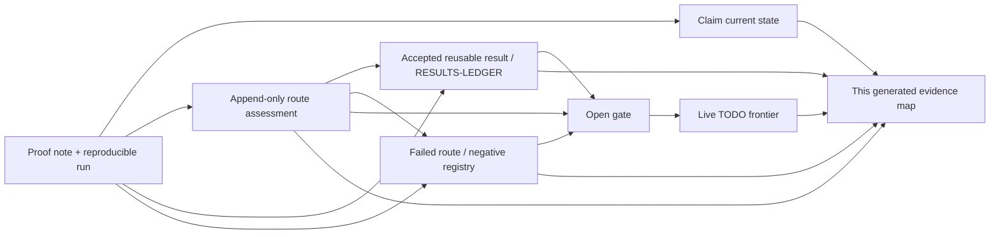
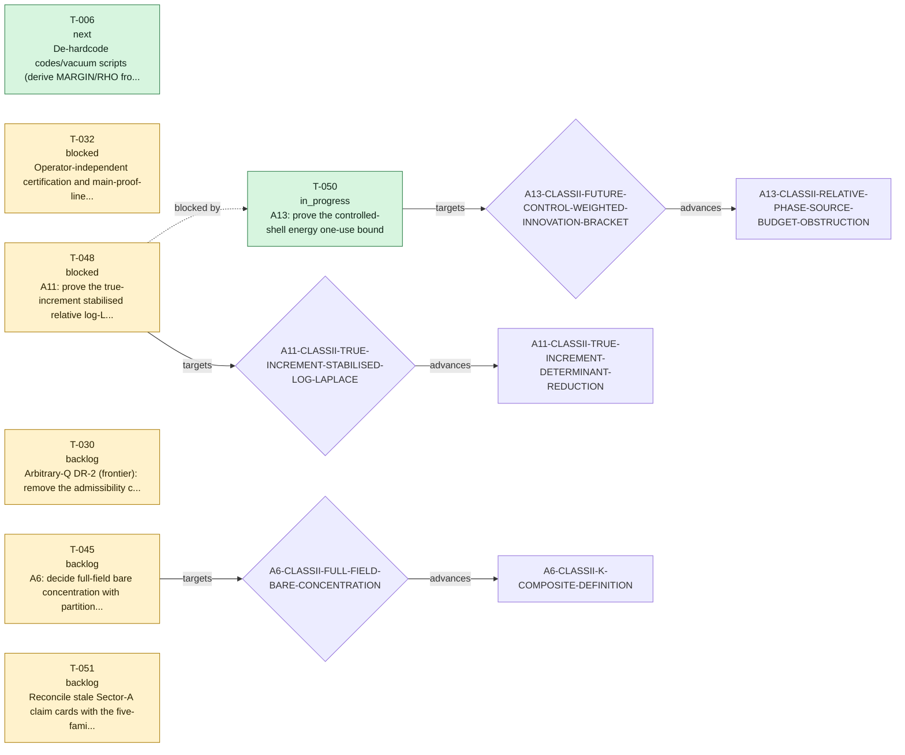

# TECT proof evidence map

> GENERATED by `verification/scripts/build_proof_evidence_map.py` - do not hand-edit. 
> This is a complete-by-reference navigation and audit surface, not a new proof or tier authority.

Use this page to see what succeeded, what failed and why, what remains open,
and where each assertion can be reproduced. The linked claim card, proof note/run,
result ledger, exploration record, negative-result entry, gate definition, task ledger, or changelog entry
always remains authoritative.

## One-glance record flow



## Repository proof snapshot

| Record class | Count | Meaning |
|---|---:|---|
| Status cards | 49 | 48 active; 1 refuted |
| Reusable result records | 81 | Curated theorems, reductions, partial advances, and no-go lemmas with proof anchors |
| Negative/audit records | 75 indexed + 3 legacy process lessons | No-go, falsifier, retraction, and process-audit trust assets with evidence and consequence |
| Proof explorations | 91 | Route decisions: advanced 38, failed 42, inconclusive 5, parked 6; non-tier-bearing |
| Accepted chronological events | 376 | Complete history is preserved in the JSON map and `CHANGELOG.md` |
| Tasks | 51 | 7 live; 44 completed |
| Current route gates | 19 | 19 claim-card gates plus live-task child targets, deduplicated |
| Proof evidence inventory | 309 lineage notes / 290 sibling PDFs / 9 legacy unordered root notes / 9 paired root PDFs / 270 run JSON files / 39 claim-level manifests / 40 bundle manifests / 45 frozen embedded manifests | Complete paths and disjoint manifest classes are stored per claim in the machine map; 19 historical/superseded lineage-note paths lack a sibling PDF and 118 grandfathered evidence notes have incomplete standard footers, all kept visible |

## Coverage diagnostics

These are visible migration or metadata debts, not silently dropped records.

| Diagnostic | Count | Management rule |
|---|---:|---|
| Claims without generated `INDEX.md` | 24 | Evidence-map and sector-dossier links fall back to `claim.md`; `LINEAGE.md` remains available |
| Historical/superseded notes without sibling PDF | 19 | Paths remain in machine inventory; current-note PDF enforcement is unchanged |
| Grandfathered notes with incomplete standard footer | 118 | Kept visible; notes first issued on/after 2026-07-24 fail the map gate if any mandatory footer label is absent |
| Claim cards listing a gate whose registered status begins `CLOSED` | 2 | Exposed as reconciliation debt; the map does not silently flip claim cards |
| Claim-unbound reusable results / negative records | 2 / 1 | Ambiguous family references stay unbound; no claim edge is invented |
| Completed-task references to retired gate identifiers | 5 | Preserved as `historical_gate_reference` nodes anchored to `todo/todo.json`, never mislinked to the current gate registry |
| Changelog tokens that are not current claim-card IDs | 109 | Preserved in event metadata but never promoted to claim edges; many are historical proof-unit IDs from the legacy extractor |
| Changelog negative tags absent from the indexed registry | 3 | Preserved as historical event text, rendered without a false registry anchor, and excluded from negative graph edges |
| Historical exploration backfill | 13 | Directly recovered from cited tracked evidence; pre-2026-07-24 chat-only deliberation is explicitly not claimed complete |

## Current proof-route roadmap



| Task | State | Claim | Target gate | Core next action / reason |
|---|---|---|---|---|
| **T-050** A13: prove the controlled-shell energy one-use bound | in_progress | [A13-CLASSII-RELATIVE-PHASE-SOURCE-BUDGET-OBSTRUCTION](../claims/A13-CLASSII-RELATIVE-PHASE-SOURCE-BUDGET-OBSTRUCTION/claim.md) | [A13-CLASSII-FUTURE-CONTROL-WEIGHTED-INNOVATION-BRACKET](../claims/GATES.md#a13-classii-future-control-weighted-innovation-bracket) | R-081 proves the exact production polynomial/Cartan split: the polynomial FAR channel vanishes and the Cartan current has deterministic relative-gap decay, but the probability-root sum is H^(1/2)-critical. Vector Doob--Burkholder interpolation closes the NEAR input budget and gain ledger only for an explicitly factorised first-order response. A two-root production witness has d_jA=d_jDA=0 but nonzero coefficient innovation; the exact secant--Jensen split leaves an upper-triangular nonlinear defect inside the signed complete packet. Absolute pair-high payment is also supercritical. Temporal Douglas factorisation preserves the complete R-079 algebra for overlapping bounded-simple packets, but the R-075 one-shot graph is not progressive-dense. Prove root-resolved FAR, Jensen-defect/complete adapted-signed NEAR, and an overlap-stable bounded-simple complete-packet lower bound plus variational extension before controlled-shell one-use and q=10/9 Nelson. Sector A remains open. |
| **T-006** De-hardcode codes/vacuum scripts (derive MARGIN/RHO from source) + add check_code_discipline.py to release_check | next | [B1-RH-ENUM](../claims/B1-RH-ENUM/claim.md) | - | MARGIN de-hardcoded 2026-06-07 (codes/vacuum/sectorb_common.py single source; scscope+robustness import margin_of). REMAINING: RHO consolidation + automated check_code_discipline.py wired into release_check (no-hardcoding + self-test + JSON-artefact scan). |
| **T-032** Operator-independent certification and main-proof-line decision for the canonical N-001 scalar-slice manifest before any T5 package | blocked | [A1-PRODUCTION-KERNEL-MANIFEST](../claims/A1-PRODUCTION-KERNEL-MANIFEST/claim.md) | - | Promotion package reconciled 2026-07-16: v1.6 verifier 14/14 PASS; historical bundles are pre-certification evidence with verified manifests. Required: independent run, ratify eps_Z/eps_m/eps_r plus config and three source hashes, then decide main-line status. No tier action until those decisions. |
| **T-048** A11: prove the true-increment stabilised relative log-Laplace bound | blocked | [A11-CLASSII-TRUE-INCREMENT-DETERMINANT-REDUCTION](../claims/A11-CLASSII-TRUE-INCREMENT-DETERMINANT-REDUCTION/claim.md) | [A11-CLASSII-TRUE-INCREMENT-STABILISED-LOG-LAPLACE](../claims/GATES.md#a11-classii-true-increment-stabilised-log-laplace) | Blocked by T-050. Blocked by T-050 at A13-CLASSII-CONTROLLED-SHELL-ENERGY-ONE-USE. A13 v1.1 proves exact equivalence to the q=10/9 Nelson moment and retires local Bellman, endpoint-only timewise Young, repeated past-energy, and direct one-shot Ramer repairs. Only after a signed global cancellation closes the one-use theorem may the A11 stabilised relative log-Laplace statement be reformulated; no unique successor method is assumed. |
| **T-030** Arbitrary-Q DR-2 (frontier): remove the admissibility cap from Lemma 1's backing; currently T6-conditional on Bourgain-Demeter decoupling. NOT load-bearing for the C_full main theorem (Lemma 2 caps T'<=10 in... | backlog | [B5-BEYOND-LAYER-BOUND](../claims/B5-BEYOND-LAYER-BOUND/claim.md) | - | OPEN FRONTIER (arbitrary-Q DR-2). D2-A 2026-06-12: DR2-SHARE gate formally rescoped here as NON-LOAD-BEARING for the published C_full head (Lemma 2 caps T'<=10 in-class). Content: BD-conditional T6 (separated Q); PSM conjecture T2; elementary route open. |
| **T-045** A6: decide full-field bare concentration with partition-function tube bounds and tightness | backlog | [A6-CLASSII-K-COMPOSITE-DEFINITION](../claims/A6-CLASSII-K-COMPOSITE-DEFINITION/claim.md) | [A6-CLASSII-FULL-FIELD-BARE-CONCENTRATION](../claims/GATES.md#a6-classii-full-field-bare-concentration) |  |
| **T-051** Reconcile stale Sector-A claim cards with the five-family theorem map | backlog | - | - | One substantive claim card per turn. Correct stale next_action/open-gate text in A10, A9, A11, A12, A6, A5, and A4 without changing valid tiers or immutable IDs; regenerate all ledgers after each card. |

## Sector state map

| Sector | Status cards | Lifecycle | Tier profile | Current route gates | Live tasks |
|---|---:|---|---|---:|---|
| [A](sectors/A.md) | 21 | 21 active / 0 refuted | T6x9 T5x7 T4x5 | 11 | T-050, T-032, T-048, T-045 |
| [B](sectors/B.md) | 7 | 6 active / 1 refuted | T7x3 T5x1 T4x1 T1x1 T0x1 | 1 | T-006, T-030 |
| [C](sectors/C.md) | 6 | 6 active / 0 refuted | T6x4 T5x1 T1x1 | 5 | - |
| [D](sectors/D.md) | 6 | 6 active / 0 refuted | T6x2 T5x1 T3x1 T1x2 | 1 | - |
| [E](sectors/E.md) | 6 | 6 active / 0 refuted | T4x1 T2x1 T1x4 | 1 | - |
| [F](sectors/F.md) | 3 | 3 active / 0 refuted | T4x1 T1x2 | 1 | - |

## Current route-gate ownership

This union keeps claim-card umbrella gates and live-task child gates visible together.
Ownership source remains explicit; the map does not rewrite a claim card.

| Gate | Claim owners | Source | Live tasks | Current registered status |
|---|---|---|---|---|
| [A10-CLASSII-MULTISCALE-ACTION-DECOMPOSITION](../claims/GATES.md#a10-classii-multiscale-action-decomposition) | [A10-CLASSII-RELATIVE-COMMUTATOR-REDUCTION](../claims/A10-CLASSII-RELATIVE-COMMUTATOR-REDUCTION/claim.md), [A9-CLASSII-SMART-PATH-CANCELLATION](../claims/A9-CLASSII-SMART-PATH-CANCELLATION/claim.md) | claim card | - | CLOSED@A11-TRUE-INCREMENT-DETERMINANT (2026-07-21). A10 proves exactly `Q_j^fr+C_j=V_j-V_(j-1)+q_(B(phi_(j-1)))(D phi_(j-1))`, hence `sum_j(Q_j^fr+C_j)=V_J+E_J` when `V_0=0`. Since `E_J>=0`, the actual action is the shell expression minus `E_J`; positivity has the wrong direction for a lower bound. `A11-CLASSII-TRUE-INCREMENT-DETERMINANT-REDUCTION` proves that the quantitative upper-form branch is impossible already under the base Gaussian: `E E_J/(L^3 2^J)->kappa_II>0` while entropy vanishes and terminal `L4/L6` moments remain bounded. It then defines `I_j=Q_j^fr-q_(B(phi_(j-1)))(D phi_(j-1))` and proves exactly `I_j+C_j=V_j-V_(j-1)` together with its noncentral conditional determinant. Thus action reconstruction is closed by the true-increment branch, not by past-energy absorption. The determinant's positive source-square is the separate successor gate below. |
| [A10-CLASSII-STABILISED-RELATIVE-LOG-LAPLACE](../claims/GATES.md#a10-classii-stabilised-relative-log-laplace) | [A10-CLASSII-RELATIVE-COMMUTATOR-REDUCTION](../claims/A10-CLASSII-RELATIVE-COMMUTATOR-REDUCTION/claim.md), [A9-CLASSII-SMART-PATH-CANCELLATION](../claims/A9-CLASSII-SMART-PATH-CANCELLATION/claim.md) | claim card | - | OPEN AS A HISTORICAL Q-RELATIVE BRANCH; SUPERSEDED ON THE ACTIVE TRUE-INCREMENT COMPOSITION (2026-07-21). A10 proves the exact finite-cutoff Gibbs-variational equivalence, the necessity of `alpha_c>0`, and the two-antecedent conditional composition theorem. In that theorem `C_fr=C_sh(L)M_R^4 c_sym^-2 beta_B^2 C_LP,4^4 S_dy`, `K_f=(1-theta)^2 C_fr/(4 alpha_f)`, `B_6=gamma/6-epsilon_6-epsilon_d`, and `A_4=[K_theta+K_f+K_d-lambda/4]_+`. If some `p>1` satisfies `p(alpha_f+alpha_c+alpha_d)<1`, closure of both open gates would imply `log E exp(-pS_J)<=p(C_theta+C_d)+4pL^3A_4^3/(27B_6^2)`. The proof-friendly target is `theta=0.90`, `alpha_f=0.05`, `alpha_c=0.80`, `alpha_d=0.04`, `epsilon_6=0.25`, `epsilon_d=0.01`, and `p=1.10`. It gives `p*alpha=0.979` and `B_6=0.01`, but `K_d,C_d` remain symbolic and neither open estimate is proved. No A7 Nelson closure or interacting Gibbs measure is claimed. |
| [A11-CLASSII-ADAPTED-SOURCE-SQUARE-BOUND](../claims/GATES.md#a11-classii-adapted-source-square-bound) | [A11-CLASSII-TRUE-INCREMENT-DETERMINANT-REDUCTION](../claims/A11-CLASSII-TRUE-INCREMENT-DETERMINANT-REDUCTION/claim.md) | claim card | - | OPEN (2026-07-21), ANALYTICALLY REDUCED BUT THE FIRST BUDGET ROUTE REFUTED BY A12. The true-increment determinant is `-0.5 log det_2(I+pT_j)+0.5 p^2<ell_j,(I+pT_j)^(-1)ell_j>` with `ell_j=G_j^*B(phi_(j-1))D phi_(j-1)`. A scalar source family proves that no Hilbert--Schmidt-only estimate can delete this positive term. A9 already controls the summed Hilbert--Schmidt part by a terminal quartic. The present source-square is therefore the first surviving load-bearing analytic gate. A12 proves a cutoff-uniform coarse form with `C_src=(beta_op^2/c_sym) M_R^2 M_6^4 Q_6^2`, where `beta_op=0.0423749999999894` is the sharp production Pauli/Fierz operator constant and `beta_op^2/c_sym=0.016570372383568618`. Exact dyadic boundary modulation now gives `M_6>=8`, `Q_6>=8sqrt(3)`, and `M_6^4 Q_6^2>=786432`, so the separated norm route cannot meet the isolated production target. The same witness refutes the coefficient-blind scalar six-linear envelope. The surviving gate must retain the exact null identity `B(X)JX=0`, the output shell, and preferably the determinant resolvent. |
| [A11-CLASSII-TRUE-INCREMENT-STABILISED-LOG-LAPLACE](../claims/GATES.md#a11-classii-true-increment-stabilised-log-laplace) | [A11-CLASSII-TRUE-INCREMENT-DETERMINANT-REDUCTION](../claims/A11-CLASSII-TRUE-INCREMENT-DETERMINANT-REDUCTION/claim.md) | claim card + live task | T-048 | OPEN, BLOCKED IN PROOF ORDER BY `A11-CLASSII-ADAPTED-SOURCE-SQUARE-BOUND` (2026-07-21). The historical A10 bound for `theta Q_j^fr+C_j` is not the required statement: the two variables differ by the positive past energy whose direct upper form is refuted. After the source theorem, the determinant contribution has conditional budget `-alpha_f H-s^2 C_fr/(4 alpha_f) E\|\|phi\|\|_4^4` `-s^2 C_src/(2 alpha_f) E\|\|phi\|\|_6^6`, `s=1-theta`. All constants and the remaining sextic reserve must be recomputed before any A7 Nelson conclusion. |
| [A13-CLASSII-CONTROLLED-SHELL-ENERGY-ONE-USE](../claims/GATES.md#a13-classii-controlled-shell-energy-one-use) | [A13-CLASSII-RELATIVE-PHASE-SOURCE-BUDGET-OBSTRUCTION](../claims/A13-CLASSII-RELATIVE-PHASE-SOURCE-BUDGET-OBSTRUCTION/claim.md) | claim card | - | OPEN (reviewed 2026-07-25), SOLE CANONICAL OBJECTIVE AFTER THE ARCHITECTURE NOGOS. The translation-model reduction proves the exact finite-cutoff translation and Cartan identities and deterministic-shift expectation positivity. It admits the explicit candidate `epsilon_6=0.15`, `delta=0.06`, `epsilon_v=0.45`, leaving sextic margin `0.06`; the theorem is exactly equivalent to `sup_J E exp[-(10/9)(V_J^ren+0.15\|\|phi\|\|_6^6)]<infinity`. Restating Boue--Dupuis, entropy, Follmer, or HJB is therefore circular. The production nonfrozen derivative has a genuine coefficient curl. With the correct Ramer coefficient `t=(10/9)/2=5/9`, two independent finite-mode routes find a determinant sign change near amplitude `3.49230586`, registered as `NG-2026-07-22-A13-NONFROZEN-RAMER-ONE-SHOT`. This refutes one-shot `xi+t b_J(xi)`, not the objective. No unique proof antecedent is claimed. Any continuation must retain a signed global cancellation, for example by a genuinely triangular/flow transport or direct constructive estimate. Coefficient-one conditioning, the finite-bank Bellman class, repeated past energy, endpoint-only timewise Young, resolvent-only repair, and separate payment of the Ramer square plus inverse determinant are excluded. The backward-heat continuation cancels the uncontrolled heat drift exactly and puts the finite-low and covariance-trace channels below arbitrary budgets for regular mutually orthogonal one-shot controls. The subsequent `A13-CLASSII-NPC-CONE-MARTINGALE-INJECTION-REDUCTION` diagonalises the current at the Nelson exponent, proves the aggregate CAT(0) cone and strong Jacobi remainder, and exposes the exact raw-energy/injection telescope. It also refutes shellwise raw-secant positivity at a positive floor and refutes a geometry-only abstract proof without producing a production counterexample. R-070 adds the exact Wick--Doob terminalization: all CC/GG/mixed current increments reduce to the terminal translated-current with the finite-low boundary retained, the raw/Wick covariance trace and transported tail are paid, and terminal Schur completion leaves one adapted centered-resolvent object. The adapted terminal coefficient is not automatically centered. The exact full weighted linear frame then splits into symmetric and Cartan channels: its Cartan and `q11` pure-`pp` pieces are paid. R-071 corrects the false raw linear regularity attribution and closes the complete fixed-floor symmetric--Cartan frame through the R-050 enhancement. R-072 classifies the exact phase-gauge kernel, proves an inverse-free completion, and pays the matched strict-past same-shell nonlinear leakage with one accumulated integrable random constant and an `O(N_j0^-3)` sixth-moment tail. R-073 then reassembles all three load-bearing off-diagonal families and the R-071 linear term into the R-069 raw current telescope exactly. Restoring both separated first variations gives a projector-free terminal square and cancels every terminal-kernel component on the kernel-projector rank-2/3/6 strata. R-074 then proves the exact nondecaying resonance of the bare mismatched nonlinear coefficient and refutes automatic adapted Wick centering. It closes genuine regular local phase orbits by exact raw-current invariance and a cutoff-uniform `O(Lambda^-3)` relative-phase Wick anomaly, and proves the deterministic Besov sixth-moment payment. R-075 closes the projector-free invariant-current chart, the principal unshifted one-form and its sixth moment, and fixed-cutoff predictable graph recovery. R-076 adds the exact nonduplicating endpoint ledger and an input-maximum Besov proof with energy powers `X^(2/5)Y^(8/15)`, Young slack `1/15`, and a fifteenth moment. R-077 then replaces the proposed raw three-class taxonomy: complete fresh-Gaussian Doob packets cancel in signed expectation, and the entire payload-comparable `m<=r+L` shifted-resonance form closes with the same fifteenth moment. R-078 reassembles the exact transport through a bounded Hessian difference with `A^2 DA` payload, improves the comparable payment to moment `30/7`, defines the safe packet by canonical subtraction and one causal projection, and identifies the future-control innovation-bracket mechanism for each factorised bilinear component. R-079 closes the exact full-current and canonical safe- packet Doob reconstruction with every low, square, trace, forest, cross, and paid term retained. It also proves one weighted Cameron--Martin control square- function use and the predictable base-current heat projection. R-080 closes both distinct low objects for the declared mutually orthogonal one-shot no-revisit class. It reduces the far feedback block by orthogonal square completion to one localized predictable base-current tail and narrows the near residual to a predictable explicit payload plus a hidden future-adapted coefficient. The current regular-class child remains `A13-CLASSII-FUTURE-CONTROL-WEIGHTED-INNOVATION-BRACKET`. R-081 then proves the exact polynomial/Cartan current split, eliminates the polynomial far channel, proves a deterministic relative-gap current theorem, and isolates the missing martingale-root-resolved sum at the half-derivative endpoint. It also proves the vector-valued input budget and exact gain ledger for an explicitly factorised first-order NEAR response. The complete nonlinear coefficient additionally contains an upper-triangular Jensen defect invisible to `D_jA`; the remaining NEAR pieces are that defect inside the lower-chaos- complete adapted operator and a signed control--control balanced-root lemma. R-080/R-081 correct the synthesis scope: R-075 graph recovery does not extend a restricted lower bound to every progressive/revisit control. The separate successor `A13-CLASSII-FULL-PROGRESSIVE-REVISIT-EXTENSION` is mandatory before canonical one-use. The umbrella theorem remains open. |
| [A13-CLASSII-FULL-PROGRESSIVE-REVISIT-EXTENSION](../claims/GATES.md#a13-classii-full-progressive-revisit-extension) | [A13-CLASSII-RELATIVE-PHASE-SOURCE-BUDGET-OBSTRUCTION](../claims/A13-CLASSII-RELATIVE-PHASE-SOURCE-BUDGET-OBSTRUCTION/claim.md) | claim card | - | OPEN SEPARATE SYNTHESIS GATE (2026-07-25), exposed by R-080 and sharpened by R-081 `A13-CLASSII-CARTAN-TAIL-ADAPTED-NEAR-TEMPORAL-REDUCTION` (after R-080 `A13-CLASSII-LOW-OBJECT-FAR-SQUARE-PROGRESSIVE-BOUNDARY`). R-075 proves fixed-cutoff recovery only in its declared Cameron--Martin/terminal-`L6` graph closure of regular whole-shell controls. Variational inclusion has the wrong direction for promoting a lower bound on that restricted class to all progressive controls. A same-range revisit can make the separate R-079 conditional-low loss quartic while final charge is fixed and control cost is quadratic; cancellation, if present, must occur in the complete later packet. This is a method and scope obstruction, not a counterexample to the full action. The gate is logically after the regular FAR/NEAR packet bound and before controlled-shell one-use and `q=10/9` Nelson synthesis. |
| [A13-CLASSII-FUTURE-CONTROL-WEIGHTED-INNOVATION-BRACKET](../claims/GATES.md#a13-classii-future-control-weighted-innovation-bracket) | [A13-CLASSII-RELATIVE-PHASE-SOURCE-BUDGET-OBSTRUCTION](../claims/A13-CLASSII-RELATIVE-PHASE-SOURCE-BUDGET-OBSTRUCTION/claim.md) | claim card + live task | T-050 | OPEN CURRENT CHILD (2026-07-25), narrowed by R-079 `A13-CLASSII-FULL-SAFE-PACKET-FRAME-CURRENT-DOOB-DECOMPOSITION`. R-079 proves the exact expectation-level full-current and canonical safe-packet identity, one spatially weighted Cameron--Martin control square-function use, and the predictable base-current heat projection. The terminal feedback current still contains coefficient and derivative-feedback channels. Direct Cauchy has Young deficit `-4/15`; expected energy and sextic budgets do not imply predictable BMO/Carleson control; an unweighted bracket has no generic spatial gain; and square plus trace has no universal adapted sign. These are method no-gos, not production counterexamples. A genuine gain `gamma>0` would be subcritical, with moment `6/gamma`, but that production estimate is unproved. R-080 closes both low-object bounds in the declared no-revisit class and sharpens the remaining production estimate. In the far region, exact orthogonal square completion retains both feedback channels and leaves only `S_C=E sum_j sum_(m>=j+C)\|\|Pi_m d_j J_j\|\|_(Q_II)^2`; target heat and the weighted CM identity do not themselves give a root/shell gap. In the near region, `L>=C` makes the explicit residual `A^2 DA` payload predictable, but a future-adapted high--high-to-low coefficient remains hidden inside `D2M(U+tA)-D2M(U)`. Bounded width has zero Young slack and universal rootwise positivity is false. The FAR and NEAR production bounds, complete regular packet lower bound, full-progressive extension, controlled-shell one-use, Nelson, and Sector A remain open. |
| [A6-CLASSII-COUNTERTERM-CLOSURE](../claims/GATES.md#a6-classii-counterterm-closure) | [A6-CLASSII-K-COMPOSITE-DEFINITION](../claims/A6-CLASSII-K-COMPOSITE-DEFINITION/claim.md), [A6-CLASSII-UV-POWER-COUNTING](../claims/A6-CLASSII-UV-POWER-COUNTING/claim.md) | claim card | - | OPEN, COMPOSITE SUBGATE CLOSED (2026-07-20). The bare Gaussian-reference growth and the current `K_A` are classified. The literal subtraction `-delta_cube*N*W_eps(Psi)` with fixed lower-order coefficients is eliminated as a uniform-coercivity route: a homogeneous first-two-component trial has `\|Psi_N\|=Theta(N^(1/4))` and energy `-Theta(N^(3/2))`. A vacuum shift does not repair the escaping amplitude. Adding a running family mass can restore nonnegativity but also drives the same components toward zero, so it is a new renormalisation condition rather than closure. `A7-CLASSII-RENORMALISED-ENERGY-COMPOSITE` now closes at scoped T5 the exact covariance-normal-ordered joint definition of `J^2`, `J*K`, and `K^2`, the exact finite Gaussian-IBP two-point connection classification, and convergence in `L2(Omega;H^(-1-kappa))` for every `kappa>0`. This does not close the present gate: the self-coupled weight still needs a uniform negative-exponential bound, partition-density convergence, and tightness. Those requirements are tracked by `A7-CLASSII-NELSON-EXPONENTIAL-BOUND`; bare concentration remains separate. |
| [A6-CLASSII-FULL-FIELD-BARE-CONCENTRATION](../claims/GATES.md#a6-classii-full-field-bare-concentration) | [A6-CLASSII-K-COMPOSITE-DEFINITION](../claims/A6-CLASSII-K-COMPOSITE-DEFINITION/claim.md), [A6-CLASSII-UV-POWER-COUNTING](../claims/A6-CLASSII-UV-POWER-COUNTING/claim.md), [A7-CLASSII-RENORMALISED-ENERGY-COMPOSITE](../claims/A7-CLASSII-RENORMALISED-ENERGY-COMPOSITE/claim.md) | claim card + live task | T-045 | OPEN (2026-07-20). The exact bound `9*lambda_min(Q_II)*s <= W_eps <= 9*(a+2b+c)*s` fixes the zero set of the conditional contraction only. Two local proxies are solved at T5: the mean-contraction proxy gives `t*s -> Gamma(2,rate=9*(a+2b+c))`, while exact one-point Gaussian derivative integration gives density `35*g^2*r*(1+2*g*r)^(-9/2)`. Their distinct means show that proxy choice is load-bearing. Neither result is a full-field concentration theorem, and no pathwise inequality identifies the complete Class-II energy with `delta_cube*N*W_eps`. In fact, `Psi(x)=exp(i*k.x)u` with an active first doublet has `J_A=K_A=F_II=0` while `W_eps(u)>0`. Pure-third concentration therefore cannot be inferred from the conditional contraction; all null branches must be compared. |
| [A7-CLASSII-NELSON-EXPONENTIAL-BOUND](../claims/GATES.md#a7-classii-nelson-exponential-bound) | [A7-CLASSII-RENORMALISED-ENERGY-COMPOSITE](../claims/A7-CLASSII-RENORMALISED-ENERGY-COMPOSITE/claim.md) | claim card | - | OPEN, DECOUPLED SPATIAL-BACKGROUND SUBGATE CLOSED (2026-07-20). The A7 composite action converges in `L2`, has mean zero, and its finite-cutoff partition functions have a uniform positive Jensen lower bound. `A8-CLASSII-DECOUPLED-NELSON-BOUND` upgrades the old constant-background audit to every deterministic spatial PSD `L2` matrix field, including the exact `det_2` identity, the cutoff-uniform Schatten bound with its required `M_R^4` regulator factor, sextic absorption, and full-sequence convergence of the independent coefficient/derivative product-Gaussian model. It also records the exact finite-cutoff Gaussian-divergence identity for A7. None of these results makes `B(X)` independent of the derivative carrier. Closure therefore still requires a genuine self-coupled estimate, now tracked by `A7-CLASSII-SELF-COUPLING-INTERPOLATION`. `L2` action convergence, finite-cutoff sextic normalisability, and the decoupled determinant are insufficient. Density-floor removal and infinite volume are not part of this gate. |
| [A7-CLASSII-SELF-COUPLING-INTERPOLATION](../claims/GATES.md#a7-classii-self-coupling-interpolation) | [A8-CLASSII-DECOUPLED-NELSON-BOUND](../claims/A8-CLASSII-DECOUPLED-NELSON-BOUND/claim.md) | claim card | - | OPEN, EXACT SMART-PATH/FROZEN-SHELL SUBGATE CLOSED (2026-07-20); FORMER COMMUTATOR-ALONE SUBGATE FALSIFIED (2026-07-21). `A9-CLASSII-SMART-PATH-CANCELLATION` reaches both finite-cutoff interpolation endpoints, proves the exact Gaussian-IBP cancellation of the apparent trace-class terms, and closes the arbitrary-source noncentral frozen-shell determinant with a summable `2^(-j)` cost. It also shows that deterministic or independent Cameron--Martin shifts have nonnegative expected renormalised energy. A resonant covariance-contracted Gaussian tilt with a Cameron--Martin mean now falsifies the former commutator-alone infinitesimal form bound without touching those positive results. The corrected designated route must retain a fixed fraction of the complete covariance-normal frozen energy and is registered as `A7-CLASSII-FROZEN-ENERGY-RELATIVE-COMMUTATOR-BOUND` below. The adapted-drift and smart-path criteria remain separate sufficient routes; no equivalence is asserted. The self-coupled Nelson estimate and Gibbs measure remain open. |
| [C6-BCC-PREMISE-BLOCKED](../claims/GATES.md#c6-bcc-premise-blocked) | [C6-SPACETIME-SIGNATURE](../claims/C6-SPACETIME-SIGNATURE/claim.md) | claim card | - | See gate definition. |
| [CP-UNITARITY](../claims/GATES.md#cp-unitarity) | [D4-QUANTUM-CONSISTENCY](../claims/D4-QUANTUM-CONSISTENCY/claim.md) | claim card | - | OPEN |
| [ESTIMATOR-UPGRADE](../claims/GATES.md#estimator-upgrade) | [B3-RH-TESTED-STRUCTURE-RANKING](../claims/B3-RH-TESTED-STRUCTURE-RANKING/claim.md) | claim card | - | CLOSED@CONTROLLED-ERROR (operator-authorized 2026-06-07) |
| [GAP-3](../claims/GATES.md#gap-3) | [C5-NEWTON-G](../claims/C5-NEWTON-G/claim.md), [E1-HIGGS-EW](../claims/E1-HIGGS-EW/claim.md), [E3-GAUGE-COUPLINGS](../claims/E3-GAUGE-COUPLINGS/claim.md), [E4-FERMION-MASSES](../claims/E4-FERMION-MASSES/claim.md), [E5-CKM-MIXING](../claims/E5-CKM-MIXING/claim.md), [E6-PMNS-NEUTRINO](../claims/E6-PMNS-NEUTRINO/claim.md) | claim card | - | OPEN (ledger seeded) |
| [GAP-4](../claims/GATES.md#gap-4) | [F1-COSMO-DARK-SECTOR](../claims/F1-COSMO-DARK-SECTOR/claim.md), [F2-BARYOGENESIS](../claims/F2-BARYOGENESIS/claim.md), [F3-INFLATION-CMB](../claims/F3-INFLATION-CMB/claim.md) | claim card | - | OPEN |
| [H-SUPPRESSION-DISCHARGE](../claims/GATES.md#h-suppression-discharge) | [C1-LORENTZ-KIN](../claims/C1-LORENTZ-KIN/claim.md) | claim card | - | OPEN |
| [PRED-G-FREEZE](../claims/GATES.md#pred-g-freeze) | [C5-NEWTON-G](../claims/C5-NEWTON-G/claim.md) | claim card | - | OPEN |
| [SCHEME-2LOOP](../claims/GATES.md#scheme-2loop) | [C4-GRAVITY-1LOOP](../claims/C4-GRAVITY-1LOOP/claim.md) | claim card | - | OPEN (recommended) |

## Proof-exploration decision record

This is the complete projection of `explorations/log.jsonl`. It records
researcher-reusable route decisions, not private token-by-token reasoning.
`advanced` is not proof; `failed` is not a formal global no-go unless an
explicit negative-registry reference is present. Prospective mandatory
coverage begins 2026-07-24; older backfill is evidence-limited.

### Recorded inconclusive or parked route assessments

This table is a review aid, not a substitute for the live TODO order.

| Exploration | Reviewed | Verdict | Claim / gate | Finding | Next or resume condition |
|---|---|---|---|---|---|
| [EXP-000012](#exp-000012) Joint-source v1.0 run provenance is not reconstructible from current same-named files | 2026-07-22 | parked | [A13-CLASSII-RELATIVE-PHASE-SOURCE-BUDGET-OBSTRUCTION](../claims/A13-CLASSII-RELATIVE-PHASE-SOURCE-BUDGET-OBSTRUCTION/claim.md)<br/>[A13-CLASSII-CONTROLLED-SHELL-ENERGY-ONE-USE](../claims/GATES.md#a13-classii-controlled-shell-energy-one-use) | The current source is a supersession pointer and the PDF hash differs, so the old runs are development provenance only; v1.1 is the sole current package. | Reopen only if the original hash-matching v1.0 artifacts are recovered; otherwise cite v1.1 for current evidence. |
| [EXP-000001](#exp-000001) Deterministic and Gaussian-base estimates do not transfer to adapted control | 2026-07-23 | inconclusive | [A13-CLASSII-RELATIVE-PHASE-SOURCE-BUDGET-OBSTRUCTION](../claims/A13-CLASSII-RELATIVE-PHASE-SOURCE-BUDGET-OBSTRUCTION/claim.md)<br/>[A13-CLASSII-CONTROLLED-SHELL-ENERGY-ONE-USE](../claims/GATES.md#a13-classii-controlled-shell-energy-one-use) | The deterministic statements and uncontrolled-base tails do not control the adapted tilted law; direct Malliavin integration by parts introduces an unpaid derivative of the control. | Isolate Gaussian-rooted terms and prove a signed global relative-form or backward log-Laplace estimate without differentiating the control. |
| [EXP-000004](#exp-000004) Heat-current identity depends on pinned covariance and is not a global estimate | 2026-07-23 | inconclusive | [A13-CLASSII-RELATIVE-PHASE-SOURCE-BUDGET-OBSTRUCTION](../claims/A13-CLASSII-RELATIVE-PHASE-SOURCE-BUDGET-OBSTRUCTION/claim.md)<br/>[A13-CLASSII-STRICT-PAST-JOINT-REMAINDER-CARTAN-FORM-BOUND](../claims/GATES.md#a13-classii-strict-past-joint-remainder-cartan-form-bound) | The correlated synthetic control produces a nonzero failure, and the heat-semigroup formula identifies curvature without estimating its global sum. | Retain the covariance restriction or prove a replacement decorrelation identity, then establish the cutoff-uniform Cartan/form bound. |
| [EXP-000005](#exp-000005) Sequential normalizers do not close the Nelson estimate | 2026-07-23 | inconclusive | [A13-CLASSII-RELATIVE-PHASE-SOURCE-BUDGET-OBSTRUCTION](../claims/A13-CLASSII-RELATIVE-PHASE-SOURCE-BUDGET-OBSTRUCTION/claim.md)<br/>[A13-CLASSII-AVERAGED-RAW-CURRENT-CARTAN-JACOBI-FORM-BOUND](../claims/GATES.md#a13-classii-averaged-raw-current-cartan-jacobi-form-bound) | The normalizers remain past-dependent, and the reformulations rename the same unresolved averaged raw-current form without supplying an estimate. | Independently lower-bound the averaged raw-current/Cartan-Jacobi form before invoking any equivalent entropy or drift representation. |
| [EXP-000007](#exp-000007) Ordered one-shot shell proof does not cover progressive range revisits | 2026-07-23 | parked | [A13-CLASSII-RELATIVE-PHASE-SOURCE-BUDGET-OBSTRUCTION](../claims/A13-CLASSII-RELATIVE-PHASE-SOURCE-BUDGET-OBSTRUCTION/claim.md)<br/>[A13-CLASSII-AVERAGED-RAW-CURRENT-CARTAN-JACOBI-FORM-BOUND](../claims/GATES.md#a13-classii-averaged-raw-current-cartan-jacobi-form-bound) | The identity Z_(j0-1)=P_<j0 Z_J fails and the low-block estimate needs an additional control term. | Resume only with a separate progressive-flow reduction that pays the revisit term. |
| [EXP-000008](#exp-000008) NPC logarithmic path and affine physical path leave opposite gaps | 2026-07-23 | inconclusive | [A13-CLASSII-RELATIVE-PHASE-SOURCE-BUDGET-OBSTRUCTION](../claims/A13-CLASSII-RELATIVE-PHASE-SOURCE-BUDGET-OBSTRUCTION/claim.md)<br/>[A13-CLASSII-NPC-CONE-MARTINGALE-INJECTION-BALANCE](../claims/GATES.md#a13-classii-npc-cone-martingale-injection-balance) | The cone logarithm contains all Fourier frequencies, so the one-shot Bessel estimate does not apply directly; the affine path preserves shell support but loses the Jacobi sign. | Combine localization and sign through the finite-cutoff production good/bad Schur-Jacobi lemma. |
| [EXP-000010](#exp-000010) Linear score Carleson control is not a grouped finite-secant estimate | 2026-07-23 | inconclusive | [A13-CLASSII-RELATIVE-PHASE-SOURCE-BUDGET-OBSTRUCTION](../claims/A13-CLASSII-RELATIVE-PHASE-SOURCE-BUDGET-OBSTRUCTION/claim.md)<br/>[A13-CLASSII-NPC-CONE-MARTINGALE-INJECTION-BALANCE](../claims/GATES.md#a13-classii-npc-cone-martingale-injection-balance) | Finite path integration creates an unresolved nonlinear coefficient-curvature term, and the linear estimate has a fixed coefficient rather than the arbitrary allocation needed for closure. | Prove a grouped good/bad finite-secant estimate and apply Gaussian tails only after causal Gaussian-root isolation. |
| [EXP-000074](#exp-000074) A positive-gain near-root route is subcritical but unproved | 2026-07-24 | parked | [A13-CLASSII-RELATIVE-PHASE-SOURCE-BUDGET-OBSTRUCTION](../claims/A13-CLASSII-RELATIVE-PHASE-SOURCE-BUDGET-OBSTRUCTION/claim.md)<br/>[A13-CLASSII-FUTURE-CONTROL-WEIGHTED-INNOVATION-BRACKET](../claims/GATES.md#a13-classii-future-control-weighted-innovation-bracket) | Any genuine gamma>0 gives powers X^(1/2-gamma/4)Y^(1/2+gamma/12), slack gamma/6, and random moment 6/gamma. At gamma=3/10 these are 17/40, 21/40, 1/20, and moment 20, but the adapted estimate itself is not proved. | Resume only after proving the production adapted gain for some gamma>0; otherwise pursue the direct signed near-root Schur alternative. |
| [EXP-000081](#exp-000081) Exact conditional chain from three inputs to q=10/9 Nelson | 2026-07-24 | parked | [A13-CLASSII-RELATIVE-PHASE-SOURCE-BUDGET-OBSTRUCTION](../claims/A13-CLASSII-RELATIVE-PHASE-SOURCE-BUDGET-OBSTRUCTION/claim.md)<br/>[A13-CLASSII-FUTURE-CONTROL-WEIGHTED-INNOVATION-BRACKET](../claims/GATES.md#a13-classii-future-control-weighted-innovation-bracket), [A13-CLASSII-FULL-PROGRESSIVE-REVISIT-EXTENSION](../claims/GATES.md#a13-classii-full-progressive-revisit-extension), [A13-CLASSII-CONTROLLED-SHELL-ENERGY-ONE-USE](../claims/GATES.md#a13-classii-controlled-shell-energy-one-use) | FAR, NEAR, and PROG are the three missing inputs. Conditional on them, the margins are 0.06 and 1/220, q=10/9, and q-p=1/90. | Prove FAR and NEAR first, then PROG; only afterward execute the already verified Nelson/A7 synthesis. |
| [EXP-000089](#exp-000089) Exact three-input frontier after Cartan and temporal reductions | 2026-07-24 | parked | [A13-CLASSII-RELATIVE-PHASE-SOURCE-BUDGET-OBSTRUCTION](../claims/A13-CLASSII-RELATIVE-PHASE-SOURCE-BUDGET-OBSTRUCTION/claim.md)<br/>[A13-CLASSII-FUTURE-CONTROL-WEIGHTED-INNOVATION-BRACKET](../claims/GATES.md#a13-classii-future-control-weighted-innovation-bracket), [A13-CLASSII-FULL-PROGRESSIVE-REVISIT-EXTENSION](../claims/GATES.md#a13-classii-full-progressive-revisit-extension), [A13-CLASSII-CONTROLLED-SHELL-ENERGY-ONE-USE](../claims/GATES.md#a13-classii-controlled-shell-energy-one-use) | The frontier is exactly a root-resolved complete-current FAR estimate, one adapted/signed complete NEAR estimate, and an overlap-stable bounded-simple progressive packet lower bound; after these close, the previously verified margins give q=10/9 and q-p=1/90. | Attack FAR and NEAR at the recombined signed packet level, then prove PROG and execute the already audited downstream synthesis. |
| [EXP-000061](#exp-000061) The pair-high harvest is valid but dominated by the full payload theorem | 2026-07-25 | parked | [A13-CLASSII-RELATIVE-PHASE-SOURCE-BUDGET-OBSTRUCTION](../claims/A13-CLASSII-RELATIVE-PHASE-SOURCE-BUDGET-OBSTRUCTION/claim.md)<br/>[A13-CLASSII-COEFFICIENT-DOMINANT-HIGH-HIGH-SIGNED-PACKET](../claims/GATES.md#a13-classii-coefficient-dominant-high-high-signed-packet) | No. It is a valid refinement with X^(9/20)Y^(31/60), slack 1/30, moment 30, and N_j0^-3 decay, but the broader T_<= theorem closes every payload-comparable orientation with moment 15. | Park the pair-high route unless the coefficient-dominant packet exposes a subblock where its N_j0^-3 gain is load-bearing. |

### Complete reviewed chronology

<a id="exp-000002"></a>
#### EXP-000002 — Termwise absolute-value decoupling destroys the translated cancellation

- **Review metadata:** reviewed 2026-07-22; recorded 2026-07-24T03:19:54Z; `historical-backfill`; verdict **failed**.
- **Structured scope:** claim [A13-CLASSII-RELATIVE-PHASE-SOURCE-BUDGET-OBSTRUCTION](../claims/A13-CLASSII-RELATIVE-PHASE-SOURCE-BUDGET-OBSTRUCTION/claim.md); gate [A13-CLASSII-CAMERON-MARTIN-TRANSLATED-CURRENT-MODEL-LIFT](../claims/GATES.md#a13-classii-cameron-martin-translated-current-model-lift); task `T-050`.
- **Question:** Can the first translation terms be estimated separately by absolute values and ordinary paraproduct Young inequalities?
- **Finite checks:** (1) Separate the translated identity into termwise absolute-value estimates. (2) Track the centered Gaussian cancellation and the endpoint random-moment budget.
- **Finding:** Separate absolute values lose the centered Gaussian cancellation, while endpoint paraproduct Young estimates consume the available moment and leave no absorption slot.
- **Decision reason:** The decoupled architecture manufactures false coercivity and exhausts the moment budget before the signed reconstruction is used.
- **Boundary:** This is distinct from the formal endpoint-timewise Young no-go and does not refute a coupled signed reconstruction.
- **Next / revisit condition:** Do not retry termwise decoupling unless a new identity preserves the centered signed cancellation and supplies an independent moment reserve.
- **Related explorations:** -
- **Formal authorities:** [R-060](../RESULTS-LEDGER.md#r-060)
- **Located evidence:** [`claims/A13-CLASSII-RELATIVE-PHASE-SOURCE-BUDGET-OBSTRUCTION/notes/classii-translation-model-reduction-260722-v1.0.tex.txt`](../claims/A13-CLASSII-RELATIVE-PHASE-SOURCE-BUDGET-OBSTRUCTION/notes/classii-translation-model-reduction-260722-v1.0.tex.txt) (L408-L412); [`claims/A13-CLASSII-RELATIVE-PHASE-SOURCE-BUDGET-OBSTRUCTION/notes/classii-translation-model-reduction-260722-v1.0.tex.txt`](../claims/A13-CLASSII-RELATIVE-PHASE-SOURCE-BUDGET-OBSTRUCTION/notes/classii-translation-model-reduction-260722-v1.0.tex.txt) (L430-L433)

<a id="exp-000011"></a>
#### EXP-000011 — Cone-contraction sign and total-tree noncancellation overclaim were corrected

- **Review metadata:** reviewed 2026-07-22; recorded 2026-07-24T03:19:54Z; `historical-backfill`; verdict **failed**.
- **Structured scope:** claim [A13-CLASSII-RELATIVE-PHASE-SOURCE-BUDGET-OBSTRUCTION](../claims/A13-CLASSII-RELATIVE-PHASE-SOURCE-BUDGET-OBSTRUCTION/claim.md); gate [A13-CLASSII-COEFFICIENT-JET-RENORMALISATION-CLASSIFICATION](../claims/GATES.md#a13-classii-coefficient-jet-renormalisation-classification); task `T-050`.
- **Question:** Did the localized cone calculation have the recorded sign, and did its logarithmic component prove noncancellation of the full symmetric Littlewood-Paley tree?
- **Finite checks:** (1) Recompute the derivative-convention sign of the two-matching cone coefficient. (2) Separate one localized contraction class from the complete symmetric tree.
- **Finding:** The coefficient is negative and equals minus twice the previously recorded positive magnitude; one c log Lambda component does not establish noncancellation of the total tree.
- **Decision reason:** The earlier sign and total-tree inference exceeded what the localized calculation proved.
- **Boundary:** The universal-Q theorem survives, and later complete-tree classification and balanced reconstruction supply the valid replacement.
- **Next / revisit condition:** Use the complete forest and balanced reconstruction; never infer a total-tree result from one localized component.
- **Related explorations:** -
- **Formal authorities:** [R-061](../RESULTS-LEDGER.md#r-061), [R-062](../RESULTS-LEDGER.md#r-062), [R-063](../RESULTS-LEDGER.md#r-063), [NG-2026-07-22-A13-RAW-DIAMOND-JET](../negative-results/registry.md#ng-2026-07-22-a13-raw-diamond-jet), `event:20260722-correct-a13-cone-contraction-sign-and-total-tre`
- **Located evidence:** [`changelog/log.jsonl`](../changelog/log.jsonl) (event-20260722-correct-a13-cone-contraction-sign-and-total-tre); [`claims/A13-CLASSII-RELATIVE-PHASE-SOURCE-BUDGET-OBSTRUCTION/notes/classii-universal-q-cm-translation-260722-v1.0.tex.txt`](../claims/A13-CLASSII-RELATIVE-PHASE-SOURCE-BUDGET-OBSTRUCTION/notes/classii-universal-q-cm-translation-260722-v1.0.tex.txt) (cone-localized-certificate)

<a id="exp-000012"></a>
#### EXP-000012 — Joint-source v1.0 run provenance is not reconstructible from current same-named files

- **Review metadata:** reviewed 2026-07-22; recorded 2026-07-24T03:19:54Z; `historical-backfill`; verdict **parked**.
- **Structured scope:** claim [A13-CLASSII-RELATIVE-PHASE-SOURCE-BUDGET-OBSTRUCTION](../claims/A13-CLASSII-RELATIVE-PHASE-SOURCE-BUDGET-OBSTRUCTION/claim.md); gate [A13-CLASSII-CONTROLLED-SHELL-ENERGY-ONE-USE](../claims/GATES.md#a13-classii-controlled-shell-energy-one-use); task `T-050`.
- **Question:** Can the three original v1.0 run JSONs be reproduced from the files currently bearing the v1.0 source and PDF names?
- **Finite checks:** (1) Compare the source and PDF hashes pinned by the 2026-07-21 runs with the current same-named artifacts. (2) Inspect the current source for supersession-pointer content.
- **Finding:** The current source is a supersession pointer and the PDF hash differs, so the old runs are development provenance only; v1.1 is the sole current package.
- **Decision reason:** The original hash-matching source and PDF are absent, making exact v1.0 reconstruction impossible from the current tree.
- **Boundary:** This is an evidence-lineage limitation, not a defect in the hash-pinned v1.1 mathematical package.
- **Next / revisit condition:** Reopen only if the original hash-matching v1.0 artifacts are recovered; otherwise cite v1.1 for current evidence.
- **Related explorations:** -
- **Formal authorities:** `event:20260722-classify-unreconstructible-a13-v1-0-joint-sourc`
- **Located evidence:** [`changelog/log.jsonl`](../changelog/log.jsonl) (event-20260722-classify-unreconstructible-a13-v1-0-joint-sourc); [`claims/A13-CLASSII-RELATIVE-PHASE-SOURCE-BUDGET-OBSTRUCTION/notes/classii-joint-source-potential-reduction-260721-v1.0.tex.txt`](../claims/A13-CLASSII-RELATIVE-PHASE-SOURCE-BUDGET-OBSTRUCTION/notes/classii-joint-source-potential-reduction-260721-v1.0.tex.txt) (supersession-pointer); [`claims/A13-CLASSII-RELATIVE-PHASE-SOURCE-BUDGET-OBSTRUCTION/runs/2026-07-21-primary-joint-source-potential-reduction/result.json`](../claims/A13-CLASSII-RELATIVE-PHASE-SOURCE-BUDGET-OBSTRUCTION/runs/2026-07-21-primary-joint-source-potential-reduction/result.json) (source-and-pdf-hashes)

<a id="exp-000001"></a>
#### EXP-000001 — Deterministic and Gaussian-base estimates do not transfer to adapted control

- **Review metadata:** reviewed 2026-07-23; recorded 2026-07-24T03:19:54Z; `historical-backfill`; verdict **inconclusive**.
- **Structured scope:** claim [A13-CLASSII-RELATIVE-PHASE-SOURCE-BUDGET-OBSTRUCTION](../claims/A13-CLASSII-RELATIVE-PHASE-SOURCE-BUDGET-OBSTRUCTION/claim.md); gate [A13-CLASSII-CONTROLLED-SHELL-ENERGY-ONE-USE](../claims/GATES.md#a13-classii-controlled-shell-energy-one-use); task `T-050`.
- **Question:** Can deterministic translation positivity, deterministic Cameron-Martin continuity, or uncontrolled Gaussian score tails be reused after the control becomes adapted?
- **Finite checks:** (1) Compare the deterministic translation and universal-Q hypotheses with the adapted-shift target. (2) Test whether Gaussian integration by parts differentiates the control and whether the Boue-Dupuis cost pays that derivative. (3) Check the probability-law scope of the score-tail estimate.
- **Finding:** The deterministic statements and uncontrolled-base tails do not control the adapted tilted law; direct Malliavin integration by parts introduces an unpaid derivative of the control.
- **Decision reason:** The available estimates have the wrong law or regularity scope for the adapted one-use theorem.
- **Boundary:** This does not refute an adapted signed global estimate or the one-use theorem.
- **Next / revisit condition:** Isolate Gaussian-rooted terms and prove a signed global relative-form or backward log-Laplace estimate without differentiating the control.
- **Related explorations:** -
- **Formal authorities:** [R-060](../RESULTS-LEDGER.md#r-060), [R-061](../RESULTS-LEDGER.md#r-061), [R-066](../RESULTS-LEDGER.md#r-066), [R-068](../RESULTS-LEDGER.md#r-068)
- **Located evidence:** [`claims/A13-CLASSII-RELATIVE-PHASE-SOURCE-BUDGET-OBSTRUCTION/notes/classii-translation-model-reduction-260722-v1.0.tex.txt`](../claims/A13-CLASSII-RELATIVE-PHASE-SOURCE-BUDGET-OBSTRUCTION/notes/classii-translation-model-reduction-260722-v1.0.tex.txt) (L414-L417); [`claims/A13-CLASSII-RELATIVE-PHASE-SOURCE-BUDGET-OBSTRUCTION/notes/classii-universal-q-cm-translation-260722-v1.0.tex.txt`](../claims/A13-CLASSII-RELATIVE-PHASE-SOURCE-BUDGET-OBSTRUCTION/notes/classii-universal-q-cm-translation-260722-v1.0.tex.txt) (L394-L397); [`claims/A13-CLASSII-RELATIVE-PHASE-SOURCE-BUDGET-OBSTRUCTION/notes/classii-backward-heat-martingale-square-coupled-cartan-reduction-260723-v1.0.tex.txt`](../claims/A13-CLASSII-RELATIVE-PHASE-SOURCE-BUDGET-OBSTRUCTION/notes/classii-backward-heat-martingale-square-coupled-cartan-reduction-260723-v1.0.tex.txt) (L585-L605); [`claims/A13-CLASSII-RELATIVE-PHASE-SOURCE-BUDGET-OBSTRUCTION/notes/classii-tip-safe-grouped-harvest-carleson-reduction-260723-v1.0.tex.txt`](../claims/A13-CLASSII-RELATIVE-PHASE-SOURCE-BUDGET-OBSTRUCTION/notes/classii-tip-safe-grouped-harvest-carleson-reduction-260723-v1.0.tex.txt) (L518-L521)

<a id="exp-000003"></a>
#### EXP-000003 — Strict-past causal completion is expectation-only

- **Review metadata:** reviewed 2026-07-23; recorded 2026-07-24T03:19:54Z; `historical-backfill`; verdict **failed**.
- **Structured scope:** claim [A13-CLASSII-RELATIVE-PHASE-SOURCE-BUDGET-OBSTRUCTION](../claims/A13-CLASSII-RELATIVE-PHASE-SOURCE-BUDGET-OBSTRUCTION/claim.md); gate [A13-CLASSII-STRICT-PAST-JOINT-REMAINDER-CARTAN-FORM-BOUND](../claims/GATES.md#a13-classii-strict-past-joint-remainder-cartan-form-bound); task `T-050`.
- **Question:** Can the strict-past causal completion be promoted to a pointwise square identity or extended to present-shell and future-dependent predictors?
- **Finite checks:** (1) Compare conditional expectation cancellation with the pointwise integrand. (2) Run the registered pointwise-gap and noncausal negative controls.
- **Finding:** The identity holds after conditional expectation only; the pointwise gap is negative in the executable witness, and present-shell or future dependence destroys centering.
- **Decision reason:** The required conditional independence is absent pointwise and under noncausal predictors.
- **Boundary:** The valid strict-past expectation identity and its signed-charge reduction remain intact.
- **Next / revisit condition:** Do not extend the lemma beyond strict past without a separate noncausal or anticipating identity.
- **Related explorations:** -
- **Formal authorities:** [R-064](../RESULTS-LEDGER.md#r-064)
- **Located evidence:** [`claims/A13-CLASSII-RELATIVE-PHASE-SOURCE-BUDGET-OBSTRUCTION/notes/classii-strict-past-signed-causal-reduction-260723-v1.0.tex.txt`](../claims/A13-CLASSII-RELATIVE-PHASE-SOURCE-BUDGET-OBSTRUCTION/notes/classii-strict-past-signed-causal-reduction-260723-v1.0.tex.txt) (L247-L255); [`claims/A13-CLASSII-RELATIVE-PHASE-SOURCE-BUDGET-OBSTRUCTION/runs/2026-07-23-primary-strict-past-signed-causal-reduction/result.json`](../claims/A13-CLASSII-RELATIVE-PHASE-SOURCE-BUDGET-OBSTRUCTION/runs/2026-07-23-primary-strict-past-signed-causal-reduction/result.json) (completion_is_expectation_only_not_pointwise); [`claims/A13-CLASSII-RELATIVE-PHASE-SOURCE-BUDGET-OBSTRUCTION/runs/2026-07-23-independent-strict-past-signed-causal-reduction/result.json`](../claims/A13-CLASSII-RELATIVE-PHASE-SOURCE-BUDGET-OBSTRUCTION/runs/2026-07-23-independent-strict-past-signed-causal-reduction/result.json) (negative-controls)

<a id="exp-000004"></a>
#### EXP-000004 — Heat-current identity depends on pinned covariance and is not a global estimate

- **Review metadata:** reviewed 2026-07-23; recorded 2026-07-24T03:19:54Z; `historical-backfill`; verdict **inconclusive**.
- **Structured scope:** claim [A13-CLASSII-RELATIVE-PHASE-SOURCE-BUDGET-OBSTRUCTION](../claims/A13-CLASSII-RELATIVE-PHASE-SOURCE-BUDGET-OBSTRUCTION/claim.md); gate [A13-CLASSII-STRICT-PAST-JOINT-REMAINDER-CARTAN-FORM-BOUND](../claims/GATES.md#a13-classii-strict-past-joint-remainder-cartan-form-bound); task `T-050`.
- **Question:** Does the conditional heat-current identity survive correlated value-derivative covariance and already bound the global shell sum?
- **Finite checks:** (1) Replace the pinned entrywise-real-even covariance by a correlated synthetic covariance. (2) Separate exact curvature identification from cutoff-uniform summation.
- **Finding:** The correlated synthetic control produces a nonzero failure, and the heat-semigroup formula identifies curvature without estimating its global sum.
- **Decision reason:** The identity is exact only under the pinned covariance, and an additional global Cartan/form inequality is still missing.
- **Boundary:** This does not invalidate the heat-current identity in its declared covariance scope.
- **Next / revisit condition:** Retain the covariance restriction or prove a replacement decorrelation identity, then establish the cutoff-uniform Cartan/form bound.
- **Related explorations:** -
- **Formal authorities:** [R-065](../RESULTS-LEDGER.md#r-065)
- **Located evidence:** [`claims/A13-CLASSII-RELATIVE-PHASE-SOURCE-BUDGET-OBSTRUCTION/notes/classii-strict-past-joint-score-heat-current-reduction-260723-v1.0.tex.txt`](../claims/A13-CLASSII-RELATIVE-PHASE-SOURCE-BUDGET-OBSTRUCTION/notes/classii-strict-past-joint-score-heat-current-reduction-260723-v1.0.tex.txt) (L74-L81); [`claims/A13-CLASSII-RELATIVE-PHASE-SOURCE-BUDGET-OBSTRUCTION/runs/2026-07-23-independent-strict-past-joint-score-heat-current-reduction/result.json`](../claims/A13-CLASSII-RELATIVE-PHASE-SOURCE-BUDGET-OBSTRUCTION/runs/2026-07-23-independent-strict-past-joint-score-heat-current-reduction/result.json) (correlated_failure)

<a id="exp-000005"></a>
#### EXP-000005 — Sequential normalizers do not close the Nelson estimate

- **Review metadata:** reviewed 2026-07-23; recorded 2026-07-24T03:19:54Z; `historical-backfill`; verdict **inconclusive**.
- **Structured scope:** claim [A13-CLASSII-RELATIVE-PHASE-SOURCE-BUDGET-OBSTRUCTION](../claims/A13-CLASSII-RELATIVE-PHASE-SOURCE-BUDGET-OBSTRUCTION/claim.md); gate [A13-CLASSII-AVERAGED-RAW-CURRENT-CARTAN-JACOBI-FORM-BOUND](../claims/GATES.md#a13-classii-averaged-raw-current-cartan-jacobi-form-bound); task `T-050`.
- **Question:** Can Gibbs-Pythagoras and its past-dependent sequential normalizers close Nelson by entropy, HJB, or Foellmer-drift reformulation alone?
- **Finite checks:** (1) Track the filtration dependence of each normalizer. (2) Rewrite the unresolved form in entropy, HJB, and drift language and check whether any new lower bound appears.
- **Finding:** The normalizers remain past-dependent, and the reformulations rename the same unresolved averaged raw-current form without supplying an estimate.
- **Decision reason:** Every proposed reformulation is circular at the missing lower-bound step.
- **Boundary:** The Gibbs-Pythagoras identity itself remains exact and useful.
- **Next / revisit condition:** Independently lower-bound the averaged raw-current/Cartan-Jacobi form before invoking any equivalent entropy or drift representation.
- **Related explorations:** -
- **Formal authorities:** [R-066](../RESULTS-LEDGER.md#r-066)
- **Located evidence:** [`claims/A13-CLASSII-RELATIVE-PHASE-SOURCE-BUDGET-OBSTRUCTION/notes/classii-backward-heat-martingale-square-coupled-cartan-reduction-260723-v1.0.tex.txt`](../claims/A13-CLASSII-RELATIVE-PHASE-SOURCE-BUDGET-OBSTRUCTION/notes/classii-backward-heat-martingale-square-coupled-cartan-reduction-260723-v1.0.tex.txt) (L599-L605); [`claims/A13-CLASSII-RELATIVE-PHASE-SOURCE-BUDGET-OBSTRUCTION/notes/classii-backward-heat-martingale-square-coupled-cartan-reduction-260723-v1.0.tex.txt`](../claims/A13-CLASSII-RELATIVE-PHASE-SOURCE-BUDGET-OBSTRUCTION/notes/classii-backward-heat-martingale-square-coupled-cartan-reduction-260723-v1.0.tex.txt) (L627-L630)

<a id="exp-000006"></a>
#### EXP-000006 — Heat dummy cannot be identified with the future Gaussian field

- **Review metadata:** reviewed 2026-07-23; recorded 2026-07-24T03:19:54Z; `historical-backfill`; verdict **failed**.
- **Structured scope:** claim [A13-CLASSII-RELATIVE-PHASE-SOURCE-BUDGET-OBSTRUCTION](../claims/A13-CLASSII-RELATIVE-PHASE-SOURCE-BUDGET-OBSTRUCTION/claim.md); gate [A13-CLASSII-AVERAGED-RAW-CURRENT-CARTAN-JACOBI-FORM-BOUND](../claims/GATES.md#a13-classii-averaged-raw-current-cartan-jacobi-form-bound); task `T-050`.
- **Question:** Can the spatially constant heat dummy be replaced pathwise by the actual future Gaussian field in the Cartan calculation?
- **Finite checks:** (1) Differentiate both substitutions spatially and compare the Cartan terms. (2) Audit the omitted future-field derivative.
- **Finding:** The actual future field has a spatial derivative that the heat dummy does not; identifying them deletes a term and corrupts the Cartan formula.
- **Decision reason:** The substitution changes the differentiated object and is not an identity.
- **Boundary:** The terminal-backward heat-martingale construction with a genuinely constant dummy is unaffected.
- **Next / revisit condition:** Do not reuse this substitution; any actual-field derivation must retain and control the omitted derivative.
- **Related explorations:** -
- **Formal authorities:** [R-066](../RESULTS-LEDGER.md#r-066)
- **Located evidence:** [`claims/A13-CLASSII-RELATIVE-PHASE-SOURCE-BUDGET-OBSTRUCTION/notes/classii-backward-heat-martingale-square-coupled-cartan-reduction-260723-v1.0.tex.txt`](../claims/A13-CLASSII-RELATIVE-PHASE-SOURCE-BUDGET-OBSTRUCTION/notes/classii-backward-heat-martingale-square-coupled-cartan-reduction-260723-v1.0.tex.txt) (L372-L373); [`claims/A13-CLASSII-RELATIVE-PHASE-SOURCE-BUDGET-OBSTRUCTION/notes/classii-backward-heat-martingale-square-coupled-cartan-reduction-260723-v1.0.tex.txt`](../claims/A13-CLASSII-RELATIVE-PHASE-SOURCE-BUDGET-OBSTRUCTION/notes/classii-backward-heat-martingale-square-coupled-cartan-reduction-260723-v1.0.tex.txt) (L632-L636)

<a id="exp-000007"></a>
#### EXP-000007 — Ordered one-shot shell proof does not cover progressive range revisits

- **Review metadata:** reviewed 2026-07-23; recorded 2026-07-24T03:19:54Z; `historical-backfill`; verdict **parked**.
- **Structured scope:** claim [A13-CLASSII-RELATIVE-PHASE-SOURCE-BUDGET-OBSTRUCTION](../claims/A13-CLASSII-RELATIVE-PHASE-SOURCE-BUDGET-OBSTRUCTION/claim.md); gate [A13-CLASSII-AVERAGED-RAW-CURRENT-CARTAN-JACOBI-FORM-BOUND](../claims/GATES.md#a13-classii-averaged-raw-current-cartan-jacobi-form-bound); task `T-050`.
- **Question:** Does the finite-low-block identity remain valid when a progressive control later revisits an already used low Fourier range?
- **Finite checks:** (1) Recompute the terminal low projection after a later control revisits the range. (2) Check whether the one-shot orthogonal-shell hypothesis can be removed without a new term.
- **Finding:** The identity Z_(j0-1)=P_<j0 Z_J fails and the low-block estimate needs an additional control term.
- **Decision reason:** The current reduction is proved only for mutually orthogonal one-shot shell controls.
- **Boundary:** This is a scope boundary, not a counterexample to the ordered one-shot theorem.
- **Next / revisit condition:** Resume only with a separate progressive-flow reduction that pays the revisit term.
- **Related explorations:** -
- **Formal authorities:** [R-066](../RESULTS-LEDGER.md#r-066)
- **Located evidence:** [`claims/A13-CLASSII-RELATIVE-PHASE-SOURCE-BUDGET-OBSTRUCTION/notes/classii-backward-heat-martingale-square-coupled-cartan-reduction-260723-v1.0.tex.txt`](../claims/A13-CLASSII-RELATIVE-PHASE-SOURCE-BUDGET-OBSTRUCTION/notes/classii-backward-heat-martingale-square-coupled-cartan-reduction-260723-v1.0.tex.txt) (L543-L551); [`claims/A13-CLASSII-RELATIVE-PHASE-SOURCE-BUDGET-OBSTRUCTION/notes/classii-backward-heat-martingale-square-coupled-cartan-reduction-260723-v1.0.tex.txt`](../claims/A13-CLASSII-RELATIVE-PHASE-SOURCE-BUDGET-OBSTRUCTION/notes/classii-backward-heat-martingale-square-coupled-cartan-reduction-260723-v1.0.tex.txt) (L642-L646)

<a id="exp-000008"></a>
#### EXP-000008 — NPC logarithmic path and affine physical path leave opposite gaps

- **Review metadata:** reviewed 2026-07-23; recorded 2026-07-24T03:19:54Z; `historical-backfill`; verdict **inconclusive**.
- **Structured scope:** claim [A13-CLASSII-RELATIVE-PHASE-SOURCE-BUDGET-OBSTRUCTION](../claims/A13-CLASSII-RELATIVE-PHASE-SOURCE-BUDGET-OBSTRUCTION/claim.md); gate [A13-CLASSII-NPC-CONE-MARTINGALE-INJECTION-BALANCE](../claims/GATES.md#a13-classii-npc-cone-martingale-injection-balance); task `T-050`.
- **Question:** Can either the cone logarithm or the affine physical path alone localize the shell increment while retaining the Jacobi sign?
- **Finite checks:** (1) Inspect Fourier support of the nonlinear cone logarithm. (2) Compare Jacobi convexity along the affine physical path.
- **Finding:** The cone logarithm contains all Fourier frequencies, so the one-shot Bessel estimate does not apply directly; the affine path preserves shell support but loses the Jacobi sign.
- **Decision reason:** Each natural path preserves only one of the two load-bearing properties.
- **Boundary:** Neither failure refutes a grouped nonlinear NPC-Carleson or paradifferential bridge.
- **Next / revisit condition:** Combine localization and sign through the finite-cutoff production good/bad Schur-Jacobi lemma.
- **Related explorations:** -
- **Formal authorities:** [R-067](../RESULTS-LEDGER.md#r-067)
- **Located evidence:** [`claims/A13-CLASSII-RELATIVE-PHASE-SOURCE-BUDGET-OBSTRUCTION/notes/classii-npc-cone-martingale-injection-reduction-260723-v1.0.tex.txt`](../claims/A13-CLASSII-RELATIVE-PHASE-SOURCE-BUDGET-OBSTRUCTION/notes/classii-npc-cone-martingale-injection-reduction-260723-v1.0.tex.txt) (L490-L523)

<a id="exp-000009"></a>
#### EXP-000009 — Cone-tip whole secant is closed but separate first variation remains open

- **Review metadata:** reviewed 2026-07-23; recorded 2026-07-24T03:19:54Z; `historical-backfill`; verdict **advanced**.
- **Structured scope:** claim [A13-CLASSII-RELATIVE-PHASE-SOURCE-BUDGET-OBSTRUCTION](../claims/A13-CLASSII-RELATIVE-PHASE-SOURCE-BUDGET-OBSTRUCTION/claim.md); gate [A13-CLASSII-NPC-CONE-MARTINGALE-INJECTION-BALANCE](../claims/GATES.md#a13-classii-npc-cone-martingale-injection-balance); task `T-050`.
- **Question:** Can smooth nonpositive curvature be used directly at the cone tip, and does ambient cone comparison control physical displacement?
- **Finite checks:** (1) Audit the r=0 completion by approximation and lower semicontinuity. (2) Compare cone-log displacement with the production physical endpoint distance. (3) Recheck the issue after the tip-safe grouped-harvest result.
- **Finding:** The later whole-secant and physical endpoint-distance estimates resolve tip crossing without a tangent, but they do not identify a finite separate first variation at every tip contact.
- **Decision reason:** The proof route was repaired by changing from a tangent formula to a strong whole-secant inequality.
- **Boundary:** No finite first-variation theorem at every cone-tip contact is claimed.
- **Next / revisit condition:** Use the whole secant in the good/bad Schur-Jacobi lemma; revisit a separate tangent only if a later argument genuinely requires it.
- **Related explorations:** continues [EXP-000008](#exp-000008)
- **Formal authorities:** [R-067](../RESULTS-LEDGER.md#r-067), [R-068](../RESULTS-LEDGER.md#r-068)
- **Located evidence:** [`claims/A13-CLASSII-RELATIVE-PHASE-SOURCE-BUDGET-OBSTRUCTION/notes/classii-npc-cone-martingale-injection-reduction-260723-v1.0.tex.txt`](../claims/A13-CLASSII-RELATIVE-PHASE-SOURCE-BUDGET-OBSTRUCTION/notes/classii-npc-cone-martingale-injection-reduction-260723-v1.0.tex.txt) (L533-L543); [`claims/A13-CLASSII-RELATIVE-PHASE-SOURCE-BUDGET-OBSTRUCTION/status.json`](../claims/A13-CLASSII-RELATIVE-PHASE-SOURCE-BUDGET-OBSTRUCTION/status.json) (scope); [`claims/A13-CLASSII-RELATIVE-PHASE-SOURCE-BUDGET-OBSTRUCTION/classii_tip_safe_grouped_harvest_carleson_reduction_manifest.json`](../claims/A13-CLASSII-RELATIVE-PHASE-SOURCE-BUDGET-OBSTRUCTION/classii_tip_safe_grouped_harvest_carleson_reduction_manifest.json) (scope)

<a id="exp-000010"></a>
#### EXP-000010 — Linear score Carleson control is not a grouped finite-secant estimate

- **Review metadata:** reviewed 2026-07-23; recorded 2026-07-24T03:19:54Z; `historical-backfill`; verdict **inconclusive**.
- **Structured scope:** claim [A13-CLASSII-RELATIVE-PHASE-SOURCE-BUDGET-OBSTRUCTION](../claims/A13-CLASSII-RELATIVE-PHASE-SOURCE-BUDGET-OBSTRUCTION/claim.md); gate [A13-CLASSII-NPC-CONE-MARTINGALE-INJECTION-BALANCE](../claims/GATES.md#a13-classii-npc-cone-martingale-injection-balance); task `T-050`.
- **Question:** Does the complete linearized conservative-score Carleson bound already control the finite inserted-shell path?
- **Finite checks:** (1) Integrate the linear score along a finite path and retain the coefficient-curvature remainder. (2) Check whether the fixed Carleson coefficient can be made into an arbitrary absorption allocation.
- **Finding:** Finite path integration creates an unresolved nonlinear coefficient-curvature term, and the linear estimate has a fixed coefficient rather than the arbitrary allocation needed for closure.
- **Decision reason:** The estimate controls the complete linearized score, not the grouped finite secant under adapted control.
- **Boundary:** The linear Carleson theorem and uncontrolled-base covariance-tail rates remain valid in their stated scope.
- **Next / revisit condition:** Prove a grouped good/bad finite-secant estimate and apply Gaussian tails only after causal Gaussian-root isolation.
- **Related explorations:** continues [EXP-000009](#exp-000009)
- **Formal authorities:** [R-068](../RESULTS-LEDGER.md#r-068)
- **Located evidence:** [`claims/A13-CLASSII-RELATIVE-PHASE-SOURCE-BUDGET-OBSTRUCTION/notes/classii-tip-safe-grouped-harvest-carleson-reduction-260723-v1.0.tex.txt`](../claims/A13-CLASSII-RELATIVE-PHASE-SOURCE-BUDGET-OBSTRUCTION/notes/classii-tip-safe-grouped-harvest-carleson-reduction-260723-v1.0.tex.txt) (L175-L184); [`claims/A13-CLASSII-RELATIVE-PHASE-SOURCE-BUDGET-OBSTRUCTION/notes/classii-tip-safe-grouped-harvest-carleson-reduction-260723-v1.0.tex.txt`](../claims/A13-CLASSII-RELATIVE-PHASE-SOURCE-BUDGET-OBSTRUCTION/notes/classii-tip-safe-grouped-harvest-carleson-reduction-260723-v1.0.tex.txt) (L513-L521)

<a id="exp-000013"></a>
#### EXP-000013 — Paying the centered form shell by shell repeats the Young constant

- **Review metadata:** reviewed 2026-07-23; recorded 2026-07-24T03:19:54Z; `historical-backfill`; verdict **failed**.
- **Structured scope:** claim [A13-CLASSII-RELATIVE-PHASE-SOURCE-BUDGET-OBSTRUCTION](../claims/A13-CLASSII-RELATIVE-PHASE-SOURCE-BUDGET-OBSTRUCTION/claim.md); gate [A13-CLASSII-NPC-CONE-MARTINGALE-INJECTION-BALANCE](../claims/GATES.md#a13-classii-npc-cone-martingale-injection-balance); task `T-050`.
- **Question:** Can the global centered-form one-use estimate be applied independently on every shell?
- **Finite checks:** (1) Apply the interpolation and Young inequality shellwise. (2) Count the constant remainder across the number of shells.
- **Finding:** Shellwise payment creates one Young constant per shell and therefore a cutoff-dependent loss; the centered forms must be summed before the model norm is paid once.
- **Decision reason:** The shell count turns an otherwise valid local inequality into a divergent global constant.
- **Boundary:** The globally summed centered-form one-use lemma remains valid.
- **Next / revisit condition:** Group the centered form causally across shells, sum first, and apply the model-norm Young bound once.
- **Related explorations:** continues [EXP-000010](#exp-000010)
- **Formal authorities:** [R-068](../RESULTS-LEDGER.md#r-068)
- **Located evidence:** [`claims/A13-CLASSII-RELATIVE-PHASE-SOURCE-BUDGET-OBSTRUCTION/notes/classii-tip-safe-grouped-harvest-carleson-reduction-260723-v1.0.tex.txt`](../claims/A13-CLASSII-RELATIVE-PHASE-SOURCE-BUDGET-OBSTRUCTION/notes/classii-tip-safe-grouped-harvest-carleson-reduction-260723-v1.0.tex.txt) (L529-L531)

<a id="exp-000014"></a>
#### EXP-000014 — Old-endpoint affine Schur tangent fails on rotating phase kernels

- **Review metadata:** reviewed 2026-07-24; recorded 2026-07-24T05:16:22Z; `contemporaneous`; verdict **failed**.
- **Structured scope:** claim [A13-CLASSII-RELATIVE-PHASE-SOURCE-BUDGET-OBSTRUCTION](../claims/A13-CLASSII-RELATIVE-PHASE-SOURCE-BUDGET-OBSTRUCTION/claim.md); gate [A13-CLASSII-NPC-CONE-MARTINGALE-INJECTION-BALANCE](../claims/GATES.md#a13-classii-npc-cone-martingale-injection-balance); task `T-050`.
- **Question:** Can the literal full-score affine tangent be bounded below uniformly in the derivative displacement and can its pure-control defect be paid separately?
- **Finite checks:** (1) Derive the necessary Schur range condition for the derivative-displacement quadratic. (2) Test the exact active-doublet rotating-kernel fixture at positive floor. (3) Compare a two-shell pure-control defect with its H2 and terminal L6 budgets at leading cutoff order.
- **Finding:** The range condition fails: the raw secant is zero while the old affine remainder is negative and unbounded along the endpoint kernel. Separately, the defect and both proposed budgets all scale as N^6 and leave a positive coefficient for small prescribed budgets.
- **Decision reason:** Both candidate estimates fail on exact reproducible fixtures, so neither can support the cutoff-uniform one-use bound.
- **Boundary:** These fixtures retire only the literal old-endpoint affine tangent and separate pure-control-defect payment; they do not refute the raw secant, endpoint-lifted repair, or grouped NPC balance.
- **Next / revisit condition:** Evaluate the derivative-displacement column at the new endpoint and telescope pure-control current creation before estimating any Gaussian defect.
- **Related explorations:** -
- **Formal authorities:** [R-069](../RESULTS-LEDGER.md#r-069), [NG-2026-07-24-A13-AFFINE-SCHUR-AND-PURE-CONTROL-PAYMENT](../negative-results/registry.md#ng-2026-07-24-a13-affine-schur-and-pure-control-payment)
- **Located evidence:** [`claims/A13-CLASSII-RELATIVE-PHASE-SOURCE-BUDGET-OBSTRUCTION/notes/classii-endpoint-lifted-schur-causal-grouping-reduction-260724-v1.0.tex.txt`](../claims/A13-CLASSII-RELATIVE-PHASE-SOURCE-BUDGET-OBSTRUCTION/notes/classii-endpoint-lifted-schur-causal-grouping-reduction-260724-v1.0.tex.txt) (L127-L169); [`claims/A13-CLASSII-RELATIVE-PHASE-SOURCE-BUDGET-OBSTRUCTION/notes/classii-endpoint-lifted-schur-causal-grouping-reduction-260724-v1.0.tex.txt`](../claims/A13-CLASSII-RELATIVE-PHASE-SOURCE-BUDGET-OBSTRUCTION/notes/classii-endpoint-lifted-schur-causal-grouping-reduction-260724-v1.0.tex.txt) (L467-L500); [`negative-results/registry.md`](../negative-results/registry.md) (ng-2026-07-24-a13-affine-schur-and-pure-control-payment)

<a id="exp-000015"></a>
#### EXP-000015 — Endpoint lift and coherent causal grouping close the local Schur and pure-control steps

- **Review metadata:** reviewed 2026-07-24; recorded 2026-07-24T05:16:22Z; `contemporaneous`; verdict **advanced**.
- **Structured scope:** claim [A13-CLASSII-RELATIVE-PHASE-SOURCE-BUDGET-OBSTRUCTION](../claims/A13-CLASSII-RELATIVE-PHASE-SOURCE-BUDGET-OBSTRUCTION/claim.md); gate [A13-CLASSII-NPC-CONE-MARTINGALE-INJECTION-BALANCE](../claims/GATES.md#a13-classii-npc-cone-martingale-injection-balance); task `T-050`.
- **Question:** Does an endpoint-evaluated derivative column remove the kernel defect and organize the controlled current without accumulating control derivatives?
- **Finite checks:** (1) Prove the exact endpoint-lifted increment identity and uniform frame-jet bounds. (2) Optimize the safe good/bad and global envelopes independently. (3) Polarize the frozen-value current into control, Gaussian, and mixed pieces and audit their telescopes. (4) Transfer only the centered scalar Gaussian defect by strict-past conditional expectation to the R-068 terminal form.
- **Finding:** The endpoint lift makes the curvature remainder independent of the derivative displacement and yields floor-uniform optimized bounds. Coherent value coupling telescopes the pure-control current pathwise and the fresh derivative-noise correction in expectation, leaving no accumulated control derivative.
- **Decision reason:** Exact algebra, independent executions, and adversarial boundary checks agree, while the terminal current square and adapted transported coefficient are retained rather than discarded.
- **Boundary:** The adapted Gaussian-rooted transported-current/GG lower bound, finite-energy extension, controlled-shell one-use, and Nelson theorem remain open; only the centered scalar defect has been transferred to R-068.
- **Next / revisit condition:** Prove the finite-cutoff adapted transported-current/GG bound with the terminal control-current square and mixed secant intact, then extend to the finite-energy class.
- **Related explorations:** continues [EXP-000014](#exp-000014)
- **Formal authorities:** [R-069](../RESULTS-LEDGER.md#r-069), [NG-2026-07-24-A13-AFFINE-SCHUR-AND-PURE-CONTROL-PAYMENT](../negative-results/registry.md#ng-2026-07-24-a13-affine-schur-and-pure-control-payment)
- **Located evidence:** [`claims/A13-CLASSII-RELATIVE-PHASE-SOURCE-BUDGET-OBSTRUCTION/notes/classii-endpoint-lifted-schur-causal-grouping-reduction-260724-v1.0.tex.txt`](../claims/A13-CLASSII-RELATIVE-PHASE-SOURCE-BUDGET-OBSTRUCTION/notes/classii-endpoint-lifted-schur-causal-grouping-reduction-260724-v1.0.tex.txt) (L172-L465); [`RESULTS-LEDGER.md`](../RESULTS-LEDGER.md) (r-069)

<a id="exp-000016"></a>
#### EXP-000016 — Wick--Doob terminalization isolates the exact terminal current

- **Review metadata:** reviewed 2026-07-24; recorded 2026-07-24T06:14:46Z; `contemporaneous`; verdict **advanced**.
- **Structured scope:** claim [A13-CLASSII-RELATIVE-PHASE-SOURCE-BUDGET-OBSTRUCTION](../claims/A13-CLASSII-RELATIVE-PHASE-SOURCE-BUDGET-OBSTRUCTION/claim.md); gate [A13-CLASSII-NPC-CONE-MARTINGALE-INJECTION-BALANCE](../claims/GATES.md#a13-classii-npc-cone-martingale-injection-balance); task `T-050`.
- **Question:** Can the full adapted coefficient current be summed without differentiating the future heat dummy or losing the finite-low boundary?
- **Finite checks:** (1) Condition on the full past shell sigma-field enlarged by future same-point target values and verify the fresh derivative-noise moments. (2) Polarize the control, Gaussian, and mixed currents and sum the exact Wick--Doob increments. (3) Apply discrete Abel summation and the dyadic Hardy inequality to the transported covariance tail.
- **Finding:** At each spatial point, adjoining future target-space values preserves centered fresh derivative noise. The full-coefficient Wick product telescopes, the CC/GG/mixed channels combine into one terminal covariance-normal current, and raw-to-Wick conversion restores exactly the R-066 trace. Abel summation plus the dyadic Hardy inequality pays the transported covariance tail.
- **Decision reason:** The conditional moment calculation, pathwise polarization, trace identity, and Hardy summation agree in the primary and non-importing independent implementations and preserve every declared boundary term.
- **Boundary:** This is an exact terminal equivalence, not a lower bound for the terminal adapted coefficient. It uses same-point conditional centering, not global field value--derivative independence.
- **Next / revisit condition:** Subtract the exact first variation of the terminal translated current and estimate the remaining shifted rational-frame Cartan paraproduct together with its coefficient remainder and positive square.
- **Related explorations:** continues [EXP-000015](#exp-000015)
- **Formal authorities:** [R-070](../RESULTS-LEDGER.md#r-070)
- **Located evidence:** [`claims/A13-CLASSII-RELATIVE-PHASE-SOURCE-BUDGET-OBSTRUCTION/notes/classii-wick-doob-terminal-resolvent-reduction-260724-v1.0.tex.txt`](../claims/A13-CLASSII-RELATIVE-PHASE-SOURCE-BUDGET-OBSTRUCTION/notes/classii-wick-doob-terminal-resolvent-reduction-260724-v1.0.tex.txt) (L86-L273); [`claims/A13-CLASSII-RELATIVE-PHASE-SOURCE-BUDGET-OBSTRUCTION/runs/2026-07-24-primary-wick-doob-terminal-resolvent-reduction/result.json`](../claims/A13-CLASSII-RELATIVE-PHASE-SOURCE-BUDGET-OBSTRUCTION/runs/2026-07-24-primary-wick-doob-terminal-resolvent-reduction/result.json) (assertions)

<a id="exp-000017"></a>
#### EXP-000017 — Automatic terminal resolvent centering and derivative-free Stein closure fail

- **Review metadata:** reviewed 2026-07-24; recorded 2026-07-24T06:14:46Z; `contemporaneous`; verdict **failed**.
- **Structured scope:** claim [A13-CLASSII-RELATIVE-PHASE-SOURCE-BUDGET-OBSTRUCTION](../claims/A13-CLASSII-RELATIVE-PHASE-SOURCE-BUDGET-OBSTRUCTION/claim.md); gate [A13-CLASSII-NPC-CONE-MARTINGALE-INJECTION-BALANCE](../claims/GATES.md#a13-classii-npc-cone-martingale-injection-balance); task `T-050`.
- **Question:** Does terminal Schur completion automatically center the remaining quadratic chaos, or can Gaussian integration by parts close it within the declared energy class?
- **Finite checks:** (1) Evaluate the centered Gaussian quadratic for a bounded indicator-valued adapted coefficient before and after the exact resolver. (2) Differentiate the composite adapted coefficient under Gaussian Stein integration and audit the required control derivatives. (3) Test derivative control on a bounded-energy oscillatory control family.
- **Finding:** A bounded adapted scalar terminal coefficient gives a strictly negative centered-resolvent expectation even after the exact resolver is inserted. Direct Stein differentiation exposes first and second Malliavin derivatives of the control, and bounded Cameron--Martin energy does not control them.
- **Decision reason:** The scalar Gaussian integral has the exact negative value -a phi(a) A^2/(1+pA^2), while the bounded-energy family sin(n omega_1) has derivative norm growing like n. Both mechanisms therefore fail before any production-specific estimate is invoked.
- **Boundary:** These diagnostics retire automatic centering and derivative-free Stein closure only. They are not production counterexamples and do not refute the coupled shifted rational-frame estimate.
- **Next / revisit condition:** Keep the adapted chaos coupled to the terminal positive square, use the exact linear production-frame integration by parts into R-068, and prove the remaining nonlinear rational-frame paraproduct directly.
- **Related explorations:** continues [EXP-000016](#exp-000016)
- **Formal authorities:** [R-070](../RESULTS-LEDGER.md#r-070), [NG-2026-07-24-A13-DOOB-RESOLVENT-CLOSURE](../negative-results/registry.md#ng-2026-07-24-a13-doob-resolvent-closure)
- **Located evidence:** [`claims/A13-CLASSII-RELATIVE-PHASE-SOURCE-BUDGET-OBSTRUCTION/notes/classii-wick-doob-terminal-resolvent-reduction-260724-v1.0.tex.txt`](../claims/A13-CLASSII-RELATIVE-PHASE-SOURCE-BUDGET-OBSTRUCTION/notes/classii-wick-doob-terminal-resolvent-reduction-260724-v1.0.tex.txt) (L274-L374); [`negative-results/registry.md`](../negative-results/registry.md) (ng-2026-07-24-a13-doob-resolvent-closure)

<a id="exp-000018"></a>
#### EXP-000018 — Adversarial audit repairs the R-070 weighted linear-frame decomposition

- **Review metadata:** reviewed 2026-07-24; recorded 2026-07-24T06:52:23Z; `contemporaneous`; verdict **advanced**.
- **Structured scope:** claim [A13-CLASSII-RELATIVE-PHASE-SOURCE-BUDGET-OBSTRUCTION](../claims/A13-CLASSII-RELATIVE-PHASE-SOURCE-BUDGET-OBSTRUCTION/claim.md); gate [A13-CLASSII-NPC-CONE-MARTINGALE-INJECTION-BALANCE](../claims/GATES.md#a13-classii-npc-cone-martingale-injection-balance); task `T-050`.
- **Question:** Did the first R-070 reduction retain every Q_II-weighted linear production-frame term with the correct generator sum and production coefficients?
- **Finite checks:** (1) Expand the terminal translated-current increment before applying the fundamental theorem of calculus. (2) Differentiate the production p_r and v_r columns and split Dv_r into its symmetric and Cartan parts. (3) Test the full local identity on randomized production fixtures and the pure-pp integration by parts on a nonzero resonant Fourier anchor.
- **Finding:** The first draft omitted q11 and the three-generator sum in the pure-pp formula and replaced Delta M by only its nonlinear FTC remainder. The corrected exact identity is Delta V^ren-S_0=L_sym+L_Cartan+R_shift. Existing estimates pay L_Cartan and the q11 pure-pp term, while the non-pp symmetric model attribution and nonlinear coupled residual remain separate open subgates.
- **Decision reason:** The exact derivative algebra and nonzero regressions expose the deleted linear term, repair its factors and sign, and reduce the continuation to two sharply stated lemmas without claiming either lemma proved.
- **Boundary:** This correction validates the decomposition only. It does not establish the balanced H^{-1-kappa} attribution of the non-pp symmetric model, the nonlinear rational-frame/cross-square lower bound, finite-energy extension, one-use, or Nelson.
- **Next / revisit condition:** Prove the non-pp balanced linear-frame model attribution first, then retain the full Q_II-weighted nonlinear coefficient remainder and terminal square in the coupled cross-square estimate.
- **Related explorations:** corrects [EXP-000016](#exp-000016)
- **Formal authorities:** [R-070](../RESULTS-LEDGER.md#r-070), [AUDIT-2026-07-24-A13-R070-LINEAR-FRAME-OMISSION](../negative-results/registry.md#audit-2026-07-24-a13-r070-linear-frame-omission)
- **Located evidence:** [`claims/A13-CLASSII-RELATIVE-PHASE-SOURCE-BUDGET-OBSTRUCTION/notes/classii-wick-doob-terminal-resolvent-reduction-260724-v1.0.tex.txt`](../claims/A13-CLASSII-RELATIVE-PHASE-SOURCE-BUDGET-OBSTRUCTION/notes/classii-wick-doob-terminal-resolvent-reduction-260724-v1.0.tex.txt) (The-exact-non-circular-successor); [`negative-results/registry.md`](../negative-results/registry.md) (audit-2026-07-24-a13-r070-linear-frame-omission); [`claims/A13-CLASSII-RELATIVE-PHASE-SOURCE-BUDGET-OBSTRUCTION/runs/2026-07-24-primary-wick-doob-terminal-resolvent-reduction/result.json`](../claims/A13-CLASSII-RELATIVE-PHASE-SOURCE-BUDGET-OBSTRUCTION/runs/2026-07-24-primary-wick-doob-terminal-resolvent-reduction/result.json) (assertions)

<a id="exp-000019"></a>
#### EXP-000019 — R-070 verifier moves the transitive runtime closure before child execution

- **Review metadata:** reviewed 2026-07-24; recorded 2026-07-24T07:07:04Z; `contemporaneous`; verdict **advanced**.
- **Structured scope:** claim [A13-CLASSII-RELATIVE-PHASE-SOURCE-BUDGET-OBSTRUCTION](../claims/A13-CLASSII-RELATIVE-PHASE-SOURCE-BUDGET-OBSTRUCTION/claim.md); gate [A13-CLASSII-NPC-CONE-MARTINGALE-INJECTION-BALANCE](../claims/GATES.md#a13-classii-npc-cone-martingale-injection-balance); task `T-050`.
- **Question:** Does the integrated verifier reject every changed imported runtime dependency before any R-070 child can execute?
- **Finite checks:** (1) Trace local imports from the R-070 primary through the R-069 endpoint helper into the NPC, translation, and UV helpers. (2) Trace manifests read at runtime by the NPC helper and locate their transitive source and authority pins. (3) Move prior-result and dependency-closure validation ahead of child execution and preserve the existing success-count contract.
- **Finding:** The first integrated wrapper checked the imported R-069 helper after child execution and did not preflight its NPC/translation/UV closure. The repaired wrapper traverses the pinned R-069 and NPC manifests, validates all runtime source and authority hashes plus the prior manifest-bound result, and fails before execution on any mismatch.
- **Decision reason:** The import graph and pinned manifests provide a complete finite dependency closure, so moving those checks to preflight removes the execute-before-detect window without changing the mathematical evidence or assertion totals.
- **Boundary:** This is a verifier reproducibility repair. It does not add mathematical evidence for the non-pp model attribution, the nonlinear rational-frame/cross-square inequality, finite-energy extension, one-use, or Nelson.
- **Next / revisit condition:** Run the corrected fail-closed wrapper, rebuild the PDF and generated evidence surfaces, pass release_check, and publish the corrective commit before resuming the non-pp model lemma.
- **Related explorations:** continues [EXP-000018](#exp-000018)
- **Formal authorities:** [R-070](../RESULTS-LEDGER.md#r-070), [AUDIT-2026-07-24-A13-R070-DEPENDENCY-PREFLIGHT-GAP](../negative-results/registry.md#audit-2026-07-24-a13-r070-dependency-preflight-gap)
- **Located evidence:** [`codes/foundations/a13_classii_wick_doob_terminal_resolvent_reduction_verify.py`](../codes/foundations/a13_classii_wick_doob_terminal_resolvent_reduction_verify.py) (runtime-dependency-preflight); [`negative-results/registry.md`](../negative-results/registry.md) (audit-2026-07-24-a13-r070-dependency-preflight-gap); [`claims/A13-CLASSII-RELATIVE-PHASE-SOURCE-BUDGET-OBSTRUCTION/notes/classii-wick-doob-terminal-resolvent-reduction-260724-v1.0.tex.txt`](../claims/A13-CLASSII-RELATIVE-PHASE-SOURCE-BUDGET-OBSTRUCTION/notes/classii-wick-doob-terminal-resolvent-reduction-260724-v1.0.tex.txt) (Reproduction)

<a id="exp-000020"></a>
#### EXP-000020 — Strict low--high blocks retire the R-070 raw linear regularity target

- **Review metadata:** reviewed 2026-07-24; recorded 2026-07-24T11:08:00Z; `contemporaneous`; verdict **failed**.
- **Structured scope:** claim [A13-CLASSII-RELATIVE-PHASE-SOURCE-BUDGET-OBSTRUCTION](../claims/A13-CLASSII-RELATIVE-PHASE-SOURCE-BUDGET-OBSTRUCTION/claim.md); gate [A13-CLASSII-NPC-CONE-MARTINGALE-INJECTION-BALANCE](../claims/GATES.md#a13-classii-npc-cone-martingale-injection-balance); task `T-050`.
- **Question:** Does the full Q_II-weighted pure-pp, non-pp, and Cartan linear frame belong to H^{-1-1/10} as proposed in R-070?
- **Finite checks:** (1) Extract the exact low--high principal symbols of the pure-pp, non-pp, and Cartan channels. (2) Compute the dyadic Fourier variance at the proposed Sobolev order. (3) Check that neither pp/non-pp recombination nor the production coefficients cancel the surviving axis symbol.
- **Finding:** Each linear channel retains a strict low--high block. In particular the non-pp axis symbol is 4L[q12+(q12+q22)epsilon/(L^2+epsilon)], and the H^{-1-kappa} variance grows like Lambda^(1-2kappa). The kappa=1/10 raw attribution is therefore false.
- **Decision reason:** The symbolic production coefficient is nonzero, the primary and independent constructions agree, and the divergence rate contradicts the claimed uniform Sobolev bound.
- **Boundary:** This retires the raw attribution only. It does not rule out reconstruction through the already admitted enhanced Gaussian second level at a weaker current order.
- **Next / revisit condition:** Lift the complete coefficient as a smooth finite matrix one-form over the R-050 enhancement and derive the correct one-use payment at its honest Sobolev order.
- **Related explorations:** continues [EXP-000019](#exp-000019)
- **Formal authorities:** [R-071](../RESULTS-LEDGER.md#r-071), [NG-2026-07-24-A13-RAW-LINEAR-REGULARITY-AND-KERNEL-SCHUR](../negative-results/registry.md#ng-2026-07-24-a13-raw-linear-regularity-and-kernel-schur)
- **Located evidence:** [`claims/A13-CLASSII-RELATIVE-PHASE-SOURCE-BUDGET-OBSTRUCTION/notes/classii-one-form-sobolev-linear-closure-and-kernel-leakage-260724-v1.0.tex.txt`](../claims/A13-CLASSII-RELATIVE-PHASE-SOURCE-BUDGET-OBSTRUCTION/notes/classii-one-form-sobolev-linear-closure-and-kernel-leakage-260724-v1.0.tex.txt) (L1-L400); [`negative-results/registry.md`](../negative-results/registry.md) (ng-2026-07-24-a13-raw-linear-regularity-and-kernel-schur)

<a id="exp-000021"></a>
#### EXP-000021 — Enhanced matrix one-form reconstruction closes the complete linear frame

- **Review metadata:** reviewed 2026-07-24; recorded 2026-07-24T11:08:00Z; `contemporaneous`; verdict **advanced**.
- **Structured scope:** claim [A13-CLASSII-RELATIVE-PHASE-SOURCE-BUDGET-OBSTRUCTION](../claims/A13-CLASSII-RELATIVE-PHASE-SOURCE-BUDGET-OBSTRUCTION/claim.md); gate [A13-CLASSII-NPC-CONE-MARTINGALE-INJECTION-BALANCE](../claims/GATES.md#a13-classii-npc-cone-martingale-injection-balance); task `T-050`.
- **Question:** Can the full symmetric--Cartan linear frame be reconstructed and paid once at the weaker order without adding a new stochastic model?
- **Finite checks:** (1) Apply the R-050 enhanced Gaussian lift to a general smooth finite matrix one-form at fixed positive floor. (2) Use real-even parity to exclude a current-level counterterm and take one divergence. (3) Extend the R-068 interpolation to 1<s<2 and derive a separate A wedge DA Cartan interpolation.
- **Finding:** The matrix one-form current converges in every finite Lp(Omega;H^{-1/2-delta}), its divergence lies in H^{-3/2-delta}, and the generalized symmetric and Cartan payments close the full fixed-floor linear frame. At delta=1/10 the required current moments are 15/2 and 45/4.
- **Decision reason:** The construction reuses the admitted R-050 second level, the exponents follow from exact interpolation algebra, and primary plus non-importing independent verifiers reproduce every derived exponent and production coefficient.
- **Boundary:** No bare product at the rejected R-070 order and no floor-uniform derivative estimate are claimed. The nonlinear rational-frame residual is not included.
- **Next / revisit condition:** Analyze the nonlinear residual together with the terminal current/cross/square and identify whether a pointwise or only integrated strict-past estimate can hold.
- **Related explorations:** corrects [EXP-000020](#exp-000020)
- **Formal authorities:** [R-071](../RESULTS-LEDGER.md#r-071)
- **Located evidence:** [`claims/A13-CLASSII-RELATIVE-PHASE-SOURCE-BUDGET-OBSTRUCTION/notes/classii-one-form-sobolev-linear-closure-and-kernel-leakage-260724-v1.0.tex.txt`](../claims/A13-CLASSII-RELATIVE-PHASE-SOURCE-BUDGET-OBSTRUCTION/notes/classii-one-form-sobolev-linear-closure-and-kernel-leakage-260724-v1.0.tex.txt) (L1-L400); [`claims/A13-CLASSII-RELATIVE-PHASE-SOURCE-BUDGET-OBSTRUCTION/runs/2026-07-24-integrated-one-form-sobolev-linear-closure/result.json`](../claims/A13-CLASSII-RELATIVE-PHASE-SOURCE-BUDGET-OBSTRUCTION/runs/2026-07-24-integrated-one-form-sobolev-linear-closure/result.json) (assertions); [`RESULTS-LEDGER.md`](../RESULTS-LEDGER.md) (r-071)

<a id="exp-000022"></a>
#### EXP-000022 — A common terminal-frame kernel exposes nonlinear leakage invisible to pointwise squares

- **Review metadata:** reviewed 2026-07-24; recorded 2026-07-24T11:08:00Z; `contemporaneous`; verdict **failed**.
- **Structured scope:** claim [A13-CLASSII-RELATIVE-PHASE-SOURCE-BUDGET-OBSTRUCTION](../claims/A13-CLASSII-RELATIVE-PHASE-SOURCE-BUDGET-OBSTRUCTION/claim.md); gate [A13-CLASSII-NPC-CONE-MARTINGALE-INJECTION-BALANCE](../claims/GATES.md#a13-classii-npc-cone-martingale-injection-balance); task `T-050`.
- **Question:** Can the coupled nonlinear rational-frame remainder be bounded pointwise by the terminal current, cross term, and positive square alone?
- **Finite checks:** (1) Solve for a nonzero common kernel direction of all three terminal production frames at an exact rational fixture. (2) Move the derivative displacement along that kernel so every terminal current/cross/square observable remains unchanged. (3) Differentiate the nonlinear translated remainder and simplify its exact floor-dependent slope.
- **Finding:** At the exact recorded fixture, n=(-1,0,0,1,-1,0) lies in all three terminal-frame kernels, but the nonlinear remainder along b=t n has positive slope 27(6 epsilon^2+22 epsilon+27)/(400(epsilon+3)^3). Pointwise terminal-square closure is impossible.
- **Decision reason:** The kernel identities and positive rational slope are exact for every positive floor, and an independent implementation reconstructs them without importing the primary helper.
- **Boundary:** The fixture is local and does not impose the strict-past stochastic coupling, Cameron--Martin energy, or spatial frequency structure. It is not a counterexample to the integrated production theorem.
- **Next / revisit condition:** Prove an integrated strict-past Cameron--Martin/frequency estimate for this leakage while retaining the full covariance-normal remainder and terminal square as one object.
- **Related explorations:** continues [EXP-000021](#exp-000021)
- **Formal authorities:** [R-071](../RESULTS-LEDGER.md#r-071), [NG-2026-07-24-A13-RAW-LINEAR-REGULARITY-AND-KERNEL-SCHUR](../negative-results/registry.md#ng-2026-07-24-a13-raw-linear-regularity-and-kernel-schur)
- **Located evidence:** [`claims/A13-CLASSII-RELATIVE-PHASE-SOURCE-BUDGET-OBSTRUCTION/notes/classii-one-form-sobolev-linear-closure-and-kernel-leakage-260724-v1.0.tex.txt`](../claims/A13-CLASSII-RELATIVE-PHASE-SOURCE-BUDGET-OBSTRUCTION/notes/classii-one-form-sobolev-linear-closure-and-kernel-leakage-260724-v1.0.tex.txt) (L1-L400); [`negative-results/registry.md`](../negative-results/registry.md) (ng-2026-07-24-a13-raw-linear-regularity-and-kernel-schur); [`claims/A13-CLASSII-RELATIVE-PHASE-SOURCE-BUDGET-OBSTRUCTION/runs/2026-07-24-independent-one-form-sobolev-linear-closure/result.json`](../claims/A13-CLASSII-RELATIVE-PHASE-SOURCE-BUDGET-OBSTRUCTION/runs/2026-07-24-independent-one-form-sobolev-linear-closure/result.json) (assertions)

<a id="exp-000023"></a>
#### EXP-000023 — R-071 verification decouples predecessor evidence from mutable successor status

- **Review metadata:** reviewed 2026-07-24; recorded 2026-07-24T11:13:50Z; `contemporaneous`; verdict **advanced**.
- **Structured scope:** claim [A13-CLASSII-RELATIVE-PHASE-SOURCE-BUDGET-OBSTRUCTION](../claims/A13-CLASSII-RELATIVE-PHASE-SOURCE-BUDGET-OBSTRUCTION/claim.md); gate [A13-CLASSII-NPC-CONE-MARTINGALE-INJECTION-BALANCE](../claims/GATES.md#a13-classii-npc-cone-martingale-injection-balance); task `T-050`.
- **Question:** Can the integrated verifier reproduce R-071 from a clean external venv after the successor claim card changes?
- **Finite checks:** (1) Run the integrated wrapper after writing the R-071 successor status and inspect the predecessor failure. (2) Run both R-071 children directly with the documented external-venv command and inspect import resolution. (3) Replace predecessor re-execution by a manifest-bound immutable result contract and bootstrap the repository root in each child.
- **Finding:** The original wrapper incorrectly asked R-070 to validate R-071-mutated live status, and the children depended on an ambient PYTHONPATH. The repaired wrapper validates the immutable R-070 PASS artefact and all assertion counts, while both children resolve repository imports explicitly.
- **Decision reason:** The original failures were reproduced independently, the repair removes both hidden environment dependencies, and clean direct runs now return primary 21/21, independent 21/21, integrated 35/35, aggregate 77/77.
- **Boundary:** This is a reproducibility and fail-closed dependency-boundary repair. It changes no proof equation, theorem scope, tier, or remaining A13 gate.
- **Next / revisit condition:** Keep predecessor verification artefact-bound in all later successor packages and continue with the integrated strict-past nonlinear kernel-leakage theorem.
- **Related explorations:** continues [EXP-000022](#exp-000022)
- **Formal authorities:** [R-071](../RESULTS-LEDGER.md#r-071), [AUDIT-2026-07-24-A13-R071-SUCCESSOR-STATE-AND-IMPORT-BOOTSTRAP](../negative-results/registry.md#audit-2026-07-24-a13-r071-successor-state-and-import-bootstrap)
- **Located evidence:** [`codes/foundations/a13_classii_one_form_sobolev_linear_closure_verify.py`](../codes/foundations/a13_classii_one_form_sobolev_linear_closure_verify.py) (L160-L220); [`negative-results/registry.md`](../negative-results/registry.md) (audit-2026-07-24-a13-r071-successor-state-and-import-bootstrap); [`claims/A13-CLASSII-RELATIVE-PHASE-SOURCE-BUDGET-OBSTRUCTION/runs/2026-07-24-integrated-one-form-sobolev-linear-closure/result.json`](../claims/A13-CLASSII-RELATIVE-PHASE-SOURCE-BUDGET-OBSTRUCTION/runs/2026-07-24-integrated-one-form-sobolev-linear-closure/result.json) (assertions)

<a id="exp-000024"></a>
#### EXP-000024 — Exact phase-gauge kernel and differentiated gauge identity

- **Review metadata:** reviewed 2026-07-24; recorded 2026-07-24T13:20:00Z; `contemporaneous`; verdict **advanced**.
- **Structured scope:** claim [A13-CLASSII-RELATIVE-PHASE-SOURCE-BUDGET-OBSTRUCTION](../claims/A13-CLASSII-RELATIVE-PHASE-SOURCE-BUDGET-OBSTRUCTION/claim.md); gate [A13-CLASSII-NPC-CONE-MARTINGALE-INJECTION-BALANCE](../claims/GATES.md#a13-classii-npc-cone-martingale-injection-balance); task `T-050`.
- **Question:** What is the exact kernel of the stacked production frame, and can its nonlinear leakage be rewritten without a singular frame inverse?
- **Finite checks:** (1) Reduce the stacked frame to the Hopf differential on the active doublet and solve the singlet equation on every rank stratum. (2) Differentiate the two local phase invariances along an arbitrary control displacement. (3) Complete the terminal square after adding tau times the Cameron--Martin norm, inverting only theta T^*Q T+tau I.
- **Finding:** The generic real kernel is span{(iu,0),(0,is)}, with the whole singlet plane joining at s=0 and total rank collapse at u=0. The R-071 invisible direction is exactly the endpoint doublet phase. Gauge differentiation gives E_r^T J_alpha(z+a)=-DM_r(z)[a]^T J_alpha a, and a tau-regularized completion retains a 1-theta fraction of the terminal square without inverting the singular frame.
- **Decision reason:** The primary symbolic derivation and the non-importing finite-difference reconstruction agree on every kernel stratum, phase identity, and regularized completion oracle.
- **Boundary:** This is a local exact identity and inverse-free completion. The tau cost must be supplied by Cameron--Martin energy, and no full terminal off-diagonal bound follows.
- **Next / revisit condition:** Use the differentiated gauge identity to estimate the matched strict-past same-shell leakage with one control and one terminal sextic allocation.
- **Related explorations:** continues [EXP-000023](#exp-000023)
- **Formal authorities:** [R-072](../RESULTS-LEDGER.md#r-072)
- **Located evidence:** [`claims/A13-CLASSII-RELATIVE-PHASE-SOURCE-BUDGET-OBSTRUCTION/notes/classii-phase-kernel-causal-diagonal-and-off-diagonal-reduction-260724-v1.0.tex.txt`](../claims/A13-CLASSII-RELATIVE-PHASE-SOURCE-BUDGET-OBSTRUCTION/notes/classii-phase-kernel-causal-diagonal-and-off-diagonal-reduction-260724-v1.0.tex.txt) (L1-L210); [`claims/A13-CLASSII-RELATIVE-PHASE-SOURCE-BUDGET-OBSTRUCTION/runs/2026-07-24-independent-phase-kernel-causal-diagonal-reduction/result.json`](../claims/A13-CLASSII-RELATIVE-PHASE-SOURCE-BUDGET-OBSTRUCTION/runs/2026-07-24-independent-phase-kernel-causal-diagonal-reduction/result.json) (assertions)

<a id="exp-000025"></a>
#### EXP-000025 — One accumulated sixth-moment constant closes the matched diagonal

- **Review metadata:** reviewed 2026-07-24; recorded 2026-07-24T13:20:01Z; `contemporaneous`; verdict **advanced**.
- **Structured scope:** claim [A13-CLASSII-RELATIVE-PHASE-SOURCE-BUDGET-OBSTRUCTION](../claims/A13-CLASSII-RELATIVE-PHASE-SOURCE-BUDGET-OBSTRUCTION/claim.md); gate [A13-CLASSII-NPC-CONE-MARTINGALE-INJECTION-BALANCE](../claims/GATES.md#a13-classii-npc-cone-martingale-injection-balance); task `T-050`.
- **Question:** Can the phase-kernel leakage be paid once across strict-past shells without a random constant or energy payment per shell?
- **Finite checks:** (1) Apply the floor-uniform good/bad bound |k_j|<=C_*|a_j|^2|G_j| with full-gradient smoothing. (2) Use sequence Holder with exponents 2, 3, and 6 before a single weighted AM--GM step. (3) Sum the complete 18-component Gaussian sixth moments and retune the dyadic sextic through the actual sharp-cube Littlewood--Paley constant and a Doob maximal norm.
- **Finding:** The matched diagonal obeys eta X+zeta_d Y_d+R_infty/(432 eta^3 zeta_d^2), where R_infty is one accumulated cutoff-independent random constant. Its expectation is at most 15 L^3(C_*C_nabla)^6 C_D^3(8/7)N_j0^-3. Terminal G may be replaced by strict-past G_j in expectation after same-point conditioning for this diagonal only.
- **Decision reason:** The sequence exponents, sharp 1/432 coefficient, 15-times-trace-cubed Gaussian moment, geometric 8/7 tail, LP retuning, and Doob integrability agree in the primary and independent implementations and in adversarial audit.
- **Boundary:** The covariance trace is for the whole 18-real-component gradient vector, the LP constant is not set to one, and the causalization is expectation-only. This result does not identify the diagonal with the full terminal form.
- **Next / revisit condition:** Expand the terminal nonlinear remainder exactly before deciding whether the diagonal completes the integrated theorem.
- **Related explorations:** continues [EXP-000024](#exp-000024)
- **Formal authorities:** [R-072](../RESULTS-LEDGER.md#r-072)
- **Located evidence:** [`claims/A13-CLASSII-RELATIVE-PHASE-SOURCE-BUDGET-OBSTRUCTION/notes/classii-phase-kernel-causal-diagonal-and-off-diagonal-reduction-260724-v1.0.tex.txt`](../claims/A13-CLASSII-RELATIVE-PHASE-SOURCE-BUDGET-OBSTRUCTION/notes/classii-phase-kernel-causal-diagonal-and-off-diagonal-reduction-260724-v1.0.tex.txt) (L211-L390); [`claims/A13-CLASSII-RELATIVE-PHASE-SOURCE-BUDGET-OBSTRUCTION/runs/2026-07-24-integrated-phase-kernel-causal-diagonal-reduction/result.json`](../claims/A13-CLASSII-RELATIVE-PHASE-SOURCE-BUDGET-OBSTRUCTION/runs/2026-07-24-integrated-phase-kernel-causal-diagonal-reduction/result.json) (assertions)

<a id="exp-000026"></a>
#### EXP-000026 — Diagonal-to-terminal collapse fails by a load-bearing off-diagonal remainder

- **Review metadata:** reviewed 2026-07-24; recorded 2026-07-24T13:20:02Z; `contemporaneous`; verdict **failed**.
- **Structured scope:** claim [A13-CLASSII-RELATIVE-PHASE-SOURCE-BUDGET-OBSTRUCTION](../claims/A13-CLASSII-RELATIVE-PHASE-SOURCE-BUDGET-OBSTRUCTION/claim.md); gate [A13-CLASSII-NPC-CONE-MARTINGALE-INJECTION-BALANCE](../claims/GATES.md#a13-classii-npc-cone-martingale-injection-balance); task `T-050`.
- **Question:** Does the causally closed matched same-shell diagonal equal the complete terminal nonlinear leakage?
- **Finite checks:** (1) Retain the finite-low base z_0=U+A_<j0 and telescope the nonlinear coefficient through every inserted shell. (2) Pair the exact coefficient expansion against every derivative shell and separate the matched diagonal from three off-diagonal families. (3) Evaluate a non-importing production-frame fixture and compare the exact full form, diagonal, and remainder.
- **Finding:** The full terminal leakage is the matched diagonal plus a base-current difference family, all E_j--D a_l pairs with l not equal to j, and all F_kj--D a_l pairs. The independent fixture gives full 0.0583409867702, diagonal 1.42693028427e-5, and remainder 0.0583267174674, so the remainder-to-diagonal magnitude ratio exceeds 4087.
- **Decision reason:** The exact algebra reconstructs the full left side and the independent fixture shows that the omitted families are quantitatively dominant, not a perturbative bookkeeping error.
- **Boundary:** This falsifies only diagonal-to-terminal collapse. It does not falsify a largest-shell triangular cancellation or Carleson estimate for the exact off-diagonal families.
- **Next / revisit condition:** Group every off-diagonal family by its largest shell while retaining the terminal range square, then seek a two-parameter Carleson estimate or an exact return to the R-069 control/mixed telescope.
- **Related explorations:** continues [EXP-000025](#exp-000025)
- **Formal authorities:** [R-072](../RESULTS-LEDGER.md#r-072), [NG-2026-07-24-A13-DIAGONAL-TO-TERMINAL-COLLAPSE](../negative-results/registry.md#ng-2026-07-24-a13-diagonal-to-terminal-collapse)
- **Located evidence:** [`claims/A13-CLASSII-RELATIVE-PHASE-SOURCE-BUDGET-OBSTRUCTION/notes/classii-phase-kernel-causal-diagonal-and-off-diagonal-reduction-260724-v1.0.tex.txt`](../claims/A13-CLASSII-RELATIVE-PHASE-SOURCE-BUDGET-OBSTRUCTION/notes/classii-phase-kernel-causal-diagonal-and-off-diagonal-reduction-260724-v1.0.tex.txt) (L391-L520); [`negative-results/registry.md`](../negative-results/registry.md) (ng-2026-07-24-a13-diagonal-to-terminal-collapse)

<a id="exp-000027"></a>
#### EXP-000027 — Periodic lifting of the pointwise kernel fixture is not an integrated counterexample

- **Review metadata:** reviewed 2026-07-24; recorded 2026-07-24T13:20:03Z; `contemporaneous`; verdict **failed**.
- **Structured scope:** claim [A13-CLASSII-RELATIVE-PHASE-SOURCE-BUDGET-OBSTRUCTION](../claims/A13-CLASSII-RELATIVE-PHASE-SOURCE-BUDGET-OBSTRUCTION/claim.md); gate [A13-CLASSII-NPC-CONE-MARTINGALE-INJECTION-BALANCE](../claims/GATES.md#a13-classii-npc-cone-martingale-injection-balance); task `T-050`.
- **Question:** Can the R-071 pointwise kernel fixture be promoted directly to a bounded-energy high-frequency counterexample to the integrated one-use estimate?
- **Finite checks:** (1) Embed the affine kernel displacement into a periodic trigonometric mode at frequency N. (2) Compute its exact inhomogeneous H2 control cost as a function of amplitude, frequency, and inverse frequency. (3) Compare the resulting cost scaling with the local leakage rather than discarding the Cameron--Martin term.
- **Finding:** The periodic lift has exact H2 cost 6+(3t^2/2)(N^2+1+N^-2). The frequency gain needed to imitate the pointwise fixture is therefore accompanied by a growing Cameron--Martin cost, so this route does not produce an integrated production counterexample.
- **Decision reason:** The exact cost formula defeats the proposed counterexample scaling before any stochastic cancellation is used; retaining it prevents the local no-go from being overstated.
- **Boundary:** This failed counterexample attempt neither proves the integrated estimate nor controls the terminal off-diagonal remainder. It only records why the pointwise fixture cannot be lifted naively.
- **Next / revisit condition:** Abandon direct periodic lifting and analyze the exact off-diagonal shell geometry through largest-index grouping.
- **Related explorations:** continues [EXP-000026](#exp-000026)
- **Formal authorities:** [R-072](../RESULTS-LEDGER.md#r-072)
- **Located evidence:** [`claims/A13-CLASSII-RELATIVE-PHASE-SOURCE-BUDGET-OBSTRUCTION/notes/classii-phase-kernel-causal-diagonal-and-off-diagonal-reduction-260724-v1.0.tex.txt`](../claims/A13-CLASSII-RELATIVE-PHASE-SOURCE-BUDGET-OBSTRUCTION/notes/classii-phase-kernel-causal-diagonal-and-off-diagonal-reduction-260724-v1.0.tex.txt) (L521-L620); [`claims/A13-CLASSII-RELATIVE-PHASE-SOURCE-BUDGET-OBSTRUCTION/runs/2026-07-24-primary-phase-kernel-causal-diagonal-reduction/result.json`](../claims/A13-CLASSII-RELATIVE-PHASE-SOURCE-BUDGET-OBSTRUCTION/runs/2026-07-24-primary-phase-kernel-causal-diagonal-reduction/result.json) (assertions)

<a id="exp-000028"></a>
#### EXP-000028 — R-072 exploration evidence fragments corrected before release

- **Review metadata:** reviewed 2026-07-24; recorded 2026-07-24T13:28:00Z; `contemporaneous`; verdict **advanced**.
- **Structured scope:** claim [A13-CLASSII-RELATIVE-PHASE-SOURCE-BUDGET-OBSTRUCTION](../claims/A13-CLASSII-RELATIVE-PHASE-SOURCE-BUDGET-OBSTRUCTION/claim.md); gate [A13-CLASSII-NPC-CONE-MARTINGALE-INJECTION-BALANCE](../claims/GATES.md#a13-classii-npc-cone-martingale-injection-balance); task `T-050`.
- **Question:** Do the line fragments in EXP-000024 through EXP-000027 resolve to the actual proof-note sections?
- **Finite checks:** (1) Count the final proof-note lines after the last PDF rebuild. (2) Locate every section boundary in the immutable R-072 text source. (3) Publish corrected fragment ranges without rewriting the append-only exploration history.
- **Finding:** The first three records used coarse ranges, while EXP-000027 cited lines beyond the 486-line note. The exact section ranges are kernel and inverse-free completion L40-L147, diagonal one-use and causalization L148-L272, off-diagonal reduction L273-L331, and periodic-lift discriminator L364-L380.
- **Decision reason:** The repository proof-exploration ledger is append-only, so an explicit correction record preserves the original entries and supplies accurate navigation before release.
- **Boundary:** This is a reference-integrity correction only. It changes no equation, assertion count, theorem scope, negative result, or tier.
- **Next / revisit condition:** Use the corrected off-diagonal section as the starting point for largest-shell triangular grouping.
- **Related explorations:** corrects [EXP-000024](#exp-000024), corrects [EXP-000025](#exp-000025), corrects [EXP-000026](#exp-000026), corrects [EXP-000027](#exp-000027)
- **Formal authorities:** [R-072](../RESULTS-LEDGER.md#r-072), [NG-2026-07-24-A13-DIAGONAL-TO-TERMINAL-COLLAPSE](../negative-results/registry.md#ng-2026-07-24-a13-diagonal-to-terminal-collapse)
- **Located evidence:** [`claims/A13-CLASSII-RELATIVE-PHASE-SOURCE-BUDGET-OBSTRUCTION/notes/classii-phase-kernel-causal-diagonal-and-off-diagonal-reduction-260724-v1.0.tex.txt`](../claims/A13-CLASSII-RELATIVE-PHASE-SOURCE-BUDGET-OBSTRUCTION/notes/classii-phase-kernel-causal-diagonal-and-off-diagonal-reduction-260724-v1.0.tex.txt) (L40-L147); [`claims/A13-CLASSII-RELATIVE-PHASE-SOURCE-BUDGET-OBSTRUCTION/notes/classii-phase-kernel-causal-diagonal-and-off-diagonal-reduction-260724-v1.0.tex.txt`](../claims/A13-CLASSII-RELATIVE-PHASE-SOURCE-BUDGET-OBSTRUCTION/notes/classii-phase-kernel-causal-diagonal-and-off-diagonal-reduction-260724-v1.0.tex.txt) (L148-L272); [`claims/A13-CLASSII-RELATIVE-PHASE-SOURCE-BUDGET-OBSTRUCTION/notes/classii-phase-kernel-causal-diagonal-and-off-diagonal-reduction-260724-v1.0.tex.txt`](../claims/A13-CLASSII-RELATIVE-PHASE-SOURCE-BUDGET-OBSTRUCTION/notes/classii-phase-kernel-causal-diagonal-and-off-diagonal-reduction-260724-v1.0.tex.txt) (L273-L331); [`claims/A13-CLASSII-RELATIVE-PHASE-SOURCE-BUDGET-OBSTRUCTION/notes/classii-phase-kernel-causal-diagonal-and-off-diagonal-reduction-260724-v1.0.tex.txt`](../claims/A13-CLASSII-RELATIVE-PHASE-SOURCE-BUDGET-OBSTRUCTION/notes/classii-phase-kernel-causal-diagonal-and-off-diagonal-reduction-260724-v1.0.tex.txt) (L364-L380)

<a id="exp-000029"></a>
#### EXP-000029 — All off-diagonal families reassemble the R-069 raw current telescope

- **Review metadata:** reviewed 2026-07-24; recorded 2026-07-24T13:30:00Z; `contemporaneous`; verdict **advanced**.
- **Structured scope:** claim [A13-CLASSII-RELATIVE-PHASE-SOURCE-BUDGET-OBSTRUCTION](../claims/A13-CLASSII-RELATIVE-PHASE-SOURCE-BUDGET-OBSTRUCTION/claim.md); gate [A13-CLASSII-ADAPTED-TERMINAL-PHASE-ROOT-COERCIVITY](../claims/GATES.md#a13-classii-adapted-terminal-phase-root-coercivity); task `T-050`.
- **Question:** Do the three R-072 off-diagonal families admit an exact structural cancellation before a two-parameter Carleson estimate is attempted?
- **Finite checks:** (1) Retain the finite-low base and define every first- and second-order frame increment before pairing. (2) Sum the k<j derivative increments first to telescope DM_j-DM_0. (3) Polarize mixed, control, and raw-Gaussian terminal currents and compare with the R-069 identity.
- **Finding:** The F_(k,j) family telescopes DM_j-DM_0. O1 transports w_j to w_0, O2 supplies every mismatched E_j--b_l pair, and O3 transports DM_0 to DM_j without cancelling L. Exactly L+D+O=<w_0,Q(M_T-M_0)^T C>, which restores the full R-069 raw current telescope with its finite-low boundary.
- **Decision reason:** Summing the three families before applying inequalities identifies their precise transport roles and eliminates the apparent standalone kernel obstruction without spending the R-071 linear term twice.
- **Boundary:** This is an exact finite-cutoff algebraic reassembly. After Wick subtraction it returns to the open adapted terminal coercivity and supplies no new lower bound, finite-energy extension, one-use theorem, or Nelson theorem.
- **Next / revisit condition:** Retain the complete signed telescope after Wick subtraction and seek adapted phase-root coercivity rather than estimating its off-diagonal pieces absolutely.
- **Related explorations:** continues [EXP-000026](#exp-000026)
- **Formal authorities:** [R-073](../RESULTS-LEDGER.md#r-073)
- **Located evidence:** [`claims/A13-CLASSII-RELATIVE-PHASE-SOURCE-BUDGET-OBSTRUCTION/notes/classii-off-diagonal-telescope-and-critical-phase-root-260724-v1.0.tex.txt`](../claims/A13-CLASSII-RELATIVE-PHASE-SOURCE-BUDGET-OBSTRUCTION/notes/classii-off-diagonal-telescope-and-critical-phase-root-260724-v1.0.tex.txt) (L45-L190); [`claims/A13-CLASSII-RELATIVE-PHASE-SOURCE-BUDGET-OBSTRUCTION/runs/2026-07-24-primary-off-diagonal-telescope-critical-phase-root-reduction/result.json`](../claims/A13-CLASSII-RELATIVE-PHASE-SOURCE-BUDGET-OBSTRUCTION/runs/2026-07-24-primary-off-diagonal-telescope-critical-phase-root-reduction/result.json) (assertions)

<a id="exp-000030"></a>
#### EXP-000030 — Raw absolute off-diagonal Carleson interpolation is endpoint-critical

- **Review metadata:** reviewed 2026-07-24; recorded 2026-07-24T13:30:01Z; `contemporaneous`; verdict **failed**.
- **Structured scope:** claim [A13-CLASSII-RELATIVE-PHASE-SOURCE-BUDGET-OBSTRUCTION](../claims/A13-CLASSII-RELATIVE-PHASE-SOURCE-BUDGET-OBSTRUCTION/claim.md); gate [A13-CLASSII-ADAPTED-TERMINAL-PHASE-ROOT-COERCIVITY](../claims/GATES.md#a13-classii-adapted-terminal-phase-root-coercivity); task `T-050`.
- **Question:** Can the exact off-diagonal families be closed term by term at the raw R-050 regularity with arbitrary deterministic and random budget slack?
- **Finite checks:** (1) Interpolate each value-high factor between the raw enhanced one-form order, Cameron--Martin smoothing, and terminal sextic control. (2) Compute the largest-shell decay exponent and the deterministic/random budget exponent from the same theta. (3) Require both inequalities strictly and test both endpoints.
- **Finding:** For O2, decay requires theta>1/4 while random-budget slack requires theta<1/4. For O3 the corresponding requirements are theta>1/2 and theta<1/2. The endpoints theta=1/4 and theta=1/2 have zero shell decay and deterministic exponent one.
- **Decision reason:** Both candidate endpoints consume the full deterministic budget while providing zero dyadic separation decay, so logarithmic shell multiplicity cannot be summed with arbitrary one-use slack.
- **Boundary:** The contradiction applies only to the declared raw R-050-order, termwise absolute, two-budget value-high interpolation. It does not exclude signed cancellation or a genuine adapted derivative gain.
- **Next / revisit condition:** Abandon the raw termwise absolute architecture; exploit signed phase-root cancellation or prove a positive adapted gain rho>0 with moments above 3/rho.
- **Related explorations:** alternative_to [EXP-000029](#exp-000029)
- **Formal authorities:** [R-073](../RESULTS-LEDGER.md#r-073), [NG-2026-07-24-A13-RAW-ABSOLUTE-OFFDIAGONAL-CARLESON](../negative-results/registry.md#ng-2026-07-24-a13-raw-absolute-offdiagonal-carleson)
- **Located evidence:** [`claims/A13-CLASSII-RELATIVE-PHASE-SOURCE-BUDGET-OBSTRUCTION/notes/classii-off-diagonal-telescope-and-critical-phase-root-260724-v1.0.tex.txt`](../claims/A13-CLASSII-RELATIVE-PHASE-SOURCE-BUDGET-OBSTRUCTION/notes/classii-off-diagonal-telescope-and-critical-phase-root-260724-v1.0.tex.txt) (L302-L367); [`negative-results/registry.md`](../negative-results/registry.md) (ng-2026-07-24-a13-raw-absolute-offdiagonal-carleson)

<a id="exp-000031"></a>
#### EXP-000031 — Restored first variations cancel the phase kernel without a projector

- **Review metadata:** reviewed 2026-07-24; recorded 2026-07-24T13:30:02Z; `contemporaneous`; verdict **advanced**.
- **Structured scope:** claim [A13-CLASSII-RELATIVE-PHASE-SOURCE-BUDGET-OBSTRUCTION](../claims/A13-CLASSII-RELATIVE-PHASE-SOURCE-BUDGET-OBSTRUCTION/claim.md); gate [A13-CLASSII-ADAPTED-TERMINAL-PHASE-ROOT-COERCIVITY](../claims/GATES.md#a13-classii-adapted-terminal-phase-root-coercivity); task `T-050`.
- **Question:** Is the terminal-kernel leakage an intrinsic obstruction to the full current telescope, or an artefact of splitting away the first variations?
- **Finite checks:** (1) Compute the exact kernel strata only as a diagnostic, including s=0 and u=0 rank jumps. (2) Restore the control first variation S_C and the R-071 linear first variation L before completing the terminal polarization. (3) Verify the resulting square directly without a pseudoinverse and recompute the R-071 fixture slopes.
- **Finding:** The terminal kernel has ranks 2, 3, and 6 on the generic, s=0, and u=0 strata. Nevertheless S_C+L+P_mix=<w_T,Qc_T>+|c_T|_Q^2/2, and adding |w_T|_Q^2/2 gives |w_T+c_T|_Q^2/2 without a projector. For every terminal-kernel C, S_C+L+<w_0,QE_tot^T C>=0 exactly.
- **Decision reason:** Working with the whole polarization avoids the discontinuous rank-2/3/6 pseudoinverse and shows exactly which earlier split created the apparent square-invisible component.
- **Boundary:** The projector-free identity removes an algebraic kernel obstruction only after the two first variations are restored. It does not control the Wick-subtracted signed expectation or justify conditioning an adapted terminal coefficient.
- **Next / revisit condition:** Prove a signed adapted terminal phase-root lower bound after Wick subtraction, retaining the terminal square and finite-low boundary on all rank strata.
- **Related explorations:** continues [EXP-000029](#exp-000029), alternative_to [EXP-000030](#exp-000030)
- **Formal authorities:** [R-073](../RESULTS-LEDGER.md#r-073)
- **Located evidence:** [`claims/A13-CLASSII-RELATIVE-PHASE-SOURCE-BUDGET-OBSTRUCTION/notes/classii-off-diagonal-telescope-and-critical-phase-root-260724-v1.0.tex.txt`](../claims/A13-CLASSII-RELATIVE-PHASE-SOURCE-BUDGET-OBSTRUCTION/notes/classii-off-diagonal-telescope-and-critical-phase-root-260724-v1.0.tex.txt) (L191-L301); [`claims/A13-CLASSII-RELATIVE-PHASE-SOURCE-BUDGET-OBSTRUCTION/runs/2026-07-24-independent-off-diagonal-telescope-critical-phase-root-reduction/result.json`](../claims/A13-CLASSII-RELATIVE-PHASE-SOURCE-BUDGET-OBSTRUCTION/runs/2026-07-24-independent-off-diagonal-telescope-critical-phase-root-reduction/result.json) (assertions)

<a id="exp-000032"></a>
#### EXP-000032 — Exact mismatched resonance blocks a bare positive-gain root

- **Review metadata:** reviewed 2026-07-24; recorded 2026-07-24T14:30:00Z; `contemporaneous`; verdict **failed**.
- **Structured scope:** claim [A13-CLASSII-RELATIVE-PHASE-SOURCE-BUDGET-OBSTRUCTION](../claims/A13-CLASSII-RELATIVE-PHASE-SOURCE-BUDGET-OBSTRUCTION/claim.md); gate [A13-CLASSII-ADAPTED-GAUGE-QUOTIENT-TAYLOR-ONE-FORM](../claims/GATES.md#a13-classii-adapted-gauge-quotient-taylor-one-form); task `T-050`.
- **Question:** Can the R-073 mismatched nonlinear coefficient be assigned a coefficient-blind positive separation gain by importing the R-063 balanced-jet regularity?
- **Finite checks:** (1) Differentiate all three production frames at the frozen point and project generator by generator. (2) Evaluate the finite high--high-to-low secant by direct periodic quadrature at two resolutions. (3) Cross the small-amplitude secant limit against one quarter of the independently derived principal coefficient.
- **Finding:** At z=e1 and a=G=e2 the frozen coefficient is -27/[200P(1+e)]. The exact E_x--b_l finite secant equals -4(q12+q22)gb[1-sqrt((1+e)/(1+e+t^2))] and is independent of k/n, with a nonzero retained low mode.
- **Decision reason:** A nondecaying exact Fourier coefficient rules out the proposed bare H^(-1/2+rho) improvement before any stochastic or Cameron--Martin payment is used.
- **Boundary:** This evaluates the mismatched nonlinear coefficient branch, not the complete signed R-073 telescope. It is not a Cameron--Martin-weighted coercivity counterexample.
- **Next / revisit condition:** Retain the resonance explicitly in a lower-chaos-complete adapted gauge-quotient one-form or prove its subtraction inside the same signed endpoint identity.
- **Related explorations:** continues [EXP-000030](#exp-000030)
- **Formal authorities:** [R-074](../RESULTS-LEDGER.md#r-074), [NG-2026-07-24-A13-RAW-BARE-POSITIVE-GAIN-ROOT](../negative-results/registry.md#ng-2026-07-24-a13-raw-bare-positive-gain-root)
- **Located evidence:** [`claims/A13-CLASSII-RELATIVE-PHASE-SOURCE-BUDGET-OBSTRUCTION/notes/classii-resonant-phase-root-besov-reduction-260724-v1.0.tex.txt`](../claims/A13-CLASSII-RELATIVE-PHASE-SOURCE-BUDGET-OBSTRUCTION/notes/classii-resonant-phase-root-besov-reduction-260724-v1.0.tex.txt) (L90-L148); [`claims/A13-CLASSII-RELATIVE-PHASE-SOURCE-BUDGET-OBSTRUCTION/runs/2026-07-24-primary-resonant-phase-root-besov-reduction/result.json`](../claims/A13-CLASSII-RELATIVE-PHASE-SOURCE-BUDGET-OBSTRUCTION/runs/2026-07-24-primary-resonant-phase-root-besov-reduction/result.json) (assertions)

<a id="exp-000033"></a>
#### EXP-000033 — Smooth strict-past phase feedback refutes automatic Wick centering

- **Review metadata:** reviewed 2026-07-24; recorded 2026-07-24T14:30:01Z; `contemporaneous`; verdict **failed**.
- **Structured scope:** claim [A13-CLASSII-RELATIVE-PHASE-SOURCE-BUDGET-OBSTRUCTION](../claims/A13-CLASSII-RELATIVE-PHASE-SOURCE-BUDGET-OBSTRUCTION/claim.md); gate [A13-CLASSII-ADAPTED-GAUGE-QUOTIENT-TAYLOR-ONE-FORM](../claims/GATES.md#a13-classii-adapted-gauge-quotient-taylor-one-form); task `T-050`.
- **Question:** Does strict-past measurability plus covariance-normal Wick ordering force the adapted terminal coefficient to center without a martingale identity or Malliavin control?
- **Finite checks:** (1) Evaluate the production coefficient along the doublet phase orbit. (2) Choose a bounded smooth earlier-innovation feedback angle. (3) Compute the Wick expectation analytically and by independent Gauss--Hermite quadrature at two resolutions.
- **Finding:** For z=e1, y=e4, and theta_t(xi)=arcsin(t exp(-xi^2/2)), the exact one-coordinate Wick diagnostic has mean -lambda_e t^2/(3 sqrt(3))<0.
- **Decision reason:** The feedback is smooth and bounded, and two-resolution direct Gaussian quadrature reproduces the exact negative mean, so measurability and Wick ordering alone cannot supply centering.
- **Boundary:** The diagnostic rotates the value while freezing the derivative. It is neither a genuine spatial phase orbit nor a production coercivity counterexample.
- **Next / revisit condition:** Seek signed endpoint reconstruction of the horizontal adapted one-form rather than an automatic centering shortcut.
- **Related explorations:** continues [EXP-000031](#exp-000031)
- **Formal authorities:** [R-074](../RESULTS-LEDGER.md#r-074), [NG-2026-07-24-A13-AUTOMATIC-ADAPTED-WICK-CENTERING](../negative-results/registry.md#ng-2026-07-24-a13-automatic-adapted-wick-centering)
- **Located evidence:** [`claims/A13-CLASSII-RELATIVE-PHASE-SOURCE-BUDGET-OBSTRUCTION/notes/classii-resonant-phase-root-besov-reduction-260724-v1.0.tex.txt`](../claims/A13-CLASSII-RELATIVE-PHASE-SOURCE-BUDGET-OBSTRUCTION/notes/classii-resonant-phase-root-besov-reduction-260724-v1.0.tex.txt) (L149-L185); [`claims/A13-CLASSII-RELATIVE-PHASE-SOURCE-BUDGET-OBSTRUCTION/runs/2026-07-24-independent-resonant-phase-root-besov-reduction/result.json`](../claims/A13-CLASSII-RELATIVE-PHASE-SOURCE-BUDGET-OBSTRUCTION/runs/2026-07-24-independent-resonant-phase-root-besov-reduction/result.json) (assertions)

<a id="exp-000034"></a>
#### EXP-000034 — Genuine local phase orbits close with only a finite Wick anomaly

- **Review metadata:** reviewed 2026-07-24; recorded 2026-07-24T14:30:02Z; `contemporaneous`; verdict **advanced**.
- **Structured scope:** claim [A13-CLASSII-RELATIVE-PHASE-SOURCE-BUDGET-OBSTRUCTION](../claims/A13-CLASSII-RELATIVE-PHASE-SOURCE-BUDGET-OBSTRUCTION/claim.md); gate [A13-CLASSII-ADAPTED-GAUGE-QUOTIENT-TAYLOR-ONE-FORM](../claims/GATES.md#a13-classii-adapted-gauge-quotient-taylor-one-form); task `T-050`.
- **Question:** Does differentiating an actual local doublet/singlet phase orbit remove the raw phase-root obstruction, and is its covariance anomaly cutoff-uniform?
- **Finite checks:** (1) Differentiate the actual rotated spatial field, including both phase derivatives. (2) Use frame equivariance and the exact phase-kernel identity before Wick subtraction. (3) Project the A1 derivative covariance onto its phase-noncommuting block and apply the resolvent identity.
- **Finding:** Frame covariance and the exact phase-kernel identity give M_r(Rz)^T D_i(Rz)=M_r(z)^T D_i z pathwise. The common-phase covariance anomaly vanishes exactly; the relative-phase block has derivative-weighted summand O(|k|^-6) and tail O(Lambda^-3).
- **Decision reason:** The complete raw current, rather than a split coefficient, is gauge invariant. The only surviving Wick defect is the noncommuting covariance block, and the A1 fourth-order resolvent supplies three powers of tail summability.
- **Boundary:** This is a geometric field-orbit theorem. The additive displacement Rz-z need not itself be an admissible strict-past control, so the horizontal quotient remains open.
- **Next / revisit condition:** Quotient the two phase directions and construct the remaining adapted horizontal Taylor one-form without a singular projector.
- **Related explorations:** continues [EXP-000031](#exp-000031), alternative_to [EXP-000033](#exp-000033)
- **Formal authorities:** [R-074](../RESULTS-LEDGER.md#r-074)
- **Located evidence:** [`claims/A13-CLASSII-RELATIVE-PHASE-SOURCE-BUDGET-OBSTRUCTION/notes/classii-resonant-phase-root-besov-reduction-260724-v1.0.tex.txt`](../claims/A13-CLASSII-RELATIVE-PHASE-SOURCE-BUDGET-OBSTRUCTION/notes/classii-resonant-phase-root-besov-reduction-260724-v1.0.tex.txt) (L186-L276); [`claims/A13-CLASSII-RELATIVE-PHASE-SOURCE-BUDGET-OBSTRUCTION/runs/2026-07-24-primary-resonant-phase-root-besov-reduction/result.json`](../claims/A13-CLASSII-RELATIVE-PHASE-SOURCE-BUDGET-OBSTRUCTION/runs/2026-07-24-primary-resonant-phase-root-besov-reduction/result.json) (derived)

<a id="exp-000035"></a>
#### EXP-000035 — Besov sixth-moment payment replaces the unavailable positive gain

- **Review metadata:** reviewed 2026-07-24; recorded 2026-07-24T14:30:03Z; `contemporaneous`; verdict **advanced**.
- **Structured scope:** claim [A13-CLASSII-RELATIVE-PHASE-SOURCE-BUDGET-OBSTRUCTION](../claims/A13-CLASSII-RELATIVE-PHASE-SOURCE-BUDGET-OBSTRUCTION/claim.md); gate [A13-CLASSII-ADAPTED-GAUGE-QUOTIENT-TAYLOR-ONE-FORM](../claims/GATES.md#a13-classii-adapted-gauge-quotient-taylor-one-form); task `T-050`.
- **Question:** Once bare positive gain is unavailable, can the horizontal cubic control payload still be paid at the honest R-050 current order?
- **Finite checks:** (1) Decompose the cubic payload by its largest Littlewood--Paley frequency. (2) Place the differentiated largest factor in L2 or the undifferentiated largest factor in L2 and sum against H2. (3) Apply Besov duality and weighted Young with conjugate exponents 2, 3, and 6. (4) Audit the direction of every semicontinuity step required for finite-energy recovery.
- **Finding:** For 0<kappa<1/2, ||A tensor A tensor DA||_(B^(1/2+kappa)_(1,1))<=C||A||_(H2)||A||_6^2. Pairing a C^(-1/2-kappa) adapted one-form gives eta X+zeta Y+C eta^-3 zeta^-2||J||^6. Known kernel witnesses optimize against Cameron--Martin cost to O_eta(N^-2).
- **Decision reason:** Largest-frequency decomposition and Cauchy--Schwarz spend one full H2 factor, while Holder exponents 2, 3, and 6 leave exactly one-sixth probability slack. No fictitious positive regularity is needed.
- **Boundary:** The deterministic payment is proved, but the complete adapted lower-chaos one-form and its sixth moment are not. Ordinary lower semicontinuity also does not provide finite-energy recovery because excess positive energy has the wrong direction.
- **Next / revisit condition:** Construct the signed lower-chaos-complete horizontal one-form, prove its uniform sixth moment, and then establish predictable graph-norm recovery before one-use and Nelson synthesis.
- **Related explorations:** alternative_to [EXP-000032](#exp-000032), continues [EXP-000034](#exp-000034)
- **Formal authorities:** [R-074](../RESULTS-LEDGER.md#r-074), [NG-2026-07-24-A13-RAW-BARE-POSITIVE-GAIN-ROOT](../negative-results/registry.md#ng-2026-07-24-a13-raw-bare-positive-gain-root)
- **Located evidence:** [`claims/A13-CLASSII-RELATIVE-PHASE-SOURCE-BUDGET-OBSTRUCTION/notes/classii-resonant-phase-root-besov-reduction-260724-v1.0.tex.txt`](../claims/A13-CLASSII-RELATIVE-PHASE-SOURCE-BUDGET-OBSTRUCTION/notes/classii-resonant-phase-root-besov-reduction-260724-v1.0.tex.txt) (L277-L421); [`claims/A13-CLASSII-RELATIVE-PHASE-SOURCE-BUDGET-OBSTRUCTION/runs/2026-07-24-primary-resonant-phase-root-besov-reduction/result.json`](../claims/A13-CLASSII-RELATIVE-PHASE-SOURCE-BUDGET-OBSTRUCTION/runs/2026-07-24-primary-resonant-phase-root-besov-reduction/result.json) (assertions)

<a id="exp-000036"></a>
#### EXP-000036 — R-074 pre-release evidence checks were initially correlated

- **Review metadata:** reviewed 2026-07-24; recorded 2026-07-24T14:30:04Z; `contemporaneous`; verdict **failed**.
- **Structured scope:** claim [A13-CLASSII-RELATIVE-PHASE-SOURCE-BUDGET-OBSTRUCTION](../claims/A13-CLASSII-RELATIVE-PHASE-SOURCE-BUDGET-OBSTRUCTION/claim.md); gate [A13-CLASSII-ADAPTED-GAUGE-QUOTIENT-TAYLOR-ONE-FORM](../claims/GATES.md#a13-classii-adapted-gauge-quotient-taylor-one-form); task `T-050`.
- **Question:** Could the first primary and independent executables detect a missing Pauli cancellation, a shared Wick sign error, an incorrect Cameron--Martin slope, or a changed runtime dependency?
- **Finite checks:** (1) Trace every asserted derived number back to its executable upstream source. (2) Ask whether each test can fail under the sign, factor, cancellation, or dependency drift it claims to detect. (3) Replace correlated or tautological checks with frame-derived, two-resolution, and direct-hash tests.
- **Finding:** No. The first draft checked zero-initialized inactive generators, copied the closed Wick and Cameron--Martin formulas, used one quadrature resolution, measured separation from the closed expression, and pinned direct imports only transitively.
- **Decision reason:** Those checks could pass under the exact failure they claimed to exclude, so they were not acceptable verification-first evidence.
- **Boundary:** This was a pre-release evidence defect, not a mathematical counterexample or tier change. The corrected v1.0.1 implementations independently derive and cross-check every affected quantity.
- **Next / revisit condition:** Keep direct dependency hashes and two-resolution or independently derived checks mandatory in every successor executable.
- **Related explorations:** corrects [EXP-000032](#exp-000032), corrects [EXP-000033](#exp-000033)
- **Formal authorities:** [R-074](../RESULTS-LEDGER.md#r-074), [AUDIT-2026-07-24-A13-R074-EXECUTABLE-INDEPENDENCE](../negative-results/registry.md#audit-2026-07-24-a13-r074-executable-independence)
- **Located evidence:** [`negative-results/registry.md`](../negative-results/registry.md) (audit-2026-07-24-a13-r074-executable-independence); [`claims/A13-CLASSII-RELATIVE-PHASE-SOURCE-BUDGET-OBSTRUCTION/runs/2026-07-24-primary-resonant-phase-root-besov-reduction/result.json`](../claims/A13-CLASSII-RELATIVE-PHASE-SOURCE-BUDGET-OBSTRUCTION/runs/2026-07-24-primary-resonant-phase-root-besov-reduction/result.json) (assertions)

<a id="exp-000037"></a>
#### EXP-000037 — R-074 predecessor validation repeated a known schema assumption

- **Review metadata:** reviewed 2026-07-24; recorded 2026-07-24T14:30:05Z; `contemporaneous`; verdict **failed**.
- **Structured scope:** claim [A13-CLASSII-RELATIVE-PHASE-SOURCE-BUDGET-OBSTRUCTION](../claims/A13-CLASSII-RELATIVE-PHASE-SOURCE-BUDGET-OBSTRUCTION/claim.md); gate [A13-CLASSII-ADAPTED-GAUGE-QUOTIENT-TAYLOR-ONE-FORM](../claims/GATES.md#a13-classii-adapted-gauge-quotient-taylor-one-form); task `T-050`.
- **Question:** Can all pinned predecessor results be validated through the newest verification/pass/count field names?
- **Finite checks:** (1) Inspect each pinned predecessor manifest before reading its result. (2) Map the declared integrated output, row list, PASS signal, manifest digest, integrated count, and aggregate count for that schema. (3) Require every normalized row to pass and preserve one integrated contract assertion per predecessor.
- **Finding:** No. R-050 reports 64 aggregate assertions through assertion_summary and source_reports without a manifest run contract; R-063 uses run_contract plus verdict, summary, and cross_assertions; R-073 uses the modern verification/pass schema.
- **Decision reason:** Applying the newest schema to immutable older evidence fails closed and repeats the R-073 predecessor-contract mistake, so the verifier must dispatch by each issued schema.
- **Boundary:** This is a verification-contract correction only. It changes no proof equation, theorem scope, mathematical negative result, PDF, tier, or assertion total.
- **Next / revisit condition:** Start every successor verifier from the schema-aware predecessor normalizer and add an explicit fixture whenever a new historical schema appears.
- **Related explorations:** continues [EXP-000036](#exp-000036)
- **Formal authorities:** [R-074](../RESULTS-LEDGER.md#r-074), [AUDIT-2026-07-24-A13-R074-PREDECESSOR-CONTRACT-SCHEMAS](../negative-results/registry.md#audit-2026-07-24-a13-r074-predecessor-contract-schemas)
- **Located evidence:** [`negative-results/registry.md`](../negative-results/registry.md) (audit-2026-07-24-a13-r074-predecessor-contract-schemas); [`claims/A13-CLASSII-RELATIVE-PHASE-SOURCE-BUDGET-OBSTRUCTION/runs/2026-07-24-integrated-resonant-phase-root-besov-reduction/result.json`](../claims/A13-CLASSII-RELATIVE-PHASE-SOURCE-BUDGET-OBSTRUCTION/runs/2026-07-24-integrated-resonant-phase-root-besov-reduction/result.json) (assertions)

<a id="exp-000038"></a>
#### EXP-000038 — Projector-free invariant currents replace the singular phase projector

- **Review metadata:** reviewed 2026-07-24; recorded 2026-07-24T15:00:00Z; `contemporaneous`; verdict **advanced**.
- **Structured scope:** claim [A13-CLASSII-RELATIVE-PHASE-SOURCE-BUDGET-OBSTRUCTION](../claims/A13-CLASSII-RELATIVE-PHASE-SOURCE-BUDGET-OBSTRUCTION/claim.md); gate [A13-CLASSII-SIGNED-COEFFICIENT-TRANSPORT-ENDPOINT-REMAINDER](../claims/GATES.md#a13-classii-signed-coefficient-transport-endpoint-remainder); task `T-050`.
- **Question:** Can the production current be represented globally across its rank-jumping phase-kernel strata without choosing a pseudoinverse?
- **Finite checks:** (1) Introduce rho=z^Tz, m_r=z^TS_rz, and s=log(rho+e). (2) Rewrite both production-frame columns as invariant differentials. (3) Complete the fixed Q_II quadratic form and audit generic, singlet-zero, and pure-singlet ranks.
- **Finding:** Yes algebraically. M_r(z)^Ty=(D_i m_r,D_i m_r-m_rD_i s), and the quadratic form diagonalises with c0=3/(250P), c1=243/(8000P), alpha=5/9, and 2alpha=10/9.
- **Decision reason:** The identity divides only by the positive floor rho+e and therefore survives phase-frame rank jumps while retaining every radial and cone-tip channel.
- **Boundary:** The invariants are a global algebraic current representation, not a nondegenerate or bi-Lipschitz quotient coordinate at a pure-singlet tip.
- **Next / revisit condition:** Use the invariant Taylor chart to keep every restored endpoint term in the signed coefficient-transport proof.
- **Related explorations:** -
- **Formal authorities:** [R-075](../RESULTS-LEDGER.md#r-075)
- **Located evidence:** [`claims/A13-CLASSII-RELATIVE-PHASE-SOURCE-BUDGET-OBSTRUCTION/notes/classii-invariant-current-principal-oneform-graph-recovery-260724-v1.0.tex.txt`](../claims/A13-CLASSII-RELATIVE-PHASE-SOURCE-BUDGET-OBSTRUCTION/notes/classii-invariant-current-principal-oneform-graph-recovery-260724-v1.0.tex.txt) (L54-L119); [`claims/A13-CLASSII-RELATIVE-PHASE-SOURCE-BUDGET-OBSTRUCTION/runs/2026-07-24-primary-principal-taylor-oneform-graph-recovery/result.json`](../claims/A13-CLASSII-RELATIVE-PHASE-SOURCE-BUDGET-OBSTRUCTION/runs/2026-07-24-primary-principal-taylor-oneform-graph-recovery/result.json) (assertions)

<a id="exp-000039"></a>
#### EXP-000039 — The principal unshifted Taylor tensor is an R-050 one-form

- **Review metadata:** reviewed 2026-07-24; recorded 2026-07-24T15:00:01Z; `contemporaneous`; verdict **advanced**.
- **Structured scope:** claim [A13-CLASSII-RELATIVE-PHASE-SOURCE-BUDGET-OBSTRUCTION](../claims/A13-CLASSII-RELATIVE-PHASE-SOURCE-BUDGET-OBSTRUCTION/claim.md); gate [A13-CLASSII-SIGNED-COEFFICIENT-TRANSPORT-ENDPOINT-REMAINDER](../claims/GATES.md#a13-classii-signed-coefficient-transport-endpoint-remainder); task `T-050`.
- **Question:** Does the frozen second-order coefficient already have the regularity and probability moment required by the R-074 cubic payment?
- **Finite checks:** (1) Freeze only the Hessian in Taylor's integral formula and retain its exact factor one half. (2) Write the coefficient as a smooth polynomial-growth function of U multiplying DU. (3) Apply the R-050 enhancement and first-order paralinearisation in C^(-1/2-kappa).
- **Finding:** For every 0<kappa<1/2 in the R-074 range, the principal tensor converges in every finite probability moment in C^(-1/2-kappa) and has a cutoff-uniform sixth moment.
- **Decision reason:** The only nonclassical resonance is already part of the R-050 enhanced U circle DU object; the remaining paraproduct and paralinearisation terms are smoother.
- **Boundary:** This closes the unshifted principal A^2DA pairing only. The tensor is not individually Ward-complete and the transported path tail remains.
- **Next / revisit condition:** Keep the principal term as a closed component while proving the coupled transported endpoint remainder.
- **Related explorations:** continues [EXP-000035](#exp-000035)
- **Formal authorities:** [R-075](../RESULTS-LEDGER.md#r-075)
- **Located evidence:** [`claims/A13-CLASSII-RELATIVE-PHASE-SOURCE-BUDGET-OBSTRUCTION/notes/classii-invariant-current-principal-oneform-graph-recovery-260724-v1.0.tex.txt`](../claims/A13-CLASSII-RELATIVE-PHASE-SOURCE-BUDGET-OBSTRUCTION/notes/classii-invariant-current-principal-oneform-graph-recovery-260724-v1.0.tex.txt) (L199-L270); [`claims/A13-CLASSII-RELATIVE-PHASE-SOURCE-BUDGET-OBSTRUCTION/runs/2026-07-24-primary-principal-taylor-oneform-graph-recovery/result.json`](../claims/A13-CLASSII-RELATIVE-PHASE-SOURCE-BUDGET-OBSTRUCTION/runs/2026-07-24-primary-principal-taylor-oneform-graph-recovery/result.json) (assertions)

<a id="exp-000040"></a>
#### EXP-000040 — The isolated negative resonance changes attribution after full reassembly

- **Review metadata:** reviewed 2026-07-24; recorded 2026-07-24T15:00:02Z; `contemporaneous`; verdict **advanced**.
- **Structured scope:** claim [A13-CLASSII-RELATIVE-PHASE-SOURCE-BUDGET-OBSTRUCTION](../claims/A13-CLASSII-RELATIVE-PHASE-SOURCE-BUDGET-OBSTRUCTION/claim.md); gate [A13-CLASSII-SIGNED-COEFFICIENT-TRANSPORT-ENDPOINT-REMAINDER](../claims/GATES.md#a13-classii-signed-coefficient-transport-endpoint-remainder); task `T-050`.
- **Question:** Does the negative R-074 principal branch retain its sign after all Pauli generators and restored linear terms are included?
- **Finite checks:** (1) Evaluate the isolated one-half D2M coefficient on the canonical e1/e2 fixture. (2) Extract the complete t^2 ell coefficient from the full raw energy with two independent finite-difference stencils. (3) Separate the sigma-x, sigma-y, and sigma-z contributions.
- **Finding:** No. The isolated coefficient is -27/[200P(1+e)], whereas the complete coefficient is 3(113e^2+136e+48)/[2000P(1+e)^2]>0 on this fixture.
- **Decision reason:** The restored sigma-z transported-linear term is load-bearing and larger than the negative sigma-x contribution.
- **Boundary:** This is an exact attribution oracle on one fixture, not a global raw-current or Wick positivity theorem.
- **Next / revisit condition:** Require successor verifiers to test both isolated and fully reassembled coefficients.
- **Related explorations:** continues [EXP-000032](#exp-000032)
- **Formal authorities:** [R-075](../RESULTS-LEDGER.md#r-075)
- **Located evidence:** [`claims/A13-CLASSII-RELATIVE-PHASE-SOURCE-BUDGET-OBSTRUCTION/runs/2026-07-24-primary-principal-taylor-oneform-graph-recovery/result.json`](../claims/A13-CLASSII-RELATIVE-PHASE-SOURCE-BUDGET-OBSTRUCTION/runs/2026-07-24-primary-principal-taylor-oneform-graph-recovery/result.json) (assertions); [`claims/A13-CLASSII-RELATIVE-PHASE-SOURCE-BUDGET-OBSTRUCTION/runs/2026-07-24-independent-principal-taylor-oneform-graph-recovery/result.json`](../claims/A13-CLASSII-RELATIVE-PHASE-SOURCE-BUDGET-OBSTRUCTION/runs/2026-07-24-independent-principal-taylor-oneform-graph-recovery/result.json) (assertions)

<a id="exp-000041"></a>
#### EXP-000041 — Absolute third-order coefficient transport is Young-critical

- **Review metadata:** reviewed 2026-07-24; recorded 2026-07-24T15:00:03Z; `contemporaneous`; verdict **failed**.
- **Structured scope:** claim [A13-CLASSII-RELATIVE-PHASE-SOURCE-BUDGET-OBSTRUCTION](../claims/A13-CLASSII-RELATIVE-PHASE-SOURCE-BUDGET-OBSTRUCTION/claim.md); gate [A13-CLASSII-SIGNED-COEFFICIENT-TRANSPORT-ENDPOINT-REMAINDER](../claims/GATES.md#a13-classii-signed-coefficient-transport-endpoint-remainder); task `T-050`.
- **Question:** Can the transported A^3DA Taylor tail be paid termwise by absolute Besov duality and arbitrary finite current moments?
- **Finite checks:** (1) Subtract the frozen Hessian from Taylor's exact path coefficient. (2) Apply the largest-frequency endpoint product estimate to A^3DA. (3) Test whether phase Ward cancellation removes the tail on a horizontal radial line.
- **Finding:** No. The product is R X^(1/2)Y^(1/2), leaving zero Young slack, and the exact horizontal radial fixture has N_(>=3)=0.001828125 e>0.
- **Decision reason:** The deterministic powers already exhaust the entire absorption budget, so an additive constant cannot control an unbounded random multiplier.
- **Boundary:** This retires only termwise absolute transport payment, not a coupled signed Ward/martingale or shifted-enhancement argument.
- **Next / revisit condition:** Search for a signed causal cancellation involving the transported tail and every restored endpoint channel.
- **Related explorations:** alternative_to [EXP-000039](#exp-000039)
- **Formal authorities:** [R-075](../RESULTS-LEDGER.md#r-075), [NG-2026-07-24-A13-ABSOLUTE-THIRD-ORDER-TRANSPORT](../negative-results/registry.md#ng-2026-07-24-a13-absolute-third-order-transport)
- **Located evidence:** [`negative-results/registry.md`](../negative-results/registry.md) (ng-2026-07-24-a13-absolute-third-order-transport); [`claims/A13-CLASSII-RELATIVE-PHASE-SOURCE-BUDGET-OBSTRUCTION/runs/2026-07-24-independent-principal-taylor-oneform-graph-recovery/result.json`](../claims/A13-CLASSII-RELATIVE-PHASE-SOURCE-BUDGET-OBSTRUCTION/runs/2026-07-24-independent-principal-taylor-oneform-graph-recovery/result.json) (assertions)

<a id="exp-000042"></a>
#### EXP-000042 — A one-form-only endpoint omits the constant-control Wick channel

- **Review metadata:** reviewed 2026-07-24; recorded 2026-07-24T15:00:04Z; `contemporaneous`; verdict **failed**.
- **Structured scope:** claim [A13-CLASSII-RELATIVE-PHASE-SOURCE-BUDGET-OBSTRUCTION](../claims/A13-CLASSII-RELATIVE-PHASE-SOURCE-BUDGET-OBSTRUCTION/claim.md); gate [A13-CLASSII-SIGNED-COEFFICIENT-TRANSPORT-ENDPOINT-REMAINDER](../claims/GATES.md#a13-classii-signed-coefficient-transport-endpoint-remainder); task `T-050`.
- **Question:** Does the positive terminal square control every remaining endpoint term when DA=0?
- **Finite checks:** (1) Set DA=0 in the exact raw-energy Taylor remainder. (2) Compute the retained square independently from the frame secant. (3) Compute the coefficient-curvature pair and reassemble the raw remainder.
- **Finding:** No. The raw remainder is -0.0197705236015, the square is +0.0179063225696, and the independently computed curvature pair is -0.0376768461711.
- **Decision reason:** The A^2G^2 coefficient-curvature/Wick channel survives when every A^2DA one-form vanishes and dominates the square on the fixture.
- **Boundary:** The fixture identifies an omitted channel; it is not a global negativity theorem.
- **Next / revisit condition:** Retain the complete R-063 lower-chaos, Wick, trace-transport, and DA=0 channels in the successor identity.
- **Related explorations:** continues [EXP-000041](#exp-000041)
- **Formal authorities:** [R-075](../RESULTS-LEDGER.md#r-075), [NG-2026-07-24-A13-ONEFORM-ONLY-ENDPOINT-OMISSION](../negative-results/registry.md#ng-2026-07-24-a13-oneform-only-endpoint-omission)
- **Located evidence:** [`negative-results/registry.md`](../negative-results/registry.md) (ng-2026-07-24-a13-oneform-only-endpoint-omission); [`claims/A13-CLASSII-RELATIVE-PHASE-SOURCE-BUDGET-OBSTRUCTION/runs/2026-07-24-primary-principal-taylor-oneform-graph-recovery/result.json`](../claims/A13-CLASSII-RELATIVE-PHASE-SOURCE-BUDGET-OBSTRUCTION/runs/2026-07-24-primary-principal-taylor-oneform-graph-recovery/result.json) (assertions)

<a id="exp-000043"></a>
#### EXP-000043 — Arbitrary adapted substitution is not automatically a finite chaos forest

- **Review metadata:** reviewed 2026-07-24; recorded 2026-07-24T15:00:05Z; `contemporaneous`; verdict **failed**.
- **Structured scope:** claim [A13-CLASSII-RELATIVE-PHASE-SOURCE-BUDGET-OBSTRUCTION](../claims/A13-CLASSII-RELATIVE-PHASE-SOURCE-BUDGET-OBSTRUCTION/claim.md); gate [A13-CLASSII-SIGNED-COEFFICIENT-TRANSPORT-ENDPOINT-REMAINDER](../claims/GATES.md#a13-classii-signed-coefficient-transport-endpoint-remainder); task `T-050`.
- **Question:** Can R-063's deterministic finite-chaos decomposition be transferred unchanged after arbitrary correlated adapted substitution?
- **Finite checks:** (1) Choose the smooth Gaussian factor exp(-X^2)(X^2-1). (2) Derive its exact probabilists-Hermite generating function. (3) Verify the even coefficients by independent 64- and 128-node Gauss--Hermite quadrature.
- **Finding:** No automatic theorem is possible: this factor has a nonzero coefficient at every even Hermite order.
- **Decision reason:** A correlated adapted multiplier can carry infinite Wiener content even though the unshifted R-063 root forest is finite.
- **Boundary:** The example proves that an arbitrary adapted coefficient may have infinite chaos, not that every adapted coefficient does.
- **Next / revisit condition:** Causally freeze controls relative to fresh roots or prove an arbitrary-multiplier shifted-enhancement theorem.
- **Related explorations:** continues [EXP-000042](#exp-000042)
- **Formal authorities:** [R-075](../RESULTS-LEDGER.md#r-075), [NG-2026-07-24-A13-ADAPTED-FINITE-CHAOS-TRANSFER](../negative-results/registry.md#ng-2026-07-24-a13-adapted-finite-chaos-transfer)
- **Located evidence:** [`negative-results/registry.md`](../negative-results/registry.md) (ng-2026-07-24-a13-adapted-finite-chaos-transfer); [`claims/A13-CLASSII-RELATIVE-PHASE-SOURCE-BUDGET-OBSTRUCTION/runs/2026-07-24-independent-principal-taylor-oneform-graph-recovery/result.json`](../claims/A13-CLASSII-RELATIVE-PHASE-SOURCE-BUDGET-OBSTRUCTION/runs/2026-07-24-independent-principal-taylor-oneform-graph-recovery/result.json) (assertions)

<a id="exp-000044"></a>
#### EXP-000044 — Fixed-cutoff predictable graph recovery closes the density step

- **Review metadata:** reviewed 2026-07-24; recorded 2026-07-24T15:00:06Z; `contemporaneous`; verdict **advanced**.
- **Structured scope:** claim [A13-CLASSII-RELATIVE-PHASE-SOURCE-BUDGET-OBSTRUCTION](../claims/A13-CLASSII-RELATIVE-PHASE-SOURCE-BUDGET-OBSTRUCTION/claim.md); gate [A13-CLASSII-SIGNED-COEFFICIENT-TRANSPORT-ENDPOINT-REMAINDER](../claims/GATES.md#a13-classii-signed-coefficient-transport-endpoint-remainder); task `T-050`.
- **Question:** Once a regular-control signed endpoint inequality is proved, can it be extended to the declared finite-energy class without losing positive raw-current or sextic terms?
- **Finite checks:** (1) Use the graph norm combining Cameron--Martin energy and terminal L6 on mutually orthogonal strict-past shells. (2) Truncate each predictable shell control and approximate the canonical finite-dimensional Gaussian past by smooth cylinders. (3) Prove continuity of the production raw current, Wick trace, finite-low term, and A^2DA payload.
- **Finding:** Yes at every fixed cutoff on the specified graph domain. The recovery sequence converges strongly in L2(Omega;H2) and L6(Omega;L6), the current converges in L2(Omega;L2), and a uniformly L6-bounded one-form identified in probability passes the cubic pairing.
- **Decision reason:** The production frame is globally Lipschitz with linear growth, and the interpolation ||grad u||_3<=C||u||_6^(1/2)||u||_H2^(1/2) gives the needed current continuity.
- **Boundary:** The canonical past is finite-dimensional at fixed cutoff and carries no extra unapproximated randomness. Recovery proves no regular-control endpoint inequality and no cutoff removal.
- **Next / revisit condition:** Prove the signed regular-control coefficient-transport endpoint, then invoke this recovery theorem.
- **Related explorations:** continues [EXP-000035](#exp-000035)
- **Formal authorities:** [R-075](../RESULTS-LEDGER.md#r-075)
- **Located evidence:** [`claims/A13-CLASSII-RELATIVE-PHASE-SOURCE-BUDGET-OBSTRUCTION/notes/classii-invariant-current-principal-oneform-graph-recovery-260724-v1.0.tex.txt`](../claims/A13-CLASSII-RELATIVE-PHASE-SOURCE-BUDGET-OBSTRUCTION/notes/classii-invariant-current-principal-oneform-graph-recovery-260724-v1.0.tex.txt) (L432-L552); [`claims/A13-CLASSII-RELATIVE-PHASE-SOURCE-BUDGET-OBSTRUCTION/runs/2026-07-24-independent-principal-taylor-oneform-graph-recovery/result.json`](../claims/A13-CLASSII-RELATIVE-PHASE-SOURCE-BUDGET-OBSTRUCTION/runs/2026-07-24-independent-principal-taylor-oneform-graph-recovery/result.json) (assertions)

<a id="exp-000045"></a>
#### EXP-000045 — Predictable L2 density alone loses the terminal sextic coordinate

- **Review metadata:** reviewed 2026-07-24; recorded 2026-07-24T15:00:07Z; `contemporaneous`; verdict **failed**.
- **Structured scope:** claim [A13-CLASSII-RELATIVE-PHASE-SOURCE-BUDGET-OBSTRUCTION](../claims/A13-CLASSII-RELATIVE-PHASE-SOURCE-BUDGET-OBSTRUCTION/claim.md); gate [A13-CLASSII-SIGNED-COEFFICIENT-TRANSPORT-ENDPOINT-REMAINDER](../claims/GATES.md#a13-classii-signed-coefficient-transport-endpoint-remainder); task `T-050`.
- **Question:** Is ordinary predictable Cameron--Martin L2 convergence sufficient for fixed-cutoff finite-energy recovery?
- **Finite checks:** (1) Choose strict-past events E_n with probability 1/n. (2) Scale one shell control by n^(1/6) and compute its L2 and terminal-L6 moments. (3) Compare with two independent graph-recovery sequences.
- **Finding:** No. The L2 energy tends to zero as n^(-2/3), but the physical shell control has constant terminal L6 sixth moment.
- **Decision reason:** Cameron--Martin convergence alone cannot control the positive production sextic or current topology required by the endpoint inequality.
- **Boundary:** This rules out only L2-only density. The Cameron--Martin/terminal-L6 graph norm repairs the example at fixed cutoff.
- **Next / revisit condition:** Use R-075 graph recovery after proving the signed regular-control endpoint identity.
- **Related explorations:** alternative_to [EXP-000044](#exp-000044)
- **Formal authorities:** [R-075](../RESULTS-LEDGER.md#r-075), [NG-2026-07-24-A13-L2-ONLY-PREDICTABLE-RECOVERY](../negative-results/registry.md#ng-2026-07-24-a13-l2-only-predictable-recovery)
- **Located evidence:** [`negative-results/registry.md`](../negative-results/registry.md) (ng-2026-07-24-a13-l2-only-predictable-recovery); [`claims/A13-CLASSII-RELATIVE-PHASE-SOURCE-BUDGET-OBSTRUCTION/runs/2026-07-24-primary-principal-taylor-oneform-graph-recovery/result.json`](../claims/A13-CLASSII-RELATIVE-PHASE-SOURCE-BUDGET-OBSTRUCTION/runs/2026-07-24-primary-principal-taylor-oneform-graph-recovery/result.json) (assertions)

<a id="exp-000046"></a>
#### EXP-000046 — The complete transported endpoint admits one nonduplicating signed ledger

- **Review metadata:** reviewed 2026-07-24; recorded 2026-07-24T17:14:56Z; `contemporaneous`; verdict **advanced**.
- **Structured scope:** claim [A13-CLASSII-RELATIVE-PHASE-SOURCE-BUDGET-OBSTRUCTION](../claims/A13-CLASSII-RELATIVE-PHASE-SOURCE-BUDGET-OBSTRUCTION/claim.md); gate [A13-CLASSII-SIGNED-COEFFICIENT-TRANSPORT-ENDPOINT-REMAINDER](../claims/GATES.md#a13-classii-signed-coefficient-transport-endpoint-remainder); task `T-050`.
- **Question:** Can the R-071 linear term, principal second jet, transported third tail, restored first variations, terminal square, coefficient Wick curvature, and R-063 lower chaoses be assigned without duplication before estimating signs?
- **Finite checks:** (1) Write D=DM(U)[A] and split the exact frame secant into E2 plus E3. (2) Expand the covariance-normal endpoint once, retaining the restored control current and Wick trace. (3) Compare the direct raw-Wick expansion with the compact square-curvature formula on independent production fixtures.
- **Finding:** Yes. After the R-071 linear D-C term and principal E2-C one-form are separated, the remainder is exactly <w,Q E2^T G>+<w,Q E3^T(G+C)>+(1/2)|delta_w+c|^2-(1/2)F_A:Gamma, with every R-063 P3/P1 and P4/P2/Sigma-Q/P0 contribution present exactly once.
- **Decision reason:** The algebraic reassembly residual is below 1.6e-16 in the primary implementation and below 1.1e-11 in a non-importing finite-difference implementation, and the formula preserves every previously load-bearing channel.
- **Boundary:** This is an exact bookkeeping identity, not a positivity theorem or cutoff-uniform lower bound.
- **Next / revisit condition:** Estimate the complete ledger by largest-root causal classes without separating its shifted resonant block.
- **Related explorations:** continues [EXP-000040](#exp-000040), continues [EXP-000042](#exp-000042)
- **Formal authorities:** [R-076](../RESULTS-LEDGER.md#r-076), `event:20260725-r-076-signed-transport-besov-correction-and-shi`
- **Located evidence:** [`claims/A13-CLASSII-RELATIVE-PHASE-SOURCE-BUDGET-OBSTRUCTION/notes/classii-signed-transport-besov-bregman-resonance-reduction-260724-v1.0.tex.txt`](../claims/A13-CLASSII-RELATIVE-PHASE-SOURCE-BUDGET-OBSTRUCTION/notes/classii-signed-transport-besov-bregman-resonance-reduction-260724-v1.0.tex.txt) (L60-L129); [`claims/A13-CLASSII-RELATIVE-PHASE-SOURCE-BUDGET-OBSTRUCTION/runs/2026-07-24-integrated-signed-transport-besov-bregman-resonance/result.json`](../claims/A13-CLASSII-RELATIVE-PHASE-SOURCE-BUDGET-OBSTRUCTION/runs/2026-07-24-integrated-signed-transport-besov-bregman-resonance/result.json) (assertions)

<a id="exp-000047"></a>
#### EXP-000047 — A largest-input Besov split corrects the R-075 coarse criticality verdict

- **Review metadata:** reviewed 2026-07-24; recorded 2026-07-24T17:14:56Z; `contemporaneous`; verdict **advanced**.
- **Structured scope:** claim [A13-CLASSII-RELATIVE-PHASE-SOURCE-BUDGET-OBSTRUCTION](../claims/A13-CLASSII-RELATIVE-PHASE-SOURCE-BUDGET-OBSTRUCTION/claim.md); gate [A13-CLASSII-SIGNED-COEFFICIENT-TRANSPORT-ENDPOINT-REMAINDER](../claims/GATES.md#a13-classii-signed-coefficient-transport-endpoint-remainder); task `T-050`.
- **Question:** Does every absolute payment of the control-independent cubic payload A^3 DA exhaust the Cameron--Martin and sextic Young budget?
- **Finite checks:** (1) Split the Littlewood--Paley sum below and above a balancing frequency K. (2) Use four L6 factors at low frequency and one H2/L2 largest factor with three L6 factors at high frequency. (3) Balance 2^(2K) against ||A||_H2/||A||_6 and derive all Young powers symbolically.
- **Finding:** No. For 0<s<1, ||A^3 DA||_(B^s_(1,1))<=C||A||_H2^((1+s)/2)||A||_6^((7-s)/2). At s=3/5 the energy powers are 2/5 and 8/15, leaving slack 1/15 and requiring the fifteenth moment with losses eta^-6 zeta^-8.
- **Decision reason:** The low/high split exposes unused interpolation that the valid but coarse H2*L6^3 estimate discarded; both independent executables derive the same rational powers and R-050/R-063 supply every finite moment.
- **Boundary:** This correction pays an already reconstructed control-independent random current. It does not provide an A-uniform norm for the adapted shifted resonance.
- **Next / revisit condition:** Use the fifteenth-moment allocation on the base-frozen cubic and nonresonant paraproduct branches only.
- **Related explorations:** corrects [EXP-000041](#exp-000041)
- **Formal authorities:** [R-076](../RESULTS-LEDGER.md#r-076), [AUDIT-2026-07-25-A13-R075-COARSE-TRANSPORT-CRITICALITY](../negative-results/registry.md#audit-2026-07-25-a13-r075-coarse-transport-criticality), `event:20260725-r-076-signed-transport-besov-correction-and-shi`
- **Located evidence:** [`claims/A13-CLASSII-RELATIVE-PHASE-SOURCE-BUDGET-OBSTRUCTION/notes/classii-signed-transport-besov-bregman-resonance-reduction-260724-v1.0.tex.txt`](../claims/A13-CLASSII-RELATIVE-PHASE-SOURCE-BUDGET-OBSTRUCTION/notes/classii-signed-transport-besov-bregman-resonance-reduction-260724-v1.0.tex.txt) (L130-L202); [`negative-results/registry.md`](../negative-results/registry.md) (audit-2026-07-25-a13-r075-coarse-transport-criticality)

<a id="exp-000048"></a>
#### EXP-000048 — Bony decomposition isolates one genuinely new shifted resonance

- **Review metadata:** reviewed 2026-07-24; recorded 2026-07-24T17:14:56Z; `contemporaneous`; verdict **advanced**.
- **Structured scope:** claim [A13-CLASSII-RELATIVE-PHASE-SOURCE-BUDGET-OBSTRUCTION](../claims/A13-CLASSII-RELATIVE-PHASE-SOURCE-BUDGET-OBSTRUCTION/claim.md); gate [A13-CLASSII-SIGNED-COEFFICIENT-TRANSPORT-ENDPOINT-REMAINDER](../claims/GATES.md#a13-classii-signed-coefficient-transport-endpoint-remainder); task `T-050`.
- **Question:** After the Besov correction, which parts of D3M(U+tA) multiplied by the R-050 current still require a new enhancement?
- **Finite checks:** (1) Split D3M(U+tA) into its base-frozen coefficient and shifted increment K_t. (2) Apply bounded-coefficient paraproduct estimates to both nonresonant Bony branches. (3) Identify the unshifted high--high term with the existing R-050/R-071 enhancement.
- **Finding:** The base-frozen cubic, both nonresonant paraproducts, and the unshifted high--high resonance close with the fifteenth moment. The sole new multiplier object is the paired adapted high--high resonance K_t circle J.
- **Decision reason:** Bounded derivatives of the production frame control both paraproducts uniformly, while only the shifted coefficient shares high frequencies with the rough current in a way not already encoded by R-050.
- **Boundary:** This decomposition narrows the obstruction but does not construct or estimate K_t circle J separately or inside the full endpoint.
- **Next / revisit condition:** Keep K_t circle J paired with the signed terminal-square, coefficient-curvature, lower-chaos, trace, and finite-low block.
- **Related explorations:** continues [EXP-000047](#exp-000047)
- **Formal authorities:** [R-076](../RESULTS-LEDGER.md#r-076), `event:20260725-r-076-signed-transport-besov-correction-and-shi`
- **Located evidence:** [`claims/A13-CLASSII-RELATIVE-PHASE-SOURCE-BUDGET-OBSTRUCTION/notes/classii-signed-transport-besov-bregman-resonance-reduction-260724-v1.0.tex.txt`](../claims/A13-CLASSII-RELATIVE-PHASE-SOURCE-BUDGET-OBSTRUCTION/notes/classii-signed-transport-besov-bregman-resonance-reduction-260724-v1.0.tex.txt) (L203-L257); [`claims/A13-CLASSII-RELATIVE-PHASE-SOURCE-BUDGET-OBSTRUCTION/runs/2026-07-24-primary-signed-transport-besov-bregman-resonance/result.json`](../claims/A13-CLASSII-RELATIVE-PHASE-SOURCE-BUDGET-OBSTRUCTION/runs/2026-07-24-primary-signed-transport-besov-bregman-resonance/result.json) (closed-branches)

<a id="exp-000049"></a>
#### EXP-000049 — Affine-current Bregman and path-square positivity do not close the endpoint

- **Review metadata:** reviewed 2026-07-24; recorded 2026-07-24T17:14:56Z; `contemporaneous`; verdict **failed**.
- **Structured scope:** claim [A13-CLASSII-RELATIVE-PHASE-SOURCE-BUDGET-OBSTRUCTION](../claims/A13-CLASSII-RELATIVE-PHASE-SOURCE-BUDGET-OBSTRUCTION/claim.md); gate [A13-CLASSII-SIGNED-COEFFICIENT-TRANSPORT-ENDPOINT-REMAINDER](../claims/GATES.md#a13-classii-signed-coefficient-transport-endpoint-remainder); task `T-050`.
- **Question:** Is the physical production endpoint convex along affine field-current paths, so that the terminal square dominates coefficient curvature before causal analysis?
- **Finite checks:** (1) Evaluate the exact production frame on U=e1+e3, A=e1-e3, G=e3, and C=0. (2) Separate the terminal square and coefficient curvature in exact q22 units. (3) Integrate the corresponding zero-floor affine path square and curvature exactly and test a centered Gaussian tail selector.
- **Finding:** No. Coefficient curvature is negative four times the retained square and the full fixture remainder is -9/[160P(2+e)^2]. The exact path contributions sum to -3/2, and a centered adapted tail selector remains negative.
- **Decision reason:** The signed coefficient curvature overwhelms the positive path square in exact arithmetic, so neither deterministic affine convexity nor automatic Wick-centering supplies the required lower bound.
- **Boundary:** These are finite-dimensional sign diagnostics and method no-gos, not counterexamples to a Cameron--Martin-cost one-use estimate.
- **Next / revisit condition:** Retain square, curvature, lower chaos, trace, and control cost in one causal signed block.
- **Related explorations:** alternative_to [EXP-000046](#exp-000046)
- **Formal authorities:** [R-076](../RESULTS-LEDGER.md#r-076), [NG-2026-07-25-A13-BREGMAN-AND-SEPARATED-SHIFTED-MULTIPLIER](../negative-results/registry.md#ng-2026-07-25-a13-bregman-and-separated-shifted-multiplier), `event:20260725-r-076-signed-transport-besov-correction-and-shi`
- **Located evidence:** [`claims/A13-CLASSII-RELATIVE-PHASE-SOURCE-BUDGET-OBSTRUCTION/notes/classii-signed-transport-besov-bregman-resonance-reduction-260724-v1.0.tex.txt`](../claims/A13-CLASSII-RELATIVE-PHASE-SOURCE-BUDGET-OBSTRUCTION/notes/classii-signed-transport-besov-bregman-resonance-reduction-260724-v1.0.tex.txt) (L331-L430); [`negative-results/registry.md`](../negative-results/registry.md) (ng-2026-07-25-a13-bregman-and-separated-shifted-multiplier)

<a id="exp-000050"></a>
#### EXP-000050 — A separated shifted-current multiplier estimate is supercritical

- **Review metadata:** reviewed 2026-07-24; recorded 2026-07-24T17:14:56Z; `contemporaneous`; verdict **failed**.
- **Structured scope:** claim [A13-CLASSII-RELATIVE-PHASE-SOURCE-BUDGET-OBSTRUCTION](../claims/A13-CLASSII-RELATIVE-PHASE-SOURCE-BUDGET-OBSTRUCTION/claim.md); gate [A13-CLASSII-SIGNED-COEFFICIENT-TRANSPORT-ENDPOINT-REMAINDER](../claims/GATES.md#a13-classii-signed-coefficient-transport-endpoint-remainder); task `T-050`.
- **Question:** Can one first bound the adapted shifted coefficient as an A-uniform C^(-s) multiplier and then apply the corrected absolute Young payment?
- **Finite checks:** (1) Differentiate the active radial production column v(r)=2er/(r^2+e) through fourth order. (2) Pair equal-frequency modes A_N=delta cos(Nx) and J_N=N^s cos(Nx) and track the leaked zero mode. (3) Convert the required multiplier loss to its H2 energy exponent.
- **Finding:** No. Since v''''(sqrt(e))=-6e^(-3/2), the shifted product leaks a zero mode of order delta N^s while ||J_N||_(C^-s) stays bounded. Paying H2^(s/2) raises the exponent to (10+5s)/12=13/12 at s=3/5.
- **Decision reason:** The equal-frequency low-mode leakage is an exact obstruction to an A-uniform separated norm, and the added deterministic exponent exceeds one even after the sharp Besov correction.
- **Boundary:** This retires only the separated-multiplier architecture. It does not refute the exact paired E3 remainder inside the complete signed endpoint.
- **Next / revisit condition:** Prove a signed paired estimate by largest-root causal cancellation rather than constructing a standalone shifted multiplier.
- **Related explorations:** alternative_to [EXP-000048](#exp-000048)
- **Formal authorities:** [R-076](../RESULTS-LEDGER.md#r-076), [NG-2026-07-25-A13-BREGMAN-AND-SEPARATED-SHIFTED-MULTIPLIER](../negative-results/registry.md#ng-2026-07-25-a13-bregman-and-separated-shifted-multiplier), `event:20260725-r-076-signed-transport-besov-correction-and-shi`
- **Located evidence:** [`claims/A13-CLASSII-RELATIVE-PHASE-SOURCE-BUDGET-OBSTRUCTION/notes/classii-signed-transport-besov-bregman-resonance-reduction-260724-v1.0.tex.txt`](../claims/A13-CLASSII-RELATIVE-PHASE-SOURCE-BUDGET-OBSTRUCTION/notes/classii-signed-transport-besov-bregman-resonance-reduction-260724-v1.0.tex.txt) (L258-L330); [`claims/A13-CLASSII-RELATIVE-PHASE-SOURCE-BUDGET-OBSTRUCTION/runs/2026-07-24-independent-signed-transport-besov-bregman-resonance/result.json`](../claims/A13-CLASSII-RELATIVE-PHASE-SOURCE-BUDGET-OBSTRUCTION/runs/2026-07-24-independent-signed-transport-besov-bregman-resonance/result.json) (multiplier)

<a id="exp-000051"></a>
#### EXP-000051 — Higher Taylor freezing worsens the spatial payload budget

- **Review metadata:** reviewed 2026-07-24; recorded 2026-07-24T17:14:56Z; `contemporaneous`; verdict **failed**.
- **Structured scope:** claim [A13-CLASSII-RELATIVE-PHASE-SOURCE-BUDGET-OBSTRUCTION](../claims/A13-CLASSII-RELATIVE-PHASE-SOURCE-BUDGET-OBSTRUCTION/claim.md); gate [A13-CLASSII-SIGNED-COEFFICIENT-TRANSPORT-ENDPOINT-REMAINDER](../claims/GATES.md#a13-classii-signed-coefficient-transport-endpoint-remainder); task `T-050`.
- **Question:** Can repeated Taylor expansion move the shifted coefficient entirely back to U while preserving a subcritical deterministic payload?
- **Finite checks:** (1) Expand the shifted third derivative one order further around U. (2) Count the resulting explicit control factors in the E4 pairing. (3) Test the basic Holder sum using one H2/L2 factor and four L6 factors.
- **Finding:** No. The next remainder contains A^4 DA, whose natural spatial Holder count is 1/2+4/6=7/6>1 before any random-current moment is paid.
- **Decision reason:** Each further coefficient freezing adds an explicit control factor, so iterating Taylor expansion trades the shifted multiplier problem for a strictly worse deterministic integrability problem.
- **Boundary:** This rules out naive finite Taylor iteration, not a signed resummation or exact paired secant estimate.
- **Next / revisit condition:** Keep the exact E3 secant with its tame value and derivative bounds rather than expanding to E4.
- **Related explorations:** continues [EXP-000049](#exp-000049)
- **Formal authorities:** [R-076](../RESULTS-LEDGER.md#r-076), `event:20260725-r-076-signed-transport-besov-correction-and-shi`
- **Located evidence:** [`claims/A13-CLASSII-RELATIVE-PHASE-SOURCE-BUDGET-OBSTRUCTION/notes/classii-signed-transport-besov-bregman-resonance-reduction-260724-v1.0.tex.txt`](../claims/A13-CLASSII-RELATIVE-PHASE-SOURCE-BUDGET-OBSTRUCTION/notes/classii-signed-transport-besov-bregman-resonance-reduction-260724-v1.0.tex.txt) (L307-L330)

<a id="exp-000052"></a>
#### EXP-000052 — Largest-root classification isolates the coefficient-only balanced signed lemma

- **Review metadata:** reviewed 2026-07-24; recorded 2026-07-24T17:14:56Z; `contemporaneous`; verdict **advanced**.
- **Structured scope:** claim [A13-CLASSII-RELATIVE-PHASE-SOURCE-BUDGET-OBSTRUCTION](../claims/A13-CLASSII-RELATIVE-PHASE-SOURCE-BUDGET-OBSTRUCTION/claim.md); gate [A13-CLASSII-SIGNED-COEFFICIENT-TRANSPORT-ENDPOINT-REMAINDER](../claims/GATES.md#a13-classii-signed-coefficient-transport-endpoint-remainder), [A13-CLASSII-CONTROLLED-SHELL-ENERGY-ONE-USE](../claims/GATES.md#a13-classii-controlled-shell-energy-one-use); task `T-050`.
- **Question:** After the analytic branch closures, what is the smallest causally honest statement still needed for the complete endpoint?
- **Finite checks:** (1) Classify each forest contribution by its largest Gaussian or control root. (2) Freeze only controls that are genuinely strict-past relative to a fresh largest Gaussian root. (3) Harvest an explicit largest control pair when it occurs in A^3 DA and retain the complete signed block otherwise.
- **Finding:** Fresh-Gaussian-root classes retain the full R-063 forest, and explicit-payload-high classes admit a Cameron--Martin shell harvest. The only hard class has its largest control roots inside the shifted coefficient while the explicit payload is low; it requires a coefficient-only balanced-root signed Carleson estimate for the complete endpoint block.
- **Decision reason:** The classification respects causality and explains exactly why rootwise freezing works in two classes but fails when future controls can depend on earlier Gaussian roots in the coefficient-only class.
- **Boundary:** The classification and target lemma are precise, but the signed Carleson lower bound itself remains unproved.
- **Next / revisit condition:** Prove E B_J >= -eta E X-zeta E Y-C uniformly for the coefficient-only balanced-root block, retaining terminal square, coefficient curvature, all R-063 lower chaoses, R-066 trace, and finite-low terms.
- **Related explorations:** continues [EXP-000048](#exp-000048), alternative_to [EXP-000050](#exp-000050)
- **Formal authorities:** [R-076](../RESULTS-LEDGER.md#r-076), `event:20260725-r-076-signed-transport-besov-correction-and-shi`
- **Located evidence:** [`claims/A13-CLASSII-RELATIVE-PHASE-SOURCE-BUDGET-OBSTRUCTION/notes/classii-signed-transport-besov-bregman-resonance-reduction-260724-v1.0.tex.txt`](../claims/A13-CLASSII-RELATIVE-PHASE-SOURCE-BUDGET-OBSTRUCTION/notes/classii-signed-transport-besov-bregman-resonance-reduction-260724-v1.0.tex.txt) (L431-L477); [`ROADMAP.md`](../ROADMAP.md) (current-priority-view-refreshed-2026-07-24)

<a id="exp-000053"></a>
#### EXP-000053 — R-076 predecessor validation again exposed mixed historical PASS schemas

- **Review metadata:** reviewed 2026-07-24; recorded 2026-07-24T17:14:56Z; `contemporaneous`; verdict **failed**.
- **Structured scope:** claim [A13-CLASSII-RELATIVE-PHASE-SOURCE-BUDGET-OBSTRUCTION](../claims/A13-CLASSII-RELATIVE-PHASE-SOURCE-BUDGET-OBSTRUCTION/claim.md); gate [A13-CLASSII-SIGNED-COEFFICIENT-TRANSPORT-ENDPOINT-REMAINDER](../claims/GATES.md#a13-classii-signed-coefficient-transport-endpoint-remainder); task `T-050`.
- **Question:** Can the six hash-pinned predecessor results be accepted by one modern summary.verdict PASS parser?
- **Finite checks:** (1) Run the integrated verifier against all pinned predecessor hashes. (2) Inspect the issued R-050, R-063/R-066, and R-071/R-073/R-075 result schemas. (3) Normalize only explicit suffixed verdict, zero-failure count, boolean pass, or nonempty all-PASS assertion contracts.
- **Finding:** No. The first wrapper reported 81/87 solely because the predecessors use three historical PASS encodings. Verifier v1.0.1 recognizes the issued forms while preserving every result hash and reruns at 87/87 integrated and 126/126 aggregate PASS.
- **Decision reason:** Reusing a single-generation parser repeated the already recorded R-074 schema mistake and falsely rejected valid immutable evidence.
- **Boundary:** This is a verification-contract correction. It changes no proof equation, scope, PDF, assertion count, or tier.
- **Next / revisit condition:** Start every successor wrapper with a schema inventory of all pinned predecessors and retain regression fixtures for every issued PASS form.
- **Related explorations:** continues [EXP-000037](#exp-000037)
- **Formal authorities:** [R-076](../RESULTS-LEDGER.md#r-076), [AUDIT-2026-07-25-A13-R076-PREDECESSOR-PASS-SCHEMAS](../negative-results/registry.md#audit-2026-07-25-a13-r076-predecessor-pass-schemas), `event:20260725-r-076-predecessor-pass-schema-compatibility-aud`
- **Located evidence:** [`negative-results/registry.md`](../negative-results/registry.md) (audit-2026-07-25-a13-r076-predecessor-pass-schemas); [`claims/A13-CLASSII-RELATIVE-PHASE-SOURCE-BUDGET-OBSTRUCTION/runs/2026-07-24-integrated-signed-transport-besov-bregman-resonance/result.json`](../claims/A13-CLASSII-RELATIVE-PHASE-SOURCE-BUDGET-OBSTRUCTION/runs/2026-07-24-integrated-signed-transport-besov-bregman-resonance/result.json) (assertions)

<a id="exp-000054"></a>
#### EXP-000054 — An output-frequency split cannot justify the sharp cubic Besov theorem

- **Review metadata:** reviewed 2026-07-24; recorded 2026-07-24T17:32:25Z; `contemporaneous`; verdict **failed**.
- **Structured scope:** claim [A13-CLASSII-RELATIVE-PHASE-SOURCE-BUDGET-OBSTRUCTION](../claims/A13-CLASSII-RELATIVE-PHASE-SOURCE-BUDGET-OBSTRUCTION/claim.md); gate [A13-CLASSII-SIGNED-COEFFICIENT-TRANSPORT-ENDPOINT-REMAINDER](../claims/GATES.md#a13-classii-signed-coefficient-transport-endpoint-remainder); task `T-050`.
- **Question:** Can the low part of A^3 DA be estimated by projecting the product output below K while the proof selects a largest input block?
- **Finite checks:** (1) Compare the displayed output projection with the largest-input argument actually used. (2) Test high--high-to-low leakage using nearby oscillatory frequencies and constant companion factors. (3) Rebuild the proof by assigning every monomial to its maximal input dyadic index.
- **Finding:** No. High inputs can produce a low output whose derivative size grows with frequency, so the literal low-output estimate is false. The theorem is repaired by input-maximal pieces G_j with ball support, followed by a separate interpolation split of the single-input B^(1+s)_(2,1) norm.
- **Decision reason:** The original display conflated output and input frequency; the corrected G_j argument retains high--high-to-low interactions and proves the same final exponents without that false step.
- **Boundary:** This audit rejects the first displayed proof, not the sharp Besov theorem or its 2/5, 8/15, and 1/15 allocations after repair.
- **Next / revisit condition:** Require every future largest-block proof to state whether its split is over inputs or outputs and include a high--high-to-low adversarial check.
- **Related explorations:** corrects [EXP-000047](#exp-000047)
- **Formal authorities:** [R-076](../RESULTS-LEDGER.md#r-076), [AUDIT-2026-07-25-A13-R076-PRE-RELEASE-PROOF-AND-EVIDENCE-REPAIR](../negative-results/registry.md#audit-2026-07-25-a13-r076-pre-release-proof-and-evidence-repair), `event:20260725-r-076-pre-release-proof-and-evidence-repair-202`
- **Located evidence:** [`negative-results/registry.md`](../negative-results/registry.md) (audit-2026-07-25-a13-r076-pre-release-proof-and-evidence-repair); [`claims/A13-CLASSII-RELATIVE-PHASE-SOURCE-BUDGET-OBSTRUCTION/notes/classii-signed-transport-besov-bregman-resonance-reduction-260724-v1.0.tex.txt`](../claims/A13-CLASSII-RELATIVE-PHASE-SOURCE-BUDGET-OBSTRUCTION/notes/classii-signed-transport-besov-bregman-resonance-reduction-260724-v1.0.tex.txt) (L134-L185)

<a id="exp-000055"></a>
#### EXP-000055 — The three largest-root classes are a proposal, not proved branch closures

- **Review metadata:** reviewed 2026-07-24; recorded 2026-07-24T17:32:25Z; `contemporaneous`; verdict **failed**.
- **Structured scope:** claim [A13-CLASSII-RELATIVE-PHASE-SOURCE-BUDGET-OBSTRUCTION](../claims/A13-CLASSII-RELATIVE-PHASE-SOURCE-BUDGET-OBSTRUCTION/claim.md); gate [A13-CLASSII-SIGNED-COEFFICIENT-TRANSPORT-ENDPOINT-REMAINDER](../claims/GATES.md#a13-classii-signed-coefficient-transport-endpoint-remainder), [A13-CLASSII-CONTROLLED-SHELL-ENERGY-ONE-USE](../claims/GATES.md#a13-classii-controlled-shell-energy-one-use); task `T-050`.
- **Question:** Did R-076 prove that fresh-root and explicit-payload-high classes close, leaving only the coefficient-only balanced-root estimate?
- **Finite checks:** (1) Search the note for an explicit root expansion in the fresh-Gaussian class. (2) Search for a no-reuse Cameron--Martin charge and residual uniform dyadic sum in the explicit-payload-high class. (3) Compare those missing estimates with the scope language in the manifest and live summaries.
- **Finding:** No. Conditional freezing and shell harvest are plausible candidate moves, but no complete root expansion, conditional moment, no-reuse charge, or cutoff-uniform summability lemma was proved. All three causal branch estimates remain open.
- **Decision reason:** A causal classification can identify the likely hard branch without certifying the other classes; the first wording crossed that authority boundary.
- **Boundary:** The analytic base-frozen, nonresonant, and unshifted closures remain proved. Only the causal largest-root claims are downgraded.
- **Next / revisit condition:** Prove fresh-root and explicit-payload-high lemmas before treating the coefficient-only balanced signed component as the sole remaining gate.
- **Related explorations:** corrects [EXP-000052](#exp-000052)
- **Formal authorities:** [R-076](../RESULTS-LEDGER.md#r-076), [AUDIT-2026-07-25-A13-R076-PRE-RELEASE-PROOF-AND-EVIDENCE-REPAIR](../negative-results/registry.md#audit-2026-07-25-a13-r076-pre-release-proof-and-evidence-repair), `event:20260725-r-076-pre-release-proof-and-evidence-repair-202`
- **Located evidence:** [`negative-results/registry.md`](../negative-results/registry.md) (audit-2026-07-25-a13-r076-pre-release-proof-and-evidence-repair); [`claims/A13-CLASSII-RELATIVE-PHASE-SOURCE-BUDGET-OBSTRUCTION/notes/classii-signed-transport-besov-bregman-resonance-reduction-260724-v1.0.tex.txt`](../claims/A13-CLASSII-RELATIVE-PHASE-SOURCE-BUDGET-OBSTRUCTION/notes/classii-signed-transport-besov-bregman-resonance-reduction-260724-v1.0.tex.txt) (L447-L499)

<a id="exp-000056"></a>
#### EXP-000056 — Declarative visual QA and permissive PASS normalization were insufficient

- **Review metadata:** reviewed 2026-07-24; recorded 2026-07-24T17:32:25Z; `contemporaneous`; verdict **failed**.
- **Structured scope:** claim [A13-CLASSII-RELATIVE-PHASE-SOURCE-BUDGET-OBSTRUCTION](../claims/A13-CLASSII-RELATIVE-PHASE-SOURCE-BUDGET-OBSTRUCTION/claim.md); gate [A13-CLASSII-SIGNED-COEFFICIENT-TRANSPORT-ENDPOINT-REMAINDER](../claims/GATES.md#a13-classii-signed-coefficient-transport-endpoint-remainder); task `T-050`.
- **Question:** Did matching hashes, a PASS-prefixed visual statement, and recognized predecessor signals guarantee that the first R-076 evidence bundle was internally trustworthy?
- **Finite checks:** (1) Inspect every rendered PDF page for literal control-sequence text. (2) Inject contradictory predecessor records with PASS signals and failed or empty rows. (3) Compare the primary report and independent exponent derivation against code-discipline and independence requirements.
- **Finding:** No. Eighteen bare qquad tokens were visibly rendered, verifier v1.0.1 accepted four contradictory records, the primary report repeated derived literals, and the independent exponent route copied the primary closed formulas. The final PDF and verifier v1.0.2 directly reject these defects.
- **Decision reason:** Hashes faithfully pinned defective content, and a declarative PASS field could not replace direct semantic and visual checks.
- **Boundary:** This is an evidence-quality correction. The exact ledger and independently recomputed numerical fixtures were not falsified.
- **Next / revisit condition:** Keep direct PDF-debris extraction, contradiction fixtures, derived reporting, and a structurally distinct exponent derivation in every successor package.
- **Related explorations:** corrects [EXP-000053](#exp-000053)
- **Formal authorities:** [R-076](../RESULTS-LEDGER.md#r-076), [AUDIT-2026-07-25-A13-R076-PRE-RELEASE-PROOF-AND-EVIDENCE-REPAIR](../negative-results/registry.md#audit-2026-07-25-a13-r076-pre-release-proof-and-evidence-repair), [AUDIT-2026-07-25-A13-R076-PREDECESSOR-PASS-SCHEMAS](../negative-results/registry.md#audit-2026-07-25-a13-r076-predecessor-pass-schemas), `event:20260725-r-076-pre-release-proof-and-evidence-repair-202`
- **Located evidence:** [`negative-results/registry.md`](../negative-results/registry.md) (audit-2026-07-25-a13-r076-pre-release-proof-and-evidence-repair); [`claims/A13-CLASSII-RELATIVE-PHASE-SOURCE-BUDGET-OBSTRUCTION/runs/2026-07-24-integrated-signed-transport-besov-bregman-resonance/result.json`](../claims/A13-CLASSII-RELATIVE-PHASE-SOURCE-BUDGET-OBSTRUCTION/runs/2026-07-24-integrated-signed-transport-besov-bregman-resonance/result.json) (assertions)

<a id="exp-000057"></a>
#### EXP-000057 — The shifted-multiplier zero-mode witness requires nontrivial path time

- **Review metadata:** reviewed 2026-07-24; recorded 2026-07-24T17:47:50Z; `contemporaneous`; verdict **failed**.
- **Structured scope:** claim [A13-CLASSII-RELATIVE-PHASE-SOURCE-BUDGET-OBSTRUCTION](../claims/A13-CLASSII-RELATIVE-PHASE-SOURCE-BUDGET-OBSTRUCTION/claim.md); gate [A13-CLASSII-SIGNED-COEFFICIENT-TRANSPORT-ENDPOINT-REMAINDER](../claims/GATES.md#a13-classii-signed-coefficient-transport-endpoint-remainder); task `T-050`.
- **Question:** Does the equal-frequency shifted-multiplier zero-mode witness remain nonzero uniformly through the path endpoint t=0?
- **Finite checks:** (1) Evaluate K_t=D^3M(U+tA)-D^3M(U) at t=0 before applying the high-frequency fixture. (2) Taylor-expand v'''(sqrt(e)+t delta cos(Nx))-v'''(sqrt(e)) for fixed t. (3) Multiply by N^s cos(Nx) and extract the zero Fourier coefficient.
- **Finding:** No. K_0=0, so the witness vanishes at t=0. For each fixed t in (0,1], its leading zero mode is (t/2)v^(4)(sqrt(e)) delta N^s+O(t^2 delta^2 N^s), which is still comparable to delta N^s for small delta.
- **Decision reason:** The first wording omitted a necessary time quantifier. Restoring fixed t>0 preserves the separated-multiplier no-go without making a false endpoint claim.
- **Boundary:** This corrects only the quantifier in the multiplier method counterexample. It does not weaken the exact 13/12 supercriticality conclusion at nontrivial path time and does not refute or prove the complete paired endpoint.
- **Next / revisit condition:** Carry explicit path-time weights in any future shifted-coefficient witness or integrate the coefficient against the exact Taylor remainder weight before claiming a uniform statement.
- **Related explorations:** corrects [EXP-000050](#exp-000050)
- **Formal authorities:** [R-076](../RESULTS-LEDGER.md#r-076), [AUDIT-2026-07-25-A13-R076-PRE-RELEASE-PROOF-AND-EVIDENCE-REPAIR](../negative-results/registry.md#audit-2026-07-25-a13-r076-pre-release-proof-and-evidence-repair), `event:20260725-r-076-fixed-time-quantifier-and-fail-closed-ver`
- **Located evidence:** [`claims/A13-CLASSII-RELATIVE-PHASE-SOURCE-BUDGET-OBSTRUCTION/notes/classii-signed-transport-besov-bregman-resonance-reduction-260724-v1.0.tex.txt`](../claims/A13-CLASSII-RELATIVE-PHASE-SOURCE-BUDGET-OBSTRUCTION/notes/classii-signed-transport-besov-bregman-resonance-reduction-260724-v1.0.tex.txt) (L280-L305); [`negative-results/registry.md`](../negative-results/registry.md) (audit-2026-07-25-a13-r076-pre-release-proof-and-evidence-repair)

<a id="exp-000058"></a>
#### EXP-000058 — PASS rows and hashes alone do not close the result-contract boundary

- **Review metadata:** reviewed 2026-07-24; recorded 2026-07-24T17:47:51Z; `contemporaneous`; verdict **failed**.
- **Structured scope:** claim [A13-CLASSII-RELATIVE-PHASE-SOURCE-BUDGET-OBSTRUCTION](../claims/A13-CLASSII-RELATIVE-PHASE-SOURCE-BUDGET-OBSTRUCTION/claim.md); gate [A13-CLASSII-SIGNED-COEFFICIENT-TRANSPORT-ENDPOINT-REMAINDER](../claims/GATES.md#a13-classii-signed-coefficient-transport-endpoint-remainder); task `T-050`.
- **Question:** Are pinned hashes plus recognized PASS rows sufficient to reject wrong predecessor identity, inconsistent aggregate counts, stale current-child source identity, and hidden failure fields?
- **Finite checks:** (1) Audit every R-050/R-063/R-066/R-071/R-073/R-075 predecessor schema and count relation. (2) Compare current primary and independent outputs against schema, result ID, claim, source version, source hash, manifest hash, exact row count, rowwise PASS, and summary. (3) Inject nonempty failures and non-null failure_stage records into the existing contradiction test.
- **Finding:** No. The v1.0.2 parser was fail-closed on present row groups but did not pin all identity and aggregate relationships or reject explicit hidden failure fields. Verifier v1.0.3 adds those checks without changing the 92 integrated or 131 aggregate count.
- **Decision reason:** A later authority-pin refresh could otherwise bless a structurally wrong JSON even when every visible row said PASS. The complete contract must validate identity, counts, source provenance, and negative failure signals together.
- **Boundary:** This is evidence-spine hardening. It changes no proof equation, numerical value, theorem scope, tier, or successor gate.
- **Next / revisit condition:** Reuse schema-specific identity and aggregate contracts, complete child-output validation, and explicit failure-signal rejection in every successor verifier.
- **Related explorations:** corrects [EXP-000056](#exp-000056)
- **Formal authorities:** [R-076](../RESULTS-LEDGER.md#r-076), [AUDIT-2026-07-25-A13-R076-PREDECESSOR-PASS-SCHEMAS](../negative-results/registry.md#audit-2026-07-25-a13-r076-predecessor-pass-schemas), [AUDIT-2026-07-25-A13-R076-PRE-RELEASE-PROOF-AND-EVIDENCE-REPAIR](../negative-results/registry.md#audit-2026-07-25-a13-r076-pre-release-proof-and-evidence-repair), `event:20260725-r-076-fixed-time-quantifier-and-fail-closed-ver`
- **Located evidence:** [`codes/foundations/a13_classii_signed_transport_besov_bregman_resonance_verify.py`](../codes/foundations/a13_classii_signed_transport_besov_bregman_resonance_verify.py) (L84-L232); [`claims/A13-CLASSII-RELATIVE-PHASE-SOURCE-BUDGET-OBSTRUCTION/runs/2026-07-24-integrated-signed-transport-besov-bregman-resonance/result.json`](../claims/A13-CLASSII-RELATIVE-PHASE-SOURCE-BUDGET-OBSTRUCTION/runs/2026-07-24-integrated-signed-transport-besov-bregman-resonance/result.json) (assertions); [`negative-results/registry.md`](../negative-results/registry.md) (audit-2026-07-25-a13-r076-predecessor-pass-schemas)

<a id="exp-000064"></a>
#### EXP-000064 — Exact Hessian difference lowers the transport payload

- **Review metadata:** reviewed 2026-07-24; recorded 2026-07-24T19:46:02Z; `contemporaneous`; verdict **advanced**.
- **Structured scope:** claim [A13-CLASSII-RELATIVE-PHASE-SOURCE-BUDGET-OBSTRUCTION](../claims/A13-CLASSII-RELATIVE-PHASE-SOURCE-BUDGET-OBSTRUCTION/claim.md); gate [A13-CLASSII-FUTURE-CONTROL-WEIGHTED-INNOVATION-BRACKET](../claims/GATES.md#a13-classii-future-control-weighted-innovation-bracket); task `T-050`.
- **Question:** Can the exact R-076 cubic Taylor transport be reassembled so that fewer explicit control factors carry the rough current derivative?
- **Finite checks:** (1) Apply Fubini to the cubic Taylor integral and compare it symbolically with the second-derivative difference formula. (2) Differentiate the two exact representations with respect to the base and control variables. (3) Run independent quadrature and finite-difference checks, then recompute the Besov and Young exponents.
- **Finding:** Yes. The exact identity E3=integral_0^1(1-t)[D^2M(U+tA)-D^2M(U)][A,A]dt exposes A^2 DA rather than A^3 DA. At s=3/5 the payment is X^(2/5)Y^(11/30), slack 7/30, and moment 30/7.
- **Decision reason:** The algebraic identities hold exactly and two non-importing executable routes agree on every derived exponent.
- **Boundary:** R-077's moment-fifteen theorem remains correct for its cubic coordinate; this reassembly does not control the spatially weighted future-control bracket.
- **Next / revisit condition:** Use the Hessian-difference coordinate throughout the canonical safe packet and retain the complete endpoint companions.
- **Related explorations:** -
- **Formal authorities:** [R-078](../RESULTS-LEDGER.md#r-078)
- **Located evidence:** [`claims/A13-CLASSII-RELATIVE-PHASE-SOURCE-BUDGET-OBSTRUCTION/notes/classii-hessian-difference-safe-packet-doob-bracket-reduction-260725-v1.0.tex.txt`](../claims/A13-CLASSII-RELATIVE-PHASE-SOURCE-BUDGET-OBSTRUCTION/notes/classii-hessian-difference-safe-packet-doob-bracket-reduction-260725-v1.0.tex.txt) (L61-L194); [`claims/A13-CLASSII-RELATIVE-PHASE-SOURCE-BUDGET-OBSTRUCTION/runs/2026-07-25-independent-hessian-difference-safe-packet-doob-bracket/result.json`](../claims/A13-CLASSII-RELATIVE-PHASE-SOURCE-BUDGET-OBSTRUCTION/runs/2026-07-25-independent-hessian-difference-safe-packet-doob-bracket/result.json) (assertions)

<a id="exp-000065"></a>
#### EXP-000065 — Canonical packet must be defined by complete-endpoint subtraction

- **Review metadata:** reviewed 2026-07-24; recorded 2026-07-24T19:46:02Z; `contemporaneous`; verdict **advanced**.
- **Structured scope:** claim [A13-CLASSII-RELATIVE-PHASE-SOURCE-BUDGET-OBSTRUCTION](../claims/A13-CLASSII-RELATIVE-PHASE-SOURCE-BUDGET-OBSTRUCTION/claim.md); gate [A13-CLASSII-FUTURE-CONTROL-WEIGHTED-INNOVATION-BRACKET](../claims/GATES.md#a13-classii-future-control-weighted-innovation-bracket); task `T-050`.
- **Question:** Did R-077's descriptive list of endpoint companions determine one algebraic coefficient-dominant packet?
- **Finite checks:** (1) Compare the R-063 second-jet parenthesisations before and after the complete forest sum. (2) Audit every terminal-square, curvature, trace, first-variation, and finite-low term for duplication. (3) Define the residual by subtracting proved orientations from the complete endpoint and apply one causal projection.
- **Finding:** No. Individual lower-chaos allocations are noncanonical before the complete forest is reassembled. Subtraction from the complete endpoint followed by one causal projection gives a unique safe packet.
- **Decision reason:** The subtraction identity is exact, nonduplicating, and independent of arbitrary Bony-channel ownership.
- **Boundary:** This repairs the packet definition without weakening R-077's Doob cancellation or payload-comparable estimate and without proving the safe-packet lower bound.
- **Next / revisit condition:** Apply stochastic identities only to the complete canonical packet and never center its forest fragments separately.
- **Related explorations:** continues [EXP-000062](#exp-000062)
- **Formal authorities:** [R-078](../RESULTS-LEDGER.md#r-078), [AUDIT-2026-07-25-A13-R077-PACKET-DEFINITION](../negative-results/registry.md#audit-2026-07-25-a13-r077-packet-definition)
- **Located evidence:** [`claims/A13-CLASSII-RELATIVE-PHASE-SOURCE-BUDGET-OBSTRUCTION/notes/classii-hessian-difference-safe-packet-doob-bracket-reduction-260725-v1.0.tex.txt`](../claims/A13-CLASSII-RELATIVE-PHASE-SOURCE-BUDGET-OBSTRUCTION/notes/classii-hessian-difference-safe-packet-doob-bracket-reduction-260725-v1.0.tex.txt) (L196-L302); [`negative-results/registry.md`](../negative-results/registry.md) (audit-2026-07-25-a13-r077-packet-definition)

<a id="exp-000066"></a>
#### EXP-000066 — Doob centering leaves an innovation bracket

- **Review metadata:** reviewed 2026-07-24; recorded 2026-07-24T19:46:02Z; `contemporaneous`; verdict **advanced**.
- **Structured scope:** claim [A13-CLASSII-RELATIVE-PHASE-SOURCE-BUDGET-OBSTRUCTION](../claims/A13-CLASSII-RELATIVE-PHASE-SOURCE-BUDGET-OBSTRUCTION/claim.md); gate [A13-CLASSII-FUTURE-CONTROL-WEIGHTED-INNOVATION-BRACKET](../claims/GATES.md#a13-classii-future-control-weighted-innovation-bracket); task `T-050`.
- **Question:** Does causal projection remove a terminal adapted coefficient multiplying a current martingale increment?
- **Finite checks:** (1) Condition against the strict-past sigma field and expand the terminal coefficient into predictable and innovation parts. (2) Check the martingale product and polarization identities on finite probability trees of different depths. (3) Compare the resulting coefficient square sum with terminal variance.
- **Finding:** No. The exact survivor is E Lambda(P,d_jH,d_jY). The unweighted coefficient coordinate obeys one Hilbert square-function inequality, but the spatial current weight is not supplied by that identity.
- **Decision reason:** Two distinct finite-tree constructions reproduce the innovation bracket and square-function equality to numerical precision.
- **Boundary:** This is an exact stochastic reduction and unweighted one-use statement, not the production weighted innovation-Carleson theorem.
- **Next / revisit condition:** Couple terminal-square polarization and complete Wick/trace reconstruction to the weighted bracket before attempting absorption.
- **Related explorations:** continues [EXP-000059](#exp-000059)
- **Formal authorities:** [R-078](../RESULTS-LEDGER.md#r-078)
- **Located evidence:** [`claims/A13-CLASSII-RELATIVE-PHASE-SOURCE-BUDGET-OBSTRUCTION/notes/classii-hessian-difference-safe-packet-doob-bracket-reduction-260725-v1.0.tex.txt`](../claims/A13-CLASSII-RELATIVE-PHASE-SOURCE-BUDGET-OBSTRUCTION/notes/classii-hessian-difference-safe-packet-doob-bracket-reduction-260725-v1.0.tex.txt) (L303-L356); [`claims/A13-CLASSII-RELATIVE-PHASE-SOURCE-BUDGET-OBSTRUCTION/runs/2026-07-25-primary-hessian-difference-safe-packet-doob-bracket/result.json`](../claims/A13-CLASSII-RELATIVE-PHASE-SOURCE-BUDGET-OBSTRUCTION/runs/2026-07-25-primary-hessian-difference-safe-packet-doob-bracket/result.json) (doob)

<a id="exp-000067"></a>
#### EXP-000067 — The declared high-U principal routes through R-050

- **Review metadata:** reviewed 2026-07-24; recorded 2026-07-24T19:46:02Z; `contemporaneous`; verdict **advanced**.
- **Structured scope:** claim [A13-CLASSII-RELATIVE-PHASE-SOURCE-BUDGET-OBSTRUCTION](../claims/A13-CLASSII-RELATIVE-PHASE-SOURCE-BUDGET-OBSTRUCTION/claim.md); gate [A13-CLASSII-FUTURE-CONTROL-WEIGHTED-INNOVATION-BRACKET](../claims/GATES.md#a13-classii-future-control-weighted-innovation-bracket); task `T-050`.
- **Question:** Can the high-U principal orientation use the existing enhanced current rather than the raw current regularity?
- **Finite checks:** (1) Identify the exact principal Hessian-difference term with the R-050 U-circle-DU enhancement. (2) Set epsilon=1/10 and independently derive both interpolation powers. (3) Apply one global Young inequality and compare the resulting moment with the available finite-moment authority.
- **Finding:** Yes, for the declared principal only. The powers are X^(11/40)Y^(49/120), the slack is 19/60, and the required random moment is 60/19.
- **Decision reason:** The R-050 authority has all finite moments and both exponent derivations give the same positive Young slack.
- **Boundary:** High coefficients in the remaining commutators are still inside the safe packet; the principal estimate is not a complete high-U or weighted-bracket closure.
- **Next / revisit condition:** Remove the declared principal from the frontier and retain every high-coefficient commutator in the successor bracket theorem.
- **Related explorations:** -
- **Formal authorities:** [R-078](../RESULTS-LEDGER.md#r-078)
- **Located evidence:** [`claims/A13-CLASSII-RELATIVE-PHASE-SOURCE-BUDGET-OBSTRUCTION/notes/classii-hessian-difference-safe-packet-doob-bracket-reduction-260725-v1.0.tex.txt`](../claims/A13-CLASSII-RELATIVE-PHASE-SOURCE-BUDGET-OBSTRUCTION/notes/classii-hessian-difference-safe-packet-doob-bracket-reduction-260725-v1.0.tex.txt) (L357-L407); [`claims/A13-CLASSII-RELATIVE-PHASE-SOURCE-BUDGET-OBSTRUCTION/runs/2026-07-25-independent-hessian-difference-safe-packet-doob-bracket/result.json`](../claims/A13-CLASSII-RELATIVE-PHASE-SOURCE-BUDGET-OBSTRUCTION/runs/2026-07-25-independent-hessian-difference-safe-packet-doob-bracket/result.json) (exponents)

<a id="exp-000068"></a>
#### EXP-000068 — A-high absolute summation and automatic bracket positivity both fail

- **Review metadata:** reviewed 2026-07-24; recorded 2026-07-24T19:46:02Z; `contemporaneous`; verdict **failed**.
- **Structured scope:** claim [A13-CLASSII-RELATIVE-PHASE-SOURCE-BUDGET-OBSTRUCTION](../claims/A13-CLASSII-RELATIVE-PHASE-SOURCE-BUDGET-OBSTRUCTION/claim.md); gate [A13-CLASSII-FUTURE-CONTROL-WEIGHTED-INNOVATION-BRACKET](../claims/GATES.md#a13-classii-future-control-weighted-innovation-bracket); task `T-050`.
- **Question:** Does the Hessian payload repair make termwise absolute A-high summation subcritical, or make the innovation bracket plus square automatically nonnegative?
- **Finite checks:** (1) Derive the coefficient and payload shell constraints before applying Young's inequality. (2) Evaluate the exact Gaussian anti-centering fixture and its innovation variance by symbolic moments and Gauss-Hermite quadrature. (3) Test opposite Fourier carriers for persistent high-high-to-low output.
- **Finding:** No. The A-high slack is c_A=(1-q)/3<-s/3 and hence below -1/5 at s=3/5. The adapted fixture gives a negative innovation bracket and remains negative after adding the positive square on a nonempty lambda interval; opposite carriers retain a low mode.
- **Decision reason:** Both obstructions are exact and reproduced independently, so neither shortcut can establish the production lower bound.
- **Boundary:** This combined method no-go does not falsify the complete production packet, whose curvature, forest, trace, first variations, terminal square, and finite-low terms are absent from the fixture.
- **Next / revisit condition:** Seek a production-specific weighted innovation-Carleson estimate after complete companion reconstruction rather than termwise absolute summation or generic positivity.
- **Related explorations:** continues [EXP-000063](#exp-000063)
- **Formal authorities:** [R-078](../RESULTS-LEDGER.md#r-078), [NG-2026-07-25-A13-AHIGH-ABSOLUTE-AND-AUTOMATIC-BRACKET](../negative-results/registry.md#ng-2026-07-25-a13-ahigh-absolute-and-automatic-bracket)
- **Located evidence:** [`claims/A13-CLASSII-RELATIVE-PHASE-SOURCE-BUDGET-OBSTRUCTION/notes/classii-hessian-difference-safe-packet-doob-bracket-reduction-260725-v1.0.tex.txt`](../claims/A13-CLASSII-RELATIVE-PHASE-SOURCE-BUDGET-OBSTRUCTION/notes/classii-hessian-difference-safe-packet-doob-bracket-reduction-260725-v1.0.tex.txt) (L408-L484); [`negative-results/registry.md`](../negative-results/registry.md) (ng-2026-07-25-a13-ahigh-absolute-and-automatic-bracket)

<a id="exp-000069"></a>
#### EXP-000069 — A generic Doob lemma is not a full safe-packet decomposition

- **Review metadata:** reviewed 2026-07-24; recorded 2026-07-24T20:10:17Z; `contemporaneous`; verdict **failed**.
- **Structured scope:** claim [A13-CLASSII-RELATIVE-PHASE-SOURCE-BUDGET-OBSTRUCTION](../claims/A13-CLASSII-RELATIVE-PHASE-SOURCE-BUDGET-OBSTRUCTION/claim.md); gate [A13-CLASSII-FUTURE-CONTROL-WEIGHTED-INNOVATION-BRACKET](../claims/GATES.md#a13-classii-future-control-weighted-innovation-bracket); task `T-050`.
- **Question:** Do the canonical endpoint subtraction and the generic bilinear Doob identity already prove that the entire nonlinear safe packet is one future-control innovation bracket?
- **Finite checks:** (1) Compare the displayed definition of the full algebraic safe packet with the hypotheses of the bilinear Doob lemma. (2) Trace the terminal square, coefficient curvature, complete Wick forest, trace, and low-end endpoint through the proof note and executable assertions. (3) Recompute the causal telescope at the initial low control and audit direct authority attribution.
- **Finding:** No. The endpoint algebra and bilinear Doob lemma are separately exact, but no displayed identity factors every nonlinear companion into the bilinear bracket form. The low-end object is the complete B_alg endpoint, not only its R-066 component.
- **Decision reason:** The two executables test endpoint reconstruction and the finite-tree Doob identity separately; they do not test their composite full-packet factorisation. The literal low-end substitution retains the subtracted nonresonant and payload-comparable forms.
- **Boundary:** This is a pre-release attribution repair, not a failure of the Hessian identity, A^2 DA estimate, exponent ledgers, generic Doob lemma, square function, high-U principal, or adapted counterfixture.
- **Next / revisit condition:** Derive the exact full packet-to-bracket/commutator decomposition with every low-end safe term retained before attempting the spatially weighted innovation-Carleson lower bound.
- **Related explorations:** corrects [EXP-000066](#exp-000066)
- **Formal authorities:** [R-078](../RESULTS-LEDGER.md#r-078), [AUDIT-2026-07-25-A13-R078-PRE-RELEASE-PACKET-TO-BRACKET-ATTRIBUTION](../negative-results/registry.md#audit-2026-07-25-a13-r078-pre-release-packet-to-bracket-attribution)
- **Located evidence:** [`claims/A13-CLASSII-RELATIVE-PHASE-SOURCE-BUDGET-OBSTRUCTION/notes/classii-hessian-difference-safe-packet-doob-bracket-reduction-260725-v1.0.tex.txt`](../claims/A13-CLASSII-RELATIVE-PHASE-SOURCE-BUDGET-OBSTRUCTION/notes/classii-hessian-difference-safe-packet-doob-bracket-reduction-260725-v1.0.tex.txt) (L277-L340); [`negative-results/registry.md`](../negative-results/registry.md) (audit-2026-07-25-a13-r078-pre-release-packet-to-bracket-attribution)

<a id="exp-000070"></a>
#### EXP-000070 — The complete Hilbert current reconstructs the canonical safe packet

- **Review metadata:** reviewed 2026-07-24; recorded 2026-07-24T21:15:55Z; `contemporaneous`; verdict **advanced**.
- **Structured scope:** claim [A13-CLASSII-RELATIVE-PHASE-SOURCE-BUDGET-OBSTRUCTION](../claims/A13-CLASSII-RELATIVE-PHASE-SOURCE-BUDGET-OBSTRUCTION/claim.md); gate [A13-CLASSII-FUTURE-CONTROL-WEIGHTED-INNOVATION-BRACKET](../claims/GATES.md#a13-classii-future-control-weighted-innovation-bracket); task `T-050`.
- **Question:** Can the entire R-078 canonical safe packet be reconstructed exactly without assigning individual lower Wick chaoses to separate Bony channels?
- **Finite checks:** (1) Place every generator, direction, spatial integral, and the positive Q_II metric in one Hilbert current. (2) Apply martingale orthogonality to the full terminal current and split each root into injected and future-feedback increments. (3) Subtract N3_nr+T_hat_<= at both endpoints and audit both R-073 first variations, every square, trace, forest term, paid term, and low object.
- **Finding:** Yes at expectation level. The full translated endpoint equals one low conditional-current block plus rootwise injected-current and future-feedback blocks, with squares and Wick traces retained; subtracting the paid endpoint difference yields the exact canonical safe-packet identity.
- **Decision reason:** The Hilbert polarization retains the f_j--i_j cross term inside <d_j J_j,i_j>, while the simultaneous coefficient split retains every covariance trace; no inequality or forest reassignment is used.
- **Boundary:** This closes the algebraic full-packet reconstruction only. The low conditional current and complete low safe endpoint are distinct and unbounded here; no production lower bound, one-use theorem, Nelson bound, or Sector-A closure follows.
- **Next / revisit condition:** Split probability roots from spatial shells only after the exact full-current identity and prove the production near/far current-trace estimate.
- **Related explorations:** continues [EXP-000069](#exp-000069)
- **Formal authorities:** [R-079](../RESULTS-LEDGER.md#r-079)
- **Located evidence:** [`claims/A13-CLASSII-RELATIVE-PHASE-SOURCE-BUDGET-OBSTRUCTION/notes/classii-full-safe-packet-frame-current-doob-decomposition-260725-v1.0.tex.txt`](../claims/A13-CLASSII-RELATIVE-PHASE-SOURCE-BUDGET-OBSTRUCTION/notes/classii-full-safe-packet-frame-current-doob-decomposition-260725-v1.0.tex.txt) (L71-L269); [`claims/A13-CLASSII-RELATIVE-PHASE-SOURCE-BUDGET-OBSTRUCTION/runs/2026-07-25-primary-full-safe-packet-frame-current-doob/result.json`](../claims/A13-CLASSII-RELATIVE-PHASE-SOURCE-BUDGET-OBSTRUCTION/runs/2026-07-25-primary-full-safe-packet-frame-current-doob/result.json) (full_current_decomposition)

<a id="exp-000071"></a>
#### EXP-000071 — Weighted control square function and predictable heat projection survive

- **Review metadata:** reviewed 2026-07-24; recorded 2026-07-24T21:15:55Z; `contemporaneous`; verdict **advanced**.
- **Structured scope:** claim [A13-CLASSII-RELATIVE-PHASE-SOURCE-BUDGET-OBSTRUCTION](../claims/A13-CLASSII-RELATIVE-PHASE-SOURCE-BUDGET-OBSTRUCTION/claim.md); gate [A13-CLASSII-FUTURE-CONTROL-WEIGHTED-INNOVATION-BRACKET](../claims/GATES.md#a13-classii-future-control-weighted-innovation-bracket); task `T-050`.
- **Question:** Which one-use and heat-semigroup estimates remain valid after the exact full-current reconstruction?
- **Finite checks:** (1) Write each one-shot shell control as a_k=K_k h_k and combine martingale orthogonality with the order-minus-two shell multiplier. (2) Use mutual spatial-shell orthogonality before summing the Cameron--Martin energy. (3) Condition the common-even Gaussian future value and derivative at one spatial point and subtract adjacent heat projections.
- **Finding:** The control coordinate obeys sum_k sum_(j<k) 2^(4k) E||d_j a_k||_2^2 <= C E sum_k||h_k||^2, and the predictable base current obeys the exact same-point heat projection P_j[M(U)^T DU]=Mbar_j(U_j)^T DU_j.
- **Decision reason:** Both identities follow from exact Hilbert martingale orthogonality and common-even Gaussian value--derivative independence and are reproduced by non-importing finite-tree and Gaussian audits.
- **Boundary:** The square function controls only the weighted control coordinate, and the heat formula applies to predictable base currents rather than terminal future feedback. Neither supplies the missing production current factor or lower bound.
- **Next / revisit condition:** Use the heat projection for a far-root current-tail estimate and retain the exact square--trace--forest block in the near region before applying the weighted square function.
- **Related explorations:** continues [EXP-000070](#exp-000070)
- **Formal authorities:** [R-079](../RESULTS-LEDGER.md#r-079)
- **Located evidence:** [`claims/A13-CLASSII-RELATIVE-PHASE-SOURCE-BUDGET-OBSTRUCTION/notes/classii-full-safe-packet-frame-current-doob-decomposition-260725-v1.0.tex.txt`](../claims/A13-CLASSII-RELATIVE-PHASE-SOURCE-BUDGET-OBSTRUCTION/notes/classii-full-safe-packet-frame-current-doob-decomposition-260725-v1.0.tex.txt) (L310-L366); [`claims/A13-CLASSII-RELATIVE-PHASE-SOURCE-BUDGET-OBSTRUCTION/runs/2026-07-25-independent-full-safe-packet-frame-current-doob/result.json`](../claims/A13-CLASSII-RELATIVE-PHASE-SOURCE-BUDGET-OBSTRUCTION/runs/2026-07-25-independent-full-safe-packet-frame-current-doob/result.json) (weighted_cm_and_bmo); [`claims/A13-CLASSII-RELATIVE-PHASE-SOURCE-BUDGET-OBSTRUCTION/runs/2026-07-25-independent-full-safe-packet-frame-current-doob/result.json`](../claims/A13-CLASSII-RELATIVE-PHASE-SOURCE-BUDGET-OBSTRUCTION/runs/2026-07-25-independent-full-safe-packet-frame-current-doob/result.json) (base_current_heat_identity)

<a id="exp-000072"></a>
#### EXP-000072 — Three generic weighted-Doob shortcuts fail

- **Review metadata:** reviewed 2026-07-24; recorded 2026-07-24T21:15:55Z; `contemporaneous`; verdict **failed**.
- **Structured scope:** claim [A13-CLASSII-RELATIVE-PHASE-SOURCE-BUDGET-OBSTRUCTION](../claims/A13-CLASSII-RELATIVE-PHASE-SOURCE-BUDGET-OBSTRUCTION/claim.md); gate [A13-CLASSII-FUTURE-CONTROL-WEIGHTED-INNOVATION-BRACKET](../claims/GATES.md#a13-classii-future-control-weighted-innovation-bracket); task `T-050`.
- **Question:** Can weighted square-function Cauchy, expected Boue--Dupuis budgets, or an abstract spatial embedding close the future-control bracket without production structure?
- **Finite checks:** (1) Combine the R-078 payload powers with one weighted control square-function factor and recompute the Young ledger. (2) Construct a probability-p=N^-6 rare branch with normalized Cameron--Martin and sextic expectations but growing conditional future energy. (3) Test opposite spatial carriers with bounded unweighted coefficient and H^(-s) current coordinates.
- **Finding:** No. At s=3/5 direct Cauchy gives X^(9/10)Y^(11/30) and slack -4/15; the rare branch has both expected budgets equal to one but conditional energy N^6; and the unweighted bracket grows like -epsilon^2 N^s/2.
- **Decision reason:** Each obstruction is exact and independently executable, so none of the three generic upgrades can supply the spatially weighted production estimate.
- **Boundary:** These are method no-gos, not counterexamples to the complete production packet or to a production-specific near/far signed estimate.
- **Next / revisit condition:** Derive far-root heat-current gain and a near-root signed square--trace--forest estimate instead of importing abstract BMO/Carleson or spatial gain.
- **Related explorations:** continues [EXP-000071](#exp-000071)
- **Formal authorities:** [R-079](../RESULTS-LEDGER.md#r-079), [NG-2026-07-25-A13-GENERIC-WEIGHTED-DOOB-SHORTCUTS](../negative-results/registry.md#ng-2026-07-25-a13-generic-weighted-doob-shortcuts)
- **Located evidence:** [`claims/A13-CLASSII-RELATIVE-PHASE-SOURCE-BUDGET-OBSTRUCTION/notes/classii-full-safe-packet-frame-current-doob-decomposition-260725-v1.0.tex.txt`](../claims/A13-CLASSII-RELATIVE-PHASE-SOURCE-BUDGET-OBSTRUCTION/notes/classii-full-safe-packet-frame-current-doob-decomposition-260725-v1.0.tex.txt) (L368-L424); [`negative-results/registry.md`](../negative-results/registry.md) (ng-2026-07-25-a13-generic-weighted-doob-shortcuts)

<a id="exp-000073"></a>
#### EXP-000073 — Adapted Wick square and trace have no universal positive sign

- **Review metadata:** reviewed 2026-07-24; recorded 2026-07-24T21:15:55Z; `contemporaneous`; verdict **failed**.
- **Structured scope:** claim [A13-CLASSII-RELATIVE-PHASE-SOURCE-BUDGET-OBSTRUCTION](../claims/A13-CLASSII-RELATIVE-PHASE-SOURCE-BUDGET-OBSTRUCTION/claim.md); gate [A13-CLASSII-FUTURE-CONTROL-WEIGHTED-INNOVATION-BRACKET](../claims/GATES.md#a13-classii-future-control-weighted-innovation-bracket); task `T-050`.
- **Question:** Does restoring the positive current square and exact Wick trace turn every adapted future-feedback root into a nonnegative carre-du-champ?
- **Finite checks:** (1) Evaluate the complete scalar frame remainder for A=alpha(xi^2-4) using the full Hermite product. (2) Separate the exact positive square and covariance-trace contributions and compare them with coefficient innovation energy. (3) Repeat with the bounded positive-frame control A=a exp(-xi^2) and a diagonal two-component matrix lift.
- **Finding:** No. The polynomial fixture has E R=-2 alpha^2=-E|dA|^2 although its square is 7 alpha^2/2 and trace is -11 alpha^2/2; the bounded positive-frame fixture remains -2a^2/(5sqrt(5)), and the matrix lift preserves the sign.
- **Decision reason:** The complete finite Hermite forest and bounded smooth fixture both retain the exact square and trace, so the failure is not caused by omitted lower chaos or a singular frame.
- **Boundary:** This abstract scalar/matrix root fixture is not a production B^> counterexample; it rules out only universal adapted rootwise positivity.
- **Next / revisit condition:** Keep production frequency geometry, heat compensator, paid subtraction, derivative feedback, complete forest, and both low objects in one signed near-root estimate.
- **Related explorations:** continues [EXP-000072](#exp-000072)
- **Formal authorities:** [R-079](../RESULTS-LEDGER.md#r-079), [NG-2026-07-25-A13-ADAPTED-WICK-CARRE-DU-CHAMP](../negative-results/registry.md#ng-2026-07-25-a13-adapted-wick-carre-du-champ)
- **Located evidence:** [`claims/A13-CLASSII-RELATIVE-PHASE-SOURCE-BUDGET-OBSTRUCTION/notes/classii-full-safe-packet-frame-current-doob-decomposition-260725-v1.0.tex.txt`](../claims/A13-CLASSII-RELATIVE-PHASE-SOURCE-BUDGET-OBSTRUCTION/notes/classii-full-safe-packet-frame-current-doob-decomposition-260725-v1.0.tex.txt) (L426-L489); [`negative-results/registry.md`](../negative-results/registry.md) (ng-2026-07-25-a13-adapted-wick-carre-du-champ); [`claims/A13-CLASSII-RELATIVE-PHASE-SOURCE-BUDGET-OBSTRUCTION/runs/2026-07-25-independent-full-safe-packet-frame-current-doob/result.json`](../claims/A13-CLASSII-RELATIVE-PHASE-SOURCE-BUDGET-OBSTRUCTION/runs/2026-07-25-independent-full-safe-packet-frame-current-doob/result.json) (smooth_wick_no_go)

<a id="exp-000074"></a>
#### EXP-000074 — A positive-gain near-root route is subcritical but unproved

- **Review metadata:** reviewed 2026-07-24; recorded 2026-07-24T21:15:55Z; `contemporaneous`; verdict **parked**.
- **Structured scope:** claim [A13-CLASSII-RELATIVE-PHASE-SOURCE-BUDGET-OBSTRUCTION](../claims/A13-CLASSII-RELATIVE-PHASE-SOURCE-BUDGET-OBSTRUCTION/claim.md); gate [A13-CLASSII-FUTURE-CONTROL-WEIGHTED-INNOVATION-BRACKET](../claims/GATES.md#a13-classii-future-control-weighted-innovation-bracket); task `T-050`.
- **Question:** What quantitative spatial gain would make the remaining absolute near-root production estimate Young-subcritical?
- **Finite checks:** (1) Assume only for diagnosis an adapted post-reassembly estimate with gain gamma>0 from H^(2/5) to H^(-3/5+gamma). (2) Combine it with the R-078 payload estimate at beta=3/5-gamma and derive all Young powers independently. (3) Evaluate the R-063-inspired diagnostic value gamma=3/10 without attributing it to R-063.
- **Finding:** Any genuine gamma>0 gives powers X^(1/2-gamma/4)Y^(1/2+gamma/12), slack gamma/6, and random moment 6/gamma. At gamma=3/10 these are 17/40, 21/40, 1/20, and moment 20, but the adapted estimate itself is not proved.
- **Decision reason:** The ledger gives a precise viable resume condition, while R-063 controls deterministic translated forests and does not supply the required theorem for later adapted controls.
- **Boundary:** This is a conditional diagnostic, not an established production gain, near-root lower bound, one-use theorem, or Nelson estimate.
- **Next / revisit condition:** Resume only after proving the production adapted gain for some gamma>0; otherwise pursue the direct signed near-root Schur alternative.
- **Related explorations:** continues [EXP-000072](#exp-000072), continues [EXP-000073](#exp-000073)
- **Formal authorities:** [R-079](../RESULTS-LEDGER.md#r-079)
- **Located evidence:** [`claims/A13-CLASSII-RELATIVE-PHASE-SOURCE-BUDGET-OBSTRUCTION/notes/classii-full-safe-packet-frame-current-doob-decomposition-260725-v1.0.tex.txt`](../claims/A13-CLASSII-RELATIVE-PHASE-SOURCE-BUDGET-OBSTRUCTION/notes/classii-full-safe-packet-frame-current-doob-decomposition-260725-v1.0.tex.txt) (L491-L541); [`claims/A13-CLASSII-RELATIVE-PHASE-SOURCE-BUDGET-OBSTRUCTION/runs/2026-07-25-primary-full-safe-packet-frame-current-doob/result.json`](../claims/A13-CLASSII-RELATIVE-PHASE-SOURCE-BUDGET-OBSTRUCTION/runs/2026-07-25-primary-full-safe-packet-frame-current-doob/result.json) (conditional_positive_gain_ledger)

<a id="exp-000075"></a>
#### EXP-000075 — Both low objects close in the regular no-revisit class

- **Review metadata:** reviewed 2026-07-24; recorded 2026-07-24T21:55:13Z; `contemporaneous`; verdict **advanced**.
- **Structured scope:** claim [A13-CLASSII-RELATIVE-PHASE-SOURCE-BUDGET-OBSTRUCTION](../claims/A13-CLASSII-RELATIVE-PHASE-SOURCE-BUDGET-OBSTRUCTION/claim.md); gate [A13-CLASSII-FUTURE-CONTROL-WEIGHTED-INNOVATION-BRACKET](../claims/GATES.md#a13-classii-future-control-weighted-innovation-bracket); task `T-050`.
- **Question:** Can the R-079 conditional low current and complete low endpoint be bounded separately without spending UV control energy?
- **Finite checks:** (1) Drop only positive-semidefinite terms in the exact conditional-low identity. (2) Apply the predictable heat projection and fixed-low Bernstein under the no-revisit identity. (3) Combine R-066 finite-low and R-078 paid-orientation bounds for the distinct complete low endpoint.
- **Finding:** Yes in the declared mutually orthogonal strict-past one-shot class with no later low-range revisit. Each object is bounded below by an arbitrary terminal-sextic budget plus a J-uniform fixed-low constant.
- **Decision reason:** The two proofs use separate exact identities and only fixed-dimensional Bernstein, Gaussian moments, and scalar Young after j0 is fixed.
- **Boundary:** The result is not uniform over general same-range progressive revisits and does not prove the high packet.
- **Next / revisit condition:** Use the closed low blocks only after preserving the no-revisit scope; continue with FAR and NEAR.
- **Related explorations:** continues [EXP-000070](#exp-000070)
- **Formal authorities:** [R-080](../RESULTS-LEDGER.md#r-080)
- **Located evidence:** [`claims/A13-CLASSII-RELATIVE-PHASE-SOURCE-BUDGET-OBSTRUCTION/notes/classii-low-object-far-square-progressive-boundary-260725-v1.0.tex.txt`](../claims/A13-CLASSII-RELATIVE-PHASE-SOURCE-BUDGET-OBSTRUCTION/notes/classii-low-object-far-square-progressive-boundary-260725-v1.0.tex.txt) (L123-L200); [`claims/A13-CLASSII-RELATIVE-PHASE-SOURCE-BUDGET-OBSTRUCTION/runs/2026-07-25-primary-low-object-far-square-progressive-boundary/result.json`](../claims/A13-CLASSII-RELATIVE-PHASE-SOURCE-BUDGET-OBSTRUCTION/runs/2026-07-25-primary-low-object-far-square-progressive-boundary/result.json) (low_object_scope)

<a id="exp-000076"></a>
#### EXP-000076 — Far feedback reduces to one localized base-current tail

- **Review metadata:** reviewed 2026-07-24; recorded 2026-07-24T21:55:13Z; `contemporaneous`; verdict **advanced**.
- **Structured scope:** claim [A13-CLASSII-RELATIVE-PHASE-SOURCE-BUDGET-OBSTRUCTION](../claims/A13-CLASSII-RELATIVE-PHASE-SOURCE-BUDGET-OBSTRUCTION/claim.md); gate [A13-CLASSII-FUTURE-CONTROL-WEIGHTED-INNOVATION-BRACKET](../claims/GATES.md#a13-classii-future-control-weighted-innovation-bracket); task `T-050`.
- **Question:** Can the two terminal future-feedback channels be retained without estimating them separately in the far region?
- **Finite checks:** (1) Project the exact R-079 future block onto orthogonal spatial shells. (2) Complete the positive Q_II Hilbert square coordinatewise. (3) Keep the R-070 covariance trace in its global Abel--Hardy form.
- **Finding:** Yes. Orthogonal square completion absorbs both feedback channels and leaves the loss S_C=sum ||Pi_m d_j J_j||^2 over m>=j+C.
- **Decision reason:** The identity is an exact polarization and requires no termwise coefficient or derivative-feedback estimate.
- **Boundary:** The localized predictable base-current tail S_C is a new unproved production estimate.
- **Next / revisit condition:** Prove S_C by a production paracomposition/current-tail theorem or an equivalent signed estimate.
- **Related explorations:** continues [EXP-000071](#exp-000071)
- **Formal authorities:** [R-080](../RESULTS-LEDGER.md#r-080)
- **Located evidence:** [`claims/A13-CLASSII-RELATIVE-PHASE-SOURCE-BUDGET-OBSTRUCTION/notes/classii-low-object-far-square-progressive-boundary-260725-v1.0.tex.txt`](../claims/A13-CLASSII-RELATIVE-PHASE-SOURCE-BUDGET-OBSTRUCTION/notes/classii-low-object-far-square-progressive-boundary-260725-v1.0.tex.txt) (L201-L280); [`claims/A13-CLASSII-RELATIVE-PHASE-SOURCE-BUDGET-OBSTRUCTION/runs/2026-07-25-independent-low-object-far-square-progressive-boundary/result.json`](../claims/A13-CLASSII-RELATIVE-PHASE-SOURCE-BUDGET-OBSTRUCTION/runs/2026-07-25-independent-low-object-far-square-progressive-boundary/result.json) (assertions)

<a id="exp-000077"></a>
#### EXP-000077 — Target heat and canonical CM weights do not create a root-shell gap

- **Review metadata:** reviewed 2026-07-24; recorded 2026-07-24T21:55:13Z; `contemporaneous`; verdict **failed**.
- **Structured scope:** claim [A13-CLASSII-RELATIVE-PHASE-SOURCE-BUDGET-OBSTRUCTION](../claims/A13-CLASSII-RELATIVE-PHASE-SOURCE-BUDGET-OBSTRUCTION/claim.md); gate [A13-CLASSII-FUTURE-CONTROL-WEIGHTED-INNOVATION-BRACKET](../claims/GATES.md#a13-classii-future-control-weighted-innovation-bracket); task `T-050`.
- **Question:** Does the predictable target-space heat projection or weighted control square function automatically yield far spatial decay?
- **Finite checks:** (1) Apply target heat to a cubic and compose with a single spatial Fourier carrier. (2) Use a centered early probability root in an admissible later one-shot shell control. (3) Evaluate the canonical value and derivative weights for arbitrarily large gaps.
- **Finding:** No. Target heat preserves a nonzero third spatial harmonic, and the strict-past fixture saturates the canonical weights independently of the root/shell gap.
- **Decision reason:** The two operations act in different variables, and the exact admissible fixture has no positive separation factor.
- **Boundary:** This is a method no-go, not a counterexample to the complete production packet or a production-specific signed far theorem.
- **Next / revisit condition:** Do not cite heat or CM orthogonality as spatial gain; prove a production-localized theorem for S_C.
- **Related explorations:** continues [EXP-000076](#exp-000076)
- **Formal authorities:** [R-080](../RESULTS-LEDGER.md#r-080), [NG-2026-07-25-A13-TARGET-HEAT-ROOT-SHELL-GAP](../negative-results/registry.md#ng-2026-07-25-a13-target-heat-root-shell-gap)
- **Located evidence:** [`claims/A13-CLASSII-RELATIVE-PHASE-SOURCE-BUDGET-OBSTRUCTION/notes/classii-low-object-far-square-progressive-boundary-260725-v1.0.tex.txt`](../claims/A13-CLASSII-RELATIVE-PHASE-SOURCE-BUDGET-OBSTRUCTION/notes/classii-low-object-far-square-progressive-boundary-260725-v1.0.tex.txt) (L283-L319); [`negative-results/registry.md`](../negative-results/registry.md) (ng-2026-07-25-a13-target-heat-root-shell-gap)

<a id="exp-000078"></a>
#### EXP-000078 — Near residual has predictable payload but hidden adapted coefficient

- **Review metadata:** reviewed 2026-07-24; recorded 2026-07-24T21:55:13Z; `contemporaneous`; verdict **advanced**.
- **Structured scope:** claim [A13-CLASSII-RELATIVE-PHASE-SOURCE-BUDGET-OBSTRUCTION](../claims/A13-CLASSII-RELATIVE-PHASE-SOURCE-BUDGET-OBSTRUCTION/claim.md); gate [A13-CLASSII-FUTURE-CONTROL-WEIGHTED-INNOVATION-BRACKET](../claims/GATES.md#a13-classii-future-control-weighted-innovation-bracket); task `T-050`.
- **Question:** What future dependence remains in the R-078 coefficient-dominant residual when the output shell is near the probability root?
- **Finite checks:** (1) Use the corrected A^2 DA Hessian-difference payload. (2) Compare the largest explicit payload shell r with m, j, C, and the paid threshold L. (3) Separate explicit payload adaptation from nonlinear coefficient adaptation.
- **Finding:** For L>=C every explicit future payload lies in the paid branch, so the residual explicit payload is F_(j-1)-measurable. Future high--high-to-low control can still be hidden inside D2M(U+tA)-D2M(U).
- **Decision reason:** The scale inequalities settle explicit payload ownership but do not turn the nonlinear shifted coefficient into a deterministic translate.
- **Boundary:** No positive-gain adapted operator theorem or signed near lower bound is proved.
- **Next / revisit condition:** Split by the largest coefficient-input shell and prove either the conditional jet branch plus pair-high harvest or one production signed cancellation.
- **Related explorations:** continues [EXP-000074](#exp-000074)
- **Formal authorities:** [R-080](../RESULTS-LEDGER.md#r-080)
- **Located evidence:** [`claims/A13-CLASSII-RELATIVE-PHASE-SOURCE-BUDGET-OBSTRUCTION/notes/classii-low-object-far-square-progressive-boundary-260725-v1.0.tex.txt`](../claims/A13-CLASSII-RELATIVE-PHASE-SOURCE-BUDGET-OBSTRUCTION/notes/classii-low-object-far-square-progressive-boundary-260725-v1.0.tex.txt) (L320-L365)

<a id="exp-000079"></a>
#### EXP-000079 — Near bounded width and universal rootwise sign both fail

- **Review metadata:** reviewed 2026-07-24; recorded 2026-07-24T21:55:13Z; `contemporaneous`; verdict **failed**.
- **Structured scope:** claim [A13-CLASSII-RELATIVE-PHASE-SOURCE-BUDGET-OBSTRUCTION](../claims/A13-CLASSII-RELATIVE-PHASE-SOURCE-BUDGET-OBSTRUCTION/claim.md); gate [A13-CLASSII-FUTURE-CONTROL-WEIGHTED-INNOVATION-BRACKET](../claims/GATES.md#a13-classii-future-control-weighted-innovation-bracket); task `T-050`.
- **Question:** Can bounded near width supply Young slack, or can the complete production square-trace-forest root be declared nonnegative?
- **Finite checks:** (1) Set the gain ledger to gamma=0. (2) Evaluate the exact production threshold-control fixture with DA=0 and every covariance-normal companion retained.
- **Finding:** No. The gamma=0 powers sum to one, and the exact production root value is -3 r phi(r)/[80 P(2+e)^2]<0.
- **Decision reason:** Finite width changes counting but not homogeneity, while the full production fixture rules out a universal pointwise sign.
- **Boundary:** The fixture does not refute a frequency-local budgeted signed near estimate.
- **Next / revisit condition:** Require a genuine gamma>0 lower-chaos-complete adapted estimate or direct production signed Schur bound.
- **Related explorations:** continues [EXP-000078](#exp-000078)
- **Formal authorities:** [R-080](../RESULTS-LEDGER.md#r-080), [NG-2026-07-25-A13-NEAR-WIDTH-AND-ROOTWISE-POSITIVITY](../negative-results/registry.md#ng-2026-07-25-a13-near-width-and-rootwise-positivity)
- **Located evidence:** [`claims/A13-CLASSII-RELATIVE-PHASE-SOURCE-BUDGET-OBSTRUCTION/notes/classii-low-object-far-square-progressive-boundary-260725-v1.0.tex.txt`](../claims/A13-CLASSII-RELATIVE-PHASE-SOURCE-BUDGET-OBSTRUCTION/notes/classii-low-object-far-square-progressive-boundary-260725-v1.0.tex.txt) (L350-L379); [`negative-results/registry.md`](../negative-results/registry.md) (ng-2026-07-25-a13-near-width-and-rootwise-positivity)

<a id="exp-000080"></a>
#### EXP-000080 — Regular graph recovery does not imply the progressive one-use bound

- **Review metadata:** reviewed 2026-07-24; recorded 2026-07-24T21:55:13Z; `contemporaneous`; verdict **failed**.
- **Structured scope:** claim [A13-CLASSII-RELATIVE-PHASE-SOURCE-BUDGET-OBSTRUCTION](../claims/A13-CLASSII-RELATIVE-PHASE-SOURCE-BUDGET-OBSTRUCTION/claim.md); gate [A13-CLASSII-FULL-PROGRESSIVE-REVISIT-EXTENSION](../claims/GATES.md#a13-classii-full-progressive-revisit-extension), [A13-CLASSII-CONTROLLED-SHELL-ENERGY-ONE-USE](../claims/GATES.md#a13-classii-controlled-shell-energy-one-use); task `T-050`.
- **Question:** Does R-075 fixed-cutoff graph recovery promote a regular one-shot packet lower bound to every Boue--Dupuis progressive control?
- **Finite checks:** (1) Check the infimum direction under inclusion of control classes. (2) Construct a same-range low control followed by its cancellation. (3) Compare the conditional-low current square, final sextic charge, and control costs.
- **Finding:** No. The restricted infimum is larger, and the revisit fixture makes the separate low loss quartic while final charge is fixed and control cost is quadratic.
- **Decision reason:** R-075 closes only its declared one-shot graph and cannot reverse variational inclusion; later full-packet cancellation is a separate analytic question.
- **Boundary:** This refutes the implication and separate-low route on the larger class, not the complete action or canonical one-use theorem.
- **Next / revisit condition:** After the regular FAR/NEAR bound, prove the full-progressive/revisit extension or an equivalent all-tilted-law entropy inequality.
- **Related explorations:** corrects [EXP-000075](#exp-000075)
- **Formal authorities:** [R-080](../RESULTS-LEDGER.md#r-080), [NG-2026-07-25-A13-REGULAR-GRAPH-PROGRESSIVE-REVISIT](../negative-results/registry.md#ng-2026-07-25-a13-regular-graph-progressive-revisit)
- **Located evidence:** [`claims/A13-CLASSII-RELATIVE-PHASE-SOURCE-BUDGET-OBSTRUCTION/notes/classii-low-object-far-square-progressive-boundary-260725-v1.0.tex.txt`](../claims/A13-CLASSII-RELATIVE-PHASE-SOURCE-BUDGET-OBSTRUCTION/notes/classii-low-object-far-square-progressive-boundary-260725-v1.0.tex.txt) (L380-L430); [`negative-results/registry.md`](../negative-results/registry.md) (ng-2026-07-25-a13-regular-graph-progressive-revisit)

<a id="exp-000081"></a>
#### EXP-000081 — Exact conditional chain from three inputs to q=10/9 Nelson

- **Review metadata:** reviewed 2026-07-24; recorded 2026-07-24T21:55:13Z; `contemporaneous`; verdict **parked**.
- **Structured scope:** claim [A13-CLASSII-RELATIVE-PHASE-SOURCE-BUDGET-OBSTRUCTION](../claims/A13-CLASSII-RELATIVE-PHASE-SOURCE-BUDGET-OBSTRUCTION/claim.md); gate [A13-CLASSII-FUTURE-CONTROL-WEIGHTED-INNOVATION-BRACKET](../claims/GATES.md#a13-classii-future-control-weighted-innovation-bracket), [A13-CLASSII-FULL-PROGRESSIVE-REVISIT-EXTENSION](../claims/GATES.md#a13-classii-full-progressive-revisit-extension), [A13-CLASSII-CONTROLLED-SHELL-ENERGY-ONE-USE](../claims/GATES.md#a13-classii-controlled-shell-energy-one-use); task `T-050`.
- **Question:** What remains logically necessary before the existing production budgets yield the Nelson bound?
- **Finite checks:** (1) Assemble the R-079 packet with the R-080 low theorems conditionally on FAR and NEAR. (2) Insert a separate full-progressive extension before Boue--Dupuis. (3) Recompute the sextic, control, and q-p margins exactly.
- **Finding:** FAR, NEAR, and PROG are the three missing inputs. Conditional on them, the margins are 0.06 and 1/220, q=10/9, and q-p=1/90.
- **Decision reason:** The downstream arithmetic is strict and exact, but all three analytic antecedents are not yet established.
- **Boundary:** This is a conditional implication, not a one-use, Nelson, Gibbs-measure, or Sector-A theorem.
- **Next / revisit condition:** Prove FAR and NEAR first, then PROG; only afterward execute the already verified Nelson/A7 synthesis.
- **Related explorations:** continues [EXP-000080](#exp-000080)
- **Formal authorities:** [R-080](../RESULTS-LEDGER.md#r-080)
- **Located evidence:** [`claims/A13-CLASSII-RELATIVE-PHASE-SOURCE-BUDGET-OBSTRUCTION/notes/classii-low-object-far-square-progressive-boundary-260725-v1.0.tex.txt`](../claims/A13-CLASSII-RELATIVE-PHASE-SOURCE-BUDGET-OBSTRUCTION/notes/classii-low-object-far-square-progressive-boundary-260725-v1.0.tex.txt) (L431-L475); [`claims/A13-CLASSII-RELATIVE-PHASE-SOURCE-BUDGET-OBSTRUCTION/runs/2026-07-25-primary-low-object-far-square-progressive-boundary/result.json`](../claims/A13-CLASSII-RELATIVE-PHASE-SOURCE-BUDGET-OBSTRUCTION/runs/2026-07-25-primary-low-object-far-square-progressive-boundary/result.json) (claims_not_established)

<a id="exp-000082"></a>
#### EXP-000082 — Production current splits into polynomial and heat-Cartan channels

- **Review metadata:** reviewed 2026-07-24; recorded 2026-07-24T22:44:44Z; `contemporaneous`; verdict **advanced**.
- **Structured scope:** claim [A13-CLASSII-RELATIVE-PHASE-SOURCE-BUDGET-OBSTRUCTION](../claims/A13-CLASSII-RELATIVE-PHASE-SOURCE-BUDGET-OBSTRUCTION/claim.md); gate [A13-CLASSII-FUTURE-CONTROL-WEIGHTED-INNOVATION-BRACKET](../claims/GATES.md#a13-classii-future-control-weighted-innovation-bracket); task `T-050`.
- **Question:** Which part of the production current can survive at frequencies far above a bandlimited translated input?
- **Finite checks:** (1) Differentiate n_A/rho exactly. (2) Use P_Sigma p=p and preserve the nonlinear heat average. (3) Check quadratic Fourier support independently.
- **Finding:** The p-column current is Dn and the unaveraged v-column current is Dn-qD rho=rho Dq; after target heat averaging only the quadratic polynomial channel and the nonlinear quotient-vector channel -2(P_Sigma F)(z)^T Dz remain, so the polynomial channel vanishes beyond twice the input bandwidth.
- **Decision reason:** The split is an exact chain-rule identity, and it isolates the only load-bearing far-tail object without estimating cancellations away.
- **Boundary:** The split localizes FAR but does not sum the nonlinear Cartan tail over martingale roots.
- **Next / revisit condition:** Keep derivative injection, value innovation, and the heat compensator together in a root-resolved complete-current estimate.
- **Related explorations:** continues [EXP-000081](#exp-000081)
- **Formal authorities:** [R-081](../RESULTS-LEDGER.md#r-081)
- **Located evidence:** [`claims/A13-CLASSII-RELATIVE-PHASE-SOURCE-BUDGET-OBSTRUCTION/notes/classii-cartan-tail-adapted-near-temporal-reduction-260725-v1.0.tex.txt`](../claims/A13-CLASSII-RELATIVE-PHASE-SOURCE-BUDGET-OBSTRUCTION/notes/classii-cartan-tail-adapted-near-temporal-reduction-260725-v1.0.tex.txt) (L117-L159); [`claims/A13-CLASSII-RELATIVE-PHASE-SOURCE-BUDGET-OBSTRUCTION/runs/2026-07-25-independent-cartan-tail-adapted-near-temporal-reduction/result.json`](../claims/A13-CLASSII-RELATIVE-PHASE-SOURCE-BUDGET-OBSTRUCTION/runs/2026-07-25-independent-cartan-tail-adapted-near-temporal-reduction/result.json) (assertions)

<a id="exp-000083"></a>
#### EXP-000083 — Deterministic relative-gap FAR decay is exact but critically budgeted

- **Review metadata:** reviewed 2026-07-24; recorded 2026-07-24T22:44:45Z; `contemporaneous`; verdict **advanced**.
- **Structured scope:** claim [A13-CLASSII-RELATIVE-PHASE-SOURCE-BUDGET-OBSTRUCTION](../claims/A13-CLASSII-RELATIVE-PHASE-SOURCE-BUDGET-OBSTRUCTION/claim.md); gate [A13-CLASSII-FUTURE-CONTROL-WEIGHTED-INNOVATION-BRACKET](../claims/GATES.md#a13-classii-future-control-weighted-innovation-bracket); task `T-050`.
- **Question:** Does a bandlimited translated field force quantitative decay of the nonlinear Cartan current above a relative frequency gap?
- **Finite checks:** (1) Apply a fractional high-pass estimate. (2) Use the global Lipschitz bound for the heat-Cartan map. (3) Audit the X and Y exponents exactly.
- **Finding:** For 0<s<1, the squared far tail is bounded by C N^{-2s} ||z||_6^2 ||Dz||_3^2 and hence by C N^{-2s} X^{1/2}Y^{1/2}; this is a genuine spatial gain with zero single-root Young slack.
- **Decision reason:** Fractional Leibniz, Lipschitz Nemytskii continuity, Bernstein, and the H2-L6 interpolation close the deterministic estimate with exact powers.
- **Boundary:** Applying the estimate separately at each probability root repeats the critical global budget and does not prove the required root sum.
- **Next / revisit condition:** Prove a complete-current martingale-root estimate with a summable relative-gap gain before using Young absorption.
- **Related explorations:** continues [EXP-000082](#exp-000082)
- **Formal authorities:** [R-081](../RESULTS-LEDGER.md#r-081)
- **Located evidence:** [`claims/A13-CLASSII-RELATIVE-PHASE-SOURCE-BUDGET-OBSTRUCTION/notes/classii-cartan-tail-adapted-near-temporal-reduction-260725-v1.0.tex.txt`](../claims/A13-CLASSII-RELATIVE-PHASE-SOURCE-BUDGET-OBSTRUCTION/notes/classii-cartan-tail-adapted-near-temporal-reduction-260725-v1.0.tex.txt) (L162-L225); [`claims/A13-CLASSII-RELATIVE-PHASE-SOURCE-BUDGET-OBSTRUCTION/runs/2026-07-25-primary-cartan-tail-adapted-near-temporal-reduction/result.json`](../claims/A13-CLASSII-RELATIVE-PHASE-SOURCE-BUDGET-OBSTRUCTION/runs/2026-07-25-primary-cartan-tail-adapted-near-temporal-reduction/result.json) (assertions)

<a id="exp-000084"></a>
#### EXP-000084 — Subcritical coefficient control misses the triangular injection norm

- **Review metadata:** reviewed 2026-07-24; recorded 2026-07-24T22:44:46Z; `contemporaneous`; verdict **failed**.
- **Structured scope:** claim [A13-CLASSII-RELATIVE-PHASE-SOURCE-BUDGET-OBSTRUCTION](../claims/A13-CLASSII-RELATIVE-PHASE-SOURCE-BUDGET-OBSTRUCTION/claim.md); gate [A13-CLASSII-FUTURE-CONTROL-WEIGHTED-INNOVATION-BRACKET](../claims/GATES.md#a13-classii-future-control-weighted-innovation-bracket); task `T-050`.
- **Question:** Can uniform H^{1/2-delta} control of a predictable coefficient alone sum every far derivative-injection root?
- **Finite checks:** (1) Compute the fixed predictable coefficient covariance exactly. (2) Construct an endpoint sequence with dyadic mass 2^{-m}. (3) Compare H^{1/2-delta} and triangular norms.
- **Finding:** No. A cutoff family can remain uniformly bounded in every fixed H^{1/2-delta} while its triangular half-derivative injection norm grows linearly with the cutoff.
- **Decision reason:** The fixed-coefficient Gaussian identity is valid, but the root-dependent triangular operator demands the true half-derivative endpoint or compensating martingale cancellation.
- **Boundary:** This is a no-go for the coefficient-only route, not for the complete signed FAR packet.
- **Next / revisit condition:** Retain the complete current and seek root orthogonality or a compensator identity that removes the triangular endpoint loss.
- **Related explorations:** continues [EXP-000083](#exp-000083)
- **Formal authorities:** [R-081](../RESULTS-LEDGER.md#r-081), [NG-2026-07-25-A13-ROOTWISE-DETERMINISTIC-FAR-AND-HALF-DERIVATIVE](../negative-results/registry.md#ng-2026-07-25-a13-rootwise-deterministic-far-and-half-derivative)
- **Located evidence:** [`claims/A13-CLASSII-RELATIVE-PHASE-SOURCE-BUDGET-OBSTRUCTION/notes/classii-cartan-tail-adapted-near-temporal-reduction-260725-v1.0.tex.txt`](../claims/A13-CLASSII-RELATIVE-PHASE-SOURCE-BUDGET-OBSTRUCTION/notes/classii-cartan-tail-adapted-near-temporal-reduction-260725-v1.0.tex.txt) (L227-L277); [`negative-results/registry.md`](../negative-results/registry.md) (ng-2026-07-25-a13-rootwise-deterministic-far-and-half-derivative)

<a id="exp-000085"></a>
#### EXP-000085 — Vector martingale interpolation closes the stochastic NEAR input ledger

- **Review metadata:** reviewed 2026-07-24; recorded 2026-07-24T22:44:47Z; `contemporaneous`; verdict **advanced**.
- **Structured scope:** claim [A13-CLASSII-RELATIVE-PHASE-SOURCE-BUDGET-OBSTRUCTION](../claims/A13-CLASSII-RELATIVE-PHASE-SOURCE-BUDGET-OBSTRUCTION/claim.md); gate [A13-CLASSII-FUTURE-CONTROL-WEIGHTED-INNOVATION-BRACKET](../claims/GATES.md#a13-classii-future-control-weighted-innovation-bracket); task `T-050`.
- **Question:** What budget is available for the hidden adapted coefficient difference before applying the missing near operator?
- **Finite checks:** (1) Use martingale-difference orthogonality in H2(ell2). (2) Use vector-valued Burkholder in L6(ell2). (3) Interpolate at spatial order 2/5 and audit Young powers.
- **Finding:** Hilbert Doob orthogonality, L6-valued Burkholder, and vector interpolation give the exact H^{2/5}(ell2) input cost X_D^{1/10}Y_D^{2/15}; an operator gain gamma would yield powers 1/2-gamma/4 and 1/2+gamma/12 with slack gamma/6.
- **Decision reason:** The estimate is rootwise vector-valued and therefore avoids falsely freezing strict-past coefficients at an earlier filtration.
- **Boundary:** The lower-chaos-complete adapted square-trace-forest operator gain itself remains unproved.
- **Next / revisit condition:** Prove the adapted operator estimate with the complete forest and covariance trace retained.
- **Related explorations:** alternative_to [EXP-000084](#exp-000084)
- **Formal authorities:** [R-081](../RESULTS-LEDGER.md#r-081)
- **Located evidence:** [`claims/A13-CLASSII-RELATIVE-PHASE-SOURCE-BUDGET-OBSTRUCTION/notes/classii-cartan-tail-adapted-near-temporal-reduction-260725-v1.0.tex.txt`](../claims/A13-CLASSII-RELATIVE-PHASE-SOURCE-BUDGET-OBSTRUCTION/notes/classii-cartan-tail-adapted-near-temporal-reduction-260725-v1.0.tex.txt) (L279-L364); [`claims/A13-CLASSII-RELATIVE-PHASE-SOURCE-BUDGET-OBSTRUCTION/runs/2026-07-25-independent-cartan-tail-adapted-near-temporal-reduction/result.json`](../claims/A13-CLASSII-RELATIVE-PHASE-SOURCE-BUDGET-OBSTRUCTION/runs/2026-07-25-independent-cartan-tail-adapted-near-temporal-reduction/result.json) (assertions)

<a id="exp-000086"></a>
#### EXP-000086 — Absolute control-control pair-high extraction is supercritical

- **Review metadata:** reviewed 2026-07-24; recorded 2026-07-24T22:44:48Z; `contemporaneous`; verdict **failed**.
- **Structured scope:** claim [A13-CLASSII-RELATIVE-PHASE-SOURCE-BUDGET-OBSTRUCTION](../claims/A13-CLASSII-RELATIVE-PHASE-SOURCE-BUDGET-OBSTRUCTION/claim.md); gate [A13-CLASSII-FUTURE-CONTROL-WEIGHTED-INNOVATION-BRACKET](../claims/GATES.md#a13-classii-future-control-weighted-innovation-bracket); task `T-050`.
- **Question:** Can the near control-control pair be bounded in absolute value after harvesting the candidate adapted gain?
- **Finite checks:** (1) Insert the extra control interpolation fraction theta. (2) Compute the total X/Y exponent slack exactly. (3) Check the entire admissible gamma interval.
- **Finding:** No. Adding one comparable control factor changes the Young slack to (gamma-1-2 theta)/6, which is negative for the full candidate range 0<gamma<1/10 and every theta>=0.
- **Decision reason:** The exact homogeneity ledger rules out absolute extraction independently of constants or finite near width.
- **Boundary:** The failure requires a signed treatment; it does not disprove a complete square-trace-forest cancellation.
- **Next / revisit condition:** Keep the pair inside the terminal square, covariance trace, forest, compensator, and already-paid subtraction.
- **Related explorations:** continues [EXP-000085](#exp-000085)
- **Formal authorities:** [R-081](../RESULTS-LEDGER.md#r-081), [NG-2026-07-25-A13-ABSOLUTE-CONTROL-CONTROL-PAIR-HIGH](../negative-results/registry.md#ng-2026-07-25-a13-absolute-control-control-pair-high)
- **Located evidence:** [`claims/A13-CLASSII-RELATIVE-PHASE-SOURCE-BUDGET-OBSTRUCTION/notes/classii-cartan-tail-adapted-near-temporal-reduction-260725-v1.0.tex.txt`](../claims/A13-CLASSII-RELATIVE-PHASE-SOURCE-BUDGET-OBSTRUCTION/notes/classii-cartan-tail-adapted-near-temporal-reduction-260725-v1.0.tex.txt) (L365-L388); [`negative-results/registry.md`](../negative-results/registry.md) (ng-2026-07-25-a13-absolute-control-control-pair-high)

<a id="exp-000087"></a>
#### EXP-000087 — Temporal packets admit Cauchy-Douglas causal factorization

- **Review metadata:** reviewed 2026-07-24; recorded 2026-07-24T22:44:49Z; `contemporaneous`; verdict **advanced**.
- **Structured scope:** claim [A13-CLASSII-RELATIVE-PHASE-SOURCE-BUDGET-OBSTRUCTION](../claims/A13-CLASSII-RELATIVE-PHASE-SOURCE-BUDGET-OBSTRUCTION/claim.md); gate [A13-CLASSII-FULL-PROGRESSIVE-REVISIT-EXTENSION](../claims/GATES.md#a13-classii-full-progressive-revisit-extension), [A13-CLASSII-CONTROLLED-SHELL-ENERGY-ONE-USE](../claims/GATES.md#a13-classii-controlled-shell-energy-one-use); task `T-050`.
- **Question:** Can a bounded predictable step control be represented packetwise in the covariance-root form required by the complete algebra?
- **Finite checks:** (1) Apply operator-valued Cauchy on each time interval. (2) Invoke Douglas range factorization with its energy contraction. (3) Audit which R-079 and R-080 steps use physical-range orthogonality.
- **Finding:** Yes. For each time interval, L_k L_k^*<=|I_k| Delta C_k and Douglas factorization gives a_k=Delta C_k^{1/2}h_k with ||h_k||^2<=|I_k|||u_k||^2; the complete R-079 packet algebra temporalizes even when physical covariance ranges overlap.
- **Decision reason:** The proof uses only operator Cauchy, martingale orthogonality, deterministic covariance splitting, and the complete coefficient cross term.
- **Boundary:** The separate R-080 shell estimates depend on orthogonal physical ranges and do not temporalize from this algebra alone.
- **Next / revisit condition:** Prove one overlap-stable lower bound for the recombined complete temporal packet before taking progressive limits.
- **Related explorations:** corrects [EXP-000080](#exp-000080)
- **Formal authorities:** [R-081](../RESULTS-LEDGER.md#r-081)
- **Located evidence:** [`claims/A13-CLASSII-RELATIVE-PHASE-SOURCE-BUDGET-OBSTRUCTION/notes/classii-cartan-tail-adapted-near-temporal-reduction-260725-v1.0.tex.txt`](../claims/A13-CLASSII-RELATIVE-PHASE-SOURCE-BUDGET-OBSTRUCTION/notes/classii-cartan-tail-adapted-near-temporal-reduction-260725-v1.0.tex.txt) (L390-L420); [`claims/A13-CLASSII-RELATIVE-PHASE-SOURCE-BUDGET-OBSTRUCTION/runs/2026-07-25-independent-cartan-tail-adapted-near-temporal-reduction/result.json`](../claims/A13-CLASSII-RELATIVE-PHASE-SOURCE-BUDGET-OBSTRUCTION/runs/2026-07-25-independent-cartan-tail-adapted-near-temporal-reduction/result.json) (assertions)

<a id="exp-000088"></a>
#### EXP-000088 — Regular one-shot shell graphs are not progressive-dense

- **Review metadata:** reviewed 2026-07-24; recorded 2026-07-24T22:44:50Z; `contemporaneous`; verdict **failed**.
- **Structured scope:** claim [A13-CLASSII-RELATIVE-PHASE-SOURCE-BUDGET-OBSTRUCTION](../claims/A13-CLASSII-RELATIVE-PHASE-SOURCE-BUDGET-OBSTRUCTION/claim.md); gate [A13-CLASSII-FULL-PROGRESSIVE-REVISIT-EXTENSION](../claims/GATES.md#a13-classii-full-progressive-revisit-extension); task `T-050`.
- **Question:** Can every bounded progressive control be approximated at the terminal endpoint by the R-075 regular one-shot graph, possibly with independent auxiliary randomness?
- **Finite checks:** (1) Reduce to one scalar covariance range. (2) Construct a bounded strict-past two-time control. (3) Use independence to compute the exact L2 distance floor.
- **Finding:** No. In one scalar physical mode, u_t=tanh(W_{1/2}) on (1/2,1] has endpoint A=(1/2)tanh(W_{1/2}), while every F_0-measurable one-shot endpoint is independent of W_{1/2}; its squared L2 distance is at least E|A|^2>0.
- **Decision reason:** The explicit witness fails terminal L2 approximation before any H2/L6 graph issue, and temporal refinement preserves the same overlapping physical mode.
- **Boundary:** This refutes graph density, not an overlap-stable complete-packet lower bound proved directly for progressive step controls.
- **Next / revisit condition:** Work directly with bounded simple progressive temporal packets and only then invoke a fixed-cutoff admissible-core/truncation theorem.
- **Related explorations:** continues [EXP-000086](#exp-000086)
- **Formal authorities:** [R-081](../RESULTS-LEDGER.md#r-081), [NG-2026-07-25-A13-ONESHOT-GRAPH-PROGRESSIVE-NONDENSITY](../negative-results/registry.md#ng-2026-07-25-a13-oneshot-graph-progressive-nondensity)
- **Located evidence:** [`claims/A13-CLASSII-RELATIVE-PHASE-SOURCE-BUDGET-OBSTRUCTION/notes/classii-cartan-tail-adapted-near-temporal-reduction-260725-v1.0.tex.txt`](../claims/A13-CLASSII-RELATIVE-PHASE-SOURCE-BUDGET-OBSTRUCTION/notes/classii-cartan-tail-adapted-near-temporal-reduction-260725-v1.0.tex.txt) (L422-L459); [`negative-results/registry.md`](../negative-results/registry.md) (ng-2026-07-25-a13-oneshot-graph-progressive-nondensity)

<a id="exp-000089"></a>
#### EXP-000089 — Exact three-input frontier after Cartan and temporal reductions

- **Review metadata:** reviewed 2026-07-24; recorded 2026-07-24T22:44:51Z; `contemporaneous`; verdict **parked**.
- **Structured scope:** claim [A13-CLASSII-RELATIVE-PHASE-SOURCE-BUDGET-OBSTRUCTION](../claims/A13-CLASSII-RELATIVE-PHASE-SOURCE-BUDGET-OBSTRUCTION/claim.md); gate [A13-CLASSII-FUTURE-CONTROL-WEIGHTED-INNOVATION-BRACKET](../claims/GATES.md#a13-classii-future-control-weighted-innovation-bracket), [A13-CLASSII-FULL-PROGRESSIVE-REVISIT-EXTENSION](../claims/GATES.md#a13-classii-full-progressive-revisit-extension), [A13-CLASSII-CONTROLLED-SHELL-ENERGY-ONE-USE](../claims/GATES.md#a13-classii-controlled-shell-energy-one-use); task `T-050`.
- **Question:** What remains necessary and sufficient before the established packet arithmetic yields the controlled-shell one-use and q=10/9 Nelson conclusions?
- **Finite checks:** (1) Reconcile the R-079 and R-080 dependency graphs with the new reductions. (2) Separate analytic antecedents from already-verified arithmetic. (3) List every prohibited closure claim explicitly.
- **Finding:** The frontier is exactly a root-resolved complete-current FAR estimate, one adapted/signed complete NEAR estimate, and an overlap-stable bounded-simple progressive packet lower bound; after these close, the previously verified margins give q=10/9 and q-p=1/90.
- **Decision reason:** R-081 removes polynomial FAR, closes the stochastic NEAR input budget, and supplies temporal packet algebra while preserving every unproved analytic antecedent explicitly.
- **Boundary:** This roadmap is conditional and establishes neither one-use, Nelson, interacting-measure construction, nor Sector-A closure.
- **Next / revisit condition:** Attack FAR and NEAR at the recombined signed packet level, then prove PROG and execute the already audited downstream synthesis.
- **Related explorations:** continues [EXP-000087](#exp-000087)
- **Formal authorities:** [R-081](../RESULTS-LEDGER.md#r-081)
- **Located evidence:** [`claims/A13-CLASSII-RELATIVE-PHASE-SOURCE-BUDGET-OBSTRUCTION/notes/classii-cartan-tail-adapted-near-temporal-reduction-260725-v1.0.tex.txt`](../claims/A13-CLASSII-RELATIVE-PHASE-SOURCE-BUDGET-OBSTRUCTION/notes/classii-cartan-tail-adapted-near-temporal-reduction-260725-v1.0.tex.txt) (L461-L490); [`claims/A13-CLASSII-RELATIVE-PHASE-SOURCE-BUDGET-OBSTRUCTION/runs/2026-07-25-primary-cartan-tail-adapted-near-temporal-reduction/result.json`](../claims/A13-CLASSII-RELATIVE-PHASE-SOURCE-BUDGET-OBSTRUCTION/runs/2026-07-25-primary-cartan-tail-adapted-near-temporal-reduction/result.json) (claims_not_established)

<a id="exp-000090"></a>
#### EXP-000090 — R-081 pre-release contract and symbol audit repaired

- **Review metadata:** reviewed 2026-07-24; recorded 2026-07-24T23:10:00Z; `contemporaneous`; verdict **advanced**.
- **Structured scope:** claim [A13-CLASSII-RELATIVE-PHASE-SOURCE-BUDGET-OBSTRUCTION](../claims/A13-CLASSII-RELATIVE-PHASE-SOURCE-BUDGET-OBSTRUCTION/claim.md); gate [A13-CLASSII-FUTURE-CONTROL-WEIGHTED-INNOVATION-BRACKET](../claims/GATES.md#a13-classii-future-control-weighted-innovation-bracket), [A13-CLASSII-FULL-PROGRESSIVE-REVISIT-EXTENSION](../claims/GATES.md#a13-classii-full-progressive-revisit-extension); task `T-050`.
- **Question:** Does the first R-081 package actually enforce every claimed manifest, claim-card, notation, and complete-packet evidence contract?
- **Finite checks:** (1) Compare verifier behavior with every sentence in the reproduction section. (2) Audit the live claim card against RESULTS-LEDGER and status surfaces. (3) Trace every symbol in Theorem 4.1 to its declared production object. (4) Replace literal temporalisation assertions by finite-dimensional complete-packet identities with nonzero f-i cross terms.
- **Finding:** No. The wrapper did not compare manifest run counts, claim.md stopped at R-078, the FAR theorem used undefined Mbar notation, and complete-packet temporalisation was self-attested without an executed nonzero cross-term fixture; verifier v1.0.1, the live claim card, explicit P_Sigma F_A notation, and two independent packet fixtures repair all four defects.
- **Decision reason:** A release assertion is trustworthy only if the verifier fails when its manifest or public claim surface drifts, and an algebraic temporalisation claim should execute the cross term that is easiest to omit.
- **Boundary:** The audit changes evidence strength and notation, not the proved Cartan signs, factors, exponents, NEAR budget, Douglas theorem, or non-density result; all downstream gates remain open.
- **Next / revisit condition:** Rebuild and visually inspect the PDF, refresh hashes and generated surfaces, then require the strengthened integrated count contract before release.
- **Related explorations:** corrects [EXP-000082](#exp-000082), corrects [EXP-000087](#exp-000087)
- **Formal authorities:** [R-081](../RESULTS-LEDGER.md#r-081), [AUDIT-2026-07-25-A13-R081-PRE-RELEASE-CONTRACT-SYMBOL](../negative-results/registry.md#audit-2026-07-25-a13-r081-pre-release-contract-symbol)
- **Located evidence:** [`negative-results/registry.md`](../negative-results/registry.md) (audit-2026-07-25-a13-r081-pre-release-contract-symbol); [`codes/foundations/a13_classii_cartan_tail_adapted_near_temporal_reduction_verify.py`](../codes/foundations/a13_classii_cartan_tail_adapted_near_temporal_reduction_verify.py) (run_contract); [`claims/A13-CLASSII-RELATIVE-PHASE-SOURCE-BUDGET-OBSTRUCTION/claim.md`](../claims/A13-CLASSII-RELATIVE-PHASE-SOURCE-BUDGET-OBSTRUCTION/claim.md) (claim)

<a id="exp-000091"></a>
#### EXP-000091 — Complete nonlinear NEAR innovation does not factor through d_j A

- **Review metadata:** reviewed 2026-07-24; recorded 2026-07-24T23:15:00Z; `contemporaneous`; verdict **failed**.
- **Structured scope:** claim [A13-CLASSII-RELATIVE-PHASE-SOURCE-BUDGET-OBSTRUCTION](../claims/A13-CLASSII-RELATIVE-PHASE-SOURCE-BUDGET-OBSTRUCTION/claim.md); gate [A13-CLASSII-FUTURE-CONTROL-WEIGHTED-INNOVATION-BRACKET](../claims/GATES.md#a13-classii-future-control-weighted-innovation-bracket); task `T-050`.
- **Question:** Can the whole future-adapted coefficient and square-trace-forest innovation be represented by a diagonal operator of D_j=d_jA* alone?
- **Finite checks:** (1) Build a later admissible control from two independent Rademacher roots. (2) Compute the linear and quadratic conditional martingale differences exactly. (3) Evaluate the actual production trace on the pure-doublet ray. (4) Derive the conditional secant plus Jensen-defect identity.
- **Finding:** No. An admissible later two-Rademacher control has d_jA=d_jDA=0 but a nonzero production trace innovation at order lambda^2. The exact repair is the secant-plus-Jensen-defect identity: the D_j secant is the NEAR-G candidate and the upper-triangular conditional Jensen defect belongs to the signed complete NEAR-C branch.
- **Decision reason:** The production coefficient has a nonzero quadratic level, so later-root conditional variance backscatters to an earlier probability root even when the linear martingale difference vanishes.
- **Boundary:** This falsifies only complete diagonal factorisation through D_j. It preserves the vector D_j budget for an explicitly projected first-order branch and does not refute a signed square-trace-forest estimate for the full nonlinear oscillation.
- **Next / revisit condition:** Construct the exact first-order/Jensen-defect branch projection inside the R-079 packet and estimate the Jensen defect with square, trace, forest, compensator, and control-control terms retained.
- **Related explorations:** corrects [EXP-000085](#exp-000085)
- **Formal authorities:** [R-081](../RESULTS-LEDGER.md#r-081), [NG-2026-07-25-A13-NONLINEAR-COEFFICIENT-DJA-FACTORISATION](../negative-results/registry.md#ng-2026-07-25-a13-nonlinear-coefficient-dja-factorisation)
- **Located evidence:** [`claims/A13-CLASSII-RELATIVE-PHASE-SOURCE-BUDGET-OBSTRUCTION/notes/classii-cartan-tail-adapted-near-temporal-reduction-260725-v1.0.tex.txt`](../claims/A13-CLASSII-RELATIVE-PHASE-SOURCE-BUDGET-OBSTRUCTION/notes/classii-cartan-tail-adapted-near-temporal-reduction-260725-v1.0.tex.txt) (L284-L405); [`negative-results/registry.md`](../negative-results/registry.md) (ng-2026-07-25-a13-nonlinear-coefficient-dja-factorisation); [`claims/A13-CLASSII-RELATIVE-PHASE-SOURCE-BUDGET-OBSTRUCTION/runs/2026-07-25-primary-cartan-tail-adapted-near-temporal-reduction/result.json`](../claims/A13-CLASSII-RELATIVE-PHASE-SOURCE-BUDGET-OBSTRUCTION/runs/2026-07-25-primary-cartan-tail-adapted-near-temporal-reduction/result.json) (assertions)

<a id="exp-000059"></a>
#### EXP-000059 — Complete fresh-Gaussian Doob packets cancel in signed expectation

- **Review metadata:** reviewed 2026-07-25; recorded 2026-07-24T18:36:12Z; `contemporaneous`; verdict **advanced**.
- **Structured scope:** claim [A13-CLASSII-RELATIVE-PHASE-SOURCE-BUDGET-OBSTRUCTION](../claims/A13-CLASSII-RELATIVE-PHASE-SOURCE-BUDGET-OBSTRUCTION/claim.md); gate [A13-CLASSII-COEFFICIENT-DOMINANT-HIGH-HIGH-SIGNED-PACKET](../claims/GATES.md#a13-classii-coefficient-dominant-high-high-signed-packet); task `T-050`.
- **Question:** Can the largest fresh Gaussian root be removed without an absolute shell estimate or deletion of its Wick companions?
- **Finite checks:** (1) Derive the terminal conditional-expectation representation from the pinned R-066 heat identity. (2) Check exact cancellation on a finite probability tree and a correlated Gaussian forest independently. (3) Audit retention of every R-063 and R-073 endpoint companion.
- **Finding:** Yes, at finite cutoff and only for the complete endpoint packet. Each partial-control terminal increment splits into its predictable baseline and exact Doob differences, whose signed expectations vanish.
- **Decision reason:** The R-066 backward-heat identity identifies the complete shell packet with a conditional-expectation difference once all R-063 lower chaoses, both restored first variations, terminal square, trace, and finite-low terms remain grouped.
- **Boundary:** This proves zero signed expectation, not E sum |G_(r,k)|, and no individual lower-chaos term is separately centered.
- **Next / revisit condition:** Keep the predictable baseline in the endpoint remainder and use Doob projection only on complete fresh-root packets.
- **Related explorations:** -
- **Formal authorities:** [R-077](../RESULTS-LEDGER.md#r-077), `event:20260725-prove-a13-causal-doob-packet-and-payload-compar`
- **Located evidence:** [`claims/A13-CLASSII-RELATIVE-PHASE-SOURCE-BUDGET-OBSTRUCTION/notes/classii-causal-packet-payload-resonance-reduction-260725-v1.0.tex.txt`](../claims/A13-CLASSII-RELATIVE-PHASE-SOURCE-BUDGET-OBSTRUCTION/notes/classii-causal-packet-payload-resonance-reduction-260725-v1.0.tex.txt) (L59-L144); [`claims/A13-CLASSII-RELATIVE-PHASE-SOURCE-BUDGET-OBSTRUCTION/runs/2026-07-25-independent-causal-packet-payload-resonance/result.json`](../claims/A13-CLASSII-RELATIVE-PHASE-SOURCE-BUDGET-OBSTRUCTION/runs/2026-07-25-independent-causal-packet-payload-resonance/result.json) (assertions)

<a id="exp-000060"></a>
#### EXP-000060 — The payload-comparable shifted resonance closes with the fifteenth moment

- **Review metadata:** reviewed 2026-07-25; recorded 2026-07-24T18:36:12Z; `contemporaneous`; verdict **advanced**.
- **Structured scope:** claim [A13-CLASSII-RELATIVE-PHASE-SOURCE-BUDGET-OBSTRUCTION](../claims/A13-CLASSII-RELATIVE-PHASE-SOURCE-BUDGET-OBSTRUCTION/claim.md); gate [A13-CLASSII-COEFFICIENT-DOMINANT-HIGH-HIGH-SIGNED-PACKET](../claims/GATES.md#a13-classii-coefficient-dominant-high-high-signed-packet); task `T-050`.
- **Question:** Does the entire shifted-resonance orientation at coefficient/current scale m<=r+L obey the R-076 input-maximum payload payment?
- **Finite checks:** (1) Sum the comparable coefficient/current blocks geometrically before applying any energy inequality. (2) Recompute the 2/5, 8/15, 1/15, eta^-6, zeta^-8, and moment-15 ledger independently. (3) Enumerate all two-way scale orientations and tie cases.
- **Finding:** Yes. Direct smooth Littlewood--Paley block summation gives |T_<=|<=C R sum_r 2^(sr)||G_r||_1, including unique maxima, ties, mixed ties, and payload high--high-to-low outputs.
- **Decision reason:** The geometric sum over m<=r+L is bounded by 2^(sr) for s>0, after which the R-076 Besov theorem and one global Young inequality give the fifteenth-moment remainder.
- **Boundary:** The form is defined directly at finite cutoff. L-infinity times C^(-s) is not claimed to define a standalone resonance, and smooth analysis blocks do not alter the physical sharp-cube regulator.
- **Next / revisit condition:** Remove the payload-comparable branch from the frontier and retain only the disjoint coefficient-dominant m>r+L packet.
- **Related explorations:** -
- **Formal authorities:** [R-077](../RESULTS-LEDGER.md#r-077), `event:20260725-prove-a13-causal-doob-packet-and-payload-compar`
- **Located evidence:** [`claims/A13-CLASSII-RELATIVE-PHASE-SOURCE-BUDGET-OBSTRUCTION/notes/classii-causal-packet-payload-resonance-reduction-260725-v1.0.tex.txt`](../claims/A13-CLASSII-RELATIVE-PHASE-SOURCE-BUDGET-OBSTRUCTION/notes/classii-causal-packet-payload-resonance-reduction-260725-v1.0.tex.txt) (L208-L305); [`claims/A13-CLASSII-RELATIVE-PHASE-SOURCE-BUDGET-OBSTRUCTION/runs/2026-07-25-primary-causal-packet-payload-resonance/result.json`](../claims/A13-CLASSII-RELATIVE-PHASE-SOURCE-BUDGET-OBSTRUCTION/runs/2026-07-25-primary-causal-packet-payload-resonance/result.json) (assertions)

<a id="exp-000061"></a>
#### EXP-000061 — The pair-high harvest is valid but dominated by the full payload theorem

- **Review metadata:** reviewed 2026-07-25; recorded 2026-07-24T18:36:12Z; `contemporaneous`; verdict **parked**.
- **Structured scope:** claim [A13-CLASSII-RELATIVE-PHASE-SOURCE-BUDGET-OBSTRUCTION](../claims/A13-CLASSII-RELATIVE-PHASE-SOURCE-BUDGET-OBSTRUCTION/claim.md); gate [A13-CLASSII-COEFFICIENT-DOMINANT-HIGH-HIGH-SIGNED-PACKET](../claims/GATES.md#a13-classii-coefficient-dominant-high-high-signed-packet); task `T-050`.
- **Question:** Should the restricted pair-high no-reuse estimate remain a separate top-level proof gate?
- **Finite checks:** (1) Recompute its interpolation and weighted Young exponents from theta=(1-s)/4. (2) Compare its coverage and moment cost with the direct T_<= theorem. (3) Verify the fixed-floor N_j0^-3 factor without using it to claim full closure.
- **Finding:** No. It is a valid refinement with X^(9/20)Y^(31/60), slack 1/30, moment 30, and N_j0^-3 decay, but the broader T_<= theorem closes every payload-comparable orientation with moment 15.
- **Decision reason:** The pair extraction spends a stronger random moment and covers a smaller block than the direct comparable-scale summation, so retaining it as a main branch would duplicate work and obscure the exact residual.
- **Boundary:** The refinement is preserved as a reusable internal estimate and may become useful inside the coefficient-dominant signed packet; it is not declared false.
- **Next / revisit condition:** Park the pair-high route unless the coefficient-dominant packet exposes a subblock where its N_j0^-3 gain is load-bearing.
- **Related explorations:** -
- **Formal authorities:** [R-077](../RESULTS-LEDGER.md#r-077), `event:20260725-prove-a13-causal-doob-packet-and-payload-compar`
- **Located evidence:** [`claims/A13-CLASSII-RELATIVE-PHASE-SOURCE-BUDGET-OBSTRUCTION/notes/classii-causal-packet-payload-resonance-reduction-260725-v1.0.tex.txt`](../claims/A13-CLASSII-RELATIVE-PHASE-SOURCE-BUDGET-OBSTRUCTION/notes/classii-causal-packet-payload-resonance-reduction-260725-v1.0.tex.txt) (L306-L336)

<a id="exp-000062"></a>
#### EXP-000062 — Raw monomial largest-root ownership is not a causal theorem

- **Review metadata:** reviewed 2026-07-25; recorded 2026-07-24T18:36:12Z; `contemporaneous`; verdict **failed**.
- **Structured scope:** claim [A13-CLASSII-RELATIVE-PHASE-SOURCE-BUDGET-OBSTRUCTION](../claims/A13-CLASSII-RELATIVE-PHASE-SOURCE-BUDGET-OBSTRUCTION/claim.md); gate [A13-CLASSII-COEFFICIENT-DOMINANT-HIGH-HIGH-SIGNED-PACKET](../claims/GATES.md#a13-classii-coefficient-dominant-high-high-signed-packet); task `T-050`.
- **Question:** Can R-076's three raw monomial root labels be treated as a disjoint and filtration-stable proof decomposition?
- **Finite checks:** (1) Audit tie cases and Wick contractions against the proposed three labels. (2) Test an adapted smooth coefficient with infinite Hermite content. (3) Compare output-frequency and input-frequency rooting on opposite carriers.
- **Finding:** No. Ties lack a canonical owner, Wick contraction changes root ownership, adapted coefficients have an unbounded Hermite forest, and output roots do not track high--high-to-low inputs.
- **Decision reason:** A causal proof must first group the complete endpoint packet and only then apply Doob projection or the disjoint T_<=/T_> input-scale split.
- **Boundary:** This corrects only the proposed R-076 successor taxonomy. Its exact endpoint ledger, Besov theorem, branch closures, and method no-gos remain valid.
- **Next / revisit condition:** Use complete packets, predictable baselines, and the two-way resonance orientation in all future A13 work.
- **Related explorations:** -
- **Formal authorities:** [R-077](../RESULTS-LEDGER.md#r-077), [AUDIT-2026-07-25-A13-R076-ROOT-TAXONOMY](../negative-results/registry.md#audit-2026-07-25-a13-r076-root-taxonomy), `event:20260725-prove-a13-causal-doob-packet-and-payload-compar`
- **Located evidence:** [`claims/A13-CLASSII-RELATIVE-PHASE-SOURCE-BUDGET-OBSTRUCTION/notes/classii-causal-packet-payload-resonance-reduction-260725-v1.0.tex.txt`](../claims/A13-CLASSII-RELATIVE-PHASE-SOURCE-BUDGET-OBSTRUCTION/notes/classii-causal-packet-payload-resonance-reduction-260725-v1.0.tex.txt) (L398-L450); [`negative-results/registry.md`](../negative-results/registry.md) (audit-2026-07-25-a13-r076-root-taxonomy)

<a id="exp-000063"></a>
#### EXP-000063 — Output support and shell separation do not remove the coefficient-dominant form

- **Review metadata:** reviewed 2026-07-25; recorded 2026-07-24T18:36:12Z; `contemporaneous`; verdict **failed**.
- **Structured scope:** claim [A13-CLASSII-RELATIVE-PHASE-SOURCE-BUDGET-OBSTRUCTION](../claims/A13-CLASSII-RELATIVE-PHASE-SOURCE-BUDGET-OBSTRUCTION/claim.md); gate [A13-CLASSII-COEFFICIENT-DOMINANT-HIGH-HIGH-SIGNED-PACKET](../claims/GATES.md#a13-classii-coefficient-dominant-high-high-signed-packet); task `T-050`.
- **Question:** Does m>r+L force the coefficient/current product away from the low output of the payload and hence give deterministic decay?
- **Finite checks:** (1) Evaluate opposite complex Fourier carriers and their real cosine analogue. (2) Insert the low-frequency payload projection into the exact two-way orientation. (3) Distinguish failure of deterministic separation from failure of a signed packet estimate.
- **Finding:** No. Opposite high carriers multiply to a nonzero constant mode, so the coefficient-dominant block can interact with a much lower payload output without any separation gain.
- **Decision reason:** The exact carrier identity e^(iNx)e^(-iNx)=1 survives arbitrarily large shell separation and rules out a support-only proof of T_>.
- **Boundary:** This is a method no-go, not a counterexample to the complete signed endpoint lower bound; the endpoint companions may still cancel or control the residual.
- **Next / revisit condition:** Keep T_> coupled to both restored first variations, terminal-square polarization, curvature, the complete Wick forest, trace transport, and finite-low boundary.
- **Related explorations:** -
- **Formal authorities:** [R-077](../RESULTS-LEDGER.md#r-077), [NG-2026-07-24-A13-RAW-BARE-POSITIVE-GAIN-ROOT](../negative-results/registry.md#ng-2026-07-24-a13-raw-bare-positive-gain-root), `event:20260725-prove-a13-causal-doob-packet-and-payload-compar`
- **Located evidence:** [`claims/A13-CLASSII-RELATIVE-PHASE-SOURCE-BUDGET-OBSTRUCTION/notes/classii-causal-packet-payload-resonance-reduction-260725-v1.0.tex.txt`](../claims/A13-CLASSII-RELATIVE-PHASE-SOURCE-BUDGET-OBSTRUCTION/notes/classii-causal-packet-payload-resonance-reduction-260725-v1.0.tex.txt) (L338-L396); [`negative-results/registry.md`](../negative-results/registry.md) (ng-2026-07-24-a13-raw-bare-positive-gain-root)


## Claim evidence matrix

Each row links current state, accepted evidence, retired routes, open gates,
and the latest accepted change. Counts and associations are derived from the
canonical registries; a dash means no unambiguous registry link, not proof absence.

### Sector A

| Claim | State | Evidence grade | Proof trail | Accepted reusable results | Negative/audit history | Explorations | Current route gates | Latest accepted step | Reproduce |
|---|---|---|---|---|---|---|---|---|---|
| [A1-KERNEL-CONV](../claims/A1-KERNEL-CONV/claim.md)<br/>Production-kernel convention and G6 recomputation cascade | T5 / ACTIVE | EXECUTED | [LINEAGE](../claims/A1-KERNEL-CONV/LINEAGE.md) (0 notes; 3 runs) | - | [AUDIT-2026-07-20-SECTOR-A-BASELINE-STATUS-DRIFT](../negative-results/registry.md#audit-2026-07-20-sector-a-baseline-status-drift), [NG-2026-legacy-convention](../negative-results/registry.md#ng-2026-legacy-convention) | - | - | [Align Sector-A A1, A5, and roadmap records] - 2026-07-20 | [AVAILABLE](../claims/A1-KERNEL-CONV/status.json) |
| [A1-KERNEL-IDENTITY](../claims/A1-KERNEL-IDENTITY/claim.md)<br/>Kernel complete-the-square identity (zero-momentum vs shell mass) | T6 / ACTIVE | ANALYTIC, EXECUTED | [LINEAGE](../claims/A1-KERNEL-IDENTITY/LINEAGE.md) (2 notes; 1 runs) | - | [AUDIT-2026-07-20-SECTOR-A-BASELINE-STATUS-DRIFT](../negative-results/registry.md#audit-2026-07-20-sector-a-baseline-status-drift) | - | - | [Align Sector-A A1, A5, and roadmap records] - 2026-07-20 | [AVAILABLE](../claims/A1-KERNEL-IDENTITY/status.json) |
| [A1-PRODUCTION-FUNCTIONAL-REALISATION](../claims/A1-PRODUCTION-FUNCTIONAL-REALISATION/claim.md)<br/>Full production functional realisation: standalone variational backend | T5 / ACTIVE | EXECUTED, CONDITIONAL | [LINEAGE](../claims/A1-PRODUCTION-FUNCTIONAL-REALISATION/LINEAGE.md) (4 notes; 12 runs) | - | - | - | - | [Promote A1 production-functional backend to scoped T5] - 2026-07-17 | [AVAILABLE](../claims/A1-PRODUCTION-FUNCTIONAL-REALISATION/status.json) |
| [A1-PRODUCTION-KERNEL-MANIFEST](../claims/A1-PRODUCTION-KERNEL-MANIFEST/claim.md)<br/>Canonical N-001 production-kernel manifest: scalar-slice consistency gates | T5 / ACTIVE | ANALYTIC, EXECUTED | [LINEAGE](../claims/A1-PRODUCTION-KERNEL-MANIFEST/LINEAGE.md) (9 notes; 10 runs) | - | [AUDIT-2026-07-20-SECTOR-A-BASELINE-STATUS-DRIFT](../negative-results/registry.md#audit-2026-07-20-sector-a-baseline-status-drift) | - | - | [Align Sector-A A1, A5, and roadmap records] - 2026-07-20 | [AVAILABLE](../claims/A1-PRODUCTION-KERNEL-MANIFEST/status.json) |
| [A1-SCALAR-ANALYTIC-BRANCH](../claims/A1-SCALAR-ANALYTIC-BRANCH/claim.md)<br/>Scalar analytic branch: K>=m_sh^2>0 (the A2/A3 hypothesis) | T6 / ACTIVE | ANALYTIC, EXECUTED | [LINEAGE](../claims/A1-SCALAR-ANALYTIC-BRANCH/LINEAGE.md) (2 notes; 0 runs) | - | [AUDIT-2026-07-20-SECTOR-A-BASELINE-STATUS-DRIFT](../negative-results/registry.md#audit-2026-07-20-sector-a-baseline-status-drift) | - | - | [Align Sector-A A1, A5, and roadmap records] - 2026-07-20 | [AVAILABLE](../claims/A1-SCALAR-ANALYTIC-BRANCH/status.json) |
| [A10-CLASSII-RELATIVE-COMMUTATOR-REDUCTION](../claims/A10-CLASSII-RELATIVE-COMMUTATOR-REDUCTION/claim.md)<br/>Frozen-energy relative Class-II structural reduction | T4 / ACTIVE | ANALYTIC, EXACT, EXECUTED, CONDITIONAL | [LINEAGE](../claims/A10-CLASSII-RELATIVE-COMMUTATOR-REDUCTION/LINEAGE.md) (1 notes; 3 runs) | [R-054](../RESULTS-LEDGER.md#r-054) | [F-2026-07-21-A7-ZERO-FROZEN-EXCLUSION](../negative-results/registry.md#f-2026-07-21-a7-zero-frozen-exclusion), [F-2026-07-21-A10-PAST-ENERGY-UPPER-FORM](../negative-results/registry.md#f-2026-07-21-a10-past-energy-upper-form), +1 | - | [A10-CLASSII-MULTISCALE-ACTION-DECOMPOSITION](../claims/GATES.md#a10-classii-multiscale-action-decomposition), [A10-CLASSII-STABILISED-RELATIVE-LOG-LAPLACE](../claims/GATES.md#a10-classii-stabilised-relative-log-laplace) | [A11 true-increment determinant closes action recovery and refutes the past-energy... | [AVAILABLE](../claims/A10-CLASSII-RELATIVE-COMMUTATOR-REDUCTION/status.json) |
| [A11-CLASSII-TRUE-INCREMENT-DETERMINANT-REDUCTION](../claims/A11-CLASSII-TRUE-INCREMENT-DETERMINANT-REDUCTION/claim.md)<br/>Class-II true-increment determinant reduction | T4 / ACTIVE | ANALYTIC, EXACT, EXECUTED | [LINEAGE](../claims/A11-CLASSII-TRUE-INCREMENT-DETERMINANT-REDUCTION/LINEAGE.md) (1 notes; 3 runs) | [R-055](../RESULTS-LEDGER.md#r-055) | [F-2026-07-21-A10-PAST-ENERGY-UPPER-FORM](../negative-results/registry.md#f-2026-07-21-a10-past-energy-upper-form) | - | [A11-CLASSII-ADAPTED-SOURCE-SQUARE-BOUND](../claims/GATES.md#a11-classii-adapted-source-square-bound), [A11-CLASSII-TRUE-INCREMENT-STABILISED-LOG-LAPLACE](../claims/GATES.md#a11-classii-true-increment-stabilised-log-laplace) | [A11 true-increment determinant closes action recovery and refutes the past-energy... | [AVAILABLE](../claims/A11-CLASSII-TRUE-INCREMENT-DETERMINANT-REDUCTION/status.json) |
| [A12-CLASSII-SOURCE-SQUARE-REDUCTION](../claims/A12-CLASSII-SOURCE-SQUARE-REDUCTION/claim.md)<br/>Class-II sharp-cube source-square reduction | T4 / ACTIVE | ANALYTIC, EXACT, EXECUTED | [LINEAGE](../claims/A12-CLASSII-SOURCE-SQUARE-REDUCTION/LINEAGE.md) (2 notes; 6 runs) | [R-057](../RESULTS-LEDGER.md#r-057), [R-056](../RESULTS-LEDGER.md#r-056) | [NG-2026-07-21-A12-SHARP-CUBE-SCALAR-BUDGET](../negative-results/registry.md#ng-2026-07-21-a12-sharp-cube-scalar-budget) | - | - | [Complete A13 gate-record synchronization and register R-058] - 2026-07-21 | [AVAILABLE](../claims/A12-CLASSII-SOURCE-SQUARE-REDUCTION/status.json) |
| [A13-CLASSII-RELATIVE-PHASE-SOURCE-BUDGET-OBSTRUCTION](../claims/A13-CLASSII-RELATIVE-PHASE-SOURCE-BUDGET-OBSTRUCTION/claim.md)<br/>Class-II source, translated model, balanced coefficient jets, and obstruction boundary | T4 / ACTIVE | ANALYTIC, EXACT, EXECUTED | [LINEAGE](../claims/A13-CLASSII-RELATIVE-PHASE-SOURCE-BUDGET-OBSTRUCTION/LINEAGE.md) (25 notes; 74 runs) | [R-081](../RESULTS-LEDGER.md#r-081), [R-080](../RESULTS-LEDGER.md#r-080), +20 | [NG-2026-07-25-A13-TARGET-HEAT-ROOT-SHELL-GAP](../negative-results/registry.md#ng-2026-07-25-a13-target-heat-root-shell-gap), [NG-2026-07-25-A13-ROOTWISE-DETERMINISTIC-FAR-AND-HALF-DERIVATIVE](../negative-results/registry.md#ng-2026-07-25-a13-rootwise-deterministic-far-and-half-derivative), +43 | [EXP-000001](#exp-000001), [EXP-000002](#exp-000002), +89 | [A13-CLASSII-CONTROLLED-SHELL-ENERGY-ONE-USE](../claims/GATES.md#a13-classii-controlled-shell-energy-one-use), [A13-CLASSII-FULL-PROGRESSIVE-REVISIT-EXTENSION](../claims/GATES.md#a13-classii-full-progressive-revisit-extension), [A13-CLASSII-FUTURE-CONTROL-WEIGHTED-INNOVATION-BRACKET](../claims/GATES.md#a13-classii-future-control-weighted-innovation-bracket) | [R-081 adversarial contract and nonlinear-NEAR repair] - 2026-07-25 | [AVAILABLE](../claims/A13-CLASSII-RELATIVE-PHASE-SOURCE-BUDGET-OBSTRUCTION/status.json) |
| [A2-FULL-PRODUCTION-WELLPOSED](../claims/A2-FULL-PRODUCTION-WELLPOSED/claim.md)<br/>Full production three-component gradient-flow well-posedness | T6 / ACTIVE | ANALYTIC, EXECUTED, CONDITIONAL | [LINEAGE](../claims/A2-FULL-PRODUCTION-WELLPOSED/LINEAGE.md) (5 notes; 4 runs) | [R-044](../RESULTS-LEDGER.md#r-044) | [AUDIT-2026-07-20-SECTOR-A-BASELINE-STATUS-DRIFT](../negative-results/registry.md#audit-2026-07-20-sector-a-baseline-status-drift) | - | - | [Align Sector-A A1, A5, and roadmap records] - 2026-07-20 | [AVAILABLE](../claims/A2-FULL-PRODUCTION-WELLPOSED/status.json) |
| [A2-PDE-WELLPOSED](../claims/A2-PDE-WELLPOSED/claim.md)<br/>Well-posedness of the TECT gradient flow and minimisation problem | T6 / ACTIVE | ANALYTIC, EXECUTED | [LINEAGE](../claims/A2-PDE-WELLPOSED/LINEAGE.md) (5 notes; 1 runs) | - | - | - | - | [A1 hardened (operator review): split into A1-KERNEL-IDENTITY (T6: r=K(0) vs m_sh^... | [AVAILABLE](../claims/A2-PDE-WELLPOSED/status.json) |
| [A3-FULL-PRODUCTION-DISCRETIZATION-CONTINUUM](../claims/A3-FULL-PRODUCTION-DISCRETIZATION-CONTINUUM/claim.md)<br/>Full-production spectral discretization to continuum PDE | T6 / ACTIVE | ANALYTIC, EXECUTED, CONDITIONAL | [LINEAGE](../claims/A3-FULL-PRODUCTION-DISCRETIZATION-CONTINUUM/LINEAGE.md) (11 notes; 16 runs) | - | [AUDIT-2026-07-17-A3-GALERKIN-BALL-UNDERBOUND](../negative-results/registry.md#audit-2026-07-17-a3-galerkin-ball-underbound) | - | - | [Repair and re-enact A3 full-production discretization T6] - 2026-07-17 | [AVAILABLE](../claims/A3-FULL-PRODUCTION-DISCRETIZATION-CONTINUUM/status.json) |
| [A3-PERTURBATIVE-CONTINUUM-CORRELATORS](../claims/A3-PERTURBATIVE-CONTINUUM-CORRELATORS/claim.md)<br/>Cutoff-independent continuum limit of the perturbative correlators (conditional) | T6 / ACTIVE | ANALYTIC, ESTIMATOR | [LINEAGE](../claims/A3-PERTURBATIVE-CONTINUUM-CORRELATORS/LINEAGE.md) (5 notes; 1 runs) | [R-045](../RESULTS-LEDGER.md#r-045) | [AUDIT-2026-07-19-A3-SHARED-BUNDLE-INTEGRITY](../negative-results/registry.md#audit-2026-07-19-a3-shared-bundle-integrity) | - | - | [Replace defective historical A3 shared bundle with clean claim-level T6 support p... | [AVAILABLE](../claims/A3-PERTURBATIVE-CONTINUUM-CORRELATORS/status.json) |
| [A3-UV-SUPERRENORMALISABILITY](../claims/A3-UV-SUPERRENORMALISABILITY/claim.md)<br/>UV super-renormalisability of the scalar Brazovskii functional | T6 / ACTIVE | ANALYTIC, EXECUTED | [LINEAGE](../claims/A3-UV-SUPERRENORMALISABILITY/LINEAGE.md) (4 notes; 1 runs) | - | [AUDIT-2026-07-19-A3-SHARED-BUNDLE-INTEGRITY](../negative-results/registry.md#audit-2026-07-19-a3-shared-bundle-integrity) | - | - | [A1 hardened (operator review): split into A1-KERNEL-IDENTITY (T6: r=K(0) vs m_sh^... | [AVAILABLE](../claims/A3-UV-SUPERRENORMALISABILITY/status.json) |
| [A4-SCALAR-SPECTRAL-CONSTRUCTIVE-MEASURE](../claims/A4-SCALAR-SPECTRAL-CONSTRUCTIVE-MEASURE/claim.md)<br/>Finite-volume scalar spectral constructive Gibbs measure | T6 / ACTIVE | ANALYTIC, EXACT, EXECUTED, CONDITIONAL | [LINEAGE](../claims/A4-SCALAR-SPECTRAL-CONSTRUCTIVE-MEASURE/LINEAGE.md) (4 notes; 6 runs) | [R-046](../RESULTS-LEDGER.md#r-046) | [AUDIT-2026-07-19-A4-VERIFIER-TIER-DRIFT](../negative-results/registry.md#audit-2026-07-19-a4-verifier-tier-drift), [AUDIT-2026-07-19-A4-Q0-ZERO-SHELL-BOUNDARY](../negative-results/registry.md#audit-2026-07-19-a4-q0-zero-shell-boundary) | - | - | [Publish corrected A4 scalar constructive T6 support bundle] - 2026-07-19 | [AVAILABLE](../claims/A4-SCALAR-SPECTRAL-CONSTRUCTIVE-MEASURE/status.json) |
| [A5-SECTOR-A-SYNTHESIS](../claims/A5-SECTOR-A-SYNTHESIS/claim.md)<br/>Sector A branch-aware synthesis and termination package | T6 / ACTIVE | EXACT, EXECUTED, CONDITIONAL | [LINEAGE](../claims/A5-SECTOR-A-SYNTHESIS/LINEAGE.md) (5 notes; 11 runs) | [R-048](../RESULTS-LEDGER.md#r-048), [R-047](../RESULTS-LEDGER.md#r-047) | [AUDIT-2026-07-20-SECTOR-A-BASELINE-STATUS-DRIFT](../negative-results/registry.md#audit-2026-07-20-sector-a-baseline-status-drift), [AUDIT-2026-07-19-A5-DEPENDENCY-PIN-DRIFT](../negative-results/registry.md#audit-2026-07-19-a5-dependency-pin-drift), +1 | - | - | [Rename historical bundle paths under the 256-character budget] - 2026-07-22 | [AVAILABLE](../claims/A5-SECTOR-A-SYNTHESIS/status.json) |
| [A6-CLASSII-K-COMPOSITE-DEFINITION](../claims/A6-CLASSII-K-COMPOSITE-DEFINITION/claim.md)<br/>Fixed-floor canonical spectral definition of the Class-II K current | T5 / ACTIVE | ANALYTIC, EXACT, EXECUTED, CONDITIONAL | [LINEAGE](../claims/A6-CLASSII-K-COMPOSITE-DEFINITION/LINEAGE.md) (1 notes; 3 runs) | [R-051](../RESULTS-LEDGER.md#r-051), [R-050](../RESULTS-LEDGER.md#r-050) | [NG-2026-07-20-A6-NAIVE-W-SUBTRACTION-NONUNIFORM](../negative-results/registry.md#ng-2026-07-20-a6-naive-w-subtraction-nonuniform), [NG-2026-07-20-A6-BARE-CLASSII-L1](../negative-results/registry.md#ng-2026-07-20-a6-bare-classii-l1) | - | [A6-CLASSII-COUNTERTERM-CLOSURE](../claims/GATES.md#a6-classii-counterterm-closure), [A6-CLASSII-FULL-FIELD-BARE-CONCENTRATION](../claims/GATES.md#a6-classii-full-field-bare-concentration) | [Close the fixed-floor Class-II K current and split counterterm from bare concentr... | [AVAILABLE](../claims/A6-CLASSII-K-COMPOSITE-DEFINITION/status.json) |
| [A6-CLASSII-UV-POWER-COUNTING](../claims/A6-CLASSII-UV-POWER-COUNTING/claim.md)<br/>Full derivative Class-II Gaussian UV power counting and leading contraction | T4 / ACTIVE | ANALYTIC, EXACT, EXECUTED | [LINEAGE](../claims/A6-CLASSII-UV-POWER-COUNTING/LINEAGE.md) (1 notes; 3 runs) | [R-049](../RESULTS-LEDGER.md#r-049) | [NG-2026-07-20-A6-NAIVE-W-SUBTRACTION-NONUNIFORM](../negative-results/registry.md#ng-2026-07-20-a6-naive-w-subtraction-nonuniform), [NG-2026-07-20-A6-BARE-CLASSII-L1](../negative-results/registry.md#ng-2026-07-20-a6-bare-classii-l1) | - | [A6-CLASSII-COUNTERTERM-CLOSURE](../claims/GATES.md#a6-classii-counterterm-closure), [A6-CLASSII-FULL-FIELD-BARE-CONCENTRATION](../claims/GATES.md#a6-classii-full-field-bare-concentration) | [Close the fixed-floor Class-II K current and split counterterm from bare concentr... | [AVAILABLE](../claims/A6-CLASSII-UV-POWER-COUNTING/status.json) |
| [A7-CLASSII-RENORMALISED-ENERGY-COMPOSITE](../claims/A7-CLASSII-RENORMALISED-ENERGY-COMPOSITE/claim.md)<br/>Covariance-normal-ordered full three-component Class-II energy composite | T5 / ACTIVE | ANALYTIC, EXACT, EXECUTED, CONDITIONAL | [LINEAGE](../claims/A7-CLASSII-RENORMALISED-ENERGY-COMPOSITE/LINEAGE.md) (1 notes; 3 runs) | - | [F-2026-07-21-A7-ZERO-FROZEN-EXCLUSION](../negative-results/registry.md#f-2026-07-21-a7-zero-frozen-exclusion), [F-2026-07-21-A7-INFINITESIMAL-COMMUTATOR-FORM](../negative-results/registry.md#f-2026-07-21-a7-infinitesimal-commutator-form), +1 | - | [A6-CLASSII-FULL-FIELD-BARE-CONCENTRATION](../claims/GATES.md#a6-classii-full-field-bare-concentration), [A7-CLASSII-NELSON-EXPONENTIAL-BOUND](../claims/GATES.md#a7-classii-nelson-exponential-bound) | [A7 adversarial repair closes the rational-coefficient proof and verifier defects]... | [AVAILABLE](../claims/A7-CLASSII-RENORMALISED-ENERGY-COMPOSITE/status.json) |
| [A8-CLASSII-DECOUPLED-NELSON-BOUND](../claims/A8-CLASSII-DECOUPLED-NELSON-BOUND/claim.md)<br/>Decoupled Class-II Nelson bound with spatial PSD backgrounds | T5 / ACTIVE | ANALYTIC, EXACT, EXECUTED, CONDITIONAL | [LINEAGE](../claims/A8-CLASSII-DECOUPLED-NELSON-BOUND/LINEAGE.md) (1 notes; 3 runs) | [R-052](../RESULTS-LEDGER.md#r-052) | - | - | [A7-CLASSII-SELF-COUPLING-INTERPOLATION](../claims/GATES.md#a7-classii-self-coupling-interpolation) | [Complete the A8 closure record after empty-stdin body loss] - 2026-07-20 | [AVAILABLE](../claims/A8-CLASSII-DECOUPLED-NELSON-BOUND/status.json) |
| [A9-CLASSII-SMART-PATH-CANCELLATION](../claims/A9-CLASSII-SMART-PATH-CANCELLATION/claim.md)<br/>Exact Class-II smart-path cancellation and noncentral frozen-shell control | T5 / ACTIVE | ANALYTIC, EXACT, EXECUTED, CONDITIONAL | [LINEAGE](../claims/A9-CLASSII-SMART-PATH-CANCELLATION/LINEAGE.md) (2 notes; 6 runs) | [R-053](../RESULTS-LEDGER.md#r-053) | [F-2026-07-21-A7-INFINITESIMAL-COMMUTATOR-FORM](../negative-results/registry.md#f-2026-07-21-a7-infinitesimal-commutator-form) | - | [A10-CLASSII-MULTISCALE-ACTION-DECOMPOSITION](../claims/GATES.md#a10-classii-multiscale-action-decomposition), [A10-CLASSII-STABILISED-RELATIVE-LOG-LAPLACE](../claims/GATES.md#a10-classii-stabilised-relative-log-laplace) | [Falsify A7 infinitesimal tilted-commutator bound and register frozen-energy-relat... | [AVAILABLE](../claims/A9-CLASSII-SMART-PATH-CANCELLATION/status.json) |

### Sector B

| Claim | State | Evidence grade | Proof trail | Accepted reusable results | Negative/audit history | Explorations | Current route gates | Latest accepted step | Reproduce |
|---|---|---|---|---|---|---|---|---|---|
| [B1-RH-ENUM](../claims/B1-RH-ENUM/claim.md)<br/>Reading-H selection within enumerated condensate ensembles | T7 / ACTIVE | ANALYTIC, EXECUTED | [LINEAGE](../claims/B1-RH-ENUM/LINEAGE.md) (72 notes; 44 runs) | [R-032](../RESULTS-LEDGER.md#r-032), [R-031](../RESULTS-LEDGER.md#r-031), +9 | [R-2026-07-16-N001-BCC-SEED-COLLAPSE](../negative-results/registry.md#r-2026-07-16-n001-bcc-seed-collapse), [F-2026-06-10-res5-projection-route](../negative-results/registry.md#f-2026-06-10-res5-projection-route), +7 | - | - | [All four T-013 synthesis notes CONFIRMED and registered; pre-freeze aggregate-cou... | [AVAILABLE](../claims/B1-RH-ENUM/status.json) |
| [B2-PROPA-HLAYER](../claims/B2-PROPA-HLAYER/claim.md)<br/>Proposition A: the isotropic Gaussian-Hartree layer is the strict comparison infimum (T7, H-LAYER discharged) | T7 / ACTIVE | ANALYTIC, CONDITIONAL | [LINEAGE](../claims/B2-PROPA-HLAYER/LINEAGE.md) (34 notes; 16 runs) | [R-031](../RESULTS-LEDGER.md#r-031), [R-030](../RESULTS-LEDGER.md#r-030), +1 | - | - | - | [All four T-013 synthesis notes CONFIRMED and registered; pre-freeze aggregate-cou... | [AVAILABLE](../claims/B2-PROPA-HLAYER/status.json) |
| [B3-BCC-STRUCT](../claims/B3-BCC-STRUCT/claim.md)<br/>BCC structural selection among tested ordered condensates | T0 / REFUTED | EXECUTED | [LINEAGE](../claims/B3-BCC-STRUCT/LINEAGE.md) (2 notes; 0 runs) | - | [R-2026-07-16-N001-BCC-SEED-COLLAPSE](../negative-results/registry.md#r-2026-07-16-n001-bcc-seed-collapse), [R-2026-06-23-b3-bcc-structural-selection](../negative-results/registry.md#r-2026-06-23-b3-bcc-structural-selection) | - | - | [Operator review #2 enacted: A2 v1.2 energy-domain global-existence patch (T6 re-s... | [AVAILABLE](../claims/B3-BCC-STRUCT/status.json) |
| [B3-RH-TESTED-STRUCTURE-RANKING](../claims/B3-RH-TESTED-STRUCTURE-RANKING/claim.md)<br/>Reading-H is selected within the tested ordered-reading ensemble (estimator grade) | T4 / ACTIVE | EXECUTED, ESTIMATOR | [LINEAGE](../claims/B3-RH-TESTED-STRUCTURE-RANKING/LINEAGE.md) (0 notes; 0 runs) | - | [R-2026-06-23-b3-bcc-structural-selection](../negative-results/registry.md#r-2026-06-23-b3-bcc-structural-selection) | - | [ESTIMATOR-UPGRADE](../claims/GATES.md#estimator-upgrade) | [Operator verdicts enacted 2026-06-23: B3-BCC-STRUCT RETIRED/REFUTED (reframe reje... | [AVAILABLE](../claims/B3-RH-TESTED-STRUCTURE-RANKING/status.json) |
| [B4-CONE-CURVATURE-ANCHOR](../claims/B4-CONE-CURVATURE-ANCHOR/claim.md)<br/>BCC single-mode-cone uniqueness + positive local curvature anchor (metastable branch) | T5 / ACTIVE | ANALYTIC, EXECUTED | [LINEAGE](../claims/B4-CONE-CURVATURE-ANCHOR/LINEAGE.md) (0 notes; 0 runs) | - | - | - | - | [A2-PDE-WELLPOSED T6 PROVED CONDITIONAL APPROVED (operator 2026-06-23; scalar/peri... | [PACKAGE-PENDING](../claims/B4-CONE-CURVATURE-ANCHOR/status.json) |
| [B4-MASS-GAP](../claims/B4-MASS-GAP/claim.md)<br/>BCC ground-state uniqueness within the single-mode constraint cone | T1 / ACTIVE | ANALYTIC | [LINEAGE](../claims/B4-MASS-GAP/LINEAGE.md) (3 notes; 0 runs) | - | - | - | - | [A2-PDE-WELLPOSED T6 PROVED CONDITIONAL APPROVED (operator 2026-06-23; scalar/peri... | [PACKAGE-PENDING](../claims/B4-MASS-GAP/status.json) |
| [B5-BEYOND-LAYER-BOUND](../claims/B5-BEYOND-LAYER-BOUND/claim.md)<br/>Pattern-generic Gershgorin reduction of the beyond-layer bound | T7 / ACTIVE | ANALYTIC, EXECUTED | [LINEAGE](../claims/B5-BEYOND-LAYER-BOUND/LINEAGE.md) (107 notes; 40 runs) | [R-043](../RESULTS-LEDGER.md#r-043), [R-042](../RESULTS-LEDGER.md#r-042), +29 | [AUDIT-2026-06-08-scscope-lift-overclaim](../negative-results/registry.md#audit-2026-06-08-scscope-lift-overclaim), [NG-2026-06-07-scscope-endpoint-joint](../negative-results/registry.md#ng-2026-06-07-scscope-endpoint-joint) | - | - | [Infra: Google-Drive-proof commits -- comprehensive .gitignore (Drive/OS/transient... | [AVAILABLE](../claims/B5-BEYOND-LAYER-BOUND/status.json) |

### Sector C

| Claim | State | Evidence grade | Proof trail | Accepted reusable results | Negative/audit history | Explorations | Current route gates | Latest accepted step | Reproduce |
|---|---|---|---|---|---|---|---|---|---|
| [C1-LORENTZ-KIN](../claims/C1-LORENTZ-KIN/claim.md)<br/>Kinematic Lorentz invariance (inertia) under H-SUPPRESSION | T6 / ACTIVE | ANALYTIC, CONDITIONAL | [LINEAGE](../claims/C1-LORENTZ-KIN/LINEAGE.md) (0 notes; 0 runs) | - | - | - | [H-SUPPRESSION-DISCHARGE](../claims/GATES.md#h-suppression-discharge) | - | - |
| [C2-LORENTZ-EMERGENT](../claims/C2-LORENTZ-EMERGENT/claim.md)<br/>Emergent Lorentz isotropy via 1-loop interval enclosure | T6 / ACTIVE | ANALYTIC, EXECUTED | [LINEAGE](../claims/C2-LORENTZ-EMERGENT/LINEAGE.md) (0 notes; 0 runs) | - | - | - | - | - | - |
| [C3-EP](../claims/C3-EP/claim.md)<br/>Equivalence principle via Fermi-frame ODE lemma | T6 / ACTIVE | ANALYTIC | [LINEAGE](../claims/C3-EP/LINEAGE.md) (0 notes; 0 runs) | - | - | - | - | - | - |
| [C4-GRAVITY-1LOOP](../claims/C4-GRAVITY-1LOOP/claim.md)<br/>Gravity sector closure at 1-loop | T5 / ACTIVE | ANALYTIC, EXECUTED | [LINEAGE](../claims/C4-GRAVITY-1LOOP/LINEAGE.md) (0 notes; 0 runs) | - | - | - | [SCHEME-2LOOP](../claims/GATES.md#scheme-2loop) | - | - |
| [C5-NEWTON-G](../claims/C5-NEWTON-G/claim.md)<br/>Newton-constant relation (T6/T7-SPLIT management) | T6 / ACTIVE | ANALYTIC, MATCHED | [LINEAGE](../claims/C5-NEWTON-G/LINEAGE.md) (0 notes; 0 runs) | - | [R-2026-legacy-newtonG-label](../negative-results/registry.md#r-2026-legacy-newtong-label) | - | [GAP-3](../claims/GATES.md#gap-3), [PRED-G-FREEZE](../claims/GATES.md#pred-g-freeze) | - | - |
| [C6-SPACETIME-SIGNATURE](../claims/C6-SPACETIME-SIGNATURE/claim.md)<br/>Emergent 3+1 dimensionality and Lorentzian signature | T1 / ACTIVE | CONDITIONAL | [LINEAGE](../claims/C6-SPACETIME-SIGNATURE/LINEAGE.md) (0 notes; 0 runs) | - | - | - | [C6-BCC-PREMISE-BLOCKED](../claims/GATES.md#c6-bcc-premise-blocked) | [Operator review #2 enacted: A2 v1.2 energy-domain global-existence patch (T6 re-s... | - |

### Sector D

| Claim | State | Evidence grade | Proof trail | Accepted reusable results | Negative/audit history | Explorations | Current route gates | Latest accepted step | Reproduce |
|---|---|---|---|---|---|---|---|---|---|
| [D1-SO10-BUNDLE](../claims/D1-SO10-BUNDLE/claim.md)<br/>SO(10) emergence via BCC defect bundle on CP2 | T6 / ACTIVE | ANALYTIC, CONDITIONAL | [LINEAGE](../claims/D1-SO10-BUNDLE/LINEAGE.md) (0 notes; 0 runs) | - | - | - | - | - | - |
| [D2-GAUGE-FORCING](../claims/D2-GAUGE-FORCING/claim.md)<br/>Gauge-group emergence by flat-Cartan forcing (post-rollback) | T3 / ACTIVE | ANALYTIC | [LINEAGE](../claims/D2-GAUGE-FORCING/LINEAGE.md) (0 notes; 0 runs) | - | [F-2026-04-30-flat-cartan](../negative-results/registry.md#f-2026-04-30-flat-cartan) | - | - | - | - |
| [D3-CHIRALITY](../claims/D3-CHIRALITY/claim.md)<br/>Chirality with protected zeros | T6 / ACTIVE | ANALYTIC | [LINEAGE](../claims/D3-CHIRALITY/LINEAGE.md) (0 notes; 0 runs) | - | - | - | - | - | - |
| [D4-QUANTUM-CONSISTENCY](../claims/D4-QUANTUM-CONSISTENCY/claim.md)<br/>Quantum consistency per generation | T5 / ACTIVE | ANALYTIC | [LINEAGE](../claims/D4-QUANTUM-CONSISTENCY/LINEAGE.md) (0 notes; 0 runs) | - | - | - | [CP-UNITARITY](../claims/GATES.md#cp-unitarity) | - | - |
| [D5-GENERATIONS](../claims/D5-GENERATIONS/claim.md)<br/>Three fermion generations from the defect-bundle topology | T1 / ACTIVE | CONDITIONAL | [LINEAGE](../claims/D5-GENERATIONS/LINEAGE.md) (0 notes; 0 runs) | - | - | - | - | [TOE-completeness audit: ledger 18 -> 29 claims; every pillar + Stage-5 constant h... | - |
| [D6-GUT-BREAKING](../claims/D6-GUT-BREAKING/claim.md)<br/>SO(10) to Standard-Model symmetry-breaking cascade | T1 / ACTIVE | CONDITIONAL | [LINEAGE](../claims/D6-GUT-BREAKING/LINEAGE.md) (0 notes; 0 runs) | - | - | - | - | [TOE-completeness audit: ledger 18 -> 29 claims; every pillar + Stage-5 constant h... | - |

### Sector E

| Claim | State | Evidence grade | Proof trail | Accepted reusable results | Negative/audit history | Explorations | Current route gates | Latest accepted step | Reproduce |
|---|---|---|---|---|---|---|---|---|---|
| [E1-HIGGS-EW](../claims/E1-HIGGS-EW/claim.md)<br/>Higgs mechanism, EW scale, GUT embedding | T4 / ACTIVE | EXECUTED, ESTIMATOR | [LINEAGE](../claims/E1-HIGGS-EW/LINEAGE.md) (0 notes; 0 runs) | - | - | - | [GAP-3](../claims/GATES.md#gap-3) | - | - |
| [E2-HBAR-ORIGIN](../claims/E2-HBAR-ORIGIN/claim.md)<br/>Origin of hbar: phase-transition programme | T2 / ACTIVE | EXECUTED | [LINEAGE](../claims/E2-HBAR-ORIGIN/LINEAGE.md) (0 notes; 0 runs) | - | [NG-2026-legacy-classical-hbar](../negative-results/registry.md#ng-2026-legacy-classical-hbar) | - | - | [TOE-completeness audit: ledger 18 -> 29 claims; every pillar + Stage-5 constant h... | - |
| [E3-GAUGE-COUPLINGS](../claims/E3-GAUGE-COUPLINGS/claim.md)<br/>Standard-Model gauge couplings and unification | T1 / ACTIVE | CONDITIONAL | [LINEAGE](../claims/E3-GAUGE-COUPLINGS/LINEAGE.md) (0 notes; 0 runs) | - | - | - | [GAP-3](../claims/GATES.md#gap-3) | [TOE-completeness audit: ledger 18 -> 29 claims; every pillar + Stage-5 constant h... | - |
| [E4-FERMION-MASSES](../claims/E4-FERMION-MASSES/claim.md)<br/>Charged-fermion mass spectrum and Yukawa hierarchy | T1 / ACTIVE | CONDITIONAL | [LINEAGE](../claims/E4-FERMION-MASSES/LINEAGE.md) (0 notes; 0 runs) | - | - | - | [GAP-3](../claims/GATES.md#gap-3) | [TOE-completeness audit: ledger 18 -> 29 claims; every pillar + Stage-5 constant h... | - |
| [E5-CKM-MIXING](../claims/E5-CKM-MIXING/claim.md)<br/>Quark flavour mixing (CKM matrix) | T1 / ACTIVE | CONDITIONAL | [LINEAGE](../claims/E5-CKM-MIXING/LINEAGE.md) (0 notes; 0 runs) | - | - | - | [GAP-3](../claims/GATES.md#gap-3) | [TOE-completeness audit: ledger 18 -> 29 claims; every pillar + Stage-5 constant h... | - |
| [E6-PMNS-NEUTRINO](../claims/E6-PMNS-NEUTRINO/claim.md)<br/>Neutrino masses and lepton mixing (PMNS) | T1 / ACTIVE | CONDITIONAL | [LINEAGE](../claims/E6-PMNS-NEUTRINO/LINEAGE.md) (0 notes; 0 runs) | - | - | - | [GAP-3](../claims/GATES.md#gap-3) | [TOE-completeness audit: ledger 18 -> 29 claims; every pillar + Stage-5 constant h... | - |

### Sector F

| Claim | State | Evidence grade | Proof trail | Accepted reusable results | Negative/audit history | Explorations | Current route gates | Latest accepted step | Reproduce |
|---|---|---|---|---|---|---|---|---|---|
| [F1-COSMO-DARK-SECTOR](../claims/F1-COSMO-DARK-SECTOR/claim.md)<br/>Cosmological sector programme (Lambda, dark sector) | T4 / ACTIVE | EXECUTED, ESTIMATOR | [LINEAGE](../claims/F1-COSMO-DARK-SECTOR/LINEAGE.md) (0 notes; 0 runs) | - | - | - | [GAP-4](../claims/GATES.md#gap-4) | - | - |
| [F2-BARYOGENESIS](../claims/F2-BARYOGENESIS/claim.md)<br/>Matter-antimatter asymmetry (baryogenesis) | T1 / ACTIVE | CONDITIONAL | [LINEAGE](../claims/F2-BARYOGENESIS/LINEAGE.md) (0 notes; 0 runs) | - | - | - | [GAP-4](../claims/GATES.md#gap-4) | [TOE-completeness audit: ledger 18 -> 29 claims; every pillar + Stage-5 constant h... | - |
| [F3-INFLATION-CMB](../claims/F3-INFLATION-CMB/claim.md)<br/>Primordial cosmology and CMB constraints | T1 / ACTIVE | CONDITIONAL | [LINEAGE](../claims/F3-INFLATION-CMB/LINEAGE.md) (0 notes; 0 runs) | - | - | - | [GAP-4](../claims/GATES.md#gap-4) | [TOE-completeness audit: ledger 18 -> 29 claims; every pillar + Stage-5 constant h... | - |

## Accepted reusable-result record

`R-NNN` means accepted and reusable; it does not imply a positive theorem. Some
entries are no-go lemmas, partial reductions, or conditional consolidations.

| Result | Host claim(s) / same-event route history | Core verified content | Honest boundary |
|---|---|---|---|
| [R-081](../RESULTS-LEDGER.md#r-081) Cartan current tails, adapted near budgets, and temporal packet reduction | [A13-CLASSII-RELATIVE-PHASE-SOURCE-BUDGET-OBSTRUCTION](../claims/A13-CLASSII-RELATIVE-PHASE-SOURCE-BUDGET-OBSTRUCTION/claim.md); same event: [AUDIT-2026-07-25-A13-R081-PRE-RELEASE-CONTRACT-SYMBOL](../negative-results/registry.md#audit-2026-07-25-a13-r081-pre-release-contract-symbol), [NG-2026-07-25-A13-ABSOLUTE-CONTROL-CONTROL-PAIR-HIGH](../negative-results/registry.md#ng-2026-07-25-a13-absolute-control-control-pair-high), [NG-2026-07-25-A13-NONLINEAR-COEFFICIENT-DJA-FACTORISATION](../negative-results/registry.md#ng-2026-07-25-a13-nonlinear-coefficient-dja-factorisation), [NG-2026-07-25-A13-ONESHOT-GRAPH-PROGRESSIVE-NONDENSITY](../negative-results/registry.md#ng-2026-07-25-a13-oneshot-graph-progressive-nondensity), +1 | Scoped T4 analytic/exact/executed reduction: the production current splits into a quadratic polynomial channel and one heat-averaged nonlinear Cartan channel; the polynomial channel vanishes at separated outputs, while a deterministic relative-gap theorem gives `2^(-2sC)X^(1/2)Y^(1/2)` for every `0<s<1`. Fixed predictable Gaussian injection is governed by a triangular `H^(1/2)` endpoint norm, and `H^(1/2-)` alone is insufficient. Vector-valued Doob--Burkholder interpolation closes the input budget and exact gain ledger for an explicitly factorised first-order NEAR response. A production two-root witness has `d_jA=0` but nonzero coefficient innovation, so the complete nonlinear branch also requires its upper-triangular Jensen defect; absolute control--control pair-high extraction is supercritical. Bounded-simple progressive packets factor causally and preserve the complete R-079 algebra despite range overlap, while an exact one-mode witness proves that the R-075 one-shot graph is not progressive-dense. Root-resolved FAR, complete NEAR, overlap-stable progression, one-use, Nelson, and Sector A remain open; assertion count is pinned by the manifest | Root-resolved FAR, the adapted lower-chaos-complete NEAR operator, the signed control--control NEAR lemma, the overlap-stable progressive packet lower bound and variational extension, controlled-shell one-use, `q=10/9` Nelson, the interacting measure, removal limits, and Sector-A closure remain open. Tier stays T4. |
| [R-080](../RESULTS-LEDGER.md#r-080) Regular low-object absorption, far square completion, and progressive-revisit boundary | [A13-CLASSII-RELATIVE-PHASE-SOURCE-BUDGET-OBSTRUCTION](../claims/A13-CLASSII-RELATIVE-PHASE-SOURCE-BUDGET-OBSTRUCTION/claim.md); same event: [NG-2026-07-25-A13-NEAR-WIDTH-AND-ROOTWISE-POSITIVITY](../negative-results/registry.md#ng-2026-07-25-a13-near-width-and-rootwise-positivity), [NG-2026-07-25-A13-REGULAR-GRAPH-PROGRESSIVE-REVISIT](../negative-results/registry.md#ng-2026-07-25-a13-regular-graph-progressive-revisit), [NG-2026-07-25-A13-TARGET-HEAT-ROOT-SHELL-GAP](../negative-results/registry.md#ng-2026-07-25-a13-target-heat-root-shell-gap) | Scoped T4 analytic/exact/executed reduction: both R-079 low objects admit arbitrary terminal-sextic absorption uniformly in the cutoff for mutually orthogonal strict-past one-shot controls with no low-range revisit. Orthogonal far-shell completion retains both feedback channels and reduces the far loss to one localized predictable base-current tail; the near residual has predictable explicit `A^2 DA` payload but a hidden future-adapted high--high-to-low coefficient. Target heat and weighted CM identities give no automatic root/shell gap, bounded near width gives zero Young slack, universal rootwise positivity fails, and R-075 graph recovery does not extend a restricted lower bound to every progressive/revisit control. FAR, NEAR, and full-progressive extension remain open; one-use, Nelson, and Sector A are not closed; assertion count is pinned by the manifest | T4 exact/analytic/executed boundary, no tier promotion. Candidate component of a future Class-II constructive-measure paper after FAR, NEAR, and progression close. The full progressive estimate, controlled-shell one-use, Nelson bound, interacting measure, removal limits, and Sector-A closure remain open. |
| [R-079](../RESULTS-LEDGER.md#r-079) Full safe-packet frame-current Doob decomposition and weighted-route boundary | -; same event: [NG-2026-07-25-A13-ADAPTED-WICK-CARRE-DU-CHAMP](../negative-results/registry.md#ng-2026-07-25-a13-adapted-wick-carre-du-champ), [NG-2026-07-25-A13-GENERIC-WEIGHTED-DOOB-SHORTCUTS](../negative-results/registry.md#ng-2026-07-25-a13-generic-weighted-doob-shortcuts), [NG-2026-07-25-A13-NEAR-WIDTH-AND-ROOTWISE-POSITIVITY](../negative-results/registry.md#ng-2026-07-25-a13-near-width-and-rootwise-positivity), [NG-2026-07-25-A13-REGULAR-GRAPH-PROGRESSIVE-REVISIT](../negative-results/registry.md#ng-2026-07-25-a13-regular-graph-progressive-revisit), +1 | Scoped T4 exact/analytic/executed reduction: the complete renormalised frame-current endpoint has an exact Hilbert-current Doob decomposition into one conditional low-current term, present-control increments, and future-control innovations, with the future cross term retained. Subtracting the already paid `N3_nr+T_<=` block gives the canonical safe packet without deleting the complete low endpoint. A spatially weighted Cameron--Martin square function spends control energy once, and a backward-heat formula exactly projects the base current. The terminal future-feedback current still contains coefficient and derivative-feedback commutators. Generic Cauchy/weighted-square-function, expected-budget-to-BMO, spatial-gain, and adapted Wick carre-du-champ shortcuts fail; a positive `gamma`-gain estimate would close by a finite moment, but the production near/far theorem, one-use bound, Nelson synthesis, and Sector A remain open; assertion count is pinned by the manifest | The exact algebraic full-current and safe-packet decomposition is closed, as are the abstract weighted Cameron--Martin one-use square function and the base-current heat projection. The production near/far commutator estimate, the complete weighted packet lower bound, finite-energy extension, controlled-shell one-use, `q=10/9` Nelson synthesis, and Sector A remain open. Tier stays T4. |
| [R-078](../RESULTS-LEDGER.md#r-078) Hessian-difference safe packet and Doob-bracket reduction | -; same event: [AUDIT-2026-07-25-A13-R077-PACKET-DEFINITION](../negative-results/registry.md#audit-2026-07-25-a13-r077-packet-definition), [AUDIT-2026-07-25-A13-R078-PRE-RELEASE-PACKET-TO-BRACKET-ATTRIBUTION](../negative-results/registry.md#audit-2026-07-25-a13-r078-pre-release-packet-to-bracket-attribution), [NG-2026-07-25-A13-AHIGH-ABSOLUTE-AND-AUTOMATIC-BRACKET](../negative-results/registry.md#ng-2026-07-25-a13-ahigh-absolute-and-automatic-bracket) | Scoped T4 exact/analytic/executed reduction: the R-076 third-order transport has an exact bounded Hessian-difference representation with `A^2 DA` payload. At `s=3/5` the input-maximum payment is `X^(2/5)Y^(11/30)` with slack `7/30` and moment `30/7`. Subtraction from the complete endpoint followed by one causal projection defines the canonical safe packet; exact Doob algebra identifies the future-control innovation-bracket mechanism for factorised bilinear components, whose unweighted coefficient coordinate has one square-function bound. The declared high-`U` principal closes with moment `60/19`. Absolute `A`-high summation and automatic bracket-plus-square positivity fail; exact full-packet bracket reconstruction, its weighted bound, and Sector A remain open; assertion count is pinned by the manifest | The exact full nonlinear packet-to-bracket/commutator decomposition, its spatially weighted future-control lower bound, complete safe-packet lower bound, finite-energy extension, controlled-shell one-use, `q=10/9` Nelson synthesis, and Sector A remain open. Tier stays T4. The pre-release attribution correction is retained under `AUDIT-2026-07-25-A13-R078-PRE-RELEASE-PACKET-TO-BRACKET-ATTRIBUTION`. |
| [R-077](../RESULTS-LEDGER.md#r-077) Causal Doob packets and payload-comparable shifted-resonance closure | [A13-CLASSII-RELATIVE-PHASE-SOURCE-BUDGET-OBSTRUCTION](../claims/A13-CLASSII-RELATIVE-PHASE-SOURCE-BUDGET-OBSTRUCTION/claim.md); same event: [AUDIT-2026-07-25-A13-R076-ROOT-TAXONOMY](../negative-results/registry.md#audit-2026-07-25-a13-r076-root-taxonomy) | Scoped T4 exact/analytic/executed reduction: complete fresh-Gaussian endpoint packets are Doob differences and therefore cancel exactly in signed expectation, with the full Wick/lower-chaos forest and endpoint companions retained. A direct smooth-Littlewood--Paley cutoff form closes every payload-comparable orientation `m<=r+L` by the R-076 `X^(2/5)Y^(8/15)` estimate and fifteenth moment, including ties and payload high--high-to-low outputs. The exact complement is one coefficient-dominant high--high-to-low signed packet; the raw three-class monomial taxonomy is retired and Sector A remains open; assertion count is pinned by the manifest | The result does not prove absolute fresh-root summability, construct a standalone `L-infinity times C^(-s)` resonance, control the coefficient-dominant `m>r+L` signed packet, extend that missing estimate to every finite-energy drift, close controlled-shell one-use or the `q=10/9` Nelson theorem, construct an interacting measure, remove the fixed floor or regulator, take infinite volume, close Sector A, or justify T5--T7. Tier T4; no promotion. |
| [R-076](../RESULTS-LEDGER.md#r-076) Signed transport ledger, sharpened Besov payment, and shifted-resonance boundary | [A13-CLASSII-RELATIVE-PHASE-SOURCE-BUDGET-OBSTRUCTION](../claims/A13-CLASSII-RELATIVE-PHASE-SOURCE-BUDGET-OBSTRUCTION/claim.md); same event: [AUDIT-2026-07-25-A13-R075-COARSE-TRANSPORT-CRITICALITY](../negative-results/registry.md#audit-2026-07-25-a13-r075-coarse-transport-criticality), [AUDIT-2026-07-25-A13-R076-PRE-RELEASE-PROOF-AND-EVIDENCE-REPAIR](../negative-results/registry.md#audit-2026-07-25-a13-r076-pre-release-proof-and-evidence-repair), [AUDIT-2026-07-25-A13-R076-PREDECESSOR-PASS-SCHEMAS](../negative-results/registry.md#audit-2026-07-25-a13-r076-predecessor-pass-schemas), [AUDIT-2026-07-25-A13-R077-PACKET-DEFINITION](../negative-results/registry.md#audit-2026-07-25-a13-r077-packet-definition), +2 | Scoped T4 analytic/exact/executed reduction: the complete transported endpoint has one nonduplicating second-jet/third-transport/terminal-square/Wick ledger; an input-maximum dyadic proof gives cubic powers `X^(2/5)Y^(8/15)` and fifteenth-moment slack, closing the control-independent cubic one-form and both nonresonant paraproducts. Exact affine-Bregman and equal-frequency multiplier fixtures retire convexity and separated shifted-current shortcuts. The analytic split leaves the paired adapted shifted high--high resonance, while all three proposed largest-root causal branch estimates remain open; assertion count is pinned by the manifest | The result does not construct or bound the coefficient-only balanced-high adapted resonance or prove either proposed fresh-root or explicit-payload-high causal branch estimate. It does not prove the complete signed coefficient-transport endpoint, close controlled-shell one-use or the `q=10/9` Nelson theorem, construct an interacting measure, remove the floor or regulator, take infinite volume, or justify T5--T7. Tier T4; no promotion. |
| [R-075](../RESULTS-LEDGER.md#r-075) Projector-free invariant-current Taylor chart, principal Taylor one-form, and predictable graph recovery | [A13-CLASSII-RELATIVE-PHASE-SOURCE-BUDGET-OBSTRUCTION](../claims/A13-CLASSII-RELATIVE-PHASE-SOURCE-BUDGET-OBSTRUCTION/claim.md); same event: [AUDIT-2026-07-25-A13-R075-COARSE-TRANSPORT-CRITICALITY](../negative-results/registry.md#audit-2026-07-25-a13-r075-coarse-transport-criticality), [NG-2026-07-24-A13-ABSOLUTE-THIRD-ORDER-TRANSPORT](../negative-results/registry.md#ng-2026-07-24-a13-absolute-third-order-transport), [NG-2026-07-24-A13-ADAPTED-FINITE-CHAOS-TRANSFER](../negative-results/registry.md#ng-2026-07-24-a13-adapted-finite-chaos-transfer), [NG-2026-07-24-A13-L2-ONLY-PREDICTABLE-RECOVERY](../negative-results/registry.md#ng-2026-07-24-a13-l2-only-predictable-recovery), +2 | Scoped T4 analytic/exact/executed reduction: the production current has a global projector-free algebraic invariant representation, its principal unshifted second-order Taylor tensor is a canonical `C^(-1/2-kappa)` one-form with a cutoff-uniform sixth moment, and fixed-cutoff predictable recovery is valid in the Cameron--Martin/terminal-`L6` graph norm. Exact fixtures show that the transported third-order tail survives horizontally, a one-form-only endpoint omits a load-bearing Wick channel, and a smooth adapted counterexample shows that arbitrary adapted substitution need not preserve a finite R-063 chaos forest. R-076 corrects R-075's overbroad absolute-route verdict: only the coarse payload is critical; the paired shifted resonance remains open; 132/132 aggregate assertions | The result does not prove the signed adapted coefficient-transport remainder, reconstruct its complete R-063 lower-chaos and Wick channels, close controlled-shell one-use or the `q=10/9` Nelson theorem, construct an interacting measure, remove the floor or regulator, take infinite volume, or justify T5--T7. Tier T4; no promotion. |
| [R-074](../RESULTS-LEDGER.md#r-074) Resonant phase-root boundary, pure phase-orbit Wick control, and Besov one-use reduction | [A13-CLASSII-RELATIVE-PHASE-SOURCE-BUDGET-OBSTRUCTION](../claims/A13-CLASSII-RELATIVE-PHASE-SOURCE-BUDGET-OBSTRUCTION/claim.md); same event: [AUDIT-2026-07-24-A13-R074-EXECUTABLE-INDEPENDENCE](../negative-results/registry.md#audit-2026-07-24-a13-r074-executable-independence), [AUDIT-2026-07-24-A13-R074-PREDECESSOR-CONTRACT-SCHEMAS](../negative-results/registry.md#audit-2026-07-24-a13-r074-predecessor-contract-schemas), [NG-2026-07-24-A13-AUTOMATIC-ADAPTED-WICK-CENTERING](../negative-results/registry.md#ng-2026-07-24-a13-automatic-adapted-wick-centering), [NG-2026-07-24-A13-RAW-BARE-POSITIVE-GAIN-ROOT](../negative-results/registry.md#ng-2026-07-24-a13-raw-bare-positive-gain-root) | Scoped T4 exact/analytic/executed subproof: the mismatched nonlinear secant coefficient has an exact nondecaying high--high-to-low resonance, so a bare positive separation gain is unavailable; automatic adapted Wick centering is false. Genuine local phase orbits preserve the complete raw current exactly, and their relative-phase Wick anomaly is cutoff-uniform with an `O(Lambda^-3)` tail while the common-phase anomaly vanishes. The cubic horizontal payload has a direct `H2`/sextic/sixth-moment Besov payment, but the complete adapted gauge-quotient one-form and finite-energy recovery remain open; 110/110 aggregate assertions | The result does not construct the complete horizontal adapted one-form, prove terminal coercivity, extend to every finite-energy drift, close controlled-shell one-use or the `q=10/9` Nelson theorem, construct an interacting measure, remove the floor or regulator, take infinite volume, or justify T5--T7. Tier T4; no promotion. |
| [R-073](../RESULTS-LEDGER.md#r-073) Exact off-diagonal telescope reassembly and critical phase-root boundary | [A13-CLASSII-RELATIVE-PHASE-SOURCE-BUDGET-OBSTRUCTION](../claims/A13-CLASSII-RELATIVE-PHASE-SOURCE-BUDGET-OBSTRUCTION/claim.md); same event: [AUDIT-2026-07-24-A13-R073-PREDECESSOR-CONTRACT-SCHEMA](../negative-results/registry.md#audit-2026-07-24-a13-r073-predecessor-contract-schema), [AUDIT-2026-07-24-A13-R074-PREDECESSOR-CONTRACT-SCHEMAS](../negative-results/registry.md#audit-2026-07-24-a13-r074-predecessor-contract-schemas), [NG-2026-07-24-A13-RAW-ABSOLUTE-OFFDIAGONAL-CARLESON](../negative-results/registry.md#ng-2026-07-24-a13-raw-absolute-offdiagonal-carleson) | Scoped T4 exact/analytic/executed subproof: all three R-072 off-diagonal families and the R-071 linear term reconstruct the R-069 raw current telescope exactly; restoring both separated first variations gives a projector-free terminal square and cancels every terminal-kernel component on the kernel-projector rank-2/3/6 strata. After Wick subtraction this is the still-open adapted terminal coercivity, not a lower bound. The declared termwise absolute value-high route is endpoint-critical at `theta=1/4` and `theta=1/2`; 113/113 aggregate assertions | The exact reassembly returns the Wick form to the adapted terminal coercivity problem; it does not prove that coercivity or any new lower bound. The no-go is scoped to termwise absolute value-high interpolation and does not exclude signed phase-root cancellation or a positive adapted regularity gain. Finite-energy extension, controlled-shell one-use, `q=10/9` Nelson synthesis, interacting-measure construction, floor and regulator removal, infinite volume, and T5--T7 remain open. Tier T4; no promotion. |
| [R-072](../RESULTS-LEDGER.md#r-072) Gauge-kernel strata and causal same-shell diagonal one-use reduction | [A13-CLASSII-RELATIVE-PHASE-SOURCE-BUDGET-OBSTRUCTION](../claims/A13-CLASSII-RELATIVE-PHASE-SOURCE-BUDGET-OBSTRUCTION/claim.md); same event: [AUDIT-2026-07-24-A13-R073-PREDECESSOR-CONTRACT-SCHEMA](../negative-results/registry.md#audit-2026-07-24-a13-r073-predecessor-contract-schema), [NG-2026-07-24-A13-DIAGONAL-TO-TERMINAL-COLLAPSE](../negative-results/registry.md#ng-2026-07-24-a13-diagonal-to-terminal-collapse), [NG-2026-07-24-A13-RAW-ABSOLUTE-OFFDIAGONAL-CARLESON](../negative-results/registry.md#ng-2026-07-24-a13-raw-absolute-offdiagonal-carleson) | Scoped T4 exact/analytic/executed subproof: the production frame has the exact local phase-gauge kernel, a differentiated gauge identity converts its nonlinear leakage to a quadratic control displacement, and one sequence Holder plus one weighted AM--GM pays the matched strict-past same-shell diagonal with one cutoff-independent integrable random constant and an `O(N_j0^-3)` sixth-moment tail. The exact terminal expansion contains a load-bearing off-diagonal remainder, larger than the diagonal by a factor above 4087 in an independent fixture; 95/95 aggregate assertions | The matched same-shell diagonal is closed, but the exact off-diagonal terminal remainder is not controlled or cancelled. Therefore R-072 does not close the integrated nonlinear kernel theorem, extend to every finite-energy drift, prove controlled-shell one-use or the `q=10/9` Nelson theorem, construct an interacting measure, remove the floor or regulator, take infinite volume, or justify T5--T7. Tier T4; no promotion. |
| [R-071](../RESULTS-LEDGER.md#r-071) One-form Sobolev linear-frame completion and terminal-frame kernel leakage | [A13-CLASSII-RELATIVE-PHASE-SOURCE-BUDGET-OBSTRUCTION](../claims/A13-CLASSII-RELATIVE-PHASE-SOURCE-BUDGET-OBSTRUCTION/claim.md); same event: [AUDIT-2026-07-24-A13-R071-SUCCESSOR-STATE-AND-IMPORT-BOOTSTRAP](../negative-results/registry.md#audit-2026-07-24-a13-r071-successor-state-and-import-bootstrap), [AUDIT-2026-07-24-A13-R073-PREDECESSOR-CONTRACT-SCHEMA](../negative-results/registry.md#audit-2026-07-24-a13-r073-predecessor-contract-schema), [NG-2026-07-24-A13-RAW-ABSOLUTE-OFFDIAGONAL-CARLESON](../negative-results/registry.md#ng-2026-07-24-a13-raw-absolute-offdiagonal-carleson), [NG-2026-07-24-A13-RAW-LINEAR-REGULARITY-AND-KERNEL-SCHUR](../negative-results/registry.md#ng-2026-07-24-a13-raw-linear-regularity-and-kernel-schur) | Scoped T4 analytic/exact/executed subproof: the R-070 `H^{-1-1/10}` raw attribution is false by strict low--high blocks; the R-050 enhancement reconstructs the full matrix one-form in `H^{-1/2-delta}`, and generalized symmetric/Cartan interpolation closes the complete fixed-floor linear frame. An exact common terminal-frame kernel carries nonzero nonlinear leakage, retiring pointwise square closure; the integrated strict-past Cameron--Martin/frequency estimate remains; 77/77 aggregate assertions | The full linear symmetric--Cartan subgate is closed only at a fixed positive floor. The kernel fixture rules out pointwise and derivative- energy-free terminal-square closure, but it is not a counterexample to an integrated adapted estimate. The integrated strict-past nonlinear leakage, finite-energy extension, controlled-shell one-use, `q=10/9` Nelson theorem, interacting measure, floor/regulator removal, infinite volume, phase transition, BCC selection, and T5--T7 remain open. Tier T4; no promotion. |
| [R-070](../RESULTS-LEDGER.md#r-070) Wick--Doob terminalization and adapted-resolvent boundary | [A13-CLASSII-RELATIVE-PHASE-SOURCE-BUDGET-OBSTRUCTION](../claims/A13-CLASSII-RELATIVE-PHASE-SOURCE-BUDGET-OBSTRUCTION/claim.md); same event: [AUDIT-2026-07-24-A13-R070-DEPENDENCY-PREFLIGHT-GAP](../negative-results/registry.md#audit-2026-07-24-a13-r070-dependency-preflight-gap), [AUDIT-2026-07-24-A13-R070-LINEAR-FRAME-OMISSION](../negative-results/registry.md#audit-2026-07-24-a13-r070-linear-frame-omission), [AUDIT-2026-07-24-A13-R071-SUCCESSOR-STATE-AND-IMPORT-BOOTSTRAP](../negative-results/registry.md#audit-2026-07-24-a13-r071-successor-state-and-import-bootstrap), [AUDIT-2026-07-25-A13-R078-PRE-RELEASE-PACKET-TO-BRACKET-ATTRIBUTION](../negative-results/registry.md#audit-2026-07-25-a13-r078-pre-release-packet-to-bracket-attribution), +2 | Scoped T4 exact/analytic/executed subproof: the full current terminalizes as one covariance-normal CC/GG/mixed boundary; raw/Wick and Abel--Hardy trace channels close; terminal Schur pays the Hilbert--Schmidt trace; the full weighted linear frame has an exact symmetric--Cartan split. Automatic adapted centering is false; R-071 corrects the initial raw linear regularity/payment claim and closes the full linear frame at the honest weaker order; the coupled nonlinear rational-frame/cross-square bound remains; 85/85 aggregate assertions | This result proves an exact terminal equivalence and removes the trace and endpoint-curvature side channels. It does not supply the raw linear regularity originally proposed; R-071 corrects and closes that subgate using the R-050 enhancement. R-070 does not lower-bound the adapted centered- resolvent/coupled nonlinear rational-frame/cross-square object. The scalar and Stein calculations are route diagnostics, not production counterexamples. Finite-energy extension, controlled-shell one-use, the `q=10/9` Nelson theorem, interacting measure, regulator/floor removal, infinite volume, phase transition, BCC selection, and T5--T7 remain open. Tier T4; no promotion. |
| [R-069](../RESULTS-LEDGER.md#r-069) Endpoint-lifted Schur and coherent causal-grouping reduction | [A13-CLASSII-RELATIVE-PHASE-SOURCE-BUDGET-OBSTRUCTION](../claims/A13-CLASSII-RELATIVE-PHASE-SOURCE-BUDGET-OBSTRUCTION/claim.md); same event: [AUDIT-2026-07-24-A13-R070-DEPENDENCY-PREFLIGHT-GAP](../negative-results/registry.md#audit-2026-07-24-a13-r070-dependency-preflight-gap), [AUDIT-2026-07-24-A13-R073-PREDECESSOR-CONTRACT-SCHEMA](../negative-results/registry.md#audit-2026-07-24-a13-r073-predecessor-contract-schema), [AUDIT-2026-07-25-A13-R078-PRE-RELEASE-PACKET-TO-BRACKET-ATTRIBUTION](../negative-results/registry.md#audit-2026-07-25-a13-r078-pre-release-packet-to-bracket-attribution), [NG-2026-07-24-A13-AFFINE-SCHUR-AND-PURE-CONTROL-PAYMENT](../negative-results/registry.md#ng-2026-07-24-a13-affine-schur-and-pure-control-payment), +1 | Scoped T4 exact/analytic/executed subproof: rotating phase kernels falsify the old affine full-score tangent; a hybrid endpoint lift proves floor- and derivative-displacement-uniform good/bad and global Schur bounds, while coherent frozen-value grouping telescopes pure-control current creation and transfers the centered scalar component of the Gaussian quadratic defect to the R-068 global centered form; the adapted transported-current/GG lower bound remains open; 112/112 aggregate assertions | The endpoint lift is not the old-endpoint Frechet derivative. Fresh-noise mixed-current centering is expectation-only and uses the pinned common real-even regulator, same-point value--derivative independence, whole-shell predictability, and integrability. The terminal control-current square and finite-low boundary must be retained. The adapted Gaussian-rooted transported-current/GG lower bound, full NPC--martingale injection balance, finite-energy extension, controlled-shell one-use, Nelson theorem, and interacting measure remain open. Tier T4; no promotion. |
| [R-068](../RESULTS-LEDGER.md#r-068) Tip-safe grouped-harvest and Gaussian-Carleson reduction | [A13-CLASSII-RELATIVE-PHASE-SOURCE-BUDGET-OBSTRUCTION](../claims/A13-CLASSII-RELATIVE-PHASE-SOURCE-BUDGET-OBSTRUCTION/claim.md); same event: [NG-2026-07-23-A13-ABSOLUTE-SCORE-AND-FULL-REMAINDER](../negative-results/registry.md#ng-2026-07-23-a13-absolute-score-and-full-remainder), [NG-2026-07-24-A13-AFFINE-SCHUR-AND-PURE-CONTROL-PAYMENT](../negative-results/registry.md#ng-2026-07-24-a13-affine-schur-and-pure-control-payment), [NG-2026-07-24-A13-RAW-LINEAR-REGULARITY-AND-KERNEL-SCHUR](../negative-results/registry.md#ng-2026-07-24-a13-raw-linear-regularity-and-kernel-schur) | Scoped T4 exact/analytic/executed subproof: exact nonlinear harvest, full conservative-score Carleson bound, uncontrolled-Gaussian N^-1/N^-2 tails, CAT(0) whole secant through the tip, floor-uniform physical distance, and a global centered-form one-use estimate with exponent 10/3 at kappa=1/10; absolute score integration and the claimed full N^-3/2 remainder are retired; 110/110 aggregate assertions | The Gaussian score tails are uncontrolled-base statements. The production tip-safe good/bad Schur--Jacobi inequality, a finite first variation at every tip contact, arbitrary finite-energy drift extension, controlled-shell one-use, Nelson theorem, and interacting measure remain open. Direct absolute score integration and a standalone full `N^-3/2` nonlinear-remainder claim are false architectures. Tier T4. |
| [R-067](../RESULTS-LEDGER.md#r-067) NPC-cone and martingale-injection reduction | [A13-CLASSII-RELATIVE-PHASE-SOURCE-BUDGET-OBSTRUCTION](../claims/A13-CLASSII-RELATIVE-PHASE-SOURCE-BUDGET-OBSTRUCTION/claim.md); same event: [NG-2026-07-23-A13-SHELLWISE-RAW-SECANT-POSITIVITY](../negative-results/registry.md#ng-2026-07-23-a13-shellwise-raw-secant-positivity) | Scoped T4 exact/analytic/executed subproof: the production current diagonalises at alpha=5/9 and q=10/9 into an aggregate CAT(0) cone; strong Jacobi and raw-injection telescopes isolate the nonlinear NPC--Carleson balance, while positive-floor and flat-model no-gos retire shellwise and geometry-only proofs; 118/118 aggregate assertions | The nonlinear NPC--Carleson/paradifferential injection balance, extension to every finite-energy drift, controlled-shell one-use estimate, Nelson theorem, and interacting measure remain open. Tier T4. |
| [R-066](../RESULTS-LEDGER.md#r-066) Backward-heat martingale and square-coupled Cartan reduction | [A13-CLASSII-RELATIVE-PHASE-SOURCE-BUDGET-OBSTRUCTION](../claims/A13-CLASSII-RELATIVE-PHASE-SOURCE-BUDGET-OBSTRUCTION/claim.md); same event: [AUDIT-2026-07-25-A13-R078-PRE-RELEASE-PACKET-TO-BRACKET-ATTRIBUTION](../negative-results/registry.md#audit-2026-07-25-a13-r078-pre-release-packet-to-bracket-attribution), [NG-2026-07-23-A13-SHELLWISE-HEAT-AND-CHARGE](../negative-results/registry.md#ng-2026-07-23-a13-shellwise-heat-and-charge) | Scoped T4 exact/analytic/executed subproof: the retained-square Gibbs charge and terminal-backward heat martingale give an exact controlled telescope; finite-low and covariance-trace channels fall below arbitrary budgets for regular one-shot controls; the averaged raw-current/Cartan--Jacobi bound and finite-energy extension remain open | The cutoff-uniform averaged raw-current/Cartan--Jacobi lower bound, extension to every finite-energy drift, controlled-shell one-use estimate, Nelson theorem, and interacting measure remain open. Tier T4. |
| [R-065](../RESULTS-LEDGER.md#r-065) Strict-past joint-score and heat-current reduction | [A13-CLASSII-RELATIVE-PHASE-SOURCE-BUDGET-OBSTRUCTION](../claims/A13-CLASSII-RELATIVE-PHASE-SOURCE-BUDGET-OBSTRUCTION/claim.md) | Scoped T4 exact/executed subproof: coefficient differentiation before completion gives the exact ell+m score and factor-four recovery; same-shell independence gives the heat-current identity, while an origin witness refutes shellwise positivity; the global joint-remainder/Cartan bound remains open | The cutoff-uniform global joint-remainder/Cartan form bound, controlled-shell one-use estimate, Nelson theorem, and interacting measure remain open. Tier T4. |
| [R-064](../RESULTS-LEDGER.md#r-064) Strict-past PSD-resolvent one-use reduction | [A13-CLASSII-RELATIVE-PHASE-SOURCE-BUDGET-OBSTRUCTION](../claims/A13-CLASSII-RELATIVE-PHASE-SOURCE-BUDGET-OBSTRUCTION/claim.md) | Scoped T4 exact/executed subproof: causal Gaussian conditioning retains the positive A11 shell block, gives the exact q-resolvent source rebate, and reduces one-use to one global signed coefficient-increment charge; the cutoff-uniform charge bound remains open | T4 exact/executed structural subproof. The cutoff-uniform global charge bound, one-use theorem, Nelson moment, and interacting measure are not proved. |
| [R-063](../RESULTS-LEDGER.md#r-063) Balanced coefficient-jet continuum and exact rational A7 reconstruction | [A13-CLASSII-RELATIVE-PHASE-SOURCE-BUDGET-OBSTRUCTION](../claims/A13-CLASSII-RELATIVE-PHASE-SOURCE-BUDGET-OBSTRUCTION/claim.md); same event: [AUDIT-2026-07-24-A13-R074-PREDECESSOR-CONTRACT-SCHEMAS](../negative-results/registry.md#audit-2026-07-24-a13-r074-predecessor-contract-schemas) | Scoped T4 analytic/exact/executed subproof: high-against-root P3/P4 jets have Fourier variances bounded by <n>^(-2+epsilon) and <n>^(-3+epsilon), converge across coupled cutoffs in every finite moment at the target Sobolev orders, and reconstruct the full rational translated coefficient in the exact grouped A7 scheme with every lower chaos and finite Sigma Q retained | T4 analytic/exact/executed subproof. Arbitrary localized correction channels are not standalone continuum objects. No adapted random-shift form bound, one-use estimate, Nelson moment, interacting measure, or tier action. |
| [R-062](../RESULTS-LEDGER.md#r-062) Finite-cutoff coefficient-jet Wiener forest and complete-sector cancellation | [A13-CLASSII-RELATIVE-PHASE-SOURCE-BUDGET-OBSTRUCTION](../claims/A13-CLASSII-RELATIVE-PHASE-SOURCE-BUDGET-OBSTRUCTION/claim.md) | Scoped T4 analytic/exact/executed subproof: exact 2, 4+2, 5+2, and 3+0 forest classification; both non-aliased sharp-cube parenthesisations reconstruct the complete product; entrywise-even A1 parity cancels net value-derivative/double-cross terms while retaining finite tensor Sigma_Lambda Q_Lambda; 82/82 aggregate assertions | T4 finite-cutoff analytic/exact/executed subproof. No continuum balanced-jet convergence, improved full-product regularity, A7 rational-`B` reconstruction, adapted shift, Nelson moment, or interacting measure. |
| [R-061](../RESULTS-LEDGER.md#r-061) Universal derivative-square tensor and raw coefficient-jet obstruction | [A13-CLASSII-RELATIVE-PHASE-SOURCE-BUDGET-OBSTRUCTION](../claims/A13-CLASSII-RELATIVE-PHASE-SOURCE-BUDGET-OBSTRUCTION/claim.md); same event: [NG-2026-07-22-A13-RAW-DIAMOND-JET](../negative-results/registry.md#ng-2026-07-22-a13-raw-diamond-jet) | Scoped T4 analytic/executed result: universal Q converges in every finite Lp(H^(-1-kappa)) with deterministic H2 Cameron--Martin continuity; literal full jets miss the L2 target and a cone-localized nested subdiagram has logarithmically growing fixed-sign magnitude, without a total-tree noncancellation claim | T4 analytic/executed subgate closure. No coefficient-jet reconstruction, adapted-shift bound, Nelson moment, or interacting measure. |
| [R-060](../RESULTS-LEDGER.md#r-060) Class-II translation identity and translated-current model boundary | [A13-CLASSII-RELATIVE-PHASE-SOURCE-BUDGET-OBSTRUCTION](../claims/A13-CLASSII-RELATIVE-PHASE-SOURCE-BUDGET-OBSTRUCTION/claim.md); same event: [AUDIT-2026-07-22-A13-HALF-SEXTIC-OVERRESTRICTION](../negative-results/registry.md#audit-2026-07-22-a13-half-sextic-overrestriction) | Scoped T4 exact reduction: flexible potential coercivity enlarges the sufficient field-charge range to epsilon_6<gamma/6; exact translation, frame, expectation, and Cartan identities isolate the universal L3-level translated model as the next gate | Scoped T4 exact analytic/executed reduction; no tier promotion. The translated-current and finite-forest descendants are now closed. The selected child is `A13-CLASSII-BALANCED-COEFFICIENT-JET-CONTINUUM-AND-A7-RECONSTRUCTION`. The continuum coefficient-jet bound, rational A7 reconstruction, adapted random form bound, Nelson moment, interacting measure, floor or regulator removal, T5, T6, and T7 remain open. |
| [R-059](../RESULTS-LEDGER.md#r-059) Joint Class-II completion and nonfrozen determinant boundary | [A13-CLASSII-RELATIVE-PHASE-SOURCE-BUDGET-OBSTRUCTION](../claims/A13-CLASSII-RELATIVE-PHASE-SOURCE-BUDGET-OBSTRUCTION/claim.md); same event: [AUDIT-2026-07-22-A13-FACTOR-FOUR-ALLOCATION](../negative-results/registry.md#audit-2026-07-22-a13-factor-four-allocation), [NG-2026-07-22-A13-NONFROZEN-RAMER-ONE-SHOT](../negative-results/registry.md#ng-2026-07-22-a13-nonfrozen-ramer-one-shot), [NG-2026-07-22-A13-TIMEWISE-YOUNG-CARRE-DU-CHAMP](../negative-results/registry.md#ng-2026-07-22-a13-timewise-young-carre-du-champ) | Scoped T4 reduction: corrected factor-four allocation, exact one-use/Nelson equivalence, mixed Hardy and nonfrozen Schatten-two theorems, exact coefficient curl, and independently executed one-shot Ramer singularity; the cutoff-uniform full-action theorem remains open | Scoped T4 analytic/executed reduction and negative result; no tier promotion. The broad joint log-Laplace gate is `REDUCED-NOT-CLOSED`. The cutoff-uniform nonlocal full-action estimate `A13-CLASSII-CONTROLLED-SHELL-ENERGY-ONE-USE`, the A7 Nelson theorem, an interacting measure, T5, T6, and T7 remain open. |
| [R-058](../RESULTS-LEDGER.md#r-058) Exact Class-II phase-null structure and relative-phase source-budget obstruction | [A13-CLASSII-RELATIVE-PHASE-SOURCE-BUDGET-OBSTRUCTION](../claims/A13-CLASSII-RELATIVE-PHASE-SOURCE-BUDGET-OBSTRUCTION/claim.md); same event: [NG-2026-07-21-A13-RELATIVE-PHASE-SOURCE-BUDGET](../negative-results/registry.md#ng-2026-07-21-a13-relative-phase-source-budget) | Scoped T4 exact/executed no-go: the production matrix has separate local doublet/singlet phase nulls and an output-shell commutator, yet a finite opposite-corner SU(2) witness gives C_rel>0.9>gamma/3 and defeats every standalone deterministic source allocation with p>=1 | Scoped T4 analytic/executed negative result; no tier promotion. T-049 is closed negatively only for the current unit-sharp, fixed-parameter standalone deterministic source allocation. Finiteness of the exact source constant, joint source-potential cancellation, redesigned increments, the Nelson theorem, an interacting measure, T5, T6, and T7 remain open. |
| [R-057](../RESULTS-LEDGER.md#r-057) Sharp-cube scalar-budget obstruction and Class-II gauge-null pivot | [A12-CLASSII-SOURCE-SQUARE-REDUCTION](../claims/A12-CLASSII-SOURCE-SQUARE-REDUCTION/claim.md); same event: [NG-2026-07-21-A12-SHARP-CUBE-SCALAR-BUDGET](../negative-results/registry.md#ng-2026-07-21-a12-sharp-cube-scalar-budget) | EXACT NO-GO within A12 T4: dyadic Riesz boundary modulation forces M_6>=8, Q_6>=8sqrt(3), H_6>=786432 and the coefficient-blind scalar envelope >=786432; the actual source survives through B(X)JX=0 and output-shell localisation | Exact negative result housed in the scoped T4 A12 claim; no tier promotion. T-047 is closed negatively, not positively. The active successor is `A12-CLASSII-COEFFICIENT-AWARE-SHELL-LOCALISED-SOURCE-BOUND`. No exact-source bound, positive sextic reserve, A11 log-Laplace closure, Nelson measure, T5, T6, or T7 is claimed. |
| [R-056](../RESULTS-LEDGER.md#r-056) Sharp-cube Class-II source-square reduction | [A12-CLASSII-SOURCE-SQUARE-REDUCTION](../claims/A12-CLASSII-SOURCE-SQUARE-REDUCTION/claim.md) | T4 PROVED-ANALYTIC-REDUCTION; exact Pauli/Fierz operator constant, exact one-leg shell decay, and cutoff-uniform L6 maximal/square bound reduce the source to 0.016570372383568618 M_R^2 M_6^4 Q_6^2; R-057 subsequently refutes this separated route for the production budget | T4 PROVED-ANALYTIC-REDUCTION. The subsequent R-057 theorem closes the separated numerical-enclosure route negatively: `H_6>=786432`, so it cannot meet the isolated target. The exact-B shell-localised successor, stabilised log-Laplace theorem, A7 Nelson, an interacting measure, T5, T6, and T7 remain open. |
| [R-055](../RESULTS-LEDGER.md#r-055) Class-II true-increment determinant and past-energy no-go | [A11-CLASSII-TRUE-INCREMENT-DETERMINANT-REDUCTION](../claims/A11-CLASSII-TRUE-INCREMENT-DETERMINANT-REDUCTION/claim.md); same event: [F-2026-07-21-A10-PAST-ENERGY-UPPER-FORM](../negative-results/registry.md#f-2026-07-21-a10-past-energy-upper-form) | T4 PROVED-STRUCTURAL-REDUCTION; base Gaussian refutes the direct past-energy upper form, while the true increment exactly telescopes the endpoint and exposes the positive adapted source-square as the next gate | T4 PROVED-STRUCTURAL-REDUCTION. The next theorems are `A11-CLASSII-ADAPTED-SOURCE-SQUARE-BOUND` and then `A11-CLASSII-TRUE-INCREMENT-STABILISED-LOG-LAPLACE`. Source-square closure, A7 Nelson, an interacting Gibbs measure, floor removal, infinite volume, BCC, T5, T6, and T7 are not claimed. |
| [R-054](../RESULTS-LEDGER.md#r-054) Frozen-energy relative Class-II structural reduction | [A10-CLASSII-RELATIVE-COMMUTATOR-REDUCTION](../claims/A10-CLASSII-RELATIVE-COMMUTATOR-REDUCTION/claim.md); same event: [F-2026-07-21-A10-NAIVE-ACTION-COMPOSITION](../negative-results/registry.md#f-2026-07-21-a10-naive-action-composition), [F-2026-07-21-A7-ZERO-FROZEN-EXCLUSION](../negative-results/registry.md#f-2026-07-21-a7-zero-frozen-exclusion) | T4 PROVED-STRUCTURAL-REDUCTION; exact Gamma_j convention, corrected covariance factor, strict-dyadic raw theta=1 sharpness, trace defect, exact action mismatch, closed sharp-cube filtration, and two-antecedent conditional composition; action recovery and relative log-Laplace remain open | T4 PROVED-STRUCTURAL-REDUCTION. A scoped T5 review may follow operator reproduction, but cannot close either open `A10-CLASSII-MULTISCALE-ACTION-DECOMPOSITION` or `A10-CLASSII-STABILISED-RELATIVE-LOG-LAPLACE`. Full A7 Nelson, interacting Gibbs, floor removal, infinite volume, BCC, T6, and T7 are not claimed. |
| [R-053](../RESULTS-LEDGER.md#r-053) Resonant no-go for an infinitesimal Class-II commutator-alone form bound | [A9-CLASSII-SMART-PATH-CANCELLATION](../claims/A9-CLASSII-SMART-PATH-CANCELLATION/claim.md) | T5 EXACT-NO-GO; a same-shell scalar-ray triad forces a positive entropy-sextic relative-bound threshold, while retained frozen source energy compensates the witness | T5 EXACT-NO-GO@PINNED-PRODUCTION-RAY. At `epsilon=0.3`, `M_6=4412239/1600000` and `eta_min=2.48914320732e-4`; `eta=1e-4` has a strict normalised violation margin `8.89605767815e-6`. The witness frozen source-energy ratio is `3/16`; it is the zero-extra-budget neutralisation fraction for this ray, not an absolute lower bound with positive budgets. |
| [R-052](../RESULTS-LEDGER.md#r-052) Spatial-background Class-II det2 bound and decoupled Nelson measure | [A8-CLASSII-DECOUPLED-NELSON-BOUND](../claims/A8-CLASSII-DECOUPLED-NELSON-BOUND/claim.md) | T5 PINNED-CLOSURE; arbitrary deterministic spatial PSD L2 backgrounds obey an explicit M_R^4 Schatten bound, and the independent coefficient/derivative product-Gaussian model has all fixed-p moments and a full-sequence limit; self-coupling remains open | T5 PINNED-CLOSURE@INDEPENDENT-DERIVATIVE-PRODUCT-GAUSSIAN. The contractive `M_R=1` executable enclosure gives `C_A=36.4264479777321`, `beta_B=0.256499999999936`, and `K_B=0.599144492990436`; general fixed families carry the analytic `M_R^4` factor. The full nonlinear finite-dimensional divergence check has maximum common-even residual below `6.1e-13`, while the parity-breaking control has minimum gap above `9.4e-2`. |
| [R-051](../RESULTS-LEDGER.md#r-051) Literal Class-II leading-counterterm no-go and local bare-proxy split | [A6-CLASSII-K-COMPOSITE-DEFINITION](../claims/A6-CLASSII-K-COMPOSITE-DEFINITION/claim.md) | T5 pinned split result; fixed-parameter subtraction has an escaping N^(1/4) homogeneous amplitude and -N^(3/2) raw energy, while two exact local proxies concentrate with distinct laws; full-field concentration remains open | T5 PINNED-SPLIT@FIXED-PRODUCTION-COEFFICIENTS. The production trial has `\|Psi_N\|/N^(1/4) -> 0.198135127774404` and energy-density coefficient `-3.26710156480221e-05`. The local proxy limits satisfy `E[Ns] -> 1294.94082886623` and `3884.82248659868`, respectively. Primary 29/29, non-importing independent 16/16, and integrated 64/64 audits pass. |
| [R-050](../RESULTS-LEDGER.md#r-050) Fixed-floor canonical spectral Class-II K current | [A6-CLASSII-K-COMPOSITE-DEFINITION](../claims/A6-CLASSII-K-COMPOSITE-DEFINITION/claim.md); same event: [AUDIT-2026-07-24-A13-R074-PREDECESSOR-CONTRACT-SCHEMAS](../negative-results/registry.md#audit-2026-07-24-a13-r074-predecessor-contract-schemas), [NG-2026-07-24-A13-RAW-LINEAR-REGULARITY-AND-KERNEL-SCHUR](../negative-results/registry.md#ng-2026-07-24-a13-raw-linear-regularity-and-kernel-schur) | T5 PINNED-CLOSURE; common real-even scalar regulators define one geometric/Stratonovich K_A distribution in C^(-1/2-kappa), with zero K-level contraction; primary 29/29 + independent 16/16, integrated 64/64 PASS | T5 PINNED-CLOSURE@FIXED-FLOOR-CANONICAL-SPECTRAL-K-LIFT. The three primary variance-tail slopes are `-2.98928`, `-3.01229`, and `-3.01392`, in agreement with the analytic `N^-3` law; the independent slopes are `-3.06772`, `-3.06468`, and `-3.04209`. These decimals are diagnostics, not the convergence proof. |
| [R-049](../RESULTS-LEDGER.md#r-049) Full derivative Class-II Gaussian ultraviolet power counting | [A6-CLASSII-UV-POWER-COUNTING](../claims/A6-CLASSII-UV-POWER-COUNTING/claim.md) | T4 STRONG-EVIDENCE; exact linear sharp-cube derivative-covariance divergence, nonconstant local leading contraction, and bare Gaussian L1 obstruction; primary 19/19 + independent 12/12, integrated 44/44 PASS | T4 STRONG-EVIDENCE@BARE-GAUSSIAN-UV. The analytic coefficient is $\delta_{\rm cube}=0.01619898645075695$ for $L=16,Y=1$. Primary 19/19, non-importing independent 12/12, and integrated 44/44 audits pass. The displayed full-production energy-density slope $0.000542394795319287$ per cutoff is a high-cutoff diagnostic, not an interval theorem or physical prediction. Independent operator reproduction is pending. |
| [R-048](../RESULTS-LEDGER.md#r-048) Branch-aware Sector-A T6 conditional-composition theorem | [A5-SECTOR-A-SYNTHESIS](../claims/A5-SECTOR-A-SYNTHESIS/claim.md) | T6 PUBLISHED CONDITIONAL; exactly seven hypotheses, six pinned premises, immutable T5 history, branch and mass firewalls; direct and standalone 22/22 + 13/13 = 35/35 PASS | T6 PUBLISHED CONDITIONAL under exactly `A5-H1-CANONICAL-KERNEL-MANIFEST`, `A1-KERNEL-CONV`, `A1-SHELL-POSITIVITY`, `A2-H2-SEXTIC-COERCIVITY`, `A2-H3-CANONICAL-PRODUCTION-FUNCTIONAL`, `A3-H1-DIM3-Q4-KERNEL`, and `A3-H2-IR-POSITIVITY`. Jusang Lee confirmed the exact v1.0 source/PDF on 2026-07-20 and authorized bundle-last publication. Candidate commit `fb776bff6b161178a6328570af3ef9529b44a2df` and both reviewed hashes are pinned. Direct and bundle-root runs pass 22/22 + 13/13 = 35/35. All 307 bundle file hashes and digest `7779f98a945cf1b393023ab7d41cd30af6e68572797ab698368265a392f4a526` reconstruct exactly; the 155-file T5 capstone remains immutable. |
| [R-047](../RESULTS-LEDGER.md#r-047) Branch-aware Sector-A synthesis and termination closure | [A5-SECTOR-A-SYNTHESIS](../claims/A5-SECTOR-A-SYNTHESIS/claim.md) | T5 PUBLISHED; six dependency bundles plus exact v1.2 capstone; direct and standalone primary 16/16 + independent 16/16 PASS | T5 CLOSED@BRANCH-AWARE-SECTOR-A-SYNTHESIS and publication-complete. Jusang Lee independently ran and approved the original 32/32 package, then explicitly authorized the remaining approvals in batch after the exact v1.2 candidate and initial PDF validation existed. Schema 1.2 attests all six PUBLISHED dependency bundles, including corrected A4 v2.1. Direct and bundle-root runs each pass 16/16 + 16/16 = 32/32. Initial packaging omitted the paired A4 PDF at its original runtime path; the pre-commit note-PDF check caught it and the bundle was rebuilt. All final 155 hashed files match, content digest `5cf4397c38fb316ec108447404531e649e628d6fcc62d67e613d060b70b24ea5` recomputes exactly, and all 190 current notes have fresh PDFs. The theorem scope remains unchanged. |
| [R-046](../RESULTS-LEDGER.md#r-046) Finite-volume scalar spectral constructive Gibbs measure | [A4-SCALAR-SPECTRAL-CONSTRUCTIVE-MEASURE](../claims/A4-SCALAR-SPECTRAL-CONSTRUCTIVE-MEASURE/claim.md) | T6 CONDITIONAL-THEOREM; full Galerkin sequence converges weakly on L2, lifted densities in L1/TV, and smeared cylinder-polynomial correlations; 31/31 plus independent operator run | T6 CONDITIONAL-THEOREM under `A1-SHELL-POSITIVITY` and `A2-H2-SEXTIC-COERCIVITY`. Jusang Lee's independent 2026-07-18 run passes 31/31. After operator confirmation of v2.0, final review found its `q0=0` shell-index endpoint defect; corrected v2.1 and verifier v1.2.0 pass 18/18 + 15/15 = 33/33 with artifact digest `85da0df0d2b96dbfc98f2ea8a0787bf1bd711228505c671c06cb9d3e036836d8`. Jusang Lee confirmed exact v2.1 on 2026-07-19. PUBLISHED bundle `A4-Scalar-Constructive-T6-260719` passes standalone 33/33, all 18 file hashes, and content digest `b1a215465956443ce22a7dcf42caaa9a3dfb61305759f4be4f55eab630cd3162`. |
| [R-045](../RESULTS-LEDGER.md#r-045) Scalar spectral perturbative continuum limit | [A3-PERTURBATIVE-CONTINUUM-CORRELATORS](../claims/A3-PERTURBATIVE-CONTINUUM-CORRELATORS/claim.md) | T6 PROVED CONDITIONAL; every connected scalar Brazovskii amplitude converges order-by-order for fixed external momenta under the spectral/Galerkin regulator; clean PUBLISHED support bundle 6/6 + 8/8 | T6 PROVED CONDITIONAL. The two entry scripts pass 6/6 and 8/8; all 11 bundle file hashes and digest `6783ee6637936675af9f0b16ede28fa5da91c1daf5c075e43f510625c59b9c0c` verify. Operator approval of the underlying theorem and integrated consolidation was recorded 2026-06-23; the clean claim-level package was integrity-audited 2026-07-19. |
| [R-044](../RESULTS-LEDGER.md#r-044) Full-production three-component gradient-flow well-posedness on the fixed torus | [A2-FULL-PRODUCTION-WELLPOSED](../claims/A2-FULL-PRODUCTION-WELLPOSED/claim.md) | T6 CONDITIONAL-THEOREM; global H2 existence/uniqueness, continuous dependence, exact energy identity, and positive-time C-infinity smoothing; 61/61 aggregate audit | T6 CONDITIONAL-THEOREM on `A2-H3-CANONICAL-PRODUCTION-FUNCTIONAL`. Four direct audits pass 20/20, 14/14, 12/12, and 15/15; the one-command wrapper passes 61/61. Operator independent reproduction and sign-off recorded 2026-07-17. Bundle source commit `c2c5a97e21ebc1f9368c1f9e5e126eb394fe47be`; digest `f07a39627a2eccc251fc67d1c988b9de18ec0b5643664fc60c3da0acc2eeeddb`. |
| [R-043](../RESULTS-LEDGER.md#r-043) T-030 CONDITIONAL consolidation: lattice R^eps-loss closed conditionally on R-026 (proof appended); B5 closure = Lemma2+LemmaA (T'<=10 => 11N^2), independent of R-026 & cover-number L; N^2 polylog & E_2/S^2... | [B5-BEYOND-LAYER-BOUND](../claims/B5-BEYOND-LAYER-BOUND/claim.md) | CONDITIONAL CONSOLIDATION (not a proof certificate); B5 T7-SCOPE_adm unaffected; dr2_t030_consolidation_crosscheck.py 4/4 | CONDITIONAL CONSOLIDATION -- NOT an independent proof certificate. T-030a CLOSED CONDITIONALLY on R-026 (T7-NTstandard; statement+proof appended); T-030b & E_2/S^2 OPEN (Bourgain-Demeter). B5 closure independent (Lemma2+LemmaA => 11N^2). B5 stays T7-SCOPE_{adm} given A1. No tier/gate/hypothesis flip. Operator review 2026-06-19 ACCEPTED the operational decision with these four corrections. |
| [R-042](../RESULTS-LEDGER.md#r-042) Height-energy bound E_+<=N^2+2 sum nu_k nu_l p(z_k+z_l) + sum-annulus mechanism (disjoint=>T=0); R-033 step 2 | [B5-BEYOND-LAYER-BOUND](../claims/B5-BEYOND-LAYER-BOUND/claim.md) | PARTIAL; height additive energy E_h is the parameter; 4-circle incidence core OPEN; T-030 OPEN; dr2_t030_height_energy.py 5/5 | PARTIAL ADVANCE / R-033 step 2. Both structural results PROVED (elementary). Does NOT close the incidence bound or the sphere O(N^2) conjecture (stays STRONG EVIDENCE T4, R-040); T-030 arbitrary-Q OPEN (record N^{9/4}, R-033). No tier/gate/hypothesis flip; B5 stays T7-SCOPE_{admissibility-bounded} given A1. |
| [R-041](../RESULTS-LEDGER.md#r-041) Sidon-height latitude unions (any radii) E_+<=6N^2 incidence-free (R-033 step 1); non-Sidon residual = open 4-circle incidence | [B5-BEYOND-LAYER-BOUND](../claims/B5-BEYOND-LAYER-BOUND/claim.md) | PARTIAL ADVANCE; PROVED Sidon bound; residual = R-033 core; T-030 OPEN; dr2_t030_sidon_decoupling.py 7/7 | PARTIAL ADVANCE / R-033 step 1. Sidon-height bound PROVED (T7-within-class, any radii). Sphere O(N^2) conjecture stays STRONG EVIDENCE (T4, R-040). Does NOT close T-030: arbitrary-Q N^{2+eps} OPEN (record N^{9/4}, R-033). No tier/gate/hypothesis flip; B5 stays T7-SCOPE_{admissibility-bounded} given A1. Honest corrections recorded (constant 3->6; 2D-concentric reduction refuted). |
| [R-040](../RESULTS-LEDGER.md#r-040) True sphere L-dependence: distinct-radius circles E_+<=(2 p_max+1)N^2 and empirically O(N^2) even at AP heights; linear is a cylinder artifact | [B5-BEYOND-LAYER-BOUND](../claims/B5-BEYOND-LAYER-BOUND/claim.md) | PARTIAL ADVANCE; refined bound PROVED + O(N^2) sphere conjecture (T4); residual = 4-circle incidence -> R-033; T-030 OPEN; dr2_t030_height_multiplicity.py 6/6 | PARTIAL ADVANCE / frontier characterisation. Refined bound (2 p_max+1)N^2 PROVED (T7-within-class, distinct radii essential). O(N^2) sphere conjecture STRONG EVIDENCE (T4, scan to L=12 no growth). Does NOT close T-030: arbitrary-Q N^{2+eps} STILL OPEN (record N^{9/4}, R-033). No tier/gate/hypothesis flip; B5 stays T7-SCOPE_{admissibility-bounded} given A1. Honest prediction-correction recorded (initial AP->linear prediction refuted by the data for distinct radii). |
| [R-039](../RESULTS-LEDGER.md#r-039) Few-circles bound is LINEAR on a sphere: E_+ <= 6(L+1)N^2 (sharpens R-038's quadratic) | [B5-BEYOND-LAYER-BOUND](../claims/B5-BEYOND-LAYER-BOUND/claim.md) | PARTIAL ADVANCE; cover-number lower bound doubled to L >= N^delta/12; sphere-essential; T-030 OPEN; dr2_t030_fewcircles_linear.py 6/6 | PARTIAL ADVANCE / frontier sharpening. Theorem T7-WITHIN-CLASS (elementary, sphere-only). Strictly improves R-038's bound (quadratic -> linear). Does NOT close T-030: arbitrary-Q N^{2+eps} STILL OPEN (record N^{9/4}, R-033). No tier/gate/hypothesis flip; B5 stays T7-SCOPE_{admissibility-bounded} given A1. Operator decides any disposition. |
| [R-038](../RESULTS-LEDGER.md#r-038) Few-circles (covering-number) bound E_+ <= 3L^2N^2 + [NEST-DEPTH] witness reclassified technique-only | [B5-BEYOND-LAYER-BOUND](../claims/B5-BEYOND-LAYER-BOUND/claim.md) | PARTIAL ADVANCE / frontier clarification (T7-within-class = R-021 + Cauchy-Schwarz); T-030 OPEN; dr2_t030_fewcircles.py 8/8 | PARTIAL ADVANCE / frontier clarification. Few-circles bound T7-WITHIN-CLASS (elementary: R-021 [T7] + Cauchy-Schwarz over L^2 index pairs). Witness reclassification PROVED (R-021 at L=1 + machine depth-independence). Does NOT close T-030: arbitrary-Q N^{2+eps} STILL OPEN (unconditional record N^{9/4}, R-033). No tier/gate/hypothesis flip; B5 stays T7-SCOPE_{admissibility-bounded} given A1. Operator decides any disposition. |
| [R-037](../RESULTS-LEDGER.md#r-037) Route 3: the non-lattice remainder is non-load-bearing for B5's admissibility-bo … | [B5-BEYOND-LAYER-BOUND](../claims/B5-BEYOND-LAYER-BOUND/claim.md) | STRUCTURAL ANALYSIS, operator-ACCEPTED + ENACTED 2026-06-13 as B5-Route3-NonLattice-NonLoa … | STRUCTURAL ANALYSIS, operator-ACCEPTED + |
| [R-036](../RESULTS-LEDGER.md#r-036) T7 re-proof attempt: poly-separated subclass DR-2 closed modulo continuous decou … | [B5-BEYOND-LAYER-BOUND](../claims/B5-BEYOND-LAYER-BOUND/claim.md) | PARTIAL ADVANCE, operator-ACCEPTED 2026-06-13 as DR2-T030-BDDiscrete-ReproofAttempt-260613 … | PARTIAL ADVANCE, operator-ACCEPTED 2026-06-13 as DR2-T030-BDDiscrete-ReproofAttempt-260613 (gate G1; clean-run 5/5): poly-separated subclass T6 PROVED CONDITIONAL on [BD-CONTINUOUS] only; [BD-DISCRETE]=[BD-CONTINUOUS]+[NEST-DEPTH]; arbitrary-Q unconditional NOT achieved; B5 T7 NOT achieved by this route; honest ceiling T6-conditional. [NEST-DEPTH] open (not refuted; broad-narrow/summable-eps routes remain). T-030 unconditional N^{2+eps} stays OPEN (general record N^{9/4}, R-033). |
| [R-035](../RESULTS-LEDGER.md#r-035) R2 multi-scale bookkeeping: power-sum N-counting loss-free + D-loss reduced to o … | [B5-BEYOND-LAYER-BOUND](../claims/B5-BEYOND-LAYER-BOUND/claim.md) | PARTIAL ADVANCE, operator-ACCEPTED 2026-06-13 as DR2-T030-R2-Bookkeeping-Reduction-260613 … | PARTIAL ADVANCE, operator-ACCEPTED 2026-06-13 as DR2-T030-R2-Bookkeeping-Reduction-260613 (gate G1; clean-run 5/5): R2 REDUCED not closed; arbitrary-Q chain = T6-BDconditional, residual set {R1,R2} -> single [BD-DISCRETE]. T-030 unconditional N^{2+eps} stays OPEN; B5 T7 blocker = T-030. Two operator-stated T7 routes: adopt [BD-DISCRETE] as a standard black box (conditional theorem) OR reprove the discrete reduction in-bundle. |
| [R-034](../RESULTS-LEDGER.md#r-034) R1 local-to-global bridge (arbitrary-Q DR-2 conditional chain) | [B5-BEYOND-LAYER-BOUND](../claims/B5-BEYOND-LAYER-BOUND/claim.md) | ACCEPTED 2026-06-12 … | ACCEPTED 2026-06-12 (operator): written proof; chain stays T6-conditional on Bourgain-Demeter + the R2 bookkeeping. |
| [R-033](../RESULTS-LEDGER.md#r-033) Arbitrary-Q sphere additive energy: E_+(Q) <= C N^{9/4} (frontier record) | [B5-BEYOND-LAYER-BOUND](../claims/B5-BEYOND-LAYER-BOUND/claim.md) | PROVED MODULO [CIRC-INC] … | PROVED MODULO [CIRC-INC] (classical 1990 incidence geometry import; analogous to the R-026 NT-standard import -- operator decides the import class). T-030 remains OPEN for N^{2+eps}. Aronov-Sharir refinement to N^{20/9+eps} noted. |
| [R-032](../RESULTS-LEDGER.md#r-032) Coherence circle-packing lemma: separation bounds sum-circle occupancy on the sp … | [B1-RH-ENUM](../claims/B1-RH-ENUM/claim.md) | T7 … | T7 (elementary, proved; res5_036 5/5). General sphere additive-energy (non-separated) unchanged -- decoupling territory (R-022/R-024). |
| [R-031](../RESULTS-LEDGER.md#r-031) Reading-H C_full extension enacted as T7-SCOPE_{C_full, thin O} (operator-accept … | [B1-RH-ENUM](../claims/B1-RH-ENUM/claim.md), [B2-PROPA-HLAYER](../claims/B2-PROPA-HLAYER/claim.md) | T7-SCOPE_{C_full} ENACTED + COMFORTABLE-UPGRADED 2026-06-10 … | T7-SCOPE_{C_full} ENACTED + |
| [R-030](../RESULTS-LEDGER.md#r-030) Reading-H comparison theorem T7-closed (H-LAYER discharged) within the lattice d … | [B1-RH-ENUM](../claims/B1-RH-ENUM/claim.md), [B2-PROPA-HLAYER](../claims/B2-PROPA-HLAYER/claim.md) | T7 ENACTED 2026-06-10 … | T7 |
| [R-029](../RESULTS-LEDGER.md#r-029) SC-SCOPE endpoint floor sharpening (candidate lift) | [B5-BEYOND-LAYER-BOUND](../claims/B5-BEYOND-LAYER-BOUND/claim.md); same event: [AUDIT-2026-06-08-scscope-lift-overclaim](../negative-results/registry.md#audit-2026-06-08-scscope-lift-overclaim) | PARTIAL ADVANCE; LIFT RETRACTED 2026-06-08 … | PARTIAL ADVANCE; |
| [R-028](../RESULTS-LEDGER.md#r-028) H-ADM-COH discharge decision (lattice class) -- the finite margin | [B5-BEYOND-LAYER-BOUND](../claims/B5-BEYOND-LAYER-BOUND/claim.md) | ENACTED 2026-06-08 … | ENACTED 2026-06-08 (operator ACCEPTED): H-ADM-COH DISCHARGED@lattice; B1 active hypotheses {H-LAYER,H-ADM-COH,SC-SCOPE} -> {H-LAYER,SC-SCOPE}, B1 tier UNCHANGED T6 |
| [R-027](../RESULTS-LEDGER.md#r-027) DR-2 -> STEP-5B G1'''-AE integration (amplitude bridge) | [B5-BEYOND-LAYER-BOUND](../claims/B5-BEYOND-LAYER-BOUND/claim.md); same event: [AUDIT-2026-06-08-scscope-lift-overclaim](../negative-results/registry.md#audit-2026-06-08-scscope-lift-overclaim) | T7 … | T7 (weighted Lemma A + integration bound). H-ADM-COH discharge NOT enacted -- operator decision (residuals: subpolynomial-K, modeling, corner) |
| [R-026](../RESULTS-LEDGER.md#r-026) DR-2 for the lattice class -- UNCONDITIONAL (decoupling-free, Route A) | [B5-BEYOND-LAYER-BOUND](../claims/B5-BEYOND-LAYER-BOUND/claim.md) | T7 … | T7 (PROVED UNCONDITIONAL modulo textbook number theory: class-number formula + d(n)<<n^eps; operator pre-authorised). Arbitrary-Q DR-2 unchanged OPEN |
| [R-025](../RESULTS-LEDGER.md#r-025) Sum-level-circle additive-energy bound (unconditional) | [B5-BEYOND-LAYER-BOUND](../claims/B5-BEYOND-LAYER-BOUND/claim.md) | T7 … | T7 (Lemma A + Cor 1 unconditional; general DR-2 unchanged OPEN) |
| [R-024](../RESULTS-LEDGER.md#r-024) Decoupling-iteration energy inequality | [B5-BEYOND-LAYER-BOUND](../claims/B5-BEYOND-LAYER-BOUND/claim.md) | T4+ STRONG EVIDENCE … | T4+ STRONG EVIDENCE (Besicovitch bridge correct; conditional on decoupling + R1 + R2; T5-candidate pending operator acceptance; v1.0's T5 WITHDRAWN) |
| [R-023](../RESULTS-LEDGER.md#r-023) Affine-invariance of additive energy | [B5-BEYOND-LAYER-BOUND](../claims/B5-BEYOND-LAYER-BOUND/claim.md) | T7 | T7 |
| [R-022](../RESULTS-LEDGER.md#r-022) DR-2 via l2-decoupling | [B5-BEYOND-LAYER-BOUND](../claims/B5-BEYOND-LAYER-BOUND/claim.md) | T4 … | T4 (SEPARATED case T6 PROVED CONDITIONAL on decoupling; UNRESTRICTED case T4+ STRONG EVIDENCE / T5-candidate. The cross-scale induction is WRITTEN with a CORRECT bridge (dr2-cross-scale-induction v1.1): the additive energy is the BESICOVITCH MEAN M(\|f_Q\|^4)=E_+(Q), exact for non-integer q; v1.0's \|\|f_theta\|\|_4^4=E_+ identity was FALSE and is WITHDRAWN with v1.0's T5. Two cited ingredients remain: R1 local-to-global translate-averaging, R2 multi-scale eps-bookkeeping. K<=1.94 numerics ILLUSTRATIVE (proxy partition). Operator authorises any T5/T6 flip) |
| [R-021](../RESULTS-LEDGER.md#r-021) Sphere-circle cross-energy bound (corrected) | [B5-BEYOND-LAYER-BOUND](../claims/B5-BEYOND-LAYER-BOUND/claim.md) | T7 | T7 |
| [R-020](../RESULTS-LEDGER.md#r-020) Physical secondary-shell ratio lies in the no-condensate-certified region | [B1-RH-ENUM](../claims/B1-RH-ENUM/claim.md) | T4 | T4 |
| [R-019](../RESULTS-LEDGER.md#r-019) Controlled-error continuum no-condensate for an enumerated variational selection | [B1-RH-ENUM](../claims/B1-RH-ENUM/claim.md) | T4 | T4 |
| [R-018](../RESULTS-LEDGER.md#r-018) Exact-Wick off-diagonal correction is O(A^4) and amplitude-aligned | [B1-RH-ENUM](../claims/B1-RH-ENUM/claim.md) | T4 | T4 |
| [R-017](../RESULTS-LEDGER.md#r-017) Operating-point-faithful multi-shell no-condensate via a validated diagonal eval … | [B1-RH-ENUM](../claims/B1-RH-ENUM/claim.md) | T4 | T4 |
| [R-016](../RESULTS-LEDGER.md#r-016) Multi-knob controlled-error + continuum no-condensate + orthogonal-shell Hessian | [B1-RH-ENUM](../claims/B1-RH-ENUM/claim.md) | T4 | T4 |
| [R-015](../RESULTS-LEDGER.md#r-015) Curvature-certified controlled-error selection margin | [B1-RH-ENUM](../claims/B1-RH-ENUM/claim.md) | T4 | T4 |
| [R-014](../RESULTS-LEDGER.md#r-014) Convention-free per-transfer form-factor reduction | [B5-BEYOND-LAYER-BOUND](../claims/B5-BEYOND-LAYER-BOUND/claim.md); same event: [NG-2026-06-07-scscope-endpoint-joint](../negative-results/registry.md#ng-2026-06-07-scscope-endpoint-joint) | T4 | T4 |
| [R-013](../RESULTS-LEDGER.md#r-013) Direct dressing-variance endpoint evaluation | [B5-BEYOND-LAYER-BOUND](../claims/B5-BEYOND-LAYER-BOUND/claim.md) | T4 | T4 |
| [R-012](../RESULTS-LEDGER.md#r-012) Closed-form Prop-A layer-margin recomputation | [B1-RH-ENUM](../claims/B1-RH-ENUM/claim.md) | T5 … | T5 (within [x0.5,x2]-2nd-cumulant scope) |
| [R-011](../RESULTS-LEDGER.md#r-011) Sign-decomposition for slaved-variance uniqueness | [B2-PROPA-HLAYER](../claims/B2-PROPA-HLAYER/claim.md) | T4 | T4 |
| [R-010](../RESULTS-LEDGER.md#r-010) Common-mode dressing cancellation | [B1-RH-ENUM](../claims/B1-RH-ENUM/claim.md) | T4 | T4 |
| [R-009](../RESULTS-LEDGER.md#r-009) Coherence-resolution admissibility | [B5-BEYOND-LAYER-BOUND](../claims/B5-BEYOND-LAYER-BOUND/claim.md) | T3 | T3 |
| [R-008](../RESULTS-LEDGER.md#r-008) Amplitude-dyadic lift | [B5-BEYOND-LAYER-BOUND](../claims/B5-BEYOND-LAYER-BOUND/claim.md) | T3 | T3 |
| [R-007](../RESULTS-LEDGER.md#r-007) Rectangle reformulation + triple count | [B5-BEYOND-LAYER-BOUND](../claims/B5-BEYOND-LAYER-BOUND/claim.md) | T6 | T6 |
| [R-006](../RESULTS-LEDGER.md#r-006) Stereographic incidence transfer | [B5-BEYOND-LAYER-BOUND](../claims/B5-BEYOND-LAYER-BOUND/claim.md) | T4 … | T4 (provisional constant) |
| [R-005](../RESULTS-LEDGER.md#r-005) Coherence indistinguishability lemma | [B5-BEYOND-LAYER-BOUND](../claims/B5-BEYOND-LAYER-BOUND/claim.md) | T4 | T4 |
| [R-004](../RESULTS-LEDGER.md#r-004) ν = μ_C identity | [B5-BEYOND-LAYER-BOUND](../claims/B5-BEYOND-LAYER-BOUND/claim.md) | T7 | T7 |
| [R-003](../RESULTS-LEDGER.md#r-003) Antipodal-carrier partition | [B5-BEYOND-LAYER-BOUND](../claims/B5-BEYOND-LAYER-BOUND/claim.md) | T7 | T7 |
| [R-002](../RESULTS-LEDGER.md#r-002) Universal single-circle theorem | [B5-BEYOND-LAYER-BOUND](../claims/B5-BEYOND-LAYER-BOUND/claim.md) | T7 | T7 |
| [R-001](../RESULTS-LEDGER.md#r-001) P²-representation theorem | [B5-BEYOND-LAYER-BOUND](../claims/B5-BEYOND-LAYER-BOUND/claim.md) | T7 … | T7 (within scope) |

## Negative, retracted, and audit history

| Tag | Kind | Route / claim | Why it failed | Consequence |
|---|---|---|---|---|
| [NG-2026-07-25-A13-TARGET-HEAT-ROOT-SHELL-GAP](../negative-results/registry.md#ng-2026-07-25-a13-target-heat-root-shell-gap) | no_go | A13 far gain from target heat projection or canonical weighted CM control alone | Use the R-079 predictable base-current heat projection, or the spatially weighted Cameron--Martin square function by itself, to infer an extra positive factor `2^(-theta(k-j))` between a probability root `j` and a later spatial control shell `k`. | No far-root decay may be attributed to target heat or the CM identity alone. The R-080 far square completion remains valid and reduces the production problem to the localized predictable base-current tail `S_C`. A production paracomposition/current-tail theorem or signed cancellation is still admissible. This is not a counterexample to the complete packet, one-use, or Nelson. |
| [NG-2026-07-25-A13-ROOTWISE-DETERMINISTIC-FAR-AND-HALF-DERIVATIVE](../negative-results/registry.md#ng-2026-07-25-a13-rootwise-deterministic-far-and-half-derivative) | no_go | A13 FAR closure by summing deterministic spatial tails rootwise or using only `H^(1/2-)` coefficient regularity | Close R-080's localized base-current tail by applying an ordinary deterministic spatial tail estimate separately at every probability root, or by combining fixed-coefficient injection with only the natural `H^(1/2-delta)` regularity of the production coefficient. | The deterministic relative-gap theorem and exact production polynomial/Cartan split remain valid advances. FAR requires a martingale-root- resolved paracomposition/Carleson estimate, or an equivalent signed square-- trace--forest cancellation, retaining derivative injection, value innovation, and heat compensator together. This is not a counterexample to the complete packet, one-use, or Nelson. |
| [NG-2026-07-25-A13-REGULAR-GRAPH-PROGRESSIVE-REVISIT](../negative-results/registry.md#ng-2026-07-25-a13-regular-graph-progressive-revisit) | no_go | A13 inference from regular one-shot graph recovery to all progressive/revisit controls | After proving a lower bound for mutually orthogonal strict-past one-shot controls and applying R-075's fixed-cutoff graph closure, infer the same lower bound for every Boue--Dupuis progressive control, including same-range revisits. | R-075 remains correct in its declared graph. A new `A13-CLASSII-FULL-PROGRESSIVE-REVISIT-EXTENSION` theorem, or an equivalent all-tilted-law entropy estimate, is mandatory before canonical one-use. The later current blocks may cancel the displayed low loss, so this is not a counterexample to the complete action, one-use, or Nelson. |
| [NG-2026-07-25-A13-ONESHOT-GRAPH-PROGRESSIVE-NONDENSITY](../negative-results/registry.md#ng-2026-07-25-a13-oneshot-graph-progressive-nondensity) | no_go | A13 approximation of all progressive controls by the R-075 one-shot graph | Prove the full progressive/revisit theorem by approximating every Boue--Dupuis control with the mutually orthogonal one-shot whole-shell graph covered by R-075. | R-075 remains correct in its declared graph. R-081 instead proves causal Douglas factorisation and complete R-079 algebraic temporalisation for overlapping bounded-simple packets. The missing theorem is an overlap- stable lower bound for the recombined complete packet, followed by fixed-cutoff admissible-core/truncation and lower-semicontinuity arguments. This no-density result is not a counterexample to that lower bound, one-use, or Nelson. |
| [NG-2026-07-25-A13-NONLINEAR-COEFFICIENT-DJA-FACTORISATION](../negative-results/registry.md#ng-2026-07-25-a13-nonlinear-coefficient-dja-factorisation) | no_go | A13 complete nonlinear NEAR coefficient represented only through `D_j=d_jA*` | Treat the complete future-adapted coefficient, covariance trace, or square--trace--forest innovation as a linear or Lipschitz operator of the single diagonal control martingale difference `D_j=d_jA*`. | For `a_j=P_jA*` and `D_j=a_j-a_(j-1)`, the exact nonduplicating identity is `d_jH(A*)=integral_0^1 DH(a_(j-1)+tD_j)D_j dt +(Dfrak_j^H-Dfrak_(j-1)^H)`, where `Dfrak_j^H=P_jH(A*)-H(a_j)`. Only the first secant may enter the diagonal vector estimate based on `D_j`. The upper-triangular Jensen-defect/all-higher-chaos branch must remain with the signed square, trace, forest, compensator, and control--control terms. This narrows NEAR-G/NEAR-C without refuting a complete adapted NEAR theorem. |
| [NG-2026-07-25-A13-NEAR-WIDTH-AND-ROOTWISE-POSITIVITY](../negative-results/registry.md#ng-2026-07-25-a13-near-width-and-rootwise-positivity) | no_go | A13 near route using bounded shell width or universal rootwise PSD/Ward sign | Treat `\|m-j\|<=C` as an analytic gain, or declare the complete production root contribution nonnegative after restoring its current square, covariance trace, and Wick forest. | The residual near term needs either a genuine positive gain or a production-specific signed estimate. R-080 nevertheless narrows it: with `L>=C`, explicit future `A^2 DA` payloads lie in the already paid branch, leaving a predictable explicit payload and a hidden future-adapted high--high-to-low coefficient. The sign fixture is not a counterexample to a frequency-local budgeted near theorem. |
| [NG-2026-07-25-A13-GENERIC-WEIGHTED-DOOB-SHORTCUTS](../negative-results/registry.md#ng-2026-07-25-a13-generic-weighted-doob-shortcuts) | no_go | A13 generic weighted-Doob closure by Cauchy, expected-budget Carleson, or abstract spatial gain | After the exact R-079 full-current decomposition, close the future bracket either by applying Cauchy directly to the weighted control square function, by upgrading the two expected Boue--Dupuis budgets to a predictable BMO/Carleson norm, or by inferring a spatial gain from an unweighted Hilbert bracket. | The three named generic shortcuts are unavailable. This is not a counterexample to the complete production packet. The R-079 exact decomposition and weighted control square function remain valid; the production near/far lower bound, controlled-shell energy one-use, Nelson, and Sector A remain open. |
| [NG-2026-07-25-A13-BREGMAN-AND-SEPARATED-SHIFTED-MULTIPLIER](../negative-results/registry.md#ng-2026-07-25-a13-bregman-and-separated-shifted-multiplier) | no_go | A13 affine-Bregman positivity and separated shifted-multiplier closure | Close the signed coefficient transport either by convexity of the physical affine-current Bregman remainder or by first constructing an `A`-uniform `C^(-s)` norm of the shifted multiplier and then using absolute Young absorption. | Neither affine/Wick Bregman positivity nor a separated shifted-current norm is a valid successor. These are method no-gos, not counterexamples to one-use. The exact paired shifted remainder must stay with the terminal square, coefficient-curvature/Wick forest, R-063 lower chaoses, R-066 trace, and finite-low boundary in a causal signed estimate. |
| [NG-2026-07-25-A13-AHIGH-ABSOLUTE-AND-AUTOMATIC-BRACKET](../negative-results/registry.md#ng-2026-07-25-a13-ahigh-absolute-and-automatic-bracket) | no_go | A13 termwise absolute A-high summation and generic bracket-plus-square positivity | After replacing the cubic transport coordinate by its exact Hessian difference, either sum coefficient-`A`-high pieces termwise in absolute value or infer that the Doob innovation bracket becomes nonnegative when its positive innovation square is restored. | These fixtures rule out only the two named shortcuts. They are not counterexamples to the complete production lower bound. The future-control weighted innovation bracket, controlled-shell one-use, Nelson, and Sector A remain open. |
| [NG-2026-07-25-A13-ADAPTED-WICK-CARRE-DU-CHAMP](../negative-results/registry.md#ng-2026-07-25-a13-adapted-wick-carre-du-champ) | no_go | A13 universal adapted Wick-square/trace positivity | Infer that the future-feedback current bracket becomes nonnegative after its positive innovation square and exact Wick covariance trace are restored, or represent every adapted remainder as a sum of nonnegative rootwise carre-du-champ terms. | This abstract scalar/matrix root fixture is not a production `B^>` counterexample. It rules out only generic Wick/carre-du-champ positivity. The production near/far estimate and all umbrella conclusions remain open. |
| [NG-2026-07-25-A13-ABSOLUTE-CONTROL-CONTROL-PAIR-HIGH](../negative-results/registry.md#ng-2026-07-25-a13-absolute-control-control-pair-high) | no_go | A13 NEAR route based on absolutely extracting another comparable control factor | Obtain the missing NEAR gain by exposing one additional comparable control factor in the pure control--control high pair and paying that factor in absolute value from Cameron--Martin and terminal-sextic budgets. | The pure control--control branch must remain signed with the terminal current square, covariance trace, heat compensator, paid subtraction, and complete R-063 forest. A fresh-Gaussian/control adapted operator route and a production-specific signed control--control lemma remain admissible. The no-go does not falsify NEAR or the complete one-use theorem. |
| [AUDIT-2026-07-25-A13-R081-PRE-RELEASE-CONTRACT-SYMBOL](../negative-results/registry.md#audit-2026-07-25-a13-r081-pre-release-contract-symbol) | audit | R-081 pre-release manifest, claim-card, symbol, and executable-evidence audit | The first R-081 integrated wrapper recomputed its own row count but never compared it with `manifest.run_contract`, so the package called the integrated and aggregate counts manifest-pinned without enforcing that claim. The live claim card ended at R-078, although the ledger and status surfaces cited R-079--R-081. The relative-gap theorem wrote an undefined `Mbar`, obscuring whether it meant the full frame or the nonlinear Cartan coefficient. Finally, complete-packet temporalisation was represented by a literal true assertion rather than an executed identity retaining the injected/future cross term. | No Cartan sign, factor, relative-gap exponent, NEAR ledger, Douglas factorisation, or non-density conclusion changed. The repair makes the evidence contract fail closed; R-081 remains T4 and FAR, complete NEAR, overlap-stable progression, one-use, Nelson, and Sector A remain open. |
| [AUDIT-2026-07-25-A13-R078-PRE-RELEASE-PACKET-TO-BRACKET-ATTRIBUTION](../negative-results/registry.md#audit-2026-07-25-a13-r078-pre-release-packet-to-bracket-attribution) | audit | R-078 pre-release packet-to-bracket attribution and low-end endpoint | Promote the exact generic bilinear identity `E Lambda(P,H,d_jY)=E Lambda(P,d_jH,d_jY)` to an exact decomposition of the entire nonlinear canonical safe packet, although no displayed identity had factored every terminal-square, coefficient-curvature, full-forest, trace, and low-end term into that form. The same draft called the initial endpoint in the causal telescope only the R-066 finite-low boundary, omitting the displayed low-end values of the subtracted nonresonant and payload-comparable forms. | The exact Hessian identity, `A^2 DA` tame estimate, moments `30/7` and `60/19`, generic Doob and square-function identities, and adapted counterfixture remain unchanged. R-078 does not establish a full nonlinear packet-to-bracket decomposition or its weighted lower bound. The tier remains T4, and controlled-shell one-use, Nelson synthesis, and Sector A remain open. |
| [AUDIT-2026-07-25-A13-R077-PACKET-DEFINITION](../negative-results/registry.md#audit-2026-07-25-a13-r077-packet-definition) | audit | R-077 descriptive companion packet | Treat the R-077 phrase “the coefficient-dominant form with all endpoint companions retained” as a unique algebraic definition and assign individual R-063 lower chaoses to convenient Bony channels before the complete forest is summed. | R-077's actual complete-packet Doob cancellation and payload-comparable bound survive unchanged. R-078 supplies the unique safe packet used by the successor theorem. No weighted lower bound, one-use, Nelson theorem, tier promotion, or Sector-A closure follows from the repair. |
| [AUDIT-2026-07-25-A13-R076-ROOT-TAXONOMY](../negative-results/registry.md#audit-2026-07-25-a13-r076-root-taxonomy) | audit | R-076 raw monomial largest-root taxonomy | Treat the coefficient-dominant high-high-to-low residual and the three R-076 raw monomial largest-root classes as a disjoint causal decomposition and infer that fresh-root and explicit-payload-high branches are already closed. | The R-076 analytic identities and Besov theorem are unchanged, but its raw monomial taxonomy remains only a superseded proposal. R-077 closes the complete fresh-packet and payload-comparable portions. The coefficient-dominant high--high-to-low signed packet remains open; no one-use, Nelson, tier promotion, or Sector-A closure follows. |
| [AUDIT-2026-07-25-A13-R076-PREDECESSOR-PASS-SCHEMAS](../negative-results/registry.md#audit-2026-07-25-a13-r076-predecessor-pass-schemas) | audit | R-076 integrated-verifier predecessor PASS validation | Treat every pinned predecessor result as if PASS were encoded only by `summary.verdict="PASS"` with equal `passed` and `total`, or by a top-level literal `verdict="PASS"` or `status="PASS"`. | The final rerun is 92/92 integrated and 131/131 aggregate PASS. This changes no mathematics or tier. Future A13 wrappers must inspect predecessor schemas before execution instead of copying one generation's PASS parser, and every normalizer must carry contradiction fixtures. |
| [AUDIT-2026-07-25-A13-R076-PRE-RELEASE-PROOF-AND-EVIDENCE-REPAIR](../negative-results/registry.md#audit-2026-07-25-a13-r076-pre-release-proof-and-evidence-repair) | audit | R-076 proof-note, PDF, verifier, independence, and scope audit | Accept the first R-076 package because its numerical oracles and release spine passed, without checking whether the written Littlewood--Paley split matched the proof, the rendered equations contained literal control text, the predecessor normalizer rejected contradictory records, the exponent audit used a genuinely distinct derivation, every reported number came from its computed payload, and the causal frontier was proved rather than proposed. | The repaired package has primary 24/24, independent 15/15, integrated 92/92, and aggregate 131/131 contracts. The exact signed ledger, sharp Besov theorem, analytic branch closures, and two method no-gos survive; the causal frontier is narrower in authority than the first draft. No tier promotion, one-use, Nelson, or Sector-A closure follows. Future proof-note verification must test mathematical split semantics and rendered text rather than trust a declarative visual-QA field. |
| [AUDIT-2026-07-25-A13-R075-COARSE-TRANSPORT-CRITICALITY](../negative-results/registry.md#audit-2026-07-25-a13-r075-coarse-transport-criticality) | audit | R-075 classification of the absolute third-order payload | Promote the valid coarse estimate `\|\|A^3 DA\|\|_(B^s_(1,1))<=C\|\|A\|\|_H2\|\|A\|\|_6^3` into a no-go for every absolute payment of a control-independent third-order current. | Correct, do not erase, the historical R-075 route verdict. The coarse `X^(1/2)Y^(1/2)` payment is retired, but the base-frozen cubic one-form and both nonresonant paraproducts are payable. The remaining no-go concerns only a separated norm for the adapted shifted high--high resonance; the complete signed endpoint remains open. |
| [NG-2026-07-24-A13-RAW-LINEAR-REGULARITY-AND-KERNEL-SCHUR](../negative-results/registry.md#ng-2026-07-24-a13-raw-linear-regularity-and-kernel-schur) | no_go | A13 raw linear-model attribution and pointwise nonlinear terminal-square closure | Two successive shortcuts fail. First, the R-070 proposal placed the raw pure-`pp`, non-`pp`, and Cartan linear frames in `H^{-1-1/10}`. Strict low--high interactions survive in every channel and violate that order. Second, the terminal current/cross/square data do not see every direction of the nonlinear translated remainder, so no pointwise bound depending only on those terminal data can close the residual. | The false raw attribution and every pointwise or derivative- energy-free terminal-square closure are retired. They do not refute the A13 objective. R-071 repairs and closes the complete fixed-floor linear frame via the R-050 enhanced matrix one-form at `H^{-1/2-delta}` and generalized R-068/ Cartan payments. The honest successor is an integrated strict-past Cameron-- Martin/frequency estimate for the kernel leakage, followed by finite-energy extension, controlled-shell one-use, and Nelson. Tier stays T4. |
| [NG-2026-07-24-A13-RAW-BARE-POSITIVE-GAIN-ROOT](../negative-results/registry.md#ng-2026-07-24-a13-raw-bare-positive-gain-root) | no_go | A13 bare positive-gain treatment of the mismatched nonlinear phase-root coefficient | Promote the R-063 unshifted balanced-jet gain to the adapted R-073 terminal coefficient, or estimate the mismatched nonlinear root by an unsubtracted coefficient-blind `H^(-1/2+rho)` norm with `rho>0`. | Retire only a bare positive-gain theorem for this unsubtracted coefficient root. The witness does not evaluate or refute the complete signed R-073 telescope, whose restored first variations, terminal square, Wick subtraction, and Cameron--Martin frequency weights remain load-bearing. The viable successor is the lower-chaos-complete adapted gauge-quotient one-form paid by the R-074 Besov sixth-moment inequality, or an explicitly proved resonance subtraction inside the same signed endpoint identity. |
| [NG-2026-07-24-A13-RAW-ABSOLUTE-OFFDIAGONAL-CARLESON](../negative-results/registry.md#ng-2026-07-24-a13-raw-absolute-offdiagonal-carleson) | no_go | A13 termwise absolute value-high control of the R-072 off-diagonal families at the raw R-050 regularity | After grouping the exact R-072 off-diagonal families by the largest shell, try to pay every value-high factor separately by interpolating the raw R-050 one-form order against Cameron--Martin control and the terminal sextic. This architecture requires strict dyadic decay and strict slack in the deterministic/random budget at the same interpolation parameter. | Retire only the raw, termwise absolute, two-budget value-high Carleson architecture. This is not a counterexample to A13 and does not exclude signed cancellation in the exact R-069/R-073 telescope. A genuine adapted derivative gain `rho=gamma-delta>0` would restore strict decay, at the price of probability moments strictly above `3/rho`; R-063's unshifted coefficient jets do not supply that two-control adapted estimate. The current child is `A13-CLASSII-ADAPTED-TERMINAL-PHASE-ROOT-COERCIVITY`; finite-energy extension, controlled-shell one-use, and Nelson remain open. Tier stays T4. |
| [NG-2026-07-24-A13-ONEFORM-ONLY-ENDPOINT-OMISSION](../negative-results/registry.md#ng-2026-07-24-a13-oneform-only-endpoint-omission) | no_go | A13 endpoint closure by the terminal square plus only the `A^2 DA` one-form | Treat the signed endpoint as a positive terminal square plus only the `A^2 DA` Taylor one-form and infer that setting `DA=0` removes every remaining nonlinear channel. | Every complete endpoint proof must retain the R-063 lower chaoses, A7 covariance-normal Wick conversion, exact R-066 trace transport, and the `DA=0` channel. R-075 closes only the principal unshifted one-form, not the full signed endpoint. |
| [NG-2026-07-24-A13-L2-ONLY-PREDICTABLE-RECOVERY](../negative-results/registry.md#ng-2026-07-24-a13-l2-only-predictable-recovery) | no_go | A13 finite-energy extension by predictable Cameron--Martin `L2` density alone | Extend a regular strict-past endpoint inequality to every finite-energy control using predictable `L2` approximation alone, without controlling terminal `L6` or the current graph. | Use the R-075 fixed-cutoff graph norm combining Cameron--Martin energy and terminal `L6`, with the production raw current and Wick trace identified continuously. This closes recovery only after the regular-control signed endpoint inequality exists and does not remove the terminal cutoff. |
| [NG-2026-07-24-A13-DOOB-RESOLVENT-CLOSURE](../negative-results/registry.md#ng-2026-07-24-a13-doob-resolvent-closure) | no_go | A13 Doob terminalization, automatic terminal-resolver centering, and derivative-free Stein closure | Three plausible shortcuts fail. First, summing the exact Wick--Doob increment identity does not itself yield positivity: after all interior terms telescope, the result is precisely the terminal covariance-normal translated current that still requires a lower bound. Second, whitening that terminal field and completing the Schur square leaves `(<xi,S_Z xi>-Tr S_Z)/2`; dependence of `S_Z` on the same terminal Gaussian prevents automatic centering. Third, applying Gaussian Stein integration to the adapted coefficient differentiates the control, producing first and second Malliavin derivatives absent from the declared finite-energy class. | These are route no-gos, not counterexamples to the production bound. R-070 retains the exact terminal translated-current and subtracts its first variation. Its full weighted linear production frame splits into symmetric and Cartan pieces; the Cartan and `q11` pure-`pp` terms are paid, while the non-`pp` symmetric model attribution remains open. The following non-circular successor is the coupled nonlinear rational-frame/cross-square bound with the coefficient remainder and terminal square retained. Finite-energy extension, one-use, and Nelson remain open. |
| [NG-2026-07-24-A13-DIAGONAL-TO-TERMINAL-COLLAPSE](../negative-results/registry.md#ng-2026-07-24-a13-diagonal-to-terminal-collapse) | no_go | A13 replacement of the full terminal nonlinear leakage by its matched strict-past diagonal | The strict-past same-shell calculation replaces the terminal Gaussian derivative by its predictable part and pays the matched pair `E_j^T D a_j`. That calculation is exact for its diagonal, but identifying it with the full terminal nonlinear translated-current leakage deletes cross-shell derivative displacements and the change of nonlinear coefficient between earlier and later base points. | Diagonal causalization may be used once, but it cannot be advertised as the integrated nonlinear kernel theorem. Applying terminal conditioning before the exact shell expansion would expose undeclared Malliavin derivatives of future controls and is not a repair. The viable successor is an exact grouping of the three off-diagonal families by their largest shell index, retaining the terminal range-visible square, followed by a two-parameter triangular Carleson/paradifferential estimate or an exact return to the R-069 control/mixed telescope. Finite-energy extension, controlled-shell one-use, and Nelson remain open; tier stays T4. |
| [NG-2026-07-24-A13-AUTOMATIC-ADAPTED-WICK-CENTERING](../negative-results/registry.md#ng-2026-07-24-a13-automatic-adapted-wick-centering) | no_go | A13 automatic centering of an adapted terminal Wick coefficient | Infer that strict-past measurability plus covariance-normal Wick ordering makes every adapted terminal coefficient have zero expectation, without a signed martingale identity or controlled Malliavin derivative. | Automatic centering and a derivative-free Stein shortcut are unavailable. This diagnostic rotates the value while freezing the derivative, so it is not a spatial phase orbit or a coercivity counterexample. Genuine regular local phase orbits instead preserve the raw current exactly; only the cutoff-uniform relative-phase covariance anomaly remains. The horizontal adapted gauge-quotient one-form must supply the missing signed structure. |
| [NG-2026-07-24-A13-AFFINE-SCHUR-AND-PURE-CONTROL-PAYMENT](../negative-results/registry.md#ng-2026-07-24-a13-affine-schur-and-pure-control-payment) | no_go | A13 affine full-score Schur tangent and separate pure-control-defect payment | Two candidate continuations of the R-068 production Schur--Jacobi gate were invalid. First, the literal full-score affine tangent was retained uniformly in the derivative displacement. For `B(z)=sum_A M_A(z) Q M_A(z)^T`, its derivative-displacement Schur quadratic is `b^T B(z+a)b/2 + b^T[B(z+a)-B(z)]y`, which is bounded below only if `[B(z+a)-B(z)]y in Ran B(z+a)`. The production phase-kernel directions rotate, so this range condition fails. Second, the resulting pure-control defect `sum_j \|a_j\|^2 \|D A_<j\|^2` was proposed for separate absorption by arbitrary small Cameron--Martin and sextic budgets. | Only these two architectures are retired. Evaluating the derivative-displacement column at the new endpoint removes `b` from the frame- curvature remainder, and coherent frozen-value causal grouping telescopes the pure-control current exactly. The adapted Gaussian-rooted transported-current/ GG lower bound, the full NPC--martingale injection balance, finite-energy extension, one-use, and Nelson remain open. |
| [NG-2026-07-24-A13-ADAPTED-FINITE-CHAOS-TRANSFER](../negative-results/registry.md#ng-2026-07-24-a13-adapted-finite-chaos-transfer) | no_go | A13 transfer of the deterministic R-063 finite forest to arbitrary correlated adapted coefficients | Substitute an arbitrary terminal adapted control into the deterministic-shift R-063 coefficient chart and continue to invoke its finite `P3/P1` and `P4/P2/Sigma Q/P0` chaos list and hypercontractive proof without a new adapted theorem. | This counterexample refutes automatic finite-forest transfer; it does not say every adapted coefficient has infinite chaos. A valid proof must causally freeze controls relative to each fresh root or establish an arbitrary-multiplier/shifted-enhancement theorem with the complete lower-chaos identity retained. |
| [NG-2026-07-24-A13-ABSOLUTE-THIRD-ORDER-TRANSPORT](../negative-results/registry.md#ng-2026-07-24-a13-absolute-third-order-transport) | no_go | A13 coarse absolute payment of the transported third-order Taylor tail | Bound the exact third-order coefficient-transport tail by absolute Besov duality and absorb it using only Cameron--Martin energy, terminal sextic energy, and arbitrary finite moments of an unbounded random current. | What remains excluded is the coarse `X^(1/2)Y^(1/2)` route and, by the new shifted-multiplier fixture, any attempt to form an `A`-uniform separated multiplier norm. The paired adapted high--high resonance must still be combined with the restored endpoint, lower-chaos, square, and Wick/trace terms. |
| [AUDIT-2026-07-24-PROOF-MAP-SEMANTIC-ASSOCIATION](../negative-results/registry.md#audit-2026-07-24-proof-map-semantic-association) | audit | proof-evidence-map generator pre-commit adversarial audit | The first pre-commit generator scanned entire free-form records for short claim-family tokens. Mathematical fixture labels such as `F1` and `E4/E5/E6` therefore created false claim edges. Detail parsing ended only at the next recognized identifier heading, so anchors and an unindexed legacy audit leaked into preceding semantic fields. Manifest globbing and raw source-byte hashes were also filesystem-case and line-ending sensitive, and generic table clipping hid decisive open-boundary text. | The draft map was rejected before commit. Associations now use only structured `Proven in` fields, structured negative fields, and explicit known changelog IDs; section boundaries stop at anchors or headings; source hashes normalize newlines; manifest classes are case-stable and disjoint; claim-card umbrellas and live-task child gates are displayed together; honest boundaries and failure consequences are not clipped. Regression tests pin each defect class. This tooling audit changes no theory claim or tier. |
| [AUDIT-2026-07-24-A13-R074-PREDECESSOR-CONTRACT-SCHEMAS](../negative-results/registry.md#audit-2026-07-24-a13-r074-predecessor-contract-schemas) | audit | R-074 integrated-verifier predecessor validation | The first corrected R-074 wrapper still passed every pinned predecessor through a modern `verification`/`pass` contract. R-050 predates a manifest run contract and reports its 19+29+16=64 assertions through `assertion_summary`, `source_reports`, and an integrated PASS sentinel. R-063 uses `run_contract` with `integrated_own_assertions` and `expected_total_assertions`, while its result uses `verdict`, `summary`, and `cross_assertions`. The wrapper therefore failed closed before executing the R-074 children. | Historical verification schemas are immutable evidence and must be normalized explicitly, not guessed from the newest package. This repeated the R-073 defect class and is recorded separately so the successor wrapper starts from schema-aware validation. No equation, theorem scope, negative mathematical result, PDF contract, tier, or assertion total changed. |
| [AUDIT-2026-07-24-A13-R074-EXECUTABLE-INDEPENDENCE](../negative-results/registry.md#audit-2026-07-24-a13-r074-executable-independence) | audit | R-074 pre-release executable audit | The first R-074 executable draft tested the two inactive Pauli-generator contributions through arrays initialized to zero, copied the closed phase-feedback expectation and Cameron--Martin slope into both child implementations, evaluated each quadrature at only one resolution, measured the separation spread from the explicitly separation-independent closed formula, and relied on predecessor manifests to pin the two modules imported at runtime. | The mathematical formulas and theorem scope survive, but only the corrected v1.0.1 executables are evidence. A future verifier must test a derived quantity through a computation capable of failing independently and must pin every directly imported research module. The initial 33/33 and 16/16 draft counts are development provenance, not the released contract. |
| [AUDIT-2026-07-24-A13-R073-PREDECESSOR-CONTRACT-SCHEMA](../negative-results/registry.md#audit-2026-07-24-a13-r073-predecessor-contract-schema) | audit | R-073 integrated-verifier predecessor preflight | The first R-073 integrated wrapper attempted to validate all four predecessor packages through `manifest["verification"]` and `result["aggregate_assertion_count"]`. R-069 predates that convention and stores the same contract under `run_contract` and `aggregate_assertions`, so the verifier stopped fail-closed with `KeyError: verification` before running either R-073 child. | Future successor wrappers must normalize a predecessor's declared manifest/result contract before validating it, rather than infer a single schema from the latest package. No proof equation, source/PDF evidence, assertion total, theorem scope, negative mathematical result, or tier changed. |
| [AUDIT-2026-07-24-A13-R071-SUCCESSOR-STATE-AND-IMPORT-BOOTSTRAP](../negative-results/registry.md#audit-2026-07-24-a13-r071-successor-state-and-import-bootstrap) | audit | R-071 standalone and predecessor verification boundary | The first R-071 integrated wrapper executed the complete R-070 verifier. That predecessor verifier correctly binds the claim card's then-current open-gate wording, so it failed after R-071 legitimately replaced the live status with its successor boundary. Independently, the R-071 primary and non-importing child used package imports before adding the repository root to `sys.path`; direct documented execution therefore failed with `ModuleNotFoundError` unless an external `PYTHONPATH` happened to be present. | This is a fail-closed reproducibility repair, not a change to the R-071 theorem or a retraction of R-070. Both child scripts now bootstrap the repository root explicitly, so the advertised standalone commands work in the external venv without ambient shell configuration. Future successor verifiers must bind predecessor artefacts and contracts, not re-run mutable claim-state assertions from an earlier result. |
| [AUDIT-2026-07-24-A13-R070-LINEAR-FRAME-OMISSION](../negative-results/registry.md#audit-2026-07-24-a13-r070-linear-frame-omission) | audit | R-070 initial linear-frame reduction | The initial Section 8 reduction made two load-bearing algebraic omissions. Its pure `p`-frame formula suppressed the production factor `q11=Q_II[0,0]` and the sum over all three generators. More seriously, it used the nonlinear fundamental-theorem-of-calculus remainder as though it were `Delta M`. In fact `Delta M=DM(U)[A]+integral_0^1(DM(U+tA)-DM(U))[A]dt`, so the discarded `DM(U)[A]` contribution is generally nonzero. | The statement that the complete linear frame was already closed, and hence that only one shifted nonlinear residual remained, is withdrawn. The corrected exact identity is `Delta V^ren-S_0=L_sym+L_Cartan+R_shift`. Existing fifth-moment Cartan and R-068 estimates motivated the attempted partial payment, but the subsequent R-071 low--high audit rejects its raw Sobolev order. R-071 repairs and closes the full linear frame through the R-050 enhanced matrix one-form at the honest weaker order. The remaining successor is the integrated coupled nonlinear rational-frame/cross-square bound for `R_shift`. No tier was promoted by the superseded draft or its repair. |
| [AUDIT-2026-07-24-A13-R070-DEPENDENCY-PREFLIGHT-GAP](../negative-results/registry.md#audit-2026-07-24-a13-r070-dependency-preflight-gap) | audit | R-070 integrated verifier runtime dependency closure | The first integrated R-070 verifier pinned its own sources and the R-069 manifest before execution, but it checked the R-069 primary helper hash only after running the R-070 children. That helper imports the NPC, translation, and UV modules, and the NPC helper reads the translation and strict-past manifests. Those transitive runtime inputs were not all checked before import. A changed helper could therefore execute before the verifier reported the mismatch. | Earlier successful numerical results are not retracted, but their initial integrated wrapper did not meet the repository's strongest fail-closed standard. The wrapper now performs a complete trusted preflight before child execution. This is a reproducibility repair only; it changes no equation, theorem boundary, tier, or open A13 subgate. |
| [NG-2026-07-23-A13-SHELLWISE-RAW-SECANT-POSITIVITY](../negative-results/registry.md#ng-2026-07-23-a13-shellwise-raw-secant-positivity) | no_go | A13 shellwise raw-secant positivity and geometry-only one-use routes | Two proposed shortcuts attempted to close the averaged raw-current gate. The first inferred nonnegativity of each production secant from the retained Jacobi square. The second used only CAT(0), strict-past one-use orthogonality, Cameron--Martin cost, and an additive endpoint sextic, without quantitative production decay of target coupling. | Shellwise raw-secant/Jacobi positivity and geometry-only abstract one-use are retired. This is not a production counterexample: the flat model deliberately omits A1 Fourier/Cameron--Martin target-coupling decay, while the exact isolated production-analogue `1:2` and `1:3` adapted losses are dyadically summable. The production theorem and one-use remain open at `A13-CLASSII-NPC-CONE-MARTINGALE-INJECTION-BALANCE`, which must retain the Jacobi square and prove a nonlinear NPC--Carleson/paradifferential bound for causally harvestable Gaussian injection. |
| [NG-2026-07-23-A13-SHELLWISE-HEAT-AND-CHARGE](../negative-results/registry.md#ng-2026-07-23-a13-shellwise-heat-and-charge) | no_go | A13 shellwise heat-modulus, charge-alone, and terminal-only routes | A forward proof attempted to bound each conditional heat increment by a floor-uniform coefficient modulus and a shell sextic moment. Related variants dropped the positive completed square and estimated the source charge alone, or used only the terminal quartic displacement. These architectures take an absolute value or positive part before the exact global cancellation. | Shellwise heat-modulus, positive-part/absolute-value, charge-alone, and terminal-only architectures are retired. This is not a nonexistence result and does not refute a global one-use or Nelson theorem. The terminal-backward heat martingale removes the uncontrolled drift exactly; the successor is `A13-CLASSII-AVERAGED-RAW-CURRENT-CARTAN-JACOBI-FORM-BOUND`, with the positive frame square retained and the finite-energy extension still open. |
| [NG-2026-07-23-A13-ABSOLUTE-SCORE-AND-FULL-REMAINDER](../negative-results/registry.md#ng-2026-07-23-a13-absolute-score-and-full-remainder) | no_go | A13 direct absolute-score and uniform full-remainder routes | Two proposed continuations attempted to close the production NPC--Carleson balance without grouping the exact secant. The first integrated the full conservative shell score in absolute value along each inserted-shell path and then applied Young term by term. The second assigned the whole nonlinear current remainder an `N^-3/2 \|\|h_j\|\|^2` shell gain. | Direct absolute-score integration and the uniform full fast- remainder claim are retired. This is not a production counterexample. The successor remains under `A13-CLASSII-NPC-CONE-MARTINGALE-INJECTION-BALANCE`: prove one finite-cutoff tip-safe production good/bad Schur--Jacobi inequality, group the coefficient-curvature term with the positive current/Jacobi square, telescope pure-control current creation, and apply the uncontrolled Gaussian tail only to Gaussian-rooted terms before the global centered-form estimate. |
| [NG-2026-07-22-A13-TIMEWISE-YOUNG-CARRE-DU-CHAMP](../negative-results/registry.md#ng-2026-07-22-a13-timewise-young-carre-du-champ) | no_go | A13 continuous-time source-square Young route | Replacing forbidden shellwise Young summation by the coefficient-blind continuous-time endpoint enclosure `E integral g_t^2 <= C(1+E\|W_1+h_1\|^6+integral \|h'\|^2)` was proposed as a way to spend the Cameron--Martin energy once. | The displayed endpoint-only coefficient-blind source-square architecture destroys an essential global cancellation and cannot establish the A13 one-use theorem. This does not disprove a Class-II-specific timewise argument retaining signed tensor cancellation, a global determinant, or a nonlinear Gaussian-transport argument. The canonical one-use objective stays open; no unique successor method is claimed. |
| [NG-2026-07-22-A13-RAW-DIAMOND-JET](../negative-results/registry.md#ng-2026-07-22-a13-raw-diamond-jet) | no_go | A13 unqualified coefficient-jet definitions | The translation-model boundary used the symbols `X diamond Q` and `XX diamond Q` without fixing whether `diamond` meant a full Wick product or a balanced renormalised coefficient corrector. The literal full-product reading is false in the advertised `L2` model topology: the universal derivative-square tensor has variance spectrum comparable to `\|n\|^-1`, and convolution with the summable value covariance leaves this low--high tail unchanged. Thus full `XQ` and `XXQ` fail to have finite `L2(Omega;H^s)` norm in the claimed improved spaces for small `kappa<alpha`. The direct replacement by an unspecified raw nested Bony tree `Pi(X,Pi(X,Q))` is also not justified by global evenness alone. On each positive dyadic cone `S_r={k in Z^3:r<=k_j<2r}`, pair the two value legs with the two derivative legs at momenta `l,j,-l,-j` and insert a broad balanced cone localization which is one there. The magnitude of one perfect matching obeys `[sum_(k in S_r) k_1(1+\|k\|^2)^(-2)]^2 >= [r^4/(1+12r^2)^2]^2 -> 12^(-4)>0`. With the derivative sign and two scalar perfect matchings, the raw scalar coefficient is negative and equals minus twice this magnitude. The cone-localized magnitude therefore accumulates like `c log Lambda`. This certificate does not prove that the total symmetric Littlewood--Paley tree has a nonzero logarithmic coefficient. Other angular sectors can have the same scale order and may cancel. It proves that the raw contraction is not absolutely summable and that every lower-chaos term must be classified for the pinned total multiplier. | The unqualified raw definitions are retired. This is not a no-go for every pinned symmetric tree, base-point-increment, homogeneous-chaos, or corrected paracontrolled model, and it does not prove that the final Class-II action needs a new physical counterterm. The next gate must fix all coefficient symbols and the total multiplier, enumerate their lower-chaos terms, and prove cancellation in the exact A7 reconstruction or register any surviving interaction counterterm. The universal centered `Q` tensor and deterministic `H2` Cameron--Martin action are separately closed. |
| [NG-2026-07-22-A13-NONFROZEN-RAMER-ONE-SHOT](../negative-results/registry.md#ng-2026-07-22-a13-nonfrozen-ramer-one-shot) | no_go | A13 direct nonfrozen Ramer map | The selected nonfrozen determinant continuation first tried the single Gaussian change of variables `F_t(xi)=xi+t b_J(xi)`, where `2 V_J^ren=delta_gamma b_J`. At the one-use candidate `epsilon_v=0.45`, the correct Laplace exponent is `q=10/9` and the Ramer displacement coefficient is therefore `t=q/2=5/9`. | A global orientation-preserving one-shot map `xi+t b_J(xi)` and any proof requiring its determinant to stay positive are invalid. This does not refute the Nelson moment, an exact ODE flow, a genuinely triangular or Follmer transport, a different globally invertible map, or a direct constructive proof. The unique canonical objective remains `A13-CLASSII-CONTROLLED-SHELL-ENERGY-ONE-USE`; the next method must preserve a signed global cancellation rather than bound the inverse determinant and Ramer square separately. The universal-Q half of the parent model lift is now closed; its selected subordinate proof gate is `A13-CLASSII-COEFFICIENT-JET-RENORMALISATION-CLASSIFICATION`. |
| [AUDIT-2026-07-22-A13-HALF-SEXTIC-OVERRESTRICTION](../negative-results/registry.md#audit-2026-07-22-a13-half-sextic-overrestriction) | audit | A13 v1.1 one-use field budget | The A13 v1.1 one-use target treated `epsilon_6<gamma/12=0.135` as the required field-charge range. That value came from assigning exactly half of the production sextic to absorb the negative quartic; it was a convenient split, not a necessary restriction. | The sufficient range is `epsilon_6<gamma/6=0.27`. The old `epsilon_6=0.13` candidate remains valid, but it is no longer the largest registered stress point. The direct Ramer-square charge `0.14136616176932618` fits below the new `0.15` candidate; the one-shot Ramer route nevertheless remains false because its production Jacobian determinant crosses zero. This is a budget correction, not a Nelson theorem or tier promotion. |
| [AUDIT-2026-07-22-A13-FACTOR-FOUR-ALLOCATION](../negative-results/registry.md#audit-2026-07-22-a13-factor-four-allocation) | audit | A13 v1.0 one-shell factor-four diagnostic | The first A13 joint-source draft multiplied the frozen source-square sextic cost by four but retained the full Cameron--Martin Young allocation `theta=0.45` for each copy. The same factor-four decomposition must divide the total allocation, so the frozen parameter is `theta=0.45/4=0.1125`. | This is a quantitative repair, not a theorem retraction. The registered carrier remains subcritical under the corrected one-shell budget, but the one-shell estimate still cannot be summed across scales. A13 remains T4 and the umbrella one-use theorem remains open. |
| [NG-2026-07-21-A13-RELATIVE-PHASE-SOURCE-BUDGET](../negative-results/registry.md#ng-2026-07-21-a13-relative-phase-source-budget) | no_go | A13 exact-B standalone source/sextic absorption | T-049 sought a production-compatible deterministic bound for the exact shell-localised source after restoring the Class-II matrix, its phase-null direction, the output shell, and preferably the determinant resolvent. The required source-only condition is `C_rel<gamma/(3p)` for some Nelson exponent `p>=1`. | T-049 is closed negatively as a production-budget gate. The result does not say that the exact source constant is infinite and does not rule out joint source-potential cancellation, a redesigned true increment, or a genuinely probabilistic estimate. The successor is `A13-CLASSII-JOINT-SOURCE-POTENTIAL-LOG-LAPLACE`; A13 remains scoped T4 and no Nelson or interacting-measure closure is claimed. |
| [NG-2026-07-21-A13-LOCAL-BELLMAN-BARRIER](../negative-results/registry.md#ng-2026-07-21-a13-local-bellman-barrier) | no_go | A13 local joint source-potential architecture | T-050 first sought to repair the A13 standalone source no-go by placing the coefficient increment and local quartic/sextic potential in a single coefficient-one conditional estimate. The same question extends to a finite bank of local Class-II/quartic/sextic polynomial terms with bounded coefficients whose positive coefficient replenishments and scalar transfer errors are summable in the cutoff. | This is not a full-action no-go. The exact terminal/past split, the `64/9` mixed Hardy/Riesz lemma, and the one-shell Cameron--Martin/sextic bound show that the registered carrier is subcritical when past potential and entropy are retained. The successor is `A13-CLASSII-CONTROLLED-SHELL-ENERGY-ONE-USE`, a nonlocal adapted-control estimate which must spend Cameron--Martin energy only once. A13 remains T4; no A7 Nelson bound, interacting measure, or T5/T6/T7 promotion is claimed. |
| [NG-2026-07-21-A12-SHARP-CUBE-SCALAR-BUDGET](../negative-results/registry.md#ng-2026-07-21-a12-sharp-cube-scalar-budget) | no_go | A12 separated H6 and coefficient-blind scalar source routes | A12 reduced the adapted source to `C_src=(beta_op^2/c_sym) M_R^2 H_6`, `H_6=M_6^4Q_6^2`, and proposed the isolated production target `H_6<29.62571266025876`. Replacing the separated norms by a generic six-linear theorem after the coefficient-blind envelope `\|B(u)Du\|<=beta_op\|u\|^2\|Du\|` was the apparent fallback. | T-047 is closed negatively. No numerical upper enclosure of the separated `H_6` can meet the source-only production budget, and a generic coefficient-blind scalar paraproduct cannot repair it. This does not refute the actual A11 source: the exact matrix obeys `B(X)JX=0`, while the coarse route also discarded the output shell and determinant resolvent. The active successor is `A12-CLASSII-COEFFICIENT-AWARE-SHELL-LOCALISED-SOURCE-BOUND`. A12 remains T4; no positive sextic reserve, A11 log-Laplace closure, or interacting measure is claimed. |
| [F-2026-07-21-A7-ZERO-FROZEN-EXCLUSION](../negative-results/registry.md#f-2026-07-21-a7-zero-frozen-exclusion) | fired_falsifier | exclusion of zero-frozen negative commutator directions | The first wording of `A7-CLASSII-FROZEN-ENERGY-RELATIVE-COMMUTATOR-BOUND` required excluding a direction with zero complete frozen energy and a negative coefficient commutator. That criterion is false after the exact covariance trace is included. | The relative theorem must classify and entropy-control these directions, not exclude them. The same family proves that `alpha_c=0` is impossible uniformly in the cutoff, but it does not falsify a positive-entropy estimate: its trace loss is `O(KA^2)` against `O(K^4A^2)` Cameron--Martin entropy. Action recovery and the corrected relative log- Laplace estimate remain separate open gates; A7 Nelson closure and the interacting Gibbs measure remain open. |
| [F-2026-07-21-A7-INFINITESIMAL-COMMUTATOR-FORM](../negative-results/registry.md#f-2026-07-21-a7-infinitesimal-commutator-form) | fired_falsifier | A7 commutator-alone all-eta sufficient bound | The proposed `A7-CLASSII-TILTED-COMMUTATOR-FORM-BOUND` required the exact dyadic coefficient increment to be infinitesimally form-bounded by entropy and the sextic norm with the same arbitrary `eta>0`. On the physical scalar ray, `g_K=cos(Kx)+cos(Ky)-cos(K(x+y))` produces a negative same-shell resonant increment. Under the covariance-contracted cutoff Gaussian tilt with Cameron--Martin mean amplitude `A=tK`, the commutator, entropy, and sextic contributions all scale as `K^6`. The inequality therefore has a strictly positive necessary relative-bound threshold and cannot hold for every `eta>0`. | The former sufficient gate is retired as false, but the A9 scoped T5 exact smart-path and frozen-shell theorem remains valid. The same witness has positive frozen source energy and ratio `\|C_j\|/Q_j^fr -> 3/16`; this is its zero-extra-budget neutralisation fraction, not an absolute lower bound when positive entropy and sextic budgets are allowed. The active replacement is `A7-CLASSII-FROZEN-ENERGY-RELATIVE-COMMUTATOR-BOUND`, which must retain a fixed fraction of the complete covariance-normal frozen term and close the remaining entropy, quartic, and sextic budgets. The self-coupled Nelson bound and interacting Gibbs measure remain open. |
| [F-2026-07-21-A10-PAST-ENERGY-UPPER-FORM](../negative-results/registry.md#f-2026-07-21-a10-past-energy-upper-form) | fired_falsifier | cutoff-uniform absorption of the A10 past-energy mismatch | A10 equation (8.4) proposed controlling `E_J=sum_j q_(B(phi_(j-1)))(D phi_(j-1))` by a fixed entropy coefficient, terminal sextic and quartic moments, and a cutoff-independent constant. This cannot hold even for `nu=gamma_J`. | The direct upper-form branch is retired. The active route uses `I_j=Q_j^fr-q_(B(phi_(j-1)))(D phi_(j-1))`, for which `I_j+C_j=V_j-V_(j-1)` exactly. Its determinant contains a positive adapted source-square, so the next load-bearing gates are `A11-CLASSII-ADAPTED-SOURCE-SQUARE-BOUND` and then `A11-CLASSII-TRUE-INCREMENT-STABILISED-LOG-LAPLACE`. This negative result does not withdraw A10 T4 or close A7. |
| [F-2026-07-21-A10-NAIVE-ACTION-COMPOSITION](../negative-results/registry.md#f-2026-07-21-a10-naive-action-composition) | fired_falsifier | direct identification of the A9/A10 shell sum with the actual A7 action | The naive conditional-composition route treated `sum_j(Q_j^fr+C_j)` as the actual final-cutoff A7 Class-II energy plus a nonnegative remainder that could be discarded in a lower bound. The sign is the opposite. | Recovering `V_J` requires subtracting `E_J`. A lower bound on the larger shell expression cannot be transferred to the actual A7 action without a cutoff-uniform upper form bound on `E_J`, or a new true-increment variable with its own determinant theorem. The named gate is `A10-CLASSII-MULTISCALE-ACTION-DECOMPOSITION`. Closing the separate relative log-Laplace gate alone is insufficient. The sharp rectangular-cube filtration subgate is closed but does not control this past-energy term. |
| [NG-2026-07-20-A7-W-ZEROSET-BARE-INFERENCE](../negative-results/registry.md#ng-2026-07-20-a7-w-zeroset-bare-inference) | no_go | pure-third bare concentration inferred from the conditional contraction | The zero set of the positive conditional derivative-pair contraction `W_eps` is not the zero set of the pathwise full Class-II energy. For a common-phase plane wave `Psi(x)=exp(i*k.x)u`, direct substitution gives `J_A=K_A=F_II=0` for every generator, including when the first doublet is active and `W_eps(u)>0`. Therefore a large conditional Gaussian mean cannot by itself force the unmodified Gibbs law onto the pure-third subspace. | The full bare problem must classify and compare all branches of the Class-II null set, including active-doublet phase configurations. The two local contraction proxies remain valid as local calculations but cannot select a global branch. No pure-third concentration, tightness, or scalar A4 reduction is inferred. |
| [NG-2026-07-20-A6-NAIVE-W-SUBTRACTION-NONUNIFORM](../negative-results/registry.md#ng-2026-07-20-a6-naive-w-subtraction-nonuniform) | no_go | literal fixed-parameter leading-W subtraction | The direct prescription `F_N^naive=F_core+F_II,N-delta_cube*N*int W_eps` with all lower-order production coefficients fixed is not cutoff-uniformly coercive. A homogeneous field supported in the first two components has `J_A=K_A=F_II,N=0`, while the negative local counterterm remains. The sextic term balances it only at `\|Psi_N\|=Theta(N^(1/4))`, and the trial energy density is `-Theta(N^(3/2))`. | A vacuum-energy recentering cannot repair the escaping amplitude. A running family-mass counterterm can restore nonnegativity but introduces a new renormalisation condition and may force concentration on the pure-third-component subspace. Counterterm closure remains open. The separate full-field bare-concentration gate is not decided by this no-go or by either local proxy. |
| [NG-2026-07-20-A6-BARE-CLASSII-L1](../negative-results/registry.md#ng-2026-07-20-a6-bare-classii-l1) | no_go | direct A4-style bare extension to full derivative Class-II | The A4 scalar bounded-density/dominated-convergence proof cannot be transferred unchanged to the unrenormalised full derivative Class-II energy. Under the canonical six-real Gaussian convention and sharp cube cutoff, the point covariance converges but the derivative covariance has a positive linear slope. Exact conditional contraction gives `E F_ClassII,N / N -> kappa_II>0`. | The unchanged A4 proof route is eliminated, but a bare degenerate limit concentrated on `W_eps=0` and a renormalised measure are neither classified nor ruled out. `A6-CLASSII-K-COMPOSITE-DEFINITION` now closes the fixed-floor current itself; active work is the separate `A6-CLASSII-COUNTERTERM-CLOSURE` and full-field bare-concentration gates, with stability and tightness reproved for any proposed renormalised weight. |
| [AUDIT-2026-07-20-SECTOR-A-BASELINE-STATUS-DRIFT](../negative-results/registry.md#audit-2026-07-20-sector-a-baseline-status-drift) | audit | Sector-A live records after A5 publication | Several current-facing records retained pre-approval or pre-promotion text: the A1 identity and scalar cards still requested sign-off; the scalar card incorrectly described the canonical solver field as `mu2=r`; A2 smoothing and A3 discretization gates were still OPEN despite their operator-confirmed PUBLISHED T6 packages; A5 retained candidate/fallback text; and the roadmap/sector README still described already completed work as open. | Administrative/provenance repair only. No theorem, tier, or immutable historical bundle is withdrawn. The canonical N-001 convention is `mu2_shell` for the shell mass and separately reconstructed `r_zero`; alias `mu2=r` remains forbidden. A6 imports only the repaired current convention. |
| [AUDIT-2026-07-19-A5-DEPENDENCY-PIN-DRIFT](../negative-results/registry.md#audit-2026-07-19-a5-dependency-pin-drift) | audit | A5 branch-aware synthesis manifest v1.0 | A5 manifest schema 1.0 correctly froze the 2026-07-18 review surface, but the subsequent replacement A3 perturbative T6 bundle and A4 v2.0 publication preflight changed the current A3/A4 status and manifest hashes. The v1.0 verifier also expected only four PUBLISHED support bundles and an OPEN operator gate. Running it against the updated repository would therefore report source drift even though the branch proposition was unchanged. | schema 1.1 refreshed the interim pins, attested the fifth A3 bundle, and failed closed on the then-pending A4 publication prerequisite. After corrected A4 v2.1 became PUBLISHED, schema 1.2 refreshed the A4 card/manifest/preflight pins, attested all six support bundles, and recorded the exact A5 v1.2 batch authorization. The primary and non-importing routes remain 16/16 each and the integrated verifier remains 32/32. The final rebuilt A5 T5 PUBLISHED bundle has 155 hashed files and digest `5cf4397c38fb316ec108447404531e649e628d6fcc62d67e613d060b70b24ea5`. This closes the dependency-record defect without changing the branch proposition or promoting it to T6. |
| [AUDIT-2026-07-19-A5-BUNDLE-NOTE-PDF-COMPLETENESS](../negative-results/registry.md#audit-2026-07-19-a5-bundle-note-pdf-completeness) | audit | A5 scoped T5 capstone initial bundle build | The first A5 capstone bundle copied the confirmed A4 v2.1 source at its original claim path because the A5 audit reads that source hash, but copied the A4 PDF only inside the nested A4 support-bundle tree. The A5 entry scripts and all 154 initial file hashes passed, yet the repository-wide note-PDF check correctly reported that the original-path A4 source inside the A5 bundle had no adjacent PDF. | The A5 bundle was rebuilt once with the original-path A4 v2.1 PDF included. It passes standalone 16/16 + 16/16 = 32/32, all 155 final file hashes, content digest `5cf4397c38fb316ec108447404531e649e628d6fcc62d67e613d060b70b24ea5`, and `NOTE-PDF: PASS (190 current notes, all have fresh PDFs)`. No claim tier, proof statement, or approved A5 entry source changed. |
| [AUDIT-2026-07-19-A4-VERIFIER-TIER-DRIFT](../negative-results/registry.md#audit-2026-07-19-a4-verifier-tier-drift) | audit | A4 constructive one-command verifier | after the A4 scalar constructive theorem was enacted at scoped T6 on 2026-07-18, `a4_scalar_constructive_measure_verify.py` v1.0.0 continued to write the earlier boundary sentence that T5 internal reproduction was complete and independent operator execution was still required before T6 review. The computed audits and 31/31 verdict were correct, but the machine-readable epistemic status contradicted the enacted claim card. | verifier v1.1.0 changes only that boundary field to record the already enacted T6 theorem and retain the T7/excluded-scope prohibition. A fresh primary 17/17 plus non-importing independent 14/14 run passes 31/31 at `runs/2026-07-19-referee-preflight/result.json`, SHA-256 `bc953c71f13f464da2e7d3cf7355204a41f288ad8c500947abf04baa45aa1667`. The old artifacts remain historical evidence; no theorem or tier change results from this correction. |
| [AUDIT-2026-07-19-A4-Q0-ZERO-SHELL-BOUNDARY](../negative-results/registry.md#audit-2026-07-19-a4-q0-zero-shell-boundary) | audit | A4 constructive referee package v2.0 | the operator-confirmed integrated v2.0 referee package declared `q0>=0` but wrote `m0=ceil(sqrt(2)q0/alpha)` and then applied the nonzero max-norm shell count `24m^2+2` and inverse-power tail from `m=m0`. At `q0=0` this gives `m0=0`; the shell formula is valid only for `m>=1`, and the displayed `m^-2`/`m^-4` sum is undefined at zero. The executable primary implementation already guarded its tail with `max(1,shell_threshold)`, so this was a proof-note endpoint defect rather than a failed numerical result or false theorem. | v2.1 treats the zero Fourier mode in the finite inner set and defines `m0=max(1,ceil(sqrt(2)q0/alpha))`. Primary audit v1.1.0 and the non-importing audit v1.1.0 add separate `q0=0`, `m0=1` assertions; verifier v1.2.0 passes 18/18 + 15/15 = 33/33 at `runs/2026-07-19-referee-preflight-v2.1/result.json`, SHA-256 `85da0df0d2b96dbfc98f2ea8a0787bf1bd711228505c671c06cb9d3e036836d8`. The T6 theorem and scope are unchanged. v2.0 remains approved review provenance but is superseded as the publication entry. Jusang Lee confirmed exact v2.1 on 2026-07-19; the PUBLISHED bundle `A4-Scalar-Constructive-T6-260719` passes standalone 33/33, all 18 file hashes, and digest `b1a215465956443ce22a7dcf42caaa9a3dfb61305759f4be4f55eab630cd3162`. |
| [AUDIT-2026-07-19-A3-SHARED-BUNDLE-INTEGRITY](../negative-results/registry.md#audit-2026-07-19-a3-shared-bundle-integrity) | audit | A3 shared renormalisation bundle | `claims/A3-UV-SUPERRENORMALISABILITY/bundle/A3-Renormalisation-Foundation-260623/MANIFEST.json` listed the v1.0 consolidation `.tex.txt` and `.pdf`, but those files were absent from the bundle, and the checked-out `README.md` hash did not match the listed hash. The claimed historical content digest therefore could not be reproduced from that directory. | the 260623 directory is retained only as defective historical provenance and is not used as current A3 perturbative publication support. A clean claim-level replacement, `claims/A3-PERTURBATIVE-CONTINUUM-CORRELATORS/bundle/A3-Perturbative-Continuum-T6-260719`, was rebuilt from the already operator-approved v1.1 consolidation. Both entry scripts pass (6/6 and 8/8), all 11 listed file hashes match, and bundle digest `6783ee6637936675af9f0b16ede28fa5da91c1daf5c075e43f510625c59b9c0c` recomputes exactly. |
| [AUDIT-2026-07-17-A3-GALERKIN-BALL-UNDERBOUND](../negative-results/registry.md#audit-2026-07-17-a3-galerkin-ball-underbound) | audit | A3 full-production discretization T6 v2.1 | The v2.1 evolution argument assigned the restarted exact-Galerkin solution the continuum energy-derived $H^2$ envelope without proving $F(P_Nu)\leq F(u)$. The former independent 10/10 audit did not reconstruct this trajectory ball or the downstream Lipschitz/Gronwall chain; selected displayed upper bounds were also rounded inward. | The v2.1 note and original PUBLISHED bundle are superseded, not deleted. T6 was treated as challenged until the repair derived $F(P_Nu(\tau))\leq E_+(M_2)$, a separate uniform Galerkin $H^2$ envelope, common-ball evolution constants, directed rounding, and a subtraction-free conservative logarithmic Gronwall enclosure. T6 is re-enacted only by replacement bundle `A3-Full-Production-Discretization-T6-Repair-260717`, digest `6d15d165a73d3a2af07e10fce07394ce8b83311e571ba2aae2fbbc61c31d2e41`. |
| [R-2026-07-16-N001-BCC-SEED-COLLAPSE](../negative-results/registry.md#r-2026-07-16-n001-bcc-seed-collapse) | retraction | N-001 q1a BCC-seed sweep | all 48 stored `q1a_bcc_search` N32 outputs that contained both `Psi_star.npy` and `proof_results.json` lost their intended q0-shell/BCC modulation. The largest audited BCC/total Fourier fraction was approximately $9.8\times10^{-9}$; the 15 runs that passed the stored Phase-0 and projected Phase-2 fields had q0-shell fractions at most approximately $2.4\times10^{-12}$. | this is not a nonexistence result for BCC condensates and does not modify B1-RH-ENUM or the already retired B3-BCC-STRUCT card. It rules out using these stored fields as BCC evidence. The observed three-grid branch is recorded separately as a homogeneous-condensate experimental result. Before a new BCC sweep, evaluate q0/BCC-star projected curvature about the homogeneous branch. |
| [R-2026-06-23-b3-bcc-structural-selection](../negative-results/registry.md#r-2026-06-23-b3-bcc-structural-selection) | retraction | B3 fixed-ordered BCC structural selection | single-shell SMA ranking inversion + disordered collapse | `B3-BCC-STRUCT` RETIRED/REFUTED (T0). The original "BCC energy condensate structure is selected" claim is withdrawn. The operator (2026-06-23) rejected the reframe of B3 onto B1: B1's $\Delta F_{\rm enum}[\mathcal R]>0$ is only a RELATIVE ranking within the tested ordered-reading ensemble $\mathcal E_{\rm tested}$; it does NOT imply $F[\mathcal R_H]<F[0]$ nor $H_{\mathcal R_H}\succeq0$ under unrestricted variations, and must not be conflated with Math400's disordered-collapse/saddle result. Only the restricted ranking projection survives, carried as the separate B1-dependent card `B3-RH-TESTED-STRUCTURE-RANKING` (T4, estimator grade). Physical BCC condensate existence/stability/global selection is NOT established; re-establishing it requires certifying $F[\Psi_{\min}]<F[0]$, $\lambda_{\min}^\perp\ge0$ under symmetry projection, and $N\to\infty$ on the canonical PDE background. |
| [F-2026-06-10-res5-projection-route](../negative-results/registry.md#f-2026-06-10-res5-projection-route) | fired_falsifier | RES-5 endpoint closure via the pattern projection $\chi_{\rm proj}\le0.82$ (B1) | the screened response at the BCC $\{110\}$ modulation transfers gives $\chi_{\rm proj}=f_{\rm avg}/C_G=0.613/0.492=1.25>1$ -- the bubble $\chi_0(k)$ is forward-peaked, so screening is MAXIMAL at $k=0$ ($C_G=0.49$) and WEAKER at $\{110\}$ ($f=0.57$--$0.73$); the modulation is not in the maximally-screened channel | the projection closure lever is ELIMINATED; the operator-norm tail $C_G a_0=0.047$ is corrected UPWARD to $f_{\rm avg}a_0=0.059$ (the a0-skeleton $C_G$ estimate was forward-channel optimistic); the endpoint closes ONLY at the verified floor ($0.059<0.0758$, 23% margin), NOT conservative, and rests SOLELY on the DR-2 floor route. Off-endpoint ($I\le10^{-3}$) closure UNAFFECTED. B1 T6 on {H-LAYER} UNAFFECTED. |
| [R-2026-06-09-res5-ca0-doublecount](../negative-results/registry.md#r-2026-06-09-res5-ca0-doublecount) | retraction | RES-5 a0-skeleton estimate $c\,a_0\sim0.002$ (B1) | the estimate took $\|\Sigma_2^{\rm pd}\|/\Delta F_{\rm margin}\sim0.04$ (the FREE-ENERGY sunset ratio) and multiplied by $\|\delta G_*^{\rm pd}\|=O(a_0)$ -- double-counting $a_0$, since $\Delta\Gamma_2^{\rm pd}=\|\Sigma_2^{\rm pd}\|\,\|\delta G_*^{\rm pd}\|$ already IS the free-energy ratio | the $c\,a_0\sim0.002$ figure is RETRACTED; the certificate quantity is the free-energy ratio $\|\Delta\Gamma_2^{\rm pd}\|/\Delta F_{\rm margin}$ directly, whose LEADING (sunset) value IS the SC-SCOPE certified joint $\times1.040\to\times1.13$. B1 T6 on {H-LAYER} UNAFFECTED (no claim withdrawn). |
| [NG-2026-06-09-res5-bare-susceptibility-ratio](../negative-results/registry.md#ng-2026-06-09-res5-bare-susceptibility-ratio) | no_go | RES-5/GAP-2 closure via the BARE susceptibility-ratio bound (B1) | the bare Gaussian-sea ratio $\chi^{(3)}/\chi^{(2)}\sim 4\int G^3/\int G^2 = 9.05 > 1/(2a_0)=5.23$, so $r_2(\text{bare})=0.866>1/2$; bare ratios $\int G^{n+1}/\int G^n\to1/\hat r\approx2.5$ (strong-coupling, growing) | the elementary bare-ratio route is ELIMINATED; B1 T6 on {H-LAYER} UNAFFECTED (no claim withdrawn); the genuine residual is the COMMON-MODE-SUBTRACTED ratio $\chi_{\rm pd}^{(k+1)}/\chi_{\rm pd}^{(k)}$ (SC-SCOPE's ~4% n=3 is the subtracted, not bare, value) -- a strong-coupling research frontier. |
| [AUDIT-2026-06-09-res5-survival-overclaim](../negative-results/registry.md#audit-2026-06-09-res5-survival-overclaim) | audit | RES-5 "survives at STRONG EVIDENCE, thin" (B1; certificate v1.0) | the higher-skeleton tail bound $C_{\rm higher}\le\text{leading}/(1-0.49)\approx2\times\text{leading}$ is SAME-ORDER (screened-finite), NOT sub-dominant; against the thin SC-SCOPE joint $\times1.040$ the slack is only $1-1/1.040\approx3.85\%$ ($C_{\rm higher}$ must be $<0.040\,C_{\rm leading}$), which a same-order tail does not respect | v1.0's RES-5-survival / STRONG-EVIDENCE-thin verdict is RETRACTED; RES-5/GAP-2 returns to OPEN. The self-energy/free-energy correction (R-2026-06-09-res5-ca0-doublecount) is RETAINED. B1 T6 on {H-LAYER} UNAFFECTED. Next: res5-tail-budget-closure (prove the SC-SCOPE-joint $\to\Delta\Gamma_2^{\rm pd}$ identity + a tail budget $C_{\rm higher}<0.04\,C_{\rm leading}$). |
| [AUDIT-2026-06-08-scscope-lift-overclaim](../negative-results/registry.md#audit-2026-06-08-scscope-lift-overclaim) | audit | SC-SCOPE all-orders endpoint lift (B5/B1) | The withdrawn SC-SCOPE all-orders endpoint lift (`scscope-floor-sharpening` v1.1/v1.2, R-029; B1 `{H-LAYER,SC-SCOPE}->{H-LAYER}`) computed endpoint closure with `rho_lat/(1+max[R_s+R_q])=rho_lat/2.872`. That joint-pairing formula scales linearly in `rho` only as a local approximation at `rho=2.6`. The physically correct additive bookkeeping treats the sunset as an absolute third-cumulant cost `C_sunset=composed/1.13`, which does not vanish when the second-order floor thickens; the joint ratio saturates at `x1.13` rather than growing linearly. The sharpened floor therefore gives `x0.945` (conservative `K_floor<=T'`) to `x1.026` (verified `K_floor<=0.52T'`) -- marginal, not the claimed `x2.28`; the true threshold is `rho>=9.85`, not `3.9`. | SC-SCOPE was restored as a B1 named hypothesis; B1 `{H-LAYER}->{H-LAYER,SC-SCOPE}` with tier unchanged at T6. The proved floor sharpening `K_floor<=T'(M)` (R-029) remains a real partial advance (additive endpoint joint `x0.757 -> x0.95--1.03`). |
| [NG-2026-06-07-scscope-endpoint-joint](../negative-results/registry.md#ng-2026-06-07-scscope-endpoint-joint) | no_go | SC-SCOPE all-orders endpoint (B5/B1) | the individually-positive third-order channels (sunset x1.13, quartic-difference x1.29, tadpole 0) JOINTLY over-consume the endpoint layer margin by x1.32 -> joint endpoint x0.757 < 1 | SC-SCOPE stays OPEN at the endpoint; B1 T6 selection UNAFFECTED (SC-SCOPE is a named hypothesis); path = joint incompatible-pairing argument or sharper per-transfer bounds. |
| [F-2026-04-30-flat-cartan](../negative-results/registry.md#f-2026-04-30-flat-cartan) | fired_falsifier | Pillar-4 sub-task-2 "closure completed" (flat-Cartan forcing, Mechanism A) | falsified by $c_2(E)=-40\neq 0$ on canonical $\mathbb{CP}^2$ | sub-task 2 back to T3 (D2-GAUGE-FORCING); Mechanism A refuted; Mechanism B insufficient alone |
| [R-2026-legacy-rh-overclaim](../negative-results/registry.md#r-2026-legacy-rh-overclaim) | retraction | estimator-only Reading-H claim above T5 | controlled error bound missing | remains T5 CLOSED@ESTIMATOR-GRADE until ESTIMATOR-UPGRADE and STEP-5B close (B1-RH-ENUM) |
| [R-2026-legacy-newtonG-label](../negative-results/registry.md#r-2026-legacy-newtong-label) | retraction | Newton $G$ "independently predicted / T7" label | independent prediction missing ($a_{\rm BCC}$ fixed by $G_{\rm obs}$) | downgraded to RELATION DERIVED / VALUE MATCHED; managed as T6/T7-SPLIT (C5-NEWTON-G) |
| [NG-2026-legacy-ordered-vacuum](../negative-results/registry.md#ng-2026-legacy-ordered-vacuum) | no_go | fixed ordered BCC vacuum as ground state | fluctuation restoration | Reading-H selected instead (B1-RH-ENUM); ordered-vacuum reading retired |
| [NG-2026-legacy-convention](../negative-results/registry.md#ng-2026-legacy-convention) | no_go | old $r=K(0)$ no-condensation convention | wrong variable convention | replaced by $r_{\rm braz}=K(q_0)=\mu^2$; A1-KERNEL-CONV registers the corrected convention |
| [NG-2026-legacy-classical-hbar](../negative-results/registry.md#ng-2026-legacy-classical-hbar) | no_go | classical-field-theoretic derivation of $\hbar$ (8 routes) | each route fails (4 Math59 + 3 Math59-v3 + 1 R5) | $\hbar$ stays an external phenomenological parameter; phase-transition programme registered at T2 (E2-HBAR-ORIGIN) |

### Legacy process-grade lessons

These unnumbered governance lessons are projected verbatim-by-summary so they are
not lost merely because they predate the indexed negative-record schema.

- Round-summary over-claim incident (legacy 2026-04-24): higher-tier summaries may never outrun pillar-level notes → single-source-of-truth rule (`status.json` → generated `CLAIMS.md`).
- Five-rollback cluster (legacy 2026-04-28/29): each rollback was catchable by one elementary quantitative sanity check → mandatory sanity-check rule (`governance/verification-standard.md` §6).
- Tier-overstatement cluster (legacy 2026-05-27): rushed multi-pillar passes produce overstatement → one-claim-per-turn and promotion-procedure rules (`governance/claim-standard.md` §5).

## Recent accepted chronology

The newest 20 entries are shown here. All accepted events, including their notes and scripts, are present in `verification/proof-evidence-map.json`; the canonical narrative is `CHANGELOG.md`.

| Date | Accepted change | Claims | Negative-result links |
|---|---|---|---|
| 2026-07-25 | [R-081 adversarial contract and nonlinear-NEAR repair] - 2026-07-25 | [A13-CLASSII-RELATIVE-PHASE-SOURCE-BUDGET-OBSTRUCTION](../claims/A13-CLASSII-RELATIVE-PHASE-SOURCE-BUDGET-OBSTRUCTION/claim.md) | [AUDIT-2026-07-25-A13-R081-PRE-RELEASE-CONTRACT-SYMBOL](../negative-results/registry.md#audit-2026-07-25-a13-r081-pre-release-contract-symbol), [NG-2026-07-25-A13-NONLINEAR-COEFFICIENT-DJA-FACTORISATION](../negative-results/registry.md#ng-2026-07-25-a13-nonlinear-coefficient-dja-factorisation) |
| 2026-07-25 | [R-081 Cartan tail, adapted NEAR budget, and temporal packet reduction] - 2026-07-25 | [A13-CLASSII-RELATIVE-PHASE-SOURCE-BUDGET-OBSTRUCTION](../claims/A13-CLASSII-RELATIVE-PHASE-SOURCE-BUDGET-OBSTRUCTION/claim.md) | [NG-2026-07-25-A13-ABSOLUTE-CONTROL-CONTROL-PAIR-HIGH](../negative-results/registry.md#ng-2026-07-25-a13-absolute-control-control-pair-high), [NG-2026-07-25-A13-ONESHOT-GRAPH-PROGRESSIVE-NONDENSITY](../negative-results/registry.md#ng-2026-07-25-a13-oneshot-graph-progressive-nondensity), [NG-2026-07-25-A13-ROOTWISE-DETERMINISTIC-FAR-AND-HALF-DERIVATIVE](../negative-results/registry.md#ng-2026-07-25-a13-rootwise-deterministic-far-and-half-derivative) |
| 2026-07-25 | [R-080 regular low-object closure, far square reduction, and progressive boundary] - 2026-07-25 | [A13-CLASSII-RELATIVE-PHASE-SOURCE-BUDGET-OBSTRUCTION](../claims/A13-CLASSII-RELATIVE-PHASE-SOURCE-BUDGET-OBSTRUCTION/claim.md) | [NG-2026-07-25-A13-NEAR-WIDTH-AND-ROOTWISE-POSITIVITY](../negative-results/registry.md#ng-2026-07-25-a13-near-width-and-rootwise-positivity), [NG-2026-07-25-A13-REGULAR-GRAPH-PROGRESSIVE-REVISIT](../negative-results/registry.md#ng-2026-07-25-a13-regular-graph-progressive-revisit), [NG-2026-07-25-A13-TARGET-HEAT-ROOT-SHELL-GAP](../negative-results/registry.md#ng-2026-07-25-a13-target-heat-root-shell-gap) |
| 2026-07-25 | [R-079 full safe-packet frame-current Doob decomposition] - 2026-07-25 | [A13-CLASSII-RELATIVE-PHASE-SOURCE-BUDGET-OBSTRUCTION](../claims/A13-CLASSII-RELATIVE-PHASE-SOURCE-BUDGET-OBSTRUCTION/claim.md) | [NG-2026-07-25-A13-ADAPTED-WICK-CARRE-DU-CHAMP](../negative-results/registry.md#ng-2026-07-25-a13-adapted-wick-carre-du-champ), [NG-2026-07-25-A13-GENERIC-WEIGHTED-DOOB-SHORTCUTS](../negative-results/registry.md#ng-2026-07-25-a13-generic-weighted-doob-shortcuts) |
| 2026-07-25 | [Narrow R-078 packet-to-bracket attribution before release] - 2026-07-25 | [A13-CLASSII-RELATIVE-PHASE-SOURCE-BUDGET-OBSTRUCTION](../claims/A13-CLASSII-RELATIVE-PHASE-SOURCE-BUDGET-OBSTRUCTION/claim.md) | [AUDIT-2026-07-25-A13-R078-PRE-RELEASE-PACKET-TO-BRACKET-ATTRIBUTION](../negative-results/registry.md#audit-2026-07-25-a13-r078-pre-release-packet-to-bracket-attribution) |
| 2026-07-25 | [Prove A13 Hessian-difference safe-packet and Doob-bracket reduction] - 2026-07-25 | [A13-CLASSII-RELATIVE-PHASE-SOURCE-BUDGET-OBSTRUCTION](../claims/A13-CLASSII-RELATIVE-PHASE-SOURCE-BUDGET-OBSTRUCTION/claim.md) | [AUDIT-2026-07-25-A13-R077-PACKET-DEFINITION](../negative-results/registry.md#audit-2026-07-25-a13-r077-packet-definition), [NG-2026-07-25-A13-AHIGH-ABSOLUTE-AND-AUTOMATIC-BRACKET](../negative-results/registry.md#ng-2026-07-25-a13-ahigh-absolute-and-automatic-bracket) |
| 2026-07-25 | [Prove A13 causal Doob-packet and payload-comparable resonance reduction] - 2026-07-25 | [A13-CLASSII-RELATIVE-PHASE-SOURCE-BUDGET-OBSTRUCTION](../claims/A13-CLASSII-RELATIVE-PHASE-SOURCE-BUDGET-OBSTRUCTION/claim.md) | [AUDIT-2026-07-25-A13-R076-ROOT-TAXONOMY](../negative-results/registry.md#audit-2026-07-25-a13-r076-root-taxonomy) |
| 2026-07-25 | [R-076 fixed-time quantifier and fail-closed verifier hardening] - 2026-07-25 | [A13-CLASSII-RELATIVE-PHASE-SOURCE-BUDGET-OBSTRUCTION](../claims/A13-CLASSII-RELATIVE-PHASE-SOURCE-BUDGET-OBSTRUCTION/claim.md) | [AUDIT-2026-07-25-A13-R076-PRE-RELEASE-PROOF-AND-EVIDENCE-REPAIR](../negative-results/registry.md#audit-2026-07-25-a13-r076-pre-release-proof-and-evidence-repair), [AUDIT-2026-07-25-A13-R076-PREDECESSOR-PASS-SCHEMAS](../negative-results/registry.md#audit-2026-07-25-a13-r076-predecessor-pass-schemas) |
| 2026-07-25 | [R-076 pre-release proof and evidence repair] - 2026-07-25 | [A13-CLASSII-RELATIVE-PHASE-SOURCE-BUDGET-OBSTRUCTION](../claims/A13-CLASSII-RELATIVE-PHASE-SOURCE-BUDGET-OBSTRUCTION/claim.md) | [AUDIT-2026-07-25-A13-R076-PRE-RELEASE-PROOF-AND-EVIDENCE-REPAIR](../negative-results/registry.md#audit-2026-07-25-a13-r076-pre-release-proof-and-evidence-repair) |
| 2026-07-25 | [R-076 predecessor PASS-schema compatibility audit] - 2026-07-25 | [A13-CLASSII-RELATIVE-PHASE-SOURCE-BUDGET-OBSTRUCTION](../claims/A13-CLASSII-RELATIVE-PHASE-SOURCE-BUDGET-OBSTRUCTION/claim.md) | [AUDIT-2026-07-25-A13-R076-PREDECESSOR-PASS-SCHEMAS](../negative-results/registry.md#audit-2026-07-25-a13-r076-predecessor-pass-schemas) |
| 2026-07-25 | [R-076 signed transport Besov correction and shifted-resonance boundary] - 2026-07-25 | [A13-CLASSII-RELATIVE-PHASE-SOURCE-BUDGET-OBSTRUCTION](../claims/A13-CLASSII-RELATIVE-PHASE-SOURCE-BUDGET-OBSTRUCTION/claim.md) | [AUDIT-2026-07-25-A13-R075-COARSE-TRANSPORT-CRITICALITY](../negative-results/registry.md#audit-2026-07-25-a13-r075-coarse-transport-criticality), [NG-2026-07-25-A13-BREGMAN-AND-SEPARATED-SHIFTED-MULTIPLIER](../negative-results/registry.md#ng-2026-07-25-a13-bregman-and-separated-shifted-multiplier) |
| 2026-07-24 | [R-075 principal Taylor one-form and graph recovery reduction] - 2026-07-24 | [A13-CLASSII-RELATIVE-PHASE-SOURCE-BUDGET-OBSTRUCTION](../claims/A13-CLASSII-RELATIVE-PHASE-SOURCE-BUDGET-OBSTRUCTION/claim.md) | [NG-2026-07-24-A13-ABSOLUTE-THIRD-ORDER-TRANSPORT](../negative-results/registry.md#ng-2026-07-24-a13-absolute-third-order-transport), [NG-2026-07-24-A13-ADAPTED-FINITE-CHAOS-TRANSFER](../negative-results/registry.md#ng-2026-07-24-a13-adapted-finite-chaos-transfer), [NG-2026-07-24-A13-L2-ONLY-PREDICTABLE-RECOVERY](../negative-results/registry.md#ng-2026-07-24-a13-l2-only-predictable-recovery), [NG-2026-07-24-A13-ONEFORM-ONLY-ENDPOINT-OMISSION](../negative-results/registry.md#ng-2026-07-24-a13-oneform-only-endpoint-omission) |
| 2026-07-24 | [A13 R-074 predecessor contract normalization] - 2026-07-24 | [A13-CLASSII-RELATIVE-PHASE-SOURCE-BUDGET-OBSTRUCTION](../claims/A13-CLASSII-RELATIVE-PHASE-SOURCE-BUDGET-OBSTRUCTION/claim.md) | [AUDIT-2026-07-24-A13-R074-PREDECESSOR-CONTRACT-SCHEMAS](../negative-results/registry.md#audit-2026-07-24-a13-r074-predecessor-contract-schemas) |
| 2026-07-24 | [A13 R-074 resonant phase-root and Besov reduction] - 2026-07-24 | [A13-CLASSII-RELATIVE-PHASE-SOURCE-BUDGET-OBSTRUCTION](../claims/A13-CLASSII-RELATIVE-PHASE-SOURCE-BUDGET-OBSTRUCTION/claim.md) | [AUDIT-2026-07-24-A13-R074-EXECUTABLE-INDEPENDENCE](../negative-results/registry.md#audit-2026-07-24-a13-r074-executable-independence), [NG-2026-07-24-A13-AUTOMATIC-ADAPTED-WICK-CENTERING](../negative-results/registry.md#ng-2026-07-24-a13-automatic-adapted-wick-centering), [NG-2026-07-24-A13-RAW-BARE-POSITIVE-GAIN-ROOT](../negative-results/registry.md#ng-2026-07-24-a13-raw-bare-positive-gain-root) |
| 2026-07-24 | [R-073 exact off-diagonal telescope and critical phase-root boundary] - 2026-07-24 | [A13-CLASSII-RELATIVE-PHASE-SOURCE-BUDGET-OBSTRUCTION](../claims/A13-CLASSII-RELATIVE-PHASE-SOURCE-BUDGET-OBSTRUCTION/claim.md) | [AUDIT-2026-07-24-A13-R073-PREDECESSOR-CONTRACT-SCHEMA](../negative-results/registry.md#audit-2026-07-24-a13-r073-predecessor-contract-schema), [NG-2026-07-24-A13-RAW-ABSOLUTE-OFFDIAGONAL-CARLESON](../negative-results/registry.md#ng-2026-07-24-a13-raw-absolute-offdiagonal-carleson) |
| 2026-07-24 | [Audit: correct R-072 exploration evidence fragments] - 2026-07-24 | [A13-CLASSII-RELATIVE-PHASE-SOURCE-BUDGET-OBSTRUCTION](../claims/A13-CLASSII-RELATIVE-PHASE-SOURCE-BUDGET-OBSTRUCTION/claim.md) | - |
| 2026-07-24 | [R-072 phase-kernel and causal same-shell diagonal reduction] - 2026-07-24 | [A13-CLASSII-RELATIVE-PHASE-SOURCE-BUDGET-OBSTRUCTION](../claims/A13-CLASSII-RELATIVE-PHASE-SOURCE-BUDGET-OBSTRUCTION/claim.md) | [NG-2026-07-24-A13-DIAGONAL-TO-TERMINAL-COLLAPSE](../negative-results/registry.md#ng-2026-07-24-a13-diagonal-to-terminal-collapse) |
| 2026-07-24 | [Repair the R-071 successor-state and standalone import verification boundary] - 2026-07-24 | [A13-CLASSII-RELATIVE-PHASE-SOURCE-BUDGET-OBSTRUCTION](../claims/A13-CLASSII-RELATIVE-PHASE-SOURCE-BUDGET-OBSTRUCTION/claim.md) | [AUDIT-2026-07-24-A13-R071-SUCCESSOR-STATE-AND-IMPORT-BOOTSTRAP](../negative-results/registry.md#audit-2026-07-24-a13-r071-successor-state-and-import-bootstrap) |
| 2026-07-24 | [Close the A13 linear frame at the honest Sobolev order and expose nonlinear kernel leakage] - 2026-07-24 | [A13-CLASSII-RELATIVE-PHASE-SOURCE-BUDGET-OBSTRUCTION](../claims/A13-CLASSII-RELATIVE-PHASE-SOURCE-BUDGET-OBSTRUCTION/claim.md) | [NG-2026-07-24-A13-RAW-LINEAR-REGULARITY-AND-KERNEL-SCHUR](../negative-results/registry.md#ng-2026-07-24-a13-raw-linear-regularity-and-kernel-schur) |
| 2026-07-24 | [Repair R-070 transitive dependency preflight] - 2026-07-24 | [A13-CLASSII-RELATIVE-PHASE-SOURCE-BUDGET-OBSTRUCTION](../claims/A13-CLASSII-RELATIVE-PHASE-SOURCE-BUDGET-OBSTRUCTION/claim.md) | [AUDIT-2026-07-24-A13-R070-DEPENDENCY-PREFLIGHT-GAP](../negative-results/registry.md#audit-2026-07-24-a13-r070-dependency-preflight-gap) |

## Coverage and maintenance contract

| Canonical source | What this map projects |
|---|---|
| `claims/*/status.json` | Current statement, scope, tier, lifecycle, dependencies, evidence grade, falsifier, gate, next action, and reproduction command |
| `RESULTS-LEDGER.md` | Every indexed reusable success and its detailed proof/boundary fields |
| `negative-results/registry.md` | Every indexed failed/retracted/audit route and its failure/evidence/consequence fields |
| `explorations/log.jsonl` | Every append-only proof-route question, finite check, verdict, boundary, next/revisit condition, and structured formal link |
| `changelog/log.jsonl` | Every accepted chronological event, note, script, claim, and negative-result link |
| `todo/todo.json` | Live route order, ownership, blockers, and completed-work coverage |
| `claims/GATES.md` | Definitions and registered status of every claim-card or live-task current route gate |

The generator fails on duplicate IDs, missing result/negative detail or index entries,
unknown task claims, undefined live-task/current route gates, rewritten or
unresolved exploration entries, post-policy footer omissions, malformed JSON,
unresolved graph edges, or stale output.
It writes both outputs atomically and is part of `regen_all.py`, `doctor.py`, and
`release_check.py` through the shared gate list.

```bash
python verification/scripts/build_proof_evidence_map.py
python verification/scripts/build_proof_evidence_map.py --check
python verification/scripts/build_proof_evidence_map.py --self-test
python verification/scripts/exploration.py verify
```

For token-efficient research, search this map by claim, result, exploration, failure tag, or gate
instead of loading it in full; open only the linked canonical records needed for the task.
