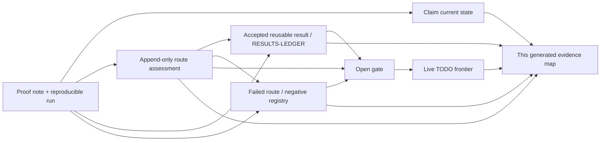
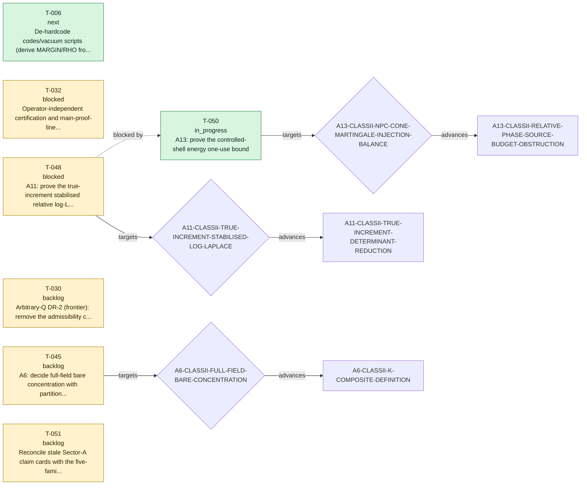

# TECT proof evidence map

> GENERATED by `verification/scripts/build_proof_evidence_map.py` - do not hand-edit. 
> This is a complete-by-reference navigation and audit surface, not a new proof or tier authority.

Use this page to see what succeeded, what failed and why, what remains open,
and where each assertion can be reproduced. The linked claim card, proof note/run,
result ledger, exploration record, negative-result entry, gate definition, task ledger, or changelog entry
always remains authoritative.

## One-glance record flow



## Repository proof snapshot

| Record class | Count | Meaning |
|---|---:|---|
| Status cards | 49 | 48 active; 1 refuted |
| Reusable result records | 68 | Curated theorems, reductions, partial advances, and no-go lemmas with proof anchors |
| Negative/audit records | 40 indexed + 3 legacy process lessons | No-go, falsifier, retraction, and process-audit trust assets with evidence and consequence |
| Proof explorations | 13 | Route decisions: advanced 1, failed 5, inconclusive 5, parked 2; non-tier-bearing |
| Accepted chronological events | 352 | Complete history is preserved in the JSON map and `CHANGELOG.md` |
| Tasks | 51 | 7 live; 44 completed |
| Current route gates | 18 | 17 claim-card gates plus live-task child targets, deduplicated |
| Proof evidence inventory | 296 lineage notes / 277 sibling PDFs / 9 legacy unordered root notes / 9 paired root PDFs / 231 run JSON files / 26 claim-level manifests / 40 bundle manifests / 45 frozen embedded manifests | Complete paths and disjoint manifest classes are stored per claim in the machine map; 19 historical/superseded lineage-note paths lack a sibling PDF and 118 grandfathered evidence notes have incomplete standard footers, all kept visible |

## Coverage diagnostics

These are visible migration or metadata debts, not silently dropped records.

| Diagnostic | Count | Management rule |
|---|---:|---|
| Claims without generated `INDEX.md` | 24 | Evidence-map and sector-dossier links fall back to `claim.md`; `LINEAGE.md` remains available |
| Historical/superseded notes without sibling PDF | 19 | Paths remain in machine inventory; current-note PDF enforcement is unchanged |
| Grandfathered notes with incomplete standard footer | 118 | Kept visible; notes first issued on/after 2026-07-24 fail the map gate if any mandatory footer label is absent |
| Claim cards listing a gate whose registered status begins `CLOSED` | 2 | Exposed as reconciliation debt; the map does not silently flip claim cards |
| Claim-unbound reusable results / negative records | 0 / 1 | Ambiguous family references stay unbound; no claim edge is invented |
| Completed-task references to retired gate identifiers | 5 | Preserved as `historical_gate_reference` nodes anchored to `todo/todo.json`, never mislinked to the current gate registry |
| Changelog tokens that are not current claim-card IDs | 98 | Preserved in event metadata but never promoted to claim edges; many are historical proof-unit IDs from the legacy extractor |
| Changelog negative tags absent from the indexed registry | 3 | Preserved as historical event text, rendered without a false registry anchor, and excluded from negative graph edges |
| Historical exploration backfill | 13 | Directly recovered from cited tracked evidence; pre-2026-07-24 chat-only deliberation is explicitly not claimed complete |

## Current proof-route roadmap



| Task | State | Claim | Target gate | Core next action / reason |
|---|---|---|---|---|
| **T-050** A13: prove the controlled-shell energy one-use bound | in_progress | [A13-CLASSII-RELATIVE-PHASE-SOURCE-BUDGET-OBSTRUCTION](../claims/A13-CLASSII-RELATIVE-PHASE-SOURCE-BUDGET-OBSTRUCTION/claim.md) | [A13-CLASSII-NPC-CONE-MARTINGALE-INJECTION-BALANCE](../claims/GATES.md#a13-classii-npc-cone-martingale-injection-balance) | A13-CLASSII-TIP-SAFE-GROUPED-HARVEST-CARLESON-REDUCTION proves the exact nonlinear harvest, full conservative-score Carleson estimate, uncontrolled-Gaussian N^-1/N^-2 score tails, CAT(0) whole secant through the cone tip, floor-uniform physical distance, and the global centered-form one-use estimate with exponent 10/3 at kappa=1/10. It retires direct absolute-score integration and corrects the full nonlinear-remainder decay claim. Next prove the finite-cutoff tip-safe production good/bad Schur--Jacobi lemma with causal grouping, then the finite-energy extension; one-use and Nelson remain open. |
| **T-006** De-hardcode codes/vacuum scripts (derive MARGIN/RHO from source) + add check_code_discipline.py to release_check | next | [B1-RH-ENUM](../claims/B1-RH-ENUM/claim.md) | - | MARGIN de-hardcoded 2026-06-07 (codes/vacuum/sectorb_common.py single source; scscope+robustness import margin_of). REMAINING: RHO consolidation + automated check_code_discipline.py wired into release_check (no-hardcoding + self-test + JSON-artefact scan). |
| **T-032** Operator-independent certification and main-proof-line decision for the canonical N-001 scalar-slice manifest before any T5 package | blocked | [A1-PRODUCTION-KERNEL-MANIFEST](../claims/A1-PRODUCTION-KERNEL-MANIFEST/claim.md) | - | Promotion package reconciled 2026-07-16: v1.6 verifier 14/14 PASS; historical bundles are pre-certification evidence with verified manifests. Required: independent run, ratify eps_Z/eps_m/eps_r plus config and three source hashes, then decide main-line status. No tier action until those decisions. |
| **T-048** A11: prove the true-increment stabilised relative log-Laplace bound | blocked | [A11-CLASSII-TRUE-INCREMENT-DETERMINANT-REDUCTION](../claims/A11-CLASSII-TRUE-INCREMENT-DETERMINANT-REDUCTION/claim.md) | [A11-CLASSII-TRUE-INCREMENT-STABILISED-LOG-LAPLACE](../claims/GATES.md#a11-classii-true-increment-stabilised-log-laplace) | Blocked by T-050. Blocked by T-050 at A13-CLASSII-CONTROLLED-SHELL-ENERGY-ONE-USE. A13 v1.1 proves exact equivalence to the q=10/9 Nelson moment and retires local Bellman, endpoint-only timewise Young, repeated past-energy, and direct one-shot Ramer repairs. Only after a signed global cancellation closes the one-use theorem may the A11 stabilised relative log-Laplace statement be reformulated; no unique successor method is assumed. |
| **T-030** Arbitrary-Q DR-2 (frontier): remove the admissibility cap from Lemma 1's backing; currently T6-conditional on Bourgain-Demeter decoupling. NOT load-bearing for the C_full main theorem (Lemma 2 caps T'<=10 in... | backlog | [B5-BEYOND-LAYER-BOUND](../claims/B5-BEYOND-LAYER-BOUND/claim.md) | - | OPEN FRONTIER (arbitrary-Q DR-2). D2-A 2026-06-12: DR2-SHARE gate formally rescoped here as NON-LOAD-BEARING for the published C_full head (Lemma 2 caps T'<=10 in-class). Content: BD-conditional T6 (separated Q); PSM conjecture T2; elementary route open. |
| **T-045** A6: decide full-field bare concentration with partition-function tube bounds and tightness | backlog | [A6-CLASSII-K-COMPOSITE-DEFINITION](../claims/A6-CLASSII-K-COMPOSITE-DEFINITION/claim.md) | [A6-CLASSII-FULL-FIELD-BARE-CONCENTRATION](../claims/GATES.md#a6-classii-full-field-bare-concentration) |  |
| **T-051** Reconcile stale Sector-A claim cards with the five-family theorem map | backlog | - | - | One substantive claim card per turn. Correct stale next_action/open-gate text in A10, A9, A11, A12, A6, A5, and A4 without changing valid tiers or immutable IDs; regenerate all ledgers after each card. |

## Sector state map

| Sector | Status cards | Lifecycle | Tier profile | Current route gates | Live tasks |
|---|---:|---|---|---:|---|
| [A](sectors/A.md) | 21 | 21 active / 0 refuted | T6x9 T5x7 T4x5 | 10 | T-050, T-032, T-048, T-045 |
| [B](sectors/B.md) | 7 | 6 active / 1 refuted | T7x3 T5x1 T4x1 T1x1 T0x1 | 1 | T-006, T-030 |
| [C](sectors/C.md) | 6 | 6 active / 0 refuted | T6x4 T5x1 T1x1 | 5 | - |
| [D](sectors/D.md) | 6 | 6 active / 0 refuted | T6x2 T5x1 T3x1 T1x2 | 1 | - |
| [E](sectors/E.md) | 6 | 6 active / 0 refuted | T4x1 T2x1 T1x4 | 1 | - |
| [F](sectors/F.md) | 3 | 3 active / 0 refuted | T4x1 T1x2 | 1 | - |

## Current route-gate ownership

This union keeps claim-card umbrella gates and live-task child gates visible together.
Ownership source remains explicit; the map does not rewrite a claim card.

| Gate | Claim owners | Source | Live tasks | Current registered status |
|---|---|---|---|---|
| [A10-CLASSII-MULTISCALE-ACTION-DECOMPOSITION](../claims/GATES.md#a10-classii-multiscale-action-decomposition) | [A10-CLASSII-RELATIVE-COMMUTATOR-REDUCTION](../claims/A10-CLASSII-RELATIVE-COMMUTATOR-REDUCTION/claim.md), [A9-CLASSII-SMART-PATH-CANCELLATION](../claims/A9-CLASSII-SMART-PATH-CANCELLATION/claim.md) | claim card | - | CLOSED@A11-TRUE-INCREMENT-DETERMINANT (2026-07-21). A10 proves exactly `Q_j^fr+C_j=V_j-V_(j-1)+q_(B(phi_(j-1)))(D phi_(j-1))`, hence `sum_j(Q_j^fr+C_j)=V_J+E_J` when `V_0=0`. Since `E_J>=0`, the actual action is the shell expression minus `E_J`; positivity has the wrong direction for a lower bound. `A11-CLASSII-TRUE-INCREMENT-DETERMINANT-REDUCTION` proves that the quantitative upper-form branch is impossible already under the base Gaussian: `E E_J/(L^3 2^J)->kappa_II>0` while entropy vanishes and terminal `L4/L6` moments remain bounded. It then defines `I_j=Q_j^fr-q_(B(phi_(j-1)))(D phi_(j-1))` and proves exactly `I_j+C_j=V_j-V_(j-1)` together with its noncentral conditional determinant. Thus action reconstruction is closed by the true-increment branch, not by past-energy absorption. The determinant's positive source-square is the separate successor gate below. |
| [A10-CLASSII-STABILISED-RELATIVE-LOG-LAPLACE](../claims/GATES.md#a10-classii-stabilised-relative-log-laplace) | [A10-CLASSII-RELATIVE-COMMUTATOR-REDUCTION](../claims/A10-CLASSII-RELATIVE-COMMUTATOR-REDUCTION/claim.md), [A9-CLASSII-SMART-PATH-CANCELLATION](../claims/A9-CLASSII-SMART-PATH-CANCELLATION/claim.md) | claim card | - | OPEN AS A HISTORICAL Q-RELATIVE BRANCH; SUPERSEDED ON THE ACTIVE TRUE-INCREMENT COMPOSITION (2026-07-21). A10 proves the exact finite-cutoff Gibbs-variational equivalence, the necessity of `alpha_c>0`, and the two-antecedent conditional composition theorem. In that theorem `C_fr=C_sh(L)M_R^4 c_sym^-2 beta_B^2 C_LP,4^4 S_dy`, `K_f=(1-theta)^2 C_fr/(4 alpha_f)`, `B_6=gamma/6-epsilon_6-epsilon_d`, and `A_4=[K_theta+K_f+K_d-lambda/4]_+`. If some `p>1` satisfies `p(alpha_f+alpha_c+alpha_d)<1`, closure of both open gates would imply `log E exp(-pS_J)<=p(C_theta+C_d)+4pL^3A_4^3/(27B_6^2)`. The proof-friendly target is `theta=0.90`, `alpha_f=0.05`, `alpha_c=0.80`, `alpha_d=0.04`, `epsilon_6=0.25`, `epsilon_d=0.01`, and `p=1.10`. It gives `p*alpha=0.979` and `B_6=0.01`, but `K_d,C_d` remain symbolic and neither open estimate is proved. No A7 Nelson closure or interacting Gibbs measure is claimed. |
| [A11-CLASSII-ADAPTED-SOURCE-SQUARE-BOUND](../claims/GATES.md#a11-classii-adapted-source-square-bound) | [A11-CLASSII-TRUE-INCREMENT-DETERMINANT-REDUCTION](../claims/A11-CLASSII-TRUE-INCREMENT-DETERMINANT-REDUCTION/claim.md) | claim card | - | OPEN (2026-07-21), ANALYTICALLY REDUCED BUT THE FIRST BUDGET ROUTE REFUTED BY A12. The true-increment determinant is `-0.5 log det_2(I+pT_j)+0.5 p^2<ell_j,(I+pT_j)^(-1)ell_j>` with `ell_j=G_j^*B(phi_(j-1))D phi_(j-1)`. A scalar source family proves that no Hilbert--Schmidt-only estimate can delete this positive term. A9 already controls the summed Hilbert--Schmidt part by a terminal quartic. The present source-square is therefore the first surviving load-bearing analytic gate. A12 proves a cutoff-uniform coarse form with `C_src=(beta_op^2/c_sym) M_R^2 M_6^4 Q_6^2`, where `beta_op=0.0423749999999894` is the sharp production Pauli/Fierz operator constant and `beta_op^2/c_sym=0.016570372383568618`. Exact dyadic boundary modulation now gives `M_6>=8`, `Q_6>=8sqrt(3)`, and `M_6^4 Q_6^2>=786432`, so the separated norm route cannot meet the isolated production target. The same witness refutes the coefficient-blind scalar six-linear envelope. The surviving gate must retain the exact null identity `B(X)JX=0`, the output shell, and preferably the determinant resolvent. |
| [A11-CLASSII-TRUE-INCREMENT-STABILISED-LOG-LAPLACE](../claims/GATES.md#a11-classii-true-increment-stabilised-log-laplace) | [A11-CLASSII-TRUE-INCREMENT-DETERMINANT-REDUCTION](../claims/A11-CLASSII-TRUE-INCREMENT-DETERMINANT-REDUCTION/claim.md) | claim card + live task | T-048 | OPEN, BLOCKED IN PROOF ORDER BY `A11-CLASSII-ADAPTED-SOURCE-SQUARE-BOUND` (2026-07-21). The historical A10 bound for `theta Q_j^fr+C_j` is not the required statement: the two variables differ by the positive past energy whose direct upper form is refuted. After the source theorem, the determinant contribution has conditional budget `-alpha_f H-s^2 C_fr/(4 alpha_f) E\|\|phi\|\|_4^4` `-s^2 C_src/(2 alpha_f) E\|\|phi\|\|_6^6`, `s=1-theta`. All constants and the remaining sextic reserve must be recomputed before any A7 Nelson conclusion. |
| [A13-CLASSII-CONTROLLED-SHELL-ENERGY-ONE-USE](../claims/GATES.md#a13-classii-controlled-shell-energy-one-use) | [A13-CLASSII-RELATIVE-PHASE-SOURCE-BUDGET-OBSTRUCTION](../claims/A13-CLASSII-RELATIVE-PHASE-SOURCE-BUDGET-OBSTRUCTION/claim.md) | claim card | - | OPEN (reviewed 2026-07-23), SOLE CANONICAL OBJECTIVE AFTER THE ARCHITECTURE NOGOS. The translation-model reduction proves the exact finite-cutoff translation and Cartan identities and deterministic-shift expectation positivity. It admits the explicit candidate `epsilon_6=0.15`, `delta=0.06`, `epsilon_v=0.45`, leaving sextic margin `0.06`; the theorem is exactly equivalent to `sup_J E exp[-(10/9)(V_J^ren+0.15\|\|phi\|\|_6^6)]<infinity`. Restating Boue--Dupuis, entropy, Follmer, or HJB is therefore circular. The production nonfrozen derivative has a genuine coefficient curl. With the correct Ramer coefficient `t=(10/9)/2=5/9`, two independent finite-mode routes find a determinant sign change near amplitude `3.49230586`, registered as `NG-2026-07-22-A13-NONFROZEN-RAMER-ONE-SHOT`. This refutes one-shot `xi+t b_J(xi)`, not the objective. No unique proof antecedent is claimed. Any continuation must retain a signed global cancellation, for example by a genuinely triangular/flow transport or direct constructive estimate. Coefficient-one conditioning, the finite-bank Bellman class, repeated past energy, endpoint-only timewise Young, resolvent-only repair, and separate payment of the Ramer square plus inverse determinant are excluded. The backward-heat continuation cancels the uncontrolled heat drift exactly and puts the finite-low and covariance-trace channels below arbitrary budgets for regular mutually orthogonal one-shot controls. The subsequent `A13-CLASSII-NPC-CONE-MARTINGALE-INJECTION-REDUCTION` diagonalises the current at the Nelson exponent, proves the aggregate CAT(0) cone and strong Jacobi remainder, and exposes the exact raw-energy/injection telescope. It also refutes shellwise raw-secant positivity at a positive floor and refutes a geometry-only abstract proof without producing a production counterexample. The current child is `A13-CLASSII-NPC-CONE-MARTINGALE-INJECTION-BALANCE`; the extension to every finite-energy drift and the umbrella theorem remain open. |
| [A13-CLASSII-NPC-CONE-MARTINGALE-INJECTION-BALANCE](../claims/GATES.md#a13-classii-npc-cone-martingale-injection-balance) | [A13-CLASSII-RELATIVE-PHASE-SOURCE-BUDGET-OBSTRUCTION](../claims/A13-CLASSII-RELATIVE-PHASE-SOURCE-BUDGET-OBSTRUCTION/claim.md) | live task | T-050 | REDUCED-NOT-CLOSED CURRENT CHILD (2026-07-23), proof-ordered after `A13-CLASSII-TIP-SAFE-GROUPED-HARVEST-CARLESON-REDUCTION` and before `A13-CLASSII-CONTROLLED-SHELL-ENERGY-ONE-USE`. The reduction proves the exact nonlinear Tikhonov harvest; full-score Carleson estimate; uncontrolled-base `N^-1`/`N^-2` Gaussian tails; CAT(0) whole-secant through the tip; floor-uniform physical distance; and, for `0<kappa<1`, the global centered-form bound with random-norm exponent `3/(1-kappa)` (`10/3` at `kappa=1/10`). It also proves that direct absolute-score integration cannot meet arbitrary budgets and that only the second product in the nonlinear current remainder has the advertised standalone `N^-3/2` decay. The exact successor is a finite-cutoff production good/bad Schur--Jacobi inequality: complete the derivative displacement on the good region, use the whole secant without the invalid tangent on the bad tip-region, leave only the global centered `Q` form plus an `N^-3` trace term, telescope pure-control current creation, and use Gaussian score tails only on Gaussian-rooted terms. Exact isolated `1:2` and `1:3` adapted harmonics remain summable and do not falsify this global statement. The production lemma, finite-energy extension, one-use, Nelson theorem, and any tier promotion remain open. |
| [A6-CLASSII-COUNTERTERM-CLOSURE](../claims/GATES.md#a6-classii-counterterm-closure) | [A6-CLASSII-K-COMPOSITE-DEFINITION](../claims/A6-CLASSII-K-COMPOSITE-DEFINITION/claim.md), [A6-CLASSII-UV-POWER-COUNTING](../claims/A6-CLASSII-UV-POWER-COUNTING/claim.md) | claim card | - | OPEN, COMPOSITE SUBGATE CLOSED (2026-07-20). The bare Gaussian-reference growth and the current `K_A` are classified. The literal subtraction `-delta_cube*N*W_eps(Psi)` with fixed lower-order coefficients is eliminated as a uniform-coercivity route: a homogeneous first-two-component trial has `\|Psi_N\|=Theta(N^(1/4))` and energy `-Theta(N^(3/2))`. A vacuum shift does not repair the escaping amplitude. Adding a running family mass can restore nonnegativity but also drives the same components toward zero, so it is a new renormalisation condition rather than closure. `A7-CLASSII-RENORMALISED-ENERGY-COMPOSITE` now closes at scoped T5 the exact covariance-normal-ordered joint definition of `J^2`, `J*K`, and `K^2`, the exact finite Gaussian-IBP two-point connection classification, and convergence in `L2(Omega;H^(-1-kappa))` for every `kappa>0`. This does not close the present gate: the self-coupled weight still needs a uniform negative-exponential bound, partition-density convergence, and tightness. Those requirements are tracked by `A7-CLASSII-NELSON-EXPONENTIAL-BOUND`; bare concentration remains separate. |
| [A6-CLASSII-FULL-FIELD-BARE-CONCENTRATION](../claims/GATES.md#a6-classii-full-field-bare-concentration) | [A6-CLASSII-K-COMPOSITE-DEFINITION](../claims/A6-CLASSII-K-COMPOSITE-DEFINITION/claim.md), [A6-CLASSII-UV-POWER-COUNTING](../claims/A6-CLASSII-UV-POWER-COUNTING/claim.md), [A7-CLASSII-RENORMALISED-ENERGY-COMPOSITE](../claims/A7-CLASSII-RENORMALISED-ENERGY-COMPOSITE/claim.md) | claim card + live task | T-045 | OPEN (2026-07-20). The exact bound `9*lambda_min(Q_II)*s <= W_eps <= 9*(a+2b+c)*s` fixes the zero set of the conditional contraction only. Two local proxies are solved at T5: the mean-contraction proxy gives `t*s -> Gamma(2,rate=9*(a+2b+c))`, while exact one-point Gaussian derivative integration gives density `35*g^2*r*(1+2*g*r)^(-9/2)`. Their distinct means show that proxy choice is load-bearing. Neither result is a full-field concentration theorem, and no pathwise inequality identifies the complete Class-II energy with `delta_cube*N*W_eps`. In fact, `Psi(x)=exp(i*k.x)u` with an active first doublet has `J_A=K_A=F_II=0` while `W_eps(u)>0`. Pure-third concentration therefore cannot be inferred from the conditional contraction; all null branches must be compared. |
| [A7-CLASSII-NELSON-EXPONENTIAL-BOUND](../claims/GATES.md#a7-classii-nelson-exponential-bound) | [A7-CLASSII-RENORMALISED-ENERGY-COMPOSITE](../claims/A7-CLASSII-RENORMALISED-ENERGY-COMPOSITE/claim.md) | claim card | - | OPEN, DECOUPLED SPATIAL-BACKGROUND SUBGATE CLOSED (2026-07-20). The A7 composite action converges in `L2`, has mean zero, and its finite-cutoff partition functions have a uniform positive Jensen lower bound. `A8-CLASSII-DECOUPLED-NELSON-BOUND` upgrades the old constant-background audit to every deterministic spatial PSD `L2` matrix field, including the exact `det_2` identity, the cutoff-uniform Schatten bound with its required `M_R^4` regulator factor, sextic absorption, and full-sequence convergence of the independent coefficient/derivative product-Gaussian model. It also records the exact finite-cutoff Gaussian-divergence identity for A7. None of these results makes `B(X)` independent of the derivative carrier. Closure therefore still requires a genuine self-coupled estimate, now tracked by `A7-CLASSII-SELF-COUPLING-INTERPOLATION`. `L2` action convergence, finite-cutoff sextic normalisability, and the decoupled determinant are insufficient. Density-floor removal and infinite volume are not part of this gate. |
| [A7-CLASSII-SELF-COUPLING-INTERPOLATION](../claims/GATES.md#a7-classii-self-coupling-interpolation) | [A8-CLASSII-DECOUPLED-NELSON-BOUND](../claims/A8-CLASSII-DECOUPLED-NELSON-BOUND/claim.md) | claim card | - | OPEN, EXACT SMART-PATH/FROZEN-SHELL SUBGATE CLOSED (2026-07-20); FORMER COMMUTATOR-ALONE SUBGATE FALSIFIED (2026-07-21). `A9-CLASSII-SMART-PATH-CANCELLATION` reaches both finite-cutoff interpolation endpoints, proves the exact Gaussian-IBP cancellation of the apparent trace-class terms, and closes the arbitrary-source noncentral frozen-shell determinant with a summable `2^(-j)` cost. It also shows that deterministic or independent Cameron--Martin shifts have nonnegative expected renormalised energy. A resonant covariance-contracted Gaussian tilt with a Cameron--Martin mean now falsifies the former commutator-alone infinitesimal form bound without touching those positive results. The corrected designated route must retain a fixed fraction of the complete covariance-normal frozen energy and is registered as `A7-CLASSII-FROZEN-ENERGY-RELATIVE-COMMUTATOR-BOUND` below. The adapted-drift and smart-path criteria remain separate sufficient routes; no equivalence is asserted. The self-coupled Nelson estimate and Gibbs measure remain open. |
| [C6-BCC-PREMISE-BLOCKED](../claims/GATES.md#c6-bcc-premise-blocked) | [C6-SPACETIME-SIGNATURE](../claims/C6-SPACETIME-SIGNATURE/claim.md) | claim card | - | See gate definition. |
| [CP-UNITARITY](../claims/GATES.md#cp-unitarity) | [D4-QUANTUM-CONSISTENCY](../claims/D4-QUANTUM-CONSISTENCY/claim.md) | claim card | - | OPEN |
| [ESTIMATOR-UPGRADE](../claims/GATES.md#estimator-upgrade) | [B3-RH-TESTED-STRUCTURE-RANKING](../claims/B3-RH-TESTED-STRUCTURE-RANKING/claim.md) | claim card | - | CLOSED@CONTROLLED-ERROR (operator-authorized 2026-06-07) |
| [GAP-3](../claims/GATES.md#gap-3) | [C5-NEWTON-G](../claims/C5-NEWTON-G/claim.md), [E1-HIGGS-EW](../claims/E1-HIGGS-EW/claim.md), [E3-GAUGE-COUPLINGS](../claims/E3-GAUGE-COUPLINGS/claim.md), [E4-FERMION-MASSES](../claims/E4-FERMION-MASSES/claim.md), [E5-CKM-MIXING](../claims/E5-CKM-MIXING/claim.md), [E6-PMNS-NEUTRINO](../claims/E6-PMNS-NEUTRINO/claim.md) | claim card | - | OPEN (ledger seeded) |
| [GAP-4](../claims/GATES.md#gap-4) | [F1-COSMO-DARK-SECTOR](../claims/F1-COSMO-DARK-SECTOR/claim.md), [F2-BARYOGENESIS](../claims/F2-BARYOGENESIS/claim.md), [F3-INFLATION-CMB](../claims/F3-INFLATION-CMB/claim.md) | claim card | - | OPEN |
| [H-SUPPRESSION-DISCHARGE](../claims/GATES.md#h-suppression-discharge) | [C1-LORENTZ-KIN](../claims/C1-LORENTZ-KIN/claim.md) | claim card | - | OPEN |
| [PRED-G-FREEZE](../claims/GATES.md#pred-g-freeze) | [C5-NEWTON-G](../claims/C5-NEWTON-G/claim.md) | claim card | - | OPEN |
| [SCHEME-2LOOP](../claims/GATES.md#scheme-2loop) | [C4-GRAVITY-1LOOP](../claims/C4-GRAVITY-1LOOP/claim.md) | claim card | - | OPEN (recommended) |

## Proof-exploration decision record

This is the complete projection of `explorations/log.jsonl`. It records
researcher-reusable route decisions, not private token-by-token reasoning.
`advanced` is not proof; `failed` is not a formal global no-go unless an
explicit negative-registry reference is present. Prospective mandatory
coverage begins 2026-07-24; older backfill is evidence-limited.

### Recorded inconclusive or parked route assessments

This table is a review aid, not a substitute for the live TODO order.

| Exploration | Reviewed | Verdict | Claim / gate | Finding | Next or resume condition |
|---|---|---|---|---|---|
| [EXP-000012](#exp-000012) Joint-source v1.0 run provenance is not reconstructible from current same-named files | 2026-07-22 | parked | [A13-CLASSII-RELATIVE-PHASE-SOURCE-BUDGET-OBSTRUCTION](../claims/A13-CLASSII-RELATIVE-PHASE-SOURCE-BUDGET-OBSTRUCTION/claim.md)<br/>[A13-CLASSII-CONTROLLED-SHELL-ENERGY-ONE-USE](../claims/GATES.md#a13-classii-controlled-shell-energy-one-use) | The current source is a supersession pointer and the PDF hash differs, so the old runs are development provenance only; v1.1 is the sole current package. | Reopen only if the original hash-matching v1.0 artifacts are recovered; otherwise cite v1.1 for current evidence. |
| [EXP-000001](#exp-000001) Deterministic and Gaussian-base estimates do not transfer to adapted control | 2026-07-23 | inconclusive | [A13-CLASSII-RELATIVE-PHASE-SOURCE-BUDGET-OBSTRUCTION](../claims/A13-CLASSII-RELATIVE-PHASE-SOURCE-BUDGET-OBSTRUCTION/claim.md)<br/>[A13-CLASSII-CONTROLLED-SHELL-ENERGY-ONE-USE](../claims/GATES.md#a13-classii-controlled-shell-energy-one-use) | The deterministic statements and uncontrolled-base tails do not control the adapted tilted law; direct Malliavin integration by parts introduces an unpaid derivative of the control. | Isolate Gaussian-rooted terms and prove a signed global relative-form or backward log-Laplace estimate without differentiating the control. |
| [EXP-000004](#exp-000004) Heat-current identity depends on pinned covariance and is not a global estimate | 2026-07-23 | inconclusive | [A13-CLASSII-RELATIVE-PHASE-SOURCE-BUDGET-OBSTRUCTION](../claims/A13-CLASSII-RELATIVE-PHASE-SOURCE-BUDGET-OBSTRUCTION/claim.md)<br/>[A13-CLASSII-STRICT-PAST-JOINT-REMAINDER-CARTAN-FORM-BOUND](../claims/GATES.md#a13-classii-strict-past-joint-remainder-cartan-form-bound) | The correlated synthetic control produces a nonzero failure, and the heat-semigroup formula identifies curvature without estimating its global sum. | Retain the covariance restriction or prove a replacement decorrelation identity, then establish the cutoff-uniform Cartan/form bound. |
| [EXP-000005](#exp-000005) Sequential normalizers do not close the Nelson estimate | 2026-07-23 | inconclusive | [A13-CLASSII-RELATIVE-PHASE-SOURCE-BUDGET-OBSTRUCTION](../claims/A13-CLASSII-RELATIVE-PHASE-SOURCE-BUDGET-OBSTRUCTION/claim.md)<br/>[A13-CLASSII-AVERAGED-RAW-CURRENT-CARTAN-JACOBI-FORM-BOUND](../claims/GATES.md#a13-classii-averaged-raw-current-cartan-jacobi-form-bound) | The normalizers remain past-dependent, and the reformulations rename the same unresolved averaged raw-current form without supplying an estimate. | Independently lower-bound the averaged raw-current/Cartan-Jacobi form before invoking any equivalent entropy or drift representation. |
| [EXP-000007](#exp-000007) Ordered one-shot shell proof does not cover progressive range revisits | 2026-07-23 | parked | [A13-CLASSII-RELATIVE-PHASE-SOURCE-BUDGET-OBSTRUCTION](../claims/A13-CLASSII-RELATIVE-PHASE-SOURCE-BUDGET-OBSTRUCTION/claim.md)<br/>[A13-CLASSII-AVERAGED-RAW-CURRENT-CARTAN-JACOBI-FORM-BOUND](../claims/GATES.md#a13-classii-averaged-raw-current-cartan-jacobi-form-bound) | The identity Z_(j0-1)=P_<j0 Z_J fails and the low-block estimate needs an additional control term. | Resume only with a separate progressive-flow reduction that pays the revisit term. |
| [EXP-000008](#exp-000008) NPC logarithmic path and affine physical path leave opposite gaps | 2026-07-23 | inconclusive | [A13-CLASSII-RELATIVE-PHASE-SOURCE-BUDGET-OBSTRUCTION](../claims/A13-CLASSII-RELATIVE-PHASE-SOURCE-BUDGET-OBSTRUCTION/claim.md)<br/>[A13-CLASSII-NPC-CONE-MARTINGALE-INJECTION-BALANCE](../claims/GATES.md#a13-classii-npc-cone-martingale-injection-balance) | The cone logarithm contains all Fourier frequencies, so the one-shot Bessel estimate does not apply directly; the affine path preserves shell support but loses the Jacobi sign. | Combine localization and sign through the finite-cutoff production good/bad Schur-Jacobi lemma. |
| [EXP-000010](#exp-000010) Linear score Carleson control is not a grouped finite-secant estimate | 2026-07-23 | inconclusive | [A13-CLASSII-RELATIVE-PHASE-SOURCE-BUDGET-OBSTRUCTION](../claims/A13-CLASSII-RELATIVE-PHASE-SOURCE-BUDGET-OBSTRUCTION/claim.md)<br/>[A13-CLASSII-NPC-CONE-MARTINGALE-INJECTION-BALANCE](../claims/GATES.md#a13-classii-npc-cone-martingale-injection-balance) | Finite path integration creates an unresolved nonlinear coefficient-curvature term, and the linear estimate has a fixed coefficient rather than the arbitrary allocation needed for closure. | Prove a grouped good/bad finite-secant estimate and apply Gaussian tails only after causal Gaussian-root isolation. |

### Complete reviewed chronology

<a id="exp-000002"></a>
#### EXP-000002 — Termwise absolute-value decoupling destroys the translated cancellation

- **Review metadata:** reviewed 2026-07-22; recorded 2026-07-24T03:19:54Z; `historical-backfill`; verdict **failed**.
- **Structured scope:** claim [A13-CLASSII-RELATIVE-PHASE-SOURCE-BUDGET-OBSTRUCTION](../claims/A13-CLASSII-RELATIVE-PHASE-SOURCE-BUDGET-OBSTRUCTION/claim.md); gate [A13-CLASSII-CAMERON-MARTIN-TRANSLATED-CURRENT-MODEL-LIFT](../claims/GATES.md#a13-classii-cameron-martin-translated-current-model-lift); task `T-050`.
- **Question:** Can the first translation terms be estimated separately by absolute values and ordinary paraproduct Young inequalities?
- **Finite checks:** (1) Separate the translated identity into termwise absolute-value estimates. (2) Track the centered Gaussian cancellation and the endpoint random-moment budget.
- **Finding:** Separate absolute values lose the centered Gaussian cancellation, while endpoint paraproduct Young estimates consume the available moment and leave no absorption slot.
- **Decision reason:** The decoupled architecture manufactures false coercivity and exhausts the moment budget before the signed reconstruction is used.
- **Boundary:** This is distinct from the formal endpoint-timewise Young no-go and does not refute a coupled signed reconstruction.
- **Next / revisit condition:** Do not retry termwise decoupling unless a new identity preserves the centered signed cancellation and supplies an independent moment reserve.
- **Related explorations:** -
- **Formal authorities:** [R-060](../RESULTS-LEDGER.md#r-060)
- **Located evidence:** [`claims/A13-CLASSII-RELATIVE-PHASE-SOURCE-BUDGET-OBSTRUCTION/notes/classii-translation-model-reduction-260722-v1.0.tex.txt`](../claims/A13-CLASSII-RELATIVE-PHASE-SOURCE-BUDGET-OBSTRUCTION/notes/classii-translation-model-reduction-260722-v1.0.tex.txt) (L408-L412); [`claims/A13-CLASSII-RELATIVE-PHASE-SOURCE-BUDGET-OBSTRUCTION/notes/classii-translation-model-reduction-260722-v1.0.tex.txt`](../claims/A13-CLASSII-RELATIVE-PHASE-SOURCE-BUDGET-OBSTRUCTION/notes/classii-translation-model-reduction-260722-v1.0.tex.txt) (L430-L433)

<a id="exp-000011"></a>
#### EXP-000011 — Cone-contraction sign and total-tree noncancellation overclaim were corrected

- **Review metadata:** reviewed 2026-07-22; recorded 2026-07-24T03:19:54Z; `historical-backfill`; verdict **failed**.
- **Structured scope:** claim [A13-CLASSII-RELATIVE-PHASE-SOURCE-BUDGET-OBSTRUCTION](../claims/A13-CLASSII-RELATIVE-PHASE-SOURCE-BUDGET-OBSTRUCTION/claim.md); gate [A13-CLASSII-COEFFICIENT-JET-RENORMALISATION-CLASSIFICATION](../claims/GATES.md#a13-classii-coefficient-jet-renormalisation-classification); task `T-050`.
- **Question:** Did the localized cone calculation have the recorded sign, and did its logarithmic component prove noncancellation of the full symmetric Littlewood-Paley tree?
- **Finite checks:** (1) Recompute the derivative-convention sign of the two-matching cone coefficient. (2) Separate one localized contraction class from the complete symmetric tree.
- **Finding:** The coefficient is negative and equals minus twice the previously recorded positive magnitude; one c log Lambda component does not establish noncancellation of the total tree.
- **Decision reason:** The earlier sign and total-tree inference exceeded what the localized calculation proved.
- **Boundary:** The universal-Q theorem survives, and later complete-tree classification and balanced reconstruction supply the valid replacement.
- **Next / revisit condition:** Use the complete forest and balanced reconstruction; never infer a total-tree result from one localized component.
- **Related explorations:** -
- **Formal authorities:** [R-061](../RESULTS-LEDGER.md#r-061), [R-062](../RESULTS-LEDGER.md#r-062), [R-063](../RESULTS-LEDGER.md#r-063), [NG-2026-07-22-A13-RAW-DIAMOND-JET](../negative-results/registry.md#ng-2026-07-22-a13-raw-diamond-jet), `event:20260722-correct-a13-cone-contraction-sign-and-total-tre`
- **Located evidence:** [`changelog/log.jsonl`](../changelog/log.jsonl) (event-20260722-correct-a13-cone-contraction-sign-and-total-tre); [`claims/A13-CLASSII-RELATIVE-PHASE-SOURCE-BUDGET-OBSTRUCTION/notes/classii-universal-q-cm-translation-260722-v1.0.tex.txt`](../claims/A13-CLASSII-RELATIVE-PHASE-SOURCE-BUDGET-OBSTRUCTION/notes/classii-universal-q-cm-translation-260722-v1.0.tex.txt) (cone-localized-certificate)

<a id="exp-000012"></a>
#### EXP-000012 — Joint-source v1.0 run provenance is not reconstructible from current same-named files

- **Review metadata:** reviewed 2026-07-22; recorded 2026-07-24T03:19:54Z; `historical-backfill`; verdict **parked**.
- **Structured scope:** claim [A13-CLASSII-RELATIVE-PHASE-SOURCE-BUDGET-OBSTRUCTION](../claims/A13-CLASSII-RELATIVE-PHASE-SOURCE-BUDGET-OBSTRUCTION/claim.md); gate [A13-CLASSII-CONTROLLED-SHELL-ENERGY-ONE-USE](../claims/GATES.md#a13-classii-controlled-shell-energy-one-use); task `T-050`.
- **Question:** Can the three original v1.0 run JSONs be reproduced from the files currently bearing the v1.0 source and PDF names?
- **Finite checks:** (1) Compare the source and PDF hashes pinned by the 2026-07-21 runs with the current same-named artifacts. (2) Inspect the current source for supersession-pointer content.
- **Finding:** The current source is a supersession pointer and the PDF hash differs, so the old runs are development provenance only; v1.1 is the sole current package.
- **Decision reason:** The original hash-matching source and PDF are absent, making exact v1.0 reconstruction impossible from the current tree.
- **Boundary:** This is an evidence-lineage limitation, not a defect in the hash-pinned v1.1 mathematical package.
- **Next / revisit condition:** Reopen only if the original hash-matching v1.0 artifacts are recovered; otherwise cite v1.1 for current evidence.
- **Related explorations:** -
- **Formal authorities:** `event:20260722-classify-unreconstructible-a13-v1-0-joint-sourc`
- **Located evidence:** [`changelog/log.jsonl`](../changelog/log.jsonl) (event-20260722-classify-unreconstructible-a13-v1-0-joint-sourc); [`claims/A13-CLASSII-RELATIVE-PHASE-SOURCE-BUDGET-OBSTRUCTION/notes/classii-joint-source-potential-reduction-260721-v1.0.tex.txt`](../claims/A13-CLASSII-RELATIVE-PHASE-SOURCE-BUDGET-OBSTRUCTION/notes/classii-joint-source-potential-reduction-260721-v1.0.tex.txt) (supersession-pointer); [`claims/A13-CLASSII-RELATIVE-PHASE-SOURCE-BUDGET-OBSTRUCTION/runs/2026-07-21-primary-joint-source-potential-reduction/result.json`](../claims/A13-CLASSII-RELATIVE-PHASE-SOURCE-BUDGET-OBSTRUCTION/runs/2026-07-21-primary-joint-source-potential-reduction/result.json) (source-and-pdf-hashes)

<a id="exp-000001"></a>
#### EXP-000001 — Deterministic and Gaussian-base estimates do not transfer to adapted control

- **Review metadata:** reviewed 2026-07-23; recorded 2026-07-24T03:19:54Z; `historical-backfill`; verdict **inconclusive**.
- **Structured scope:** claim [A13-CLASSII-RELATIVE-PHASE-SOURCE-BUDGET-OBSTRUCTION](../claims/A13-CLASSII-RELATIVE-PHASE-SOURCE-BUDGET-OBSTRUCTION/claim.md); gate [A13-CLASSII-CONTROLLED-SHELL-ENERGY-ONE-USE](../claims/GATES.md#a13-classii-controlled-shell-energy-one-use); task `T-050`.
- **Question:** Can deterministic translation positivity, deterministic Cameron-Martin continuity, or uncontrolled Gaussian score tails be reused after the control becomes adapted?
- **Finite checks:** (1) Compare the deterministic translation and universal-Q hypotheses with the adapted-shift target. (2) Test whether Gaussian integration by parts differentiates the control and whether the Boue-Dupuis cost pays that derivative. (3) Check the probability-law scope of the score-tail estimate.
- **Finding:** The deterministic statements and uncontrolled-base tails do not control the adapted tilted law; direct Malliavin integration by parts introduces an unpaid derivative of the control.
- **Decision reason:** The available estimates have the wrong law or regularity scope for the adapted one-use theorem.
- **Boundary:** This does not refute an adapted signed global estimate or the one-use theorem.
- **Next / revisit condition:** Isolate Gaussian-rooted terms and prove a signed global relative-form or backward log-Laplace estimate without differentiating the control.
- **Related explorations:** -
- **Formal authorities:** [R-060](../RESULTS-LEDGER.md#r-060), [R-061](../RESULTS-LEDGER.md#r-061), [R-066](../RESULTS-LEDGER.md#r-066), [R-068](../RESULTS-LEDGER.md#r-068)
- **Located evidence:** [`claims/A13-CLASSII-RELATIVE-PHASE-SOURCE-BUDGET-OBSTRUCTION/notes/classii-translation-model-reduction-260722-v1.0.tex.txt`](../claims/A13-CLASSII-RELATIVE-PHASE-SOURCE-BUDGET-OBSTRUCTION/notes/classii-translation-model-reduction-260722-v1.0.tex.txt) (L414-L417); [`claims/A13-CLASSII-RELATIVE-PHASE-SOURCE-BUDGET-OBSTRUCTION/notes/classii-universal-q-cm-translation-260722-v1.0.tex.txt`](../claims/A13-CLASSII-RELATIVE-PHASE-SOURCE-BUDGET-OBSTRUCTION/notes/classii-universal-q-cm-translation-260722-v1.0.tex.txt) (L394-L397); [`claims/A13-CLASSII-RELATIVE-PHASE-SOURCE-BUDGET-OBSTRUCTION/notes/classii-backward-heat-martingale-square-coupled-cartan-reduction-260723-v1.0.tex.txt`](../claims/A13-CLASSII-RELATIVE-PHASE-SOURCE-BUDGET-OBSTRUCTION/notes/classii-backward-heat-martingale-square-coupled-cartan-reduction-260723-v1.0.tex.txt) (L585-L605); [`claims/A13-CLASSII-RELATIVE-PHASE-SOURCE-BUDGET-OBSTRUCTION/notes/classii-tip-safe-grouped-harvest-carleson-reduction-260723-v1.0.tex.txt`](../claims/A13-CLASSII-RELATIVE-PHASE-SOURCE-BUDGET-OBSTRUCTION/notes/classii-tip-safe-grouped-harvest-carleson-reduction-260723-v1.0.tex.txt) (L518-L521)

<a id="exp-000003"></a>
#### EXP-000003 — Strict-past causal completion is expectation-only

- **Review metadata:** reviewed 2026-07-23; recorded 2026-07-24T03:19:54Z; `historical-backfill`; verdict **failed**.
- **Structured scope:** claim [A13-CLASSII-RELATIVE-PHASE-SOURCE-BUDGET-OBSTRUCTION](../claims/A13-CLASSII-RELATIVE-PHASE-SOURCE-BUDGET-OBSTRUCTION/claim.md); gate [A13-CLASSII-STRICT-PAST-JOINT-REMAINDER-CARTAN-FORM-BOUND](../claims/GATES.md#a13-classii-strict-past-joint-remainder-cartan-form-bound); task `T-050`.
- **Question:** Can the strict-past causal completion be promoted to a pointwise square identity or extended to present-shell and future-dependent predictors?
- **Finite checks:** (1) Compare conditional expectation cancellation with the pointwise integrand. (2) Run the registered pointwise-gap and noncausal negative controls.
- **Finding:** The identity holds after conditional expectation only; the pointwise gap is negative in the executable witness, and present-shell or future dependence destroys centering.
- **Decision reason:** The required conditional independence is absent pointwise and under noncausal predictors.
- **Boundary:** The valid strict-past expectation identity and its signed-charge reduction remain intact.
- **Next / revisit condition:** Do not extend the lemma beyond strict past without a separate noncausal or anticipating identity.
- **Related explorations:** -
- **Formal authorities:** [R-064](../RESULTS-LEDGER.md#r-064)
- **Located evidence:** [`claims/A13-CLASSII-RELATIVE-PHASE-SOURCE-BUDGET-OBSTRUCTION/notes/classii-strict-past-signed-causal-reduction-260723-v1.0.tex.txt`](../claims/A13-CLASSII-RELATIVE-PHASE-SOURCE-BUDGET-OBSTRUCTION/notes/classii-strict-past-signed-causal-reduction-260723-v1.0.tex.txt) (L247-L255); [`claims/A13-CLASSII-RELATIVE-PHASE-SOURCE-BUDGET-OBSTRUCTION/runs/2026-07-23-primary-strict-past-signed-causal-reduction/result.json`](../claims/A13-CLASSII-RELATIVE-PHASE-SOURCE-BUDGET-OBSTRUCTION/runs/2026-07-23-primary-strict-past-signed-causal-reduction/result.json) (completion_is_expectation_only_not_pointwise); [`claims/A13-CLASSII-RELATIVE-PHASE-SOURCE-BUDGET-OBSTRUCTION/runs/2026-07-23-independent-strict-past-signed-causal-reduction/result.json`](../claims/A13-CLASSII-RELATIVE-PHASE-SOURCE-BUDGET-OBSTRUCTION/runs/2026-07-23-independent-strict-past-signed-causal-reduction/result.json) (negative-controls)

<a id="exp-000004"></a>
#### EXP-000004 — Heat-current identity depends on pinned covariance and is not a global estimate

- **Review metadata:** reviewed 2026-07-23; recorded 2026-07-24T03:19:54Z; `historical-backfill`; verdict **inconclusive**.
- **Structured scope:** claim [A13-CLASSII-RELATIVE-PHASE-SOURCE-BUDGET-OBSTRUCTION](../claims/A13-CLASSII-RELATIVE-PHASE-SOURCE-BUDGET-OBSTRUCTION/claim.md); gate [A13-CLASSII-STRICT-PAST-JOINT-REMAINDER-CARTAN-FORM-BOUND](../claims/GATES.md#a13-classii-strict-past-joint-remainder-cartan-form-bound); task `T-050`.
- **Question:** Does the conditional heat-current identity survive correlated value-derivative covariance and already bound the global shell sum?
- **Finite checks:** (1) Replace the pinned entrywise-real-even covariance by a correlated synthetic covariance. (2) Separate exact curvature identification from cutoff-uniform summation.
- **Finding:** The correlated synthetic control produces a nonzero failure, and the heat-semigroup formula identifies curvature without estimating its global sum.
- **Decision reason:** The identity is exact only under the pinned covariance, and an additional global Cartan/form inequality is still missing.
- **Boundary:** This does not invalidate the heat-current identity in its declared covariance scope.
- **Next / revisit condition:** Retain the covariance restriction or prove a replacement decorrelation identity, then establish the cutoff-uniform Cartan/form bound.
- **Related explorations:** -
- **Formal authorities:** [R-065](../RESULTS-LEDGER.md#r-065)
- **Located evidence:** [`claims/A13-CLASSII-RELATIVE-PHASE-SOURCE-BUDGET-OBSTRUCTION/notes/classii-strict-past-joint-score-heat-current-reduction-260723-v1.0.tex.txt`](../claims/A13-CLASSII-RELATIVE-PHASE-SOURCE-BUDGET-OBSTRUCTION/notes/classii-strict-past-joint-score-heat-current-reduction-260723-v1.0.tex.txt) (L74-L81); [`claims/A13-CLASSII-RELATIVE-PHASE-SOURCE-BUDGET-OBSTRUCTION/runs/2026-07-23-independent-strict-past-joint-score-heat-current-reduction/result.json`](../claims/A13-CLASSII-RELATIVE-PHASE-SOURCE-BUDGET-OBSTRUCTION/runs/2026-07-23-independent-strict-past-joint-score-heat-current-reduction/result.json) (correlated_failure)

<a id="exp-000005"></a>
#### EXP-000005 — Sequential normalizers do not close the Nelson estimate

- **Review metadata:** reviewed 2026-07-23; recorded 2026-07-24T03:19:54Z; `historical-backfill`; verdict **inconclusive**.
- **Structured scope:** claim [A13-CLASSII-RELATIVE-PHASE-SOURCE-BUDGET-OBSTRUCTION](../claims/A13-CLASSII-RELATIVE-PHASE-SOURCE-BUDGET-OBSTRUCTION/claim.md); gate [A13-CLASSII-AVERAGED-RAW-CURRENT-CARTAN-JACOBI-FORM-BOUND](../claims/GATES.md#a13-classii-averaged-raw-current-cartan-jacobi-form-bound); task `T-050`.
- **Question:** Can Gibbs-Pythagoras and its past-dependent sequential normalizers close Nelson by entropy, HJB, or Foellmer-drift reformulation alone?
- **Finite checks:** (1) Track the filtration dependence of each normalizer. (2) Rewrite the unresolved form in entropy, HJB, and drift language and check whether any new lower bound appears.
- **Finding:** The normalizers remain past-dependent, and the reformulations rename the same unresolved averaged raw-current form without supplying an estimate.
- **Decision reason:** Every proposed reformulation is circular at the missing lower-bound step.
- **Boundary:** The Gibbs-Pythagoras identity itself remains exact and useful.
- **Next / revisit condition:** Independently lower-bound the averaged raw-current/Cartan-Jacobi form before invoking any equivalent entropy or drift representation.
- **Related explorations:** -
- **Formal authorities:** [R-066](../RESULTS-LEDGER.md#r-066)
- **Located evidence:** [`claims/A13-CLASSII-RELATIVE-PHASE-SOURCE-BUDGET-OBSTRUCTION/notes/classii-backward-heat-martingale-square-coupled-cartan-reduction-260723-v1.0.tex.txt`](../claims/A13-CLASSII-RELATIVE-PHASE-SOURCE-BUDGET-OBSTRUCTION/notes/classii-backward-heat-martingale-square-coupled-cartan-reduction-260723-v1.0.tex.txt) (L599-L605); [`claims/A13-CLASSII-RELATIVE-PHASE-SOURCE-BUDGET-OBSTRUCTION/notes/classii-backward-heat-martingale-square-coupled-cartan-reduction-260723-v1.0.tex.txt`](../claims/A13-CLASSII-RELATIVE-PHASE-SOURCE-BUDGET-OBSTRUCTION/notes/classii-backward-heat-martingale-square-coupled-cartan-reduction-260723-v1.0.tex.txt) (L627-L630)

<a id="exp-000006"></a>
#### EXP-000006 — Heat dummy cannot be identified with the future Gaussian field

- **Review metadata:** reviewed 2026-07-23; recorded 2026-07-24T03:19:54Z; `historical-backfill`; verdict **failed**.
- **Structured scope:** claim [A13-CLASSII-RELATIVE-PHASE-SOURCE-BUDGET-OBSTRUCTION](../claims/A13-CLASSII-RELATIVE-PHASE-SOURCE-BUDGET-OBSTRUCTION/claim.md); gate [A13-CLASSII-AVERAGED-RAW-CURRENT-CARTAN-JACOBI-FORM-BOUND](../claims/GATES.md#a13-classii-averaged-raw-current-cartan-jacobi-form-bound); task `T-050`.
- **Question:** Can the spatially constant heat dummy be replaced pathwise by the actual future Gaussian field in the Cartan calculation?
- **Finite checks:** (1) Differentiate both substitutions spatially and compare the Cartan terms. (2) Audit the omitted future-field derivative.
- **Finding:** The actual future field has a spatial derivative that the heat dummy does not; identifying them deletes a term and corrupts the Cartan formula.
- **Decision reason:** The substitution changes the differentiated object and is not an identity.
- **Boundary:** The terminal-backward heat-martingale construction with a genuinely constant dummy is unaffected.
- **Next / revisit condition:** Do not reuse this substitution; any actual-field derivation must retain and control the omitted derivative.
- **Related explorations:** -
- **Formal authorities:** [R-066](../RESULTS-LEDGER.md#r-066)
- **Located evidence:** [`claims/A13-CLASSII-RELATIVE-PHASE-SOURCE-BUDGET-OBSTRUCTION/notes/classii-backward-heat-martingale-square-coupled-cartan-reduction-260723-v1.0.tex.txt`](../claims/A13-CLASSII-RELATIVE-PHASE-SOURCE-BUDGET-OBSTRUCTION/notes/classii-backward-heat-martingale-square-coupled-cartan-reduction-260723-v1.0.tex.txt) (L372-L373); [`claims/A13-CLASSII-RELATIVE-PHASE-SOURCE-BUDGET-OBSTRUCTION/notes/classii-backward-heat-martingale-square-coupled-cartan-reduction-260723-v1.0.tex.txt`](../claims/A13-CLASSII-RELATIVE-PHASE-SOURCE-BUDGET-OBSTRUCTION/notes/classii-backward-heat-martingale-square-coupled-cartan-reduction-260723-v1.0.tex.txt) (L632-L636)

<a id="exp-000007"></a>
#### EXP-000007 — Ordered one-shot shell proof does not cover progressive range revisits

- **Review metadata:** reviewed 2026-07-23; recorded 2026-07-24T03:19:54Z; `historical-backfill`; verdict **parked**.
- **Structured scope:** claim [A13-CLASSII-RELATIVE-PHASE-SOURCE-BUDGET-OBSTRUCTION](../claims/A13-CLASSII-RELATIVE-PHASE-SOURCE-BUDGET-OBSTRUCTION/claim.md); gate [A13-CLASSII-AVERAGED-RAW-CURRENT-CARTAN-JACOBI-FORM-BOUND](../claims/GATES.md#a13-classii-averaged-raw-current-cartan-jacobi-form-bound); task `T-050`.
- **Question:** Does the finite-low-block identity remain valid when a progressive control later revisits an already used low Fourier range?
- **Finite checks:** (1) Recompute the terminal low projection after a later control revisits the range. (2) Check whether the one-shot orthogonal-shell hypothesis can be removed without a new term.
- **Finding:** The identity Z_(j0-1)=P_<j0 Z_J fails and the low-block estimate needs an additional control term.
- **Decision reason:** The current reduction is proved only for mutually orthogonal one-shot shell controls.
- **Boundary:** This is a scope boundary, not a counterexample to the ordered one-shot theorem.
- **Next / revisit condition:** Resume only with a separate progressive-flow reduction that pays the revisit term.
- **Related explorations:** -
- **Formal authorities:** [R-066](../RESULTS-LEDGER.md#r-066)
- **Located evidence:** [`claims/A13-CLASSII-RELATIVE-PHASE-SOURCE-BUDGET-OBSTRUCTION/notes/classii-backward-heat-martingale-square-coupled-cartan-reduction-260723-v1.0.tex.txt`](../claims/A13-CLASSII-RELATIVE-PHASE-SOURCE-BUDGET-OBSTRUCTION/notes/classii-backward-heat-martingale-square-coupled-cartan-reduction-260723-v1.0.tex.txt) (L543-L551); [`claims/A13-CLASSII-RELATIVE-PHASE-SOURCE-BUDGET-OBSTRUCTION/notes/classii-backward-heat-martingale-square-coupled-cartan-reduction-260723-v1.0.tex.txt`](../claims/A13-CLASSII-RELATIVE-PHASE-SOURCE-BUDGET-OBSTRUCTION/notes/classii-backward-heat-martingale-square-coupled-cartan-reduction-260723-v1.0.tex.txt) (L642-L646)

<a id="exp-000008"></a>
#### EXP-000008 — NPC logarithmic path and affine physical path leave opposite gaps

- **Review metadata:** reviewed 2026-07-23; recorded 2026-07-24T03:19:54Z; `historical-backfill`; verdict **inconclusive**.
- **Structured scope:** claim [A13-CLASSII-RELATIVE-PHASE-SOURCE-BUDGET-OBSTRUCTION](../claims/A13-CLASSII-RELATIVE-PHASE-SOURCE-BUDGET-OBSTRUCTION/claim.md); gate [A13-CLASSII-NPC-CONE-MARTINGALE-INJECTION-BALANCE](../claims/GATES.md#a13-classii-npc-cone-martingale-injection-balance); task `T-050`.
- **Question:** Can either the cone logarithm or the affine physical path alone localize the shell increment while retaining the Jacobi sign?
- **Finite checks:** (1) Inspect Fourier support of the nonlinear cone logarithm. (2) Compare Jacobi convexity along the affine physical path.
- **Finding:** The cone logarithm contains all Fourier frequencies, so the one-shot Bessel estimate does not apply directly; the affine path preserves shell support but loses the Jacobi sign.
- **Decision reason:** Each natural path preserves only one of the two load-bearing properties.
- **Boundary:** Neither failure refutes a grouped nonlinear NPC-Carleson or paradifferential bridge.
- **Next / revisit condition:** Combine localization and sign through the finite-cutoff production good/bad Schur-Jacobi lemma.
- **Related explorations:** -
- **Formal authorities:** [R-067](../RESULTS-LEDGER.md#r-067)
- **Located evidence:** [`claims/A13-CLASSII-RELATIVE-PHASE-SOURCE-BUDGET-OBSTRUCTION/notes/classii-npc-cone-martingale-injection-reduction-260723-v1.0.tex.txt`](../claims/A13-CLASSII-RELATIVE-PHASE-SOURCE-BUDGET-OBSTRUCTION/notes/classii-npc-cone-martingale-injection-reduction-260723-v1.0.tex.txt) (L490-L523)

<a id="exp-000009"></a>
#### EXP-000009 — Cone-tip whole secant is closed but separate first variation remains open

- **Review metadata:** reviewed 2026-07-23; recorded 2026-07-24T03:19:54Z; `historical-backfill`; verdict **advanced**.
- **Structured scope:** claim [A13-CLASSII-RELATIVE-PHASE-SOURCE-BUDGET-OBSTRUCTION](../claims/A13-CLASSII-RELATIVE-PHASE-SOURCE-BUDGET-OBSTRUCTION/claim.md); gate [A13-CLASSII-NPC-CONE-MARTINGALE-INJECTION-BALANCE](../claims/GATES.md#a13-classii-npc-cone-martingale-injection-balance); task `T-050`.
- **Question:** Can smooth nonpositive curvature be used directly at the cone tip, and does ambient cone comparison control physical displacement?
- **Finite checks:** (1) Audit the r=0 completion by approximation and lower semicontinuity. (2) Compare cone-log displacement with the production physical endpoint distance. (3) Recheck the issue after the tip-safe grouped-harvest result.
- **Finding:** The later whole-secant and physical endpoint-distance estimates resolve tip crossing without a tangent, but they do not identify a finite separate first variation at every tip contact.
- **Decision reason:** The proof route was repaired by changing from a tangent formula to a strong whole-secant inequality.
- **Boundary:** No finite first-variation theorem at every cone-tip contact is claimed.
- **Next / revisit condition:** Use the whole secant in the good/bad Schur-Jacobi lemma; revisit a separate tangent only if a later argument genuinely requires it.
- **Related explorations:** continues [EXP-000008](#exp-000008)
- **Formal authorities:** [R-067](../RESULTS-LEDGER.md#r-067), [R-068](../RESULTS-LEDGER.md#r-068)
- **Located evidence:** [`claims/A13-CLASSII-RELATIVE-PHASE-SOURCE-BUDGET-OBSTRUCTION/notes/classii-npc-cone-martingale-injection-reduction-260723-v1.0.tex.txt`](../claims/A13-CLASSII-RELATIVE-PHASE-SOURCE-BUDGET-OBSTRUCTION/notes/classii-npc-cone-martingale-injection-reduction-260723-v1.0.tex.txt) (L533-L543); [`claims/A13-CLASSII-RELATIVE-PHASE-SOURCE-BUDGET-OBSTRUCTION/status.json`](../claims/A13-CLASSII-RELATIVE-PHASE-SOURCE-BUDGET-OBSTRUCTION/status.json) (scope); [`claims/A13-CLASSII-RELATIVE-PHASE-SOURCE-BUDGET-OBSTRUCTION/classii_tip_safe_grouped_harvest_carleson_reduction_manifest.json`](../claims/A13-CLASSII-RELATIVE-PHASE-SOURCE-BUDGET-OBSTRUCTION/classii_tip_safe_grouped_harvest_carleson_reduction_manifest.json) (scope)

<a id="exp-000010"></a>
#### EXP-000010 — Linear score Carleson control is not a grouped finite-secant estimate

- **Review metadata:** reviewed 2026-07-23; recorded 2026-07-24T03:19:54Z; `historical-backfill`; verdict **inconclusive**.
- **Structured scope:** claim [A13-CLASSII-RELATIVE-PHASE-SOURCE-BUDGET-OBSTRUCTION](../claims/A13-CLASSII-RELATIVE-PHASE-SOURCE-BUDGET-OBSTRUCTION/claim.md); gate [A13-CLASSII-NPC-CONE-MARTINGALE-INJECTION-BALANCE](../claims/GATES.md#a13-classii-npc-cone-martingale-injection-balance); task `T-050`.
- **Question:** Does the complete linearized conservative-score Carleson bound already control the finite inserted-shell path?
- **Finite checks:** (1) Integrate the linear score along a finite path and retain the coefficient-curvature remainder. (2) Check whether the fixed Carleson coefficient can be made into an arbitrary absorption allocation.
- **Finding:** Finite path integration creates an unresolved nonlinear coefficient-curvature term, and the linear estimate has a fixed coefficient rather than the arbitrary allocation needed for closure.
- **Decision reason:** The estimate controls the complete linearized score, not the grouped finite secant under adapted control.
- **Boundary:** The linear Carleson theorem and uncontrolled-base covariance-tail rates remain valid in their stated scope.
- **Next / revisit condition:** Prove a grouped good/bad finite-secant estimate and apply Gaussian tails only after causal Gaussian-root isolation.
- **Related explorations:** continues [EXP-000009](#exp-000009)
- **Formal authorities:** [R-068](../RESULTS-LEDGER.md#r-068)
- **Located evidence:** [`claims/A13-CLASSII-RELATIVE-PHASE-SOURCE-BUDGET-OBSTRUCTION/notes/classii-tip-safe-grouped-harvest-carleson-reduction-260723-v1.0.tex.txt`](../claims/A13-CLASSII-RELATIVE-PHASE-SOURCE-BUDGET-OBSTRUCTION/notes/classii-tip-safe-grouped-harvest-carleson-reduction-260723-v1.0.tex.txt) (L175-L184); [`claims/A13-CLASSII-RELATIVE-PHASE-SOURCE-BUDGET-OBSTRUCTION/notes/classii-tip-safe-grouped-harvest-carleson-reduction-260723-v1.0.tex.txt`](../claims/A13-CLASSII-RELATIVE-PHASE-SOURCE-BUDGET-OBSTRUCTION/notes/classii-tip-safe-grouped-harvest-carleson-reduction-260723-v1.0.tex.txt) (L513-L521)

<a id="exp-000013"></a>
#### EXP-000013 — Paying the centered form shell by shell repeats the Young constant

- **Review metadata:** reviewed 2026-07-23; recorded 2026-07-24T03:19:54Z; `historical-backfill`; verdict **failed**.
- **Structured scope:** claim [A13-CLASSII-RELATIVE-PHASE-SOURCE-BUDGET-OBSTRUCTION](../claims/A13-CLASSII-RELATIVE-PHASE-SOURCE-BUDGET-OBSTRUCTION/claim.md); gate [A13-CLASSII-NPC-CONE-MARTINGALE-INJECTION-BALANCE](../claims/GATES.md#a13-classii-npc-cone-martingale-injection-balance); task `T-050`.
- **Question:** Can the global centered-form one-use estimate be applied independently on every shell?
- **Finite checks:** (1) Apply the interpolation and Young inequality shellwise. (2) Count the constant remainder across the number of shells.
- **Finding:** Shellwise payment creates one Young constant per shell and therefore a cutoff-dependent loss; the centered forms must be summed before the model norm is paid once.
- **Decision reason:** The shell count turns an otherwise valid local inequality into a divergent global constant.
- **Boundary:** The globally summed centered-form one-use lemma remains valid.
- **Next / revisit condition:** Group the centered form causally across shells, sum first, and apply the model-norm Young bound once.
- **Related explorations:** continues [EXP-000010](#exp-000010)
- **Formal authorities:** [R-068](../RESULTS-LEDGER.md#r-068)
- **Located evidence:** [`claims/A13-CLASSII-RELATIVE-PHASE-SOURCE-BUDGET-OBSTRUCTION/notes/classii-tip-safe-grouped-harvest-carleson-reduction-260723-v1.0.tex.txt`](../claims/A13-CLASSII-RELATIVE-PHASE-SOURCE-BUDGET-OBSTRUCTION/notes/classii-tip-safe-grouped-harvest-carleson-reduction-260723-v1.0.tex.txt) (L529-L531)


## Claim evidence matrix

Each row links current state, accepted evidence, retired routes, open gates,
and the latest accepted change. Counts and associations are derived from the
canonical registries; a dash means no unambiguous registry link, not proof absence.

### Sector A

| Claim | State | Evidence grade | Proof trail | Accepted reusable results | Negative/audit history | Explorations | Current route gates | Latest accepted step | Reproduce |
|---|---|---|---|---|---|---|---|---|---|
| [A1-KERNEL-CONV](../claims/A1-KERNEL-CONV/claim.md)<br/>Production-kernel convention and G6 recomputation cascade | T5 / ACTIVE | EXECUTED | [LINEAGE](../claims/A1-KERNEL-CONV/LINEAGE.md) (0 notes; 3 runs) | - | [AUDIT-2026-07-20-SECTOR-A-BASELINE-STATUS-DRIFT](../negative-results/registry.md#audit-2026-07-20-sector-a-baseline-status-drift), [NG-2026-legacy-convention](../negative-results/registry.md#ng-2026-legacy-convention) | - | - | [Align Sector-A A1, A5, and roadmap records] - 2026-07-20 | [AVAILABLE](../claims/A1-KERNEL-CONV/status.json) |
| [A1-KERNEL-IDENTITY](../claims/A1-KERNEL-IDENTITY/claim.md)<br/>Kernel complete-the-square identity (zero-momentum vs shell mass) | T6 / ACTIVE | ANALYTIC, EXECUTED | [LINEAGE](../claims/A1-KERNEL-IDENTITY/LINEAGE.md) (2 notes; 1 runs) | - | [AUDIT-2026-07-20-SECTOR-A-BASELINE-STATUS-DRIFT](../negative-results/registry.md#audit-2026-07-20-sector-a-baseline-status-drift) | - | - | [Align Sector-A A1, A5, and roadmap records] - 2026-07-20 | [AVAILABLE](../claims/A1-KERNEL-IDENTITY/status.json) |
| [A1-PRODUCTION-FUNCTIONAL-REALISATION](../claims/A1-PRODUCTION-FUNCTIONAL-REALISATION/claim.md)<br/>Full production functional realisation: standalone variational backend | T5 / ACTIVE | EXECUTED, CONDITIONAL | [LINEAGE](../claims/A1-PRODUCTION-FUNCTIONAL-REALISATION/LINEAGE.md) (4 notes; 12 runs) | - | - | - | - | [Promote A1 production-functional backend to scoped T5] - 2026-07-17 | [AVAILABLE](../claims/A1-PRODUCTION-FUNCTIONAL-REALISATION/status.json) |
| [A1-PRODUCTION-KERNEL-MANIFEST](../claims/A1-PRODUCTION-KERNEL-MANIFEST/claim.md)<br/>Canonical N-001 production-kernel manifest: scalar-slice consistency gates | T5 / ACTIVE | ANALYTIC, EXECUTED | [LINEAGE](../claims/A1-PRODUCTION-KERNEL-MANIFEST/LINEAGE.md) (9 notes; 10 runs) | - | [AUDIT-2026-07-20-SECTOR-A-BASELINE-STATUS-DRIFT](../negative-results/registry.md#audit-2026-07-20-sector-a-baseline-status-drift) | - | - | [Align Sector-A A1, A5, and roadmap records] - 2026-07-20 | [AVAILABLE](../claims/A1-PRODUCTION-KERNEL-MANIFEST/status.json) |
| [A1-SCALAR-ANALYTIC-BRANCH](../claims/A1-SCALAR-ANALYTIC-BRANCH/claim.md)<br/>Scalar analytic branch: K>=m_sh^2>0 (the A2/A3 hypothesis) | T6 / ACTIVE | ANALYTIC, EXECUTED | [LINEAGE](../claims/A1-SCALAR-ANALYTIC-BRANCH/LINEAGE.md) (2 notes; 0 runs) | - | [AUDIT-2026-07-20-SECTOR-A-BASELINE-STATUS-DRIFT](../negative-results/registry.md#audit-2026-07-20-sector-a-baseline-status-drift) | - | - | [Align Sector-A A1, A5, and roadmap records] - 2026-07-20 | [AVAILABLE](../claims/A1-SCALAR-ANALYTIC-BRANCH/status.json) |
| [A10-CLASSII-RELATIVE-COMMUTATOR-REDUCTION](../claims/A10-CLASSII-RELATIVE-COMMUTATOR-REDUCTION/claim.md)<br/>Frozen-energy relative Class-II structural reduction | T4 / ACTIVE | ANALYTIC, EXACT, EXECUTED, CONDITIONAL | [LINEAGE](../claims/A10-CLASSII-RELATIVE-COMMUTATOR-REDUCTION/LINEAGE.md) (1 notes; 3 runs) | [R-054](../RESULTS-LEDGER.md#r-054) | [F-2026-07-21-A7-ZERO-FROZEN-EXCLUSION](../negative-results/registry.md#f-2026-07-21-a7-zero-frozen-exclusion), [F-2026-07-21-A10-PAST-ENERGY-UPPER-FORM](../negative-results/registry.md#f-2026-07-21-a10-past-energy-upper-form), +1 | - | [A10-CLASSII-MULTISCALE-ACTION-DECOMPOSITION](../claims/GATES.md#a10-classii-multiscale-action-decomposition), [A10-CLASSII-STABILISED-RELATIVE-LOG-LAPLACE](../claims/GATES.md#a10-classii-stabilised-relative-log-laplace) | [A11 true-increment determinant closes action recovery and refutes the past-energy... | [AVAILABLE](../claims/A10-CLASSII-RELATIVE-COMMUTATOR-REDUCTION/status.json) |
| [A11-CLASSII-TRUE-INCREMENT-DETERMINANT-REDUCTION](../claims/A11-CLASSII-TRUE-INCREMENT-DETERMINANT-REDUCTION/claim.md)<br/>Class-II true-increment determinant reduction | T4 / ACTIVE | ANALYTIC, EXACT, EXECUTED | [LINEAGE](../claims/A11-CLASSII-TRUE-INCREMENT-DETERMINANT-REDUCTION/LINEAGE.md) (1 notes; 3 runs) | [R-055](../RESULTS-LEDGER.md#r-055) | [F-2026-07-21-A10-PAST-ENERGY-UPPER-FORM](../negative-results/registry.md#f-2026-07-21-a10-past-energy-upper-form) | - | [A11-CLASSII-ADAPTED-SOURCE-SQUARE-BOUND](../claims/GATES.md#a11-classii-adapted-source-square-bound), [A11-CLASSII-TRUE-INCREMENT-STABILISED-LOG-LAPLACE](../claims/GATES.md#a11-classii-true-increment-stabilised-log-laplace) | [A11 true-increment determinant closes action recovery and refutes the past-energy... | [AVAILABLE](../claims/A11-CLASSII-TRUE-INCREMENT-DETERMINANT-REDUCTION/status.json) |
| [A12-CLASSII-SOURCE-SQUARE-REDUCTION](../claims/A12-CLASSII-SOURCE-SQUARE-REDUCTION/claim.md)<br/>Class-II sharp-cube source-square reduction | T4 / ACTIVE | ANALYTIC, EXACT, EXECUTED | [LINEAGE](../claims/A12-CLASSII-SOURCE-SQUARE-REDUCTION/LINEAGE.md) (2 notes; 6 runs) | [R-057](../RESULTS-LEDGER.md#r-057), [R-056](../RESULTS-LEDGER.md#r-056) | [NG-2026-07-21-A12-SHARP-CUBE-SCALAR-BUDGET](../negative-results/registry.md#ng-2026-07-21-a12-sharp-cube-scalar-budget) | - | - | [Complete A13 gate-record synchronization and register R-058] - 2026-07-21 | [AVAILABLE](../claims/A12-CLASSII-SOURCE-SQUARE-REDUCTION/status.json) |
| [A13-CLASSII-RELATIVE-PHASE-SOURCE-BUDGET-OBSTRUCTION](../claims/A13-CLASSII-RELATIVE-PHASE-SOURCE-BUDGET-OBSTRUCTION/claim.md)<br/>Class-II source, translated model, balanced coefficient jets, and obstruction boundary | T4 / ACTIVE | ANALYTIC, EXACT, EXECUTED | [LINEAGE](../claims/A13-CLASSII-RELATIVE-PHASE-SOURCE-BUDGET-OBSTRUCTION/LINEAGE.md) (12 notes; 35 runs) | [R-068](../RESULTS-LEDGER.md#r-068), [R-067](../RESULTS-LEDGER.md#r-067), +9 | [NG-2026-07-23-A13-SHELLWISE-RAW-SECANT-POSITIVITY](../negative-results/registry.md#ng-2026-07-23-a13-shellwise-raw-secant-positivity), [NG-2026-07-23-A13-SHELLWISE-HEAT-AND-CHARGE](../negative-results/registry.md#ng-2026-07-23-a13-shellwise-heat-and-charge), +8 | [EXP-000001](#exp-000001), [EXP-000002](#exp-000002), +11 | [A13-CLASSII-CONTROLLED-SHELL-ENERGY-ONE-USE](../claims/GATES.md#a13-classii-controlled-shell-energy-one-use), [A13-CLASSII-NPC-CONE-MARTINGALE-INJECTION-BALANCE](../claims/GATES.md#a13-classii-npc-cone-martingale-injection-balance) | [Add append-only proof-exploration ledger and A13 route recovery] - 2026-07-24 | [AVAILABLE](../claims/A13-CLASSII-RELATIVE-PHASE-SOURCE-BUDGET-OBSTRUCTION/status.json) |
| [A2-FULL-PRODUCTION-WELLPOSED](../claims/A2-FULL-PRODUCTION-WELLPOSED/claim.md)<br/>Full production three-component gradient-flow well-posedness | T6 / ACTIVE | ANALYTIC, EXECUTED, CONDITIONAL | [LINEAGE](../claims/A2-FULL-PRODUCTION-WELLPOSED/LINEAGE.md) (5 notes; 4 runs) | [R-044](../RESULTS-LEDGER.md#r-044) | [AUDIT-2026-07-20-SECTOR-A-BASELINE-STATUS-DRIFT](../negative-results/registry.md#audit-2026-07-20-sector-a-baseline-status-drift) | - | - | [Align Sector-A A1, A5, and roadmap records] - 2026-07-20 | [AVAILABLE](../claims/A2-FULL-PRODUCTION-WELLPOSED/status.json) |
| [A2-PDE-WELLPOSED](../claims/A2-PDE-WELLPOSED/claim.md)<br/>Well-posedness of the TECT gradient flow and minimisation problem | T6 / ACTIVE | ANALYTIC, EXECUTED | [LINEAGE](../claims/A2-PDE-WELLPOSED/LINEAGE.md) (5 notes; 1 runs) | - | - | - | - | [A1 hardened (operator review): split into A1-KERNEL-IDENTITY (T6: r=K(0) vs m_sh^... | [AVAILABLE](../claims/A2-PDE-WELLPOSED/status.json) |
| [A3-FULL-PRODUCTION-DISCRETIZATION-CONTINUUM](../claims/A3-FULL-PRODUCTION-DISCRETIZATION-CONTINUUM/claim.md)<br/>Full-production spectral discretization to continuum PDE | T6 / ACTIVE | ANALYTIC, EXECUTED, CONDITIONAL | [LINEAGE](../claims/A3-FULL-PRODUCTION-DISCRETIZATION-CONTINUUM/LINEAGE.md) (11 notes; 16 runs) | - | [AUDIT-2026-07-17-A3-GALERKIN-BALL-UNDERBOUND](../negative-results/registry.md#audit-2026-07-17-a3-galerkin-ball-underbound) | - | - | [Repair and re-enact A3 full-production discretization T6] - 2026-07-17 | [AVAILABLE](../claims/A3-FULL-PRODUCTION-DISCRETIZATION-CONTINUUM/status.json) |
| [A3-PERTURBATIVE-CONTINUUM-CORRELATORS](../claims/A3-PERTURBATIVE-CONTINUUM-CORRELATORS/claim.md)<br/>Cutoff-independent continuum limit of the perturbative correlators (conditional) | T6 / ACTIVE | ANALYTIC, ESTIMATOR | [LINEAGE](../claims/A3-PERTURBATIVE-CONTINUUM-CORRELATORS/LINEAGE.md) (5 notes; 1 runs) | [R-045](../RESULTS-LEDGER.md#r-045) | [AUDIT-2026-07-19-A3-SHARED-BUNDLE-INTEGRITY](../negative-results/registry.md#audit-2026-07-19-a3-shared-bundle-integrity) | - | - | [Replace defective historical A3 shared bundle with clean claim-level T6 support p... | [AVAILABLE](../claims/A3-PERTURBATIVE-CONTINUUM-CORRELATORS/status.json) |
| [A3-UV-SUPERRENORMALISABILITY](../claims/A3-UV-SUPERRENORMALISABILITY/claim.md)<br/>UV super-renormalisability of the scalar Brazovskii functional | T6 / ACTIVE | ANALYTIC, EXECUTED | [LINEAGE](../claims/A3-UV-SUPERRENORMALISABILITY/LINEAGE.md) (4 notes; 1 runs) | - | [AUDIT-2026-07-19-A3-SHARED-BUNDLE-INTEGRITY](../negative-results/registry.md#audit-2026-07-19-a3-shared-bundle-integrity) | - | - | [A1 hardened (operator review): split into A1-KERNEL-IDENTITY (T6: r=K(0) vs m_sh^... | [AVAILABLE](../claims/A3-UV-SUPERRENORMALISABILITY/status.json) |
| [A4-SCALAR-SPECTRAL-CONSTRUCTIVE-MEASURE](../claims/A4-SCALAR-SPECTRAL-CONSTRUCTIVE-MEASURE/claim.md)<br/>Finite-volume scalar spectral constructive Gibbs measure | T6 / ACTIVE | ANALYTIC, EXACT, EXECUTED, CONDITIONAL | [LINEAGE](../claims/A4-SCALAR-SPECTRAL-CONSTRUCTIVE-MEASURE/LINEAGE.md) (4 notes; 6 runs) | [R-046](../RESULTS-LEDGER.md#r-046) | [AUDIT-2026-07-19-A4-VERIFIER-TIER-DRIFT](../negative-results/registry.md#audit-2026-07-19-a4-verifier-tier-drift), [AUDIT-2026-07-19-A4-Q0-ZERO-SHELL-BOUNDARY](../negative-results/registry.md#audit-2026-07-19-a4-q0-zero-shell-boundary) | - | - | [Publish corrected A4 scalar constructive T6 support bundle] - 2026-07-19 | [AVAILABLE](../claims/A4-SCALAR-SPECTRAL-CONSTRUCTIVE-MEASURE/status.json) |
| [A5-SECTOR-A-SYNTHESIS](../claims/A5-SECTOR-A-SYNTHESIS/claim.md)<br/>Sector A branch-aware synthesis and termination package | T6 / ACTIVE | EXACT, EXECUTED, CONDITIONAL | [LINEAGE](../claims/A5-SECTOR-A-SYNTHESIS/LINEAGE.md) (5 notes; 11 runs) | [R-048](../RESULTS-LEDGER.md#r-048), [R-047](../RESULTS-LEDGER.md#r-047) | [AUDIT-2026-07-20-SECTOR-A-BASELINE-STATUS-DRIFT](../negative-results/registry.md#audit-2026-07-20-sector-a-baseline-status-drift), [AUDIT-2026-07-19-A5-DEPENDENCY-PIN-DRIFT](../negative-results/registry.md#audit-2026-07-19-a5-dependency-pin-drift), +1 | - | - | [Rename historical bundle paths under the 256-character budget] - 2026-07-22 | [AVAILABLE](../claims/A5-SECTOR-A-SYNTHESIS/status.json) |
| [A6-CLASSII-K-COMPOSITE-DEFINITION](../claims/A6-CLASSII-K-COMPOSITE-DEFINITION/claim.md)<br/>Fixed-floor canonical spectral definition of the Class-II K current | T5 / ACTIVE | ANALYTIC, EXACT, EXECUTED, CONDITIONAL | [LINEAGE](../claims/A6-CLASSII-K-COMPOSITE-DEFINITION/LINEAGE.md) (1 notes; 3 runs) | [R-051](../RESULTS-LEDGER.md#r-051), [R-050](../RESULTS-LEDGER.md#r-050) | [NG-2026-07-20-A6-NAIVE-W-SUBTRACTION-NONUNIFORM](../negative-results/registry.md#ng-2026-07-20-a6-naive-w-subtraction-nonuniform), [NG-2026-07-20-A6-BARE-CLASSII-L1](../negative-results/registry.md#ng-2026-07-20-a6-bare-classii-l1) | - | [A6-CLASSII-COUNTERTERM-CLOSURE](../claims/GATES.md#a6-classii-counterterm-closure), [A6-CLASSII-FULL-FIELD-BARE-CONCENTRATION](../claims/GATES.md#a6-classii-full-field-bare-concentration) | [Close the fixed-floor Class-II K current and split counterterm from bare concentr... | [AVAILABLE](../claims/A6-CLASSII-K-COMPOSITE-DEFINITION/status.json) |
| [A6-CLASSII-UV-POWER-COUNTING](../claims/A6-CLASSII-UV-POWER-COUNTING/claim.md)<br/>Full derivative Class-II Gaussian UV power counting and leading contraction | T4 / ACTIVE | ANALYTIC, EXACT, EXECUTED | [LINEAGE](../claims/A6-CLASSII-UV-POWER-COUNTING/LINEAGE.md) (1 notes; 3 runs) | [R-049](../RESULTS-LEDGER.md#r-049) | [NG-2026-07-20-A6-NAIVE-W-SUBTRACTION-NONUNIFORM](../negative-results/registry.md#ng-2026-07-20-a6-naive-w-subtraction-nonuniform), [NG-2026-07-20-A6-BARE-CLASSII-L1](../negative-results/registry.md#ng-2026-07-20-a6-bare-classii-l1) | - | [A6-CLASSII-COUNTERTERM-CLOSURE](../claims/GATES.md#a6-classii-counterterm-closure), [A6-CLASSII-FULL-FIELD-BARE-CONCENTRATION](../claims/GATES.md#a6-classii-full-field-bare-concentration) | [Close the fixed-floor Class-II K current and split counterterm from bare concentr... | [AVAILABLE](../claims/A6-CLASSII-UV-POWER-COUNTING/status.json) |
| [A7-CLASSII-RENORMALISED-ENERGY-COMPOSITE](../claims/A7-CLASSII-RENORMALISED-ENERGY-COMPOSITE/claim.md)<br/>Covariance-normal-ordered full three-component Class-II energy composite | T5 / ACTIVE | ANALYTIC, EXACT, EXECUTED, CONDITIONAL | [LINEAGE](../claims/A7-CLASSII-RENORMALISED-ENERGY-COMPOSITE/LINEAGE.md) (1 notes; 3 runs) | - | [F-2026-07-21-A7-ZERO-FROZEN-EXCLUSION](../negative-results/registry.md#f-2026-07-21-a7-zero-frozen-exclusion), [F-2026-07-21-A7-INFINITESIMAL-COMMUTATOR-FORM](../negative-results/registry.md#f-2026-07-21-a7-infinitesimal-commutator-form), +1 | - | [A6-CLASSII-FULL-FIELD-BARE-CONCENTRATION](../claims/GATES.md#a6-classii-full-field-bare-concentration), [A7-CLASSII-NELSON-EXPONENTIAL-BOUND](../claims/GATES.md#a7-classii-nelson-exponential-bound) | [A7 adversarial repair closes the rational-coefficient proof and verifier defects]... | [AVAILABLE](../claims/A7-CLASSII-RENORMALISED-ENERGY-COMPOSITE/status.json) |
| [A8-CLASSII-DECOUPLED-NELSON-BOUND](../claims/A8-CLASSII-DECOUPLED-NELSON-BOUND/claim.md)<br/>Decoupled Class-II Nelson bound with spatial PSD backgrounds | T5 / ACTIVE | ANALYTIC, EXACT, EXECUTED, CONDITIONAL | [LINEAGE](../claims/A8-CLASSII-DECOUPLED-NELSON-BOUND/LINEAGE.md) (1 notes; 3 runs) | [R-052](../RESULTS-LEDGER.md#r-052) | - | - | [A7-CLASSII-SELF-COUPLING-INTERPOLATION](../claims/GATES.md#a7-classii-self-coupling-interpolation) | [Complete the A8 closure record after empty-stdin body loss] - 2026-07-20 | [AVAILABLE](../claims/A8-CLASSII-DECOUPLED-NELSON-BOUND/status.json) |
| [A9-CLASSII-SMART-PATH-CANCELLATION](../claims/A9-CLASSII-SMART-PATH-CANCELLATION/claim.md)<br/>Exact Class-II smart-path cancellation and noncentral frozen-shell control | T5 / ACTIVE | ANALYTIC, EXACT, EXECUTED, CONDITIONAL | [LINEAGE](../claims/A9-CLASSII-SMART-PATH-CANCELLATION/LINEAGE.md) (2 notes; 6 runs) | [R-053](../RESULTS-LEDGER.md#r-053) | [F-2026-07-21-A7-INFINITESIMAL-COMMUTATOR-FORM](../negative-results/registry.md#f-2026-07-21-a7-infinitesimal-commutator-form) | - | [A10-CLASSII-MULTISCALE-ACTION-DECOMPOSITION](../claims/GATES.md#a10-classii-multiscale-action-decomposition), [A10-CLASSII-STABILISED-RELATIVE-LOG-LAPLACE](../claims/GATES.md#a10-classii-stabilised-relative-log-laplace) | [Falsify A7 infinitesimal tilted-commutator bound and register frozen-energy-relat... | [AVAILABLE](../claims/A9-CLASSII-SMART-PATH-CANCELLATION/status.json) |

### Sector B

| Claim | State | Evidence grade | Proof trail | Accepted reusable results | Negative/audit history | Explorations | Current route gates | Latest accepted step | Reproduce |
|---|---|---|---|---|---|---|---|---|---|
| [B1-RH-ENUM](../claims/B1-RH-ENUM/claim.md)<br/>Reading-H selection within enumerated condensate ensembles | T7 / ACTIVE | ANALYTIC, EXECUTED | [LINEAGE](../claims/B1-RH-ENUM/LINEAGE.md) (72 notes; 44 runs) | [R-032](../RESULTS-LEDGER.md#r-032), [R-031](../RESULTS-LEDGER.md#r-031), +9 | [R-2026-07-16-N001-BCC-SEED-COLLAPSE](../negative-results/registry.md#r-2026-07-16-n001-bcc-seed-collapse), [F-2026-06-10-res5-projection-route](../negative-results/registry.md#f-2026-06-10-res5-projection-route), +7 | - | - | [All four T-013 synthesis notes CONFIRMED and registered; pre-freeze aggregate-cou... | [AVAILABLE](../claims/B1-RH-ENUM/status.json) |
| [B2-PROPA-HLAYER](../claims/B2-PROPA-HLAYER/claim.md)<br/>Proposition A: the isotropic Gaussian-Hartree layer is the strict comparison infimum (T7, H-LAYER discharged) | T7 / ACTIVE | ANALYTIC, CONDITIONAL | [LINEAGE](../claims/B2-PROPA-HLAYER/LINEAGE.md) (34 notes; 16 runs) | [R-031](../RESULTS-LEDGER.md#r-031), [R-030](../RESULTS-LEDGER.md#r-030), +1 | - | - | - | [All four T-013 synthesis notes CONFIRMED and registered; pre-freeze aggregate-cou... | [AVAILABLE](../claims/B2-PROPA-HLAYER/status.json) |
| [B3-BCC-STRUCT](../claims/B3-BCC-STRUCT/claim.md)<br/>BCC structural selection among tested ordered condensates | T0 / REFUTED | EXECUTED | [LINEAGE](../claims/B3-BCC-STRUCT/LINEAGE.md) (2 notes; 0 runs) | - | [R-2026-07-16-N001-BCC-SEED-COLLAPSE](../negative-results/registry.md#r-2026-07-16-n001-bcc-seed-collapse), [R-2026-06-23-b3-bcc-structural-selection](../negative-results/registry.md#r-2026-06-23-b3-bcc-structural-selection) | - | - | [Operator review #2 enacted: A2 v1.2 energy-domain global-existence patch (T6 re-s... | [AVAILABLE](../claims/B3-BCC-STRUCT/status.json) |
| [B3-RH-TESTED-STRUCTURE-RANKING](../claims/B3-RH-TESTED-STRUCTURE-RANKING/claim.md)<br/>Reading-H is selected within the tested ordered-reading ensemble (estimator grade) | T4 / ACTIVE | EXECUTED, ESTIMATOR | [LINEAGE](../claims/B3-RH-TESTED-STRUCTURE-RANKING/LINEAGE.md) (0 notes; 0 runs) | - | [R-2026-06-23-b3-bcc-structural-selection](../negative-results/registry.md#r-2026-06-23-b3-bcc-structural-selection) | - | [ESTIMATOR-UPGRADE](../claims/GATES.md#estimator-upgrade) | [Operator verdicts enacted 2026-06-23: B3-BCC-STRUCT RETIRED/REFUTED (reframe reje... | [AVAILABLE](../claims/B3-RH-TESTED-STRUCTURE-RANKING/status.json) |
| [B4-CONE-CURVATURE-ANCHOR](../claims/B4-CONE-CURVATURE-ANCHOR/claim.md)<br/>BCC single-mode-cone uniqueness + positive local curvature anchor (metastable branch) | T5 / ACTIVE | ANALYTIC, EXECUTED | [LINEAGE](../claims/B4-CONE-CURVATURE-ANCHOR/LINEAGE.md) (0 notes; 0 runs) | - | - | - | - | [A2-PDE-WELLPOSED T6 PROVED CONDITIONAL APPROVED (operator 2026-06-23; scalar/peri... | [PACKAGE-PENDING](../claims/B4-CONE-CURVATURE-ANCHOR/status.json) |
| [B4-MASS-GAP](../claims/B4-MASS-GAP/claim.md)<br/>BCC ground-state uniqueness within the single-mode constraint cone | T1 / ACTIVE | ANALYTIC | [LINEAGE](../claims/B4-MASS-GAP/LINEAGE.md) (3 notes; 0 runs) | - | - | - | - | [A2-PDE-WELLPOSED T6 PROVED CONDITIONAL APPROVED (operator 2026-06-23; scalar/peri... | [PACKAGE-PENDING](../claims/B4-MASS-GAP/status.json) |
| [B5-BEYOND-LAYER-BOUND](../claims/B5-BEYOND-LAYER-BOUND/claim.md)<br/>Pattern-generic Gershgorin reduction of the beyond-layer bound | T7 / ACTIVE | ANALYTIC, EXECUTED | [LINEAGE](../claims/B5-BEYOND-LAYER-BOUND/LINEAGE.md) (107 notes; 40 runs) | [R-043](../RESULTS-LEDGER.md#r-043), [R-042](../RESULTS-LEDGER.md#r-042), +29 | [AUDIT-2026-06-08-scscope-lift-overclaim](../negative-results/registry.md#audit-2026-06-08-scscope-lift-overclaim), [NG-2026-06-07-scscope-endpoint-joint](../negative-results/registry.md#ng-2026-06-07-scscope-endpoint-joint) | - | - | [Infra: Google-Drive-proof commits -- comprehensive .gitignore (Drive/OS/transient... | [AVAILABLE](../claims/B5-BEYOND-LAYER-BOUND/status.json) |

### Sector C

| Claim | State | Evidence grade | Proof trail | Accepted reusable results | Negative/audit history | Explorations | Current route gates | Latest accepted step | Reproduce |
|---|---|---|---|---|---|---|---|---|---|
| [C1-LORENTZ-KIN](../claims/C1-LORENTZ-KIN/claim.md)<br/>Kinematic Lorentz invariance (inertia) under H-SUPPRESSION | T6 / ACTIVE | ANALYTIC, CONDITIONAL | [LINEAGE](../claims/C1-LORENTZ-KIN/LINEAGE.md) (0 notes; 0 runs) | - | - | - | [H-SUPPRESSION-DISCHARGE](../claims/GATES.md#h-suppression-discharge) | - | - |
| [C2-LORENTZ-EMERGENT](../claims/C2-LORENTZ-EMERGENT/claim.md)<br/>Emergent Lorentz isotropy via 1-loop interval enclosure | T6 / ACTIVE | ANALYTIC, EXECUTED | [LINEAGE](../claims/C2-LORENTZ-EMERGENT/LINEAGE.md) (0 notes; 0 runs) | - | - | - | - | - | - |
| [C3-EP](../claims/C3-EP/claim.md)<br/>Equivalence principle via Fermi-frame ODE lemma | T6 / ACTIVE | ANALYTIC | [LINEAGE](../claims/C3-EP/LINEAGE.md) (0 notes; 0 runs) | - | - | - | - | - | - |
| [C4-GRAVITY-1LOOP](../claims/C4-GRAVITY-1LOOP/claim.md)<br/>Gravity sector closure at 1-loop | T5 / ACTIVE | ANALYTIC, EXECUTED | [LINEAGE](../claims/C4-GRAVITY-1LOOP/LINEAGE.md) (0 notes; 0 runs) | - | - | - | [SCHEME-2LOOP](../claims/GATES.md#scheme-2loop) | - | - |
| [C5-NEWTON-G](../claims/C5-NEWTON-G/claim.md)<br/>Newton-constant relation (T6/T7-SPLIT management) | T6 / ACTIVE | ANALYTIC, MATCHED | [LINEAGE](../claims/C5-NEWTON-G/LINEAGE.md) (0 notes; 0 runs) | - | [R-2026-legacy-newtonG-label](../negative-results/registry.md#r-2026-legacy-newtong-label) | - | [GAP-3](../claims/GATES.md#gap-3), [PRED-G-FREEZE](../claims/GATES.md#pred-g-freeze) | - | - |
| [C6-SPACETIME-SIGNATURE](../claims/C6-SPACETIME-SIGNATURE/claim.md)<br/>Emergent 3+1 dimensionality and Lorentzian signature | T1 / ACTIVE | CONDITIONAL | [LINEAGE](../claims/C6-SPACETIME-SIGNATURE/LINEAGE.md) (0 notes; 0 runs) | - | - | - | [C6-BCC-PREMISE-BLOCKED](../claims/GATES.md#c6-bcc-premise-blocked) | [Operator review #2 enacted: A2 v1.2 energy-domain global-existence patch (T6 re-s... | - |

### Sector D

| Claim | State | Evidence grade | Proof trail | Accepted reusable results | Negative/audit history | Explorations | Current route gates | Latest accepted step | Reproduce |
|---|---|---|---|---|---|---|---|---|---|
| [D1-SO10-BUNDLE](../claims/D1-SO10-BUNDLE/claim.md)<br/>SO(10) emergence via BCC defect bundle on CP2 | T6 / ACTIVE | ANALYTIC, CONDITIONAL | [LINEAGE](../claims/D1-SO10-BUNDLE/LINEAGE.md) (0 notes; 0 runs) | - | - | - | - | - | - |
| [D2-GAUGE-FORCING](../claims/D2-GAUGE-FORCING/claim.md)<br/>Gauge-group emergence by flat-Cartan forcing (post-rollback) | T3 / ACTIVE | ANALYTIC | [LINEAGE](../claims/D2-GAUGE-FORCING/LINEAGE.md) (0 notes; 0 runs) | - | [F-2026-04-30-flat-cartan](../negative-results/registry.md#f-2026-04-30-flat-cartan) | - | - | - | - |
| [D3-CHIRALITY](../claims/D3-CHIRALITY/claim.md)<br/>Chirality with protected zeros | T6 / ACTIVE | ANALYTIC | [LINEAGE](../claims/D3-CHIRALITY/LINEAGE.md) (0 notes; 0 runs) | - | - | - | - | - | - |
| [D4-QUANTUM-CONSISTENCY](../claims/D4-QUANTUM-CONSISTENCY/claim.md)<br/>Quantum consistency per generation | T5 / ACTIVE | ANALYTIC | [LINEAGE](../claims/D4-QUANTUM-CONSISTENCY/LINEAGE.md) (0 notes; 0 runs) | - | - | - | [CP-UNITARITY](../claims/GATES.md#cp-unitarity) | - | - |
| [D5-GENERATIONS](../claims/D5-GENERATIONS/claim.md)<br/>Three fermion generations from the defect-bundle topology | T1 / ACTIVE | CONDITIONAL | [LINEAGE](../claims/D5-GENERATIONS/LINEAGE.md) (0 notes; 0 runs) | - | - | - | - | [TOE-completeness audit: ledger 18 -> 29 claims; every pillar + Stage-5 constant h... | - |
| [D6-GUT-BREAKING](../claims/D6-GUT-BREAKING/claim.md)<br/>SO(10) to Standard-Model symmetry-breaking cascade | T1 / ACTIVE | CONDITIONAL | [LINEAGE](../claims/D6-GUT-BREAKING/LINEAGE.md) (0 notes; 0 runs) | - | - | - | - | [TOE-completeness audit: ledger 18 -> 29 claims; every pillar + Stage-5 constant h... | - |

### Sector E

| Claim | State | Evidence grade | Proof trail | Accepted reusable results | Negative/audit history | Explorations | Current route gates | Latest accepted step | Reproduce |
|---|---|---|---|---|---|---|---|---|---|
| [E1-HIGGS-EW](../claims/E1-HIGGS-EW/claim.md)<br/>Higgs mechanism, EW scale, GUT embedding | T4 / ACTIVE | EXECUTED, ESTIMATOR | [LINEAGE](../claims/E1-HIGGS-EW/LINEAGE.md) (0 notes; 0 runs) | - | - | - | [GAP-3](../claims/GATES.md#gap-3) | - | - |
| [E2-HBAR-ORIGIN](../claims/E2-HBAR-ORIGIN/claim.md)<br/>Origin of hbar: phase-transition programme | T2 / ACTIVE | EXECUTED | [LINEAGE](../claims/E2-HBAR-ORIGIN/LINEAGE.md) (0 notes; 0 runs) | - | [NG-2026-legacy-classical-hbar](../negative-results/registry.md#ng-2026-legacy-classical-hbar) | - | - | [TOE-completeness audit: ledger 18 -> 29 claims; every pillar + Stage-5 constant h... | - |
| [E3-GAUGE-COUPLINGS](../claims/E3-GAUGE-COUPLINGS/claim.md)<br/>Standard-Model gauge couplings and unification | T1 / ACTIVE | CONDITIONAL | [LINEAGE](../claims/E3-GAUGE-COUPLINGS/LINEAGE.md) (0 notes; 0 runs) | - | - | - | [GAP-3](../claims/GATES.md#gap-3) | [TOE-completeness audit: ledger 18 -> 29 claims; every pillar + Stage-5 constant h... | - |
| [E4-FERMION-MASSES](../claims/E4-FERMION-MASSES/claim.md)<br/>Charged-fermion mass spectrum and Yukawa hierarchy | T1 / ACTIVE | CONDITIONAL | [LINEAGE](../claims/E4-FERMION-MASSES/LINEAGE.md) (0 notes; 0 runs) | - | - | - | [GAP-3](../claims/GATES.md#gap-3) | [TOE-completeness audit: ledger 18 -> 29 claims; every pillar + Stage-5 constant h... | - |
| [E5-CKM-MIXING](../claims/E5-CKM-MIXING/claim.md)<br/>Quark flavour mixing (CKM matrix) | T1 / ACTIVE | CONDITIONAL | [LINEAGE](../claims/E5-CKM-MIXING/LINEAGE.md) (0 notes; 0 runs) | - | - | - | [GAP-3](../claims/GATES.md#gap-3) | [TOE-completeness audit: ledger 18 -> 29 claims; every pillar + Stage-5 constant h... | - |
| [E6-PMNS-NEUTRINO](../claims/E6-PMNS-NEUTRINO/claim.md)<br/>Neutrino masses and lepton mixing (PMNS) | T1 / ACTIVE | CONDITIONAL | [LINEAGE](../claims/E6-PMNS-NEUTRINO/LINEAGE.md) (0 notes; 0 runs) | - | - | - | [GAP-3](../claims/GATES.md#gap-3) | [TOE-completeness audit: ledger 18 -> 29 claims; every pillar + Stage-5 constant h... | - |

### Sector F

| Claim | State | Evidence grade | Proof trail | Accepted reusable results | Negative/audit history | Explorations | Current route gates | Latest accepted step | Reproduce |
|---|---|---|---|---|---|---|---|---|---|
| [F1-COSMO-DARK-SECTOR](../claims/F1-COSMO-DARK-SECTOR/claim.md)<br/>Cosmological sector programme (Lambda, dark sector) | T4 / ACTIVE | EXECUTED, ESTIMATOR | [LINEAGE](../claims/F1-COSMO-DARK-SECTOR/LINEAGE.md) (0 notes; 0 runs) | - | - | - | [GAP-4](../claims/GATES.md#gap-4) | - | - |
| [F2-BARYOGENESIS](../claims/F2-BARYOGENESIS/claim.md)<br/>Matter-antimatter asymmetry (baryogenesis) | T1 / ACTIVE | CONDITIONAL | [LINEAGE](../claims/F2-BARYOGENESIS/LINEAGE.md) (0 notes; 0 runs) | - | - | - | [GAP-4](../claims/GATES.md#gap-4) | [TOE-completeness audit: ledger 18 -> 29 claims; every pillar + Stage-5 constant h... | - |
| [F3-INFLATION-CMB](../claims/F3-INFLATION-CMB/claim.md)<br/>Primordial cosmology and CMB constraints | T1 / ACTIVE | CONDITIONAL | [LINEAGE](../claims/F3-INFLATION-CMB/LINEAGE.md) (0 notes; 0 runs) | - | - | - | [GAP-4](../claims/GATES.md#gap-4) | [TOE-completeness audit: ledger 18 -> 29 claims; every pillar + Stage-5 constant h... | - |

## Accepted reusable-result record

`R-NNN` means accepted and reusable; it does not imply a positive theorem. Some
entries are no-go lemmas, partial reductions, or conditional consolidations.

| Result | Host claim(s) / same-event route history | Core verified content | Honest boundary |
|---|---|---|---|
| [R-068](../RESULTS-LEDGER.md#r-068) Tip-safe grouped-harvest and Gaussian-Carleson reduction | [A13-CLASSII-RELATIVE-PHASE-SOURCE-BUDGET-OBSTRUCTION](../claims/A13-CLASSII-RELATIVE-PHASE-SOURCE-BUDGET-OBSTRUCTION/claim.md); same event: [NG-2026-07-23-A13-ABSOLUTE-SCORE-AND-FULL-REMAINDER](../negative-results/registry.md#ng-2026-07-23-a13-absolute-score-and-full-remainder) | Scoped T4 exact/analytic/executed subproof: exact nonlinear harvest, full conservative-score Carleson bound, uncontrolled-Gaussian N^-1/N^-2 tails, CAT(0) whole secant through the tip, floor-uniform physical distance, and a global centered-form one-use estimate with exponent 10/3 at kappa=1/10; absolute score integration and the claimed full N^-3/2 remainder are retired; 110/110 aggregate assertions | The Gaussian score tails are uncontrolled-base statements. The production tip-safe good/bad Schur--Jacobi inequality, a finite first variation at every tip contact, arbitrary finite-energy drift extension, controlled-shell one-use, Nelson theorem, and interacting measure remain open. Direct absolute score integration and a standalone full `N^-3/2` nonlinear-remainder claim are false architectures. Tier T4. |
| [R-067](../RESULTS-LEDGER.md#r-067) NPC-cone and martingale-injection reduction | [A13-CLASSII-RELATIVE-PHASE-SOURCE-BUDGET-OBSTRUCTION](../claims/A13-CLASSII-RELATIVE-PHASE-SOURCE-BUDGET-OBSTRUCTION/claim.md); same event: [NG-2026-07-23-A13-SHELLWISE-RAW-SECANT-POSITIVITY](../negative-results/registry.md#ng-2026-07-23-a13-shellwise-raw-secant-positivity) | Scoped T4 exact/analytic/executed subproof: the production current diagonalises at alpha=5/9 and q=10/9 into an aggregate CAT(0) cone; strong Jacobi and raw-injection telescopes isolate the nonlinear NPC--Carleson balance, while positive-floor and flat-model no-gos retire shellwise and geometry-only proofs; 118/118 aggregate assertions | The nonlinear NPC--Carleson/paradifferential injection balance, extension to every finite-energy drift, controlled-shell one-use estimate, Nelson theorem, and interacting measure remain open. Tier T4. |
| [R-066](../RESULTS-LEDGER.md#r-066) Backward-heat martingale and square-coupled Cartan reduction | [A13-CLASSII-RELATIVE-PHASE-SOURCE-BUDGET-OBSTRUCTION](../claims/A13-CLASSII-RELATIVE-PHASE-SOURCE-BUDGET-OBSTRUCTION/claim.md); same event: [NG-2026-07-23-A13-SHELLWISE-HEAT-AND-CHARGE](../negative-results/registry.md#ng-2026-07-23-a13-shellwise-heat-and-charge) | Scoped T4 exact/analytic/executed subproof: the retained-square Gibbs charge and terminal-backward heat martingale give an exact controlled telescope; finite-low and covariance-trace channels fall below arbitrary budgets for regular one-shot controls; the averaged raw-current/Cartan--Jacobi bound and finite-energy extension remain open | The cutoff-uniform averaged raw-current/Cartan--Jacobi lower bound, extension to every finite-energy drift, controlled-shell one-use estimate, Nelson theorem, and interacting measure remain open. Tier T4. |
| [R-065](../RESULTS-LEDGER.md#r-065) Strict-past joint-score and heat-current reduction | [A13-CLASSII-RELATIVE-PHASE-SOURCE-BUDGET-OBSTRUCTION](../claims/A13-CLASSII-RELATIVE-PHASE-SOURCE-BUDGET-OBSTRUCTION/claim.md) | Scoped T4 exact/executed subproof: coefficient differentiation before completion gives the exact ell+m score and factor-four recovery; same-shell independence gives the heat-current identity, while an origin witness refutes shellwise positivity; the global joint-remainder/Cartan bound remains open | The cutoff-uniform global joint-remainder/Cartan form bound, controlled-shell one-use estimate, Nelson theorem, and interacting measure remain open. Tier T4. |
| [R-064](../RESULTS-LEDGER.md#r-064) Strict-past PSD-resolvent one-use reduction | [A13-CLASSII-RELATIVE-PHASE-SOURCE-BUDGET-OBSTRUCTION](../claims/A13-CLASSII-RELATIVE-PHASE-SOURCE-BUDGET-OBSTRUCTION/claim.md) | Scoped T4 exact/executed subproof: causal Gaussian conditioning retains the positive A11 shell block, gives the exact q-resolvent source rebate, and reduces one-use to one global signed coefficient-increment charge; the cutoff-uniform charge bound remains open | T4 exact/executed structural subproof. The cutoff-uniform global charge bound, one-use theorem, Nelson moment, and interacting measure are not proved. |
| [R-063](../RESULTS-LEDGER.md#r-063) Balanced coefficient-jet continuum and exact rational A7 reconstruction | [A13-CLASSII-RELATIVE-PHASE-SOURCE-BUDGET-OBSTRUCTION](../claims/A13-CLASSII-RELATIVE-PHASE-SOURCE-BUDGET-OBSTRUCTION/claim.md) | Scoped T4 analytic/exact/executed subproof: high-against-root P3/P4 jets have Fourier variances bounded by <n>^(-2+epsilon) and <n>^(-3+epsilon), converge across coupled cutoffs in every finite moment at the target Sobolev orders, and reconstruct the full rational translated coefficient in the exact grouped A7 scheme with every lower chaos and finite Sigma Q retained | T4 analytic/exact/executed subproof. Arbitrary localized correction channels are not standalone continuum objects. No adapted random-shift form bound, one-use estimate, Nelson moment, interacting measure, or tier action. |
| [R-062](../RESULTS-LEDGER.md#r-062) Finite-cutoff coefficient-jet Wiener forest and complete-sector cancellation | [A13-CLASSII-RELATIVE-PHASE-SOURCE-BUDGET-OBSTRUCTION](../claims/A13-CLASSII-RELATIVE-PHASE-SOURCE-BUDGET-OBSTRUCTION/claim.md) | Scoped T4 analytic/exact/executed subproof: exact 2, 4+2, 5+2, and 3+0 forest classification; both non-aliased sharp-cube parenthesisations reconstruct the complete product; entrywise-even A1 parity cancels net value-derivative/double-cross terms while retaining finite tensor Sigma_Lambda Q_Lambda; 82/82 aggregate assertions | T4 finite-cutoff analytic/exact/executed subproof. No continuum balanced-jet convergence, improved full-product regularity, A7 rational-`B` reconstruction, adapted shift, Nelson moment, or interacting measure. |
| [R-061](../RESULTS-LEDGER.md#r-061) Universal derivative-square tensor and raw coefficient-jet obstruction | [A13-CLASSII-RELATIVE-PHASE-SOURCE-BUDGET-OBSTRUCTION](../claims/A13-CLASSII-RELATIVE-PHASE-SOURCE-BUDGET-OBSTRUCTION/claim.md); same event: [NG-2026-07-22-A13-RAW-DIAMOND-JET](../negative-results/registry.md#ng-2026-07-22-a13-raw-diamond-jet) | Scoped T4 analytic/executed result: universal Q converges in every finite Lp(H^(-1-kappa)) with deterministic H2 Cameron--Martin continuity; literal full jets miss the L2 target and a cone-localized nested subdiagram has logarithmically growing fixed-sign magnitude, without a total-tree noncancellation claim | T4 analytic/executed subgate closure. No coefficient-jet reconstruction, adapted-shift bound, Nelson moment, or interacting measure. |
| [R-060](../RESULTS-LEDGER.md#r-060) Class-II translation identity and translated-current model boundary | [A13-CLASSII-RELATIVE-PHASE-SOURCE-BUDGET-OBSTRUCTION](../claims/A13-CLASSII-RELATIVE-PHASE-SOURCE-BUDGET-OBSTRUCTION/claim.md); same event: [AUDIT-2026-07-22-A13-HALF-SEXTIC-OVERRESTRICTION](../negative-results/registry.md#audit-2026-07-22-a13-half-sextic-overrestriction) | Scoped T4 exact reduction: flexible potential coercivity enlarges the sufficient field-charge range to epsilon_6<gamma/6; exact translation, frame, expectation, and Cartan identities isolate the universal L3-level translated model as the next gate | Scoped T4 exact analytic/executed reduction; no tier promotion. The translated-current and finite-forest descendants are now closed. The selected child is `A13-CLASSII-BALANCED-COEFFICIENT-JET-CONTINUUM-AND-A7-RECONSTRUCTION`. The continuum coefficient-jet bound, rational A7 reconstruction, adapted random form bound, Nelson moment, interacting measure, floor or regulator removal, T5, T6, and T7 remain open. |
| [R-059](../RESULTS-LEDGER.md#r-059) Joint Class-II completion and nonfrozen determinant boundary | [A13-CLASSII-RELATIVE-PHASE-SOURCE-BUDGET-OBSTRUCTION](../claims/A13-CLASSII-RELATIVE-PHASE-SOURCE-BUDGET-OBSTRUCTION/claim.md); same event: [AUDIT-2026-07-22-A13-FACTOR-FOUR-ALLOCATION](../negative-results/registry.md#audit-2026-07-22-a13-factor-four-allocation), [NG-2026-07-22-A13-NONFROZEN-RAMER-ONE-SHOT](../negative-results/registry.md#ng-2026-07-22-a13-nonfrozen-ramer-one-shot), [NG-2026-07-22-A13-TIMEWISE-YOUNG-CARRE-DU-CHAMP](../negative-results/registry.md#ng-2026-07-22-a13-timewise-young-carre-du-champ) | Scoped T4 reduction: corrected factor-four allocation, exact one-use/Nelson equivalence, mixed Hardy and nonfrozen Schatten-two theorems, exact coefficient curl, and independently executed one-shot Ramer singularity; the cutoff-uniform full-action theorem remains open | Scoped T4 analytic/executed reduction and negative result; no tier promotion. The broad joint log-Laplace gate is `REDUCED-NOT-CLOSED`. The cutoff-uniform nonlocal full-action estimate `A13-CLASSII-CONTROLLED-SHELL-ENERGY-ONE-USE`, the A7 Nelson theorem, an interacting measure, T5, T6, and T7 remain open. |
| [R-058](../RESULTS-LEDGER.md#r-058) Exact Class-II phase-null structure and relative-phase source-budget obstruction | [A13-CLASSII-RELATIVE-PHASE-SOURCE-BUDGET-OBSTRUCTION](../claims/A13-CLASSII-RELATIVE-PHASE-SOURCE-BUDGET-OBSTRUCTION/claim.md); same event: [NG-2026-07-21-A13-RELATIVE-PHASE-SOURCE-BUDGET](../negative-results/registry.md#ng-2026-07-21-a13-relative-phase-source-budget) | Scoped T4 exact/executed no-go: the production matrix has separate local doublet/singlet phase nulls and an output-shell commutator, yet a finite opposite-corner SU(2) witness gives C_rel>0.9>gamma/3 and defeats every standalone deterministic source allocation with p>=1 | Scoped T4 analytic/executed negative result; no tier promotion. T-049 is closed negatively only for the current unit-sharp, fixed-parameter standalone deterministic source allocation. Finiteness of the exact source constant, joint source-potential cancellation, redesigned increments, the Nelson theorem, an interacting measure, T5, T6, and T7 remain open. |
| [R-057](../RESULTS-LEDGER.md#r-057) Sharp-cube scalar-budget obstruction and Class-II gauge-null pivot | [A12-CLASSII-SOURCE-SQUARE-REDUCTION](../claims/A12-CLASSII-SOURCE-SQUARE-REDUCTION/claim.md); same event: [NG-2026-07-21-A12-SHARP-CUBE-SCALAR-BUDGET](../negative-results/registry.md#ng-2026-07-21-a12-sharp-cube-scalar-budget) | EXACT NO-GO within A12 T4: dyadic Riesz boundary modulation forces M_6>=8, Q_6>=8sqrt(3), H_6>=786432 and the coefficient-blind scalar envelope >=786432; the actual source survives through B(X)JX=0 and output-shell localisation | Exact negative result housed in the scoped T4 A12 claim; no tier promotion. T-047 is closed negatively, not positively. The active successor is `A12-CLASSII-COEFFICIENT-AWARE-SHELL-LOCALISED-SOURCE-BOUND`. No exact-source bound, positive sextic reserve, A11 log-Laplace closure, Nelson measure, T5, T6, or T7 is claimed. |
| [R-056](../RESULTS-LEDGER.md#r-056) Sharp-cube Class-II source-square reduction | [A12-CLASSII-SOURCE-SQUARE-REDUCTION](../claims/A12-CLASSII-SOURCE-SQUARE-REDUCTION/claim.md) | T4 PROVED-ANALYTIC-REDUCTION; exact Pauli/Fierz operator constant, exact one-leg shell decay, and cutoff-uniform L6 maximal/square bound reduce the source to 0.016570372383568618 M_R^2 M_6^4 Q_6^2; R-057 subsequently refutes this separated route for the production budget | T4 PROVED-ANALYTIC-REDUCTION. The subsequent R-057 theorem closes the separated numerical-enclosure route negatively: `H_6>=786432`, so it cannot meet the isolated target. The exact-B shell-localised successor, stabilised log-Laplace theorem, A7 Nelson, an interacting measure, T5, T6, and T7 remain open. |
| [R-055](../RESULTS-LEDGER.md#r-055) Class-II true-increment determinant and past-energy no-go | [A11-CLASSII-TRUE-INCREMENT-DETERMINANT-REDUCTION](../claims/A11-CLASSII-TRUE-INCREMENT-DETERMINANT-REDUCTION/claim.md); same event: [F-2026-07-21-A10-PAST-ENERGY-UPPER-FORM](../negative-results/registry.md#f-2026-07-21-a10-past-energy-upper-form) | T4 PROVED-STRUCTURAL-REDUCTION; base Gaussian refutes the direct past-energy upper form, while the true increment exactly telescopes the endpoint and exposes the positive adapted source-square as the next gate | T4 PROVED-STRUCTURAL-REDUCTION. The next theorems are `A11-CLASSII-ADAPTED-SOURCE-SQUARE-BOUND` and then `A11-CLASSII-TRUE-INCREMENT-STABILISED-LOG-LAPLACE`. Source-square closure, A7 Nelson, an interacting Gibbs measure, floor removal, infinite volume, BCC, T5, T6, and T7 are not claimed. |
| [R-054](../RESULTS-LEDGER.md#r-054) Frozen-energy relative Class-II structural reduction | [A10-CLASSII-RELATIVE-COMMUTATOR-REDUCTION](../claims/A10-CLASSII-RELATIVE-COMMUTATOR-REDUCTION/claim.md); same event: [F-2026-07-21-A10-NAIVE-ACTION-COMPOSITION](../negative-results/registry.md#f-2026-07-21-a10-naive-action-composition), [F-2026-07-21-A7-ZERO-FROZEN-EXCLUSION](../negative-results/registry.md#f-2026-07-21-a7-zero-frozen-exclusion) | T4 PROVED-STRUCTURAL-REDUCTION; exact Gamma_j convention, corrected covariance factor, strict-dyadic raw theta=1 sharpness, trace defect, exact action mismatch, closed sharp-cube filtration, and two-antecedent conditional composition; action recovery and relative log-Laplace remain open | T4 PROVED-STRUCTURAL-REDUCTION. A scoped T5 review may follow operator reproduction, but cannot close either open `A10-CLASSII-MULTISCALE-ACTION-DECOMPOSITION` or `A10-CLASSII-STABILISED-RELATIVE-LOG-LAPLACE`. Full A7 Nelson, interacting Gibbs, floor removal, infinite volume, BCC, T6, and T7 are not claimed. |
| [R-053](../RESULTS-LEDGER.md#r-053) Resonant no-go for an infinitesimal Class-II commutator-alone form bound | [A9-CLASSII-SMART-PATH-CANCELLATION](../claims/A9-CLASSII-SMART-PATH-CANCELLATION/claim.md) | T5 EXACT-NO-GO; a same-shell scalar-ray triad forces a positive entropy-sextic relative-bound threshold, while retained frozen source energy compensates the witness | T5 EXACT-NO-GO@PINNED-PRODUCTION-RAY. At `epsilon=0.3`, `M_6=4412239/1600000` and `eta_min=2.48914320732e-4`; `eta=1e-4` has a strict normalised violation margin `8.89605767815e-6`. The witness frozen source-energy ratio is `3/16`; it is the zero-extra-budget neutralisation fraction for this ray, not an absolute lower bound with positive budgets. |
| [R-052](../RESULTS-LEDGER.md#r-052) Spatial-background Class-II det2 bound and decoupled Nelson measure | [A8-CLASSII-DECOUPLED-NELSON-BOUND](../claims/A8-CLASSII-DECOUPLED-NELSON-BOUND/claim.md) | T5 PINNED-CLOSURE; arbitrary deterministic spatial PSD L2 backgrounds obey an explicit M_R^4 Schatten bound, and the independent coefficient/derivative product-Gaussian model has all fixed-p moments and a full-sequence limit; self-coupling remains open | T5 PINNED-CLOSURE@INDEPENDENT-DERIVATIVE-PRODUCT-GAUSSIAN. The contractive `M_R=1` executable enclosure gives `C_A=36.4264479777321`, `beta_B=0.256499999999936`, and `K_B=0.599144492990436`; general fixed families carry the analytic `M_R^4` factor. The full nonlinear finite-dimensional divergence check has maximum common-even residual below `6.1e-13`, while the parity-breaking control has minimum gap above `9.4e-2`. |
| [R-051](../RESULTS-LEDGER.md#r-051) Literal Class-II leading-counterterm no-go and local bare-proxy split | [A6-CLASSII-K-COMPOSITE-DEFINITION](../claims/A6-CLASSII-K-COMPOSITE-DEFINITION/claim.md) | T5 pinned split result; fixed-parameter subtraction has an escaping N^(1/4) homogeneous amplitude and -N^(3/2) raw energy, while two exact local proxies concentrate with distinct laws; full-field concentration remains open | T5 PINNED-SPLIT@FIXED-PRODUCTION-COEFFICIENTS. The production trial has `\|Psi_N\|/N^(1/4) -> 0.198135127774404` and energy-density coefficient `-3.26710156480221e-05`. The local proxy limits satisfy `E[Ns] -> 1294.94082886623` and `3884.82248659868`, respectively. Primary 29/29, non-importing independent 16/16, and integrated 64/64 audits pass. |
| [R-050](../RESULTS-LEDGER.md#r-050) Fixed-floor canonical spectral Class-II K current | [A6-CLASSII-K-COMPOSITE-DEFINITION](../claims/A6-CLASSII-K-COMPOSITE-DEFINITION/claim.md) | T5 PINNED-CLOSURE; common real-even scalar regulators define one geometric/Stratonovich K_A distribution in C^(-1/2-kappa), with zero K-level contraction; primary 29/29 + independent 16/16, integrated 64/64 PASS | T5 PINNED-CLOSURE@FIXED-FLOOR-CANONICAL-SPECTRAL-K-LIFT. The three primary variance-tail slopes are `-2.98928`, `-3.01229`, and `-3.01392`, in agreement with the analytic `N^-3` law; the independent slopes are `-3.06772`, `-3.06468`, and `-3.04209`. These decimals are diagnostics, not the convergence proof. |
| [R-049](../RESULTS-LEDGER.md#r-049) Full derivative Class-II Gaussian ultraviolet power counting | [A6-CLASSII-UV-POWER-COUNTING](../claims/A6-CLASSII-UV-POWER-COUNTING/claim.md) | T4 STRONG-EVIDENCE; exact linear sharp-cube derivative-covariance divergence, nonconstant local leading contraction, and bare Gaussian L1 obstruction; primary 19/19 + independent 12/12, integrated 44/44 PASS | T4 STRONG-EVIDENCE@BARE-GAUSSIAN-UV. The analytic coefficient is $\delta_{\rm cube}=0.01619898645075695$ for $L=16,Y=1$. Primary 19/19, non-importing independent 12/12, and integrated 44/44 audits pass. The displayed full-production energy-density slope $0.000542394795319287$ per cutoff is a high-cutoff diagnostic, not an interval theorem or physical prediction. Independent operator reproduction is pending. |
| [R-048](../RESULTS-LEDGER.md#r-048) Branch-aware Sector-A T6 conditional-composition theorem | [A5-SECTOR-A-SYNTHESIS](../claims/A5-SECTOR-A-SYNTHESIS/claim.md) | T6 PUBLISHED CONDITIONAL; exactly seven hypotheses, six pinned premises, immutable T5 history, branch and mass firewalls; direct and standalone 22/22 + 13/13 = 35/35 PASS | T6 PUBLISHED CONDITIONAL under exactly `A5-H1-CANONICAL-KERNEL-MANIFEST`, `A1-KERNEL-CONV`, `A1-SHELL-POSITIVITY`, `A2-H2-SEXTIC-COERCIVITY`, `A2-H3-CANONICAL-PRODUCTION-FUNCTIONAL`, `A3-H1-DIM3-Q4-KERNEL`, and `A3-H2-IR-POSITIVITY`. Jusang Lee confirmed the exact v1.0 source/PDF on 2026-07-20 and authorized bundle-last publication. Candidate commit `fb776bff6b161178a6328570af3ef9529b44a2df` and both reviewed hashes are pinned. Direct and bundle-root runs pass 22/22 + 13/13 = 35/35. All 307 bundle file hashes and digest `7779f98a945cf1b393023ab7d41cd30af6e68572797ab698368265a392f4a526` reconstruct exactly; the 155-file T5 capstone remains immutable. |
| [R-047](../RESULTS-LEDGER.md#r-047) Branch-aware Sector-A synthesis and termination closure | [A5-SECTOR-A-SYNTHESIS](../claims/A5-SECTOR-A-SYNTHESIS/claim.md) | T5 PUBLISHED; six dependency bundles plus exact v1.2 capstone; direct and standalone primary 16/16 + independent 16/16 PASS | T5 CLOSED@BRANCH-AWARE-SECTOR-A-SYNTHESIS and publication-complete. Jusang Lee independently ran and approved the original 32/32 package, then explicitly authorized the remaining approvals in batch after the exact v1.2 candidate and initial PDF validation existed. Schema 1.2 attests all six PUBLISHED dependency bundles, including corrected A4 v2.1. Direct and bundle-root runs each pass 16/16 + 16/16 = 32/32. Initial packaging omitted the paired A4 PDF at its original runtime path; the pre-commit note-PDF check caught it and the bundle was rebuilt. All final 155 hashed files match, content digest `5cf4397c38fb316ec108447404531e649e628d6fcc62d67e613d060b70b24ea5` recomputes exactly, and all 190 current notes have fresh PDFs. The theorem scope remains unchanged. |
| [R-046](../RESULTS-LEDGER.md#r-046) Finite-volume scalar spectral constructive Gibbs measure | [A4-SCALAR-SPECTRAL-CONSTRUCTIVE-MEASURE](../claims/A4-SCALAR-SPECTRAL-CONSTRUCTIVE-MEASURE/claim.md) | T6 CONDITIONAL-THEOREM; full Galerkin sequence converges weakly on L2, lifted densities in L1/TV, and smeared cylinder-polynomial correlations; 31/31 plus independent operator run | T6 CONDITIONAL-THEOREM under `A1-SHELL-POSITIVITY` and `A2-H2-SEXTIC-COERCIVITY`. Jusang Lee's independent 2026-07-18 run passes 31/31. After operator confirmation of v2.0, final review found its `q0=0` shell-index endpoint defect; corrected v2.1 and verifier v1.2.0 pass 18/18 + 15/15 = 33/33 with artifact digest `85da0df0d2b96dbfc98f2ea8a0787bf1bd711228505c671c06cb9d3e036836d8`. Jusang Lee confirmed exact v2.1 on 2026-07-19. PUBLISHED bundle `A4-Scalar-Constructive-T6-260719` passes standalone 33/33, all 18 file hashes, and content digest `b1a215465956443ce22a7dcf42caaa9a3dfb61305759f4be4f55eab630cd3162`. |
| [R-045](../RESULTS-LEDGER.md#r-045) Scalar spectral perturbative continuum limit | [A3-PERTURBATIVE-CONTINUUM-CORRELATORS](../claims/A3-PERTURBATIVE-CONTINUUM-CORRELATORS/claim.md) | T6 PROVED CONDITIONAL; every connected scalar Brazovskii amplitude converges order-by-order for fixed external momenta under the spectral/Galerkin regulator; clean PUBLISHED support bundle 6/6 + 8/8 | T6 PROVED CONDITIONAL. The two entry scripts pass 6/6 and 8/8; all 11 bundle file hashes and digest `6783ee6637936675af9f0b16ede28fa5da91c1daf5c075e43f510625c59b9c0c` verify. Operator approval of the underlying theorem and integrated consolidation was recorded 2026-06-23; the clean claim-level package was integrity-audited 2026-07-19. |
| [R-044](../RESULTS-LEDGER.md#r-044) Full-production three-component gradient-flow well-posedness on the fixed torus | [A2-FULL-PRODUCTION-WELLPOSED](../claims/A2-FULL-PRODUCTION-WELLPOSED/claim.md) | T6 CONDITIONAL-THEOREM; global H2 existence/uniqueness, continuous dependence, exact energy identity, and positive-time C-infinity smoothing; 61/61 aggregate audit | T6 CONDITIONAL-THEOREM on `A2-H3-CANONICAL-PRODUCTION-FUNCTIONAL`. Four direct audits pass 20/20, 14/14, 12/12, and 15/15; the one-command wrapper passes 61/61. Operator independent reproduction and sign-off recorded 2026-07-17. Bundle source commit `c2c5a97e21ebc1f9368c1f9e5e126eb394fe47be`; digest `f07a39627a2eccc251fc67d1c988b9de18ec0b5643664fc60c3da0acc2eeeddb`. |
| [R-043](../RESULTS-LEDGER.md#r-043) T-030 CONDITIONAL consolidation: lattice R^eps-loss closed conditionally on R-026 (proof appended); B5 closure = Lemma2+LemmaA (T'<=10 => 11N^2), independent of R-026 & cover-number L; N^2 polylog & E_2/S^2... | [B5-BEYOND-LAYER-BOUND](../claims/B5-BEYOND-LAYER-BOUND/claim.md) | CONDITIONAL CONSOLIDATION (not a proof certificate); B5 T7-SCOPE_adm unaffected; dr2_t030_consolidation_crosscheck.py 4/4 | CONDITIONAL CONSOLIDATION -- NOT an independent proof certificate. T-030a CLOSED CONDITIONALLY on R-026 (T7-NTstandard; statement+proof appended); T-030b & E_2/S^2 OPEN (Bourgain-Demeter). B5 closure independent (Lemma2+LemmaA => 11N^2). B5 stays T7-SCOPE_{adm} given A1. No tier/gate/hypothesis flip. Operator review 2026-06-19 ACCEPTED the operational decision with these four corrections. |
| [R-042](../RESULTS-LEDGER.md#r-042) Height-energy bound E_+<=N^2+2 sum nu_k nu_l p(z_k+z_l) + sum-annulus mechanism (disjoint=>T=0); R-033 step 2 | [B5-BEYOND-LAYER-BOUND](../claims/B5-BEYOND-LAYER-BOUND/claim.md) | PARTIAL; height additive energy E_h is the parameter; 4-circle incidence core OPEN; T-030 OPEN; dr2_t030_height_energy.py 5/5 | PARTIAL ADVANCE / R-033 step 2. Both structural results PROVED (elementary). Does NOT close the incidence bound or the sphere O(N^2) conjecture (stays STRONG EVIDENCE T4, R-040); T-030 arbitrary-Q OPEN (record N^{9/4}, R-033). No tier/gate/hypothesis flip; B5 stays T7-SCOPE_{admissibility-bounded} given A1. |
| [R-041](../RESULTS-LEDGER.md#r-041) Sidon-height latitude unions (any radii) E_+<=6N^2 incidence-free (R-033 step 1); non-Sidon residual = open 4-circle incidence | [B5-BEYOND-LAYER-BOUND](../claims/B5-BEYOND-LAYER-BOUND/claim.md) | PARTIAL ADVANCE; PROVED Sidon bound; residual = R-033 core; T-030 OPEN; dr2_t030_sidon_decoupling.py 7/7 | PARTIAL ADVANCE / R-033 step 1. Sidon-height bound PROVED (T7-within-class, any radii). Sphere O(N^2) conjecture stays STRONG EVIDENCE (T4, R-040). Does NOT close T-030: arbitrary-Q N^{2+eps} OPEN (record N^{9/4}, R-033). No tier/gate/hypothesis flip; B5 stays T7-SCOPE_{admissibility-bounded} given A1. Honest corrections recorded (constant 3->6; 2D-concentric reduction refuted). |
| [R-040](../RESULTS-LEDGER.md#r-040) True sphere L-dependence: distinct-radius circles E_+<=(2 p_max+1)N^2 and empirically O(N^2) even at AP heights; linear is a cylinder artifact | [B5-BEYOND-LAYER-BOUND](../claims/B5-BEYOND-LAYER-BOUND/claim.md) | PARTIAL ADVANCE; refined bound PROVED + O(N^2) sphere conjecture (T4); residual = 4-circle incidence -> R-033; T-030 OPEN; dr2_t030_height_multiplicity.py 6/6 | PARTIAL ADVANCE / frontier characterisation. Refined bound (2 p_max+1)N^2 PROVED (T7-within-class, distinct radii essential). O(N^2) sphere conjecture STRONG EVIDENCE (T4, scan to L=12 no growth). Does NOT close T-030: arbitrary-Q N^{2+eps} STILL OPEN (record N^{9/4}, R-033). No tier/gate/hypothesis flip; B5 stays T7-SCOPE_{admissibility-bounded} given A1. Honest prediction-correction recorded (initial AP->linear prediction refuted by the data for distinct radii). |
| [R-039](../RESULTS-LEDGER.md#r-039) Few-circles bound is LINEAR on a sphere: E_+ <= 6(L+1)N^2 (sharpens R-038's quadratic) | [B5-BEYOND-LAYER-BOUND](../claims/B5-BEYOND-LAYER-BOUND/claim.md) | PARTIAL ADVANCE; cover-number lower bound doubled to L >= N^delta/12; sphere-essential; T-030 OPEN; dr2_t030_fewcircles_linear.py 6/6 | PARTIAL ADVANCE / frontier sharpening. Theorem T7-WITHIN-CLASS (elementary, sphere-only). Strictly improves R-038's bound (quadratic -> linear). Does NOT close T-030: arbitrary-Q N^{2+eps} STILL OPEN (record N^{9/4}, R-033). No tier/gate/hypothesis flip; B5 stays T7-SCOPE_{admissibility-bounded} given A1. Operator decides any disposition. |
| [R-038](../RESULTS-LEDGER.md#r-038) Few-circles (covering-number) bound E_+ <= 3L^2N^2 + [NEST-DEPTH] witness reclassified technique-only | [B5-BEYOND-LAYER-BOUND](../claims/B5-BEYOND-LAYER-BOUND/claim.md) | PARTIAL ADVANCE / frontier clarification (T7-within-class = R-021 + Cauchy-Schwarz); T-030 OPEN; dr2_t030_fewcircles.py 8/8 | PARTIAL ADVANCE / frontier clarification. Few-circles bound T7-WITHIN-CLASS (elementary: R-021 [T7] + Cauchy-Schwarz over L^2 index pairs). Witness reclassification PROVED (R-021 at L=1 + machine depth-independence). Does NOT close T-030: arbitrary-Q N^{2+eps} STILL OPEN (unconditional record N^{9/4}, R-033). No tier/gate/hypothesis flip; B5 stays T7-SCOPE_{admissibility-bounded} given A1. Operator decides any disposition. |
| [R-037](../RESULTS-LEDGER.md#r-037) Route 3: the non-lattice remainder is non-load-bearing for B5's admissibility-bo … | [B5-BEYOND-LAYER-BOUND](../claims/B5-BEYOND-LAYER-BOUND/claim.md) | STRUCTURAL ANALYSIS, operator-ACCEPTED + ENACTED 2026-06-13 as B5-Route3-NonLattice-NonLoa … | STRUCTURAL ANALYSIS, operator-ACCEPTED + |
| [R-036](../RESULTS-LEDGER.md#r-036) T7 re-proof attempt: poly-separated subclass DR-2 closed modulo continuous decou … | [B5-BEYOND-LAYER-BOUND](../claims/B5-BEYOND-LAYER-BOUND/claim.md) | PARTIAL ADVANCE, operator-ACCEPTED 2026-06-13 as DR2-T030-BDDiscrete-ReproofAttempt-260613 … | PARTIAL ADVANCE, operator-ACCEPTED 2026-06-13 as DR2-T030-BDDiscrete-ReproofAttempt-260613 (gate G1; clean-run 5/5): poly-separated subclass T6 PROVED CONDITIONAL on [BD-CONTINUOUS] only; [BD-DISCRETE]=[BD-CONTINUOUS]+[NEST-DEPTH]; arbitrary-Q unconditional NOT achieved; B5 T7 NOT achieved by this route; honest ceiling T6-conditional. [NEST-DEPTH] open (not refuted; broad-narrow/summable-eps routes remain). T-030 unconditional N^{2+eps} stays OPEN (general record N^{9/4}, R-033). |
| [R-035](../RESULTS-LEDGER.md#r-035) R2 multi-scale bookkeeping: power-sum N-counting loss-free + D-loss reduced to o … | [B5-BEYOND-LAYER-BOUND](../claims/B5-BEYOND-LAYER-BOUND/claim.md) | PARTIAL ADVANCE, operator-ACCEPTED 2026-06-13 as DR2-T030-R2-Bookkeeping-Reduction-260613 … | PARTIAL ADVANCE, operator-ACCEPTED 2026-06-13 as DR2-T030-R2-Bookkeeping-Reduction-260613 (gate G1; clean-run 5/5): R2 REDUCED not closed; arbitrary-Q chain = T6-BDconditional, residual set {R1,R2} -> single [BD-DISCRETE]. T-030 unconditional N^{2+eps} stays OPEN; B5 T7 blocker = T-030. Two operator-stated T7 routes: adopt [BD-DISCRETE] as a standard black box (conditional theorem) OR reprove the discrete reduction in-bundle. |
| [R-034](../RESULTS-LEDGER.md#r-034) R1 local-to-global bridge (arbitrary-Q DR-2 conditional chain) | [B5-BEYOND-LAYER-BOUND](../claims/B5-BEYOND-LAYER-BOUND/claim.md) | ACCEPTED 2026-06-12 … | ACCEPTED 2026-06-12 (operator): written proof; chain stays T6-conditional on Bourgain-Demeter + the R2 bookkeeping. |
| [R-033](../RESULTS-LEDGER.md#r-033) Arbitrary-Q sphere additive energy: E_+(Q) <= C N^{9/4} (frontier record) | [B5-BEYOND-LAYER-BOUND](../claims/B5-BEYOND-LAYER-BOUND/claim.md) | PROVED MODULO [CIRC-INC] … | PROVED MODULO [CIRC-INC] (classical 1990 incidence geometry import; analogous to the R-026 NT-standard import -- operator decides the import class). T-030 remains OPEN for N^{2+eps}. Aronov-Sharir refinement to N^{20/9+eps} noted. |
| [R-032](../RESULTS-LEDGER.md#r-032) Coherence circle-packing lemma: separation bounds sum-circle occupancy on the sp … | [B1-RH-ENUM](../claims/B1-RH-ENUM/claim.md) | T7 … | T7 (elementary, proved; res5_036 5/5). General sphere additive-energy (non-separated) unchanged -- decoupling territory (R-022/R-024). |
| [R-031](../RESULTS-LEDGER.md#r-031) Reading-H C_full extension enacted as T7-SCOPE_{C_full, thin O} (operator-accept … | [B1-RH-ENUM](../claims/B1-RH-ENUM/claim.md), [B2-PROPA-HLAYER](../claims/B2-PROPA-HLAYER/claim.md) | T7-SCOPE_{C_full} ENACTED + COMFORTABLE-UPGRADED 2026-06-10 … | T7-SCOPE_{C_full} ENACTED + |
| [R-030](../RESULTS-LEDGER.md#r-030) Reading-H comparison theorem T7-closed (H-LAYER discharged) within the lattice d … | [B1-RH-ENUM](../claims/B1-RH-ENUM/claim.md), [B2-PROPA-HLAYER](../claims/B2-PROPA-HLAYER/claim.md) | T7 ENACTED 2026-06-10 … | T7 |
| [R-029](../RESULTS-LEDGER.md#r-029) SC-SCOPE endpoint floor sharpening (candidate lift) | [B5-BEYOND-LAYER-BOUND](../claims/B5-BEYOND-LAYER-BOUND/claim.md); same event: [AUDIT-2026-06-08-scscope-lift-overclaim](../negative-results/registry.md#audit-2026-06-08-scscope-lift-overclaim) | PARTIAL ADVANCE; LIFT RETRACTED 2026-06-08 … | PARTIAL ADVANCE; |
| [R-028](../RESULTS-LEDGER.md#r-028) H-ADM-COH discharge decision (lattice class) -- the finite margin | [B5-BEYOND-LAYER-BOUND](../claims/B5-BEYOND-LAYER-BOUND/claim.md) | ENACTED 2026-06-08 … | ENACTED 2026-06-08 (operator ACCEPTED): H-ADM-COH DISCHARGED@lattice; B1 active hypotheses {H-LAYER,H-ADM-COH,SC-SCOPE} -> {H-LAYER,SC-SCOPE}, B1 tier UNCHANGED T6 |
| [R-027](../RESULTS-LEDGER.md#r-027) DR-2 -> STEP-5B G1'''-AE integration (amplitude bridge) | [B5-BEYOND-LAYER-BOUND](../claims/B5-BEYOND-LAYER-BOUND/claim.md); same event: [AUDIT-2026-06-08-scscope-lift-overclaim](../negative-results/registry.md#audit-2026-06-08-scscope-lift-overclaim) | T7 … | T7 (weighted Lemma A + integration bound). H-ADM-COH discharge NOT enacted -- operator decision (residuals: subpolynomial-K, modeling, corner) |
| [R-026](../RESULTS-LEDGER.md#r-026) DR-2 for the lattice class -- UNCONDITIONAL (decoupling-free, Route A) | [B5-BEYOND-LAYER-BOUND](../claims/B5-BEYOND-LAYER-BOUND/claim.md) | T7 … | T7 (PROVED UNCONDITIONAL modulo textbook number theory: class-number formula + d(n)<<n^eps; operator pre-authorised). Arbitrary-Q DR-2 unchanged OPEN |
| [R-025](../RESULTS-LEDGER.md#r-025) Sum-level-circle additive-energy bound (unconditional) | [B5-BEYOND-LAYER-BOUND](../claims/B5-BEYOND-LAYER-BOUND/claim.md) | T7 … | T7 (Lemma A + Cor 1 unconditional; general DR-2 unchanged OPEN) |
| [R-024](../RESULTS-LEDGER.md#r-024) Decoupling-iteration energy inequality | [B5-BEYOND-LAYER-BOUND](../claims/B5-BEYOND-LAYER-BOUND/claim.md) | T4+ STRONG EVIDENCE … | T4+ STRONG EVIDENCE (Besicovitch bridge correct; conditional on decoupling + R1 + R2; T5-candidate pending operator acceptance; v1.0's T5 WITHDRAWN) |
| [R-023](../RESULTS-LEDGER.md#r-023) Affine-invariance of additive energy | [B5-BEYOND-LAYER-BOUND](../claims/B5-BEYOND-LAYER-BOUND/claim.md) | T7 | T7 |
| [R-022](../RESULTS-LEDGER.md#r-022) DR-2 via l2-decoupling | [B5-BEYOND-LAYER-BOUND](../claims/B5-BEYOND-LAYER-BOUND/claim.md) | T4 … | T4 (SEPARATED case T6 PROVED CONDITIONAL on decoupling; UNRESTRICTED case T4+ STRONG EVIDENCE / T5-candidate. The cross-scale induction is WRITTEN with a CORRECT bridge (dr2-cross-scale-induction v1.1): the additive energy is the BESICOVITCH MEAN M(\|f_Q\|^4)=E_+(Q), exact for non-integer q; v1.0's \|\|f_theta\|\|_4^4=E_+ identity was FALSE and is WITHDRAWN with v1.0's T5. Two cited ingredients remain: R1 local-to-global translate-averaging, R2 multi-scale eps-bookkeeping. K<=1.94 numerics ILLUSTRATIVE (proxy partition). Operator authorises any T5/T6 flip) |
| [R-021](../RESULTS-LEDGER.md#r-021) Sphere-circle cross-energy bound (corrected) | [B5-BEYOND-LAYER-BOUND](../claims/B5-BEYOND-LAYER-BOUND/claim.md) | T7 | T7 |
| [R-020](../RESULTS-LEDGER.md#r-020) Physical secondary-shell ratio lies in the no-condensate-certified region | [B1-RH-ENUM](../claims/B1-RH-ENUM/claim.md) | T4 | T4 |
| [R-019](../RESULTS-LEDGER.md#r-019) Controlled-error continuum no-condensate for an enumerated variational selection | [B1-RH-ENUM](../claims/B1-RH-ENUM/claim.md) | T4 | T4 |
| [R-018](../RESULTS-LEDGER.md#r-018) Exact-Wick off-diagonal correction is O(A^4) and amplitude-aligned | [B1-RH-ENUM](../claims/B1-RH-ENUM/claim.md) | T4 | T4 |
| [R-017](../RESULTS-LEDGER.md#r-017) Operating-point-faithful multi-shell no-condensate via a validated diagonal eval … | [B1-RH-ENUM](../claims/B1-RH-ENUM/claim.md) | T4 | T4 |
| [R-016](../RESULTS-LEDGER.md#r-016) Multi-knob controlled-error + continuum no-condensate + orthogonal-shell Hessian | [B1-RH-ENUM](../claims/B1-RH-ENUM/claim.md) | T4 | T4 |
| [R-015](../RESULTS-LEDGER.md#r-015) Curvature-certified controlled-error selection margin | [B1-RH-ENUM](../claims/B1-RH-ENUM/claim.md) | T4 | T4 |
| [R-014](../RESULTS-LEDGER.md#r-014) Convention-free per-transfer form-factor reduction | [B5-BEYOND-LAYER-BOUND](../claims/B5-BEYOND-LAYER-BOUND/claim.md); same event: [NG-2026-06-07-scscope-endpoint-joint](../negative-results/registry.md#ng-2026-06-07-scscope-endpoint-joint) | T4 | T4 |
| [R-013](../RESULTS-LEDGER.md#r-013) Direct dressing-variance endpoint evaluation | [B5-BEYOND-LAYER-BOUND](../claims/B5-BEYOND-LAYER-BOUND/claim.md) | T4 | T4 |
| [R-012](../RESULTS-LEDGER.md#r-012) Closed-form Prop-A layer-margin recomputation | [B1-RH-ENUM](../claims/B1-RH-ENUM/claim.md) | T5 … | T5 (within [x0.5,x2]-2nd-cumulant scope) |
| [R-011](../RESULTS-LEDGER.md#r-011) Sign-decomposition for slaved-variance uniqueness | [B2-PROPA-HLAYER](../claims/B2-PROPA-HLAYER/claim.md) | T4 | T4 |
| [R-010](../RESULTS-LEDGER.md#r-010) Common-mode dressing cancellation | [B1-RH-ENUM](../claims/B1-RH-ENUM/claim.md) | T4 | T4 |
| [R-009](../RESULTS-LEDGER.md#r-009) Coherence-resolution admissibility | [B5-BEYOND-LAYER-BOUND](../claims/B5-BEYOND-LAYER-BOUND/claim.md) | T3 | T3 |
| [R-008](../RESULTS-LEDGER.md#r-008) Amplitude-dyadic lift | [B5-BEYOND-LAYER-BOUND](../claims/B5-BEYOND-LAYER-BOUND/claim.md) | T3 | T3 |
| [R-007](../RESULTS-LEDGER.md#r-007) Rectangle reformulation + triple count | [B5-BEYOND-LAYER-BOUND](../claims/B5-BEYOND-LAYER-BOUND/claim.md) | T6 | T6 |
| [R-006](../RESULTS-LEDGER.md#r-006) Stereographic incidence transfer | [B5-BEYOND-LAYER-BOUND](../claims/B5-BEYOND-LAYER-BOUND/claim.md) | T4 … | T4 (provisional constant) |
| [R-005](../RESULTS-LEDGER.md#r-005) Coherence indistinguishability lemma | [B5-BEYOND-LAYER-BOUND](../claims/B5-BEYOND-LAYER-BOUND/claim.md) | T4 | T4 |
| [R-004](../RESULTS-LEDGER.md#r-004) ν = μ_C identity | [B5-BEYOND-LAYER-BOUND](../claims/B5-BEYOND-LAYER-BOUND/claim.md) | T7 | T7 |
| [R-003](../RESULTS-LEDGER.md#r-003) Antipodal-carrier partition | [B5-BEYOND-LAYER-BOUND](../claims/B5-BEYOND-LAYER-BOUND/claim.md) | T7 | T7 |
| [R-002](../RESULTS-LEDGER.md#r-002) Universal single-circle theorem | [B5-BEYOND-LAYER-BOUND](../claims/B5-BEYOND-LAYER-BOUND/claim.md) | T7 | T7 |
| [R-001](../RESULTS-LEDGER.md#r-001) P²-representation theorem | [B5-BEYOND-LAYER-BOUND](../claims/B5-BEYOND-LAYER-BOUND/claim.md) | T7 … | T7 (within scope) |

## Negative, retracted, and audit history

| Tag | Kind | Route / claim | Why it failed | Consequence |
|---|---|---|---|---|
| [AUDIT-2026-07-24-PROOF-MAP-SEMANTIC-ASSOCIATION](../negative-results/registry.md#audit-2026-07-24-proof-map-semantic-association) | audit | proof-evidence-map generator pre-commit adversarial audit | The first pre-commit generator scanned entire free-form records for short claim-family tokens. Mathematical fixture labels such as `F1` and `E4/E5/E6` therefore created false claim edges. Detail parsing ended only at the next recognized identifier heading, so anchors and an unindexed legacy audit leaked into preceding semantic fields. Manifest globbing and raw source-byte hashes were also filesystem-case and line-ending sensitive, and generic table clipping hid decisive open-boundary text. | The draft map was rejected before commit. Associations now use only structured `Proven in` fields, structured negative fields, and explicit known changelog IDs; section boundaries stop at anchors or headings; source hashes normalize newlines; manifest classes are case-stable and disjoint; claim-card umbrellas and live-task child gates are displayed together; honest boundaries and failure consequences are not clipped. Regression tests pin each defect class. This tooling audit changes no theory claim or tier. |
| [NG-2026-07-23-A13-SHELLWISE-RAW-SECANT-POSITIVITY](../negative-results/registry.md#ng-2026-07-23-a13-shellwise-raw-secant-positivity) | no_go | A13 shellwise raw-secant positivity and geometry-only one-use routes | Two proposed shortcuts attempted to close the averaged raw-current gate. The first inferred nonnegativity of each production secant from the retained Jacobi square. The second used only CAT(0), strict-past one-use orthogonality, Cameron--Martin cost, and an additive endpoint sextic, without quantitative production decay of target coupling. | Shellwise raw-secant/Jacobi positivity and geometry-only abstract one-use are retired. This is not a production counterexample: the flat model deliberately omits A1 Fourier/Cameron--Martin target-coupling decay, while the exact isolated production-analogue `1:2` and `1:3` adapted losses are dyadically summable. The production theorem and one-use remain open at `A13-CLASSII-NPC-CONE-MARTINGALE-INJECTION-BALANCE`, which must retain the Jacobi square and prove a nonlinear NPC--Carleson/paradifferential bound for causally harvestable Gaussian injection. |
| [NG-2026-07-23-A13-SHELLWISE-HEAT-AND-CHARGE](../negative-results/registry.md#ng-2026-07-23-a13-shellwise-heat-and-charge) | no_go | A13 shellwise heat-modulus, charge-alone, and terminal-only routes | A forward proof attempted to bound each conditional heat increment by a floor-uniform coefficient modulus and a shell sextic moment. Related variants dropped the positive completed square and estimated the source charge alone, or used only the terminal quartic displacement. These architectures take an absolute value or positive part before the exact global cancellation. | Shellwise heat-modulus, positive-part/absolute-value, charge-alone, and terminal-only architectures are retired. This is not a nonexistence result and does not refute a global one-use or Nelson theorem. The terminal-backward heat martingale removes the uncontrolled drift exactly; the successor is `A13-CLASSII-AVERAGED-RAW-CURRENT-CARTAN-JACOBI-FORM-BOUND`, with the positive frame square retained and the finite-energy extension still open. |
| [NG-2026-07-23-A13-ABSOLUTE-SCORE-AND-FULL-REMAINDER](../negative-results/registry.md#ng-2026-07-23-a13-absolute-score-and-full-remainder) | no_go | A13 direct absolute-score and uniform full-remainder routes | Two proposed continuations attempted to close the production NPC--Carleson balance without grouping the exact secant. The first integrated the full conservative shell score in absolute value along each inserted-shell path and then applied Young term by term. The second assigned the whole nonlinear current remainder an `N^-3/2 \|\|h_j\|\|^2` shell gain. | Direct absolute-score integration and the uniform full fast- remainder claim are retired. This is not a production counterexample. The successor remains under `A13-CLASSII-NPC-CONE-MARTINGALE-INJECTION-BALANCE`: prove one finite-cutoff tip-safe production good/bad Schur--Jacobi inequality, group the coefficient-curvature term with the positive current/Jacobi square, telescope pure-control current creation, and apply the uncontrolled Gaussian tail only to Gaussian-rooted terms before the global centered-form estimate. |
| [NG-2026-07-22-A13-TIMEWISE-YOUNG-CARRE-DU-CHAMP](../negative-results/registry.md#ng-2026-07-22-a13-timewise-young-carre-du-champ) | no_go | A13 continuous-time source-square Young route | Replacing forbidden shellwise Young summation by the coefficient-blind continuous-time endpoint enclosure `E integral g_t^2 <= C(1+E\|W_1+h_1\|^6+integral \|h'\|^2)` was proposed as a way to spend the Cameron--Martin energy once. | The displayed endpoint-only coefficient-blind source-square architecture destroys an essential global cancellation and cannot establish the A13 one-use theorem. This does not disprove a Class-II-specific timewise argument retaining signed tensor cancellation, a global determinant, or a nonlinear Gaussian-transport argument. The canonical one-use objective stays open; no unique successor method is claimed. |
| [NG-2026-07-22-A13-RAW-DIAMOND-JET](../negative-results/registry.md#ng-2026-07-22-a13-raw-diamond-jet) | no_go | A13 unqualified coefficient-jet definitions | The translation-model boundary used the symbols `X diamond Q` and `XX diamond Q` without fixing whether `diamond` meant a full Wick product or a balanced renormalised coefficient corrector. The literal full-product reading is false in the advertised `L2` model topology: the universal derivative-square tensor has variance spectrum comparable to `\|n\|^-1`, and convolution with the summable value covariance leaves this low--high tail unchanged. Thus full `XQ` and `XXQ` fail to have finite `L2(Omega;H^s)` norm in the claimed improved spaces for small `kappa<alpha`. The direct replacement by an unspecified raw nested Bony tree `Pi(X,Pi(X,Q))` is also not justified by global evenness alone. On each positive dyadic cone `S_r={k in Z^3:r<=k_j<2r}`, pair the two value legs with the two derivative legs at momenta `l,j,-l,-j` and insert a broad balanced cone localization which is one there. The magnitude of one perfect matching obeys `[sum_(k in S_r) k_1(1+\|k\|^2)^(-2)]^2 >= [r^4/(1+12r^2)^2]^2 -> 12^(-4)>0`. With the derivative sign and two scalar perfect matchings, the raw scalar coefficient is negative and equals minus twice this magnitude. The cone-localized magnitude therefore accumulates like `c log Lambda`. This certificate does not prove that the total symmetric Littlewood--Paley tree has a nonzero logarithmic coefficient. Other angular sectors can have the same scale order and may cancel. It proves that the raw contraction is not absolutely summable and that every lower-chaos term must be classified for the pinned total multiplier. | The unqualified raw definitions are retired. This is not a no-go for every pinned symmetric tree, base-point-increment, homogeneous-chaos, or corrected paracontrolled model, and it does not prove that the final Class-II action needs a new physical counterterm. The next gate must fix all coefficient symbols and the total multiplier, enumerate their lower-chaos terms, and prove cancellation in the exact A7 reconstruction or register any surviving interaction counterterm. The universal centered `Q` tensor and deterministic `H2` Cameron--Martin action are separately closed. |
| [NG-2026-07-22-A13-NONFROZEN-RAMER-ONE-SHOT](../negative-results/registry.md#ng-2026-07-22-a13-nonfrozen-ramer-one-shot) | no_go | A13 direct nonfrozen Ramer map | The selected nonfrozen determinant continuation first tried the single Gaussian change of variables `F_t(xi)=xi+t b_J(xi)`, where `2 V_J^ren=delta_gamma b_J`. At the one-use candidate `epsilon_v=0.45`, the correct Laplace exponent is `q=10/9` and the Ramer displacement coefficient is therefore `t=q/2=5/9`. | A global orientation-preserving one-shot map `xi+t b_J(xi)` and any proof requiring its determinant to stay positive are invalid. This does not refute the Nelson moment, an exact ODE flow, a genuinely triangular or Follmer transport, a different globally invertible map, or a direct constructive proof. The unique canonical objective remains `A13-CLASSII-CONTROLLED-SHELL-ENERGY-ONE-USE`; the next method must preserve a signed global cancellation rather than bound the inverse determinant and Ramer square separately. The universal-Q half of the parent model lift is now closed; its selected subordinate proof gate is `A13-CLASSII-COEFFICIENT-JET-RENORMALISATION-CLASSIFICATION`. |
| [AUDIT-2026-07-22-A13-HALF-SEXTIC-OVERRESTRICTION](../negative-results/registry.md#audit-2026-07-22-a13-half-sextic-overrestriction) | audit | A13 v1.1 one-use field budget | The A13 v1.1 one-use target treated `epsilon_6<gamma/12=0.135` as the required field-charge range. That value came from assigning exactly half of the production sextic to absorb the negative quartic; it was a convenient split, not a necessary restriction. | The sufficient range is `epsilon_6<gamma/6=0.27`. The old `epsilon_6=0.13` candidate remains valid, but it is no longer the largest registered stress point. The direct Ramer-square charge `0.14136616176932618` fits below the new `0.15` candidate; the one-shot Ramer route nevertheless remains false because its production Jacobian determinant crosses zero. This is a budget correction, not a Nelson theorem or tier promotion. |
| [AUDIT-2026-07-22-A13-FACTOR-FOUR-ALLOCATION](../negative-results/registry.md#audit-2026-07-22-a13-factor-four-allocation) | audit | A13 v1.0 one-shell factor-four diagnostic | The first A13 joint-source draft multiplied the frozen source-square sextic cost by four but retained the full Cameron--Martin Young allocation `theta=0.45` for each copy. The same factor-four decomposition must divide the total allocation, so the frozen parameter is `theta=0.45/4=0.1125`. | This is a quantitative repair, not a theorem retraction. The registered carrier remains subcritical under the corrected one-shell budget, but the one-shell estimate still cannot be summed across scales. A13 remains T4 and the umbrella one-use theorem remains open. |
| [NG-2026-07-21-A13-RELATIVE-PHASE-SOURCE-BUDGET](../negative-results/registry.md#ng-2026-07-21-a13-relative-phase-source-budget) | no_go | A13 exact-B standalone source/sextic absorption | T-049 sought a production-compatible deterministic bound for the exact shell-localised source after restoring the Class-II matrix, its phase-null direction, the output shell, and preferably the determinant resolvent. The required source-only condition is `C_rel<gamma/(3p)` for some Nelson exponent `p>=1`. | T-049 is closed negatively as a production-budget gate. The result does not say that the exact source constant is infinite and does not rule out joint source-potential cancellation, a redesigned true increment, or a genuinely probabilistic estimate. The successor is `A13-CLASSII-JOINT-SOURCE-POTENTIAL-LOG-LAPLACE`; A13 remains scoped T4 and no Nelson or interacting-measure closure is claimed. |
| [NG-2026-07-21-A13-LOCAL-BELLMAN-BARRIER](../negative-results/registry.md#ng-2026-07-21-a13-local-bellman-barrier) | no_go | A13 local joint source-potential architecture | T-050 first sought to repair the A13 standalone source no-go by placing the coefficient increment and local quartic/sextic potential in a single coefficient-one conditional estimate. The same question extends to a finite bank of local Class-II/quartic/sextic polynomial terms with bounded coefficients whose positive coefficient replenishments and scalar transfer errors are summable in the cutoff. | This is not a full-action no-go. The exact terminal/past split, the `64/9` mixed Hardy/Riesz lemma, and the one-shell Cameron--Martin/sextic bound show that the registered carrier is subcritical when past potential and entropy are retained. The successor is `A13-CLASSII-CONTROLLED-SHELL-ENERGY-ONE-USE`, a nonlocal adapted-control estimate which must spend Cameron--Martin energy only once. A13 remains T4; no A7 Nelson bound, interacting measure, or T5/T6/T7 promotion is claimed. |
| [NG-2026-07-21-A12-SHARP-CUBE-SCALAR-BUDGET](../negative-results/registry.md#ng-2026-07-21-a12-sharp-cube-scalar-budget) | no_go | A12 separated H6 and coefficient-blind scalar source routes | A12 reduced the adapted source to `C_src=(beta_op^2/c_sym) M_R^2 H_6`, `H_6=M_6^4Q_6^2`, and proposed the isolated production target `H_6<29.62571266025876`. Replacing the separated norms by a generic six-linear theorem after the coefficient-blind envelope `\|B(u)Du\|<=beta_op\|u\|^2\|Du\|` was the apparent fallback. | T-047 is closed negatively. No numerical upper enclosure of the separated `H_6` can meet the source-only production budget, and a generic coefficient-blind scalar paraproduct cannot repair it. This does not refute the actual A11 source: the exact matrix obeys `B(X)JX=0`, while the coarse route also discarded the output shell and determinant resolvent. The active successor is `A12-CLASSII-COEFFICIENT-AWARE-SHELL-LOCALISED-SOURCE-BOUND`. A12 remains T4; no positive sextic reserve, A11 log-Laplace closure, or interacting measure is claimed. |
| [F-2026-07-21-A7-ZERO-FROZEN-EXCLUSION](../negative-results/registry.md#f-2026-07-21-a7-zero-frozen-exclusion) | fired_falsifier | exclusion of zero-frozen negative commutator directions | The first wording of `A7-CLASSII-FROZEN-ENERGY-RELATIVE-COMMUTATOR-BOUND` required excluding a direction with zero complete frozen energy and a negative coefficient commutator. That criterion is false after the exact covariance trace is included. | The relative theorem must classify and entropy-control these directions, not exclude them. The same family proves that `alpha_c=0` is impossible uniformly in the cutoff, but it does not falsify a positive-entropy estimate: its trace loss is `O(KA^2)` against `O(K^4A^2)` Cameron--Martin entropy. Action recovery and the corrected relative log- Laplace estimate remain separate open gates; A7 Nelson closure and the interacting Gibbs measure remain open. |
| [F-2026-07-21-A7-INFINITESIMAL-COMMUTATOR-FORM](../negative-results/registry.md#f-2026-07-21-a7-infinitesimal-commutator-form) | fired_falsifier | A7 commutator-alone all-eta sufficient bound | The proposed `A7-CLASSII-TILTED-COMMUTATOR-FORM-BOUND` required the exact dyadic coefficient increment to be infinitesimally form-bounded by entropy and the sextic norm with the same arbitrary `eta>0`. On the physical scalar ray, `g_K=cos(Kx)+cos(Ky)-cos(K(x+y))` produces a negative same-shell resonant increment. Under the covariance-contracted cutoff Gaussian tilt with Cameron--Martin mean amplitude `A=tK`, the commutator, entropy, and sextic contributions all scale as `K^6`. The inequality therefore has a strictly positive necessary relative-bound threshold and cannot hold for every `eta>0`. | The former sufficient gate is retired as false, but the A9 scoped T5 exact smart-path and frozen-shell theorem remains valid. The same witness has positive frozen source energy and ratio `\|C_j\|/Q_j^fr -> 3/16`; this is its zero-extra-budget neutralisation fraction, not an absolute lower bound when positive entropy and sextic budgets are allowed. The active replacement is `A7-CLASSII-FROZEN-ENERGY-RELATIVE-COMMUTATOR-BOUND`, which must retain a fixed fraction of the complete covariance-normal frozen term and close the remaining entropy, quartic, and sextic budgets. The self-coupled Nelson bound and interacting Gibbs measure remain open. |
| [F-2026-07-21-A10-PAST-ENERGY-UPPER-FORM](../negative-results/registry.md#f-2026-07-21-a10-past-energy-upper-form) | fired_falsifier | cutoff-uniform absorption of the A10 past-energy mismatch | A10 equation (8.4) proposed controlling `E_J=sum_j q_(B(phi_(j-1)))(D phi_(j-1))` by a fixed entropy coefficient, terminal sextic and quartic moments, and a cutoff-independent constant. This cannot hold even for `nu=gamma_J`. | The direct upper-form branch is retired. The active route uses `I_j=Q_j^fr-q_(B(phi_(j-1)))(D phi_(j-1))`, for which `I_j+C_j=V_j-V_(j-1)` exactly. Its determinant contains a positive adapted source-square, so the next load-bearing gates are `A11-CLASSII-ADAPTED-SOURCE-SQUARE-BOUND` and then `A11-CLASSII-TRUE-INCREMENT-STABILISED-LOG-LAPLACE`. This negative result does not withdraw A10 T4 or close A7. |
| [F-2026-07-21-A10-NAIVE-ACTION-COMPOSITION](../negative-results/registry.md#f-2026-07-21-a10-naive-action-composition) | fired_falsifier | direct identification of the A9/A10 shell sum with the actual A7 action | The naive conditional-composition route treated `sum_j(Q_j^fr+C_j)` as the actual final-cutoff A7 Class-II energy plus a nonnegative remainder that could be discarded in a lower bound. The sign is the opposite. | Recovering `V_J` requires subtracting `E_J`. A lower bound on the larger shell expression cannot be transferred to the actual A7 action without a cutoff-uniform upper form bound on `E_J`, or a new true-increment variable with its own determinant theorem. The named gate is `A10-CLASSII-MULTISCALE-ACTION-DECOMPOSITION`. Closing the separate relative log-Laplace gate alone is insufficient. The sharp rectangular-cube filtration subgate is closed but does not control this past-energy term. |
| [NG-2026-07-20-A7-W-ZEROSET-BARE-INFERENCE](../negative-results/registry.md#ng-2026-07-20-a7-w-zeroset-bare-inference) | no_go | pure-third bare concentration inferred from the conditional contraction | The zero set of the positive conditional derivative-pair contraction `W_eps` is not the zero set of the pathwise full Class-II energy. For a common-phase plane wave `Psi(x)=exp(i*k.x)u`, direct substitution gives `J_A=K_A=F_II=0` for every generator, including when the first doublet is active and `W_eps(u)>0`. Therefore a large conditional Gaussian mean cannot by itself force the unmodified Gibbs law onto the pure-third subspace. | The full bare problem must classify and compare all branches of the Class-II null set, including active-doublet phase configurations. The two local contraction proxies remain valid as local calculations but cannot select a global branch. No pure-third concentration, tightness, or scalar A4 reduction is inferred. |
| [NG-2026-07-20-A6-NAIVE-W-SUBTRACTION-NONUNIFORM](../negative-results/registry.md#ng-2026-07-20-a6-naive-w-subtraction-nonuniform) | no_go | literal fixed-parameter leading-W subtraction | The direct prescription `F_N^naive=F_core+F_II,N-delta_cube*N*int W_eps` with all lower-order production coefficients fixed is not cutoff-uniformly coercive. A homogeneous field supported in the first two components has `J_A=K_A=F_II,N=0`, while the negative local counterterm remains. The sextic term balances it only at `\|Psi_N\|=Theta(N^(1/4))`, and the trial energy density is `-Theta(N^(3/2))`. | A vacuum-energy recentering cannot repair the escaping amplitude. A running family-mass counterterm can restore nonnegativity but introduces a new renormalisation condition and may force concentration on the pure-third-component subspace. Counterterm closure remains open. The separate full-field bare-concentration gate is not decided by this no-go or by either local proxy. |
| [NG-2026-07-20-A6-BARE-CLASSII-L1](../negative-results/registry.md#ng-2026-07-20-a6-bare-classii-l1) | no_go | direct A4-style bare extension to full derivative Class-II | The A4 scalar bounded-density/dominated-convergence proof cannot be transferred unchanged to the unrenormalised full derivative Class-II energy. Under the canonical six-real Gaussian convention and sharp cube cutoff, the point covariance converges but the derivative covariance has a positive linear slope. Exact conditional contraction gives `E F_ClassII,N / N -> kappa_II>0`. | The unchanged A4 proof route is eliminated, but a bare degenerate limit concentrated on `W_eps=0` and a renormalised measure are neither classified nor ruled out. `A6-CLASSII-K-COMPOSITE-DEFINITION` now closes the fixed-floor current itself; active work is the separate `A6-CLASSII-COUNTERTERM-CLOSURE` and full-field bare-concentration gates, with stability and tightness reproved for any proposed renormalised weight. |
| [AUDIT-2026-07-20-SECTOR-A-BASELINE-STATUS-DRIFT](../negative-results/registry.md#audit-2026-07-20-sector-a-baseline-status-drift) | audit | Sector-A live records after A5 publication | Several current-facing records retained pre-approval or pre-promotion text: the A1 identity and scalar cards still requested sign-off; the scalar card incorrectly described the canonical solver field as `mu2=r`; A2 smoothing and A3 discretization gates were still OPEN despite their operator-confirmed PUBLISHED T6 packages; A5 retained candidate/fallback text; and the roadmap/sector README still described already completed work as open. | Administrative/provenance repair only. No theorem, tier, or immutable historical bundle is withdrawn. The canonical N-001 convention is `mu2_shell` for the shell mass and separately reconstructed `r_zero`; alias `mu2=r` remains forbidden. A6 imports only the repaired current convention. |
| [AUDIT-2026-07-19-A5-DEPENDENCY-PIN-DRIFT](../negative-results/registry.md#audit-2026-07-19-a5-dependency-pin-drift) | audit | A5 branch-aware synthesis manifest v1.0 | A5 manifest schema 1.0 correctly froze the 2026-07-18 review surface, but the subsequent replacement A3 perturbative T6 bundle and A4 v2.0 publication preflight changed the current A3/A4 status and manifest hashes. The v1.0 verifier also expected only four PUBLISHED support bundles and an OPEN operator gate. Running it against the updated repository would therefore report source drift even though the branch proposition was unchanged. | schema 1.1 refreshed the interim pins, attested the fifth A3 bundle, and failed closed on the then-pending A4 publication prerequisite. After corrected A4 v2.1 became PUBLISHED, schema 1.2 refreshed the A4 card/manifest/preflight pins, attested all six support bundles, and recorded the exact A5 v1.2 batch authorization. The primary and non-importing routes remain 16/16 each and the integrated verifier remains 32/32. The final rebuilt A5 T5 PUBLISHED bundle has 155 hashed files and digest `5cf4397c38fb316ec108447404531e649e628d6fcc62d67e613d060b70b24ea5`. This closes the dependency-record defect without changing the branch proposition or promoting it to T6. |
| [AUDIT-2026-07-19-A5-BUNDLE-NOTE-PDF-COMPLETENESS](../negative-results/registry.md#audit-2026-07-19-a5-bundle-note-pdf-completeness) | audit | A5 scoped T5 capstone initial bundle build | The first A5 capstone bundle copied the confirmed A4 v2.1 source at its original claim path because the A5 audit reads that source hash, but copied the A4 PDF only inside the nested A4 support-bundle tree. The A5 entry scripts and all 154 initial file hashes passed, yet the repository-wide note-PDF check correctly reported that the original-path A4 source inside the A5 bundle had no adjacent PDF. | The A5 bundle was rebuilt once with the original-path A4 v2.1 PDF included. It passes standalone 16/16 + 16/16 = 32/32, all 155 final file hashes, content digest `5cf4397c38fb316ec108447404531e649e628d6fcc62d67e613d060b70b24ea5`, and `NOTE-PDF: PASS (190 current notes, all have fresh PDFs)`. No claim tier, proof statement, or approved A5 entry source changed. |
| [AUDIT-2026-07-19-A4-VERIFIER-TIER-DRIFT](../negative-results/registry.md#audit-2026-07-19-a4-verifier-tier-drift) | audit | A4 constructive one-command verifier | after the A4 scalar constructive theorem was enacted at scoped T6 on 2026-07-18, `a4_scalar_constructive_measure_verify.py` v1.0.0 continued to write the earlier boundary sentence that T5 internal reproduction was complete and independent operator execution was still required before T6 review. The computed audits and 31/31 verdict were correct, but the machine-readable epistemic status contradicted the enacted claim card. | verifier v1.1.0 changes only that boundary field to record the already enacted T6 theorem and retain the T7/excluded-scope prohibition. A fresh primary 17/17 plus non-importing independent 14/14 run passes 31/31 at `runs/2026-07-19-referee-preflight/result.json`, SHA-256 `bc953c71f13f464da2e7d3cf7355204a41f288ad8c500947abf04baa45aa1667`. The old artifacts remain historical evidence; no theorem or tier change results from this correction. |
| [AUDIT-2026-07-19-A4-Q0-ZERO-SHELL-BOUNDARY](../negative-results/registry.md#audit-2026-07-19-a4-q0-zero-shell-boundary) | audit | A4 constructive referee package v2.0 | the operator-confirmed integrated v2.0 referee package declared `q0>=0` but wrote `m0=ceil(sqrt(2)q0/alpha)` and then applied the nonzero max-norm shell count `24m^2+2` and inverse-power tail from `m=m0`. At `q0=0` this gives `m0=0`; the shell formula is valid only for `m>=1`, and the displayed `m^-2`/`m^-4` sum is undefined at zero. The executable primary implementation already guarded its tail with `max(1,shell_threshold)`, so this was a proof-note endpoint defect rather than a failed numerical result or false theorem. | v2.1 treats the zero Fourier mode in the finite inner set and defines `m0=max(1,ceil(sqrt(2)q0/alpha))`. Primary audit v1.1.0 and the non-importing audit v1.1.0 add separate `q0=0`, `m0=1` assertions; verifier v1.2.0 passes 18/18 + 15/15 = 33/33 at `runs/2026-07-19-referee-preflight-v2.1/result.json`, SHA-256 `85da0df0d2b96dbfc98f2ea8a0787bf1bd711228505c671c06cb9d3e036836d8`. The T6 theorem and scope are unchanged. v2.0 remains approved review provenance but is superseded as the publication entry. Jusang Lee confirmed exact v2.1 on 2026-07-19; the PUBLISHED bundle `A4-Scalar-Constructive-T6-260719` passes standalone 33/33, all 18 file hashes, and digest `b1a215465956443ce22a7dcf42caaa9a3dfb61305759f4be4f55eab630cd3162`. |
| [AUDIT-2026-07-19-A3-SHARED-BUNDLE-INTEGRITY](../negative-results/registry.md#audit-2026-07-19-a3-shared-bundle-integrity) | audit | A3 shared renormalisation bundle | `claims/A3-UV-SUPERRENORMALISABILITY/bundle/A3-Renormalisation-Foundation-260623/MANIFEST.json` listed the v1.0 consolidation `.tex.txt` and `.pdf`, but those files were absent from the bundle, and the checked-out `README.md` hash did not match the listed hash. The claimed historical content digest therefore could not be reproduced from that directory. | the 260623 directory is retained only as defective historical provenance and is not used as current A3 perturbative publication support. A clean claim-level replacement, `claims/A3-PERTURBATIVE-CONTINUUM-CORRELATORS/bundle/A3-Perturbative-Continuum-T6-260719`, was rebuilt from the already operator-approved v1.1 consolidation. Both entry scripts pass (6/6 and 8/8), all 11 listed file hashes match, and bundle digest `6783ee6637936675af9f0b16ede28fa5da91c1daf5c075e43f510625c59b9c0c` recomputes exactly. |
| [AUDIT-2026-07-17-A3-GALERKIN-BALL-UNDERBOUND](../negative-results/registry.md#audit-2026-07-17-a3-galerkin-ball-underbound) | audit | A3 full-production discretization T6 v2.1 | The v2.1 evolution argument assigned the restarted exact-Galerkin solution the continuum energy-derived $H^2$ envelope without proving $F(P_Nu)\leq F(u)$. The former independent 10/10 audit did not reconstruct this trajectory ball or the downstream Lipschitz/Gronwall chain; selected displayed upper bounds were also rounded inward. | The v2.1 note and original PUBLISHED bundle are superseded, not deleted. T6 was treated as challenged until the repair derived $F(P_Nu(\tau))\leq E_+(M_2)$, a separate uniform Galerkin $H^2$ envelope, common-ball evolution constants, directed rounding, and a subtraction-free conservative logarithmic Gronwall enclosure. T6 is re-enacted only by replacement bundle `A3-Full-Production-Discretization-T6-Repair-260717`, digest `6d15d165a73d3a2af07e10fce07394ce8b83311e571ba2aae2fbbc61c31d2e41`. |
| [R-2026-07-16-N001-BCC-SEED-COLLAPSE](../negative-results/registry.md#r-2026-07-16-n001-bcc-seed-collapse) | retraction | N-001 q1a BCC-seed sweep | all 48 stored `q1a_bcc_search` N32 outputs that contained both `Psi_star.npy` and `proof_results.json` lost their intended q0-shell/BCC modulation. The largest audited BCC/total Fourier fraction was approximately $9.8\times10^{-9}$; the 15 runs that passed the stored Phase-0 and projected Phase-2 fields had q0-shell fractions at most approximately $2.4\times10^{-12}$. | this is not a nonexistence result for BCC condensates and does not modify B1-RH-ENUM or the already retired B3-BCC-STRUCT card. It rules out using these stored fields as BCC evidence. The observed three-grid branch is recorded separately as a homogeneous-condensate experimental result. Before a new BCC sweep, evaluate q0/BCC-star projected curvature about the homogeneous branch. |
| [R-2026-06-23-b3-bcc-structural-selection](../negative-results/registry.md#r-2026-06-23-b3-bcc-structural-selection) | retraction | B3 fixed-ordered BCC structural selection | single-shell SMA ranking inversion + disordered collapse | `B3-BCC-STRUCT` RETIRED/REFUTED (T0). The original "BCC energy condensate structure is selected" claim is withdrawn. The operator (2026-06-23) rejected the reframe of B3 onto B1: B1's $\Delta F_{\rm enum}[\mathcal R]>0$ is only a RELATIVE ranking within the tested ordered-reading ensemble $\mathcal E_{\rm tested}$; it does NOT imply $F[\mathcal R_H]<F[0]$ nor $H_{\mathcal R_H}\succeq0$ under unrestricted variations, and must not be conflated with Math400's disordered-collapse/saddle result. Only the restricted ranking projection survives, carried as the separate B1-dependent card `B3-RH-TESTED-STRUCTURE-RANKING` (T4, estimator grade). Physical BCC condensate existence/stability/global selection is NOT established; re-establishing it requires certifying $F[\Psi_{\min}]<F[0]$, $\lambda_{\min}^\perp\ge0$ under symmetry projection, and $N\to\infty$ on the canonical PDE background. |
| [F-2026-06-10-res5-projection-route](../negative-results/registry.md#f-2026-06-10-res5-projection-route) | fired_falsifier | RES-5 endpoint closure via the pattern projection $\chi_{\rm proj}\le0.82$ (B1) | the screened response at the BCC $\{110\}$ modulation transfers gives $\chi_{\rm proj}=f_{\rm avg}/C_G=0.613/0.492=1.25>1$ -- the bubble $\chi_0(k)$ is forward-peaked, so screening is MAXIMAL at $k=0$ ($C_G=0.49$) and WEAKER at $\{110\}$ ($f=0.57$--$0.73$); the modulation is not in the maximally-screened channel | the projection closure lever is ELIMINATED; the operator-norm tail $C_G a_0=0.047$ is corrected UPWARD to $f_{\rm avg}a_0=0.059$ (the a0-skeleton $C_G$ estimate was forward-channel optimistic); the endpoint closes ONLY at the verified floor ($0.059<0.0758$, 23% margin), NOT conservative, and rests SOLELY on the DR-2 floor route. Off-endpoint ($I\le10^{-3}$) closure UNAFFECTED. B1 T6 on {H-LAYER} UNAFFECTED. |
| [R-2026-06-09-res5-ca0-doublecount](../negative-results/registry.md#r-2026-06-09-res5-ca0-doublecount) | retraction | RES-5 a0-skeleton estimate $c\,a_0\sim0.002$ (B1) | the estimate took $\|\Sigma_2^{\rm pd}\|/\Delta F_{\rm margin}\sim0.04$ (the FREE-ENERGY sunset ratio) and multiplied by $\|\delta G_*^{\rm pd}\|=O(a_0)$ -- double-counting $a_0$, since $\Delta\Gamma_2^{\rm pd}=\|\Sigma_2^{\rm pd}\|\,\|\delta G_*^{\rm pd}\|$ already IS the free-energy ratio | the $c\,a_0\sim0.002$ figure is RETRACTED; the certificate quantity is the free-energy ratio $\|\Delta\Gamma_2^{\rm pd}\|/\Delta F_{\rm margin}$ directly, whose LEADING (sunset) value IS the SC-SCOPE certified joint $\times1.040\to\times1.13$. B1 T6 on {H-LAYER} UNAFFECTED (no claim withdrawn). |
| [NG-2026-06-09-res5-bare-susceptibility-ratio](../negative-results/registry.md#ng-2026-06-09-res5-bare-susceptibility-ratio) | no_go | RES-5/GAP-2 closure via the BARE susceptibility-ratio bound (B1) | the bare Gaussian-sea ratio $\chi^{(3)}/\chi^{(2)}\sim 4\int G^3/\int G^2 = 9.05 > 1/(2a_0)=5.23$, so $r_2(\text{bare})=0.866>1/2$; bare ratios $\int G^{n+1}/\int G^n\to1/\hat r\approx2.5$ (strong-coupling, growing) | the elementary bare-ratio route is ELIMINATED; B1 T6 on {H-LAYER} UNAFFECTED (no claim withdrawn); the genuine residual is the COMMON-MODE-SUBTRACTED ratio $\chi_{\rm pd}^{(k+1)}/\chi_{\rm pd}^{(k)}$ (SC-SCOPE's ~4% n=3 is the subtracted, not bare, value) -- a strong-coupling research frontier. |
| [AUDIT-2026-06-09-res5-survival-overclaim](../negative-results/registry.md#audit-2026-06-09-res5-survival-overclaim) | audit | RES-5 "survives at STRONG EVIDENCE, thin" (B1; certificate v1.0) | the higher-skeleton tail bound $C_{\rm higher}\le\text{leading}/(1-0.49)\approx2\times\text{leading}$ is SAME-ORDER (screened-finite), NOT sub-dominant; against the thin SC-SCOPE joint $\times1.040$ the slack is only $1-1/1.040\approx3.85\%$ ($C_{\rm higher}$ must be $<0.040\,C_{\rm leading}$), which a same-order tail does not respect | v1.0's RES-5-survival / STRONG-EVIDENCE-thin verdict is RETRACTED; RES-5/GAP-2 returns to OPEN. The self-energy/free-energy correction (R-2026-06-09-res5-ca0-doublecount) is RETAINED. B1 T6 on {H-LAYER} UNAFFECTED. Next: res5-tail-budget-closure (prove the SC-SCOPE-joint $\to\Delta\Gamma_2^{\rm pd}$ identity + a tail budget $C_{\rm higher}<0.04\,C_{\rm leading}$). |
| [AUDIT-2026-06-08-scscope-lift-overclaim](../negative-results/registry.md#audit-2026-06-08-scscope-lift-overclaim) | audit | SC-SCOPE all-orders endpoint lift (B5/B1) | The withdrawn SC-SCOPE all-orders endpoint lift (`scscope-floor-sharpening` v1.1/v1.2, R-029; B1 `{H-LAYER,SC-SCOPE}->{H-LAYER}`) computed endpoint closure with `rho_lat/(1+max[R_s+R_q])=rho_lat/2.872`. That joint-pairing formula scales linearly in `rho` only as a local approximation at `rho=2.6`. The physically correct additive bookkeeping treats the sunset as an absolute third-cumulant cost `C_sunset=composed/1.13`, which does not vanish when the second-order floor thickens; the joint ratio saturates at `x1.13` rather than growing linearly. The sharpened floor therefore gives `x0.945` (conservative `K_floor<=T'`) to `x1.026` (verified `K_floor<=0.52T'`) -- marginal, not the claimed `x2.28`; the true threshold is `rho>=9.85`, not `3.9`. | SC-SCOPE was restored as a B1 named hypothesis; B1 `{H-LAYER}->{H-LAYER,SC-SCOPE}` with tier unchanged at T6. The proved floor sharpening `K_floor<=T'(M)` (R-029) remains a real partial advance (additive endpoint joint `x0.757 -> x0.95--1.03`). |
| [NG-2026-06-07-scscope-endpoint-joint](../negative-results/registry.md#ng-2026-06-07-scscope-endpoint-joint) | no_go | SC-SCOPE all-orders endpoint (B5/B1) | the individually-positive third-order channels (sunset x1.13, quartic-difference x1.29, tadpole 0) JOINTLY over-consume the endpoint layer margin by x1.32 -> joint endpoint x0.757 < 1 | SC-SCOPE stays OPEN at the endpoint; B1 T6 selection UNAFFECTED (SC-SCOPE is a named hypothesis); path = joint incompatible-pairing argument or sharper per-transfer bounds. |
| [F-2026-04-30-flat-cartan](../negative-results/registry.md#f-2026-04-30-flat-cartan) | fired_falsifier | Pillar-4 sub-task-2 "closure completed" (flat-Cartan forcing, Mechanism A) | falsified by $c_2(E)=-40\neq 0$ on canonical $\mathbb{CP}^2$ | sub-task 2 back to T3 (D2-GAUGE-FORCING); Mechanism A refuted; Mechanism B insufficient alone |
| [R-2026-legacy-rh-overclaim](../negative-results/registry.md#r-2026-legacy-rh-overclaim) | retraction | estimator-only Reading-H claim above T5 | controlled error bound missing | remains T5 CLOSED@ESTIMATOR-GRADE until ESTIMATOR-UPGRADE and STEP-5B close (B1-RH-ENUM) |
| [R-2026-legacy-newtonG-label](../negative-results/registry.md#r-2026-legacy-newtong-label) | retraction | Newton $G$ "independently predicted / T7" label | independent prediction missing ($a_{\rm BCC}$ fixed by $G_{\rm obs}$) | downgraded to RELATION DERIVED / VALUE MATCHED; managed as T6/T7-SPLIT (C5-NEWTON-G) |
| [NG-2026-legacy-ordered-vacuum](../negative-results/registry.md#ng-2026-legacy-ordered-vacuum) | no_go | fixed ordered BCC vacuum as ground state | fluctuation restoration | Reading-H selected instead (B1-RH-ENUM); ordered-vacuum reading retired |
| [NG-2026-legacy-convention](../negative-results/registry.md#ng-2026-legacy-convention) | no_go | old $r=K(0)$ no-condensation convention | wrong variable convention | replaced by $r_{\rm braz}=K(q_0)=\mu^2$; A1-KERNEL-CONV registers the corrected convention |
| [NG-2026-legacy-classical-hbar](../negative-results/registry.md#ng-2026-legacy-classical-hbar) | no_go | classical-field-theoretic derivation of $\hbar$ (8 routes) | each route fails (4 Math59 + 3 Math59-v3 + 1 R5) | $\hbar$ stays an external phenomenological parameter; phase-transition programme registered at T2 (E2-HBAR-ORIGIN) |

### Legacy process-grade lessons

These unnumbered governance lessons are projected verbatim-by-summary so they are
not lost merely because they predate the indexed negative-record schema.

- Round-summary over-claim incident (legacy 2026-04-24): higher-tier summaries may never outrun pillar-level notes → single-source-of-truth rule (`status.json` → generated `CLAIMS.md`).
- Five-rollback cluster (legacy 2026-04-28/29): each rollback was catchable by one elementary quantitative sanity check → mandatory sanity-check rule (`governance/verification-standard.md` §6).
- Tier-overstatement cluster (legacy 2026-05-27): rushed multi-pillar passes produce overstatement → one-claim-per-turn and promotion-procedure rules (`governance/claim-standard.md` §5).

## Recent accepted chronology

The newest 20 entries are shown here. All accepted events, including their notes and scripts, are present in `verification/proof-evidence-map.json`; the canonical narrative is `CHANGELOG.md`.

| Date | Accepted change | Claims | Negative-result links |
|---|---|---|---|
| 2026-07-24 | [Add append-only proof-exploration ledger and A13 route recovery] - 2026-07-24 | [A13-CLASSII-RELATIVE-PHASE-SOURCE-BUDGET-OBSTRUCTION](../claims/A13-CLASSII-RELATIVE-PHASE-SOURCE-BUDGET-OBSTRUCTION/claim.md) | - |
| 2026-07-24 | [Reject and repair semantically unsafe proof-map draft] - 2026-07-24 | - | [AUDIT-2026-07-24-PROOF-MAP-SEMANTIC-ASSOCIATION](../negative-results/registry.md#audit-2026-07-24-proof-map-semantic-association) |
| 2026-07-24 | [Harden proof-map verification runtime on Windows] - 2026-07-24 | - | - |
| 2026-07-23 | [Add global proof evidence map and coverage gate] - 2026-07-23 | - | - |
| 2026-07-23 | [A13 tip-safe grouped-harvest reduction] - 2026-07-23 | [A13-CLASSII-RELATIVE-PHASE-SOURCE-BUDGET-OBSTRUCTION](../claims/A13-CLASSII-RELATIVE-PHASE-SOURCE-BUDGET-OBSTRUCTION/claim.md) | [NG-2026-07-23-A13-ABSOLUTE-SCORE-AND-FULL-REMAINDER](../negative-results/registry.md#ng-2026-07-23-a13-absolute-score-and-full-remainder) |
| 2026-07-23 | [Make commit watcher resolve repository toolchains] - 2026-07-23 | - | - |
| 2026-07-23 | [A13 NPC-cone and martingale-injection reduction] - 2026-07-23 | [A13-CLASSII-RELATIVE-PHASE-SOURCE-BUDGET-OBSTRUCTION](../claims/A13-CLASSII-RELATIVE-PHASE-SOURCE-BUDGET-OBSTRUCTION/claim.md) | [NG-2026-07-23-A13-SHELLWISE-RAW-SECANT-POSITIVITY](../negative-results/registry.md#ng-2026-07-23-a13-shellwise-raw-secant-positivity) |
| 2026-07-23 | [A13 backward-heat martingale and square-coupled Cartan reduction] - 2026-07-23 | [A13-CLASSII-RELATIVE-PHASE-SOURCE-BUDGET-OBSTRUCTION](../claims/A13-CLASSII-RELATIVE-PHASE-SOURCE-BUDGET-OBSTRUCTION/claim.md) | [NG-2026-07-23-A13-SHELLWISE-HEAT-AND-CHARGE](../negative-results/registry.md#ng-2026-07-23-a13-shellwise-heat-and-charge) |
| 2026-07-23 | [A13 strict-past joint-score and heat-current reduction] - 2026-07-23 | [A13-CLASSII-RELATIVE-PHASE-SOURCE-BUDGET-OBSTRUCTION](../claims/A13-CLASSII-RELATIVE-PHASE-SOURCE-BUDGET-OBSTRUCTION/claim.md) | - |
| 2026-07-23 | [Automate verified offsite push after watcher commit] - 2026-07-23 | - | - |
| 2026-07-23 | [Harden catalog fallback for workspace-local toolchains] - 2026-07-23 | - | - |
| 2026-07-23 | [Bind A13 strict-past result identifier] - 2026-07-23 | [A13-CLASSII-RELATIVE-PHASE-SOURCE-BUDGET-OBSTRUCTION](../claims/A13-CLASSII-RELATIVE-PHASE-SOURCE-BUDGET-OBSTRUCTION/claim.md) | - |
| 2026-07-23 | [A13 strict-past resolvent signed-charge reduction] - 2026-07-23 | [A13-CLASSII-RELATIVE-PHASE-SOURCE-BUDGET-OBSTRUCTION](../claims/A13-CLASSII-RELATIVE-PHASE-SOURCE-BUDGET-OBSTRUCTION/claim.md) | - |
| 2026-07-22 | [Close A13 balanced coefficient-jet continuum and exact A7 reconstruction] - 2026-07-22 | [A13-CLASSII-RELATIVE-PHASE-SOURCE-BUDGET-OBSTRUCTION](../claims/A13-CLASSII-RELATIVE-PHASE-SOURCE-BUDGET-OBSTRUCTION/claim.md) | - |
| 2026-07-22 | [Rename historical bundle paths under the 256-character budget] - 2026-07-22 | [A5-SECTOR-A-SYNTHESIS](../claims/A5-SECTOR-A-SYNTHESIS/claim.md) | - |
| 2026-07-22 | [Sector A: enforce five-family theorem map and close A13 finite forest subproof] - 2026-07-22 | [A13-CLASSII-RELATIVE-PHASE-SOURCE-BUDGET-OBSTRUCTION](../claims/A13-CLASSII-RELATIVE-PHASE-SOURCE-BUDGET-OBSTRUCTION/claim.md) | - |
| 2026-07-22 | [Correct A13 cone-contraction sign and total-tree boundary] - 2026-07-22 | [A13-CLASSII-RELATIVE-PHASE-SOURCE-BUDGET-OBSTRUCTION](../claims/A13-CLASSII-RELATIVE-PHASE-SOURCE-BUDGET-OBSTRUCTION/claim.md) | [NG-2026-07-22-A13-RAW-DIAMOND-JET](../negative-results/registry.md#ng-2026-07-22-a13-raw-diamond-jet) |
| 2026-07-22 | [Bind exact A13 universal-Q result and no-go identifiers] - 2026-07-22 | [A13-CLASSII-RELATIVE-PHASE-SOURCE-BUDGET-OBSTRUCTION](../claims/A13-CLASSII-RELATIVE-PHASE-SOURCE-BUDGET-OBSTRUCTION/claim.md) | [NG-2026-07-22-A13-RAW-DIAMOND-JET](../negative-results/registry.md#ng-2026-07-22-a13-raw-diamond-jet) |
| 2026-07-22 | [Close A13 universal-Q subgate and register the raw coefficient-jet no-go] - 2026-07-22 | [A13-CLASSII-RELATIVE-PHASE-SOURCE-BUDGET-OBSTRUCTION](../claims/A13-CLASSII-RELATIVE-PHASE-SOURCE-BUDGET-OBSTRUCTION/claim.md) | [NG-2026-07-22-A13-RAW-DIAMOND-JET](../negative-results/registry.md#ng-2026-07-22-a13-raw-diamond-jet) |
| 2026-07-22 | [Reduce A13 to the translated-current model lift] - 2026-07-22 | [A13-CLASSII-RELATIVE-PHASE-SOURCE-BUDGET-OBSTRUCTION](../claims/A13-CLASSII-RELATIVE-PHASE-SOURCE-BUDGET-OBSTRUCTION/claim.md) | [AUDIT-2026-07-22-A13-HALF-SEXTIC-OVERRESTRICTION](../negative-results/registry.md#audit-2026-07-22-a13-half-sextic-overrestriction) |

## Coverage and maintenance contract

| Canonical source | What this map projects |
|---|---|
| `claims/*/status.json` | Current statement, scope, tier, lifecycle, dependencies, evidence grade, falsifier, gate, next action, and reproduction command |
| `RESULTS-LEDGER.md` | Every indexed reusable success and its detailed proof/boundary fields |
| `negative-results/registry.md` | Every indexed failed/retracted/audit route and its failure/evidence/consequence fields |
| `explorations/log.jsonl` | Every append-only proof-route question, finite check, verdict, boundary, next/revisit condition, and structured formal link |
| `changelog/log.jsonl` | Every accepted chronological event, note, script, claim, and negative-result link |
| `todo/todo.json` | Live route order, ownership, blockers, and completed-work coverage |
| `claims/GATES.md` | Definitions and registered status of every claim-card or live-task current route gate |

The generator fails on duplicate IDs, missing result/negative detail or index entries,
unknown task claims, undefined live-task/current route gates, rewritten or
unresolved exploration entries, post-policy footer omissions, malformed JSON,
unresolved graph edges, or stale output.
It writes both outputs atomically and is part of `regen_all.py`, `doctor.py`, and
`release_check.py` through the shared gate list.

```bash
python verification/scripts/build_proof_evidence_map.py
python verification/scripts/build_proof_evidence_map.py --check
python verification/scripts/build_proof_evidence_map.py --self-test
python verification/scripts/exploration.py verify
```

For token-efficient research, search this map by claim, result, exploration, failure tag, or gate
instead of loading it in full; open only the linked canonical records needed for the task.
